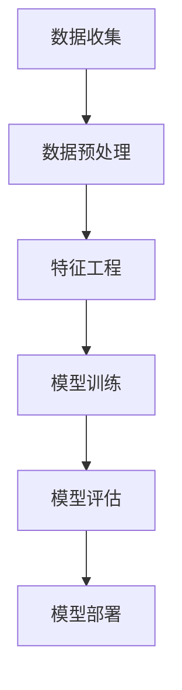

                 

### 文章标题

《AI价格优化系统的应用》

### 关键词

AI价格优化，机器学习，零售行业，电子商务平台，服务业，数据隐私，模型解释性

### 摘要

本文深入探讨了AI价格优化系统的应用，从其重要性、基础知识、核心技术、应用实战以及未来展望等方面进行了全面的分析。AI价格优化系统利用机器学习算法对市场数据进行深入分析，以实现商品价格的智能调整，从而提高企业的竞争力。本文将结合实际案例，展示AI价格优化系统在零售行业、电子商务平台和服务业中的应用效果，并对未来发展趋势和面临的挑战进行了预测。

---

### 《AI价格优化系统的应用》目录大纲

#### 第一部分：AI价格优化系统概述

## 1.1 AI价格优化系统的重要性

### 1.1.1 AI价格优化系统在现代市场中的应用

### 1.1.2 AI价格优化系统对商业策略的影响

## 1.2 AI价格优化系统的基础知识

### 1.2.1 什么是AI价格优化系统

### 1.2.2 AI价格优化系统的工作原理

### 1.2.3 AI价格优化系统的核心组成部分

## 1.3 AI价格优化系统的应用场景

### 1.3.1 零售行业的AI价格优化

### 1.3.2 电子商务平台的AI价格优化

### 1.3.3 服务业的AI价格优化

## 1.4 AI价格优化系统的挑战与未来发展趋势

### 1.4.1 AI价格优化系统面临的挑战

### 1.4.2 AI价格优化系统的未来发展趋势

#### 第二部分：AI价格优化系统的核心技术

## 2.1 数据收集与处理

### 2.1.1 数据收集的重要性

### 2.1.2 数据预处理的方法与技巧

### 2.1.3 数据集构建

## 2.2 机器学习算法与模型

### 2.2.1 机器学习基础

### 2.2.2 常见机器学习算法

### 2.2.3 模型评估与优化

## 2.3 特征工程

### 2.3.1 特征工程的概念

### 2.3.2 特征提取与选择

### 2.3.3 特征变换

## 2.4 模型训练与部署

### 2.4.1 模型训练流程

### 2.4.2 模型评估与调优

### 2.4.3 模型部署策略

## 2.5 Mermaid流程图



#### 第三部分：AI价格优化系统应用实战

## 3.1 零售行业AI价格优化案例

### 3.1.1 案例背景

### 3.1.2 案例分析

### 3.1.3 实施策略

### 3.1.4 实施效果

## 3.2 电子商务平台AI价格优化案例

### 3.2.1 案例背景

### 3.2.2 案例分析

### 3.2.3 实施策略

### 3.2.4 实施效果

## 3.3 服务业AI价格优化案例

### 3.3.1 案例背景

### 3.3.2 案例分析

### 3.3.3 实施策略

### 3.3.4 实施效果

#### 第四部分：AI价格优化系统的未来展望

## 4.1 AI价格优化系统的发展趋势

### 4.1.1 技术趋势

### 4.1.2 行业趋势

### 4.1.3 未来应用前景

## 4.2 AI价格优化系统的挑战与解决方案

### 4.2.1 数据隐私与安全

### 4.2.2 模型解释性与透明度

### 4.2.3 解决方案与创新

#### 附录

## 附录A：常用工具与资源

### A.1 Python价格优化库

### A.2 数据集来源

### A.3 学习资源

## 附录B：数学公式与模型伪代码

### B.1 数学公式

$$
y = \sum_{i=1}^{n} w_i * x_i
$$

### B.2 模型伪代码

```python
# 数据预处理
data <- preprocess_data(data)

# 特征提取
features <- extract_features(data)

# 模型训练
model <- train_model(features, labels)

# 模型评估
evaluate_model(model, test_data)
```

## 附录C：项目实战

### C.1 实战一：零售行业AI价格优化系统搭建

### C.2 实战二：电子商务平台AI价格优化策略实施

### C.3 实战三：服务业AI价格优化案例解析

---

**作者：AI天才研究院/AI Genius Institute & 禅与计算机程序设计艺术 /Zen And The Art of Computer Programming**

