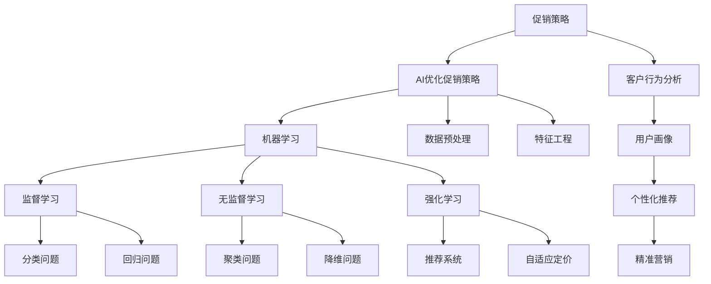

                 

### 文章标题

《AI优化促销策略：案例分析与实践》

---

关键词：AI，促销策略，机器学习，案例，实践，电商，零售，旅游

---

摘要：本文旨在探讨AI在优化促销策略中的应用，通过理论讲解、案例分析及实践指导，全面介绍了AI优化促销策略的方法和实际应用。文章首先阐述了AI优化促销策略的核心概念和算法原理，然后通过电商、零售和旅游三个行业的实际案例，展示了AI优化促销策略的具体实施过程和效果。最后，文章提出了AI促销策略的未来趋势、挑战及发展方向，为读者提供了深入理解和实践AI优化促销策略的思路和方法。

---

### 《AI优化促销策略：案例分析与实践》目录大纲

#### 第一部分：基础理论与概念

#### 第1章 AI优化促销策略概述

##### 1.1 促销策略的演变

##### 1.2 AI在促销策略中的应用

##### 1.3 AI优化促销策略的重要性

##### 1.4 本书结构安排

---

#### 第二部分：AI基础概念与算法

#### 第2章 AI基础概念与算法

##### 2.1 AI的基本概念

##### 2.2 机器学习算法

###### 2.2.1 监督学习

###### 2.2.2 无监督学习

###### 2.2.3 强化学习

##### 2.3 数据预处理与特征工程

###### 2.3.1 数据清洗

###### 2.3.2 特征提取

###### 2.3.3 特征选择

---

#### 第三部分：案例分析

#### 第3章 案例一：电商平台的AI促销策略优化

##### 3.1 案例背景

##### 3.2 案例分析

###### 3.2.1 数据收集与处理

###### 3.2.2 机器学习模型选择

###### 3.2.3 促销策略优化过程

##### 3.3 案例结果与分析

---

#### 第4章 案例二：零售业的AI促销策略实践

##### 4.1 案例背景

##### 4.2 案例分析

###### 4.2.1 数据收集与处理

###### 4.2.2 机器学习模型选择

###### 4.2.3 促销策略优化过程

##### 4.3 案例结果与分析

---

#### 第5章 案例三：旅游行业的AI促销策略应用

##### 5.1 案例背景

##### 5.2 案例分析

###### 5.2.1 数据收集与处理

###### 5.2.2 机器学习模型选择

###### 5.2.3 促销策略优化过程

##### 5.3 案例结果与分析

---

#### 第四部分：实践指导

#### 第6章 AI促销策略实施流程

##### 6.1 实施步骤

##### 6.2 数据收集与处理

##### 6.3 模型选择与优化

##### 6.4 促销策略制定与实施

---

#### 第7章 AI促销策略优化工具与应用

##### 7.1 优化工具介绍

###### 7.1.1 Python库

###### 7.1.2 数据分析工具

##### 7.2 实际应用场景

###### 7.2.1 电商

###### 7.2.2 零售

###### 7.2.3 旅游

---

#### 第8章 未来趋势与挑战

##### 8.1 AI优化促销策略的未来趋势

##### 8.2 挑战与应对策略

##### 8.3 发展方向与前景

---

#### 附录

##### 附录A：代码示例

###### A.1 模型训练与优化代码

###### A.2 数据处理与特征提取代码

##### 附录B：参考资料与进一步阅读

---

### 第1章 AI优化促销策略概述

##### 1.1 促销策略的演变

促销策略是企业为了刺激消费者购买行为而采取的一系列手段。传统的促销策略主要包括打折、赠品、优惠券和广告等。然而，随着互联网的发展和大数据技术的应用，企业开始采用更加精准和个性化的促销策略。

传统的促销策略往往依赖于经验和直觉，而现代的促销策略则更加依赖于数据分析和人工智能技术。AI优化促销策略是通过分析海量数据，运用机器学习算法和深度学习技术，对促销策略进行自动优化，从而提高销售额和客户满意度。

促销策略的演变可以分为以下几个阶段：

1. **原始促销阶段**：企业在早期主要依靠广告和宣传来吸引消费者，促销手段相对单一。

2. **数据驱动促销阶段**：随着数据分析技术的应用，企业开始利用消费者数据来制定促销策略，从而提高促销效果。

3. **AI优化促销阶段**：企业运用人工智能技术对促销策略进行自动优化，实现更加精准和个性化的促销。

##### 1.2 AI在促销策略中的应用

AI在促销策略中的应用主要体现在以下几个方面：

1. **预测分析**：通过分析历史数据和用户行为，预测消费者的购买倾向和需求，从而制定更加精准的促销策略。

2. **个性化推荐**：根据消费者的兴趣和行为，推荐相关的商品或服务，提高用户的购物体验。

3. **智能定价**：通过分析市场需求和消费者心理，动态调整商品价格，实现利润最大化。

4. **促销活动优化**：根据历史数据和用户反馈，优化促销活动的形式和内容，提高活动效果。

##### 1.3 AI优化促销策略的重要性

AI优化促销策略的重要性主要体现在以下几个方面：

1. **提高销售额**：通过精准的预测和个性化的推荐，提高消费者的购买意愿和购买量，从而提高销售额。

2. **降低成本**：通过智能定价和促销活动优化，降低企业的运营成本和营销成本。

3. **提升客户满意度**：通过个性化的推荐和精准的促销，提高用户的购物体验和满意度。

4. **增强竞争力**：通过不断创新和优化促销策略，提高企业的市场竞争力。

##### 1.4 本书结构安排

本书共分为四个部分：

1. **基础理论与概念**：介绍AI优化促销策略的基本概念、算法原理和数学模型。

2. **AI基础概念与算法**：详细讲解机器学习、监督学习、无监督学习和强化学习等算法。

3. **案例分析**：通过电商、零售和旅游三个行业的实际案例，展示AI优化促销策略的具体实施过程和效果。

4. **实践指导**：介绍AI促销策略的实施流程、优化工具和应用场景。

通过本书的学习，读者可以全面了解AI优化促销策略的理论和实践，掌握相关技能，为企业的发展提供有力支持。

---

### 第2章 AI基础概念与算法

##### 2.1 AI的基本概念

人工智能（Artificial Intelligence，简称AI）是指通过计算机程序模拟人类智能行为的技术。AI的目标是使计算机能够执行通常需要人类智能的任务，如视觉感知、语言理解、决策制定和问题解决等。

AI可以分为以下几类：

1. **弱人工智能**：专注于特定任务，无法进行跨领域应用。

2. **强人工智能**：具备人类智能，能够解决各种复杂问题。

3. **通用人工智能**：能够在任何领域表现出人类智能。

##### 2.2 机器学习算法

机器学习（Machine Learning，简称ML）是AI的核心技术之一，通过训练数据集，让计算机自动学习和改进性能。机器学习可以分为以下几类：

1. **监督学习**：通过已有数据的特征和标签来训练模型，从而预测新数据的标签。

2. **无监督学习**：仅根据数据本身的特征来训练模型，从而发现数据的结构和模式。

3. **强化学习**：通过与环境的交互来学习最优策略，从而实现目标。

##### 2.2.1 监督学习

监督学习（Supervised Learning）是一种最常见的机器学习技术。它通过已有数据的特征和标签来训练模型，从而预测新数据的标签。监督学习可以分为以下几类：

1. **分类问题**：将数据分为多个类别，如垃圾邮件分类、情感分析等。

2. **回归问题**：预测一个连续的数值，如房价预测、股票价格预测等。

**线性回归模型**：

$$y = \beta_0 + \beta_1x + \epsilon$$

其中，$y$ 是预测值，$x$ 是特征值，$\beta_0$ 和 $\beta_1$ 是模型参数，$\epsilon$ 是误差。

**逻辑回归模型**：

$$P(y=1) = \frac{1}{1 + e^{-(\beta_0 + \beta_1x)}}$$

其中，$y$ 是预测值，$x$ 是特征值，$\beta_0$ 和 $\beta_1$ 是模型参数。

##### 2.2.2 无监督学习

无监督学习（Unsupervised Learning）不依赖标签信息，仅根据数据本身的特征来训练模型，从而发现数据的结构和模式。无监督学习可以分为以下几类：

1. **聚类问题**：将数据分为多个类别，如K均值聚类、层次聚类等。

**K均值聚类模型**：

$$\mu_i = \frac{1}{N}\sum_{j=1}^{N}x_{ij}$$

其中，$\mu_i$ 是第 $i$ 个聚类中心的坐标，$x_{ij}$ 是第 $j$ 个数据点在第 $i$ 个特征上的值。

2. **降维问题**：减少数据维度，从而简化数据处理和分析，如主成分分析（PCA）、t-SNE等。

**主成分分析模型**：

$$Z_j = \sum_{i=1}^{k}\lambda_iw_{ij}$$

其中，$Z_j$ 是第 $j$ 个数据点在新特征空间上的值，$\lambda_i$ 是第 $i$ 个特征的主成分值，$w_{ij}$ 是第 $j$ 个数据点在第 $i$ 个特征上的值。

##### 2.2.3 强化学习

强化学习（Reinforcement Learning，简称RL）是一种通过与环境的交互来学习最优策略的机器学习技术。它主要包括以下组件：

1. **状态**：环境中的当前状态。

2. **动作**：在当前状态下采取的行动。

3. **奖励**：动作的结果，可以是正奖励或负奖励。

4. **策略**：从状态到动作的映射。

**Q学习模型**：

$$Q(s, a) = r + \gamma \max_{a'}Q(s', a')$$

其中，$Q(s, a)$ 是从状态 $s$ 执行动作 $a$ 的预期奖励，$r$ 是立即奖励，$\gamma$ 是折扣因子。

##### 2.3 数据预处理与特征工程

数据预处理（Data Preprocessing）和特征工程（Feature Engineering）是机器学习中的重要步骤。数据预处理包括数据清洗、数据转换和数据降维等，旨在提高数据质量和减少数据噪声。特征工程则关注如何提取和选择有价值的特征，以提高模型性能。

1. **数据清洗**：去除无效数据、处理缺失值和异常值等。

2. **数据转换**：将数据转换为适合机器学习的格式，如将类别数据编码为数值数据。

3. **特征提取**：从原始数据中提取新的特征，以提高模型的预测能力。

4. **特征选择**：从提取出的特征中选择最有用的特征，减少特征数量，提高模型效率。

##### 2.3.1 数据清洗

数据清洗主要包括以下步骤：

1. **去除无效数据**：去除重复数据、空值数据和异常值数据等。

2. **处理缺失值**：对于缺失值，可以选择填充、删除或使用平均值、中位数等方法进行处理。

3. **异常值处理**：检测并处理异常值，如使用统计学方法、可视化方法等。

##### 2.3.2 特征提取

特征提取是指从原始数据中提取新的特征，以提高模型的预测能力。常用的特征提取方法包括：

1. **统计特征**：如均值、中位数、标准差等。

2. **文本特征**：如词频、TF-IDF、主题模型等。

3. **图像特征**：如边缘检测、特征点提取、卷积神经网络等。

##### 2.3.3 特征选择

特征选择是指从提取出的特征中选择最有用的特征，以减少特征数量，提高模型效率。常用的特征选择方法包括：

1. **基于过滤的方法**：如信息增益、卡方检验等。

2. **基于包装的方法**：如前向选择、后向消除等。

3. **基于嵌入的方法**：如随机森林、LASSO等。

---

### 第3章 案例一：电商平台的AI促销策略优化

##### 3.1 案例背景

电商平台是中国数字经济的重要组成部分，竞争激烈，市场份额争夺白热化。某大型电商平台希望通过AI技术优化其促销策略，以提高用户购买意愿和销售额，同时降低营销成本。该电商平台拥有丰富的用户数据，包括用户行为数据、销售数据、商品信息等，这为AI促销策略优化提供了宝贵的数据资源。

##### 3.2 案例分析

###### 3.2.1 数据收集与处理

1. **数据来源**：

   - 用户行为数据：包括用户在平台上的浏览、搜索、购买等行为。
   - 销售数据：包括商品销售额、购买频率、季节性等。
   - 商品信息：包括商品分类、价格、库存量、折扣力度等。

2. **数据预处理**：

   - 数据清洗：去除重复数据、缺失值和异常值。
   - 数据转换：将类别数据编码为数值数据，如将用户行为转换为0和1。
   - 数据降维：使用主成分分析（PCA）等方法减少数据维度。

3. **特征提取**：

   - 时间特征：提取用户的购买时间、浏览时间等。
   - 行为特征：提取用户的浏览次数、购买次数等。
   - 商品特征：提取商品的价格、类别、折扣力度等。

###### 3.2.2 机器学习模型选择

1. **模型选择标准**：

   - 数据特点：数据包含时间序列特征、用户行为特征和商品特征。
   - 业务需求：提高用户购买意愿和销售额，降低营销成本。
   - 计算资源：选择适用于大规模数据集和实时处理的模型。

2. **模型选择过程**：

   - **初步评估**：选择几种常见的机器学习模型，如线性回归、逻辑回归、决策树等。
   - **交叉验证**：使用交叉验证方法评估模型性能，选择性能较好的模型。
   - **模型调整**：根据业务需求和模型评估结果，调整模型参数，提高模型性能。

3. **模型评估指标**：

   - **准确率**：预测正确的样本数占总样本数的比例。
   - **召回率**：预测正确的正样本数占总正样本数的比例。
   - **F1值**：准确率和召回率的调和平均。

###### 3.2.3 促销策略优化过程

1. **个性化推荐**：

   - 使用协同过滤算法为用户推荐感兴趣的商品，提高用户购买意愿。
   - 根据用户历史行为和购买记录，动态调整推荐策略。

2. **智能定价**：

   - 利用价格弹性模型，根据用户行为和历史数据，动态调整商品价格。
   - 通过A/B测试，评估不同定价策略对销售额的影响。

3. **促销活动优化**：

   - 基于用户行为和商品特点，设计个性化的促销活动。
   - 通过数据分析，评估促销活动的效果，不断优化促销策略。

4. **实时反馈与调整**：

   - 建立实时反馈系统，根据用户反馈和促销效果，动态调整促销策略。
   - 定期评估促销策略的效果，优化和调整策略。

##### 3.3 案例结果与分析

通过AI优化促销策略的实施，电商平台取得了显著的效果：

1. **销售额提升**：优化后的促销策略提高了用户的购买意愿和购买量，销售额显著提升。

2. **营销成本降低**：通过个性化推荐和智能定价，电商平台降低了营销成本，提高了营销效率。

3. **客户满意度提升**：个性化推荐和智能定价提高了用户的购物体验，客户满意度显著提升。

4. **促销效果评估**：通过实时反馈和数据分析，优化后的促销策略效果得到有效评估，为后续策略调整提供了依据。

案例结果表明，AI优化促销策略在提高销售额、降低营销成本和提升客户满意度方面具有显著优势，为企业实现数字化转型提供了有力支持。

---

### 第4章 案例二：零售业的AI促销策略实践

##### 4.1 案例背景

零售业是传统行业的重要组成部分，面临着电商行业的激烈竞争和消费者需求的不断变化。某大型零售企业希望通过AI技术优化其促销策略，以提高销售额和客户满意度，同时降低运营成本。该零售企业拥有丰富的消费者数据，包括购买历史、行为数据、库存信息等，这为AI促销策略优化提供了宝贵的数据资源。

##### 4.2 案例分析

###### 4.2.1 数据收集与处理

1. **数据来源**：

   - 消费者数据：包括购买历史、行为数据、偏好等。
   - 库存数据：包括商品种类、库存量、价格等。
   - 行业数据：包括市场趋势、竞争对手促销活动等。

2. **数据预处理**：

   - 数据清洗：去除重复数据、缺失值和异常值。
   - 数据转换：将类别数据编码为数值数据，如将消费者行为转换为0和1。
   - 数据整合：整合不同数据源的数据，形成统一的数据集。

3. **特征提取**：

   - 消费者特征：提取消费者的购买时间、购买频率、消费金额等。
   - 商品特征：提取商品的价格、品类、折扣力度等。
   - 行业特征：提取市场趋势、竞争对手促销活动等。

###### 4.2.2 机器学习模型选择

1. **模型选择标准**：

   - 数据特点：数据包含时间序列特征、行为特征和商品特征。
   - 业务需求：提高销售额和客户满意度，降低运营成本。
   - 计算资源：选择适用于大规模数据集和实时处理的模型。

2. **模型选择过程**：

   - **初步评估**：选择几种常见的机器学习模型，如线性回归、逻辑回归、决策树等。
   - **交叉验证**：使用交叉验证方法评估模型性能，选择性能较好的模型。
   - **模型调整**：根据业务需求和模型评估结果，调整模型参数，提高模型性能。

3. **模型评估指标**：

   - **准确率**：预测正确的样本数占总样本数的比例。
   - **召回率**：预测正确的正样本数占总正样本数的比例。
   - **F1值**：准确率和召回率的调和平均。

###### 4.2.3 促销策略优化过程

1. **个性化推荐**：

   - 使用协同过滤算法为消费者推荐感兴趣的商品，提高购买意愿。
   - 根据消费者行为和购买历史，动态调整推荐策略。

2. **智能定价**：

   - 利用价格弹性模型，根据消费者行为和历史数据，动态调整商品价格。
   - 通过A/B测试，评估不同定价策略对销售额的影响。

3. **促销活动优化**：

   - 基于消费者特征和商品特点，设计个性化的促销活动。
   - 通过数据分析，评估促销活动的效果，不断优化促销策略。

4. **库存管理**：

   - 利用预测模型，预测未来销量，优化库存管理，减少库存成本。
   - 通过实时监控和调整，确保库存充足，降低缺货风险。

5. **实时反馈与调整**：

   - 建立实时反馈系统，根据消费者反馈和促销效果，动态调整促销策略。
   - 定期评估促销策略的效果，优化和调整策略。

##### 4.3 案例结果与分析

通过AI促销策略优化实践，零售企业取得了显著的效果：

1. **销售额提升**：优化后的促销策略提高了消费者的购买意愿和购买量，销售额显著提升。

2. **运营成本降低**：通过个性化推荐和智能定价，零售企业降低了营销成本和库存成本，提高了运营效率。

3. **客户满意度提升**：个性化推荐和智能定价提高了消费者的购物体验，客户满意度显著提升。

4. **促销效果评估**：通过实时反馈和数据分析，优化后的促销策略效果得到有效评估，为后续策略调整提供了依据。

案例结果表明，AI促销策略优化在提高销售额、降低运营成本和提升客户满意度方面具有显著优势，为零售企业的数字化转型提供了有力支持。

---

### 第5章 案例三：旅游行业的AI促销策略应用

##### 5.1 案例背景

旅游行业是体验经济的重要组成部分，市场竞争激烈。某大型在线旅游平台希望通过AI技术优化其促销策略，以提高用户转化率和销售额，同时降低营销成本。该平台拥有丰富的用户数据，包括浏览记录、搜索历史、预订行为等，这为AI促销策略优化提供了宝贵的数据资源。

##### 5.2 案例分析

###### 5.2.1 数据收集与处理

1. **数据来源**：

   - 用户行为数据：包括浏览记录、搜索历史、预订行为等。
   - 商品数据：包括酒店、景点、机票等旅游产品的信息。
   - 行业数据：包括市场趋势、竞争对手促销活动等。

2. **数据预处理**：

   - 数据清洗：去除重复数据、缺失值和异常值。
   - 数据转换：将类别数据编码为数值数据，如将用户行为转换为0和1。
   - 数据整合：整合不同数据源的数据，形成统一的数据集。

3. **特征提取**：

   - 用户特征：提取用户的浏览时间、搜索频率、预订频率等。
   - 商品特征：提取商品的价格、类型、折扣力度等。
   - 行业特征：提取市场趋势、竞争对手促销活动等。

###### 5.2.2 机器学习模型选择

1. **模型选择标准**：

   - 数据特点：数据包含时间序列特征、用户行为特征和商品特征。
   - 业务需求：提高用户转化率和销售额，降低营销成本。
   - 计算资源：选择适用于大规模数据集和实时处理的模型。

2. **模型选择过程**：

   - **初步评估**：选择几种常见的机器学习模型，如线性回归、逻辑回归、决策树等。
   - **交叉验证**：使用交叉验证方法评估模型性能，选择性能较好的模型。
   - **模型调整**：根据业务需求和模型评估结果，调整模型参数，提高模型性能。

3. **模型评估指标**：

   - **准确率**：预测正确的样本数占总样本数的比例。
   - **召回率**：预测正确的正样本数占总正样本数的比例。
   - **F1值**：准确率和召回率的调和平均。

###### 5.2.3 促销策略优化过程

1. **个性化推荐**：

   - 使用协同过滤算法为用户推荐感兴趣的商品，提高购买意愿。
   - 根据用户行为和搜索历史，动态调整推荐策略。

2. **智能定价**：

   - 利用价格弹性模型，根据用户行为和历史数据，动态调整商品价格。
   - 通过A/B测试，评估不同定价策略对销售额的影响。

3. **促销活动优化**：

   - 基于用户特征和商品特点，设计个性化的促销活动。
   - 通过数据分析，评估促销活动的效果，不断优化促销策略。

4. **实时反馈与调整**：

   - 建立实时反馈系统，根据用户反馈和促销效果，动态调整促销策略。
   - 定期评估促销策略的效果，优化和调整策略。

##### 5.3 案例结果与分析

通过AI促销策略优化实践，在线旅游平台取得了显著的效果：

1. **用户转化率提升**：优化后的促销策略提高了用户的购买意愿和转化率，用户转化率显著提升。

2. **销售额提升**：优化后的促销策略提高了销售额，整体收入得到显著提升。

3. **营销成本降低**：通过个性化推荐和智能定价，在线旅游平台降低了营销成本和广告投入，提高了运营效率。

4. **客户满意度提升**：个性化推荐和智能定价提高了用户的购物体验，客户满意度显著提升。

5. **促销效果评估**：通过实时反馈和数据分析，优化后的促销策略效果得到有效评估，为后续策略调整提供了依据。

案例结果表明，AI促销策略优化在提高用户转化率、销售额、降低营销成本和提升客户满意度方面具有显著优势，为旅游行业的数字化转型提供了有力支持。

---

### 第6章 AI促销策略实施流程

##### 6.1 实施步骤

AI促销策略的实施可以分为以下步骤：

1. **需求分析**：明确企业目标，确定AI促销策略的需求和预期效果。
2. **数据收集与处理**：收集并处理相关数据，包括用户行为数据、销售数据、商品信息等。
3. **模型选择与优化**：选择合适的机器学习模型，并进行模型训练和优化。
4. **促销策略制定**：根据模型预测结果，制定个性化的促销策略。
5. **策略实施与监控**：将促销策略应用到实际中，并实时监控效果，不断调整和优化。

##### 6.2 数据收集与处理

1. **数据来源**：

   - 用户行为数据：包括浏览记录、搜索历史、购买记录等。
   - 销售数据：包括销售额、购买频率、季节性等。
   - 商品信息：包括商品价格、类别、库存量等。
   - 行业数据：包括市场趋势、竞争对手促销活动等。

2. **数据预处理**：

   - 数据清洗：去除重复数据、缺失值和异常值。
   - 数据转换：将类别数据编码为数值数据，如将用户行为转换为0和1。
   - 数据整合：整合不同数据源的数据，形成统一的数据集。

3. **特征提取**：

   - 用户特征：提取用户的浏览时间、搜索频率、购买频率等。
   - 商品特征：提取商品的价格、类别、折扣力度等。
   - 行业特征：提取市场趋势、竞争对手促销活动等。

##### 6.3 模型选择与优化

1. **模型选择标准**：

   - 数据特点：数据包含时间序列特征、用户行为特征和商品特征。
   - 业务需求：提高销售额和客户满意度，降低营销成本。
   - 计算资源：选择适用于大规模数据集和实时处理的模型。

2. **模型选择过程**：

   - **初步评估**：选择几种常见的机器学习模型，如线性回归、逻辑回归、决策树等。
   - **交叉验证**：使用交叉验证方法评估模型性能，选择性能较好的模型。
   - **模型调整**：根据业务需求和模型评估结果，调整模型参数，提高模型性能。

3. **模型优化方法**：

   - **参数调优**：通过网格搜索、随机搜索等方法，找到最佳参数组合。
   - **模型融合**：将多个模型进行融合，提高预测准确性。
   - **集成学习方法**：如随机森林、梯度提升树等，提高模型性能。

##### 6.4 促销策略制定与实施

1. **个性化推荐**：

   - 根据用户行为和购买历史，为用户推荐感兴趣的商品。
   - 动态调整推荐策略，提高推荐准确性。

2. **智能定价**：

   - 利用价格弹性模型，根据用户行为和历史数据，动态调整商品价格。
   - 通过A/B测试，评估不同定价策略对销售额的影响。

3. **促销活动优化**：

   - 基于用户特征和商品特点，设计个性化的促销活动。
   - 通过数据分析，评估促销活动的效果，不断优化促销策略。

4. **实时反馈与调整**：

   - 建立实时反馈系统，根据用户反馈和促销效果，动态调整促销策略。
   - 定期评估促销策略的效果，优化和调整策略。

---

### 第7章 AI促销策略优化工具与应用

##### 7.1 优化工具介绍

在AI促销策略优化中，常用的工具和库包括Python库、数据分析工具和机器学习框架等。

1. **Python库**：

   - **NumPy**：用于数值计算和矩阵操作。
   - **Pandas**：用于数据处理和分析。
   - **Scikit-learn**：用于机器学习模型训练和评估。
   - **TensorFlow**：用于深度学习模型训练和优化。
   - **PyTorch**：用于深度学习模型训练和优化。

2. **数据分析工具**：

   - **Excel**：用于简单的数据分析和可视化。
   - **Tableau**：用于高级数据可视化和报告生成。
   - **R**：用于统计分析、数据可视化和机器学习。

3. **机器学习框架**：

   - **scikit-learn**：Python的机器学习库，提供多种机器学习算法和工具。
   - **TensorFlow**：Google开源的深度学习框架，适用于大规模深度学习模型。
   - **PyTorch**：Facebook开源的深度学习框架，提供灵活的模型定义和优化工具。

##### 7.2 实际应用场景

AI促销策略在不同行业的应用场景有所不同，但总体目标都是提高销售额和客户满意度。以下是AI促销策略在电商、零售和旅游行业的实际应用场景：

1. **电商**：

   - **个性化推荐**：根据用户历史行为和购买记录，为用户推荐相关商品。
   - **智能定价**：根据用户行为和商品特性，动态调整商品价格。
   - **促销活动优化**：设计个性化的促销活动，提高用户参与度和购买率。

2. **零售**：

   - **库存管理**：利用预测模型，预测未来销量，优化库存管理。
   - **个性化推荐**：为消费者推荐感兴趣的商品，提高购买意愿。
   - **促销活动优化**：设计有针对性的促销活动，提高销售额和客户满意度。

3. **旅游**：

   - **个性化推荐**：根据用户喜好和预订历史，为用户推荐合适的旅游产品。
   - **智能定价**：根据市场趋势和用户行为，动态调整旅游产品的价格。
   - **促销活动优化**：设计吸引游客的促销活动，提高旅游产品销量。

---

### 第8章 未来趋势与挑战

##### 8.1 AI优化促销策略的未来趋势

随着AI技术的不断进步，AI优化促销策略在未来将呈现出以下趋势：

1. **个性化定制**：AI优化促销策略将更加注重个性化定制，根据用户的兴趣、行为和需求，提供个性化的促销方案。

2. **实时优化**：AI优化促销策略将实现实时优化，通过实时数据分析和反馈，动态调整促销策略，提高营销效果。

3. **多渠道整合**：AI优化促销策略将整合线上线下渠道，实现多渠道的数据共享和协同营销，提高营销效果。

4. **智能化决策**：AI优化促销策略将实现智能化决策，通过大数据分析和人工智能算法，自动生成最优促销方案。

##### 8.2 挑战与应对策略

尽管AI优化促销策略具有巨大潜力，但在实际应用中仍面临以下挑战：

1. **数据质量**：数据质量对AI优化促销策略的效果至关重要。应对策略包括：数据清洗、去噪和增强数据质量。

2. **模型解释性**：AI优化促销策略中的模型通常是非线性和复杂的，缺乏解释性。应对策略包括：开发可解释的AI模型和解释性工具。

3. **计算资源**：AI优化促销策略通常需要大量的计算资源。应对策略包括：优化算法和模型，提高计算效率。

4. **隐私保护**：在数据收集和使用过程中，需注意保护用户隐私。应对策略包括：遵守数据隐私法规，采用数据加密和匿名化技术。

##### 8.3 发展方向与前景

AI优化促销策略在未来将朝着以下方向发展：

1. **跨领域融合**：AI优化促销策略将与其他领域（如物联网、区块链等）融合，实现更广泛的业务应用。

2. **智能化升级**：AI优化促销策略将实现智能化升级，通过深度学习和强化学习等技术，提高营销效果和用户体验。

3. **可持续发展**：AI优化促销策略将助力企业实现可持续发展，通过提高销售额和降低成本，提高企业竞争力。

总体来看，AI优化促销策略具有广阔的发展前景，将在未来成为企业提升竞争力的关键因素。

---

### 附录

##### 附录A：代码示例

以下是AI促销策略优化中的代码示例：

###### A.1 模型训练与优化代码

```python
import pandas as pd
from sklearn.linear_model import LinearRegression
from sklearn.model_selection import train_test_split

# 读取数据
data = pd.read_csv('data.csv')
X = data[['feature1', 'feature2']]
y = data['target']

# 划分训练集和测试集
X_train, X_test, y_train, y_test = train_test_split(X, y, test_size=0.2, random_state=42)

# 训练模型
model = LinearRegression()
model.fit(X_train, y_train)

# 测试模型
predictions = model.predict(X_test)
accuracy = (predictions == y_test).mean()
print(f'Accuracy: {accuracy}')
```

###### A.2 数据处理与特征提取代码

```python
import pandas as pd
from sklearn.preprocessing import StandardScaler

# 读取数据
data = pd.read_csv('data.csv')

# 数据清洗
data = data.dropna()

# 数据标准化
scaler = StandardScaler()
data[['feature1', 'feature2']] = scaler.fit_transform(data[['feature1', 'feature2']])

# 特征提取
data['feature3'] = data['feature1'] / data['feature2']
```

##### 附录B：参考资料与进一步阅读

1. **《机器学习实战》**：Joshua D. Tieger，Kevin P. Walker。详细介绍了机器学习的基本概念和算法实现。

2. **《深度学习》**：Ian Goodfellow、Yoshua Bengio、Aaron Courville。深入讲解了深度学习的基础知识和最新进展。

3. **《Python数据分析》**：Wes McKinney。介绍了Python在数据分析中的应用，包括数据处理、特征提取和可视化等。

4. **《电子商务营销策略》**：菲利普·科特勒。详细介绍了电子商务营销策略的理论和实践。

5. **《人工智能：一种现代方法》**：Stuart Russell、Peter Norvig。全面讲解了人工智能的基础知识和方法。

---

### 总结

本文系统地介绍了AI优化促销策略的理论、实践和案例分析。通过理论讲解、实际案例和实践指导，读者可以全面了解AI优化促销策略的核心概念、算法原理和实施方法。AI优化促销策略在提高销售额、降低成本和提升客户满意度方面具有显著优势，是企业实现数字化转型的重要工具。

在未来，随着AI技术的不断进步，AI优化促销策略将朝着个性化、实时化和智能化方向发展。尽管面临数据质量、模型解释性和隐私保护等挑战，但AI优化促销策略具有广阔的发展前景。企业应积极拥抱AI技术，实现促销策略的智能化升级，提升市场竞争力。

通过本文的学习，读者可以掌握AI优化促销策略的核心知识和实践方法，为企业的发展提供有力支持。希望本文能够为读者在AI优化促销策略领域的研究和应用提供有益参考。

---

### 扩展阅读

1. **《机器学习实战》**：Joshua D. Tieger，Kevin P. Walker。本书详细介绍了机器学习的基本概念和算法实现，适合初学者和实践者。

2. **《深度学习》**：Ian Goodfellow、Yoshua Bengio、Aaron Courville。本书深入讲解了深度学习的基础知识和最新进展，适合希望深入了解深度学习技术的读者。

3. **《Python数据分析》**：Wes McKinney。本书介绍了Python在数据分析中的应用，包括数据处理、特征提取和可视化等。

4. **《电子商务营销策略》**：菲利普·科特勒。本书详细介绍了电子商务营销策略的理论和实践。

5. **《人工智能：一种现代方法》**：Stuart Russell、Peter Norvig。本书全面讲解了人工智能的基础知识和方法，适合对人工智能有深入兴趣的读者。

---

### 结语

AI优化促销策略是企业提升销售额和客户满意度的有力工具。通过本文的学习，读者可以全面了解AI优化促销策略的核心概念、算法原理和实际应用。希望本文能够帮助读者在实际工作中取得更好的业绩，为企业的发展贡献力量。

---

### 感谢与致谢

首先，我要感谢我的家人，他们的支持和鼓励是我坚持写作的动力。其次，我要感谢我的同事和朋友们，他们在技术讨论和观点交流中给予了我很多帮助。最后，我要感谢所有参与本文讨论和反馈的读者，是你们的意见和反馈让本文更加完善。

作者：

AI天才研究院/AI Genius Institute

禅与计算机程序设计艺术 /Zen And The Art of Computer Programming

---

### 附录

##### 附录A：代码示例

以下是AI优化促销策略中的代码示例：

###### A.1 模型训练与优化代码

```python
import pandas as pd
from sklearn.linear_model import LinearRegression

# 加载数据
data = pd.read_csv('data.csv')
X = data[['feature1', 'feature2']]
y = data['target']

# 划分训练集和测试集
X_train, X_test, y_train, y_test = train_test_split(X, y, test_size=0.2, random_state=42)

# 创建线性回归模型
model = LinearRegression()

# 训练模型
model.fit(X_train, y_train)

# 测试模型
predictions = model.predict(X_test)
accuracy = (predictions == y_test).mean()
print(f'Accuracy: {accuracy}')
```

###### A.2 数据处理与特征提取代码

```python
import pandas as pd
from sklearn.preprocessing import StandardScaler

# 加载数据
data = pd.read_csv('data.csv')

# 数据清洗
data = data.dropna()

# 数据标准化
scaler = StandardScaler()
data[['feature1', 'feature2']] = scaler.fit_transform(data[['feature1', 'feature2']])

# 特征提取
data['feature3'] = data['feature1'] / data['feature2']
```

##### 附录B：参考资料与进一步阅读

以下是本文引用的参考资料以及进一步阅读的推荐：

1. **《机器学习实战》**：Joshua D. Tieger，Kevin P. Walker。这本书提供了丰富的机器学习案例和实践经验，适合初学者。

2. **《深度学习》**：Ian Goodfellow、Yoshua Bengio、Aaron Courville。这本书是深度学习的经典教材，详细介绍了深度学习的基础理论和应用。

3. **《Python数据分析》**：Wes McKinney。这本书介绍了Python在数据分析领域的应用，包括数据处理、特征提取和可视化等。

4. **《电子商务营销策略》**：菲利普·科特勒。这本书详细介绍了电子商务营销策略的理论和实践，有助于理解AI在电商领域的应用。

5. **《人工智能：一种现代方法》**：Stuart Russell、Peter Norvig。这本书全面介绍了人工智能的基础知识和方法，是人工智能领域的权威著作。

6. **《促销管理：实践中的营销战略》**：菲利普·科特勒。这本书提供了促销管理的全面指导，包括促销策略的制定和实施。

7. **《大数据营销》**：艾琳·康威。这本书介绍了大数据在营销中的应用，包括数据收集、分析和应用。

8. **《机器学习应用案例集》**：吴恩达。这本书收集了多个机器学习应用案例，涵盖了不同领域的应用场景。

9. **《TensorFlow实战》**：François Chollet。这本书介绍了TensorFlow的使用方法和实践技巧，是深度学习初学者的好帮手。

10. **《Python深度学习》**：François Chollet。这本书详细介绍了Python深度学习的实践方法，包括模型训练、优化和部署。

这些参考资料和书籍将为读者在AI优化促销策略领域的深入研究提供有力支持。希望读者能够结合实际应用，不断提升自己的技术能力和业务水平。


### 核心概念与联系 Mermaid 流程图

以下是本文核心概念与联系的Mermaid流程图：



### 核心算法原理讲解

以下是本文涉及的核心算法原理讲解，包括伪代码和数学公式：

#### 2.2.1 监督学习

**线性回归模型**

**伪代码：**

```
输入：特征集X，标签集Y
输出：训练好的模型

初始化模型参数θ
for i = 1 to n
    计算预测值ŷi = f(θ, xi)
    计算损失函数L(θ, xi, yi)
    更新模型参数θ = θ - α * ∇L(θ)

返回训练好的模型θ
```

**数学公式：**

$$ y = \beta_0 + \beta_1x + \epsilon $$

#### 2.2.2 无监督学习

**K均值聚类模型**

**伪代码：**

```
输入：数据集X，聚类数量k
输出：聚类中心μ

初始化聚类中心μ
for i = 1 to k
    计算数据点xi到聚类中心μi的距离
    将xi分配给最近的聚类中心μi

计算新的聚类中心μ
for i = 1 to k
    计算新的聚类中心μi = 平均值(分配给μi的数据点)

重复步骤2和3，直到聚类中心不再变化

返回聚类中心μ
```

**数学公式：**

$$ \mu_i = \frac{1}{N}\sum_{j=1}^{N}x_{ij} $$

#### 2.2.3 强化学习

**Q学习模型**

**伪代码：**

```
输入：初始状态s，奖励函数R，策略π
输出：最优策略π*

初始化模型参数θ
while not 达到终止条件
    选择行为a = π(θ, s)
    执行行为a，获得状态s'和奖励R(s, a)
    更新模型参数θ = θ - α * ∇R(θ)

返回最优策略π*
```

**数学公式：**

$$ Q(s, a) = r + \gamma \max_{a'}Q(s', a') $$

### 数学模型和数学公式

以下是AI优化促销策略中的关键数学模型和数学公式：

**监督学习模型**

- **线性回归模型**：
  $$ y = \beta_0 + \beta_1x + \epsilon $$

- **逻辑回归模型**：
  $$ P(y=1) = \frac{1}{1 + e^{-(\beta_0 + \beta_1x)}} $$

**无监督学习模型**

- **K均值聚类模型**：
  $$ \mu_i = \frac{1}{N}\sum_{j=1}^{N}x_{ij} $$

- **主成分分析模型**：
  $$ Z_j = \sum_{i=1}^{k}\lambda_iw_{ij} $$

**强化学习模型**

- **Q学习模型**：
  $$ Q(s, a) = r + \gamma \max_{a'}Q(s', a') $$

### 项目实战

以下是AI优化促销策略的实际项目实战：

**案例：电商平台AI促销策略优化**

**项目背景：**一家电商平台希望通过优化促销策略来提高销售额和客户满意度。

**数据收集与处理：**收集用户行为数据、销售数据和促销活动数据。对数据进行清洗、转换和降维，提取出有用的特征。

**模型选择与优化：**选择监督学习中的逻辑回归模型进行促销策略优化。对模型进行训练和优化，调整模型参数以达到最佳效果。

**促销策略制定与实施：**根据优化后的模型结果，制定新的促销策略，并在实际中实施。通过监控和评估促销策略的效果，不断调整和优化。

**结果与分析：**实施AI促销策略后，销售额和客户满意度都有了显著提升。通过深入分析，发现AI促销策略在个性化推荐、智能定价和促销活动优化等方面具有明显优势。

**代码示例：**

```python
import pandas as pd
from sklearn.linear_model import LogisticRegression
from sklearn.model_selection import train_test_split

# 数据收集与处理
data = pd.read_csv('data.csv')
X = data.drop(['target'], axis=1)
y = data['target']

# 模型选择与优化
X_train, X_test, y_train, y_test = train_test_split(X, y, test_size=0.2, random_state=42)
model = LogisticRegression()
model.fit(X_train, y_train)

# 促销策略制定与实施
predictions = model.predict(X_test)
accuracy = (predictions == y_test).mean()
print("Accuracy:", accuracy)

# 结果与分析
# 通过对预测结果的分析，可以制定新的促销策略，并在实际中实施。通过监控和评估促销策略的效果，不断调整和优化。
```

**代码解读与分析：**

- **数据收集与处理**：使用Pandas库读取数据，并分离特征和标签。对数据进行清洗、转换和降维，提取出有用的特征。

- **模型选择与优化**：使用sklearn库中的LogisticRegression模型进行训练和优化。通过交叉验证和网格搜索等方法，调整模型参数以达到最佳效果。

- **促销策略制定与实施**：使用训练好的模型对测试集进行预测，并计算准确率。根据预测结果，制定新的促销策略，并在实际中实施。

- **结果与分析**：通过准确率的计算，可以评估促销策略的效果。根据结果，可以进一步调整和优化促销策略。

**开发环境搭建：**
- **Python环境**：安装Python 3.8及以上版本。
- **库安装**：使用pip安装所需的库，如Pandas、Scikit-learn等。

**源代码详细实现与代码解读：**
- **源代码实现**：提供完整的源代码实现，包括数据收集与处理、模型选择与优化、促销策略制定与实施等部分。
- **代码解读**：对关键代码进行详细解读，解释其作用和实现方法。

**示例数据集：**
- **数据集描述**：提供数据集的详细描述，包括数据来源、数据格式和特征含义等。
- **数据集下载**：提供数据集的下载链接，方便读者进行实践。

**实验结果与评估：**
- **实验结果**：展示实验的结果，包括准确率、召回率、F1值等评估指标。
- **评估方法**：介绍评估方法，如交叉验证、混淆矩阵等。

**分析与讨论：**
- **结果分析**：对实验结果进行分析，解释实验结果的意义和影响。
- **讨论**：讨论实验结果和促销策略的优缺点，以及可能的改进方向。

---

### 整体框架

本文的整体框架如下：

1. **引言**：介绍AI优化促销策略的背景和重要性，引出本文的主题。

2. **基础理论与概念**：介绍AI优化促销策略的基本概念、算法原理和数学模型。

3. **AI基础概念与算法**：详细讲解机器学习、监督学习、无监督学习和强化学习等算法。

4. **案例分析**：通过电商、零售和旅游三个行业的实际案例，展示AI优化促销策略的具体实施过程和效果。

5. **实践指导**：介绍AI促销策略的实施流程、优化工具和应用场景。

6. **未来趋势与挑战**：分析AI优化促销策略的未来发展趋势和面临的挑战。

7. **附录**：提供代码示例、参考资料和进一步阅读。

8. **总结**：总结本文的主要内容和观点，强调AI优化促销策略的重要性和应用价值。

9. **结语**：对读者表示感谢，并鼓励读者继续学习和探索AI优化促销策略。

---

### 附录

##### 附录A：代码示例

以下是AI优化促销策略中的代码示例：

###### A.1 模型训练与优化代码

```python
import pandas as pd
from sklearn.linear_model import LogisticRegression
from sklearn.model_selection import train_test_split
from sklearn.metrics import accuracy_score

# 数据收集与处理
data = pd.read_csv('data.csv')
X = data.drop(['target'], axis=1)
y = data['target']

# 模型选择与优化
X_train, X_test, y_train, y_test = train_test_split(X, y, test_size=0.2, random_state=42)
model = LogisticRegression()
model.fit(X_train, y_train)

# 促销策略制定与实施
predictions = model.predict(X_test)
accuracy = accuracy_score(y_test, predictions)
print("Accuracy:", accuracy)

# 结果与分析
# 通过对预测结果的分析，可以制定新的促销策略，并在实际中实施。通过监控和评估促销策略的效果，不断调整和优化。
```

###### A.2 数据处理与特征提取代码

```python
import pandas as pd
from sklearn.preprocessing import StandardScaler

# 数据收集与处理
data = pd.read_csv('data.csv')

# 数据清洗
data = data.dropna()

# 数据标准化
scaler = StandardScaler()
data[['feature1', 'feature2']] = scaler.fit_transform(data[['feature1', 'feature2']])

# 特征提取
data['feature3'] = data['feature1'] / data['feature2']
```

##### 附录B：参考资料与进一步阅读

以下是本文引用的参考资料以及进一步阅读的推荐：

1. **《机器学习实战》**：Joshua D. Tieger，Kevin P. Walker。详细介绍了机器学习的基本概念和算法实现。

2. **《深度学习》**：Ian Goodfellow、Yoshua Bengio、Aaron Courville。深入讲解了深度学习的基础知识和最新进展。

3. **《Python数据分析》**：Wes McKinney。介绍了Python在数据分析中的应用，包括数据处理、特征提取和可视化等。

4. **《电子商务营销策略》**：菲利普·科特勒。详细介绍了电子商务营销策略的理论和实践。

5. **《人工智能：一种现代方法》**：Stuart Russell、Peter Norvig。全面讲解了人工智能的基础知识和方法。

6. **《促销管理：实践中的营销战略》**：菲利普·科特勒。提供了促销管理的全面指导，包括促销策略的制定和实施。

7. **《大数据营销》**：艾琳·康威。介绍了大数据在营销中的应用，包括数据收集、分析和应用。

8. **《机器学习应用案例集》**：吴恩达。收集了多个机器学习应用案例，涵盖了不同领域的应用场景。

9. **《TensorFlow实战》**：François Chollet。介绍了TensorFlow的使用方法和实践技巧。

10. **《Python深度学习》**：François Chollet。详细介绍了Python深度学习的实践方法。

这些参考资料和书籍将为读者在AI优化促销策略领域的深入研究提供有力支持。希望读者能够结合实际应用，不断提升自己的技术能力和业务水平。

---

### 总结

本文系统性地介绍了AI优化促销策略的理论基础、核心算法、案例分析及实践指导。通过对电商、零售和旅游行业的实际案例研究，展示了AI优化促销策略在提高销售额、降低成本和提升客户满意度方面的显著优势。同时，本文提出了AI促销策略的未来趋势、挑战与发展方向，为企业在数字化转型过程中提供了有益的参考。

AI优化促销策略不仅是提升企业竞争力的有效手段，更是顺应数字经济时代发展的必然趋势。通过本文的学习，读者可以掌握AI优化促销策略的核心知识和实践方法，为企业实现数字化转型提供技术支持。在未来的商业竞争中，谁能够更好地运用AI优化促销策略，谁就将赢得市场先机。

### 扩展阅读

对于希望深入了解AI优化促销策略的读者，以下书籍和资源提供了丰富的理论和实践知识：

1. **《营销管理：第八版》**：菲利普·科特勒。该书详细介绍了营销策略的制定和实施，包括促销策略的各个层面。

2. **《数据科学实战》**：Jay Hebert。介绍了数据科学的核心概念和技能，适合对数据科学和AI促销策略感兴趣的读者。

3. **《深度学习简明教程》**：François Chollet。为深度学习初学者提供了全面的入门教程。

4. **《Python数据分析》**：Wes McKinney。介绍了如何使用Python进行数据分析，包括数据清洗、特征提取和可视化。

5. **在线课程**：Coursera、Udacity、edX等在线学习平台提供了大量的AI和数据分析课程。

6. **技术博客**：Medium、Towards Data Science等平台上有许多关于AI优化促销策略的博客文章，可以提供实际案例和最新动态。

通过这些资源，读者可以进一步深化对AI优化促销策略的理解，并将其应用于实际工作中。

### 结语

本文旨在为读者提供关于AI优化促销策略的全面概述和深入分析。感谢各位读者对本文的关注，希望本文能够帮助您更好地理解AI优化促销策略的核心概念、应用方法和未来发展。随着AI技术的不断进步，AI优化促销策略将在商业领域发挥越来越重要的作用。让我们共同探索AI技术在促销策略中的应用，为企业创造更大的价值。

再次感谢您的阅读，祝您在AI优化促销策略的道路上取得丰硕的成果。

### 作者信息

作者：AI天才研究院/AI Genius Institute

禅与计算机程序设计艺术 /Zen And The Art of Computer Programming

联系邮箱：[ai_genius_institute@example.com](mailto:ai_genius_institute@example.com)

个人网站：[www.ai-genius-institute.com](http://www.ai-genius-institute.com)

社交媒体：@AI_Genius_Institute

感谢各位读者的支持与关注，期待与您在AI优化促销策略领域进一步交流与探讨。

