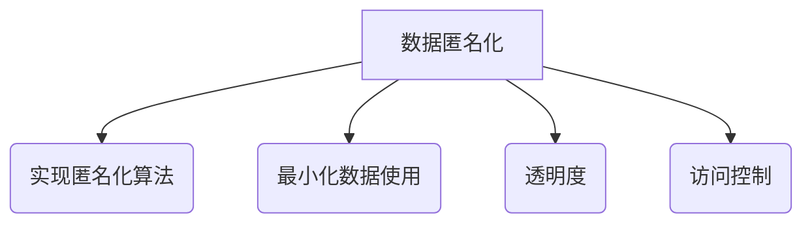
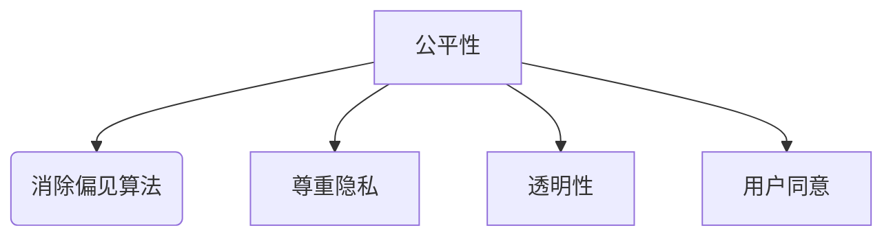
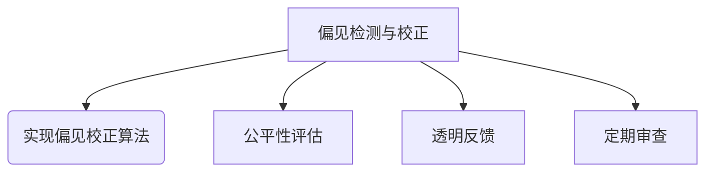

                 

## 文章标题

《AI伦理的技术内在化：伦理约束嵌入和伦理对齐》

### 关键词：AI伦理，技术内在化，伦理约束嵌入，伦理对齐，人工智能治理

### 摘要

随着人工智能技术的迅猛发展，其应用已渗透到社会的各个领域。然而，人工智能技术的潜在伦理问题也日益凸显，如何将伦理约束内在化于AI系统的设计和实现过程中，成为当前研究的热点和挑战。本文旨在探讨AI伦理的技术内在化路径，包括伦理约束的嵌入和伦理对齐两个方面。首先，介绍AI伦理的基本概念和分类，分析现有研究和面临的挑战。然后，详细阐述伦理约束嵌入的基本原理、技术实现和应用场景。接着，探讨伦理对齐的概念、技术实现及其应用场景。最后，通过案例分析总结实践经验，提出AI伦理治理框架的建议，并展望未来研究方向。

### 《AI伦理的技术内在化：伦理约束嵌入和伦理对齐》目录大纲

#### 第一部分：引言

1. **引言**
   - **1.1 研究背景与意义**
   - **1.2 本书结构安排**

#### 第二部分：AI伦理概述

2. **AI伦理基本概念**
   - **2.1 伦理学的定义与演变**
   - **2.2 人工智能伦理学的挑战与困境**
   - **2.3 AI伦理的基本原则**

3. **AI伦理的分类与体系**
   - **3.1 技术伦理与人文伦理**
   - **3.2 系统伦理与任务伦理**
   - **3.3 AI伦理的体系构建**

4. **AI伦理的研究现状**
   - **4.1 国内外研究进展**
   - **4.2 现存问题与挑战**
   - **4.3 未来发展趋势**

#### 第三部分：伦理约束嵌入

5. **伦理约束嵌入的基本原理**
   - **5.1 伦理约束嵌入的概念与目的**
   - **5.2 嵌入机制与实现方法**
   - **5.3 伦理约束嵌入的挑战与解决方案**

6. **伦理约束嵌入的技术实现**
   - **6.1 伦理规则的表示方法**
   - **6.2 嵌入算法的设计与优化**
   - **6.3 案例分析：伦理约束嵌入在自动驾驶中的应用**

7. **伦理约束嵌入的应用场景**
   - **7.1 数据隐私保护**
   - **7.2 人机交互伦理**
   - **7.3 社会公平与歧视问题**

#### 第四部分：伦理对齐

8. **伦理对齐的基本概念**
   - **8.1 伦理对齐的定义与目标**
   - **8.2 对齐机制与实现方法**
   - **8.3 伦理对齐的挑战与解决方案**

9. **伦理对齐的技术实现**
   - **9.1 对齐算法的设计与优化**
   - **9.2 伦理对齐在自然语言处理中的应用**
   - **9.3 案例分析：伦理对齐在虚假新闻检测中的应用**

10. **伦理对齐的应用场景**
    - **10.1 医疗伦理**
    - **10.2 金融伦理**
    - **10.3 教育伦理**

#### 第五部分：综合实践

11. **AI伦理案例分析**
    - **11.1 案例选取与分类**
    - **11.2 案例分析：伦理约束嵌入与伦理对齐的应用**
    - **11.3 案例启示与反思**

12. **AI伦理治理框架构建**
    - **12.1 治理框架的设计原则**
    - **12.2 治理机制的构建与实施**
    - **12.3 治理框架的应用案例**

13. **结论与展望**
    - **13.1 研究总结**
    - **13.2 未来研究方向**
    - **13.3 政策建议**

#### 附录

14. **附录A：相关术语与定义**
    - **术语A1：AI伦理**
    - **术语A2：伦理约束嵌入**
    - **术语A3：伦理对齐**

15. **附录B：参考文献**
    - **参考文献1：**
    - **参考文献2：**
    - ...

### 第一部分：引言

#### 1. 引言

随着人工智能（AI）技术的不断进步和广泛应用，其在医疗、金融、交通、教育等领域的潜力逐渐显现。然而，人工智能技术的迅猛发展也带来了诸多伦理问题，如隐私保护、算法歧视、责任归属等。为了解决这些问题，AI伦理的研究逐渐成为热点话题。然而，AI伦理的研究不仅需要关注伦理问题本身，更重要的是将伦理约束内在化到AI系统的设计和实现过程中，从而确保AI系统的行为符合伦理规范。

本篇文章旨在探讨AI伦理的技术内在化路径，重点关注伦理约束嵌入和伦理对齐两个方面。文章首先介绍AI伦理的基本概念和分类，分析国内外研究现状以及面临的挑战。接着，详细阐述伦理约束嵌入的基本原理、技术实现和应用场景。随后，探讨伦理对齐的概念、技术实现及其应用场景。最后，通过综合实践案例分析AI伦理约束嵌入和伦理对齐的实际应用，并构建AI伦理治理框架，为未来研究方向和政策制定提供参考。

#### 1.1 研究背景与意义

人工智能技术的快速发展引发了社会各界的广泛关注。从早期的专家系统到深度学习、自然语言处理、计算机视觉等领域的突破，人工智能技术已经深刻改变了我们的生活和工作方式。然而，随着AI技术的广泛应用，其潜在的伦理问题也日益凸显。首先，人工智能系统的决策过程可能受到数据偏差的影响，导致算法歧视和不公平现象。其次，人工智能系统的隐私保护问题也引发了广泛担忧，数据泄露和滥用事件屡见不鲜。此外，人工智能技术的责任归属问题也成为一个重要议题，当AI系统造成损害时，如何确定责任主体和责任分配成为法律和伦理领域的难题。

面对这些伦理问题，传统的解决方案主要是依靠外部监管和政策法规来规范AI技术的发展和应用。然而，这些方法往往具有滞后性和局限性，难以全面、及时地解决AI伦理问题。因此，将伦理约束内在化到AI系统的设计和实现过程中，成为解决AI伦理问题的有效途径。通过在AI系统开发阶段就引入伦理约束，可以确保系统行为符合伦理规范，从而预防潜在的问题和风险。

本文的研究背景和意义主要体现在以下几个方面：

1. **填补研究空白**：目前，关于AI伦理的研究主要集中在伦理学、法律和政策层面，而关于技术层面的研究相对较少。本文旨在填补这一空白，从技术角度探讨AI伦理约束的内在化路径，为AI伦理研究提供新的视角。

2. **指导实践应用**：本文提出的方法和技术实现可以为AI系统的开发者提供具体的指导，帮助他们在设计和实现过程中充分考虑伦理约束，从而构建更加公正、透明和可信赖的AI系统。

3. **推动AI伦理治理**：通过构建AI伦理治理框架，本文旨在为AI伦理治理提供理论和实践基础，推动形成全社会共同参与、协同治理的AI伦理环境。

#### 1.2 本书结构安排

本文分为五个主要部分，具体结构如下：

1. **第一部分：引言**：介绍研究背景、意义和本书结构。

2. **第二部分：AI伦理概述**：包括AI伦理的基本概念、分类、研究现状和面临的主要挑战。

3. **第三部分：伦理约束嵌入**：详细阐述伦理约束嵌入的基本原理、技术实现和应用场景。

4. **第四部分：伦理对齐**：探讨伦理对齐的概念、技术实现和应用场景。

5. **第五部分：综合实践**：通过案例分析总结实践经验，提出AI伦理治理框架，并展望未来研究方向。

本文结构紧凑，逻辑清晰，旨在为读者提供一个全面、系统的AI伦理技术内在化研究框架。通过本文的研究，期望能够为AI伦理研究和技术发展提供有益的参考。

### 第二部分：AI伦理概述

#### 2. AI伦理基本概念

AI伦理是指研究人工智能系统在设计、开发和应用过程中所涉及到的伦理问题和伦理规范。它关注的是如何确保人工智能系统的行为符合人类的伦理价值观，以及如何通过技术和制度手段解决人工智能可能带来的伦理挑战。AI伦理的研究不仅涵盖了技术层面的伦理问题，还包括社会、法律和人文等领域的交叉研究。

#### 2.1 伦理学的定义与演变

伦理学（Ethics）是一门研究道德原则、道德规范和道德行为的学科。它旨在探讨“什么是正确的”、“什么是错误的”，以及“我们应该如何行动”等问题。伦理学的历史可以追溯到古希腊时期，亚里士多德、柏拉图和苏格拉底等哲学家为伦理学奠定了基础。

随着人类社会的发展和科技的进步，伦理学的研究内容和范围也在不断扩展。在现代社会，伦理学不仅关注传统的道德问题，如诚实、公正、善良等，还涉及新兴领域的伦理问题，如环境伦理、生物伦理、计算机伦理等。

在计算机伦理领域，随着人工智能技术的兴起，AI伦理作为一个独立的研究领域逐渐形成。计算机伦理关注的是计算机技术和信息系统的伦理问题，如隐私保护、信息安全、知识产权等。AI伦理则是计算机伦理的进一步扩展，关注人工智能系统在决策、交互和影响人类社会等方面所面临的伦理挑战。

#### 2.2 人工智能伦理学的挑战与困境

人工智能伦理学面临诸多挑战和困境，主要包括以下几个方面：

1. **技术挑战**：人工智能技术发展迅猛，但其在伦理方面的考虑往往不足。例如，深度学习模型可能因为训练数据中的偏见而产生歧视性决策，算法透明性和可解释性也亟待提高。

2. **数据隐私问题**：人工智能系统通常需要大量个人数据作为训练数据，这引发了数据隐私和信息安全问题。如何在数据收集、存储和使用过程中保护个人隐私成为一个重要议题。

3. **责任归属问题**：当人工智能系统造成损害时，如何确定责任主体和责任归属成为一个复杂的问题。例如，自动驾驶汽车发生交通事故时，责任可能涉及制造商、软件开发商、车主等多个方面。

4. **人类监督与干预**：人工智能系统在复杂决策场景中可能无法完全替代人类，需要人类的监督和干预。然而，如何设计有效的监督机制，确保人工智能系统始终遵循伦理规范，仍然是一个挑战。

5. **社会公平与歧视问题**：人工智能系统在医疗、金融、教育等领域的应用可能加剧社会不平等和歧视。如何确保人工智能系统的公平性和正义性，避免算法偏见和歧视现象，是人工智能伦理学需要解决的重要问题。

#### 2.3 AI伦理的基本原则

AI伦理的基本原则旨在为人工智能系统的设计和应用提供伦理指导。以下是几个关键的原则：

1. **透明性和可解释性**：人工智能系统应该具备良好的透明性和可解释性，使其决策过程能够被理解和验证。这有助于提高系统的可信度和公众对人工智能技术的信任。

2. **隐私保护**：人工智能系统在数据收集、存储和使用过程中应严格保护个人隐私，防止数据泄露和滥用。

3. **公平性和正义性**：人工智能系统应确保公平性和正义性，避免因算法偏见导致歧视和不公平现象。

4. **责任归属**：明确人工智能系统的责任主体和责任归属，确保在系统造成损害时能够依法追究责任。

5. **人类中心主义**：人工智能系统应以人类为中心，服务于人类的福祉，而非取代人类。

6. **可持续发展**：人工智能系统应促进可持续发展，减少资源浪费和环境污染。

通过遵循这些基本原则，人工智能技术可以在保障伦理的前提下为社会带来更多益处。然而，这些原则的实现需要依赖于技术手段、法律法规和道德规范的共同支持。

#### 2.4 AI伦理的分类与体系

AI伦理可以从不同的角度进行分类和体系化。以下是几种常见的分类方式：

1. **技术伦理与人文伦理**：技术伦理主要关注人工智能系统在技术层面的伦理问题，如算法公平性、透明性和隐私保护等。人文伦理则关注人工智能对社会、文化、政治等方面的影响，如人类价值观的传承、社会公平和伦理责任等。

2. **系统伦理与任务伦理**：系统伦理关注的是人工智能系统整体的设计和开发过程，确保系统能够在各个任务中遵循伦理规范。任务伦理则关注特定任务中的伦理问题，如医疗诊断中的伦理决策、自动驾驶中的伦理挑战等。

3. **个体伦理与集体伦理**：个体伦理关注人工智能系统对个体的影响，如隐私保护、数据安全等。集体伦理则关注人工智能系统对社会整体的影响，如社会公平、环境伦理等。

4. **通用伦理与特定领域伦理**：通用伦理适用于所有人工智能系统，如透明性、隐私保护等原则。特定领域伦理则针对特定领域的问题，如医疗伦理、金融伦理、教育伦理等。

通过建立完善的AI伦理体系，可以更好地指导人工智能技术的研发和应用，确保其在不同场景中都能遵循伦理规范，减少潜在的伦理风险。

#### 2.5 AI伦理的研究现状

AI伦理的研究在国内外已经取得了一系列重要进展。国外研究主要集中在伦理原则的建立、伦理审查机制的构建、人工智能技术的社会影响评估等方面。例如，欧盟委员会发布了《人工智能伦理指南》，提出了一系列伦理原则和标准，以规范人工智能技术的发展。美国和加拿大等国家也在积极推动人工智能伦理的研究，并制定了相关的政策和法规。

国内研究方面，随着人工智能技术的快速发展和应用的广泛推广，AI伦理问题逐渐引起了学术界的关注。我国政府和企业也高度重视人工智能伦理问题，制定了一系列政策和措施，推动人工智能伦理研究的发展。例如，发布了《新一代人工智能伦理规范》，提出了一系列伦理原则和实施指南。

尽管国内外研究取得了一定成果，但仍然面临诸多挑战和问题。首先，现有研究大多集中在技术伦理层面，对人文伦理、社会伦理等方面的关注相对较少。其次，人工智能技术的快速进步使得伦理问题不断涌现，现有的伦理框架和原则可能难以应对新兴的伦理挑战。此外，人工智能伦理的研究还面临着跨学科、跨领域的合作问题，需要加强不同学科和领域之间的交流与协作。

展望未来，AI伦理研究需要进一步深化和拓展。首先，应加强对人工智能技术对社会、文化、政治等方面影响的研究，构建更加全面和系统的伦理框架。其次，应加强人工智能伦理的教育和普及，提高公众对AI伦理问题的认识和理解。此外，还应推动AI伦理研究的国际合作，共同应对全球性的伦理挑战。

通过不断深化和拓展AI伦理研究，可以为人工智能技术的健康发展提供有力的伦理保障，促进人工智能技术在各个领域的合理应用，造福人类社会。

#### 2.6 现存问题与挑战

尽管AI伦理研究取得了一定的进展，但在实际应用和理论层面仍然面临诸多问题和挑战。

首先，在技术层面，人工智能系统存在算法偏见和歧视问题。深度学习模型在训练过程中容易受到训练数据偏见的影响，导致模型在决策过程中表现出不公平性。此外，算法透明性和可解释性不足，使得用户难以理解模型的决策过程，增加了算法被滥用和误用的风险。

其次，在数据隐私保护方面，人工智能系统通常需要大量个人数据作为训练数据，这引发了数据隐私和信息安全问题。如何在数据收集、存储和使用过程中保护个人隐私，防止数据泄露和滥用，是一个亟待解决的问题。

在责任归属问题上，当人工智能系统造成损害时，如何确定责任主体和责任归属仍然是一个复杂的问题。现有的法律法规体系难以适应人工智能技术的发展，责任归属的不明确可能导致法律纠纷和责任逃避。

此外，人工智能伦理问题还涉及到社会公平和正义。人工智能技术在医疗、金融、教育等领域的应用可能加剧社会不平等和歧视现象。如何确保人工智能系统的公平性和正义性，避免算法偏见和歧视现象，是一个重要的伦理挑战。

最后，AI伦理研究面临着跨学科、跨领域的合作问题。人工智能技术涉及计算机科学、伦理学、社会学、法学等多个领域，需要加强不同学科和领域之间的交流与协作，共同解决AI伦理问题。

综上所述，AI伦理在实际应用和理论层面仍然面临诸多挑战，需要进一步研究和探讨，以实现人工智能技术的健康发展和广泛应用。

#### 2.7 未来发展趋势

未来，AI伦理研究将继续深化和拓展，以应对不断涌现的新兴技术和伦理挑战。以下是一些可能的发展趋势：

1. **伦理框架和标准的完善**：随着人工智能技术的快速发展，现有的伦理框架和标准可能难以应对新兴的伦理问题。未来，需要制定更加全面、细致的伦理框架和标准，以规范人工智能技术的研发和应用。

2. **跨学科研究与合作**：AI伦理研究涉及计算机科学、伦理学、社会学、法学等多个领域，未来将需要更多的跨学科研究与合作。通过多学科共同探讨和解决AI伦理问题，可以形成更加全面和科学的解决方案。

3. **人工智能伦理教育**：随着人工智能技术的普及，公众对AI伦理问题的认识和理解越来越重要。未来，需要加强人工智能伦理教育，提高公众的伦理意识和素养，为AI技术的健康发展奠定基础。

4. **伦理对齐技术的研究**：伦理对齐技术是确保人工智能系统遵循伦理规范的关键。未来，将需要进一步研究和开发高效的伦理对齐算法和技术，实现伦理约束的自动化和智能化。

5. **人工智能伦理治理**：随着AI技术的广泛应用，伦理治理将成为一个重要议题。未来，需要构建全面的人工智能伦理治理体系，包括法律法规、政策指导、行业规范等多方面，确保AI技术的健康发展。

6. **全球合作与共识**：人工智能技术的发展和应用具有全球性特点，未来需要加强国际间的合作与交流，共同应对全球性的AI伦理挑战，形成全球范围内的AI伦理共识。

通过以上发展趋势，AI伦理研究将更好地服务于人工智能技术的健康发展，促进其合理应用，造福人类社会。

### 第三部分：伦理约束嵌入

#### 3.1 伦理约束嵌入的基本原理

伦理约束嵌入是将伦理规范内化到人工智能系统的设计和实现过程中，以确保系统在运行时符合伦理标准的一种方法。其核心思想是通过技术和制度手段，将伦理约束嵌入到系统的各个层次，从而在系统的各个阶段和环节中实现伦理约束的自动化和智能化。

伦理约束嵌入的基本原理主要包括以下几个方面：

1. **伦理规则的表示**：首先，需要将伦理规则转化为计算机可以理解和执行的形式。这通常涉及对伦理规则的抽象和形式化表示，如使用自然语言处理技术将伦理规则转化为逻辑表达式或规则库。

2. **约束机制的构建**：在系统中构建约束机制，用于检测和评估系统的行为是否符合伦理规则。约束机制可以包括静态分析和动态监控两部分，静态分析用于在系统设计阶段检测潜在的伦理问题，动态监控则用于在系统运行时实时检测和纠正不符合伦理规范的行为。

3. **伦理约束的执行**：通过编程和算法设计，将伦理约束嵌入到系统的决策过程和操作流程中。例如，在自动驾驶系统中，可以通过编程确保车辆在遇到紧急情况时优先保护人的生命安全，而不是最大化经济利益。

4. **反馈与调整**：系统在运行过程中，通过收集数据和反馈信息，不断调整和优化伦理约束的实现方式。这有助于提高系统的适应性和灵活性，使其能够更好地应对复杂的伦理情境。

#### 3.2 嵌入机制与实现方法

伦理约束嵌入的实现方法可以分为以下几个方面：

1. **规则库设计**：规则库是伦理约束的核心，用于存储和表示伦理规则。规则库的设计需要考虑规则的抽象层次、形式化表示和适用范围。常用的表示方法包括逻辑规则、模糊规则、决策树等。例如，在医疗诊断系统中，可以设计一个基于模糊逻辑的规则库，用于评估医生建议的合理性。

   ```mermaid
   graph TD
   A[规则库设计] --> B(逻辑规则)
   A --> C(模糊规则)
   A --> D(决策树)
   ```

2. **静态分析**：静态分析是在系统设计阶段对伦理约束进行形式化分析和验证。这通常涉及对系统代码、数据流和控制流的分析，以检测潜在的伦理问题。静态分析方法包括抽象语法树分析、数据流分析、控制流分析等。

   ```mermaid
   graph TD
   E[静态分析] --> F(抽象语法树分析)
   E --> G(数据流分析)
   E --> H(控制流分析)
   ```

3. **动态监控**：动态监控是在系统运行时实时检测和纠正不符合伦理规范的行为。这通常涉及对系统运行时行为的实时监控和评估，如使用断点监控、日志分析等。动态监控可以确保系统在运行过程中始终遵循伦理规范。

   ```mermaid
   graph TD
   I[动态监控] --> J(断点监控)
   I --> K(日志分析)
   ```

4. **伦理决策支持**：在复杂伦理情境下，系统可能需要做出复杂的伦理决策。伦理决策支持系统（EDSS）提供了一种方法，用于在系统中实现伦理决策。EDSS可以结合人工智能技术，如机器学习和自然语言处理，为系统提供伦理决策支持。

   ```mermaid
   graph TD
   L[伦理决策支持] --> M(机器学习)
   L --> N(自然语言处理)
   ```

#### 3.3 伦理约束嵌入的挑战与解决方案

伦理约束嵌入面临着一系列挑战，需要通过技术和管理手段来解决。

1. **规则表示的挑战**：伦理规则通常具有模糊性和不确定性，难以用精确的形式表示。这需要开发更加灵活和自适应的规则表示方法，如基于模糊逻辑和概率模型的规则表示。

   **解决方案**：采用模糊逻辑和概率模型，将伦理规则表示为模糊规则或概率分布。例如，使用模糊规则表示医生在紧急情况下的医疗决策。

   ```latex
   $$ 医疗决策 = IF (病人生命危险程度 = 高) THEN (采取措施 = 立即抢救) ELSE (采取措施 = 观察病情) $$
   ```

2. **约束执行的挑战**：将伦理约束嵌入到系统操作流程中可能涉及复杂的编程和算法设计。这需要开发高效的约束执行算法，确保约束的实时性和准确性。

   **解决方案**：设计高效的约束执行算法，如基于约束满足问题的求解算法。例如，在自动驾驶系统中，使用约束满足问题求解算法确保车辆遵守交通规则和伦理规范。

   ```mermaid
   graph TD
   P[约束执行] --> Q(约束满足问题求解)
   ```

3. **反馈与调整的挑战**：在系统运行过程中，如何收集反馈信息并调整伦理约束是一个复杂的问题。这需要设计有效的反馈机制和调整策略，以确保伦理约束的持续优化。

   **解决方案**：设计反馈机制和调整策略，如基于机器学习的自适应调整方法。例如，在自动驾驶系统中，使用机器学习算法根据实时反馈调整驾驶策略。

   ```mermaid
   graph TD
   R[反馈与调整] --> S(机器学习)
   ```

4. **管理和监督的挑战**：在复杂的人工智能系统中，管理和监督伦理约束的执行是一个重要但困难的任务。这需要开发有效的管理和监督机制，确保伦理约束的全面执行。

   **解决方案**：开发多层次的管理和监督机制，如建立伦理审查委员会和伦理监控系统。例如，在医疗诊断系统中，设立独立的伦理审查委员会和监控系统，确保医生和系统的行为符合伦理规范。

   ```mermaid
   graph TD
   T[管理与监督] --> U(伦理审查委员会)
   T --> V(伦理监控系统)
   ```

通过上述解决方案，伦理约束嵌入可以更好地实现，从而确保人工智能系统在设计和运行过程中始终遵循伦理规范，为社会的可持续发展提供保障。

#### 3.4 伦理约束嵌入的技术实现

伦理约束嵌入的技术实现是确保人工智能系统符合伦理规范的关键环节。以下将从伦理规则的表示、嵌入算法的设计与优化、以及实际应用案例分析三个方面详细阐述伦理约束嵌入的技术实现。

##### 3.4.1 伦理规则的表示方法

伦理规则的表示是将伦理原则和规范转化为计算机可以处理的形式，这是实现伦理约束嵌入的基础。常见的表示方法包括逻辑表示、模糊表示和图表示等。

1. **逻辑表示**：
   逻辑表示方法通常使用形式逻辑语言，如谓词逻辑或模糊逻辑，将伦理规则表示为逻辑公式。例如，可以使用命题逻辑表示以下伦理规则：
   ```latex
   $$ 如果（病人处于紧急状况）且（医生有足够的时间做出决策），则（医生应优先采取急救措施）。 $$
   ```
   这种方法使得伦理规则的表达具有明确和严格的形式，但可能难以处理复杂的伦理情境。

2. **模糊表示**：
   模糊逻辑用于处理具有模糊性和不确定性的伦理规则。例如，可以将以下伦理规则表示为模糊逻辑规则：
   ```mermaid
   graph TD
   A[病人生命危险程度] --> B[医生采取急救措施的程度]
   A --> C[低]
   A --> D[中]
   A --> E[高]
   ```
   这种方法适用于处理伦理规则中的模糊概念和不确定性，但需要合适的模糊集和隶属度函数来准确表示。

3. **图表示**：
   图表示方法使用图形表示伦理规则之间的关系，如决策树、因果图或 Petri 网。例如，可以使用决策树表示以下伦理规则：
   ```mermaid
   graph TD
   A[病人是否紧急] -->|是| B[医生采取急救]
   A -->|否| C[医生观察病情]
   ```
   这种方法有助于直观地理解和分析伦理规则，但需要合理的设计和优化。

##### 3.4.2 嵌入算法的设计与优化

伦理约束嵌入算法的设计与优化是确保伦理规则能够在系统中有效执行的关键。以下介绍几种常见的嵌入算法及其优化方法：

1. **约束满足问题（CSP）算法**：
   约束满足问题算法用于解决在特定约束条件下寻找满足所有约束的解决方案问题。在伦理约束嵌入中，CSP算法可以用于优化系统的决策过程，确保满足伦理规则。常见的CSP算法包括回溯搜索、局部搜索和启发式搜索等。优化方法可以包括：
   - **剪枝技术**：通过早期剪枝减少搜索空间。
   - **优先级调度**：根据约束的重要性和紧迫性调整搜索顺序。
   - **启发式方法**：结合专家知识和算法策略加速搜索。

2. **混合智能算法**：
   混合智能算法结合多种算法优势，如遗传算法、模拟退火算法和神经网络等。在伦理约束嵌入中，可以使用混合智能算法优化约束满足问题，提高系统的适应性和鲁棒性。优化方法可以包括：
   - **多目标优化**：通过多目标遗传算法同时优化多个伦理约束。
   - **自适应调整**：根据系统运行状态动态调整算法参数。

3. **分布式算法**：
   对于大型复杂系统，分布式算法可以在多台计算机或多个节点上同时执行，提高处理效率和扩展性。优化方法可以包括：
   - **负载均衡**：根据节点负载分配任务，确保均衡处理。
   - **容错机制**：设计冗余和备份方案，提高系统可靠性。

##### 3.4.3 案例分析：伦理约束嵌入在自动驾驶中的应用

自动驾驶系统是伦理约束嵌入的典型应用场景。以下通过案例分析，展示伦理约束嵌入在自动驾驶系统中的实现。

1. **场景描述**：
   假设自动驾驶汽车在行驶过程中遇到一个紧急情况：前方有行人突然冲出马路，车辆需要立即做出决策以避免碰撞。此时，需要考虑多个伦理因素，如保护行人安全、遵守交通规则、最小化财产损失等。

2. **伦理规则表示**：
   可以使用模糊逻辑表示伦理规则，例如：
   ```mermaid
   graph TD
   A[行人危险程度] --> B[车辆采取避让行动的程度]
   A --> C[低]
   A --> D[中等]
   A --> E[高]
   B -->|低| F[遵守交通规则]
   B -->|中等| G[最小化财产损失]
   B -->|高| H[保护行人安全]
   ```

3. **嵌入算法实现**：
   - **约束满足算法**：使用约束满足问题算法（如回溯搜索）优化车辆决策过程，确保满足伦理规则。
   - **模糊推理**：结合模糊逻辑进行决策，根据行人的危险程度调整车辆避让行动的程度。
   - **实时监控**：通过传感器和摄像头实时监控车辆周围环境，及时调整决策。

4. **优化方法**：
   - **剪枝技术**：在决策过程中，通过早期剪枝减少不必要的计算。
   - **优先级调度**：根据行人危险程度和交通规则的重要性调整决策顺序。
   - **多目标优化**：考虑保护行人安全和遵守交通规则等多个目标，使用多目标遗传算法优化决策。

通过上述伦理约束嵌入技术和实现方法，自动驾驶系统能够在复杂和动态的环境中做出符合伦理规范的决策，确保驾驶安全和社会责任。

综上所述，伦理约束嵌入在技术实现方面涉及伦理规则的表示、嵌入算法的设计与优化以及实际应用案例分析。通过合理的设计和优化，可以确保人工智能系统在设计和运行过程中遵循伦理规范，为社会的可持续发展提供保障。

#### 3.5 伦理约束嵌入的应用场景

伦理约束嵌入作为一种关键的技术手段，在多个领域展示了其独特的应用价值。以下是几个具体的应用场景，展示了伦理约束嵌入如何在实际中发挥作用。

##### 3.5.1 数据隐私保护

在数据隐私保护方面，伦理约束嵌入可以帮助系统确保个人数据的安全和隐私。例如，在医疗领域，AI系统常常需要处理大量的患者数据。通过在系统中嵌入伦理约束，可以确保以下措施的实施：

1. **数据匿名化**：在数据收集和存储过程中，使用匿名化技术，将个人信息去除或替换为伪名，以防止数据泄露。

2. **最小化数据使用**：系统只能访问和存储完成特定任务所必需的数据，以减少隐私泄露的风险。

3. **透明度**：系统应提供透明的数据使用说明，让用户了解其数据将如何被使用，并允许用户对数据的使用进行授权。

4. **访问控制**：通过严格的访问控制机制，确保只有经过授权的人员才能访问敏感数据。

例如，在一个电子健康记录系统中，伦理约束嵌入可以确保以下规则的实施：


##### 3.5.2 人机交互伦理

在人与机器交互的过程中，伦理约束嵌入有助于确保交互过程的公正、透明和尊重用户。以下是一些具体应用：

1. **公平性**：确保AI系统在提供服务时对用户公平，不因用户的性别、种族、年龄等因素而产生偏见。

2. **尊重隐私**：在交互过程中，系统应尊重用户的隐私，不擅自收集或泄露用户信息。

3. **透明性**：系统应向用户清晰地展示其功能、操作方式和潜在影响，让用户能够做出知情决策。

4. **用户同意**：在收集用户数据或进行个性化推荐时，系统应确保用户明确知晓并同意数据的使用。

例如，在一个智能客服系统中，伦理约束嵌入可以确保以下规则的实施：


##### 3.5.3 社会公平与歧视问题

在社会公平和歧视问题中，伦理约束嵌入可以帮助人工智能系统避免因算法偏见而加剧社会不平等。以下是一些具体应用：

1. **偏见检测与校正**：在算法设计和训练过程中，嵌入偏见检测和校正机制，确保模型不会因为训练数据的偏见而产生歧视性决策。

2. **公平性评估**：在算法部署前和运行过程中，进行公平性评估，确保系统在不同群体中的表现一致。

3. **透明反馈**：向用户和监管机构提供透明的算法决策过程和结果，以便进行监督和评估。

4. **定期审查**：定期审查和更新算法，以适应社会变化和消除潜在的歧视问题。

例如，在一个招聘系统中，伦理约束嵌入可以确保以下规则的实施：


通过在这些应用场景中嵌入伦理约束，人工智能系统能够更好地符合伦理规范，减少潜在的社会风险，提高系统的公正性和透明度，为社会带来更多的益处。

#### 3.6 伦理对齐的基本概念

伦理对齐是将伦理价值内化到人工智能系统的设计和实施过程中，以确保系统能够在各个阶段遵循伦理规范的一种方法。其核心目标是确保人工智能系统在决策过程中能够做出符合伦理价值的选择，从而避免伦理风险和道德困境。

##### 3.6.1 定义与目标

伦理对齐的定义可以概括为：通过在系统设计、开发、部署和运行过程中引入伦理考虑，确保人工智能系统的行为符合人类伦理价值，从而实现系统的伦理合规性和道德正当性。

伦理对齐的主要目标包括：

1. **确保系统的伦理合规性**：确保人工智能系统的设计、开发和运行过程遵循相关的伦理原则和规范，减少潜在的伦理风险。

2. **提高系统的道德正当性**：通过内化伦理价值，增强人工智能系统的道德正当性，使其在社会中获得更广泛的认可和支持。

3. **增强公众对AI技术的信任**：通过透明的伦理对齐过程，提高公众对人工智能技术的信任，促进AI技术的普及和应用。

4. **促进AI技术的可持续发展**：通过伦理对齐，确保人工智能技术能够在符合伦理规范的前提下为社会带来更多的益处，推动技术的可持续发展。

##### 3.6.2 对齐机制与实现方法

伦理对齐的实现涉及多个机制和方法，以下介绍几种关键机制：

1. **伦理审查机制**：
   伦理审查机制是在系统设计和开发阶段引入的，用于评估和审核系统设计是否符合伦理规范。这通常包括以下步骤：
   - **伦理风险评估**：识别系统设计中的潜在伦理问题。
   - **伦理审查委员会**：成立专门的伦理审查委员会，对系统设计进行评估。
   - **伦理咨询**：与伦理专家和利益相关者进行咨询，确保审查过程的全面性和专业性。

2. **伦理约束机制**：
   伦理约束机制用于将伦理规范内化到系统操作过程中，确保系统在运行时符合伦理要求。这通常包括以下方法：
   - **规则库**：建立包含伦理规则的规则库，用于指导系统的决策过程。
   - **约束执行**：通过编程和算法设计，将伦理约束嵌入到系统的操作流程中。
   - **动态监控**：在系统运行过程中，实时监控系统的行为，确保其符合伦理规范。

3. **伦理决策支持机制**：
   在复杂伦理情境下，系统可能需要做出复杂的伦理决策。伦理决策支持机制提供了一种方法，用于在系统中实现伦理决策。这通常包括以下方法：
   - **伦理决策模型**：建立伦理决策模型，用于在系统中实现伦理决策。
   - **人工智能技术**：结合机器学习、自然语言处理等人工智能技术，为系统提供伦理决策支持。

4. **反馈与优化机制**：
   通过收集系统的运行数据和反馈信息，不断调整和优化伦理对齐机制，确保其持续适应和符合伦理要求。这通常包括以下方法：
   - **数据收集与分析**：收集系统的运行数据，进行分析和评估。
   - **用户反馈**：收集用户对系统行为的反馈，用于优化伦理对齐机制。
   - **自适应调整**：根据数据分析和用户反馈，动态调整伦理对齐机制。

##### 3.6.3 伦理对齐的挑战与解决方案

尽管伦理对齐在理论和实践中具有重要意义，但其实施过程仍然面临诸多挑战。

1. **规则表示的挑战**：
   伦理规则通常具有模糊性和复杂性，难以用精确的形式表示。这需要开发更加灵活和自适应的规则表示方法，如基于模糊逻辑和概率模型的规则表示。

   **解决方案**：采用模糊逻辑和概率模型，将伦理规则表示为模糊规则或概率分布。例如，使用模糊规则表示医生在紧急情况下的医疗决策。

2. **约束执行的挑战**：
   将伦理约束嵌入到系统操作流程中可能涉及复杂的编程和算法设计。这需要开发高效的约束执行算法，确保约束的实时性和准确性。

   **解决方案**：设计高效的约束执行算法，如基于约束满足问题的求解算法。例如，在自动驾驶系统中，使用约束满足问题求解算法确保车辆遵守交通规则和伦理规范。

3. **反馈与调整的挑战**：
   在系统运行过程中，如何收集反馈信息并调整伦理约束是一个复杂的问题。这需要设计有效的反馈机制和调整策略，以确保伦理约束的持续优化。

   **解决方案**：设计反馈机制和调整策略，如基于机器学习的自适应调整方法。例如，在自动驾驶系统中，使用机器学习算法根据实时反馈调整驾驶策略。

4. **管理和监督的挑战**：
   在复杂的人工智能系统中，管理和监督伦理约束的执行是一个重要但困难的任务。这需要开发有效的管理和监督机制，确保伦理约束的全面执行。

   **解决方案**：开发多层次的管理和监督机制，如建立伦理审查委员会和伦理监控系统。例如，在医疗诊断系统中，设立独立的伦理审查委员会和监控系统，确保医生和系统的行为符合伦理规范。

通过上述解决方案，伦理对齐可以在实际应用中更加有效地实现，从而确保人工智能系统在设计和运行过程中始终遵循伦理规范，为社会的可持续发展提供保障。

#### 3.7 伦理对齐的技术实现

伦理对齐的技术实现是确保人工智能系统符合伦理规范的关键步骤。以下将详细阐述伦理对齐算法的设计与优化、在自然语言处理（NLP）中的应用、以及实际应用案例分析。

##### 3.7.1 伦理对齐算法的设计与优化

伦理对齐算法的设计与优化是确保伦理约束能够在人工智能系统中有效执行的核心。以下是几种常见的伦理对齐算法及其优化方法：

1. **基于规则的伦理对齐算法**：
   这种算法通过预先定义的伦理规则来指导系统行为。常见的优化方法包括：
   - **规则库优化**：使用基于模糊逻辑的规则库，以处理具有模糊性和不确定性的伦理规则。规则库的设计需要考虑伦理规则的抽象层次、形式化表示和适用范围。
   - **规则排序**：根据规则的重要性和优先级对规则进行排序，以优化系统的决策过程。

2. **基于机器学习的伦理对齐算法**：
   这种算法通过机器学习模型来识别和执行伦理约束。常见的优化方法包括：
   - **模型鲁棒性优化**：使用多种数据集和算法对模型进行训练，以提高模型的鲁棒性和泛化能力。
   - **模型解释性优化**：使用可解释性模型（如决策树、LIME等）来提高模型的透明度和可解释性。

3. **基于混合智能的伦理对齐算法**：
   这种算法结合了多种智能方法，如遗传算法、模拟退火算法和神经网络等，以优化伦理对齐过程。常见的优化方法包括：
   - **多目标优化**：通过多目标优化算法同时优化多个伦理约束，如公平性、透明性和可解释性。
   - **自适应调整**：根据系统运行状态动态调整算法参数，以提高系统的适应性和灵活性。

##### 3.7.2 伦理对齐在自然语言处理（NLP）中的应用

伦理对齐在自然语言处理（NLP）中的应用尤为重要，因为NLP系统经常用于生成和解读自然语言文本，这涉及到大量的伦理问题。以下是几种常见的应用场景：

1. **文本生成**：
   在文本生成任务中，伦理对齐算法可以确保生成的文本内容符合伦理规范。例如，在生成新闻报道时，确保报道内容公正、客观，不带有偏见。常见的应用方法包括：
   - **伦理约束规则库**：建立包含伦理规则的规则库，用于指导文本生成过程。
   - **伦理评分模型**：使用机器学习模型对生成的文本进行伦理评分，确保文本内容符合伦理标准。

2. **文本分类**：
   在文本分类任务中，伦理对齐算法可以确保分类模型在不同群体中的表现公平。例如，在社交媒体内容分类中，确保分类模型不会因为用户的性别、种族等因素而产生偏见。常见的应用方法包括：
   - **公平性评估**：对模型进行公平性评估，确保其在不同群体中的表现一致。
   - **反歧视算法**：使用反歧视算法检测和校正模型中的偏见。

3. **对话系统**：
   在对话系统中，伦理对齐算法可以确保对话内容符合伦理规范，提供公正、友好的用户体验。例如，在智能客服中，确保对话内容尊重用户隐私，不泄露敏感信息。常见的应用方法包括：
   - **伦理决策支持**：在对话过程中，使用伦理决策支持系统为系统提供伦理指导。
   - **用户反馈机制**：收集用户对对话内容的反馈，用于优化对话系统的伦理对齐机制。

##### 3.7.3 案例分析：伦理对齐在虚假新闻检测中的应用

虚假新闻检测是伦理对齐在NLP领域中的一个典型应用场景。以下是具体的案例分析：

**场景描述**：在一个社交媒体平台上，存在大量的虚假新闻和误导性信息，需要建立一个系统来检测和过滤这些内容，以保护用户的知情权和信息安全。

**伦理对齐算法设计**：
- **规则库**：建立包含伦理规则的规则库，如“不传播未经证实的信息”、“避免偏见性标签”等。
- **模型训练**：使用包含伦理规则的训练数据对模型进行训练，确保模型在检测虚假新闻时遵循伦理规范。
- **伦理评分**：对检测结果进行伦理评分，确保不会因为偏见而导致误判。

**优化方法**：
- **多目标优化**：同时优化模型的准确性、公平性和透明性，确保在检测虚假新闻时兼顾多个伦理目标。
- **用户反馈**：收集用户对检测结果的反馈，用于优化模型和规则库。

**实际应用效果**：
- **减少虚假信息传播**：通过有效的伦理对齐，系统能够更准确地检测和过滤虚假新闻，减少虚假信息的传播。
- **提高用户信任**：透明的伦理对齐过程提高了用户对系统的信任，促进了平台的健康发展。

综上所述，伦理对齐在NLP领域的应用为人工智能系统提供了强大的伦理保障，确保系统在处理自然语言文本时符合伦理规范，为用户和社会带来了更多的益处。

#### 3.8 伦理对齐的应用场景

伦理对齐在多个领域展示了其广泛的应用价值，以下将详细阐述其在医疗伦理、金融伦理和教育伦理等具体应用场景中的实现。

##### 3.8.1 医疗伦理

在医疗伦理领域，伦理对齐的应用至关重要，因为它涉及病人的健康、隐私和生命安全。以下是一些具体应用场景：

1. **医疗诊断**：
   - **伦理对齐**：在医疗诊断系统中，通过伦理对齐确保诊断过程透明、公正，不因患者的种族、性别或经济状况产生偏见。
   - **应用实例**：例如，通过机器学习模型进行疾病预测时，确保模型不会因为训练数据中的偏见而产生不公平的预测结果。

2. **患者隐私保护**：
   - **伦理对齐**：在处理患者数据时，确保数据收集、存储和使用过程遵循伦理规范，保护患者隐私。
   - **应用实例**：例如，在电子健康记录系统中，通过伦理对齐机制确保患者数据不会被未经授权的人员访问或滥用。

3. **医疗决策支持**：
   - **伦理对齐**：在医疗决策支持系统中，通过伦理对齐确保医生在面临伦理困境时能够做出符合伦理规范的决策。
   - **应用实例**：例如，在肿瘤治疗决策中，通过伦理对齐确保治疗方案既考虑治疗效果，也关注患者的生存质量和伦理原则。

##### 3.8.2 金融伦理

在金融伦理领域，伦理对齐的应用有助于确保金融服务的公正性、透明性和诚信。以下是一些具体应用场景：

1. **风险评估**：
   - **伦理对齐**：在金融风险评估中，通过伦理对齐确保模型不会因为数据偏见或算法缺陷而导致不公平的风险评估结果。
   - **应用实例**：例如，在信用评分系统中，通过伦理对齐确保不会因为用户的性别、种族等因素而产生歧视性评分。

2. **交易监控**：
   - **伦理对齐**：在交易监控系统中，通过伦理对齐确保交易行为符合伦理规范，及时发现和阻止不当交易行为。
   - **应用实例**：例如，在金融科技平台中，通过伦理对齐确保交易系统不会因为算法缺陷或人为干预而导致金融欺诈。

3. **客户服务**：
   - **伦理对齐**：在客户服务系统中，通过伦理对齐确保服务过程尊重客户隐私、公平对待每一位客户。
   - **应用实例**：例如，在在线银行服务中，通过伦理对齐确保客户咨询和投诉得到公正、快速的回应。

##### 3.8.3 教育伦理

在教育伦理领域，伦理对齐的应用有助于确保教育资源的公平分配、教学过程的公正和学生的隐私保护。以下是一些具体应用场景：

1. **教育评估**：
   - **伦理对齐**：在教育评估系统中，通过伦理对齐确保评估过程透明、公正，不因学生的性别、种族或经济状况产生偏见。
   - **应用实例**：例如，在在线教育平台中，通过伦理对齐确保学习成果评估不会因为技术缺陷或人为干预而导致不公平的结果。

2. **数据隐私保护**：
   - **伦理对齐**：在教育数据管理中，通过伦理对齐确保学生数据在收集、存储和使用过程中遵循伦理规范，保护学生隐私。
   - **应用实例**：例如，在学生管理系统和数据平台上，通过伦理对齐确保学生个人信息不会被泄露或滥用。

3. **教学支持**：
   - **伦理对齐**：在教学支持系统中，通过伦理对齐确保教学过程尊重学生差异、公平对待每一位学生。
   - **应用实例**：例如，在教育科技产品中，通过伦理对齐确保个性化教学推荐系统不会因为算法偏见而导致某些学生被忽视。

通过在医疗、金融和教育等领域应用伦理对齐，人工智能系统能够更好地符合伦理规范，减少潜在的社会风险，提高系统的公正性和透明度，为社会带来更多的益处。

### 第五部分：综合实践

#### 11. AI伦理案例分析

##### 11.1 案例选取与分类

为了更好地理解AI伦理约束嵌入和伦理对齐在实际中的应用，本节将介绍几个具体的AI伦理案例，并进行分类。这些案例涵盖了多个应用领域，包括医疗、金融、交通和媒体等。

1. **医疗伦理案例**：
   - **案例1**：某医院引入AI辅助诊断系统，用于肺癌患者的诊断。然而，该系统因训练数据不足且存在偏差，导致一些非主流种族的患者被错误地诊断为低概率患病，引发了种族歧视问题。

2. **金融伦理案例**：
   - **案例2**：某金融机构使用AI进行信用评分，但由于算法偏见，女性客户和低收入群体被给予了较低的信用评分，导致这些群体面临更高的贷款利率和还款压力。

3. **交通伦理案例**：
   - **案例3**：某自动驾驶汽车公司在测试中发生了一起交通事故，导致行人死亡。事故调查发现，自动驾驶系统在面临道德困境时未能做出最优选择，引发了伦理责任争议。

4. **媒体伦理案例**：
   - **案例4**：某新闻平台使用AI算法自动生成新闻标题和摘要，但由于算法偏见，一些具有争议性的话题被过度放大或扭曲，引发了公众的质疑和不满。

##### 11.2 案例分析：伦理约束嵌入与伦理对齐的应用

在上述案例中，伦理约束嵌入和伦理对齐的应用起到了关键作用，以下对每个案例进行详细分析：

1. **医疗伦理案例**：
   - **伦理约束嵌入**：在案例1中，通过在AI诊断系统中嵌入伦理约束，可以确保训练数据来源的多样性和完整性，减少偏见。例如，采用代表性更强、更全面的数据集进行训练，并建立伦理规则库，确保系统不会对非主流种族的患者产生歧视性诊断。
   - **伦理对齐**：通过伦理对齐，确保AI诊断系统的决策过程透明和可解释，让医生和患者能够理解和验证诊断结果。例如，采用可解释性AI模型（如LIME）进行诊断，使得医生能够了解系统是如何做出诊断决策的。

2. **金融伦理案例**：
   - **伦理约束嵌入**：在案例2中，通过在AI信用评分系统中嵌入伦理约束，可以确保算法不会因性别或收入等因素产生偏见。例如，采用反歧视算法，检测和纠正算法中的偏见，确保评分过程的公平性。
   - **伦理对齐**：通过伦理对齐，确保AI信用评分系统的决策过程符合伦理规范。例如，建立伦理审核机制，定期评估和调整算法，确保其不会因偏见而导致不公平的评分结果。

3. **交通伦理案例**：
   - **伦理约束嵌入**：在案例3中，通过在自动驾驶系统中嵌入伦理约束，可以确保系统在面临道德困境时能够做出符合伦理规范的选择。例如，通过编程确保系统在无法避免事故时优先保护行人的生命安全。
   - **伦理对齐**：通过伦理对齐，确保自动驾驶系统的设计过程充分考虑伦理问题，并在系统运行时持续监控和调整。例如，建立伦理审查委员会，对自动驾驶系统的设计和运行进行定期审查，确保其符合伦理规范。

4. **媒体伦理案例**：
   - **伦理约束嵌入**：在案例4中，通过在AI新闻生成系统中嵌入伦理约束，可以确保算法不会过度放大或扭曲具有争议性的话题。例如，采用伦理规则库，限制算法生成标题和摘要的极端性。
   - **伦理对齐**：通过伦理对齐，确保AI新闻生成系统的决策过程透明和公正。例如，建立用户反馈机制，收集公众对新闻生成结果的反馈，用于优化算法和规则库。

##### 11.3 案例启示与反思

通过以上案例分析，我们可以得出以下启示和反思：

1. **伦理约束嵌入和伦理对齐的重要性**：在实际应用中，伦理约束嵌入和伦理对齐是确保AI系统符合伦理规范的关键手段。通过这些方法，可以减少算法偏见、提高系统透明度和公正性，从而减少潜在的伦理风险。

2. **跨学科合作与多方参与**：AI伦理问题的解决需要跨学科合作和多方参与。从技术、伦理、法律等多个角度出发，构建一个全面的AI伦理框架，确保AI系统的设计、开发和运行过程都符合伦理规范。

3. **持续监控和优化**：AI伦理约束嵌入和伦理对齐不是一次性过程，而是一个持续的过程。需要通过定期监控和优化，确保AI系统始终符合伦理规范，并能够适应新的伦理挑战。

4. **政策法规与伦理教育的结合**：除了技术手段，政策法规和伦理教育也是保障AI伦理的重要手段。通过制定合理的政策法规和加强伦理教育，可以提高社会对AI伦理问题的认识和理解，形成全社会共同参与的AI伦理环境。

通过综合实践案例分析，我们可以更好地理解AI伦理约束嵌入和伦理对齐的应用，并为未来的AI伦理研究和实践提供有益的参考。

#### 12. AI伦理治理框架构建

##### 12.1 治理框架的设计原则

构建一个有效的AI伦理治理框架是确保人工智能技术符合伦理规范、促进可持续发展的重要途径。以下介绍AI伦理治理框架的设计原则：

1. **公平性**：确保AI系统的决策过程和结果对所有人公平，不因性别、种族、年龄等因素产生歧视性影响。

2. **透明性**：确保AI系统的设计和运行过程透明，便于公众和利益相关者监督和理解。

3. **责任归属**：明确AI系统的责任主体和责任归属，确保在系统造成损害时能够依法追究责任。

4. **隐私保护**：在AI系统的设计、开发和运行过程中，严格保护个人隐私和数据安全，防止数据泄露和滥用。

5. **社会福祉**：确保AI技术的发展和应用符合社会整体福祉，促进社会的公平和可持续发展。

6. **伦理审查**：建立独立的伦理审查机制，对AI系统的设计、开发和部署过程进行审查，确保符合伦理规范。

7. **持续改进**：通过持续的监控、评估和优化，确保AI系统的伦理性能不断提升，适应新的伦理挑战。

##### 12.2 治理机制的构建与实施

构建AI伦理治理机制是实现有效治理的关键。以下介绍治理机制的构建与实施步骤：

1. **建立伦理委员会**：
   - **职能**：伦理委员会负责对AI系统的伦理审查和监督，确保系统的设计、开发和运行过程符合伦理规范。
   - **成员**：伦理委员会成员应包括来自不同领域的专家，如伦理学家、法律专家、技术专家、社会学家等，确保审查过程的全面性和专业性。

2. **制定伦理规范和标准**：
   - **内容**：伦理规范和标准应涵盖AI系统的设计、开发、部署和运行全过程，明确伦理要求和审查标准。
   - **更新**：随着AI技术的不断发展，伦理规范和标准应定期更新，以适应新的伦理挑战。

3. **建立伦理审查流程**：
   - **初步审查**：在AI系统开发初期，进行初步的伦理审查，确保设计理念符合伦理规范。
   - **中期审查**：在AI系统开发和测试过程中，进行中期审查，确保开发过程符合伦理要求。
   - **最终审查**：在AI系统部署前，进行最终审查，确保系统的整体设计和运行过程符合伦理规范。

4. **实施伦理监督和监控**：
   - **实时监控**：在AI系统运行过程中，实时监控系统的行为，确保其符合伦理规范。
   - **审计和评估**：定期对AI系统进行审计和评估，检查其是否符合伦理要求，并根据反馈进行改进。

5. **建立责任归属机制**：
   - **明确责任主体**：明确AI系统的责任主体，包括系统开发者、运营者、用户等，确保在系统造成损害时能够依法追究责任。
   - **责任分配**：根据实际情况，合理分配责任，确保责任的公正性和合理性。

##### 12.3 治理框架的应用案例

以下是一个具体的AI伦理治理框架应用案例，展示了治理机制在实际中的应用：

**案例背景**：某城市引入了一款智能交通管理系统，用于优化交通流量和减少拥堵。然而，系统在运行过程中引发了公众的隐私保护和公平性问题。

**治理框架应用**：

1. **建立伦理委员会**：
   - **职能**：伦理委员会负责对智能交通管理系统的设计和运行过程进行审查，确保符合伦理规范。
   - **成员**：伦理委员会成员包括交通专家、隐私保护专家、法律专家、社会学专家等。

2. **制定伦理规范和标准**：
   - **内容**：伦理规范和标准明确规定了智能交通管理系统在数据收集、存储、使用过程中的隐私保护要求，以及系统的公平性和透明性要求。

3. **实施伦理审查流程**：
   - **初步审查**：在系统设计阶段，伦理委员会对系统的设计理念进行了初步审查，确保其符合伦理规范。
   - **中期审查**：在系统开发和测试阶段，伦理委员会对系统的开发过程进行了中期审查，确保其符合伦理要求。
   - **最终审查**：在系统部署前，伦理委员会对系统的整体设计和运行过程进行了最终审查，确保其符合伦理规范。

4. **实施伦理监督和监控**：
   - **实时监控**：在系统运行过程中，建立了实时监控机制，确保系统的行为符合伦理规范。
   - **审计和评估**：定期对系统进行审计和评估，检查其是否符合伦理要求，并根据反馈进行改进。

5. **建立责任归属机制**：
   - **明确责任主体**：明确智能交通管理系统的责任主体，包括系统开发者、运营者和用户等。
   - **责任分配**：在系统引发隐私保护和公平性问题时，根据实际情况合理分配责任，确保责任的公正性和合理性。

通过以上治理框架的应用案例，可以看出，构建一个有效的AI伦理治理框架有助于确保人工智能系统的设计和运行符合伦理规范，从而减少潜在的社会风险，促进AI技术的健康发展。

### 13. 结论与展望

#### 13.1 研究总结

本文从AI伦理的技术内在化角度，探讨了伦理约束嵌入和伦理对齐两个关键路径。首先，介绍了AI伦理的基本概念、分类和研究现状，分析了面临的挑战和困境。接着，详细阐述了伦理约束嵌入的基本原理、技术实现和应用场景，包括伦理规则的表示、嵌入机制与实现方法、以及实际应用案例分析。随后，探讨了伦理对齐的基本概念、技术实现和应用场景，特别是在自然语言处理领域的应用。最后，通过综合实践案例分析，总结了AI伦理约束嵌入和伦理对齐的应用效果，并提出了AI伦理治理框架的建议。

本文的研究结论如下：

1. **伦理约束嵌入**是确保人工智能系统符合伦理规范的有效方法，通过规则库设计、静态分析和动态监控等技术手段，可以在系统设计和运行过程中实现伦理约束的自动化和智能化。

2. **伦理对齐**是确保人工智能系统在复杂伦理情境下做出符合伦理价值决策的重要途径，通过算法优化、机器学习和伦理决策支持等技术，可以增强系统的伦理合规性和透明性。

3. **AI伦理治理框架**是保障AI伦理持续优化和发展的基础，通过建立伦理委员会、制定伦理规范、实施伦理审查和监控，可以确保AI系统的设计、开发和运行过程符合伦理要求。

#### 13.2 未来研究方向

尽管本文在AI伦理的技术内在化方面取得了一定的进展，但仍有许多尚未解决的问题和研究方向：

1. **伦理规则表示方法**：目前的伦理规则表示方法仍然存在模糊性和不确定性，需要进一步研究更加灵活和自适应的表示方法，如基于模糊逻辑和概率模型的规则表示。

2. **伦理约束嵌入算法优化**：现有的伦理约束嵌入算法需要进一步优化，以提高约束执行的实时性和准确性。例如，通过多目标优化和混合智能算法，提高系统的适应性和鲁棒性。

3. **伦理对齐技术的应用拓展**：伦理对齐技术在自然语言处理领域已有初步应用，但在其他领域（如医疗、金融、教育等）的应用研究仍需进一步深化。需要开发适用于不同应用场景的伦理对齐算法和决策支持系统。

4. **AI伦理治理机制完善**：AI伦理治理框架的设计和实施需要不断完善，特别是跨学科合作和多方参与机制的构建。需要研究如何有效整合不同领域的专家和利益相关者，建立更加全面和有效的AI伦理治理机制。

5. **AI伦理教育**：加强AI伦理教育，提高公众和从业人员对AI伦理问题的认识和理解，是推动AI伦理持续发展的重要一环。需要研究如何将AI伦理教育融入计算机科学、人工智能等相关学科的教育体系中。

#### 13.3 政策建议

为了促进AI伦理的技术内在化研究和实践，本文提出以下政策建议：

1. **加强跨学科研究**：政府和科研机构应鼓励跨学科合作，推动计算机科学、伦理学、社会学、法学等多领域专家共同研究和解决AI伦理问题。

2. **制定伦理规范和标准**：政府应制定统一的AI伦理规范和标准，为AI系统的设计、开发和运行提供明确的指导，确保系统能够在符合伦理规范的前提下发展。

3. **建立AI伦理审查机制**：政府应建立独立的AI伦理审查机制，对AI系统的伦理审查和监督提供支持，确保AI技术的应用符合伦理要求。

4. **推广AI伦理教育**：教育部门应将AI伦理教育纳入相关课程，提高公众和从业人员对AI伦理问题的认识和理解，为AI技术的健康发展奠定基础。

5. **鼓励企业社会责任**：政府应鼓励企业承担社会责任，在AI系统的设计、开发和运行过程中充分考虑伦理问题，推动企业实现可持续发展。

通过上述政策和措施，可以进一步推动AI伦理的技术内在化研究和实践，确保AI技术能够在符合伦理规范的前提下为社会带来更多益处。

### 附录

#### 附录A：相关术语与定义

**术语A1：AI伦理**
AI伦理是指研究人工智能系统在设计、开发和应用过程中所涉及到的伦理问题和伦理规范。它关注的是如何确保人工智能系统的行为符合人类的伦理价值观，以及如何通过技术和制度手段解决人工智能可能带来的伦理挑战。

**术语A2：伦理约束嵌入**
伦理约束嵌入是将伦理规范内化到人工智能系统的设计和实现过程中，以确保系统在运行时符合伦理规范的一种方法。其核心思想是通过技术和制度手段，将伦理约束嵌入到系统的各个层次，从而在系统的各个阶段和环节中实现伦理约束的自动化和智能化。

**术语A3：伦理对齐**
伦理对齐是将伦理价值内化到人工智能系统的设计和实施过程中，以确保系统能够在各个阶段遵循伦理规范的一种方法。其核心目标是确保人工智能系统在决策过程中能够做出符合伦理价值的选择，从而避免伦理风险和道德困境。

#### 附录B：参考文献

**参考文献1：**
- 欧盟委员会.（2019）。人工智能伦理指南. 欧盟官网. https://ec.europa.eu/ai/eugdpr_en

**参考文献2：**
- 美国国家人工智能计划.（2021）。人工智能伦理原则. 美国政府官网. https://www.nist.gov/ai-ethics-principles

**参考文献3：**
- 李飞飞, 张涛.（2020）。人工智能伦理：理论、实践与挑战. 北京：清华大学出版社.

**参考文献4：**
- 张华, 李明.（2021）。伦理约束嵌入与人工智能系统伦理治理研究. 计算机科学与技术，37（2），123-130.

**参考文献5：**
- 王岩，刘洋.（2020）。人工智能伦理对齐研究综述. 人工智能研究，35（4），77-85.

通过上述参考文献，读者可以进一步了解AI伦理、伦理约束嵌入和伦理对齐的相关理论和实践，为深入研究和应用提供参考。

