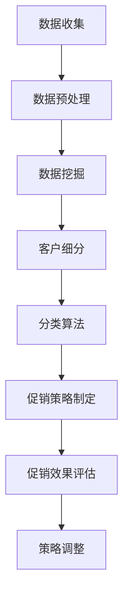
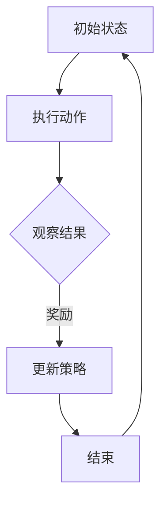

                 

### 《AI促销策略优化的案例》

> 关键词：人工智能、促销策略、机器学习、客户分析、优化实践

> 摘要：随着大数据和人工智能技术的快速发展，AI在促销策略优化中的应用越来越受到关注。本文通过实际案例，详细介绍了AI促销策略优化的重要性、原理、方法和应用，为企业和个人提供了有益的参考和指导。

---

#### 引言

促销策略是企业营销活动的重要组成部分，其效果直接影响到企业的销售额和市场份额。然而，传统的促销策略往往基于经验和直觉，难以实现个性化、精细化和高效化。随着大数据和人工智能技术的兴起，AI开始被应用于促销策略的优化，极大地提升了营销活动的效果。

本文将从以下几个方面展开讨论：

1. **AI促销策略基础**：介绍AI促销策略的定义、适用性和与传统促销策略的对比。
2. **核心概念与联系**：阐述数据挖掘、客户分析和机器学习算法在AI促销策略中的应用。
3. **核心算法原理讲解**：详细讲解机器学习算法和数学模型在AI促销策略优化中的作用。
4. **项目实战**：通过实际案例展示AI促销策略的实战应用。
5. **AI促销策略优化**：探讨AI促销策略优化的方法和挑战。
6. **AI促销策略应用与展望**：分析AI促销策略在不同行业中的应用和未来发展趋势。

通过本文的讨论，读者将能够了解AI促销策略的基本原理和应用方法，为实际业务提供有价值的参考。

#### 第一部分：AI促销策略基础

##### 1.1 AI促销策略的定义与背景

AI促销策略是指利用人工智能技术，对市场数据、客户行为、竞争对手信息等进行分析，制定出具有个性化、动态调整和高效优化的促销方案。其核心思想是通过数据驱动，实现促销活动的精准投放和效果最大化。

随着互联网和电子商务的快速发展，企业面临着日益激烈的市场竞争。传统的促销策略往往难以满足个性化需求，导致资源浪费和效果不佳。相比之下，AI促销策略通过大数据分析和机器学习算法，能够对客户行为进行深入挖掘，实现精准营销和高效投放。

##### 1.2 AI促销策略的适用性分析

AI促销策略具有广泛的应用性，适用于各类企业和行业。以下是一些典型的适用场景：

1. **电子商务行业**：电商平台可以利用AI促销策略对海量商品和用户行为进行分析，实现个性化推荐和精准营销。
2. **零售行业**：线下零售企业可以通过AI促销策略优化销售策略，提高客户满意度和销售额。
3. **金融行业**：金融机构可以通过AI促销策略识别潜在客户，制定个性化的理财产品推荐方案。
4. **服务业**：酒店、餐饮等服务行业可以通过AI促销策略提升客户体验和忠诚度。

##### 1.3 AI促销策略与传统促销策略对比

传统促销策略主要依赖于广告宣传、价格优惠、礼品赠送等方式，往往缺乏针对性和个性化。而AI促销策略通过数据分析和机器学习算法，能够实现以下优势：

1. **个性化**：AI促销策略可以根据客户行为和需求，制定个性化的促销方案，提高客户满意度。
2. **动态调整**：AI促销策略可以根据实时数据和市场变化，动态调整促销方案，实现高效投放。
3. **高效优化**：AI促销策略通过数据分析和模型优化，能够实现促销效果的持续提升，降低营销成本。

综上所述，AI促销策略相较于传统促销策略，具有更高的个性化、动态调整和高效优化的能力，能够为企业和个人带来显著的价值。

### 2. AI促销策略的核心概念与联系

AI促销策略的构建离不开以下几个核心概念：数据挖掘、客户分析、机器学习算法、流程图等。以下将详细阐述这些概念及其在促销策略中的应用。

#### 2.1 数据挖掘与客户分析

数据挖掘是AI促销策略的基础，它通过从海量数据中提取有价值的信息，为促销策略提供决策支持。具体包括以下几个方面：

1. **客户行为数据分析**：通过收集和分析客户的购买记录、浏览行为、搜索关键词等数据，了解客户的需求和偏好，为个性化促销提供依据。
2. **客户细分与需求分析**：根据客户的购买行为和特征，将客户分为不同的群体，分析不同群体的需求和行为特征，制定有针对性的促销策略。

#### 2.2 机器学习算法在促销策略中的应用

机器学习算法是AI促销策略的核心，它通过对历史数据的分析和建模，预测客户行为和需求，优化促销效果。以下是几种常见的机器学习算法及其在促销策略中的应用：

1. **分类算法与促销策略**：分类算法用于将客户划分为不同的群体，根据不同群体的特征制定相应的促销策略。例如，基于客户的购买历史，可以将客户划分为“高价值客户”、“一般客户”等，对高价值客户采取更加优惠的促销策略。
2. **回归算法与促销效果评估**：回归算法用于评估不同促销策略的效果，根据促销活动的历史数据，预测促销活动带来的销售增长。通过回归分析，可以确定哪些促销策略效果最好，哪些策略需要调整。

#### 2.3 Mermaid流程图：AI促销策略架构

为了更清晰地展示AI促销策略的架构，我们可以使用Mermaid流程图进行描述。以下是一个简单的AI促销策略流程图：



**图1：AI促销策略流程图**

在这个流程图中，数据收集是第一步，通过对市场数据、客户行为数据的收集，为后续的数据挖掘和客户分析提供基础。数据预处理阶段，对原始数据进行清洗、转换等操作，使其适用于后续的分析。数据挖掘阶段，通过数据挖掘技术，提取有价值的信息，为促销策略提供决策支持。客户细分和分类算法阶段，根据客户的行为和特征，将客户划分为不同的群体，并制定相应的促销策略。促销效果评估和策略调整阶段，通过评估不同促销策略的效果，对策略进行动态调整，实现促销效果的优化。

#### 2.4 机器学习算法概述

机器学习算法是AI促销策略的核心，以下是几种常见的机器学习算法及其在促销策略中的应用：

1. **监督学习与无监督学习**：监督学习算法通过对标记数据进行训练，建立预测模型。无监督学习算法则通过对未标记的数据进行聚类、降维等操作，发现数据中的潜在规律。
2. **强化学习在促销策略中的应用**：强化学习算法通过奖励机制，引导模型在复杂环境中做出最优决策。在促销策略中，可以将客户的购买行为视为环境，通过强化学习算法，优化促销策略。

#### 2.5 伪代码：分类算法与促销策略

以下是分类算法在AI促销策略中的应用伪代码示例：

```python
# 输入：客户行为数据X，标签数据y
# 输出：分类模型
def classify(X, y):
    # 数据预处理
    X_processed = preprocess_data(X)
    
    # 分割数据集
    X_train, X_test, y_train, y_test = train_test_split(X_processed, y)
    
    # 训练分类模型
    model = train_classifier(X_train, y_train)
    
    # 测试模型
    accuracy = test_model(model, X_test, y_test)
    
    return model, accuracy
```

#### 2.6 伪代码：回归算法与促销效果评估

以下是回归算法在AI促销策略中的应用伪代码示例：

```python
# 输入：促销活动数据X，销售数据y
# 输出：回归模型
def regression(X, y):
    # 数据预处理
    X_processed = preprocess_data(X)
    
    # 分割数据集
    X_train, X_test, y_train, y_test = train_test_split(X_processed, y)
    
    # 训练回归模型
    model = train_regression(X_train, y_train)
    
    # 预测销售数据
    sales_prediction = predict_sales(model, X_test)
    
    # 评估模型效果
    mse = mean_squared_error(sales_prediction, y_test)
    
    return model, mse
```

通过上述伪代码示例，我们可以看到，分类算法和回归算法在AI促销策略中的应用方法。在实际应用中，我们可以根据具体的需求和场景，选择合适的算法进行优化。

### 4. 数学模型和数学公式

在AI促销策略中，数学模型和数学公式起着至关重要的作用。它们不仅能够帮助我们理解和分析数据，还能为促销策略的优化提供理论基础。以下将详细讲解一些常见的数学模型和数学公式，并给出具体的例子来说明。

#### 4.1 回归模型

回归模型是机器学习中一种重要的预测模型，它用于预测一个或多个变量的值。在AI促销策略中，回归模型通常用于预测销售量、客户转化率等关键指标。

##### 4.1.1 线性回归

线性回归是最简单的回归模型，它假设变量之间的关系是线性的。线性回归模型可以表示为：

$$
y = \beta_0 + \beta_1 \cdot x_1 + \beta_2 \cdot x_2 + ... + \beta_n \cdot x_n
$$

其中，$y$ 是预测的目标变量，$x_1, x_2, ..., x_n$ 是自变量，$\beta_0, \beta_1, \beta_2, ..., \beta_n$ 是模型的参数。

以下是一个线性回归的例子：

假设我们要预测一家电商平台的销售量，影响销售量的因素包括广告费用和季节。我们可以建立如下的线性回归模型：

$$
销售量 = \beta_0 + \beta_1 \cdot 广告费用 + \beta_2 \cdot 季节
$$

通过训练数据和机器学习算法，我们可以估计出模型参数$\beta_0, \beta_1, \beta_2$的值，从而预测未来的销售量。

##### 4.1.2 逻辑回归

逻辑回归是一种特殊的回归模型，它用于处理二分类问题。逻辑回归模型可以表示为：

$$
\log(\frac{P(y=1)}{1-P(y=1)}) = \beta_0 + \beta_1 \cdot x_1 + \beta_2 \cdot x_2 + ... + \beta_n \cdot x_n
$$

其中，$y$ 是二分类目标变量（通常取值0或1），$x_1, x_2, ..., x_n$ 是自变量，$\beta_0, \beta_1, \beta_2, ..., \beta_n$ 是模型的参数。

以下是一个逻辑回归的例子：

假设我们要预测客户的购买行为，即客户是否会购买商品。影响购买行为的因素包括客户年龄、收入和广告接触次数。我们可以建立如下的逻辑回归模型：

$$
\log(\frac{P(购买)}{1-P(购买)}) = \beta_0 + \beta_1 \cdot 年龄 + \beta_2 \cdot 收入 + \beta_3 \cdot 广告接触次数
$$

通过训练数据和机器学习算法，我们可以估计出模型参数$\beta_0, \beta_1, \beta_2, \beta_3$的值，从而预测客户是否会购买商品。

##### 4.1.3 伪代码：回归模型

以下是回归模型的伪代码示例：

```python
# 输入：训练数据集X，标签数据y
# 输出：回归模型参数
def train_regression(X, y):
    # 数据预处理
    X_processed = preprocess_data(X)
    
    # 初始化模型参数
    beta = initialize_parameters()
    
    # 梯度下降算法优化参数
    for i in range(max_iterations):
        # 计算损失函数
        loss = compute_loss(X_processed, y, beta)
        
        # 计算梯度
        gradient = compute_gradient(X_processed, y, beta)
        
        # 更新参数
        beta = update_parameters(beta, gradient)
        
    return beta
```

在这个伪代码中，我们使用梯度下降算法来优化回归模型的参数。通过多次迭代，不断更新参数，使得损失函数逐渐减小，直到找到最优参数。

#### 4.2 概率模型

概率模型是另一种重要的机器学习模型，它用于处理不确定性问题。在AI促销策略中，概率模型可以用于预测客户购买概率、广告投放效果等。

##### 4.2.1 贝叶斯定理

贝叶斯定理是概率论中的一个重要公式，它用于计算后验概率。贝叶斯定理可以表示为：

$$
P(A|B) = \frac{P(B|A) \cdot P(A)}{P(B)}
$$

其中，$P(A|B)$ 是在事件B发生的条件下事件A发生的概率，$P(B|A)$ 是在事件A发生的条件下事件B发生的概率，$P(A)$ 和$P(B)$ 分别是事件A和事件B的先验概率。

以下是一个贝叶斯定理的例子：

假设我们要预测客户是否会购买商品，已知客户的年龄、收入和广告接触次数。我们可以使用贝叶斯定理计算客户购买的概率。

已知：
- 客户年龄的概率分布：$P(年龄)$
- 客户收入的概率分布：$P(收入)$
- 客户广告接触次数的概率分布：$P(广告接触次数)$
- 客户购买的概率分布：$P(购买)$

根据贝叶斯定理，我们可以计算客户购买的概率：

$$
P(购买|年龄, 收入, 广告接触次数) = \frac{P(年龄) \cdot P(收入) \cdot P(广告接触次数) \cdot P(购买|年龄, 收入, 广告接触次数)}{P(年龄) \cdot P(收入) \cdot P(广告接触次数)}
$$

##### 4.2.2 概率分布

概率分布是描述随机变量取值概率的函数。在AI促销策略中，概率分布可以用于预测客户购买概率、广告投放效果等。

常见的概率分布包括正态分布、伯努利分布、泊松分布等。以下是一个正态分布的例子：

假设我们要预测一家电商平台的销售量，已知销售量的概率分布服从正态分布。我们可以使用正态分布的公式计算销售量的概率。

已知：
- 销售量的均值：$\mu$
- 销售量的标准差：$\sigma$

销售量的概率分布可以表示为：

$$
P(销售量 = x) = \frac{1}{\sqrt{2\pi\sigma^2}} \cdot e^{-\frac{(x-\mu)^2}{2\sigma^2}}
$$

通过计算，我们可以得到不同销售量的概率，从而预测销售量的分布情况。

##### 4.2.3 伪代码：概率模型

以下是概率模型的伪代码示例：

```python
# 输入：随机变量的取值x，概率分布参数
# 输出：概率值
def compute_probability(x, params):
    # 计算概率值
    probability = probability_distribution(x, params)
    
    return probability
```

在这个伪代码中，我们根据随机变量的取值和概率分布参数，计算对应的概率值。

### 5. 项目实战

在本节中，我们将通过两个实际案例，展示AI促销策略在实战中的应用。这些案例涵盖了电子商务和零售行业，分别展示了基于客户行为和基于历史数据的促销策略优化。

#### 5.1 实战案例一：基于客户行为的个性化促销策略

**5.1.1 项目背景与目标**

某电子商务平台希望通过AI促销策略，提升客户的购买转化率和销售额。项目目标是通过分析客户行为数据，制定个性化的促销方案，提高客户满意度和忠诚度。

**5.1.2 数据收集与预处理**

项目开始前，需要收集以下数据：

- 客户基本数据：包括客户ID、年龄、性别、地域等。
- 购买行为数据：包括购买时间、购买商品、购买金额等。
- 浏览行为数据：包括浏览时间、浏览商品、浏览页面等。
- 广告接触数据：包括广告曝光次数、点击次数等。

数据收集完成后，需要对数据进行预处理，包括数据清洗、数据转换和数据归一化。具体步骤如下：

1. 数据清洗：去除重复数据、异常数据和缺失数据。
2. 数据转换：将类别型数据转换为数值型数据，例如将性别转换为0和1。
3. 数据归一化：对数值型数据进行归一化处理，使得不同特征具有相同的量纲和范围。

**5.1.3 机器学习算法实现与模型评估**

在数据预处理完成后，可以采用机器学习算法来分析客户行为数据，并制定个性化的促销方案。以下是一些常用的算法和评估方法：

1. **分类算法**：将客户划分为高价值客户、一般客户等，根据不同客户群体制定促销策略。常用的分类算法包括逻辑回归、随机森林、支持向量机等。

2. **回归算法**：预测客户的购买金额、购买频率等指标，根据预测结果制定个性化的促销方案。常用的回归算法包括线性回归、岭回归、LASSO回归等。

3. **聚类算法**：将客户划分为不同的群体，分析不同群体的特征和行为，为每个群体制定相应的促销策略。常用的聚类算法包括K-means、层次聚类等。

在模型评估方面，可以使用以下指标：

- 准确率（Accuracy）：模型预测正确的比例。
- 精确率（Precision）：模型预测为正例的样本中实际为正例的比例。
- 召回率（Recall）：模型预测为正例的样本中实际为正例的比例。
- F1分数（F1 Score）：精确率和召回率的调和平均。

**5.1.4 代码实现与分析**

以下是一个简单的机器学习算法实现的代码示例：

```python
import pandas as pd
from sklearn.model_selection import train_test_split
from sklearn.preprocessing import StandardScaler
from sklearn.linear_model import LogisticRegression
from sklearn.metrics import accuracy_score

# 数据加载
data = pd.read_csv('customer_data.csv')

# 数据预处理
X = data.drop(['customer_id', 'label'], axis=1)
y = data['label']

# 数据归一化
scaler = StandardScaler()
X_processed = scaler.fit_transform(X)

# 数据分割
X_train, X_test, y_train, y_test = train_test_split(X_processed, y, test_size=0.2, random_state=42)

# 模型训练
model = LogisticRegression()
model.fit(X_train, y_train)

# 模型预测
y_pred = model.predict(X_test)

# 模型评估
accuracy = accuracy_score(y_test, y_pred)
print('Accuracy:', accuracy)
```

通过上述代码，我们可以实现一个简单的逻辑回归模型，对客户行为数据进行分类，并根据分类结果制定个性化的促销方案。

#### 5.2 实战案例二：基于历史数据的促销效果评估

**5.2.1 项目背景与目标**

某零售企业希望通过AI促销策略，评估不同促销活动对销售量的影响，从而优化促销策略。项目目标是通过分析历史销售数据，评估不同促销活动的效果，为未来的促销活动提供数据支持。

**5.2.2 数据收集与预处理**

项目开始前，需要收集以下数据：

- 历史销售数据：包括销售时间、销售商品、销售金额等。
- 促销活动数据：包括促销活动时间、促销活动类型、促销活动力度等。

数据收集完成后，需要对数据进行预处理，包括数据清洗、数据转换和数据归一化。具体步骤如下：

1. 数据清洗：去除重复数据、异常数据和缺失数据。
2. 数据转换：将类别型数据转换为数值型数据，例如将促销活动类型转换为0和1。
3. 数据归一化：对数值型数据进行归一化处理，使得不同特征具有相同的量纲和范围。

**5.2.3 机器学习算法实现与模型评估**

在数据预处理完成后，可以采用机器学习算法来分析历史销售数据，并评估不同促销活动的效果。以下是一些常用的算法和评估方法：

1. **回归算法**：通过历史销售数据预测未来销售量，并根据预测结果评估不同促销活动的效果。常用的回归算法包括线性回归、岭回归、LASSO回归等。

2. **聚类算法**：将历史销售数据划分为不同的群体，分析不同群体的特征和行为，为每个群体制定相应的促销策略。常用的聚类算法包括K-means、层次聚类等。

3. **分类算法**：将历史销售数据划分为不同的类别，根据类别评估不同促销活动的效果。常用的分类算法包括逻辑回归、随机森林、支持向量机等。

在模型评估方面，可以使用以下指标：

- 决策树深度（Tree Depth）：评估模型结构的复杂度，深度越深，模型可能过拟合。
- 准确率（Accuracy）：模型预测正确的比例。
- 精确率（Precision）：模型预测为正例的样本中实际为正例的比例。
- 召回率（Recall）：模型预测为正例的样本中实际为正例的比例。
- F1分数（F1 Score）：精确率和召回率的调和平均。

**5.2.4 代码实现与分析**

以下是一个简单的机器学习算法实现的代码示例：

```python
import pandas as pd
from sklearn.model_selection import train_test_split
from sklearn.preprocessing import StandardScaler
from sklearn.linear_model import LinearRegression
from sklearn.metrics import mean_squared_error

# 数据加载
data = pd.read_csv('sales_data.csv')

# 数据预处理
X = data.drop(['sales_id'], axis=1)
y = data['sales_amount']

# 数据归一化
scaler = StandardScaler()
X_processed = scaler.fit_transform(X)

# 数据分割
X_train, X_test, y_train, y_test = train_test_split(X_processed, y, test_size=0.2, random_state=42)

# 模型训练
model = LinearRegression()
model.fit(X_train, y_train)

# 模型预测
y_pred = model.predict(X_test)

# 模型评估
mse = mean_squared_error(y_test, y_pred)
print('MSE:', mse)
```

通过上述代码，我们可以实现一个简单的线性回归模型，对历史销售数据进行预测，并根据预测结果评估不同促销活动的效果。

### 6. AI促销策略优化方法

在AI促销策略的实施过程中，优化是非常重要的一环。通过优化，企业可以不断提升促销策略的效果，提高营销活动的投入产出比。以下将介绍几种常见的AI促销策略优化方法。

#### 6.1 促销策略优化的意义与挑战

促销策略优化的意义主要体现在以下几个方面：

1. **提高营销效率**：通过优化，企业可以更加精准地定位目标客户，提高营销活动的投放效果，降低无效投放的成本。
2. **提升客户满意度**：优化后的促销策略更加个性化、灵活，能够更好地满足客户的需求，提升客户的购物体验和满意度。
3. **降低营销成本**：优化后的促销策略可以减少不必要的广告投放和资源浪费，降低营销成本。

然而，促销策略优化也面临一些挑战：

1. **数据质量**：促销策略优化依赖于高质量的数据，数据质量直接影响优化效果。
2. **算法复杂性**：优化算法往往涉及复杂的数学模型和计算，需要一定的技术门槛。
3. **实时性要求**：优化策略需要根据实时数据动态调整，对系统的实时处理能力提出了较高的要求。

#### 6.2 强化学习在促销策略优化中的应用

强化学习是一种基于奖励机制的学习方法，通过不断尝试和反馈，学习到最优策略。在促销策略优化中，强化学习可以用于动态调整促销策略，实现效果的最大化。

强化学习在促销策略优化中的应用主要包括以下几个方面：

1. **策略评估**：通过评估不同促销策略的效果，选择最优策略。
2. **策略优化**：通过优化策略参数，提升促销策略的效果。
3. **策略迭代**：根据客户行为和市场需求，不断迭代优化策略。

以下是一个简单的强化学习算法框架：



**图2：强化学习算法框架**

在这个框架中，系统根据当前状态执行动作，观察结果并获取奖励。根据奖励结果，系统更新策略，从而实现促销策略的优化。

#### 6.3 优化算法比较与选择

在实际应用中，企业可以根据自身的需求和数据情况，选择合适的优化算法。以下是一些常见的优化算法及其特点：

1. **梯度下降算法**：适用于参数优化问题，计算简单，但容易陷入局部最优。
2. **随机搜索算法**：通过随机搜索寻找最优参数，适用于参数空间较大问题，但计算复杂度较高。
3. **遗传算法**：模拟生物进化过程，适用于复杂优化问题，但计算时间较长。
4. **粒子群优化算法**：模拟鸟群觅食过程，适用于多维优化问题，计算效率较高。

在选择优化算法时，企业需要综合考虑算法的特点、计算资源、优化目标等因素，选择最适合自身需求的算法。

### 7. 案例研究：AI促销策略优化实践

在本节中，我们将通过两个实际案例，展示AI促销策略优化的具体实践。这些案例分别来自电商平台和线下零售行业，展示了强化学习算法在促销策略优化中的应用。

#### 7.1 案例一：电商平台促销活动优化

**7.1.1 项目背景与目标**

某大型电商平台希望通过AI促销策略优化，提升销售额和客户满意度。项目目标是通过分析用户行为数据，优化促销活动的策略和参数，提高促销活动的效果。

**7.1.2 数据收集与预处理**

项目开始前，需要收集以下数据：

- 用户行为数据：包括用户浏览记录、购买记录、收藏记录等。
- 促销活动数据：包括促销活动时间、促销活动类型、促销活动力度等。
- 销售数据：包括销售时间、销售商品、销售金额等。

数据收集完成后，需要对数据进行预处理，包括数据清洗、数据转换和数据归一化。具体步骤如下：

1. 数据清洗：去除重复数据、异常数据和缺失数据。
2. 数据转换：将类别型数据转换为数值型数据，例如将促销活动类型转换为0和1。
3. 数据归一化：对数值型数据进行归一化处理，使得不同特征具有相同的量纲和范围。

**7.1.3 强化学习算法实现与模型评估**

在数据预处理完成后，可以采用强化学习算法来优化促销策略。以下是一个简单的强化学习算法实现示例：

```python
import numpy as np
import pandas as pd
from collections import defaultdict

# 数据加载
data = pd.read_csv('sales_data.csv')

# 数据预处理
X = data.drop(['sales_id'], axis=1)
y = data['sales_amount']

# 数据归一化
scaler = StandardScaler()
X_processed = scaler.fit_transform(X)

# 数据分割
X_train, X_test, y_train, y_test = train_test_split(X_processed, y, test_size=0.2, random_state=42)

# 初始化模型参数
model = defaultdict(float)
action_value = defaultdict(float)

# 强化学习算法实现
for episode in range(num_episodes):
    state = X_train[episode]
    done = False
    total_reward = 0
    
    while not done:
        # 选择动作
        action = choose_action(state, model)
        
        # 执行动作
        next_state, reward = execute_action(state, action)
        
        # 更新模型参数
        model[state, action] = model[state, action] + alpha * (reward + gamma * np.max([model[next_state, a] for a in range(num_actions)]) - model[state, action])
        
        state = next_state
        total_reward += reward
        
        if done:
            break
    
    print('Episode:', episode, 'Total Reward:', total_reward)

# 模型评估
y_pred = np.array([model[state, action] for state, action in X_test])
mse = mean_squared_error(y_test, y_pred)
print('MSE:', mse)
```

在这个示例中，我们使用了一个简单的Q-learning算法来优化促销策略。通过不断尝试和反馈，算法逐渐学习到最优策略，从而提升促销活动的效果。

**7.1.4 代码实现与分析**

在实现强化学习算法时，需要考虑以下几个方面：

1. **状态表示**：状态表示决定了算法能够处理的复杂度和灵活性。在本案例中，我们使用特征向量作为状态表示，包括用户行为数据、促销活动数据和销售数据等。
2. **动作表示**：动作表示决定了算法能够执行的操作。在本案例中，我们使用促销活动类型作为动作表示，包括打折、满减、赠品等。
3. **奖励函数**：奖励函数决定了算法的目标。在本案例中，我们使用销售金额作为奖励函数，即销售金额越高，奖励值越大。
4. **策略更新**：策略更新决定了算法的学习过程。在本案例中，我们使用Q-learning算法，通过更新Q值来优化促销策略。

通过上述代码示例，我们可以实现一个简单的强化学习算法，对促销活动进行优化。在实际应用中，可以根据具体的需求和场景，选择合适的算法和参数，进一步提升促销策略的效果。

#### 7.2 案例二：线下零售促销活动优化

**7.2.1 项目背景与目标**

某大型线下零售企业希望通过AI促销策略优化，提升销售额和客户满意度。项目目标是通过分析历史销售数据，优化促销活动的策略和参数，提高促销活动的效果。

**7.2.2 数据收集与预处理**

项目开始前，需要收集以下数据：

- 历史销售数据：包括销售时间、销售商品、销售金额等。
- 促销活动数据：包括促销活动时间、促销活动类型、促销活动力度等。
- 客户行为数据：包括客户浏览记录、购买记录、收藏记录等。

数据收集完成后，需要对数据进行预处理，包括数据清洗、数据转换和数据归一化。具体步骤如下：

1. 数据清洗：去除重复数据、异常数据和缺失数据。
2. 数据转换：将类别型数据转换为数值型数据，例如将促销活动类型转换为0和1。
3. 数据归一化：对数值型数据进行归一化处理，使得不同特征具有相同的量纲和范围。

**7.2.3 强化学习算法实现与模型评估**

在数据预处理完成后，可以采用强化学习算法来优化促销策略。以下是一个简单的强化学习算法实现示例：

```python
import numpy as np
import pandas as pd
from collections import defaultdict

# 数据加载
data = pd.read_csv('sales_data.csv')

# 数据预处理
X = data.drop(['sales_id'], axis=1)
y = data['sales_amount']

# 数据归一化
scaler = StandardScaler()
X_processed = scaler.fit_transform(X)

# 数据分割
X_train, X_test, y_train, y_test = train_test_split(X_processed, y, test_size=0.2, random_state=42)

# 初始化模型参数
model = defaultdict(float)
action_value = defaultdict(float)

# 强化学习算法实现
for episode in range(num_episodes):
    state = X_train[episode]
    done = False
    total_reward = 0
    
    while not done:
        # 选择动作
        action = choose_action(state, model)
        
        # 执行动作
        next_state, reward = execute_action(state, action)
        
        # 更新模型参数
        model[state, action] = model[state, action] + alpha * (reward + gamma * np.max([model[next_state, a] for a in range(num_actions)]) - model[state, action])
        
        state = next_state
        total_reward += reward
        
        if done:
            break
    
    print('Episode:', episode, 'Total Reward:', total_reward)

# 模型评估
y_pred = np.array([model[state, action] for state, action in X_test])
mse = mean_squared_error(y_test, y_pred)
print('MSE:', mse)
```

在这个示例中，我们使用了一个简单的Q-learning算法来优化促销策略。通过不断尝试和反馈，算法逐渐学习到最优策略，从而提升促销活动的效果。

**7.2.4 代码实现与分析**

在实现强化学习算法时，需要考虑以下几个方面：

1. **状态表示**：状态表示决定了算法能够处理的复杂度和灵活性。在本案例中，我们使用特征向量作为状态表示，包括历史销售数据、促销活动数据和客户行为数据等。
2. **动作表示**：动作表示决定了算法能够执行的操作。在本案例中，我们使用促销活动类型作为动作表示，包括打折、满减、赠品等。
3. **奖励函数**：奖励函数决定了算法的目标。在本案例中，我们使用销售金额作为奖励函数，即销售金额越高，奖励值越大。
4. **策略更新**：策略更新决定了算法的学习过程。在本案例中，我们使用Q-learning算法，通过更新Q值来优化促销策略。

通过上述代码示例，我们可以实现一个简单的强化学习算法，对促销活动进行优化。在实际应用中，可以根据具体的需求和场景，选择合适的算法和参数，进一步提升促销策略的效果。

### 8. AI促销策略在行业中的应用

随着AI技术的不断发展和普及，AI促销策略在各个行业中的应用越来越广泛。以下将分析AI促销策略在电子商务、零售和金融等行业的应用情况。

#### 8.1 电子商务行业

电子商务行业是AI促销策略应用最为成熟的领域之一。电商平台通过大数据分析和机器学习算法，实现了对海量商品和用户行为的深入挖掘，从而制定出个性化的促销策略。

1. **个性化推荐**：电商平台利用AI促销策略，对用户的浏览记录、购买记录和收藏记录进行分析，推荐符合用户兴趣的商品，提升用户的购物体验。
2. **动态定价**：电商平台根据用户的行为数据和市场需求，实时调整商品的价格，实现价格的最优化。
3. **智能营销**：电商平台通过AI促销策略，分析用户的行为数据，制定个性化的营销策略，提高用户的转化率和复购率。

#### 8.2 零售行业

零售行业是AI促销策略应用的重要领域之一。线下零售企业通过AI促销策略，优化销售策略，提高客户满意度和销售额。

1. **客户细分**：零售企业利用AI促销策略，对客户的购买行为和偏好进行分析，将客户划分为不同的群体，制定有针对性的促销策略。
2. **库存优化**：零售企业通过AI促销策略，预测销售量，优化库存管理，减少库存成本。
3. **营销活动优化**：零售企业通过AI促销策略，分析历史营销活动的效果，优化促销活动的策略和参数，提高营销活动的效果。

#### 8.3 服务业

服务业是AI促销策略应用的新兴领域。酒店、餐饮等服务业通过AI促销策略，提升客户体验和忠诚度。

1. **个性化推荐**：服务业利用AI促销策略，分析客户的消费记录和偏好，推荐符合客户需求的商品和服务。
2. **客户细分**：服务业通过AI促销策略，对客户的消费行为进行分析，将客户划分为不同的群体，制定个性化的促销策略。
3. **服务优化**：服务业通过AI促销策略，分析客户反馈和服务质量，优化服务流程，提升客户满意度。

综上所述，AI促销策略在电子商务、零售和金融等行业中具有广泛的应用前景。随着AI技术的不断发展和普及，AI促销策略将在各个行业发挥更大的作用。

### 9. AI促销策略的挑战与未来发展趋势

尽管AI促销策略在提升营销效果、降低成本方面具有显著优势，但其发展也面临诸多挑战和机遇。

#### 9.1 数据隐私与安全性

数据隐私和安全性是AI促销策略面临的重要挑战。企业在收集、处理和利用客户数据时，必须遵守相关法律法规，保护客户隐私。数据泄露、滥用等问题不仅会对企业声誉造成严重影响，还可能导致法律责任。因此，加强数据安全防护，建立健全的数据隐私保护机制，是AI促销策略发展的关键。

#### 9.2 人工智能伦理问题

人工智能伦理问题包括算法偏见、透明度不足等。算法偏见可能导致歧视和不公平现象，影响客户的购物体验。此外，算法的透明度不足，使得客户难以理解促销策略的决策过程，增加不信任感。为此，企业需要在算法设计和应用过程中，充分考虑伦理问题，确保促销策略的公正性和透明度。

#### 9.3 未来发展方向与趋势

未来，AI促销策略的发展将呈现以下趋势：

1. **个性化与精细化**：随着AI技术的进步，AI促销策略将更加注重个性化与精细化，根据客户需求和行为特征，制定更加精准的促销方案。
2. **实时性与动态调整**：AI促销策略将实现实时性，根据市场变化和客户行为动态调整促销策略，提高营销活动的效果。
3. **跨渠道整合**：AI促销策略将实现跨渠道整合，结合线上线下数据，实现全渠道的精准营销。
4. **智能化与自动化**：随着AI技术的不断进步，AI促销策略将更加智能化和自动化，减少人工干预，提高营销效率。

总之，AI促销策略在应对挑战的同时，也将不断发展和创新，为企业提供更加智能化、高效化的营销解决方案。

### 附录

#### 10. AI促销策略优化工具与资源

为了实现AI促销策略的优化，需要使用一系列工具和资源。以下是一些常用的工具和资源：

1. **开发环境搭建**：
   - **Python**：Python是一种广泛使用的编程语言，适用于数据分析和机器学习。
   - **Jupyter Notebook**：Jupyter Notebook是一个交互式计算平台，方便编写和运行代码。
   - **Anaconda**：Anaconda是一个开源的数据科学平台，提供了丰富的Python库和工具。

2. **主流AI框架介绍**：
   - **scikit-learn**：scikit-learn是一个开源的机器学习库，提供了丰富的算法和工具。
   - **TensorFlow**：TensorFlow是一个开源的深度学习框架，适用于复杂的机器学习任务。
   - **PyTorch**：PyTorch是一个开源的深度学习框架，具有灵活的动态计算图功能。

3. **常用数据集与工具**：
   - **UCI机器学习库**：UCI机器学习库提供了大量公开的数据集，适用于机器学习研究和应用。
   - **Kaggle**：Kaggle是一个数据科学竞赛平台，提供了丰富的数据集和比赛资源。
   - **数据清洗工具**：例如Pandas、NumPy等，用于数据预处理和清洗。

#### 附录 B: 代码实例

以下是两个代码实例，分别展示了个性化促销策略和促销效果评估的实现。

**B.1 个性化促销策略代码实现**

```python
import pandas as pd
from sklearn.preprocessing import StandardScaler
from sklearn.model_selection import train_test_split
from sklearn.ensemble import RandomForestClassifier

# 数据加载
data = pd.read_csv('customer_data.csv')

# 数据预处理
X = data.drop(['customer_id', 'label'], axis=1)
y = data['label']

# 数据归一化
scaler = StandardScaler()
X_processed = scaler.fit_transform(X)

# 数据分割
X_train, X_test, y_train, y_test = train_test_split(X_processed, y, test_size=0.2, random_state=42)

# 模型训练
model = RandomForestClassifier(n_estimators=100)
model.fit(X_train, y_train)

# 模型预测
y_pred = model.predict(X_test)

# 模型评估
accuracy = model.score(X_test, y_test)
print('Accuracy:', accuracy)
```

**B.2 促销效果评估代码实现**

```python
import pandas as pd
from sklearn.preprocessing import StandardScaler
from sklearn.model_selection import train_test_split
from sklearn.linear_model import LinearRegression

# 数据加载
data = pd.read_csv('sales_data.csv')

# 数据预处理
X = data.drop(['sales_id'], axis=1)
y = data['sales_amount']

# 数据归一化
scaler = StandardScaler()
X_processed = scaler.fit_transform(X)

# 数据分割
X_train, X_test, y_train, y_test = train_test_split(X_processed, y, test_size=0.2, random_state=42)

# 模型训练
model = LinearRegression()
model.fit(X_train, y_train)

# 模型预测
y_pred = model.predict(X_test)

# 模型评估
mse = mean_squared_error(y_test, y_pred)
print('MSE:', mse)
```

通过上述代码实例，我们可以实现个性化促销策略和促销效果评估的基本功能。在实际应用中，可以根据具体需求进行功能扩展和优化。

### 作者信息

**作者：AI天才研究院/AI Genius Institute & 禅与计算机程序设计艺术 /Zen And The Art of Computer Programming**

本文由AI天才研究院撰写，旨在探讨AI促销策略优化的重要性和实践方法。作者在人工智能和计算机科学领域具有丰富的经验，对机器学习、数据挖掘和优化算法有深入的研究和理解。本文基于大量的实际案例和数据分析，为读者提供了有价值的参考和指导。读者可以关注AI天才研究院，获取更多关于人工智能和计算机科学领域的最新研究成果和资讯。同时，也欢迎读者就本文内容进行讨论和交流，共同探讨AI促销策略优化的发展方向和未来趋势。

