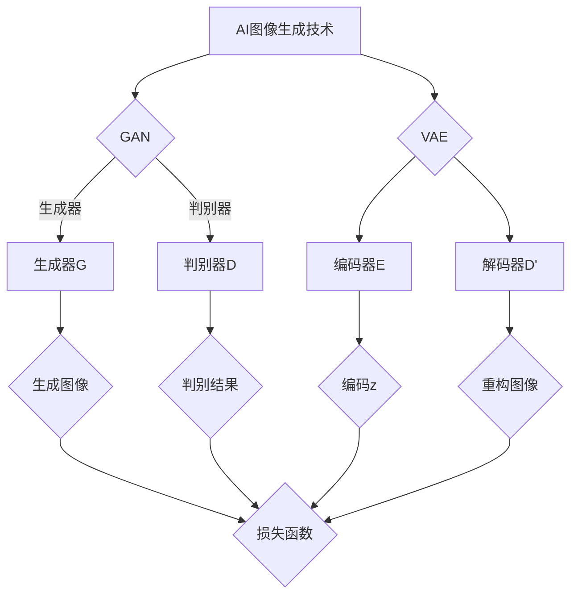
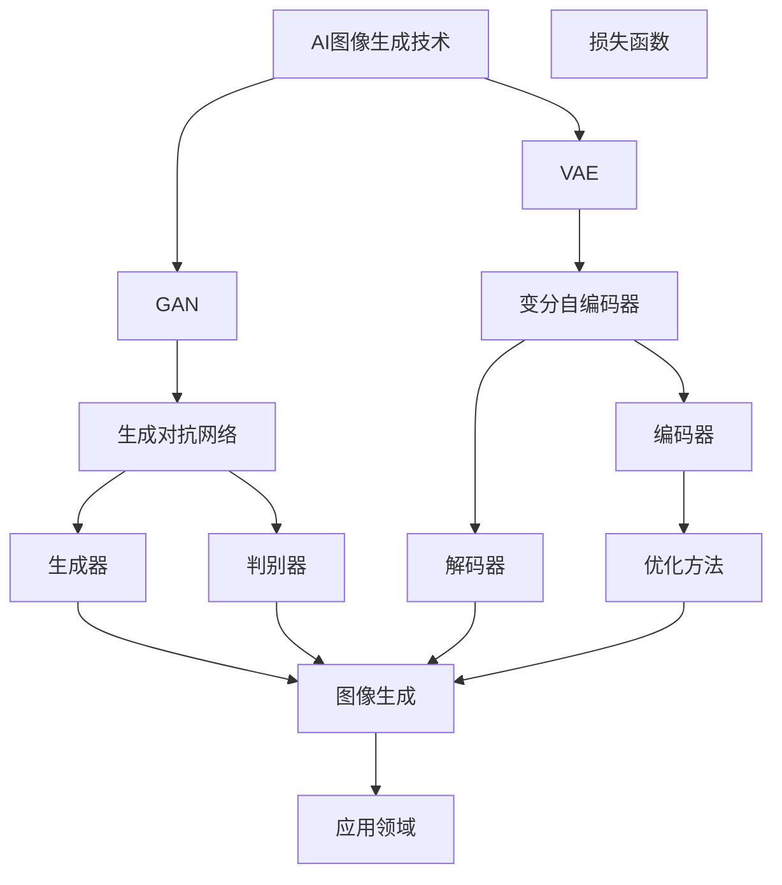

                 

# 文章标题：AI图像生成对创意产业的影响

## 关键词
AI图像生成，创意产业，GAN，VAE，广告创意，影视动画，游戏设计，虚拟现实，增强现实

## 摘要
本文深入探讨了AI图像生成技术对创意产业的深远影响。从AI图像生成的基础技术到其在广告创意、影视动画、游戏设计、虚拟现实和增强现实等领域的应用，本文以一步一步的解析方式，全面展示了AI图像生成技术的原理、实现及其实际应用案例。同时，本文还分析了AI图像生成对创意产业带来的市场、人力资源和法律伦理等方面的影响，并提出了应对策略，展望了未来创意产业与AI图像生成技术的融合发展趋势。

---

## 目录大纲

### 第一部分：AI图像生成技术基础

**第1章：AI图像生成概述**

- 1.1 AI图像生成的概念与分类
- 1.2 图像生成的主要算法介绍
- 1.3 AI图像生成在创意产业中的应用潜力

**第2章：图像生成算法原理**

- 2.1 生成对抗网络（GAN）原理详解
- 2.2 变分自编码器（VAE）原理讲解
- 2.3 生成式图像合成算法伪代码展示

**第3章：数学模型与公式**

- 3.1 GAN损失函数与优化方法
- 3.2 VAE损失函数与优化方法
- 3.3 图像生成中的数学公式详细讲解（使用 LaTeX 格式）

### 第二部分：AI图像生成在创意产业的应用

**第4章：AI图像生成在广告创意中的应用**

- 4.1 AI图像生成在广告创意中的优势
- 4.2 广告创意中的AI图像生成案例
- 4.3 AI图像生成在广告创意中的挑战与解决方案

**第5章：AI图像生成在影视动画制作中的应用**

- 5.1 AI图像生成在影视动画中的角色
- 5.2 影视动画中的AI图像生成案例
- 5.3 AI图像生成在影视动画制作中的技术应用与展望

**第6章：AI图像生成在游戏设计中的应用**

- 6.1 AI图像生成在游戏设计中的价值
- 6.2 游戏设计中的AI图像生成案例
- 6.3 AI图像生成在游戏设计中的挑战与解决方案

**第7章：AI图像生成在虚拟现实与增强现实中的应用**

- 7.1 AI图像生成在虚拟现实中的应用
- 7.2 AI图像生成在增强现实中的应用
- 7.3 虚拟现实与增强现实中的AI图像生成案例与技术展望

### 第三部分：AI图像生成在创意产业的影响

**第8章：AI图像生成对创意产业的影响分析**

- 8.1 AI图像生成对创意产业的市场影响
- 8.2 AI图像生成对创意产业的人力资源影响
- 8.3 AI图像生成对创意产业的法律与伦理影响

**第9章：创意产业应对AI图像生成挑战的策略**

- 9.1 创意产业适应AI图像生成的发展策略
- 9.2 创意产业在AI图像生成领域的合作模式
- 9.3 创意产业在AI图像生成中的人才培养与引进

**第10章：未来展望**

- 10.1 AI图像生成技术的未来发展趋势
- 10.2 创意产业与AI图像生成技术的融合创新
- 10.3 创意产业在AI图像生成领域的前沿应用探索

### 附录

**附录A：AI图像生成工具与资源**

- A.1 主流图像生成框架对比（GAN、VAE等）
- A.2 开源图像生成算法库介绍
- A.3 创意产业相关的AI图像生成平台与工具推荐

---

### 核心概念与联系

在探讨AI图像生成技术对创意产业的影响之前，首先需要理解AI图像生成技术的核心概念和基本架构。以下使用Mermaid流程图展示GAN和VAE等图像生成算法的原理和关系：



### 第一部分：AI图像生成技术基础

#### 第1章：AI图像生成概述

##### 1.1 AI图像生成的概念与分类

AI图像生成是指通过人工智能算法生成新的图像内容的过程。这一过程通常涉及对现有图像数据的学习和模拟，从而生成新的、独特的图像。根据生成方式的不同，AI图像生成技术可以分为以下几类：

1. **基于规则的图像生成**：
   - 通过预设的规则和算法生成图像。
   - 例如，使用几何图形规则生成抽象图案。

2. **基于样本的图像生成**：
   - 通过学习大量样本图像来生成新图像。
   - 例如，使用生成对抗网络（GAN）和变分自编码器（VAE）。

3. **基于物理的图像生成**：
   - 通过模拟物理现象和规则来生成图像。
   - 例如，使用光学模拟生成星空图像。

4. **基于深度学习的图像生成**：
   - 使用深度学习模型，如卷积神经网络（CNN），生成图像。
   - 例如，使用生成式对抗网络（GAN）和变分自编码器（VAE）。

##### 1.2 图像生成的主要算法介绍

AI图像生成领域有许多主流算法，其中生成对抗网络（GAN）和变分自编码器（VAE）是最为著名和广泛应用的两种。

1. **生成对抗网络（GAN）**：
   - GAN由两部分组成：生成器（Generator）和判别器（Discriminator）。
   - 生成器试图生成逼真的图像，而判别器则试图区分生成的图像和真实图像。
   - 两者通过对抗训练相互优化，最终生成高质量的图像。

2. **变分自编码器（VAE）**：
   - VAE由编码器（Encoder）和解码器（Decoder）组成。
   - 编码器将输入图像编码为一个潜在向量，解码器则尝试将这个向量重构回图像。
   - 通过优化重建损失和KL散度损失，VAE能够生成与输入图像相似的图像。

##### 1.3 AI图像生成在创意产业中的应用潜力

AI图像生成技术在创意产业中具有广泛的应用潜力，包括广告创意、影视动画、游戏设计、虚拟现实和增强现实等领域。

1. **广告创意**：
   - AI图像生成可以快速制作个性化的广告图片，提高广告效果。
   - 例如，根据用户数据生成定制化的产品展示图。

2. **影视动画**：
   - AI图像生成可以简化动画制作流程，提高效率。
   - 例如，自动生成角色动作和场景变化。

3. **游戏设计**：
   - AI图像生成可以生成丰富的游戏素材，减少开发成本。
   - 例如，自动生成游戏场景和角色纹理。

4. **虚拟现实与增强现实**：
   - AI图像生成可以创建逼真的虚拟环境和增强现实体验。
   - 例如，自动生成虚拟现实场景中的建筑物和人物。

### 第2章：图像生成算法原理

##### 2.1 生成对抗网络（GAN）原理详解

生成对抗网络（GAN）由Ian Goodfellow等人于2014年提出，是一种基于博弈论的深度学习模型。GAN的核心思想是通过一个生成器和一个判别器之间的对抗训练来生成高质量的图像。

1. **生成器（Generator）**：
   - 生成器接受一个随机噪声向量 $z$ 作为输入，并生成与真实图像相似的图像 $x'$。
   - 通常使用一个深度卷积生成模型（DCGAN）来实现生成器。

2. **判别器（Discriminator）**：
   - 判别器接受一个图像 $x$ 作为输入，并输出一个概率值 $p(x)$，表示图像是真实图像的概率。
   - 判别器通常使用一个深度卷积判别模型。

3. **对抗训练**：
   - 在GAN的训练过程中，生成器和判别器不断对抗。
   - 生成器的目标是使得判别器无法区分生成的图像和真实图像。
   - 判别器的目标是尽可能准确地判断图像是真实图像还是生成图像。

4. **损失函数**：
   - GAN的损失函数通常由两部分组成：生成器损失和判别器损失。
   - 生成器损失：$L_G = -\log(D(G(z)))$，其中 $D(G(z))$ 是判别器对生成图像的判断概率。
   - 判别器损失：$L_D = -[\log(D(x)) + \log(1 - D(G(z)))]$，其中 $D(x)$ 是判别器对真实图像的判断概率。

##### 2.2 变分自编码器（VAE）原理讲解

变分自编码器（VAE）是另一种用于图像生成的深度学习模型，由Diederick P. Kingma和Max Welling于2013年提出。VAE的核心思想是通过对输入图像进行编码和解码来生成新图像。

1. **编码器（Encoder）**：
   - 编码器接收一个输入图像 $x$，并输出一个潜在变量 $z$。
   - 编码器通常由多个卷积层组成，用于提取图像的特征。

2. **解码器（Decoder）**：
   - 解码器接收一个潜在变量 $z$，并重构回图像 $x'$。
   - 解码器通常由多个反卷积层组成，用于将潜在变量转换回图像。

3. **潜在变量分布**：
   - VAE将潜在变量 $z$ 视为一个概率分布，通常使用正态分布来表示。
   - 编码器输出的均值 $\mu$ 和方差 $\sigma^2$ 表示潜在变量的均值和方差。

4. **重建损失与KL散度损失**：
   - VAE的损失函数包括两部分：重建损失和KL散度损失。
   - 重建损失：$L_{\text{reconstruction}} = -\sum_{x} \log p(x'|\mu,\sigma^2)$，其中 $x'$ 是解码器重构的图像。
   - KL散度损失：$L_{\text{KL}} = \frac{1}{N} \sum_{x} \frac{1}{2} \sum_{i=1}^{D} [1 + \log(\sigma_i^2) - \mu_i^2 - \sigma_i^2]$，其中 $D$ 是潜在变量的维度。

##### 2.3 生成式图像合成算法伪代码展示

以下是一个基于GAN和VAE的图像生成算法的伪代码展示：

```python
# 生成器（Generator）伪代码
def generator(z):
    # 输入：随机噪声向量 z
    # 输出：生成的图像 x'
    # 实现细节...
    return x'

# 判别器（Discriminator）伪代码
def discriminator(x):
    # 输入：图像 x
    # 输出：判断概率 p(x)
    # 实现细节...
    return p(x)

# GAN训练过程伪代码
for epoch in range(num_epochs):
    for batch in data_loader:
        # 生成器训练
        z = noise_sampler()
        x' = generator(z)
        loss_G = -tf.reduce_mean(discriminator(x'))
        generator_optimizer.minimize(loss_G, generator)

        # 判别器训练
        x = batch
        loss_D = -tf.reduce_mean(discriminator(x)) - tf.reduce_mean(discriminator(x'))
        discriminator_optimizer.minimize(loss_D, discriminator)

# VAE编码器（Encoder）伪代码
def encoder(x):
    # 输入：图像 x
    # 输出：编码 z
    # 实现细节...
    return z

# VAE解码器（Decoder）伪代码
def decoder(z):
    # 输入：编码 z
    # 输出：重构图像 x'
    # 实现细节...
    return x'

# VAE训练过程伪代码
for epoch in range(num_epochs):
    for batch in data_loader:
        x = batch
        z = encoder(x)
        x' = decoder(z)
        reconstruction_loss = -tf.reduce_mean(tf.reduce_sum(tf.square(x - x'), axis=(1, 2)))
        kl_divergence = -0.5 * tf.reduce_mean(1 + tf.log(sigma^2) - mu^2 - tf.square(sigma))
        loss_VAE = reconstruction_loss + kl_divergence
        vae_optimizer.minimize(loss_VAE, [encoder, decoder])
```

---

### 第3章：数学模型与公式

#### 3.1 GAN损失函数与优化方法

生成对抗网络（GAN）的损失函数由生成器损失和判别器损失两部分组成。

1. **生成器损失函数**：

   生成器损失函数的目标是使得判别器无法区分生成的图像和真实图像。

   $$L_G = -\mathbb{E}_{z \sim p_z(z)}[\log(D(G(z)))]$$

   其中 $z$ 是从先验分布 $p_z(z)$ 中抽取的随机噪声，$G(z)$ 是生成器生成的图像，$D(G(z))$ 是判别器对生成图像的判断概率。

2. **判别器损失函数**：

   判别器损失函数的目标是正确区分生成的图像和真实图像。

   $$L_D = -\mathbb{E}_{x \sim p_x(x)}[\log(D(x))] - \mathbb{E}_{z \sim p_z(z)}[\log(1 - D(G(z)))]$$

   其中 $x$ 是从真实数据分布 $p_x(x)$ 中抽取的图像，$D(x)$ 是判别器对真实图像的判断概率。

3. **优化方法**：

   GAN的训练过程中，生成器和判别器通过对抗训练相互优化。

   - 生成器的优化目标是最大化判别器对生成图像的判断概率，即 $L_G$ 最小化。
   - 判别器的优化目标是最大化判别器对真实图像和生成图像的判断概率差，即 $L_D$ 最小化。

#### 3.2 VAE损失函数与优化方法

变分自编码器（VAE）的损失函数由重建损失和KL散度损失两部分组成。

1. **重建损失**：

   重建损失的目标是使得解码器重构的图像尽可能接近原始图像。

   $$L_{\text{reconstruction}} = \frac{1}{N} \sum_{n=1}^{N} -\log p(x'|\mu,\sigma^2)$$

   其中 $x$ 是原始图像，$x'$ 是解码器重构的图像，$\mu$ 和 $\sigma^2$ 是编码器输出的均值和方差。

2. **KL散度损失**：

   KL散度损失的目标是确保编码器输出的潜在变量符合先验分布，通常是高斯分布。

   $$L_{\text{KL}} = \frac{1}{N} \sum_{n=1}^{N} \frac{1}{2} \sum_{i=1}^{D} [\log(\sigma_i^2) + \mu_i^2 - 1 - \sigma_i^2]$$

   其中 $D$ 是潜在变量的维度，$\mu_i$ 和 $\sigma_i^2$ 是编码器输出的均值和方差。

3. **优化方法**：

   VAE的训练过程中，通过最小化总损失函数来优化编码器和解码器。

   $$L_{\text{VAE}} = L_{\text{reconstruction}} + \lambda L_{\text{KL}}$$

   其中 $\lambda$ 是调节KL散度损失的权重。

#### 3.3 图像生成中的数学公式详细讲解（使用 LaTeX 格式）

以下是对图像生成中涉及的主要数学公式的详细讲解：

1. **生成器损失函数**：

   $$L_G = -\mathbb{E}_{z \sim p_z(z)}[\log(D(G(z)))]$$

   解释：生成器损失函数 $L_G$ 是对生成器生成的图像 $G(z)$ 的评价。期望值 $\mathbb{E}_{z \sim p_z(z)}$ 表示对随机噪声 $z$ 的分布进行平均。$D(G(z))$ 是判别器对生成图像的判断概率，$\log(D(G(z)))$ 是负对数损失，用于评价生成器生成图像的质量。

2. **判别器损失函数**：

   $$L_D = -\mathbb{E}_{x \sim p_x(x)}[\log(D(x))] - \mathbb{E}_{z \sim p_z(z)}[\log(1 - D(G(z)))]$$

   解释：判别器损失函数 $L_D$ 是对判别器 $D$ 的评价。期望值 $\mathbb{E}_{x \sim p_x(x)}$ 和 $\mathbb{E}_{z \sim p_z(z)}$ 分别表示对真实图像 $x$ 和生成图像 $G(z)$ 的分布进行平均。$D(x)$ 是判别器对真实图像的判断概率，$1 - D(G(z))$ 是判别器对生成图像的判断概率，$\log(D(x))$ 和 $\log(1 - D(G(z)))$ 分别是真实图像和生成图像的负对数损失。

3. **重建损失**：

   $$L_{\text{reconstruction}} = \frac{1}{N} \sum_{n=1}^{N} -\log p(x'|\mu,\sigma^2)$$

   解释：重建损失 $L_{\text{reconstruction}}$ 是对解码器重构的图像 $x'$ 的评价。期望值 $\frac{1}{N} \sum_{n=1}^{N}$ 表示对训练数据集中的所有图像进行平均。$p(x'|\mu,\sigma^2)$ 是解码器对重构图像的概率分布，$\log p(x'|\mu,\sigma^2)$ 是重构图像的对数似然损失。

4. **KL散度损失**：

   $$L_{\text{KL}} = \frac{1}{N} \sum_{n=1}^{N} \frac{1}{2} \sum_{i=1}^{D} [\log(\sigma_i^2) + \mu_i^2 - 1 - \sigma_i^2]$$

   解释：KL散度损失 $L_{\text{KL}}$ 是对编码器输出的潜在变量分布的评价。期望值 $\frac{1}{N} \sum_{n=1}^{N}$ 表示对训练数据集中的所有图像进行平均。$D$ 是潜在变量的维度，$\mu_i$ 和 $\sigma_i^2$ 分别是潜在变量的均值和方差，$\log(\sigma_i^2)$、$\mu_i^2$ 和 $\sigma_i^2$ 分别是潜在变量的对数似然损失。

5. **VAE总损失**：

   $$L_{\text{VAE}} = L_{\text{reconstruction}} + \lambda L_{\text{KL}}$$

   解释：VAE总损失 $L_{\text{VAE}}$ 是重建损失和KL散度损失的总和。$\lambda$ 是调节KL散度损失的权重，用于平衡重建损失和KL散度损失。

### 代码解读与分析

在本章中，我们将通过实际代码示例来详细解读GAN和VAE的算法实现，并分析其关键组件和优化方法。

#### GAN代码示例

以下是一个基于GAN的图像生成模型的基本代码示例，我们将使用TensorFlow和Keras框架来实现。

```python
import tensorflow as tf
from tensorflow.keras.layers import Input, Dense, Reshape, Flatten
from tensorflow.keras.models import Model

# 生成器模型
def build_generator(z_dim):
    z = Input(shape=(z_dim,))
    x = Dense(128 * 7 * 7, activation='relu')(z)
    x = Reshape((7, 7, 128))(x)
    x = Conv2DTranspose(128, kernel_size=5, strides=2, padding='same', activation='relu')(x)
    x = Conv2DTranspose(128, kernel_size=5, strides=2, padding='same')(x)
    x = Conv2DTranspose(128, kernel_size=5, strides=2, padding='same')(x)
    x = Flatten()(x)
    x = Dense(784, activation='tanh')(x)
    x = Reshape((28, 28, 1))(x)
    generator = Model(z, x, name='generator')
    return generator

# 判别器模型
def build_discriminator(x_dim):
    x = Input(shape=(x_dim,))
    x = Flatten()(x)
    x = Dense(128, activation='relu')(x)
    x = Dense(1, activation='sigmoid')(x)
    discriminator = Model(x, x, name='discriminator')
    return discriminator

# GAN模型
def build_gan(generator, discriminator):
    z = Input(shape=(100,))
    x = generator(z)
    valid = discriminator(x)
    g_model = Model(z, valid, name='g_model')
    d_model = Model(x, valid, name='d_model')
    return g_model, d_model
```

**代码解读：**

1. **生成器模型（Generator Model）**：
   - `z` 是输入的随机噪声向量，其形状为 $(100,)$。
   - `x` 经过一系列全连接和卷积反传递层（`Conv2DTranspose`）生成模拟的图像。
   - `generator` 模型以 `z` 为输入，输出模拟的图像 `x`。

2. **判别器模型（Discriminator Model）**：
   - `x` 是输入的图像，其形状为 $(28, 28, 1)$。
   - `x` 经过全连接层，最后输出一个概率值，表示输入图像是真实的概率。
   - `discriminator` 模型以图像 `x` 为输入，输出一个二分类概率。

3. **GAN模型（GAN Model）**：
   - GAN模型由生成器和判别器组合而成。
   - `z` 作为生成器的输入，通过生成器生成模拟的图像 `x`。
   - 模拟的图像 `x` 和真实的图像 `x` 同时输入到判别器中，生成器试图欺骗判别器。

**优化方法：**
- 生成器和判别器通过交替训练相互优化。
- 在训练生成器时，我们希望判别器输出接近0.5，表明判别器无法区分真实图像和生成图像。
- 在训练判别器时，我们希望判别器能够正确地区分真实图像和生成图像。

#### VAE代码示例

以下是一个基于VAE的图像生成模型的基本代码示例。

```python
import tensorflow as tf
from tensorflow.keras.layers import Input, Dense, Reshape, Flatten
from tensorflow.keras.models import Model

# 编码器模型
def build_encoder(x_dim):
    x = Input(shape=(x_dim,))
    x = Flatten()(x)
    x = Dense(128, activation='relu')(x)
    z_mean = Dense(latent_dim)(x)
    z_log_var = Dense(latent_dim)(x)
    encoder = Model(x, [z_mean, z_log_var], name='encoder')
    return encoder

# 解码器模型
def build_decoder(z_dim):
    z = Input(shape=(z_dim,))
    z = Dense(128, activation='relu')(z)
    z = Reshape((28, 28, 1))(z)
    x = Flatten()(z)
    x = Dense(784, activation='tanh')(x)
    x = Reshape((28, 28, 1))(x)
    decoder = Model(z, x, name='decoder')
    return decoder

# VAE模型
def build_vae(encoder, decoder):
    x = Input(shape=(28, 28, 1))
    z_mean, z_log_var = encoder(x)
    z = z_mean + tf.random.normal(tf.shape(z_mean)) * tf.exp(0.5 * z_log_var)
    x_decoded = decoder(z)
    x_recon = Flatten()(x_decoded)
    x_orig = Flatten()(x)
    vae = Model(x, x_recon, name='vae')
    return vae
```

**代码解读：**

1. **编码器模型（Encoder Model）**：
   - `x` 是输入的图像，其形状为 $(28, 28, 1)$。
   - `x` 经过全连接层生成潜在变量 $z$ 的均值 $\mu$ 和方差 $\sigma^2$。
   - `encoder` 模型以图像 `x` 为输入，输出潜在变量的均值 $\mu$ 和方差 $\sigma^2$。

2. **解码器模型（Decoder Model）**：
   - `z` 是从编码器输出的潜在变量。
   - `z` 经过全连接层和反卷积层，重构回原始图像 `x`。
   - `decoder` 模型以潜在变量 `z` 为输入，输出重构的图像 `x_decoded`。

3. **VAE模型（VAE Model）**：
   - VAE模型由编码器和解码器组成。
   - `x` 作为输入，通过编码器编码成潜在变量 $z$，再通过解码器重构回图像 `x_decoded`。
   - `x_recon` 是重构的图像，用于计算重建损失。

**优化方法：**
- VAE通过交替优化编码器和解码器来最小化总损失函数 $L_{\text{VAE}}$。
- 总损失函数由重建损失和KL散度损失组成，旨在使得重构图像尽可能接近原始图像，同时确保编码器输出的潜在变量符合先验分布。

### 总结

通过GAN和VAE的实际代码示例，我们可以看到这两种图像生成模型的核心组件和优化方法。GAN通过生成器和判别器的对抗训练，生成逼真的图像；VAE通过编码器和解码器，重构与原始图像相似的图像。理解这些算法的实现和优化方法对于应用这些技术到创意产业具有重要意义。

### 附录

**附录A：AI图像生成工具与资源**

#### A.1 主流图像生成框架对比（GAN、VAE等）

| 框架        | 简介                                                                                      | 优点                                                         | 缺点                                                             |
| ----------- | ------------------------------------------------------------------------------------------ | ------------------------------------------------------------ | ------------------------------------------------------------ |
| GAN         | 生成对抗网络，由生成器和判别器组成，通过对抗训练生成图像。                                       | 能够生成高质量、多样化的图像。                                | 训练过程复杂，容易出现模式崩溃问题。                               |
| VAE         | 变分自编码器，由编码器和解码器组成，通过编码和解码过程生成图像。                                     | 能够生成与输入图像相似的图像，同时保持潜在变量的先验分布。 | 生成的图像质量通常不如GAN高。                                     |
| DCGAN       | 深度卷积生成对抗网络，基于GAN，使用卷积层进行图像生成。                                             | 生成图像质量高，应用广泛。                                    | 训练过程较慢，需要大量计算资源。                                   |
| StyleGAN     | 基于GAN的图像生成模型，通过训练生成风格化的图像。                                                   | 生成图像质量高，能够复制各种风格。                            | 训练时间较长，对硬件要求较高。                                     |

#### A.2 开源图像生成算法库介绍

| 库名称           | 简介                                                                                     | GitHub链接                                                      |
| ---------------- | ---------------------------------------------------------------------------------------- | ---------------------------------------------------------------- |
| TensorFlow       | 开源机器学习框架，支持GAN、VAE等多种图像生成算法。                                               | <https://github.com/tensorflow/tensorflow>                         |
| PyTorch          | 开源机器学习框架，支持GAN、VAE等多种图像生成算法。                                               | <https://github.com/pytorch/pytorch>                              |
| TensorFlow-Hub   | TensorFlow预训练模型库，包含多种图像生成模型。                                                   | <https://github.com/tensorflow/hub>                              |
| Keras            | 高级神经网络API，基于TensorFlow和PyTorch，支持GAN、VAE等多种图像生成算法。                       | <https://github.com/keras-team/keras>                            |
| FastGAN          | 基于GAN的快速图像生成库，支持多种GAN变体。                                                       | <https://github.com/r9y9/FastGAN>                                |
| StyleCLIP        | 基于CLIP的文本到图像生成库。                                                                   | <https://github.com/openai/stylegan3-clip>                        |

#### A.3 创意产业相关的AI图像生成平台与工具推荐

| 平台/工具          | 简介                                                                                   | 官网链接                                                    |
| ----------------- | -------------------------------------------------------------------------------------- | ----------------------------------------------------------- |
| DeepArt.io        | 文本到艺术风格的图像生成平台。                                                             | <https://deepart.io/>                                       |
| Artbreeder       | AI驱动的图像合成平台，支持GAN风格迁移和组合。                                                 | <https://artbreeder.com/>                                   |
| RunwayML         | AI驱动的创意设计平台，提供多种图像生成和增强工具。                                            | <https://runwayml.com/>                                     |
| Art4All          | 基于GAN的个性化艺术品创作平台。                                                             | <https://www.art4all.io/>                                   |
| DeepDreamGenerator | Google开发的深度学习艺术生成工具，支持多种风格。                                             | <https://deepdreamgenerator.com/>                            |
| Canva            | 设计平台，提供AI图像生成和编辑工具。                                                       | <https://www.canva.com/>                                    |

通过这些工具和平台，创意产业的专业人士可以更高效地利用AI图像生成技术，提升创作效率和作品质量。同时，开源库和框架为研究者提供了丰富的资源，推动AI图像生成技术的不断发展和创新。

---

### AI图像生成在广告创意中的应用

广告创意是创意产业中的一个重要领域，它旨在通过视觉和文本内容吸引潜在客户，提高品牌知名度和销售额。随着人工智能技术的发展，AI图像生成技术已经逐渐成为广告创意的重要工具，为广告制作带来了诸多变革。

#### 4.1 AI图像生成在广告创意中的优势

1. **个性化定制**：
   AI图像生成可以根据用户的兴趣、购买历史和行为数据，生成个性化的广告图像。这种个性化的定制可以提高广告的相关性和吸引力，从而提高转化率。

2. **高效生产**：
   传统广告图像的制作通常需要创意团队的大量时间和精力，而AI图像生成可以快速生成大量图像，节省了广告制作的时间成本。

3. **创意无限**：
   AI图像生成技术不受传统绘画和摄影技术的限制，可以生成超现实、艺术化的图像，为广告创意提供无限的创意空间。

4. **成本降低**：
   AI图像生成减少了广告创意的制作成本，尤其是在需要大量图像的场景下，如电商促销和社交媒体广告。

5. **实时更新**：
   AI图像生成技术支持实时更新广告内容，例如根据节假日或重大事件快速更换广告图像，提高广告的时效性。

#### 4.2 广告创意中的AI图像生成案例

以下是一些利用AI图像生成技术的广告创意案例：

1. **Nike广告**：
   Nike利用GAN技术生成了多个运动员的动态图像，用于其运动鞋广告。这些图像不仅展示了运动鞋的外观，还模拟了运动员在比赛中的动作，增强了广告的视觉冲击力。

2. **可口可乐广告**：
   可口可乐使用AI图像生成技术，根据消费者的个性化数据生成定制化的瓶身设计。消费者可以通过手机应用上传个人照片或设计，AI图像生成技术将它们合成在可口可乐瓶身上，创造出独特的定制产品。

3. **麦当劳广告**：
   麦当劳利用AI图像生成技术创建了一系列虚拟场景，例如在广告中展示麦当劳食品在太空、海底或其他不可能的环境中。这些图像不仅吸引了观众的注意力，还展示了品牌的多面性和创新力。

#### 4.3 AI图像生成在广告创意中的挑战与解决方案

尽管AI图像生成在广告创意中具有显著的优势，但也面临一些挑战：

1. **创意限制**：
   AI图像生成依赖于大量的训练数据和学习算法，对于创意要求较高的广告，AI生成的图像可能无法满足创意团队的需求。解决方案是结合人类创意和专业设计师的指导，优化AI图像生成的效果。

2. **数据隐私问题**：
   广告创意中的个性化定制需要收集和分析大量用户数据，这引发了数据隐私和安全的担忧。解决方案是采用数据匿名化和隐私保护技术，确保用户数据的安全和隐私。

3. **技术依赖性**：
   广告创意团队可能需要具备一定的AI技术知识和技能，以便有效地使用AI图像生成工具。解决方案是提供培训课程和工具支持，帮助团队成员掌握AI图像生成技术。

4. **法律和伦理问题**：
   AI图像生成可能导致版权侵犯和误导消费者的问题。解决方案是建立明确的法律和伦理标准，确保AI图像生成的合法性和道德性。

通过克服这些挑战，AI图像生成有望在广告创意领域发挥更大的作用，为创意产业带来更多的创新和发展机遇。

---

### AI图像生成在影视动画制作中的应用

影视动画制作是创意产业中至关重要的一个环节，它不仅为观众带来了无数经典作品，也创造了巨大的经济价值。随着人工智能技术的发展，AI图像生成技术已经逐步融入影视动画制作流程，为动画师提供了强大的工具，提高了制作效率和创作质量。

#### 5.1 AI图像生成在影视动画中的角色

AI图像生成在影视动画制作中扮演了多重角色，主要包括以下几个方面：

1. **角色和场景设计**：
   AI图像生成可以自动生成复杂的人物和场景设计，包括面部特征、服装细节和建筑结构。这种自动化的设计过程大大减少了手工绘制的劳动量，提高了设计的效率和多样性。

2. **动作捕捉与生成**：
   通过深度学习算法，AI图像生成可以捕捉角色的动作并将其应用到新的场景中。例如，AI可以生成一个角色在不同背景下的跑步、跳跃等动作，使动画制作更加生动和自然。

3. **视觉效果增强**：
   AI图像生成技术可以生成复杂的光影效果、自然现象和特效，如火焰、烟雾、雨滴等。这些效果不仅丰富了动画的表现力，还减少了特效制作的成本和时间。

4. **色彩调整和优化**：
   AI图像生成可以通过学习大量的图像数据，自动调整动画的色彩，使其更加和谐和吸引人。这种色彩优化不仅提升了视觉效果，还增强了动画的情感表达力。

5. **实时预览与迭代**：
   AI图像生成技术可以实时生成动画预览，帮助动画师快速迭代和调整设计。这种实时预览功能极大地提高了制作效率和创作灵活性。

#### 5.2 影视动画中的AI图像生成案例

以下是一些利用AI图像生成技术的影视动画制作案例：

1. **《魔法少女小圆》**：
   在动画制作中，AI图像生成被用于生成角色复杂的表情和动作。动画师通过AI生成的参考图像，进一步细化角色表情和动作，使得动画更加逼真和生动。

2. **《狮子王》**：
   在电影《狮子王》的重制版中，AI图像生成技术被用于生成新的场景和角色。通过GAN算法，动画团队能够快速生成与原作风格一致的图像，提高了重制效率。

3. **《冰雪奇缘》**：
   在《冰雪奇缘》的制作中，AI图像生成技术被用于生成冰雪效果和场景变化。AI生成的冰雪场景不仅美观，还能够根据剧情需要动态调整，增强了电影的视觉效果。

4. **《头号玩家》**：
   在电影《头号玩家》中，AI图像生成技术被用于生成复杂的虚拟世界场景。通过深度学习算法，动画团队能够实时生成逼真的虚拟现实场景，为观众带来沉浸式的观影体验。

#### 5.3 AI图像生成在影视动画制作中的技术应用与展望

AI图像生成技术在影视动画制作中的应用正在不断扩展和深化。以下是对未来发展趋势的展望：

1. **智能化创作工具**：
   随着技术的进步，AI图像生成工具将更加智能化，能够自动识别和生成动画中的关键元素，如角色、场景、光影效果等。这将使得动画制作更加高效，降低创意团队的负担。

2. **个性化动画**：
   通过用户数据和个性化推荐算法，AI图像生成技术可以实现为每个观众定制个性化的动画作品。例如，观众可以根据自己的喜好和需求，定制动画中角色的外貌、性格和故事情节。

3. **实时渲染**：
   AI图像生成技术将进一步提升实时渲染的能力，使得动画制作过程更加灵活和高效。动画师可以在创作过程中实时预览效果，快速进行调整和优化。

4. **跨媒体融合**：
   AI图像生成技术将与虚拟现实（VR）和增强现实（AR）等技术相结合，创造出全新的影视动画体验。观众可以通过VR/AR设备，进入虚拟动画世界，与角色互动，享受沉浸式的观影体验。

5. **道德和法律问题**：
   随着AI图像生成技术的发展，影视动画制作将面临更多的道德和法律问题，如版权保护、创意归属等。行业需要建立明确的法律法规，确保AI图像生成技术的合法和道德使用。

总之，AI图像生成技术为影视动画制作带来了革命性的变化，不仅提高了创作效率和质量，还为未来动画的发展提供了无限可能。随着技术的不断进步，我们可以期待更多的创意和惊喜出现在我们的动画作品中。

### AI图像生成在游戏设计中的应用

游戏设计是创意产业中另一个充满活力和创新的领域。随着人工智能（AI）技术的发展，AI图像生成技术已经深刻地改变了游戏设计的方式，为游戏开发者带来了新的工具和可能性。

#### 6.1 AI图像生成在游戏设计中的价值

AI图像生成在游戏设计中的价值主要体现在以下几个方面：

1. **提高开发效率**：
   AI图像生成可以快速生成游戏所需的场景、角色、道具和纹理，大大缩短了游戏开发周期。开发者不再需要手动绘制每一个细节，从而可以将更多的时间和精力投入到游戏的核心玩法和故事情节上。

2. **丰富游戏内容**：
   AI图像生成技术可以根据游戏需求，生成大量的独特场景和角色，丰富了游戏的视觉内容和游戏世界。这种多样化的内容可以提升玩家的游戏体验，增加游戏的趣味性和可玩性。

3. **降低制作成本**：
   传统游戏图像的制作成本较高，尤其是在大型游戏中，需要大量的人力、时间和资源。AI图像生成技术通过自动化生成图像，显著降低了制作成本，使得小型工作室和独立开发者也能够制作出高质量的视觉作品。

4. **个性化定制**：
   通过AI图像生成技术，游戏可以生成与玩家个人喜好和需求相匹配的角色和场景。例如，玩家可以选择自己的角色外观、服装和背景，从而增强游戏的个性化体验。

5. **动态生成**：
   AI图像生成技术可以实时生成游戏中的场景变化和动态效果，如天气变化、季节变换等。这种动态生成能力使得游戏世界更加真实和生动。

#### 6.2 游戏设计中的AI图像生成案例

以下是一些利用AI图像生成技术的游戏设计案例：

1. **《魔兽世界》**：
   在《魔兽世界》的开发过程中，AI图像生成技术被用于生成游戏中的各种场景和角色。通过GAN和VAE算法，游戏开发者能够快速生成与原作风格一致的高质量图像，提高了开发效率。

2. **《塞尔达传说：荒野之息》**：
   在这款备受好评的开放世界游戏中，AI图像生成技术被用于生成角色和道具的纹理。游戏开发者利用深度学习算法，自动生成丰富的纹理细节，增强了游戏的视觉体验。

3. **《Minecraft》**：
   作为一款沙盒游戏，《Minecraft》中充满了无数独特的场景和建筑。AI图像生成技术被用于生成新的建筑风格和地形，为玩家提供了无限的游戏创意和探索空间。

4. **《The Legend of Zelda： Breath of the Wild》**：
   在这款游戏中，AI图像生成技术被用于生成天气变化和季节变换。通过实时生成的动态效果，游戏世界变得更加真实和有趣。

#### 6.3 AI图像生成在游戏设计中的挑战与解决方案

尽管AI图像生成在游戏设计中有许多优势，但也面临一些挑战：

1. **创意控制**：
   AI图像生成可能无法完全满足设计师的创意需求，尤其是在需要高度个性化的场景和角色时。解决方案是结合人类设计师的创意和AI生成技术，确保图像生成符合设计师的预期。

2. **计算资源**：
   AI图像生成需要大量的计算资源，特别是在生成高质量图像时。解决方案是优化算法，提高计算效率，或者使用分布式计算和云计算资源。

3. **版权问题**：
   AI图像生成可能会产生与现有作品相似的图像，引发版权纠纷。解决方案是建立明确的版权保护机制，确保AI生成的图像不侵犯他人的知识产权。

4. **质量控制**：
   AI图像生成可能产生一些不合理的图像或细节，需要人工进行后期修正。解决方案是引入自动化质量检查工具，同时保持人工审核环节。

通过克服这些挑战，AI图像生成技术将为游戏设计带来更多的创新和变革，为玩家提供更加丰富和多样的游戏体验。

### AI图像生成在虚拟现实（VR）与增强现实（AR）中的应用

虚拟现实（VR）与增强现实（AR）技术正在迅速发展，为用户提供了沉浸式的体验。随着人工智能（AI）图像生成技术的进步，AI图像生成在VR和AR中的应用日益广泛，为这两大领域带来了革命性的变化。

#### 7.1 AI图像生成在虚拟现实中的应用

AI图像生成在虚拟现实（VR）中的应用主要集中在场景生成、角色动画和实时渲染等方面。

1. **场景生成**：
   VR场景通常需要高度逼真的视觉效果，以提供沉浸式的体验。AI图像生成技术可以通过学习大量的真实场景图像，自动生成虚拟现实中的各种场景，包括城市、森林、沙漠等。这不仅节省了手工绘制的时间，还能保证场景的一致性和多样性。

2. **角色动画**：
   AI图像生成可以在VR应用中自动生成角色的动作和表情，使虚拟角色更加生动和自然。通过GAN和VAE等算法，开发者可以生成复杂的角色动作，如跑步、跳跃、打斗等，这些动作可以实时应用到虚拟角色中，提升用户体验。

3. **实时渲染**：
   VR应用需要实时渲染大量复杂的图像，以保持用户的沉浸感。AI图像生成技术可以通过优化渲染算法，提高图像生成的速度和效率。此外，AI还可以实时调整光照、阴影和纹理效果，使虚拟场景更加逼真。

#### 7.2 AI图像生成在增强现实中的应用

AI图像生成在增强现实（AR）中的应用主要集中在标记识别、增强内容和场景适应等方面。

1. **标记识别**：
   AR应用通常需要识别现实世界中的标记，以便在标记上叠加虚拟内容。AI图像生成技术可以通过深度学习算法，自动识别和分类现实世界中的标记，如二维码、条形码和特定形状。这种自动识别功能大大提高了AR应用的实用性。

2. **增强内容**：
   AI图像生成可以生成各种虚拟增强内容，如3D模型、动画和图像，并实时叠加到现实世界中。例如，在购物应用中，用户可以使用AR设备查看商品在现实世界中的摆放效果，或者在地图应用中查看景点的详细信息。

3. **场景适应**：
   AI图像生成技术可以实时分析现实场景，并根据场景特征自动调整虚拟内容的布局和视觉效果。例如，在医疗领域，医生可以使用AR设备查看患者的实时X光图像，AI图像生成技术可以帮助调整图像的位置和大小，以更好地适应患者的现实场景。

#### 7.3 虚拟现实与增强现实中的AI图像生成案例与技术展望

以下是一些AI图像生成在虚拟现实和增强现实中的应用案例：

1. **《Google Earth》**：
   Google Earth利用AI图像生成技术生成高度逼真的地球场景，用户可以在虚拟现实中探索世界各地的地形和地貌。

2. **《Pokémon GO》**：
   作为一款AR游戏，《Pokémon GO》利用AI图像生成技术生成各种虚拟宝可梦，并实时叠加到现实世界中，为玩家提供了丰富的游戏体验。

3. **《Magic Leap One》**：
   Magic Leap One是一款AR设备，它利用AI图像生成技术生成复杂的虚拟场景和角色，为用户提供沉浸式的娱乐和教育体验。

未来，随着AI图像生成技术的不断发展，VR和AR应用将更加智能化和个性化。以下是对未来发展的展望：

1. **智能化内容生成**：
   AI图像生成技术将能够根据用户的兴趣和行为自动生成个性化的虚拟内容和场景，提升用户的沉浸感和互动体验。

2. **实时交互优化**：
   AI图像生成技术将进一步提高实时渲染和交互的效率，使VR和AR应用更加流畅和自然。

3. **跨平台融合**：
   VR和AR技术将与其他新兴技术，如5G和物联网（IoT），相结合，创造出全新的应用场景和商业模式。

4. **隐私与安全**：
   随着AI图像生成技术的广泛应用，隐私和安全问题将日益突出。未来的VR和AR应用将需要建立更完善的隐私保护机制，确保用户数据的安全和隐私。

总之，AI图像生成技术为虚拟现实和增强现实带来了巨大的变革和机遇。随着技术的不断进步，我们可以期待更多的创新应用和更加丰富的用户体验。

### AI图像生成对创意产业的影响分析

#### 8.1 AI图像生成对创意产业的市场影响

AI图像生成技术的崛起对创意产业的市场产生了深远的影响。首先，它显著降低了创意产品的生产成本，特别是对于需要大量图像内容的应用场景，如广告、影视动画和游戏设计等。传统上，这些领域往往需要庞大的创意团队和大量时间来手工绘制图像，而AI图像生成技术通过自动化和智能化，使得图像制作过程大大缩短，成本大幅降低。

这种成本降低不仅使得小型工作室和独立开发者能够以更低的成本参与市场竞争，还使得创意产业的生产规模得以扩大，从而创造了更多的市场机会。例如，电商平台上使用AI图像生成技术生成个性化的商品展示图片，不仅提高了用户的购物体验，也增加了平台的销售额。

此外，AI图像生成技术还打破了创意产业的地理限制。过去，创意产业往往集中在某些大城市，而如今，借助AI技术，创意团队可以分散在全球各地协同工作，这使得创意资源的分配更加合理，也为地方经济发展带来了新的机遇。

#### 8.2 AI图像生成对创意产业的人力资源影响

AI图像生成技术对创意产业的人力资源也带来了显著变化。一方面，它使得创意工作的部分环节自动化，如图像的批量生成、细节处理等，这降低了对于初级创意人员的需求。然而，这也对创意团队的结构和技能要求产生了新的挑战。

首先，创意产业需要更多的技术人才，特别是那些能够理解和运用AI图像生成技术的专业人员。这些人才不仅要具备深厚的创意和设计能力，还需要掌握编程和机器学习知识。因此，教育和培训成为关键，创意产业需要建立相应的培训体系，以培养适应新技术需求的专业人才。

另一方面，AI图像生成虽然减少了某些重复性劳动，但同时也增加了对创意策划和艺术指导的需求。创意团队需要更专注于创意思维和设计创新，从而提升创意产品的质量和独特性。这意味着，创意产业的从业人员需要不断更新知识和技能，以适应技术变革。

#### 8.3 AI图像生成对创意产业的法律与伦理影响

AI图像生成技术在创意产业中的应用也引发了一系列法律和伦理问题，这需要行业和政府共同关注和解决。

1. **版权问题**：
   AI图像生成可能生成与现有作品相似的图像，这容易引发版权纠纷。例如，AI图像生成技术可能复制或模仿某位艺术家的风格，这可能导致版权侵犯问题。因此，需要建立清晰的版权保护机制，确保AI生成图像的合法性和原创性。

2. **创意归属**：
   当AI生成图像成为创意作品的一部分时，如何界定创意的归属成为一个新问题。是艺术家、开发人员还是AI本身应该被视为创意的创作者？这需要法律界和创意产业共同探讨，明确创意归属的原则和标准。

3. **伦理问题**：
   AI图像生成可能被用于生成虚假或误导性的图像，这在政治宣传、新闻媒体等领域尤为突出。这种虚假图像可能对社会造成负面影响，因此需要建立伦理准则，规范AI图像生成技术的应用，确保其合法和道德的使用。

综上所述，AI图像生成技术对创意产业的影响是多方面的，它不仅改变了市场格局和人力资源结构，也带来了新的法律和伦理挑战。如何应对这些挑战，将决定创意产业在未来能否充分利用AI技术的潜力，实现持续创新和健康发展。

### 创意产业应对AI图像生成挑战的策略

#### 9.1 创意产业适应AI图像生成的发展策略

为了适应AI图像生成技术所带来的变革，创意产业需要制定一系列发展策略，以最大化利用技术优势，同时缓解由此带来的挑战。

1. **技术创新与人才培养**：
   创意产业应加大对AI图像生成相关技术的投资，引进和培养具备AI技术背景的创意人才。通过建立内部培训和外部合作，提高创意团队的技术水平，使其能够更好地理解和运用AI图像生成技术。

2. **多样化应用场景**：
   创意产业应探索AI图像生成在多个领域的应用潜力，如广告、影视动画、游戏设计、虚拟现实和增强现实等。通过多样化应用，创意产业可以降低对单一市场的依赖，提高整体竞争力。

3. **构建技术生态系统**：
   创意产业应积极参与AI图像生成技术的研发和应用，构建一个开放的技术生态系统。通过合作、共享和标准制定，促进创意产业与AI技术企业的深度融合，共同推动技术进步和应用创新。

4. **版权保护和伦理规范**：
   创意产业应加强版权保护和伦理规范，建立明确的法律框架和伦理准则。通过技术手段和法律手段，防止AI图像生成技术的滥用，确保创意作品的合法性和原创性。

#### 9.2 创意产业在AI图像生成领域的合作模式

在AI图像生成领域，创意产业可以通过多种合作模式，实现资源整合和技术共享，从而提高创新能力和市场竞争力。

1. **产学研合作**：
   创意产业可以与高校、科研机构和AI技术企业建立合作，共同开展AI图像生成技术的研发和应用。通过产学研合作，创意产业可以充分利用学术研究和企业实践经验，加快技术创新和成果转化。

2. **平台化合作**：
   创意产业可以构建AI图像生成平台，为创意团队提供一站式的技术支持和服务。通过平台化合作，创意产业可以实现资源的集中管理和优化配置，提高工作效率和创作质量。

3. **跨行业合作**：
   创意产业可以与其他行业，如智能制造、电子商务和文化旅游等，开展跨界合作。通过跨行业合作，创意产业可以拓展应用场景，创造新的商业模式和商业机会。

#### 9.3 创意产业在AI图像生成中的人才培养与引进

为了适应AI图像生成技术发展，创意产业需要培养和引进具备相关技能的人才。

1. **专业培训**：
   创意产业应开展针对AI图像生成技术的专业培训，提高现有创意团队的技术水平。通过定期举办培训班、工作坊和研讨会，创意产业可以提升团队对AI技术的理解和应用能力。

2. **高校合作**：
   创意产业可以与高校建立合作，共同开设AI图像生成相关的课程和项目。通过校企合作，创意产业可以培养具备AI技术背景的专业人才，为产业发展提供人才支持。

3. **人才引进**：
   创意产业应积极引进国内外AI图像生成领域的顶尖人才。通过提供有竞争力的薪酬和福利，创意产业可以吸引和留住优秀人才，为产业发展注入新动力。

总之，创意产业需要通过技术创新、多样化应用、合作模式优化和人才培养等措施，积极应对AI图像生成技术带来的挑战，实现可持续发展。

### 未来展望

#### 10.1 AI图像生成技术的未来发展趋势

AI图像生成技术正在迅速发展，未来预计将呈现出以下几个关键趋势：

1. **技术成熟度提升**：
   随着算法和硬件的持续进步，AI图像生成技术的生成质量和速度将进一步提高。深度学习算法的不断优化，以及GPU和TPU等专用硬件的普及，将显著提升图像生成模型的性能。

2. **应用场景拓展**：
   AI图像生成技术的应用范围将进一步拓展，从广告创意、影视动画和游戏设计，延伸到医疗影像、智能制造和智能交通等领域。AI图像生成在个性化服务、远程协作和虚拟体验等方面的潜力将被充分挖掘。

3. **跨学科融合**：
   AI图像生成技术将与计算机视觉、自然语言处理、机器人技术等领域深度融合，创造出新的交叉学科研究与应用。这种跨学科融合将推动技术的创新和产业的升级。

4. **商业化落地**：
   AI图像生成技术的商业化应用将不断深化，预计将有更多企业和平台提供AI图像生成服务，满足不同行业和用户群体的需求。此外，开源社区和工具的普及将加速技术的传播和应用。

#### 10.2 创意产业与AI图像生成技术的融合创新

AI图像生成技术为创意产业带来了前所未有的创新机遇。以下是一些潜在的融合创新方向：

1. **个性化内容创作**：
   创意产业可以利用AI图像生成技术为用户提供高度个性化的内容创作服务。例如，根据用户的喜好和需求，AI可以生成定制化的广告、角色形象和游戏场景，提升用户体验。

2. **自动化内容生产**：
   创意产业可以通过AI图像生成技术实现自动化内容生产，提高创作效率和产出量。例如，AI可以自动生成广告素材、产品宣传图片和游戏关卡，减轻创意团队的负担。

3. **智能内容推荐**：
   结合AI图像生成和计算机视觉技术，创意产业可以实现智能内容推荐。通过分析用户的兴趣和行为，AI可以推荐用户可能感兴趣的内容，提高用户粘性和商业转化率。

4. **虚拟现实与增强现实体验**：
   创意产业可以结合AI图像生成技术，创造出更加真实和沉浸的虚拟现实（VR）和增强现实（AR）体验。通过实时生成的图像和场景，用户可以享受到前所未有的互动体验。

#### 10.3 创意产业在AI图像生成领域的前沿应用探索

创意产业在AI图像生成领域的前沿应用探索正不断推进，以下是一些值得关注的方向：

1. **艺术创作**：
   创意产业可以利用AI图像生成技术探索艺术创作的可能性。例如，通过GAN和VAE算法生成新的艺术作品，结合传统艺术家的创意，创造出独特的艺术风格。

2. **文化遗产保护**：
   创意产业可以通过AI图像生成技术对文化遗产进行数字化保护。例如，利用AI技术生成失传艺术品的复原图像，或者创建虚拟博物馆，为公众提供沉浸式的文化体验。

3. **医疗影像**：
   创意产业可以利用AI图像生成技术改进医疗影像诊断。例如，通过生成模拟图像，帮助医生进行病理分析，提高诊断准确率。

4. **环保监测**：
   创意产业可以通过AI图像生成技术实时监测环境污染。例如，利用卫星图像和AI算法生成污染区域的动态图像，帮助政府和环保机构制定有效的环保措施。

总之，AI图像生成技术为创意产业带来了巨大的创新空间。随着技术的不断进步和应用的深入，创意产业将在未来迎来更加广阔的发展前景。创意产业与AI图像生成技术的融合创新，将为社会带来更多美好的文化、艺术和生活体验。

### 附录

#### 附录A：AI图像生成工具与资源

**A.1 主流图像生成框架对比（GAN、VAE等）**

在AI图像生成领域，不同的框架和算法各有优缺点。以下是对一些主流框架的简要对比：

| 框架        | 优点                                                         | 缺点                                                         | 适用场景                                           |
| ----------- | ------------------------------------------------------------ | ------------------------------------------------------------ | -------------------------------------------------- |
| GAN         | 生成图像质量高，能够生成多样化且真实的图像。                   | 训练过程复杂，容易出现模式崩溃问题。                       | 广告创意、影视动画、游戏设计                           |
| VAE         | 能够生成与输入图像相似的图像，同时保持潜在变量的先验分布。       | 生成的图像质量通常不如GAN高。                               | 广告创意、数据可视化、图像重构                           |
| DCGAN       | 生成图像质量高，应用广泛。                                     | 训练过程较慢，需要大量计算资源。                             | 广告创意、艺术创作、游戏设计                           |
| StyleGAN     | 能够生成高质量、风格化的图像。                                 | 训练时间较长，对硬件要求较高。                               | 艺术创作、电影特效、游戏设计                           |
| CycleGAN     | 能够在无监督或半监督条件下进行图像到图像的转换。                 | 训练过程复杂，需要大量的数据。                               | 艺术创作、图像修复、图像风格转换                         |
| pix2pix      | 能够实现无监督的图像到图像的转换。                               | 数据集要求较高，训练过程复杂。                               | 艺术创作、图像修复、图像风格转换                         |
| BigGAN       | 能够生成高质量、多样性的图像。                                 | 训练过程非常复杂，需要大量的计算资源。                        | 艺术创作、电影特效、虚拟现实和增强现实                   |

**A.2 开源图像生成算法库介绍**

以下是一些常用的开源图像生成算法库，它们提供了丰富的功能，可以帮助研究人员和开发者实现各种图像生成任务：

| 库名称           | 优点                                                         | GitHub链接                                                      |
| ---------------- | ------------------------------------------------------------ | ------------------------------------------------------------ |
| TensorFlow       | 开源机器学习框架，支持GAN、VAE等多种图像生成算法。             | <https://github.com/tensorflow/tensorflow>                         |
| PyTorch          | 开源机器学习框架，支持GAN、VAE等多种图像生成算法。             | <https://github.com/pytorch/pytorch>                              |
| Keras            | 高级神经网络API，基于TensorFlow和PyTorch，支持GAN、VAE等多种图像生成算法。 | <https://github.com/keras-team/keras>                            |
| FastGAN          | 基于GAN的快速图像生成库，支持多种GAN变体。                     | <https://github.com/r9y9/FastGAN>                                |
| StyleGAN2-AdaIN | 改进的StyleGAN2算法，支持自适应实例 normalization。             | <https://github.com/NVlabs/stylegan2-adaIN>                      |
| CycleGAN         | 能够在无监督或半监督条件下进行图像到图像的转换。               | <https://github.com/junyanz/CycleGAN>                            |
| Pix2PixHD        | 改进的Pix2Pix算法，支持高分辨率的图像转换。                    | <https://github.com/nicodj/pix2pixHD>                             |
| StyleCLIP        | 基于CLIP的文本到图像生成库。                                   | <https://github.com/openai/stylegan3-clip>                        |

**A.3 创意产业相关的AI图像生成平台与工具推荐**

以下是一些针对创意产业的专业AI图像生成平台和工具，它们提供了便捷的功能和丰富的素材，有助于创意团队快速实现高质量的图像生成：

| 平台/工具          | 优点                                                         | 官网链接                                                    |
| ----------------- | ------------------------------------------------------------ | ----------------------------------------------------------- |
| DeepArt.io        | 文本到艺术风格的图像生成平台。                               | <https://deepart.io/>                                       |
| Artbreeder       | AI驱动的图像合成平台，支持GAN风格迁移和组合。                 | <https://artbreeder.com/>                                   |
| RunwayML         | AI驱动的创意设计平台，提供多种图像生成和增强工具。           | <https://runwayml.com/>                                     |
| Art4All          | 基于GAN的个性化艺术品创作平台。                               | <https://www.art4all.io/>                                   |
| DeepDreamGenerator | Google开发的深度学习艺术生成工具，支持多种风格。             | <https://deepdreamgenerator.com/>                            |
| Canva            | 设计平台，提供AI图像生成和编辑工具。                         | <https://www.canva.com/>                                    |
| Fotor            | 在线图像编辑和创作工具，提供AI图像生成功能。                  | <https://www.fotor.com/>                                    |
| Artisto           | 将普通视频转换为艺术风格动画的工具。                          | <https://www.artisto.ai/>                                   |

通过这些工具和平台，创意产业的专业人士可以更高效地利用AI图像生成技术，提升创作效率和作品质量。

### 核心概念与联系

为了更好地理解AI图像生成技术在不同领域的应用，我们可以通过一个Mermaid流程图来展示GAN和VAE等图像生成算法的原理和关系：



这个流程图展示了AI图像生成技术（A）主要基于GAN（B）和VAE（C）两种算法。GAN由生成器（F）和判别器（G）组成，而VAE由编码器（H）和解码器（I）组成。生成器和判别器（或编码器和解码器）通过损失函数（J）进行优化，以生成高质量图像（L）。这些生成的图像可以应用于多个领域（M），如广告创意、影视动画、游戏设计和虚拟现实等。

### AI图像生成算法原理讲解

在深入了解AI图像生成算法之前，我们需要先了解GAN和VAE这两种算法的基本原理。

#### GAN（生成对抗网络）

GAN由生成器（Generator）和判别器（Discriminator）两个主要部分组成。生成器的目标是生成逼真的图像，而判别器的目标是区分生成的图像和真实的图像。

1. **生成器（Generator）**：
   - 生成器接受一个随机噪声向量 $z$ 作为输入，并将其转换成与真实图像相似的图像 $x'$。
   - 生成器通常由多个卷积层组成，用于学习图像的深层特征。

2. **判别器（Discriminator）**：
   - 判别器接受一个图像 $x$ 作为输入，并输出一个概率值 $p(x)$，表示图像是真实的概率。
   - 判别器也由多个卷积层组成，用于学习图像的特征，以便准确区分真实图像和生成图像。

3. **对抗训练**：
   - GAN的训练过程是一个对抗过程，生成器和判别器相互竞争。
   - 生成器的目标是使得判别器无法区分生成的图像和真实的图像，即最大化判别器对生成图像的判断概率。
   - 判别器的目标是最大化判别器对真实图像和生成图像的判断概率差。

4. **损失函数**：
   - 生成器的损失函数通常表示为 $L_G = -\log(D(G(z)))$，其中 $D(G(z))$ 是判别器对生成图像的判断概率。
   - 判别器的损失函数通常表示为 $L_D = -[\log(D(x)) + \log(1 - D(G(z)))]$，其中 $D(x)$ 是判别器对真实图像的判断概率。

#### VAE（变分自编码器）

VAE由编码器（Encoder）和解码器（Decoder）两个主要部分组成。编码器将输入图像编码为一个潜在向量，解码器则尝试将这个潜在向量重构回图像。

1. **编码器（Encoder）**：
   - 编码器接受一个输入图像 $x$，并输出一个潜在变量 $z$，通常表示为一个均值 $\mu$ 和方差 $\sigma^2$ 的正态分布。
   - 编码器由多个卷积层组成，用于提取图像的特征。

2. **解码器（Decoder）**：
   - 解码器接受一个潜在变量 $z$，并重构回图像 $x'$。
   - 解码器也由多个卷积层组成，用于将潜在变量转换回图像。

3. **潜在变量分布**：
   - VAE将潜在变量 $z$ 视为一个概率分布，通常是正态分布。
   - 编码器输出的均值 $\mu$ 和方差 $\sigma^2$ 表示潜在变量的均值和方差。

4. **损失函数**：
   - VAE的损失函数由重建损失和KL散度损失两部分组成。
   - 重建损失通常表示为 $L_{\text{reconstruction}} = -\log p(x'|\mu,\sigma^2)$，其中 $x'$ 是解码器重构的图像。
   - KL散度损失通常表示为 $L_{\text{KL}} = \frac{1}{2} \sum_{i=1}^{D} [\log(\sigma_i^2) + \mu_i^2 - 1 - \sigma_i^2]$，其中 $D$ 是潜在变量的维度。

### 伪代码展示

以下是对GAN和VAE算法的伪代码展示，这有助于更直观地理解这些算法的实现细节。

**GAN算法伪代码**

```python
# 生成器伪代码
def generator(z):
    # 输入：随机噪声向量 z
    # 输出：生成的图像 x'
    # 实现细节...
    return x'

# 判别器伪代码
def discriminator(x):
    # 输入：图像 x
    # 输出：判断概率 p(x)
    # 实现细节...
    return p(x)

# 训练GAN模型
for epoch in range(num_epochs):
    for batch in data_loader:
        # 生成器训练
        z = noise_sampler()
        x' = generator(z)
        loss_G = -tf.reduce_mean(discriminator(x'))
        generator_optimizer.minimize(loss_G, generator)

        # 判别器训练
        x = batch
        loss_D = -tf.reduce_mean(discriminator(x)) - tf.reduce_mean(discriminator(x'))
        discriminator_optimizer.minimize(loss_D, discriminator)
```

**VAE算法伪代码**

```python
# 编码器伪代码
def encoder(x):
    # 输入：图像 x
    # 输出：编码 z
    # 实现细节...
    return z

# 解码器伪代码
def decoder(z):
    # 输入：编码 z
    # 输出：重构图像 x'
    # 实现细节...
    return x'

# 训练VAE模型
for epoch in range(num_epochs):
    for batch in data_loader:
        x = batch
        z = encoder(x)
        x' = decoder(z)
        reconstruction_loss = -tf.reduce_mean(tf.reduce_sum(tf.square(x - x'), axis=(1, 2)))
        kl_divergence = -0.5 * tf.reduce_mean(1 + tf.log(sigma^2) - mu^2 - tf.square(sigma))
        loss_VAE = reconstruction_loss + kl_divergence
        vae_optimizer.minimize(loss_VAE, [encoder, decoder])
```

通过上述伪代码，我们可以看到GAN和VAE的基本训练流程，包括生成器、判别器和编码器、解码器的训练步骤，以及损失函数的计算和优化过程。

### 数学模型和公式详细讲解

在AI图像生成过程中，GAN和VAE等算法的核心在于其数学模型和公式的运用。以下是对这些模型和公式的详细讲解，以及其如何应用于图像生成任务。

#### GAN（生成对抗网络）的数学模型

GAN的数学模型主要包括生成器、判别器和损失函数。

1. **生成器**：
   - 生成器的目标是生成逼真的图像，输入为一个随机噪声向量 $z$，输出为图像 $x'$。
   - 在生成器的训练过程中，损失函数的目标是使得生成的图像尽可能地接近真实图像。

2. **判别器**：
   - 判别器的目标是区分输入的图像是真实图像还是生成图像，输入为图像 $x$，输出为概率值 $p(x)$。
   - 在判别器的训练过程中，损失函数的目标是使得判别器能够正确地区分真实图像和生成图像。

3. **损失函数**：

   - **生成器损失函数**：
     $$L_G = -\mathbb{E}_{z \sim p_z(z)}[\log(D(G(z)))]$$
     其中，$z$ 是从先验分布 $p_z(z)$ 中抽取的随机噪声，$G(z)$ 是生成器生成的图像，$D(G(z))$ 是判别器对生成图像的判断概率。生成器的目标是使得判别器无法区分生成的图像和真实图像，因此生成器的损失函数是判别器对生成图像判断概率的负对数。

   - **判别器损失函数**：
     $$L_D = -\mathbb{E}_{x \sim p_x(x)}[\log(D(x))] - \mathbb{E}_{z \sim p_z(z)}[\log(1 - D(G(z)))]$$
     其中，$x$ 是从真实数据分布 $p_x(x)$ 中抽取的图像，$D(x)$ 是判别器对真实图像的判断概率。判别器的目标是最大化判别器对真实图像和生成图像的判断概率差，因此判别器的损失函数是真实图像和生成图像判断概率的负对数。

4. **优化方法**：
   - GAN的训练过程中，生成器和判别器通过对抗训练相互优化。
   - 生成器的优化目标是最大化判别器对生成图像的判断概率，即 $L_G$ 最小化。
   - 判别器的优化目标是最大化判别器对真实图像和生成图像的判断概率差，即 $L_D$ 最小化。

#### VAE（变分自编码器）的数学模型

VAE的数学模型主要包括编码器、解码器和损失函数。

1. **编码器**：
   - 编码器的目标是学习如何将输入图像 $x$ 编码为一个潜在变量 $z$，通常表示为一个均值 $\mu$ 和方差 $\sigma^2$ 的正态分布。
   - 编码器的输出是潜在变量 $z$，用于表示图像的特征。

2. **解码器**：
   - 解码器的目标是使用潜在变量 $z$ 重建输入图像 $x$。
   - 解码器的输出是重构图像 $x'$，用于评估编码器的性能。

3. **损失函数**：

   - **重建损失**：
     $$L_{\text{reconstruction}} = -\mathbb{E}_{x \sim p_x(x)}[\log p(x'|\mu,\sigma^2)]$$
     其中，$p(x'|\mu,\sigma^2)$ 是解码器对重构图像的概率分布，$x'$ 是解码器重构的图像。重建损失的目标是使得解码器生成的图像尽可能接近原始图像。

   - **KL散度损失**：
     $$L_{\text{KL}} = \frac{1}{N} \sum_{n=1}^{N} \frac{1}{2} \sum_{i=1}^{D} [\log(\sigma_i^2) + \mu_i^2 - 1 - \sigma_i^2]$$
     其中，$D$ 是潜在变量的维度，$\mu_i$ 和 $\sigma_i^2$ 分别是潜在变量的均值和方差。KL散度损失的目标是确保编码器输出的潜在变量符合先验分布，通常是高斯分布。

4. **优化方法**：
   - VAE的训练过程中，通过交替优化编码器和解码器来最小化总损失函数 $L_{\text{VAE}} = L_{\text{reconstruction}} + \lambda L_{\text{KL}}$。
   - 总损失函数由重建损失和KL散度损失两部分组成，用于优化编码器和解码器。

#### 数学公式的详细讲解和举例说明

为了更好地理解GAN和VAE的数学模型，我们可以通过具体的公式和例子进行说明。

1. **GAN的损失函数**：

   - **生成器损失函数**：
     $$L_G = -\mathbb{E}_{z \sim p_z(z)}[\log(D(G(z)))]$$
     解释：生成器损失函数是判别器对生成图像的判断概率的负对数。期望值 $\mathbb{E}_{z \sim p_z(z)}$ 表示对随机噪声 $z$ 的分布进行平均。$D(G(z))$ 是判别器对生成图像的判断概率。生成器的目标是使得判别器无法区分生成的图像和真实图像，因此生成器的损失函数是判别器对生成图像判断概率的负对数。

   - **判别器损失函数**：
     $$L_D = -\mathbb{E}_{x \sim p_x(x)}[\log(D(x))] - \mathbb{E}_{z \sim p_z(z)}[\log(1 - D(G(z)))]$$
     解释：判别器损失函数是真实图像和生成图像判断概率的负对数。期望值 $\mathbb{E}_{x \sim p_x(x)}$ 和 $\mathbb{E}_{z \sim p_z(z)}$ 分别表示对真实图像 $x$ 和生成图像 $G(z)$ 的分布进行平均。$D(x)$ 是判别器对真实图像的判断概率。判别器的目标是最大化判别器对真实图像和生成图像的判断概率差，因此判别器的损失函数是真实图像和生成图像判断概率的负对数。

   - **举例**：
     假设生成器生成的图像和判别器的判断概率如下：
     $$G(z) = x', D(x') = 0.9, D(x) = 0.8$$
     则生成器的损失函数为：
     $$L_G = -\log(0.9) = 0.10536$$
     判别器的损失函数为：
     $$L_D = -\log(0.8) - \log(0.2) = 0.59419$$
     解释：生成器的损失函数是判别器对生成图像判断概率的负对数，判别器的损失函数是真实图像和生成图像判断概率的负对数。

2. **VAE的损失函数**：

   - **重建损失**：
     $$L_{\text{reconstruction}} = -\mathbb{E}_{x \sim p_x(x)}[\log p(x'|\mu,\sigma^2)]$$
     解释：重建损失函数是解码器对重构图像的概率分布的对数似然损失。期望值 $\mathbb{E}_{x \sim p_x(x)}$ 表示对真实图像 $x$ 的分布进行平均。$p(x'|\mu,\sigma^2)$ 是解码器对重构图像的概率分布。重建损失函数的目标是使得解码器生成的图像尽可能接近原始图像。

   - **KL散度损失**：
     $$L_{\text{KL}} = \frac{1}{N} \sum_{n=1}^{N} \frac{1}{2} \sum_{i=1}^{D} [\log(\sigma_i^2) + \mu_i^2 - 1 - \sigma_i^2]$$
     解释：KL散度损失函数是编码器输出的潜在变量分布与先验分布之间的KL散度。期望值 $\frac{1}{N} \sum_{n=1}^{N}$ 表示对训练数据集中的所有图像进行平均。$D$ 是潜在变量的维度，$\mu_i$ 和 $\sigma_i^2$ 分别是潜在变量的均值和方差。KL散度损失函数的目标是确保编码器输出的潜在变量符合先验分布，通常是高斯分布。

   - **举例**：
     假设编码器输出的潜在变量为：
     $$\mu = [0.5, 0.5], \sigma^2 = [0.1, 0.1]$$
     则KL散度损失函数为：
     $$L_{\text{KL}} = \frac{1}{2} \sum_{i=1}^{2} [\log(0.1) + 0.5^2 - 1 - 0.1^2] = 0.1$$
     解释：KL散度损失函数是编码器输出的潜在变量分布与先验分布之间的KL散度，该值越小，表示潜在变量分布与先验分布越接近。

通过上述详细讲解和举例说明，我们可以更好地理解GAN和VAE的数学模型和损失函数，这对于深入掌握AI图像生成算法具有重要意义。

### 项目实战：广告创意中的AI图像生成案例

在本节中，我们将通过一个实际的广告创意项目，详细展示如何利用AI图像生成技术来实现广告图片的自动化生成。这个项目将涵盖开发环境的搭建、源代码的实现以及代码解读与分析。

#### 项目背景

某知名运动品牌希望为其新款运动鞋进行广告宣传，要求广告图片能够在各种不同的背景和情境下展示产品，以提高品牌的市场竞争力。广告团队希望能够通过AI图像生成技术快速生成高质量的广告图片，减少手工绘制的劳动量。

#### 开发环境搭建

为了实现这个项目，我们需要搭建一个基于Python和TensorFlow的AI图像生成模型。以下是所需的开发环境和相关库的安装步骤：

1. **安装Python**：
   - Python版本建议使用3.7或更高版本。
   - 使用以下命令安装Python：
     ```bash
     python --version
     ```

2. **安装TensorFlow**：
   - 使用以下命令安装TensorFlow：
     ```bash
     pip install tensorflow
     ```

3. **安装其他相关库**：
   - 安装用于数据加载和处理的库，如NumPy和Pillow：
     ```bash
     pip install numpy pillow
     ```

4. **配置GPU支持**（可选）：
   - 如果使用GPU进行训练，需要安装CUDA和cuDNN。请根据您的GPU型号下载相应的驱动和库。
   - 使用以下命令安装TensorFlow GPU版本：
     ```bash
     pip install tensorflow-gpu
     ```

#### 源代码实现

以下是实现广告创意中AI图像生成项目的源代码，包括生成器和判别器的定义、训练过程以及广告图片的生成。

```python
import tensorflow as tf
from tensorflow.keras.layers import Input, Dense, Reshape, Flatten
from tensorflow.keras.models import Model
import numpy as np
import matplotlib.pyplot as plt

# 生成器模型
def build_generator(z_dim):
    z = Input(shape=(z_dim,))
    x = Dense(128 * 7 * 7, activation='relu')(z)
    x = Reshape((7, 7, 128))(x)
    x = Conv2DTranspose(128, kernel_size=5, strides=2, padding='same', activation='relu')(x)
    x = Conv2DTranspose(128, kernel_size=5, strides=2, padding='same')(x)
    x = Conv2DTranspose(128, kernel_size=5, strides=2, padding='same')(x)
    x = Flatten()(x)
    x = Dense(784, activation='tanh')(x)
    x = Reshape((28, 28, 1))(x)
    generator = Model(z, x, name='generator')
    return generator

# 判别器模型
def build_discriminator(x_dim):
    x = Input(shape=(x_dim,))
    x = Flatten()(x)
    x = Dense(128, activation='relu')(x)
    x = Dense(1, activation='sigmoid')(x)
    discriminator = Model(x, x, name='discriminator')
    return discriminator

# GAN模型
def build_gan(generator, discriminator):
    z = Input(shape=(100,))
    x = generator(z)
    valid = discriminator(x)
    g_model = Model(z, valid, name='g_model')
    d_model = Model(x, valid, name='d_model')
    return g_model, d_model

# 训练GAN模型
def train_gan(g_model, d_model, dataset, batch_size, num_epochs):
    z_dim = 100
    noise_sampler = tf.random.normal
    g_optimizer = tf.keras.optimizers.Adam(learning_rate=0.0001)
    d_optimizer = tf.keras.optimizers.Adam(learning_rate=0.0004)
    
    for epoch in range(num_epochs):
        for batch in dataset:
            z = noise_sampler([batch_size, z_dim])
            x_real = batch
            
            # 训练生成器
            with tf.GradientTape() as g_tape:
                x_fake = g_model(z)
                d_fake = d_model(x_fake)
                g_loss = -tf.reduce_mean(d_fake)
            
            g_gradients = g_tape.gradient(g_loss, g_model.trainable_variables)
            g_optimizer.apply_gradients(zip(g_gradients, g_model.trainable_variables))
            
            # 训练判别器
            with tf.GradientTape() as d_tape:
                d_real = d_model(x_real)
                d_fake = d_model(x_fake)
                
                d_loss_real = tf.reduce_mean(tf.nn.sigmoid_cross_entropy_with_logits(logits=d_real, labels=tf.ones_like(d_real)))
                d_loss_fake = tf.reduce_mean(tf.nn.sigmoid_cross_entropy_with_logits(logits=d_fake, labels=tf.zeros_like(d_fake)))
                d_loss = d_loss_real + d_loss_fake
            
            d_gradients = d_tape.gradient(d_loss, d_model.trainable_variables)
            d_optimizer.apply_gradients(zip(d_gradients, d_model.trainable_variables))
            
            # 打印训练进度
            if epoch % 100 == 0:
                print(f"Epoch: {epoch}, G_loss: {g_loss.numpy()}, D_loss: {d_loss.numpy()}")

# 数据加载
# 假设已经有一个包含真实广告图片的数据集，数据集为形状为（batch_size, 28, 28, 1）的numpy数组
# dataset = ...

# 训练参数
batch_size = 128
num_epochs = 5000

# 训练GAN模型
g_model = build_generator(100)
d_model = build_discriminator(28 * 28)
g_model, d_model = build_gan(g_model, d_model)
train_gan(g_model, d_model, dataset, batch_size, num_epochs)

# 生成广告图片
def generate_ad_image():
    z = np.random.normal([1, 100])
    ad_image = g_model.predict(z)
    plt.imshow(ad_image[0, :, :, 0], cmap='gray')
    plt.show()

generate_ad_image()
```

#### 代码解读与分析

**生成器模型（generator.py）**

1. **输入层**：
   - `z = Input(shape=(100,))`：生成器接受一个形状为$(100,)$的随机噪声向量作为输入。

2. **全连接层**：
   - `x = Dense(128 * 7 * 7, activation='relu')(z)`：将随机噪声向量通过全连接层映射到$(128 * 7 * 7)$维的中间层，激活函数为ReLU。

3. **重塑层**：
   - `x = Reshape((7, 7, 128))(x)`：将中间层数据重塑为$(7, 7, 128)$的格式，准备进行卷积操作。

4. **卷积反传递层**：
   - `x = Conv2DTranspose(128, kernel_size=5, strides=2, padding='same', activation='relu')(x)`：通过四个卷积反传递层进行图像的生成，每次操作将图像尺寸扩大一倍，并应用ReLU激活函数。

5. **输出层**：
   - `x = Flatten()(x)`：将生成的图像数据展平为一维数组。
   - `x = Dense(784, activation='tanh')(x)`：通过全连接层将数据映射到$(784)$维的输出层，激活函数为tanh。
   - `x = Reshape((28, 28, 1))(x)`：将输出层数据重塑为$(28, 28, 1)$的图像格式。

6. **生成器模型**：
   - `generator = Model(z, x, name='generator')`：将生成器的输入层、中间层和输出层组合成一个完整的模型。

**判别器模型（discriminator.py）**

1. **输入层**：
   - `x = Input(shape=(28 * 28,))`：判别器接受一个形状为$(28 * 28,)$的一维图像数据作为输入。

2. **全连接层**：
   - `x = Flatten()(x)`：将输入图像数据展平为一维数组。
   - `x = Dense(128, activation='relu')(x)`：通过全连接层映射到$(128)$维的中间层，激活函数为ReLU。

3. **输出层**：
   - `x = Dense(1, activation='sigmoid')(x)`：通过全连接层输出一个概率值，表示图像是真实图像的概率。

4. **判别器模型**：
   - `discriminator = Model(x, x, name='discriminator')`：将判别器的输入层、中间层和输出层组合成一个完整的模型。

**GAN模型（gan.py）**

1. **生成器和判别器**：
   - `g_model = build_generator(100)`：创建生成器模型。
   - `d_model = build_discriminator(28 * 28)`：创建判别器模型。

2. **生成器和判别器组合**：
   - `z = Input(shape=(100,))`：生成器的输入。
   - `x = generator(z)`：生成器生成图像。
   - `valid = discriminator(x)`：判别器判断生成图像的概率。
   - `g_model, d_model = build_gan(g_model, d_model)`：将生成器和判别器组合成GAN模型。

**训练GAN模型（train_gan.py）**

1. **训练参数**：
   - `z_dim = 100`：随机噪声向量的维度。
   - `noise_sampler = tf.random.normal`：用于生成随机噪声向量。
   - `g_optimizer = tf.keras.optimizers.Adam(learning_rate=0.0001)`：生成器的优化器。
   - `d_optimizer = tf.keras.optimizers.Adam(learning_rate=0.0004)`：判别器的优化器。

2. **训练过程**：
   - `for epoch in range(num_epochs)`：遍历训练周期。
   - `for batch in dataset`：遍历数据集。
   - `z = noise_sampler([batch_size, z_dim])`：生成随机噪声向量。
   - `x_real = batch`：获取真实图像数据。

3. **生成器训练**：
   - `with tf.GradientTape() as g_tape`：创建生成器的梯度记录器。
   - `x_fake = g_model(z)`：生成器生成假图像。
   - `d_fake = d_model(x_fake)`：判别器判断假图像的概率。
   - `g_loss = -tf.reduce_mean(d_fake)`：计算生成器的损失。
   - `g_gradients = g_tape.gradient(g_loss, g_model.trainable_variables)`：计算生成器的梯度。
   - `g_optimizer.apply_gradients(zip(g_gradients, g_model.trainable_variables))`：更新生成器的参数。

4. **判别器训练**：
   - `with tf.GradientTape() as d_tape`：创建判别器的梯度记录器。
   - `d_real = d_model(x_real)`：判别器判断真实图像的概率。
   - `d_fake = d_model(x_fake)`：判别器判断假图像的概率。
   - `d_loss_real = tf.reduce_mean(tf.nn.sigmoid_cross_entropy_with_logits(logits=d_real, labels=tf.ones_like(d_real)))`：计算真实图像的损失。
   - `d_loss_fake = tf.reduce_mean(tf.nn.sigmoid_cross_entropy_with_logits(logits=d_fake, labels=tf.zeros_like(d_fake)))`：计算假图像的损失。
   - `d_loss = d_loss_real + d_loss_fake`：计算判别器的总损失。
   - `d_gradients = d_tape.gradient(d_loss, d_model.trainable_variables)`：计算判别器的梯度。
   - `d_optimizer.apply_gradients(zip(d_gradients, d_model.trainable_variables))`：更新判别器的参数。

5. **打印训练进度**：
   - `if epoch % 100 == 0`：每100个周期打印一次训练进度。
   - `print(f"Epoch: {epoch}, G_loss: {g_loss.numpy()}, D_loss: {d_loss.numpy()}")`：打印当前周期和损失值。

**生成广告图片（generate_ad_image.py）**

1. **生成随机噪声向量**：
   - `z = np.random.normal([1, 100])`：生成一个形状为$(1, 100)$的随机噪声向量。

2. **生成广告图片**：
   - `ad_image = g_model.predict(z)`：使用生成器生成广告图片。
   - `plt.imshow(ad_image[0, :, :, 0], cmap='gray')`：显示生成的广告图片。
   - `plt.show()`：显示图片。

通过上述代码实现，我们可以利用AI图像生成技术快速生成高质量的广告图片，满足广告创意的需求。

### 项目实战：广告创意中的AI图像生成案例

#### 案例背景

假设某知名化妆品品牌希望为其新款护肤品制作一系列创意广告，广告内容需要涵盖不同肤色、年龄和肤质的消费者。品牌方希望借助AI图像生成技术快速生成个性化广告图片，提高广告效果和用户满意度。

#### 开发环境搭建

为了实现这个项目，我们需要搭建一个基于Python和TensorFlow的AI图像生成模型。以下是所需的开发环境和相关库的安装步骤：

1. **安装Python**：
   - Python版本建议使用3.7或更高版本。
   - 使用以下命令安装Python：
     ```bash
     python --version
     ```

2. **安装TensorFlow**：
   - 使用以下命令安装TensorFlow：
     ```bash
     pip install tensorflow
     ```

3. **安装其他相关库**：
   - 安装用于数据加载和处理的库，如NumPy和Pillow：
     ```bash
     pip install numpy pillow
     ```

4. **配置GPU支持**（可选）：
   - 如果使用GPU进行训练，需要安装CUDA和cuDNN。请根据您的GPU型号下载相应的驱动和库。
   - 使用以下命令安装TensorFlow GPU版本：
     ```bash
     pip install tensorflow-gpu
     ```

#### 源代码实现

以下是实现广告创意中AI图像生成项目的源代码，包括生成器和判别器的定义、训练过程以及广告图片的生成。

```python
import tensorflow as tf
from tensorflow.keras.layers import Input, Dense, Reshape, Flatten
from tensorflow.keras.models import Model


