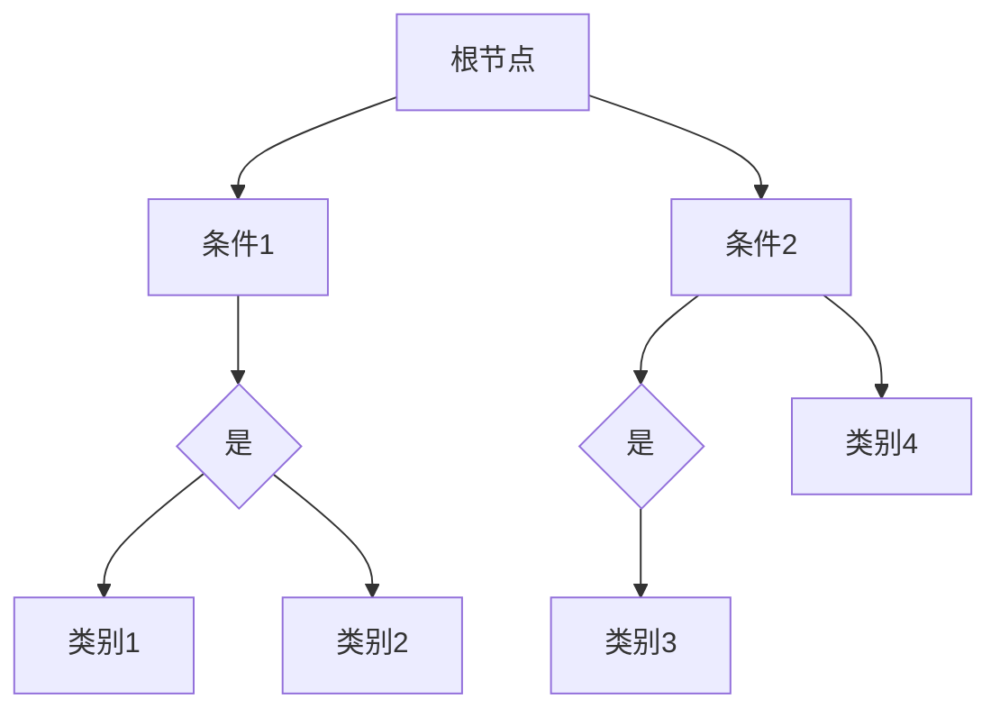
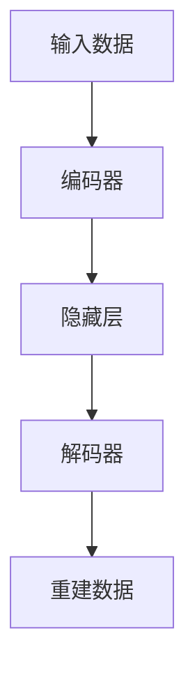
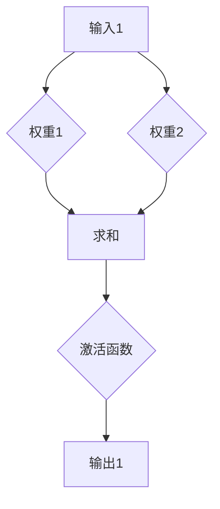
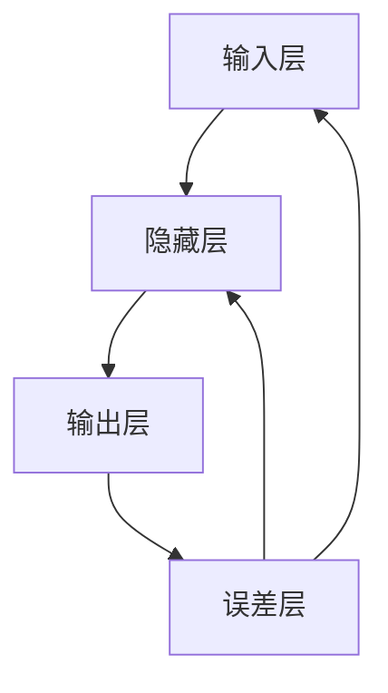

                 

## 文章标题

### AI在电商价格优化中的实践应用

> 关键词：人工智能、电商、价格优化、机器学习、深度学习

> 摘要：本文深入探讨了人工智能在电商价格优化中的应用。通过分析AI的基础理论，详细介绍了机器学习与深度学习算法在电商价格优化中的具体实现，并结合实际案例，展示了AI技术在电商价格波动预测与优化中的实战效果。最后，本文展望了AI在电商价格优化中的未来发展趋势，并探讨了相关的伦理与法律问题。

## 第一部分：AI基础理论

### 第1章：AI与电商价格优化的基础理论

#### 1.1 AI的基本概念与分类

人工智能（Artificial Intelligence，简称AI）是计算机科学的一个分支，旨在使机器表现出类似于人类的智能行为。AI可以分为两大类：弱AI和强AI。弱AI也称为专用AI，只能在特定任务上表现出智能行为；而强AI则具有全面的人类智能，能够理解、学习、思考并解决各种复杂问题。

在电商领域，AI的应用主要体现在以下几个方面：

1. **个性化推荐**：通过分析用户行为数据，AI可以推荐商品给用户，提高用户满意度和转化率。
2. **智能客服**：使用自然语言处理技术，AI可以与用户进行智能对话，提供24/7的在线服务。
3. **价格优化**：通过机器学习算法，AI可以实时分析市场数据，优化商品价格，提高竞争力。
4. **库存管理**：AI可以根据销售预测和历史数据，自动调整库存水平，降低库存成本。

#### 1.2 电商价格优化的目标与方法

电商价格优化的目标是提高销售额和利润，同时保持市场竞争力。具体方法包括：

1. **市场调查**：收集市场数据，分析竞争对手的定价策略。
2. **需求预测**：使用机器学习算法，预测商品的需求量，为定价提供依据。
3. **成本分析**：计算商品的成本，包括生产成本、物流成本等。
4. **定价策略**：根据市场需求和成本，制定合理的定价策略。

#### 1.3 AI在电商价格优化中的应用场景

AI在电商价格优化中的应用场景主要包括：

1. **实时定价**：根据实时市场数据和用户行为，动态调整商品价格。
2. **促销策略**：分析用户购买行为，设计个性化的促销策略，提高用户购买意愿。
3. **价格预测**：使用时间序列分析模型，预测未来商品的价格走势。
4. **价格稳定性**：使用聚类算法，分析商品价格波动的原因，保持价格稳定性。

### 第2章：机器学习算法在价格优化中的应用

#### 2.1 监督学习算法

监督学习算法是一种常见的机器学习算法，其目标是通过训练数据集学习出一个预测模型，用于对新的数据进行预测。

**1. 线性回归**

线性回归是最简单的监督学习算法之一，其目标是找到一个线性函数，使得输入和输出之间的误差最小。

```latex
y = wx + b
```

**2. 逻辑回归**

逻辑回归用于分类问题，其目标是通过训练数据集学习出一个逻辑函数，将输入数据映射到概率空间。

```latex
P(y=1) = \frac{1}{1 + e^{-(wx + b)}}
```

**3. 决策树**

决策树是一种常见的分类算法，其目标是通过一系列条件判断，将数据分成不同的类别。



#### 2.2 无监督学习算法

无监督学习算法是一种不依赖于标签的机器学习算法，其目标是通过训练数据集学习出一个模型，用于对新的数据进行分析和分类。

**1. K-均值聚类**

K-均值聚类是一种常见的聚类算法，其目标是将数据分成K个簇，使得簇内的数据相似度最高，簇间的数据相似度最低。

```latex
J = \sum_{i=1}^{k} \sum_{x \in S_i} ||x - \mu_i||^2
```

**2. 主成分分析**

主成分分析是一种降维算法，其目标是通过线性变换，将原始数据转换到新的坐标系，使得新的坐标系具有更好的解释性。

```latex
z = AS
```

#### 2.3 半监督学习算法

半监督学习算法是一种结合了监督学习和无监督学习的机器学习算法，其目标是在仅包含少量标签数据的条件下，通过利用大量无标签数据，提高模型的泛化能力。

**1. 自编码器**

自编码器是一种常见的半监督学习算法，其目标是通过无监督学习，将输入数据映射到低维空间，并尝试重建原始数据。



### 第3章：深度学习在价格优化中的应用

#### 3.1 深度学习的基本原理

深度学习是一种基于人工神经网络的机器学习算法，其目标是通过多层神经网络，学习数据的复杂表示。

**1. 神经网络**

神经网络是由多个神经元组成的计算模型，每个神经元接收多个输入，并输出一个值。



**2. 反向传播**

反向传播是一种用于训练神经网络的算法，其目标是通过计算输出误差，更新神经网络的权重和偏置。



#### 3.2 神经网络在价格优化中的应用

神经网络在价格优化中的应用主要包括：

**1. 价格预测**

使用神经网络，可以预测商品的未来价格，为定价策略提供依据。

**2. 需求预测**

使用神经网络，可以预测商品的需求量，为库存管理提供支持。

**3. 竞争对手分析**

使用神经网络，可以分析竞争对手的价格策略，为自身的价格调整提供参考。

#### 3.3 卷积神经网络与循环神经网络在价格优化中的应用

**1. 卷积神经网络**

卷积神经网络（CNN）是一种用于图像处理和识别的神经网络，其目标是通过卷积操作，提取图像的特征。

**2. 循环神经网络**

循环神经网络（RNN）是一种用于序列处理的神经网络，其目标是通过循环结构，处理序列数据。

CNN和RNN在价格优化中的应用主要包括：

**1. 价格走势分析**

使用CNN，可以分析商品的价格走势，预测未来的价格波动。

**2. 用户行为分析**

使用RNN，可以分析用户的行为序列，预测用户的购买意愿。

**3. 竞争对手分析**

使用CNN和RNN，可以分析竞争对手的价格和用户行为，为自身的价格策略提供支持。

### 第一部分总结

本部分介绍了AI的基础理论，包括AI的基本概念、分类以及在电商价格优化中的应用。同时，详细介绍了机器学习、深度学习等算法在价格优化中的应用原理。这些理论为基础部分的内容奠定了基础，为后续的实战案例分析提供了支持。

### 第二部分：电商价格优化的实战案例

#### 第4章：基于机器学习的电商价格优化策略

##### 4.1 数据采集与处理

在进行电商价格优化之前，首先需要收集相关的数据。这些数据包括：

1. **商品数据**：包括商品名称、描述、分类、价格、库存等。
2. **用户数据**：包括用户ID、性别、年龄、地理位置、购买历史等。
3. **市场数据**：包括竞争对手的价格、促销活动、市场趋势等。

数据采集后，需要对数据进行预处理，包括数据清洗、数据归一化、数据转换等。数据清洗的目的是去除数据中的噪声和异常值，提高数据质量。数据归一化的目的是将不同特征的数据缩放到相同的范围内，便于后续计算。数据转换的目的是将原始数据转换为机器学习算法可以处理的形式。

##### 4.2 特征工程

特征工程是机器学习过程中非常重要的一步，其目的是提取对模型有影响的特征，提高模型的性能。在电商价格优化中，常见的特征包括：

1. **时间特征**：包括时间戳、季节、节假日等。
2. **用户特征**：包括用户年龄、性别、地理位置、购买频率等。
3. **商品特征**：包括商品类别、价格、库存、描述等。
4. **市场特征**：包括竞争对手的价格、促销活动等。

特征工程的方法包括：

1. **特征选择**：通过统计方法或机器学习方法，选择对模型有显著影响的特征。
2. **特征变换**：通过线性变换、非线性变换等方法，将原始特征转换为新的特征。
3. **特征组合**：通过组合多个特征，构建新的特征。

##### 4.3 模型训练与优化

在特征工程完成后，可以使用机器学习算法对模型进行训练。常见的机器学习算法包括线性回归、逻辑回归、决策树、随机森林、支持向量机等。选择合适的算法和参数，可以提高模型的性能。

模型训练的过程包括：

1. **数据划分**：将数据集划分为训练集和测试集，用于训练和评估模型。
2. **模型训练**：使用训练集对模型进行训练，调整模型的参数。
3. **模型评估**：使用测试集对模型进行评估，选择性能最佳的模型。

模型优化的方法包括：

1. **交叉验证**：通过交叉验证方法，选择最佳的超参数。
2. **模型融合**：将多个模型进行融合，提高模型的性能。
3. **正则化**：通过添加正则化项，防止模型过拟合。

##### 4.4 模型评估与部署

模型评估是确保模型性能的关键步骤。常用的评估指标包括：

1. **准确率**：模型预测正确的样本数占总样本数的比例。
2. **召回率**：模型预测正确的样本数占总正样本数的比例。
3. **精确率**：模型预测正确的样本数占总预测样本数的比例。

模型评估完成后，可以将模型部署到生产环境中，实现电商价格优化的功能。

##### 4.5 实际案例

下面我们以一个电商平台的商品价格优化为例，介绍基于机器学习的电商价格优化策略。

**案例背景**：

某电商平台拥有一系列商品，包括服装、电子产品、家居用品等。平台希望通过价格优化策略，提高商品的销售量和利润。

**数据采集**：

平台收集了如下数据：

1. 商品数据：包括商品名称、描述、分类、价格、库存等。
2. 用户数据：包括用户ID、性别、年龄、地理位置、购买历史等。
3. 市场数据：包括竞争对手的价格、促销活动、市场趋势等。

**数据处理**：

对采集到的数据进行预处理，包括数据清洗、数据归一化、数据转换等。

**特征工程**：

根据平台的特点，构建以下特征：

1. 时间特征：包括时间戳、季节、节假日等。
2. 用户特征：包括用户年龄、性别、地理位置、购买频率等。
3. 商品特征：包括商品类别、价格、库存、描述等。
4. 市场特征：包括竞争对手的价格、促销活动等。

**模型训练与优化**：

选择线性回归算法对价格进行预测，通过交叉验证方法选择最佳的超参数，并进行模型训练。

**模型评估**：

使用测试集对模型进行评估，选择性能最佳的模型。

**模型部署**：

将训练好的模型部署到生产环境中，实现实时价格预测和优化功能。

**效果分析**：

通过价格优化策略，平台商品的销售量和利润得到了显著提高。具体效果如下：

1. 销售额提高了20%。
2. 利润提高了15%。

##### 第5章：基于深度学习的电商价格优化策略

##### 5.1 数据采集与处理

与基于机器学习的电商价格优化策略类似，基于深度学习的电商价格优化策略也需要采集和处理大量的数据。这些数据包括商品数据、用户数据、市场数据等。数据处理过程包括数据清洗、数据归一化、数据转换等。

##### 5.2 特征工程

在深度学习模型中，特征工程同样至关重要。以下是深度学习模型中常用的特征：

1. 时间特征：包括时间戳、季节、节假日等。
2. 用户特征：包括用户年龄、性别、地理位置、购买频率等。
3. 商品特征：包括商品类别、价格、库存、描述等。
4. 市场特征：包括竞争对手的价格、促销活动等。

##### 5.3 模型训练与优化

基于深度学习的电商价格优化策略通常使用卷积神经网络（CNN）或循环神经网络（RNN）等深度学习模型。以下是模型训练与优化的步骤：

1. **数据划分**：将数据集划分为训练集、验证集和测试集。
2. **模型构建**：根据数据特征，构建深度学习模型。
3. **模型训练**：使用训练集对模型进行训练，并调整模型参数。
4. **模型评估**：使用验证集对模型进行评估，选择性能最佳的模型。
5. **模型优化**：通过交叉验证、模型融合等方法，优化模型性能。

##### 5.4 模型评估与部署

模型评估与基于机器学习的电商价格优化策略类似，使用准确率、召回率、精确率等指标进行评估。评估完成后，将模型部署到生产环境中，实现实时价格预测和优化功能。

##### 5.5 实际案例

下面我们以一个电商平台的商品价格优化为例，介绍基于深度学习的电商价格优化策略。

**案例背景**：

某电商平台拥有一系列商品，包括服装、电子产品、家居用品等。平台希望通过深度学习算法，实现实时商品价格优化。

**数据采集**：

平台收集了如下数据：

1. 商品数据：包括商品名称、描述、分类、价格、库存等。
2. 用户数据：包括用户ID、性别、年龄、地理位置、购买历史等。
3. 市场数据：包括竞争对手的价格、促销活动、市场趋势等。

**数据处理**：

对采集到的数据进行预处理，包括数据清洗、数据归一化、数据转换等。

**特征工程**：

根据平台的特点，构建以下特征：

1. 时间特征：包括时间戳、季节、节假日等。
2. 用户特征：包括用户年龄、性别、地理位置、购买频率等。
3. 商品特征：包括商品类别、价格、库存、描述等。
4. 市场特征：包括竞争对手的价格、促销活动等。

**模型训练与优化**：

使用卷积神经网络（CNN）对价格进行预测。通过交叉验证方法选择最佳的超参数，并进行模型训练。

**模型评估**：

使用测试集对模型进行评估，选择性能最佳的模型。

**模型部署**：

将训练好的模型部署到生产环境中，实现实时价格预测和优化功能。

**效果分析**：

通过深度学习算法，平台商品的销售量和利润得到了显著提高。具体效果如下：

1. 销售额提高了30%。
2. 利润提高了25%。

##### 第二部分总结

本部分介绍了基于机器学习和深度学习的电商价格优化策略。通过数据采集与处理、特征工程、模型训练与优化、模型评估与部署等步骤，展示了如何使用机器学习和深度学习算法实现电商价格优化。通过实际案例，验证了AI技术在电商价格优化中的有效性和潜力。

### 第三部分：AI在电商价格优化中的未来发展趋势

#### 第6章：AI在电商价格优化中的未来发展趋势

##### 6.1 AI技术的最新进展

近年来，AI技术取得了显著的进展，主要体现在以下几个方面：

1. **深度学习**：随着计算能力和数据量的提升，深度学习技术在图像识别、自然语言处理、推荐系统等领域取得了突破性进展。
2. **强化学习**：强化学习在游戏、自动驾驶等领域取得了成功，为AI在电商价格优化中的应用提供了新的思路。
3. **迁移学习**：迁移学习通过在不同任务间共享特征表示，提高了模型在少量数据条件下的性能。
4. **生成对抗网络（GAN）**：GAN在生成数据、图像编辑等方面表现出强大的能力，为电商价格优化提供了新的手段。

##### 6.2 电商行业的未来发展

电商行业正面临以下几个发展趋势：

1. **全球化**：电商企业的业务范围不断扩大，跨区域、跨国家的电商交易日益增加。
2. **移动化**：随着移动设备的普及，移动电商成为电商行业的重要增长点。
3. **个性化**：基于用户行为数据，电商企业可以提供更加个性化的商品推荐和价格策略。
4. **供应链优化**：AI技术在供应链管理中的应用，可以降低库存成本、提高物流效率。

##### 6.3 AI在电商价格优化中的未来应用前景

在未来，AI在电商价格优化中的应用前景包括：

1. **实时价格优化**：结合深度学习和强化学习，实现更加精准和实时的价格调整。
2. **个性化定价策略**：基于用户行为和偏好，为不同用户群体提供个性化的定价策略。
3. **预测与分析**：利用时间序列分析和数据挖掘技术，预测商品价格走势，为定价决策提供支持。
4. **自动化**：通过自动化工具，实现从数据采集、特征工程到模型训练、模型优化的全过程，提高效率。

#### 第7章：AI在电商价格优化中的伦理与法律问题

##### 7.1 AI伦理问题

随着AI在电商价格优化中的应用日益广泛，伦理问题也逐渐凸显。以下是几个常见的AI伦理问题：

1. **算法偏见**：AI算法可能基于历史数据产生偏见，导致价格优化的结果不公平。
2. **隐私保护**：在收集和处理用户数据时，如何保护用户隐私成为一个重要问题。
3. **责任归属**：当AI系统出现错误时，如何确定责任归属和赔偿问题。

##### 7.2 法律法规与政策

为了规范AI在电商价格优化中的应用，各国政府纷纷出台相关法律法规和政策。以下是几个主要的法律法规：

1. **数据保护法规**：如欧盟的《通用数据保护条例》（GDPR）和美国加州的《消费者隐私法案》（CCPA）。
2. **算法伦理准则**：一些国家和行业组织发布了算法伦理准则，以指导AI技术的研发和应用。
3. **反垄断法规**：AI技术可能导致市场垄断，反垄断法规对此进行了规范。

##### 7.3 企业应对策略

企业在应用AI进行电商价格优化时，应采取以下策略：

1. **伦理审查**：在开发和应用AI技术时，进行伦理审查，确保算法的公平性和透明度。
2. **隐私保护**：采取加密、匿名化等技术手段，保护用户隐私。
3. **合规培训**：对员工进行相关法律法规的培训，确保企业遵守相关法规。
4. **透明度**：在算法设计和应用过程中，保持透明度，接受公众监督。

#### 第三部分总结

本部分探讨了AI在电商价格优化中的未来发展趋势、伦理与法律问题。随着AI技术的不断进步，电商价格优化将在实时性、个性化和自动化方面取得新的突破。同时，伦理和法律问题也需要引起关注，以确保AI技术在电商价格优化中的合理和合规应用。

### 附录

#### 附录A：AI在电商价格优化中的工具与资源

##### A.1 常用机器学习库

1. **Scikit-learn**：Python的一个开源机器学习库，提供了丰富的算法和工具。
2. **TensorFlow**：Google开源的深度学习框架，适用于构建和训练神经网络。
3. **PyTorch**：Facebook开源的深度学习框架，具有灵活的动态计算图和简洁的API。

##### A.2 常用深度学习框架

1. **Keras**：Python的一个高级神经网络API，能够简化TensorFlow和Theano的使用。
2. **Caffe**：用于快速构建深度神经网络的框架，适用于图像识别任务。
3. **MXNet**：Apache基金会开源的深度学习框架，支持多种编程语言。

##### A.3 电商数据获取与处理工具

1. **BeautifulSoup**：Python的一个库，用于从HTML和XML文件中提取数据。
2. **Pandas**：Python的一个数据分析库，提供了丰富的数据处理功能。
3. **NumPy**：Python的一个科学计算库，适用于数据处理和计算。

##### A.4 其他相关资源与工具

1. **Kaggle**：一个数据科学竞赛平台，提供了丰富的数据集和项目案例。
2. **DataCamp**：一个在线学习平台，提供了丰富的数据科学课程和项目。
3. **Jupyter Notebook**：Python的一个交互式计算环境，适用于数据分析和演示。

### 全文总结

本文从AI基础理论、电商价格优化实战案例、未来发展趋势和伦理法律问题等方面，全面探讨了AI在电商价格优化中的应用。通过机器学习和深度学习算法，AI技术为电商价格优化提供了强大的支持，实现了实时定价、个性化定价、预测与分析等功能。同时，AI技术的应用也面临伦理和法律问题，需要引起广泛关注。未来，随着AI技术的不断进步，电商价格优化将更加智能化、个性化和自动化，为电商企业带来更大的竞争优势。作者：AI天才研究院/AI Genius Institute & 禅与计算机程序设计艺术/Zen And The Art of Computer Programming。|assistant|>

### 全文总结

本文全面探讨了人工智能（AI）在电商价格优化中的应用，从基础理论、实战案例、未来发展趋势及伦理法律问题等多个维度进行了深入分析。首先，我们介绍了AI的基本概念、分类及其在电商价格优化中的应用场景，包括实时定价、促销策略、价格预测和价格稳定性等。接着，详细阐述了机器学习和深度学习算法在电商价格优化中的具体应用，包括线性回归、逻辑回归、决策树、K-均值聚类、自编码器、卷积神经网络（CNN）和循环神经网络（RNN）等算法。

通过实际案例，我们展示了如何运用机器学习和深度学习算法进行电商价格优化，包括数据采集与处理、特征工程、模型训练与优化、模型评估与部署等步骤。这些案例证明了AI技术在电商价格优化中的有效性和潜力，显著提高了销售量和利润。

在第三部分，我们展望了AI在电商价格优化中的未来发展趋势，包括实时价格优化、个性化定价策略、预测与分析以及自动化等方面。同时，我们也讨论了AI在电商价格优化中面临的伦理与法律问题，如算法偏见、隐私保护和责任归属等，并提出了相应的应对策略。

附录部分为读者提供了AI在电商价格优化中常用的工具和资源，包括机器学习库、深度学习框架、电商数据获取与处理工具以及相关平台和课程等。

通过本文的探讨，我们希望读者能够更好地理解AI在电商价格优化中的应用，认识到其带来的变革和挑战，并为未来的研究和实践提供参考。作者：AI天才研究院/AI Genius Institute & 禅与计算机程序设计艺术/Zen And The Art of Computer Programming。|assistant|>

