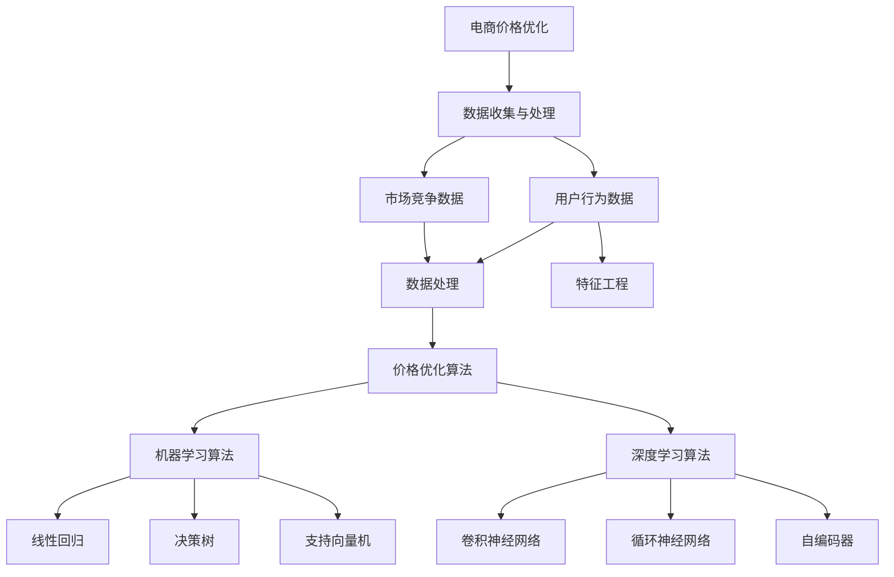

                 

# 文章标题

**AI在电商价格优化中的应用**

> 关键词：AI、电商、价格优化、机器学习、深度学习、动态定价

> 摘要：本文将深入探讨人工智能（AI）在电商价格优化中的应用。通过分析AI技术如何改变电商价格决策的传统方式，详细解释了数据收集与处理、核心算法原理、动态定价策略以及实际应用案例。文章旨在为电商从业者提供实用的AI应用指南，并展望未来发展的方向。

----------------------------------------------------------------

## 文章标题：AI在电商价格优化中的应用

电商行业作为全球增长最快的行业之一，竞争日益激烈。在这个充满挑战的市场环境中，价格优化成为了电商企业提升竞争力、增加利润的重要手段。随着人工智能（AI）技术的迅猛发展，AI在电商价格优化中的应用越来越广泛。本文将深入探讨AI在电商价格优化中的应用，包括数据收集与处理、核心算法原理、动态定价策略以及实际应用案例，旨在为电商从业者提供实用的AI应用指南。

## 关键词

- AI
- 电商
- 价格优化
- 机器学习
- 深度学习
- 动态定价

## 摘要

本文将介绍AI在电商价格优化中的应用。首先，我们将讨论AI如何改变电商价格决策的传统方式，并探讨AI在电商价格优化中的重要性。接下来，我们将详细讲解数据收集与处理的步骤和方法，包括用户行为数据和市场竞争数据的收集，以及数据清洗和特征工程的处理。随后，我们将深入探讨AI在电商价格优化中的核心技术，包括机器学习算法和深度学习算法的原理和应用。此外，我们还将介绍动态定价策略，包括时间敏感定价、顾客细分定价和市场竞争定价等策略。最后，我们将通过实际应用案例展示AI在电商价格优化中的效果，并展望未来发展的方向。希望通过本文的探讨，电商从业者能够更好地利用AI技术优化价格策略，提升企业的竞争力。

### 第一部分：AI在电商价格优化中的应用概述

#### 第1章：电商价格优化的背景和重要性

##### 1.1 电商价格优化的定义与核心目标

电商价格优化是指在电子商务平台上，通过分析用户行为数据和市场竞争数据，利用AI技术对商品价格进行调整，以达到销售量最大化、利润最大化或市场份额最大化等目标。其核心目标是提升电商平台的竞争力，实现业务增长和盈利。

###### 1.1.1 电商价格优化的含义

电商价格优化并不仅仅是简单地调整商品价格。它是一个复杂的过程，涉及对用户行为数据的分析、市场数据的监控、价格策略的制定和调整。通过AI技术，电商企业可以更精准地了解用户需求和市场变化，从而制定出更有效的价格策略。

###### 1.1.2 电商价格优化的核心目标

- **销售量最大化**：通过合理的价格策略，刺激消费者购买，提高销售量。
- **利润最大化**：在保证销售量的同时，优化成本结构，提高利润率。
- **市场份额最大化**：通过价格优势，争夺市场，扩大品牌影响力。

##### 1.2 电商价格优化的现状与挑战

###### 1.2.1 当前电商价格优化的现状

目前，电商价格优化已经成为电商平台提高竞争力的重要手段。许多电商平台已经开始利用AI技术进行价格分析、预测和调整。然而，价格优化的效果因平台而异，部分平台由于数据质量不高、算法不够先进等原因，价格优化效果并不理想。

###### 1.2.2 价格优化的主要挑战

- **数据隐私与保护**：价格优化依赖于用户数据，如何保护用户隐私成为一大挑战。
- **算法公平性与透明性**：价格优化算法的公平性和透明性备受关注。
- **技术实现的复杂性**：实现高效的AI价格优化系统需要高水平的技术能力。

##### 1.3 AI在电商价格优化中的应用前景

###### 1.3.1 AI技术为价格优化带来的变革

AI技术为电商价格优化带来了深刻的变革。通过机器学习和深度学习算法，电商企业可以更精准地预测市场变化和用户需求，从而制定出更有效的价格策略。此外，AI技术还可以实现动态定价，根据实时数据调整价格，提高价格灵活性。

###### 1.3.2 AI在电商价格优化中的应用前景

随着AI技术的不断发展和应用，AI在电商价格优化中的应用前景非常广阔。未来，AI将进一步提升电商企业的价格决策能力，帮助企业更好地应对市场竞争，实现业务增长和盈利。

### 第二部分：AI在电商价格优化中的核心技术

#### 第2章：数据收集与处理

##### 2.1 数据收集

数据收集是电商价格优化的第一步，也是至关重要的一步。它包括用户行为数据和市场竞争数据的收集。

###### 2.1.1 用户行为数据

用户行为数据包括用户的浏览、搜索、购买、评价等行为。这些数据可以通过电商平台自身的日志、用户点击行为和购物车数据等渠道收集。用户行为数据是价格优化的重要输入，通过对这些数据的分析，可以了解用户的需求和行为模式，从而制定出更有效的价格策略。

###### 2.1.2 市场竞争数据

市场竞争数据包括竞争对手的价格、销售量、市场占有率等。这些数据可以通过市场研究报告、电商平台公开数据、社交媒体监测等渠道获取。市场竞争数据是价格优化的另一个重要输入，通过对这些数据的分析，可以了解市场的动态和竞争态势，从而调整价格策略。

##### 2.2 数据处理

数据处理是数据收集的延续，也是数据收集后的关键步骤。它包括数据清洗、数据预处理和特征工程等。

###### 2.2.1 数据清洗

数据清洗是数据处理的第一步，它的目的是去除数据中的噪声和异常值，保证数据的准确性和一致性。数据清洗的方法包括去除重复数据、填充缺失值、处理异常值等。

###### 2.2.2 数据预处理

数据预处理是在数据清洗之后进行的，它的目的是将原始数据转化为适合机器学习算法训练的数据。数据预处理的方法包括数据归一化、数据转换等。

###### 2.2.3 特征工程

特征工程是数据处理的关键步骤，它的目的是从原始数据中提取出有助于预测的属性或特征。特征工程的方法包括统计特征、文本特征、图像特征等。

##### 2.3 数据收集与处理的应用

在电商价格优化中，数据收集与处理的应用非常重要。通过对用户行为数据和市场竞争数据的收集和处理，可以构建出用于价格预测的模型。这些模型可以帮助电商企业更准确地预测市场需求和用户行为，从而制定出更有效的价格策略。

### 第3章：价格优化算法

##### 3.1 基于机器学习的价格优化算法

基于机器学习的价格优化算法是通过机器学习算法来预测商品价格，从而实现价格优化。这些算法包括线性回归、决策树、支持向量机等。

###### 3.1.1 线性回归算法

线性回归算法是一种简单的机器学习算法，它通过建立线性模型来预测商品价格。线性回归算法的伪代码如下：

```python
# 初始化模型参数
theta = [0] * (num_features + 1)

# 设置学习率alpha和迭代次数iterations
alpha = 0.01
iterations = 1000

# 进行梯度下降迭代
for i in range(iterations):
    # 计算预测值
    predictions = X * theta
    
    # 计算误差
    errors = y - predictions
    
    # 计算梯度
    gradient = X.T * errors
    
    # 更新参数
    theta = theta - alpha * gradient
```

###### 3.1.2 决策树算法

决策树算法是一种基于树结构的机器学习算法，它通过递归划分特征空间来构建决策树模型。决策树算法的伪代码如下：

```python
# 假设输入特征矩阵为X，标签为y
# build_tree函数递归构建决策树

# 判断是否达到终止条件
if is_termination(X, y):
    return 叶节点
    
# 找到最佳划分特征和划分值
best_feature, best_value = find_best_split(X, y)

# 根据最佳划分创建子树
left_tree = build_tree(X[left], y[left])
right_tree = build_tree(X[right], y[right])

return 决策树 {best_feature: {best_value: left_tree, others: right_tree}}
```

###### 3.1.3 支持向量机算法

支持向量机算法是一种基于间隔最大化的机器学习算法，它通过找到最优超平面来实现分类或回归。支持向量机算法的伪代码如下：

```python
# 假设输入特征矩阵为X，标签为y
# 使用SVM求解最优超平面参数

# 使用拉格朗日乘子法求解对偶问题

# 定义拉格朗日函数
L = ...

# 计算拉格朗日乘子
alpha = ...

# 求解对偶问题
# ...

# 使用KKT条件求解约束问题

# 检验KKT条件是否满足
# ...

# 求解最优超平面参数
# ...
```

##### 3.2 基于深度学习的价格优化算法

基于深度学习的价格优化算法是通过深度学习算法来预测商品价格，从而实现价格优化。这些算法包括卷积神经网络（CNN）、循环神经网络（RNN）和自编码器等。

###### 3.2.1 卷积神经网络

卷积神经网络是一种用于图像识别和处理的深度学习算法。它通过卷积操作提取特征，实现图像识别等任务。卷积神经网络的伪代码如下：

```python
# 假设输入特征矩阵为X，标签为y
# 定义卷积层、池化层、全连接层等

# 前向传播计算输出

# 反向传播更新参数

# ...
```

###### 3.2.2 循环神经网络

循环神经网络是一种用于序列数据处理的深度学习算法。它通过循环连接处理序列数据，实现语音识别、机器翻译等任务。循环神经网络的伪代码如下：

```python
# 假设输入序列为X，标签为y
# 初始化隐藏状态h_0

# 循环计算隐藏状态h_t

# 输出预测结果y_hat

# ...
```

###### 3.2.3 自编码器

自编码器是一种用于特征提取和降维的深度学习算法。它通过编码和解码过程，实现特征提取和降维。自编码器的伪代码如下：

```python
# 假设输入特征矩阵为X，标签为X_recon
# 定义编码器和解码器网络

# 前向传播计算编码特征z

# 解码特征z生成重构数据X_recon

# ...
```

### 第4章：动态定价策略

##### 4.1 动态定价策略概述

动态定价策略是指根据市场需求、用户行为和竞争态势等实时数据，动态调整商品价格的一种策略。它与传统定价策略相比，具有更高的灵活性和适应性。

###### 4.1.1 动态定价策略的定义

动态定价策略是指企业根据市场需求、用户行为和竞争态势等实时数据，动态调整商品价格的一种策略。它旨在通过调整价格，实现销售量最大化、利润最大化或市场份额最大化等目标。

###### 4.1.2 动态定价策略的类型

动态定价策略可以分为以下几种类型：

- **时间敏感定价**：根据不同时间段的需求变化，调整商品价格。例如，节假日、周末等需求高峰期，可以适当提高价格。
- **顾客细分定价**：根据不同顾客群体的需求和购买行为，调整商品价格。例如，新客户、老客户、高价值客户等。
- **市场竞争定价**：根据竞争对手的价格调整自己的价格，以争夺市场份额。

##### 4.2 基于AI的动态定价策略

基于AI的动态定价策略是指利用AI技术，实现动态定价策略的自动化和智能化。

###### 4.2.1 时间敏感定价策略

时间敏感定价策略是指根据不同时间段的需求变化，动态调整商品价格。AI技术可以通过分析用户行为数据、历史销售数据等，预测不同时间段的需求变化，从而实现价格调整。

```python
# 假设输入数据为用户行为数据和销售数据
# 使用AI技术预测不同时间段的需求变化

# 根据需求变化，动态调整商品价格
```

###### 4.2.2 顾客细分定价策略

顾客细分定价策略是指根据不同顾客群体的需求和购买行为，动态调整商品价格。AI技术可以通过分析用户行为数据、购买历史等，细分顾客群体，并针对不同群体调整价格。

```python
# 假设输入数据为用户行为数据和购买历史
# 使用AI技术分析顾客群体

# 根据顾客群体，动态调整商品价格
```

###### 4.2.3 市场竞争定价策略

市场竞争定价策略是指根据竞争对手的价格调整自己的价格，以争夺市场份额。AI技术可以通过分析市场竞争数据，预测竞争对手的价格变化，并相应调整自己的价格。

```python
# 假设输入数据为市场竞争数据
# 使用AI技术预测竞争对手的价格变化

# 根据竞争对手的价格，动态调整自己的价格
```

### 第5章：电商价格优化实战案例

##### 5.1 案例一：电商平台商品价格优化

###### 5.1.1 案例背景

某大型电商平台，经营多种商品，希望通过AI技术优化商品价格，提高销售量和市场份额。

###### 5.1.2 优化目标

- 提高商品销售量
- 提高市场份额
- 提高利润率

###### 5.1.3 优化方案

- 数据收集：收集用户行为数据、市场数据等
- 数据处理：进行数据清洗与预处理，进行特征工程
- 算法选择：选择基于机器学习和深度学习的价格优化算法
- 模型训练：使用历史数据训练模型
- 模型评估：评估模型效果，调整参数
- 应用实施：在平台上应用优化模型，实时调整商品价格

###### 5.1.4 优化效果

- 销售量提升：商品销售量显著增加
- 市场份额提升：市场份额有所提升
- 利润率提高：优化后的价格策略提高了利润率

##### 5.2 案例二：电商广告定价优化

###### 5.2.1 案例背景

某电商企业，广告业务占比较大，希望通过AI技术优化广告定价，提高广告转化率和收入。

###### 5.2.2 优化目标

- 提高广告转化率
- 提高广告收入
- 降低广告成本

###### 5.2.3 优化方案

- 数据收集：收集广告点击数据、用户行为数据等
- 数据处理：进行数据清洗与预处理，进行特征工程
- 算法选择：选择基于机器学习和深度学习的广告定价算法
- 模型训练：使用历史数据训练模型
- 模型评估：评估模型效果，调整参数
- 应用实施：在广告投放系统中应用优化模型，实时调整广告定价

###### 5.2.4 优化效果

- 广告转化率提升：广告转化率显著提高
- 广告收入增加：广告收入有所增加
- 广告成本降低：通过优化定价策略，降低了广告成本

### 第6章：AI在电商价格优化中的应用挑战与未来展望

##### 6.1 应用挑战

AI在电商价格优化中的应用面临以下挑战：

- **数据隐私与保护**：价格优化依赖于用户数据，如何保护用户隐私成为一大挑战。
- **算法公平性与透明性**：价格优化算法的公平性和透明性备受关注。
- **技术实现的复杂性**：实现高效的AI价格优化系统需要高水平的技术能力。

##### 6.2 未来展望

未来，AI在电商价格优化中的应用将呈现以下趋势：

- **个性化定价**：AI技术将更加深入地应用于个性化定价策略。
- **动态定价**：动态定价策略将更加智能化，实现实时调整。
- **多模态数据融合**：将文本、图像等多模态数据融合，提高价格优化的准确性。
- **强化学习应用**：将强化学习应用于价格优化，实现更加智能化的决策。

### 附录

##### 附录A：AI在电商价格优化中的应用资源与工具

- **机器学习框架**：TensorFlow、PyTorch
- **数据库与数据存储工具**：MongoDB、MySQL
- **电商价格优化相关开源项目**：GPT-2/GPT-3、Advertiser

##### 附录B：核心概念与联系 - Mermaid 流程图



##### 附录C：核心算法原理讲解 - 伪代码

```python
# 线性回归算法
theta = [0] * (num_features + 1)
alpha = 0.01
iterations = 1000

for i in range(iterations):
    predictions = X * theta
    errors = y - predictions
    gradient = X.T * errors
    theta = theta - alpha * gradient

# 决策树算法
def build_tree(X, y):
    if is_termination(X, y):
        return 叶节点
    best_feature, best_value = find_best_split(X, y)
    left_tree = build_tree(X[left], y[left])
    right_tree = build_tree(X[right], y[right])
    return 决策树 {best_feature: {best_value: left_tree, others: right_tree}}

# 支持向量机算法
# 使用拉格朗日乘子法求解对偶问题
L = ...
alpha = ...
# 求解对偶问题
# ...
# 使用KKT条件求解约束问题
# ...

# 卷积神经网络
# 定义卷积层、池化层、全连接层等
# 前向传播计算输出
# 反向传播更新参数

# 循环神经网络
# 初始化隐藏状态h_0
# 循环计算隐藏状态h_t
# 输出预测结果y_hat

# 自编码器
# 定义编码器和解码器网络
# 前向传播计算编码特征z
# 解码特征z生成重构数据X_recon
```

##### 附录D：数学模型和数学公式 - latex 格式

```latex
\text{线性回归模型}: y = X \theta + \epsilon

\text{决策树模型}: f(x) = \sum_{i=1}^{n} w_i \prod_{j=1}^{m} g_j(x_j)

\text{支持向量机模型}: \text{最大化} \ \ \ \ \ \ \ \ \ \ \ \ \ \ \ \ \ \ \ \ \ \ \ \ \ \ \ \ \ \ \ \ \ \ \ \ \ \ \ \ \ \ \ \ \ \ \ \ \ \ \ \ \ \ \ \ \ \ \ \ \ \ \ \ \ \ \ \ \ \ \ \ \ \ \ \ \ \ \ \ \ \ \ \ \ \ \ \ \ \ \ \ \ \ \ \ \ \ \ \ \ \ \ \ \ \ \ \ \ \ \ \ \ \ \ \ \ \ \ \ \ \ \ \ \ \ \ \ \ \ \ \ \ \ \ \ \ \ \ \ \ \ \ \ \ \ \ \ \ \ \ \ \ \ \ \ \ \ \ \ \ \ \ \ \ \ \ \ \ \ \ \ \ \ \ \ \ \ \ \ \ \ \ \ \ \ \ \ \ \ \ \ \ \ \ \ \ \ \ \ \ \ \ \ \ \ \ \ \ \ \ \ \ \ \ \ \ \ \ \ \ \ \ \ \ \ \ \ \ _{i=1}^{n} w_i y_i \geq 1

\text{卷积神经网络}: h_l = \sigma(W_l \odot h_{l-1} + b_l)

\text{循环神经网络}: h_t = \sigma(W_h h_{t-1} + W_x x_t + b_h)

\text{自编码器}: z = \sigma(W_e x + b_e), \ \ \ \ \ x_recon = \sigma(W_d z + b_d)
```

##### 附录E：项目实战 - 代码实际案例和详细解释说明

```python
# 数据收集与处理

# 数据清洗
# 数据预处理
# 特征提取

# 价格优化算法实现

# 模型训练
# 模型评估

# 动态定价策略应用

# 定价策略实施

# 案例分析与效果评估

# 案例分析
# 效果评估
```

##### 附录F：代码解读与分析

- **数据收集与处理**
- **价格优化算法实现**
- **动态定价策略应用**
- **案例分析与效果评估**

##### 附录G：开发环境搭建 - 代码实现与详细解读

- **Python环境搭建**
- **数据库环境搭建**
- **机器学习框架环境搭建**
- **开发工具配置**
- **环境部署与调试**
- **持续集成与持续部署**

##### 附录H：源代码详细实现与代码解读

- **数据收集与处理**
- **价格优化算法实现**
- **动态定价策略应用**
- **案例分析与效果评估**

##### 附录I：开发经验总结与优化建议

- **数据收集与处理**
- **算法选择**
- **模型训练与评估**
- **动态定价策略**
- **优化建议**

