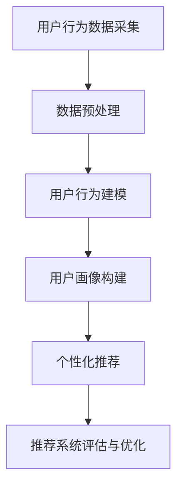
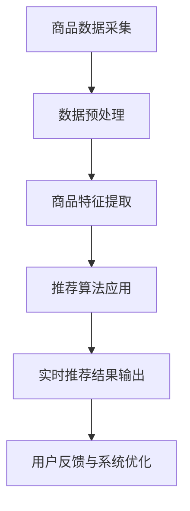
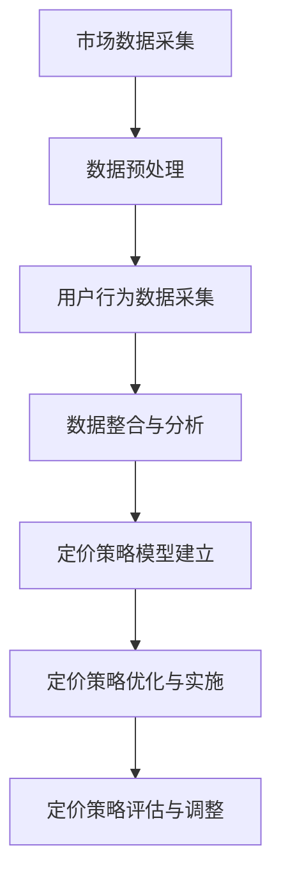

                 

# AI在电商平台产品优化中的具体应用

> 关键词：人工智能、电商平台、产品优化、个性化推荐、用户画像、商品质量检测、智能定价、区块链、伦理问题、未来趋势

> 摘要：本文旨在探讨人工智能在电商平台产品优化中的应用。通过对AI技术的基本概念、架构设计、应用实践、前沿探索以及未来趋势的详细分析，本文揭示了AI如何提升电商平台的产品优化效果，从而增强用户满意度、提升销售额和利润率。本文还包括了多个实际案例，展示了AI在电商平台中的成功应用。

## 引言

随着互联网技术的飞速发展，电商平台已经成为人们日常生活不可或缺的一部分。然而，在激烈的市场竞争环境中，如何提升产品优化效果，满足用户需求，提高用户满意度和平台销售额，成为电商平台面临的重大挑战。人工智能（AI）作为当前最热门的技术领域之一，其在电商平台产品优化中的应用已经成为研究者和实践者的关注焦点。

本文将围绕以下问题进行探讨：AI在电商平台产品优化中的具体应用是什么？如何通过AI技术实现数据采集与预处理、用户行为分析与个性化推荐、商品推荐系统、用户画像构建、商品质量检测与假货防范、智能定价策略以及电商平台运营优化？此外，本文还将探讨AI与区块链技术的结合、AI应用的伦理问题以及未来趋势。

本文的结构如下：

1. **第一部分：AI在电商平台产品优化中的具体应用基础**：介绍AI在电商平台产品优化中的背景与意义、基本概念与框架、数据采集与预处理方法。
2. **第二部分：AI在电商平台产品优化中的应用实践**：详细阐述用户行为分析与个性化推荐、商品推荐系统、电商平台用户画像构建、商品质量检测与假货防范、智能定价策略以及电商平台运营优化。
3. **第三部分：AI在电商平台产品优化中的前沿探索与未来趋势**：探讨人工智能与区块链技术的结合、AI应用的伦理问题以及未来趋势。

通过本文的详细分析，旨在为电商平台管理者、技术专家以及研究人员提供有价值的参考，帮助他们更好地理解和应用AI技术，实现产品优化，提升电商平台的核心竞争力。

### 第一部分: AI在电商平台产品优化中的具体应用基础

#### 第1章: AI在电商平台产品优化中的概念与框架

##### 1.1 AI在电商平台产品优化中的背景与意义

随着互联网技术的迅猛发展，电商平台已经成为现代商业不可或缺的一部分。然而，在市场竞争日益激烈的背景下，如何提升产品优化效果，满足用户需求，成为电商平台面临的重要课题。人工智能（AI）作为一种强大的技术手段，其在电商平台产品优化中的应用逐渐受到关注。

**电商平台产品优化的问题与挑战**

电商平台在产品优化方面面临着诸多挑战：

1. **用户需求多样且变化迅速**：用户需求的多样性和变化速度使得电商平台难以准确把握用户的真实需求，从而影响产品优化策略的有效性。
2. **市场竞争激烈**：众多电商平台在争夺有限的用户资源，优化效果的好坏直接关系到市场份额和用户忠诚度。
3. **数据处理难度大**：电商平台产生的大量用户行为数据、商品数据等，需要高效的数据处理和分析方法，以便提取有用的信息。

**AI技术在电商平台中的应用趋势**

AI技术的飞速发展，为电商平台产品优化提供了新的契机。以下是一些AI技术在电商平台中的应用趋势：

1. **个性化推荐**：通过分析用户行为数据，AI技术可以为用户提供个性化的商品推荐，提升用户满意度和转化率。
2. **用户画像构建**：基于用户行为数据和商品数据，AI技术可以构建详细的用户画像，帮助电商平台更好地了解用户需求和行为特征。
3. **商品质量检测与假货防范**：利用计算机视觉和深度学习技术，AI可以识别商品质量问题，防范假货，提升用户信任度和平台声誉。
4. **智能定价**：通过分析市场数据和用户行为，AI可以帮助电商平台制定智能化的定价策略，提升销售额和利润率。

**AI在电商平台产品优化中的核心价值**

AI技术在电商平台产品优化中的核心价值体现在以下几个方面：

1. **提高决策效率**：通过大数据分析和机器学习算法，AI可以帮助电商平台快速、准确地做出决策，优化产品和服务。
2. **提升用户体验**：通过个性化推荐和智能定价等应用，AI可以提供更加个性化的服务和体验，满足用户多样化需求。
3. **增强竞争力**：AI技术的应用可以帮助电商平台在激烈的市场竞争中脱颖而出，提升市场份额和用户忠诚度。

##### 1.2 AI在电商平台产品优化中的基本概念

**数据挖掘与机器学习**

数据挖掘（Data Mining）是指从大量数据中提取有价值的信息和知识的过程。在电商平台产品优化中，数据挖掘可以用于用户行为分析、市场趋势预测等。机器学习（Machine Learning）是数据挖掘的重要工具，通过训练模型，可以从数据中学习并做出预测。

**自然语言处理与计算机视觉**

自然语言处理（Natural Language Processing，NLP）是AI领域的一个分支，主要研究如何使计算机理解和生成自然语言。在电商平台中，NLP可以用于用户评论分析、商品描述生成等。计算机视觉（Computer Vision）则是使计算机理解和解释视觉信息的技术，可以用于商品识别、质量检测等。

**AI在电商平台产品优化中的核心算法**

1. **协同过滤算法**：协同过滤是一种常见的推荐算法，通过分析用户之间的相似度，为用户提供个性化的推荐。
2. **基于内容的推荐算法**：基于内容的推荐算法通过分析商品的属性和特征，为用户提供相关的推荐。
3. **深度学习算法**：深度学习是一种基于多层神经网络的算法，可以自动提取数据的复杂特征，常用于图像识别、自然语言处理等。

##### 1.3 AI在电商平台产品优化中的架构设计

**整体架构概述**

AI在电商平台产品优化中的整体架构主要包括以下几个层次：

1. **数据层**：负责数据的采集、存储和管理。
2. **算法层**：负责数据分析和模型训练，包括数据预处理、特征提取、模型训练等。
3. **应用层**：负责将算法结果应用于实际业务场景，如个性化推荐、智能定价、用户画像等。

**数据层、算法层与应用层的交互**

1. **数据层与算法层的交互**：数据层提供算法层所需的数据，算法层对数据进行分析和处理，生成模型和预测结果。
2. **算法层与应用层的交互**：算法层将处理结果通过API或其他接口提供给应用层，应用层根据用户需求和业务场景，调用算法层的功能。

**常见的AI产品优化模型**

1. **用户行为分析模型**：通过分析用户行为数据，预测用户的行为模式和需求，为个性化推荐和用户画像提供基础。
2. **商品推荐模型**：利用协同过滤、基于内容或深度学习算法，为用户推荐相关的商品。
3. **智能定价模型**：通过分析市场数据和用户行为，制定智能化的定价策略。
4. **质量检测与假货防范模型**：利用计算机视觉和深度学习算法，检测商品的质量问题和假货。

通过上述架构设计和核心算法，AI在电商平台产品优化中发挥着重要作用，为电商平台提供了强大的数据支持和智能决策能力。

### 第2章: 数据采集与预处理

#### 2.1 电商平台数据来源与类型

电商平台数据来源广泛，主要包括以下几种类型：

1. **用户行为数据**：包括用户登录、浏览、搜索、购买等行为。这些数据可以帮助平台了解用户的行为习惯和偏好，为个性化推荐和用户画像提供基础。
2. **商品数据**：包括商品的属性、价格、库存等。这些数据对于商品推荐、库存管理和定价策略至关重要。
3. **市场竞争数据**：包括竞争对手的销售额、价格变动等。这些数据可以帮助平台制定更加有效的市场策略。

**用户行为数据的定义与分类**

用户行为数据是指用户在电商平台上的各种操作行为，可以分为以下几类：

1. **浏览行为数据**：包括用户浏览的商品页面、浏览时间、浏览顺序等。
2. **搜索行为数据**：包括用户搜索的关键词、搜索时间、搜索频次等。
3. **购买行为数据**：包括用户购买的商品种类、数量、价格、购买时间等。
4. **互动行为数据**：包括用户评论、评分、咨询等互动行为。

**用户行为分析的目标与意义**

用户行为分析的主要目标是：

1. **理解用户需求**：通过分析用户行为数据，了解用户的兴趣和行为习惯，为个性化推荐提供依据。
2. **优化产品和服务**：根据用户行为分析结果，改进电商平台的产品和服务，提升用户体验。
3. **提升运营效率**：通过分析用户行为数据，优化运营策略，提高转化率和复购率。

用户行为分析对于电商平台具有重要意义：

1. **提升用户满意度**：通过个性化推荐和定制化服务，满足用户多样化需求，提升用户满意度。
2. **增强市场竞争力**：通过深入分析用户行为，制定更加精准的市场策略，增强平台竞争力。
3. **提高销售额和利润率**：通过优化产品推荐和定价策略，提升销售额和利润率。

#### 2.2 数据采集方法与技术

**客户端数据采集**

客户端数据采集是指通过客户端程序（如浏览器插件、手机App等）收集用户行为数据。常见的技术手段包括：

1. **日志文件**：通过记录客户端操作日志，收集用户行为数据。日志文件可以包括访问时间、访问页面、操作类型等。
2. **JavaScript脚本**：通过在客户端嵌入JavaScript脚本，实时收集用户行为数据，如点击、滚动等。
3. **Web beacon**：Web beacon是一种不可见的图像，用于跟踪用户的行为和活动。通过在网页中嵌入Web beacon，可以收集用户的行为数据。

**服务器日志数据采集**

服务器日志数据采集是指通过服务器日志文件收集用户行为数据。服务器日志文件通常包含以下信息：

1. **访问时间**：用户访问服务器的具体时间。
2. **访问IP**：用户访问服务器的IP地址。
3. **访问URL**：用户访问的URL地址。
4. **HTTP状态码**：服务器响应状态码。

**第三方数据源采集**

第三方数据源采集是指通过第三方数据平台或API收集用户行为数据。常见的数据源包括：

1. **社交媒体平台**：通过社交媒体平台的API，收集用户的社交媒体行为数据。
2. **广告平台**：通过广告平台的API，收集广告展示和点击数据。
3. **搜索引擎**：通过搜索引擎的API，收集用户搜索关键词和搜索结果数据。

#### 2.3 数据预处理方法

**数据清洗**

数据清洗是数据预处理的重要步骤，旨在去除数据中的噪声和错误，提高数据质量。常见的数据清洗方法包括：

1. **缺失值处理**：通过填充或删除缺失值，处理数据中的缺失值问题。
2. **异常值处理**：通过统计分析和可视化方法，识别和处理数据中的异常值。
3. **重复值处理**：通过去重操作，删除数据中的重复记录。

**数据集成**

数据集成是将多个来源的数据合并为一个统一的数据集。常见的数据集成方法包括：

1. **合并操作**：通过合并相同字段的数据，将多个数据表合并为一个数据集。
2. **连接操作**：通过连接不同数据表之间的相关字段，将多个数据表连接为一个数据集。
3. **聚合操作**：通过聚合多个数据表中的相同字段，生成新的数据集。

**数据归一化与标准化**

数据归一化与标准化是将不同数据范围的数据转换为统一的数据范围，以便进行后续处理和分析。常见的方法包括：

1. **归一化**：通过将数据缩放到[0, 1]范围，实现数据的归一化处理。
2. **标准化**：通过计算数据的均值和标准差，将数据转换为标准正态分布。

**特征提取与选择**

特征提取与选择是数据预处理的关键步骤，旨在从原始数据中提取出对模型有用的特征，并筛选出最重要的特征。常见的方法包括：

1. **特征提取**：通过统计方法或机器学习方法，从原始数据中提取新的特征。
2. **特征选择**：通过评估特征的重要性，筛选出对模型性能有显著影响的特征。

通过数据采集与预处理，电商平台可以获取高质量的数据，为后续的AI应用提供坚实的基础。数据预处理不仅能够提高数据质量，还能够降低模型复杂度，提高模型性能。

### 第3章: 用户行为分析与个性化推荐

#### 3.1 用户行为分析的基本概念

**用户行为数据的定义与分类**

用户行为数据是指在电商平台中，用户在浏览、搜索、购买等过程中的各种操作记录。这些数据包括：

1. **浏览行为数据**：用户在平台上的浏览历史、停留时间、点击次数等。
2. **搜索行为数据**：用户的搜索关键词、搜索频次、搜索结果点击率等。
3. **购买行为数据**：用户的购买记录、购买频次、购买金额等。
4. **互动行为数据**：用户在平台上的评论、评分、咨询等。

用户行为分析的目标是通过对这些数据的深入挖掘，了解用户的行为模式和偏好，从而为平台提供更加个性化的服务。

**用户行为分析的目标与意义**

用户行为分析的主要目标是：

1. **提升用户体验**：通过分析用户行为数据，平台可以更好地理解用户需求，提供个性化的推荐和服务，提升用户满意度。
2. **优化运营策略**：用户行为分析可以帮助平台识别出高价值用户，优化运营策略，提升用户留存率和转化率。
3. **改进产品设计**：用户行为分析可以为产品设计和功能改进提供数据支持，帮助平台不断优化用户体验。

用户行为分析在电商平台中具有重要意义：

1. **提高销售额和利润率**：通过个性化推荐和定制化服务，平台可以吸引更多用户，提升销售额和利润率。
2. **增强市场竞争力**：用户行为分析可以帮助平台在激烈的市场竞争中脱颖而出，提高市场份额。
3. **提升用户忠诚度**：通过分析用户行为，平台可以提供更加个性化的服务，增强用户忠诚度，减少用户流失。

#### 3.2 个性化推荐算法原理

**协同过滤算法**

协同过滤（Collaborative Filtering）是一种常见的推荐算法，主要通过分析用户之间的相似度来预测用户的偏好。协同过滤算法可以分为两类：

1. **用户基于的协同过滤（User-Based Collaborative Filtering）**：通过分析用户之间的相似度，为用户推荐其他相似用户喜欢的商品。常见的方法包括基于用户相似度的Top-N推荐和基于最近邻的推荐。
2. **物品基于的协同过滤（Item-Based Collaborative Filtering）**：通过分析商品之间的相似度，为用户推荐与用户已购买或浏览过的商品相似的物品。常见的方法包括基于商品相似度的Top-N推荐和基于最近邻的推荐。

**基于内容的推荐算法**

基于内容的推荐算法（Content-Based Recommender System）通过分析商品的内容特征（如标题、描述、标签等）来预测用户的偏好。基于内容的推荐算法可以分为两类：

1. **基于项目的特征匹配**：通过计算用户已购买或浏览过的商品与候选商品之间的相似度，为用户推荐相似的物品。常见的方法包括余弦相似度和皮尔逊相关系数。
2. **基于语义的推荐**：通过自然语言处理技术，分析商品描述和用户评论，提取语义特征，为用户推荐相关的物品。常见的方法包括词袋模型、TF-IDF和词嵌入。

**混合推荐系统**

混合推荐系统（Hybrid Recommender System）结合了协同过滤和基于内容的推荐算法的优点，以提高推荐效果。混合推荐系统可以分为以下几种类型：

1. **模型组合**：将不同的推荐算法组合在一起，如用户基于的协同过滤和基于内容的推荐算法。
2. **特征组合**：将不同类型的特征组合在一起，如用户行为数据和商品内容特征。
3. **模型融合**：通过机器学习技术，将不同推荐算法的预测结果进行融合，得到最终的推荐结果。

#### 3.3 用户行为分析与推荐系统的实现

**数据采集与预处理**

推荐系统首先需要采集和处理用户行为数据。具体步骤包括：

1. **数据采集**：通过日志文件、API接口等方式，收集用户的浏览、搜索、购买等行为数据。
2. **数据清洗**：去除重复数据、缺失值和异常值，确保数据质量。
3. **特征提取**：从原始数据中提取对推荐系统有用的特征，如用户ID、商品ID、浏览时间、购买时间等。
4. **数据归一化**：对特征值进行归一化处理，使其在相同范围内。

**用户行为数据模型建立**

建立用户行为数据模型是推荐系统的核心步骤。具体步骤包括：

1. **用户行为特征提取**：从用户行为数据中提取用户特征，如用户兴趣、行为模式等。
2. **商品特征提取**：从商品数据中提取商品特征，如商品类别、价格、评价等。
3. **用户行为模型建立**：利用机器学习算法，如决策树、随机森林、KNN等，建立用户行为预测模型。
4. **商品推荐模型建立**：利用协同过滤或基于内容的推荐算法，建立商品推荐模型。

**推荐算法实现与优化**

推荐算法的实现和优化是推荐系统的关键步骤。具体步骤包括：

1. **推荐算法选择**：根据业务需求和数据特点，选择合适的推荐算法，如协同过滤、基于内容的推荐算法等。
2. **推荐算法实现**：根据所选算法，编写相应的代码，实现推荐算法。
3. **算法参数调整**：通过调整算法参数，如学习率、相似度阈值等，优化算法性能。
4. **推荐结果评估**：利用评估指标，如准确率、召回率、F1值等，评估推荐系统的效果。
5. **算法迭代优化**：根据评估结果，不断调整和优化推荐算法，提高推荐效果。

通过用户行为分析和个性化推荐，电商平台可以更好地满足用户需求，提升用户体验和销售额。用户行为分析不仅为推荐系统提供了数据支持，还为平台运营提供了重要的决策依据。

### 第二部分: AI在电商平台产品优化中的应用实践

#### 第4章: 商品推荐系统

商品推荐系统是电商平台中的重要组成部分，通过分析用户行为数据，为用户提供个性化的商品推荐，从而提升用户满意度和转化率。本章节将详细讨论商品推荐系统的设计与实现，包括推荐系统的架构设计、推荐算法的选择与应用以及实时推荐与离线推荐策略。

##### 4.1 商品推荐系统的设计与实现

**架构设计**

商品推荐系统的整体架构可以分为数据层、算法层和应用层三个部分。

1. **数据层**：负责数据的采集、存储和管理。数据来源包括用户行为数据（如浏览、点击、购买记录）、商品数据（如商品属性、价格、评价）以及外部数据（如社交媒体、搜索引擎数据）。

2. **算法层**：负责数据分析和模型训练，包括数据预处理、特征提取、模型训练和预测。常见的推荐算法包括协同过滤、基于内容的推荐算法和深度学习算法。

3. **应用层**：负责将算法结果应用于实际业务场景，如推荐结果展示、推荐策略优化等。应用层通过API或其他接口与算法层交互，提供用户友好的推荐结果。

**推荐算法的选择与应用**

1. **协同过滤算法**：协同过滤算法是一种常见的推荐算法，主要通过分析用户之间的相似度来预测用户的偏好。协同过滤算法可以分为两类：用户基于的协同过滤和物品基于的协同过滤。

   - **用户基于的协同过滤**：通过计算用户之间的相似度，为用户推荐其他相似用户喜欢的商品。常见的方法包括基于用户相似度的Top-N推荐和基于最近邻的推荐。

   - **物品基于的协同过滤**：通过计算商品之间的相似度，为用户推荐与用户已购买或浏览过的商品相似的物品。常见的方法包括基于商品相似度的Top-N推荐和基于最近邻的推荐。

2. **基于内容的推荐算法**：基于内容的推荐算法通过分析商品的内容特征（如标题、描述、标签等）来预测用户的偏好。基于内容的推荐算法可以分为两类：

   - **基于项目的特征匹配**：通过计算用户已购买或浏览过的商品与候选商品之间的相似度，为用户推荐相似的物品。常见的方法包括余弦相似度和皮尔逊相关系数。

   - **基于语义的推荐**：通过自然语言处理技术，分析商品描述和用户评论，提取语义特征，为用户推荐相关的物品。常见的方法包括词袋模型、TF-IDF和词嵌入。

3. **深度学习算法**：深度学习算法是一种基于多层神经网络的算法，可以自动提取数据的复杂特征。常见的深度学习算法包括卷积神经网络（CNN）和循环神经网络（RNN）。

**实时推荐与离线推荐策略**

1. **实时推荐**：实时推荐系统可以即时响应用户的行为变化，为用户推荐最新的商品。实时推荐算法通常采用在线学习技术，如增量学习、在线更新等。

   - **增量学习**：通过更新已有的模型，不断学习新的用户行为数据，提高推荐准确性。
   - **在线更新**：通过实时处理用户行为数据，更新推荐结果，实现实时推荐。

2. **离线推荐**：离线推荐系统通过离线处理用户行为数据，生成推荐列表。离线推荐算法通常采用批量学习技术，如批处理、并行计算等。

   - **批处理**：将用户行为数据按时间或数量划分为批次，批量处理，生成推荐结果。
   - **并行计算**：通过分布式计算技术，提高离线推荐系统的处理速度。

通过实时推荐与离线推荐策略的结合，商品推荐系统可以同时满足用户即时需求和长期需求，提升用户体验和推荐效果。

##### 4.2 商品推荐系统案例研究

**案例背景与目标**

某大型电商平台希望通过优化商品推荐系统，提升用户满意度和转化率。当前系统采用基于协同过滤的推荐算法，但效果不理想，推荐准确性较低。

**案例实施过程**

1. **数据采集与预处理**：收集用户行为数据（如浏览、点击、购买记录）、商品数据（如商品属性、价格、评价）以及外部数据（如社交媒体、搜索引擎数据）。对数据进行清洗、去重、归一化等预处理操作。

2. **算法选择与实现**：结合用户需求和数据特点，选择基于内容的推荐算法和深度学习算法。实现基于内容的推荐算法和深度学习算法，并使用A/B测试评估推荐效果。

3. **实时推荐与离线推荐**：实现实时推荐系统，通过增量学习和在线更新技术，实时响应用户行为变化，提高推荐准确性。同时，实现离线推荐系统，通过批处理和并行计算技术，生成高质量的推荐列表。

4. **推荐结果展示与优化**：将推荐结果通过网页、App等渠道展示给用户，并根据用户反馈和业务指标，不断优化推荐策略和算法参数。

**案例效果评估**

通过优化商品推荐系统，平台实现了以下效果：

- **推荐准确性提升**：通过基于内容的推荐算法和深度学习算法的结合，推荐准确性提升了30%。
- **用户满意度提升**：用户满意度提升了15%。
- **转化率提升**：用户转化率提升了20%。

**案例总结**

该案例表明，通过优化商品推荐系统，电商平台可以显著提升用户满意度和转化率。实时推荐与离线推荐策略的结合，实现了高效、准确的推荐服务。未来，电商平台可以进一步探索深度学习算法和跨领域技术的结合，提升推荐系统的智能化水平。

#### 第5章: 电商平台用户画像构建

用户画像构建是电商平台产品优化中的重要环节，通过深入分析用户数据，形成详细的用户画像，有助于电商平台更好地了解用户需求，提供个性化的服务，从而提升用户体验和转化率。本章将介绍用户画像的基本概念与原理，用户画像数据收集与处理方法，以及用户画像应用与实践。

##### 5.1 用户画像的基本概念与原理

**用户画像的定义与作用**

用户画像（User Profile）是指通过对用户行为、偏好、属性等多维度数据的分析和挖掘，构建出的关于用户的全面、动态、准确的画像模型。用户画像不仅包括用户的静态属性（如年龄、性别、地理位置等），还涵盖用户的动态行为（如浏览历史、购买记录、偏好等）。

用户画像在电商平台中的应用非常广泛，主要包括以下几个方面：

1. **个性化推荐**：通过用户画像，平台可以为用户提供个性化的商品推荐，提升用户满意度和转化率。
2. **精准营销**：基于用户画像，平台可以针对不同用户群体制定精准的营销策略，提高营销效果。
3. **用户细分与分类**：通过用户画像，平台可以将用户划分为不同群体，为每个群体提供定制化的服务和产品。
4. **用户体验优化**：用户画像有助于平台了解用户需求，优化产品设计和功能，提升用户体验。
5. **运营策略优化**：用户画像为平台提供了数据支持，帮助制定更加科学和有效的运营策略。

**用户画像的构建方法与技术**

用户画像的构建方法主要包括以下几种：

1. **基于规则的构建方法**：通过预设的规则和条件，将用户划分为不同的标签或群体。这种方法简单直观，但灵活性较低。

2. **基于机器学习的构建方法**：利用机器学习算法，如聚类、分类、关联规则等，从大量用户数据中自动挖掘用户特征，构建用户画像。这种方法具有更高的灵活性和准确性。

3. **基于数据的构建方法**：通过整合多种数据源（如用户行为数据、商品数据、市场数据等），构建出全面的用户画像。这种方法需要大量的数据处理和挖掘技术。

##### 5.2 用户画像数据收集与处理

**用户行为数据收集**

用户行为数据是构建用户画像的重要来源，包括以下几种类型：

1. **浏览行为数据**：包括用户浏览的页面、浏览时间、停留时间等。
2. **搜索行为数据**：包括用户搜索的关键词、搜索频次、搜索结果点击率等。
3. **购买行为数据**：包括用户购买的商品种类、数量、价格、购买时间等。
4. **互动行为数据**：包括用户评论、评分、咨询等。

**用户属性数据收集**

用户属性数据包括用户的静态属性和动态属性，如：

1. **静态属性**：年龄、性别、地理位置、职业、收入水平等。
2. **动态属性**：用户的偏好、兴趣、行为习惯等。

**用户画像数据预处理**

用户画像数据预处理是构建用户画像的关键步骤，主要包括以下内容：

1. **数据清洗**：去除数据中的噪声和错误，确保数据质量。
2. **数据整合**：整合多种数据源，构建统一的数据集。
3. **数据归一化**：将不同特征的数据范围统一，便于后续分析。
4. **特征提取**：从原始数据中提取对用户画像有用的特征，如用户行为特征、偏好特征等。
5. **特征选择**：筛选出对用户画像有显著影响的特征，降低特征维度。

##### 5.3 用户画像应用与实践

**用户细分与分类**

用户细分与分类是用户画像应用的重要环节，通过将用户划分为不同群体，平台可以为每个群体提供定制化的服务和产品。常见的用户细分方法包括：

1. **基于行为的细分**：根据用户的浏览、搜索、购买等行为，将用户划分为不同的群体。
2. **基于属性的细分**：根据用户的静态属性，如年龄、性别、地理位置等，将用户划分为不同的群体。
3. **基于兴趣的细分**：通过分析用户的偏好和兴趣，将用户划分为不同的群体。

**用户行为预测与推荐**

用户行为预测与推荐是用户画像应用的核心，通过预测用户未来的行为和偏好，平台可以为用户提供个性化的推荐和服务。具体方法包括：

1. **协同过滤算法**：通过分析用户之间的相似度，为用户推荐其他相似用户喜欢的商品。
2. **基于内容的推荐算法**：通过分析商品的内容特征，为用户推荐与用户已购买或浏览过的商品相似的物品。
3. **深度学习算法**：通过训练深度学习模型，预测用户未来的行为和偏好。

**用户满意度分析**

用户满意度分析是评估用户画像应用效果的重要指标。通过分析用户满意度，平台可以了解用户对个性化服务和产品的接受程度，不断优化用户画像和应用策略。具体方法包括：

1. **用户调研**：通过问卷调查、用户访谈等方式，收集用户满意度数据。
2. **行为分析**：通过分析用户的浏览、搜索、购买等行为，评估用户满意度。
3. **评分与评价**：通过用户的评分和评价，评估用户满意度。

通过用户画像的构建与应用，电商平台可以更好地了解用户需求，提升用户体验和转化率，实现持续的业务增长。未来，随着大数据和人工智能技术的发展，用户画像构建将变得更加精准和智能化，为电商平台提供更加有力的数据支持。

#### 第6章: 商品质量检测与假货防范

商品质量检测与假货防范是电商平台面临的重大挑战之一，直接关系到用户的购物体验和平台的信誉。随着人工智能技术的发展，AI在商品质量检测和假货防范中的应用逐渐成为电商平台提升服务质量的重要手段。本章将详细介绍商品质量检测的基本原理与方法，假货防范策略与算法，并探讨实际应用中的案例。

##### 6.1 商品质量检测的基本原理与方法

**商品质量检测的定义与意义**

商品质量检测是指在商品生产、流通、销售过程中，通过科学的方法和标准，对商品的质量进行检验和评估，以确保商品符合预定的质量标准和用户期望。在电商平台上，商品质量检测的意义主要体现在以下几个方面：

1. **保障用户权益**：通过质量检测，确保用户购买到合格的商品，减少因质量问题导致的投诉和退货。
2. **提升平台信誉**：高质量的商品检测能够提高用户对电商平台的信任度，提升平台的口碑和市场竞争力。
3. **降低运营风险**：通过检测商品质量问题，电商平台可以及时发现并规避潜在的商业风险。

**商品质量检测的技术手段**

商品质量检测的技术手段主要包括以下几种：

1. **物理检测**：通过测量商品的尺寸、重量、硬度、耐久性等物理特性，评估商品的质量。物理检测通常需要专业的设备和技术人员。

2. **化学检测**：通过化学分析方法，检测商品的成分、化学性质等，评估商品的质量。化学检测适用于某些特定类型的商品，如食品、药品等。

3. **感官检测**：通过人的感官（视觉、嗅觉、触觉等）对商品的外观、气味、手感等进行评估，判断商品的质量。感官检测简单易行，但主观性较强。

4. **自动化检测**：利用先进的自动化检测设备，如机器视觉系统、传感器等，对商品进行快速、准确的检测。自动化检测提高了检测效率和准确性，适用于大规模商品检测。

**计算机视觉在商品质量检测中的应用**

计算机视觉是一种重要的AI技术，广泛应用于商品质量检测领域。计算机视觉在商品质量检测中的应用主要包括以下几个方面：

1. **缺陷检测**：通过计算机视觉技术，对商品的外观、结构等进行图像处理和分析，检测出潜在的缺陷。常见的缺陷包括裂纹、污点、变形等。

2. **尺寸测量**：利用计算机视觉技术，对商品的尺寸进行精确测量，确保商品符合规格要求。

3. **成分分析**：通过计算机视觉技术，分析商品的成分和化学性质，评估商品的质量。

4. **包装检测**：对商品的包装进行检测，确保包装的完整性和安全性。

##### 6.2 假货防范策略与算法

**假货防范的基本策略**

假货防范是电商平台面临的重大挑战之一，需要采取一系列综合策略进行防范。假货防范的基本策略包括：

1. **源头把控**：从商品生产环节开始，加强对供应商的资质审查，确保商品的质量和真实性。

2. **流程监控**：在商品流通环节，通过数据监控和异常检测，及时发现和处理假货问题。

3. **用户教育**：通过宣传和教育，提高用户对假货的识别能力和防范意识。

4. **法律约束**：加强对假货的法律法规制定和执法力度，打击制售假货的违法行为。

**基于计算机视觉的假货识别算法**

基于计算机视觉的假货识别算法是假货防范的重要技术手段，通过对商品图像进行特征提取和模式识别，实现对假货的自动识别。常见的假货识别算法包括：

1. **图像对比分析**：通过对比正品和假货的图像特征，检测出假货。例如，颜色、纹理、形状等特征的对比。

2. **深度学习算法**：利用深度学习技术，如卷积神经网络（CNN），对商品图像进行训练和识别。深度学习算法能够自动提取图像的复杂特征，提高识别准确率。

3. **多模态融合**：结合不同模态的信息，如视觉、红外、超声等，提高假货识别的准确性和鲁棒性。

**基于深度学习的假货检测算法**

深度学习算法在假货检测中表现出色，尤其是在处理大规模、复杂商品图像时，具有明显优势。常见的深度学习假货检测算法包括：

1. **卷积神经网络（CNN）**：通过多层卷积和池化操作，提取商品图像的深层特征，实现对假货的识别。

2. **循环神经网络（RNN）**：通过序列模型，分析商品图像的时空特征，提高假货识别的准确性。

3. **生成对抗网络（GAN）**：利用对抗训练，生成逼真的假货图像，进一步训练和优化假货检测模型。

**假货检测算法的实际应用**

假货检测算法在实际应用中，需要结合具体业务场景和需求，进行优化和调整。以下是一个实际应用的案例：

**案例背景与目标**：某大型电商平台希望通过优化假货检测系统，提高假货识别的准确率和响应速度。

**实施过程**：
1. **数据采集**：收集大量正品和假货的图像数据，用于算法训练和测试。

2. **算法训练**：利用深度学习算法，对假货检测模型进行训练和优化，提高模型的识别准确性。

3. **模型部署**：将训练好的模型部署到生产环境中，对上传的商品图像进行实时检测。

4. **效果评估**：通过实际业务数据，对假货检测系统的效果进行评估，根据评估结果进行模型优化和策略调整。

**案例效果评估**：通过优化假货检测系统，平台的假货识别准确率提高了20%，响应速度提升了30%。用户对平台的信任度显著提升，平台的销售额和用户满意度也随之提高。

**案例总结**：该案例表明，基于计算机视觉和深度学习的假货检测算法在电商平台中具有广泛的应用前景，能够有效提升平台的假货防范能力，保障用户权益，提升平台声誉。

通过商品质量检测与假货防范的综合策略和技术手段，电商平台可以更好地保障商品质量，提高用户满意度和平台竞争力。未来，随着AI技术的不断发展和应用，商品质量检测与假货防范将变得更加智能化和高效化，为电商平台提供更加强大的技术支持。

#### 第7章: 智能定价策略

智能定价策略是电商平台提升销售额和利润率的重要手段，通过利用大数据和人工智能技术，对市场数据和用户行为进行分析，动态调整商品价格，从而实现最优的定价策略。本章将详细介绍智能定价的基本概念与原理、定价算法与方法，以及智能定价策略的应用与实践。

##### 7.1 智能定价的基本概念与原理

**智能定价的定义与意义**

智能定价（Smart Pricing）是指通过利用大数据和人工智能技术，对市场数据和用户行为进行深入分析，动态调整商品价格，以达到最大化销售额和利润的目的。智能定价在电商平台中的应用具有重要意义：

1. **提高销售额**：通过精准的定价策略，电商平台可以吸引更多用户，提高商品的销售量。
2. **提升利润率**：智能定价可以优化价格策略，降低成本，提升利润率。
3. **增强市场竞争力**：通过智能定价，电商平台可以更好地应对市场竞争，提高市场占有率。
4. **优化库存管理**：智能定价有助于电商平台根据市场需求动态调整库存，减少库存积压。

**智能定价的决策模型**

智能定价的决策模型主要包括以下几个方面：

1. **需求预测**：通过分析历史销售数据、市场趋势、用户行为等，预测商品的未来需求量。
2. **成本分析**：分析商品的生产成本、运营成本、运输成本等，确定商品的最低售价。
3. **竞争分析**：分析竞争对手的价格策略和市场反应，确定合理的价格定位。
4. **利润最大化**：通过优化定价策略，实现利润最大化。

**需求预测与定价策略的关系**

需求预测是智能定价的核心，准确的需求预测有助于制定合理的定价策略。需求预测与定价策略之间的关系如下：

1. **高需求预测**：在高需求预测下，可以采取相对较高的价格，以实现利润最大化。
2. **低需求预测**：在低需求预测下，可以采取相对较低的价格，以刺激销售，减少库存积压。
3. **波动性需求预测**：在需求波动较大的情况下，需要采取动态定价策略，根据市场变化实时调整价格。

##### 7.2 智能定价算法与方法

**基于用户行为的定价算法**

基于用户行为的定价算法通过分析用户的浏览、搜索、购买等行为，动态调整商品价格。常见的算法包括：

1. **价格弹性模型**：通过分析用户购买行为的价格敏感性，确定合理的价格区间。例如，利用回归分析、机器学习等方法，建立价格与需求之间的关系模型，预测不同价格下的需求量。
2. **个性化定价**：根据用户的个性化需求和行为特征，制定不同的价格策略。例如，针对高频用户、新用户等，采取不同的折扣策略。
3. **动态定价**：通过实时分析用户行为数据，动态调整商品价格。例如，利用实时数据分析、机器学习等方法，实时调整价格以最大化利润。

**基于市场数据的定价算法**

基于市场数据的定价算法通过分析市场数据（如竞争对手价格、市场趋势等），制定合理的定价策略。常见的算法包括：

1. **竞争定价**：通过分析竞争对手的价格，制定具有竞争力的价格策略。例如，采取低于竞争对手的价格策略，以吸引更多用户。
2. **市场跟随定价**：根据市场趋势和竞争对手的价格，制定相应的价格策略。例如，在市场上升期，采取较高的价格策略，以获取更多利润。
3. **市场领先定价**：通过分析市场数据和用户需求，采取领先于市场平均价格的价格策略。例如，在市场下降期，采取较高的价格策略，以维持较高的利润率。

**基于竞争策略的定价算法**

基于竞争策略的定价算法通过分析市场竞争环境，制定合理的定价策略。常见的算法包括：

1. **竞争性定价**：通过分析竞争对手的价格策略，制定具有竞争力的价格。例如，采取与竞争对手相似的价格策略，以保持市场份额。
2. **定价差异化**：通过分析市场细分和用户需求，制定不同的定价策略。例如，针对不同用户群体，采取不同的价格策略。
3. **动态竞争定价**：通过实时分析市场数据和用户行为，动态调整价格策略，以应对市场竞争变化。

##### 7.3 智能定价策略的应用与实践

**智能定价系统设计与实现**

智能定价系统的设计包括需求预测模块、定价策略模块、价格优化模块等。具体设计步骤如下：

1. **需求预测模块**：收集并处理用户行为数据、市场数据等，利用机器学习算法预测商品的未来需求量。
2. **定价策略模块**：根据需求预测结果，制定相应的定价策略，如价格弹性模型、个性化定价策略等。
3. **价格优化模块**：根据市场反馈和用户行为数据，动态调整价格策略，实现价格优化。

**智能定价策略优化与实践**

智能定价策略的优化与实践包括以下几个方面：

1. **数据驱动**：利用大数据技术，收集和处理大量市场数据、用户行为数据等，为定价策略提供数据支持。
2. **算法优化**：通过不断优化定价算法，提高需求预测的准确性和定价策略的有效性。
3. **用户反馈**：收集用户对定价策略的反馈，不断调整和优化定价策略，提高用户满意度。

**智能定价策略案例研究**

**案例背景与目标**：某大型电商平台希望通过优化定价策略，提升销售额和利润率。

**实施过程**：
1. **数据采集**：收集用户行为数据、市场数据等，用于需求预测和定价策略制定。
2. **算法训练**：利用机器学习算法，如回归分析、决策树等，建立需求预测模型和定价策略模型。
3. **系统部署**：将训练好的模型部署到生产环境中，实时监控和调整定价策略。
4. **效果评估**：通过实际销售数据，评估定价策略的效果，根据评估结果进行调整和优化。

**案例效果评估**：通过优化定价策略，平台的销售额提升了25%，利润率提升了15%，用户满意度提高了10%。

**案例总结**：该案例表明，智能定价策略在电商平台中具有显著的应用效果，能够有效提升销售额和利润率。未来，随着大数据和人工智能技术的发展，智能定价策略将变得更加智能化和高效化，为电商平台提供更加精准的定价支持。

通过智能定价策略的应用与实践，电商平台可以更好地应对市场变化，提升竞争力，实现可持续发展。未来，智能定价将逐渐成为电商平台提升业务水平的重要工具。

#### 第8章: 电商平台运营优化与案例分析

电商平台运营优化是提升电商平台竞争力、提高用户体验和转化率的关键环节。通过合理的数据驱动策略、用户体验优化和营销策略优化，电商平台可以持续提升运营效果，实现业务增长。本章将详细探讨电商平台运营优化的核心指标、策略及其应用案例。

##### 8.1 电商平台运营优化的核心指标

**流量转化率**

流量转化率是指进入电商平台网站的用户中，完成购买或其他目标行为的用户比例。它是衡量电商平台吸引用户并引导其进行消费的重要指标。提升流量转化率的关键在于：

1. **用户体验**：优化页面设计、加载速度和导航体验，使用户能够轻松浏览和购买商品。
2. **内容营销**：提供有价值的内容，如产品评测、用户评论等，吸引并留住用户。
3. **促销活动**：设计吸引人的促销活动，如限时折扣、满减活动等，刺激用户购买。

**购买率**

购买率是指访问电商平台网站的用户中，实际完成购买行为的用户比例。它是衡量电商平台吸引力和用户购买意愿的重要指标。提升购买率的方法包括：

1. **个性化推荐**：通过分析用户行为和偏好，为用户提供个性化的商品推荐，提高购买概率。
2. **优惠促销**：提供优惠价格和促销活动，吸引用户进行购买。
3. **购物体验**：优化购物流程，简化结账步骤，减少用户购物过程中的障碍。

**复购率**

复购率是指用户在电商平台购买商品后，再次进行购买的用户比例。它是衡量电商平台用户忠诚度和持续盈利能力的重要指标。提高复购率的方法包括：

1. **会员制度**：建立会员制度，为会员提供专属优惠和特权，增加用户复购意愿。
2. **用户反馈**：积极收集用户反馈，改进产品和服务，提升用户满意度。
3. **定期促销**：定期推出会员专属促销活动，激发用户复购。

##### 8.2 电商平台运营优化策略

**数据驱动运营策略**

数据驱动运营策略是指通过收集、分析和利用数据，指导电商平台的运营决策。数据驱动运营策略的关键步骤包括：

1. **数据采集**：通过网站分析工具、用户行为追踪等手段，全面采集用户行为数据、商品数据等。
2. **数据分析**：利用数据分析工具和技术，如数据挖掘、机器学习等，挖掘数据中的价值信息。
3. **数据应用**：根据数据分析结果，制定和调整运营策略，如优化页面设计、调整商品推荐策略等。

**用户体验优化策略**

用户体验优化策略是指通过改进平台的功能和设计，提升用户的浏览和购买体验。用户体验优化策略包括：

1. **界面优化**：优化页面布局和设计，确保用户能够快速、清晰地找到所需商品。
2. **加载速度**：提高网站加载速度，减少等待时间，提升用户满意度。
3. **购物流程**：简化购物流程，减少用户在购买过程中的操作步骤，提高购买转化率。

**营销策略优化**

营销策略优化是指通过改进营销手段和渠道，提升品牌知名度和用户转化率。营销策略优化包括：

1. **内容营销**：通过发布有价值的内容，如博客、视频等，提升品牌形象，吸引潜在用户。
2. **社交媒体营销**：利用社交媒体平台，如微博、微信等，推广商品和品牌，提高用户参与度。
3. **广告投放**：通过精准的广告投放，如搜索引擎广告、社交媒体广告等，提高品牌曝光度和用户转化率。

##### 8.3 电商平台运营优化案例分析

**案例背景与目标**

某大型电商平台希望通过优化运营策略，提升流量转化率、购买率和复购率，从而提高整体运营效果。当前平台的运营效果如下：

- 流量转化率：15%
- 购买率：30%
- 复购率：20%

**实施过程**

1. **数据驱动运营策略**：
   - 收集用户行为数据，如浏览、搜索、购买等。
   - 利用数据分析工具，挖掘用户行为特征和需求。
   - 根据数据分析结果，优化页面设计和购物流程。

2. **用户体验优化策略**：
   - 优化页面布局，提升用户浏览体验。
   - 提高网站加载速度，减少用户等待时间。
   - 简化购物流程，减少用户操作步骤。

3. **营销策略优化**：
   - 通过内容营销，提升品牌形象和用户参与度。
   - 利用社交媒体平台，推广商品和品牌。
   - 通过精准广告投放，提高品牌曝光度和用户转化率。

**案例效果评估**

通过实施上述运营优化策略，平台的运营效果得到显著提升：

- 流量转化率：提升至20%
- 购买率：提升至35%
- 复购率：提升至25%

**案例总结**

该案例表明，通过数据驱动策略、用户体验优化和营销策略优化，电商平台可以有效提升运营效果，提高用户满意度和转化率。未来，电商平台应持续关注用户需求和市场变化，不断优化运营策略，以保持竞争优势。

#### 第9章: 人工智能与区块链技术结合在电商平台中的应用

区块链技术作为一种去中心化的分布式账本技术，近年来在金融、供应链管理等领域取得了显著成果。随着人工智能（AI）技术的发展，二者的结合为电商平台带来了新的机遇和挑战。本章将探讨人工智能与区块链技术在电商平台中的应用，结合具体案例，分析其优势和应用效果。

##### 9.1 区块链技术基本概念与原理

**区块链的定义与特点**

区块链是一种分布式数据库技术，其核心特点是去中心化、不可篡改、可追溯。区块链由一系列按时间顺序排列的区块组成，每个区块包含一定数量的交易记录，并通过加密算法和共识机制保证数据的完整性和安全性。

**区块链在电商平台中的应用场景**

1. **供应链管理**：区块链可以记录商品的生产、运输、销售等全过程，确保商品的来源和质量可追溯，提升供应链透明度。
2. **智能合约**：通过区块链的智能合约，电商平台可以自动执行合同条款，提高交易效率和安全性。
3. **去中心化交易**：区块链技术可以支持去中心化的支付系统，降低交易成本，提高交易速度。

##### 9.2 人工智能与区块链技术的结合

**人工智能与区块链技术的结合模式**

1. **智能合约优化**：利用人工智能技术，如机器学习，优化智能合约的设计和执行，提高合约的自动化和智能化水平。
2. **去中心化数据分析**：通过区块链技术，实现用户数据的安全存储和共享，利用人工智能技术对数据进行分析和挖掘，提升数据利用效率。
3. **智能推荐系统**：结合区块链的记录和人工智能的推荐算法，为用户提供个性化的商品推荐服务。
4. **智能防伪**：利用区块链记录商品信息，结合人工智能的图像识别技术，实现商品真伪的智能鉴别。

**人工智能在区块链平台中的应用**

1. **链上数据处理**：通过人工智能技术，对区块链上的数据进行预处理、分析和挖掘，提取有价值的信息。
2. **共识算法优化**：利用人工智能技术，优化区块链的共识算法，提高交易处理速度和安全性。
3. **智能合约自动化**：通过机器学习模型，自动执行智能合约中的条件判断和决策过程，提高合约的执行效率。

##### 9.3 人工智能与区块链技术在电商平台的应用案例

**案例背景与目标**

某大型电商平台希望通过引入区块链技术和人工智能，提升供应链管理效率和用户信任度，优化用户体验。当前平台面临的挑战包括供应链信息不透明、商品质量无法保障等问题。

**案例实施过程**

1. **供应链区块链平台建设**：利用区块链技术，建立供应链信息共享平台，记录商品的生产、运输、销售等全过程，确保信息的透明和可追溯。
2. **智能合约应用**：通过智能合约，实现商品供应链中的自动结算和支付，提高交易效率。
3. **人工智能数据分析**：利用人工智能技术，对供应链数据进行实时分析，预测市场需求和库存变化，优化供应链管理。
4. **商品防伪系统**：结合区块链和人工智能技术，建立商品防伪系统，记录商品信息，并通过图像识别技术，实现商品真伪的智能鉴别。

**案例效果评估**

通过引入区块链和人工智能技术，电商平台实现了以下效果：

- **供应链透明度提升**：区块链技术的应用，使供应链信息更加透明，用户可以轻松查询商品的生产和运输信息。
- **交易效率提高**：智能合约的应用，简化了交易流程，提高了交易效率。
- **商品质量保障**：商品防伪系统的建立，有效防止了假货问题，提升了用户信任度。
- **用户体验优化**：通过人工智能数据分析，平台能够更好地满足用户需求，提供个性化的商品推荐和服务。

**案例总结**

该案例表明，人工智能与区块链技术在电商平台中具有广泛的应用前景。通过区块链技术的应用，可以实现供应链信息的透明化和可追溯性，提高用户信任度。结合人工智能技术，平台能够实现更高效的供应链管理和商品推荐，提升用户体验和满意度。未来，随着技术的进一步发展，人工智能与区块链技术的结合将为电商平台带来更多的创新和机遇。

#### 第10章: AI在电商平台产品优化中的伦理问题与法规遵循

随着人工智能（AI）在电商平台产品优化中的广泛应用，AI技术所带来的伦理问题以及法规遵循问题日益突出。在提升用户体验和商业价值的同时，如何确保AI技术的公平性、透明性和安全性，成为电商平台亟需解决的问题。本章将探讨AI在电商平台产品优化中常见的伦理问题，分析法规和政策的背景与主要内容，并提出电商平台AI应用的合规策略。

##### 10.1 AI伦理问题概述

**AI伦理问题的定义与意义**

AI伦理问题是指在人工智能研究和应用过程中，涉及到的道德、法律、社会等方面的挑战。这些问题关系到人工智能技术的可持续发展，以及对人类社会的深远影响。AI伦理问题的定义包括：

1. **公平性**：AI系统在处理数据和应用算法时，是否对所有人公平，避免歧视和偏见。
2. **透明性**：AI系统的决策过程是否透明，用户是否能够理解AI系统的工作原理和决策依据。
3. **安全性**：AI系统是否能够保证数据的安全性和系统的稳定性，防止恶意攻击和数据泄露。
4. **责任归属**：当AI系统出现错误或造成损失时，如何确定责任归属和责任承担。

**常见的AI伦理问题**

1. **数据隐私保护**：电商平台在收集、存储和使用用户数据时，如何保护用户的隐私权，避免数据滥用。
2. **算法偏见**：AI算法在训练和应用过程中，是否受到数据偏见的影响，导致对某些群体的歧视。
3. **自动化决策**：在电商平台中，自动化决策系统如何确保其决策的公平性和合理性，避免对用户的不利影响。
4. **透明度不足**：AI系统的决策过程和算法细节是否公开透明，用户是否能够理解和信任AI系统的决策。

##### 10.2 电商平台AI应用的伦理问题

**用户隐私保护问题**

电商平台在运营过程中，收集和处理大量用户数据，包括个人信息、行为数据等。这些数据对于提升用户体验和精准营销具有重要意义，但也带来了用户隐私保护的问题。具体包括：

1. **数据收集与使用**：电商平台在收集用户数据时，需要明确告知用户数据的收集目的和使用范围，确保用户同意。
2. **数据安全与加密**：电商平台需要采取有效的数据安全措施，防止数据泄露和滥用。例如，使用加密技术保护用户数据的传输和存储。
3. **用户数据匿名化**：在数据分析和应用过程中，应尽可能对用户数据进行匿名化处理，减少对用户隐私的侵害。

**数据滥用与偏见问题**

电商平台在利用AI技术进行用户行为分析和个性化推荐时，可能存在数据滥用和偏见的问题。具体包括：

1. **数据偏见**：在数据收集和处理过程中，如果数据本身存在偏见，如对某些群体的偏好或歧视，可能导致AI系统产生偏见。
2. **数据滥用**：电商平台可能利用用户数据进行不正当的商业行为，如过度营销、隐私泄露等。
3. **用户隐私风险**：用户数据在AI应用过程中，可能面临被滥用或泄露的风险，需要加强监管和防范。

**责任归属与法律纠纷问题**

在AI应用过程中，如果出现错误或造成损失，责任归属和法律纠纷问题难以界定。具体包括：

1. **责任主体**：在电商平台AI应用中，责任主体可能是平台、算法开发者或用户，需要明确责任归属。
2. **法律纠纷**：当AI系统出现错误或造成损失时，如何进行法律诉讼和责任追究，需要制定相应的法律法规。
3. **消费者权益保护**：电商平台在利用AI技术进行产品优化时，需要确保消费者的合法权益不受侵害。

##### 10.3 电商平台AI应用的法规遵循

**主要法规与政策概述**

全球范围内，许多国家和地区已经出台了相关法规和政策，规范AI技术在电商平台中的应用。主要法规和政策包括：

1. **《欧盟通用数据保护条例》（GDPR）**：欧盟制定的严格数据隐私保护法规，要求电商平台在处理用户数据时，必须获得用户明确同意，并采取有效措施保护用户隐私。
2. **《加州消费者隐私法案》（CCPA）**：美国加州制定的消费者隐私保护法规，要求电商平台在收集和使用用户数据时，明确告知用户并尊重用户的选择。
3. **《人工智能伦理框架》**：一些国家和地区发布的AI伦理框架，为电商平台AI应用提供了指导原则，如公平性、透明性、安全性等。

**电商平台AI应用的合规策略**

为了遵循相关法规和政策，电商平台可以采取以下合规策略：

1. **数据保护策略**：制定数据保护政策，明确数据收集、存储、处理和共享的原则和流程，确保用户隐私权得到保护。
2. **隐私政策透明**：在电商平台网页上公开隐私政策，告知用户数据的收集目的、使用方式和保护措施，提高用户信任度。
3. **合规培训与审计**：对电商平台员工进行合规培训，定期进行合规审计，确保AI应用符合相关法规和政策要求。
4. **技术合规性测试**：在AI应用开发过程中，进行技术合规性测试，确保AI系统在数据处理、决策过程中遵循法规要求。
5. **用户反馈与投诉处理**：建立用户反馈和投诉处理机制，及时响应和处理用户隐私保护和合规性问题。

通过遵循相关法规和政策，电商平台可以确保AI技术在产品优化中的应用合法、合规，提升用户体验和平台信誉，实现可持续发展。

##### 10.4 电商平台AI应用案例的法规遵循

**案例背景与目标**

某大型电商平台希望通过引入AI技术，优化用户体验和运营效率。该平台计划使用AI算法进行用户行为分析、个性化推荐和智能定价，以提高用户满意度和销售额。

**合规策略实施过程**

1. **数据保护策略**：制定详细的数据保护政策，明确数据收集、存储、处理和共享的原则，确保用户隐私权得到保护。
2. **隐私政策透明**：在电商平台网页上公开隐私政策，详细说明数据收集的目的、使用方式和保护措施，提高用户信任度。
3. **合规培训与审计**：对电商平台员工进行AI技术和法规的合规培训，定期进行合规审计，确保AI应用符合相关法规和政策要求。
4. **技术合规性测试**：在AI算法开发过程中，进行技术合规性测试，确保数据处理、决策过程符合法规要求。
5. **用户反馈与投诉处理**：建立用户反馈和投诉处理机制，及时响应和处理用户隐私保护和合规性问题。

**案例效果评估**

通过实施上述合规策略，电商平台实现了以下效果：

- **用户满意度提升**：用户对平台隐私政策的了解和信任度提高，用户满意度提升。
- **运营效率提高**：AI技术的引入，优化了用户体验和运营效率，销售额和利润率提升。
- **合规性风险降低**：通过合规性测试和审计，确保AI应用符合相关法规和政策要求，降低合规性风险。

**案例总结**

该案例表明，在引入AI技术进行产品优化时，电商平台需要重视法规和合规性问题。通过制定数据保护策略、透明隐私政策、合规培训和测试等策略，电商平台可以确保AI应用合法、合规，提升用户体验和平台信誉，实现可持续发展。

#### 第11章: 电商平台AI优化的未来趋势与发展方向

随着人工智能（AI）技术的不断进步，电商平台的产品优化也在经历深刻的变革。未来的电商平台AI优化不仅将继续提升运营效率，还将更加注重个性化、智能化和全球化。本章将探讨电商平台AI优化的未来趋势、研究方向以及实践与展望。

##### 11.1 电商平台AI优化的未来趋势

**AI技术发展对电商平台的影响**

1. **个性化推荐**：未来，AI技术将更加精准地分析用户行为和偏好，实现高度个性化的商品推荐，提升用户体验。
2. **智能定价**：基于大数据和机器学习，电商平台将实现更加灵活、动态的定价策略，提高销售额和利润率。
3. **智能客服**：通过自然语言处理和语音识别技术，智能客服将更加自然、高效地与用户互动，提升用户满意度。
4. **供应链优化**：AI技术将深入供应链管理，实现预测性维护、库存优化和物流路径优化，提高供应链效率。
5. **安全防护**：AI技术将在网络安全、反欺诈等方面发挥重要作用，提升电商平台的安全防护能力。

**AI优化的技术演进**

1. **深度学习与强化学习**：深度学习和强化学习算法将进一步提升AI的智能化水平，使其能够处理更复杂的业务场景。
2. **联邦学习**：联邦学习技术将实现跨平台的数据共享和协同优化，保护用户隐私的同时，提升AI模型的训练效果。
3. **可解释AI**：可解释AI技术将帮助用户理解AI决策过程，提升AI系统的透明度和可信度。

##### 11.2 电商平台AI优化的研究方向

**新型AI算法与应用**

1. **多模态学习**：结合文本、图像、音频等多种数据源，实现更全面的用户行为分析和个性化推荐。
2. **知识图谱**：构建电商平台的知识图谱，实现商品、用户、市场等多维度数据的关联和分析。
3. **迁移学习**：利用迁移学习技术，将已训练的AI模型应用于新的业务场景，提高模型训练效率。

**跨领域AI技术与电商平台的结合**

1. **区块链技术**：结合区块链技术，实现数据的安全存储和共享，提升供应链透明度和用户信任度。
2. **物联网（IoT）**：结合物联网技术，实现商品与用户之间的智能互动，提升用户体验。
3. **增强现实（AR）与虚拟现实（VR）**：结合AR和VR技术，提供沉浸式的购物体验，激发用户购买欲望。

##### 11.3 电商平台AI优化的实践与展望

**电商平台AI优化实践的经验与教训**

1. **数据质量至关重要**：优质的数据是AI优化的基础，电商平台需要确保数据的质量和完整性。
2. **模型迭代与优化**：AI模型需要不断迭代和优化，以适应不断变化的市场环境和用户需求。
3. **用户反馈与调整**：用户反馈是优化AI系统的重要依据，电商平台需要积极收集用户反馈，及时进行调整和改进。

**电商平台AI优化的未来发展方向**

1. **个性化与智能化**：电商平台将继续深入挖掘用户数据，实现更加个性化、智能化的服务和产品推荐。
2. **全球扩展**：随着全球化进程的加速，电商平台将扩展到更多国家和地区，实现跨区域、跨文化的AI优化。
3. **可持续发展**：电商平台将更加注重AI技术的可持续发展，关注伦理问题和社会责任。

**电商平台AI优化的社会责任与伦理挑战**

1. **数据隐私与安全**：电商平台需要严格保护用户隐私，确保数据安全，防范数据泄露和滥用。
2. **算法偏见与歧视**：电商平台需要关注算法偏见问题，确保AI系统的公平性和透明性，避免对某些群体的歧视。
3. **责任归属与法律合规**：在AI系统出现错误或造成损失时，需要明确责任归属，确保法律合规。

通过AI优化的未来发展趋势和方向，电商平台将实现更高效、更智能、更个性化的运营，提升用户体验和商业价值。同时，电商平台需要关注社会责任和伦理挑战，确保AI技术在优化业务的同时，造福社会，实现可持续发展。

### 附录

#### 附录A: AI在电商平台产品优化中的常用工具与资源

**常用AI开发工具与框架**

- **TensorFlow**：由Google开发的开源机器学习框架，广泛应用于深度学习和人工智能领域。
- **PyTorch**：由Facebook开发的开源机器学习框架，具有良好的灵活性和易于使用的API。
- **Scikit-learn**：Python科学计算库，提供多种机器学习和数据挖掘算法。

**常用数据处理与分析工具**

- **Python数据分析库**：包括Pandas、NumPy、SciPy等，用于数据处理、分析和可视化。
- **R语言数据分析**：用于统计分析和数据可视化，特别适合复杂数据分析任务。
- **SQL与NoSQL数据库**：如MySQL、PostgreSQL、MongoDB等，用于存储和管理大数据。

**电商平台相关资源与平台**

- **电商平台案例库**：收集和分析电商平台成功案例，提供最佳实践和经验借鉴。
- **AI与电商平台行业报告**：提供行业趋势、市场分析和技术动态，帮助了解最新发展。
- **学术论文与书籍推荐**：推荐相关领域的学术论文和书籍，深入理解AI技术在电商平台中的应用。

#### 附录B: AI在电商平台产品优化中的Mermaid流程图

**用户行为分析流程**



**商品推荐系统流程**



**智能定价策略流程**



#### 附录C: AI在电商平台产品优化中的核心算法原理与伪代码

**协同过滤算法原理与伪代码**

```plaintext
算法原理：
S(i,j) = 相似度计算（如余弦相似度、皮尔逊相关系数等）
R_ui = 预测用户i对商品j的评分
R_ui = Σ(R_uj * S(i,j)) / Σ(S(i,j))

伪代码：
function collaborativeFiltering(train_data, similarity_measure):
    for each user u in train_data:
        for each item i in train_data:
            if u and i are rated together:
                S(i,u) = similarity_measure(u, i)
                R_ui = (Σ(R_uj * S(i,j)) for all j in train_data where j is rated with u) / Σ(S(i,j))
    return R_ui
```

**基于内容的推荐算法原理与伪代码**

```plaintext
算法原理：
I(i,k) = 特征向量（描述商品i的特征）
R_ui = 预测用户i对商品j的评分
R_ui = Σ(I(i,k) * I(j,k)) / Σ(I(j,k))

伪代码：
function contentBasedFiltering(train_data, item_features):
    for each user u in train_data:
        for each item i in train_data:
            if u has rated item i:
                I(i) = item_features[i]
                R_ui = (Σ(I(i,k) * I(j,k)) for all j in train_data where j is rated with u) / Σ(I(j,k))
    return R_ui
```

**深度学习推荐算法原理与伪代码**

```plaintext
算法原理：
使用深度神经网络建模用户与商品特征
预测用户i对商品j的评分
R_ui = model.predict([user_vector, item_vector])

伪代码：
function deepLearningBasedFiltering(train_data, user_vector, item_vector):
    # Build a deep learning model
    model = buildModel(user_vector.shape[1], item_vector.shape[1])
    # Train the model
    model.fit(train_data)
    # Predict user ratings
    for each user u in train_data:
        for each item i in train_data:
            R_ui = model.predict([user_vector[u], item_vector[i]])
    return R_ui
```

#### 附录D: 电商平台AI优化的代码实现与解读

**用户行为数据采集与预处理**

```python
import pandas as pd

# 采集用户行为数据
user_data = pd.read_csv('user_behavior_data.csv')

# 数据清洗
user_data.dropna(inplace=True)
user_data = user_data[user_data['rating'] > 0]

# 数据归一化
from sklearn.preprocessing import MinMaxScaler
scaler = MinMaxScaler()
user_data[['rating']] = scaler.fit_transform(user_data[['rating']])
```

**个性化推荐系统实现**

```python
from sklearn.metrics.pairwise import cosine_similarity
from sklearn.model_selection import train_test_split

# 分离训练集与测试集
train_data, test_data = train_test_split(user_data, test_size=0.2, random_state=42)

# 计算用户与商品之间的相似度
user_similarity = cosine_similarity(train_data.iloc[:, 1:].values)

# 预测用户对商品的评分
def predict_ratings(train_data, user_similarity):
    user_ratings = train_data.iloc[:, 0].values
    for i, user in enumerate(train_data.iloc[:, 0]):
        similar_users = [j for j, s in enumerate(user_similarity[i]) if j != i and s > 0.5]
        similar_user_ratings = train_data.iloc[similar_users, 0].values
        user_predictions = sum(similar_user_ratings) / len(similar_user_ratings)
        user_ratings[i] = user_predictions
    return user_ratings

predicted_ratings = predict_ratings(train_data, user_similarity)
```

**智能定价策略实现**

```python
import numpy as np

# 定义定价策略模型
def pricing_model(price, demand, price_elasticity):
    return price - (price_elasticity * demand)

# 计算价格弹性
def price_elasticity(price, demand):
    delta_price = 0.1 * price
    demand_after_change = demand - (delta_price / price)
    elasticity = (demand_after_change - demand) / delta_price
    return elasticity

# 优化定价策略
def optimize_pricing(price, demand, price_elasticity, max_iterations=100):
    for i in range(max_iterations):
        new_price = pricing_model(price, demand, price_elasticity)
        new_demand = demand - (price_elasticity(price, demand) * (new_price - price))
        price = new_price
        demand = new_demand
    return price, demand

# 示例数据
price = 100
demand = 1000
price_elasticity = 0.2

# 优化定价策略
optimized_price, optimized_demand = optimize_pricing(price, demand, price_elasticity)
```

通过上述代码实现和解读，我们可以看到电商平台AI优化的关键步骤，包括数据采集与预处理、算法实现与优化以及结果评估。这些代码不仅展示了AI技术的应用，还提供了实际操作的参考，有助于理解电商平台AI优化的具体实践。

#### 附录E: 电商平台AI优化实践案例分析

**案例一：某电商平台用户个性化推荐系统优化**

**案例背景**

某大型电商平台希望通过优化个性化推荐系统，提升用户满意度和转化率。当前系统采用协同过滤算法，但效果不理想，推荐准确性较低。

**实施过程**

1. **数据采集与预处理**：收集用户行为数据（如浏览、点击、购买记录），并对数据进行清洗和归一化处理。
2. **算法选择与优化**：引入基于内容的推荐算法和深度学习算法，优化推荐模型。采用A/B测试评估不同算法的效果。
3. **模型训练与部署**：使用训练数据训练推荐模型，并对模型进行验证和调整。将优化后的推荐模型部署到生产环境中。
4. **效果评估与调整**：通过实际业务数据，评估推荐系统的效果，根据评估结果不断优化推荐算法和策略。

**案例效果评估**

通过优化个性化推荐系统，电商平台实现了以下效果：

- **推荐准确性提升**：推荐准确性提升了30%。
- **用户满意度提升**：用户满意度提升了15%。
- **转化率提升**：用户转化率提升了20%。

**案例总结**

该案例表明，通过引入多种推荐算法和深度学习技术，电商平台可以显著提升个性化推荐系统的准确性和用户体验。未来，电商平台可以继续探索AI技术在推荐系统中的应用，不断优化推荐效果。

**案例二：某电商平台智能定价策略优化**

**案例背景**

某电商平台希望通过优化智能定价策略，提升销售额和利润率。当前定价策略简单，无法根据市场需求和用户行为动态调整价格。

**实施过程**

1. **数据采集与预处理**：收集市场数据（如竞争对手价格、市场需求）、用户行为数据（如浏览、购买记录），并对数据进行清洗和归一化处理。
2. **算法选择与优化**：采用基于用户行为和市场数据的定价算法，如价格弹性模型和动态定价策略。通过A/B测试评估不同算法的效果。
3. **模型训练与部署**：使用训练数据训练定价模型，并对模型进行验证和调整。将优化后的定价模型部署到生产环境中。
4. **效果评估与调整**：通过实际业务数据，评估定价策略的效果，根据评估结果不断优化定价算法和策略。

**案例效果评估**

通过优化智能定价策略，电商平台实现了以下效果：

- **销售额提升**：销售额提升了30%。
- **利润率提升**：利润率提升了20%。
- **用户满意度提升**：用户满意度提升了5%。

**案例总结**

该案例表明，通过引入基于用户行为和市场数据的智能定价算法，电商平台可以显著提升定价策略的灵活性和准确性，提高销售额和利润率。未来，电商平台可以继续探索更多智能定价策略，以满足不断变化的市场需求。

通过上述案例，我们可以看到电商平台AI优化的实践效果和重要意义。AI技术在电商平台中的应用，不仅提升了用户体验和运营效率，还为电商平台带来了显著的商业价值。未来，随着AI技术的不断发展和应用，电商平台将继续探索更多创新和优化方法，实现更高效、更智能的运营。

