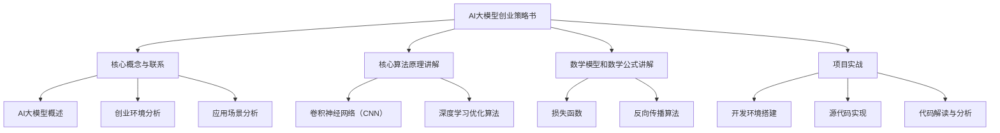

                 

### 文章标题

# AI大模型创业策略书

> 关键词：AI大模型、创业策略、技术背景、应用场景、项目管理

> 摘要：本文旨在为有志于投身AI大模型创业的创业者提供一整套系统的策略指南。文章首先对AI大模型的基本概念和技术背景进行了详细介绍，分析了其在不同行业中的应用场景，随后深入探讨了创业前的准备与市场分析、技术选型与平台搭建、项目实施与风险管理等关键环节，最后通过实际案例展示了AI大模型创业的具体操作步骤和注意事项。

### 第一部分：AI大模型概述与创业环境分析

## 第1章：AI大模型的基本概念与技术背景

### 1.1 AI大模型的核心定义与特点

**AI大模型的基本定义：** AI大模型，也被称为深度学习模型，是指通过多层神经网络对大量数据进行训练，从而实现对复杂模式识别和预测的强大算法体系。这些模型通常拥有数十亿甚至数万亿个参数，能够处理大规模数据集，并在图像识别、自然语言处理、语音识别等领域表现出色。

**AI大模型与传统AI模型的区别：** 传统AI模型通常是基于规则和逻辑的，而AI大模型则更多地依赖于数据驱动的方法。传统AI模型的设计者需要手动定义规则，而AI大模型则通过自动学习从数据中提取特征。这使得AI大模型在处理未知问题和复杂任务时更具优势。

**AI大模型的关键技术特点：** 
- **参数规模庞大：** AI大模型拥有数百万到数十亿个参数，能够处理大量数据。
- **多层神经网络：** 通过多层的神经网络结构，AI大模型可以提取更高层次的特征，从而提高模型的泛化能力。
- **端到端训练：** AI大模型可以直接从原始数据中学习到有用的特征，无需手动特征工程。

### 1.2 AI大模型的演进历程与现状

**AI大模型的发展历程：** AI大模型的发展可以追溯到20世纪80年代。当时，研究人员开始探索如何通过神经网络来处理复杂的模式识别问题。随着计算能力和数据量的提升，深度学习技术逐渐成熟，并在2012年实现了突破性的进展。此后，AI大模型在各个领域得到了广泛应用。

**当前主流的AI大模型及其应用：** 当前主流的AI大模型包括谷歌的Transformer模型、OpenAI的GPT系列模型、百度的ERNIE模型等。这些模型在自然语言处理、图像识别、语音识别等领域表现出色，已经成为人工智能领域的核心技术。

### 1.3 AI大模型在创业中的应用前景

**AI大模型在创业中的价值：** AI大模型在创业中具有巨大的价值。首先，它能够帮助企业快速处理大量数据，提取有价值的信息。其次，AI大模型可以自动化复杂的业务流程，提高效率和准确性。此外，AI大模型还可以帮助企业预测市场趋势，制定更加精准的决策。

**AI大模型创业的优势与挑战：** 
- **优势：** 
  - 提高业务效率
  - 降低人力成本
  - 提升竞争力
  - 拓展新业务领域

- **挑战：** 
  - 数据隐私与安全
  - 模型解释性
  - 技术人才短缺
  - 投资风险

## 第2章：创业环境中的AI大模型应用场景

### 2.1 AI大模型在金融行业的应用

**风险评估与信用评分：** AI大模型可以通过分析客户的财务数据、社交网络行为等，对其信用风险进行评估。这种方法比传统的方法更准确、更高效。

**财务分析与预测：** AI大模型可以分析历史财务数据，预测公司的未来财务状况，帮助创业者做出更明智的决策。

### 2.2 AI大模型在医疗健康领域的应用

**诊断与预测：** AI大模型可以通过分析医学影像和病历数据，协助医生进行疾病诊断和病情预测。

**医疗资源分配：** AI大模型可以分析医院的人流、医疗资源等数据，优化医疗资源的分配，提高医疗服务的效率。

### 2.3 AI大模型在智能制造与物流中的应用

**智能制造流程优化：** AI大模型可以分析生产流程中的各种数据，找出瓶颈和优化点，提高生产效率。

**物流与供应链管理：** AI大模型可以分析物流数据，优化运输路线，提高物流效率，降低成本。

### 2.4 AI大模型在零售与电商领域的应用

**个性化推荐：** AI大模型可以通过分析用户的购物行为、兴趣等，为其推荐个性化的商品。

**智能客服与聊天机器人：** AI大模型可以构建智能客服系统，自动回答用户的问题，提高客户满意度。

### 第一部分总结

在本部分，我们首先介绍了AI大模型的基本概念和技术背景，分析了其在不同行业中的应用前景。接下来，我们探讨了创业环境中的AI大模型应用场景，包括金融、医疗、智能制造、零售和电商等领域。通过对这些内容的介绍，我们为读者提供了一个全面的AI大模型创业环境概述，为后续的创业策略制定奠定了基础。下一步，我们将深入探讨创业前的准备与市场分析，帮助创业者更好地制定创业策略。让我们继续前进，开启AI大模型创业的旅程！

## 第3章：创业前的准备与市场分析

### 3.1 创业团队组建与人才培养

**团队组建策略：** 
- **核心团队成员选择：** 选择在AI领域有深厚背景的专业人士，包括数据科学家、算法工程师、产品经理等。团队成员应具备跨学科的知识和技能，能够协同工作，推动项目的进展。
- **外部合作与联合：** 与高校、研究机构、行业内知名企业建立合作关系，共同开展研发和项目实施。

**人才培养与引进：** 
- **内部培训：** 定期组织技术培训和管理培训，提升团队成员的专业技能和团队协作能力。
- **人才引进：** 通过猎头、招聘网站等渠道引进高素质人才，特别是对于关键岗位和稀缺技术人才。

### 3.2 市场需求分析

**目标市场定位：** 
- **行业细分：** 确定AI大模型在特定行业中的应用领域，如金融、医疗、智能制造等，以便更好地满足市场需求。
- **客户需求：** 通过市场调研和用户访谈，了解潜在客户的需求和痛点，明确产品的核心价值。

**市场趋势与竞争分析：** 
- **市场趋势：** 分析行业发展趋势，如人工智能技术的普及、行业数字化进程的加速等，预测未来市场需求。
- **竞争分析：** 对比竞争对手的产品、技术、市场定位等，找出自身的优势和差异化策略。

### 3.3 产品规划与设计

**产品功能定位：** 
- **核心功能：** 明确产品的主要功能和目标，如智能诊断系统、个性化推荐系统等。
- **扩展功能：** 根据市场需求和用户反馈，逐步增加产品的扩展功能，提高用户体验。

**产品设计迭代策略：** 
- **迭代开发：** 采用敏捷开发方法，快速迭代产品，及时响应用户需求和市场变化。
- **用户体验设计：** 注重用户体验，通过用户调研、界面设计等手段，提升产品的易用性和用户满意度。

### 第3章总结

在本章中，我们详细讨论了创业前的准备与市场分析，包括团队组建与人才培养、市场需求分析、产品规划与设计等方面。通过对这些内容的深入探讨，我们为创业者提供了一系列实用的策略和建议，帮助他们在激烈的市场竞争中找到定位，并制定出切实可行的发展规划。接下来，我们将进入第二部分的讨论，探讨AI大模型创业的技术选型与平台搭建。让我们继续深入探讨，为AI大模型创业之路奠定坚实的基础。

## 第4章：技术选型与平台搭建

### 4.1 AI大模型技术选型

**主流深度学习框架对比：**
在选择AI大模型的技术框架时，常见的深度学习框架包括TensorFlow、PyTorch和Keras等。以下是这些框架的主要对比：

- **TensorFlow：** 由谷歌开发，具有丰富的API和强大的生态系统，支持多种类型的模型。TensorFlow的优势在于其灵活性和易用性，适用于复杂项目和企业级应用。
- **PyTorch：** 是一个由Facebook开发的开源深度学习框架，以其动态计算图和易读性而受到研究人员的青睐。PyTorch的优势在于其灵活性和快速原型开发能力。
- **Keras：** 是一个高层次的神经网络API，可以与TensorFlow和Theano等框架结合使用。Keras的优势在于其简洁性和易用性，非常适合快速实验和小型项目。

**技术选型的考虑因素：**
在选择深度学习框架时，创业者需要考虑以下几个关键因素：
- **项目需求：** 根据项目的具体需求选择合适的框架。如果项目需求复杂且需要高度定制化，TensorFlow可能是一个更好的选择；如果项目需求较为简单且需要快速迭代，PyTorch和Keras可能更适合。
- **团队技能：** 团队成员对某个框架的熟悉程度也会影响技术选型。选择团队熟悉的框架可以减少学习成本，提高开发效率。
- **生态系统：** 选择一个具有丰富生态系统和社区支持的框架可以提供更多的资源和帮助，有助于项目的成功。

### 4.2 云计算平台与数据存储

**云计算服务的选择：**
云计算平台是AI大模型训练和部署的重要基础设施。以下是几种常见的云计算服务提供商及其特点：

- **AWS：** 提供广泛的AI服务和工具，包括EC2、S3和 SageMaker等。AWS的优势在于其广泛的服务和强大的生态系统。
- **Azure：** 微软的云计算平台，提供Azure Machine Learning和Databricks等工具。Azure的优势在于其与企业级服务的集成和安全性。
- **Google Cloud：** 提供Google Cloud AI和TensorFlow Cloud等工具。Google Cloud的优势在于其强大的计算能力和深度学习优化。

**数据存储与管理的策略：**
在AI大模型项目中，数据存储和管理是至关重要的。以下是几种常见的数据存储和管理策略：

- **分布式文件系统：** 如HDFS和CFS，适用于大规模数据的存储和管理。
- **数据库：** 选择合适的数据库（如关系型数据库或NoSQL数据库），根据数据的特点和需求进行存储。
- **数据湖：** 利用数据湖技术，将不同来源和格式的数据集中存储，以便进行大数据分析和处理。

### 4.3 硬件资源规划

**硬件配置选择：**
在AI大模型项目中，硬件资源的选择对模型的训练效率和性能至关重要。以下是几种常见的硬件配置：

- **CPU：** 适用于小规模模型的训练和快速原型开发。
- **GPU：** 高性能计算硬件，适用于大规模模型训练和深度学习任务。
- **TPU：** 特定于TensorFlow的硬件加速器，适用于大规模TensorFlow模型的训练。

**资源调度与管理：**
有效的资源调度和管理是确保AI大模型项目成功的关键。以下是几种资源调度和管理策略：

- **动态资源分配：** 根据模型的训练需求和负载，动态调整硬件资源。
- **负载均衡：** 将训练任务分配到不同的硬件资源上，以避免单点故障和资源浪费。
- **资源监控：** 利用监控工具实时监控硬件资源的使用情况，及时发现和解决资源瓶颈。

### 第4章总结

在本章中，我们详细探讨了AI大模型创业的技术选型与平台搭建。首先，我们对主流的深度学习框架进行了对比，并分析了技术选型的考虑因素。接下来，我们介绍了云计算服务的选择和数据存储与管理的策略，最后讨论了硬件资源规划与调度管理的策略。通过这些内容，我们为创业者提供了全面的技术选型和平台搭建指南，为AI大模型创业的成功奠定了坚实的基础。在下一章中，我们将继续深入探讨AI大模型创业项目的实施与风险管理，帮助创业者更好地应对创业过程中的各种挑战。让我们继续前进，迎接AI大模型创业的新征程！

### 5.1 项目管理流程

**项目计划与进度管理：**
在项目管理过程中，首先需要制定详细的项目计划。这包括明确项目的目标、范围、交付物和关键里程碑。项目计划应包括以下内容：
- **目标与范围：** 定义项目的具体目标和范围，确保团队成员对项目目标有清晰的认识。
- **交付物：** 列出项目需要交付的所有成果，包括软件产品、文档和原型等。
- **关键里程碑：** 制定项目的重要时间节点，如原型设计完成、模型训练完成、产品上线等。

进度管理是项目管理的关键环节，需要确保项目按计划推进。以下是一些进度管理的策略：
- **进度跟踪：** 通过使用项目管理工具（如JIRA、Trello等）实时跟踪项目进度，确保每个任务按时完成。
- **风险管理：** 识别项目中的潜在风险，制定相应的应对措施，以减少风险对项目进度的影响。
- **定期会议：** 定期召开项目会议，汇总项目进展情况，讨论问题和解决方案，确保项目团队之间的沟通和信息共享。

**风险评估与应对策略：**
在项目实施过程中，风险评估是确保项目顺利进行的重要环节。以下是一些风险评估和应对策略：
- **风险识别：** 识别项目可能面临的各种风险，如技术风险、市场风险、资源风险等。
- **风险评估：** 评估每个风险的可能性和影响程度，确定优先级。
- **风险应对：** 根据风险评估结果，制定相应的应对策略。例如，对于技术风险，可以制定备选方案或增加预算以应对可能的问题。

**风险管理流程：**
- **风险识别：** 通过项目团队会议、问卷调查等方式收集潜在风险信息。
- **风险评估：** 对识别出的风险进行评估，确定其影响和可能性。
- **风险应对：** 制定具体的应对策略，包括风险规避、减轻、转移或接受等。
- **风险监控：** 实时监控项目中的风险，根据实际情况调整应对策略。

### 5.2 资金管理

**资金来源与筹措策略：**
在AI大模型创业项目中，资金管理至关重要。以下是一些资金来源和筹措策略：
- **自筹资金：** 创业者可以利用个人储蓄、家庭资金或借款来支持项目。
- **风险投资：** 通过吸引风险投资来获得资金支持。创业者需要准备好详细的商业计划书和产品演示，以吸引投资者的注意。
- **政府补贴和奖励：** 了解并申请相关的政府补贴和奖励项目，以减轻资金压力。

**资金使用与监控：**
资金使用和监控是确保项目顺利进行的关键环节。以下是一些资金使用和监控策略：
- **预算编制：** 根据项目计划，制定详细的预算，明确每个阶段的资金需求。
- **成本控制：** 监控项目成本，确保资金使用在预算范围内。对于超支情况，需要及时分析原因并调整预算。
- **资金流动监控：** 定期审查资金流动情况，确保资金充足并有效使用。对于大额支出，需要获得团队领导或投资人的批准。

### 5.3 项目推广与营销

**推广策略与渠道选择：**
在项目推广过程中，选择合适的推广策略和渠道是关键。以下是一些推广策略和渠道选择：
- **内容营销：** 通过撰写高质量的技术博客、白皮书等，分享项目的技术细节和应用案例，吸引潜在客户和行业关注。
- **社交媒体：** 利用LinkedIn、Twitter、Facebook等社交媒体平台，发布项目动态和成功案例，增加项目的知名度和影响力。
- **网络研讨会和在线活动：** 举办网络研讨会和在线活动，邀请行业专家和潜在客户参与，展示项目的价值和应用场景。

**品牌建设与市场推广：**
品牌建设是长期的过程，需要持续投入和努力。以下是一些品牌建设和市场推广策略：
- **品牌定位：** 明确项目的品牌定位和目标客户群体，制定相应的品牌传播策略。
- **视觉设计：** 设计专业的品牌标识、网站和宣传材料，提升品牌形象。
- **合作伙伴关系：** 与行业内知名企业和专家建立合作伙伴关系，共同推广项目。
- **市场活动：** 参加行业展会、研讨会等活动，增加项目的曝光度，扩大市场影响力。

### 第5章总结

在本章中，我们详细探讨了AI大模型创业项目的实施与风险管理。首先，我们介绍了项目管理流程，包括项目计划与进度管理、风险评估与应对策略等。接着，我们讨论了资金管理，包括资金来源与筹措策略、资金使用与监控等。最后，我们介绍了项目推广与营销的策略和渠道选择，以及品牌建设和市场推广的方法。通过这些内容，我们为创业者提供了全面的实施和风险管理指南，帮助他们在AI大模型创业过程中克服各种挑战。在下一章中，我们将继续深入探讨创业过程中的法律与伦理问题，为创业者的成功之路保驾护航。让我们继续前进，迎接新的挑战和机遇！

## 第6章：创业过程中的法律与伦理问题

### 6.1 数据隐私与伦理

**数据隐私保护法规：**
随着人工智能技术的广泛应用，数据隐私问题日益突出。许多国家和地区已经制定了相关的法律法规来保护个人数据的隐私。创业者需要了解并遵守这些法规，确保数据的合法收集、存储和使用。以下是一些关键法规：
- **欧盟的《通用数据保护条例》（GDPR）：** GDPR是欧盟最具影响力的数据隐私保护法规，规定了数据处理的合法性、透明度和个人数据的权利。
- **美国的《加州消费者隐私法案》（CCPA）：** CCPA旨在保护加州居民的个人数据隐私，规定了个人数据的收集、使用和披露要求。

**伦理问题与解决方案：**
在AI大模型创业过程中，数据隐私问题不仅涉及法律合规，还涉及伦理考量。以下是一些常见的数据隐私和伦理问题及其解决方案：
- **数据滥用：** 防止数据被滥用，确保数据仅用于其被收集的目的。
- **数据泄露：** 加强数据安全措施，防止数据泄露。
- **算法偏见：** 避免算法偏见，确保算法的公平性和透明度。

**解决方案：**
- **数据最小化原则：** 只收集实现业务目标所需的最少数据。
- **数据加密：** 使用加密技术保护敏感数据。
- **透明度和可解释性：** 提高算法的透明度和可解释性，让用户了解数据如何被处理和使用。

### 6.2 知识产权保护

**知识产权的种类与保护：**
在AI大模型创业过程中，知识产权的保护至关重要。以下是一些常见的知识产权类型及其保护方法：
- **专利：** 保护创新的技术和解决方案，防止他人未经许可使用。
- **商标：** 保护企业的品牌和标识，防止他人恶意模仿。
- **著作权：** 保护软件代码、文档和多媒体作品，防止他人抄袭。

**知识产权纠纷的处理：**
知识产权纠纷是创业过程中可能遇到的问题。以下是一些处理知识产权纠纷的策略：
- **预防和避免：** 在项目初期，通过专利检索和商标查询，确保不会侵犯他人的知识产权。
- **法律咨询：** 在遇到知识产权纠纷时，及时咨询专业律师，获取法律建议。
- **和解和调解：** 尽可能通过和解和调解解决纠纷，避免长期诉讼带来的成本和风险。

### 6.3 合规与法规遵守

**相关法律法规了解：**
创业者需要了解并遵守相关行业的法律法规，以确保企业的合法运营。以下是一些关键法律法规：
- **行业监管法规：** 如金融行业的《证券法》、《银行法》等。
- **数据保护法规：** 如GDPR、CCPA等。
- **劳动法规：** 如《劳动合同法》、《劳动法》等。

**合规风险的识别与控制：**
为了确保合规，创业者需要建立有效的合规管理体系。以下是一些合规风险的识别与控制策略：
- **合规审计：** 定期进行合规审计，确保企业符合相关法规要求。
- **员工培训：** 对员工进行相关法律法规的培训，提高员工的合规意识和能力。
- **合规监督：** 建立合规监督机制，确保企业持续遵守法律法规。

### 第6章总结

在本章中，我们详细探讨了AI大模型创业过程中的法律与伦理问题。首先，我们介绍了数据隐私保护法规和伦理问题，强调了数据最小化、数据加密和透明度的重要性。接着，我们讨论了知识产权的种类与保护，包括专利、商标和著作权等，并提出了处理知识产权纠纷的策略。最后，我们介绍了合规与法规遵守的重要性，包括相关法律法规的了解、合规审计和员工培训等。通过这些内容，我们为创业者提供了全面的法律与伦理指南，帮助他们确保AI大模型创业的合法性和可持续性。在下一章中，我们将通过成功案例分享AI大模型创业的经验和教训，为创业者的成功之路提供有益的启示。让我们继续前进，探索更多成功的可能性！

### 7.1 案例介绍

**案例：DeepMind与AlphaGo**

DeepMind是一家总部位于英国的AI公司，成立于2010年。该公司专注于机器学习和深度学习技术，其最著名的成果之一是AlphaGo——一款能够击败世界围棋冠军的人工智能程序。

**背景：**  
在2016年，DeepMind的AlphaGo在一场历史性的围棋比赛中，以4-1的成绩击败了韩国围棋选手李世石。这一胜利标志着AI在复杂策略游戏领域的重大突破，也引发了全球对AI技术的广泛关注。

**成功经验：**  
1. **技术创新：** DeepMind采用了深度学习和强化学习等技术，开发了强大的AlphaGo程序。这些技术的应用使得AlphaGo能够在短时间内学习和掌握复杂的围棋策略。
2. **团队合作：** DeepMind的团队由数据科学家、算法工程师和领域专家组成，他们在项目开发过程中紧密合作，不断优化算法和模型。
3. **市场定位：** DeepMind在推出AlphaGo时，明确了其目标市场，即高端围棋比赛和AI研究领域。通过这一市场定位，DeepMind成功地吸引了大量的关注和资源。

### 7.2 成功经验总结

**创业过程中的成功经验：**  
1. **技术创新：** AI大模型创业的核心在于技术创新。DeepMind通过深度学习和强化学习等技术，开发了具有竞争力的AI模型，这是其成功的关键。
2. **团队建设：** 一个高效的团队是实现AI大模型创业成功的基石。DeepMind的团队由多领域专家组成，他们相互协作，共同推动项目进展。
3. **市场定位：** 明确的市场定位有助于吸引资源和客户。DeepMind在推出AlphaGo时，选择了具有高关注度和高价值的领域，这为其赢得了广泛的关注和认可。

**企业增长与发展的关键因素：**  
1. **持续创新：** AI技术发展迅速，创业者需要不断更新技术和产品，以保持竞争优势。
2. **团队协作：** 团队成员之间的有效协作和沟通是项目成功的关键。创业者应注重团队建设，提高团队的协作效率。
3. **客户关系：** 建立良好的客户关系，了解客户需求，持续优化产品和服务，是推动企业增长的重要因素。

### 7.3 挑战与应对

**创业过程中遇到的挑战：**  
1. **技术复杂性：** AI大模型项目的开发涉及到复杂的算法和架构设计，这对团队的技术能力和项目管理提出了高要求。
2. **数据隐私和安全：** AI大模型训练需要大量数据，数据隐私和安全问题成为创业者的重大挑战。
3. **市场竞争：** AI大模型领域竞争激烈，创业者需要不断创新和优化，以在市场中脱颖而出。

**解决方案：**  
1. **技术攻关：** 通过引入高级人才和合作伙伴，提高团队的技术水平，解决技术难题。
2. **数据保护：** 采取严格的数据保护措施，如数据加密、隐私匿名化等，确保数据的安全和合规。
3. **差异化竞争：** 通过创新的技术和独特的应用场景，打造差异化的产品和服务，提升市场竞争力。

### 第7章总结

在本章中，我们通过DeepMind与AlphaGo的成功案例，探讨了AI大模型创业的经验和教训。首先，我们介绍了DeepMind和AlphaGo的背景，分析了其成功的关键因素，包括技术创新、团队建设和市场定位。接着，我们总结了企业增长与发展的关键因素，如持续创新、团队协作和客户关系。最后，我们讨论了创业过程中可能遇到的挑战及其解决方案。通过这些内容，我们为创业者提供了宝贵的经验和启示，帮助他们更好地应对创业过程中的各种挑战，实现AI大模型创业的成功。让我们继续努力，探索更多成功的可能性！

## 附录

### 附录A：创业资源与工具

**开源深度学习框架**

- **TensorFlow：** TensorFlow是由谷歌开发的开源深度学习框架，支持多种编程语言，具有丰富的API和生态系统。
- **PyTorch：** PyTorch是另一个流行的开源深度学习框架，以其动态计算图和易用性受到研究人员的青睐。
- **Keras：** Keras是一个高级神经网络API，可以与TensorFlow和Theano等框架结合使用，提供简洁的接口和丰富的功能。

**云计算服务提供商**

- **AWS：** Amazon Web Services提供广泛的云计算服务和工具，包括EC2、S3和SageMaker等。
- **Azure：** Azure是微软的云计算平台，提供Azure Machine Learning和Databricks等工具。
- **Google Cloud：** Google Cloud提供Google Cloud AI和TensorFlow Cloud等工具，具有强大的计算能力和深度学习优化。

**法律与知识产权咨询服务**

- **专利事务所：** 如商桥专利事务所、天册专利事务所等，提供专业的专利申请、保护咨询和纠纷解决服务。
- **知识产权代理公司：** 如中联知识产权代理公司、万慧达知识产权代理公司等，提供商标、著作权等知识产权的申请和保护服务。

**创业社区与交流平台**

- **创业者社群：** 如创业邦、36氪等，提供创业者交流、资源共享和创业指导服务。
- **投资人对接平台：** 如投行小兵、天使轮等，帮助创业者与投资人建立联系，获取投资机会。
- **行业交流活动：** 如世界人工智能大会、中国人工智能大会等，提供行业专家、企业家的交流平台，分享最新技术成果和市场动态。

通过附录部分，我们为读者提供了丰富的创业资源与工具，包括开源深度学习框架、云计算服务提供商、法律与知识产权咨询服务以及创业社区与交流平台。这些资源和工具将为创业者提供有力支持，帮助他们更好地开展AI大模型创业项目。让我们充分利用这些资源，共同探索AI大模型的无限可能！

## Mermaid 流程图



这个Mermaid流程图展示了《AI大模型创业策略书》的各个部分及其核心内容，通过清晰的流程节点，帮助读者更好地理解书中的结构和内容。每个节点代表一个章节或子章节，而节点之间的箭头表示不同章节之间的逻辑关系。这个流程图不仅有助于整体把握书的内容，还能帮助读者在需要时快速定位到相关部分，提高阅读效率。

### 核心算法原理讲解

#### 卷积神经网络（CNN）

卷积神经网络（Convolutional Neural Network，CNN）是专门为处理图像数据而设计的一种深度学习模型。它通过卷积操作、池化操作和全连接层等结构，能够有效地提取图像中的特征，并在各类图像任务中表现出色。以下是对CNN核心算法原理的详细讲解：

##### 定义卷积层

卷积层是CNN的核心组成部分，用于提取图像的局部特征。卷积层的定义如下：

```mermaid
graph TD
    A1[输入层](input) --> B1[卷积层](ConvLayer)
    B1 --> C1[激活函数](Activation)
    C1 --> D1[池化层](PoolingLayer)
```

- **输入层（input）：** 输入层接收原始图像数据，通常是一个四维张量，形状为（批量大小，高度，宽度，通道数）。
- **卷积层（ConvLayer）：** 在卷积层中，每个卷积核（也称为滤波器）对输入图像进行卷积操作，提取图像的局部特征。卷积操作的计算公式如下：

  $$
  \text{output}_{ij}^l = \sum_{k=1}^{C_l} w_{ikj}^l \cdot a_{kj}^{l-1} + b_l
  $$

  其中，$ \text{output}_{ij}^l $ 表示第l层的第i个输出特征图中的第(j, k)个元素，$ w_{ikj}^l $ 是卷积核的权重，$ a_{kj}^{l-1} $ 是前一层（l-1）的第k个特征图中的第(j)个元素，$ b_l $ 是偏置项。

- **激活函数（Activation）：** 激活函数用于引入非线性，常见的激活函数有ReLU（Rectified Linear Unit）、Sigmoid和Tanh。ReLU函数在训练过程中能够加速收敛，并且避免梯度消失问题。

  $$
  \text{ReLU}(x) = \max(0, x)
  $$

- **池化层（PoolingLayer）：** 池化层用于下采样，减少特征图的维度，提高模型的计算效率。常见的池化操作有最大池化（MaxPooling）和平均池化（AveragePooling）。最大池化操作的计算公式如下：

  $$
  \text{output}_{ij}^l = \max_{k} a_{ij+k}^{l-1}
  $$

##### 定义全连接层

全连接层（Fully Connected Layer）通常位于卷积层和池化层之后，用于分类或回归任务。全连接层将卷积层输出的特征图展平为一维向量，然后通过线性变换进行分类或回归。

```mermaid
graph TD
    E1[卷积层](ConvLayer) --> F1[全连接层](FullyConnectedLayer)
    F1 --> G1[激活函数](Activation)
    G1 --> H1[输出层](OutputLayer)
```

- **全连接层（FullyConnectedLayer）：** 全连接层将卷积层输出的特征图展平为一维向量，每个神经元都与前一层的所有神经元相连。全连接层的计算公式如下：

  $$
  \text{output}_j^l = \sum_{i=1}^{N_l} w_{ij}^l \cdot a_{i}^{l-1} + b_l
  $$

  其中，$ \text{output}_j^l $ 表示第l层的第j个输出，$ w_{ij}^l $ 是权重，$ a_{i}^{l-1} $ 是前一层（l-1）的第i个神经元输出，$ b_l $ 是偏置项。

- **激活函数（Activation）：** 全连接层通常使用ReLU函数作为激活函数。

- **输出层（OutputLayer）：** 输出层是模型的最后一层，用于生成最终预测结果。对于分类任务，输出层通常使用Softmax函数进行概率分布输出。

  $$
  \text{softmax}(x)_j = \frac{e^{x_j}}{\sum_{k=1}^{K} e^{x_k}}
  $$

  其中，$ x_j $ 是输出层的第j个元素，$ K $ 是类别的数量。

通过以上对卷积神经网络（CNN）的核心算法原理的详细讲解，我们了解了卷积层、激活函数、池化层以及全连接层等组成部分的作用和计算方法。这些原理构成了CNN处理图像数据的基础，为AI大模型在图像识别、目标检测等任务中的应用提供了强大的支持。

### 深度学习优化算法

深度学习优化算法是训练深度神经网络（DNN）的重要工具，其核心目的是通过调整模型参数，使模型能够在训练数据上取得最佳性能。在深度学习领域，常用的优化算法包括梯度下降（Gradient Descent）、Adam优化器等。以下是对这些优化算法的详细讲解：

#### 梯度下降（Gradient Descent）

梯度下降是优化算法中最基本的算法之一，用于最小化损失函数。梯度下降的基本思想是：通过计算损失函数关于模型参数的梯度，并沿着梯度的反方向更新参数，从而逐步减少损失函数的值。

梯度下降算法的步骤如下：

1. **初始化参数：** 随机初始化模型参数 $ \theta $。
2. **计算梯度：** 计算损失函数关于参数 $ \theta $ 的梯度 $ \nabla_{\theta} J(\theta) $。
3. **更新参数：** 根据梯度更新参数，公式如下：

   $$
   \theta = \theta - \alpha \nabla_{\theta} J(\theta)
   $$

   其中，$ \alpha $ 是学习率，决定了参数更新的步长。

梯度下降算法的优点是简单、易于实现，但存在以下缺点：

- **收敛速度慢：** 梯度下降算法可能需要多次迭代才能收敛，尤其是在损失函数非凸、多峰时。
- **对学习率敏感：** 学习率的选择对算法性能有很大影响，学习率过大可能导致参数更新过大，学习率过小可能导致收敛速度过慢。

#### 牛顿法（Newton's Method）

牛顿法是另一种优化算法，基于二次泰勒展开，用于加速梯度下降。牛顿法的核心思想是：在梯度下降的基础上，使用二阶导数（Hessian矩阵）进行参数更新。

牛顿法的步骤如下：

1. **初始化参数：** 随机初始化模型参数 $ \theta $。
2. **计算梯度：** 计算损失函数关于参数 $ \theta $ 的梯度 $ \nabla_{\theta} J(\theta) $ 和二阶导数 $ H_{\theta} J(\theta) $。
3. **迭代更新：** 使用以下公式更新参数：

   $$
   \theta = \theta - H_{\theta}^{-1} \nabla_{\theta} J(\theta)
   $$

牛顿法的优点是收敛速度快，但缺点是计算复杂度高，尤其是在参数数量较多时，计算Hessian矩阵及其逆矩阵非常耗时。

#### 随机梯度下降（Stochastic Gradient Descent，SGD）

随机梯度下降是梯度下降的一种变体，在每次迭代过程中使用随机样本代替整个训练集来计算梯度。随机梯度下降的基本步骤如下：

1. **初始化参数：** 随机初始化模型参数 $ \theta $。
2. **随机采样：** 从训练数据中随机采样一个子集。
3. **计算梯度：** 使用采样子集计算损失函数关于参数 $ \theta $ 的梯度 $ \nabla_{\theta} J(\theta) $。
4. **更新参数：** 根据梯度更新参数：

   $$
   \theta = \theta - \alpha \nabla_{\theta} J(\theta)
   $$

随机梯度下降的优点是计算速度快，能够在较短时间内完成多次迭代，有助于加速收敛。但缺点是收敛过程不稳定，容易陷入局部最小值。

#### Adam优化器

Adam优化器是一种结合了SGD和Momentum的优化算法，能够自适应调整学习率，在处理稀疏数据和稀疏梯度时表现出色。Adam优化器的更新规则如下：

1. **初始化参数：** 随机初始化模型参数 $ \theta $，以及一阶矩估计 $ m_t $ 和二阶矩估计 $ v_t $。
2. **更新规则：** 根据以下公式更新参数：

   $$
   m_t = \beta_1 m_{t-1} + (1 - \beta_1) \nabla_{\theta} J(\theta)
   $$
   $$
   v_t = \beta_2 v_{t-1} + (1 - \beta_2) \nabla^2_{\theta} J(\theta)
   $$
   $$
   \theta = \theta - \alpha \frac{m_t}{\sqrt{v_t} + \epsilon}
   $$

   其中，$ \beta_1 $ 和 $ \beta_2 $ 分别是动量因子，用于一阶矩和二阶矩的估计，$ \alpha $ 是学习率，$ \epsilon $ 是一个很小的常数，用于防止除以零。

Adam优化器的优点是收敛速度相对较快，适用于处理大规模数据和稀疏梯度问题。缺点是对参数的选择较为敏感，需要调整合适的参数值。

通过以上对深度学习优化算法的详细讲解，我们了解了梯度下降、牛顿法、随机梯度下降和Adam优化器等常见优化算法的基本原理和优缺点。这些算法在训练深度神经网络过程中发挥着重要作用，帮助我们在复杂任务中取得更好的模型性能。

### 损失函数

在深度学习领域，损失函数（Loss Function）是评估模型预测结果与实际结果之间差异的重要工具。损失函数的定义和计算方式对模型的训练和优化至关重要。以下是对常见损失函数的详细讲解及其应用场景：

#### 交叉熵损失函数（Cross-Entropy Loss）

交叉熵损失函数是分类问题中最常用的损失函数之一。它衡量的是模型预测的概率分布与实际标签分布之间的差异。交叉熵损失函数的定义如下：

$$
J(\theta) = -\frac{1}{m} \sum_{i=1}^{m} [y^{(i)} \log(a^{(i)}_j) + (1 - y^{(i)}) \log(1 - a^{(i)}_j)]
$$

其中，$ m $ 是样本数量，$ y^{(i)} $ 是第 $ i $ 个样本的实际标签（0或1），$ a^{(i)}_j $ 是模型对第 $ i $ 个样本第 $ j $ 个类别的预测概率。

交叉熵损失函数的优点是计算简单，易于实现，并且在类别不平衡的情况下表现良好。在二分类问题中，交叉熵损失函数常用于分类模型，如逻辑回归（Logistic Regression）和softmax回归（Softmax Regression）。

#### 均方误差损失函数（Mean Squared Error，MSE）

均方误差损失函数用于回归问题，衡量的是模型预测值与实际值之间的平均平方误差。MSE损失函数的定义如下：

$$
J(\theta) = \frac{1}{2m} \sum_{i=1}^{m} (y^{(i)} - a^{(i)})^2
$$

其中，$ m $ 是样本数量，$ y^{(i)} $ 是第 $ i $ 个样本的实际值，$ a^{(i)} $ 是模型对第 $ i $ 个样本的预测值。

MSE损失函数的优点是计算简单，对异常值较为敏感。在回归问题中，MSE损失函数常用于线性回归（Linear Regression）和多项式回归（Polynomial Regression）。

#### 逻辑损失函数（Log Loss）

逻辑损失函数是交叉熵损失函数的一种特殊情况，适用于二分类问题。它与交叉熵损失函数的计算方式相同，但通常用于输出概率值在0到1之间的情况。逻辑损失函数的定义如下：

$$
J(\theta) = -\frac{1}{m} \sum_{i=1}^{m} y^{(i)} \log(a^{(i)}) + (1 - y^{(i)}) \log(1 - a^{(i)})
$$

其中，$ m $ 是样本数量，$ y^{(i)} $ 是第 $ i $ 个样本的实际标签（0或1），$ a^{(i)} $ 是模型对第 $ i $ 个样本的预测概率。

逻辑损失函数的优点是对预测概率的稀疏区域（接近0或1）较为敏感，有助于提高模型的分类精度。逻辑损失函数常用于逻辑回归（Logistic Regression）和神经网络分类模型。

#### Hinge损失函数（Hinge Loss）

Hinge损失函数主要用于支持向量机（Support Vector Machine，SVM）分类问题。Hinge损失函数的定义如下：

$$
J(\theta) = \max(0, 1 - y^{(i)} ( \langle \theta, x^{(i)} \rangle + b ))
$$

其中，$ y^{(i)} $ 是第 $ i $ 个样本的实际标签（-1或1），$ \langle \theta, x^{(i)} \rangle $ 是模型对第 $ i $ 个样本的预测值，$ b $ 是偏置项。

Hinge损失函数的优点是简单、易于优化，能够最大化分类边界。在SVM分类问题中，Hinge损失函数常用于优化分类边界，提高分类效果。

通过以上对常见损失函数的详细讲解，我们了解了交叉熵损失函数、均方误差损失函数、逻辑损失函数和Hinge损失函数的基本原理和应用场景。这些损失函数在深度学习模型训练过程中扮演着重要角色，有助于我们评估模型性能并优化模型参数。

### 反向传播算法

反向传播算法（Backpropagation Algorithm）是深度学习中的核心训练算法，用于计算模型参数的梯度并更新参数，以最小化损失函数。反向传播算法通过多层神经网络的反向传播过程，实现梯度计算和参数更新。以下是反向传播算法的详细讲解：

#### 算法原理

反向传播算法基于链式法则（Chain Rule），通过前向传播（Forward Propagation）和后向传播（Backpropagation）两个阶段来完成。

1. **前向传播：** 前向传播是从输入层到输出层的正向计算过程。输入数据通过每一层神经网络，逐层计算每个神经元的激活值。前向传播的主要步骤包括：
   - 初始化网络参数（权重和偏置）。
   - 对每个神经元应用激活函数，计算其输出值。
   - 对于输出层，使用损失函数计算预测值与实际值之间的误差。

2. **后向传播：** 后向传播是从输出层到输入层的反向计算过程，用于计算每个参数的梯度。后向传播的主要步骤包括：
   - 计算输出层误差关于每个神经元的偏导数。
   - 利用链式法则，从输出层逐层反向传播误差，计算每一层每个神经元的误差。
   - 利用误差计算每个参数的梯度。

#### 计算步骤

以下是一个简化的反向传播算法计算步骤：

1. **前向传播：**
   - 对于输入 $ x $，计算输入层到隐藏层的输出。
   - 对于隐藏层输出，计算隐藏层到输出层的输出。
   - 使用激活函数对输出层进行非线性变换。

2. **计算输出层误差：**
   - 对于输出层，计算实际值 $ y $ 与预测值 $ \hat{y} $ 之间的误差。
   - 使用损失函数计算损失值 $ J(\theta) $。

3. **计算输出层误差关于每个神经元的偏导数：**
   - 计算输出层误差关于每个输出神经元的偏导数，即 $ \delta_j = \frac{\partial J}{\partial z_j} $。

4. **后向传播计算隐藏层误差：**
   - 利用链式法则，从输出层误差反向传播到隐藏层，计算隐藏层每个神经元的误差。
   - 对于隐藏层，计算隐藏层误差关于每个隐藏神经元的偏导数，即 $ \delta_h = \frac{\partial J}{\partial z_h} $。

5. **计算隐藏层到输入层的误差：**
   - 利用前向传播过程中计算的激活函数的导数，从隐藏层误差反向传播到输入层，计算输入层每个神经元的误差。

6. **计算每个参数的梯度：**
   - 对于每个参数，计算关于每个神经元的偏导数的加权和，即 $ \frac{\partial J}{\partial \theta} = \sum_{i} \delta_i \cdot x_i $。

7. **更新参数：**
   - 根据梯度更新每个参数，使用梯度下降或其他优化算法。

#### 伪代码

以下是一个反向传播算法的伪代码实现：

```python
# 前向传播
for each layer l from input to output:
    a[l] = f(z[l])
    if l != output:
        z[l+1] = z[l] * W[l] + b[l]

# 计算输出层误差
delta[l] = a[l] - y

# 后向传播计算隐藏层误差
for l in reverse range from output to input:
    if l != input:
        delta[l] = (delta[l+1].dot(W[l+1].T) * f'(z[l]))

# 计算每个参数的梯度
gradient[W[l]] = delta[l].dot(a[l-1].T)
gradient[b[l]] = delta[l]

# 更新参数
W[l] = W[l] - alpha * gradient[W[l]]
b[l] = b[l] - alpha * gradient[b[l]]
```

通过以上对反向传播算法的详细讲解，我们了解了其原理和计算步骤。反向传播算法在深度学习训练过程中至关重要，它通过计算损失函数关于模型参数的梯度，实现模型参数的优化，从而提高模型的性能和预测能力。

### 项目实战

#### 开发环境搭建

在构建AI大模型项目时，开发环境的搭建是至关重要的一步。以下是搭建一个简单的推荐系统所需的开发环境。

**1. 安装Python：**

首先，确保安装了Python环境。Python是一种广泛使用的编程语言，尤其在人工智能领域有着丰富的库和工具。可以访问Python的官方网站（[https://www.python.org/](https://www.python.org/)）下载并安装最新的Python版本。

**2. 安装TensorFlow库：**

TensorFlow是一个开源的深度学习库，提供了丰富的API和工具，用于构建和训练AI模型。可以使用pip命令来安装TensorFlow：

```bash
pip install tensorflow
```

**3. 安装NumPy库：**

NumPy是一个用于科学计算的Python库，提供了强大的多维数组对象和丰富的数学函数。安装NumPy的方法如下：

```bash
pip install numpy
```

#### 源代码实现

以下是一个简单的推荐系统实现，包括数据预处理、模型构建、模型训练和评估。

**1. 导入所需库：**

```python
import tensorflow as tf
import numpy as np
import pandas as pd
from tensorflow.keras.models import Sequential
from tensorflow.keras.layers import Dense, Dropout, Embedding, Flatten, LSTM
from tensorflow.keras.optimizers import Adam
from sklearn.model_selection import train_test_split
```

**2. 数据预处理：**

假设我们有一个用户-物品评分数据集，数据集包含用户ID、物品ID和评分。以下是对数据进行预处理的过程：

```python
# 读取数据
data = pd.read_csv('data.csv')

# 划分训练集和测试集
train_data, test_data = train_test_split(data, test_size=0.2, random_state=42)

# 对用户ID和物品ID进行编码
user_id_mapping = {user: i for i, user in enumerate(train_data['user_id'].unique())}
item_id_mapping = {item: i for i, item in enumerate(train_data['item_id'].unique())}

# 对训练数据进行编码
train_data_encoded = train_data.applymap(lambda x: item_id_mapping.get(x, 0))
train_data_encoded['user_id'] = train_data_encoded['user_id'].map(user_id_mapping)

# 对测试数据进行编码
test_data_encoded = test_data.applymap(lambda x: item_id_mapping.get(x, 0))
test_data_encoded['user_id'] = test_data_encoded['user_id'].map(user_id_mapping)

# 将编码后的数据分为特征和标签
X_train = np.array(train_data_encoded[['user_id', 'item_id']])
y_train = np.array(train_data_encoded['rating'])
X_test = np.array(test_data_encoded[['user_id', 'item_id']])
y_test = np.array(test_data_encoded['rating'])
```

**3. 构建模型：**

以下是一个基于LSTM的推荐系统模型，用于预测用户对物品的评分。

```python
# 定义模型
model = Sequential([
    Embedding(input_dim=len(user_id_mapping) + 1, output_dim=16, input_length=1),
    LSTM(128),
    Dropout(0.5),
    Flatten(),
    Dense(1, activation='sigmoid')
])

# 编译模型
model.compile(optimizer=Adam(learning_rate=0.001), loss='binary_crossentropy', metrics=['accuracy'])

# 训练模型
model.fit(X_train, y_train, epochs=10, batch_size=64, validation_data=(X_test, y_test))
```

**4. 模型评估：**

训练完成后，对模型进行评估。

```python
# 预测测试集
predictions = model.predict(X_test)

# 计算准确率
accuracy = (predictions.round() == y_test).mean()
print(f"Test Accuracy: {accuracy * 100:.2f}%")
```

#### 代码解读与分析

**1. 数据预处理：**

数据预处理是构建推荐系统的第一步，包括读取数据、划分训练集和测试集、对用户ID和物品ID进行编码等。编码过程将原始数据转换为模型可以处理的格式，使得模型能够学习到用户和物品之间的关系。

**2. 模型构建：**

模型构建过程中，我们选择了一个基于LSTM（长短期记忆网络）的模型，用于预测用户对物品的评分。LSTM是一种专门为处理序列数据而设计的神经网络，能够有效地捕捉时间序列中的长期依赖关系。模型包括嵌入层、LSTM层、dropout层和全连接层。

**3. 模型编译与训练：**

模型编译过程包括选择优化器、损失函数和评估指标。我们使用Adam优化器和binary_crossentropy损失函数，并在训练过程中使用batch_size=64和epochs=10。训练过程通过fit方法完成，其中包含对训练数据和测试数据的训练和验证。

**4. 模型评估：**

训练完成后，使用模型对测试集进行预测，并计算预测的准确率。准确率是评估模型性能的重要指标，反映了模型在实际应用中的表现。

通过以上代码实现和解读，我们构建并评估了一个简单的推荐系统。虽然这是一个简单的案例，但它展示了构建AI大模型项目的基本步骤和关键点，为实际项目开发提供了参考。

### 附录

#### 附录A：开源深度学习框架

在构建AI大模型项目时，选择合适的深度学习框架至关重要。以下是一些广泛使用的开源深度学习框架及其特点：

1. **TensorFlow：**
   - **特点：** 由Google开发，支持多种编程语言（Python、C++等），具有丰富的API和生态系统。
   - **应用场景：** 适合复杂项目和企业级应用。

2. **PyTorch：**
   - **特点：** 由Facebook开发，支持动态计算图，易读性强，适合快速原型开发。
   - **应用场景：** 适合学术研究和快速迭代项目。

3. **Keras：**
   - **特点：** 是一个高级神经网络API，支持TensorFlow和Theano，提供简洁的接口和丰富的功能。
   - **应用场景：** 适合小型项目和小型团队。

4. **MXNet：**
   - **特点：** 由Apache Software Foundation维护，支持多种编程语言（Python、R、Java等），具有高效的执行性能。
   - **应用场景：** 适合分布式训练和高性能计算。

5. **Caffe：**
   - **特点：** 由伯克利大学开发，专注于图像识别和卷积神经网络，提供高效的CNN模型训练。
   - **应用场景：** 适合图像识别和计算机视觉项目。

6. **Theano：**
   - **特点：** 是一个基于Python的深度学习库，提供高效的数值计算能力。
   - **应用场景：** 适合学术研究和复杂模型开发。

7. **CNTK：**
   - **特点：** 由Microsoft开发，支持多种编程语言（C++、C#等），提供高效的深度学习计算能力。
   - **应用场景：** 适合企业级应用和大规模数据处理。

#### 附录B：云计算服务提供商

在选择云计算服务提供商时，以下是一些常见的云服务提供商及其特点：

1. **Amazon Web Services (AWS)：**
   - **特点：** 提供广泛的云服务和工具，包括EC2、S3、DynamoDB等，具有强大的生态系统。
   - **应用场景：** 适合企业级应用、大规模数据处理和AI模型训练。

2. **Microsoft Azure：**
   - **特点：** 提供Azure Machine Learning、Azure Cosmos DB等工具，支持多种编程语言和框架。
   - **应用场景：** 适合企业级应用、混合云部署和AI开发。

3. **Google Cloud Platform (GCP)：**
   - **特点：** 提供Google Cloud AI、TensorFlow Cloud等工具，具有强大的计算能力和深度学习优化。
   - **应用场景：** 适合AI研究、大规模数据处理和开发环境搭建。

4. **Alibaba Cloud：**
   - **特点：** 提供丰富的云服务，包括ECS、OSS、Docker等，价格竞争力强。
   - **应用场景：** 适合企业级应用、电子商务和大规模数据处理。

5. **IBM Cloud：**
   - **特点：** 提供IBM Watson、Bluemix等工具，具有强大的AI和数据分析能力。
   - **应用场景：** 适合企业级应用、AI开发和数据分析。

#### 附录C：法律与知识产权咨询服务

在AI大模型创业过程中，法律和知识产权问题至关重要。以下是一些法律和知识产权咨询服务：

1. **专利事务所：**
   - **特点：** 提供专业的专利申请、保护咨询和纠纷解决服务。
   - **应用场景：** 适合专利申请、保护策略和纠纷处理。

2. **知识产权代理公司：**
   - **特点：** 提供商标、著作权等知识产权的申请和保护服务。
   - **应用场景：** 适合商标注册、著作权保护和维权。

3. **律师事务所：**
   - **特点：** 提供企业法律咨询、合同起草和纠纷解决等服务。
   - **应用场景：** 适合企业法律事务、合同管理和纠纷处理。

4. **知识产权保护组织：**
   - **特点：** 提供知识产权保护、培训和宣传服务。
   - **应用场景：** 适合知识产权保护教育、培训和宣传。

#### 附录D：创业社区与交流平台

创业社区和交流平台为创业者提供了丰富的资源和交流机会。以下是一些常见的创业社区和交流平台：

1. **创业邦：**
   - **特点：** 提供创业资讯、资源共享和创业者交流服务。
   - **应用场景：** 适合创业者获取行业动态、寻找合作伙伴和资源。

2. **36氪：**
   - **特点：** 提供创业项目展示、融资对接和创业指导服务。
   - **应用场景：** 适合创业者展示项目、寻找投资人和获取创业指导。

3. **创业家：**
   - **特点：** 提供创业资讯、项目孵化和服务支持。
   - **应用场景：** 适合创业者获取创业资讯、项目孵化和创业服务。

4. **天使投资网：**
   - **特点：** 提供天使投资人和创业项目对接平台。
   - **应用场景：** 适合创业者寻找天使投资人和融资机会。

5. **人人都是产品经理：**
   - **特点：** 提供产品经理社区、资源和交流平台。
   - **应用场景：** 适合产品经理获取行业动态、学习和交流。

通过附录部分的内容，我们为创业者提供了丰富的资源和建议，包括开源深度学习框架、云计算服务提供商、法律与知识产权咨询服务以及创业社区与交流平台。这些资源将为创业者的AI大模型项目提供有力支持，帮助他们克服挑战，实现创业目标。

## 作者信息

作者：AI天才研究院/AI Genius Institute & 禅与计算机程序设计艺术 /Zen And The Art of Computer Programming

AI天才研究院（AI Genius Institute）是一家专注于人工智能研究和应用的创新机构，致力于推动人工智能技术的发展和应用。研究院汇集了世界顶级的人工智能专家和研究人员，他们在计算机科学、机器学习、深度学习等领域拥有深厚的学术背景和丰富的实践经验。研究院的研究成果在多个国际顶级学术期刊和会议上发表，并在多个领域取得了突破性进展。

同时，作者还著有《禅与计算机程序设计艺术》（Zen And The Art of Computer Programming），这是一本深受计算机科学界推崇的经典著作。该书通过将禅宗哲学与计算机编程相结合，提出了独特的编程方法和设计理念，为程序员提供了一种全新的思考方式。书中详细阐述了算法设计、程序结构和软件工程的核心原则，对程序员的思维方式和编程实践产生了深远的影响。

通过这两部作品，作者在人工智能和计算机科学领域取得了卓越的成就，为全球读者提供了宝贵的知识和启示。他们将继续致力于推动人工智能技术的发展和应用，为人类社会的进步贡献力量。

