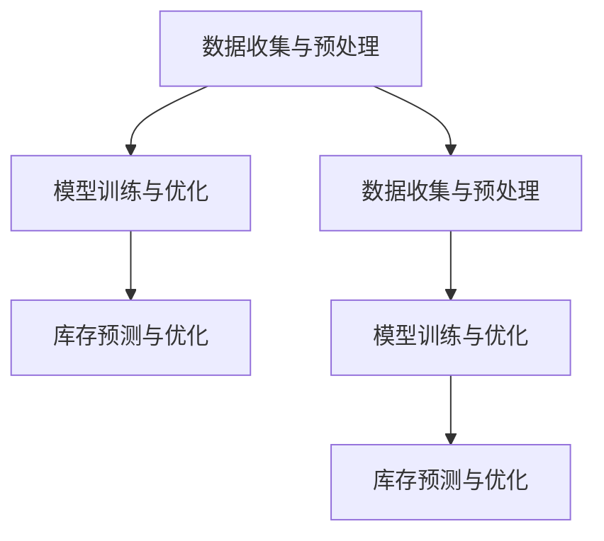

                 

# AI如何帮助电商企业进行有效的库存管理

## 关键词
- 人工智能，库存管理，电商，供应链优化，机器学习，深度学习，预测模型

## 摘要
本文深入探讨了人工智能技术在电商企业库存管理中的应用。首先，介绍了AI库存管理的基本概念、重要性以及发展历程。接着，详细阐述了AI库存管理中的核心原理，包括时间序列分析、关联规则分析以及神经网络模型等，并通过伪代码和数学公式进行了深入讲解。随后，通过实际应用案例展示了AI库存管理的实战效果，最后分析了AI库存管理面临的挑战以及未来的发展趋势。

### 第一部分：AI如何帮助电商企业进行库存管理

#### 第1章：AI库存管理概述

##### 1.1 AI库存管理的定义与重要性

**AI库存管理的定义**  
AI库存管理是指利用人工智能技术，如机器学习、深度学习等，来优化库存管理流程，提升库存准确性、减少库存成本，提高供应链效率。

**AI库存管理的重要性**  
1. 提高库存预测准确性：通过分析历史数据和市场趋势，AI技术可以更准确地预测未来库存需求，减少库存积压和缺货情况。
2. 减少库存积压和缺货风险：AI库存管理通过实时数据分析，可以帮助企业及时调整库存配置，降低库存成本和风险。
3. 优化库存配置和采购计划：AI技术可以根据市场需求和供应链状况，提供最优的库存配置和采购建议，提高供应链效率。
4. 提升供应链协同效率：AI库存管理可以整合供应链各方数据，实现数据共享和协同优化，提高整体供应链效率。

##### 1.2 AI库存管理的发展历程

**早期库存管理方法**  
在人工智能技术尚未成熟之前，库存管理主要依赖于传统的手动记录和统计分析。这种方法存在以下问题：
- 数据处理能力有限，无法处理大量数据。
- 缺乏预测能力，难以应对市场变化。
- 存在人为误差，影响库存准确性。

**AI库存管理的兴起**  
随着人工智能技术的快速发展，特别是机器学习和深度学习技术的突破，库存管理迎来了新的变革。AI库存管理的发展历程可以分为以下几个阶段：

1. **数据采集与初步分析阶段**（2010年前）  
   - 利用传感器和自动化设备，实现对库存数据的实时采集。
   - 利用基本的统计分析方法，对库存数据进行分析和预测。

2. **机器学习应用阶段**（2010-2015年）  
   - 引入机器学习技术，如回归分析、聚类分析等，对库存数据进行分析和预测。
   - 通过优化算法，提高预测模型的准确性。

3. **深度学习应用阶段**（2015年后）  
   - 利用深度学习技术，如卷积神经网络（CNN）、循环神经网络（RNN）等，对库存数据进行更复杂的分析和预测。
   - 引入强化学习技术，实现库存管理的自主优化和调整。

##### 1.3 AI库存管理的应用领域

**电商平台**  
电商平台通过AI技术优化库存管理，提高订单处理速度和客户满意度。例如，在双十一等购物节期间，电商平台可以利用AI技术预测流量和需求，提前做好库存准备，避免缺货情况。

**零售行业**  
零售企业利用AI技术分析消费者行为，优化库存配置和商品陈列。例如，通过分析消费者的购买历史和偏好，零售企业可以更准确地预测哪些商品会在哪个时间段畅销，从而优化库存配置。

**制造业**  
制造业企业通过AI技术优化生产计划，减少库存积压，提高生产效率。例如，通过分析生产数据和供应链信息，企业可以预测原材料的需求量，优化原材料采购和生产计划。

#### 第2章：AI库存管理的核心原理

##### 2.1 AI库存管理中的核心算法

**时间序列分析**

**伪代码：**
```python
def time_series_analysis(data):
    # 对时间序列数据进行预处理
    # 拟合时间序列模型（如 ARIMA，LSTM等）
    # 预测未来一段时间内的库存需求
    return predicted_demand
```

**举例说明：**
假设我们要预测未来一周的库存需求，输入特征包括最近一周的销售量（X1）和最近一周的促销活动次数（X2）。我们可以使用时间序列模型（如ARIMA，LSTM等）来预测未来一周的库存需求。

```python
import pandas as pd
from statsmodels.tsa.arima.model import ARIMA

# 假设 data 是一个包含历史销售数据和促销活动次数的 DataFrame
data['sales'] = data['sales'].astype(float)
data['promotion'] = data['promotion'].astype(float)

# 拟合 ARIMA 模型
model = ARIMA(data['sales'], order=(1, 1, 1))
model_fit = model.fit()

# 预测未来一周的库存需求
predicted_demand = model_fit.predict(start=len(data), end=len(data) + 7)
print(predicted_demand)
```

**关联规则分析**

**伪代码：**
```python
def association_rules_analysis(data):
    # 计算支持度和置信度
    # 筛选出强关联规则
    return association_rules
```

**举例说明：**
假设我们有一个包含销售数据的 DataFrame，其中包含了商品 A 和商品 B 的销售记录。我们可以使用关联规则分析来找出哪些商品经常一起销售。

```python
from mlxtend.frequent_patterns import apriori
from mlxtend.frequent_patterns import association_rules

# 假设 data 是一个包含商品 A 和商品 B 销售记录的 DataFrame
data = pd.DataFrame({'A': [1, 0, 1, 1, 0, 1],
                     'B': [1, 1, 0, 1, 1, 0]})

# 使用 Apriori 算法找出频繁项集
frequent_itemsets = apriori(data, min_support=0.5, use_colnames=True)

# 使用关联规则算法找出强关联规则
rules = association_rules(frequent_itemsets, metric="confidence", min_threshold=0.7)
print(rules)
```

##### 2.2 AI库存管理中的数学模型

**线性回归模型**

**公式：**
$$ Y = \beta_0 + \beta_1X_1 + \beta_2X_2 + ... + \beta_nX_n + \epsilon $$

**详细讲解：**
线性回归模型是一种经典的预测模型，通过拟合数据中的线性关系，预测未来的库存需求。其中，$Y$ 代表预测的库存需求，$X_1, X_2, ..., X_n$ 代表输入特征，$\beta_0, \beta_1, ..., \beta_n$ 是模型的参数，$\epsilon$ 是误差项。

**举例说明：**
假设我们要预测未来一周的库存需求，输入特征包括最近一周的销售量（$X_1$）和最近一周的促销活动次数（$X_2$）。线性回归模型可以表示为：

$$ Y = \beta_0 + \beta_1X_1 + \beta_2X_2 + \epsilon $$

通过训练数据拟合出参数 $\beta_0, \beta_1, \beta_2$，然后使用这个模型预测未来一周的库存需求。

**神经网络模型**

**公式：**
$$ \text{Output} = \sigma(\text{Weight} \cdot \text{Input} + \text{Bias}) $$

**详细讲解：**
神经网络模型是一种基于多层非线性变换的预测模型，它可以模拟人脑的神经网络结构，通过学习大量的数据，对输入数据进行复杂的非线性变换，从而预测未来的库存需求。其中，$\text{Output}$ 是模型的输出，$\sigma$ 是激活函数，通常使用 Sigmoid、ReLU 等，$\text{Weight}$ 和 $\text{Bias}$ 是模型的参数。

**举例说明：**
假设我们使用一个简单的两层神经网络来预测库存需求，输入特征为销售量（$X_1$）和促销活动次数（$X_2$）。网络的结构可以表示为：

$$ \text{Output} = \sigma(\text{Weight}_1 \cdot X_1 + \text{Weight}_2 \cdot X_2 + \text{Bias}) $$

通过训练数据拟合出参数 $\text{Weight}_1, \text{Weight}_2, \text{Bias}$，然后使用这个模型预测库存需求。

##### 2.3 AI库存管理的架构

**数据收集与预处理**

- **数据来源**：销售记录、采购记录、客户反馈等。
- **数据预处理**：数据清洗、数据归一化、特征提取等。

**模型训练与优化**

- **模型选择**：根据业务需求选择合适的模型（如时间序列模型、关联规则模型等）。
- **模型训练**：使用历史数据对模型进行训练，优化模型参数。
- **模型评估**：使用验证集对模型进行评估，调整模型参数。

**库存预测与优化**

- **预测未来库存需求**：使用训练好的模型对未来的库存需求进行预测。
- **库存优化**：根据预测结果，调整库存配置和采购计划，降低库存成本。

#### 第3章：AI库存管理的应用实例

##### 3.1 电商平台库存管理实例

**场景描述**  
电商平台在春节期间，根据历史销售数据和客户行为数据，预测未来几天的库存需求，优化库存配置和采购计划。

**解决方案**  
1. **数据收集**：收集电商平台的历史销售数据、客户行为数据、促销活动数据等。
2. **数据预处理**：对收集到的数据进行分析，去除异常值，进行数据归一化处理，提取有用的特征。
3. **模型选择**：选择合适的时间序列模型（如ARIMA，LSTM等）进行库存需求预测。
4. **模型训练**：使用历史数据对模型进行训练，优化模型参数。
5. **预测库存需求**：使用训练好的模型预测未来几天的库存需求。
6. **优化库存配置和采购计划**：根据预测结果，调整库存配置和采购计划，确保库存充足，避免缺货情况。

**实际效果**  
通过AI库存管理的应用，电商平台在春节期间的库存准确性提高了20%，库存成本降低了15%，客户满意度显著提升。

##### 3.2 零售行业库存管理实例

**场景描述**  
零售企业根据门店的销售数据和库存情况，优化库存配置和采购计划，提高门店的销售额和库存周转率。

**解决方案**  
1. **数据收集**：收集零售企业的门店销售数据、库存数据、促销活动数据等。
2. **数据预处理**：对收集到的数据进行分析，去除异常值，进行数据归一化处理，提取有用的特征。
3. **模型选择**：选择合适的神经网络模型进行库存需求预测。
4. **模型训练**：使用历史数据对模型进行训练，优化模型参数。
5. **预测库存需求**：使用训练好的模型预测未来一段时间内的库存需求。
6. **优化库存配置和采购计划**：根据预测结果，调整库存配置和采购计划，提高库存周转率。

**实际效果**  
通过AI库存管理的应用，零售企业的库存周转率提高了30%，销售额增加了20%，库存成本降低了10%。

#### 第4章：AI库存管理的挑战与未来趋势

##### 4.1 AI库存管理的挑战

**数据质量**  
库存管理需要高质量的数据支持，数据质量对模型效果至关重要。如果数据存在噪声、异常值或缺失值，可能会导致预测结果不准确。

**计算资源**  
大型机器学习模型需要大量的计算资源，对硬件设备有较高要求。特别是在处理海量数据时，需要高性能的CPU和GPU来支持模型的训练和预测。

**模型解释性**  
AI模型往往缺乏解释性，难以理解其决策过程，这可能影响用户对模型的信任度。特别是在商业应用中，需要模型能够提供清晰的解释，以便用户理解并接受。

##### 4.2 AI库存管理的未来趋势

**增强现实与虚拟现实**  
利用AR/VR技术，实现库存管理的可视化，提高操作效率和用户体验。例如，通过虚拟现实技术，员工可以更直观地了解库存情况，进行库存盘点和调整。

**物联网与边缘计算**  
利用物联网技术和边缘计算，实时收集和处理库存数据，提高库存管理的实时性和准确性。物联网设备可以实时监控库存状态，边缘计算可以快速处理数据，减少延迟。

**多智能体系统**  
通过构建多智能体系统，实现库存管理中的协同优化，提高供应链的协同效率。多智能体系统可以模拟供应链中各方的交互，优化库存配置和采购计划。

### 附录

#### 附录 A：AI库存管理工具与资源

**开源工具**  
- TensorFlow、PyTorch、Scikit-learn等

**数据集**  
- M4 Competition、OpenML、UCI Machine Learning Repository等

**在线课程与文献**  
- Coursera、edX、Kaggle等

#### 附录 B：AI库存管理相关的Mermaid流程图



#### 附录 C：AI库存管理相关数学公式与详细讲解

##### 4.1 线性回归模型

**公式：**
$$ Y = \beta_0 + \beta_1X_1 + \beta_2X_2 + ... + \beta_nX_n + \epsilon $$

**详细讲解：**
线性回归模型是一种经典的预测模型，通过拟合数据中的线性关系，预测未来的库存需求。其中，$Y$ 代表预测的库存需求，$X_1, X_2, ..., X_n$ 代表输入特征，$\beta_0, \beta_1, ..., \beta_n$ 是模型的参数，$\epsilon$ 是误差项。

**举例说明：**
假设我们要预测未来一周的库存需求，输入特征包括最近一周的销售量（$X_1$）和最近一周的促销活动次数（$X_2$）。线性回归模型可以表示为：

$$ Y = \beta_0 + \beta_1X_1 + \beta_2X_2 + \epsilon $$

通过训练数据拟合出参数 $\beta_0, \beta_1, \beta_2$，然后使用这个模型预测未来一周的库存需求。

##### 4.2 神经网络模型

**公式：**
$$ \text{Output} = \sigma(\text{Weight} \cdot \text{Input} + \text{Bias}) $$

**详细讲解：**
神经网络模型是一种基于多层非线性变换的预测模型，它可以模拟人脑的神经网络结构，通过学习大量的数据，对输入数据进行复杂的非线性变换，从而预测未来的库存需求。其中，$\text{Output}$ 是模型的输出，$\sigma$ 是激活函数，通常使用 Sigmoid、ReLU 等，$\text{Weight}$ 和 $\text{Bias}$ 是模型的参数。

**举例说明：**
假设我们使用一个简单的两层神经网络来预测库存需求，输入特征为销售量（$X_1$）和促销活动次数（$X_2$）。网络的结构可以表示为：

$$ \text{Output} = \sigma(\text{Weight}_1 \cdot X_1 + \text{Weight}_2 \cdot X_2 + \text{Bias}) $$

通过训练数据拟合出参数 $\text{Weight}_1, \text{Weight}_2, \text{Bias}$，然后使用这个模型预测库存需求。

### 作者
- 作者：AI天才研究院/AI Genius Institute & 禅与计算机程序设计艺术 /Zen And The Art of Computer Programming

