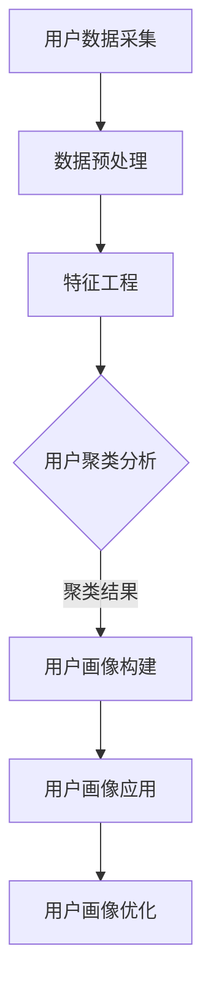

                 

# AI如何建立详细的用户画像

> 关键词：用户画像、人工智能、数据分析、机器学习、个性化推荐

> 摘要：本文将深入探讨人工智能如何建立详细的用户画像。从用户画像的定义、核心概念、算法原理，到实际项目实战和代码解读，我们将一步步分析推理，了解用户画像在人工智能领域的重要应用和实现方法。

### 第一部分：用户画像概述与核心概念

#### 第1章：用户画像基础理论

1.1 用户画像的定义与意义

用户画像，也称为用户轮廓（User Profiling），是通过收集和分析用户在互联网上的行为数据、社会属性、心理特征等信息，构建出关于用户的抽象模型。这种模型可以帮助企业更好地了解用户需求，提供个性化服务，提升用户体验。

1.2 用户画像的发展历程

用户画像的发展可以追溯到上世纪90年代的电子商务时代。随着互联网的普及，用户行为数据的收集和分析技术逐渐成熟，用户画像也逐渐成为企业竞争的重要手段。

1.3 用户画像的类型与特点

用户画像可以分为以下几类：

1. 按照来源，可以分为主动采集用户画像和被动收集用户画像。
2. 按照维度，可以分为基础画像、兴趣画像、行为画像和社交画像。
3. 按照目的，可以分为商业用户画像、政府用户画像和社会用户画像。

1.4 用户画像的架构与核心元素

用户画像的架构通常包括数据收集、数据存储、数据处理、用户画像建模、用户画像应用等几个核心元素。

#### 第2章：用户画像的核心概念与联系

2.1 用户行为分析

2.1.1 用户行为的定义与测量

用户行为是指用户在互联网上的各种操作，如浏览、搜索、购买、评价等。用户行为的测量主要通过日志分析、点击流分析等技术实现。

2.1.2 用户行为分析的方法与工具

用户行为分析的方法包括统计分析、数据挖掘、机器学习等。常用的工具包括Google Analytics、Mixpanel、Matomo等。

2.2 用户需求分析

2.2.1 用户需求的定义与分类

用户需求是指用户在满足自身欲望和需求时所表现出的行为和偏好。用户需求可以分为基础需求、功能需求、情感需求等。

2.2.2 用户需求分析的方法与策略

用户需求分析的方法包括问卷调查、用户访谈、市场调研等。策略包括用户需求识别、需求分类、需求排序等。

2.3 用户特征分析

2.3.1 用户特征的提取与选择

用户特征包括基础特征（如年龄、性别、地理位置等）和衍生特征（如兴趣标签、购买偏好等）。提取和选择用户特征是构建用户画像的关键。

2.3.2 用户特征分析的方法与模型

用户特征分析的方法包括统计分析、机器学习、深度学习等。常用的模型包括决策树、随机森林、支持向量机等。

### 第二部分：用户画像算法原理与实现

#### 第3章：用户画像算法原理讲解

3.1 数据预处理与特征工程

3.1.1 数据清洗与整合

数据清洗是用户画像构建的第一步，目的是去除无效、重复和错误的数据。数据整合则是将不同来源的数据进行合并，形成统一的用户数据集。

3.1.2 特征提取与选择

特征提取是将原始数据转换为有用的特征表示。特征选择则是从大量特征中筛选出对用户画像构建最有价值的特征。

3.2 用户聚类分析

3.2.1 K-means算法原理与实现

K-means算法是一种经典的聚类算法，通过迭代计算用户数据的均值，将用户分配到不同的簇中。

3.2.2 层次聚类算法原理与实现

层次聚类算法通过逐步合并或分裂已有的簇，形成层次结构的聚类结果。

3.3 用户行为模式识别

3.3.1 关联规则挖掘算法原理与实现

关联规则挖掘算法用于发现用户行为数据中的频繁模式和规则，如“购买A商品的用户通常也会购买B商品”。

3.3.2 时间序列分析算法原理与实现

时间序列分析算法用于分析用户行为数据的时间依赖性，如用户在特定时间段的购买行为模式。

#### 第4章：用户画像数学模型与公式

4.1 用户行为概率模型

4.1.1 贝叶斯网络模型

贝叶斯网络模型是一种基于概率的图形模型，用于表示用户行为之间的因果关系。

4.1.2 贝叶斯推断算法

贝叶斯推断算法是一种基于贝叶斯网络模型进行推理的算法，用于预测用户行为和构建用户画像。

4.2 用户需求预测模型

4.2.1 线性回归模型

线性回归模型是一种用于预测用户需求的统计模型。

4.2.2 支持向量机模型

支持向量机模型是一种用于预测用户需求的机器学习模型。

4.3 用户特征分析模型

4.3.1 主成分分析（PCA）模型

主成分分析模型是一种用于降维和特征提取的统计模型。

4.3.2 聚类分析模型

聚类分析模型是一种用于用户特征分析的机器学习模型。

### 第三部分：用户画像项目实战与代码解读

#### 第5章：用户画像项目实战

5.1 项目背景与目标

5.2 数据收集与预处理

5.3 用户行为分析与需求分析

5.4 用户特征分析与聚类分析

5.5 用户画像结果展示与应用

#### 第6章：用户画像代码实现与解读

6.1 环境搭建与依赖安装

6.2 数据加载与预处理

6.3 用户行为分析与需求分析代码实现

6.4 用户特征分析与聚类分析代码实现

6.5 用户画像结果展示代码实现

#### 第7章：用户画像性能评估与优化

7.1 评估指标与评估方法

7.2 用户画像性能优化策略

7.3 用户画像性能优化案例

### 附录

#### 附录 A：用户画像相关工具与资源

A.1 数据处理工具与库

A.2 机器学习库与框架

A.3 用户画像相关论文与书籍推荐

A.4 用户画像开源项目介绍

### 用户画像相关 Mermaid 流程图

以下是用户画像构建的 Mermaid 流程图：



### 用户画像算法原理讲解伪代码

以下为 K-means 算法的伪代码：

```python
初始化：
- 选择K个初始中心点
- 将每个用户分配到最近的中心点

迭代：
WHILE（变化停止条件）：
    对于每个用户：
        - 计算该用户与各个中心点的距离
        - 将用户分配到距离最近的中心点
    更新每个中心点的位置

    如果所有用户都被重新分配，则算法收敛
```

### 用户画像性能评估与优化策略

评估指标：

- **准确率**：预测用户画像与实际用户画像匹配的比率
- **召回率**：实际匹配的用户画像中被预测的用户画像的比率
- **F1 分数**：准确率与召回率的调和平均

优化策略：

- **特征选择**：使用特征选择方法筛选出对用户画像构建影响最大的特征
- **模型调优**：调整聚类算法的参数，如聚类数目、初始中心点选择等
- **协同过滤**：结合协同过滤算法提高用户画像的准确性和召回率
- **在线学习**：采用在线学习算法实时更新用户画像，以适应用户行为的变化

### 用户画像项目实战案例

#### 项目背景

某电商公司希望通过用户画像分析，提升个性化推荐系统的效果，提高用户满意度与转化率。

#### 数据收集与预处理

收集用户行为数据，包括浏览记录、购买记录、评价等。数据预处理包括数据清洗、缺失值处理、数据类型转换等。

#### 用户行为分析与需求分析

使用 K-means 算法对用户行为数据进行聚类分析，提取出不同类型的用户群体。然后，针对每个用户群体，分析其需求特征，如偏好商品类别、购买频次等。

#### 用户特征分析与聚类分析

结合用户行为分析结果，提取用户特征，如用户年龄、性别、地理位置等。使用层次聚类算法对用户特征进行聚类分析，构建用户画像。

#### 用户画像结果展示与应用

将用户画像结果可视化展示，如用户群体分布图、用户特征雷达图等。根据用户画像结果，优化个性化推荐算法，提高推荐效果。

#### 用户画像性能评估与优化

使用准确率、召回率、F1 分数等评估指标，评估用户画像构建的效果。通过特征选择、模型调优、协同过滤等方法，优化用户画像性能。实时更新用户画像，以适应用户行为的变化。

### 开发环境搭建

- Python 3.8+
- NumPy
- Pandas
- Scikit-learn
- Matplotlib

安装命令：

```
pip install numpy pandas scikit-learn matplotlib
```

### 用户画像代码实现与解读

以下为用户画像项目实战的 Python 代码实现：

```python
import numpy as np
import pandas as pd
from sklearn.cluster import KMeans
from sklearn.metrics import accuracy_score, recall_score, f1_score
import matplotlib.pyplot as plt

# 数据加载与预处理
def load_data(filename):
    data = pd.read_csv(filename)
    data = data.dropna()
    data = data.select_dtypes(include=['int64', 'float64'])
    return data

data = load_data('user_data.csv')

# 用户行为分析与需求分析
def user_behavior_analysis(data):
    # 假设已经对数据进行聚类分析，提取出用户群体
    user_groups = data.groupby('cluster')['behavior'].value_counts().unstack(fill_value=0)
    return user_groups

user_groups = user_behavior_analysis(data)

# 用户特征分析与聚类分析
def user_feature_analysis(data, user_groups):
    features = ['age', 'gender', 'location']
    X = data[features]
    kmeans = KMeans(n_clusters=len(user_groups), init='k-means++', max_iter=300, n_init=10, random_state=0)
    kmeans.fit(X)
    data['cluster'] = kmeans.labels_
    user_features = user_groups.join(X.set_index('cluster')['behavior'])
    return user_features

user_features = user_feature_analysis(data, user_groups)

# 用户画像结果展示
def display_user_features(user_features):
    # 可视化展示用户群体分布
    for group in user_features:
        plt.figure(figsize=(10, 6))
        user_features[group].plot(kind='bar')
        plt.title(f'User Features - Group: {group}')
        plt.xlabel('Feature')
        plt.ylabel('Value')
        plt.show()

display_user_features(user_features)

# 用户画像性能评估与优化
def evaluate_user_features(user_features, actual_clusters):
    predicted_clusters = user_features['cluster']
    accuracy = accuracy_score(actual_clusters, predicted_clusters)
    recall = recall_score(actual_clusters, predicted_clusters, average='weighted')
    f1 = f1_score(actual_clusters, predicted_clusters, average='weighted')
    print(f'Accuracy: {accuracy:.2f}')
    print(f'Recall: {recall:.2f}')
    print(f'F1 Score: {f1:.2f}')

evaluate_user_features(user_features, data['cluster'])

# 优化用户画像
# 可以尝试调整聚类算法的参数，或者结合协同过滤算法等策略进行优化
```

以上代码实现了用户画像的构建、分析、展示与评估。在实际项目中，可以根据具体需求对代码进行调整与优化。

### 作者信息

作者：AI天才研究院/AI Genius Institute & 禅与计算机程序设计艺术 /Zen And The Art of Computer Programming

