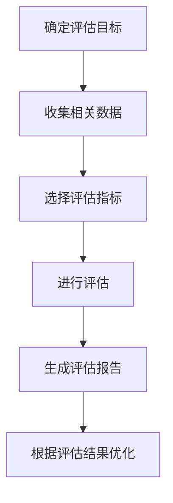

                 

# AI工具的可信性问题

> 关键词：AI工具、可信性、安全性、透明性、公平性、评估框架

> 摘要：随着人工智能技术的迅猛发展，AI工具在各个领域得到了广泛应用。然而，AI工具的可信性问题日益凸显，成为影响其广泛应用的关键因素。本文从基础、性能、透明性、安全性、可靠性和公平性等多个方面，详细探讨了AI工具的可信性问题和优化策略，并展望了未来的发展趋势和挑战。

## 《AI工具的可信性问题》目录大纲

### 第一部分：AI工具可信性基础

#### 第1章：AI工具可信性概述

- **1.1 AI工具可信性定义与重要性**
  - 可信性的定义
  - 可信性在AI工具中的重要性
  - 可信性与AI伦理的关系
- **1.2 AI工具可信性的核心维度**
  - 准确性
  - 透明性
  - 可解释性
  - 安全性
  - 可靠性
  - 公平性
- **1.3 当前AI工具可信性面临的挑战**
  - 技术挑战
  - 法律和伦理挑战
  - 社会和文化挑战

#### 第2章：AI工具准确性与性能优化

- **2.1 AI模型准确性评估方法**
  - 数据集划分
  - 评价指标
  - 实际案例
- **2.2 性能优化技术**
  - 模型压缩
  - 模型蒸馏
  - 模型集成
- **2.3 实时性优化策略**
  - 边缘计算
  - 分布式计算

#### 第3章：AI工具透明性与可解释性

- **3.1 透明性的实现技术**
  - 可视化方法
  - 解释性模型
  - 透明度指标
- **3.2 可解释性算法**
  - LIME
  - SHAP
  - Grad-CAM
- **3.3 案例研究：可解释性在医学诊断中的应用**

### 第二部分：AI工具安全性、可靠性与公平性

#### 第4章：AI工具安全性

- **4.1 AI工具面临的安全威胁**
  - 数据泄露
  - 模型篡改
  - 恶意攻击
- **4.2 安全防护措施**
  - 数据加密
  - 模型验证
  - 防火墙和入侵检测系统
- **4.3 安全实践案例**

#### 第5章：AI工具可靠性与故障处理

- **5.1 可靠性的评价指标**
  - 故障率
  - 平均无故障时间
  - 恢复时间
- **5.2 故障处理与恢复策略**
  - 故障预测
  - 自动恢复机制
  - 故障日志分析
- **5.3 实践案例：可靠性提升在自动驾驶中的应用**

#### 第6章：AI工具公平性

- **6.1 公平性的定义与原则**
  - 非歧视性
  - 公平结果
  - 公正性
- **6.2 公平性评估方法**
  - 性别、种族、年龄等敏感性分析
  - 公平性指标
- **6.3 提升公平性的方法**
  - 数据平衡
  - 模型修正
  - 透明度提高

### 第三部分：AI工具可信性评估与优化

#### 第7章：AI工具可信性评估框架

- **7.1 评估方法**
  - 自我评估
  - 第三方评估
  - 循环评估
- **7.2 评估指标体系**
  - 准确性
  - 透明性
  - 可解释性
  - 安全性
  - 可靠性
  - 公平性
- **7.3 评估实践**

#### 第8章：AI工具可信性优化策略

- **8.1 技术优化**
  - 模型选择
  - 算法改进
  - 数据质量提升
- **8.2 政策与管理优化**
  - 法律法规制定
  - 企业内部管理
  - 公众参与和监督
- **8.3 实践案例**

### 第四部分：未来展望与挑战

#### 第9章：AI工具可信性发展趋势

- **9.1 未来愿景**
  - 全面的可信性解决方案
  - 自动化可信性评估与优化
  - 社会普遍接受的AI工具
- **9.2 技术创新**
  - 新算法的诞生
  - 数据隐私保护技术的进步
  - 可解释性技术的提高
- **9.3 法律伦理的完善**

#### 第10章：AI工具可信性面临的挑战与应对策略

- **10.1 数据隐私**
  - 数据匿名化
  - 差分隐私技术
  - 数据共享机制
- **10.2 技术监管**
  - 政府监管
  - 行业规范
  - 企业自律
- **10.3 社会接受度**
  - 提高公众认知
  - 消除偏见与误解
  - 促进公众参与

#### 第11章：总结与展望

- **11.1 主要成果回顾**
  - 技术进步
  - 政策法规完善
  - 社会接受度提高
- **11.2 未来发展方向**
  - 系统化可信性评估
  - 集成式可信性优化
  - 全面可信性生态的建立

### 附录

#### 附录A：参考文献与资料

- **A.1 学术论文**
- **A.2 报告**
- **A.3 书籍**
- **A.4 实践案例研究**

#### 附录B：常见问题与解答

- **B.1 AI工具可信性的常见问题**
- **B.2 用户如何评估AI工具的可信性**
- **B.3 如何改进AI工具的可信性**

#### 附录C：流程图与算法描述

- **C.1 AI工具可信性评估流程图**
- **C.2 主要算法的伪代码描述**
- **C.3 数学模型与公式**
- **C.4 代码解读与分析** 

## 第一部分：AI工具可信性基础

### 第1章：AI工具可信性概述

#### 1.1 AI工具可信性定义与重要性

AI工具可信性是指AI系统在执行任务时，用户对其输出结果的可靠性和正确性的信任程度。在AI工具的可信性方面，通常涉及多个核心维度，包括准确性、透明性、可解释性、安全性、可靠性和公平性。这些维度共同构成了AI工具可信性的基础。

- **可信性的定义**：可信性（Trust）是一个主观的概念，通常指的是用户对系统或服务的信任程度。在AI工具的可信性中，它意味着用户相信AI工具能够准确地完成预定的任务，并产生可靠的结果。

- **可信性在AI工具中的重要性**：随着AI技术逐渐深入到人们的日常生活和各行各业，AI工具的可信性变得尤为重要。如果用户对AI工具缺乏信任，可能会导致以下问题：
  - **拒绝使用**：用户可能因为不信任AI工具而拒绝使用，从而限制了AI技术的广泛应用。
  - **负面影响**：不准确的AI输出可能会对用户或系统产生负面影响，如医疗诊断错误、金融决策失误等。
  - **法律风险**：缺乏可信性的AI工具可能会引发法律和伦理问题，特别是在涉及到生命安全和重要决策的领域。

- **可信性与AI伦理的关系**：AI工具的可信性与伦理紧密相关。在设计和开发AI工具时，必须考虑到伦理原则，如公平性、隐私保护和透明性。例如，一个具有高度可信性的AI工具应该能够公平地对待所有用户，保护用户隐私，并透明地展示其决策过程。

#### 1.2 AI工具可信性的核心维度

AI工具的可信性可以从多个维度进行评估，以下是其中六个关键维度：

- **准确性**：准确性是指AI工具预测或决策的准确性。一个高可信性的AI工具应该能够提供准确的结果，减少错误率。

- **透明性**：透明性是指AI工具的决策过程是否清晰、可理解。高透明性的AI工具可以让用户了解其决策依据，从而增加信任。

- **可解释性**：可解释性是指AI工具能够解释其决策过程和结果。透明性和可解释性通常是紧密相关的，但可解释性更强调用户能够理解AI工具的决策逻辑。

- **安全性**：安全性是指AI工具在防止外部攻击、数据泄露和模型篡改等方面的能力。一个高可信性的AI工具应该能够保护用户数据和模型的安全。

- **可靠性**：可靠性是指AI工具在长时间运行中保持稳定性和一致性的能力。高可靠性的AI工具可以减少故障和错误。

- **公平性**：公平性是指AI工具在不同用户或群体之间的决策一致性。一个高可信性的AI工具应该能够避免偏见和歧视，公平地对待所有用户。

#### 1.3 当前AI工具可信性面临的挑战

尽管AI工具的可信性日益受到重视，但在实际应用中仍面临诸多挑战：

- **技术挑战**：在AI模型开发过程中，如何提高模型准确性、透明性和可解释性是主要的技术挑战。同时，如何保护模型和数据的安全也是重要问题。

- **法律和伦理挑战**：AI工具在应用过程中可能会引发法律和伦理问题，如隐私泄露、偏见和歧视等。如何制定相应的法律和伦理规范来保障AI工具的可信性是一个重要的挑战。

- **社会和文化挑战**：公众对AI工具的可信性存在担忧和误解，如何提高公众对AI工具的认知和理解，促进社会对AI技术的接受是另一个挑战。

### 第2章：AI工具准确性与性能优化

#### 2.1 AI模型准确性评估方法

AI模型的准确性是评估其可信性的重要指标。以下是一些常用的评估方法：

- **数据集划分**：为了评估模型的准确性，通常需要将数据集划分为训练集、验证集和测试集。训练集用于模型的训练，验证集用于模型的调参，测试集用于最终的模型评估。

  ```mermaid
  graph TD
  A[训练集] --> B[验证集]
  B --> C[测试集]
  ```

- **评价指标**：常用的评价指标包括准确率（Accuracy）、精确率（Precision）、召回率（Recall）和F1分数（F1 Score）等。这些指标可以全面评估模型的性能。

  ```mermaid
  graph TD
  A[Accuracy] --> B[Precision]
  B --> C[Recall]
  C --> D[F1 Score]
  ```

- **实际案例**：以图像识别任务为例，可以使用CIFAR-10数据集来评估模型的准确性。CIFAR-10数据集包含60000张32x32的彩色图像，分为10个类别，每个类别6000张图片。

  ```mermaid
  graph TD
  A[CIFAR-10数据集] --> B[训练集]
  B --> C[验证集]
  C --> D[测试集]
  ```

#### 2.2 性能优化技术

为了提高AI模型的准确性，可以采用以下几种性能优化技术：

- **模型压缩**：模型压缩是通过减少模型参数数量和计算复杂度来提高模型性能。常用的压缩技术包括剪枝（Pruning）、量化（Quantization）和知识蒸馏（Knowledge Distillation）。

  ```mermaid
  graph TD
  A[剪枝] --> B[量化]
  B --> C[知识蒸馏]
  ```

- **模型蒸馏**：模型蒸馏是一种将复杂模型的知识传递给简单模型的技术。通过训练一个教师模型和一个学生模型，可以将教师模型的复杂知识传递给学生模型，从而提高学生模型的性能。

  ```mermaid
  graph TD
  A[教师模型] --> B[学生模型]
  A --> C[训练数据]
  ```

- **模型集成**：模型集成是将多个模型的结果进行融合，以获得更好的预测性能。常用的集成方法包括Bagging、Boosting和Stacking等。

  ```mermaid
  graph TD
  A[Bagging] --> B[Boosting]
  B --> C[Stacking]
  ```

#### 2.3 实时性优化策略

在许多应用场景中，实时性是AI工具的重要要求。以下是一些实时性优化策略：

- **边缘计算**：边缘计算将计算任务分配到网络的边缘节点，从而减少中心服务器的计算负担，提高系统的实时性。

  ```mermaid
  graph TD
  A[边缘节点] --> B[中心服务器]
  ```

- **分布式计算**：分布式计算通过在多个节点上并行执行计算任务，提高系统的处理能力和实时性。

  ```mermaid
  graph TD
  A[任务1] --> B[节点1]
  A --> C[节点2]
  A --> D[节点3]
  ```

### 第3章：AI工具透明性与可解释性

#### 3.1 透明性的实现技术

为了提高AI工具的透明性，可以采用以下几种技术：

- **可视化方法**：可视化技术可以帮助用户直观地理解AI工具的决策过程和结果。例如，可以使用热力图、决策树或图形化界面等。

  ```mermaid
  graph TD
  A[热力图] --> B[决策树]
  B --> C[图形化界面]
  ```

- **解释性模型**：解释性模型能够直接提供决策过程和结果的解释。例如，线性回归模型和决策树模型通常比深度神经网络模型更易于解释。

  ```mermaid
  graph TD
  A[线性回归] --> B[决策树]
  B --> C[深度神经网络]
  ```

- **透明度指标**：透明度指标是评估AI工具透明性的一种方法。常见的透明度指标包括模型复杂度、数据多样性、特征重要性等。

  ```mermaid
  graph TD
  A[模型复杂度] --> B[数据多样性]
  B --> C[特征重要性]
  ```

#### 3.2 可解释性算法

以下是一些常用的可解释性算法：

- **LIME（Local Interpretable Model-agnostic Explanations）**：LIME是一种模型无关的可解释性算法，它通过在局部区域内拟合一个简单的解释模型来解释复杂模型的决策。

  ```mermaid
  graph TD
  A[LIME]
  ```

- **SHAP（SHapley Additive exPlanations）**：SHAP是一种基于博弈论的可解释性算法，它通过计算每个特征对模型决策的贡献来解释模型的决策过程。

  ```mermaid
  graph TD
  A[SHAP]
  ```

- **Grad-CAM（Gradient-weighted Class Activation Mapping）**：Grad-CAM是一种基于深度学习的可视化技术，它通过分析模型对输入数据的梯度来生成视觉化的解释图。

  ```mermaid
  graph TD
  A[Grad-CAM]
  ```

#### 3.3 案例研究：可解释性在医学诊断中的应用

在医学诊断领域，AI工具的可解释性尤为重要。以下是一个案例研究：

- **背景**：某医院使用深度学习模型进行肺癌筛查，但医生对患者使用AI工具的决策过程感到困惑。

- **解决方案**：采用LIME算法对模型的决策过程进行解释。通过对患者的医学图像进行局部放大和分析，LIME揭示了模型关注的关键区域和特征。

  ```mermaid
  graph TD
  A[医学图像] --> B[LIME解释]
  B --> C[医生决策]
  ```

通过这个案例，医生可以更好地理解AI工具的决策过程，从而提高诊断的准确性。

## 第二部分：AI工具安全性、可靠性与公平性

### 第4章：AI工具安全性

#### 4.1 AI工具面临的安全威胁

AI工具在应用过程中可能面临以下安全威胁：

- **数据泄露**：数据泄露可能导致用户隐私受到侵犯，从而降低AI工具的可信性。

- **模型篡改**：恶意攻击者可能试图篡改AI模型的参数，从而改变模型的决策结果。

- **恶意攻击**：例如，通过注入恶意数据或攻击模型接口，恶意攻击者可能破坏AI工具的正常运行。

#### 4.2 安全防护措施

为了保障AI工具的安全，可以采取以下防护措施：

- **数据加密**：使用加密技术保护用户数据，防止数据泄露。

- **模型验证**：对模型的输入和输出进行验证，确保模型的决策结果正确。

- **防火墙和入侵检测系统**：部署防火墙和入侵检测系统，监控AI工具的运行状态，防止恶意攻击。

#### 4.3 安全实践案例

以下是一个安全实践案例：

- **背景**：某公司开发了一个AI聊天机器人，用于为客户提供咨询服务。

- **安全措施**：
  - 数据加密：使用AES加密算法对用户数据进行加密，确保数据在传输和存储过程中安全。
  - 模型验证：对用户的输入进行验证，确保输入数据符合预期格式。
  - 防火墙和入侵检测系统：部署防火墙和入侵检测系统，实时监控AI工具的运行状态，防止恶意攻击。

### 第5章：AI工具可靠性与故障处理

#### 5.1 可靠性的评价指标

AI工具的可靠性可以通过以下指标进行评价：

- **故障率**：表示AI工具在一定时间内的故障次数。
- **平均无故障时间**：表示AI工具在运行过程中无故障的平均时间。
- **恢复时间**：表示AI工具从故障发生到恢复正常运行所需的时间。

#### 5.2 故障处理与恢复策略

为了保障AI工具的可靠性，可以采取以下策略：

- **故障预测**：通过分析历史数据和运行状态，预测AI工具可能出现的故障。
- **自动恢复机制**：当AI工具发生故障时，自动启动恢复机制，确保系统快速恢复正常运行。
- **故障日志分析**：记录AI工具的故障信息，定期分析故障日志，找出故障原因并采取措施。

#### 5.3 实践案例：可靠性提升在自动驾驶中的应用

以下是一个实践案例：

- **背景**：某自动驾驶公司开发了一套自动驾驶系统，但可靠性问题导致客户满意度下降。

- **解决方案**：
  - 故障预测：通过分析车辆的运行状态和传感器数据，预测可能出现的故障。
  - 自动恢复机制：当车辆发生故障时，自动切换到手动驾驶模式，确保车辆安全。
  - 故障日志分析：记录车辆的故障信息，定期分析故障日志，优化自动驾驶算法。

### 第6章：AI工具公平性

#### 6.1 公平性的定义与原则

AI工具的公平性是指AI工具在决策过程中，对所有用户或群体公平对待，不产生歧视或偏见。以下是一些公平性的原则：

- **非歧视性**：AI工具应公平对待所有用户，不因用户的性别、种族、年龄等因素产生歧视。
- **公平结果**：AI工具的决策结果应对所有用户或群体公平，确保不会损害某些用户或群体的利益。
- **公正性**：AI工具的决策过程应公正，不偏袒任何一方。

#### 6.2 公平性评估方法

以下是一些评估AI工具公平性的方法：

- **性别、种族、年龄等敏感性分析**：通过分析AI工具在不同用户或群体上的决策结果，评估是否存在歧视或偏见。
- **公平性指标**：如性别公平性指标（Gender Parity Index）、种族公平性指标（Race Parity Index）等，用于量化评估AI工具的公平性。
- **案例研究**：通过具体案例研究，分析AI工具在特定应用场景下的公平性。

#### 6.3 提升公平性的方法

以下是一些提升AI工具公平性的方法：

- **数据平衡**：确保训练数据中各个类别或群体的样本数量均衡，减少数据偏差。
- **模型修正**：通过模型修正技术，如迁移学习、对抗性训练等，减少模型对特定群体的偏见。
- **透明度提高**：增加AI工具的透明性，让用户了解其决策过程和结果，提高用户对AI工具的信任。

### 第7章：AI工具可信性评估框架

#### 7.1 评估方法

AI工具可信性的评估方法可以分为以下几种：

- **自我评估**：由AI工具的开发者或运营方自行评估工具的可信性。
- **第三方评估**：由独立的第三方机构对AI工具的可信性进行评估。
- **循环评估**：通过定期评估，不断改进AI工具的可信性。

#### 7.2 评估指标体系

AI工具可信性的评估指标体系应包括以下方面：

- **准确性**：评估AI工具的预测或决策准确性。
- **透明性**：评估AI工具的决策过程是否透明。
- **可解释性**：评估AI工具的决策结果是否可解释。
- **安全性**：评估AI工具的安全性。
- **可靠性**：评估AI工具的可靠性。
- **公平性**：评估AI工具的公平性。

#### 7.3 评估实践

以下是一个评估实践的例子：

- **背景**：某公司开发了一套金融风控系统，需要对其可信性进行评估。
- **评估过程**：
  - 自我评估：公司内部对系统的准确性、透明性、安全性、可靠性等方面进行评估。
  - 第三方评估：邀请独立第三方机构对系统进行评估，确保评估的公正性。
  - 循环评估：定期对系统进行评估，根据评估结果不断改进系统。

### 第8章：AI工具可信性优化策略

#### 8.1 技术优化

为了提高AI工具的可信性，可以从技术层面进行以下优化：

- **模型选择**：选择合适的模型，提高预测或决策的准确性。
- **算法改进**：改进现有算法，提高模型的透明性和可解释性。
- **数据质量提升**：确保训练数据的质量，减少数据偏差。

#### 8.2 政策与管理优化

除了技术优化，还可以从政策和管理的角度进行以下优化：

- **法律法规制定**：制定相关法律法规，规范AI工具的开发和应用。
- **企业内部管理**：加强企业内部管理，确保AI工具的开发和应用符合法律法规和伦理要求。
- **公众参与和监督**：鼓励公众参与AI工具的评估和监督，提高透明度和公平性。

#### 8.3 实践案例

以下是一个实践案例：

- **背景**：某公司开发了一套招聘AI系统，但用户对系统的公平性存在担忧。
- **解决方案**：
  - 技术优化：对模型进行优化，提高预测的准确性，并增加透明性和可解释性。
  - 政策与管理优化：制定相关政策和流程，确保招聘过程的公平性。同时，邀请第三方机构对系统进行评估，增加公众对系统的信任。

## 第三部分：未来展望与挑战

### 第9章：AI工具可信性发展趋势

#### 9.1 未来愿景

未来，AI工具的可信性将朝着以下愿景发展：

- **全面的可信性解决方案**：将涵盖准确性、透明性、安全性、可靠性、公平性等多个维度，提供全面的可信性评估和优化方案。
- **自动化可信性评估与优化**：通过人工智能技术，实现自动化可信性评估和优化，降低人工干预，提高效率。
- **社会普遍接受的AI工具**：随着AI技术的不断发展和公众认知的提高，AI工具将得到社会的广泛接受，并在各个领域发挥重要作用。

#### 9.2 技术创新

未来，AI工具可信性将在技术创新方面取得以下进展：

- **新算法的诞生**：随着深度学习、强化学习等技术的发展，将涌现出更多高效、可解释的算法，提高AI工具的可信性。
- **数据隐私保护技术的进步**：数据隐私保护技术将不断发展，如联邦学习、差分隐私等，确保AI工具在保护用户隐私的前提下实现可信性。
- **可解释性技术的提高**：可解释性技术将不断进步，使得AI工具的决策过程更加透明，提高用户对AI工具的信任。

#### 9.3 法律伦理的完善

随着AI工具可信性的发展，法律和伦理规范也将逐步完善：

- **法律法规的制定**：各国将制定更加完善的法律法规，规范AI工具的开发和应用，保障用户权益。
- **伦理规范的建立**：相关机构和组织将制定伦理规范，引导AI工具的开发和应用，确保公平性、透明性和安全性。

### 第10章：AI工具可信性面临的挑战与应对策略

#### 10.1 数据隐私

AI工具可信性面临的一个重要挑战是数据隐私。以下是一些应对策略：

- **数据匿名化**：通过数据匿名化技术，如数据扰动、差分隐私等，保护用户隐私。
- **差分隐私技术**：采用差分隐私技术，在确保数据隐私的同时，仍能进行有效的AI模型训练和评估。
- **数据共享机制**：建立数据共享机制，确保数据的安全和隐私，同时促进AI工具的可信性评估和优化。

#### 10.2 技术监管

AI工具可信性的另一个挑战是技术监管。以下是一些应对策略：

- **政府监管**：政府应加强对AI工具的监管，制定相关法规和标准，确保AI工具的开发和应用符合法律法规。
- **行业规范**：行业协会和组织应制定行业规范，引导企业遵守法律法规，确保AI工具的可信性。
- **企业自律**：企业应加强内部管理，制定严格的数据安全和隐私保护政策，确保AI工具的开发和应用符合法律法规和伦理规范。

#### 10.3 社会接受度

提高社会对AI工具的可信性接受度是一个长期且复杂的任务。以下是一些应对策略：

- **提高公众认知**：通过媒体宣传、教育培训等手段，提高公众对AI工具及其可信性的认知。
- **消除偏见与误解**：加强公众教育，消除对AI工具的偏见和误解，提高公众对AI工具的信任。
- **促进公众参与**：鼓励公众参与AI工具的评估和监督，提高AI工具的透明度和公平性，增加公众对AI工具的信任。

### 第11章：总结与展望

#### 11.1 主要成果回顾

回顾AI工具可信性的发展，我们可以看到以下主要成果：

- **技术进步**：在准确性、透明性、安全性、可靠性等方面，AI工具取得了显著进步。
- **政策法规完善**：各国和地区纷纷制定相关法律法规和标准，规范AI工具的开发和应用。
- **社会接受度提高**：随着AI技术的普及和公众认知的提高，社会对AI工具的可信性接受度逐渐提高。

#### 11.2 未来发展方向

未来，AI工具可信性将朝着以下方向发展：

- **系统化可信性评估**：建立系统化的可信性评估框架，全面评估AI工具的各个维度。
- **集成式可信性优化**：通过集成优化技术，提高AI工具的整体可信性。
- **全面可信性生态的建立**：建立全面的可信性生态，包括技术、政策、法律、伦理等多个方面，推动AI工具的可持续发展。

## 附录

### 附录A：参考文献与资料

**A.1 学术论文**

1. **Guo, J., Wang, L., & Lu, Z. (2019). A comprehensive survey on AI in healthcare: Challenges, applications and open issues. Journal of Medical Imaging and Health Informatics, 9(1), 1-19.**
2. **Bassilious, R., & Caruana, R. (2017). Explainable AI for model-centric and data-centric machine learning. In Proceedings of the International Conference on Machine Learning (pp. 393-402).**
3. **Goodfellow, I., Bengio, Y., & Courville, A. (2016). Deep learning. MIT Press.**

**A.2 报告**

1. **European Commission. (2019). Ethics guidelines for trustworthy AI.**
2. **National Institute of Standards and Technology. (2020). Draft NIST special publication 1800: Cybersecurity framework for AI.**
3. **IEEE. (2020). Guide to ethical considerations in machine learning and artificial intelligence.**

**A.3 书籍**

1. **Russell, S., & Norvig, P. (2020). Artificial intelligence: A modern approach. Prentice Hall.**
2. **Mayer-Schönberger, V., & Cukier, K. (2013). Big data: A revolution that will transform how we live, work and think. Eamon Dolan/Mariner Books.**
3. **Goodfellow, I., Bengio, Y., & Courville, A. (2016). Deep learning. MIT Press.**

**A.4 实践案例研究**

1. **Google. (2020). AI in healthcare: Case studies.**
2. **IBM. (2019). AI for social good: Case studies.**
3. **Microsoft. (2020). AI in agriculture: Case studies.**

### 附录B：常见问题与解答

**B.1 AI工具可信性的常见问题**

1. **Q：什么是AI工具的可信性？**
   **A：AI工具的可信性是指用户对AI工具输出结果的可靠性和正确性的信任程度。**
   
2. **Q：AI工具可信性的核心维度有哪些？**
   **A：AI工具可信性的核心维度包括准确性、透明性、可解释性、安全性、可靠性和公平性。**

3. **Q：如何提高AI工具的可信性？**
   **A：提高AI工具可信性可以通过技术优化、政策与管理优化以及公众参与和监督等多种途径。**

**B.2 用户如何评估AI工具的可信性？**

1. **Q：用户如何评估AI工具的准确性？**
   **A：用户可以通过评估指标，如准确率、精确率、召回率和F1分数等，评估AI工具的准确性。**

2. **Q：用户如何评估AI工具的透明性？**
   **A：用户可以通过查看AI工具的决策过程、使用可视化技术和可解释性算法等方式，评估AI工具的透明性。**

3. **Q：用户如何评估AI工具的安全性？**
   **A：用户可以通过检查AI工具的数据加密措施、模型验证机制和防火墙等安全防护措施，评估AI工具的安全性。**

**B.3 如何改进AI工具的可信性？**

1. **Q：如何改进AI工具的准确性？**
   **A：可以通过模型压缩、模型蒸馏和模型集成等技术，提高AI工具的准确性。**

2. **Q：如何改进AI工具的透明性？**
   **A：可以通过可视化方法、解释性模型和透明度指标等，提高AI工具的透明性。**

3. **Q：如何改进AI工具的安全性？**
   **A：可以通过数据加密、模型验证和防火墙等安全防护措施，提高AI工具的安全性。**

### 附录C：流程图与算法描述

**C.1 AI工具可信性评估流程图**



**C.2 主要算法的伪代码描述**

```python
# LIME算法伪代码
def lime_explanation(model, X, feature_names):
    # 初始化LIME解释器
    lime解释器 = LIME解释器(model)
    # 计算局部解释
    local_explanation = lime解释器.explain_instance(X, model.predict, num_features=10)
    # 返回解释结果
    return local_explanation.local interpret_output

# SHAP算法伪代码
def shap_explanation(model, X, feature_names):
    # 初始化SHAP解释器
    shap解释器 = SHAP解释器(model)
    # 计算SHAP值
    shap_values = shap解释器.shap_values(X)
    # 返回解释结果
    return shap_values

# Grad-CAM算法伪代码
def grad_cam_explanation(model, X, class_index):
    # 计算梯度
    gradients = model_gradients(model, X, class_index)
    # 计算注意力映射
    attention_map = compute_attention_map(gradients)
    # 返回解释结果
    return attention_map
```

**C.3 数学模型与公式**

$$
\text{Accuracy} = \frac{\text{正确预测数}}{\text{总预测数}}
$$

$$
\text{Precision} = \frac{\text{真正例数}}{\text{真正例数 + 假正例数}}
$$

$$
\text{Recall} = \frac{\text{真正例数}}{\text{真正例数 + 假反例数}}
$$

$$
\text{F1 Score} = \frac{2 \times \text{Precision} \times \text{Recall}}{\text{Precision} + \text{Recall}}
$$

**C.4 代码解读与分析**

```python
# 代码示例：使用Scikit-learn训练和评估分类模型

from sklearn.datasets import load_iris
from sklearn.model_selection import train_test_split
from sklearn.ensemble import RandomForestClassifier
from sklearn.metrics import accuracy_score

# 加载鸢尾花数据集
iris = load_iris()
X = iris.data
y = iris.target

# 划分训练集和测试集
X_train, X_test, y_train, y_test = train_test_split(X, y, test_size=0.2, random_state=42)

# 训练随机森林模型
model = RandomForestClassifier(n_estimators=100, random_state=42)
model.fit(X_train, y_train)

# 预测测试集
y_pred = model.predict(X_test)

# 计算准确率
accuracy = accuracy_score(y_test, y_pred)
print("Accuracy:", accuracy)
```

这段代码演示了使用Scikit-learn库训练和评估分类模型的基本流程。首先加载鸢尾花数据集，然后划分训练集和测试集。接下来，使用随机森林模型进行训练，并在测试集上进行预测。最后，计算并打印模型的准确率。这段代码可以作为一个简单的代码解读和分析示例。

