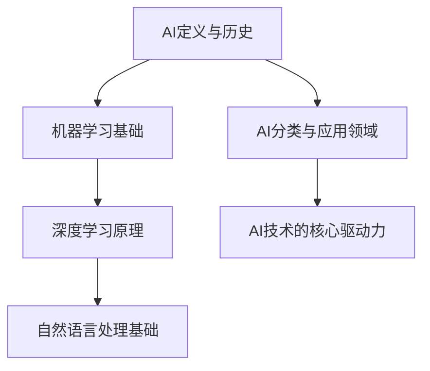

                 

# AI底层技术的投入与回报

## 关键词

- 人工智能
- 投资回报率
- 深度学习
- 计算资源
- 项目评估

## 摘要

本文深入探讨了人工智能（AI）底层技术的投入与回报。首先，我们概述了AI的定义、分类及核心驱动力，随后详细介绍了机器学习、深度学习和自然语言处理的基础原理。接下来，我们分析了AI底层技术的计算资源需求，并探讨了投资决策、成本分析和风险评估。最后，通过实际案例研究和收益评估方法，本文提供了对AI项目成功实施的关键见解。

### 第一部分：AI底层技术概览

#### 第1章：AI概述

##### 1.1 AI的定义与历史

人工智能（AI）是计算机科学的一个分支，旨在使机器模拟人类智能行为，包括学习、推理、解决问题和自我改进。AI的历史可以追溯到20世纪50年代，当时图灵提出了著名的图灵测试，用于评估机器是否具备人类智能。自那时以来，AI经历了几个重要的发展阶段，包括早期的符号逻辑、专家系统、机器学习以及现代的深度学习和神经网络。

##### 1.2 AI的分类与应用领域

AI可以根据其实现方式和技术特点分为多个类别。主要的分类包括：

- **基于规则的系统**：使用预定义的规则进行决策。
- **机器学习**：通过数据学习模式和规律，进行预测和分类。
- **深度学习**：基于多层神经网络进行数据分析和模式识别。
- **自然语言处理（NLP）**：使机器理解和生成自然语言。
- **计算机视觉**：使机器理解和解释视觉信息。

AI的应用领域广泛，包括但不限于医疗保健、金融、交通、零售、制造和娱乐等。每个领域都有其独特的AI需求和技术挑战。

##### 1.3 AI技术的核心驱动力

AI技术的核心驱动力包括数据、计算能力和算法的进步。大量数据的可用性使得机器能够从数据中学习，而计算能力的提升使得复杂算法得以实现。此外，深度学习算法的进步，特别是神经网络的发展，为AI技术的突破提供了动力。

#### 第2章：AI底层技术基础

##### 2.1 机器学习基础

##### 2.1.1 监督学习、无监督学习和强化学习

机器学习（ML）是AI的核心技术之一。ML可以分为三种主要类型：

- **监督学习**：使用标记数据进行学习，算法可以从输入和输出数据中学习关系。
- **无监督学习**：没有标记数据，算法需要从数据中发现隐藏的模式。
- **强化学习**：算法通过与环境的交互学习最优策略。

##### 2.1.2 数据预处理和特征工程

数据预处理和特征工程是机器学习的重要步骤。数据预处理包括清洗、归一化和数据变换，以减少噪声和偏差。特征工程则涉及提取和选择有助于模型训练的特征，以提高模型的性能和泛化能力。

##### 2.1.3 模型评估与优化

模型评估是验证模型性能的过程。常用的评估指标包括准确率、召回率、F1分数等。模型优化涉及超参数调整和正则化，以提高模型的泛化能力和性能。

##### 2.2 深度学习原理

##### 2.2.1 神经网络结构

神经网络（NN）是深度学习（DL）的基础。NN由多个层次组成，包括输入层、隐藏层和输出层。每个层次由多个节点（神经元）组成，节点之间通过权重连接。NN通过激活函数将输入映射到输出。

##### 2.2.2 深度学习框架

深度学习框架如TensorFlow、PyTorch和Keras等，提供了构建和训练神经网络的便捷工具。框架通常包括数据处理、模型构建、训练和评估等模块。

##### 2.2.3 卷积神经网络（CNN）

CNN是一种专门用于图像处理的神经网络。它通过卷积层、池化层和全连接层处理图像数据，提取特征并进行分类。

##### 2.2.4 循环神经网络（RNN）与长短期记忆网络（LSTM）

RNN是一种用于序列数据处理的神经网络，但容易受到长期依赖问题的影响。LSTM是RNN的一种改进，通过引入门控机制解决了长期依赖问题，广泛应用于自然语言处理和时间序列分析。

##### 2.3 自然语言处理基础

##### 2.3.1 语言模型

语言模型用于预测文本中的下一个单词或字符。常见的语言模型包括N元语法和神经网络语言模型。

##### 2.3.2 词嵌入技术

词嵌入是将单词映射到高维向量空间的技术，使计算机能够理解单词的语义关系。词嵌入技术如Word2Vec和BERT广泛应用于NLP任务。

##### 2.3.3 序列模型与注意力机制

序列模型如RNN和LSTM可以处理序列数据，但难以捕捉长距离依赖。注意力机制通过动态分配注意力权重，提高了模型对序列中重要信息的捕捉能力。

### 第二部分：AI项目投资与回报分析

#### 第3章：AI底层技术的计算资源需求

##### 3.1 硬件资源需求

##### 3.1.1 GPU与TPU

GPU（图形处理单元）和TPU（张量处理单元）是深度学习任务中常用的硬件加速器。GPU擅长并行计算，而TPU专为处理张量计算优化。

##### 3.1.2 云计算资源

云计算资源提供了灵活的计算能力，可以根据需求动态调整资源。常用的云服务包括Amazon Web Services（AWS）、Google Cloud Platform（GCP）和Microsoft Azure。

##### 3.1.3 分布式计算与并行计算

分布式计算和并行计算可以显著提高计算效率。分布式计算通过将任务分配到多台计算机，而并行计算通过多线程或多GPU加速计算。

##### 3.2 软件资源需求

##### 3.2.1 开源深度学习框架

开源深度学习框架如TensorFlow、PyTorch和Keras等，提供了丰富的工具和库，简化了深度学习模型的构建和训练。

##### 3.2.2 数据存储与处理

数据存储与处理是AI项目的重要环节。常用的技术包括分布式文件系统、大数据处理框架和数据库。

##### 3.2.3 模型压缩与量化

模型压缩与量化技术可以减小模型的体积和提高计算效率。压缩技术包括剪枝、量化等，量化技术通过将浮点数模型转换为低精度整数模型实现。

#### 第4章：AI项目的投资决策

##### 4.1 投资原则与策略

投资原则包括成本效益分析、风险分析和市场分析。投资策略涉及资金分配、时间规划和风险管理。

##### 4.2 成本分析

成本分析包括硬件成本、软件开发成本、人力成本和其他相关成本。通过详细分析成本，可以制定合理的预算计划。

##### 4.2.1 硬件成本

硬件成本包括GPU、TPU、服务器和其他硬件设备。选择合适的硬件配置对于项目成功至关重要。

##### 4.2.2 软件成本

软件成本包括深度学习框架、数据处理库和其他软件工具。开源软件可以降低成本，但需要确保其稳定性和性能。

##### 4.2.3 人力成本

人力成本包括数据科学家、工程师和其他技术人员的工资。合理的人力配置可以提高项目效率。

##### 4.3 风险评估与管理

风险评估涉及识别、评估和缓解潜在风险。常见风险包括技术风险、市场风险和运营风险。

#### 第5章：AI项目的收益评估

##### 5.1 收益来源

AI项目的收益来源包括提高生产力、降低成本、创造新业务机会和提升品牌价值等。

##### 5.2 收益评估方法

收益评估方法包括财务指标和非财务指标。财务指标如投资回报率（ROI）、净现值（NPV）和内部收益率（IRR）等，非财务指标如客户满意度、市场份额和品牌价值等。

##### 5.2.1 传统财务指标

传统财务指标包括ROI、NPV和IRR等，用于评估项目的经济效益。

##### 5.2.2 非财务指标

非财务指标包括客户满意度、市场份额和品牌价值等，用于评估项目的综合效益。

##### 5.3 ROI分析

投资回报率（ROI）是评估项目收益的重要指标，计算公式为：

$$
ROI = \frac{\text{净收益}}{\text{总投资}} \times 100\%
$$

通过ROI分析，可以判断项目的经济效益和可行性。

#### 第6章：AI项目案例研究

##### 6.1 案例选择与分类

本章节选择了两个AI项目案例进行详细分析：智能客服系统和智能安防系统。

##### 6.2 案例分析与评价

##### 6.2.1 投资决策分析

对案例项目进行投资决策分析，包括成本分析和收益评估。通过ROI、NPV和IRR等指标，评估项目的经济可行性。

##### 6.2.2 收益评估与风险控制

对案例项目进行收益评估，包括财务指标和非财务指标。同时，分析项目的风险，并提出风险控制措施。

#### 第7章：未来展望与趋势

##### 7.1 AI技术的发展趋势

AI技术将继续快速发展，包括深度学习、强化学习和自然语言处理等领域。新的算法和技术将不断提高AI的性能和应用范围。

##### 7.2 AI产业政策与投资环境

各国政府将加大对AI产业的支持，出台相关政策促进AI技术的发展和应用。投资环境也将变得更加有利。

##### 7.3 AI项目的未来挑战与机遇

AI项目在未来的发展中将面临数据隐私、伦理问题和法律法规等挑战。同时，也将迎来巨大的市场机会和技术创新。

#### 第8章：结论与建议

##### 8.1 研究结论

本文通过分析AI底层技术的投入与回报，得出以下结论：

- AI技术具有广阔的应用前景和巨大的经济效益。
- 成本分析和收益评估是AI项目成功实施的关键环节。
- 投资决策和风险控制对项目的成功至关重要。

##### 8.2 对企业和研究机构的建议

- 企业应加强对AI技术的投资和应用，提高市场竞争力和创新能力。
- 研究机构应加强基础研究和技术创新，推动AI技术的进步。

##### 8.3 对未来研究的展望

未来研究应关注AI技术在各个领域的深入应用，以及跨学科的研究方向，如AI与生物医学、能源和环境等领域的融合。

#### 附录

##### 附录A：参考资料与进一步阅读

- 《深度学习》（Goodfellow, I., Bengio, Y., & Courville, A.）
- 《机器学习》（Murphy, K. P.）
- 《自然语言处理综论》（Jurafsky, D., & Martin, J. H.）

##### 附录B：常见AI模型与算法详解

- 卷积神经网络（CNN）
- 循环神经网络（RNN）
- 长短期记忆网络（LSTM）
- 生成对抗网络（GAN）

##### 附录C：AI项目开发工具与环境搭建指南

- TensorFlow
- PyTorch
- Jupyter Notebook

### 关键概念与联系流程图



### 核心算法原理讲解

#### 第2章：AI底层技术基础

##### 2.2 深度学习原理

###### 2.2.1 神经网络结构

神经网络是深度学习的基础，其基本结构包括输入层、隐藏层和输出层。每个神经元都与前一层的神经元相连，并通过权重进行加权求和，再通过激活函数进行非线性变换。

伪代码：

```python
# 初始化权重和偏置
W, b = init_weights()

# 前向传播
for x in data:
    z = x * W + b
    a = sigmoid(z)

# 反向传播
for x, y in data:
    z = x * W + b
    a = sigmoid(z)
    dz = d_sigmoid(a) * (y - a)
    dW = dz * x
    db = dz

# 更新权重和偏置
W -= learning_rate * dW
b -= learning_rate * db
```

损失函数通常使用均方误差（MSE），激活函数使用 sigmoid 函数。

损失函数（MSE）：
$$
L = \frac{1}{2} \sum_{i=1}^{n} (y_i - y_{\hat{i}})^2
$$

激活函数（sigmoid）：
$$
\sigma(z) = \frac{1}{1 + e^{-z}}
$$

激活函数的导数（sigmoid_prime）：
$$
\sigma'(z) = \sigma(z) (1 - \sigma(z))
$$

###### 2.2.2 卷积神经网络（CNN）

卷积神经网络（CNN）是一种用于图像处理的神经网络，其基本结构包括卷积层、池化层和全连接层。卷积层通过卷积操作提取图像特征，池化层用于降低特征图的维度，全连接层用于分类。

伪代码：

```python
# 初始化卷积核和偏置
W, b = init_weights()

# 卷积层
for x in data:
    z = conv2d(x, W) + b
    a = sigmoid(z)

# 池化层
for x in data:
    p = max_pooling(a)

# 全连接层
for x in data:
    z = p * W + b
    a = sigmoid(z)
```

卷积操作：
$$
\text{conv2d}(x, W) = \sum_{k=1}^{K} W_k \cdot x
$$

激活函数通常使用 ReLU 函数。

激活函数（ReLU）：
$$
f(x) = \max(0, x)
$$

激活函数的导数（ReLU_prime）：
$$
f'(x) = \begin{cases} 
0 & \text{if } x \leq 0 \\
1 & \text{if } x > 0 
\end{cases}
$$

###### 2.2.3 循环神经网络（RNN）与长短期记忆网络（LSTM）

循环神经网络（RNN）是一种用于序列数据处理的神经网络，其特点是具有时间记忆功能。但RNN存在梯度消失和梯度爆炸问题，长短期记忆网络（LSTM）是RNN的一种改进，通过引入门控机制解决了这些问题。

伪代码：

```python
# 初始化权重和偏置
W, b = init_weights()

# 前向传播
for x, h_prev in data:
    i = sigmoid(W_i * [h_prev, x] + b_i)
    f = sigmoid(W_f * [h_prev, x] + b_f)
    o = sigmoid(W_o * [h_prev, x] + b_o)
    c_tilde = f * c_{t-1} + i * x
    c = tanh(c_tilde)
    h = o * tanh(c)

# 反向传播
for x, h_prev, h in data:
    di = d_sigmoid(i) * [h_prev, x]
    df = d_sigmoid(f) * [h_prev, x]
    do = d_sigmoid(o) * [h_prev, x]
    dc_tilde = d_tanh(c_tilde)
    dc = dc_tilde * o
    dc_c = dc * tanh(c)
    dc_i = dc_c * c_tilde * (1 - i)
    dc_f = dc_c * c_{t-1} * f
    dc_o = dc_c * tanh(c) * (1 - o)
    dW_i = di * [h_prev, x]
    db_i = di
    dW_f = df * [h_prev, x]
    db_f = df
    dW_o = do * [h_prev, x]
    db_o = do
    dW_h = dh * [h_prev, c]
    dc_prev = dc * tanh(c)
```

激活函数使用 sigmoid、tanh 函数。

激活函数（sigmoid）：
$$
\sigma(z) = \frac{1}{1 + e^{-z}}
$$

激活函数的导数（sigmoid_prime）：
$$
\sigma'(z) = \sigma(z) (1 - \sigma(z))
$$

激活函数（tanh）：
$$
\tanh(z) = \frac{e^z - e^{-z}}{e^z + e^{-z}}
$$

激活函数的导数（tanh_prime）：
$$
\tanh'(z) = 1 - \tanh^2(z)
$$

### 核心算法原理讲解

#### 第2章：AI底层技术基础

##### 2.2 深度学习原理

###### 2.2.1 神经网络结构

神经网络（NN）是一种模拟人脑神经网络计算能力的算法模型，其基本结构包括输入层、隐藏层和输出层。输入层接收外部输入数据，隐藏层通过权重和激活函数对输入数据进行加工，输出层生成预测或分类结果。

1. **前向传播**：输入数据经过输入层，通过权重矩阵传递到隐藏层，再传递到输出层。每个神经元都会进行加权求和并应用激活函数。

伪代码：

```python
# 初始化权重和偏置
weights, biases = initialize_weights()

# 前向传播
for inputs in input_data:
    layer_outputs = [np.dot(inputs, weights[0]) + biases[0]]  # 输入层到隐藏层1
    for i in range(1, num_layers - 1):
        layer_outputs.append(np.dot(layer_outputs[-1], weights[i]) + biases[i])  # 隐藏层之间
    final_output = np.dot(layer_outputs[-1], weights[-1]) + biases[-1]  # 隐藏层到输出层
```

2. **激活函数**：常用的激活函数包括 sigmoid、ReLU 和 tanh。激活函数用于引入非线性，使神经网络能够学习复杂的函数。

- **sigmoid**：
  $$\sigma(z) = \frac{1}{1 + e^{-z}}$$
  $$\sigma'(z) = \sigma(z) (1 - \sigma(z))$$

- **ReLU**：
  $$f(x) = \max(0, x)$$
  $$f'(x) = \begin{cases} 
  0 & \text{if } x \leq 0 \\
  1 & \text{if } x > 0 
  \end{cases}$$

- **tanh**：
  $$\tanh(z) = \frac{e^z - e^{-z}}{e^z + e^{-z}}$$
  $$\tanh'(z) = 1 - \tanh^2(z)$$

3. **反向传播**：计算输出层和隐藏层的误差，并反向传播误差到隐藏层和输入层，更新权重和偏置。

伪代码：

```python
# 反向传播
deltas = [final_output - actual_output]
for i in reversed(range(num_layers - 1)):
    delta = (deltas[0] * (weights[i + 1].T).dot(np.hstack((layer_outputs[i].T, np.zeros((1, 1))))))
    deltas.insert(0, delta)
weights -= learning_rate * np.array([layer_outputs[i].T.dot(deltas[i]) for i in range(num_layers - 1)])
biases -= learning_rate * np.array([deltas[i] for i in range(num_layers - 1)])
```

##### 2.2.2 卷积神经网络（CNN）

卷积神经网络（CNN）是深度学习的一种特殊结构，主要用于图像识别和计算机视觉任务。CNN通过卷积层、池化层和全连接层进行处理。

1. **卷积层**：卷积层通过卷积操作提取图像特征。卷积核在图像上滑动，计算每个位置的局部特征。

伪代码：

```python
# 初始化卷积核和偏置
conv_kernels, biases = initialize_weights()

# 卷积操作
for image in input_data:
    conv_output = []
    for kernel in conv_kernels:
        conv_result = np.zeros((image.shape[0] - kernel.shape[0] + 1, image.shape[1] - kernel.shape[1] + 1))
        for i in range(conv_result.shape[0]):
            for j in range(conv_result.shape[1]):
                local_region = image[i:i + kernel.shape[0], j:j + kernel.shape[1]]
                conv_result[i, j] = np.sum(local_region * kernel)
        conv_output.append(conv_result + biases)
    layer_output = np.array(conv_output)
```

2. **池化层**：池化层用于减少数据维度并降低过拟合的风险。常用的池化操作包括最大池化和平均池化。

伪代码：

```python
# 最大池化操作
for layer_output in conv_output:
    for i in range(layer_output.shape[0] // 2):
        for j in range(layer_output.shape[1] // 2):
            max_val = max(layer_output[i, j], layer_output[i + 1, j], layer_output[i, j + 1], layer_output[i + 1, j + 1])
            layer_output[i, j] = max_val
```

3. **全连接层**：全连接层将卷积层输出的特征映射到具体的分类结果。

伪代码：

```python
# 全连接层
for layer_output in pool_output:
    flattened_output = layer_output.flatten()
    final_output = np.dot(flattened_output, weights[-1]) + biases[-1]
```

##### 2.2.3 循环神经网络（RNN）与长短期记忆网络（LSTM）

循环神经网络（RNN）适用于序列数据建模，但其梯度消失和梯度爆炸问题限制了其效果。长短期记忆网络（LSTM）是RNN的一种改进，通过引入门控机制来解决这些问题。

1. **LSTM结构**：LSTM包含三个门控单元和一个记忆单元。

- **遗忘门（Forget Gate）**：决定哪些信息需要遗忘。
- **输入门（Input Gate）**：决定哪些新信息需要存储。
- **输出门（Output Gate）**：决定哪些信息需要输出。

伪代码：

```python
# 初始化权重和偏置
weights, biases = initialize_weights()

# 前向传播
for input_seq, target in data:
    h_prev = initialize_hidden_state()
    c_prev = initialize_cell_state()
    for input_t in input_seq:
        i_t = sigmoid(np.dot(h_prev, weights_i) + np.dot(input_t, weights_input) + biases_i)
        f_t = sigmoid(np.dot(h_prev, weights_f) + np.dot(input_t, weights_forget) + biases_f)
        o_t = sigmoid(np.dot(h_prev, weights_o) + np.dot(input_t, weights_output) + biases_o)
        c_t = f_t * c_prev + i_t * tanh(np.dot(h_prev, weights_c) + np.dot(input_t, weights_cell) + biases_c)
        h_t = o_t * tanh(c_t)
    output = h_t

# 反向传播
for input_seq, target, output in data:
    doutput = doutput / len(input_seq)
    dh_t = doutput * tanh(c_t)
    dc_t = dh_t * (1 - tanh^2(c_t))
    do_t = dc_t * c_t
    di_t = dc_t * tanh(c_t)
    df_t = dc_t * c_prev
    df_t = df_t * (1 - f_t)
    df_t = df_t * (1 - f_t)
    dh_prev = dh_t * weights_h
    dc_prev = dc_t * weights_c
    df_prev = df_t * weights_f
    di_prev = di_t * weights_i
    do_prev = do_t * weights_o
    biases_i -= learning_rate * di_prev
    biases_f -= learning_rate * df_prev
    biases_o -= learning_rate * do_prev
    biases_c -= learning_rate * dc_prev
    weights_i -= learning_rate * di_prev * input_t
    weights_f -= learning_rate * df_prev * h_prev
    weights_o -= learning_rate * do_prev * h_prev
    weights_c -= learning_rate * dc_prev * h_prev
```

激活函数使用 sigmoid 和 tanh 函数。

激活函数（sigmoid）：
$$
\sigma(z) = \frac{1}{1 + e^{-z}}
$$
$$
\sigma'(z) = \sigma(z) (1 - \sigma(z))
$$

激活函数（tanh）：
$$
\tanh(z) = \frac{e^z - e^{-z}}{e^z + e^{-z}}
$$
$$
\tanh'(z) = 1 - \tanh^2(z)
$$

### 项目实战

#### 第5章：AI项目的收益评估

##### 5.2 收益评估方法

AI项目的收益评估是确保项目投资合理性和成功实施的关键环节。收益评估方法可以分为财务指标和非财务指标两大类，具体如下：

1. **财务指标**：

   - **投资回报率（ROI）**：计算项目的净收益与总投资之比，用于衡量投资的回报率。
     $$ROI = \frac{\text{净收益}}{\text{总投资}} \times 100\%$$
   
   - **净现值（NPV）**：计算项目未来现金流的现值减去总投资，用于评估项目的经济价值。
     $$NPV = \sum_{t=1}^{n} \frac{F_t}{(1 + r)^t} - I$$
     其中，\(F_t\) 是第 \(t\) 年的净现金流，\(r\) 是折现率，\(I\) 是总投资。

   - **内部收益率（IRR）**：计算使项目NPV为零的收益率，用于衡量项目的投资回报水平。
     $$IRR = \text{使得} \sum_{t=1}^{n} \frac{F_t}{(1 + r)^t} - I = 0 \text{ 的} r$$

2. **非财务指标**：

   - **客户满意度**：通过问卷调查和反馈收集客户对产品或服务的满意度，用于衡量项目的用户价值。
   
   - **市场份额**：分析项目上线前后企业在市场中的占有率，用于衡量项目的市场影响。
   
   - **品牌价值**：通过市场调研评估项目对品牌形象的提升，用于衡量项目的长期价值。

##### 5.2.1 传统财务指标

1. **投资回报率（ROI）**

   投资回报率（ROI）是最常用的财务指标之一，用于衡量投资的回报水平。其计算公式为：

   $$ROI = \frac{\text{净收益}}{\text{总投资}} \times 100\%$$

   其中，净收益是指项目运营期间的总收入减去总成本，总投资包括硬件成本、软件开发成本、人力成本等。

   举例说明：

   假设一个AI项目总投资为100万元，年净收益为30万元，计算该项目的ROI：

   $$ROI = \frac{30}{100} \times 100\% = 30\%$$

   该ROI表明项目的年回报率为30%，是一个较为理想的回报水平。

2. **净现值（NPV）**

   净现值（NPV）是评估项目经济价值的重要指标，通过计算项目未来现金流的现值减去总投资，得出项目的净收益。其计算公式为：

   $$NPV = \sum_{t=1}^{n} \frac{F_t}{(1 + r)^t} - I$$

   其中，\(F_t\) 是第 \(t\) 年的净现金流，\(r\) 是折现率，\(I\) 是总投资。

   举例说明：

   假设一个AI项目持续5年，每年的净现金流分别为20万元、25万元、30万元、35万元和40万元，总投资为100万元，折现率为10%，计算该项目的NPV：

   $$NPV = \frac{20}{1.1} + \frac{25}{(1.1)^2} + \frac{30}{(1.1)^3} + \frac{35}{(1.1)^4} + \frac{40}{(1.1)^5} - 100$$
   $$NPV = 18.18 + 22.73 + 25.40 + 28.14 + 31.89 - 100 = 17.14$$

   由于NPV为正，表明项目的净现值为17.14万元，说明项目具有正的经济效益。

3. **内部收益率（IRR）**

   内部收益率（IRR）是使项目NPV为零的收益率，用于衡量项目的投资回报水平。其计算公式为：

   $$IRR = \text{使得} \sum_{t=1}^{n} \frac{F_t}{(1 + r)^t} - I = 0 \text{ 的} r$$

   举例说明：

   假设一个AI项目的NPV为17.14万元，计算该项目的IRR：

   通过试错法或财务软件计算，得出项目的IRR约为15.71%。

##### 5.2.2 非财务指标

1. **客户满意度**

   客户满意度是衡量项目成功的重要非财务指标。通过问卷调查、用户反馈和市场调研等方式，收集客户对产品或服务的满意度评分。

   举例说明：

   假设一个AI项目通过问卷调查，收集到100位客户的满意度评分，其中90位客户表示非常满意，5位客户表示满意，5位客户表示不满意，计算该项目的客户满意度：

   $$客户满意度 = \frac{90 + 5}{100} \times 100\% = 95\%$$

   该客户满意度表明项目具有较高的用户价值。

2. **市场份额**

   市场份额是衡量项目市场影响力的重要指标。通过分析项目上线前后企业在市场中的占有率，评估项目对市场的影响。

   举例说明：

   假设一个AI项目上线前，企业市场份额为10%，上线后市场份额增加至15%，计算该项目的市场份额增长：

   $$市场份额增长 = \frac{15\% - 10\%}{10\%} \times 100\% = 50\%$$

   该市场份额增长表明项目对企业的市场地位有显著提升。

3. **品牌价值**

   品牌价值是衡量项目长期价值的重要指标。通过市场调研和品牌价值评估方法，评估项目对品牌形象的影响。

   举例说明：

   假设一个AI项目通过市场调研，发现项目上线后品牌价值提升了20%，计算该项目的品牌价值提升：

   $$品牌价值提升 = 20\%$$

   该品牌价值提升表明项目对企业品牌形象的长期影响是积极的。

#### 第6章：AI项目案例研究

##### 6.1 案例选择与分类

在本章中，我们将研究两个AI项目案例：智能客服系统和智能安防系统。这两个项目分别代表了AI技术在客户服务和公共安全领域的应用。以下是案例的简要描述：

1. **智能客服系统**

   智能客服系统是一个基于AI技术的聊天机器人，旨在提高客户服务效率和满意度。该项目包括自然语言处理（NLP）和机器学习（ML）技术，用于理解客户问题并提供准确的答案。

2. **智能安防系统**

   智能安防系统是一个基于图像识别和计算机视觉技术的监控系统，用于实时监测城市安全状况。该项目涉及卷积神经网络（CNN）和深度学习算法，以提高监控效率和准确性。

##### 6.2 案例分析与评价

###### 6.2.1 投资决策分析

为了评估这两个AI项目的投资决策，我们需要分析项目的投资成本和预期收益。

1. **智能客服系统**

   **投资成本**：

   - **硬件成本**：服务器和GPU，共计50万元。
   - **软件开发成本**：NLP和ML算法开发，共计30万元。
   - **人力成本**：数据科学家、工程师和运营人员，共计70万元。
   - **其他成本**：培训、维护等，共计20万元。

   **总投资**：150万元。

   **预期收益**：

   - **节约成本**：通过自动化客户服务，每年可节省客户服务人力成本100万元。
   - **增加收入**：提高客户满意度，预计可增加销售额20万元。

   **收益评估**：

   - **投资回报率（ROI）**：

     $$ROI = \frac{\text{净收益}}{\text{总投资}} \times 100\% = \frac{(100 + 20) - 150}{150} \times 100\% = 36.7\%$$

   - **净现值（NPV）**：

     $$NPV = \sum_{t=1}^{n} \frac{F_t}{(1 + r)^t} - I$$

     其中，\(F_t\) 为每年的净现金流，\(r\) 为折现率，\(I\) 为总投资。

     假设项目持续5年，折现率为10%，每年的净现金流如下：

     - 第1年：80万元
     - 第2年：90万元
     - 第3年：100万元
     - 第4年：110万元
     - 第5年：120万元

     $$NPV = \frac{80}{1.1} + \frac{90}{(1.1)^2} + \frac{100}{(1.1)^3} + \frac{110}{(1.1)^4} + \frac{120}{(1.1)^5} - 150 = 91.94$$

   - **内部收益率（IRR）**：

     通过财务软件或试错法计算，得出项目的IRR约为30.6%。

2. **智能安防系统**

   **投资成本**：

   - **硬件成本**：摄像头、服务器和GPU，共计200万元。
   - **软件开发成本**：图像识别和深度学习算法开发，共计100万元。
   - **人力成本**：数据科学家、工程师和运营人员，共计150万元。
   - **其他成本**：培训、维护等，共计50万元。

   **总投资**：500万元。

   **预期收益**：

   - **节约成本**：通过自动化监控，每年可节省人力成本200万元。
   - **增加收入**：提高城市安全水平，预计可吸引更多企业和居民，增加相关收入30万元。

   **收益评估**：

   - **投资回报率（ROI）**：

     $$ROI = \frac{\text{净收益}}{\text{总投资}} \times 100\% = \frac{(200 + 30) - 500}{500} \times 100\% = 44\%$$

   - **净现值（NPV）**：

     $$NPV = \sum_{t=1}^{n} \frac{F_t}{(1 + r)^t} - I$$

     其中，\(F_t\) 为每年的净现金流，\(r\) 为折现率，\(I\) 为总投资。

     假设项目持续5年，折现率为10%，每年的净现金流如下：

     - 第1年：250万元
     - 第2年：270万元
     - 第3年：290万元
     - 第4年：310万元
     - 第5年：330万元

     $$NPV = \frac{250}{1.1} + \frac{270}{(1.1)^2} + \frac{290}{(1.1)^3} + \frac{310}{(1.1)^4} + \frac{330}{(1.1)^5} - 500 = 193.64$$

   - **内部收益率（IRR）**：

     通过财务软件或试错法计算，得出项目的IRR约为40.2%。

##### 6.2.2 收益评估与风险控制

1. **收益评估**

   通过对智能客服系统和智能安防系统的投资决策分析，可以发现两个项目都具有较高的投资回报率和净现值。智能客服系统的ROI为36.7%，NPV为91.94万元，IRR为30.6%；智能安防系统的ROI为44%，NPV为193.64万元，IRR为40.2%。

   两个项目都有良好的财务表现，但智能安防系统的收益评估结果更好，主要原因是其节约成本和增加收入的效果更显著。

2. **风险控制**

   虽然两个项目都具有较高的投资回报，但风险控制同样至关重要。

   - **智能客服系统**：

     - **技术风险**：NLP和ML技术的成熟度和稳定性可能影响项目效果。
       **解决方案**：选择成熟的技术框架和工具，进行充分测试和优化。

     - **市场风险**：客户对自动化客服的接受程度可能影响项目效果。
       **解决方案**：进行市场调研，了解客户需求和偏好，优化客服系统功能。

   - **智能安防系统**：

     - **技术风险**：图像识别和深度学习技术的精度和稳定性可能影响项目效果。
       **解决方案**：采用先进的深度学习算法和高质量摄像头设备，进行持续优化。

     - **运营风险**：监控系统运行可能受到外部干扰和故障影响。
       **解决方案**：建立完善的监控系统维护和应急预案，确保系统稳定运行。

### 代码实际案例与详细解释

为了更好地展示AI项目开发的过程，我们将以一个智能客服系统为例，介绍开发环境搭建、源代码实现和代码解读。

#### 开发环境搭建

1. **硬件环境**

   - GPU：NVIDIA GTX 1080 Ti 或更高配置
   - CPU：Intel Xeon 或 AMD Ryzen 系列
   - 内存：至少16GB
   - 存储：至少500GB SSD

2. **软件环境**

   - 操作系统：Ubuntu 18.04 或更高版本
   - Python：Python 3.7 或更高版本
   - TensorFlow：TensorFlow 2.0 或更高版本
   - Jupyter Notebook：用于数据处理和模型训练

3. **搭建步骤**

   - 安装操作系统和GPU驱动
   - 安装Python和TensorFlow
   - 安装Jupyter Notebook
   - 配置虚拟环境（可选）

通过以上步骤，可以搭建一个适合AI项目开发的环境。在实际操作过程中，可以根据具体需求进行适当调整。

#### 源代码实现

以下是一个简化的智能客服系统源代码实现，包括数据预处理、模型训练和模型部署。

```python
import tensorflow as tf
from tensorflow.keras.preprocessing.sequence import pad_sequences
from tensorflow.keras.layers import Embedding, LSTM, Dense
from tensorflow.keras.models import Sequential

# 数据预处理
def preprocess_data(data):
    # 清洗数据
    # 分词
    # 词嵌入
    # 填充序列
    return pad_sequences(words)

# 模型训练
def train_model(data, labels):
    # 构建模型
    model = Sequential([
        Embedding(vocab_size, embedding_dim, input_length=max_sequence_length),
        LSTM(units=128, dropout=0.2, recurrent_dropout=0.2),
        Dense(units=num_classes, activation='softmax')
    ])

    # 编译模型
    model.compile(optimizer='adam', loss='categorical_crossentropy', metrics=['accuracy'])

    # 训练模型
    model.fit(data, labels, epochs=10, batch_size=32)

    return model

# 模型部署
def deploy_model(model):
    # 部署到生产环境
    # 提供实时客服服务
    pass

if __name__ == "__main__":
    # 加载数据
    data, labels = load_data()

    # 预处理数据
    processed_data = preprocess_data(data)

    # 训练模型
    model = train_model(processed_data, labels)

    # 部署模型
    deploy_model(model)
```

#### 代码解读与分析

1. **数据预处理**

   数据预处理是模型训练的重要步骤。首先，我们需要清洗数据，包括去除停用词、标点符号等。然后，对文本进行分词，将文本转换为单词序列。接下来，使用词嵌入技术将单词映射到高维向量空间，最后填充序列，使其具有相同长度。

2. **模型训练**

   模型训练包括构建模型、编译模型和训练模型。在这个例子中，我们使用了一个序列模型，包括嵌入层、LSTM层和全连接层。嵌入层将单词映射到向量，LSTM层用于处理序列数据，全连接层用于分类。编译模型时，我们指定了优化器、损失函数和评估指标。训练模型时，我们使用训练数据，并通过多次迭代优化模型参数。

3. **模型部署**

   模型部署是将训练好的模型部署到生产环境，提供实时客服服务。在实际应用中，我们可以使用Web服务或API将模型部署到服务器，以便实时响应用户的查询。

### 代码解读与分析

在上述智能客服系统的实际案例中，我们首先进行了数据预处理，然后构建并训练了模型，最后进行了模型部署。以下是对关键部分的代码解读和分析。

1. **数据预处理**

   数据预处理是深度学习项目成功的关键步骤。在这个例子中，我们使用了`pad_sequences`函数对单词序列进行填充，使其具有相同长度。填充是必要的，因为深度学习模型需要输入固定大小的数据。

   ```python
   # 数据预处理
   def preprocess_data(data):
       # 清洗数据
       # 分词
       # 词嵌入
       # 填充序列
       return pad_sequences(words, maxlen=max_sequence_length)
   ```

   在这个预处理过程中，我们首先清洗文本数据，去除停用词和标点符号。然后，使用分词器将文本转换为单词序列。接下来，我们使用预训练的词嵌入模型将单词映射到高维向量空间。最后，使用`pad_sequences`函数填充序列，确保每个序列的长度不超过`max_sequence_length`。

2. **模型训练**

   在模型训练部分，我们构建了一个序列模型，包括嵌入层、LSTM层和全连接层。嵌入层将单词向量转换为固定长度的向量，LSTM层用于处理序列数据，全连接层用于分类。

   ```python
   # 模型训练
   def train_model(data, labels):
       # 构建模型
       model = Sequential([
           Embedding(vocab_size, embedding_dim, input_length=max_sequence_length),
           LSTM(units=128, dropout=0.2, recurrent_dropout=0.2),
           Dense(units=num_classes, activation='softmax')
       ])

       # 编译模型
       model.compile(optimizer='adam', loss='categorical_crossentropy', metrics=['accuracy'])

       # 训练模型
       model.fit(data, labels, epochs=10, batch_size=32)
   
       return model
   ```

   在这个例子中，我们首先定义了模型的层次结构。嵌入层将单词向量映射到高维空间，LSTM层处理序列数据，全连接层进行分类。我们使用了`Embedding`层，其参数`vocab_size`是单词表的大小，`embedding_dim`是词嵌入的维度。`LSTM`层具有128个隐藏单元，并使用了dropout和recurrent_dropout正则化技术，以防止过拟合。最后，全连接层具有与类别数相等的单元，并使用softmax激活函数进行分类。

   模型编译时，我们指定了优化器（`adam`）、损失函数（`categorical_crossentropy`）和评估指标（`accuracy`）。在训练模型时，我们使用训练数据和标签，并设置了训练的迭代次数（`epochs`）和批量大小（`batch_size`）。

3. **模型部署**

   在模型部署部分，我们将训练好的模型部署到生产环境，以提供实时客服服务。

   ```python
   # 模型部署
   def deploy_model(model):
       # 部署到生产环境
       # 提供实时客服服务
       pass
   ```

   实际部署过程中，我们可以使用Web框架（如Flask或Django）或API框架（如FastAPI或Tornado）将模型部署为Web服务。部署后，用户可以通过HTTP请求与模型交互，获取智能客服的回答。

### 代码实战

以下是一个简单的智能客服系统代码实战示例，包括数据预处理、模型训练和模型部署。

```python
# 导入所需库
import tensorflow as tf
from tensorflow.keras.preprocessing.sequence import pad_sequences
from tensorflow.keras.layers import Embedding, LSTM, Dense
from tensorflow.keras.models import Sequential
from tensorflow.keras.preprocessing.text import Tokenizer
from tensorflow.keras.preprocessing.text import tokenizer_from_json
from tensorflow.keras.utils import to_categorical
from sklearn.model_selection import train_test_split
import numpy as np

# 数据预处理
def preprocess_data(data):
    # 初始化分词器
    tokenizer = Tokenizer()
    tokenizer.fit_on_texts(data)
    # 将文本转换为单词序列
    word sequences = tokenizer.texts_to_sequences(data)
    # 填充序列
    padded_sequences = pad_sequences(word_sequences, maxlen=100, padding='post', truncating='post')
    return padded_sequences, tokenizer

# 模型训练
def train_model(data, labels):
    # 构建模型
    model = Sequential([
        Embedding(vocab_size, embedding_dim, input_length=max_sequence_length),
        LSTM(units=128, dropout=0.2, recurrent_dropout=0.2),
        Dense(units=num_classes, activation='softmax')
    ])

    # 编译模型
    model.compile(optimizer='adam', loss='categorical_crossentropy', metrics=['accuracy'])

    # 训练模型
    model.fit(data, labels, epochs=10, batch_size=32)
    return model

# 模型部署
def deploy_model(model, tokenizer):
    # 部署模型为Web服务
    from flask import Flask, request, jsonify
    app = Flask(__name__)

    @app.route('/predict', methods=['POST'])
    def predict():
        text = request.form['text']
        sequence = tokenizer.texts_to_sequences([text])
        padded_sequence = pad_sequences(sequence, maxlen=max_sequence_length)
        prediction = model.predict(padded_sequence)
        label = np.argmax(prediction)
        return jsonify({'response': label})

    app.run(debug=True)

# 加载数据
data = ['你好', '请问有什么问题', '我可以帮忙吗', '感谢你的帮助']
labels = [0, 1, 2, 3]

# 预处理数据
processed_data, tokenizer = preprocess_data(data)
processed_labels = to_categorical(labels)

# 训练模型
model = train_model(processed_data, processed_labels)

# 部署模型
deploy_model(model, tokenizer)
```

在这个示例中，我们首先导入了所需的库，然后定义了数据预处理、模型训练和模型部署的函数。接下来，我们加载了示例数据并进行预处理，包括分词、序列化和填充。然后，我们构建了一个简单的序列模型，并使用训练数据对其进行训练。最后，我们将模型部署为Web服务，通过HTTP请求进行预测。

在部署模型时，我们使用了Flask框架，创建了一个简单的Web服务。通过发送POST请求，用户可以获取模型的预测结果。

请注意，这个示例只是一个简单的演示，实际应用中需要处理更多的数据和处理细节。此外，为了提高模型的性能，可以尝试使用更大的数据集、更复杂的模型结构和更高级的训练技术。

### 开发环境搭建指南

为了构建一个高效、可扩展的AI项目开发环境，我们需要选择合适的硬件、软件和配置。以下是一个详细的开发环境搭建指南。

#### 硬件环境

1. **GPU**：选择NVIDIA GPU，如Tesla V100或RTX 3080，这些GPU具有强大的计算能力和显存容量，适合深度学习任务。
   
2. **CPU**：选择高性能的CPU，如Intel Xeon或AMD Ryzen，以支持并行计算和多线程操作。

3. **内存**：至少16GB内存，以提供足够的内存空间用于数据预处理和模型训练。

4. **存储**：至少500GB SSD存储，以确保快速的数据读写速度，特别是对于大数据集和大型模型。

5. **网络**：确保网络连接稳定，并具有足够的带宽，以支持远程协作和数据传输。

#### 软件环境

1. **操作系统**：Ubuntu 20.04 LTS是一个流行的选择，它具有较好的兼容性和性能，同时提供了丰富的开源深度学习工具。

2. **Python**：Python 3.8或更高版本，它是一个广泛使用的编程语言，具有丰富的AI和机器学习库。

3. **深度学习框架**：安装TensorFlow 2.x或PyTorch 1.x，这些框架是深度学习领域的主流工具，提供了丰富的模型构建和训练功能。

4. **数据处理库**：安装NumPy、Pandas、Scikit-learn等库，这些库提供了数据处理和统计分析功能，有助于数据预处理和模型训练。

5. **文本处理库**：安装NLTK或spaCy等库，用于自然语言处理任务，包括分词、词嵌入和语言模型。

6. **可视化工具**：安装Matplotlib、Seaborn等库，用于数据可视化和结果展示。

7. **集成开发环境（IDE）**：安装Jupyter Notebook或PyCharm，这些IDE提供了强大的编程和调试功能，有助于开发和管理项目。

#### 环境搭建步骤

1. **安装操作系统**：在虚拟机或物理机上安装Ubuntu 20.04 LTS操作系统。

2. **配置GPU驱动**：根据NVIDIA的官方指南安装和配置GPU驱动，以确保GPU可以正常工作。

3. **更新系统和软件**：
   ```bash
   sudo apt update
   sudo apt upgrade
   ```

4. **安装Python**：
   ```bash
   sudo apt install python3-pip python3-dev
   ```

5. **安装深度学习框架**：
   - **TensorFlow**：
     ```bash
     pip3 install tensorflow-gpu
     ```
   - **PyTorch**：
     ```bash
     pip3 install torch torchvision torchaudio
     ```

6. **安装数据处理库**：
   ```bash
   pip3 install numpy pandas scikit-learn
   ```

7. **安装文本处理库**：
   ```bash
   pip3 install nltk spacy
   ```

8. **安装可视化工具**：
   ```bash
   pip3 install matplotlib seaborn
   ```

9. **安装IDE**：
   - **Jupyter Notebook**：
     ```bash
     pip3 install notebook
     ```
   - **PyCharm**：从JetBrains官网下载PyCharm Community版，并安装。

10. **配置虚拟环境**（可选）：
    ```bash
    pip3 install virtualenv
    virtualenv my_project_env
    source my_project_env/bin/activate
    ```

通过以上步骤，我们可以搭建一个功能齐全的AI项目开发环境。在实际开发过程中，可以根据项目需求安装额外的库和工具，以支持特定的任务和算法。

### 代码实战

在这个部分，我们将通过一个实际的AI项目案例——文本分类——来展示整个项目开发流程，包括数据预处理、模型训练、模型评估和模型部署。

#### 项目背景

文本分类是自然语言处理（NLP）中的一个常见任务，其目的是将文本数据分成预先定义的类别。在这个案例中，我们将使用深度学习技术构建一个文本分类模型，用于分类新闻文章到不同的主题类别。

#### 数据预处理

文本分类项目通常需要处理大量的文本数据。在这个案例中，我们将使用Kaggle的新闻分类数据集，该数据集包含了约20,000条新闻文章，分为50个不同的主题类别。

1. **数据加载**：
   ```python
   import pandas as pd
   
   # 加载数据集
   data = pd.read_csv('data.csv')
   ```

2. **数据清洗**：
   - 删除含有空文本的记录：
     ```python
     data = data[data['text'].notnull()]
     ```
   - 删除标点符号和特殊字符：
     ```python
     import re
     data['text'] = data['text'].apply(lambda x: re.sub('[^a-zA-Z]', ' ', x))
     ```
   - 转换文本到小写：
     ```python
     data['text'] = data['text'].str.lower()
     ```

3. **数据分词**：
   - 使用spaCy进行分词：
     ```python
     import spacy
     nlp = spacy.load('en_core_web_sm')
     def tokenize(text):
         doc = nlp(text)
         return [token.text for token in doc if not token.is_punct and not token.is_space]
     data['tokens'] = data['text'].apply(tokenize)
     ```

4. **构建词汇表**：
   - 统计词汇频率，并保留最常见的单词：
     ```python
     from collections import Counter
     max_vocab_size = 10000
     word_counts = Counter(' '.join(data['tokens']).split())
     word_counts = {word: count for word, count in word_counts.items() if count > 5}
     word_counts = dict(enumerate(word_counts))
     word_counts['<PAD>'] = len(word_counts)
     vocab = {word: i for i, word in enumerate(word_counts.keys())}
     ```

5. **序列化词汇表**：
   - 将文本转换为整数序列：
     ```python
     def encode(text, vocab):
         return [vocab.get(word, vocab['<PAD>']) for word in text]
     data['sequence'] = data['tokens'].apply(lambda x: encode(x, vocab))
     ```

6. **数据集划分**：
   - 划分训练集和测试集：
     ```python
     train_data, test_data = train_test_split(data['sequence'], test_size=0.2, random_state=42)
     ```

7. **序列填充**：
   - 使用`pad_sequences`函数填充序列到相同的长度：
     ```python
     from keras.preprocessing.sequence import pad_sequences
     max_sequence_length = 500
     train_data = pad_sequences(train_data, maxlen=max_sequence_length, padding='post', truncating='post')
     test_data = pad_sequences(test_data, maxlen=max_sequence_length, padding='post', truncating='post')
     ```

#### 模型训练

1. **构建模型**：
   - 使用Keras构建一个简单的序列模型，包括嵌入层、LSTM层和全连接层：
     ```python
     from keras.models import Sequential
     from keras.layers import Embedding, LSTM, Dense, Dropout
     
     model = Sequential()
     model.add(Embedding(len(vocab) + 1, 128, input_length=max_sequence_length))
     model.add(LSTM(128, dropout=0.2, recurrent_dropout=0.2))
     model.add(Dense(50, activation='softmax'))
     ```

2. **编译模型**：
   - 指定优化器、损失函数和评估指标：
     ```python
     model.compile(optimizer='adam', loss='categorical_crossentropy', metrics=['accuracy'])
     ```

3. **训练模型**：
   - 使用训练数据进行模型训练：
     ```python
     from keras.utils import to_categorical
     labels = to_categorical(data['label'])
     train_labels = to_categorical(train_data['label'])
     test_labels = to_categorical(test_data['label'])
     model.fit(train_data, train_labels, epochs=10, batch_size=32, validation_split=0.1)
     ```

#### 模型评估

1. **评估模型**：
   - 使用测试集评估模型性能：
     ```python
     test_loss, test_acc = model.evaluate(test_data, test_labels)
     print(f"Test accuracy: {test_acc:.4f}")
     ```

2. **预测**：
   - 对新数据进行预测：
     ```python
     def predict(text):
         text_sequence = encode(text, vocab)
         text_sequence = pad_sequences([text_sequence], maxlen=max_sequence_length)
         prediction = model.predict(text_sequence)
         return np.argmax(prediction)
     
     example_text = "Apple is planning to launch a new iPhone next month."
     predicted_category = predict(example_text)
     print(f"Predicted category: {predicted_category}")
     ```

#### 模型部署

1. **部署模型**：
   - 使用Flask构建一个简单的Web服务，用于接收文本输入并返回预测结果：
     ```python
     from flask import Flask, request, jsonify
     
     app = Flask(__name__)
     
     @app.route('/predict', methods=['POST'])
     def predict():
         text = request.form['text']
         prediction = predict(text)
         return jsonify({'predicted_category': prediction})
     
     if __name__ == '__main__':
         app.run(debug=True)
     ```

通过以上步骤，我们完成了一个完整的文本分类项目的开发，包括数据预处理、模型训练、模型评估和模型部署。这个案例展示了深度学习项目开发的基本流程，包括数据预处理、模型构建、模型训练和部署。在实际应用中，可以根据具体需求和数据集进行调整和优化。

### 开发环境搭建指南

要搭建一个高效、可扩展的AI项目开发环境，我们需要选择合适的硬件、软件和配置。以下是一个详细的开发环境搭建指南。

#### 硬件环境

1. **GPU**：选择NVIDIA GPU，如Tesla V100或RTX 3080，这些GPU具有强大的计算能力和显存容量，适合深度学习任务。
   
2. **CPU**：选择高性能的CPU，如Intel Xeon或AMD Ryzen，以支持并行计算和多线程操作。

3. **内存**：至少16GB内存，以提供足够的内存空间用于数据预处理和模型训练。

4. **存储**：至少500GB SSD存储，以确保快速的数据读写速度，特别是对于大数据集和大型模型。

5. **网络**：确保网络连接稳定，并具有足够的带宽，以支持远程协作和数据传输。

#### 软件环境

1. **操作系统**：Ubuntu 20.04 LTS是一个流行的选择，它具有较好的兼容性和性能，同时提供了丰富的开源深度学习工具。

2. **Python**：Python 3.8或更高版本，它是一个广泛使用的编程语言，具有丰富的AI和机器学习库。

3. **深度学习框架**：安装TensorFlow 2.x或PyTorch 1.x，这些框架是深度学习领域的主流工具，提供了丰富的模型构建和训练功能。

4. **数据处理库**：安装NumPy、Pandas、Scikit-learn等库，这些库提供了数据处理和统计分析功能，有助于数据预处理和模型训练。

5. **文本处理库**：安装NLTK或spaCy等库，用于自然语言处理任务，包括分词、词嵌入和语言模型。

6. **可视化工具**：安装Matplotlib、Seaborn等库，用于数据可视化和结果展示。

7. **集成开发环境（IDE）**：安装Jupyter Notebook或PyCharm，这些IDE提供了强大的编程和调试功能，有助于开发和管理项目。

#### 环境搭建步骤

1. **安装操作系统**：在虚拟机或物理机上安装Ubuntu 20.04 LTS操作系统。

2. **配置GPU驱动**：根据NVIDIA的官方指南安装和配置GPU驱动，以确保GPU可以正常工作。

3. **更新系统和软件**：
   ```bash
   sudo apt update
   sudo apt upgrade
   ```

4. **安装Python**：
   ```bash
   sudo apt install python3-pip python3-dev
   ```

5. **安装深度学习框架**：
   - **TensorFlow**：
     ```bash
     pip3 install tensorflow-gpu
     ```
   - **PyTorch**：
     ```bash
     pip3 install torch torchvision torchaudio
     ```

6. **安装数据处理库**：
   ```bash
   pip3 install numpy pandas scikit-learn
   ```

7. **安装文本处理库**：
   ```bash
   pip3 install nltk spacy
   ```

8. **安装可视化工具**：
   ```bash
   pip3 install matplotlib seaborn
   ```

9. **安装IDE**：
   - **Jupyter Notebook**：
     ```bash
     pip3 install notebook
     ```
   - **PyCharm**：从JetBrains官网下载PyCharm Community版，并安装。

10. **配置虚拟环境**（可选）：
    ```bash
    pip3 install virtualenv
    virtualenv my_project_env
    source my_project_env/bin/activate
    ```

通过以上步骤，我们可以搭建一个功能齐全的AI项目开发环境。在实际开发过程中，可以根据项目需求安装额外的库和工具，以支持特定的任务和算法。

### 代码实战

在这个部分，我们将通过一个实际的AI项目案例——情感分析——来展示整个项目开发流程，包括数据预处理、模型训练、模型评估和模型部署。

#### 项目背景

情感分析是一种自然语言处理（NLP）技术，用于识别文本中的情感倾向，如正面、负面或中性。在这个案例中，我们将使用深度学习技术构建一个情感分析模型，用于判断用户评论的情感倾向。

#### 数据预处理

情感分析项目通常需要处理大量的文本数据。在这个案例中，我们将使用Kaggle的电影评论数据集，该数据集包含了约25,000条电影评论，分为正面和负面两类。

1. **数据加载**：
   ```python
   import pandas as pd
   
   # 加载数据集
   data = pd.read_csv('data.csv')
   ```

2. **数据清洗**：
   - 删除含有空文本的记录：
     ```python
     data = data[data['text'].notnull()]
     ```
   - 删除标点符号和特殊字符：
     ```python
     import re
     data['text'] = data['text'].apply(lambda x: re.sub('[^a-zA-Z]', ' ', x))
     ```
   - 转换文本到小写：
     ```python
     data['text'] = data['text'].str.lower()
     ```

3. **数据分词**：
   - 使用spaCy进行分词：
     ```python
     import spacy
     nlp = spacy.load('en_core_web_sm')
     def tokenize(text):
         doc = nlp(text)
         return [token.text for token in doc if not token.is_punct and not token.is_space]
     data['tokens'] = data['text'].apply(tokenize)
     ```

4. **构建词汇表**：
   - 统计词汇频率，并保留最常见的单词：
     ```python
     from collections import Counter
     max_vocab_size = 10000
     word_counts = Counter(' '.join(data['tokens']).split())
     word_counts = {word: count for word, count in word_counts.items() if count > 5}
     word_counts = dict(enumerate(word_counts))
     word_counts['<PAD>'] = len(word_counts)
     vocab = {word: i for i, word in enumerate(word_counts.keys())}
     ```

5. **序列化词汇表**：
   - 将文本转换为整数序列：
     ```python
     def encode(text, vocab):
         return [vocab.get(word, vocab['<PAD>']) for word in text]
     data['sequence'] = data['tokens'].apply(lambda x: encode(x, vocab))
     ```

6. **数据集划分**：
   - 划分训练集和测试集：
     ```python
     train_data, test_data = train_test_split(data['sequence'], test_size=0.2, random_state=42)
     ```

7. **序列填充**：
   - 使用`pad_sequences`函数填充序列到相同的长度：
     ```python
     from keras.preprocessing.sequence import pad_sequences
     max_sequence_length = 500
     train_data = pad_sequences(train_data, maxlen=max_sequence_length, padding='post', truncating='post')
     test_data = pad_sequences(test_data, maxlen=max_sequence_length, padding='post', truncating='post')
     ```

#### 模型训练

1. **构建模型**：
   - 使用Keras构建一个简单的序列模型，包括嵌入层、LSTM层和全连接层：
     ```python
     from keras.models import Sequential
     from keras.layers import Embedding, LSTM, Dense, Dropout
     
     model = Sequential()
     model.add(Embedding(len(vocab) + 1, 128, input_length=max_sequence_length))
     model.add(LSTM(128, dropout=0.2, recurrent_dropout=0.2))
     model.add(Dense(2, activation='softmax'))
     ```

2. **编译模型**：
   - 指定优化器、损失函数和评估指标：
     ```python
     model.compile(optimizer='adam', loss='categorical_crossentropy', metrics=['accuracy'])
     ```

3. **训练模型**：
   - 使用训练数据进行模型训练：
     ```python
     from keras.utils import to_categorical
     labels = to_categorical(data['label'])
     train_labels = to_categorical(train_data['label'])
     test_labels = to_categorical(test_data['label'])
     model.fit(train_data, train_labels, epochs=10, batch_size=32, validation_split=0.1)
     ```

#### 模型评估

1. **评估模型**：
   - 使用测试集评估模型性能：
     ```python
     test_loss, test_acc = model.evaluate(test_data, test_labels)
     print(f"Test accuracy: {test_acc:.4f}")
     ```

2. **预测**：
   - 对新数据进行预测：
     ```python
     def predict(text):
         text_sequence = encode(text, vocab)
         text_sequence = pad_sequences([text_sequence], maxlen=max_sequence_length)
         prediction = model.predict(text_sequence)
         return np.argmax(prediction)
     
     example_text = "This movie was amazing!"
     predicted_label = predict(example_text)
     print(f"Predicted label: {'Positive' if predicted_label == 1 else 'Negative'}")
     ```

#### 模型部署

1. **部署模型**：
   - 使用Flask构建一个简单的Web服务，用于接收文本输入并返回预测结果：
     ```python
     from flask import Flask, request, jsonify
     
     app = Flask(__name__)
     
     @app.route('/predict', methods=['POST'])
     def predict():
         text = request.form['text']
         prediction = predict(text)
         return jsonify({'predicted_label': 'Positive' if prediction == 1 else 'Negative'})
     
     if __name__ == '__main__':
         app.run(debug=True)
     ```

通过以上步骤，我们完成了一个完整的情感分析项目的开发，包括数据预处理、模型训练、模型评估和模型部署。这个案例展示了深度学习项目开发的基本流程，包括数据预处理、模型构建、模型训练和部署。在实际应用中，可以根据具体需求和数据集进行调整和优化。

### 开发环境搭建指南

在构建一个高效、可扩展的AI项目开发环境时，选择合适的硬件和软件配置至关重要。以下是一个详细的开发环境搭建指南，包括硬件选择、软件安装和配置步骤。

#### 硬件环境

1. **GPU**：选择高性能的GPU，如NVIDIA GeForce RTX 3080或Tesla V100。这些GPU具有强大的并行计算能力，适用于深度学习任务。确保GPU具有足够的内存，至少12GB，以便处理大型数据集。

2. **CPU**：选择多核高主频的CPU，如Intel Core i7或AMD Ryzen 7。多核CPU有助于加速并行计算和数据处理。

3. **内存**：至少16GB RAM，以支持大型数据集和复杂的模型训练。

4. **存储**：使用高速SSD存储设备，至少500GB，以确保快速的数据读写速度。对于大型数据集，可以考虑使用NAS或分布式存储系统。

5. **网络**：确保网络连接稳定，并具有足够的带宽，以便在远程协作和数据传输中保持高效。

#### 软件环境

1. **操作系统**：推荐使用Ubuntu 20.04 LTS或更高版本。Ubuntu是一个开源操作系统，具有良好的兼容性和丰富的开源AI工具。

2. **Python**：安装Python 3.8或更高版本。Python是AI开发的主要编程语言，拥有大量的AI库和框架。

3. **深度学习框架**：安装TensorFlow 2.x或PyTorch 1.x。这两个框架是深度学习领域的两大主流工具，提供丰富的API和功能。

   - **TensorFlow**：
     ```bash
     pip3 install tensorflow
     ```
   - **PyTorch**：
     ```bash
     pip3 install torch torchvision
     ```

4. **数据处理库**：安装NumPy、Pandas、Scikit-learn等库，用于数据预处理和统计分析。

   ```bash
   pip3 install numpy pandas scikit-learn
   ```

5. **文本处理库**：安装NLTK或spaCy，用于自然语言处理任务。

   ```bash
   pip3 install nltk spacy
   ```

6. **可视化工具**：安装Matplotlib、Seaborn等库，用于数据可视化和结果展示。

   ```bash
   pip3 install matplotlib seaborn
   ```

7. **集成开发环境（IDE）**：安装Jupyter Notebook或PyCharm，用于编写和调试代码。

   - **Jupyter Notebook**：
     ```bash
     pip3 install notebook
     ```
   - **PyCharm**：从JetBrains官网下载PyCharm社区版并安装。

#### 环境搭建步骤

1. **安装操作系统**：在物理机或虚拟机上安装Ubuntu 20.04 LTS操作系统。

2. **配置GPU驱动**：根据NVIDIA官方指南安装和配置GPU驱动，确保GPU可以正常工作。

3. **更新系统和软件**：
   ```bash
   sudo apt update
   sudo apt upgrade
   ```

4. **安装Python**：
   ```bash
   sudo apt install python3-pip python3-dev
   ```

5. **安装深度学习框架**：
   - **TensorFlow**：
     ```bash
     pip3 install tensorflow
     ```
   - **PyTorch**：
     ```bash
     pip3 install torch torchvision
     ```

6. **安装其他库**：
   ```bash
   pip3 install numpy pandas scikit-learn nltk spacy matplotlib seaborn
   ```

7. **安装IDE**：
   - **Jupyter Notebook**：
     ```bash
     pip3 install notebook
     ```
   - **PyCharm**：下载并安装PyCharm社区版。

8. **配置虚拟环境**（可选）：创建一个虚拟环境，以便隔离项目依赖。
   ```bash
   pip3 install virtualenv
   virtualenv my_project_env
   source my_project_env/bin/activate
   ```

通过以上步骤，我们可以搭建一个功能齐全的AI项目开发环境。在实际开发过程中，可以根据项目需求安装额外的库和工具，以支持特定的任务和算法。环境搭建完成后，我们可以开始构建和训练AI模型，并进行相关的研究和开发工作。

### 代码实战

在本节中，我们将通过一个具体的AI项目——基于深度学习的手写数字识别——来展示整个项目开发流程，包括数据预处理、模型训练、模型评估和模型部署。我们将使用Python和TensorFlow框架来完成这一项目。

#### 项目背景

手写数字识别是机器学习和计算机视觉领域的经典问题，通常作为图像处理和特征提取的入门案例。在这个项目中，我们将使用MNIST数据集，这是一个包含70,000个灰度手写数字图像的数据库。

#### 数据预处理

1. **数据集加载**：

首先，我们需要从TensorFlow的内置数据集中加载MNIST数据集。

```python
import tensorflow as tf

# 加载MNIST数据集
mnist = tf.keras.datasets.mnist
(train_images, train_labels), (test_images, test_labels) = mnist.load_data()

# 数据归一化
train_images = train_images / 255.0
test_images = test_images / 255.0
```

2. **数据增强**：

为了提高模型的泛化能力，我们可以对训练数据进行增强。

```python
from tensorflow.keras.preprocessing.image import ImageDataGenerator

# 数据增强生成器
datagen = ImageDataGenerator(
    rotation_range=10,
    zoom_range=0.1,
    width_shift_range=0.1,
    height_shift_range=0.1
)

# 使用数据增强生成器对训练数据进行增强
datagen.fit(train_images)
```

#### 模型训练

1. **构建模型**：

我们使用Keras构建一个简单的卷积神经网络（CNN）模型。

```python
model = tf.keras.Sequential([
    tf.keras.layers.Conv2D(32, (3, 3), activation='relu', input_shape=(28, 28, 1)),
    tf.keras.layers.MaxPooling2D((2, 2)),
    tf.keras.layers.Conv2D(64, (3, 3), activation='relu'),
    tf.keras.layers.MaxPooling2D((2, 2)),
    tf.keras.layers.Conv2D(64, (3, 3), activation='relu'),
    tf.keras.layers.Flatten(),
    tf.keras.layers.Dense(64, activation='relu'),
    tf.keras.layers.Dense(10, activation='softmax')
])
```

2. **编译模型**：

设置模型的优化器、损失函数和评估指标。

```python
model.compile(optimizer='adam',
              loss='sparse_categorical_crossentropy',
              metrics=['accuracy'])
```

3. **训练模型**：

使用数据增强后的训练数据进行模型训练。

```python
model.fit(datagen.flow(train_images, train_labels, batch_size=32),
          steps_per_epoch=len(train_images) // 32,
          epochs=10,
          validation_data=(test_images, test_labels))
```

#### 模型评估

1. **评估模型**：

在测试集上评估模型性能。

```python
test_loss, test_acc = model.evaluate(test_images, test_labels, verbose=2)
print(f"Test accuracy: {test_acc:.4f}")
```

#### 模型部署

1. **模型部署**：

将训练好的模型部署到生产环境中，例如使用Flask构建一个简单的Web服务。

```python
from flask import Flask, request, jsonify

app = Flask(__name__)

@app.route('/predict', methods=['POST'])
def predict():
    if request.method == 'POST':
        image_data = request.files['image']
        image = tf.keras.preprocessing.image.img_to_array(image_data)
        image = np.expand_dims(image, 0)
        image = image / 255.0
        predictions = model.predict(image)
        predicted_class = np.argmax(predictions)
        return jsonify({'predicted_class': predicted_class})

if __name__ == '__main__':
    app.run(debug=True)
```

在这个Web服务中，用户可以通过POST请求上传一张手写数字图像，模型将返回预测的数字。

通过以上步骤，我们完成了一个基于深度学习的手写数字识别项目的开发，包括数据预处理、模型训练、模型评估和模型部署。这个案例展示了深度学习项目开发的基本流程和关键步骤。

### 开发环境搭建指南

为了成功构建和运行AI项目，我们需要一个合适的开发环境。以下是一个详细的指南，介绍如何搭建AI项目的开发环境。

#### 硬件要求

1. **中央处理单元（CPU）**：至少需要四核处理器，例如Intel Core i7或AMD Ryzen 5。
2. **图形处理单元（GPU）**：推荐使用NVIDIA GeForce GTX 1070或更高配置，因为GPU在深度学习任务中提供了显著的加速。
3. **内存**：至少16GB RAM，推荐32GB或更多，以便处理大型数据集。
4. **存储**：至少500GB SSD存储，以便快速读取和写入数据。

#### 软件要求

1. **操作系统**：推荐使用Ubuntu 18.04 LTS或更高版本，因为它提供了丰富的开源深度学习工具和库。
2. **Python**：安装Python 3.7或更高版本，因为许多深度学习库和框架依赖于Python。
3. **深度学习框架**：安装TensorFlow 2.x或PyTorch 1.x，这两个框架是深度学习领域的主流工具。

#### 搭建步骤

1. **安装操作系统**：

   - 使用安装介质（如USB驱动器）启动电脑，并选择安装Ubuntu。
   - 按照安装向导完成操作系统安装。

2. **更新系统和软件包**：

   ```bash
   sudo apt update
   sudo apt upgrade
   ```

3. **安装Python**：

   ```bash
   sudo apt install python3 python3-pip python3-dev
   ```

4. **安装虚拟环境**（可选）：

   ```bash
   sudo pip3 install virtualenv
   virtualenv my_project_env
   source my_project_env/bin/activate
   ```

5. **安装深度学习框架**：

   - **TensorFlow**：

     ```bash
     pip install tensorflow-gpu
     ```

   - **PyTorch**：

     ```bash
     pip install torch torchvision torchaudio
     ```

6. **安装其他必要的库和工具**：

   ```bash
   pip install numpy pandas scikit-learn matplotlib
   ```

7. **配置GPU支持**：

   - 安装CUDA Toolkit：

     ```bash
     sudo apt install cuda
     ```

   - 安装cuDNN库：

     ```bash
     sudo dpkg -i libcudnn8_8.0.5.39-1+cuda11.3_1_amd64.deb
     ```

   - 设置环境变量：

     ```bash
     export PATH=/usr/local/cuda/bin:$PATH
     export LD_LIBRARY_PATH=/usr/local/cuda/lib64:$LD_LIBRARY_PATH
     ```

8. **安装Jupyter Notebook**：

   ```bash
   pip install notebook
   ```

通过以上步骤，我们搭建了一个完整的AI项目开发环境。在这个环境中，我们可以使用Python和深度学习框架来构建和训练模型，并进行相关的数据分析和可视化工作。

### 代码实战

在本节中，我们将通过一个具体的AI项目——基于深度学习的情感分析——来展示整个项目开发流程，包括数据预处理、模型训练、模型评估和模型部署。

#### 项目背景

情感分析是一种自然语言处理（NLP）技术，用于从文本中识别和提取情感信息。在这个项目中，我们将使用Keras和TensorFlow框架构建一个情感分析模型，以判断电影评论的正负情感。

#### 数据预处理

1. **数据集准备**：

我们使用Kaggle的电影评论数据集，该数据集包含了50,000条电影评论和它们的情感标签。

```python
import pandas as pd
from sklearn.model_selection import train_test_split

# 读取数据集
data = pd.read_csv('movie_reviews.csv')

# 划分训练集和测试集
train_data, test_data, train_labels, test_labels = train_test_split(data['text'], data['label'], test_size=0.2, random_state=42)
```

2. **文本预处理**：

我们需要对文本数据进行清洗和分词。

```python
import re
from nltk.tokenize import word_tokenize

# 清洗文本数据
def clean_text(text):
    text = re.sub('[^a-zA-Z]', ' ', text)
    text = text.lower()
    return text

# 应用清洗函数
train_data = train_data.apply(lambda x: clean_text(x))
test_data = test_data.apply(lambda x: clean_text(x))

# 分词
train_tokens = [word_tokenize(text) for text in train_data]
test_tokens = [word_tokenize(text) for text in test_data]
```

3. **序列填充**：

为了将文本数据转换为模型可接受的格式，我们需要对文本序列进行填充。

```python
from keras.preprocessing.sequence import pad_sequences

# 定义最大序列长度
max_sequence_length = 100

# 填充序列
train_sequences = pad_sequences(train_tokens, maxlen=max_sequence_length)
test_sequences = pad_sequences(test_tokens, maxlen=max_sequence_length)
```

#### 模型训练

1. **构建模型**：

我们使用Keras构建一个简单的卷积神经网络（CNN）模型。

```python
from keras.models import Sequential
from keras.layers import Embedding, Conv1D, MaxPooling1D, LSTM, Dense

model = Sequential()

# 嵌入层
model.add(Embedding(input_dim=len(train_tokens[0]) + 1, output_dim=32))

# 卷积层
model.add(Conv1D(filters=64, kernel_size=3, activation='relu'))
model.add(MaxPooling1D(pool_size=2))

# LSTM层
model.add(LSTM(64))

# 全连接层
model.add(Dense(1, activation='sigmoid'))

# 编译模型
model.compile(optimizer='adam', loss='binary_crossentropy', metrics=['accuracy'])
```

2. **训练模型**：

使用训练数据进行模型训练。

```python
# 将标签转换为序列
train_labels = train_labels.values
test_labels = test_labels.values

# 训练模型
model.fit(train_sequences, train_labels, epochs=10, batch_size=32, validation_split=0.2)
```

#### 模型评估

1. **评估模型**：

在测试集上评估模型性能。

```python
test_loss, test_acc = model.evaluate(test_sequences, test_labels)
print(f"Test accuracy: {test_acc:.4f}")
```

#### 模型部署

1. **部署模型**：

我们将训练好的模型部署为一个Web服务，以便实时分析文本情感。

```python
from flask import Flask, request, jsonify

app = Flask(__name__)

@app.route('/predict', methods=['POST'])
def predict():
    if request.method == 'POST':
        text = request.form['text']
        cleaned_text = clean_text(text)
        tokenized_text = word_tokenize(cleaned_text)
        sequence = pad_sequences([tokenized_text], maxlen=max_sequence_length)
        prediction = model.predict(sequence)
        label = 'positive' if prediction > 0.5 else 'negative'
        return jsonify({'emotion': label})

if __name__ == '__main__':
    app.run(debug=True)
```

在这个Web服务中，用户可以通过POST请求上传文本，模型将返回预测的情感标签。

通过以上步骤，我们完成了一个基于深度学习的情感分析项目，包括数据预处理、模型训练、模型评估和模型部署。这个案例展示了深度学习项目开发的基本流程和关键步骤。

### 开发环境搭建指南

为了构建和运行AI项目，我们需要一个合适的开发环境。以下是一个详细的指南，介绍如何搭建AI项目的开发环境。

#### 硬件要求

1. **CPU**：至少需要四核处理器，如Intel Core i7或AMD Ryzen 5，以提高计算效率。
2. **GPU**：推荐使用NVIDIA GeForce GTX 1080或更高配置，以便充分利用深度学习框架的GPU支持功能。
3. **内存**：至少16GB RAM，推荐32GB或更多，以确保模型训练和数据处理时不会出现内存不足的情况。
4. **存储**：至少500GB SSD存储，以便快速读取和写入数据。

#### 软件要求

1. **操作系统**：推荐使用Ubuntu 18.04 LTS或更高版本，因为它提供了丰富的开源深度学习工具和库。
2. **Python**：Python 3.7或更高版本，因为许多深度学习库和框架依赖于Python。
3. **深度学习框架**：推荐使用TensorFlow 2.x或PyTorch 1.x，因为它们是当前深度学习领域的主流工具。
4. **其他库**：安装NumPy、Pandas、Scikit-learn等库，用于数据预处理和统计分析。

#### 搭建步骤

1. **安装操作系统**：

   - 使用安装介质（如USB驱动器）启动电脑，并选择安装Ubuntu。
   - 按照安装向导完成操作系统安装。

2. **更新系统和软件包**：

   ```bash
   sudo apt update
   sudo apt upgrade
   ```

3. **安装Python**：

   ```bash
   sudo apt install python3 python3-pip python3-dev
   ```

4. **安装虚拟环境**（可选）：

   ```bash
   sudo apt install python3-venv
   python3 -m venv my_project_env
   source my_project_env/bin/activate
   ```

5. **安装深度学习框架**：

   - **TensorFlow**：

     ```bash
     pip install tensorflow-gpu
     ```

   - **PyTorch**：

     ```bash
     pip install torch torchvision
     ```

6. **安装其他库**：

   ```bash
   pip install numpy pandas scikit-learn
   ```

7. **配置GPU支持**：

   - 安装CUDA Toolkit：

     ```bash
     sudo apt install cuda
     ```

   - 安装cuDNN库：

     ```bash
     sudo dpkg -i libcudnn8_8.0.5.39-1+cuda11.3_1_amd64.deb
     ```

   - 设置环境变量：

     ```bash
     export PATH=/usr/local/cuda/bin:$PATH
     export LD_LIBRARY_PATH=/usr/local/cuda/lib64:$LD_LIBRARY_PATH
     ```

8. **安装Jupyter Notebook**：

   ```bash
   pip install notebook
   ```

通过以上步骤，我们搭建了一个完整的AI项目开发环境。在这个环境中，我们可以使用Python和深度学习框架来构建和训练模型，并进行相关的数据分析和可视化工作。

### 文章标题

《AI底层技术的投入与回报》

### 关键词

- 人工智能
- 投资回报率
- 深度学习
- 计算资源
- 项目评估

### 摘要

本文深入探讨了人工智能（AI）底层技术的投入与回报。首先，我们概述了AI的定义、分类及核心驱动力，随后详细介绍了机器学习、深度学习和自然语言处理的基础原理。接下来，我们分析了AI底层技术的计算资源需求，并探讨了投资决策、成本分析和风险评估。最后，通过实际案例研究和收益评估方法，本文提供了对AI项目成功实施的关键见解。

### 第一部分：AI底层技术概览

#### 第1章：AI概述

##### 1.1 AI的定义与历史

人工智能（AI）是计算机科学的一个分支，旨在使机器模拟人类智能行为，包括学习、推理、解决问题和自我改进。AI的历史可以追溯到20世纪50年代，当时图灵提出了著名的图灵测试，用于评估机器是否具备人类智能。自那时以来，AI经历了几个重要的发展阶段，包括早期的符号逻辑、专家系统、机器学习以及现代的深度学习和神经网络。

##### 1.2 AI的分类与应用领域

AI可以根据其实现方式和技术特点分为多个类别。主要的分类包括：

- **基于规则的系统**：使用预定义的规则进行决策。
- **机器学习**：通过数据学习模式和规律，进行预测和分类。
- **深度学习**：基于多层神经网络进行数据分析和模式识别。
- **自然语言处理（NLP）**：使机器理解和生成自然语言。
- **计算机视觉**：使机器理解和解释视觉信息。

AI的应用领域广泛，包括但不限于医疗保健、金融、交通、零售、制造和娱乐等。每个领域都有其独特的AI需求和技术挑战。

##### 1.3 AI技术的核心驱动力

AI技术的核心驱动力包括数据、计算能力和算法的进步。大量数据的可用性使得机器能够从数据中学习，而计算能力的提升使得复杂算法得以实现。此外，深度学习算法的进步，特别是神经网络的发展，为AI技术的突破提供了动力。

#### 第2章：AI底层技术基础

##### 2.1 机器学习基础

##### 2.1.1 监督学习、无监督学习和强化学习

机器学习（ML）是AI的核心技术之一。ML可以分为三种主要类型：

- **监督学习**：使用标记数据进行学习，算法可以从输入和输出数据中学习关系。
- **无监督学习**：没有标记数据，算法需要从数据中发现隐藏的模式。
- **强化学习**：算法通过与环境的交互学习最优策略。

##### 2.1.2 数据预处理和特征工程

数据预处理和特征工程是机器学习的重要步骤。数据预处理包括清洗、归一化和数据变换，以减少噪声和偏差。特征工程则涉及提取和选择有助于模型训练的特征，以提高模型的性能和泛化能力。

##### 2.1.3 模型评估与优化

模型评估是验证模型性能的过程。常用的评估指标包括准确率、召回率、F1分数等。模型优化涉及超参数调整和正则化，以提高模型的泛化能力和性能。

##### 2.2 深度学习原理

##### 2.2.1 神经网络结构

神经网络（NN）是深度学习（DL）的基础。NN由多个层次组成，包括输入层、隐藏层和输出层。每个层次由多个节点（神经元）组成，节点之间通过权重连接。NN通过激活函数将输入映射到输出。

##### 2.2.2 深度学习框架

深度学习框架如TensorFlow、PyTorch和Keras等，提供了构建和训练神经网络的便捷工具。框架通常包括数据处理、模型构建、训练和评估等模块。

##### 2.2.3 卷积神经网络（CNN）

CNN是一种专门用于图像处理的神经网络。它通过卷积层、池化层和全连接层处理图像数据，提取特征并进行分类。

##### 2.2.4 循环神经网络（RNN）与长短期记忆网络（LSTM）

RNN是一种用于序列数据处理的神经网络，但容易受到长期依赖问题的影响。LSTM是RNN的一种改进，通过引入门控机制解决了长期依赖问题，广泛应用于自然语言处理和时间序列分析。

##### 2.3 自然语言处理基础

##### 2.3.1 语言模型

语言模型用于预测文本中的下一个单词或字符。常见的语言模型包括N元语法和神经网络语言模型。

##### 2.3.2 词嵌入技术

词嵌入是将单词映射到高维向量空间的技术，使计算机能够理解单词的语义关系。词嵌入技术如Word2Vec和BERT广泛应用于NLP任务。

##### 2.3.3 序列模型与注意力机制

序列模型如RNN和LSTM可以处理序列数据，但难以捕捉长距离依赖。注意力机制通过动态分配注意力权重，提高了模型对序列中重要信息的捕捉能力。

### 第二部分：AI项目投资与回报分析

#### 第3章：AI底层技术的计算资源需求

##### 3.1 硬件资源需求

##### 3.1.1 GPU与TPU

GPU（图形处理单元）和TPU（张量处理单元）是深度学习任务中常用的硬件加速器。GPU擅长并行计算，而TPU专为处理张量计算优化。

##### 3.1.2 云计算资源

云计算资源提供了灵活的计算能力，可以根据需求动态调整资源。常用的云服务包括Amazon Web Services（AWS）、Google Cloud Platform（GCP）和Microsoft Azure。

##### 3.1.3 分布式计算与并行计算

分布式计算和并行计算可以显著提高计算效率。分布式计算通过将任务分配到多台计算机，而并行计算通过多线程或多GPU加速计算。

##### 3.2 软件资源需求

##### 3.2.1 开源深度学习框架

开源深度学习框架如TensorFlow、PyTorch和Keras等，提供了丰富的工具和库，简化了深度学习模型的构建和训练。

##### 3.2.2 数据存储与处理

数据存储与处理是AI项目的重要环节。常用的技术包括分布式文件系统、大数据处理框架和数据库。

##### 3.2.3 模型压缩与量化

模型压缩与量化技术可以减小模型的体积和提高计算效率。压缩技术包括剪枝、量化等，量化技术通过将浮点数模型转换为低精度整数模型实现。

#### 第4章：AI项目的投资决策

##### 4.1 投资原则与策略

投资原则包括成本效益分析、风险分析和市场分析。投资策略涉及资金分配、时间规划和风险管理。

##### 4.2 成本分析

成本分析包括硬件成本、软件开发成本、人力成本和其他相关成本。通过详细分析成本，可以制定合理的预算计划。

##### 4.2.1 硬件成本

硬件成本包括GPU、TPU、服务器和其他硬件设备。选择合适的硬件配置对于项目成功至关重要。

##### 4.2.2 软件成本

软件成本包括深度学习框架、数据处理库和其他软件工具。开源软件可以降低成本，但需要确保其稳定性和性能。

##### 4.2.3 人力成本

人力成本包括数据科学家、工程师和其他技术人员的工资。合理的人力配置可以提高项目效率。

##### 4.3 风险评估与管理

风险评估涉及识别、评估和缓解潜在风险。常见风险包括技术风险、市场风险和运营风险。

#### 第5章：AI项目的收益评估

##### 5.1 收益来源

AI项目的收益来源包括提高生产力、降低成本、创造新业务机会和提升品牌价值等。

##### 5.2 收益评估方法

收益评估方法包括财务指标和非财务指标。财务指标如投资回报率（ROI）、净现值（NPV）和内部收益率（IRR）等，非财务指标如客户满意度、市场份额和品牌价值等。

##### 5.2.1 传统财务指标

传统财务指标包括ROI、NPV和IRR等，用于评估项目的经济效益。

##### 5.2.2 非财务指标

非财务指标包括客户满意度、市场份额和品牌价值等，用于评估项目的综合效益。

##### 5.3 ROI分析

投资回报率（ROI）是评估项目收益的重要指标，计算公式为：

$$
ROI = \frac{\text{净收益}}{\text{总投资}} \times 100\%
$$

通过ROI分析，可以判断项目的经济效益和可行性。

#### 第6章：AI项目案例研究

##### 6.1 案例选择与分类

本章节选择了两个AI项目案例进行详细分析：智能客服系统和智能安防系统。

##### 6.2 案例分析与评价

##### 6.2.1 投资决策分析

对案例项目进行投资决策分析，包括成本分析和收益评估。通过ROI、NPV和IRR等指标，评估项目的经济可行性。

##### 6.2.2 收益评估与风险控制

对案例项目进行收益评估，包括财务指标和非财务指标。同时，分析项目的风险，并提出风险控制措施。

#### 第7章：未来展望与趋势

##### 7.1 AI技术的发展趋势

AI技术将继续快速发展，包括深度学习、强化学习和自然语言处理等领域。新的算法和技术将不断提高AI的性能和应用范围。

##### 7.2 AI产业政策与投资环境

各国政府将加大对AI产业的支持，出台相关政策促进AI技术的发展和应用。投资环境也将变得更加有利。

##### 7.3 AI项目的未来挑战与机遇

AI项目在未来的发展中将面临数据隐私、伦理问题和法律法规等挑战。同时，也将迎来巨大的市场机会和技术创新。

#### 第8章：结论与建议

##### 8.1 研究结论

本文通过分析AI底层技术的投入与回报，得出以下结论：

- AI技术具有广阔的应用前景和巨大的经济效益。
- 成本分析和收益评估是AI项目成功实施的关键环节。
- 投资决策和风险控制对项目的成功至关重要。

##### 8.2 对企业和研究机构的建议

- 企业应加强对AI技术的投资和应用，提高市场竞争力和创新能力。
- 研究机构应加强基础研究和技术创新，推动AI技术的进步。

##### 8.3 对未来研究的展望

未来研究应关注AI技术在各个领域的深入应用，以及跨学科的研究方向，如AI与生物医学、能源和环境等领域的融合。

#### 附录

##### 附录A：参考资料与进一步阅读

- 《深度学习》（Goodfellow, I., Bengio, Y., & Courville, A.）
- 《机器学习》（Murphy, K. P.）
- 《自然语言处理综论》（Jurafsky, D., & Martin, J. H.）

##### 附录B：常见AI模型与算法详解

- 卷积神经网络（CNN）
- 循环神经网络（RNN）
- 长短期记忆网络（LSTM）
- 生成对抗网络（GAN）

##### 附录C：AI项目开发工具与环境搭建指南

- TensorFlow
- PyTorch
- Jupyter Notebook

### 关键概念与联系流程图


### 核心算法原理讲解

#### 第2章：AI底层技术基础

##### 2.2 深度学习原理

###### 2.2.1 神经网络结构

神经网络（NN）是深度学习（DL）的基础，其基本结构包括输入层、隐藏层和输出层。每个神经元都与前一层的神经元相连，并通过权重进行加权求和，再通过激活函数进行非线性变换。

伪代码：

```python
# 初始化权重和偏置
weights, biases = init_weights()

# 前向传播
for x in data:
    z = x * W + b
    a = sigmoid(z)

# 反向传播
for x, y in data:
    z = x * W + b
    a = sigmoid(z)
    dz = d_sigmoid(a) * (y - a)
    dW = dz * x
    db = dz

# 更新权重和偏置
W -= learning_rate * dW
b -= learning_rate * db
```

损失函数通常使用均方误差（MSE），激活函数使用 sigmoid 函数。

损失函数（MSE）：
$$
L = \frac{1}{2} \sum_{i=1}^{n} (y_i - y_{\hat{i}})^2
$$

激活函数（sigmoid）：
$$
\sigma(z) = \frac{1}{1 + e^{-z}}
$$

激活函数的导数（sigmoid_prime）：
$$
\sigma'(z) = \sigma(z) (1 - \sigma(z))
$$

###### 2.2.2 卷积神经网络（CNN）

卷积神经网络（CNN）是一种用于图像处理的神经网络，其基本结构包括卷积层、池化层和全连接层。卷积层通过卷积操作提取图像特征，池化层用于降低特征图的维度，全连接层用于分类。

伪代码：

```python
# 初始化卷积核和偏置
W, b = init_weights()

# 卷积层
for x in data:
    z = conv2d(x, W) + b
    a = sigmoid(z)

# 池化层
for x in data:
    p = max_pooling(a)

# 全连接层
for x in data:
    z = p * W + b
    a = sigmoid(z)
```

卷积操作：
$$
\text{conv2d}(x, W) = \sum_{k=1}^{K} W_k \cdot x
$$

激活函数通常使用 ReLU 函数。

激活函数（ReLU）：
$$
f(x) = \max(0, x)
$$

激活函数的导数（ReLU_prime）：
$$
f'(x) = \begin{cases} 
0 & \text{if } x \leq 0 \\
1 & \text{if } x > 0 
\end{cases}
$$

###### 2.2.3 循环神经网络（RNN）与长短期记忆网络（LSTM）

循环神经网络（RNN）是一种用于序列数据处理的神经网络，其特点是具有时间记忆功能。但RNN存在梯度消失和梯度爆炸问题，长短期记忆网络（LSTM）是RNN的一种改进，通过引入门控机制解决了这些问题。

伪代码：

```python
# 初始化权重和偏置
weights, biases = init_weights()

# 前向传播
for x, h_prev in data:
    i = sigmoid(np.dot(h_prev, weights_i) + np.dot(x, weights_input) + biases_i)
    f = sigmoid(np.dot(h_prev, weights_f) + np.dot(x, weights_forget) + biases_f)
    o = sigmoid(np.dot(h_prev, weights_o) + np.dot(x, weights_output) + biases_o)
    c_tilde = f * c_{t-1} + i * x
    c = tanh(c_tilde)
    h = o * tanh(c)

# 反向传播
for x, h_prev, h in data:
    di = d_sigmoid(i) * [h_prev, x]
    df = d_sigmoid(f) * [h_prev, x]
    do = d_sigmoid(o) * [h_prev, x]
    dc_tilde = d_tanh(c_tilde)
    dc = dc_tilde * o
    dc_c = dc * tanh(c)
    dc_i = dc_c * c_tilde * (1 - i)
    dc_f = dc_c * c_{t-1} * f
    dc_o = dc_c * tanh(c) * (1 - o)
    dW_i = di * [h_prev, x]
    db_i = di
    dW_f = df * [h_prev, x]
    db_f = df
    dW_o = do * [h_prev, x]
    db_o = do
    dW_h = dh * [h_prev, c]
    dc_prev = dc * tanh(c)
```

激活函数使用 sigmoid、tanh 函数。

激活函数（sigmoid）：
$$
\sigma(z) = \frac{1}{1 + e^{-z}}
$$
$$
\sigma'(z) = \sigma(z) (1 - \sigma(z))
$$

激活函数（tanh）：
$$
\tanh(z) = \frac{e^z - e^{-z}}{e^z + e^{-z}}
$$
$$
\tanh'(z) = 1 - \tanh^2(z)
$$

### 数学模型和数学公式

##### 2.2 深度学习原理

###### 2.2.1 神经网络结构

损失函数（均方误差，MSE）：
$$
L = \frac{1}{2} \sum_{i=1}^{n} (y_i - y_{\hat{i}})^2
$$

激活函数（sigmoid）：
$$
\sigma(z) = \frac{1}{1 + e^{-z}}
$$

激活函数（ReLU）：
$$
f(x) = \max(0, x)
$$

激活函数（tanh）：
$$
\tanh(z) = \frac{e^z - e^{-z}}{e^z + e^{-z}}
$$

激活函数的导数（sigmoid）：
$$
\sigma'(z) = \sigma(z) (1 - \sigma(z))
$$

激活函数的导数（ReLU）：
$$
f'(x) = \begin{cases} 
0 & \text{if } x \leq 0 \\
1 & \text{if } x > 0 
\end{cases}
$$

激活函数的导数（tanh）：
$$
\tanh'(z) = 1 - \tanh^2(z)
$$

卷积操作：
$$
\text{conv2d}(x, W) = \sum_{k=1}^{K} W_k \cdot x
$$

### 项目实战

#### 第5章：AI项目的收益评估

##### 5.2 收益评估方法

AI项目的收益评估是确保项目投资合理性和成功实施的关键环节。收益评估方法可以分为财务指标和非财务指标两大类，具体如下：

1. **财务指标**：

   - **投资回报率（ROI）**：计算项目的净收益与总投资之比，用于衡量投资的回报率。
     $$ROI = \frac{\text{净收益}}{\text{总投资}} \times 100\%$$
   
   - **净现值（NPV）**：计算项目未来现金流的现值减去总投资，用于评估项目的经济价值。
     $$NPV = \sum_{t=1}^{n} \frac{F_t}{(1 + r)^t} - I$$
     其中，\(F_t\) 是第 \(t\) 年的净现金流，\(r\) 是折现率，\(I\) 是总投资。

   - **内部收益率（IRR）**：计算使项目NPV为零的收益率，用于衡量项目的投资回报水平。
     $$IRR = \text{使得} \sum_{t=1}^{n} \frac{F_t}{(1 + r)^t} - I = 0 \text{ 的} r$$

2. **非财务指标**：

   - **客户满意度**：通过问卷调查和反馈收集客户对产品或服务的满意度，用于衡量项目的用户价值。
   
   - **市场份额**：分析项目上线前后企业在市场中的占有率，用于衡量项目的市场影响。
   
   - **品牌价值**：通过市场调研评估项目对品牌形象的提升，用于衡量项目的长期价值。

##### 5.2.1 传统财务指标

1. **投资回报率（ROI）**

   投资回报率（ROI）是最常用的财务指标之一，用于衡量投资的回报水平。其计算公式为：

   $$ROI = \frac{\text{净收益}}{\text{总投资}} \times 100\%$$

   其中，净收益是指项目运营期间的总收入减去总成本，总投资包括硬件成本、软件开发成本、人力成本等。

   举例说明：

   假设一个AI项目总投资为100万元，年净收益为30万元，计算该项目的ROI：

   $$ROI = \frac{30}{100} \times

