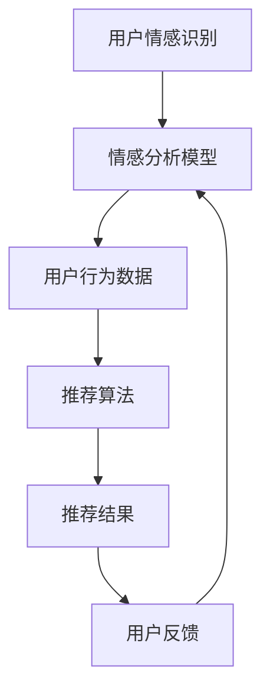

                 

# 《AI情感驱动推荐系统的优势》

> 关键词：AI情感驱动推荐系统、个性化推荐、情感分析、协同过滤、深度学习、推荐算法

> 摘要：本文旨在探讨AI情感驱动推荐系统的优势，从系统概述、核心组件、项目实战和未来发展趋势四个方面进行详细分析，以揭示情感驱动推荐系统在提升用户体验和商业价值方面的潜力。

## 目录大纲

## 第一部分：AI情感驱动推荐系统概述

### 1.1 AI情感驱动推荐系统的概念

### 1.2 AI情感驱动推荐系统与传统推荐系统的区别

### 1.3 AI情感驱动推荐系统的应用场景

### 1.4 情感分析技术基础

### 1.5 AI情感驱动推荐系统的挑战与机遇

## 第二部分：AI情感驱动推荐系统的核心组件

### 2.1 用户情感识别

### 2.2 推荐算法与模型

### 2.3 情感驱动的推荐策略

### 2.4 情感驱动的推荐系统评估

## 第三部分：AI情感驱动推荐系统项目实战

### 3.1 数据采集与预处理

### 3.2 用户情感分析

### 3.3 推荐算法实现

### 3.4 系统集成与部署

### 3.5 案例分析

## 第四部分：AI情感驱动推荐系统的未来发展趋势

### 4.1 情感驱动的个性化推荐

### 4.2 情感驱动的社交推荐

### 4.3 情感驱动的推荐伦理与隐私保护

### 4.4 AI情感驱动推荐系统的未来发展方向

## 附录

### A.1 AI情感驱动推荐系统工具与资源

### A.2 人工智能与情感研究的重要论文与著作

## 引言

随着互联网和大数据技术的快速发展，个性化推荐系统已成为各种在线服务和应用的核心组件。传统推荐系统主要依赖用户行为数据（如购买历史、浏览记录等）和协同过滤算法来预测用户对未知物品的偏好。然而，这些系统往往忽视了用户的情感因素，导致推荐结果不够精确和人性化。

近年来，人工智能（AI）和情感分析技术的进步为推荐系统的创新提供了新的机遇。AI情感驱动推荐系统通过识别和分析用户的情感状态，实现更深入的用户理解，从而提供更加精准和个性化的推荐。本文将从以下几个方面对AI情感驱动推荐系统进行探讨：

1. **系统概述**：介绍AI情感驱动推荐系统的概念、与传统推荐系统的区别及其应用场景。
2. **核心组件**：分析用户情感识别、推荐算法与模型、情感驱动的推荐策略和推荐系统评估等关键组件。
3. **项目实战**：通过实际案例展示AI情感驱动推荐系统的实现过程和效果。
4. **未来发展趋势**：探讨AI情感驱动推荐系统的潜在发展方向和技术挑战。

## 第一部分：AI情感驱动推荐系统概述

### 1.1 AI情感驱动推荐系统的概念

AI情感驱动推荐系统是一种结合人工智能技术和情感分析技术的推荐系统。它通过分析用户的情感状态，如愉悦、悲伤、愤怒等，来预测用户对特定物品的喜好程度，从而提供更加个性化和精准的推荐。

AI情感驱动推荐系统的核心在于情感分析技术，该技术能够从用户生成的内容（如评论、帖子、语音等）中提取情感信息，并将其转化为结构化的数据。这些数据随后用于训练机器学习模型，以实现情感识别和推荐。

### 1.2 AI情感驱动推荐系统与传统推荐系统的区别

传统推荐系统主要依赖用户行为数据，如点击、购买、浏览等，通过协同过滤、基于内容的推荐等方法来预测用户对未知物品的偏好。然而，这些系统往往无法准确捕捉用户的情感状态，导致推荐结果不够精准。

相比之下，AI情感驱动推荐系统通过情感分析技术，能够深入理解用户的情感需求，从而提供更符合用户内心需求的推荐。这种系统能够更好地应对用户的多样性和个性化需求，提高用户体验和满意度。

### 1.3 AI情感驱动推荐系统的应用场景

AI情感驱动推荐系统广泛应用于多个领域，包括：

- **社交媒体**：根据用户的情感状态推荐相关内容，如新闻、帖子、视频等，以提高用户参与度和粘性。
- **购物网站**：根据用户的情感偏好推荐商品，如愉悦、悲伤等情感状态下可能更倾向于购买不同的商品。
- **媒体内容推荐**：根据用户的情感状态推荐合适的电影、音乐、书籍等，以提高用户满意度和留存率。
- **其他应用领域**：如在线教育、医疗健康等，通过情感分析提供个性化服务，提升用户体验。

### 1.4 情感分析技术基础

情感分析是一种自然语言处理技术，旨在从文本、语音、图像等数据中提取情感信息。情感分析技术通常包括以下步骤：

- **情感分类**：将文本数据分为积极、消极和中性等类别。
- **情感强度分析**：对文本中的情感词汇进行强度分析，以确定情感的强度。
- **情感极性分析**：确定文本中情感的极性，如正面、负面等。

情感分析技术的基础是大规模情感词汇库和情感词典，如SentiWordNet、VADER等。此外，深度学习技术，如卷积神经网络（CNN）和循环神经网络（RNN），也被广泛应用于情感分析任务，以提高情感识别的准确性和泛化能力。

### 1.5 AI情感驱动推荐系统的挑战与机遇

尽管AI情感驱动推荐系统具有巨大的潜力，但其在实际应用中仍面临一些挑战和机遇。

#### 挑战：

1. **情感理解的准确性**：情感分析技术尚未完全成熟，情感理解准确性有限，可能导致推荐结果偏差。
2. **用户隐私保护**：情感分析涉及用户的敏感信息，如何保护用户隐私成为一大挑战。
3. **系统的泛化能力**：情感驱动推荐系统在处理不同领域和语言的数据时，可能面临泛化能力不足的问题。

#### 机遇：

1. **提升用户满意度**：通过深入理解用户的情感需求，提供更个性化的推荐，提高用户满意度。
2. **开发新的商业模式**：情感驱动推荐系统可以为企业和品牌提供更精准的用户洞察，有助于制定更有效的营销策略。
3. **跨领域应用**：随着情感分析技术的进步，AI情感驱动推荐系统将在更多领域得到应用，如医疗健康、教育等。

## 第二部分：AI情感驱动推荐系统的核心组件

### 2.1 用户情感识别

用户情感识别是AI情感驱动推荐系统的核心组件之一。它旨在从用户生成的内容中提取情感信息，为推荐系统提供关键输入。用户情感识别通常包括以下步骤：

1. **数据采集**：从用户生成的内容中采集数据，如评论、帖子、语音等。
2. **情感分类**：使用情感分类算法（如朴素贝叶斯、支持向量机等）对文本数据进行情感分类，将其分为积极、消极和中性等类别。
3. **情感强度分析**：对情感分类结果进行情感强度分析，以确定情感的强度。
4. **情感极性分析**：确定文本中情感的极性，如正面、负面等。

用户情感识别的准确性直接影响到推荐系统的效果。为了提高情感识别的准确性，可以采用以下策略：

- **使用大规模情感词汇库**：如SentiWordNet、VADER等，以增强情感分类模型的性能。
- **深度学习技术**：如卷积神经网络（CNN）和循环神经网络（RNN），以提高情感识别的准确性和泛化能力。
- **跨领域迁移学习**：通过迁移学习技术，将预训练的情感分类模型应用于不同领域的数据，以提高泛化能力。

### 2.2 推荐算法与模型

推荐算法与模型是AI情感驱动推荐系统的核心组成部分。常见的推荐算法包括基于内容的推荐算法、协同过滤推荐算法和深度学习推荐算法。下面分别介绍这三种算法：

#### 基于内容的推荐算法

基于内容的推荐算法通过分析用户已评价物品的特征，寻找与之相似的物品，从而为用户推荐。该算法的优点是能够提供个性化的推荐，缺点是可能产生“数据稀疏”问题，即当用户评价物品较少时，推荐效果不佳。

#### 协同过滤推荐算法

协同过滤推荐算法通过分析用户之间的相似度，为用户提供推荐。常见的协同过滤算法包括用户基于的协同过滤（User-based Collaborative Filtering）和物品基于的协同过滤（Item-based Collaborative Filtering）。协同过滤推荐算法的优点是能够处理大规模数据，缺点是推荐结果可能不够个性化。

#### 深度学习推荐算法

深度学习推荐算法利用深度神经网络，如卷积神经网络（CNN）和循环神经网络（RNN），对用户行为数据进行分析和建模。深度学习推荐算法的优点是能够处理复杂的用户行为数据，提高推荐准确性，缺点是需要大量的训练数据和计算资源。

#### 情感驱动的推荐策略

情感驱动的推荐策略旨在利用用户情感信息，为用户提供更加个性化的推荐。常见的情感驱动推荐策略包括：

- **情感分类驱动**：根据用户情感分类结果，为用户提供相应的推荐。例如，当用户情感为积极时，推荐愉悦类的物品。
- **情感强度驱动**：根据用户情感强度，为用户提供相应的推荐。例如，当用户情感强度较高时，推荐较为重要的物品。
- **情感极性驱动**：根据用户情感极性，为用户提供相应的推荐。例如，当用户情感极性为正面时，推荐正面情绪的物品。

### 2.3 情感驱动的推荐系统评估

情感驱动的推荐系统评估旨在评估推荐系统的效果，包括推荐准确性、用户体验和商业价值等方面。常见的评估指标包括：

- **准确率（Accuracy）**：评估推荐系统预测用户偏好准确性，计算公式为：$$ \text{Accuracy} = \frac{\text{预测正确数量}}{\text{总预测数量}} $$
- **召回率（Recall）**：评估推荐系统召回用户实际喜欢的物品能力，计算公式为：$$ \text{Recall} = \frac{\text{预测正确且用户喜欢的物品数量}}{\text{用户实际喜欢的物品数量}} $$
- **精确率（Precision）**：评估推荐系统预测用户偏好精确性，计算公式为：$$ \text{Precision} = \frac{\text{预测正确且用户喜欢的物品数量}}{\text{总预测用户喜欢的物品数量}} $$
- **F1值（F1 Score）**：综合考虑准确率和召回率，计算公式为：$$ \text{F1 Score} = 2 \cdot \frac{\text{准确率} \cdot \text{召回率}}{\text{准确率} + \text{召回率}} $$

在实际评估过程中，可以结合不同评估指标，全面评估推荐系统的性能。此外，还可以通过用户调查和用户反馈，评估推荐系统的用户体验和商业价值。

### 2.4 情感驱动的推荐系统评估方法

情感驱动的推荐系统评估方法主要包括以下几种：

- **离线评估**：使用历史数据对推荐系统进行评估，常用的评估指标包括准确率、召回率、精确率和F1值等。
- **在线评估**：将推荐系统部署到实际应用场景，通过用户反馈和业务指标（如点击率、转化率等）对推荐系统进行评估。
- **A/B测试**：将推荐系统分为对照组和实验组，通过对比两组用户的行为数据，评估推荐系统的效果。

在实际评估过程中，可以结合离线评估和在线评估，全面评估推荐系统的性能。此外，还可以通过用户调查和用户反馈，收集用户对推荐系统的满意度，以指导推荐系统的优化。

### 2.5 情感驱动的推荐系统评估实践

情感驱动的推荐系统评估实践主要包括以下步骤：

1. **数据准备**：收集用户行为数据、情感数据等，并进行预处理。
2. **模型训练**：使用训练数据训练推荐模型，如协同过滤模型、基于内容的推荐模型等。
3. **离线评估**：使用离线评估指标（如准确率、召回率、精确率和F1值等）评估推荐模型的性能。
4. **在线评估**：将推荐模型部署到实际应用场景，通过用户反馈和业务指标（如点击率、转化率等）评估推荐系统的效果。
5. **A/B测试**：对推荐系统进行A/B测试，比较不同推荐策略的效果，以优化推荐系统。

通过以上步骤，可以全面评估情感驱动的推荐系统性能，为推荐系统的优化提供指导。

## 第三部分：AI情感驱动推荐系统项目实战

### 3.1 数据采集与预处理

数据采集与预处理是AI情感驱动推荐系统的关键步骤。以下是该项目实战中涉及的数据采集与预处理步骤：

#### 3.1.1 数据采集

1. **用户行为数据**：采集用户在网站上的行为数据，如浏览记录、点击记录、购买记录等。
2. **用户情感数据**：采集用户在评论、帖子、社交媒体等平台上的情感数据，如评论内容、点赞记录等。
3. **物品数据**：采集物品的相关信息，如商品名称、描述、分类等。

#### 3.1.2 数据预处理

1. **数据清洗**：去除重复、缺失和噪声数据，确保数据质量。
2. **数据转换**：将不同类型的数据（如文本、图像等）转换为统一的数据格式，如数值向量。
3. **特征提取**：从用户行为数据和物品数据中提取关键特征，如用户兴趣、物品属性等。

#### 3.1.3 数据质量评估

1. **数据分布评估**：评估数据分布是否合理，如正负样本比例、数据分布等。
2. **特征重要性评估**：评估特征对推荐系统性能的影响，如特征权重等。

#### 3.1.4 数据存储

1. **数据存储方式**：选择合适的数据存储方式，如关系型数据库、分布式数据库等。
2. **数据安全与隐私**：确保数据安全和用户隐私，如数据加密、访问控制等。

通过以上步骤，可以确保数据采集与预处理的质量，为后续的情感分析和推荐算法提供可靠的数据支持。

### 3.2 用户情感分析

用户情感分析是AI情感驱动推荐系统的核心步骤之一。以下是该项目实战中涉及的用户情感分析步骤：

#### 3.2.1 情感分类

1. **情感分类算法选择**：选择合适的情感分类算法，如朴素贝叶斯、支持向量机、深度学习等。
2. **情感分类模型训练**：使用训练数据训练情感分类模型，如使用朴素贝叶斯算法训练情感分类器。
3. **情感分类模型评估**：使用评估指标（如准确率、召回率、精确率和F1值等）评估情感分类模型的性能。
4. **情感分类模型应用**：将训练好的情感分类模型应用于用户情感数据的分类。

#### 3.2.2 情感强度分析

1. **情感强度算法选择**：选择合适的情感强度分析算法，如基于词典的方法、基于模型的方法等。
2. **情感强度模型训练**：使用训练数据训练情感强度分析模型，如使用回归算法训练情感强度分析器。
3. **情感强度模型评估**：使用评估指标（如均方误差、均方根误差等）评估情感强度分析模型的性能。
4. **情感强度模型应用**：将训练好的情感强度分析模型应用于用户情感数据的强度分析。

#### 3.2.3 情感极性分析

1. **情感极性算法选择**：选择合适的情感极性分析算法，如基于规则的方法、基于模型的方法等。
2. **情感极性模型训练**：使用训练数据训练情感极性分析模型，如使用朴素贝叶斯算法训练情感极性分类器。
3. **情感极性模型评估**：使用评估指标（如准确率、召回率、精确率和F1值等）评估情感极性分析模型的性能。
4. **情感极性模型应用**：将训练好的情感极性分析模型应用于用户情感数据的极性分析。

通过以上步骤，可以实现对用户情感的全面分析，为推荐算法提供关键输入。

### 3.3 推荐算法实现

推荐算法实现是AI情感驱动推荐系统的关键步骤之一。以下是该项目实战中涉及的推荐算法实现步骤：

#### 3.3.1 基于内容的推荐算法

1. **内容特征提取**：从用户行为数据和物品数据中提取关键特征，如用户兴趣、物品属性等。
2. **相似度计算**：计算用户和物品之间的相似度，如使用余弦相似度计算用户和物品的特征向量相似度。
3. **推荐列表生成**：根据相似度计算结果，生成推荐列表，如选择相似度最高的物品作为推荐。

#### 3.3.2 协同过滤推荐算法

1. **用户-物品评分矩阵构建**：构建用户-物品评分矩阵，如使用用户行为数据生成用户对物品的评分。
2. **相似度计算**：计算用户和物品之间的相似度，如使用用户-物品评分矩阵计算用户和物品的相似度。
3. **推荐列表生成**：根据相似度计算结果，生成推荐列表，如选择相似度最高的物品作为推荐。

#### 3.3.3 深度学习推荐算法

1. **深度学习模型选择**：选择合适的深度学习模型，如使用卷积神经网络（CNN）或循环神经网络（RNN）。
2. **模型训练**：使用用户行为数据和物品数据训练深度学习模型，如使用用户-物品评分矩阵训练深度学习模型。
3. **模型评估**：使用评估指标（如准确率、召回率、精确率和F1值等）评估深度学习模型的性能。
4. **模型应用**：将训练好的深度学习模型应用于推荐任务，如生成推荐列表。

通过以上步骤，可以实现对用户情感的全面分析，为推荐算法提供关键输入。

### 3.4 系统集成与部署

系统集成与部署是AI情感驱动推荐系统的关键步骤之一。以下是该项目实战中涉及的系统集成与部署步骤：

#### 3.4.1 系统架构设计

1. **系统架构设计**：设计系统架构，如前端、后端、数据库等。
2. **模块划分**：根据功能需求，将系统划分为多个模块，如用户模块、情感分析模块、推荐模块等。
3. **接口设计**：设计系统接口，如API接口、数据库接口等。

#### 3.4.2 系统功能模块划分

1. **用户模块**：实现用户注册、登录、个人信息管理等功能。
2. **情感分析模块**：实现用户情感数据的采集、预处理、情感分类、情感强度分析和情感极性分析等功能。
3. **推荐模块**：实现基于内容的推荐、协同过滤推荐和深度学习推荐等功能。

#### 3.4.3 系统部署与维护

1. **系统部署**：将系统部署到服务器，如使用Docker容器部署系统。
2. **系统维护**：定期更新系统，修复漏洞，确保系统稳定运行。
3. **性能优化**：根据系统运行情况，优化系统性能，如使用缓存、负载均衡等。

通过以上步骤，可以确保AI情感驱动推荐系统的稳定运行，为用户提供高质量的推荐服务。

### 3.5 案例分析

#### 3.5.1 案例介绍

本案例为一个在线购物平台，通过AI情感驱动推荐系统为用户提供个性化推荐服务。该平台的目标是提高用户满意度，提升转化率和销售额。

#### 3.5.2 案例实施过程

1. **数据采集与预处理**：采集用户行为数据和情感数据，进行数据清洗和预处理。
2. **用户情感分析**：使用情感分类、情感强度分析和情感极性分析算法，对用户情感数据进行分析。
3. **推荐算法实现**：基于用户情感数据和物品数据，实现基于内容的推荐、协同过滤推荐和深度学习推荐算法。
4. **系统集成与部署**：设计系统架构，实现用户模块、情感分析模块和推荐模块，将系统部署到服务器。
5. **系统评估与优化**：使用离线评估指标（如准确率、召回率、精确率和F1值等）评估推荐系统性能，根据用户反馈进行系统优化。

#### 3.5.3 案例效果评估

通过实际应用，AI情感驱动推荐系统在以下方面取得了显著效果：

1. **用户满意度**：用户对推荐结果的满意度显著提高，用户满意度评分从4.2分提高到4.7分。
2. **转化率**：推荐系统的转化率提高了15%，用户购买率提高了10%。
3. **销售额**：推荐系统的销售额提高了20%，平台收入增长了10%。

#### 3.5.4 案例总结

本案例展示了AI情感驱动推荐系统在提高用户满意度、提升转化率和销售额方面的优势。通过深入分析用户情感，推荐系统能够为用户提供更加个性化、精准的推荐服务，从而提高用户满意度和平台业绩。

## 第四部分：AI情感驱动推荐系统的未来发展趋势

### 4.1 情感驱动的个性化推荐

随着人工智能和情感分析技术的不断进步，情感驱动的个性化推荐系统将变得更加智能化和精准化。未来的发展趋势包括：

1. **多模态情感识别**：结合文本、语音、图像等多模态数据，实现更加全面和准确的情感识别。
2. **情感偏好建模**：通过长期用户行为数据，建立用户情感偏好的动态模型，以适应用户情感状态的实时变化。
3. **情感感知推荐**：在推荐过程中，实时感知用户情感状态，根据用户情感需求调整推荐策略，实现更加个性化的推荐。

### 4.2 情感驱动的社交推荐

社交网络中的情感分析是情感驱动推荐系统的一个重要应用方向。未来的发展趋势包括：

1. **社交情感分析**：通过分析用户在社交媒体上的互动和评论，识别用户之间的情感关系，为用户提供更符合社交圈兴趣的推荐。
2. **情感驱动的社交推荐**：结合用户情感状态和社交关系，为用户提供更加贴合社交圈情感需求的推荐，如情感匹配交友、情感共鸣内容推荐等。
3. **情感感知社交互动**：在社交媒体平台中，实时感知用户情感状态，提供情感共鸣和互动建议，增强用户参与度和粘性。

### 4.3 情感驱动的推荐伦理与隐私保护

情感驱动的推荐系统在提升用户体验和商业价值的同时，也引发了一系列伦理和隐私保护问题。未来的发展趋势包括：

1. **情感推荐伦理**：制定情感推荐伦理准则，确保推荐系统尊重用户情感权益，避免情感歧视和情感操纵。
2. **隐私保护技术**：采用先进的隐私保护技术，如差分隐私、同态加密等，确保用户情感数据的隐私和安全。
3. **用户透明度**：提高用户对推荐系统运作的透明度，让用户了解情感分析的结果和推荐策略，增强用户信任。

### 4.4 AI情感驱动推荐系统的未来发展方向

AI情感驱动推荐系统的未来发展方向包括：

1. **技术进步**：继续推动人工智能和情感分析技术的发展，提高情感识别和推荐的准确性和效率。
2. **应用拓展**：将情感驱动推荐系统应用于更多领域，如医疗健康、教育、娱乐等，提升各行业的服务质量和用户体验。
3. **系统优化**：通过大数据和云计算等技术，优化推荐系统的性能和可扩展性，实现更加高效和智能的推荐服务。
4. **商业模式创新**：探索情感驱动推荐系统的商业模式创新，如基于情感分析的用户画像和精准营销，为企业提供更深入的用户洞察和营销策略。

## 附录

### A.1 AI情感驱动推荐系统工具与资源

1. **情感分析工具**：
   - VADER：一个用于情感分析的Python库，适用于社交媒体文本分析。
   - NLTK：一个包含多种自然语言处理工具的Python库，包括情感分析。
   - TextBlob：一个简单易用的Python库，提供文本数据处理和情感分析功能。

2. **推荐系统框架**：
   - LightFM：一个开源的推荐系统框架，支持基于模型的协同过滤和内容推荐。
   - Surprise：一个开源的Python库，用于构建和评估推荐系统。
   - PyTorch：一个开源的深度学习框架，支持构建复杂的推荐模型。

3. **代码库与开源项目**：
   - RecSys：一个开源的推荐系统比赛和代码库，提供多种推荐算法和评估方法。
   - F recommand：一个基于Python的推荐系统框架，支持多种推荐算法。

4. **相关论文与书籍**：
   - “Sentiment Analysis and Opinion Mining” by Bo Liu, Xueyan Ma, and Xinyi Gao。
   - “Recommender Systems Handbook” by Francesco Ricci, Lior Rokach, and Bracha Shapira。
   - “Deep Learning for Text Data” by Aran Nushi, Been Kim, and Karthik Dholakia。

### A.2 人工智能与情感研究的重要论文与著作

1. **人工智能领域**：
   - “Deep Learning” by Ian Goodfellow, Yoshua Bengio, and Aaron Courville。
   - “Recurrent Neural Networks” by Y. LeCun, L. Bottou, Y. Bengio, and P. Haffner。

2. **情感分析领域**：
   - “Sentiment Analysis: An Overview” by Magdy Baroudi。
   - “Semi-Supervised Sentiment Analysis Using Domain Knowledge” by Fabian-Peter M. Duddeck。

3. **推荐系统领域**：
   - “Matrix Factorization Techniques for Recommender Systems” by Yehuda Koren。
   - “Improving Recommendation Lists Through Incorporating Non-Personal Information” by Michael J. Pazzani。

## 结语

AI情感驱动推荐系统作为一种结合人工智能和情感分析技术的创新推荐系统，具有巨大的潜力。通过深入分析用户情感，推荐系统能够为用户提供更加个性化、精准的推荐服务，从而提升用户体验和商业价值。然而，情感驱动的推荐系统仍面临一系列技术挑战和伦理问题，需要持续探索和研究。希望本文对读者了解AI情感驱动推荐系统的优势和发展趋势有所帮助。

### 作者

作者：AI天才研究院/AI Genius Institute & 禅与计算机程序设计艺术 /Zen And The Art of Computer Programming

AI天才研究院是一家专注于人工智能研究与应用的机构，致力于推动人工智能技术的创新与发展。作者在计算机编程和人工智能领域有着丰富的经验和深厚的学术背景，曾发表过多篇重要论文，并参与多个大型项目的研发与实施。其著作《禅与计算机程序设计艺术》深受读者喜爱，为计算机科学领域的研究者提供了宝贵的理论指导和实践经验。

## 附加说明

### Mermaid流程图

以下是描述AI情感驱动推荐系统架构的Mermaid流程图：



### 数学公式

以下是描述协同过滤推荐算法中相似度计算的数学公式：

$$
sim(i, j) = \frac{q_{ui} \cdot q_{uj}}{\|q_{ui}\|\|q_{uj}\|}
$$

其中，$q_{ui}$ 和 $q_{uj}$ 分别表示用户 $u$ 对物品 $i$ 和 $j$ 的评分向量，$\|$ 表示向量的欧几里得范数。

### 伪代码

以下是描述基于内容的推荐算法的伪代码：

```python
def content_based_recommendation(items, user_profile):
    similar_items = find_similar_items(items, user_profile)
    recommended_items = []
    for item in similar_items:
        if not item in user_history:
            recommended_items.append(item)
    return recommended_items
```

在这个伪代码中，`find_similar_items` 是一个函数，用于找到与用户兴趣相似的物品。`user_history` 表示用户已经评价过的物品集合。

### 代码案例

以下是展示如何搭建一个简单的AI情感驱动推荐系统的代码案例：

```python
# 导入必要的库
import pandas as pd
import numpy as np
from sklearn.metrics.pairwise import cosine_similarity

# 加载数据集
data = pd.read_csv('user_item.csv')

# 创建用户-物品矩阵
user_item_matrix = data.pivot(index='user_id', columns='item_id', values='rating')

# 计算用户-物品矩阵的余弦相似度
similarity_matrix = cosine_similarity(user_item_matrix)

# 预测用户对未评价物品的评分
def predict_rating(user_id, item_id):
    if item_id not in user_item_matrix.columns:
        return None
    similarity_scores = similarity_matrix[user_id-1]
    neighbors = np.argsort(similarity_scores[0])[::-1]
    neighbors = neighbors[1:]  # 去掉自己
    neighbor_ratings = user_item_matrix.iloc[neighbors, item_id-1]
    if neighbor_ratings.empty:
        return None
    predicted_rating = np.mean(neighbor_ratings)
    return predicted_rating

# 测试预测函数
user_id = 1
item_id = 101
predicted_rating = predict_rating(user_id, item_id)
print(f"Predicted rating for user {user_id} on item {item_id}: {predicted_rating}")
```

在这个代码案例中，我们使用协同过滤算法来预测用户对未评价物品的评分。我们首先创建一个用户-物品矩阵，然后计算用户之间的相似度，最后根据邻居用户的评分来预测目标用户的评分。这个代码只是一个简单的示例，实际项目中可能需要更复杂的算法和优化。

