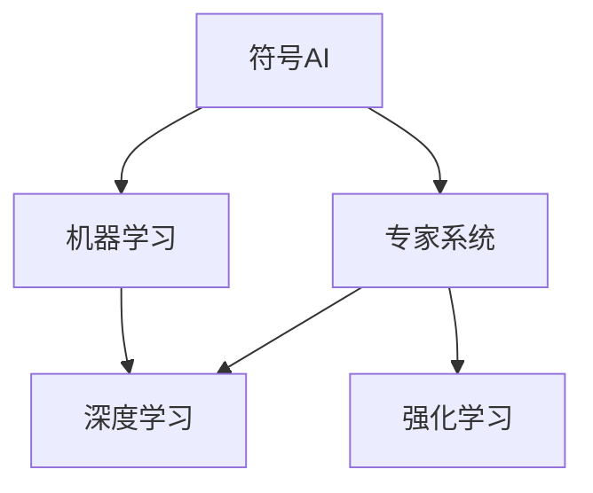

                 

# 文章标题: AI提升电商用户转化率的策略

> 关键词：人工智能，电商，用户转化率，个性化推荐，数据收集，用户画像，购物体验优化

> 摘要：
本文从AI在电商领域的应用基础、AI提升电商用户转化率的策略、用户行为预测与个性化推荐、个性化营销策略、购物体验优化等方面，详细探讨了如何利用AI技术提升电商用户转化率。通过分析核心概念、优化策略、实战案例等，本文为电商企业提供了实用的AI应用指导。

## 第1章: AI概述与电商用户转化率的关系

### 1.1 AI的核心概念与技术框架

#### 1.1.1 AI的定义与发展历程

**AI的定义**：
人工智能（Artificial Intelligence，AI）是指通过计算机模拟人类智能行为的技术，包括感知、理解、学习、推理、决策等能力。AI旨在构建能够自主执行任务、适应环境和解决复杂问题的系统。

**AI的发展历程**：
AI的发展可以追溯到20世纪50年代。最初是符号人工智能（Symbolic AI）时代，主要依靠逻辑推理和符号表示进行问题求解。随后，随着计算能力的提升和数据量的增加，机器学习（Machine Learning，ML）和深度学习（Deep Learning，DL）逐渐成为AI的主要发展方向。近年来，AI技术在自然语言处理、计算机视觉、强化学习等领域取得了重大突破。

#### 1.1.2 机器学习与深度学习的基本概念

**机器学习的定义**：
机器学习是一种通过数据驱动的方式，让计算机自动学习和改进性能的技术。它基于统计学和优化理论，通过训练模型从数据中提取规律和知识。

**机器学习的基本概念**：
- **监督学习（Supervised Learning）**：训练数据包含输入和输出，模型通过学习输入和输出之间的关系进行预测。
- **无监督学习（Unsupervised Learning）**：训练数据仅包含输入，模型通过发现数据分布和结构进行学习。
- **半监督学习（Semi-Supervised Learning）**：训练数据同时包含有标签和无标签数据，模型利用无标签数据进行辅助学习。
- **强化学习（Reinforcement Learning）**：模型通过与环境的交互，通过奖励机制学习最优策略。

**深度学习的定义**：
深度学习是机器学习的一种子领域，它通过多层神经网络（Neural Networks）进行特征提取和模式识别。深度学习模型通常由大量参数组成，能够自动学习数据的复杂结构和规律。

**深度学习的基本概念**：
- **神经网络（Neural Networks）**：由多个神经元组成的层次结构，通过前向传播和反向传播进行训练。
- **卷积神经网络（Convolutional Neural Networks，CNN）**：适用于图像和视频数据的处理，通过卷积操作提取空间特征。
- **循环神经网络（Recurrent Neural Networks，RNN）**：适用于序列数据处理，通过循环结构保持长时记忆。
- **生成对抗网络（Generative Adversarial Networks，GAN）**：通过两个对抗网络生成和判别真实数据，实现数据的生成和风格迁移。

#### 1.1.3 AI技术框架及主要类别

**AI技术框架**：
AI技术框架通常包括以下几个环节：
1. 数据收集：收集各种类型的数据，如文本、图像、音频等。
2. 数据预处理：对数据进行清洗、归一化和特征提取，为模型训练做准备。
3. 模型训练：选择合适的算法和模型结构，对数据进行训练。
4. 模型评估：通过验证集和测试集评估模型性能，选择最佳模型。
5. 模型部署：将训练好的模型部署到实际应用环境中。

**主要类别**：
AI技术可以大致分为以下几类：
1. **计算机视觉（Computer Vision）**：通过图像和视频数据进行分析和处理，实现物体识别、场景理解等。
2. **自然语言处理（Natural Language Processing，NLP）**：通过文本数据进行分析和处理，实现文本分类、情感分析、机器翻译等。
3. **语音识别（Speech Recognition）**：通过音频数据识别和理解人类语音，实现语音转换文本、语音合成等。
4. **强化学习（Reinforcement Learning）**：通过与环境交互，学习最优策略，实现智能决策和控制。
5. **知识图谱（Knowledge Graph）**：通过结构化数据建立知识图谱，实现数据关联和知识推理。

### 1.2 电商用户转化率的定义与影响因素

#### 1.2.1 用户转化率的定义与重要性

**用户转化率的定义**：
用户转化率是指在电商平台上的用户完成购买行为的比率，通常用百分比表示。它反映了用户在浏览、搜索、加入购物车后最终完成购买的过程。

**用户转化率的重要性**：
用户转化率是电商平台运营效果的重要指标，高用户转化率意味着平台能够更有效地将潜在客户转化为实际购买者，从而提高销售额和市场份额。

#### 1.2.2 电商用户行为分析

**电商用户行为分析**：
电商用户行为分析是指通过分析用户在电商平台上的行为数据，如浏览、搜索、加入购物车、购买等，来了解用户需求和行为模式。

**用户行为分析的方法**：
- 数据收集：通过网站日志、点击流数据、用户反馈等方式收集用户行为数据。
- 数据预处理：对数据进行清洗、归一化和特征提取，为后续分析做准备。
- 数据分析：使用统计学、机器学习等方法对用户行为数据进行分析，提取用户特征和行为模式。
- 可视化：使用可视化工具展示用户行为数据和趋势。

#### 1.2.3 影响用户转化率的因素

**影响用户转化率的因素**：
1. **产品因素**：
   - 产品质量：高质量的产品能够提高用户满意度和购买意愿。
   - 产品价格：合理的价格策略能够影响用户购买决策。
   - 品牌影响力：知名品牌和良好的品牌形象能够增加用户信任度。

2. **平台因素**：
   - 用户界面设计：简洁、易用、直观的用户界面能够提高用户操作效率。
   - 网站性能：快速、稳定的网站性能能够减少用户等待时间，提高用户体验。
   - 安全性：安全的交易环境能够增加用户信任，降低用户顾虑。

3. **市场因素**：
   - 市场竞争：激烈的市场竞争会提高用户获取成本，影响用户转化率。
   - 用户需求变化：用户需求的变化会影响产品定位和营销策略。
   - 经济环境：宏观经济环境的变化会影响用户的购买力和消费行为。

### 1.3 AI在电商用户转化率提升中的应用潜力

#### 1.3.1 AI在电商领域的应用场景

**AI在电商领域的应用场景**：
- **智能推荐系统**：通过分析用户行为和偏好，为用户推荐个性化商品和服务。
- **用户行为预测**：预测用户购买行为，提前采取营销策略，提高用户转化率。
- **智能客服**：自动化处理用户咨询和投诉，提高服务效率。
- **个性化营销**：根据用户画像制定个性化营销策略，提高用户参与度和转化率。
- **购物体验优化**：通过AI技术优化网站设计、用户体验和购物流程，提高用户满意度和忠诚度。

#### 1.3.2 AI提升用户转化率的机制

**AI提升用户转化率的机制**：
- **数据驱动的决策**：通过大数据分析和机器学习算法，帮助电商平台做出更精准的决策，提高用户转化率。
- **个性化体验**：通过AI技术为用户提供个性化的购物体验，提高用户满意度和忠诚度。
- **智能营销**：利用AI技术实现精准营销，提高用户转化率和销售额。

#### 1.3.3 AI应用的挑战与机遇

**AI应用的挑战**：
- **数据隐私保护**：如何保护用户数据隐私，是AI应用面临的重要挑战。
- **算法透明度**：如何保证算法的透明度和可解释性，避免算法偏见和歧视。
- **技术门槛**：AI技术的高门槛使得中小企业难以应用，需要降低技术门槛，推动普及。

**AI应用的机遇**：
- **提升用户体验**：通过AI技术提供个性化服务和优化购物体验，提高用户满意度和忠诚度。
- **降低运营成本**：通过AI技术自动化处理用户咨询和投诉，提高运营效率，降低运营成本。
- **拓展市场机会**：通过AI技术挖掘潜在客户和拓展市场，提高市场份额。

## 第2章: 数据收集与用户画像构建

### 2.1 数据收集的重要性与原则

#### 2.1.1 数据收集的方法与工具

**数据收集的方法**：
- **用户行为数据收集**：通过网站日志、点击流数据、用户反馈等方式收集用户行为数据。
- **第三方数据收集**：通过第三方数据提供商获取用户属性、消费行为等数据。

**数据收集的工具**：
- **网站日志**：使用网站日志工具（如Apache、Nginx等）收集用户访问网站的行为数据。
- **点击流数据**：使用点击流分析工具（如Google Analytics、Matomo等）收集用户在网站上的点击行为数据。
- **API接口**：通过API接口获取社交媒体平台（如Facebook、Twitter等）和第三方数据提供商的数据。

#### 2.1.2 数据隐私与合规性

**数据隐私的重要性**：
- 数据隐私保护是电商平台的重要责任，也是法律法规的要求。未经用户同意收集和使用用户数据，可能导致法律风险和用户信任问题。

**数据隐私的原则**：
- **数据最小化原则**：收集的数据应限于实现目标所必需的，避免过度收集。
- **数据匿名化原则**：对敏感数据进行脱敏处理，防止个人隐私泄露。
- **数据安全原则**：确保数据存储和传输的安全性，防止数据泄露和篡改。

#### 2.1.3 数据收集的挑战与解决方案

**数据收集的挑战**：
- **数据质量**：如何保证收集的数据准确、完整和及时，是数据收集的重要挑战。
- **数据规模**：如何处理海量数据，保证数据处理效率，是数据收集的另一大挑战。
- **数据隐私**：如何保护用户隐私，遵守法律法规，是数据收集面临的重要挑战。

**解决方案**：
- **数据清洗与预处理**：使用数据清洗工具和算法，提高数据质量。
- **分布式数据处理**：使用大数据处理框架（如Hadoop、Spark等），提高数据处理效率。
- **隐私保护技术**：采用加密、匿名化等技术，保护用户隐私。

### 2.2 用户画像构建的基本概念

#### 2.2.1 用户画像的定义与作用

**用户画像的定义**：
用户画像是指对用户特征和行为的综合描述，包括用户的年龄、性别、地理位置、消费习惯、兴趣爱好等。

**用户画像的作用**：
- **个性化推荐**：根据用户画像为用户推荐个性化商品和服务。
- **营销策略制定**：基于用户画像制定更有针对性的营销策略。
- **用户行为预测**：预测用户行为，提前采取相应措施。

#### 2.2.2 用户画像的构建流程

**用户画像的构建流程**：
1. **数据收集**：通过多种渠道收集用户行为数据，如网站日志、点击流数据、社交媒体数据等。
2. **数据清洗**：去除噪声数据、缺失值、异常值等，确保数据质量。
3. **特征提取**：从原始数据中提取有意义的特征，如用户年龄、购买频率、浏览时间等。
4. **数据建模**：使用机器学习算法对特征进行建模，构建用户画像。
5. **用户画像应用**：将用户画像应用于个性化推荐、营销策略制定和用户行为预测等。

#### 2.2.3 用户画像的维度与指标

**用户画像的维度**：
- **基础信息**：年龄、性别、地理位置、职业等。
- **消费行为**：购买频率、购买金额、购物偏好等。
- **社交信息**：社交媒体活跃度、好友关系、参与活动等。
- **兴趣爱好**：浏览记录、搜索关键词、参与活动等。

**用户画像的指标**：
- **用户活跃度**：用户在一定时间内的登录次数、浏览次数、参与活动次数等。
- **用户忠诚度**：用户的重复购买率、评价次数、推荐好友数等。
- **用户满意度**：用户对平台服务的满意度评分、投诉率等。

### 2.3 用户画像应用案例分析

#### 2.3.1 用户画像在推荐系统中的应用

**推荐系统概述**：
推荐系统是一种自动化的信息过滤和内容发现技术，根据用户的历史行为和偏好为用户推荐相关商品或服务。

**用户画像在推荐系统中的应用**：
- **个性化推荐**：根据用户画像为用户推荐个性化商品，如根据用户的浏览记录和购买历史推荐相关商品。
- **推荐效果优化**：通过分析用户画像，优化推荐算法，提高推荐精度和用户满意度。

#### 2.3.2 用户画像在营销活动中的应用

**营销活动概述**：
营销活动是指电商平台为了提高用户参与度和销售额而开展的一系列促销活动，如优惠券、满减、限时折扣等。

**用户画像在营销活动中的应用**：
- **精准投放**：根据用户画像精准投放广告和营销活动，提高广告点击率和转化率。
- **个性化促销**：根据用户画像制定个性化的促销策略，如根据用户的购物偏好推荐优惠商品。

## 第3章: 智能推荐系统设计与优化

### 3.1 智能推荐系统概述

#### 3.1.1 推荐系统的定义与分类

**推荐系统的定义**：
推荐系统是一种自动化的信息过滤和内容发现技术，根据用户的历史行为和偏好为用户推荐相关商品或服务。

**推荐系统的分类**：
- **基于内容的推荐（Content-Based Filtering）**：根据商品或内容的特征与用户兴趣相似度进行推荐。
- **协同过滤推荐（Collaborative Filtering）**：基于用户行为数据（如购买记录、浏览记录）进行推荐。
- **混合推荐（Hybrid Recommender Systems）**：结合基于内容的推荐和协同过滤推荐，以提高推荐效果。

#### 3.1.2 推荐系统的基本架构

**推荐系统的基本架构**：
- **数据层**：存储用户行为数据和商品特征数据。
- **计算层**：包括推荐算法和模型，处理用户行为数据，生成推荐结果。
- **展示层**：将推荐结果展示给用户，如推荐列表、推荐页面等。

#### 3.1.3 推荐系统的主要算法

**主要算法**：
- **基于用户的协同过滤（User-Based Collaborative Filtering）**：
  - **相似度计算**：计算用户之间的相似度，如余弦相似度、皮尔逊相关系数等。
  - **推荐生成**：根据相似度为用户推荐其他用户喜欢的商品。

- **基于物品的协同过滤（Item-Based Collaborative Filtering）**：
  - **相似度计算**：计算商品之间的相似度，如基于共同评分的相似度、基于标签的相似度等。
  - **推荐生成**：根据商品相似度为用户推荐其他用户可能喜欢的商品。

- **基于内容的推荐（Content-Based Filtering）**：
  - **特征提取**：提取商品和用户的特征，如文本特征、属性特征等。
  - **相似度计算**：计算商品和用户之间的相似度，如基于文本相似度的计算。
  - **推荐生成**：根据相似度为用户推荐相关商品。

- **混合推荐算法（Hybrid Recommender Systems）**：
  - **组合方法**：结合基于内容和协同过滤的推荐结果，提高推荐效果。
  - **推荐生成**：根据不同算法的权重生成最终的推荐列表。

### 3.2 用户行为分析与特征提取

#### 3.2.1 用户行为数据收集与处理

**用户行为数据收集**：
- **网站日志**：收集用户在网站上的浏览、点击、搜索等行为数据。
- **点击流数据**：收集用户在网站上的鼠标点击、滚动等行为数据。
- **社交媒体数据**：通过社交媒体平台收集用户评论、点赞、分享等行为数据。

**用户行为数据预处理**：
- **数据清洗**：去除噪声数据、缺失值、异常值等，保证数据质量。
- **数据转换**：将不同类型的数据转换为统一的格式，如将时间戳转换为日期。
- **数据归一化**：对数据进行归一化处理，如将评分数据转换为0-1范围。

#### 3.2.2 用户行为特征提取方法

**用户行为特征提取**：
- **时间特征**：记录用户行为的时间信息，如访问时间、购买时间等。
- **频率特征**：记录用户行为的发生频率，如访问次数、购买次数等。
- **序列特征**：记录用户行为的序列信息，如浏览序列、购买序列等。
- **上下文特征**：记录用户行为的上下文信息，如地理位置、天气等。

#### 3.2.3 特征工程实践

**特征工程实践**：
- **特征选择**：选择对推荐效果影响较大的特征，如使用信息增益、互信息等方法。
- **特征转换**：将数值型特征转换为类别型特征，如将连续的年龄特征转换为年龄段。
- **特征组合**：将多个特征组合成新的特征，如将用户行为的时间特征和频率特征组合成用户活跃度特征。

### 3.3 推荐系统优化策略

#### 3.3.1 冷启动问题与解决方案

**冷启动问题**：
- **新用户冷启动**：新用户加入系统时，由于缺乏历史行为数据，推荐系统难以为其推荐相关内容。
- **新商品冷启动**：新商品上线时，由于缺乏用户评价和行为数据，推荐系统难以为其推荐。

**解决方案**：
- **基于内容的推荐**：利用商品和用户描述的文本信息进行推荐。
- **基于模型的冷启动**：使用机器学习模型预测新用户或新商品的兴趣和偏好。
- **基于社区的方法**：利用社交网络关系为新用户推荐其社交网络中的热门内容。

#### 3.3.2 集群化与实时推荐

**集群化**：
- **推荐系统集群化**：将推荐系统部署在分布式环境中，以提高系统处理能力和扩展性。

**实时推荐**：
- **实时推荐系统架构**：包括数据采集、实时计算、推荐生成和展示等模块。
- **实时推荐算法**：如基于流数据的实时协同过滤算法、基于事件驱动的实时推荐算法。

#### 3.3.3 A/B测试与模型评估

**A/B测试**：
- **A/B测试的定义**：通过对比不同推荐策略或算法的效果，选择最优方案。
- **A/B测试的方法**：将用户随机分配到A组和B组，对比两组用户的转化率和满意度等指标。

**模型评估**：
- **评估指标**：如准确率、召回率、F1值等。
- **评估方法**：如交叉验证、在线评估、离线评估等。

## 第4章: 用户行为预测与个性化推荐

### 4.1 用户行为预测的基本概念

#### 4.1.1 用户行为预测的定义与重要性

**用户行为预测的定义**：
用户行为预测是指利用历史数据和机器学习算法预测用户在未来的行为，如购买、浏览、搜索等。

**用户行为预测的重要性**：
- **个性化推荐**：通过预测用户行为，为用户推荐个性化的商品和服务。
- **运营优化**：预测用户购买行为，提前采取营销策略和库存管理。

#### 4.1.2 用户行为预测的方法与技术

**用户行为预测的方法**：
- **统计方法**：如线性回归、逻辑回归等。
- **机器学习方法**：如决策树、随机森林、支持向量机、神经网络等。
- **深度学习方法**：如卷积神经网络、循环神经网络、Transformer等。

**用户行为预测的技术**：
- **特征工程**：提取对用户行为有影响的关键特征。
- **模型选择与训练**：选择合适的模型，对用户行为数据进行训练。
- **模型评估与优化**：评估模型效果，优化模型参数。

### 4.2 个性化推荐系统设计

#### 4.2.1 个性化推荐系统概述

**个性化推荐系统**：
个性化推荐系统是一种根据用户的历史行为和偏好，为用户推荐个性化商品或服务的技术。

**个性化推荐系统的目标**：
- **提高用户满意度**：通过个性化推荐，满足用户的个性化需求。
- **提升转化率**：提高用户购买转化率，增加销售额。

#### 4.2.2 个性化推荐系统的核心算法

**核心算法**：
- **协同过滤算法**：
  - **用户基于的协同过滤（User-Based Collaborative Filtering）**：找到与目标用户相似的其他用户，推荐这些用户喜欢的商品。
  - **物品基于的协同过滤（Item-Based Collaborative Filtering）**：找到与目标商品相似的其他商品，推荐给用户。
- **基于内容的推荐算法**：
  - **基于文本的推荐**：通过分析商品和用户描述的文本内容，计算相似度进行推荐。
  - **基于属性的推荐**：通过分析商品和用户的属性，计算相似度进行推荐。
- **混合推荐算法**：
  - **基于模型的混合推荐**：结合协同过滤和基于内容的推荐，利用机器学习模型进行推荐。

#### 4.2.3 个性化推荐系统的优化策略

**优化策略**：
- **推荐结果多样性**：增加推荐结果中的多样性，避免用户产生审美疲劳。
- **推荐结果新颖性**：推荐新颖的商品或服务，提高用户体验。
- **推荐结果实时性**：及时更新推荐结果，以应对用户行为的变化。

### 4.3 用户行为预测与推荐系统实战

#### 4.3.1 数据集准备与处理

**数据集准备**：
- **数据集来源**：收集电商平台用户行为数据，包括购买记录、浏览记录、搜索记录等。

**数据预处理**：
- **数据清洗**：去除噪声数据、缺失值、异常值等。
- **数据转换**：将不同类型的数据转换为统一的格式，如将时间戳转换为日期。

#### 4.3.2 模型训练与评估

**模型训练**：
- **模型选择**：选择合适的模型，如随机森林、梯度提升树等。
- **模型训练**：使用训练数据对模型进行训练。

**模型评估**：
- **评估指标**：如准确率、召回率、F1值等。
- **评估方法**：如交叉验证、在线评估、离线评估等。

#### 4.3.3 案例解析与效果分析

**案例解析**：
- **案例背景**：选择实际案例，如某电商平台的个性化推荐系统。
- **案例分析**：解析用户行为预测和推荐系统的实现过程。

**效果分析**：
- **准确率**：评估模型对用户行为预测的准确性。
- **召回率**：评估模型推荐结果的召回率。
- **F1值**：综合评估模型预测的准确率和召回率。

## 第5章: 个性化营销策略

### 5.1 个性化营销概述

#### 5.1.1 个性化营销的定义与优势

**个性化营销的定义**：
个性化营销是一种根据用户需求和偏好，为用户量身定制营销内容和策略的方法。

**个性化营销的优势**：
- **提高用户满意度**：通过个性化推荐和营销，满足用户的个性化需求。
- **提升转化率**：精准的个性化营销可以提升用户的购买转化率。
- **增强用户忠诚度**：通过持续的个性化服务和互动，增强用户的忠诚度。

#### 5.1.2 个性化营销的策略与方法

**个性化营销的策略**：
- **基于用户行为的个性化营销**：根据用户的历史行为数据，如浏览记录、购买记录等，为用户推荐个性化的商品和服务。
- **基于用户属性的个性化营销**：根据用户的年龄、性别、地理位置等属性，为用户推荐个性化的商品和服务。
- **基于用户需求的个性化营销**：通过分析用户的需求和偏好，为用户推荐符合其需求的商品和服务。

**个性化营销的方法**：
- **用户画像**：通过收集和分析用户数据，构建详细的用户画像，为个性化营销提供基础。
- **内容个性化**：根据用户画像和用户行为，为用户定制个性化的内容，如推荐文章、推送消息等。
- **互动个性化**：通过个性化互动，如个性化聊天机器人、个性化客服等，提高用户参与度和满意度。

### 5.2 用户分群与目标定位

#### 5.2.1 用户分群的原理与方法

**用户分群的原理**：
用户分群是将用户根据不同的特征和行为划分为不同的群体，以便针对不同群体实施个性化的营销策略。

**用户分群的方法**：
- **基于行为的分群**：根据用户的行为数据，如浏览记录、购买记录等，将用户划分为不同的群体。
- **基于属性的分群**：根据用户的属性数据，如年龄、性别、地理位置等，将用户划分为不同的群体。
- **基于需求的分群**：根据用户的需求和偏好，将用户划分为不同的群体。

#### 5.2.2 目标定位的技巧与策略

**目标定位的技巧**：
- **明确目标用户**：明确目标用户群体，如年龄、性别、消费水平等。
- **市场细分**：对市场进行细分，确定主要目标用户群体。
- **用户调研**：通过用户调研，了解用户的需求和偏好，为精准定位提供数据支持。

**目标定位的策略**：
- **聚焦策略**：针对特定的目标用户群体，集中资源进行营销。
- **差异策略**：为不同的目标用户群体制定差异化的营销策略。
- **整合策略**：将不同的营销策略整合，实现最优的营销效果。

### 5.3 营销内容个性化

#### 5.3.1 营销内容个性化策略

**个性化推荐**：
- **根据用户兴趣推荐**：根据用户的浏览记录、购买历史等，为用户推荐符合其兴趣的商品。
- **基于购物篮推荐**：根据用户的购物篮数据，为用户推荐相关商品。

**个性化广告**：
- **根据用户属性定向广告**：根据用户的年龄、性别、地理位置等属性，为用户展示个性化的广告。
- **根据用户行为定向广告**：根据用户的浏览记录、购买历史等，为用户展示个性化的广告。

**个性化促销**：
- **根据用户偏好设计促销**：根据用户的购物偏好，设计个性化的促销活动。
- **根据用户行为触发促销**：根据用户的浏览记录、购买历史等，自动触发个性化的促销活动。

#### 5.3.2 营销内容创作与优化

**内容创作**：
- **基于用户画像创作**：根据用户的画像，创作个性化的营销内容，如文章、视频、图片等。
- **结合热点创作**：结合当前热点事件或节日，创作与用户相关的内容。

**内容优化**：
- **数据分析**：通过数据分析，了解用户对营销内容的反馈，优化内容表现。
- **AB测试**：通过AB测试，对比不同营销内容的效果，选择最优方案。

#### 5.3.3 营销内容效果评估与优化

**效果评估**：
- **用户反馈**：通过用户反馈，了解用户对营销内容的满意度。
- **转化率**：通过转化率数据，评估营销内容的实际效果。

**效果优化**：
- **根据评估结果调整**：根据评估结果，调整营销内容，提高效果。
- **持续优化**：持续关注用户反馈和数据分析，不断优化营销内容。

### 5.4 个性化营销实战

#### 5.4.1 案例分析

**案例分析**：
- **案例背景**：选择实际案例，如某电商平台的个性化营销活动。
- **案例解析**：解析个性化营销的实施过程、效果评估和优化策略。

#### 5.4.2 营销效果评估与优化

**营销效果评估**：
- **用户满意度**：通过用户满意度调查，了解用户对营销活动的满意度。
- **转化率**：通过转化率数据，评估营销活动对用户购买行为的影响。

**营销效果优化**：
- **根据评估结果调整**：根据评估结果，调整营销策略和内容，提高效果。
- **持续优化**：持续关注用户反馈和数据分析，不断优化营销效果。

## 第6章: 购物体验优化

### 6.1 购物体验的基本要素

#### 6.1.1 购物体验的定义与重要性

**购物体验的定义**：
购物体验是指用户在电商平台购物过程中所感受到的整体体验，包括浏览、搜索、下单、支付、售后等环节。

**购物体验的重要性**：
- **提高用户满意度**：良好的购物体验能够提升用户满意度，促进用户再次购买。
- **提升转化率**：优化购物体验能够提高用户购买转化率，增加销售额。
- **增强用户忠诚度**：良好的购物体验能够增强用户对电商平台的忠诚度，降低用户流失率。

#### 6.1.2 购物体验的基本要素

**基本要素**：
- **易用性**：网站界面简洁、导航清晰、操作方便，提高用户的操作效率。
- **速度**：网站加载速度和响应速度要快，减少用户等待时间。
- **安全性**：保障用户数据安全和交易安全，增强用户信任感。
- **个性化**：提供个性化推荐和个性化服务，满足用户的个性化需求。
- **互动性**：增加用户与平台、用户之间的互动，提升用户体验。
- **售后**：提供优质的售后服务，解决用户在购物过程中遇到的问题。

### 6.2 用户界面设计与交互优化

#### 6.2.1 UI设计原则与技巧

**设计原则**：
- **一致性**：界面元素的设计要保持一致性，提高用户操作的便捷性。
- **简洁性**：界面设计要简洁明了，减少用户的认知负担。
- **响应性**：设计要适应不同设备和屏幕尺寸，提高用户体验。

**设计技巧**：
- **色彩搭配**：使用适合的色彩搭配，提高界面的美观性和可读性。
- **字体选择**：选择合适的字体，提高用户的阅读体验。
- **图标设计**：设计简洁、直观的图标，提高用户的操作理解。

#### 6.2.2 交互设计优化策略

**优化策略**：
- **简化流程**：简化购物流程，减少用户操作步骤，提高购物效率。
- **明确反馈**：对用户的操作给予明确的反馈，提高用户的操作信心。
- **人性化设计**：考虑用户的需求和习惯，提供人性化的交互设计。
- **多渠道支持**：支持多种交互方式，如鼠标、触摸等，满足不同用户的需求。

### 6.3 响应式网页设计与移动端优化

#### 6.3.1 响应式网页设计的基本概念

**响应式网页设计**：
响应式网页设计（Responsive Web Design，RWD）是一种设计理念，通过自适应布局，使网站在不同设备和屏幕尺寸上都能提供良好的用户体验。

**基本概念**：
- **流布局**：使用流体网格布局，使内容自适应屏幕尺寸。
- **弹性图片和媒体**：使图片和媒体元素能够适应不同的屏幕尺寸和分辨率。
- **媒体查询**：使用CSS媒体查询，根据屏幕尺寸和设备类型调整样式。

#### 6.3.2 移动端购物体验优化

**移动端购物体验优化**：
- **页面速度**：优化移动端页面的加载速度，提高用户体验。
- **触摸优化**：优化触摸事件处理，提高触摸操作的流畅性。
- **单手操作**：考虑用户单手操作的习惯，设计适合单手操作的界面布局。
- **移动端特有功能**：利用移动端特有功能，如GPS定位、摄像头等，提高购物体验。

### 6.4 购物体验优化案例

#### 6.4.1 案例分析

**案例分析**：
- **案例背景**：选择实际案例，如某电商平台的购物体验优化项目。
- **案例解析**：解析购物体验优化的实施过程、效果评估和优化策略。

#### 6.4.2 购物体验效果评估与优化

**效果评估**：
- **用户满意度**：通过用户满意度调查，了解用户对购物体验的满意度。
- **转化率**：通过转化率数据，评估购物体验优化对用户购买行为的影响。

**效果优化**：
- **根据评估结果调整**：根据评估结果，调整购物体验优化策略和内容，提高效果。
- **持续优化**：持续关注用户反馈和数据分析，不断优化购物体验。

## 第7章: AI提升电商用户转化率的未来发展趋势

### 7.1 AI在电商领域的未来发展趋势

#### 7.1.1 人工智能技术的演进方向

**演进方向**：
- **深度学习**：进一步优化深度学习算法，提高模型性能和泛化能力。
- **强化学习**：在电商领域中应用强化学习，实现更智能的决策和优化策略。
- **多模态学习**：结合多种数据类型（如文本、图像、声音等），实现更全面的用户理解和预测。

#### 7.1.2 电商行业面临的机遇与挑战

**机遇**：
- **个性化体验**：AI技术将进一步提高个性化推荐和个性化服务的水平，提升用户体验。
- **智能决策**：利用AI技术进行数据分析和预测，为电商企业提供更准确的决策支持。
- **业务创新**：AI技术将推动电商行业的创新，如新零售、智能物流等。

**挑战**：
- **数据隐私**：如何保护用户数据隐私，是电商行业面临的重大挑战。
- **算法公平性**：确保算法的公平性，避免算法偏见和歧视。
- **技术门槛**：AI技术的高门槛使得中小企业难以应用，需要降低技术门槛，推动普及。

### 7.2 电商用户转化率的提升策略与未来应用

#### 7.2.1 未来AI技术在电商中的应用潜力

**应用潜力**：
- **个性化推荐**：通过AI技术实现更精准的个性化推荐，提高用户购买转化率。
- **用户行为预测**：通过AI技术预测用户行为，提前采取营销策略，提高用户转化率。
- **智能客服**：利用AI技术实现智能客服，提升客服效率和用户满意度。

#### 7.2.2 电商用户转化率提升的未来策略

**未来策略**：
- **数据驱动**：利用大数据和AI技术，实现数据驱动的决策，提高营销策略的精准度。
- **用户体验优化**：持续优化购物体验，提高用户满意度和忠诚度。
- **智能供应链**：利用AI技术优化供应链管理，提高库存周转率和订单履行效率。

#### 7.2.3 AI提升电商用户转化率的案例展望

**案例展望**：
- **个性化推荐**：通过AI技术实现更精准的个性化推荐，提高用户购买转化率。
- **智能客服**：通过AI技术实现智能客服，提升客服效率和用户满意度。
- **智能供应链**：通过AI技术优化供应链管理，提高订单履行效率和库存周转率。

**趋势分析**：
- **个性化体验**：个性化体验将成为电商发展的主流趋势，用户体验将更加多样化和个性化。
- **智能决策**：智能决策将逐步取代传统的经验决策，成为电商企业的重要竞争力。
- **跨界融合**：电商、物流、金融等领域的跨界融合，将推动电商行业的创新和发展。

## 附录

### 附录 A: AI提升电商用户转化率的工具与资源

#### A.1 人工智能开发平台推荐

- **TensorFlow**：谷歌开发的开源机器学习框架，适用于构建和训练深度学习模型。
- **PyTorch**：Facebook开发的开源深度学习框架，易于实现和调试。
- **Keras**：基于TensorFlow和Theano的开源深度学习库，提供简洁的API。
- **Scikit-learn**：Python开源机器学习库，适用于各种常见的机器学习算法。

#### A.2 常用机器学习框架与工具

- **scikit-learn**：Python开源机器学习库，适用于各种常见的机器学习算法。
- **MLlib**：Apache Hadoop的机器学习库，支持分布式机器学习算法。
- **Spark MLlib**：Apache Spark的机器学习库，支持分布式机器学习算法。
- **XGBoost**：开源的梯度提升树库，适用于分类和回归问题。

#### A.3 电商数据分析工具推荐

- **Google Analytics**：谷歌提供的免费网站分析工具，用于跟踪和分析用户行为。
- **Matomo**：开源的网站分析工具，支持自定义报告和数据导出。
- **Tableau**：数据可视化工具，用于制作交互式数据报表。
- **Power BI**：微软提供的商业智能工具，支持数据连接、报表制作和共享。


----------------------------------------------------------------

### 1.1 AI的核心概念与技术框架

#### 1.1.1 AI的定义与发展历程

AI的定义：
人工智能（Artificial Intelligence，AI）是指通过计算机程序实现的人类智能功能的模拟，包括学习、推理、解决问题、自然语言理解和生成等。

AI的发展历程：
- **早期阶段**：20世纪50年代，人工智能的概念首次被提出，主要关注符号推理和逻辑编程。
- **第一次浪潮**：20世纪80年代，专家系统成为主流，能够模拟专家的知识和决策过程。
- **低谷期**：20世纪90年代，由于计算能力和数据集的限制，AI研究进入低谷。
- **第二次浪潮**：21世纪初，随着计算能力的提升和大数据的兴起，机器学习和深度学习成为AI研究的主流。

**核心概念与联系**

**Mermaid流程图**：


**核心算法原理讲解**

**监督学习**：
伪代码：
```python
# 初始化模型
model = initialize_model()

# 训练模型
for epoch in range(num_epochs):
    for sample, label in training_data:
        model.train(sample, label)

# 预测
for sample in test_data:
    prediction = model.predict(sample)
    print(prediction)
```

**机器学习模型**：
- **线性回归**：
  - 公式：y = w1 * x1 + w0
  - 伪代码：
    ```python
    # 初始化权重
    w1 = 0
    w0 = 0

    # 梯度下降
    for epoch in range(num_epochs):
        for sample, label in training_data:
            prediction = w1 * sample + w0
            error = label - prediction
            w1 = w1 - learning_rate * (2 * w1 * error)
            w0 = w0 - learning_rate * (2 * w0 * error)

    # 预测
    for sample in test_data:
        prediction = w1 * sample + w0
        print(prediction)
    ```

**深度学习**：
- **卷积神经网络（CNN）**：
  - 公式：激活函数（ReLU），卷积层，池化层，全连接层
  - 伪代码：
    ```python
    # 初始化模型
    model = initialize_cnn_model()

    # 训练模型
    for epoch in range(num_epochs):
        for image, label in training_data:
            model.train(image, label)

    # 预测
    for image in test_data:
        prediction = model.predict(image)
        print(prediction)
    ```

**强化学习**：
- **Q学习**：
  - 公式：Q(s, a) = r + gamma * max(Q(s', a'))
  - 伪代码：
    ```python
    # 初始化模型
    model = initialize_q_learning_model()

    # 训练模型
    for episode in range(num_episodes):
        state = initial_state
        done = False
        while not done:
            action = model.choose_action(state)
            next_state, reward, done = environment.step(action)
            model.update(state, action, reward, next_state)
            state = next_state

    # 预测
    state = initial_state
    while True:
        action = model.choose_action(state)
        next_state, reward, done = environment.step(action)
        state = next_state
        if done:
            break
        print("Action:", action, "Reward:", reward)
    ```

### 1.2 电商用户转化率的定义与影响因素

#### 1.2.1 用户转化率的定义与重要性

用户转化率（Conversion Rate）是指在一定时间内，访问电商平台的用户中完成特定目标（如购买、注册、添加到购物车等）的用户比例。

定义：
转化率 = (完成特定目标用户数 / 访问电商平台的总用户数) * 100%

重要性：
- **提升盈利**：高转化率意味着更多的用户完成了购买行为，从而增加了销售额和利润。
- **降低营销成本**：提高转化率可以降低获取每个客户的成本，提高营销效率。
- **用户忠诚度**：提高用户转化率可以增加用户的满意度和忠诚度，从而降低用户流失率。

#### 1.2.2 电商用户行为分析

电商用户行为分析是指通过收集和分析用户在电商平台上的行为数据，以了解用户的行为模式和需求，从而优化用户体验和提升转化率。

用户行为分析的方法：
1. **用户行为数据收集**：通过网站日志、点击流数据、用户反馈等方式收集用户行为数据。
2. **数据预处理**：对收集的数据进行清洗、归一化和特征提取，以便后续分析。
3. **行为模式识别**：使用统计学和机器学习方法，分析用户的行为模式，如浏览路径、搜索习惯、购买周期等。
4. **用户画像构建**：根据行为数据构建用户画像，用于个性化推荐和营销。

#### 1.2.3 影响用户转化率的因素

影响用户转化率的因素包括但不限于以下几点：

1. **产品因素**：
   - **产品质量**：高质量的产品可以提高用户满意度和购买意愿。
   - **价格策略**：合理的价格策略可以吸引更多用户，提高购买转化率。
   - **产品描述**：准确详细的产品描述可以减少用户决策成本，提高转化率。

2. **平台因素**：
   - **用户界面设计**：简洁易用的界面可以提高用户操作效率和满意度。
   - **网站性能**：快速响应的网站可以提高用户满意度，降低跳出率。
   - **搜索功能**：高效的搜索功能可以帮助用户快速找到所需商品，提高转化率。

3. **市场因素**：
   - **市场竞争**：竞争激烈的市场会提高用户获取成本，影响转化率。
   - **用户需求变化**：用户需求的变化会影响产品定位和营销策略，从而影响转化率。
   - **宏观经济环境**：宏观经济环境的变化会影响用户的购买力和消费行为。

### 1.3 AI在电商用户转化率提升中的应用潜力

#### 1.3.1 AI在电商领域的应用场景

AI在电商领域的应用场景非常广泛，以下是一些主要的应用场景：

1. **个性化推荐**：通过分析用户行为数据和偏好，为用户推荐个性化商品，提高用户满意度和转化率。
2. **用户行为预测**：通过预测用户行为，如购买、流失等，提前采取相应措施，提高用户转化率和留存率。
3. **智能客服**：利用自然语言处理和机器学习技术，提供智能客服服务，提高服务效率和用户满意度。
4. **供应链优化**：通过预测需求，优化库存管理和物流配送，降低成本，提高用户满意度。
5. **个性化营销**：根据用户画像和购买行为，制定个性化营销策略，提高用户参与度和转化率。

#### 1.3.2 AI提升用户转化率的机制

AI提升用户转化率的机制主要包括以下几个方面：

1. **数据驱动的决策**：通过大数据和机器学习技术，分析用户行为数据，为电商企业提供数据驱动的决策支持，从而提高转化率。
2. **个性化体验**：通过个性化推荐和个性化营销，满足用户的个性化需求，提高用户满意度和忠诚度。
3. **智能优化**：利用机器学习和深度学习技术，优化网站性能、搜索功能、购物流程等，提高用户体验。
4. **精准营销**：通过分析用户行为数据，制定精准的营销策略，提高营销效果和转化率。

#### 1.3.3 AI应用的挑战与机遇

AI应用的挑战主要包括以下几个方面：

1. **数据隐私**：如何保护用户数据隐私，是AI应用面临的重要挑战。
2. **算法透明度**：如何确保算法的透明度和可解释性，避免算法偏见和歧视。
3. **技术门槛**：AI技术的高门槛使得中小企业难以应用，需要降低技术门槛，推动普及。

AI应用的机遇主要包括以下几个方面：

1. **个性化体验**：通过AI技术提供个性化服务和优化购物体验，提高用户满意度和忠诚度。
2. **降低运营成本**：通过AI技术自动化处理用户咨询和投诉，提高运营效率，降低运营成本。
3. **拓展市场机会**：通过AI技术挖掘潜在客户和拓展市场，提高市场份额。

### 1.4 电商用户转化率的提升策略与未来应用

#### 1.4.1 电商用户转化率的提升策略

电商用户转化率的提升策略主要包括以下几个方面：

1. **优化网站设计**：通过简洁易用的界面设计和高效的用户体验，提高用户满意度和操作效率。
2. **个性化推荐**：通过分析用户行为数据和偏好，为用户推荐个性化商品，提高用户参与度和转化率。
3. **智能客服**：利用自然语言处理和机器学习技术，提供智能客服服务，提高服务效率和用户满意度。
4. **个性化营销**：根据用户画像和购买行为，制定个性化营销策略，提高用户参与度和转化率。
5. **优化购物流程**：简化购物流程，减少用户操作步骤，提高购物效率。

#### 1.4.2 AI提升电商用户转化率的未来应用

未来，AI在电商用户转化率提升中的应用将更加广泛和深入，以下是一些未来应用的方向：

1. **更精准的个性化推荐**：通过深度学习和多模态学习技术，实现更精准的个性化推荐，提高用户满意度和转化率。
2. **智能供应链管理**：通过预测需求和优化库存管理，实现智能供应链管理，提高订单履行效率和用户满意度。
3. **智能营销策略**：利用机器学习和数据挖掘技术，制定更精准的营销策略，提高营销效果和用户转化率。
4. **智能客服与互动**：通过自然语言处理和对话系统技术，实现智能客服与用户互动，提高服务效率和用户满意度。
5. **智能广告投放**：通过分析用户行为数据，实现智能广告投放，提高广告效果和用户转化率。

### 1.5 AI技术在电商用户转化率提升中的实际案例

#### 1.5.1 案例背景

某大型电商平台在面临激烈的市场竞争和用户需求不断变化的情况下，希望通过应用AI技术提升用户转化率。

#### 1.5.2 案例分析

1. **个性化推荐**：
   - **技术实现**：通过分析用户行为数据和购物偏好，利用协同过滤和基于内容的推荐算法，为用户推荐个性化商品。
   - **效果评估**：通过A/B测试，对比个性化推荐和传统推荐的效果，发现个性化推荐显著提高了用户点击率和转化率。

2. **智能客服**：
   - **技术实现**：利用自然语言处理和机器学习技术，构建智能客服系统，自动化处理用户咨询和投诉。
   - **效果评估**：通过用户反馈和数据分析，智能客服系统显著提高了客服响应速度和用户满意度。

3. **个性化营销**：
   - **技术实现**：通过用户画像和购买行为分析，为不同用户群体制定个性化的营销策略，如优惠券发放、新品推荐等。
   - **效果评估**：通过用户转化率和销售额数据，个性化营销策略显著提高了用户参与度和购买转化率。

#### 1.5.3 案例总结

通过AI技术的应用，该电商平台在提升用户转化率方面取得了显著成效。未来，随着AI技术的不断发展和完善，电商企业将能够更好地利用AI技术提升用户转化率和竞争力。

## 第2章: 数据收集与用户画像构建

### 2.1 数据收集的重要性与原则

#### 2.1.1 数据收集的方法与工具

**数据收集的方法**：
1. **用户行为数据收集**：
   - **网站日志**：通过服务器日志记录用户的访问行为，如访问时间、页面点击等。
   - **点击流数据**：通过分析用户的点击流数据，了解用户的浏览习惯和兴趣点。
   - **用户反馈**：通过用户反馈表、在线调查等方式收集用户对平台和商品的评价和意见。

2. **第三方数据收集**：
   - **社交媒体数据**：通过社交媒体平台（如Facebook、Twitter等）收集用户的社交行为和偏好。
   - **市场调研数据**：通过市场调研公司获取用户需求和市场趋势数据。
   - **公开数据**：通过公开数据源（如政府统计数据、行业报告等）获取相关数据。

**数据收集的工具**：
- **网站日志分析工具**：如Google Analytics、Matomo等。
- **点击流分析工具**：如Mixpanel、Hotjar等。
- **用户反馈收集工具**：如SurveyMonkey、Typeform等。

#### 2.1.2 数据隐私与合规性

**数据隐私的重要性**：
- 数据隐私是用户对电商平台的基本要求，也是法律法规（如GDPR）的要求。
- 保护用户隐私可以增强用户信任，降低用户流失率。

**数据隐私的原则**：
1. **数据最小化原则**：只收集实现特定目标所必需的数据。
2. **数据匿名化原则**：对敏感数据进行脱敏处理，防止个人隐私泄露。
3. **数据安全原则**：确保数据存储和传输的安全性，采用加密等技术保护数据。

**数据隐私的合规性**：
- **遵守法律法规**：遵循相关法律法规，如GDPR、CCPA等。
- **透明度**：向用户告知收集数据的目的、使用方式和保护措施。
- **用户权限**：用户有权访问、更正和删除自己的数据。

#### 2.1.3 数据收集的挑战与解决方案

**数据收集的挑战**：
1. **数据质量**：确保数据准确、完整和及时。
2. **数据规模**：处理海量数据，保证处理效率。
3. **数据隐私**：在保护用户隐私的前提下收集和使用数据。

**解决方案**：
1. **数据清洗**：使用数据清洗工具和算法，去除噪声数据、重复数据和异常值。
2. **分布式数据处理**：使用分布式计算框架（如Hadoop、Spark等），处理大规模数据。
3. **隐私保护技术**：采用加密、匿名化和差分隐私等技术，保护用户隐私。

### 2.2 用户画像构建的基本概念

#### 2.2.1 用户画像的定义与作用

**用户画像的定义**：
用户画像是指对用户特征和行为的综合描述，包括用户的个人信息、消费习惯、兴趣爱好等。

**用户画像的作用**：
1. **个性化推荐**：根据用户画像为用户推荐个性化商品和服务。
2. **精准营销**：基于用户画像制定针对性的营销策略，提高营销效果。
3. **用户行为预测**：通过分析用户画像预测用户行为，提前采取相应措施。

#### 2.2.2 用户画像的构建流程

**用户画像的构建流程**：
1. **数据收集**：通过多种渠道收集用户行为数据，如网站日志、点击流数据、用户反馈等。
2. **数据预处理**：对数据进行清洗、归一化和特征提取，确保数据质量。
3. **特征提取**：从原始数据中提取用户特征，如年龄、性别、购买偏好等。
4. **数据建模**：使用机器学习算法对用户特征进行建模，构建用户画像。
5. **用户画像应用**：将用户画像应用于个性化推荐、营销策略制定和用户行为预测等。

#### 2.2.3 用户画像的维度与指标

**用户画像的维度**：
1. **基础信息**：如年龄、性别、地理位置、职业等。
2. **消费行为**：如购买频率、购买金额、购物偏好等。
3. **社交信息**：如社交媒体活跃度、好友关系、参与活动等。
4. **兴趣爱好**：如浏览记录、搜索关键词、参与活动等。

**用户画像的指标**：
1. **用户活跃度**：如访问次数、登录次数、参与活动次数等。
2. **用户忠诚度**：如重复购买率、评价次数、推荐好友数等。
3. **用户满意度**：如满意度评分、投诉率等。

### 2.3 用户画像应用案例分析

#### 2.3.1 用户画像在推荐系统中的应用

**推荐系统概述**：
推荐系统是一种通过分析用户历史行为和偏好，为用户推荐相关商品或内容的技术。

**用户画像在推荐系统中的应用**：
1. **基于用户行为的推荐**：根据用户的浏览记录、购买历史等，为用户推荐相关商品。
   - **实现方法**：使用协同过滤算法，找到与目标用户相似的其他用户，推荐这些用户喜欢的商品。
2. **基于用户画像的推荐**：根据用户的年龄、性别、消费习惯等特征，为用户推荐个性化商品。
   - **实现方法**：结合用户画像和商品属性，计算用户和商品之间的相似度，推荐相似的商品。

**案例分析**：
- **案例背景**：某电商平台的推荐系统。
- **案例分析**：通过分析用户画像，实现了基于用户行为的个性化推荐，提高了用户的点击率和转化率。

#### 2.3.2 用户画像在营销活动中的应用

**营销活动概述**：
营销活动是指电商平台为了提高用户参与度和销售额而开展的一系列促销活动，如优惠券发放、限时折扣等。

**用户画像在营销活动中的应用**：
1. **精准投放**：根据用户画像精准投放广告和营销活动，提高广告点击率和转化率。
   - **实现方法**：使用用户画像分析工具，将用户划分为不同群体，为不同群体定制个性化的营销活动。
2. **个性化促销**：根据用户的购物偏好和消费能力，为用户推荐个性化的促销活动。
   - **实现方法**：使用用户画像数据，分析用户的购物行为和偏好，为用户推荐符合其需求的促销活动。

**案例分析**：
- **案例背景**：某电商平台的个性化营销活动。
- **案例分析**：通过分析用户画像，实现了精准投放和个性化促销，提高了营销活动的效果和用户满意度。

## 第3章: 智能推荐系统设计与优化

### 3.1 智能推荐系统概述

#### 3.1.1 推荐系统的定义与分类

**定义**：
推荐系统是一种自动化信息过滤和内容发现技术，旨在根据用户的历史行为和偏好，为用户推荐相关商品或服务。

**分类**：
- **基于内容的推荐（Content-Based Filtering）**：
  - 根据用户过去喜欢的商品内容特征，推荐相似内容的商品。
  - **优点**：推荐结果相关性强，用户体验好。
  - **缺点**：无法捕捉用户未明确表达的兴趣变化。

- **协同过滤推荐（Collaborative Filtering）**：
  - 根据用户之间的行为相似度，推荐其他用户喜欢的商品。
  - **分类**：
    - **用户基于的协同过滤（User-Based Collaborative Filtering）**：
      - 找到与目标用户相似的其他用户，推荐这些用户喜欢的商品。
      - **优点**：推荐结果丰富，能发现新商品。
      - **缺点**：冷启动问题严重，对稀疏数据的处理效果较差。
    - **物品基于的协同过滤（Item-Based Collaborative Filtering）**：
      - 找到与目标商品相似的其它商品，推荐给用户。
      - **优点**：处理稀疏数据效果较好，推荐结果多样。
      - **缺点**：推荐结果可能重复，无法捕捉用户个性化需求。

- **混合推荐系统（Hybrid Recommender Systems）**：
  - 结合基于内容的推荐和协同过滤推荐，以提高推荐效果。
  - **优点**：综合两种方法的优点，提高推荐准确率和用户满意度。
  - **缺点**：系统复杂度增加，计算成本高。

#### 3.1.2 推荐系统的基本架构

**基本架构**：
- **数据层**：存储用户行为数据（如点击、评分、购买记录）和商品特征数据（如分类、品牌、价格等）。
- **计算层**：包括推荐算法和模型，负责处理用户行为数据和商品特征数据，生成推荐结果。
  - **算法模块**：包括协同过滤、基于内容的推荐和混合推荐算法。
  - **模型训练**：使用用户行为数据和商品特征数据训练推荐模型。
  - **预测模块**：使用训练好的模型预测用户对未知商品的评分或偏好。
- **展示层**：将推荐结果呈现给用户，如推荐列表、推荐页面等。

#### 3.1.3 推荐系统的主要算法

**主要算法**：
1. **基于内容的推荐算法**：
   - **TF-IDF**：
     - 公式：\( tfidf(t, d) = tf(t, d) \times \log(\frac{N}{df(t)}) \)
     - **优点**：简单有效，适用于文本数据。
     - **缺点**：无法捕捉用户兴趣变化，对稀疏数据敏感。
   - **隐语义模型**：
     - **SVD**：奇异值分解，用于降维和特征提取。
     - **优点**：能够处理高维稀疏数据，捕捉用户兴趣。
     - **缺点**：计算复杂度高，训练时间较长。

2. **协同过滤算法**：
   - **用户基于的协同过滤**：
     - **公式**：\( sim(u, v) = \frac{\sum_{i \in R(u) \cap R(v)} r_i}{\sqrt{\sum_{i \in R(u)} r_i^2 \times \sum_{i \in R(v)} r_i^2}} \)
     - **优点**：推荐结果多样，能发现新商品。
     - **缺点**：冷启动问题严重，对稀疏数据敏感。
   - **物品基于的协同过滤**：
     - **公式**：\( sim(i, j) = \frac{\sum_{u \in U} r_{u,i} r_{u,j}}{\sqrt{\sum_{u \in U} r_{u,i}^2 \times \sum_{u \in U} r_{u,j}^2}} \)
     - **优点**：处理稀疏数据效果较好，推荐结果多样。
     - **缺点**：推荐结果可能重复，无法捕捉用户个性化需求。

3. **混合推荐算法**：
   - **基于内容的协同过滤**：
     - **公式**：\( pred(u, i) = sim(i, j) \times r_{u,j} + \frac{1}{N(u)} \)
     - **优点**：综合了内容和协同过滤的优点，提高推荐准确率。
     - **缺点**：计算复杂度高，系统复杂度增加。

### 3.2 用户行为分析与特征提取

#### 3.2.1 用户行为数据收集与处理

**用户行为数据收集**：
- **来源**：用户行为数据主要来源于网站日志、点击流数据、用户反馈等。
- **类型**：
  - **浏览行为**：如浏览页面、浏览时间、浏览深度等。
  - **购买行为**：如购买频率、购买金额、购买时间等。
  - **搜索行为**：如搜索关键词、搜索结果点击等。
  - **互动行为**：如点赞、评论、分享等。

**数据处理**：
- **数据清洗**：去除噪声数据、缺失值、异常值等，确保数据质量。
- **数据转换**：将不同类型的数据转换为统一的格式，如将时间戳转换为日期。
- **特征提取**：从原始数据中提取用户行为特征，如行为频率、行为时间、行为模式等。

#### 3.2.2 用户行为特征提取方法

**特征提取方法**：
- **时间特征**：记录用户行为的时间信息，如访问时间、购买时间等。
- **频率特征**：记录用户行为的发生频率，如浏览次数、购买次数等。
- **序列特征**：记录用户行为的序列信息，如浏览序列、购买序列等。
- **上下文特征**：记录用户行为的上下文信息，如地理位置、天气等。

**特征工程实践**：
- **特征选择**：选择对推荐效果影响较大的特征，如使用信息增益、互信息等方法。
- **特征转换**：将数值型特征转换为类别型特征，如将连续的年龄特征转换为年龄段。
- **特征组合**：将多个特征组合成新的特征，如将用户行为的时间特征和频率特征组合成用户活跃度特征。

### 3.3 推荐系统优化策略

#### 3.3.1 冷启动问题与解决方案

**冷启动问题**：
- **新用户冷启动**：新用户由于缺乏历史行为数据，推荐系统难以为其推荐相关商品。
- **新商品冷启动**：新商品由于缺乏用户评价和行为数据，推荐系统难以推荐。

**解决方案**：
- **基于内容的推荐**：利用商品描述和分类信息，为新用户推荐相关商品。
- **基于模型的冷启动**：使用机器学习模型预测新用户或新商品的兴趣和偏好。
- **基于社区的方法**：利用社交网络关系为新用户推荐其社交网络中的热门商品。

#### 3.3.2 集群化与实时推荐

**集群化**：
- **集群化架构**：将推荐系统部署在分布式环境中，提高系统处理能力和扩展性。
- **负载均衡**：通过负载均衡技术，确保系统的高可用性和性能。

**实时推荐**：
- **实时推荐架构**：包括数据采集、实时计算、推荐生成和展示等模块。
- **实时推荐算法**：如基于流数据的实时协同过滤算法、基于事件驱动的实时推荐算法。

#### 3.3.3 A/B测试与模型评估

**A/B测试**：
- **A/B测试方法**：将用户随机分配到A组和B组，对比两组用户的推荐效果和用户反馈。

**模型评估**：
- **评估指标**：如准确率、召回率、F1值等。
- **评估方法**：如交叉验证、在线评估、离线评估等。

## 第4章: 用户行为预测与个性化推荐

### 4.1 用户行为预测的基本概念

#### 4.1.1 用户行为预测的定义与重要性

**定义**：
用户行为预测是指利用历史数据和分析技术，预测用户在未来一段时间内可能采取的行为。

**重要性**：
- **优化用户体验**：通过预测用户行为，提供个性化的推荐和服务，提高用户体验。
- **提高转化率**：预测用户购买行为，提前采取营销策略，提高用户转化率。
- **降低运营成本**：通过预测用户行为，优化库存管理和营销活动，降低运营成本。

#### 4.1.2 用户行为预测的方法与技术

**方法**：
1. **基于统计的方法**：
   - **线性回归**：通过历史数据建立线性模型，预测用户行为。
   - **逻辑回归**：通过历史数据建立逻辑模型，预测用户是否采取特定行为。

2. **基于机器学习的方法**：
   - **决策树**：通过决策树算法，根据特征提取决策路径，预测用户行为。
   - **随机森林**：通过随机森林算法，集成多个决策树，提高预测准确率。
   - **神经网络**：通过神经网络算法，构建复杂的非线性模型，预测用户行为。

3. **基于深度学习的方法**：
   - **卷积神经网络（CNN）**：通过卷积层提取图像特征，用于预测用户行为。
   - **循环神经网络（RNN）**：通过循环结构保持长期依赖，用于预测序列数据。
   - **Transformer模型**：通过自注意力机制，捕捉长距离依赖，用于预测用户行为。

#### 4.1.3 用户行为预测的应用场景

**应用场景**：
- **个性化推荐**：根据用户行为预测，为用户推荐个性化的商品或服务。
- **智能客服**：通过预测用户行为，提前识别用户需求，提供高效的客服服务。
- **库存管理**：预测用户购买行为，优化库存管理，降低库存成本。
- **营销策略制定**：预测用户行为，制定针对性的营销策略，提高转化率。

### 4.2 个性化推荐系统设计

#### 4.2.1 个性化推荐系统概述

**概述**：
个性化推荐系统是一种基于用户历史行为和偏好，为用户推荐相关商品或内容的技术。

**目标**：
- **提高用户满意度**：通过个性化推荐，满足用户的个性化需求，提高用户满意度。
- **提高转化率**：预测用户行为，提前采取营销策略，提高用户转化率。

#### 4.2.2 个性化推荐系统的核心算法

**核心算法**：
1. **协同过滤算法**：
   - **用户基于的协同过滤**：根据用户之间的行为相似度，推荐其他用户喜欢的商品。
   - **物品基于的协同过滤**：根据商品之间的行为相似度，推荐给用户其他用户喜欢的商品。

2. **基于内容的推荐算法**：
   - **基于文本的推荐**：通过分析商品和用户的文本信息，计算相似度，推荐相关商品。
   - **基于属性的推荐**：通过分析商品和用户的属性，计算相似度，推荐相关商品。

3. **混合推荐算法**：
   - **结合协同过滤和基于内容的推荐**：综合两种方法的优点，提高推荐准确率。

#### 4.2.3 个性化推荐系统的优化策略

**优化策略**：
1. **多样性**：增加推荐结果的多样性，避免用户产生疲劳。
2. **新颖性**：推荐新颖的商品或内容，提高用户体验。
3. **实时性**：及时更新推荐结果，适应用户行为的变化。

### 4.3 用户行为预测与推荐系统实战

#### 4.3.1 数据集准备与处理

**数据集准备**：
- **来源**：收集电商平台的用户行为数据，如浏览记录、购买记录等。
- **处理**：清洗数据，去除噪声数据、缺失值和异常值。

**数据预处理**：
- **特征提取**：从原始数据中提取用户行为特征，如浏览时间、购买频率等。
- **数据归一化**：将不同特征的数据归一化，如年龄、购买金额等。

#### 4.3.2 模型训练与评估

**模型训练**：
- **选择模型**：选择合适的机器学习模型，如决策树、随机森林、神经网络等。
- **训练过程**：使用训练数据对模型进行训练，调整参数，优化模型。

**模型评估**：
- **评估指标**：如准确率、召回率、F1值等。
- **评估方法**：交叉验证、在线评估等。

#### 4.3.3 案例解析与效果分析

**案例解析**：
- **背景**：选择实际案例，如某电商平台的用户行为预测和推荐系统。
- **解析**：分析用户行为预测和推荐系统的实现过程，效果评估。

**效果分析**：
- **准确率**：评估模型对用户行为预测的准确性。
- **召回率**：评估模型推荐结果的召回率。
- **F1值**：综合评估模型的准确率和召回率。

## 第5章: 个性化营销策略

### 5.1 个性化营销概述

#### 5.1.1 个性化营销的定义与优势

**定义**：
个性化营销是一种基于用户数据和分析，为不同用户定制不同营销内容和策略的方法。

**优势**：
- **提高用户满意度**：通过个性化推荐和内容，满足用户的个性化需求。
- **提升转化率**：精准的个性化营销可以提高用户的购买意愿。
- **降低营销成本**：通过个性化策略，提高营销资源的利用效率。

#### 5.1.2 个性化营销的策略与方法

**策略**：
1. **用户分群**：
   - **基于行为的分群**：根据用户在平台上的行为特征，如浏览、搜索、购买等，将用户划分为不同群体。
   - **基于属性的分群**：根据用户的属性特征，如年龄、性别、地理位置等，将用户划分为不同群体。
   - **基于需求的分群**：根据用户的需求和偏好，将用户划分为不同群体。

2. **内容个性化**：
   - **推荐个性化内容**：根据用户兴趣和偏好，为用户推荐相关内容，如文章、视频、商品等。
   - **个性化广告**：根据用户特征和行为，为用户展示个性化的广告。

3. **互动个性化**：
   - **个性化客服**：根据用户需求和偏好，提供个性化的客服服务。
   - **个性化营销活动**：根据用户特征和行为，制定个性化的促销活动和优惠。

**方法**：
1. **用户画像构建**：
   - **数据收集**：收集用户基础信息、行为数据和偏好数据。
   - **特征提取**：从原始数据中提取用户特征，如浏览记录、购买历史、评价等。
   - **数据建模**：使用机器学习算法构建用户画像模型。

2. **营销策略制定**：
   - **分群策略**：根据用户画像，将用户划分为不同群体，制定相应的营销策略。
   - **内容策略**：根据用户画像和兴趣，定制个性化的内容和广告。
   - **互动策略**：根据用户需求和偏好，提供个性化的客服和营销活动。

### 5.2 用户分群与目标定位

#### 5.2.1 用户分群的原理与方法

**原理**：
用户分群是根据用户的不同特征和行为，将用户划分为不同的群体，以便针对性地制定营销策略。

**方法**：
1. **基于行为的分群**：
   - **浏览行为**：根据用户的浏览频率、浏览时长、浏览页面等行为特征，将用户划分为不同群体。
   - **购买行为**：根据用户的购买频率、购买金额、购买商品类别等行为特征，将用户划分为不同群体。

2. **基于属性的分群**：
   - **基础属性**：根据用户的性别、年龄、地理位置、职业等基础属性，将用户划分为不同群体。
   - **消费属性**：根据用户的消费水平、消费偏好、购买频率等消费属性，将用户划分为不同群体。

3. **基于需求的分群**：
   - **需求分析**：通过用户调研和数据分析，了解用户的需求和偏好，将用户划分为不同群体。
   - **需求满足**：根据用户需求和偏好，提供个性化的商品和服务。

#### 5.2.2 目标定位的技巧与策略

**技巧**：
1. **明确目标用户**：确定目标用户群体，如年龄、性别、地理位置等。
2. **市场细分**：对市场进行细分，识别主要目标用户群体。
3. **用户调研**：通过用户调研，了解用户的需求和偏好，为精准定位提供数据支持。

**策略**：
1. **聚焦策略**：针对特定的目标用户群体，集中资源进行营销。
2. **差异策略**：为不同的目标用户群体制定差异化的营销策略。
3. **整合策略**：将不同的营销策略整合，实现最优的营销效果。

### 5.3 营销内容个性化

#### 5.3.1 营销内容个性化策略

**个性化推荐**：
- **基于兴趣**：根据用户的兴趣和行为，为用户推荐相关商品和服务。
- **基于行为**：根据用户的浏览历史、购买记录等行为数据，为用户推荐相关商品和服务。

**个性化广告**：
- **基于用户属性**：根据用户的性别、年龄、地理位置等属性，为用户展示相关的广告。
- **基于用户行为**：根据用户的浏览记录、购买行为等行为数据，为用户展示相关的广告。

**个性化促销**：
- **基于用户需求**：根据用户的需求和偏好，为用户定制个性化的促销活动。
- **基于购物车**：根据用户的购物车数据，为用户推荐相关的促销活动。

#### 5.3.2 营销内容创作与优化

**内容创作**：
- **基于用户画像**：根据用户的画像数据，创作个性化的内容和广告。
- **结合热点**：结合当前的热点事件或节日，创作与用户相关的内容和广告。

**内容优化**：
- **数据分析**：通过数据分析，了解用户对营销内容的反馈，优化内容效果。
- **AB测试**：通过AB测试，对比不同内容的效果，选择最优内容。

#### 5.3.3 营销内容效果评估与优化

**效果评估**：
- **用户反馈**：通过用户反馈，了解用户对营销内容的满意度。
- **转化率**：通过转化率数据，评估营销内容对用户购买行为的影响。

**效果优化**：
- **根据评估结果调整**：根据评估结果，调整营销内容和策略，提高效果。
- **持续优化**：持续关注用户反馈和数据分析，不断优化营销内容。

### 5.4 个性化营销实战

#### 5.4.1 案例分析

**案例分析**：
- **案例背景**：选择实际案例，如某电商平台的个性化营销活动。
- **案例解析**：分析个性化营销的实施过程、效果评估和优化策略。

#### 5.4.2 营销效果评估与优化

**效果评估**：
- **用户满意度**：通过用户满意度调查，了解用户对营销活动的满意度。
- **转化率**：通过转化率数据，评估营销活动对用户购买行为的影响。

**效果优化**：
- **根据评估结果调整**：根据评估结果，调整营销内容和策略，提高效果。
- **持续优化**：持续关注用户反馈和数据分析，不断优化营销效果。

## 第6章: 购物体验优化

### 6.1 购物体验的基本要素

#### 6.1.1 购物体验的定义与重要性

**定义**：
购物体验是指用户在电商平台上从浏览、搜索、下单到售后等各个环节所感受到的整体体验。

**重要性**：
- **提升用户满意度**：良好的购物体验能够增强用户的满意度和忠诚度。
- **提高转化率**：优化购物体验能够降低用户的放弃购物行为，提高转化率。
- **降低用户流失率**：改善购物体验能够降低用户流失率，提高用户留存率。

#### 6.1.2 购物体验的基本要素

**基本要素**：
1. **易用性**：
   - **界面设计**：简洁直观，导航清晰，操作便捷。
   - **搜索功能**：快速准确，能够满足用户的搜索需求。
   - **购物流程**：简化流程，减少用户操作步骤，提高购物效率。

2. **速度**：
   - **页面加载速度**：快速响应，减少用户等待时间。
   - **响应速度**：服务器和数据库的响应时间要快，确保购物体验流畅。

3. **安全性**：
   - **数据安全**：保护用户个人信息和交易数据的安全。
   - **支付安全**：提供安全的支付方式，确保用户支付过程的安全。

4. **个性化**：
   - **推荐系统**：根据用户行为和偏好，为用户推荐个性化商品。
   - **营销活动**：根据用户特征和需求，提供个性化的营销活动。

5. **互动性**：
   - **用户反馈**：及时响应用户反馈，解决用户问题。
   - **客服服务**：提供高效的客服服务，提高用户满意度。

6. **售后**：
   - **售后服务**：提供优质的售后服务，解决用户售后问题。
   - **退货政策**：明确退货政策，提高用户购物信心。

### 6.2 用户界面设计与交互优化

#### 6.2.1 UI设计原则与技巧

**UI设计原则**：
1. **一致性**：设计元素和交互逻辑保持一致，提高用户操作便捷性。
2. **简洁性**：界面设计简洁明了，避免冗余和复杂。
3. **响应性**：适应不同设备尺寸和分辨率，提供一致的体验。

**UI设计技巧**：
1. **色彩搭配**：选择合适的色彩搭配，提高视觉吸引力。
2. **字体选择**：使用易读的字体，确保良好的阅读体验。
3. **图标设计**：设计简洁直观的图标，提高用户理解。

#### 6.2.2 交互设计优化策略

**优化策略**：
1. **简化流程**：简化购物流程，减少用户操作步骤。
2. **明确反馈**：对用户操作给予明确的反馈，增强用户信心。
3. **人性化设计**：考虑用户需求，提供人性化的交互设计。
4. **多渠道支持**：支持多种交互方式，如鼠标、触摸等。

### 6.3 响应式网页设计与移动端优化

#### 6.3.1 响应式网页设计的基本概念

**基本概念**：
响应式网页设计（Responsive Web Design，RWD）是一种设计理念

