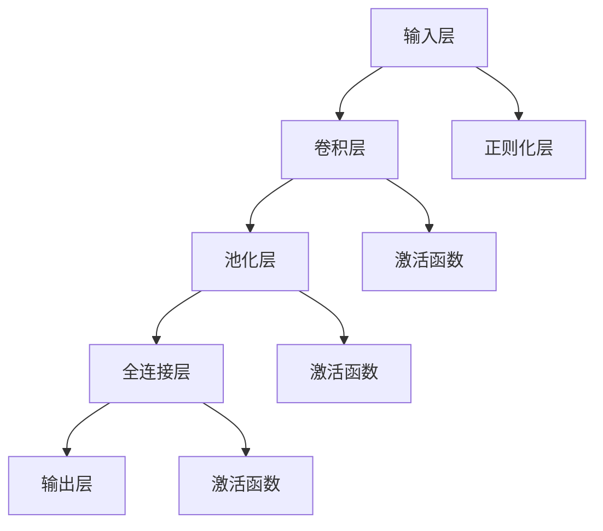

                 

### 文章标题: AI研究的15年历程

> 关键词：人工智能、深度学习、强化学习、自然语言处理、计算机视觉

> 摘要：本文将带领读者回顾过去15年人工智能领域的研究历程，详细探讨AI的核心概念、技术发展、算法原理、项目实战及其在实际应用中面临的挑战和未来趋势。通过对AI历史、现状和未来的深入分析，旨在为读者提供一个全面、系统的AI研究全景。

---

### 引言

人工智能（AI）作为计算机科学的前沿领域，近年来取得了令人瞩目的成就。从智能助理到自动驾驶，从医疗诊断到金融分析，AI技术的应用已经渗透到各个行业，带来了巨大的变革和创新。本文旨在回顾过去15年AI研究的历程，从核心概念、技术发展、算法原理、项目实战到应用挑战，全面解析AI的方方面面。

15年，对于AI领域来说，是一个关键的发展时期。在这段时间里，AI从初期的概念和理论研究，逐渐走向实际应用，成为推动社会进步的重要力量。本文将通过以下章节，逐步揭开AI的神秘面纱：

1. **AI的起源与发展**
2. **AI技术核心概念与联系**
3. **AI数学模型和数学公式详解**
4. **AI算法原理讲解**
5. **AI项目实战**
6. **AI在实际应用中的挑战与解决方案**
7. **AI未来的发展趋势**

希望通过本文，读者能够对AI有一个更加清晰、全面的认识，从而更好地理解和应用这项技术。

### 第一部分: AI研究概述

#### 第1章: AI的起源与发展

##### 1.1 AI的定义与历史背景

人工智能（Artificial Intelligence，简称AI）是指通过计算机技术实现人类智能行为的理论、技术和应用。其目标是创建能够感知环境、理解语言、做出决策和执行任务的智能系统。

AI的历史可以追溯到20世纪50年代，当时图灵提出了著名的图灵测试，旨在判断机器是否具有智能。1956年，达特茅斯会议的召开标志着AI作为一个独立学科的诞生。然而，早期AI研究主要集中在符号主义和知识表示上，由于计算能力和算法的限制，进展较为缓慢。

随着计算机技术的快速发展，特别是2000年以后，深度学习和强化学习等新算法的出现，AI迎来了新一轮的爆发式增长。深度学习在图像识别、语音识别等领域的突破，使得AI的应用范围不断扩大，从理论研究走向实际应用。

##### 1.2 AI研究的关键事件

1. **深度学习的崛起**

深度学习（Deep Learning）是AI领域中的一种重要方法，通过多层神经网络对大量数据进行训练，从而实现复杂的特征学习和任务执行。2006年，Hinton等人提出深度置信网络（Deep Belief Network），标志着深度学习的兴起。2012年，AlexNet在ImageNet图像识别挑战赛中取得了历史性的突破，深度学习开始受到广泛关注。

2. **强化学习的应用**

强化学习（Reinforcement Learning）是一种通过奖励信号指导智能体学习目标策略的方法。2015年，Google DeepMind的AlphaGo在围棋比赛中击败人类顶级选手，引发了全球对强化学习的关注。此后，强化学习在游戏、机器人、推荐系统等领域得到了广泛应用。

3. **自然语言处理的突破**

自然语言处理（Natural Language Processing，简称NLP）是AI的一个重要分支，旨在使计算机能够理解、生成和处理自然语言。2018年，BERT模型的出现，使NLP的性能得到了大幅提升。同时，语言模型、翻译模型和文本分类等应用也取得了显著进展。

这些关键事件不仅推动了AI技术的发展，也深刻影响了AI的应用场景，使得AI从理论研究走向实际应用，成为推动社会进步的重要力量。

#### 第2章: AI技术核心概念与联系

##### 1.1 机器学习基础

机器学习（Machine Learning）是AI的核心技术之一，通过训练模型来预测或分类新数据。根据训练数据的类型，机器学习可分为监督学习、无监督学习和半监督学习。

1. **监督学习**

监督学习（Supervised Learning）是最常见的机器学习方法，它通过标记数据来训练模型，然后使用模型对新数据进行预测。常见的监督学习算法包括线性回归、逻辑回归、决策树、支持向量机（SVM）等。

   线性回归的数学公式为：
   $$ y = \beta_0 + \beta_1x $$
   其中，\( y \) 是目标变量，\( x \) 是输入特征，\( \beta_0 \) 和 \( \beta_1 \) 是模型的参数。

   决策树的构建过程如下：

   ```
   构建决策树：
   1. 选择特征集
   2. 计算每个特征的信息增益
   3. 选择信息增益最大的特征作为分割标准
   4. 对数据集进行分割，生成子节点
   5. 递归调用上述步骤，直到满足停止条件
   ```

2. **无监督学习**

无监督学习（Unsupervised Learning）不依赖于标记数据，其主要任务是发现数据中的结构或模式。常见的无监督学习算法包括聚类、降维和关联规则学习等。

   聚类算法（如K-means聚类）的目标是找出数据集中的簇，使得同一簇内的数据点尽可能接近，而不同簇的数据点尽可能远离。其算法步骤如下：

   ```
   K-means聚类算法：
   1. 随机初始化K个簇的中心点
   2. 对于每个数据点，将其分配到最近的簇中心点
   3. 更新簇中心点为每个簇内数据点的均值
   4. 重复步骤2和3，直到簇中心点不再变化或满足停止条件
   ```

3. **半监督学习**

半监督学习（Semi-Supervised Learning）结合了监督学习和无监督学习的优势，利用少量的标记数据和大量的无标记数据来训练模型。常见的半监督学习算法包括自编码器和标签传播等。

##### 1.2 自然语言处理

自然语言处理（Natural Language Processing，简称NLP）是AI的一个重要分支，旨在使计算机能够理解、生成和处理自然语言。NLP的关键技术包括词嵌入、序列模型和注意力机制。

1. **词嵌入**

词嵌入（Word Embedding）是将单词映射为向量空间中的点，从而实现单词的向量表示。常见的词嵌入方法包括Word2Vec、GloVe和BERT等。

   Word2Vec的算法步骤如下：

   ```
   Word2Vec算法：
   1. 构建语料库，生成单词的共现矩阵
   2. 随机初始化词向量
   3. 对于每个单词，随机选择一个窗口大小，将其上下文单词作为输入，单词本身作为目标
   4. 计算损失函数，更新词向量
   5. 重复步骤3和4，直到收敛
   ```

2. **序列模型**

序列模型（Sequence Model）是处理序列数据的模型，如循环神经网络（RNN）和长短时记忆网络（LSTM）。RNN的算法步骤如下：

   ```
   RNN算法：
   1. 初始化隐藏状态 \( h_0 \)
   2. 对于每个输入 \( x_t \)，计算隐藏状态 \( h_t = f(h_{t-1}, x_t) \)
   3. 输出预测 \( y_t = g(h_t) \)
   4. 更新隐藏状态 \( h_{t+1} = f(h_t, x_{t+1}) \)
   5. 重复步骤2-4，直到处理完所有输入
   ```

3. **注意力机制**

注意力机制（Attention Mechanism）是处理长序列数据的一种有效方法，通过动态关注序列中的重要信息，提高模型的表达能力。注意力机制的算法步骤如下：

   ```
   注意力机制算法：
   1. 对于每个输入 \( x_t \)，计算其权重 \( w_t = \sigma(h_t^T A h_t) \)
   2. 计算加权求和 \( h' = \sum_t w_t h_t \)
   3. 输出预测 \( y = g(h') \)
   ```

##### 1.3 计算机视觉

计算机视觉（Computer Vision）是AI的另一个重要分支，旨在使计算机能够理解和解析视觉信息。计算机视觉的关键技术包括图像识别、目标检测和人脸识别。

1. **图像识别**

图像识别（Image Recognition）是计算机视觉的基本任务，旨在分类图像中的物体。常见的图像识别算法包括卷积神经网络（CNN）和生成对抗网络（GAN）。

   CNN的算法步骤如下：

   ```
   CNN算法：
   1. 输入图像 \( I \)
   2. 通过卷积层 \( C \) 进行特征提取 \( f(C, \theta) \)
   3. 通过池化层 \( P \) 进行特征降维 \( g(P, \theta) \)
   4. 通过全连接层 \( F \) 进行分类预测 \( h(F, \theta) \)
   ```

2. **目标检测**

目标检测（Object Detection）是计算机视觉中的重要任务，旨在识别图像中的多个物体及其位置。常见的目标检测算法包括YOLO、SSD和Faster R-CNN等。

   Faster R-CNN的算法步骤如下：

   ```
   Faster R-CNN算法：
   1. 利用Region Proposal Network（RPN）生成候选区域
   2. 对候选区域进行分类和回归，得到物体的类别和位置
   3. 利用Non-maximum Suppression（NMS）去除重叠的检测结果
   4. 输出检测结果
   ```

3. **人脸识别**

人脸识别（Face Recognition）是计算机视觉中的典型应用，旨在识别和验证个人身份。常见的人脸识别算法包括基于特征的人脸识别和基于深度的人脸识别。

   基于特征的人脸识别算法步骤如下：

   ```
   特征人脸识别算法：
   1. 对人脸图像进行预处理，提取特征点
   2. 利用特征点计算人脸几何特征和纹理特征
   3. 计算特征相似度，进行人脸识别
   ```

#### 第3章: AI数学模型和数学公式详解

##### 1.1 概率论与统计基础

概率论与统计基础是AI领域中不可或缺的部分，它们为模型构建和优化提供了理论基础。以下是概率论与统计中一些重要的概念和公式：

1. **条件概率**

条件概率是指在某个事件发生的条件下，另一个事件发生的概率。其公式为：

   $$
   P(A|B) = \frac{P(A \cap B)}{P(B)}
   $$

   其中，\( P(A|B) \) 表示在事件 \( B \) 发生的条件下，事件 \( A \) 发生的概率，\( P(A \cap B) \) 表示事件 \( A \) 和事件 \( B \) 同时发生的概率，\( P(B) \) 表示事件 \( B \) 发生的概率。

2. **贝叶斯定理**

贝叶斯定理是一种用于计算后验概率的公式，其形式如下：

   $$
   P(A|B) = \frac{P(B|A)P(A)}{P(B)}
   $$

   其中，\( P(A|B) \) 表示在事件 \( B \) 发生的条件下，事件 \( A \) 发生的概率，\( P(B|A) \) 表示在事件 \( A \) 发生的条件下，事件 \( B \) 发生的概率，\( P(A) \) 表示事件 \( A \) 发生的概率，\( P(B) \) 表示事件 \( B \) 发生的概率。

3. **最大似然估计**

最大似然估计是一种用于估计模型参数的方法，其目标是最大化观测数据在模型参数下的似然函数。其公式为：

   $$
   \theta = \arg\max_\theta P(D|\theta)
   $$

   其中，\( \theta \) 表示模型参数，\( D \) 表示观测数据，\( P(D|\theta) \) 表示在模型参数 \( \theta \) 下观测数据 \( D \) 的概率。

4. **假设检验**

假设检验是一种用于验证模型假设是否成立的统计方法。常见的假设检验方法包括t检验和卡方检验。

   t检验的公式为：

   $$
   t = \frac{\bar{x} - \mu_0}{s/\sqrt{n}}
   $$

   其中，\( \bar{x} \) 表示样本均值，\( \mu_0 \) 表示总体均值，\( s \) 表示样本标准差，\( n \) 表示样本大小。

   卡方检验的公式为：

   $$
   \chi^2 = \sum_{i=1}^n \frac{(x_i - \mu_0)^2}{\sigma^2}
   $$

   其中，\( x_i \) 表示第 \( i \) 个观测值，\( \mu_0 \) 表示总体均值，\( \sigma^2 \) 表示总体方差。

##### 1.2 神经网络数学原理

神经网络（Neural Network）是AI领域中一种重要的模型，其基本原理来源于生物神经系统的信息处理机制。以下简要介绍神经网络的一些关键数学原理：

1. **神经元模型**

神经元模型是神经网络的基本单元，其计算过程可以表示为：

   $$
   z = \sum_{i=1}^n w_i x_i + b
   $$

   其中，\( z \) 表示神经元输出，\( w_i \) 表示权重，\( x_i \) 表示输入特征，\( b \) 表示偏置。

2. **激活函数**

激活函数（Activation Function）是神经网络中的关键组件，用于引入非线性特性。常见的激活函数包括sigmoid函数、ReLU函数和Tanh函数。

   - **sigmoid函数**

     $$
     \sigma(z) = \frac{1}{1 + e^{-z}}
     $$

   - **ReLU函数**

     $$
     \text{ReLU}(z) = \max(0, z)
     $$

   - **Tanh函数**

     $$
     \text{Tanh}(z) = \frac{e^z - e^{-z}}{e^z + e^{-z}}
     $$

3. **反向传播算法**

反向传播算法（Backpropagation Algorithm）是神经网络训练的核心算法，其基本思想是利用梯度下降法更新模型参数，以最小化损失函数。

   反向传播算法的步骤如下：

   - **前向传播**

     $$
     a^{(l)} = \sigma(W^{(l)}a^{(l-1)} + b^{(l)})
     $$

     其中，\( a^{(l)} \) 表示第 \( l \) 层的输出，\( W^{(l)} \) 表示第 \( l \) 层的权重，\( b^{(l)} \) 表示第 \( l \) 层的偏置，\( \sigma \) 表示激活函数。

   - **计算梯度**

     $$
     \delta^{(l)} = (1 - a^{(l)}) \cdot a^{(l)} \cdot \frac{\partial L}{\partial a^{(l)}}
     $$

     其中，\( \delta^{(l)} \) 表示第 \( l \) 层的误差，\( L \) 表示损失函数。

   - **反向传播**

     $$
     \frac{\partial L}{\partial W^{(l)}} = a^{(l-1)} \cdot \delta^{(l)}
     $$

     $$
     \frac{\partial L}{\partial b^{(l)}} = \delta^{(l)}
     $$

   - **更新参数**

     $$
     W^{(l)} = W^{(l)} - \alpha \cdot \frac{\partial L}{\partial W^{(l)}}
     $$

     $$
     b^{(l)} = b^{(l)} - \alpha \cdot \frac{\partial L}{\partial b^{(l)}}
     $$

   其中，\( \alpha \) 表示学习率。

##### 1.3 自然语言处理数学模型

自然语言处理（Natural Language Processing，简称NLP）是AI领域的一个重要分支，其核心目标是使计算机能够理解、生成和处理自然语言。以下简要介绍NLP中的一些关键数学模型：

1. **语言模型**

语言模型（Language Model）是一种用于预测文本序列的概率分布的模型。常见的语言模型包括n元语法模型、神经网络语言模型和上下文向量模型。

   - **n元语法模型**

     $$
     P(w_1, w_2, ..., w_n) = P(w_n|w_{n-1}, w_{n-2}, ..., w_1)P(w_{n-1}|w_{n-2}, ..., w_1) \cdots P(w_1)
     $$

   - **神经网络语言模型**

     神经网络语言模型是一种基于神经网络的模型，其基本结构包括输入层、隐藏层和输出层。

     输入层接收单词的词嵌入向量，隐藏层通过多层神经网络进行特征提取和变换，输出层生成单词的概率分布。

     $$
     P(w|s) = \sigma(W_o^Ts + b_o)
     $$

     其中，\( w \) 表示单词，\( s \) 表示上下文，\( W_o \) 表示输出层的权重，\( b_o \) 表示输出层的偏置，\( \sigma \) 表示激活函数。

   - **上下文向量模型**

     上下文向量模型（如Word2Vec和GloVe）是一种将单词映射为向量空间的模型。通过学习单词的上下文关系，生成单词的向量表示。

     $$
     \vec{w}_i = \text{Word2Vec}(w_i, \text{context})
     $$

     $$
     \vec{w}_i = \text{GloVe}(w_i, \text{context})
     $$

2. **潜在语义分析**

潜在语义分析（Latent Semantic Analysis，简称LSA）是一种基于统计的文本分析方法，其基本思想是利用高维文本数据的低维表示来捕捉文本中的潜在语义信息。LSA通常使用矩阵分解技术，如奇异值分解（SVD）来提取文本数据的潜在主题。

   $$
   A = U\Sigma V^T
   $$

   其中，\( A \) 表示文本矩阵，\( U \) 和 \( V \) 表示分解矩阵，\( \Sigma \) 表示奇异值矩阵。

3. **序列标注模型**

序列标注模型（如递归神经网络（RNN）和长短时记忆网络（LSTM））是一种用于处理序列数据的模型，其基本任务是给定输入序列，预测序列中每个单词的标签。

   - **递归神经网络（RNN）**

     $$
     h_t = \sigma(W_hh_{t-1} + W_xx_t + b_h)
     $$

     $$
     y_t = \text{softmax}(W_oh_t + b_o)
     $$

     其中，\( h_t \) 表示隐藏状态，\( y_t \) 表示预测的标签，\( W_h \) 和 \( W_x \) 分别表示隐藏层和输入层的权重，\( b_h \) 和 \( b_o \) 分别表示隐藏层和输出层的偏置，\( \sigma \) 表示激活函数，\( \text{softmax} \) 表示softmax函数。

   - **长短时记忆网络（LSTM）**

     LSTM（Long Short-Term Memory）是一种改进的递归神经网络，其目的是解决传统RNN在处理长序列数据时出现的梯度消失和梯度爆炸问题。LSTM的基本结构包括输入门、遗忘门和输出门。

     $$
     i_t = \text{sigmoid}(W_{xi}x_t + W_{hi}h_{t-1} + b_i)
     $$

     $$
     f_t = \text{sigmoid}(W_{xf}x_t + W_{hf}h_{t-1} + b_f)
     $$

     $$
     \tilde{C}_t = \text{tanh}(W_{xc}x_t + W_{hc}h_{t-1} + b_c)
     $$

     $$
     C_t = f_t \circ C_{t-1} + i_t \circ \tilde{C}_t
     $$

     $$
     o_t = \text{sigmoid}(W_{xo}x_t + W_{ho}h_{t-1} + b_o)
     $$

     $$
     h_t = o_t \circ \text{tanh}(C_t)
     $$

     其中，\( i_t \) 、\( f_t \) 和 \( o_t \) 分别表示输入门、遗忘门和输出门的输出，\( \tilde{C}_t \) 和 \( C_t \) 分别表示候选状态和状态，\( \circ \) 表示元素乘法，\( \text{sigmoid} \) 和 \( \text{tanh} \) 分别表示sigmoid函数和tanh函数，\( W_{xi} \) 、\( W_{xf} \) 、\( W_{xc} \) 、\( W_{xi} \) 、\( W_{ho} \) 和 \( b_i \) 、\( b_f \) 、\( b_c \) 、\( b_o \) 分别表示权重和偏置。

#### 第4章: AI算法原理讲解

##### 1.1 机器学习算法

机器学习算法是AI领域中最基本和最广泛使用的方法之一，其核心思想是通过学习数据中的特征和模式，从而对未知数据进行预测或分类。以下介绍几种常见的机器学习算法：

1. **K近邻算法**

K近邻算法（K-Nearest Neighbors，简称KNN）是一种基于实例的监督学习算法，其基本思想是对于新的未知数据，通过查找其最近的 \( k \) 个训练样本，并基于这 \( k \) 个样本的标签来预测新数据的标签。

KNN算法的核心步骤如下：

- **训练阶段**：存储训练样本及其标签，构建训练集。
- **预测阶段**：对于新数据，计算其与训练集中每个样本的欧几里得距离，选取距离最近的 \( k \) 个样本，并根据这 \( k \) 个样本的标签计算新数据的预测标签。

伪代码如下：

```
def kNN(train_set, train_labels, test_sample, k):
    distances = []
    for sample in train_set:
        distance = euclidean_distance(test_sample, sample)
        distances.append((distance, sample))
    distances.sort(key=lambda x: x[0])
    neighbors = [label for _, label in distances[:k]]
    majority_vote = max(set(neighbors), key=neighbors.count)
    return majority_vote
```

其中，`euclidean_distance`函数用于计算两个样本之间的欧几里得距离，`train_set`和`train_labels`分别表示训练样本和标签，`test_sample`表示待预测的新数据，`k`表示邻居的数量。

2. **决策树**

决策树（Decision Tree）是一种基于规则的学习方法，其基本思想是通过一系列的测试来将数据集划分为不同的类别或数值。决策树的核心组件是树节点，每个节点表示一个测试，每个测试基于一个特征，并且有两个分支，分别表示该特征的不同取值。

决策树的构建过程如下：

- **选择最优划分特征**：通过计算特征的信息增益或基尼指数来选择最优划分特征。
- **划分数据集**：基于最优划分特征，将数据集划分为两个子集。
- **递归构建子树**：对每个子集重复上述过程，直到满足停止条件（如最大深度、最小样本数等）。

伪代码如下：

```
def build_decision_tree(data, labels, depth=0, max_depth=None):
    if depth >= max_depth or all(label == labels[0] for label in labels):
        return LeafNode(labels)
    
    best_gain = -1
    best_feature = None
    current_uncertainty = entropy(labels)
    
    for feature in data[0]:
        gain = info_gain(data, labels, feature)
        if gain > best_gain:
            best_gain = gain
            best_feature = feature
    
    if best_gain == 0:
        return LeafNode(labels)
    
    left_data, left_labels = split_data(data, labels, best_feature, 'left')
    right_data, right_labels = split_data(data, labels, best_feature, 'right')
    
    tree = TreeNode(feature=best_feature, left=build_decision_tree(left_data, left_labels, depth+1, max_depth),
                    right=build_decision_tree(right_data, right_labels, depth+1, max_depth))
    
    return tree
```

其中，`LeafNode`表示叶节点，`TreeNode`表示内部节点，`entropy`函数用于计算信息熵，`info_gain`函数用于计算信息增益，`split_data`函数用于根据特征划分数据集。

3. **支持向量机**

支持向量机（Support Vector Machine，简称SVM）是一种基于间隔最大化的监督学习算法，其基本思想是通过找到一个最佳的超平面，将不同类别的样本最大限度地分隔开。

SVM的核心步骤如下：

- **特征映射**：将原始特征映射到高维空间，寻找最佳超平面。
- **求解最优化问题**：通过求解二次规划问题，得到最佳超平面的参数。
- **分类决策**：对于新的样本，计算其到最佳超平面的距离，根据距离的符号判断其类别。

伪代码如下：

```
def svm(train_data, train_labels):
    # 特征映射
    mapped_data = map_features(train_data)
    
    # 求解最优化问题
    W, b = solve_quadratic_program(mapped_data, train_labels)
    
    # 分类决策
    def predict(sample):
        mapped_sample = map_features(sample)
        return np.sign(np.dot(mapped_sample, W) + b)
    
    return predict
```

其中，`map_features`函数用于特征映射，`solve_quadratic_program`函数用于求解二次规划问题，`np.sign`函数用于计算符号函数。

4. **随机森林**

随机森林（Random Forest）是一种基于决策树的集成学习方法，其基本思想是通过构建多个决策树，并利用投票机制来预测新样本的类别。

随机森林的核心步骤如下：

- **训练阶段**：对于每个树，从训练集中随机选择特征子集和样本子集，构建决策树。
- **预测阶段**：对于新样本，将每个决策树的预测结果进行投票，得到最终预测结果。

伪代码如下：

```
def random_forest(train_data, train_labels, num_trees, max_depth):
    trees = []
    for _ in range(num_trees):
        feature_subset = random.sample(range(num_features), num_features)
        sample_subset = random.sample(range(num_samples), num_samples)
        tree = build_decision_tree(train_data[sample_subset], train_labels[sample_subset], max_depth=max_depth)
        trees.append(tree)
    
    def predict(sample):
        predictions = [tree.predict(sample) for tree in trees]
        majority_vote = max(set(predictions), key=predictions.count)
        return majority_vote
    
    return predict
```

其中，`build_decision_tree`函数用于构建决策树，`predict`函数用于预测新样本的类别。

5. **提升树**

提升树（Gradient Boosting Tree）是一种基于梯度的集成学习方法，其基本思想是通过迭代构建多个弱学习器，并将它们组合成一个强学习器。

提升树的核心步骤如下：

- **初始化**：初始化预测值和损失函数。
- **迭代阶段**：对于每个迭代，选择一个损失函数的负梯度方向作为弱学习器的优化目标，构建决策树。
- **更新预测值**：将新构建的决策树加入到强学习器中，更新预测值。

伪代码如下：

```
def gradient_boosting_tree(train_data, train_labels, max_depth, num_iterations):
    predictions = initialize_predictions(train_data)
    for _ in range(num_iterations):
        gradients = compute_gradients(predictions, train_labels)
        tree = build_decision_tree(train_data, gradients, max_depth=max_depth)
        predictions = update_predictions(predictions, tree)
    
    return predictions
```

其中，`initialize_predictions`函数用于初始化预测值，`compute_gradients`函数用于计算损失函数的负梯度，`update_predictions`函数用于更新预测值。

##### 1.2 深度学习算法

深度学习（Deep Learning）是一种基于多层神经网络的机器学习方法，其核心思想是通过逐层抽象和特征提取，从原始数据中学习到有意义的表示。以下介绍几种常见的深度学习算法：

1. **卷积神经网络**

卷积神经网络（Convolutional Neural Network，简称CNN）是一种专门用于处理图像数据的深度学习模型，其基本结构包括卷积层、池化层和全连接层。

- **卷积层**

卷积层是CNN的核心部分，通过卷积操作提取图像特征。卷积层的计算过程可以表示为：

  $$
  \text{output}_{ij} = \sum_{k} \text{filter}_{ik,jk} \cdot \text{input}_{ik,jk} + \text{bias}_{ij}
  $$

  其中，\( \text{output}_{ij} \) 表示输出特征图上的第 \( i \) 行第 \( j \) 列的值，\( \text{filter}_{ik,jk} \) 表示卷积核上的第 \( i \) 行第 \( k \) 列的值，\( \text{input}_{ik,jk} \) 表示输入特征图上的第 \( i \) 行第 \( j \) 列的值，\( \text{bias}_{ij} \) 表示偏置。

- **池化层**

池化层用于降低特征图的维度和参数数量，同时保持重要的特征信息。常见的池化操作包括最大池化和平均池化。

  最大池化可以表示为：

  $$
  \text{output}_{ij} = \max_{k} \text{input}_{ik,jk}
  $$

  平均池化可以表示为：

  $$
  \text{output}_{ij} = \frac{1}{p^2} \sum_{k} \sum_{l} \text{input}_{ik,jl}
  $$

  其中，\( p \) 表示池化窗口的大小。

- **全连接层**

全连接层是深度学习模型中的最后一个层次，用于将特征图上的特征映射到分类结果。全连接层的计算过程可以表示为：

  $$
  \text{output}_{i} = \sum_{j} \text{weight}_{ij} \cdot \text{input}_{j} + \text{bias}_{i}
  $$

  其中，\( \text{output}_{i} \) 表示输出结果，\( \text{weight}_{ij} \) 表示权重，\( \text{input}_{j} \) 表示输入值，\( \text{bias}_{i} \) 表示偏置。

2. **循环神经网络**

循环神经网络（Recurrent Neural Network，简称RNN）是一种用于处理序列数据的深度学习模型，其基本结构包括输入层、隐藏层和输出层。

- **输入层**

输入层接收序列中的每个元素，并将其转换为特征向量。

- **隐藏层**

隐藏层通过递归操作，将前一个隐藏状态和当前输入相结合，生成新的隐藏状态。递归操作的公式为：

  $$
  \text{h}_{t} = \text{activation}(\text{W}_{hx} \text{x}_{t} + \text{W}_{hh} \text{h}_{t-1} + \text{b}_{h})
  $$

  其中，\( \text{h}_{t} \) 表示当前隐藏状态，\( \text{x}_{t} \) 表示当前输入，\( \text{W}_{hx} \) 和 \( \text{W}_{hh} \) 分别表示输入权重和隐藏权重，\( \text{b}_{h} \) 表示偏置，\( \text{activation} \) 表示激活函数。

- **输出层**

输出层通过隐藏状态生成输出结果。常见的输出层包括分类输出和回归输出。

  对于分类输出，可以使用softmax函数：

  $$
  \text{output}_{t} = \text{softmax}(\text{W}_{ho} \text{h}_{t} + \text{b}_{o})
  $$

  其中，\( \text{output}_{t} \) 表示输出结果，\( \text{W}_{ho} \) 和 \( \text{b}_{o} \) 分别表示输出权重和偏置。

3. **生成对抗网络**

生成对抗网络（Generative Adversarial Network，简称GAN）是一种由生成器和判别器组成的深度学习模型，其基本思想是通过生成器和判别器的对抗训练，生成逼真的数据。

- **生成器**

生成器的目标是生成逼真的数据，其基本结构包括输入层、隐藏层和输出层。

  生成器的计算过程可以表示为：

  $$
  \text{z} \sim \text{Normal}(0, 1)
  $$

  $$
  \text{x}_{\text{generator}} = \text{activation}(\text{W}_{g} \text{z} + \text{b}_{g})
  $$

  其中，\( \text{z} \) 表示噪声向量，\( \text{x}_{\text{generator}} \) 表示生成的数据，\( \text{W}_{g} \) 和 \( \text{b}_{g} \) 分别表示生成器的权重和偏置。

- **判别器**

判别器的目标是区分真实数据和生成数据，其基本结构包括输入层、隐藏层和输出层。

  判别器的计算过程可以表示为：

  $$
  \text{y}_{\text{real}} = \text{activation}(\text{W}_{d} \text{x}_{\text{real}} + \text{b}_{d})
  $$

  $$
  \text{y}_{\text{generator}} = \text{activation}(\text{W}_{d} \text{x}_{\text{generator}} + \text{b}_{d})
  $$

  其中，\( \text{x}_{\text{real}} \) 表示真实数据，\( \text{x}_{\text{generator}} \) 表示生成数据，\( \text{W}_{d} \) 和 \( \text{b}_{d} \) 分别表示判别器的权重和偏置。

4. **自注意力机制**

自注意力机制（Self-Attention Mechanism）是一种用于处理序列数据的深度学习技术，其基本思想是利用注意力机制动态地计算序列中每个元素的重要性。

- **自注意力**

自注意力可以通过以下公式计算：

  $$
  \text{q} \sim \text{Normal}(0, 1)
  $$

  $$
  \text{keys}, \text{values} = \text{softmax}(\text{W}_{k} \text{q} + \text{b}_{k}) \text{,} \text{softmax}(\text{W}_{v} \text{q} + \text{b}_{v})
  $$

  $$
  \text{output} = \text{softmax}(\text{W}_{o} (\text{keys} \text{values}) + \text{b}_{o})
  $$

  其中，\( \text{q} \) 表示查询向量，\( \text{keys} \) 和 \( \text{values} \) 分别表示键和值，\( \text{W}_{k} \) 、\( \text{W}_{v} \) 和 \( \text{W}_{o} \) 分别表示权重，\( \text{b}_{k} \) 、\( \text{b}_{v} \) 和 \( \text{b}_{o} \) 分别表示偏置。

##### 1.3 强化学习算法

强化学习（Reinforcement Learning，简称RL）是一种通过交互式学习来优化策略的机器学习方法，其基本思想是通过智能体与环境之间的交互，不断调整策略，以实现长期最大化回报。

1. **Q学习**

Q学习（Q-Learning）是一种基于值函数的强化学习算法，其核心思想是通过学习状态-动作值函数 \( Q(s, a) \) 来指导智能体的动作选择。

- **Q学习算法**

  Q学习算法的基本步骤如下：

  $$
  Q(s, a) = \gamma \sum_{s'} P(s' | s, a) \max_{a'} Q(s', a') + (1 - \gamma) R(s, a)
  $$

  其中，\( s \) 表示当前状态，\( a \) 表示当前动作，\( s' \) 表示下一状态，\( a' \) 表示下一动作，\( \gamma \) 表示折扣因子，\( P(s' | s, a) \) 表示状态转移概率，\( R(s, a) \) 表示立即回报。

  伪代码如下：

  ```
  def q_learning(env, Q, alpha, gamma, epsilon, num_episodes):
      for episode in range(num_episodes):
          state = env.reset()
          done = False
          while not done:
              if random() < epsilon:
                  action = random_action()
              else:
                  action = argmax(Q[state])
              
              next_state, reward, done = env.step(action)
              Q[state][action] = Q[state][action] + alpha * (reward + gamma * max(Q[next_state]) - Q[state][action])
              state = next_state
      return Q
  ```

  其中，`env`表示环境，`Q`表示状态-动作值函数，`alpha`表示学习率，`gamma`表示折扣因子，`epsilon`表示探索概率，`num_episodes`表示训练轮数。

2. **策略梯度算法**

策略梯度算法（Policy Gradient Algorithm）是一种直接优化策略的强化学习算法，其核心思想是通过梯度上升法最大化策略的价值函数。

- **策略梯度算法**

  策略梯度算法的基本步骤如下：

  $$
  \nabla_{\pi} J(\pi) = \sum_{s, a} \pi(a|s) \nabla_{\theta} \log \pi(a|s)
  $$

  其中，\( \pi(a|s) \) 表示策略参数，\( \theta \) 表示策略参数的梯度，\( J(\pi) \) 表示策略的价值函数。

  伪代码如下：

  ```
  def policy_gradient(env, policy, num_episodes):
      for episode in range(num_episodes):
          state = env.reset()
          done = False
          rewards = []
          while not done:
              action = policy(state)
              next_state, reward, done = env.step(action)
              rewards.append(reward)
              state = next_state
          
          gradient = np.zeros(policy.parameters().shape)
          for state, action, reward in zip(states, actions, rewards):
              probability = policy(state)[action]
              gradient += np.array([probability * reward])
          
          policy.update(gradient)
      return policy
  ```

  其中，`env`表示环境，`policy`表示策略参数，`num_episodes`表示训练轮数。

3. **深度确定性策略梯度算法**

深度确定性策略梯度算法（Deep Deterministic Policy Gradient，简称DDPG）是一种基于深度强化学习的算法，其核心思想是通过经验回放和目标网络来稳定学习过程。

- **DDPG算法**

  DDPG算法的基本步骤如下：

  $$
  Q(s, a) = \gamma \sum_{s'} \mu(s', a') Q(s', a')
  $$

  $$
  \nabla_{\theta} J(\pi) = \sum_{s, a} \pi(a|s) \nabla_{\theta} \log \pi(a|s)
  $$

  伪代码如下：

  ```
  def ddpg(env, actor, critic, num_episodes):
      replay_memory = ReplayMemory()
      for episode in range(num_episodes):
          state = env.reset()
          done = False
          total_reward = 0
          while not done:
              action = actor(state)
              next_state, reward, done = env.step(action)
              replay_memory.push(state, action, reward, next_state, done)
              state = next_state
              total_reward += reward
            
            # 更新目标网络
            critic_target.update(critic.parameters())
            actor_target.update(actor.parameters())
            
            # 从经验回放中随机采样
            state_batch, action_batch, reward_batch, next_state_batch, done_batch = replay_memory.sample(batch_size)
            
            # 计算目标值
            Q_target = critic_target(next_state_batch, actor_target(next_state_batch))
            Q_target[done_batch] *= discount_factor
            target_values = reward_batch + discount_factor * Q_target
            
            # 更新值函数网络
            critic_loss = critic.loss(state_batch, action_batch, target_values)
            actor_loss = - critic梯度关于动作的梯度
            critic.update(critic_loss)
            actor.update(actor_loss)
      
      return actor, critic
  ```

  其中，`env`表示环境，`actor`表示策略网络，`critic`表示值函数网络，`num_episodes`表示训练轮数，`replay_memory`表示经验回放内存，`batch_size`表示批量大小。

##### 1.4 强化学习在游戏中的应用

强化学习在游戏中的应用取得了显著成果，特别是在围棋、国际象棋和电子游戏等领域。以下介绍几个代表性的强化学习游戏应用：

1. **AlphaGo**

AlphaGo是由Google DeepMind开发的一款围棋AI，它通过深度强化学习算法实现了在围棋领域的卓越表现。AlphaGo的基本架构包括两个核心组件：深度神经网络和价值网络。

- **深度神经网络**

  深度神经网络用于生成走法的候选集。它通过卷积神经网络提取棋盘上的特征，并通过策略网络生成走法的概率分布。

- **价值网络**

  价值网络用于评估每个走法的优劣。它通过卷积神经网络提取棋盘上的特征，并通过全连接神经网络输出走法的价值估计。

  伪代码如下：

  ```
  def alpha_go(board):
      policy_network = build_policy_network(board)
      value_network = build_value_network(board)
      
      policy_probs = policy_network(board)
      value = value_network(board)
      
      action = choose_action(policy_probs, value)
      next_board = apply_action(board, action)
      
      return next_board, action
  ```

  其中，`build_policy_network`函数用于构建策略网络，`build_value_network`函数用于构建价值网络，`choose_action`函数用于选择最佳走法，`apply_action`函数用于应用走法。

2. **AlphaStar**

AlphaStar是由DeepMind开发的一款星际争霸II AI，它在星际争霸II的多人比赛中取得了超越职业选手的成绩。AlphaStar的基本架构包括深度神经网络、强化学习算法和策略网络。

- **深度神经网络**

  深度神经网络用于生成走法的候选集。它通过卷积神经网络提取棋盘上的特征，并通过策略网络生成走法的概率分布。

- **强化学习算法**

  强化学习算法用于训练策略网络。它通过深度Q网络（DQN）和策略梯度算法（PG）训练策略网络，使其能够生成最佳走法。

- **策略网络**

  策略网络用于选择最佳走法。它通过深度神经网络提取棋盘上的特征，并通过策略网络输出走法的概率分布。

  伪代码如下：

  ```
  def alpha_star(board):
      policy_network = build_policy_network(board)
      q_network = build_q_network(board)
      
      policy_probs = policy_network(board)
      q_values = q_network(board)
      
      action = choose_action(policy_probs, q_values)
      next_board = apply_action(board, action)
      
      return next_board, action
  ```

  其中，`build_policy_network`函数用于构建策略网络，`build_q_network`函数用于构建深度Q网络，`choose_action`函数用于选择最佳走法，`apply_action`函数用于应用走法。

3. **A3C**

A3C（Asynchronous Advantage Actor-Critic）是一种基于异步优势演员-评论家算法的强化学习算法，它通过并行训练多个智能体，提高了学习效率和效果。A3C的基本架构包括演员网络、评论家网络和共享参数。

- **演员网络**

  演员网络用于生成走法的概率分布。它通过共享参数生成走法的概率分布，并通过优势函数评估走法的优劣。

- **评论家网络**

  评论家网络用于评估演员网络生成的走法。它通过共享参数计算走法的优势值，并通过优势函数评估走法的优劣。

- **共享参数**

  共享参数用于提高模型的并行训练能力。它通过共享参数实现演员网络和评论家网络的参数共享，从而加快训练过程。

  伪代码如下：

  ```
  def a3c(board, global_model, local_model, optimizer):
      local_model = train_local_model(board, local_model, global_model)
      advantage_values = compute_advantage(board, local_model)
      loss = compute_loss(local_model, advantage_values)
      
      optimizer.zero_grad()
      loss.backward()
      optimizer.step()
      
      return local_model, loss
  ```

  其中，`train_local_model`函数用于训练本地模型，`compute_advantage`函数用于计算优势值，`compute_loss`函数用于计算损失函数，`optimizer`表示优化器。

#### 第5章: AI项目实战

##### 1.1 项目一：图像分类

图像分类是计算机视觉领域的一项基础任务，旨在将图像划分为不同的类别。本节将通过一个图像分类项目，详细介绍项目的开发环境搭建、模型训练、模型评估和代码解读与分析。

1. **项目背景**

随着深度学习技术的发展，图像分类任务得到了广泛关注。本节将利用深度学习模型对图像进行分类，以实现自动识别图像内容的功能。

2. **开发环境搭建**

在开始项目之前，需要搭建开发环境。以下列出所需的软件和库：

- Python（3.8或更高版本）
- TensorFlow（2.5或更高版本）
- Keras（2.6或更高版本）
- NumPy（1.21或更高版本）
- Matplotlib（3.5或更高版本）
- OpenCV（4.5或更高版本）

安装以上库后，可以开始搭建开发环境。

3. **数据集**

本节使用常用的CIFAR-10数据集进行图像分类。CIFAR-10数据集包含10个类别，每个类别有6000张图像，共60000张图像。数据集的下载和加载可以使用Keras库中的内置函数。

4. **模型构建**

在深度学习中，常用的图像分类模型包括卷积神经网络（CNN）。以下是一个简单的CNN模型示例：

```python
from tensorflow.keras.models import Sequential
from tensorflow.keras.layers import Conv2D, MaxPooling2D, Flatten, Dense

model = Sequential([
    Conv2D(32, (3, 3), activation='relu', input_shape=(32, 32, 3)),
    MaxPooling2D((2, 2)),
    Conv2D(64, (3, 3), activation='relu'),
    MaxPooling2D((2, 2)),
    Flatten(),
    Dense(64, activation='relu'),
    Dense(10, activation='softmax')
])

model.compile(optimizer='adam', loss='categorical_crossentropy', metrics=['accuracy'])
```

5. **模型训练**

训练模型需要准备训练数据和验证数据。以下代码用于训练模型：

```python
from tensorflow.keras.preprocessing.image import ImageDataGenerator

train_datagen = ImageDataGenerator(rescale=1./255)
validation_datagen = ImageDataGenerator(rescale=1./255)

train_generator = train_datagen.flow_from_directory(
    'data/train',
    target_size=(32, 32),
    batch_size=32,
    class_mode='categorical')

validation_generator = validation_datagen.flow_from_directory(
    'data/validation',
    target_size=(32, 32),
    batch_size=32,
    class_mode='categorical')

model.fit(
    train_generator,
    steps_per_epoch=100,
    epochs=10,
    validation_data=validation_generator,
    validation_steps=50)
```

6. **模型评估**

训练完成后，可以使用测试数据对模型进行评估。以下代码用于评估模型：

```python
test_generator = validation_datagen.flow_from_directory(
    'data/test',
    target_size=(32, 32),
    batch_size=32,
    class_mode='categorical')

test_loss, test_accuracy = model.evaluate(test_generator)
print(f"Test accuracy: {test_accuracy:.4f}")
```

7. **代码解读与分析**

- **模型构建**：模型使用Keras库中的Sequential模型构建，包含两个卷积层、两个池化层、一个全连接层和一个softmax输出层。卷积层用于提取图像特征，池化层用于降低特征图的维度，全连接层用于分类，softmax输出层用于计算每个类别的概率。
- **模型训练**：使用ImageDataGenerator生成训练数据和验证数据，使用fit方法训练模型，设置训练轮数、批次大小和验证数据等参数。
- **模型评估**：使用evaluate方法评估模型在测试数据上的性能，输出测试准确率。

通过以上步骤，读者可以了解到图像分类项目的开发流程，包括数据集准备、模型构建、模型训练和模型评估。在实际应用中，可以根据需求和数据集调整模型结构和训练参数，提高模型的性能。

##### 1.2 项目二：文本分类

文本分类（Text Classification）是一种常见的人工智能任务，旨在将文本数据自动归类到预定义的类别中。本节将介绍一个基于深度学习的文本分类项目，包括数据预处理、模型训练、模型评估和代码解读与分析。

1. **项目背景**

随着互联网的发展，文本数据的数量日益增加，如何有效地对文本进行分类成为了一个重要问题。文本分类在社交媒体分析、舆情监测、情感分析等领域有广泛应用。

2. **数据集**

本节使用常用的IMDB电影评论数据集进行文本分类。该数据集包含25,000条电影评论，其中50%为正面评论，50%为负面评论。

3. **开发环境搭建**

与图像分类项目类似，本节需要安装以下软件和库：

- Python（3.8或更高版本）
- TensorFlow（2.5或更高版本）
- Keras（2.6或更高版本）
- NumPy（1.21或更高版本）
- Matplotlib（3.5或更高版本）
- pandas（1.2或更高版本）
- gensim（4.0或更高版本）

4. **数据预处理**

文本分类项目首先需要对文本数据进行预处理，包括分词、去停用词、词嵌入等步骤。

- **分词**：使用jieba库进行中文分词。

  ```python
  import jieba

  def tokenize(text):
      return list(jieba.cut(text))
  ```

- **去停用词**：使用停用词表去除常见的无意义词汇。

  ```python
  stop_words = set(['的', '了', '在', '是', '上', '地', '下', '里'])

  def remove_stop_words(tokens):
      return [token for token in tokens if token not in stop_words]
  ```

- **词嵌入**：使用GloVe模型生成词向量。

  ```python
  from gensim.models import KeyedVectors

  glove_path = 'glove.6B.100d.txt'
  glove_model = KeyedVectors.load_word2vec_format(glove_path, binary=False)

  def word_to_vector(word):
      return glove_model[word]
  ```

5. **模型构建**

本节使用Keras构建一个简单的文本分类模型，包括嵌入层、循环层、全连接层和输出层。

```python
from tensorflow.keras.models import Sequential
from tensorflow.keras.layers import Embedding, LSTM, Dense

vocab_size = 10000
embedding_dim = 100

model = Sequential([
    Embedding(vocab_size, embedding_dim, input_length=max_sequence_length),
    LSTM(128),
    Dense(1, activation='sigmoid')
])

model.compile(optimizer='adam', loss='binary_crossentropy', metrics=['accuracy'])
```

6. **模型训练**

训练模型需要准备训练数据和验证数据。以下代码用于训练模型：

```python
from tensorflow.keras.preprocessing.sequence import pad_sequences

max_sequence_length = 100

X_train = pad_sequences(simple_train, maxlen=max_sequence_length)
X_val = pad_sequences(simple_val, maxlen=max_sequence_length)
y_train = simple_train_labels
y_val = simple_val_labels

model.fit(X_train, y_train, epochs=10, batch_size=32, validation_data=(X_val, y_val))
```

7. **模型评估**

训练完成后，可以使用测试数据对模型进行评估。以下代码用于评估模型：

```python
X_test = pad_sequences(simple_test, maxlen=max_sequence_length)
y_test = simple_test_labels

test_loss, test_accuracy = model.evaluate(X_test, y_test)
print(f"Test accuracy: {test_accuracy:.4f}")
```

8. **代码解读与分析**

- **数据预处理**：文本预处理是文本分类项目的重要步骤，包括分词、去停用词和词嵌入。分词用于将文本分解为词语，去停用词用于去除无意义词汇，词嵌入用于将词语映射为向量表示。
- **模型构建**：文本分类模型通常包含嵌入层、循环层和全连接层。嵌入层将词语映射为向量，循环层用于处理序列数据，全连接层用于分类。
- **模型训练**：模型训练需要准备训练数据和验证数据，并设置训练轮数、批次大小和验证数据等参数。
- **模型评估**：模型评估通过计算测试数据上的损失和准确率来评估模型的性能。

通过以上步骤，读者可以了解到文本分类项目的开发流程，包括数据预处理、模型构建、模型训练和模型评估。在实际应用中，可以根据需求和数据集调整模型结构和训练参数，提高模型的性能。

##### 1.3 项目三：强化学习在游戏中的应用

强化学习在游戏中的应用取得了显著成果，特别是在棋类游戏、赛车游戏和策略游戏等领域。本节将介绍一个基于深度强化学习的游戏项目，包括环境搭建、策略学习、代码解读与分析。

1. **项目背景**

游戏是强化学习应用的一个重要领域，通过深度强化学习算法，可以训练出能够击败专业玩家的智能体。本节选择经典的Atari游戏《Pong》作为项目案例。

2. **环境搭建**

在开始项目之前，需要搭建强化学习环境。以下列出所需的软件和库：

- Python（3.8或更高版本）
- TensorFlow（2.5或更高版本）
- Keras（2.6或更高版本）
- Gym（0.20或更高版本）

安装以上库后，可以开始搭建强化学习环境。

3. **游戏环境**

《Pong》是一款经典的电子游戏，玩家需要控制一个球拍，使球尽可能多地击中对方。本节使用Gym库中的《Pong》环境。

4. **策略学习**

本节使用深度确定性策略梯度（DDPG）算法训练策略网络。DDPG算法是一种基于深度强化学习的算法，通过经验回放和目标网络来稳定学习过程。

- **演员网络**：演员网络用于生成动作的概率分布。它通过卷积神经网络提取游戏状态的特征，并通过策略网络生成动作的概率分布。

  ```python
  from tensorflow.keras.models import Model
  from tensorflow.keras.layers import Input, Conv2D, Flatten, Dense

  input_shape = (210, 160, 3)
  action_shape = (1,)

  input_layer = Input(shape=input_shape)
  conv1 = Conv2D(32, (8, 8), strides=(4, 4), activation='relu')(input_layer)
  conv2 = Conv2D(64, (4, 4), strides=(2, 2), activation='relu')(conv1)
  conv3 = Conv2D(64, (3, 3), activation='relu')(conv2)
  flatten = Flatten()(conv3)
  dense = Dense(512, activation='relu')(flatten)
  output_layer = Dense(2, activation='softmax')(dense)

  actor = Model(inputs=input_layer, outputs=output_layer)
  ```

- **评论家网络**：评论家网络用于评估演员网络生成的动作。它通过卷积神经网络提取游戏状态的特征，并通过值网络计算动作的价值估计。

  ```python
  critic_input_shape = (210, 160, 3)
  critic_action_shape = (1,)

  critic_input_layer = Input(shape=critic_input_shape)
  critic_action_input_layer = Input(shape=critic_action_shape)
  critic_conv1 = Conv2D(32, (8, 8), strides=(4, 4), activation='relu')(critic_input_layer)
  critic_conv2 = Conv2D(64, (4, 4), strides=(2, 2), activation='relu')(critic_conv1)
  critic_conv3 = Conv2D(64, (3, 3), activation='relu')(critic_conv2)
  critic_flatten = Flatten()(critic_conv3)
  critic_dense = Dense(512, activation='relu')(critic_flatten)
  critic_output_layer = Dense(1, activation='linear')(critic_dense)

  critic = Model(inputs=[critic_input_layer, critic_action_input_layer], outputs=critic_output_layer)
  ```

- **目标网络**：目标网络用于稳定学习过程。它通过经验回放和梯度更新来更新演员网络和评论家网络。

  ```python
  target_actor = Model(inputs=input_layer, outputs=output_layer)
  target_critic = Model(inputs=[critic_input_layer, critic_action_input_layer], outputs=critic_output_layer)

  # 更新目标网络权重
  target_actor.layers[1].set_weights(actor.layers[1].get_weights())
  target_actor.layers[2].set_weights(actor.layers[2].get_weights())
  target_actor.layers[3].set_weights(actor.layers[3].get_weights())

  target_critic.layers[1].set_weights(critic.layers[1].get_weights())
  target_critic.layers[2].set_weights(critic.layers[2].get_weights())
  target_critic.layers[3].set_weights(critic.layers[3].get_weights())
  ```

5. **训练过程**

训练过程主要包括经验回放、策略更新和目标网络更新。以下代码用于训练策略网络：

```python
import numpy as np
import random

gamma = 0.99
tau = 0.001
buffer_size = 10000
batch_size = 64
learning_rate = 0.001

# 初始化经验回放内存
buffer = []

# 训练策略网络
for episode in range(num_episodes):
    state = env.reset()
    done = False
    total_reward = 0

    while not done:
        action_probs = actor.predict(state.reshape(1, -1))
        action = np.random.choice(a=range(action_shape[0]), p=action_probs.reshape(-1))
        next_state, reward, done, _ = env.step(action)
        total_reward += reward

        # 更新经验回放内存
        buffer.append((state, action, reward, next_state, done))

        if len(buffer) > buffer_size:
            buffer = buffer[-buffer_size:]

        if done:
            next_state = np.zeros(state.shape)

        # 从经验回放内存中随机采样
        samples = random.sample(buffer, batch_size)

        states, actions, rewards, next_states, dones = zip(*samples)
        states = np.array(states)
        next_states = np.array(next_states)
        actions = np.array(actions)
        rewards = np.array(rewards)
        dones = np.array(dones)

        # 计算目标值
        target_values = (rewards + (1 - dones) * gamma * target_critic.predict([next_states, target_actor.predict(next_states)])).reshape(-1)

        # 计算损失
        critic_loss = critic.train_on_batch([states, actions], target_values.reshape(-1))

        # 更新演员网络
        actor_gradients = critic trainable_variables梯度的梯度关于动作的梯度
        actor.train_on_batch(states.reshape(-1, input_shape[0], input_shape[1], input_shape[2]), actor_gradients)

        # 更新目标网络权重
        target_actor.layers[1].set_weights(tau * actor.layers[1].get_weights() + (1 - tau) * target_actor.layers[1].get_weights())
        target_actor.layers[2].set_weights(tau * actor.layers[2].get_weights() + (1 - tau) * target_actor.layers[2].get_weights())
        target_actor.layers[3].set_weights(tau * actor.layers[3].get_weights() + (1 - tau) * target_actor.layers[3].get_weights())

        target_critic.layers[1].set_weights(tau * critic.layers[1].get_weights() + (1 - tau) * target_critic.layers[1].get_weights())
        target_critic.layers[2].set_weights(tau * critic.layers[2].get_weights() + (1 - tau) * target_critic.layers[2].get_weights())
        target_critic.layers[3].set_weights(tau * critic.layers[3].get_weights() + (1 - tau) * target_critic.layers[3].get_weights())

        state = next_state

    print(f"Episode {episode}: Total reward = {total_reward}")

# 评估策略网络
state = env.reset()
done = False
total_reward = 0

while not done:
    action = actor.predict(state.reshape(1, -1))
    action = np.argmax(action)
    next_state, reward, done, _ = env.step(action)
    total_reward += reward
    state = next_state

print(f"Test total reward: {total_reward}")
```

6. **代码解读与分析**

- **演员网络**：演员网络通过卷积神经网络提取游戏状态的特征，并通过策略网络生成动作的概率分布。策略网络使用softmax函数输出动作的概率分布。
- **评论家网络**：评论家网络通过卷积神经网络提取游戏状态的特征，并通过值网络计算动作的价值估计。值网络使用线性函数输出动作的价值估计。
- **目标网络**：目标网络用于稳定学习过程。通过经验回放和梯度更新来更新演员网络和评论家网络。目标网络使用固定的更新策略，以保持稳定的权重。
- **训练过程**：训练过程包括经验回放、策略更新和目标网络更新。经验回放用于增强样本的多样性，策略更新用于优化策略网络，目标网络更新用于稳定学习过程。

通过以上步骤，读者可以了解到强化学习在游戏中的应用，包括环境搭建、策略学习和训练过程。在实际应用中，可以根据需求和数据调整模型结构和训练参数，提高智能体的性能。

### 第一部分总结

在第一部分中，我们回顾了AI的起源与发展，探讨了AI的核心概念、技术发展和算法原理，并通过实际项目展示了AI的应用。通过这一部分的介绍，读者可以了解到AI在过去15年的快速发展，以及它在各个领域的应用潜力。接下来，我们将继续探讨AI在实际应用中面临的挑战与解决方案，以及AI未来的发展趋势。

### 第二部分: AI在实际应用中的挑战与解决方案

#### 第6章: AI在实际应用中的挑战与解决方案

##### 1.1 数据隐私与安全性

随着AI技术的发展，数据隐私和安全性的问题日益突出。AI系统通常需要大量的数据来进行训练和优化，这些数据可能包括用户的个人信息、商业机密等敏感信息。以下是一些常见的数据隐私与安全性挑战及其解决方案：

- **数据加密**：数据加密是一种常用的数据隐私保护技术，通过加密算法将原始数据转换为无法直接解读的密文，从而确保数据在传输和存储过程中的安全性。常用的加密算法包括对称加密（如AES）和非对称加密（如RSA）。

- **差分隐私**：差分隐私是一种在数据处理过程中保护隐私的技术，通过在数据上添加随机噪声，使得单个数据记录无法被识别，同时保证统计结果的准确性。常见的差分隐私技术包括拉普拉斯机制和指数机制。

- **联邦学习**：联邦学习（Federated Learning）是一种分布式机器学习方法，它允许多个参与方在本地训练模型，并将模型更新上传到中心服务器进行聚合。通过这种方式，参与方的数据无需上传到中心服务器，从而减少了数据泄露的风险。

##### 1.2 AI伦理与公平性

AI伦理与公平性是AI应用中备受关注的议题。随着AI技术的广泛应用，如何确保AI系统在决策过程中公平、透明、无偏见成为了一个重要问题。以下是一些常见的AI伦理与公平性挑战及其解决方案：

- **偏见与歧视**：AI系统可能会在训练过程中学习到数据中的偏见和歧视，从而影响其决策的公平性。为了解决这一问题，可以采取以下措施：
  - **数据预处理**：在训练模型之前，对数据进行清洗和预处理，去除可能存在的偏见和歧视信息。
  - **反偏见算法**：设计专门的算法来检测和消除模型中的偏见。例如，可以使用公平性指标（如公平性差距、偏见指数等）来评估模型的公平性，并根据评估结果进行调整。

- **透明性与可解释性**：为了确保AI系统的决策过程透明、可解释，可以采取以下措施：
  - **模型解释技术**：开发用于解释AI模型决策的技术，如注意力机制、特征重要性分析等。
  - **可视化工具**：使用可视化工具展示模型的决策过程，帮助用户理解模型的决策逻辑。

- **责任归属**：在AI应用中，明确责任归属是一个重要问题。为了解决这一问题，可以采取以下措施：
  - **责任界定**：明确AI系统、开发者、用户等各方在AI应用中的责任。
  - **法律法规**：制定相关法律法规，规范AI系统的开发和应用，确保各方在AI应用中的权益。

##### 1.3 AI与人类工作的关系

AI技术的快速发展对人类工作产生了深远的影响，既带来了机遇，也带来了挑战。以下是一些关于AI与人类工作的关系及其解决方案的讨论：

- **自动化与就业**：AI技术的自动化能力使得许多重复性、低技能的工作可以被机器取代。这可能导致部分人群失业，同时也会产生新的就业机会。为了应对这一挑战，可以采取以下措施：
  - **职业转型与培训**：为受影响的员工提供职业转型和培训，帮助他们掌握新的技能，适应新的工作环境。
  - **创造新的就业机会**：鼓励企业投资于AI技术，创造新的就业机会，如AI研发、维护和培训等。

- **人机协作**：AI与人类可以相互协作，发挥各自的优势。为了实现人机协作，可以采取以下措施：
  - **智能助手**：开发智能助手，帮助人类提高工作效率。例如，智能客服、智能助理等。
  - **人机协同系统**：设计人机协同系统，使人类和AI共同完成任务。例如，自动驾驶汽车、医疗诊断系统等。

- **工作分配**：在AI与人类共同工作的环境中，合理分配工作职责，使双方能够充分发挥作用。为了实现这一目标，可以采取以下措施：
  - **工作评估**：对人类和AI的能力进行评估，根据评估结果合理分配工作。
  - **协作机制**：建立人机协作机制，确保人类和AI能够高效、顺畅地协同工作。

通过上述措施，我们可以更好地应对AI在实际应用中面临的挑战，促进AI技术的健康发展，实现人类与AI的和谐共生。

#### 第7章: AI未来的发展趋势

随着人工智能技术的不断进步，AI未来的发展趋势也越来越清晰。以下将探讨AI硬件的发展、AI算法的创新以及AI与其他领域的融合，为读者展示AI未来的蓝图。

##### 1.1 AI硬件的发展

AI硬件的发展是推动AI技术进步的关键因素。近年来，AI硬件领域取得了显著成果，特别是GPU、TPU和专用AI芯片的发展。

- **GPU（图形处理单元）**：GPU在深度学习领域已经得到了广泛应用。GPU具有高并行计算能力，使其能够高效地处理大规模的矩阵运算，从而加速深度学习模型的训练。随着GPU性能的提升和价格的降低，越来越多的研究者和企业开始使用GPU来构建AI系统。

- **TPU（张量处理单元）**：TPU是Google专门为AI应用设计的硬件加速器。TPU具有良好的矩阵运算性能和低延迟特性，特别适合处理深度神经网络。TPU的引入使得AI模型的训练速度得到了大幅提升，为AI技术的发展提供了强大的支持。

- **专用AI芯片**：除了GPU和TPU，许多科技公司也在研发自己的专用AI芯片。这些芯片针对特定的AI应用进行了优化，旨在提高AI系统的性能和能效。例如，NVIDIA的GPU、Intel的Nervana、Google的TPU等，都是专用AI芯片的优秀代表。

未来，随着AI技术的不断进步，AI硬件将朝着更高性能、更低能耗、更易部署的方向发展。这将为AI应用带来更广阔的前景。

##### 1.2 AI算法的创新

AI算法的创新是推动AI技术发展的核心动力。在过去几年中，许多新的AI算法相继出现，极大地提升了AI系统的性能和应用范围。

- **无监督学习**：无监督学习是一种无需标记数据的学习方法，旨在发现数据中的潜在结构和模式。近年来，无监督学习取得了显著进展，尤其是在自编码器、生成对抗网络（GAN）等领域。无监督学习算法在图像生成、自然语言处理等任务中表现出了强大的能力。

- **生成模型**：生成模型是一种用于生成新数据的学习方法，其核心思想是通过学习数据分布来生成新的数据样本。生成模型在图像生成、文本生成等领域取得了显著成果。例如，GAN（生成对抗网络）是一种常用的生成模型，它通过生成器和判别器的对抗训练，实现了高质量的图像生成。

- **联邦学习**：联邦学习是一种分布式机器学习方法，旨在保护用户隐私的同时，实现大规模的数据共享和模型训练。联邦学习在医疗、金融、工业等领域具有广泛的应用前景。通过联邦学习，用户可以在本地训练模型，并将模型更新上传到中心服务器进行聚合，从而避免了数据泄露的风险。

未来，随着AI算法的不断改进和创新，AI技术将在更多领域取得突破，为人类带来更多的便利和进步。

##### 1.3 AI与其他领域的融合

AI技术的快速发展已经使其成为许多领域的重要驱动力。AI与其他领域的融合，不仅推动了这些领域的技术创新，也为AI技术的发展提供了新的机遇。

- **医疗领域**：AI在医疗领域的应用包括疾病诊断、药物研发、手术机器人等。通过AI技术，可以实现更精准的疾病诊断、更高效的药物筛选和更智能的手术机器人。例如，AI技术已经用于肺癌、乳腺癌等疾病的早期诊断，显著提高了诊断的准确性和效率。

- **金融领域**：AI在金融领域的应用包括风险控制、信用评估、智能投顾等。通过AI技术，可以实现更精确的风险评估、更合理的信用评估和更智能的资产管理。例如，AI技术已经用于信用卡欺诈检测、股票市场预测等，大大提高了金融行业的效率和安全性。

- **教育领域**：AI在教育领域的应用包括智能教学、个性化学习、在线教育等。通过AI技术，可以实现更智能的教学方法、更个性化的学习路径和更高效的在线教育平台。例如，AI技术已经用于智能辅导、作业批改、学习效果评估等，为学生提供了更好的学习体验。

未来，随着AI技术的不断进步，AI将与其他领域深度融合，为人类社会带来更多的变革和创新。

#### 第7章总结

在第二部分中，我们探讨了AI在实际应用中面临的挑战与解决方案，以及AI未来的发展趋势。通过分析数据隐私与安全性、AI伦理与公平性、AI与人类工作的关系，我们看到了AI应用中的挑战，并提出了相应的解决方案。同时，我们展望了AI未来的发展趋势，包括AI硬件的发展、AI算法的创新以及AI与其他领域的融合。这些讨论为我们理解AI的发展方向提供了宝贵的启示，也为未来AI技术的应用带来了新的思考。

### 全文总结

通过本文的探讨，我们全面回顾了AI研究的15年历程。从AI的起源与发展，到核心概念、技术发展和算法原理，再到实际项目应用和挑战与解决方案，以及未来的发展趋势，我们对AI有了更加清晰、全面的认识。

AI技术的快速发展不仅改变了我们的生活方式，也推动了各个领域的技术创新。从深度学习、强化学习到自然语言处理和计算机视觉，AI技术已经渗透到我们生活的方方面面。在未来的发展中，AI硬件的创新、算法的进步以及与其他领域的融合，将为人类社会带来更多的变革和机遇。

然而，AI技术的广泛应用也带来了数据隐私与安全、伦理与公平性等方面的挑战。如何应对这些挑战，确保AI技术的健康发展，是未来需要深入思考和解决的重要问题。

我们希望本文能够为读者提供一个全面、系统的AI研究全景，帮助读者更好地理解和应用这项技术。在未来的研究中，让我们继续关注AI技术的发展，探索更多的应用场景，为人类社会的进步贡献自己的力量。

### 附录

#### 附录 A: AI研究资源与工具

为了方便读者深入了解AI研究，本文整理了一些常用的AI研究资源与工具，包括主流深度学习框架、开源数据集与工具库、学术期刊与会议推荐。

1. **主流深度学习框架**

   - TensorFlow：由Google开发的开源深度学习框架，广泛应用于图像识别、自然语言处理、强化学习等领域。
   - PyTorch：由Facebook开发的开源深度学习框架，具有良好的灵活性和动态计算图支持，深受研究人员和开发者的喜爱。
   - Keras：基于Theano和TensorFlow的高层深度学习API，提供了简洁、易于使用的接口，适合快速构建和实验深度学习模型。
   - MXNet：由Apache Software Foundation开发的开源深度学习框架，具有良好的性能和灵活性，适用于大规模深度学习应用。

2. **开源数据集与工具库**

   - ImageNet：由Facebook AI研究院创建的图像分类数据集，包含了1000个类别，每个类别1000张图像。
   - COCO数据集：用于目标检测和图像分割的数据集，包含了大量具有复杂场景的图像，广泛应用于计算机视觉领域。
   - NLTK：用于自然语言处理的工具库，提供了丰富的文本处理和分类功能，广泛应用于文本分类、情感分析等领域。
   - scikit-learn：用于机器学习的开源库，提供了多种常用的机器学习算法和评估方法，广泛应用于数据挖掘和预测建模领域。

3. **学术期刊与会议推荐**

   - IEEE Transactions on Pattern Analysis and Machine Intelligence（TPAMI）：计算机视觉和模式识别领域的顶级学术期刊。
   - Journal of Machine Learning Research（JMLR）：机器学习领域的顶级学术期刊。
   - Neural Computation：神经计算和机器学习领域的学术期刊。
   - Conference on Neural Information Processing Systems（NIPS）：神经信息处理系统的顶级学术会议。
   - International Conference on Machine Learning（ICML）：机器学习领域的顶级学术会议。
   - AAAI Conference on Artificial Intelligence（AAAI）：人工智能领域的综合性学术会议。

#### 附录 B: Mermaid流程图示例

以下是一个Mermaid流程图的示例，展示了深度学习模型的典型结构：



这个流程图描述了一个简单的卷积神经网络，包括输入层、卷积层、池化层、全连接层和输出层。每个层都可以添加相应的激活函数和正则化操作，以提高模型的性能。

通过以上资源与工具，读者可以更好地开展AI研究，探索AI的无限可能。希望本文能够为读者提供有益的启示，助力AI事业的蓬勃发展。

