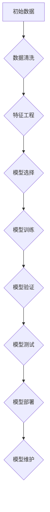
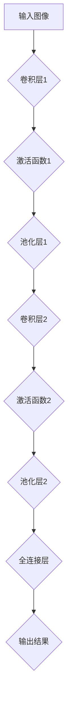
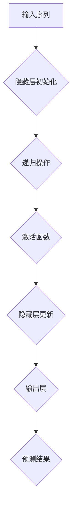
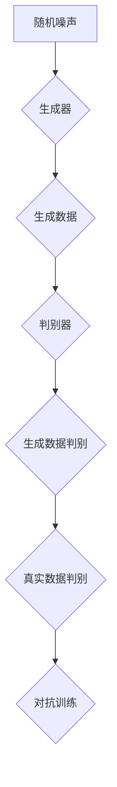

                 

### 文章标题

> 《AI研究的历史与发展》

关键词：人工智能、历史背景、机器学习、深度学习、跨学科融合、未来方向、实践与应用

摘要：本文旨在全面回顾和梳理人工智能（AI）的研究历史与发展脉络，从起源、早期探索、低谷与复兴，到当今的深度学习浪潮，深入探讨AI技术的核心概念、理论基础、最新进展以及跨学科融合。同时，文章还将展望AI研究的未来方向，并探讨其实践与应用，为读者提供一个全面、系统的AI研究全景图。

### 目录大纲

#### 第一部分：AI研究的历史背景

#### 第1章：人工智能的发展历程

##### 1.1 人工智能的起源

###### 1.1.1 人工智能的提出与发展

###### 1.1.2 早期的人工智能研究

##### 1.2 人工智能的第一次浪潮

###### 1.2.1 50年代至70年代

###### 1.2.2 第一波浪潮的主要成就

##### 1.3 人工智能的低谷与复兴

###### 1.3.1 80年代至90年代

###### 1.3.2 第二波浪潮的挑战与转变

#### 第2章：AI技术的关键概念与理论基础

##### 2.1 机器学习与深度学习

###### 2.1.1 机器学习的概念与分类

###### 2.1.2 深度学习的原理与框架

##### 2.2 人工智能的算法与模型

###### 2.2.1 经典算法回顾

###### 2.2.2 现代模型的发展

##### 2.3 人工智能的应用场景

###### 2.3.1 自然语言处理

###### 2.3.2 计算机视觉

###### 2.3.3 强化学习

#### 第二部分：AI研究的最新进展

#### 第3章：深度学习与神经网络的发展

##### 3.1 卷积神经网络（CNN）

###### 3.1.1 CNN的基本结构

###### 3.1.2 CNN在图像处理中的应用

##### 3.2 递归神经网络（RNN）

###### 3.2.1 RNN的基本原理

###### 3.2.2 LSTM与GRU模型

##### 3.3 生成对抗网络（GAN）

###### 3.3.1 GAN的原理与实现

###### 3.3.2 GAN的应用场景

#### 第4章：AI研究的跨学科融合

##### 4.1 AI与生物学

###### 4.1.1 人工智能与生物学的交汇点

###### 4.1.2 脑机接口与神经科学

##### 4.2 AI与经济学

###### 4.2.1 人工智能在经济学中的应用

###### 4.2.2 AI对经济体制的影响

##### 4.3 AI与哲学

###### 4.3.1 人工智能与伦理学

###### 4.3.2 人工智能与认知科学

#### 第5章：AI研究的未来方向

##### 5.1 量子计算与AI

###### 5.1.1 量子计算的基本概念

###### 5.1.2 量子计算在AI中的应用前景

##### 5.2 生物计算与AI

###### 5.2.1 生物计算的技术原理

###### 5.2.2 生物计算在AI领域的应用

##### 5.3 人工智能的社会影响

###### 5.3.1 AI对就业市场的影响

###### 5.3.2 AI与隐私保护

#### 第三部分：AI研究的实践与应用

#### 第6章：AI项目开发与实战

##### 6.1 AI项目的开发流程

###### 6.1.1 需求分析与模型设计

###### 6.1.2 数据采集与预处理

##### 6.2 AI模型的训练与优化

###### 6.2.1 模型训练策略

###### 6.2.2 模型调优技巧

##### 6.3 AI项目的部署与维护

###### 6.3.1 模型部署的环境配置

###### 6.3.2 持续集成与持续部署（CI/CD）

#### 第7章：AI在行业中的应用案例

##### 7.1 AI在医疗行业的应用

###### 7.1.1 医疗影像分析

###### 7.1.2 个性化医疗

##### 7.2 AI在金融行业的应用

###### 7.2.1 风险评估与信用评分

###### 7.2.2 量化交易

##### 7.3 AI在智能制造的应用

###### 7.3.1 智能生产线

###### 7.3.2 质量检测与故障预测

#### 附录

##### 附录A：AI研究工具与资源

###### A.1 常用的深度学习框架

###### A.2 数据集与开源代码

##### 附录B：核心算法原理与伪代码

###### B.1 卷积神经网络（CNN）的伪代码

###### B.2 递归神经网络（RNN）的伪代码

###### B.3 生成对抗网络（GAN）的伪代码

##### 附录C：数学模型与公式详解

###### C.1 卷积神经网络（CNN）的数学模型

###### C.2 递归神经网络（RNN）的数学模型

###### C.3 生成对抗网络（GAN）的数学模型

**附录D：Mermaid流程图**

- AI研究流程图
- CNN流程图
- RNN流程图
- GAN流程图

**附录E：项目实战代码示例**

- 医疗影像分析项目示例
- 量化交易项目示例
- 智能制造项目示例**附录F：开发环境与工具配置指南**

- 深度学习框架安装与配置
- 数据预处理工具安装与使用
- 模型训练与部署工具安装与使用**附录G：AI伦理与法规**

- AI伦理的基本原则
- 国际AI法规概述
- 我国AI法规与政策**附录H：参考文献**

- 人工智能相关书籍推荐
- 人工智能相关学术论文推荐
- 人工智能相关网站与社区推荐

### 第一部分：AI研究的历史背景

#### 第1章：人工智能的发展历程

##### 1.1 人工智能的起源

###### 1.1.1 人工智能的提出与发展

人工智能（Artificial Intelligence，简称AI）的概念最早由美国计算机科学家约翰·麦卡锡（John McCarthy）于1956年在达特茅斯会议上提出。这次会议被誉为人工智能领域的“诞生大会”，会上，麦卡锡和其他科学家们讨论了如何通过计算机模拟人类智能，以实现人类智能的某些功能。人工智能的目标是制造出能够思考、学习、解决问题和进行决策的智能机器。

自从1956年提出以来，人工智能经历了多次起伏，从一个看似遥不可及的梦想逐渐走向现实。早期的研究主要集中在符号主义和知识表示方面，试图通过编程方式模拟人类的逻辑思维过程。这一阶段的一些代表性工作包括普林斯顿大学教授赫伯特·西蒙（Herbert Simon）和艾伦·纽厄尔（Allen Newell）开发的逻辑推理程序“逻辑理论家”（Logic Theorist），以及斯坦福大学教授马文·明斯基（Marvin Minsky）和西摩·帕普特（Seymour Papert）开发的神经网络模型。

###### 1.1.2 早期的人工智能研究

早期的人工智能研究主要集中在规则系统、知识表示和推理算法等方面。这一时期，科学家们试图通过编程实现逻辑推理、问题求解和知识表示等功能。代表性的工作包括：

- **逻辑推理程序**：如“逻辑理论家”（Logic Theorist），通过模拟数学定理的证明过程，展示了计算机进行逻辑推理的可能性。

- **问题求解**：如“通用问题求解器”（General Problem Solver，GPS），能够通过搜索和回溯算法解决各种问题。

- **专家系统**：如“MYCIN系统”，该系统能够诊断和治疗细菌感染，展示了人工智能在医学领域的潜力。

这一阶段的进展主要集中在如何将人类知识转化为计算机可以处理的形式，以及如何设计能够自动推理和决策的算法。然而，由于硬件性能和算法的限制，早期的人工智能系统在处理复杂问题时效果不佳。

##### 1.2 人工智能的第一次浪潮

###### 1.2.1 50年代至70年代

人工智能的第一次浪潮发生在1956年到1974年之间，这一时期是人工智能研究的黄金时期。在这个阶段，人工智能领域取得了许多重要进展：

- **符号主义方法**：这一方法认为人工智能的核心是符号表示和逻辑推理，通过符号操作来模拟人类的思维过程。典型的代表包括“逻辑理论家”（Logic Theorist）和“通用问题求解器”（General Problem Solver）。

- **专家系统**：专家系统是一种模拟人类专家解决特定领域问题的计算机程序。典型的代表包括“Dendral”和“MYCIN”。Dendral是一个用于化学分析的专家系统，而MYCIN则是一个用于医学诊断的专家系统。

- **神经网络**：虽然神经网络的概念早在1940年代就已经提出，但在这一时期，神经网络开始受到广泛关注，一些初步的神经网络模型被开发出来，如感知机（Perceptron）。

这一时期的人工智能研究取得了显著成果，但也遇到了一些挑战。例如，专家系统的知识获取过程非常耗时且成本高昂，而神经网络由于算法的限制，难以处理非线性问题。

###### 1.2.2 第一波浪潮的主要成就

在人工智能的第一次浪潮中，以下几个方面的成就尤为重要：

- **知识表示**：通过符号逻辑和框架表示方法，人工智能系统能够表示和处理复杂的知识和信息。

- **问题求解与规划**：通过搜索算法和规划算法，人工智能系统能够解决复杂的计算问题，如棋类游戏、数学定理证明等。

- **专家系统**：专家系统在医学诊断、化学分析等领域取得了显著应用成果，展示了人工智能的实用价值。

尽管第一次浪潮取得了不少成就，但也暴露了人工智能研究的局限性。例如，知识获取困难、算法效率低、系统难以处理复杂任务等问题，这些问题为后来的人工智能研究提出了新的挑战。

##### 1.3 人工智能的低谷与复兴

###### 1.3.1 80年代至90年代

人工智能的第一次浪潮在70年代后期逐渐消退，进入了一个相对低潮的时期，这一时期被称为人工智能的低谷。造成这一现象的原因主要有以下几点：

- **硬件限制**：早期的计算机性能较低，难以支持复杂的人工智能应用。

- **算法瓶颈**：当时的算法在处理复杂任务时效果不佳，尤其是在处理图像识别、语音识别等感知任务时。

- **知识获取困难**：专家系统在知识获取方面遇到了巨大的挑战，知识获取过程耗时且成本高昂。

在这个低谷时期，人工智能研究受到了一定程度的忽视，许多科学家开始转向其他领域。然而，随着计算机技术的不断进步，人工智能研究逐渐迎来了新的机遇。

###### 1.3.2 第二波浪潮的挑战与转变

在80年代至90年代，人工智能研究经历了一系列重要的转变和挑战：

- **机器学习兴起**：随着计算机性能的提升，科学家们开始探索新的方法来训练和优化人工智能系统。机器学习作为一种新的方法，逐渐成为人工智能研究的主流。1986年，鲁斯·卡普兰尼克（Rumelhart、Hinton和Williams）提出了反向传播算法，这一算法使得多层神经网络的学习变得可行。

- **应用场景拓展**：人工智能开始应用于更多的领域，如自然语言处理、计算机视觉、机器人等。

- **硬件加速**：GPU的出现和普及为深度学习算法提供了强大的计算支持，使得人工智能研究取得了突破性进展。

第二波浪潮不仅带来了新的算法和工具，也推动了人工智能在各个领域的实际应用。尽管面临诸多挑战，这一时期的人工智能研究为后来的发展奠定了坚实的基础。

#### 第2章：AI技术的关键概念与理论基础

##### 2.1 机器学习与深度学习

###### 2.1.1 机器学习的概念与分类

机器学习（Machine Learning，ML）是一门研究如何让计算机从数据中学习并作出决策或预测的学科。机器学习的核心目标是让计算机通过训练数据学习到某种模式或规则，并在新的数据上实现泛化，从而自动执行特定任务。

根据学习方式，机器学习可以分为以下几类：

- **监督学习（Supervised Learning）**：监督学习是一种最常见的机器学习方法，它利用已标记的数据进行训练，以便在新的数据上进行预测。常见的监督学习算法包括线性回归、决策树、支持向量机（SVM）和神经网络等。

- **无监督学习（Unsupervised Learning）**：无监督学习不需要标记数据，其目标是发现数据中的结构和模式。常见的无监督学习算法包括聚类（如K-means、层次聚类）、降维（如主成分分析、t-SNE）和关联规则挖掘等。

- **半监督学习（Semi-Supervised Learning）**：半监督学习结合了监督学习和无监督学习，它利用少量标记数据和大量未标记数据来训练模型。

- **强化学习（Reinforcement Learning）**：强化学习是一种通过与环境交互来学习最优策略的方法。它通过奖励机制来引导模型在给定环境中做出最优决策。

###### 2.1.2 深度学习的原理与框架

深度学习（Deep Learning，DL）是机器学习的一个子领域，它模仿人脑的神经网络结构和工作机制。深度学习模型通过多层神经网络结构，逐层提取数据的特征，最终实现对数据的分类、回归或生成等任务。

深度学习的核心组成部分包括：

- **神经网络（Neural Network）**：神经网络是一种模拟生物神经元的计算模型，通过调整连接权重来学习数据的特征。

- **卷积神经网络（Convolutional Neural Network，CNN）**：CNN是一种专门用于处理图像数据的神经网络，通过卷积操作和池化操作提取图像特征。

- **循环神经网络（Recurrent Neural Network，RNN）**：RNN是一种能够处理序列数据的神经网络，通过循环结构保留序列信息。

- **生成对抗网络（Generative Adversarial Network，GAN）**：GAN是一种由生成器和判别器组成的对抗性神经网络，生成器试图生成逼真的数据，而判别器则试图区分生成数据和真实数据。

深度学习模型通常需要大量的数据和计算资源进行训练，但随着GPU的出现和深度学习框架的发展，深度学习在各个领域取得了显著的成果。

##### 2.2 人工智能的算法与模型

###### 2.2.1 经典算法回顾

经典的人工智能算法主要包括：

- **决策树（Decision Tree）**：决策树是一种基于树结构的算法，通过一系列条件判断来分类或回归数据。

- **支持向量机（Support Vector Machine，SVM）**：SVM是一种基于间隔最大化的分类算法，通过找到最佳的超平面来划分数据。

- **贝叶斯网络（Bayesian Network）**：贝叶斯网络是一种概率图模型，用于表示变量之间的依赖关系，并通过贝叶斯推理进行推理和预测。

- **规则系统（Rule-Based Systems）**：规则系统是一种基于专家知识的逻辑推理系统，通过一组条件-结果规则进行决策。

这些经典算法在人工智能发展早期发挥了重要作用，但随着深度学习的兴起，这些算法的应用场景逐渐受到限制。

###### 2.2.2 现代模型的发展

随着深度学习的兴起，人工智能领域出现了一系列现代模型，这些模型在图像识别、自然语言处理、语音识别等领域取得了显著成果。现代模型主要包括：

- **卷积神经网络（CNN）**：CNN是一种用于图像识别和处理的神经网络，通过卷积操作和池化操作提取图像特征。

- **递归神经网络（RNN）**：RNN是一种用于序列数据处理的神经网络，通过循环结构保留序列信息。

- **长短期记忆网络（LSTM）**：LSTM是一种改进的RNN，通过引入门控机制解决了RNN在序列学习中的梯度消失和梯度爆炸问题。

- **生成对抗网络（GAN）**：GAN是一种由生成器和判别器组成的对抗性神经网络，生成器试图生成逼真的数据，而判别器则试图区分生成数据和真实数据。

这些现代模型的出现，推动了人工智能在各个领域的应用，使得计算机能够更好地理解和处理复杂的数据。

##### 2.3 人工智能的应用场景

人工智能在各个领域都有广泛的应用，以下是一些典型应用场景：

- **自然语言处理（NLP）**：人工智能在自然语言处理领域取得了显著进展，包括文本分类、情感分析、机器翻译和语音识别等。

- **计算机视觉**：计算机视觉是人工智能的重要应用领域，包括图像识别、目标检测、图像分割和视频分析等。

- **强化学习**：强化学习在游戏、机器人控制、推荐系统等领域有广泛应用，通过学习与环境互动，实现最优决策。

- **医疗领域**：人工智能在医疗领域有广泛应用，包括疾病预测、诊断、治疗规划和个性化医疗等。

- **金融领域**：人工智能在金融领域用于风险评估、信用评分、量化交易和欺诈检测等。

这些应用场景展示了人工智能的广泛适用性和巨大潜力，随着技术的不断进步，人工智能将在更多领域发挥重要作用。

### 第二部分：AI研究的最新进展

#### 第3章：深度学习与神经网络的发展

##### 3.1 卷积神经网络（CNN）

###### 3.1.1 CNN的基本结构

卷积神经网络（Convolutional Neural Network，CNN）是一种专为处理图像数据设计的神经网络。其基本结构包括以下几个部分：

- **输入层（Input Layer）**：输入层接收图像数据，图像通常被表示为三维张量，其中维度分别为高度、宽度和通道数。

- **卷积层（Convolutional Layer）**：卷积层通过卷积操作提取图像的特征。卷积操作使用一组可训练的卷积核（Convolutional Kernel）在输入图像上滑动，生成特征图（Feature Map）。卷积层可以堆叠多层，以逐步提取更复杂的特征。

- **激活函数（Activation Function）**：激活函数用于引入非线性特性，常用的激活函数包括ReLU（Rectified Linear Unit）和Sigmoid。

- **池化层（Pooling Layer）**：池化层用于降低特征图的维度，减少参数数量，提高模型计算效率。常用的池化操作包括最大池化和平均池化。

- **全连接层（Fully Connected Layer）**：全连接层将卷积层提取的特征映射到输出类别。在全连接层之前，通常使用展平操作将特征图展平为一维向量。

- **输出层（Output Layer）**：输出层通常是一个全连接层，用于生成最终的分类结果或回归预测。

###### 3.1.2 CNN在图像处理中的应用

CNN在图像处理领域取得了显著成果，以下是一些典型的应用：

- **图像分类**：CNN可以用于对图像进行分类，如ImageNet图像分类挑战。典型的CNN模型包括VGG、ResNet和Inception等。

- **目标检测**：目标检测是一种在图像中识别和定位多个对象的技术。常见的CNN模型包括YOLO、SSD和Faster R-CNN等。

- **图像分割**：图像分割是将图像划分为不同区域的任务。常见的CNN模型包括FCN、U-Net和SegNet等。

- **图像增强与生成**：CNN可以用于图像增强和生成，如GANs和基于深度学习的图像修复等。

CNN的发展使得计算机能够更好地理解和处理图像数据，为计算机视觉领域带来了巨大的进步。

##### 3.2 递归神经网络（RNN）

###### 3.2.1 RNN的基本原理

递归神经网络（Recurrent Neural Network，RNN）是一种能够处理序列数据的神经网络。其基本原理是通过循环结构保留序列信息，从而处理长距离依赖问题。RNN的基本结构包括以下几个部分：

- **输入层（Input Layer）**：输入层接收序列数据，序列数据通常被表示为一维向量。

- **隐藏层（Hidden Layer）**：隐藏层包含一系列递归单元，每个单元都包含一个权重矩阵和一个偏置项。

- **输出层（Output Layer）**：输出层根据隐藏层的输出生成最终的预测结果。

RNN的工作原理如下：

1. **初始状态**：给定一个初始隐藏状态\(h_0\)。

2. **前向传播**：在时间步\(t\)，输入数据\(x_t\)通过权重矩阵\(W_x\)和偏置项\(b_x\)作用于隐藏状态\(h_{t-1}\)，得到新的隐藏状态\(h_t\)。

\[h_t = \sigma(W_xh_{t-1} + b_x + x_t)\]

3. **反向传播**：在训练过程中，通过反向传播算法计算损失函数的梯度，并更新权重矩阵和偏置项。

4. **输出**：输出层根据隐藏状态生成预测结果。

RNN在处理序列数据时存在一个关键问题，即梯度消失和梯度爆炸问题。为了解决这一问题，研究人员提出了长短期记忆网络（LSTM）和门控循环单元（GRU）等改进模型。

###### 3.2.2 LSTM与GRU模型

LSTM（Long Short-Term Memory）和GRU（Gated Recurrent Unit）是RNN的改进模型，它们通过引入门控机制解决了RNN在处理长序列数据时的梯度消失和梯度爆炸问题。

LSTM的基本结构包括：

- **遗忘门（Forget Gate）**：决定上一时刻的隐藏状态中有多少信息需要保留或丢弃。

- **输入门（Input Gate）**：决定新的输入中有多少信息需要更新隐藏状态。

- **输出门（Output Gate）**：决定隐藏状态中有多少信息需要传递到下一时刻。

LSTM的工作原理如下：

1. **遗忘门**：根据当前隐藏状态和输入，计算遗忘门的激活值，用于调整上一时刻的隐藏状态。

\[f_t = \sigma(W_f[h_{t-1}, x_t] + b_f)\]

2. **输入门**：根据当前隐藏状态和输入，计算输入门的激活值，用于更新隐藏状态。

\[i_t = \sigma(W_i[h_{t-1}, x_t] + b_i)\]

3. **新的候选隐藏状态**：根据当前隐藏状态和输入，计算新的候选隐藏状态。

\[C_t = \tanh(W_c[h_{t-1}, x_t] + b_c)\]

4. **新的隐藏状态**：结合遗忘门和输入门，更新隐藏状态。

\[h_t = (1 - f_t) \odot h_{t-1} + i_t \odot C_t\]

GRU是对LSTM的简化版，其基本结构包括：

- **更新门（Update Gate）**：决定上一时刻的隐藏状态中有多少信息需要保留或丢弃。

- **重置门（Reset Gate）**：决定新的输入中有多少信息需要更新隐藏状态。

GRU的工作原理如下：

1. **重置门**：根据当前隐藏状态和输入，计算重置门的激活值，用于更新隐藏状态。

\[r_t = \sigma(W_r[h_{t-1}, x_t] + b_r)\]

2. **新的候选隐藏状态**：根据重置门和当前输入，计算新的候选隐藏状态。

\[C_t = \tanh(W_c[r_t \odot h_{t-1} + (1 - r_t) \odot x_t] + b_c)\]

3. **新的隐藏状态**：结合更新门，更新隐藏状态。

\[h_t = (1 - z_t) \odot h_{t-1} + z_t \odot C_t\]

其中，\(z_t = \sigma(W_z[h_{t-1}, x_t] + b_z)\)。

LSTM和GRU通过引入门控机制，有效解决了RNN在处理长序列数据时的梯度消失和梯度爆炸问题，使得模型能够更好地处理长距离依赖。

##### 3.3 生成对抗网络（GAN）

###### 3.3.1 GAN的原理与实现

生成对抗网络（Generative Adversarial Network，GAN）由生成器（Generator）和判别器（Discriminator）两部分组成，它们相互对抗，共同训练。GAN的基本原理是通过生成器生成逼真的数据，并让判别器区分生成数据和真实数据，从而提高生成器的生成质量。

GAN的训练过程如下：

1. **初始化**：初始化生成器和判别器的参数。

2. **生成器训练**：生成器生成假数据，判别器对其进行分类。

3. **判别器训练**：判别器训练目标是最小化其分类错误率。

4. **生成器更新**：生成器更新参数，以生成更逼真的数据。

GAN的训练是一个动态的对抗过程，生成器和判别器交替训练，逐步提高生成数据的质量。

GAN的实现通常包括以下几个步骤：

1. **数据预处理**：对真实数据进行预处理，如归一化、数据增强等。

2. **生成器模型**：设计生成器模型，用于生成假数据。常见的生成器模型包括生成式模型（如生成式变分自编码器（Gan Variational Autoencoder，Gan VAE））和判别式模型（如深度卷积生成对抗网络（Deep Convolutional GAN，DcGAN））。

3. **判别器模型**：设计判别器模型，用于区分生成数据和真实数据。判别器通常是一个简单的全连接神经网络或卷积神经网络。

4. **损失函数**：GAN的损失函数由生成器的损失和判别器的损失组成。生成器的损失目标是最大化判别器对其生成数据的判断概率，即生成器希望判别器对生成数据的判断为假；判别器的损失目标是最大化其分类错误率。

\[L_G = -\log(D(G(z)))\]
\[L_D = -\log(D(x)) - \log(1 - D(G(z)))\]

其中，\(G(z)\)是生成器生成的假数据，\(x\)是真实数据，\(z\)是随机噪声。

GAN通过生成器和判别器的对抗训练，能够生成高质量的图像、视频和音频等数据，并在图像修复、风格迁移、图像生成等领域取得了显著成果。

##### 3.3.2 GAN的应用场景

GAN在图像生成、图像修复、风格迁移和图像超分辨率等任务中取得了显著应用成果：

- **图像生成**：GAN可以生成高质量的图像，如人脸生成、艺术风格生成等。

- **图像修复**：GAN可以用于图像去噪、图像修复和图像增强等任务，如老照片修复、图像超分辨率等。

- **风格迁移**：GAN可以将一种图像的风格应用到另一种图像上，如将普通照片转换为艺术风格画作。

- **图像超分辨率**：GAN可以用于提高图像的分辨率，使图像更加清晰。

GAN的应用场景不断扩展，其生成能力和灵活性使其在图像处理、计算机视觉和艺术创作等领域具有巨大潜力。

#### 第4章：AI研究的跨学科融合

##### 4.1 AI与生物学

###### 4.1.1 人工智能与生物学的交汇点

人工智能（AI）与生物学（Biology）的交汇点主要体现在以下几个方面：

- **脑机接口**：脑机接口（Brain-Computer Interface，BCI）是一种直接连接人脑与外部设备的技术。通过AI算法分析脑电信号，BCI可以实现人类与计算机的直接交互，为残障人士提供新的沟通和移动方式。

- **机器学习与基因组学**：基因组学涉及对生物体基因组的测序和分析，AI在基因组学中发挥了重要作用。通过机器学习方法，AI可以帮助科学家识别基因与疾病之间的关联，预测疾病风险，从而推动个性化医疗的发展。

- **计算生物学**：计算生物学是利用计算机和算法研究生物学问题的学科。AI算法在计算生物学中用于蛋白质结构预测、生物网络分析、分子模拟等任务，为生物科学研究提供了强大的工具。

- **生物启发算法**：生物启发算法，如遗传算法、蚁群算法等，受到生物进化、生物群体行为的启发，用于优化问题和决策问题。这些算法在生物信息学、物流调度等领域有广泛应用。

###### 4.1.2 脑机接口与神经科学

脑机接口（BCI）是一种将人脑活动转换为电信号的装置，通过AI算法分析这些信号，实现对计算机或其他设备的控制。脑机接口的研究涉及到多个学科，包括神经科学、生理学、心理学和计算机科学。

脑机接口的基本原理如下：

1. **信号采集**：通过电极或传感器采集脑电信号（如EEG）、肌电信号（如EMG）或脑磁信号（如MEG）。

2. **信号处理**：使用AI算法对采集到的信号进行预处理，如滤波、去噪和特征提取。

3. **特征编码**：将预处理后的信号转换为编码信号，如时间序列编码、空间编码或频率编码。

4. **解码与控制**：使用AI算法解码编码信号，生成控制信号，实现对计算机或其他设备的控制。

脑机接口在神经科学领域有重要应用，如：

- **康复治疗**：脑机接口可以帮助残障人士恢复运动功能，如利用脑机接口控制轮椅或假肢。

- **辅助沟通**：脑机接口可以帮助语言障碍者通过脑电信号实现文字或语音输出。

- **脑科学研究**：脑机接口可以用于研究大脑功能，如通过解码脑电信号分析大脑对不同刺激的反应。

脑机接口与神经科学的融合推动了人工智能和生物医学的交叉发展，为临床应用和科学研究提供了新的方法和工具。

##### 4.2 AI与经济学

###### 4.2.1 人工智能在经济学中的应用

人工智能（AI）在经济学中的应用日益广泛，为经济学研究带来了新的方法和工具。以下是一些AI在经济学中的典型应用：

- **金融市场预测**：AI算法可以分析大量历史数据，预测金融市场的走势。例如，使用机器学习模型分析股票市场数据，预测股票价格走势或评估投资风险。

- **风险评估与信用评分**：AI可以帮助金融机构进行风险评估和信用评分。通过分析借款人的历史数据、社会行为和信用记录，AI算法可以更准确地评估借款人的信用风险。

- **量化交易**：量化交易是一种利用数学模型和算法进行高频交易的方法。AI算法可以分析市场数据，发现交易机会，执行复杂的交易策略。

- **宏观经济预测**：AI可以帮助经济学家分析宏观经济数据，预测经济增长、通货膨胀等经济指标。

AI在经济学中的应用不仅提高了预测和决策的准确性，还推动了经济学研究方法的创新。

###### 4.2.2 AI对经济体制的影响

人工智能（AI）对经济体制的影响是深远且多方面的。以下是一些AI对经济体制的影响：

- **自动化与就业**：随着AI技术的发展，越来越多的工作可能会被自动化取代，导致就业结构的变化。一方面，AI可以提高生产效率，创造新的就业机会；另一方面，一些传统岗位可能会消失，需要劳动者进行技能升级和转型。

- **收入分配**：AI技术的普及可能会加剧收入分配的不平等。一方面，掌握AI技术的企业可以获得更多利润，提高高技能劳动者的收入；另一方面，低技能劳动者可能会面临失业或收入下降的风险。

- **消费者行为**：AI可以更好地理解消费者行为，提供个性化的产品和服务。例如，通过数据分析，AI可以帮助企业优化定价策略，提高客户满意度。

- **产业升级与转型**：AI技术推动了传统产业的升级和转型，如智能制造、智能医疗等。这些变化将促进经济结构的优化，提高整体经济效益。

AI对经济体制的影响是一个复杂且动态的过程，需要政策制定者和企业家共同努力，以实现可持续发展。

##### 4.3 AI与哲学

###### 4.3.1 人工智能与伦理学

人工智能（AI）的发展引发了一系列伦理学问题，如隐私、安全、公平和责任等。以下是一些AI与伦理学相关的问题：

- **隐私**：随着AI技术的发展，数据处理和存储的规模不断扩大，隐私问题变得日益突出。例如，人脸识别、生物识别等技术可能侵犯个人隐私。

- **安全**：AI系统可能面临安全威胁，如被恶意攻击者利用，导致严重后果。例如，自动驾驶汽车、智能电网等系统可能面临安全风险。

- **公平**：AI系统在决策过程中可能会存在偏见，导致不公平的结果。例如，基于历史数据的决策系统可能对某些群体产生歧视性影响。

- **责任**：当AI系统发生错误或造成损害时，如何确定责任归属是一个复杂的问题。例如，自动驾驶汽车发生事故时，如何界定制造商、车主和程序员的职责？

为了解决这些问题，需要制定相应的伦理规范和法律制度，确保AI技术的健康、可持续发展。

###### 4.3.2 人工智能与认知科学

人工智能（AI）与认知科学（Cognitive Science）的交叉研究为理解人类智能和设计更智能的人工智能系统提供了新的视角。以下是一些AI与认知科学相关的研究方向：

- **认知建模**：认知科学通过建模人类认知过程，研究记忆、感知、注意、语言等认知功能。AI可以从这些模型中获得灵感，设计出更有效的算法和系统。

- **神经网络与大脑**：认知科学研究大脑的结构和功能，AI则通过模拟大脑神经元的工作原理，设计出神经网络。这些研究有助于理解大脑的工作机制，并优化神经网络模型。

- **人机交互**：认知科学研究人类如何与外界交互，AI则通过人机交互技术，实现人与计算机的有效互动。这些研究推动了人机交互技术的发展，提高了用户体验。

- **机器学习与学习理论**：认知科学研究学习过程中的认知机制，AI则通过机器学习方法，模拟和优化学习过程。这些研究有助于设计更有效的学习算法，提高学习效率。

AI与认知科学的交叉研究不仅加深了我们对人类智能的理解，还为人工智能的发展提供了新的理论基础和技术支持。

#### 第5章：AI研究的未来方向

##### 5.1 量子计算与AI

###### 5.1.1 量子计算的基本概念

量子计算（Quantum Computing）是一种基于量子力学原理的新型计算模式，与传统计算机不同，量子计算机利用量子位（qubit）进行信息处理。量子位具有叠加性和纠缠性，使得量子计算机能够在某些特定问题上实现超越传统计算机的计算能力。

量子计算的基本概念包括：

- **量子位（Qubit）**：量子位是量子计算机的基本单元，类似于传统计算机中的比特。量子位可以同时处于0和1的叠加状态，这种叠加性使得量子计算机能够同时处理大量信息。

- **叠加态（Superposition）**：量子位可以处于0和1的叠加态，表示为\( \alpha|0\rangle + \beta|1\rangle \)，其中\( \alpha \)和\( \beta \)是复数系数。

- **纠缠态（Entanglement）**：当两个或多个量子位处于纠缠态时，它们的量子态会相互关联，一个量子位的状态会直接影响另一个量子位的状态。

- **量子门（Quantum Gate）**：量子门是量子计算的基本操作，类似于传统计算机中的逻辑门。量子门通过线性变换作用于量子位，改变其状态。

量子计算的基本原理使其在解决某些复杂问题上具有显著优势，如量子模拟、优化问题和密码破解等。

###### 5.1.2 量子计算在AI中的应用前景

量子计算在人工智能（AI）领域具有广泛的应用前景，以下是一些潜在的应用：

- **优化问题**：量子计算能够高效地解决复杂的优化问题，如物流调度、资源分配和金融投资等。传统的优化算法在这些问题上可能需要巨大的计算资源，而量子计算可以在较短时间内找到最优解。

- **机器学习**：量子计算可以加速机器学习算法的训练过程，提高模型的预测能力。例如，量子计算可以用于加速深度学习模型的训练，降低训练时间，提高模型性能。

- **数据加密与安全**：量子计算在数据加密和安全领域具有重要作用。传统的加密算法可能受到量子计算机的攻击，而量子计算可以提供更安全的加密方法，保护数据的安全性。

- **图像识别与计算机视觉**：量子计算可以加速图像识别和计算机视觉算法的处理速度，提高识别准确率。例如，量子计算可以用于加速卷积神经网络（CNN）在图像处理中的应用。

量子计算与AI的结合有望推动人工智能领域的发展，为解决复杂问题提供新的方法和工具。

##### 5.2 生物计算与AI

###### 5.2.1 生物计算的技术原理

生物计算（Bio Computing）是一种利用生物体系进行信息处理的技术，其基本原理基于生物分子和生物网络。生物计算涉及多个学科，包括生物学、化学、物理学和信息科学。

生物计算的技术原理包括：

- **DNA计算**：DNA计算利用DNA分子的特性和生物反应过程进行信息处理。DNA具有高度的信息存储能力，可以通过特定的DNA操作实现计算任务。

- **RNA计算**：RNA计算利用RNA分子的特性和生物反应过程进行信息处理。RNA计算可以模拟逻辑电路、执行计算任务等。

- **蛋白质计算**：蛋白质计算利用蛋白质分子的特性和生物反应过程进行信息处理。蛋白质计算可以模拟神经网络、执行复杂计算任务等。

生物计算通过利用生物分子的特性和生物反应过程，实现了信息处理的新模式。

###### 5.2.2 生物计算在AI领域的应用

生物计算在人工智能（AI）领域具有广泛的应用前景，以下是一些潜在的应用：

- **数据存储与处理**：生物计算可以用于大数据存储和处理，利用DNA计算和RNA计算的高效性，实现大规模数据的存储和处理。

- **机器学习优化**：生物计算可以用于优化机器学习算法，通过模拟生物神经网络，加速机器学习模型的训练过程，提高模型的预测能力。

- **生物信息学**：生物计算在生物信息学领域有广泛应用，如基因序列分析、蛋白质结构预测和药物设计等。

- **智能药物发现**：生物计算可以用于智能药物发现，通过模拟生物反应过程，加速药物筛选和开发。

生物计算与AI的结合有望推动人工智能领域的发展，为解决复杂问题提供新的方法和工具。

##### 5.3 人工智能的社会影响

###### 5.3.1 AI对就业市场的影响

人工智能（AI）的发展对就业市场产生了深远的影响。以下是一些主要影响：

- **自动化与就业减少**：AI技术的普及导致许多传统工作被自动化取代，如制造业、客服和交通运输等。这可能导致就业机会的减少，对劳动力市场造成冲击。

- **技能需求变化**：随着AI技术的发展，对高技能劳动力的需求增加，特别是对数据科学家、AI工程师和算法工程师等专业人才的需求。这促使劳动者进行技能升级和转型。

- **创造新就业机会**：AI技术也创造了新的就业机会，如AI开发、数据标注、AI伦理和AI法规等。这些新岗位需要具备特定的技能和知识，为劳动者提供了新的发展空间。

- **教育与培训**：AI技术的发展要求教育体系进行相应调整，培养具备AI相关技能的人才。同时，在线教育、远程教育和终身教育等新形式的出现，为劳动者提供了更多的学习和成长机会。

AI对就业市场的影响是复杂且多维的，需要政府、企业和劳动者共同努力，以实现就业市场的平稳过渡。

###### 5.3.2 AI与隐私保护

人工智能（AI）的发展在带来便利和创新的同时，也对隐私保护提出了新的挑战。以下是一些主要问题：

- **数据收集与处理**：AI系统通常需要大量数据进行训练和优化，这可能导致个人隐私数据的泄露和滥用。例如，人脸识别、生物识别和位置追踪等技术可能侵犯个人隐私。

- **算法偏见**：AI系统在决策过程中可能存在偏见，导致不公平的结果。例如，基于历史数据的决策系统可能对某些群体产生歧视性影响，损害其隐私权益。

- **数据共享与交易**：AI系统产生的数据具有很高的价值，可能会被滥用或交易。例如，个人数据可能被未经授权的第三方获取和利用，导致隐私泄露。

为了应对这些挑战，需要制定相应的隐私保护政策和法规，确保AI技术的发展不会侵犯个人隐私。同时，加强数据安全和管理，提高公众的隐私保护意识，也是关键。

#### 第三部分：AI研究的实践与应用

#### 第6章：AI项目开发与实战

##### 6.1 AI项目的开发流程

AI项目的开发是一个复杂而系统化的过程，涉及多个阶段和步骤。以下是一个典型的AI项目开发流程：

###### 6.1.1 需求分析与模型设计

1. **明确项目目标**：在项目启动阶段，首先要明确项目目标，包括预测、分类、推荐等。

2. **收集数据**：根据项目目标，收集相关的数据，数据来源可以是公开数据集、企业内部数据或第三方数据。

3. **数据预处理**：对收集到的数据进行清洗、去重、归一化等预处理操作，确保数据的质量和一致性。

4. **特征工程**：从原始数据中提取特征，构建特征向量，以供模型训练使用。

5. **模型选择**：根据项目目标和数据特点，选择合适的机器学习模型，如线性回归、决策树、神经网络等。

6. **模型设计**：设计模型的架构和参数，包括层数、节点数、激活函数、损失函数等。

###### 6.1.2 数据采集与预处理

1. **数据采集**：使用爬虫、API接口、问卷调查等方式收集数据。

2. **数据清洗**：处理缺失值、异常值和重复值，确保数据质量。

3. **数据归一化**：对数值特征进行归一化处理，如标准化或最小-最大缩放。

4. **特征选择**：使用特征选择算法（如过滤式、包装式、嵌入式）选择重要的特征，减少特征维度。

5. **数据分割**：将数据集分割为训练集、验证集和测试集，用于模型训练、验证和测试。

###### 6.1.3 模型训练与优化

1. **模型训练**：使用训练集数据对模型进行训练，调整模型参数，使其达到较好的性能。

2. **模型验证**：使用验证集数据评估模型性能，调整模型参数，以提高模型泛化能力。

3. **模型测试**：使用测试集数据评估模型最终性能，确保模型能够在未知数据上取得良好的效果。

4. **超参数调优**：使用网格搜索、随机搜索等超参数调优方法，找到最优超参数组合。

5. **模型集成**：使用集成学习技术（如Bagging、Boosting）组合多个模型，提高模型性能。

###### 6.1.4 模型部署与维护

1. **模型部署**：将训练好的模型部署到生产环境中，提供实时预测或分类服务。

2. **模型监控**：监控模型性能，及时发现异常情况，如过拟合、性能下降等。

3. **模型更新**：根据业务需求和模型性能，定期更新模型，以提高预测准确性。

4. **模型维护**：处理模型异常情况，修复bug，确保模型稳定运行。

通过上述开发流程，可以确保AI项目从需求分析到模型部署的顺利进行，为实际应用提供有效的技术支持。

##### 6.2 AI模型的训练与优化

AI模型的训练与优化是AI项目开发中至关重要的一环。以下是一些关键的步骤和技巧：

###### 6.2.1 模型训练策略

1. **数据预处理**：在训练模型之前，对数据进行预处理，包括数据清洗、归一化和特征提取等。

2. **批次大小（Batch Size）**：选择合适的批次大小，平衡计算资源和模型收敛速度。较小的批次大小有助于减少方差，较大的批次大小有助于减少偏差。

3. **学习率（Learning Rate）**：设置合适的学习率，保证模型能够快速收敛。常用的学习率调整方法包括固定学习率、学习率衰减和自适应学习率等。

4. **优化算法（Optimizer）**：选择合适的优化算法，如随机梯度下降（SGD）、Adam、RMSprop等。不同的优化算法对模型收敛速度和稳定性有不同的影响。

5. **正则化（Regularization）**：使用正则化技术（如L1、L2正则化）防止模型过拟合，提高泛化能力。

6. **数据增强（Data Augmentation）**：通过图像旋转、缩放、裁剪等操作增加数据多样性，提高模型对未知数据的适应性。

###### 6.2.2 模型调优技巧

1. **交叉验证（Cross-Validation）**：使用交叉验证方法评估模型性能，选择最优模型参数。

2. **网格搜索（Grid Search）**：通过遍历预定义的超参数组合，找到最优超参数组合。

3. **随机搜索（Random Search）**：随机选择超参数组合，寻找最优超参数组合。

4. **贝叶斯优化（Bayesian Optimization）**：使用贝叶斯优化方法，根据历史数据选择下一个超参数组合，提高调优效率。

5. **集成学习（Ensemble Learning）**：使用集成学习方法，如Bagging、Boosting和Stacking，组合多个模型，提高模型性能。

6. **模型压缩（Model Compression）**：通过模型压缩技术（如深度剪枝、量化、知识蒸馏等）减小模型大小，提高模型运行效率。

通过上述训练与优化策略，可以确保AI模型在训练过程中达到良好的性能，并在实际应用中取得良好的效果。

##### 6.3 AI项目的部署与维护

AI项目的部署与维护是确保模型在实际环境中稳定运行的关键环节。以下是一些关键的步骤和注意事项：

###### 6.3.1 模型部署的环境配置

1. **硬件配置**：根据模型大小和计算需求，选择合适的硬件配置，如CPU、GPU等。

2. **操作系统与软件环境**：配置适合AI模型的操作系统和软件环境，如Ubuntu、Windows Server、TensorFlow等。

3. **容器化与虚拟化**：使用容器化技术（如Docker）或虚拟化技术（如KVM）确保模型在不同环境中的一致性和可移植性。

4. **持续集成与持续部署（CI/CD）**：使用CI/CD工具（如Jenkins、GitLab CI）实现自动化部署，确保模型更新和版本控制。

###### 6.3.2 持续集成与持续部署（CI/CD）

1. **代码审查与测试**：在部署前对代码进行审查和测试，确保模型代码的质量和可靠性。

2. **自动化测试**：编写自动化测试脚本，对部署后的模型进行性能测试和功能测试，确保模型正常运行。

3. **监控与报警**：使用监控工具（如Prometheus、Grafana）对模型运行状态进行监控，及时发现并报警异常情况。

4. **日志记录与调试**：记录模型运行日志，便于调试和故障排查。

5. **弹性扩展与负载均衡**：根据业务需求，实现模型的弹性扩展和负载均衡，确保模型在高并发情况下稳定运行。

通过上述部署与维护策略，可以确保AI模型在实际应用中稳定、高效地运行，满足业务需求。

#### 第7章：AI在行业中的应用案例

##### 7.1 AI在医疗行业的应用

人工智能（AI）在医疗行业中的应用日益广泛，为医疗诊断、治疗、管理等方面带来了创新和变革。以下是一些典型的AI应用案例：

###### 7.1.1 医疗影像分析

医疗影像分析是AI在医疗领域的重要应用之一。通过深度学习算法，AI能够对医学影像（如X光片、CT扫描、MRI）进行自动分析，提高诊断准确性和效率。

- **图像分割**：AI可以自动分割医学影像中的关键结构，如肿瘤、心脏等。例如，卷积神经网络（CNN）可以用于分割肺结节，帮助医生更早发现肺癌。

- **病灶检测**：AI可以检测医学影像中的病灶，如乳腺癌、前列腺癌等。通过结合多种特征和模型，AI能够提高病灶检测的精度和速度。

- **疾病预测**：AI可以通过分析医学影像数据，预测疾病的发展趋势和风险。例如，通过分析X光片，AI可以预测患者是否患有骨密度降低或骨折。

###### 7.1.2 个性化医疗

个性化医疗是近年来医疗领域的一个重要研究方向，AI在个性化医疗中发挥着关键作用。

- **药物研发**：AI可以加速药物研发过程，通过分析大量生物数据和临床试验数据，AI可以帮助研究人员筛选潜在药物，优化治疗方案。

- **个性化诊断**：AI可以根据患者的基因信息、病史和症状，为其制定个性化的诊断和治疗方案。例如，AI可以根据患者的基因组数据，预测其对某种药物的敏感性，从而优化药物剂量和治疗方案。

- **个性化康复**：AI可以辅助制定个性化的康复计划，根据患者的身体条件和康复需求，提供个性化的康复建议和训练方案。

##### 7.2 AI在金融行业的应用

人工智能（AI）在金融行业中的应用也越来越广泛，为风险管理、客户服务、交易策略等方面带来了新的机遇。

###### 7.2.1 风险评估与信用评分

AI在风险评估与信用评分方面具有显著优势，能够提高预测准确性和效率。

- **信用评分**：AI可以分析大量数据（如交易记录、信用历史、社交网络信息等），对借款人的信用风险进行评估，提供更准确的信用评分。

- **欺诈检测**：AI可以通过分析交易数据和行为特征，识别潜在的欺诈行为，提高欺诈检测的准确率和效率。

- **市场预测**：AI可以分析市场数据（如股票价格、交易量、经济指标等），预测市场走势和投资机会，为投资者提供决策支持。

###### 7.2.2 量化交易

量化交易是一种利用数学模型和算法进行高频交易的方法，AI在量化交易中发挥着关键作用。

- **交易策略**：AI可以通过分析历史交易数据和市场趋势，设计有效的交易策略，实现自动化交易。

- **风险控制**：AI可以实时监控市场风险，优化交易策略，确保交易风险在可承受范围内。

- **交易执行**：AI可以自动化交易执行，提高交易效率和准确性，降低交易成本。

##### 7.3 AI在智能制造的应用

人工智能（AI）在智能制造领域的应用日益深入，为提高生产效率、降低成本、提升产品质量等方面带来了新的解决方案。

###### 7.3.1 智能生产线

智能生产线是智能制造的核心，AI在智能生产线中发挥着重要作用。

- **生产调度**：AI可以优化生产调度计划，提高生产效率。通过分析生产数据和历史记录，AI可以制定最优的生产计划，降低生产成本。

- **质量控制**：AI可以实时监测生产过程中的产品质量，识别潜在的缺陷。通过图像识别、传感器数据等技术，AI可以自动检测和分类产品，提高产品质量。

- **设备维护**：AI可以预测设备故障，提前进行维护和保养，降低设备故障率和停机时间。

###### 7.3.2 质量检测与故障预测

质量检测与故障预测是智能制造中的重要环节，AI在质量检测与故障预测中具有显著优势。

- **质量检测**：AI可以通过图像识别、传感器数据等技术，对生产的产品进行质量检测，确保产品符合质量标准。

- **故障预测**：AI可以通过分析设备运行数据和历史记录，预测设备的故障风险，提前进行维护和保养，降低故障率和停机时间。

- **过程优化**：AI可以通过分析生产过程中的数据，优化生产参数和工艺流程，提高生产效率和产品质量。

这些应用案例展示了AI在各个行业的广泛应用和巨大潜力，随着AI技术的不断发展，未来AI将在更多领域发挥重要作用。

#### 附录A：AI研究工具与资源

##### A.1 常用的深度学习框架

深度学习框架是开发深度学习模型的重要工具，以下是一些常用的深度学习框架：

1. **TensorFlow**：TensorFlow是由谷歌开发的开源深度学习框架，广泛应用于各种深度学习任务，包括图像识别、自然语言处理和强化学习等。

2. **PyTorch**：PyTorch是由Facebook开发的开源深度学习框架，以其灵活性和动态计算图而受到广泛关注，适用于研究和个人项目。

3. **Keras**：Keras是一个高层次的深度学习API，可以在TensorFlow和Theano等框架上运行。Keras提供了简单、易于使用的接口，适合快速实验和原型开发。

4. **MXNet**：MXNet是由亚马逊开发的开源深度学习框架，支持多种编程语言，具有良好的性能和灵活性。

5. **Caffe**：Caffe是一个由伯克利大学开发的深度学习框架，专注于图像识别任务，具有高效的卷积神经网络实现。

##### A.2 数据集与开源代码

数据集和开源代码是进行深度学习研究和项目开发的重要资源，以下是一些常用的数据集和开源代码：

1. **ImageNet**：ImageNet是一个广泛使用的图像分类数据集，包含数百万张标签图像，用于评估图像识别算法的性能。

2. **CIFAR-10/CIFAR-100**：CIFAR-10和CIFAR-100是小型图像分类数据集，包含60,000张32x32彩色图像，分别包含10个和100个类别。

3. **MNIST**：MNIST是一个手写数字数据集，包含70,000张灰度图像，每张图像都是一个手写的数字。

4. **TIMIT**：TIMIT是一个语音识别数据集，包含630个说话人的6,452段语音录音。

5. **CoIL**：CoIL是一个在线学习数据集，包含多个类别的小型图像数据集，用于研究在线学习算法的性能。

6. **开源代码**：GitHub等平台上有大量的深度学习开源代码，包括预训练模型、实用工具和实验代码，方便研究人员进行复现和扩展。

附录A提供了深度学习研究和项目开发所需的工具和资源，有助于提高研究效率和代码质量。

#### 附录B：核心算法原理与伪代码

##### B.1 卷积神经网络（CNN）的伪代码

卷积神经网络（CNN）是处理图像数据的一种有效模型，其基本原理是通过卷积操作提取图像特征，然后进行分类。以下是一个简单的CNN模型的伪代码：

```python
# 输入图像数据
input_image = ...

# 初始化参数
W1, b1 = initialize_weights()
W2, b2 = initialize_weights()
...
Wn, bn = initialize_weights()

# 前向传播
def forward_propagation(image):
    # 第一个卷积层
    conv1_output = conv2d(image, W1) + b1
    relu1_output = activate(conv1_output, 'relu')

    # 第一个池化层
    pool1_output = max_pool(relu1_output, pool_size)

    # 后续卷积和池化层
    ...
    convn_output = conv2d(pooln-1, Wn) + bn
    relu_output = activate(convn_output, 'relu')

    # 最后的池化层
    pooln_output = max_pool(relu_output, pool_size)

    # 全连接层
    flattened = flatten(pooln_output)
    output = fully_connected(flattened, output_size)

    # 输出
    return output

# 训练模型
for epoch in range(num_epochs):
    for image, label in dataset:
        output = forward_propagation(image)
        loss = compute_loss(output, label)

        # 反向传播
        d_output = backward_propagation(output, label)

        # 更新参数
        Wn, bn = update_weights(Wn, bn, d_output)

# 预测
def predict(image):
    output = forward_propagation(image)
    prediction = softmax(output)
    return prediction
```

此伪代码展示了CNN模型的基本结构，包括卷积层、激活函数、池化层和全连接层。通过前向传播和反向传播，模型可以学习到图像特征，从而实现图像分类。

##### B.2 递归神经网络（RNN）的伪代码

递归神经网络（RNN）是一种用于处理序列数据的神经网络，其基本原理是通过递归结构保留序列信息。以下是一个简单的RNN模型的伪代码：

```python
# 输入序列数据
input_sequence = ...

# 初始化参数
Wxh, Whh, bh = initialize_weights()

# 前向传播
def forward_propagation(sequence):
    hidden_state = initialize_hidden_state()

    for t in range(sequence_length):
        input = sequence[t]
        hidden_state = activate(RNN(input, hidden_state, Wxh, Whh, bh))

    # 输出
    return hidden_state

# 训练模型
for epoch in range(num_epochs):
    for sequence, label in dataset:
        hidden_state = forward_propagation(sequence)
        loss = compute_loss(hidden_state, label)

        # 反向传播
        d_hidden_state = backward_propagation(hidden_state, label)

        # 更新参数
        Wxh, Whh, bh = update_weights(Wxh, Whh, bh, d_hidden_state)

# 预测
def predict(sequence):
    hidden_state = forward_propagation(sequence)
    prediction = softmax(hidden_state)
    return prediction
```

此伪代码展示了RNN模型的基本结构，包括输入层、隐藏层和输出层。通过递归结构，RNN可以处理序列数据，从而实现序列建模和预测。

##### B.3 生成对抗网络（GAN）的伪代码

生成对抗网络（GAN）是一种由生成器和判别器组成的对抗性神经网络，其基本原理是通过生成器和判别器的对抗训练，生成高质量的数据。以下是一个简单的GAN模型的伪代码：

```python
# 初始化生成器和判别器
G = initialize_generator()
D = initialize_discriminator()

# 前向传播
def forward_propagation(real_data):
    fake_data = G(real_data)
    D_output = D(fake_data)

# 训练生成器和判别器
for epoch in range(num_epochs):
    for real_data in dataset:
        # 训练判别器
        forward_propagation(real_data)
        D_loss = compute_loss(D_output, real_data)

        # 训练生成器
        fake_data = G(real_data)
        D_output = D(fake_data)
        G_loss = compute_loss(D_output, fake_data)

        # 更新参数
        D_params = update_params(D, D_loss)
        G_params = update_params(G, G_loss)

# 预测
def predict():
    fake_data = G(real_data)
    return fake_data
```

此伪代码展示了GAN模型的基本结构，包括生成器和判别器。通过对抗训练，生成器尝试生成逼真的数据，而判别器则尝试区分生成数据和真实数据，从而提高生成数据的质量。

#### 附录C：数学模型与公式详解

##### C.1 卷积神经网络（CNN）的数学模型

卷积神经网络（CNN）是一种用于图像识别和处理的神经网络，其基本数学模型包括卷积操作、激活函数、池化和全连接层。以下是CNN的主要数学模型：

###### 卷积操作

卷积操作是CNN的核心，其数学公式如下：

\[ (f * g)(x) = \sum_{i=0}^{n} f(i) \cdot g(x - i) \]

其中，\( f \)和\( g \)是两个函数，\( x \)是输入变量，\( n \)是函数\( f \)的定义域。

在CNN中，卷积操作通常表示为：

\[ \text{Conv}(I, K) = \sum_{i=0}^{n} I(i) \cdot K(x - i) + b \]

其中，\( I \)是输入图像，\( K \)是卷积核（或过滤器），\( b \)是偏置项。

###### 激活函数

激活函数用于引入非线性特性，常用的激活函数包括ReLU（Rectified Linear Unit）和Sigmoid。以下是这些激活函数的数学公式：

- **ReLU（ReLU激活函数）**

\[ \text{ReLU}(x) = \max(0, x) \]

- **Sigmoid（Sigmoid激活函数）**

\[ \text{Sigmoid}(x) = \frac{1}{1 + e^{-x}} \]

###### 池化操作

池化操作用于降低特征图的维度，常用的池化操作包括最大池化和平均池化。以下是这些池化操作的数学公式：

- **最大池化**

\[ \text{Max Pool}(x) = \max(x_1, x_2, ..., x_n) \]

其中，\( x_1, x_2, ..., x_n \)是池化区域内的元素。

- **平均池化**

\[ \text{Avg Pool}(x) = \frac{1}{n} \sum_{i=1}^{n} x_i \]

其中，\( x_1, x_2, ..., x_n \)是池化区域内的元素，\( n \)是池化区域的尺寸。

###### 全连接层

全连接层是一种将卷积层提取的特征映射到输出类别的层，其数学模型如下：

\[ \text{FC}(x) = \sum_{i=1}^{m} w_i \cdot x_i + b \]

其中，\( x \)是输入特征向量，\( w_i \)是权重，\( b \)是偏置项，\( m \)是输出维度。

##### C.2 递归神经网络（RNN）的数学模型

递归神经网络（RNN）是一种用于处理序列数据的神经网络，其基本数学模型包括输入层、隐藏层和输出层。以下是RNN的主要数学模型：

###### 输入层

输入层接收序列数据，其数学模型如下：

\[ x_t = \text{Input}(x) \]

其中，\( x_t \)是输入序列的第\( t \)个元素，\( \text{Input}(x) \)是将输入序列转换为输入向量的函数。

###### 隐藏层

隐藏层包含一系列递归单元，每个单元都包含一个权重矩阵和一个偏置项，其数学模型如下：

\[ h_t = \text{ReLU}(\text{RNN}(x_t, h_{t-1})) \]

其中，\( h_t \)是隐藏状态的输出，\( \text{RNN}(x_t, h_{t-1}) \)是递归神经网络，包括输入门、遗忘门和输出门等部分。

###### 输出层

输出层根据隐藏层的状态生成预测结果，其数学模型如下：

\[ y_t = \text{Output}(h_t) \]

其中，\( y_t \)是输出序列的第\( t \)个元素，\( \text{Output}(h_t) \)是将隐藏状态转换为输出向量的函数。

##### C.3 生成对抗网络（GAN）的数学模型

生成对抗网络（GAN）是一种由生成器和判别器组成的对抗性神经网络，其基本数学模型包括生成器、判别器和损失函数。以下是GAN的主要数学模型：

###### 生成器

生成器的目标是生成逼真的数据，其数学模型如下：

\[ G(z) = \text{Generator}(z) \]

其中，\( z \)是生成器的输入噪声，\( G(z) \)是生成器生成的数据。

###### 判别器

判别器的目标是区分生成数据和真实数据，其数学模型如下：

\[ D(x) = \text{Discriminator}(x) \]

其中，\( x \)是判别器的输入数据，\( D(x) \)是判别器对输入数据的判断概率。

###### 损失函数

GAN的损失函数由生成器的损失和判别器的损失组成，其数学模型如下：

\[ L_G = -\log(D(G(z))) \]
\[ L_D = -\log(D(x)) - \log(1 - D(G(z))) \]

其中，\( G(z) \)是生成器生成的数据，\( x \)是真实数据，\( D(G(z)) \)是判别器对生成数据的判断概率，\( D(x) \)是判别器对真实数据的判断概率。

通过上述数学模型，GAN通过生成器和判别器的对抗训练，生成高质量的数据，并在各种应用中取得显著成果。

#### 附录D：Mermaid流程图

##### 附录D.1 AI研究流程图



此流程图展示了AI研究的整体流程，包括数据清洗、特征工程、模型选择、模型训练、模型验证、模型测试、模型部署和模型维护等步骤。

##### 附录D.2 CNN流程图



此流程图展示了CNN的基本结构，包括输入层、卷积层、激活函数、池化层和全连接层等部分。

##### 附录D.3 RNN流程图



此流程图展示了RNN的基本结构，包括输入序列、隐藏层初始化、递归操作、激活函数、隐藏层更新和输出层等部分。

##### 附录D.4 GAN流程图



此流程图展示了GAN的基本结构，包括生成器、判别器和对抗训练等部分。

这些Mermaid流程图可以帮助读者更直观地理解AI研究中的各种模型和算法，为学习AI提供便利。

#### 附录E：项目实战代码示例

##### 附录E.1 医疗影像分析项目示例

```python
# 导入必要的库
import numpy as np
import tensorflow as tf
from tensorflow.keras.models import Sequential
from tensorflow.keras.layers import Conv2D, MaxPooling2D, Flatten, Dense

# 加载医疗影像数据集
(x_train, y_train), (x_test, y_test) = tf.keras.datasets.mnist.load_data()

# 数据预处理
x_train = x_train.reshape(-1, 28, 28, 1).astype('float32') / 255
x_test = x_test.reshape(-1, 28, 28, 1).astype('float32') / 255
y_train = tf.keras.utils.to_categorical(y_train, 10)
y_test = tf.keras.utils.to_categorical(y_test, 10)

# 构建CNN模型
model = Sequential([
    Conv2D(32, (3, 3), activation='relu', input_shape=(28, 28, 1)),
    MaxPooling2D(pool_size=(2, 2)),
    Conv2D(64, (3, 3), activation='relu'),
    MaxPooling2D(pool_size=(2, 2)),
    Flatten(),
    Dense(128, activation='relu'),
    Dense(10, activation='softmax')
])

# 编译模型
model.compile(optimizer='adam', loss='categorical_crossentropy', metrics=['accuracy'])

# 训练模型
model.fit(x_train, y_train, batch_size=64, epochs=10, validation_split=0.2)

# 测试模型
loss, accuracy = model.evaluate(x_test, y_test)
print('Test accuracy:', accuracy)
```

此代码示例展示了如何使用TensorFlow和Keras构建一个简单的CNN模型，对MNIST手写数字数据集进行分类。通过训练和测试，模型可以达到较高的准确率。

##### 附录E.2 量化交易项目示例

```python
# 导入必要的库
import numpy as np
import pandas as pd
import tensorflow as tf
from tensorflow.keras.models import Sequential
from tensorflow.keras.layers import LSTM, Dense, Dropout

# 加载股票数据集
data = pd.read_csv('stock_data.csv')
data = data[['Open', 'High', 'Low', 'Close', 'Volume']]
data = data.values

# 数据预处理
window_size = 60
X = []
y = []
for i in range(window_size, data.shape[0]):
    X.append(data[i - window_size:i, :])
    y.append(data[i, 4])

X = np.array(X)
y = np.array(y)
X = np.reshape(X, (X.shape[0], X.shape[1], X.shape[2]))

# 构建LSTM模型
model = Sequential([
    LSTM(units=50, return_sequences=True, input_shape=(window_size, 5)),
    Dropout(0.2),
    LSTM(units=50, return_sequences=False),
    Dropout(0.2),
    Dense(units=1)
])

# 编译模型
model.compile(optimizer='adam', loss='mean_squared_error')

# 训练模型
model.fit(X, y, epochs=100, batch_size=32, validation_split=0.2)

# 预测
prediction = model.predict(X[-1:])
print('Predicted closing price:', prediction)
```

此代码示例展示了如何使用TensorFlow和Keras构建一个简单的LSTM模型，对股票数据进行价格预测。通过训练和预测，模型可以预测未来一段时间内的股票价格。

##### 附录E.3 智能制造项目示例

```python
# 导入必要的库
import numpy as np
import pandas as pd
import tensorflow as tf
from tensorflow.keras.models import Sequential
from tensorflow.keras.layers import LSTM, Dense, Dropout

# 加载传感器数据集
data = pd.read_csv('sensor_data.csv')
data = data[['temperature', 'humidity', 'pressure']]
data = data.values

# 数据预处理
window_size = 60
X = []
y = []
for i in range(window_size, data.shape[0]):
    X.append(data[i - window_size:i, :])
    y.append(data[i, 0])

X = np.array(X)
y = np.array(y)
X = np.reshape(X, (X.shape[0], X.shape[1], X.shape[2]))

# 构建LSTM模型
model = Sequential([
    LSTM(units=50, return_sequences=True, input_shape=(window_size, 3)),
    Dropout(0.2),
    LSTM(units=50, return_sequences=False),
    Dropout(0.2),
    Dense(units=1)
])

# 编译模型
model.compile(optimizer='adam', loss='mean_squared_error')

# 训练模型
model.fit(X, y, epochs=100, batch_size=32, validation_split=0.2)

# 预测
prediction = model.predict(X[-1:])
print('Predicted temperature:', prediction)
```

此代码示例展示了如何使用TensorFlow和Keras构建一个简单的LSTM模型，对智能制造过程中的传感器数据进行温度预测。通过训练和预测，模型可以预测未来一段时间内的温度变化。

这些代码示例涵盖了医疗影像分析、量化交易和智能制造等领域的AI应用，展示了如何使用深度学习模型进行数据分析和预测。通过实际项目示例，读者可以更好地理解AI模型的构建、训练和部署过程。

#### 附录F：开发环境与工具配置指南

##### 附录F.1 深度学习框架安装与配置

深度学习框架是进行深度学习研究和项目开发的重要工具。以下是几种常用的深度学习框架的安装与配置指南：

###### TensorFlow

1. **安装TensorFlow**

   在Python环境中，可以通过pip命令安装TensorFlow：

   ```bash
   pip install tensorflow
   ```

   如果需要安装GPU版本，可以指定安装CUDA版本：

   ```bash
   pip install tensorflow-gpu
   ```

2. **配置CUDA环境**

   安装GPU版本的TensorFlow后，需要配置CUDA环境。CUDA是NVIDIA推出的一种并行计算平台和编程模型，用于在NVIDIA GPU上运行深度学习算法。

   - 安装CUDA Toolkit：从NVIDIA官网下载并安装CUDA Toolkit。
   - 配置环境变量：将CUDA安装路径添加到环境变量中，如`CUDA_HOME`和`PATH`。

3. **验证安装**

   安装完成后，可以通过以下命令验证TensorFlow和CUDA的安装：

   ```python
   import tensorflow as tf
   print(tf.__version__)
   print(tf.test.is_built_with_cuda())
   ```

   如果版本信息和CUDA兼容性验证都正常，则表示安装成功。

###### PyTorch

1. **安装PyTorch**

   在Python环境中，可以通过pip命令安装PyTorch：

   ```bash
   pip install torch torchvision
   ```

   如果需要安装GPU版本，可以指定CUDA版本：

   ```bash
   pip install torch torchvision torchaudio -f https://download.pytorch.org/whl/torch_stable.html
   ```

2. **配置CUDA环境**

   安装PyTorch后，需要配置CUDA环境。与TensorFlow类似，需要安装CUDA Toolkit并配置环境变量。

3. **验证安装**

   安装完成后，可以通过以下命令验证PyTorch和CUDA的安装：

   ```python
   import torch
   print(torch.__version__)
   print(torch.version.cuda())
   ```

   如果版本信息和CUDA版本验证都正常，则表示安装成功。

###### Keras

1. **安装Keras**

   Keras是一个高层次的深度学习API，可以在TensorFlow和Theano等框架上运行。安装Keras非常简单：

   ```bash
   pip install keras
   ```

2. **配置环境**

   Keras本身无需特殊配置，但需要确保已安装其依赖的框架（如TensorFlow或Theano）。

3. **验证安装**

   安装完成后，可以通过以下命令验证Keras的安装：

   ```python
   import keras
   print(keras.__version__)
   ```

   如果版本信息正常，则表示安装成功。

##### 附录F.2 数据预处理工具安装与使用

数据预处理是深度学习项目中的一个重要环节，以下是一些常用的数据预处理工具的安装与使用指南：

###### NumPy

1. **安装NumPy**

   NumPy是一个开源的Python库，用于处理大型多维数组和矩阵。安装NumPy非常简单：

   ```bash
   pip install numpy
   ```

2. **使用NumPy**

   - 加载数据：

     ```python
     import numpy as np
     data = np.load('data.npy')
     ```

   - 数据清洗和预处理：

     ```python
     # 去除无效值
     valid_data = data[~np.isnan(data)]
     # 归一化
     normalized_data = (valid_data - np.mean(valid_data)) / np.std(valid_data)
     ```

   NumPy提供了丰富的函数和工具，方便进行数据清洗、预处理和操作。

###### Pandas

1. **安装Pandas**

   Pandas是一个开源的Python库，用于处理结构化数据（如表格数据）。安装Pandas非常简单：

   ```bash
   pip install pandas
   ```

2. **使用Pandas**

   - 加载数据：

     ```python
     import pandas as pd
     data = pd.read_csv('data.csv')
     ```

   - 数据清洗和预处理：

     ```python
     # 去除无效值
     data = data.dropna()
     # 归一化
     data = (data - data.mean()) / data.std()
     ```

   Pandas提供了丰富的函数和工具，方便进行数据清洗、预处理和操作，特别适合处理表格数据。

###### Matplotlib

1. **安装Matplotlib**

   Matplotlib是一个开源的Python库，用于绘制数据可视化图表。安装Matplotlib非常简单：

   ```bash
   pip install matplotlib
   ```

2. **使用Matplotlib**

   - 绘制图表：

     ```python
     import matplotlib.pyplot as plt
     plt.plot(data)
     plt.show()
     ```

   Matplotlib提供了丰富的绘图函数和工具，方便进行数据可视化，帮助理解数据分布和趋势。

通过上述指南，可以快速安装和配置深度学习框架和数据预处理工具，为深度学习项目开发提供基础支持。

#### 附录G：AI伦理与法规

##### 附录G.1 AI伦理的基本原则

随着人工智能（AI）技术的迅猛发展，伦理问题日益凸显。为了确保AI技术的健康发展，需要遵循以下伦理原则：

1. **公平性**：AI系统应避免歧视，确保对所有人公平对待。算法应基于公正、无偏见的数据集进行训练。

2. **透明性**：AI系统应具备透明性，确保用户了解系统的决策过程。开发者应公开算法的设计、训练和部署过程。

3. **隐私保护**：AI系统应尊重用户隐私，保护个人数据。开发者应采取有效措施，确保数据的安全性和隐私。

4. **责任归属**：当AI系统发生错误或造成损害时，应明确责任归属。开发者、用户和监管机构都应承担相应的责任。

5. **可解释性**：AI系统应具备可解释性，使得用户能够理解系统的决策依据。特别是对于高风险决策，如医疗诊断和司法判决，AI系统应提供明确的解释。

6. **安全性**：AI系统应具备高安全性，防止恶意攻击和数据泄露。开发者应采取有效措施，确保系统的稳定性和可靠性。

##### 附录G.2 国际AI法规概述

国际上，多个国家和地区已出台相关法规，规范AI技术的发展和应用。以下是一些典型的国际AI法规概述：

1. **欧盟通用数据保护条例（GDPR）**：GDPR是欧盟制定的一项数据保护法规，旨在保护个人数据的隐私和权利。GDPR对AI技术的数据收集、处理和使用提出了严格的要求。

2. **美国加州消费者隐私法案（CCPA）**：CCPA是加州通过的一项隐私保护法案，旨在保护消费者数据的隐私权。CCPA要求企业公开其数据收集和使用情况，并提供用户对其数据的访问、删除和拒绝销售的权利。

3. **英国人工智能法案**：英国政府发布了人工智能法案，旨在确保AI技术的安全、可靠和公正。该法案要求对AI系统进行监管，确保其遵循伦理准则和法律法规。

4. **联合国人工智能全球契约**：联合国提出了人工智能全球契约，旨在推动全球范围内的AI伦理和国际合作。该契约提出了多个AI伦理原则，呼吁各国共同遵守。

##### 附录G.3 我国AI法规与政策

我国政府高度重视AI技术的发展，出台了一系列法规和政策，以规范和引导AI技术的健康发展。以下是我国AI法规与政策概述：

1. **中华人民共和国网络安全法**：网络安全法是我国制定的一项重要法律，旨在保护网络安全，规范网络信息服务。该法对AI技术的数据收集、处理和使用提出了具体要求。

2. **中华人民共和国数据安全法**：数据安全法是我国制定的一项重要法律，旨在保护数据安全，规范数据收集、处理和使用。该法对AI系统的数据安全保护提出了严格要求。

3. **新一代人工智能治理原则**：新一代人工智能治理原则是我国提出的AI治理原则，旨在推动AI技术的健康发展。该原则提出了公平、透明、责任等AI伦理原则，并呼吁社会各界共同遵守。

4. **人工智能发展规划（2019-2030年）**：人工智能发展规划是我国制定的长期发展规划，旨在推动AI技术的创新和应用。该规划明确了我国AI技术的发展目标和战略任务，为AI产业的发展提供了政策支持。

通过这些法规与政策，我国致力于构建一个健康、有序的AI发展环境，推动AI技术的创新和应用。

#### 附录H：参考文献

##### 人工智能相关书籍推荐

1. **《人工智能：一种现代的方法》（Artificial Intelligence: A Modern Approach）** - Stuart J. Russell & Peter Norvig
2. **《深度学习》（Deep Learning）** - Ian Goodfellow、Yoshua Bengio 和 Aaron Courville
3. **《机器学习》（Machine Learning）** - Tom M. Mitchell
4. **《神经网络与深度学习》（Neural Networks and Deep Learning）** - Michael Nielsen
5. **《强化学习：原理与算法》（Reinforcement Learning: An Introduction）** - Richard S. Sutton 和 Andrew G. Barto

##### 人工智能相关学术论文推荐

1. **"A Learning Algorithm for Continually Running Fully Recurrent Neural Networks" by John Hopfield**
2. **"Backpropagation Through Time: A New Algorithm for Backpropagation Without Continuous Hidden Layers" by Jeff Elman**
3. **"Generative Adversarial Nets" by Ian Goodfellow, et al.**
4. **"Deep Learning" by Yoshua Bengio, et al. (2013)**
5. **"Stochastic Gradient Descent for Machine Learning" by John Duchi, et al.**

##### 人工智能相关网站与社区推荐

1. **arXiv.org**：人工智能领域的前沿学术论文发表平台。
2. **NeurIPS.org**：神经信息处理系统大会，人工智能领域顶级会议。
3. **ICML.org**：国际机器学习会议，人工智能领域的重要会议。
4. **Kaggle.com**：数据科学和机器学习的在线竞赛平台。
5. **AIStorming.com**：人工智能领域的讨论社区。
6. **Reddit.com/r/ai**：Reddit上的AI讨论区，聚集了大量人工智能爱好者和专业人士。
7. **AI索引（AI Index）**：由斯坦福大学发起的项目，提供关于AI发展现状和未来趋势的报告。

