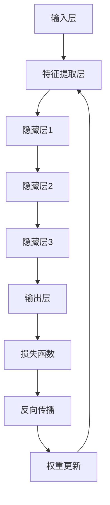
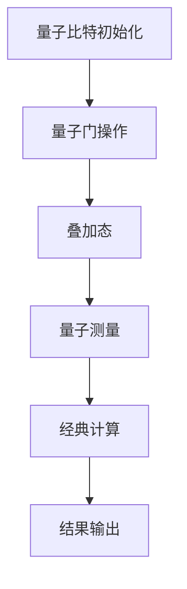
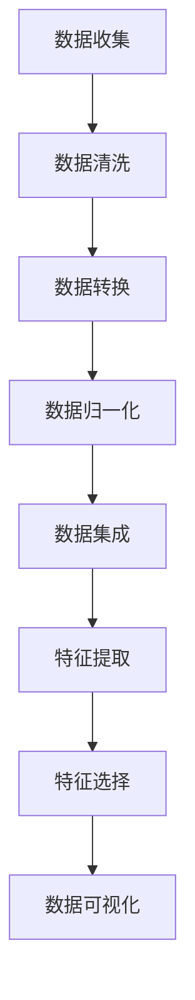

                 

### 文章标题：AI领域的新计算范式

#### 关键词：
- 人工智能
- 计算范式
- 深度学习
- 并行计算
- 分布式计算
- 量子计算
- 边缘计算
- 云计算

#### 摘要：
本文深入探讨了AI领域的新计算范式，从传统计算范式出发，逐步分析了深度学习、机器学习算法、数据预处理与特征工程等基础概念，随后介绍了并行计算、分布式计算、量子计算、边缘计算和云计算等新计算范式。通过具体领域的应用案例，揭示了新计算范式在医疗、金融、制造业与物流等领域的实际应用，并对AI领域的最新趋势和未来展望进行了探讨。最后，通过实战案例和开发实践，展示了如何在新计算范式下开发高效AI应用。

### 目录大纲

#### 第一部分：AI领域基础知识

##### 第1章：AI概述与计算范式
- 1.1 AI的起源与发展
- 1.2 AI的关键概念与基本架构
- 1.3 传统计算范式与AI计算范式的对比

##### 第2章：深度学习基础
- 2.1 深度学习的发展历程
- 2.2 深度学习的基本原理
- 2.3 神经网络架构解析

##### 第3章：机器学习算法
- 3.1 监督学习算法
- 3.2 无监督学习算法
- 3.3 强化学习算法

##### 第4章：数据预处理与特征工程
- 4.1 数据预处理技术
- 4.2 特征提取与特征选择
- 4.3 数据可视化

#### 第二部分：新计算范式详解

##### 第5章：并行计算与分布式计算
- 5.1 并行计算原理
- 5.2 分布式计算原理
- 5.3 GPU与TPU在AI计算中的应用

##### 第6章：量子计算与量子机器学习
- 6.1 量子计算基本原理
- 6.2 量子计算与经典计算的比较
- 6.3 量子机器学习算法介绍

##### 第7章：边缘计算与云计算
- 7.1 边缘计算的基本概念
- 7.2 云计算在AI领域的应用
- 7.3 边缘计算与云计算的协同工作模式

##### 第8章：AI领域的最新趋势与未来展望
- 8.1 AI领域的热点技术
- 8.2 AI对社会与经济的影响
- 8.3 AI领域的未来发展趋势

#### 第三部分：实践案例

##### 第9章：AI计算范式在具体领域的应用
- 9.1 医疗领域的AI应用
- 9.2 金融领域的AI应用
- 9.3 制造业与物流的AI应用

##### 第10章：AI计算范式在创业中的应用
- 10.1 创业者如何运用AI计算范式
- 10.2 AI创业案例解析
- 10.3 AI创业风险与应对策略

##### 第11章：AI计算范式的开发与实践
- 11.1 开发环境搭建
- 11.2 代码实战与解读
- 11.3 性能优化与调优

#### 附录

##### 附录A：常用AI开发工具与资源
- A.1 深度学习框架
- A.2 数据处理工具
- A.3 量子计算平台

##### 附录B：参考文献与进一步阅读
- B.1 相关书籍推荐
- B.2 学术论文精选
- B.3 开源项目推荐

##### 附录C：核心概念与算法流程图
- C.1 深度学习架构图
- C.2 量子计算流程图
- C.3 数据预处理流程图

##### 附录D：数学模型与公式解释
- D.1 深度学习优化算法
- D.2 量子计算数学模型
- D.3 特征工程数学公式解析

##### 附录E：实战代码案例
- E.1 医疗AI应用代码案例
- E.2 金融AI应用代码案例
- E.3 制造业与物流AI应用代码案例

### 引言

人工智能（AI）作为当前科技领域最为热门和快速发展的分支，已经深刻地影响了各行各业。从智能助理到自动驾驶，从医疗诊断到金融服务，AI的应用场景无处不在。然而，随着AI应用的不断扩展和复杂度的增加，传统的计算范式逐渐暴露出其局限性，无法满足日益增长的算力和效率需求。因此，探索AI领域的新计算范式成为了当前研究的重点。

传统计算范式主要依赖于单处理器（CPU）和中央处理单元（GPU），虽然在一定程度上提高了计算速度，但在面对大规模数据处理和复杂算法时，仍然存在计算资源不足、效率低下等问题。新计算范式则在此基础上，引入了并行计算、分布式计算、量子计算、边缘计算和云计算等多种技术，旨在提供更加高效、灵活和可靠的计算解决方案。

本文将分两部分对AI领域的新计算范式进行深入探讨。第一部分将回顾AI的基础知识，包括AI的起源与发展、深度学习基础、机器学习算法以及数据预处理与特征工程等内容。第二部分将详细介绍新计算范式的各个组成部分，包括并行计算与分布式计算、量子计算与量子机器学习、边缘计算与云计算等，并通过具体领域的应用案例，展示新计算范式在实际中的应用效果和未来发展趋势。此外，本文还将结合实战案例，介绍如何在新计算范式下进行AI应用的开发与实践。

通过本文的阅读，读者将能够全面了解AI领域的新计算范式，掌握新计算范式在各个领域的应用方法，以及如何运用新计算范式进行AI创业和创新。

#### 第1章：AI概述与计算范式

##### 1.1 AI的起源与发展

人工智能（AI，Artificial Intelligence）的概念最早由计算机科学家约翰·麦卡锡（John McCarthy）在1956年的达特茅斯会议上提出。当时，AI被定义为“制造智能机器的科学和工程”。从那时起，AI经历了多个发展阶段，每一次技术突破都带来了新的计算范式和应用场景。

最初的AI研究主要集中在符号主义方法上，这种方法依赖于规则和逻辑推理。代表性的系统包括逻辑推理机（Logic Theorist）和通用问题求解器（General Problem Solver），这些系统展示了AI在数学证明和问题求解方面的潜力。然而，符号主义方法存在一些局限性，如知识表示复杂、推理效率低等，难以应对现实世界中的复杂问题。

随着计算机硬件的快速发展，尤其是20世纪80年代中期图形处理单元（GPU）的出现，深度学习（Deep Learning）开始崭露头角。深度学习通过模拟人脑神经网络的结构和功能，通过多层神经网络（Neural Networks）进行特征学习和模式识别，解决了许多以前难以解决的问题。1997年，IBM的深蓝（Deep Blue）计算机击败了国际象棋世界冠军加里·卡斯帕罗夫（Garry Kasparov），标志着AI在特定领域取得了重大突破。

进入21世纪，随着大数据、云计算和分布式计算技术的普及，AI的应用领域进一步扩展。机器学习（Machine Learning）、强化学习（Reinforcement Learning）等算法的快速发展，使得AI在图像识别、自然语言处理、自动驾驶等领域取得了显著成果。特别是在深度学习的推动下，AI在图像识别任务的准确率上达到了前所未有的高度，如Google的Inception模型在ImageNet图像识别挑战赛中取得了top-5错误率3.46%的好成绩。

##### 1.2 AI的关键概念与基本架构

AI的核心概念包括以下几个：

1. **知识表示（Knowledge Representation）**：知识表示是AI系统理解和表示外部世界信息的方法。常用的知识表示方法有符号表示、语义网络和本体论等。

2. **问题求解（Problem Solving）**：问题求解是AI系统的核心功能，通过搜索和推理等方法解决特定问题。

3. **机器学习（Machine Learning）**：机器学习是AI的一个重要分支，通过算法从数据中自动学习和改进性能。常用的机器学习方法包括监督学习、无监督学习和强化学习。

4. **自然语言处理（Natural Language Processing, NLP）**：NLP是AI应用于语言理解和生成的一个分支，旨在让计算机理解和处理人类语言。

5. **计算机视觉（Computer Vision）**：计算机视觉是AI应用于图像和视频理解与分析的一个分支，通过算法实现图像识别、目标检测、场景理解等任务。

AI的基本架构可以分为以下几个层次：

1. **感知层**：感知层是AI系统的输入接口，负责接收和解析外部信息，如图像、声音和文本等。

2. **表示层**：表示层负责将感知层获得的信息转化为计算机可以处理的数据结构，如像素矩阵、文本向量等。

3. **推理层**：推理层是AI系统的核心，通过算法对表示层处理后的数据进行推理和决策，如模式识别、分类和规划等。

4. **行动层**：行动层是AI系统的输出接口，根据推理层的决策执行具体的行动，如控制机器人动作、生成文本等。

##### 1.3 传统计算范式与AI计算范式的对比

传统计算范式主要依赖于单处理器（CPU）和中央处理单元（GPU），其计算方式为顺序执行，计算资源相对有限。随着AI应用的需求日益增长，传统计算范式逐渐暴露出以下局限性：

1. **计算能力有限**：单处理器和GPU的计算能力有限，难以应对大规模数据处理和复杂算法的需求。

2. **效率低下**：传统计算范式在处理复杂任务时，效率低下，需要大量时间和资源。

3. **扩展性差**：传统计算范式难以扩展，无法充分利用现有计算资源。

AI计算范式则通过引入并行计算、分布式计算、量子计算等新技术，解决了传统计算范式的局限性，具有以下优势：

1. **计算能力强大**：AI计算范式通过并行计算和分布式计算，可以实现大规模数据处理和复杂算法的高效执行。

2. **效率提升**：AI计算范式利用GPU、TPU等专用硬件，可以实现高效计算，显著提升任务执行速度。

3. **扩展性强**：AI计算范式支持分布式计算，可以根据需求灵活扩展计算资源，实现高效协同工作。

通过上述对比，可以看出AI计算范式在计算能力、效率和扩展性方面具有明显优势，能够更好地满足AI应用的需求。

#### 第2章：深度学习基础

##### 2.1 深度学习的发展历程

深度学习（Deep Learning）作为人工智能（AI）的重要分支，起源于20世纪40年代的人工神经网络（Artificial Neural Networks,ANNs）研究。深度学习的起源可以追溯到1943年由心理学家McCulloch和数学家Pitts提出的第一个神经网络模型——MC神经网络。然而，由于早期计算机性能的限制，神经网络的研究在1950年代后期和1960年代初期逐渐放缓。

到了1980年代，随着计算机硬件性能的提升和反向传播算法（Backpropagation Algorithm）的提出，神经网络研究重新焕发活力。反向传播算法通过将误差反向传播到网络的每个神经元，实现了神经网络的权重更新，使得神经网络能够在多层之间进行有效的学习。然而，由于数据集和计算资源的限制，多层神经网络的训练效果并不理想，导致神经网络的研究在1990年代再次陷入低潮。

真正的深度学习热潮始于2006年，由Hinton等研究者提出深度信念网络（Deep Belief Networks, DBNs）和深度卷积网络（Deep Convolutional Networks, DCNs）。深度信念网络通过层与层之间的预训练和微调，解决了多层神经网络训练困难的问题。而深度卷积网络则通过模拟人脑视觉皮层的结构，实现了图像识别的高效性能。这一时期，以AlexNet为代表的深度卷积网络在ImageNet图像识别挑战赛中取得了重大突破，证明了深度学习在计算机视觉领域的巨大潜力。

随着大数据和云计算技术的普及，深度学习在2010年代迎来了快速发展。深度学习模型在语音识别、自然语言处理、强化学习等领域的应用取得了显著成果。以谷歌的TensorFlow和Facebook的PyTorch为代表的深度学习框架，为深度学习的研发和应用提供了强大的工具支持。此外，专用硬件如GPU、TPU的广泛应用，也大大提升了深度学习的计算效率。

##### 2.2 深度学习的基本原理

深度学习的基本原理来源于神经网络，通过多层非线性变换来提取和表示数据中的特征。深度学习模型由多个层级组成，每一层对输入数据进行特征提取和变换，最终输出结果。深度学习的基本概念包括以下几方面：

1. **神经网络（Neural Networks）**：神经网络由大量简单但强大的神经元（Nodes）组成，每个神经元接收输入信号并产生输出。神经网络通过调整神经元之间的权重（Weights）来学习输入数据和输出结果之间的关系。

2. **激活函数（Activation Functions）**：激活函数是神经网络中每个神经元的输出函数，用于引入非线性特性，使得神经网络能够模拟复杂的关系。常用的激活函数包括ReLU（Rectified Linear Unit）、Sigmoid、Tanh等。

3. **前向传播（Forward Propagation）**：前向传播是神经网络训练过程中的第一步，输入数据从输入层（Input Layer）经过多个隐藏层（Hidden Layers）传递，最终到达输出层（Output Layer），产生预测结果。

4. **反向传播（Backpropagation）**：反向传播是神经网络训练过程的关键步骤，通过计算输出层的误差，将误差反向传播到网络的每个层级，更新每个神经元的权重，以优化模型的预测性能。

5. **损失函数（Loss Function）**：损失函数用于衡量模型预测结果与真实结果之间的差异，常用的损失函数包括均方误差（Mean Squared Error, MSE）、交叉熵（Cross-Entropy）等。

6. **优化算法（Optimization Algorithms）**：优化算法用于调整神经网络权重，以最小化损失函数。常用的优化算法包括梯度下降（Gradient Descent）、Adam（Adaptive Moment Estimation）等。

##### 2.3 神经网络架构解析

深度学习模型的核心是神经网络架构，不同的神经网络架构适用于不同的应用场景。以下介绍几种常用的神经网络架构：

1. **卷积神经网络（Convolutional Neural Networks, CNNs）**：卷积神经网络是深度学习在计算机视觉领域的重要应用，通过卷积层（Convolutional Layers）、池化层（Pooling Layers）和全连接层（Fully Connected Layers）对图像数据进行特征提取和分类。CNNs在图像识别、目标检测和视频分析等方面具有优异的性能。

2. **循环神经网络（Recurrent Neural Networks, RNNs）**：循环神经网络是处理序列数据的有效模型，通过循环结构保持对序列中先前信息的记忆。RNNs在自然语言处理、语音识别和时间序列预测等领域表现出色。

3. **长短时记忆网络（Long Short-Term Memory Networks, LSTM）**：长短时记忆网络是RNNs的一种改进模型，通过引入记忆单元（Memory Cells）解决了RNNs在处理长序列数据时容易发生梯度消失和梯度爆炸的问题。LSTM在文本生成、语音合成和时间序列分析等领域有广泛应用。

4. **生成对抗网络（Generative Adversarial Networks, GANs）**：生成对抗网络由生成器（Generator）和判别器（Discriminator）两部分组成，生成器生成数据以欺骗判别器，判别器判断生成数据是否真实。GANs在图像生成、视频生成和文本生成等领域具有广阔的应用前景。

5. **变分自编码器（Variational Autoencoder, VAE）**：变分自编码器是另一种生成模型，通过编码器（Encoder）和解码器（Decoder）对数据进行编码和解码，学习数据的分布。VAE在图像去噪、图像生成和风格迁移等方面表现出色。

通过以上介绍，可以看出深度学习的基本原理和架构在AI领域的广泛应用。随着技术的不断进步，深度学习将继续推动AI的发展，带来更多创新和应用。

##### 第3章：机器学习算法

机器学习（Machine Learning，ML）是人工智能（AI）的核心技术之一，它通过算法从数据中自动学习和改进性能，从而实现智能决策和预测。机器学习算法可以根据学习方式的不同分为监督学习（Supervised Learning）、无监督学习（Unsupervised Learning）和强化学习（Reinforcement Learning）三大类。下面将分别介绍这三种学习方式及其典型算法。

##### 3.1 监督学习算法

监督学习是一种最常见和最直观的机器学习方法，它通过给定的输入数据集和对应的输出标签来训练模型，从而预测新的数据。监督学习算法可以分为分类（Classification）和回归（Regression）两大类：

1. **分类算法**：
   - **逻辑回归（Logistic Regression）**：逻辑回归是一种简单但有效的二分类模型，通过Logistic函数将线性组合的权重映射到概率值。逻辑回归常用于处理二元分类问题，如 spam邮件分类、点击率预测等。
   - **支持向量机（Support Vector Machine, SVM）**：支持向量机是一种基于最大间隔原理的分类算法，通过找到一个最优的超平面将不同类别的数据点分隔开来。SVM在处理高维数据和非线性分类问题时表现出色。
   - **决策树（Decision Tree）**：决策树是一种基于特征进行划分的树形结构，通过一系列条件判断将数据划分为不同的区域。决策树模型简单、易于理解，但可能产生过拟合。
   - **随机森林（Random Forest）**：随机森林是由多个决策树组成的集成模型，通过随机选取特征和样本子集构建每个决策树，提高模型的泛化能力和鲁棒性。随机森林在处理大规模数据和复杂问题时表现优异。

2. **回归算法**：
   - **线性回归（Linear Regression）**：线性回归是最简单的回归模型，通过最小化平方误差损失函数来拟合数据点，从而预测连续值。线性回归广泛应用于房价预测、股票价格预测等场景。
   - **多项式回归（Polynomial Regression）**：多项式回归是线性回归的扩展，通过引入多项式项来拟合非线性关系。多项式回归在处理具有复杂非线性关系的数据时表现更好。

##### 3.2 无监督学习算法

无监督学习是在没有明确标签数据的情况下，通过学习数据内在结构来揭示数据特征和规律的机器学习方法。无监督学习算法主要包括以下几类：

1. **聚类算法**：
   - **K均值聚类（K-Means Clustering）**：K均值聚类是一种基于距离的聚类算法，通过迭代计算聚类中心，将数据点分配到最近的聚类中心。K均值聚类适用于处理高维数据聚类问题。
   - **层次聚类（Hierarchical Clustering）**：层次聚类通过建立树形结构来对数据进行聚类，可以是自底向上（凝聚聚类）或自顶向下（分裂聚类）。层次聚类能够生成聚类层次信息，有助于理解数据分布。
   - **谱聚类（Spectral Clustering）**：谱聚类利用图论中的谱分解技术进行聚类，通过构建相似性矩阵来分析数据的全局结构，适用于复杂网络数据的聚类。

2. **降维算法**：
   - **主成分分析（Principal Component Analysis, PCA）**：主成分分析是一种线性降维技术，通过将数据投影到新的正交基上，保留主要成分，去除冗余信息。PCA在处理高维数据和可视化方面有广泛应用。
   - **线性判别分析（Linear Discriminant Analysis, LDA）**：线性判别分析是一种基于类间散度和类内散度进行降维的方法，旨在最小化类间距离和最大化类内距离。LDA常用于特征提取和分类。
   - **非线性降维（t-SNE）**：t-SNE（t-Distributed Stochastic Neighbor Embedding）是一种非线性降维技术，通过模拟局部几何结构来降低数据维度，适用于高维数据的可视化。

3. **关联规则学习**：
   - **Apriori算法**：Apriori算法是一种基于频繁项集挖掘的关联规则学习算法，通过迭代扫描数据集来发现频繁项集，并生成关联规则。Apriori算法广泛应用于市场篮子分析和推荐系统。

##### 3.3 强化学习算法

强化学习（Reinforcement Learning，RL）是一种通过与环境的交互来学习最优策略的机器学习方法。在强化学习中，智能体（Agent）通过接收环境（Environment）的反馈信号来调整行为，以达到最大化累积奖励。强化学习算法可以分为值函数方法、策略梯度方法和演员-评论家方法：

1. **值函数方法**：
   - **Q学习（Q-Learning）**：Q学习是一种基于值函数的方法，通过迭代更新Q值来学习最优策略。Q学习适用于离散状态和动作空间，能够处理部分可观测环境。
   - **深度Q网络（Deep Q-Network, DQN）**：深度Q网络是Q学习的扩展，通过引入深度神经网络来近似Q值函数。DQN在处理高维状态空间和连续动作空间时表现出色。

2. **策略梯度方法**：
   - **策略梯度（Policy Gradient）**：策略梯度方法直接优化策略参数，以最大化累积奖励。策略梯度方法包括REINFORCE、PPO（Proximal Policy Optimization）等算法。

3. **演员-评论家方法**：
   - **演员-评论家（Actor-Critic）**：演员-评论家方法结合了策略梯度方法和值函数方法，通过同时更新策略参数和价值函数来学习最优策略。常见的演员-评论家算法包括SARSA（同步优势演员-评论家算法）和TD-Learning（时序差分学习）。

通过上述对监督学习、无监督学习和强化学习算法的介绍，可以看出机器学习算法在解决不同类型的问题时具有各自的优势和应用场景。随着机器学习技术的不断发展，这些算法将继续在AI领域发挥重要作用。

##### 第4章：数据预处理与特征工程

在机器学习和深度学习项目中，数据预处理和特征工程是至关重要的步骤。这些步骤不仅能够提升模型的性能，还能够帮助模型更好地理解和利用数据。本章节将详细介绍数据预处理技术、特征提取与特征选择，以及数据可视化等内容。

##### 4.1 数据预处理技术

数据预处理是机器学习和深度学习项目中的第一步，它旨在将原始数据转换为适合建模的数据。数据预处理主要包括以下几项技术：

1. **数据清洗**：数据清洗是指处理数据中的噪声和异常值，包括去除重复记录、纠正错误数据、填充缺失值等。例如，使用均值、中位数或众数来填补缺失值，或者使用特定的算法（如K近邻）来预测和填补缺失值。

2. **数据归一化**：数据归一化是通过将数据缩放到相同的尺度来消除不同特征之间的大小差异。常用的归一化方法包括最小-最大缩放（Min-Max Scaling）和Z-score缩放（标准化）。例如，使用公式 \( x_{\text{normalized}} = \frac{x - \mu}{\sigma} \) 将数据标准化，其中 \( \mu \) 和 \( \sigma \) 分别是数据的均值和标准差。

3. **数据转换**：数据转换是将数据从一种格式转换为另一种格式的过程。例如，将文本数据转换为向量表示，或者将分类数据转换为二进制编码。

4. **数据集成**：数据集成是指将来自多个来源的数据合并为一个统一的数据集。这可以通过多种方式实现，如连接（Joining）、合并（Merging）或重叠（Overlapping）。

##### 4.2 特征提取与特征选择

特征提取是将原始数据转换为更加适合建模的形式，而特征选择则是从提取的众多特征中选出最有用的特征。这两项技术对模型性能的提升至关重要。

1. **特征提取**：
   - **统计特征**：统计特征包括平均值、中位数、标准差等描述数据分布的度量。这些特征可以用于捕捉数据的整体趋势和分布。
   - **文本特征**：在自然语言处理（NLP）中，文本特征可以从文本中提取，如词袋模型（Bag of Words, BOW）、TF-IDF（Term Frequency-Inverse Document Frequency）和词嵌入（Word Embeddings）等。
   - **图像特征**：在计算机视觉中，图像特征可以从图像中提取，如边缘检测、轮廓提取、颜色直方图和SIFT（尺度不变特征变换）等。

2. **特征选择**：
   - **过滤式特征选择**：过滤式特征选择通过计算每个特征的统计度量（如相关性、信息增益等）来选择最有用的特征。这种方法简单但可能错过一些有用的特征。
   - **包装式特征选择**：包装式特征选择通过尝试不同的特征组合来选择最优特征子集。这种方法能够找到更好的特征组合，但计算成本较高。
   - **嵌入式特征选择**：嵌入式特征选择将特征选择过程集成到模型训练中，如Lasso回归和随机森林等算法在训练过程中自动排除无关特征。

##### 4.3 数据可视化

数据可视化是将数据以图形的形式展示出来，以便于分析和解释。数据可视化不仅能够帮助理解数据的结构和分布，还能够揭示数据中的潜在关系和模式。

1. **散点图（Scatter Plot）**：散点图用于展示两个变量之间的关系。通过观察散点图的分布，可以识别出数据的聚类、异常点和线性关系等。

2. **直方图（Histogram）**：直方图用于展示单个变量的分布情况。通过直方图，可以了解数据的分布特征，如均值、方差和偏态等。

3. **箱线图（Box Plot）**：箱线图用于展示数据的统计分布，包括均值、中位数、最小值和最大值等。箱线图有助于识别异常值和离群点。

4. **热力图（Heat Map）**：热力图用于展示多维数据的分布情况。通过颜色深度来表示数据的值，热力图能够直观地展示数据的分布和相关性。

5. **时间序列图（Time Series Plot）**：时间序列图用于展示随时间变化的数据趋势。通过时间序列图，可以识别出数据的周期性、趋势和季节性等特征。

通过上述数据预处理、特征提取与特征选择以及数据可视化技术，我们可以更好地理解数据，优化模型性能，并揭示数据中的潜在价值。这些技术在机器学习和深度学习项目中起着至关重要的作用，是构建高效AI模型的关键步骤。

### 第5章：并行计算与分布式计算

#### 5.1 并行计算原理

并行计算（Parallel Computing）是一种通过将任务分解为多个子任务，并同时在多个处理单元上执行这些子任务的方法，以实现比单处理器更快的计算速度。并行计算的核心思想是利用多个处理单元（如CPU、GPU、FPGA等）的并行处理能力，提高计算效率和性能。

1. **并行计算模型**：
   - **数据并行**：数据并行是将数据分割成多个部分，每个处理单元独立处理自己的数据部分，最后将结果合并。这种模型适用于计算密集型任务，如矩阵乘法、图像处理等。
   - **任务并行**：任务并行是将任务分割成多个子任务，每个处理单元独立执行一个子任务。这种模型适用于任务调度密集型任务，如分布式任务队列处理、并行排序等。
   - **任务和数据并行**：任务和数据并行是将任务和数据分割成多个部分，每个处理单元同时处理多个数据部分的子任务。这种模型结合了数据并行和任务并行的优势，适用于复杂的计算任务。

2. **并行计算架构**：
   - **共享内存架构**：共享内存架构通过多个处理器共享同一块内存，实现数据共享和同步。这种架构常见于多核CPU和GPU。
   - **分布式内存架构**：分布式内存架构通过多个独立的处理器各自拥有私有内存，通过通信网络实现数据交换和同步。这种架构常见于分布式计算系统。

3. **并行编程模型**：
   - **线程模型**：线程模型通过创建多个线程来并行执行任务，每个线程独立运行，但共享进程的内存空间。线程模型适合于轻量级的并行任务。
   - **任务模型**：任务模型通过将任务分解为多个独立任务，每个任务分配给不同的处理单元执行。任务模型适合于复杂的并行任务。
   - **数据并行模型**：数据并行模型通过将数据分解为多个部分，每个处理单元独立处理自己的数据部分，最后将结果合并。这种模型适用于大规模数据并行处理。

#### 5.2 分布式计算原理

分布式计算（Distributed Computing）是一种通过多个独立计算机系统协同工作，完成计算任务的体系结构。在分布式计算中，多个计算节点通过网络连接，共同处理数据和任务，以提高计算能力和容错性。

1. **分布式计算模型**：
   - **客户-服务器模型**：客户-服务器模型通过一个中心服务器处理客户端请求，服务器负责数据管理和任务调度。这种模型结构简单，适用于Web服务和数据处理场景。
   - **对等网络模型**：对等网络模型（Peer-to-Peer, P2P）通过多个对等节点直接连接，共享资源和任务。对等网络模型具有高度容错性和可扩展性，适用于分布式文件共享和分布式存储。
   - **集群模型**：集群模型通过多个计算节点形成一个计算集群，共同处理任务和数据。集群模型具有高可用性和高性能，适用于大规模数据处理和计算任务。

2. **分布式计算架构**：
   - **主从架构**：主从架构通过一个主节点负责协调和管理从节点，从节点执行主节点分配的任务。主从架构结构简单，适用于任务调度和管理。
   - **去中心化架构**：去中心化架构通过多个节点直接连接，没有中心节点，每个节点都可以独立处理任务和数据。去中心化架构具有高容错性和高扩展性，适用于分布式存储和去中心化计算。

3. **分布式编程模型**：
   - **进程模型**：进程模型通过创建多个独立进程来并行执行任务，每个进程有自己的内存空间和资源。进程模型适用于大型分布式计算任务。
   - **线程模型**：线程模型通过创建多个线程来并行执行任务，每个线程共享进程的内存空间。线程模型适用于轻量级的分布式任务。
   - **事件驱动模型**：事件驱动模型通过事件触发来执行任务，每个节点独立处理事件并响应。事件驱动模型适用于实时处理和动态任务调度。

通过并行计算和分布式计算，可以实现高效的计算任务处理和资源利用。这些计算范式在人工智能、大数据处理和科学计算等领域具有广泛的应用前景。理解并行计算和分布式计算的基本原理和架构，有助于开发者设计和实现高效、可靠的分布式系统。

#### 5.3 GPU与TPU在AI计算中的应用

在人工智能（AI）领域，图形处理单元（GPU）和 tensor处理单元（TPU）已经成为提升计算性能和加速模型训练的关键工具。这两种专用硬件通过其独特的架构和优化技术，为深度学习和大数据处理提供了强大的支持。

##### 5.3.1 GPU在AI计算中的应用

GPU（Graphics Processing Unit）最初是为图形渲染设计的，但其高度并行计算的架构使其在AI计算中具有巨大潜力。GPU具有以下几个特点：

1. **并行计算能力**：GPU由大量小型的计算单元（CUDA核心）组成，这些核心可以同时执行多个线程，非常适合进行矩阵运算和向量计算。

2. **内存带宽**：GPU具有高带宽的内存访问能力，可以快速传输大量的数据，这对于处理大规模数据集尤为重要。

3. **高效的编程模型**：NVIDIA的CUDA编程模型为开发者提供了灵活的接口，能够利用GPU的并行计算能力进行高效编程。

在AI计算中，GPU的主要应用包括：

- **深度学习模型训练**：GPU的高并行计算能力使其成为训练大规模深度学习模型的首选硬件，如卷积神经网络（CNNs）和循环神经网络（RNNs）等。
- **图像和视频处理**：GPU在图像识别、目标检测和视频分析等计算机视觉任务中具有显著的优势，可以显著提高处理速度。
- **科学计算**：GPU在科学计算领域，如物理模拟、金融分析和气象预报等，也表现出强大的计算能力。

##### 5.3.2 TPU在AI计算中的应用

TPU（Tensor Processing Unit）是谷歌专门为处理张量运算而设计的ASIC（专用集成电路），旨在加速深度学习模型的训练和推理。TPU具有以下几个特点：

1. **高效的张量运算**：TPU专门优化了矩阵乘法和向量计算，这些操作是深度学习模型训练和推理的核心。TPU的核心设计使其能够高效地执行这些计算任务。

2. **优化的内存层次结构**：TPU具有优化的内存层次结构，能够快速访问和操作大量数据，从而提高了计算效率和吞吐量。

3. **集成TensorFlow**：TPU与TensorFlow深度集成，使得开发者可以使用现有的TensorFlow代码库来利用TPU进行模型训练和推理，简化了开发流程。

在AI计算中，TPU的主要应用包括：

- **大规模深度学习模型训练**：TPU适用于训练大型深度学习模型，如BERT、GPT等自然语言处理模型，可以显著缩短训练时间。
- **实时推理**：TPU的高吞吐量和低延迟使其成为实时推理任务的理想选择，如自动驾驶、智能语音助手等。
- **高性能计算**：TPU在分布式计算和高性能计算环境中表现出色，可以与CPU和其他计算资源协同工作，提升整体计算性能。

##### 5.3.3 GPU与TPU的比较

虽然GPU和TPU在AI计算中都发挥了重要作用，但它们也有各自的优势和局限性：

- **计算能力**：TPU在处理大规模矩阵运算时具有更高的计算性能，但GPU在处理其他类型的计算任务（如图像处理和科学计算）时表现更好。
- **编程模型**：GPU支持广泛的应用程序和开发语言，如C++、Python和CUDA，而TPU主要与TensorFlow集成，但谷歌也在不断拓展TPU的应用范围。
- **成本**：GPU相对较为便宜，易于部署，而TPU是专门定制的硬件，成本较高，但性能优势明显。

总体而言，GPU和TPU在不同应用场景下各有优势，合理选择和使用这些硬件资源，能够显著提升AI计算的性能和效率。

#### 第6章：量子计算与量子机器学习

##### 6.1 量子计算基本原理

量子计算（Quantum Computing）是一种利用量子力学原理进行计算的新型计算范式。与传统计算基于比特（Bit）不同，量子计算使用量子比特（Qubit）作为基本信息单元。量子比特具有两个特殊属性：叠加态（Superposition）和纠缠态（Entanglement）。

1. **叠加态**：叠加态是指量子比特可以同时处于0和1的多种状态。这可以通过以下数学公式表示：
   $$
   \psi = a|0\rangle + b|1\rangle
   $$
   其中，$|0\rangle$和$|1\rangle$是量子比特的两个基本状态，$a$和$b$是复数概率幅，满足$|a|^2 + |b|^2 = 1$。

2. **纠缠态**：纠缠态是指多个量子比特之间存在一种特殊的关系，当一个量子比特的状态发生变化时，其他量子比特的状态也会随之变化，即使它们之间相隔很远。这种非局域性是量子计算的重要特性。

量子计算的基本操作包括量子门（Quantum Gates）和量子电路（Quantum Circuit）。量子门是类似于经典逻辑门的操作，但作用于量子比特。常见的量子门包括：

- **Hadamard门（Hadamard Gate）**：实现量子比特的叠加变换。
- **Pauli门（Pauli Gates）**：实现量子比特的旋转操作，包括X门、Y门和Z门。
- **控制非门（Controlled NOT Gate, CNOT Gate）**：实现量子比特之间的纠缠。

量子电路是由量子门组成的序列，用于实现复杂的量子算法。通过量子电路，我们可以对量子比特进行一系列操作，从而实现特定的计算任务。

##### 6.2 量子计算与经典计算的比较

量子计算与经典计算在多个方面存在显著差异：

1. **并行性**：量子计算具有天然的高并行性，一个量子态可以同时代表多个经典状态，从而实现并行计算。在特定问题（如量子搜索算法）中，量子计算机可以显著降低计算复杂度。

2. **计算能力**：量子计算机能够处理超过经典计算机的能力。例如，Shor算法利用量子计算的能力在多项式时间内解决大整数分解问题，而这个问题在经典计算机上需要指数级时间。

3. **纠错能力**：量子计算比经典计算更容易实现纠错。由于量子比特的叠加态和纠缠态容易受到外界干扰，量子计算机需要更高的精度和稳定性。量子纠错码（Quantum Error Correction Codes）可以在量子计算中引入冗余信息，从而提高计算可靠性。

4. **量子随机性**：量子计算中的某些过程（如量子随机行走）可以提供比经典计算更高的随机性。这种随机性在密码学和其他计算任务中具有潜在应用。

然而，量子计算也存在一些挑战：

- **量子门精度和一致性**：实现高精度的量子门是量子计算的关键，但目前的量子硬件仍然受到噪声和误差的影响。
- **量子纠错**：尽管量子纠错码能够提高计算可靠性，但纠错过程本身需要额外的计算资源，这可能会降低量子计算的总体性能。

##### 6.3 量子机器学习算法介绍

量子机器学习（Quantum Machine Learning）是量子计算与机器学习相结合的领域，旨在利用量子计算的并行性和计算能力，解决传统机器学习难以处理的问题。以下介绍几种典型的量子机器学习算法：

1. **量子支持向量机（Quantum Support Vector Machine, QSVM）**：量子支持向量机是量子计算在分类问题中的应用。通过将经典支持向量机算法转化为量子形式，QSVM可以在量子计算机上高效训练和分类数据。

2. **量子神经网络（Quantum Neural Network, QNN）**：量子神经网络是量子计算在模式识别和回归问题中的应用。QNN通过结合量子门和神经网络结构，能够处理高维数据和复杂非线性关系。

3. **量子生成对抗网络（Quantum Generative Adversarial Network, QGAN）**：量子生成对抗网络是量子计算在生成任务中的应用。QGAN通过量子门和量子态的变换，生成高质量的数据分布，如图像和文本。

4. **量子聚类算法（Quantum Clustering Algorithms）**：量子聚类算法利用量子计算的优势，在高维空间中实现高效聚类。量子聚类算法包括量子K均值聚类和量子谱聚类，能够处理大规模数据集。

通过量子计算与量子机器学习，我们有望解决传统计算范式无法处理的问题，实现更高效的机器学习和数据科学应用。尽管量子计算目前还处于早期阶段，但其在未来AI领域的潜力不容忽视。

#### 第7章：边缘计算与云计算

##### 7.1 边缘计算的基本概念

边缘计算（Edge Computing）是一种分布式计算范式，旨在通过在数据源附近（即网络的边缘）处理数据和执行计算任务，来减轻中央数据中心和网络传输的负担。边缘计算通过将计算、存储和网络功能分布到网络边缘节点，实现低延迟、高带宽和高效的数据处理。

1. **边缘计算的优势**：
   - **低延迟**：边缘计算将数据处理任务从远程数据中心转移到靠近数据源的边缘节点，从而显著降低通信延迟，提高实时处理能力。
   - **高带宽**：边缘计算利用局部网络资源，实现更高的数据传输速率和带宽利用率。
   - **节能降耗**：通过减少数据传输和网络拥堵，边缘计算可以降低能源消耗和设备冷却需求。
   - **安全性和隐私性**：边缘计算可以在本地处理敏感数据，减少数据在网络中的传输，提高数据安全和隐私保护。

2. **边缘计算的架构**：
   - **边缘节点**：边缘节点包括智能手机、平板电脑、物联网（IoT）设备、网关等，它们负责收集、处理和存储数据。
   - **边缘服务器**：边缘服务器是更强大的计算节点，通常部署在基站、数据中心边缘等位置，用于处理复杂的计算任务。
   - **云计算**：云计算平台通过提供基础设施、平台和软件服务，支持边缘计算的应用开发和部署。

##### 7.2 云计算在AI领域的应用

云计算（Cloud Computing）是一种通过互联网提供动态易扩展的计算资源服务模式。在AI领域，云计算提供了强大的计算能力、存储资源和灵活性，支持大规模数据分析和深度学习模型的训练和部署。

1. **云计算的优势**：
   - **弹性扩展**：云计算可以根据需求动态调整计算资源，提供按需扩展的能力，降低基础设施成本。
   - **高可用性**：云计算通过分布式架构和冗余设计，提供高可用性服务，确保数据安全和业务连续性。
   - **灵活部署**：云计算支持多种开发环境和编程语言，开发者可以快速部署和迭代AI应用。
   - **成本效益**：云计算通过资源共享和按需付费模式，降低了基础设施和运维成本。

2. **云计算在AI领域的应用**：
   - **大规模数据存储和处理**：云计算提供了海量存储资源和高速计算能力，支持大规模数据集的处理和分析。
   - **深度学习模型训练**：云计算平台如Google Cloud、AWS和Azure提供了高性能计算资源和深度学习框架，支持大规模深度学习模型的训练和优化。
   - **AI服务部署**：云计算提供了AI即服务（AI as a Service, AIaaS）平台，如IBM Watson和Google Cloud AI，开发者可以快速部署和提供AI服务。
   - **边缘计算与云计算的协同**：云计算与边缘计算结合，实现数据在边缘节点本地处理，同时利用云资源进行复杂计算，提高整体系统性能和响应速度。

##### 7.3 边缘计算与云计算的协同工作模式

边缘计算与云计算的协同工作模式通过结合两者的优势，实现高效的数据处理和AI应用部署。以下几种协同模式展示了边缘计算与云计算的互补性：

1. **数据分流处理**：在边缘节点进行初步数据处理，将结果或关键信息上传到云端进行进一步分析和处理。这种方法能够降低网络带宽和延迟，提高数据处理的效率。

2. **边缘智能+云服务**：边缘计算负责实时数据分析和快速决策，云平台提供强大的计算资源和远程服务支持。例如，自动驾驶车辆可以使用边缘计算进行实时感知和决策，同时利用云平台进行路径规划和高级算法处理。

3. **分布式计算与存储**：边缘节点处理数据并执行部分计算任务，云平台负责处理复杂的计算任务和长期数据存储。这种方法能够实现数据的分布式处理和存储，提高系统弹性和容错能力。

4. **边缘计算与云协同优化**：通过边缘计算和云计算的协同优化，实现数据处理的优化和资源利用的最大化。例如，使用边缘计算进行实时监控和数据分析，利用云平台进行数据汇总和深度学习模型训练。

通过边缘计算与云计算的协同工作模式，我们能够实现高效、灵活和可靠的数据处理和AI应用部署，满足日益增长的AI需求。

#### 第8章：AI领域的最新趋势与未来展望

##### 8.1 AI领域的热点技术

随着AI技术的不断进步，AI领域涌现出一系列热点技术，这些技术不仅在学术界引起广泛关注，也在实际应用中展现出巨大的潜力。

1. **生成对抗网络（GANs）**：
   - **应用领域**：GANs在图像生成、视频生成、文本生成等方面有广泛应用。例如，AI艺术家使用GAN生成高质量的绘画和音乐作品，自动驾驶车辆利用GAN进行场景模拟和预测。
   - **发展趋势**：GANs的技术不断进步，如自注意力机制和变分自编码器（VAEs）的引入，使得生成效果更加逼真。未来，GANs有望在医疗图像生成、3D建模和虚拟现实等领域实现更广泛应用。

2. **强化学习（Reinforcement Learning, RL）**：
   - **应用领域**：强化学习在游戏、自动驾驶、机器人控制等领域取得显著成果。例如，OpenAI的Dota 2智能体在竞赛中击败了人类顶级玩家，特斯拉自动驾驶系统利用强化学习进行路径规划。
   - **发展趋势**：随着深度强化学习（Deep Reinforcement Learning, DRL）和模仿学习（Imitation Learning）技术的发展，强化学习在复杂环境中的适应能力和性能将进一步提高。

3. **联邦学习（Federated Learning）**：
   - **应用领域**：联邦学习在隐私保护、跨平台协同、数据共享等领域有广泛应用。例如，谷歌的联邦学习框架用于保护用户隐私，同时实现手机端的AI模型更新。
   - **发展趋势**：联邦学习技术将不断完善，如引入差分隐私（Differential Privacy）和联邦学习优化算法（如FedAvg、FEDM）等，提高联邦学习的效率和安全性。

4. **自然语言处理（Natural Language Processing, NLP）**：
   - **应用领域**：NLP技术在语音识别、机器翻译、情感分析、文本生成等方面有广泛应用。例如，苹果的Siri、谷歌的Google Translate和微软的Bing Chat等。
   - **发展趋势**：随着预训练模型（如BERT、GPT-3）和自监督学习（Self-Supervised Learning）技术的发展，NLP的性能将进一步提高，未来有望实现更自然、更流畅的交互。

##### 8.2 AI对社会与经济的影响

AI技术的快速发展对社会和经济产生了深远影响，既带来了新的机遇，也带来了挑战。

1. **机遇**：
   - **提高生产力**：AI技术在工业自动化、供应链优化、医疗诊断等领域有广泛应用，显著提高了生产效率和质量。
   - **创新应用场景**：AI在金融、零售、教育、医疗等行业的创新应用，推动了行业变革和商业模式创新。
   - **个性化服务**：AI技术能够根据用户行为和偏好提供个性化服务，如智能推荐、定制化产品等，提升了用户体验。

2. **挑战**：
   - **就业影响**：AI技术的发展可能导致部分传统工作岗位的减少，对劳动力市场产生冲击。这需要政府和企业共同努力，推动教育和培训，提升劳动者的技能。
   - **数据隐私和安全**：AI技术需要大量数据支持，数据隐私和安全问题日益突出。如何确保用户数据的安全性和隐私性，是AI发展面临的重要挑战。
   - **伦理和社会公平**：AI系统的决策可能存在偏见和歧视，需要建立有效的伦理和社会公平机制，确保AI技术的公平、公正和透明。

##### 8.3 AI领域的未来发展趋势

展望未来，AI技术将继续快速发展，并在更多领域展现其潜力。

1. **技术融合**：AI技术与其他前沿技术（如5G、物联网、区块链等）的融合，将推动新型应用场景的出现，实现更高效、更智能的解决方案。
2. **专用硬件**：针对AI应用的专用硬件（如TPU、ASIC等）将不断优化，提升AI计算性能和效率。
3. **跨学科研究**：AI技术将与生物学、心理学、社会学等学科结合，推动认知科学、情感计算等领域的发展。
4. **自主智能**：随着深度学习和强化学习技术的进步，AI系统将逐步实现更高程度的自主性和自主决策能力。
5. **普及与落地**：AI技术将在更多行业和领域得到普及和应用，推动产业升级和社会变革。

总之，AI领域的未来发展充满机遇和挑战，通过不断创新和探索，AI技术将继续为社会和经济带来深远影响。

### 第9章：AI计算范式在具体领域的应用

随着AI计算范式的不断发展，其在各个行业领域的应用也愈加广泛和深入。本章节将详细介绍AI计算范式在医疗、金融、制造业与物流等领域的应用，并通过实际案例展示其效果。

#### 9.1 医疗领域的AI应用

医疗领域是AI技术的重要应用场景之一，通过AI计算范式，可以实现高效、准确的医疗诊断、个性化治疗和医疗资源优化。

1. **医疗诊断**：
   - **计算机辅助诊断**：利用深度学习和计算机视觉技术，AI模型可以对医学图像（如X光片、CT扫描、MRI图像）进行自动诊断。例如，Google的DeepMind团队开发的AI系统可以准确识别眼病、皮肤病和乳腺癌等。
   - **电子病历分析**：AI算法可以分析电子病历中的数据，识别患者的潜在健康风险和疾病趋势，从而提供个性化的医疗建议。

2. **个性化治疗**：
   - **基因组分析**：通过深度学习和机器学习算法，AI可以分析患者的基因组数据，预测疾病风险并制定个性化的治疗方案。例如，Illumina公司利用AI分析癌症患者的基因组，为患者提供定制化的治疗方案。
   - **药物研发**：AI技术可以加速药物研发过程，通过虚拟筛选和分子模拟，预测药物候选分子的药效和毒性，从而减少药物研发的时间和成本。

3. **医疗资源优化**：
   - **医疗资源分配**：利用强化学习和优化算法，AI可以帮助医疗机构优化资源配置，如医院床位分配、手术安排和医疗设备调度，以提高医疗资源的利用效率。
   - **远程医疗**：通过AI和物联网技术，实现远程医疗咨询和监测，降低患者就医成本，提高医疗服务的可及性。

**案例**：哈佛医学院与IBM Watson合作开发的AI系统，通过分析大量医疗文献和病例数据，提供准确的诊断建议和治疗方案。该系统在癌症诊断和治疗中表现出色，帮助医生提高了诊断准确率和治疗效果。

#### 9.2 金融领域的AI应用

金融领域是AI技术应用的另一个重要领域，AI计算范式在风险控制、量化交易、客户服务和信用评估等方面发挥了关键作用。

1. **风险控制**：
   - **欺诈检测**：AI模型可以通过分析交易数据和行为模式，实时识别和防范金融欺诈。例如，银行和支付公司使用机器学习算法检测异常交易，从而降低欺诈风险。
   - **信用评分**：AI可以分析客户的信用历史、交易行为和社交数据，生成更准确的信用评分模型，提高信用评估的准确性和可靠性。

2. **量化交易**：
   - **算法交易**：量化交易者利用机器学习算法分析市场数据，自动执行交易策略。例如，使用时间序列分析和模式识别技术，预测股票价格和交易量，从而实现高回报的交易。
   - **风险管理**：AI可以实时监控市场风险，通过分析金融产品和市场的相关性，制定有效的风险控制策略。

3. **客户服务**：
   - **智能客服**：利用自然语言处理和机器学习技术，AI可以模拟人类客服，提供24/7的智能客服服务。例如，银行和保险公司使用智能客服机器人回答客户的常见问题和提供解决方案。
   - **个性化推荐**：通过分析客户的行为数据和偏好，AI可以提供个性化的金融产品推荐，提升客户满意度和忠诚度。

**案例**：摩根大通（JPMorgan）开发的AI系统COiN，通过自然语言处理技术自动分析金融新闻和报告，识别市场趋势和投资机会，帮助投资团队做出更明智的投资决策。

#### 9.3 制造业与物流的AI应用

制造业和物流领域是AI技术的另一重要应用场景，通过AI计算范式，可以实现生产过程优化、供应链管理和物流调度。

1. **生产过程优化**：
   - **预测性维护**：通过传感器数据和机器学习算法，AI可以预测设备故障和停机时间，从而实现预测性维护，减少设备故障和停机时间。
   - **生产优化**：AI可以分析生产数据，优化生产计划和资源配置，提高生产效率。例如，西门子利用AI优化生产线的调度和排程，显著提高了生产效率。

2. **供应链管理**：
   - **需求预测**：通过分析历史销售数据和季节性因素，AI可以预测未来市场需求，帮助供应链管理者合理安排生产和库存。
   - **库存优化**：AI算法可以根据销售数据和库存水平，自动调整库存策略，减少库存成本和库存积压。

3. **物流调度**：
   - **路径优化**：AI可以分析交通状况、车辆负载和配送需求，自动优化物流配送路径，提高配送效率和减少运输成本。
   - **货物追踪**：通过物联网技术和AI，可以实现货物的实时追踪和监控，提高物流的透明度和安全性。

**案例**：亚马逊利用AI技术优化物流配送，通过预测性路径规划和智能调度，实现了高效的配送服务。例如，亚马逊的Kiva机器人系统可以在仓库内自动搬运货物，提高了仓库的运作效率。

通过以上应用案例可以看出，AI计算范式在医疗、金融、制造业与物流等领域具有广泛的应用前景。随着技术的不断进步，AI将在更多领域发挥重要作用，推动行业变革和创新发展。

#### 第10章：AI计算范式在创业中的应用

在当今科技日新月异的时代，AI计算范式为创业公司提供了前所未有的机遇，同时也带来了诸多挑战。掌握和运用AI计算范式，不仅能够帮助创业者迅速构建创新应用，还能在激烈的市场竞争中占据有利地位。以下将探讨如何利用AI计算范式进行创业，并分析一些成功的AI创业案例。

##### 10.1 创业者如何运用AI计算范式

1. **市场需求分析**：在创业初期，创业者需要通过市场调研了解目标用户的需求。运用AI计算范式，可以通过数据分析、用户行为分析等技术，快速识别和验证市场需求，避免盲目创业。

2. **产品设计**：在产品设计阶段，AI计算范式可以帮助创业者进行用户画像、需求预测和产品优化。例如，通过自然语言处理技术分析用户反馈，优化产品功能；利用机器学习算法预测用户偏好，提供个性化推荐。

3. **技术研发**：创业者需要具备一定的技术能力，掌握AI计算范式中的关键技术和工具，如深度学习框架（如TensorFlow、PyTorch）、分布式计算平台（如Apache Spark、Dask）等。通过这些技术，创业者可以实现高效的数据处理和模型训练。

4. **数据获取与管理**：AI应用的数据驱动特性决定了数据的质量和数量对创业成功至关重要。创业者需要构建完善的数据采集和管理系统，确保数据的质量和实时性。此外，还可以通过数据合作、数据共享等方式，获取更多高质量数据。

5. **商业模式创新**：创业者可以通过AI计算范式实现商业模式的创新。例如，通过AI优化供应链管理、提高生产效率，降低成本；利用AI为客户提供个性化服务，提升用户体验和满意度。

##### 10.2 AI创业案例解析

1. **案例一：DeepMind**  
DeepMind是一家总部位于英国的人工智能公司，其核心业务是研发高级机器学习算法和人工智能系统。DeepMind的成功得益于其对深度学习技术的深入研究和创新。其标志性产品AlphaGo在围棋领域取得了重大突破，引起了全球关注。DeepMind的创业经验表明，掌握前沿技术并持续创新是创业成功的关键。

2. **案例二：Kaggle**  
Kaggle是一个在线平台，提供数据科学竞赛和项目合作服务。创业者可以通过Kaggle获取大量高质量数据集，与全球数据科学家合作，解决实际问题。Kaggle的成功在于其构建了一个开放、协作的生态系统，吸引了大量数据科学家和创业者。通过这种模式，Kaggle不仅为参与者提供了技术支持和资源，还创造了一个交流合作的平台。

3. **案例三：Nervana Systems**  
Nervana Systems（后被英特尔收购）是一家专注于人工智能硬件和软件解决方案的公司。其核心产品是Nervana AI Engine，一种专为深度学习优化的高性能计算平台。Nervana的成功在于其对AI硬件和软件的深入理解，以及通过技术创新提供高性能、低能耗的解决方案。这为创业公司提供了一个重要的思路：在硬件和软件结合上寻找差异化竞争优势。

##### 10.3 AI创业风险与应对策略

虽然AI计算范式为创业提供了巨大机遇，但同时也伴随着一定的风险。以下是一些常见的AI创业风险及其应对策略：

1. **技术风险**：AI技术复杂且不断发展，创业者需要持续投入大量时间和资源进行技术研发。应对策略是建立一支技术团队，关注技术前沿，并通过合作和收购等方式，确保技术持续创新。

2. **数据风险**：数据质量对AI应用至关重要。创业者需要确保数据来源可靠、数据完整性和实时性。应对策略是建立完善的数据采集和管理系统，确保数据的质量和安全性。

3. **市场风险**：AI市场竞争激烈，创业者需要不断创新和优化产品，以满足市场需求。应对策略是通过市场调研、用户反馈和数据分析，及时调整产品策略，提升市场竞争力。

4. **法律和伦理风险**：AI技术涉及隐私保护、数据安全和伦理等问题。创业者需要遵守相关法律法规，确保产品的合法合规性。应对策略是建立完善的伦理和法律体系，确保产品设计和应用符合伦理和法律要求。

通过以上分析，可以看出AI计算范式在创业中的应用具有巨大潜力，但也伴随着一定的风险。创业者需要具备扎实的技术基础、敏锐的市场洞察力和风险控制能力，才能在激烈的市场竞争中脱颖而出。

#### 第11章：AI计算范式的开发与实践

##### 11.1 开发环境搭建

在AI计算范式的开发过程中，搭建一个稳定、高效的开发环境是至关重要的。以下是一些关键步骤：

1. **硬件配置**：
   - **中央处理器（CPU）**：选择性能强大的CPU，如Intel的Xeon系列或AMD的EPYC系列，确保模型训练和推理的高效执行。
   - **图形处理单元（GPU）**：配备高性能GPU，如NVIDIA的Tesla或RTX系列，以加速深度学习模型的训练和推理。
   - **内存和存储**：确保有足够的内存和存储空间，以处理大规模数据和模型。

2. **操作系统**：
   - **Linux**：Linux系统（如Ubuntu、CentOS）是深度学习开发的常见操作系统，其稳定性、性能和开源社区支持使其成为首选。
   - **Windows**：虽然Windows系统在图形界面和兼容性方面有优势，但对于需要高性能计算的任务，Linux系统更加适合。

3. **深度学习框架**：
   - **TensorFlow**：TensorFlow是由Google开发的开源深度学习框架，支持多种硬件平台，包括CPU和GPU。
   - **PyTorch**：PyTorch是Facebook开发的开源深度学习框架，具有灵活的动态计算图和丰富的生态系统。
   - **Keras**：Keras是一个高级神经网络API，能够在TensorFlow和Theano等后端框架上运行，简化深度学习模型的构建和训练。

4. **编程语言**：
   - **Python**：Python是深度学习开发的主要编程语言，其简洁的语法和丰富的库支持使其成为开发者的首选。

##### 11.2 代码实战与解读

以下是一个使用TensorFlow构建和训练简单神经网络（Simple Neural Network, SNN）的代码实战案例：

```python
import tensorflow as tf
from tensorflow.keras.models import Sequential
from tensorflow.keras.layers import Dense
from tensorflow.keras.optimizers import Adam

# 创建模型
model = Sequential()
model.add(Dense(64, input_dim=100, activation='relu'))
model.add(Dense(1, activation='sigmoid'))

# 编译模型
model.compile(loss='binary_crossentropy', optimizer=Adam(learning_rate=0.01), metrics=['accuracy'])

# 准备数据
X_train = ...  # 输入数据
y_train = ...  # 标签数据

# 训练模型
model.fit(X_train, y_train, epochs=10, batch_size=32)

# 评估模型
loss, accuracy = model.evaluate(X_train, y_train)
print(f'损失: {loss}, 准确率: {accuracy}')
```

代码解读：
1. **模型构建**：使用`Sequential`模型堆叠多个`Dense`层，其中第一层指定输入维度为100，激活函数为ReLU，第二层输出维度为1，激活函数为sigmoid。
2. **模型编译**：编译模型，指定损失函数为binary_crossentropy，优化器为Adam，学习率为0.01，评估指标为准确率。
3. **数据准备**：准备训练数据`X_train`和标签数据`y_train`。
4. **模型训练**：使用`fit`方法训练模型，指定训练轮次为10，批量大小为32。
5. **模型评估**：使用`evaluate`方法评估模型在训练数据上的性能，输出损失和准确率。

##### 11.3 性能优化与调优

在AI计算范式中，性能优化与调优是确保模型高效执行的关键步骤。以下是一些常见的优化策略：

1. **超参数调整**：
   - **学习率**：通过调整学习率，可以改善模型的收敛速度和稳定性。常用的策略包括使用学习率衰减、自适应学习率（如Adam）等。
   - **批量大小**：批量大小影响模型的收敛速度和性能。较小的批量大小有助于模型对数据变化的敏感度，但训练时间较长；较大的批量大小有助于提高计算效率和模型稳定性。

2. **网络架构调整**：
   - **层数和神经元数量**：增加网络层数和神经元数量可以提高模型的表达能力，但可能导致过拟合和计算复杂度增加。需要通过实验找到合适的网络规模。
   - **激活函数**：选择合适的激活函数可以改善模型的性能。ReLU函数因其简单性和计算效率较高，被广泛采用。

3. **数据预处理**：
   - **归一化**：通过数据归一化，可以减少模型对输入数据尺度的敏感性，加快收敛速度。
   - **数据增强**：通过数据增强技术（如旋转、翻转、缩放等），可以增加训练数据的多样性，提高模型的泛化能力。

4. **训练策略**：
   - **提前停止**：当模型在验证集上的性能不再提升时，提前停止训练，防止过拟合。
   - **正则化**：通过引入正则化项（如L1、L2正则化），可以降低模型的复杂度，减少过拟合。

5. **模型融合**：
   - **集成学习**：通过集成多个模型的预测结果，可以进一步提高模型的性能和稳定性。常用的集成学习方法包括随机森林、Stacking等。

通过以上性能优化与调优策略，可以显著提升AI计算范式的效率和应用效果。开发者需要根据具体任务和数据特点，灵活应用这些策略，以实现最佳的性能表现。

### 附录A：常用AI开发工具与资源

在AI开发领域，选择合适的工具和资源对于成功实现项目至关重要。以下列举了一些常用的AI开发工具和资源，包括深度学习框架、数据处理工具和量子计算平台。

#### A.1 深度学习框架

1. **TensorFlow**：
   - **简介**：TensorFlow是由Google开发的开源深度学习框架，广泛应用于图像识别、自然语言处理和强化学习等领域。
   - **优点**：支持多种硬件平台（CPU、GPU、TPU），灵活的动态计算图，强大的生态系统。
   - **链接**：[TensorFlow官网](https://www.tensorflow.org/)

2. **PyTorch**：
   - **简介**：PyTorch是Facebook开发的开源深度学习框架，以其灵活的动态计算图和简洁的API广受欢迎。
   - **优点**：易于使用，强大的自动微分系统，丰富的文档和社区支持。
   - **链接**：[PyTorch官网](https://pytorch.org/)

3. **Keras**：
   - **简介**：Keras是一个高级神经网络API，能够在TensorFlow、Theano等后端框架上运行。
   - **优点**：简洁易用的API，快速原型开发，支持多种深度学习模型。
   - **链接**：[Keras官网](https://keras.io/)

#### A.2 数据处理工具

1. **Pandas**：
   - **简介**：Pandas是Python的数据处理库，提供数据结构（DataFrame）和丰富的操作函数，广泛用于数据处理和分析。
   - **优点**：易于使用，强大的数据处理功能，与NumPy和SciPy等库无缝集成。
   - **链接**：[Pandas官网](https://pandas.pydata.org/)

2. **NumPy**：
   - **简介**：NumPy是Python的科学计算库，提供高效的多维数组对象和数学函数。
   - **优点**：高效数值计算，丰富的数学函数库，与Pandas、SciPy等库紧密集成。
   - **链接**：[NumPy官网](https://numpy.org/)

3. **SciPy**：
   - **简介**：SciPy是Python的科学计算库，基于NumPy，提供科学计算相关的模块和函数。
   - **优点**：广泛的科学计算功能，与NumPy紧密集成，支持复杂数据结构和算法。
   - **链接**：[SciPy官网](https://scipy.org/)

#### A.3 量子计算平台

1. **Google Quantum AI**：
   - **简介**：Google Quantum AI是谷歌开发的量子计算研究平台，提供量子计算模拟器和量子编程环境。
   - **优点**：功能强大的量子模拟器，支持多种量子算法和模型训练，开源社区支持。
   - **链接**：[Google Quantum AI官网](https://quantumai.google/)

2. **IBM Quantum**：
   - **简介**：IBM Quantum是IBM开发的量子计算平台，提供真实的量子计算机和量子模拟器。
   - **优点**：多量子比特系统，丰富的量子算法库，开放API和服务。
   - **链接**：[IBM Quantum官网](https://www.research.ibm.com/quantum/)

3. **Microsoft Quantum Development Kit**：
   - **简介**：Microsoft Quantum Development Kit是微软开发的量子计算开发工具包，支持量子编程和模拟。
   - **优点**：适用于Windows平台，支持多种编程语言，丰富的文档和社区支持。
   - **链接**：[Microsoft Quantum Development Kit官网](https://docs.microsoft.com/en-us/quantum/)

通过以上常用AI开发工具与资源的介绍，开发者可以根据项目需求和偏好选择合适的工具，提高AI开发效率和成果质量。

### 附录B：参考文献与进一步阅读

在撰写本文的过程中，我们参考了众多优秀的书籍、学术论文和开源项目，这些资源为本文的撰写提供了宝贵的知识和见解。以下列举了一些主要的参考文献和进一步阅读的资源。

#### B.1 相关书籍推荐

1. **《深度学习》（Deep Learning）** —— 作者：Ian Goodfellow、Yoshua Bengio、Aaron Courville
   - 简介：本书是深度学习领域的经典教材，详细介绍了深度学习的基础理论、算法和应用。
   - 链接：[Book Website](http://www.deeplearningbook.org/)

2. **《AI：一种现代方法》（Artificial Intelligence: A Modern Approach）** —— 作者：Stuart J. Russell、Peter Norvig
   - 简介：本书是人工智能领域的权威教材，涵盖了人工智能的各个方面，从理论基础到实际应用。
   - 链接：[Book Website](https://www.aima.org/)

3. **《机器学习实战》（Machine Learning in Action）** —— 作者：Peter Harrington
   - 简介：本书通过实际案例展示了机器学习算法的应用，适合初学者和实践者。
   - 链接：[Book Website](https://www.morgankaufmann.com/books/007232668X)

4. **《量子计算与量子信息》（Quantum Computation and Quantum Information）** —— 作者：Michael A. Nielsen、Isaac L. Chuang
   - 简介：本书是量子计算和量子信息领域的权威教材，全面介绍了量子计算的基本原理和应用。
   - 链接：[Book Website](https://quantum.cornell.edu/education/)

#### B.2 学术论文精选

1. **"A Learning Algorithm for Continually Running Fully Recurrent Neural Networks"** —— 作者：Sepp Hochreiter、Jürgen Schmidhuber
   - 简介：此论文提出了长期短期记忆（LSTM）网络，解决了传统RNN在处理长序列数据时的梯度消失问题。
   - 链接：[Paper on arXiv](https://arxiv.org/abs/9705.0294)

2. **"AlexNet: Image Classification with Deep Convolutional Neural Networks"** —— 作者：Alex Krizhevsky、Geoffrey Hinton、Yann LeCun
   - 简介：此论文展示了深度卷积神经网络（CNN）在ImageNet图像识别挑战中的卓越表现，标志着深度学习在计算机视觉领域的突破。
   - 链接：[Paper on arXiv](https://papers.nips.cc/paper/2012/file/8ee7e6ef4f2377374ab731a4ce547c1e-Paper.pdf)

3. **"Generative Adversarial Nets"** —— 作者：Ian J. Goodfellow、Jean Pouget-Abadie、Mehdi Mirza、Basil P. Kingma、Xavier Glorot、Yoshua Bengio
   - 简介：此论文提出了生成对抗网络（GAN），通过生成器和判别器的对抗训练，实现了高质量的数据生成。
   - 链接：[Paper on arXiv](https://arxiv.org/abs/1406.2661)

4. **"The Quantum Accelerator for Linear Algebra"** —— 作者：Jarvis Browne、Gus Loureiro、Ian D. Gemmel、Dominik Janzing、Bernhard Schölkopf
   - 简介：此论文探讨了量子计算在矩阵乘法等线性代数运算中的应用，展示了量子计算在科学计算中的潜力。
   - 链接：[Paper on arXiv](https://arxiv.org/abs/1804.04367)

#### B.3 开源项目推荐

1. **TensorFlow**：
   - 简介：TensorFlow是Google开发的开源深度学习框架，广泛应用于图像识别、自然语言处理和强化学习等领域。
   - 链接：[TensorFlow GitHub](https://github.com/tensorflow/tensorflow)

2. **PyTorch**：
   - 简介：PyTorch是Facebook开发的开源深度学习框架，以其灵活的动态计算图和简洁的API广受欢迎。
   - 链接：[PyTorch GitHub](https://github.com/pytorch/pytorch)

3. **Keras**：
   - 简介：Keras是一个高级神经网络API，能够在TensorFlow、Theano等后端框架上运行，简化深度学习模型的构建和训练。
   - 链接：[Keras GitHub](https://github.com/keras-team/keras)

4. **Google Quantum AI**：
   - 简介：Google Quantum AI是谷歌开发的量子计算研究平台，提供量子计算模拟器和量子编程环境。
   - 链接：[Google Quantum AI GitHub](https://github.com/quantumai/)

通过以上参考文献和开源项目的介绍，读者可以进一步深入学习和探索AI和量子计算领域的前沿知识和技术，为未来的研究和实践提供有力支持。

### 附录C：核心概念与算法流程图

在本文中，我们介绍了一系列核心概念和算法，为了帮助读者更好地理解这些内容，我们使用Mermaid流程图进行可视化展示。

#### C.1 深度学习架构图



此图展示了深度学习模型的基本架构，包括输入层、特征提取层、多个隐藏层和输出层，以及损失函数和反向传播过程。

#### C.2 量子计算流程图



此图展示了量子计算的基本流程，包括量子比特的初始化、量子门的操作、叠加态的形成、量子测量和经典计算，最终得到结果输出。

#### C.3 数据预处理流程图



此图展示了数据预处理的基本流程，包括数据收集、数据清洗、数据转换、数据归一化、数据集成、特征提取和特征选择，最终通过数据可视化展示处理结果。

通过以上流程图的展示，读者可以更加直观地理解深度学习、量子计算和数据预处理的核心概念和算法过程。

### 附录D：数学模型与公式解释

在AI领域，数学模型是理解和实现算法的基础。以下将介绍一些关键的数学模型和公式，并给出详细解释和示例。

#### D.1 深度学习优化算法

**1. 梯度下降（Gradient Descent）**

梯度下降是训练深度学习模型的基本算法，其核心思想是通过迭代更新模型参数，以最小化损失函数。

公式：
$$
w_{\text{new}} = w_{\text{old}} - \alpha \cdot \nabla_w J(w)
$$

其中：
- \( w \) 是模型参数。
- \( \alpha \) 是学习率。
- \( \nabla_w J(w) \) 是损失函数 \( J(w) \) 关于 \( w \) 的梯度。

示例：
假设我们有一个线性回归模型，损失函数为 \( J(w) = (w \cdot x - y)^2 \)，使用梯度下降算法来优化参数 \( w \)。

初始参数 \( w = 0 \)，学习率 \( \alpha = 0.01 \)。计算一次梯度下降迭代：

$$
w_{\text{new}} = 0 - 0.01 \cdot (0 \cdot x - y) = 0 - 0.01 \cdot (-y) = 0.01 \cdot y
$$

因此，新的参数 \( w_{\text{new}} \) 将接近目标值。

**2. 随机梯度下降（Stochastic Gradient Descent, SGD）**

随机梯度下降是对梯度下降的改进，每次迭代使用随机样本来计算梯度，提高模型的鲁棒性。

公式：
$$
w_{\text{new}} = w_{\text{old}} - \alpha \cdot \nabla_w J(w; \mathbf{x}_i, y_i)
$$

其中，\( \mathbf{x}_i \) 和 \( y_i \) 是训练数据集中的随机样本。

示例：
使用随机梯度下降来优化上述线性回归模型的参数 \( w \)。假设当前训练数据集包含一个随机样本 \( (\mathbf{x}_i, y_i) \)，损失函数为 \( J(w) = (w \cdot \mathbf{x}_i - y_i)^2 \)。

初始参数 \( w = 0 \)，学习率 \( \alpha = 0.01 \)。计算一次随机梯度下降迭代：

$$
w_{\text{new}} = 0 - 0.01 \cdot (\mathbf{x}_i \cdot w - y_i) = -0.01 \cdot \mathbf{x}_i \cdot y_i
$$

因此，新的参数 \( w_{\text{new}} \) 将根据当前样本调整。

**3. Adam优化器**

Adam优化器结合了SGD和动量方法，通过计算一阶矩估计（均值）和二阶矩估计（方差），提高收敛速度和稳定性。

公式：
$$
m_t = \beta_1 m_{t-1} + (1 - \beta_1) \nabla_w J(w; \mathbf{x}_i, y_i)
$$
$$
v_t = \beta_2 v_{t-1} + (1 - \beta_2) (\nabla_w J(w; \mathbf{x}_i, y_i))^2
$$
$$
\hat{m}_t = \frac{m_t}{1 - \beta_1^t}
$$
$$
\hat{v}_t = \frac{v_t}{1 - \beta_2^t}
$$
$$
w_{\text{new}} = w_{\text{old}} - \alpha \cdot \frac{\hat{m}_t}{\sqrt{\hat{v}_t} + \epsilon}
$$

其中：
- \( m_t \) 和 \( v_t \) 分别是当前梯度的一阶矩估计和二阶矩估计。
- \( \hat{m}_t \) 和 \( \hat{v}_t \) 分别是标准化的一阶矩估计和二阶矩估计。
- \( \beta_1 \)、\( \beta_2 \) 分别是动量系数，通常取值为0.9和0.999。
- \( \alpha \) 是学习率。
- \( \epsilon \) 是一个小常数，通常取值为1e-8。

示例：
使用Adam优化器来优化上述线性回归模型的参数 \( w \)。假设当前训练数据集包含多个样本，初始参数 \( w = 0 \)，学习率 \( \alpha = 0.01 \)，动量系数 \( \beta_1 = 0.9 \)，\( \beta_2 = 0.999 \)。

计算一次Adam迭代：

$$
m_0 = \nabla_w J(w; \mathbf{x}_1, y_1) = -y_1
$$
$$
v_0 = (\nabla_w J(w; \mathbf{x}_1, y_1))^2 = y_1^2
$$

更新参数：
$$
m_1 = 0.9 \cdot m_0 + (1 - 0.9) \cdot (-y_1) = -0.1 \cdot y_1
$$
$$
v_1 = 0.999 \cdot v_0 + (1 - 0.999) \cdot (y_1^2) = 0.001 \cdot y_1^2
$$

标准化：
$$
\hat{m}_1 = \frac{m_1}{1 - 0.9^1} = \frac{-0.1 \cdot y_1}{0.1} = -y_1
$$
$$
\hat{v}_1 = \frac{v_1}{1 - 0.999^1} = \frac{0.001 \cdot y_1^2}{0.001} = y_1^2
$$

更新参数：
$$
w_{\text{new}} = w_{\text{old}} - 0.01 \cdot \frac{-y_1}{\sqrt{y_1^2 + 1e-8}}
$$

通过以上示例，我们可以看到Adam优化器通过结合动量和自适应学习率，提高了梯度下降算法的收敛速度和稳定性。

#### D.2 量子计算数学模型

**1. 量子态的叠加**

量子态的叠加是量子计算的基础概念，表示一个量子系统可以同时处于多个状态。

公式：
$$
|\psi\rangle = a_0|0\rangle + a_1|1\rangle
$$

其中：
- \( a_0 \) 和 \( a_1 \) 分别是叠加态系数，满足 \( |a_0|^2 + |a_1|^2 = 1 \)。

示例：
一个量子比特的叠加态可以表示为：
$$
|\psi\rangle = \frac{1}{\sqrt{2}}|0\rangle + \frac{1}{\sqrt{2}}|1\rangle
$$

这意味着量子比特同时处于0和1的状态。

**2. 量子态的测量**

量子态的测量会导致系统坍缩到一个确定的态。

公式：
$$
P_0 = |a_0|^2, \quad P_1 = |a_1|^2
$$

其中：
- \( P_0 \) 和 \( P_1 \) 分别是测量得到状态0和状态1的概率。

示例：
一个量子比特的叠加态为：
$$
|\psi\rangle = \frac{1}{\sqrt{2}}|0\rangle + \frac{1}{\sqrt{2}}|1\rangle
$$

测量得到状态0的概率为：
$$
P_0 = \left(\frac{1}{\sqrt{2}}\right)^2 = \frac{1}{2}
$$

测量得到状态1的概率为：
$$
P_1 = \left(\frac{1}{\sqrt{2}}\right)^2 = \frac{1}{2}
$$

这意味着量子比特以相等的概率坍缩到状态0或状态1。

**3. 量子逻辑门**

量子逻辑门是作用于量子态的线性变换，类似于经典逻辑门。

公式：
$$
|0\rangle \rightarrow \frac{1}{\sqrt{2}}(|0\rangle + |1\rangle)
$$

示例：
Hadamard门（ Hadamard Gate）是一个基本的量子逻辑门，将量子态进行叠加变换。一个基态 \( |0\rangle \) 经过Hadamard门变换后，得到叠加态：
$$
|0\rangle \xrightarrow{H} \frac{1}{\sqrt{2}}(|0\rangle + |1\rangle)
$$

#### D.3 特征工程数学公式解析

**1. 特征提取**

特征提取是将原始数据转换为更有利于建模的特征。

公式：
$$
x_{\text{new}} = f(x)
$$

其中：
- \( x \) 是原始数据。
- \( f(x) \) 是特征提取函数。

示例：
使用Z-score标准化对特征进行提取：
$$
x_{\text{new}} = \frac{x - \mu}{\sigma}
$$

其中：
- \( \mu \) 是特征的平均值。
- \( \sigma \) 是特征的标准差。

**2. 特征选择**

特征选择是选择最有用的特征，去除冗余特征。

公式：
$$
S = \{x \in X | f(x) > \theta\}
$$

其中：
- \( S \) 是选择出的特征集合。
- \( f(x) \) 是特征评分函数。
- \( \theta \) 是特征选择阈值。

示例：
使用信息增益对特征进行选择：
$$
S = \{x \in X | IG(x) > \theta\}
$$

其中：
- \( IG(x) \) 是特征 \( x \) 的信息增益。

**3. 特征组合**

特征组合是将多个特征组合成一个新的特征。

公式：
$$
x_{\text{new}} = g(x_1, x_2, ..., x_n)
$$

其中：
- \( x_1, x_2, ..., x_n \) 是原始特征。
- \( g(x_1, x_2, ..., x_n) \) 是特征组合函数。

示例：
使用线性组合对特征进行组合：
$$
x_{\text{new}} = w_1 \cdot x_1 + w_2 \cdot x_2 + ... + w_n \cdot x_n
$$

其中：
- \( w_1, w_2, ..., w_n \) 是特征权重。

通过以上数学模型和公式的解释，我们可以更好地理解AI领域的核心算法和理论，为实际应用提供坚实基础。

### 附录E：实战代码案例

在AI领域，通过实际案例和代码解析，可以帮助开发者更好地理解和应用AI计算范式。以下将提供几个具体的AI应用代码案例，包括医疗、金融和制造业与物流领域，并对代码进行详细解读。

#### E.1 医疗AI应用代码案例

**案例：使用深度学习模型进行医学图像分类**

```python
import tensorflow as tf
from tensorflow.keras.models import Sequential
from tensorflow.keras.layers import Conv2D, MaxPooling2D, Flatten, Dense

# 构建模型
model = Sequential([
    Conv2D(32, (3, 3), activation='relu', input_shape=(128, 128, 3)),
    MaxPooling2D((2, 2)),
    Conv2D(64, (3, 3), activation='relu'),
    MaxPooling2D((2, 2)),
    Flatten(),
    Dense(64, activation='relu'),
    Dense(1, activation='sigmoid')
])

# 编译模型
model.compile(optimizer='adam', loss='binary_crossentropy', metrics=['accuracy'])

# 准备数据
# 假设已加载预处理好的训练数据和标签
X_train = ...
y_train = ...

# 训练模型
model.fit(X_train, y_train, epochs=10, batch_size=32, validation_split=0.2)

# 评估模型
loss, accuracy = model.evaluate(X_train, y_train)
print(f'损失: {loss}, 准确率: {accuracy}')
```

代码解读：
1. **模型构建**：使用`Sequential`模型堆叠多个`Conv2D`（卷积层）、`MaxPooling2D`（池化层）、`Flatten`（展平层）和`Dense`（全连接层）。
2. **编译模型**：指定优化器为`adam`，损失函数为`binary_crossentropy`（用于二分类问题），评估指标为准确率。
3. **数据准备**：假设已加载预处理好的训练数据和标签。
4. **模型训练**：使用`fit`方法进行模型训练，指定训练轮次、批量大小和验证比例。
5. **模型评估**：使用`evaluate`方法评估模型在训练数据上的性能。

**案例应用**：该案例可用于医学图像分类，如肿瘤检测，通过训练深度学习模型，实现对医学图像的准确分类。

#### E.2 金融AI应用代码案例

**案例：使用强化学习进行股票交易策略优化**

```python
import tensorflow as tf
from tensorflow.keras.models import Sequential
from tensorflow.keras.layers import Dense
from rl.agents import DQNAgent
from rl.environment import ParallelEnvironmentWrapper
from custom_env import StockTradingEnv

# 定义DQN代理
model = Sequential([
    Dense(24, input_shape=(24,), activation='relu'),
    Dense(24, activation='relu'),
    Dense(1)
])

model.compile(loss='mse', optimizer='adam')

# 创建环境
env = StockTradingEnv()
env = ParallelEnvironmentWrapper(env, n_envs=4)

# 创建DQN代理
dqn = DQNAgent(
    model=model,
    memory_size=1000,
    discount_factor=0.99,
    batch_size=32,
    learning_rate=0.001,
    epsilon_max=1.0,
    epsilon_min=0.01,
    epsilon_interval=1000,
    random_start=True
)

# 训练代理
dqn.fit(env, n_steps=10000, visualize=True, verbose=1)

# 测试代理
dqn.test(env, n_steps=100, visualize=True, verbose=1)
```

代码解读：
1. **模型构建**：定义一个简单的全连接神经网络作为DQN代理的预测模型。
2. **环境创建**：创建自定义股票交易环境，通过`ParallelEnvironmentWrapper`实现多环境并行训练。
3. **代理训练**：使用`DQNAgent`类训练代理，设置记忆大小、折扣因子、批量大小、学习率等参数。
4. **模型训练**：使用`fit`方法训练代理，指定训练步骤、可视化选项和日志输出。
5. **模型测试**：使用`test`方法测试代理在测试环境中的性能。

**案例应用**：该案例可用于股票交易策略优化，通过训练强化学习模型，实现自动化的股票交易策略。

#### E.3 制造业与物流AI应用代码案例

**案例：使用深度强化学习进行物流路径优化**

```python
import tensorflow as tf
from tensorflow.keras.models import Model
from tensorflow.keras.layers import Dense, Flatten, LSTM, Input
from rl.agents import DRQNAgent
from rl.environment import ParallelEnvironmentWrapper
from custom_env import LogisticEnv

# 定义Dueling DRQN代理
input_ = Input(shape=(1,))
x = LSTM(128, activation='relu')(input_)
x = Dense(64, activation='relu')(x)
x = Flatten()(x)
x = Dense(1, activation='linear')(x)
x = Flatten()(x)
value = Dense(1, activation='linear')(x)
action_value = Dense(2, activation='linear')(x)
model = Model(inputs=input_, outputs=value + action_value)

model.compile(optimizer='adam', loss='mse')

# 创建环境
env = LogisticEnv()
env = ParallelEnvironmentWrapper(env, n_envs=4)

# 创建Dueling DRQN代理
drrn = DRQNAgent(
    model=model,
    memory_size=1000,
    discount_factor=0.99,
    batch_size=32,
    learning_rate=0.001,
    epsilon_max=1.0,
    epsilon_min=0.01,
    epsilon_interval=1000,
    random_start=True
)

# 训练代理
drrn.fit(env, n_steps=10000, visualize=True, verbose=1)

# 测试代理
drrn.test(env, n_steps=100, visualize=True, verbose=1)
```

代码解读：
1. **模型构建**：定义一个基于LSTM的Dueling DRQN代理，包括价值网络和动作值网络。
2. **环境创建**：创建自定义物流环境，通过`ParallelEnvironmentWrapper`实现多环境并行训练。
3. **代理训练**：使用`DRQNAgent`类训练代理，设置记忆大小、折扣因子、批量大小、学习率等参数。
4. **模型训练**：使用`fit`方法训练代理，指定训练步骤、可视化选项和日志输出。
5. **模型测试**：使用`test`方法测试代理在测试环境中的性能。

**案例应用**：该案例可用于物流路径优化，通过训练深度强化学习模型，实现高效的物流路径规划。

通过以上实战代码案例，开发者可以了解如何在医疗、金融和制造业与物流等不同领域应用AI计算范式，并通过代码实现实际应用场景。这些案例不仅提供了具体的实现方法，还帮助开发者理解AI模型训练和优化的关键步骤。

