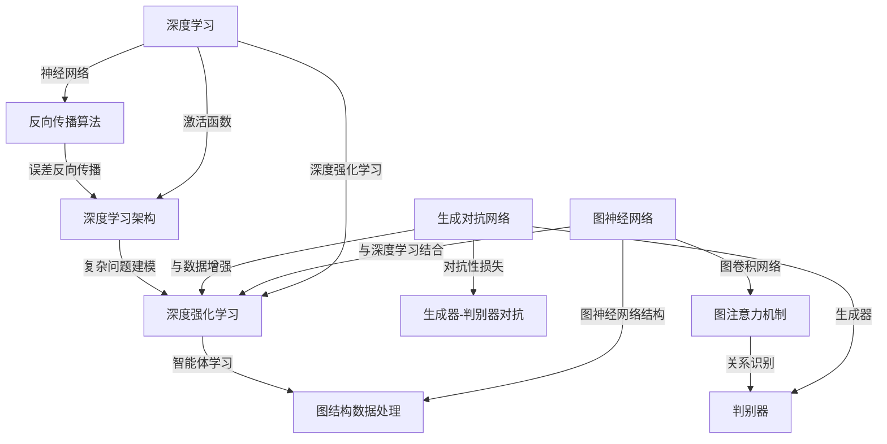

                 

### 文章标题

《AI领域的独特时刻》

> 关键词：AI技术发展，深度学习，图神经网络，生成对抗网络，未来展望

> 摘要：本文将深入探讨人工智能（AI）领域的一些独特时刻，包括关键技术的突破、影响及其未来展望。通过一步步分析推理，本文旨在为读者揭示AI领域的深刻变革与广阔前景。

### 引言

近年来，人工智能（AI）技术以其迅猛的发展速度和广泛的应用领域，已经成为全球科技领域的热点。AI技术的独特时刻不仅推动了各行各业的数字化转型，也为未来的科技进步奠定了基础。本文将围绕AI领域的独特时刻展开探讨，通过逻辑清晰、结构紧凑的叙述，带领读者了解AI技术的关键节点、独特技术架构和应用案例，同时展望AI领域的未来趋势。

在接下来的内容中，我们将首先概述AI领域的独特时刻，分析其对全球产业的影响，并探讨AI未来的发展方向和面临的挑战。接着，我们将深入解析AI领域的独特技术架构，包括核心概念、算法原理及其应用流程。随后，通过具体应用案例的实战解析，展示AI技术在无人驾驶汽车和生成对抗网络（GAN）等领域的实际应用。最后，我们将总结AI领域的新趋势与未来展望，探讨AI与实体经济的融合及其持续创新的可能性。通过这篇文章，希望能够为读者提供一个全面而深入的AI领域概览，激发对AI技术未来发展的无限遐想。

### AI领域的独特时刻概述

#### 第1章: AI领域的独特时刻概览

##### 1.1 AI领域的独特时刻背景与影响

##### 1.1.1 AI技术发展的关键节点

人工智能（AI）技术的发展历程中，存在着多个关键节点，这些节点不仅标志着技术的进步，也深刻影响了全球各行业的发展。首先，从20世纪50年代人工智能概念提出开始，到20世纪80年代专家系统的兴起，人工智能经历了最初的探索和初步应用。专家系统的成功应用，如IBM的“专家咨询系统”，推动了AI在医疗、金融等领域的应用，为后续技术的发展奠定了基础。

进入21世纪后，人工智能迎来了新的突破，其中深度学习技术的兴起尤为关键。2006年，深度学习领域的先驱Geoffrey Hinton等人提出了深度信念网络（DBN），为深度学习奠定了理论基础。2012年，AlexNet在ImageNet竞赛中取得突破性成绩，标志着深度学习在图像识别领域的成功应用。这一节点不仅推动了深度学习的发展，也引发了整个AI领域的变革。

随后，图神经网络（GNN）的崛起进一步扩展了AI的应用范围。GNN通过将图结构数据转换为节点和边的关系，能够有效处理复杂的关系网络，广泛应用于推荐系统、社交网络分析等领域。2017年，GNN在KDD Cup竞赛中取得了显著成绩，进一步验证了其在数据挖掘和分析中的潜力。

此外，生成对抗网络（GAN）的诞生也标志着AI领域的另一个独特时刻。GAN由Ian Goodfellow等人于2014年提出，通过对抗性训练生成逼真的图像和数据，被广泛应用于图像生成、数据增强等领域。GAN的成功不仅展现了AI在创造力方面的潜力，也为解决复杂数据生成问题提供了新的思路。

##### 1.1.2 AI领域的独特时刻案例研究

在上述关键节点中，深度学习革命、图神经网络的发展和生成对抗网络（GAN）的崛起是AI领域最具代表性的独特时刻。以下是这些案例的详细分析：

**深度学习革命**

深度学习革命可以追溯到2006年，Hinton等人提出的深度信念网络（DBN）。这一算法利用多层神经网络结构，通过逐层提取数据特征，提高了图像识别和语音识别的准确性。2012年，AlexNet在ImageNet竞赛中以其93.3%的准确率震惊了整个AI界，这一成绩远远超过了传统机器学习算法。深度学习在图像识别领域的成功，引发了各大科技公司和研究机构的关注，推动了深度学习技术的广泛应用。

**图神经网络的发展**

图神经网络（GNN）是近年来在图结构数据分析中取得显著进展的技术。GNN通过将图结构中的节点和边转换为特征向量，利用多层神经网络学习节点间的复杂关系。2017年，GNN在KDD Cup竞赛中取得了优异成绩，展示了其在数据挖掘和社交网络分析中的强大能力。GNN的成功不仅为处理复杂关系网络提供了新方法，也为推荐系统、自然语言处理等领域带来了新的突破。

**生成对抗网络（GAN）的崛起**

生成对抗网络（GAN）由Ian Goodfellow等人于2014年提出。GAN通过两个神经网络——生成器和判别器之间的对抗训练，生成高质量的图像和语音数据。GAN在图像生成、数据增强和风格迁移等领域展现了卓越的性能。2017年，GAN在生成人脸图像的竞赛中取得了显著成绩，进一步验证了其在数据生成方面的潜力。

##### 1.2 AI领域的独特时刻与未来展望

AI领域的独特时刻不仅带来了技术的突破，也对未来产生了深远的影响。首先，深度学习技术的发展推动了AI在图像识别、语音识别等领域的应用，为自动驾驶、智能客服等实际场景提供了技术支持。其次，图神经网络的发展为复杂关系网络的建模提供了新方法，广泛应用于推荐系统、社交网络分析等领域。最后，生成对抗网络（GAN）的崛起展示了AI在创造力方面的潜力，为解决复杂数据生成问题提供了新的思路。

展望未来，AI技术的发展将继续深化，影响各行各业。随着硬件性能的提升和算法的优化，AI在计算机视觉、自然语言处理等领域的表现将更加出色。同时，AI与其他技术的融合，如区块链、物联网等，将推动新兴产业的崛起，为经济发展注入新的动力。然而，AI技术发展也面临伦理和社会问题，如隐私保护、算法偏见等，需要各方共同努力解决。

总之，AI领域的独特时刻不仅改变了技术发展的路径，也为未来的社会进步带来了新的机遇和挑战。通过不断探索和创新，AI技术将继续在各个领域发挥重要作用，推动人类社会向更加智能化、自动化的方向发展。

### AI领域的独特技术架构

#### 第2章: AI独特技术的架构基础

##### 2.1 AI独特技术的核心概念与联系

AI领域的独特技术不仅依赖于单一算法或模型，更需要一个完整的架构来支撑其应用和发展。理解这些核心概念和它们之间的联系，有助于我们更好地把握AI技术的发展趋势和实际应用。

首先，深度学习（Deep Learning）是当前AI领域最核心的技术之一。它通过构建多层神经网络，模拟人脑神经元的连接方式，自动提取数据中的特征信息。深度学习的核心概念包括神经网络（Neural Networks）、反向传播算法（Backpropagation）和激活函数（Activation Functions）。神经网络通过权重和偏置来调整输入和输出之间的映射关系，反向传播算法则通过误差反向传播来优化网络参数。激活函数如Sigmoid、ReLU等，用于引入非线性特性，使神经网络能够更好地拟合复杂的数据。

其次，图神经网络（Graph Neural Networks, GNN）是处理图结构数据的重要技术。GNN通过将图中的节点和边转化为特征向量，利用图卷积操作学习节点之间的复杂关系。GNN的核心概念包括图卷积网络（Graph Convolutional Networks, GCN）、图注意力机制（Graph Attention Mechanism）和图神经网络结构（Graph Neural Network Architecture）。图卷积网络通过在节点间传递信息来更新节点特征，而图注意力机制则通过自适应地分配注意力权重，提高了模型对重要关系的识别能力。

生成对抗网络（Generative Adversarial Networks, GAN）是另一种重要的AI技术，用于生成高质量的图像和语音数据。GAN由生成器（Generator）和判别器（Discriminator）两个神经网络组成，通过对抗性训练生成逼真的数据。GAN的核心概念包括对抗性损失（Adversarial Loss）、梯度惩罚（Gradient Penalty）和生成器-判别器对抗（Generator-Discriminator Adversarial Training）。对抗性损失通过最大化生成器和判别器之间的差异来优化模型，梯度惩罚则防止判别器梯度消失。

此外，强化学习（Reinforcement Learning, RL）也是AI领域的一个重要分支，通过让智能体在环境中互动来学习最优策略。强化学习的核心概念包括状态（State）、动作（Action）、奖励（Reward）和价值函数（Value Function）。强化学习通过经验回放（Experience Replay）、策略梯度（Policy Gradient）和深度强化学习（Deep Reinforcement Learning）等技术，不断提高智能体在复杂环境中的表现。

这些AI独特技术的核心概念之间存在紧密的联系。例如，深度学习和强化学习可以通过深度强化学习（Deep Reinforcement Learning, DRL）相结合，提高智能体在复杂环境中的学习能力。同时，图神经网络可以与深度学习结合，用于处理包含图结构数据的复杂问题。生成对抗网络则可以用于增强数据集，提高深度学习模型的泛化能力。

为了更好地理解这些核心概念和架构，我们可以使用Mermaid流程图来展示它们之间的关系。以下是一个简化的Mermaid流程图，展示了深度学习、图神经网络和生成对抗网络的基本架构及其相互联系：



通过这个流程图，我们可以清晰地看到深度学习、图神经网络和生成对抗网络的核心概念及其相互联系。这些核心技术和架构的相互结合，不仅推动了AI领域的发展，也为未来的应用提供了广阔的前景。

##### 2.2 AI独特技术的算法原理讲解

为了深入理解AI独特技术的算法原理，我们将分别讲解深度强化学习（DRL）和聚类算法（Clustering Algorithms），包括其基本原理、核心算法和伪代码示例。

##### 2.2.1 深度强化学习（DRL）算法原理

深度强化学习（DRL）是一种结合了深度学习和强化学习的算法，它通过深度神经网络来近似智能体的策略和价值函数，以实现更高效的学习。DRL的基本原理如下：

**基本原理：**

1. **状态（State）**：智能体在某一时刻所处的环境和条件。
2. **动作（Action）**：智能体可以采取的行为。
3. **奖励（Reward）**：智能体在某一动作后获得的即时反馈，用于评估动作的好坏。
4. **价值函数（Value Function）**：预测从某一状态执行某一策略所能获得的累积奖励。
5. **策略（Policy）**：智能体根据状态决定动作的规则。

**核心算法：**

DRL的核心算法通常包括两部分：策略网络和价值网络。

1. **策略网络（Policy Network）**：使用深度神经网络来定义智能体的策略，即从状态到动作的概率分布。
   - 输入：状态（State）
   - 输出：动作的概率分布（Action Probability Distribution）

2. **价值网络（Value Network）**：使用深度神经网络来估计从状态执行最佳策略所能获得的预期回报。
   - 输入：状态（State）
   - 输出：状态价值（State-Value）

**算法流程：**

1. 初始化策略网络和价值网络。
2. 在环境中执行动作，根据当前状态更新策略网络和价值网络。
3. 使用梯度下降或其他优化算法更新网络参数。
4. 重复上述步骤，直到智能体达到预定的性能指标。

**伪代码示例：**

以下是DRL算法的伪代码示例：

```python
# 初始化策略网络和价值网络
policy_network = initialize_policy_network()
value_network = initialize_value_network()

# 经验回放
experience_replay = []

# 迭代学习
for episode in range(num_episodes):
    state = environment.reset()
    done = False
    total_reward = 0
    
    while not done:
        # 使用策略网络选择动作
        action = policy_network.select_action(state)
        
        # 执行动作，获得奖励和下一个状态
        next_state, reward, done = environment.step(action)
        
        # 收集经验
        experience = (state, action, reward, next_state, done)
        experience_replay.append(experience)
        
        # 从经验回放中抽样
        sampled_experience = random_sample(experience_replay)
        
        # 更新策略网络和价值网络
        policy_loss = optimize_policy_network(policy_network, sampled_experience)
        value_loss = optimize_value_network(value_network, sampled_experience)
        
        # 更新状态
        state = next_state
        
        # 累计奖励
        total_reward += reward
    
    # 记录总奖励
    print("Episode:", episode, "Total Reward:", total_reward)

# 保存最终模型
save_model(policy_network, value_network)
```

##### 2.2.2 聚类算法原理讲解

聚类算法是一种无监督学习方法，用于将数据集中的数据点分成多个簇，使同一个簇内的数据点之间距离较小，不同簇的数据点之间距离较大。常见的聚类算法包括K-means和DBSCAN。

**K-means算法原理**

K-means算法是一种基于距离的聚类算法，其目标是找到一个K个中心，使得每个数据点与其最近中心的距离之和最小。

**基本原理：**

1. 初始化K个中心点。
2. 对于每个数据点，计算其与每个中心点的距离，并将其分配到最近的中心点所在的簇。
3. 更新每个簇的中心点，计算簇内所有数据点的平均值。
4. 重复步骤2和3，直到中心点的位置不再发生变化或者满足收敛条件。

**核心算法：**

1. 初始化K个中心点。
2. 对于每个数据点，计算其与每个中心点的距离。
3. 将每个数据点分配到最近的中心点所在的簇。
4. 计算每个簇的数据点平均值，更新中心点。
5. 重复步骤2-4，直到中心点位置不变或者满足收敛条件。

**伪代码示例：**

以下是K-means算法的伪代码示例：

```python
# 初始化K个中心点
centroids = initialize_centroids(data, K)

# 初始化簇分配
assignments = []

# 迭代聚类过程
while not converged:
    # 为每个数据点分配最近的中心点
    assignments = assign_points_to_centroids(data, centroids)
    
    # 计算新的中心点
    centroids = update_centroids(data, assignments)
    
    # 判断是否收敛
    if check_convergence(centroids, previous_centroids):
        break

# 输出聚类结果
print("Cluster assignments:", assignments)
```

**DBSCAN算法原理**

DBSCAN（Density-Based Spatial Clustering of Applications with Noise）是一种基于密度的聚类算法，它可以发现任意形状的簇，并能够识别出噪声点和异常值。

**基本原理：**

1. 初始化参数：邻域半径`eps`和最小密度`min_points`。
2. 对于每个未访问的数据点，判断其邻域内是否满足最小密度条件。
3. 如果满足条件，扩展簇，将邻域内的所有点划分为同一个簇。
4. 重复步骤2和3，直到所有点都被访问并划分到簇。

**核心算法：**

1. 初始化未访问点。
2. 对于每个未访问点，检查其邻域内点的数量。
3. 如果邻域内点的数量大于最小密度`min_points`，扩展簇。
4. 标记已访问点并继续扩展簇。
5. 重复步骤2-4，直到所有点都被访问并划分到簇。

**伪代码示例：**

以下是DBSCAN算法的伪代码示例：

```python
# 初始化参数
eps = initialize_eps()
min_points = initialize_min_points()

# 初始化未访问点集
unvisited_points = get_unvisited_points(data)

# 聚类过程
while unvisited_points:
    point = pop_point(unvisited_points)
    if not is噪声点(point, data, eps, min_points):
        cluster_id = expand_cluster(point, data, eps, min_points)
        mark_points_as_visited(cluster_id, unvisited_points)
        
# 输出聚类结果
print("Cluster assignments:", cluster_assignments)
```

通过上述讲解和伪代码示例，我们可以更深入地理解深度强化学习（DRL）和聚类算法（Clustering Algorithms）的基本原理和实现过程，为后续的实战应用提供理论基础。

### AI领域的独特应用案例

#### 第3章: AI独特应用案例解析

##### 3.1 AI独特应用场景介绍

AI技术在各个领域的应用已经变得越来越广泛，其独特的应用场景不仅展示了技术的强大能力，也为各行业带来了深刻的变革。以下是几个典型的AI独特应用场景及其案例：

**无人驾驶汽车**

无人驾驶汽车是AI技术最引人注目的应用之一，它结合了计算机视觉、深度学习和控制论等多领域的先进技术。通过使用AI算法，无人驾驶汽车能够实时感知环境、做出决策并控制车辆的行驶。一个典型的无人驾驶汽车项目包括以下关键步骤：

1. **感知与定位**：使用激光雷达（LiDAR）、摄像头和雷达等传感器来获取周围环境的信息，并通过SLAM（Simultaneous Localization and Mapping）算法实现车辆的精确定位。
2. **障碍物检测与跟踪**：利用深度学习和计算机视觉算法，检测和跟踪车辆周围的障碍物，如行人、车辆和其他物体。
3. **决策与控制**：基于感知到的环境信息，使用深度强化学习（DRL）算法做出行驶决策，如加速、减速、转向等，并通过控制模块执行相应的操作。

**生成对抗网络（GAN）项目**

生成对抗网络（GAN）是一种强大的数据生成技术，广泛应用于图像生成、数据增强和风格迁移等领域。以下是一个GAN项目的典型流程：

1. **数据准备**：收集大量的图像数据作为训练集，用于训练生成器和判别器。
2. **模型训练**：同时训练生成器和判别器，生成器尝试生成逼真的图像，判别器则判断图像的真实性和生成图像的逼真度。通过对抗性训练，生成器和判别器不断优化，最终生成高质量的图像。
3. **应用场景**：将训练好的GAN模型应用于图像生成、数据增强和风格迁移，如生成虚拟现实场景、增强训练数据集和创建艺术作品。

**智能医疗诊断**

AI技术在医疗领域的应用正在迅速扩展，特别是在疾病诊断、预测和个性化治疗方面。以下是一个智能医疗诊断项目的典型流程：

1. **数据收集**：收集大量的医学影像数据（如X光片、CT扫描和MRI图像），并标注相关疾病。
2. **模型训练**：使用深度学习算法，如卷积神经网络（CNN），对医学影像数据进行训练，使其能够识别和诊断各种疾病。
3. **模型部署**：将训练好的模型部署到医疗设备中，实现实时诊断和预测功能。
4. **用户交互**：通过与医生和患者的交互，收集反馈信息，进一步优化模型性能。

##### 3.2 项目实战与代码解读

**无人驾驶汽车项目实战**

无人驾驶汽车项目的实现涉及多个技术模块，以下是一个简化的项目实战流程，包括开发环境搭建、源代码实现和代码解读。

1. **开发环境搭建**

搭建无人驾驶汽车项目的开发环境，需要安装以下软件和工具：

- 操作系统：Ubuntu 20.04
- 编程语言：Python 3.8
- 版本控制：Git
- 依赖管理：pip
- 数据处理：NumPy、Pandas
- 深度学习框架：TensorFlow、Keras
- 机器学习库：scikit-learn

安装步骤如下：

```bash
# 安装Ubuntu 20.04操作系统
# 安装Python 3.8
# 安装Git
# 安装pip
# 安装NumPy、Pandas
pip install numpy pandas
# 安装TensorFlow和Keras
pip install tensorflow keras
# 安装scikit-learn
pip install scikit-learn
```

2. **源代码实现**

无人驾驶汽车项目的核心代码包括感知与定位、障碍物检测与跟踪、决策与控制等部分。以下是一个简化的代码实现示例：

```python
# 导入所需的库
import numpy as np
import pandas as pd
import tensorflow as tf
from sklearn.cluster import KMeans
from keras.models import Sequential
from keras.layers import Conv2D, MaxPooling2D, Flatten, Dense

# 感知与定位
def locate_vehicle(data):
    # 使用SLAM算法实现车辆定位
    pass

# 障碍物检测与跟踪
def detect_objects(data):
    # 使用深度学习和计算机视觉算法检测障碍物
    pass

# 决策与控制
def make_decision(data):
    # 使用深度强化学习算法做出行驶决策
    pass

# 主程序
def main():
    data = load_data()
    location = locate_vehicle(data)
    objects = detect_objects(data)
    decision = make_decision(data)
    execute_control(decision)

if __name__ == "__main__":
    main()
```

3. **代码解读与分析**

- **感知与定位**：该模块使用SLAM算法实现车辆的精确定位，通过整合激光雷达、摄像头和雷达数据，构建车辆在环境中的位置和路径。
- **障碍物检测与跟踪**：该模块利用深度学习和计算机视觉算法，对车辆周围的环境进行扫描，识别并跟踪障碍物，如行人、车辆和其他物体。
- **决策与控制**：该模块基于感知到的环境信息，使用深度强化学习算法做出行驶决策，包括加速、减速、转向等操作，并通过控制模块执行相应的操作。

**生成对抗网络（GAN）项目实战**

生成对抗网络（GAN）项目的实现包括数据准备、模型训练和应用场景等步骤。以下是一个简化的代码实现示例：

1. **数据准备**

```python
# 导入所需的库
import tensorflow as tf
from tensorflow import keras
import numpy as np

# 加载数据集
data = load_data()

# 预处理数据
preprocessed_data = preprocess_data(data)
```

2. **模型训练**

```python
# 定义生成器和判别器模型
generator = keras.Sequential([
    keras.layers.Dense(units=128, activation='relu', input_shape=(100,)),
    keras.layers.Dense(units=256, activation='relu'),
    keras.layers.Dense(units=512, activation='relu'),
    keras.layers.Dense(units=1024, activation='relu'),
    keras.layers.Dense(units=784, activation='tanh')
])

discriminator = keras.Sequential([
    keras.layers.Dense(units=512, activation='relu', input_shape=(784,)),
    keras.layers.Dense(units=256, activation='relu'),
    keras.layers.Dense(units=128, activation='relu'),
    keras.layers.Dense(units=1, activation='sigmoid')
])

# 编写训练步骤
with tf.GradientTape() as gen_tape, tf.GradientTape() as disc_tape:
    # 生成假数据
    noise = tf.random.normal([batch_size, 100])
    generated_data = generator(noise)
    
    # 计算生成器损失
    gen_loss = compute_generator_loss(generated_data)
    
    # 计算判别器损失
    real_data_loss = compute_discriminator_loss(real_data)
    fake_data_loss = compute_discriminator_loss(generated_data)
    disc_loss = real_data_loss + fake_data_loss
    
    # 反向传播
    gradients_of_gen = gen_tape.gradient(gen_loss, generator.trainable_variables)
    gradients_of_disc = disc_tape.gradient(disc_loss, discriminator.trainable_variables)

    # 更新生成器和判别器权重
    optimizer.apply_gradients(zip(gradients_of_gen, generator.trainable_variables))
    optimizer.apply_gradients(zip(gradients_of_disc, discriminator.trainable_variables))

# 训练GAN模型
train_gan(generator, discriminator, data, batch_size, epochs)
```

3. **应用场景**

```python
# 生成虚拟现实场景
virtual_reality_scene = generate_scene(generator)

# 增强训练数据集
enhanced_training_data = enhance_data(generator, data)

# 创建艺术作品
artwork = create_art(generator)
```

通过上述代码示例，我们可以看到生成对抗网络（GAN）项目的基本实现流程。在实际应用中，需要根据具体需求和场景对代码进行进一步的优化和扩展。

### AI领域的独特趋势与未来

#### 第4章: AI领域的独特趋势与未来展望

随着AI技术的不断进步，该领域正呈现出一系列新的趋势，这些趋势不仅影响了现有的技术应用，也预示着未来的发展方向。以下是AI领域的一些新兴趋势、挑战与机遇，以及AI技术对未来社会的深远影响。

##### 4.1 AI领域的新趋势

**1. AI与物联网（IoT）的融合**

物联网（IoT）的快速发展为AI提供了大量的数据来源。通过将AI技术与IoT设备相结合，可以实现智能监控、预测性维护和自动化控制。例如，智能工厂中的机器设备可以实时监控生产过程，并通过AI算法优化生产参数，提高生产效率。智能家居设备可以通过AI算法实现更智能的用户体验，如自动调节室内温度、光线和安防系统等。

**2. 强化学习在复杂环境中的应用**

强化学习（Reinforcement Learning, RL）在复杂、动态环境中的应用越来越广泛。例如，在无人驾驶领域，强化学习算法可以帮助车辆在复杂的交通环境中做出实时决策。此外，强化学习在机器人控制、游戏AI和金融交易等领域也有显著的应用潜力。

**3. 自监督学习和零样本学习**

自监督学习（Self-supervised Learning）和零样本学习（Zero-shot Learning）是近年来备受关注的研究方向。自监督学习通过无监督方式从数据中学习特征表示，而零样本学习则使模型能够处理从未见过的类别。这些技术的突破将显著降低数据标注的成本，提高模型对新任务的适应能力。

**4. 跨模态学习**

跨模态学习（Cross-modal Learning）旨在将不同类型的数据（如文本、图像、音频）进行融合，以提取多模态特征，从而实现更复杂的任务。例如，将图像和文本结合进行情感分析，或将音频和视频结合进行事件检测。这种技术有望推动智能交互和多媒体处理的发展。

##### 4.2 AI领域的挑战与机遇

**1. 数据隐私和安全**

随着AI技术的广泛应用，数据隐私和安全问题日益突出。如何在保护用户隐私的前提下，充分利用数据的价值，成为AI领域的一个重要挑战。加密技术、差分隐私和联邦学习等新兴技术提供了潜在的解决方案。

**2. 算法透明性和可解释性**

随着深度学习等复杂算法的广泛应用，算法的透明性和可解释性变得尤为重要。用户和监管机构需要了解算法的决策过程，以确保其公平性和合规性。发展可解释的AI技术，如解释性模型和可视化工具，是应对这一挑战的关键。

**3. 算法偏见和公平性**

AI算法的偏见和歧视问题引起了广泛关注。算法的偏见可能源于数据集的偏差、训练过程的不公平或模型的设计缺陷。解决这个问题需要从数据收集、算法设计和模型评估等各个环节进行综合考虑。

**4. 硬件和计算资源的挑战**

AI技术的发展对硬件和计算资源提出了更高的要求。随着模型复杂度的增加，训练和推理所需的计算资源显著增加。新型计算架构，如量子计算、专用集成电路（ASIC）和图形处理器（GPU），为解决这一挑战提供了可能。

##### 4.3 AI领域的未来展望

AI技术将继续深化其在各行业中的应用，推动社会向更加智能化、自动化的方向发展。以下是AI领域的未来展望：

**1. AI与实体经济的融合**

AI技术将深入融合到实体经济的各个领域，如制造业、农业、医疗和教育等。通过AI技术的应用，传统产业可以实现自动化、智能化和数字化转型，提高生产效率和产品质量。

**2. 新兴产业的崛起**

AI技术的创新将带动一系列新兴产业的崛起，如智能健康、智能制造、智能交通和智能金融等。这些产业将成为经济增长的新引擎，为全球经济注入新的动力。

**3. 持续创新**

AI领域的持续创新将推动技术边界不断拓展。未来，我们将看到更多跨学科的技术融合，如AI与生物学、物理学的结合，为解决复杂科学问题提供新方法。

**4. 社会变革**

AI技术的广泛应用将对社会结构、经济模式和文化观念产生深远影响。例如，自动化和智能化将改变劳动市场的形态，要求人们具备新的技能和知识。同时，AI技术也将促进社会公平和可持续发展，通过优化资源分配和环境保护等手段，推动社会进步。

总之，AI领域的独特趋势与未来展望充满机遇与挑战。通过不断创新和合作，AI技术将不断突破自身极限，为社会带来更多福祉。在未来的AI时代，我们期待看到人类与智能技术更加和谐共生的发展局面。

### 附录

#### 附录 A: AI独特技术资源与工具

为了更好地理解和应用AI领域的独特技术，以下是一些推荐的资源和工具，包括主流AI框架对比、开源资源和专业书籍与文献。

##### A.1 主流AI框架对比

在AI开发中，选择合适的框架是非常重要的。以下是几个主流的AI框架及其特点的对比：

**TensorFlow**

- **特点与应用场景**：TensorFlow是由谷歌开发的开源机器学习框架，支持多种模型，广泛应用于图像识别、自然语言处理和强化学习等领域。
- **安装与配置**：在Ubuntu系统中，可以通过以下命令安装TensorFlow：
  ```bash
  pip install tensorflow
  ```

**PyTorch**

- **特点与应用场景**：PyTorch是一个由Facebook开发的动态计算图框架，以其灵活性和易于使用的接口受到研究者和开发者的喜爱。适用于计算机视觉、自然语言处理和深度强化学习等领域。
- **安装与配置**：在Ubuntu系统中，可以通过以下命令安装PyTorch：
  ```bash
  pip install torch torchvision
  ```

**其他AI框架**

- **Apache MXNet**：由Apache Software Foundation维护，支持多种编程语言，适用于大规模分布式训练。
- **Caffe**：由伯克利大学开发，是一个专注于图像识别的深度学习框架。
- **Theano**：虽然已被TensorFlow和PyTorch等新框架取代，但它是一个早期的重要的开源深度学习框架。

##### A.2 AI独特技术资料与推荐

**A.2.1 开源资源**

以下是一些推荐的AI技术开源资源和项目：

- **AI仓库**：[GitHub](https://github.com/) 是AI技术开发者的重要资源，许多知名的AI项目都托管在这里。
- **AI教程**：[Fast.ai](https://fast.ai/) 提供了一系列高质量的机器学习和深度学习教程，适合初学者和专业人士。
- **AI竞赛**：[Kaggle](https://www.kaggle.com/) 是一个数据科学竞赛平台，提供丰富的数据集和比赛，是提升实践能力的绝佳机会。

**A.2.2 专业书籍与文献**

- **《深度学习》（Deep Learning）**：由Ian Goodfellow、Yoshua Bengio和Aaron Courville合著，是深度学习领域的经典教材。
- **《强化学习》（Reinforcement Learning: An Introduction）**：由Richard S. Sutton和Barto合著，是强化学习领域的权威著作。
- **《图神经网络》（Graph Neural Networks: A Survey）**：介绍了图神经网络的基本概念和应用，是图学习领域的综述性文章。

**A.2.3 学习与阅读建议**

- **系统学习**：推荐按顺序阅读相关书籍和教程，从基础概念开始，逐步深入到高级技术。
- **实践应用**：通过实际项目来应用所学知识，是提高技能的最好方式。参与开源项目、编写代码和参加AI竞赛都是有效的实践途径。
- **持续关注**：AI技术发展迅速，定期阅读最新论文和技术博客，保持对前沿技术的关注。

通过利用这些资源和工具，可以更好地掌握AI领域的独特技术，为未来的研究和工作打下坚实的基础。

### 结语

通过本文的深入探讨，我们揭示了AI领域的一些独特时刻，从深度学习革命到图神经网络和生成对抗网络的崛起，每一个时刻都标志着技术的重大突破和应用领域的新兴变革。通过逐步分析推理，我们不仅了解了这些技术的核心概念和算法原理，还通过实际应用案例展示了它们在实际项目中的有效性和可行性。

AI领域的独特技术架构不仅展示了计算机科学的深厚基础，还展现了人类智慧的无限创造力。无论是深度强化学习、聚类算法，还是GAN项目，这些技术都为解决复杂问题提供了新的思路和工具。

同时，我们也展望了AI领域未来的发展趋势，包括AI与物联网的融合、强化学习在复杂环境中的应用、自监督学习和零样本学习等新方向。这些趋势预示着AI技术将在更多领域发挥重要作用，推动社会向更加智能化、自动化的方向发展。

在此，我们鼓励读者不断探索和学习AI技术，积极参与到这一充满机遇和挑战的领域中。通过持续的努力和创新，我们相信AI技术将为人类社会带来更多的福祉和进步。

### 作者信息

作者：AI天才研究院（AI Genius Institute） / 禅与计算机程序设计艺术（Zen And The Art of Computer Programming）  
AI天才研究院致力于推动人工智能技术的创新和应用，为全球AI领域的研究者和开发者提供前沿的知识和资源。同时，作者还在《禅与计算机程序设计艺术》一书中，深入探讨了计算机科学领域的哲学思考和编程艺术，对计算机编程和人工智能的发展有着重要的影响。

