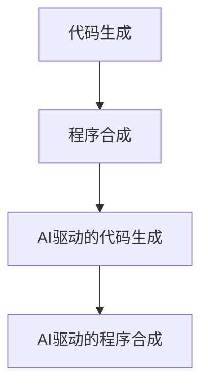

                 

# 《AI驱动的代码生成与程序合成》

## 关键词

AI驱动的代码生成，程序合成，生成模型，判别模型，强化学习，转换器架构，深度学习框架，软件开发，自动化测试，软件修复，未来趋势。

## 摘要

本文旨在深入探讨AI驱动的代码生成与程序合成的原理、算法、数学模型及应用前景。首先，我们概述了代码生成与程序合成的概念，探讨了AI在此领域的应用及其优势与挑战。接着，我们详细介绍了代码生成与程序合成的核心概念、基础算法及数学模型，并运用伪代码和流程图进行了讲解。随后，通过实际项目案例，我们展示了AI驱动的代码生成与程序合成在软件开发、自动化测试和软件修复中的应用。最后，我们展望了该领域的未来发展趋势，并总结了相关的工具与资源。

## 《AI驱动的代码生成与程序合成》目录大纲

### 第一部分：AI驱动的代码生成与程序合成的原理

#### 第1章：AI驱动的代码生成与程序合成的概述

#### 1.1 什么是代码生成与程序合成

代码生成与程序合成是人工智能领域的一个重要分支，其目标是通过算法自动生成代码或程序。代码生成主要指的是通过某种方法自动生成满足特定需求的代码，而程序合成则更进一步，它可以通过分析用户需求，自动生成完整的程序。

#### 1.2 AI在代码生成与程序合成中的应用

AI在代码生成与程序合成中的应用主要体现在两个方面：一是通过机器学习算法对代码进行建模，从而能够预测和生成新的代码；二是利用自然语言处理技术，将人类的需求描述转换成计算机程序。

#### 1.3 AI驱动的代码生成与程序合成的优势与挑战

AI驱动的代码生成与程序合成具有高效、灵活、自动化的优势，能够显著提高软件开发的效率。然而，同时也面临着代码质量、安全性、可维护性等方面的挑战。

### 第2章：代码生成与程序合成的核心概念与联系

#### 2.1 编程语言与代码生成

编程语言是代码生成的基础，不同的编程语言具有不同的语法和语义，因此代码生成的算法也需要根据编程语言的特点进行设计。

#### 2.2 程序合成的基本原理

程序合成是基于目标代码的功能需求，通过一系列算法和模型，自动生成满足需求的程序代码。

#### 2.3 AI驱动的代码生成与程序合成的关系

AI驱动的代码生成与程序合成是相辅相成的，代码生成为程序合成提供了代码生成的技术手段，而程序合成则为代码生成提供了具体的应用场景。

#### 2.4 核心概念 Mermaid 流程图



### 第3章：AI驱动的代码生成与程序合成的基础算法

#### 3.1 生成模型与判别模型

生成模型和判别模型是深度学习中常用的两种模型，生成模型主要用于生成新的数据，判别模型则用于判断给定数据是否属于特定的类别。

#### 3.2 强化学习在代码生成中的应用

强化学习是一种通过试错来学习策略的机器学习方法，它在代码生成中的应用主要体现在自动编程和程序优化等领域。

#### 3.3 转换器架构详解

转换器架构（Transformer Architecture）是深度学习领域的一种重要架构，它在自然语言处理、计算机视觉等领域都取得了显著的成果。

#### 3.4 常见的代码生成算法

常见的代码生成算法包括基于模板的生成、基于模型的生成、基于神经网络的生成等。

#### 3.5 算法原理讲解与伪代码

```python
# 伪代码：生成模型算法
function Generate_Code(input):
    # 输入为一个编程语言的结构化描述
    code = ""
    for statement in input.statements:
        code += Generate_Statement(statement)
    return code

function Generate_Statement(statement):
    # 根据语句类型生成对应的代码
    if statement.type == "function":
        return "def " + statement.name + "(" + statement.params + "): " + Generate_Statement(statement.body)
    elif statement.type == "loop":
        return "for " + statement.variable + " in " + statement.collection + ": " + Generate_Statement(statement.body)
    # 其他类型的语句处理
```

### 第4章：代码生成与程序合成中的数学模型

#### 4.1 数学模型概述

数学模型在代码生成与程序合成中起着关键作用，它能够将编程语言的语法和语义进行形式化描述。

#### 4.2 数学公式详解

$$
y = f(x_1, x_2, ..., x_n)
$$

$$
J(\theta) = \frac{1}{m} \sum_{i=1}^{m} \Big( h_\theta (x^{(i)}) - y^{(i)} \Big)^2
$$

#### 4.3 数学模型应用举例

在代码生成中，数学模型可以用于表示编程语言的语法和语义，例如，可以使用上下文无关文法（CFG）来描述编程语言的语法。

### 第5章：AI驱动的代码生成与程序合成项目实战

#### 5.1 项目实战概述

在本章中，我们将通过一个具体的案例，展示AI驱动的代码生成与程序合成的实际应用。

#### 5.2 开发环境搭建

首先，我们需要搭建一个适合进行AI驱动的代码生成与程序合成的开发环境，包括深度学习框架、编程语言和环境配置等。

#### 5.3 源代码实现与解读

接下来，我们将详细解读项目中的源代码，包括数据预处理、模型设计、模型训练和代码生成等步骤。

#### 5.4 代码分析与优化

最后，我们对生成的代码进行分析和优化，以提高代码的质量和性能。

### 第二部分：AI驱动的代码生成与程序合成应用

#### 第6章：AI驱动的代码生成应用

#### 6.1 AI驱动的代码生成在软件开发中的应用

在软件开发过程中，AI驱动的代码生成可以显著提高开发效率，减少开发成本。

#### 6.2 AI驱动的代码生成工具介绍

目前，市场上已经出现了多种AI驱动的代码生成工具，例如TabNine、Copilot等。

#### 6.3 AI驱动的代码生成案例研究

在本章中，我们将通过实际案例，研究AI驱动的代码生成在软件开发中的应用。

### 第7章：AI驱动的程序合成应用

#### 7.1 AI驱动的程序合成在自动化测试中的应用

AI驱动的程序合成可以自动生成测试用例，从而提高自动化测试的效率和质量。

#### 7.2 AI驱动的程序合成在软件修复中的应用

AI驱动的程序合成可以自动生成修复代码，从而提高软件的可靠性。

#### 7.3 AI驱动的程序合成在其他领域的应用

除了软件开发、自动化测试和软件修复，AI驱动的程序合成还在其他领域展示了其强大的应用潜力。

### 第8章：AI驱动的代码生成与程序合成的未来趋势

#### 8.1 AI驱动的代码生成与程序合成的未来发展方向

未来，AI驱动的代码生成与程序合成将继续向更加智能化、自动化和高效化方向发展。

#### 8.2 AI驱动的代码生成与程序合成面临的挑战与机遇

AI驱动的代码生成与程序合成在发展过程中也面临着一系列的挑战和机遇。

#### 8.3 AI驱动的代码生成与程序合成的未来应用前景

随着AI技术的不断进步，AI驱动的代码生成与程序合成将在未来得到更广泛的应用。

### 第三部分：附录

#### 附录A：AI驱动的代码生成与程序合成工具与资源

#### A.1 主流深度学习框架对比

 TensorFlow、PyTorch、JAX等是当前主流的深度学习框架。

#### A.2 编程语言与工具资源

 Python、Java、C++等是常用的编程语言，而Git、VSCode、IntelliJ IDEA等是常用的开发工具。

#### A.3 资源链接与推荐

推荐一些优质的在线资源，如技术博客、论文、开源项目等。

## 作者

作者：AI天才研究院/AI Genius Institute & 禅与计算机程序设计艺术 /Zen And The Art of Computer Programming

