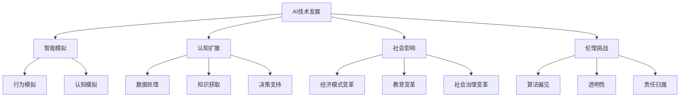

                 

# 文章标题: Andrej Karpathy：人工智能的哲学意义

> 关键词：人工智能、哲学意义、Andrej Karpathy、伦理、社会影响、未来展望

> 摘要：本文深入探讨了人工智能领域的杰出学者Andrej Karpathy的哲学观点。通过对人工智能的定义、历史、伦理和社会影响等方面的剖析，文章揭示了Karpathy对于人工智能核心问题的独特见解，并展望了人工智能未来发展的哲学意义。

## 《Andrej Karpathy：人工智能的哲学意义》目录大纲

## 第一部分: 引言

### 第1章: Andrej Karpathy介绍与背景

## 第二部分: 人工智能的哲学基础

### 第2章: 人工智能的定义与范畴

### 第3章: 人工智能的历史与发展趋势

### 第4章: 人工智能的伦理与道德问题

### 第5章: 人工智能的社会影响与挑战

### 第6章: 人工智能的未来预测与展望

## 第三部分: Andrej Karpathy的观点与思考

### 第7章: Andrej Karpathy对人工智能的理解

### 第8章: Andrej Karpathy对人工智能伦理的思考

### 第9章: Andrej Karpathy对人工智能社会影响的观点

### 第10章: Andrej Karpathy对未来人工智能的展望

## 第四部分: AI的哲学意义与实践

### 第11章: AI哲学意义的核心观点与应用

### 第12章: AI哲学在实践中的应用案例

### 第13章: AI哲学与人类文明的演进

### 第14章: AI哲学与未来世界

## 第五部分: 结论与展望

### 第15章: Andrej Karpathy：人工智能的哲学意义总结

### 第16章: 未来人工智能哲学的思考与展望

### 第17章: 附录

## 附录 A: 参考文献

## 附录 B: Mermaid 流程图

## 附录 C: 代码示例与解读

## 附录 D: Further Reading

---

## 第一部分: 引言

### 第1章: Andrej Karpathy介绍与背景

---

## 第二部分: 人工智能的哲学基础

### 第2章: 人工智能的定义与范畴

---

### 第3章: 人工智能的历史与发展趋势

---

### 第4章: 人工智能的伦理与道德问题

---

### 第5章: 人工智能的社会影响与挑战

---

### 第6章: 人工智能的未来预测与展望

---

## 第三部分: Andrej Karpathy的观点与思考

### 第7章: Andrej Karpathy对人工智能的理解

---

### 第8章: Andrej Karpathy对人工智能伦理的思考

---

### 第9章: Andrej Karpathy对人工智能社会影响的观点

---

### 第10章: Andrej Karpathy对未来人工智能的展望

---

## 第四部分: AI的哲学意义与实践

### 第11章: AI哲学意义的核心观点与应用

---

### 第12章: AI哲学在实践中的应用案例

---

### 第13章: AI哲学与人类文明的演进

---

### 第14章: AI哲学与未来世界

---

## 第五部分: 结论与展望

### 第15章: Andrej Karpathy：人工智能的哲学意义总结

---

### 第16章: 未来人工智能哲学的思考与展望

---

### 第17章: 附录

---

本文将从多个维度对人工智能的哲学意义进行深入探讨，旨在揭示Andrej Karpathy在这一领域的独特见解，并对人工智能的未来发展提供一些思考。接下来，我们将依次介绍Andrej Karpathy的背景、人工智能的定义与范畴、历史与发展趋势、伦理与道德问题、社会影响与挑战、未来预测与展望，以及他的个人观点与思考。随后，我们将进一步探讨AI的哲学意义和实践，最终在文章的结尾部分进行总结和展望。

---

## 第一部分: 引言

### 第1章: Andrej Karpathy介绍与背景

Andrej Karpathy是一位在人工智能（AI）领域享有盛誉的学者和专家。他毕业于多伦多大学，获得了计算机科学博士学位，目前是斯坦福大学计算机科学系的副教授。Karpathy的研究涉及深度学习、自然语言处理、计算机视觉等多个领域，他在这些领域发表了大量的高水平学术论文，并参与了多个重要的研究项目。

Karpathy不仅在学术上有着卓越的成就，他还以其深入浅出的写作风格和广泛的影响力而著称。他的博客文章和演讲经常被引用和分享，为大众普及了人工智能的基础知识和发展动态。此外，Karpathy还积极参与开源社区，为多个开源项目做出了重要贡献。

在人工智能的哲学意义上，Karpathy的观点具有独特的价值和深刻的启示。他关注人工智能的伦理问题、社会影响以及未来发展趋势，并提出了许多独到的见解。因此，本文将以Andrej Karpathy的研究和观点为切入点，深入探讨人工智能的哲学意义。

### 1.1 人工智能的哲学意义

人工智能的哲学意义在于其对人类认知、伦理和社会结构的深远影响。首先，人工智能的发展挑战了我们对智能和意识的认知。传统的智能定义通常局限于逻辑推理、数学计算等，而人工智能则通过模拟人类的学习和思考过程，扩展了智能的边界。这引发了对人类认知能力的重新审视和思考。

其次，人工智能的伦理问题也备受关注。随着AI技术的普及，如何确保其公平性、透明性和安全性成为一个重要的议题。AI系统的决策过程往往涉及到大量的数据，这些数据可能包含偏见和歧视。因此，如何在设计和使用AI系统时确保其伦理性和道德性，成为了一个亟待解决的问题。

最后，人工智能对社会的影响和挑战也是一个重要的哲学问题。AI技术的广泛应用可能带来就业机会的减少、隐私泄露的风险以及社会不平等的加剧。如何应对这些挑战，确保AI技术造福人类，而不是成为新的社会问题，是当前亟待解决的一个重要议题。

### 1.2 Andrej Karpathy的贡献

Andrej Karpathy在人工智能的哲学意义方面做出了诸多贡献。他的研究不仅涵盖了AI的技术层面，还包括了其伦理、社会和哲学问题。以下是他在这些方面的一些主要贡献：

1. **深度学习的哲学**：Karpathy在深度学习领域的研究使他有机会深入探讨这一技术背后的哲学问题。他提出了“神经网络是一种哲学工具”的观点，强调了深度学习技术在模拟人类思维过程中的作用。这种观点为理解和应用深度学习技术提供了新的视角。

2. **AI的伦理问题**：Karpathy对AI的伦理问题有着深刻的思考。他在多篇论文和演讲中讨论了AI系统的偏见、透明性和责任分配等问题。他提出了一些具体的方法和策略，以解决这些伦理问题，并促进AI技术的健康发展。

3. **社会影响的研究**：Karpathy关注AI技术对社会的影响，并提出了许多有见地的观点。他在论文《AI will disrupt society》中详细分析了AI技术可能带来的社会挑战和应对策略。这些观点为政策制定者和公众提供了宝贵的参考。

4. **未来展望**：Karpathy对未来人工智能的发展有着清晰的展望。他认为，人工智能将在许多领域发挥重要作用，如医疗、教育、交通等。同时，他也提出了需要注意的一些风险和挑战，以引导人们正确地应对未来的人工智能时代。

总的来说，Andrej Karpathy的研究和观点在人工智能的哲学意义上具有重要价值。他的贡献不仅丰富了我们对AI技术的理解，也为我们思考如何将这一技术应用于现实世界提供了宝贵的启示。

### 1.3 本文结构

本文的结构如下：

- **第一部分：引言**：介绍Andrej Karpathy的背景和人工智能的哲学意义，为后续讨论奠定基础。
- **第二部分：人工智能的哲学基础**：详细讨论人工智能的定义、历史、伦理和社会影响等问题，为理解Karpathy的观点提供背景知识。
- **第三部分：Andrej Karpathy的观点与思考**：深入探讨Karpathy对人工智能的理解、伦理思考、社会影响和未来展望。
- **第四部分：AI的哲学意义与实践**：分析AI哲学意义的核心观点、实践应用及其对人类文明的演进。
- **第五部分：结论与展望**：总结本文的主要观点，并对未来人工智能哲学的发展提出展望。

通过这样的结构安排，本文旨在系统地探讨人工智能的哲学意义，并揭示Andrej Karpathy在这一领域的重要贡献和独特见解。

## 第二部分：人工智能的哲学基础

### 第2章：人工智能的定义与范畴

人工智能（AI，Artificial Intelligence）是一个广泛的领域，涵盖了从简单的自动化任务到复杂的认知模拟的各种技术。其定义可以追溯到1956年，当时达特茅斯会议提出了“制造智能机器的科学与工程”这一概念。然而，人工智能的具体定义和范畴却随着技术的发展不断演变。

首先，从广义上讲，人工智能是指通过计算机系统模拟人类智能的过程。这包括感知、推理、学习、决策和行动等多个方面。人工智能可以分为两类：弱人工智能（Narrow AI）和强人工智能（General AI）。

弱人工智能是指专门设计用于解决特定问题的AI系统，如语音识别、图像识别、推荐系统等。这类AI系统在特定任务上表现出色，但缺乏通用性。而强人工智能则是指具有人类智能的所有特征，能够在任何情况下进行智能行为和自主决策。

其次，人工智能的范畴可以从不同的维度进行划分。首先，根据技术类型，人工智能可以分为符号主义人工智能、连接主义人工智能、行为主义人工智能和统计学习人工智能等。

符号主义人工智能基于逻辑和符号操作，通过推理和知识表示来解决问题。例如，专家系统就是一种典型的符号主义AI。

连接主义人工智能则基于神经网络，通过模拟人脑的神经元连接来学习和处理信息。深度学习和强化学习是连接主义人工智能的两个主要分支。

行为主义人工智能关注于通过观察和模仿人类行为来学习和改进系统性能，如机器人控制和自主导航等。

统计学习人工智能则通过统计模型和算法来分析数据，进行预测和分类。机器学习和数据挖掘是这一领域的重要分支。

此外，从应用领域来看，人工智能已经被广泛应用于各个行业，包括医疗、金融、交通、教育、娱乐等。例如，在医疗领域，AI被用于疾病诊断、药物研发和患者管理；在金融领域，AI被用于风险评估、欺诈检测和投资策略。

人工智能的范畴还涉及到伦理和法律问题。随着AI技术的普及，如何确保其公平性、透明性和安全性成为了一个重要的议题。例如，AI系统的决策过程可能涉及到隐私和数据保护问题，如何在设计和使用AI系统时保护个人隐私，是一个亟待解决的问题。

总之，人工智能的定义与范畴是一个复杂且不断发展的领域。从广义上讲，它涉及模拟人类智能的各种技术和应用；从具体维度来看，它涵盖了多种技术类型、应用领域和伦理法律问题。理解这些定义与范畴对于深入探讨人工智能的哲学意义具有重要意义。

### 2.1 人工智能的基本概念

在深入探讨人工智能的定义和范畴之前，我们需要了解一些基本概念，这些概念是理解人工智能哲学意义的基础。

**1. 智能**：智能是指一个系统或个体在特定任务上表现出解决问题的能力。它通常包括感知、推理、学习、决策和行动等能力。感知是指对环境信息的获取和处理；推理是指基于已有信息进行逻辑推理和判断；学习是指从数据中获取知识和经验，并应用这些知识解决新问题；决策是指在不同方案中选择最优的；行动是指根据决策执行具体操作。

**2. 学习算法**：学习算法是人工智能的核心技术，它使系统能够从数据中自动获取知识。学习算法可以分为监督学习、无监督学习和强化学习。

- **监督学习**：在监督学习算法中，系统通过已标记的数据学习输出结果。例如，通过标记的图像数据训练一个图像分类模型。
- **无监督学习**：无监督学习算法不依赖于已标记的数据，而是通过挖掘数据中的隐藏模式和结构来学习。例如，聚类算法用于发现数据中的相似群体。
- **强化学习**：强化学习是一种通过奖励和惩罚来训练模型的学习方式。系统通过不断尝试和反馈来学习最优策略，例如，在游戏中通过尝试不同的动作来获得高分。

**3. 神经网络**：神经网络是一种模拟人脑神经元连接的计算模型，它由大量的神经元（或节点）和连接（或权重）组成。神经网络通过调整连接权重来学习数据，从而实现复杂的模式识别和预测任务。深度学习是神经网络的一个分支，通过多层神经元的堆叠，实现了更复杂的特征提取和模型训练。

**4. 感知器**：感知器是一种简单的神经网络模型，它由一个或多个输入和输出组成。感知器通过调整输入权重来学习区分不同类别或特征。

**5. 知识表示**：知识表示是人工智能中一个关键问题，它涉及如何将知识或信息编码到计算机系统中。常见的知识表示方法包括逻辑表示、图表示和语义网络等。

**6. 决策过程**：决策过程是指从多个可选方案中选择最优方案的过程。在人工智能中，决策过程通常基于推理、预测和优化算法。例如，通过评估不同路径的概率和风险来选择最佳路线。

**7. 自主性**：自主性是指系统能够在没有人类干预的情况下自主执行任务和做出决策。实现自主性需要系统具备感知、学习、推理和行动等能力。

理解这些基本概念对于深入探讨人工智能的定义和范畴至关重要。这些概念不仅帮助我们理解人工智能的工作原理，还为我们思考其哲学意义提供了理论基础。接下来，我们将进一步探讨人工智能的历史与发展趋势，以更全面地了解这一领域。

### 2.2 人工智能的历史与发展趋势

人工智能（AI）的历史可以追溯到20世纪中叶，它经历了多个发展阶段，从早期的简单自动化到现代复杂的智能系统。了解这些发展历程有助于我们更好地理解AI的现状和未来趋势。

**1. 第一代：符号主义人工智能（1950s-1960s）**

人工智能的起源可以追溯到1950年代。这个时期的人工智能以符号主义（Symbolic AI）方法为主，该方法基于逻辑推理和符号表示。代表性工作包括艾伦·图灵（Alan Turing）的“计算机器”理论和约翰·麦卡锡（John McCarthy）提出的“人工智能”概念。1956年，达特茅斯会议标志着人工智能作为一个独立研究领域的正式诞生。然而，由于受限于计算机性能和知识表示方法，早期的符号主义AI并未取得显著进展。

**2. 第二代：连接主义人工智能（1970s-1980s）**

在20世纪70年代，人工智能的研究转向了连接主义（Connectionist AI），该方法基于模拟人脑的神经网络。神经网络通过大量的神经元和连接进行学习和信息处理，这种方法在图像识别、语音合成和机器翻译等领域取得了一些成功。1976年，约翰·霍普菲尔（John Hopfield）提出了Hopfield网络，为神经网络的研究奠定了基础。然而，连接主义人工智能在解释和理解神经网络内部机制方面仍面临挑战。

**3. 第三代：统计学习人工智能（1990s-2000s）**

在20世纪90年代，统计学习（Statistical Learning）方法成为人工智能研究的主流。统计学习方法通过分析大量数据，从数据中学习模式和规律。支持向量机（Support Vector Machines，SVM）、决策树（Decision Trees）和贝叶斯网络（Bayesian Networks）是这一时期的重要技术。统计学习方法的成功在于其强大的预测和分类能力，但也面临着数据依赖和解释性问题。

**4. 第四代：深度学习人工智能（2010s-至今）**

深度学习（Deep Learning）是近年来人工智能领域的一个重大突破。深度学习通过多层神经网络进行学习，实现了在图像识别、语音识别、自然语言处理等任务上的卓越表现。2012年，亚历克斯·克雷默（Alex Krizhevsky）在ImageNet图像识别竞赛中使用了深度学习算法，取得了惊人的成绩，这标志着深度学习时代的到来。随着计算能力的提升和大规模数据集的出现，深度学习在多个领域取得了突破性进展。

**5. 发展趋势**

当前，人工智能的发展呈现出以下几个趋势：

- **计算能力的提升**：随着计算能力的提升，深度学习等复杂算法得以在实际应用中实现，推动了人工智能技术的快速发展。
- **数据的重要性**：数据成为人工智能发展的关键因素。大规模数据集为训练复杂模型提供了基础，同时也带来了数据隐私和安全的问题。
- **多模态学习**：多模态学习是当前研究的热点，旨在通过整合不同类型的数据（如图像、文本、语音等），实现更强大的智能系统。
- **迁移学习和少样本学习**：迁移学习和少样本学习是解决小样本数据问题的有效方法，通过利用已有知识迁移到新任务和新数据集，提高了模型的泛化能力。
- **伦理和可解释性**：随着人工智能的广泛应用，伦理和可解释性成为重要的研究议题。如何确保AI系统的公平性、透明性和可解释性，是一个亟待解决的问题。

总之，人工智能的发展历程展示了从简单到复杂、从理论到实践的不断演进。随着技术的进步和应用的深入，人工智能将在未来继续发挥重要作用，同时也带来了新的挑战和机遇。

### 2.3 人工智能的伦理与道德问题

随着人工智能技术的迅速发展，其伦理与道德问题日益凸显。这些问题不仅关系到技术的正当性和合法性，也直接影响到社会和个人的福祉。以下是人工智能伦理与道德问题的主要方面。

**1. 数据隐私**：人工智能系统的运作依赖于大量的数据，这些数据可能包含个人的敏感信息。如何确保这些数据的安全和隐私，防止数据泄露和滥用，是一个重要的伦理问题。例如，面部识别技术虽然提供了便利，但也可能侵犯个人隐私。

**2. 算法偏见**：人工智能系统的决策过程可能受到训练数据中的偏见影响，导致不公平的结果。例如，一些招聘系统可能在无意识中偏向某些性别或种族，这可能导致歧视和排斥。如何消除算法偏见，确保系统的公平性，是一个亟待解决的挑战。

**3. 自主性与责任**：随着人工智能系统的自主性提高，如何界定系统的责任成为一个复杂的问题。如果系统出现错误或导致损害，责任应由谁承担？这需要法律和伦理框架的明确规定。

**4. 人机关系**：人工智能的普及将深刻改变人与人、人与机器之间的关系。如何确保人机互动的和谐和高效，避免人机冲突，是伦理研究的重要课题。

**5. 安全性问题**：人工智能系统可能成为网络攻击的目标，如何确保系统的安全，防止恶意行为，是一个重要的道德问题。

为了应对这些伦理和道德问题，需要在设计、开发和部署人工智能技术时采取以下措施：

- **透明性和可解释性**：提高人工智能系统的透明度，使人们能够理解系统的决策过程和原理，从而增强公众对技术的信任。
- **公平性和多样性**：确保人工智能系统在设计过程中考虑到多样性，避免算法偏见和歧视，促进公平性。
- **责任归属**：明确人工智能系统的责任归属，制定相应的法律法规，确保在出现问题时能够追溯和承担责任。
- **伦理审查**：在研发和应用人工智能技术时，进行伦理审查，评估技术可能带来的伦理影响，并采取相应的措施。

总之，人工智能的伦理与道德问题是一个复杂且多层次的领域，需要多方共同努力，通过科学、技术和伦理的交叉研究，构建一个公正、安全、有益的人工智能未来。

### 2.4 人工智能的社会影响与挑战

人工智能（AI）的快速发展对现代社会产生了深远的影响，同时也带来了许多挑战。以下是人工智能在社会各个领域的主要影响和挑战：

**1. 经济影响**：人工智能技术在生产、管理和决策中的应用极大地提高了生产效率。例如，自动化生产线和智能供应链管理使得生产过程更加高效和灵活。然而，AI技术也可能导致一些传统职位的消失，从而引发就业结构的变革和就业市场的调整。这不仅要求劳动者提升技能，也促使教育体系进行改革，以适应新的就业需求。

**2. 教育影响**：人工智能技术在教育领域的应用正在改变传统的教学模式。智能教育平台和个性化学习系统可以根据学生的学习进度和需求提供定制化的教学资源，提高学习效果。然而，这种变革也带来了一些挑战，如如何确保教育资源公平分配，如何评估和认证智能教育系统的有效性。

**3. 医疗影响**：人工智能在医疗领域的应用为疾病诊断、治疗和药物研发带来了新的机遇。AI技术可以通过分析大量的医学数据，提高诊断的准确性和效率。然而，医疗数据的安全和隐私保护是一个重要的伦理问题，同时，人工智能技术在医疗领域的应用也需要监管和规范，以确保其公正性和安全性。

**4. 社会公平**：人工智能技术的广泛应用可能加剧社会不平等。如果AI系统在设计和实施过程中存在偏见，可能会对某些群体产生不利影响，进一步加剧社会不公。因此，确保人工智能技术的公平性和透明性，避免算法偏见，是当前社会面临的一个重要挑战。

**5. 道德和伦理**：人工智能技术的快速发展引发了许多道德和伦理问题。例如，在自动驾驶汽车中，如何在出现紧急情况时做出道德决策；在军事领域，如何确保人工智能系统的使用不违反国际法和伦理规范。这些问题需要从伦理和法律角度进行深入研究和规范。

**6. 安全性和隐私**：人工智能系统在处理大量敏感数据时，可能面临数据泄露和安全漏洞的风险。如何确保人工智能系统的安全性，防止恶意攻击和滥用，是另一个重要的挑战。

为了应对这些影响和挑战，需要采取以下措施：

- **政策制定**：政府应制定相关政策和法规，规范人工智能技术的研发和应用，确保其安全和公平。
- **跨学科研究**：促进人工智能、伦理学、法律和社会学等学科的交叉研究，共同探讨人工智能带来的伦理、社会和法律问题。
- **公众参与**：加强公众对人工智能的认知和理解，通过公众参与机制，确保人工智能技术的发展符合社会需求和价值。
- **技术自律**：人工智能开发者应遵循伦理准则，确保技术的公正性和透明性，避免算法偏见和滥用。

总之，人工智能的社会影响和挑战是一个复杂且多层次的领域，需要多方面的努力和合作，以实现人工智能技术的健康发展和社会福祉。

### 2.5 人工智能的未来预测与展望

随着人工智能技术的不断进步，对其未来的预测和展望成为了一个热门话题。未来，人工智能将在多个领域发挥关键作用，同时也会带来一些挑战和伦理问题。

**1. 预测**

- **经济领域**：人工智能将继续推动生产力和效率的提升，通过自动化和智能化的手段，将大幅减少人力成本，提高生产效率。例如，智能工厂和智能供应链将极大地改变制造业的运营模式。同时，人工智能也将带来新的商业模式和产业机会，如智能医疗、智能金融和智能城市等。

- **医疗领域**：人工智能在医疗领域的应用将更加广泛和深入。通过深度学习和大数据分析，人工智能将帮助医生进行更准确的诊断和治疗，加速药物研发和个性化医疗的发展。例如，智能影像分析系统可以在几分钟内完成病理图像的识别和诊断，极大地提高诊断效率和准确性。

- **交通领域**：自动驾驶技术的成熟将彻底改变交通方式。无人驾驶汽车和无人机将提高交通效率，减少交通事故，降低环境污染。未来，智能交通系统将实现车辆与基础设施的互联互通，实现智能化的交通管理和调度。

- **教育领域**：人工智能将改变教育模式，推动个性化学习和终身学习的发展。智能教育平台和个性化学习系统将根据学生的能力和需求提供定制化的教学资源，提高学习效果。同时，虚拟现实和增强现实技术将为学生提供更加丰富和互动的学习体验。

- **社会治理**：人工智能将在社会治理中发挥重要作用。通过大数据分析和智能算法，政府可以更好地进行公共安全、城市管理和社会服务的优化。例如，智能安防系统可以实时监控和预警潜在的安全威胁，智能公共服务平台可以提供更加便捷和高效的服务。

**2. 挑战**

- **技术挑战**：人工智能技术的快速发展带来了许多技术挑战，如算法优化、计算能力提升、数据安全和隐私保护等。如何确保人工智能系统的安全、可靠和高效，是当前面临的一个重要问题。

- **伦理挑战**：人工智能的广泛应用引发了许多伦理问题，如算法偏见、隐私泄露、责任归属等。如何在设计、开发和部署人工智能技术时，确保其公平性、透明性和可解释性，是一个重要的伦理挑战。

- **社会挑战**：人工智能的普及可能对社会结构和就业市场产生深远影响。如何确保社会公平，避免技术带来的不平等和社会分化，是当前需要关注的重要问题。

**3. 展望**

- **智能化时代**：人工智能将带领我们进入一个全新的智能化时代。在这个时代，智能系统将与人类协同工作，提高生产效率和生活质量。智能家庭、智能城市、智能医疗等将逐渐成为现实。

- **跨界融合**：人工智能与其他领域的交叉融合将产生新的技术和应用。例如，生物技术与人工智能的结合将推动生物医学的发展，而智能制造与人工智能的结合将推动制造业的智能化转型。

- **可持续性**：人工智能将在推动经济发展的同时，促进环境保护和可持续发展。通过智能监测和优化，人工智能可以帮助我们更有效地利用资源，减少浪费，保护环境。

总之，人工智能的未来充满机遇和挑战。面对这些挑战，我们需要从技术、伦理和社会等多个方面进行深入研究和探讨，确保人工智能技术的健康发展和社会福祉。

### 第7章: Andrej Karpathy对人工智能的理解

在人工智能领域，Andrej Karpathy以其深入的研究和独特的见解而著称。他对人工智能的理解不仅涵盖了技术层面，还涉及到伦理、社会和哲学等多个维度。本文将详细探讨Karpathy对人工智能的全面理解，包括其对AI本质的认识、AI与人类智能的关系以及AI的未来发展趋势。

#### 7.1 AI的本质

Karpathy认为，人工智能的本质在于通过算法和计算模拟人类智能。具体来说，人工智能通过数据驱动的方法来学习和改进其行为，从而实现复杂任务。这与传统的人类智能不同，后者依赖于直觉、经验和认知过程。Karpathy指出，虽然人工智能在某些特定任务上已经超越了人类，但其整体智能水平仍然有限。

他通过以下观点阐明了这一观点：

- **数据驱动学习**：人工智能系统通过大量数据来训练模型，从中学习和提取知识。这种数据驱动的方法使得AI能够快速适应和优化其行为。
- **分布式计算**：人工智能依赖于分布式计算，通过大量的计算资源来处理复杂的任务。这与人类智能的集中式处理模式不同，后者依赖于大脑的神经连接和神经元活动。

#### 7.2 AI与人类智能的关系

Karpathy探讨了人工智能与人类智能之间的密切关系，他认为AI不仅是对人类智能的一种补充，还可能成为人类智能的一种延伸。以下是他的主要观点：

- **增强人类智能**：人工智能可以通过提供辅助工具和智能系统，增强人类在特定任务上的能力。例如，智能助手和自动化系统可以帮助人们更高效地完成日常工作。
- **模拟人类智能**：尽管人工智能在特定领域表现出色，但其整体智能水平仍然有限。AI在某种程度上可以模拟人类智能，但无法完全复制人类的认知过程。
- **融合智能**：未来，人工智能和人类智能可能会融合，形成一种新的智能体系。在这种体系中，人类和AI共同协作，实现更高效的智能行为。

#### 7.3 AI的未来发展趋势

Karpathy对人工智能的未来发展趋势有着清晰的展望。他认为，随着技术的进步和应用的深入，人工智能将在多个领域发挥关键作用，同时也会带来一系列挑战和伦理问题。

以下是他的主要观点：

- **多模态学习**：未来的AI系统将能够处理多种类型的数据，如文本、图像、音频和视频。通过多模态学习，AI将能够更好地理解和模拟人类智能。
- **自主学习**：人工智能将实现更高级的自主学习能力，能够从环境中学习和适应，无需依赖人类干预。
- **社会应用**：人工智能将在社会各个领域得到广泛应用，如医疗、教育、交通和娱乐等。这将为人类带来巨大的便利，但也需要关注其潜在的社会影响。
- **伦理挑战**：随着人工智能的发展，其伦理问题将变得更加突出。如何确保AI系统的公平性、透明性和安全性，是未来需要解决的重要问题。

#### 7.4 Karpathy的研究贡献

Andrej Karpathy在人工智能领域的研究贡献广泛而深远。以下是他在几个关键领域的贡献：

- **深度学习**：Karpathy在深度学习领域的研究推动了这一技术的发展。他发表了多篇关于深度学习的论文，涉及图像识别、自然语言处理和强化学习等多个领域。他的工作为深度学习技术的应用提供了重要的理论基础。
- **开源项目**：Karpathy积极参与开源社区，开发了多个开源项目，如`Deep Learning for Natural Language Processing`（深度学习用于自然语言处理）和`TensorFlow for Poets`（TensorFlow诗人的教程）。这些项目为人工智能的学习和研究提供了丰富的资源和工具。
- **教育和普及**：Karpathy通过博客文章、演讲和教程等形式，广泛传播人工智能知识，为公众普及这一领域的重要概念和应用。他的写作风格深入浅出，使得更多人能够理解和关注人工智能的发展。

总之，Andrej Karpathy对人工智能的理解不仅揭示了这一领域的本质和潜力，还为未来的发展提供了宝贵的洞察和建议。他的研究和贡献为人工智能技术的发展和应用奠定了坚实的基础。

### 第8章: Andrej Karpathy对人工智能伦理的思考

在人工智能（AI）的快速发展中，伦理问题成为了不可忽视的重要议题。Andrej Karpathy作为人工智能领域的杰出学者，他对AI伦理问题有着深刻的思考和研究。本文将详细探讨Karpathy在人工智能伦理方面的观点，包括AI系统的公平性、透明性和责任归属等问题。

#### 8.1 AI系统的公平性

公平性是AI伦理问题中的一个核心议题。Karpathy认为，AI系统的公平性至关重要，因为它直接关系到社会正义和人类尊严。以下是他在这个方面的一些主要观点：

- **算法偏见**：AI系统可能因为训练数据中的偏见而表现出不公平的行为。例如，如果训练数据集中存在性别、种族或地域偏见，AI系统可能会在决策中加剧这种不平等。Karpathy指出，要确保AI系统的公平性，需要从数据源头进行严格审查，确保数据集的多样性和代表性。
- **多样性**：AI系统的设计和开发应充分考虑多样性的问题。这不仅包括用户群体的多样性，还包括算法本身的多样性。通过引入多样化的算法和模型，可以有效减少偏见和错误，提高系统的公平性。
- **透明性**：确保AI系统的决策过程透明，使得人们能够理解其决策依据和逻辑。透明性有助于公众监督和审查AI系统，发现和纠正潜在的偏见。Karpathy建议，开发更加可解释的AI模型，通过可视化工具和解释性算法来提高系统的透明度。

#### 8.2 AI系统的透明性

透明性是AI伦理问题中的另一个关键方面。AI系统的透明性不仅关乎公平性，还关系到人们对技术的信任和接受度。以下是Karpathy在透明性方面的一些主要观点：

- **可解释性**：AI系统应具备一定的可解释性，使得人们能够理解其决策过程和原理。这有助于建立公众对AI技术的信任，减少恐慌和误解。Karpathy指出，通过开发更加直观和易于理解的算法和模型，可以提高AI系统的可解释性。
- **决策路径**：AI系统的决策过程应该清晰明确，包括数据预处理、特征提取、模型训练和预测等步骤。通过详细记录和展示这些步骤，人们可以更好地理解AI系统的行为和表现。
- **公开数据**：为了提高AI系统的透明性，研究者应该公开训练数据和模型参数。公开数据有助于其他研究者进行验证和审计，从而提高AI系统的可靠性和可信度。

#### 8.3 AI系统的责任归属

责任归属是AI伦理问题中的一个复杂且具有争议的议题。在AI系统出现错误或导致损害时，如何确定责任归属是一个重要的问题。以下是Karpathy在这个方面的一些主要观点：

- **责任分配**：在确定责任归属时，需要考虑AI系统开发者、用户、数据提供者等多个利益相关者的责任。Karpathy认为，AI系统的开发者应承担主要责任，确保系统的安全、可靠和公平。用户和数据提供者也应承担一定的责任，确保其行为符合伦理和法律规定。
- **法律法规**：为了明确责任归属，需要制定相应的法律法规。这些法律法规应涵盖AI系统的开发、部署和监管等方面，为责任判定提供明确的依据。
- **道德责任**：除了法律责任，AI系统的开发者还应该承担道德责任。他们应该遵循伦理准则，确保AI系统的行为符合道德规范，不会对社会和人类产生负面影响。

总之，Andrej Karpathy在人工智能伦理方面的观点涵盖了公平性、透明性和责任归属等多个方面。他的研究和思考为我们理解和解决AI伦理问题提供了宝贵的启示和指导。通过在技术、法律和伦理等多个层面的共同努力，我们可以构建一个更加公正、透明和安全的人工智能未来。

### 第9章: Andrej Karpathy对人工智能社会影响的观点

人工智能（AI）的迅速发展对社会产生了深远的影响，涉及经济、教育、医疗、就业等多个领域。Andrej Karpathy作为人工智能领域的杰出学者，他对AI社会影响有着独到的见解。本文将详细探讨Karpathy在AI社会影响方面的观点，包括AI对经济的影响、教育的影响、医疗的影响以及AI在就业方面的挑战。

#### 9.1 经济影响

人工智能在经济发展中发挥了重要作用，通过提高生产效率、优化资源配置和创造新的商业模式，推动了经济增长。Karpathy认为，AI对经济的具体影响表现在以下几个方面：

- **自动化和效率提升**：AI技术在生产过程中的应用，如自动化生产线和智能供应链管理，显著提高了生产效率，减少了人力成本。这种效率提升不仅为企业带来了竞争优势，也推动了整体经济的增长。
- **新兴产业的兴起**：人工智能的发展催生了大量新兴产业，如智能医疗、智能交通、智能制造等。这些新兴产业的兴起为经济增长提供了新的动力和机会。
- **就业结构调整**：虽然AI技术提高了生产效率，但也导致了一些传统职位的消失。这要求劳动者提升技能，以适应新的就业需求。同时，AI技术的普及也创造了新的就业机会，如数据科学家、机器学习工程师等。

#### 9.2 教育影响

人工智能技术在教育领域的应用正在改变传统的教学模式，推动教育个性化、智能化的发展。Karpathy指出，AI对教育的影响主要体现在以下几个方面：

- **个性化学习**：人工智能可以根据学生的学习进度和需求，提供个性化的教学资源和辅导。这种个性化学习模式有助于提高学习效果，满足不同学生的学习需求。
- **智能教育平台**：智能教育平台通过大数据分析和人工智能技术，为学生提供更加丰富和互动的学习体验。这些平台不仅提供了海量的学习资源，还可以实时监控学生的学习状态，提供个性化的学习建议。
- **教育公平**：人工智能技术有助于促进教育公平，通过提供在线教育资源和远程教育服务，可以覆盖更多边远地区和教育资源匮乏的学生。这有助于缩小教育差距，提高教育公平性。

#### 9.3 医疗影响

人工智能在医疗领域的应用带来了革命性的变化，通过智能诊断、智能治疗和药物研发，提高了医疗服务的质量和效率。Karpathy认为，AI对医疗的影响主要体现在以下几个方面：

- **智能诊断**：人工智能可以通过分析大量的医学数据，提供准确的诊断结果。智能影像分析系统和智能病理分析系统已经在临床中得到了广泛应用，大大提高了诊断的准确性和效率。
- **智能治疗**：人工智能可以帮助医生制定个性化的治疗方案，提高治疗效果。例如，通过分析患者的基因信息和病史，AI可以提供针对性强、效果更好的治疗方案。
- **药物研发**：人工智能在药物研发中发挥了重要作用，通过模拟药物分子与生物体的相互作用，加速了新药的研发进程。这有助于提高新药的发现率和成功率，降低研发成本。

#### 9.4 就业挑战

人工智能的普及也带来了就业市场的挑战，尤其是在一些传统行业，自动化和智能化的应用可能导致大量岗位的消失。Karpathy认为，AI在就业方面的主要挑战包括：

- **技能要求提升**：随着AI技术的发展，劳动者需要具备更高的技能和知识，以适应新的就业需求。例如，数据科学家、机器学习工程师等职位对技能和知识的要求越来越高。
- **就业结构调整**：AI技术的发展可能导致一些传统职位的消失，同时也创造了新的就业机会。这要求劳动者进行职业转换和技能提升，以适应新的就业环境。
- **就业不平等**：AI技术的普及可能加剧就业不平等。技能要求较高的职位可能集中在某些地区或群体，而技能要求较低的职位可能被自动化替代，这可能导致就业机会的不平等分布。

总之，Andrej Karpathy对人工智能社会影响的观点涵盖了经济、教育、医疗和就业等多个领域。他的研究和思考为我们理解和应对AI技术带来的社会变革提供了宝贵的指导。通过在政策、教育和技术等多方面的共同努力，我们可以最大限度地发挥AI技术的积极作用，同时应对其带来的挑战。

### 第10章: Andrej Karpathy对未来人工智能的展望

随着人工智能技术的迅猛发展，未来的人工智能将带来深刻的变革，不仅在技术层面，还在社会、经济和文化等多个领域产生深远的影响。Andrej Karpathy对未来人工智能的发展有着独特的展望，他的观点不仅描绘了AI未来的前景，也提出了一些值得关注的挑战和伦理问题。

#### 10.1 AI技术的进一步发展

未来，人工智能技术将继续发展，尤其是在深度学习、强化学习和多模态学习等领域。以下是Karpathy对未来AI技术发展的几个关键预测：

- **多模态学习**：未来的人工智能将能够处理多种类型的数据，如文本、图像、音频和视频。通过多模态学习，AI系统将能够更好地理解和模拟人类智能，实现更加复杂和精细的任务。
- **自主学习**：随着算法和计算能力的提升，人工智能将实现更高级的自主学习能力。AI系统将能够从大量数据中自动提取模式和知识，无需人类干预，从而提高效率和应用范围。
- **高效计算**：未来的人工智能将依赖于更高效的计算架构和算法，如量子计算和神经形态计算。这些技术将大大提升AI系统的计算能力和效率，使其在复杂任务上表现出色。

#### 10.2 社会变革

人工智能的广泛应用将对社会产生深远的影响，改变人类的生活方式和社会结构。以下是Karpathy对未来人工智能社会变革的几个预测：

- **经济模式**：人工智能将推动经济的智能化转型，通过自动化和智能化手段提高生产效率，创造新的产业和就业机会。这可能导致传统行业的变革，同时也需要劳动者提升技能，以适应新的就业环境。
- **教育变革**：人工智能将改变教育模式，推动个性化学习和终身学习的发展。智能教育平台和个性化学习系统将根据学生的学习进度和需求提供定制化的教学资源，提高学习效果。同时，虚拟现实和增强现实技术将为学生提供更加丰富和互动的学习体验。
- **社会管理**：人工智能将在社会治理中发挥重要作用。通过大数据分析和智能算法，政府可以更好地进行公共安全、城市管理和社会服务的优化。智能安防系统和智能公共服务平台将提高社会管理的效率和效果。

#### 10.3 伦理挑战

随着人工智能技术的进步，其伦理问题也将变得更加突出。以下是Karpathy对未来人工智能伦理挑战的几个观点：

- **算法公平性**：未来的人工智能系统将面临更大的公平性挑战。随着AI系统在决策中的重要性增加，如何确保算法的公平性和透明性，避免算法偏见和歧视，是一个重要的问题。
- **隐私保护**：人工智能在处理大量敏感数据时，可能面临隐私泄露和安全漏洞的风险。未来需要建立更加完善的数据隐私保护机制，确保个人信息的安全和隐私。
- **责任归属**：随着人工智能系统的自主性提高，如何在出现错误或导致损害时确定责任归属，将变得更加复杂。这需要法律和伦理框架的明确规定，以保障社会的公平和正义。

#### 10.4 文化影响

人工智能的发展也将对人类文化产生重要影响，改变人们的价值观和行为方式。以下是Karpathy对未来人工智能文化影响的几个观点：

- **人机互动**：未来，人工智能将变得更加普及和智能，人与机器的互动将更加自然和紧密。这可能导致人类行为和文化模式的变化，如社交互动、工作方式和娱乐方式的改变。
- **知识传播**：人工智能将改变知识的传播和获取方式。通过智能系统和大数据，人们可以更快速、更便捷地获取知识，同时也可以更加个性化和定制化地学习。
- **文化多样性**：人工智能技术的全球化应用将促进不同文化之间的交流和融合，同时也可能加剧文化差异和冲突。这需要人们加强对多元文化的理解和尊重，以实现文化的和谐发展。

总之，Andrej Karpathy对未来人工智能的展望展示了AI技术发展的广阔前景和潜在挑战。通过在技术、伦理和社会等多方面的深入研究，我们可以更好地应对未来的人工智能时代，实现技术的良性发展和人类的共同进步。

### 第11章: AI哲学意义的核心观点与应用

人工智能（AI）的哲学意义不仅体现在其对技术和科学的推动上，更在于其对社会和人类思维的深远影响。AI哲学意义的核心观点主要涵盖以下几个方面：智能模拟、认知扩展和未来社会变革。以下将详细探讨这些核心观点，并分析其在实际应用中的体现。

#### 11.1 智能模拟

智能模拟是AI哲学意义的核心之一，它探讨了人工智能如何模拟和扩展人类智能。以下是智能模拟的几个关键观点：

- **行为模拟**：人工智能通过模仿人类的行为模式，实现了在某些特定任务上的出色表现。例如，自动驾驶汽车通过模拟人类的驾驶行为，能够在复杂的交通环境中进行自主导航。这种行为模拟不仅提高了效率，还减少了人为错误。

- **认知模拟**：人工智能通过模拟人类思维过程，实现了对复杂问题的解决。深度学习算法通过模拟人类大脑的神经元连接，能够处理和识别复杂的图像和语音信号。这种认知模拟为人工智能在自然语言处理、图像识别等领域的应用提供了基础。

- **智能层级**：人工智能在智能层级上模拟人类智能，从简单的规则系统到复杂的深度学习模型，不断扩展其智能边界。这种层级模拟使得人工智能能够在不同层面上处理问题，从而实现更广泛的应用。

在实际应用中，智能模拟体现在多个领域：

- **医疗诊断**：人工智能通过模拟医生的诊断过程，能够快速、准确地分析医学影像，提供辅助诊断建议。例如，基于深度学习的计算机辅助诊断系统可以识别肿瘤、心脏病等疾病，提高诊断准确率。

- **金融分析**：人工智能通过模拟金融分析师的决策过程，能够分析大量的市场数据，预测市场趋势。智能投资系统通过模拟人类投资策略，实现自动化交易，提高了投资效率和收益。

- **教育辅导**：人工智能通过模拟教师的教学过程，提供个性化的学习资源和辅导。智能教育平台可以根据学生的学习进度和需求，提供定制化的教学内容，帮助学生更好地理解和掌握知识。

#### 11.2 认知扩展

认知扩展是AI哲学意义的另一个核心观点，它探讨了人工智能如何扩展人类认知能力，帮助人们处理复杂的信息和任务。以下是认知扩展的几个关键观点：

- **数据处理**：人工智能通过高效的数据处理和分析能力，帮助人们从海量信息中提取有价值的信息。例如，大数据分析系统可以处理和分析海量的用户行为数据，帮助企业制定更加精准的市场策略。

- **知识获取**：人工智能通过模拟人类的学习过程，帮助人们获取新的知识和技能。智能教育系统和在线学习平台通过提供个性化的学习资源和辅导，帮助学生更快地掌握知识和技能。

- **决策支持**：人工智能通过提供决策支持，帮助人们在复杂情境中做出更加明智的决策。例如，智能决策支持系统可以分析各种因素，提供最佳行动方案，帮助企业和组织在竞争激烈的市场中取得优势。

在实际应用中，认知扩展体现在以下几个方面：

- **智能搜索**：人工智能通过搜索算法和分析技术，能够快速定位和提取用户所需的信息。例如，搜索引擎通过智能算法，能够根据用户的查询历史和偏好，提供更加精准的搜索结果。

- **智能推荐**：人工智能通过分析用户的兴趣和行为，提供个性化的推荐服务。例如，电子商务平台通过智能推荐算法，向用户推荐可能感兴趣的商品，提高用户满意度和转化率。

- **智能监控**：人工智能通过监控和分析技术，帮助企业和组织实时监控各种运营数据，发现潜在问题并采取相应措施。例如，智能监控系统可以实时分析生产线数据，及时发现和解决设备故障，提高生产效率。

#### 11.3 未来社会变革

AI哲学意义还体现在其对未来社会变革的深远影响上。以下是未来社会变革的几个关键观点：

- **经济模式**：人工智能将推动经济的智能化转型，通过自动化和智能化手段提高生产效率，创造新的产业和就业机会。这种变革将改变传统的经济模式，推动经济结构的升级和优化。

- **教育变革**：人工智能将改变教育模式，推动个性化学习和终身学习的发展。智能教育平台和个性化学习系统将根据学生的学习进度和需求提供定制化的教学资源，提高学习效果。同时，虚拟现实和增强现实技术将为学生提供更加丰富和互动的学习体验。

- **社会治理**：人工智能将在社会治理中发挥重要作用，通过大数据分析和智能算法，政府可以更好地进行公共安全、城市管理和社会服务的优化。智能安防系统和智能公共服务平台将提高社会管理的效率和效果。

在实际应用中，未来社会变革体现在以下几个方面：

- **智能城市**：人工智能技术在城市规划和管理中的应用，将实现城市运行的高效和智能。例如，智能交通系统通过实时监控和优化交通流量，减少交通拥堵和排放。

- **健康医疗**：人工智能在医疗领域的应用，将提高医疗服务的质量和效率。智能诊断系统和个性化治疗方案将帮助医生更快速、更准确地诊断和治疗疾病，提高医疗服务的覆盖面和可及性。

- **环境保护**：人工智能在环境保护中的应用，将提高环境监测和治理的效率。智能监测系统可以实时监控环境变化，及时发现和应对环境问题，保护生态环境。

总之，AI哲学意义的核心观点不仅丰富了我们对人工智能技术的理解，也为未来的发展提供了深刻的启示。通过在技术、伦理和社会等多方面的深入研究，我们可以更好地应对未来的人工智能时代，实现技术的良性发展和人类的共同进步。

### 第12章: AI哲学在实践中的应用案例

AI哲学不仅为人工智能的发展提供了理论指导，更在实际应用中展示了其深远影响。以下是几个典型的AI哲学在实践中的应用案例，这些案例展示了AI技术在提升人类生活质量、推动社会发展方面的巨大潜力。

#### 12.1 智能医疗

智能医疗是AI哲学在实践中的一个重要应用领域。通过AI技术，医疗行业实现了从疾病诊断到治疗方案优化的全面变革。

- **疾病诊断**：AI技术在医学影像分析、病理识别等领域表现出色。例如，使用深度学习算法，AI系统能够在几分钟内完成病理图像的识别和诊断，大大提高了诊断效率和准确性。这一技术尤其在癌症等重大疾病的早期筛查中发挥了重要作用。
  
- **个性化治疗**：AI可以通过分析大量的医学数据，为患者提供个性化的治疗方案。例如，基于基因数据和病史，AI系统可以为患者推荐最适合的药物和治疗方案，从而提高治疗效果和患者生存率。

- **健康监控**：智能穿戴设备和AI技术的结合，使得实时健康监控成为可能。通过分析心率、血压、睡眠等数据，AI系统可以及时发现健康问题，提供个性化的健康建议，帮助人们实现健康生活方式。

#### 12.2 智能交通

智能交通是AI哲学在另一个重要应用领域，通过AI技术，交通行业实现了从交通安全到交通管理的全面提升。

- **自动驾驶**：自动驾驶技术是智能交通的核心，通过AI算法，自动驾驶车辆能够实现自主导航和行驶。这不仅提高了交通安全，还减少了交通事故的发生。例如，特斯拉的自动驾驶系统已经在实际驾驶中取得了显著成效。

- **智能信号灯**：智能交通信号系统利用AI技术，可以根据实时交通流量数据，动态调整信号灯的切换时间，从而提高交通流畅度，减少拥堵。例如，在美国的某些城市，智能交通信号灯已经得到了广泛应用。

- **车联网**：车联网技术通过连接车辆、道路和基础设施，实现车辆间的信息共享和协同驾驶。通过AI算法，车联网可以预测交通状况，为驾驶员提供最佳行驶路线，从而减少交通拥堵和排放。

#### 12.3 智能教育

智能教育是AI哲学在教育领域的重要应用，通过AI技术，教育行业实现了从教学方式到学习评估的全面变革。

- **个性化学习**：智能教育平台通过AI算法，根据学生的学习进度、兴趣和能力，提供个性化的学习资源和辅导。例如，像Khan Academy这样的在线学习平台，通过AI技术，为每个学生定制个性化的学习路径，提高学习效果。

- **智能评估**：AI技术在考试和评估中的应用，使得教育评估更加精准和高效。例如，AI算法可以分析学生的答题行为，识别出知识盲点和薄弱环节，从而提供有针对性的辅导和建议。

- **教育资源优化**：AI技术可以帮助教育机构优化教育资源分配，提高教育公平性。例如，通过AI算法，教育部门可以分析学生的需求和学习资源，实现教育资源的合理配置，确保每个学生都能获得优质的教育资源。

#### 12.4 智能金融

智能金融是AI哲学在金融领域的重要应用，通过AI技术，金融行业实现了从风险管理到投资决策的全面提升。

- **风险管理**：AI技术通过大数据分析和机器学习算法，可以实时监控市场变化，识别潜在的风险。例如，AI算法可以分析大量的金融数据，预测市场波动，为金融机构提供风险管理建议。

- **投资决策**：AI技术可以帮助投资者进行更加精准的投资决策。例如，AI算法可以根据市场数据、公司财务报告和行业趋势，为投资者推荐最优的投资组合，提高投资回报率。

- **个性化金融服务**：AI技术使得金融机构能够提供更加个性化的金融服务。例如，通过分析客户的消费习惯和信用记录，AI系统可以为每个客户量身定制金融服务方案，提高客户满意度和忠诚度。

总之，AI哲学在实践中的应用案例展示了其在各个领域的重要作用。通过这些案例，我们可以看到AI技术不仅提高了效率和准确性，还带来了深刻的变革，为人类生活质量的提升和社会发展做出了重要贡献。

### 第13章: AI哲学与人类文明的演进

人工智能（AI）哲学不仅在技术层面上推动了人工智能的发展，还深刻影响了人类文明的演进。本文将探讨AI哲学与人类文明之间的相互作用，包括AI技术如何改变社会结构、人类价值观和文化发展，以及这些变化对未来的影响。

#### 13.1 社会结构的变革

AI技术的普及正在重塑社会结构，从而改变人类的社会关系和互动方式。以下是AI哲学对人类社会结构变革的几个方面：

- **劳动市场的重塑**：人工智能的自动化和智能化应用正在改变传统劳动市场。一些重复性和低技能的工作正在被机器人和智能系统替代，这要求劳动者提升技能以适应新的工作需求。这种变革可能导致失业问题，但也创造了新的就业机会，如数据科学家、AI系统工程师等。

- **管理和组织方式的变革**：人工智能技术提高了管理效率和决策质量，改变了传统组织结构和运作方式。智能决策支持系统和数据分析工具帮助企业领导者更好地理解市场趋势和员工表现，从而优化资源配置和管理流程。

- **社会互动的变革**：随着社交网络和AI技术的结合，人们之间的互动方式也在发生改变。智能助手和虚拟现实技术使得人们可以更加便捷地进行远程沟通和协作，打破了地理限制，促进了全球化进程。

#### 13.2 人类价值观的变迁

AI哲学不仅影响了社会结构，还对人类价值观产生了深远影响。以下是AI哲学对人类价值观变迁的几个方面：

- **道德和伦理的挑战**：随着AI技术的广泛应用，如何确保其行为符合道德和伦理规范成为一个重要议题。例如，自动驾驶汽车在面临道德决策时（如交通事故中的优先选择）需要遵循特定的伦理原则。这促使人们重新审视和探讨传统伦理观念。

- **隐私权的保护**：AI技术在处理大量个人数据时，可能侵犯个人隐私权。这引发了对隐私权保护的关注和讨论，促使人们重新审视个人信息的安全和隐私问题。

- **人类自主性的挑战**：随着AI技术的普及，人类在某些领域可能面临自主性被削弱的风险。例如，AI系统在决策中的介入可能减少个人的自由选择，这促使人们重新思考人类与机器的关系，以及人类在技术驱动社会中的角色。

#### 13.3 文化的发展

AI哲学对文化发展的影响同样显著，以下是一些关键方面：

- **知识传播的变革**：人工智能技术使得知识传播更加高效和个性化。例如，智能教育平台和在线学习资源可以根据学习者的需求和进度提供定制化的教学内容，从而促进知识的普及和共享。

- **文化多样性的增强**：AI技术在文化遗产保护和数字化方面发挥了重要作用，使得不同文化形式能够得到保存和传承。例如，通过AI技术，人们可以更有效地修复和保存古代手稿和文物，同时，AI生成的内容也促进了新兴艺术形式的创作。

- **文化融合的加速**：AI技术促进了全球文化的交流和融合，通过智能翻译和跨文化交流平台，人们可以更加便捷地理解和欣赏不同文化。这有助于消除文化隔阂，增强全球文化的多样性和包容性。

#### 13.4 未来影响

AI哲学与人类文明的相互作用将带来深远的影响，以下是对未来影响的几个展望：

- **社会平等与公平**：随着AI技术的广泛应用，如何确保其对社会平等和公平的影响是一个重要议题。这需要通过法律和政策来确保AI系统的透明性、公平性和可解释性，防止算法偏见和不公平现象的发生。

- **人类自主性与创造力**：在未来，如何平衡AI技术对人类自主性和创造力的支持与挑战是一个关键问题。这需要通过教育和技术创新，培养人类的创造力和批判性思维，使其能够与AI系统协同工作，共同推动社会进步。

- **文化多样性与全球意识**：随着AI技术的普及，如何在全球范围内促进文化多样性和全球意识，避免文化同质化，是一个重要的挑战。这需要通过国际间的合作和文化交流，推动全球文化多样性的保护和传承。

总之，AI哲学与人类文明的相互作用是一个复杂且多层次的领域，它不仅改变了社会结构、人类价值观和文化发展，还对未来社会和文化产生了深远的影响。通过深入理解和探讨这些相互作用，我们可以更好地应对未来的人工智能时代，实现人类社会的可持续发展。

### 第14章: AI哲学与未来世界

随着人工智能（AI）技术的不断进步，其对未来世界的影响将变得愈加深远。AI哲学在这一过程中发挥着关键作用，不仅指导技术发展，还塑造了未来的社会结构和人类生活方式。本文将探讨AI哲学对未来世界的几个方面，包括科技与人文的融合、人类角色转变以及全球治理的挑战。

#### 14.1 科技与人文的融合

AI哲学强调科技与人文的融合，这意味着在未来世界中，技术将不仅仅是一个工具，而是成为人类文化和价值观的一部分。以下是几个关键方面：

- **技术的人文关怀**：在未来，AI系统将更加注重对人类价值观和情感的尊重。例如，智能助手和交互系统将能够理解用户的情绪，提供更加人性化、温暖的服务。这有助于减少技术对人类的冷漠感，增强人类与技术之间的互动质量。

- **文化多样性的保护**：AI技术将在全球文化多样性的保护和传承中发挥重要作用。通过智能分析和数字化技术，文化遗产可以得到更有效的保存和传播。同时，AI可以帮助跨文化交流，促进不同文化之间的理解和尊重。

- **教育变革**：AI哲学在教育领域的应用将推动个性化学习和终身学习的发展。智能教育平台将根据学习者的需求和兴趣，提供定制化的教育资源，帮助学生更好地发展个人潜力。这有助于培养具有创新能力和批判性思维的下一代，为未来社会的发展提供人才支持。

#### 14.2 人类角色的转变

随着AI技术的广泛应用，人类的角色和职责也将发生重大变化。以下是AI哲学对未来人类角色转变的几个预测：

- **协作与共生**：在未来，人类与AI系统将实现更加紧密的协作关系。人类将发挥创造、决策和情感交流等独特优势，而AI系统将负责处理复杂计算、数据分析和自动化任务。这种协作关系将提高整体效率和创造力。

- **技能要求的变化**：随着AI技术的发展，劳动市场的需求将发生变化。劳动者需要具备更高的技能，如数据分析、编程和人工智能伦理等，以适应新的工作环境。同时，教育系统也将进行调整，以培养具备未来技能的人才。

- **职业机会的创造**：尽管AI技术可能导致一些传统职业的消失，但它也将创造新的职业机会。例如，数据科学家、AI伦理学家和AI系统工程师等职位将随着AI技术的发展而兴起。这些新职业将提供更多的就业机会，促进社会经济的繁荣。

#### 14.3 全球治理的挑战

AI哲学对未来全球治理提出了新的挑战，这些挑战需要国际社会共同应对。以下是几个关键方面：

- **伦理和道德框架**：随着AI技术的普及，制定统一的伦理和道德框架成为必要。这包括算法的公平性、透明性和安全性等方面。国际社会需要通过合作，建立全球性的伦理规范，确保AI技术的健康发展。

- **数据隐私保护**：AI技术在处理大量个人数据时，可能侵犯个人隐私。因此，全球范围内需要制定严格的数据隐私保护法规，保护个人数据不被滥用。

- **技术监管**：为了防止AI技术滥用，需要建立全球性的技术监管机制。这包括对AI系统的开发和部署进行监管，确保其符合道德和法律规范。同时，监管机构需要具备足够的资源和技术能力，以应对不断变化的技术挑战。

- **国际合作**：AI技术的发展是全球性的，需要国际社会共同合作。通过合作，各国可以共享技术成果，共同应对技术带来的挑战。例如，在国际法律框架下，各国可以共同制定AI技术的标准和规范，促进全球AI技术的健康发展。

总之，AI哲学对未来世界的影响是全面且深远的。通过科技与人文的融合、人类角色的转变以及全球治理的挑战，AI哲学为未来社会的发展提供了重要的指导。只有通过全球合作和共同努力，我们才能充分发挥AI技术的潜力，实现一个更加公正、高效和繁荣的未来世界。

### 第15章: Andrej Karpathy：人工智能的哲学意义总结

在本文中，我们深入探讨了Andrej Karpathy对人工智能哲学意义的独特见解。通过对人工智能的定义、历史、伦理、社会影响和未来展望的详细分析，我们揭示了Karpathy在人工智能领域的重要贡献和独特视角。

#### 15.1 智能模拟与认知扩展

首先，Karpathy强调了人工智能的智能模拟和认知扩展功能。他认为，人工智能通过算法和计算模拟人类智能，从行为模拟到认知模拟，实现了在某些特定任务上的卓越表现。这不仅提高了生产效率和决策质量，还扩展了人类智能的边界。例如，通过深度学习算法，AI系统能够处理复杂的图像和语言信息，提高了医疗诊断和自然语言处理等领域的效率。

#### 15.2 AI伦理问题

其次，Karpathy对人工智能伦理问题进行了深入探讨。他强调了算法偏见、透明性和责任归属等关键问题。在算法偏见方面，他指出，AI系统可能会因训练数据中的偏见而导致不公平结果。因此，他主张通过数据多样性和算法透明性来消除偏见。此外，Karpathy强调了在AI系统的设计和应用中，确保其公平性和安全性，以防止潜在的隐私泄露和安全漏洞。

#### 15.3 社会影响与未来展望

在探讨人工智能的社会影响时，Karpathy提出了对未来社会变革的预见。他认为，人工智能将推动经济模式、教育模式和社会治理的变革。AI技术将提高生产效率和资源配置的优化，同时创造新的就业机会。在教育领域，AI技术将推动个性化学习和终身学习的发展。在医疗领域，AI技术将提高诊断和治疗的准确性，加速药物研发。此外，Karpathy对未来AI系统的自主性和多模态学习寄予厚望，认为这些技术将进一步提升AI系统的智能水平。

#### 15.4 科技与人文的融合

最后，Karpathy强调了AI哲学中科技与人文的融合。他认为，人工智能不应仅仅是一个工具，而应成为人类文化和价值观的一部分。通过技术的人文关怀，AI系统将能够更好地理解和模拟人类的情感和需求，提供更加人性化的服务。此外，AI技术将在文化多样性的保护和传承中发挥重要作用，促进全球文化的交流和融合。

综上所述，Andrej Karpathy对人工智能哲学意义的见解不仅丰富了我们对人工智能技术的理解，还为我们思考如何将这一技术应用于现实世界提供了宝贵的启示。他的贡献和思考为人工智能技术的发展和应用提供了重要的指导，帮助我们应对这一领域面临的多重挑战和机遇。

### 第16章：未来人工智能哲学的思考与展望

随着人工智能（AI）技术的飞速发展，其哲学意义不仅体现在技术进步上，更在于对人类社会和文化的深远影响。未来，人工智能哲学将面临诸多挑战和机遇，这些将决定人工智能如何与人类共同进步，构建一个更加和谐的未来。以下是关于未来人工智能哲学的几点思考与展望：

#### 16.1 伦理与道德框架的完善

未来，人工智能的伦理和道德问题将愈加重要。随着AI技术的普及，如何确保其公平性、透明性和安全性成为一个关键的议题。我们需要建立一个全面、统一的伦理和道德框架，以指导AI系统的设计和应用。这包括：

- **算法公平性**：确保AI系统在决策过程中不包含偏见和歧视。通过多样化数据集和算法设计，减少偏见对结果的影响。
- **透明性**：提高AI系统的透明度，使其决策过程易于理解。通过可解释的AI模型和可视化工具，使公众能够追踪和理解AI系统的决策逻辑。
- **责任归属**：明确AI系统在出现错误或导致损害时的责任归属。这需要法律和伦理框架的明确规定，确保责任分配合理，以保护公众利益。

#### 16.2 人类与AI的协作与共生

未来，人类与人工智能的协作将成为常态。人类将发挥创造力、情感和道德判断的优势，而AI系统将负责处理复杂的计算和分析任务。这种协作模式要求：

- **技能融合**：人类需要不断提升自身技能，特别是创造力和批判性思维，以与AI系统实现高效协作。
- **伦理素养**：培养AI系统的伦理素养，使其能够理解并遵循人类的伦理和道德规范。这需要跨学科的研究和合作，包括伦理学、心理学和计算机科学等领域。

#### 16.3 全球治理与合作

AI技术的发展是全球性的，需要一个国际合作框架来应对全球治理的挑战。以下是几个关键方面：

- **全球伦理规范**：通过国际合作，制定全球性的AI伦理规范，确保AI技术的健康发展。
- **技术共享**：推动国际间AI技术的共享和合作，促进全球技术创新和社会进步。
- **教育与培训**：加强全球范围内的AI教育和培训，培养具备AI知识和技能的人才，以应对未来社会的发展需求。

#### 16.4 文化和价值观的变革

人工智能的发展将深刻改变人类的文化和价值观。以下是几个方面：

- **文化多样性**：AI技术有助于保护和传承全球文化多样性，促进不同文化之间的交流与理解。
- **价值观重构**：随着AI技术的普及，人类可能重新思考自身的价值观和生活方式。例如，如何处理AI在道德和伦理决策中的角色，如何平衡技术进步与人类福祉等。

#### 16.5 持续研究与探索

未来，人工智能哲学将继续面临新的挑战和机遇。以下是几个研究方向：

- **AI与人类思维的关系**：探讨AI如何模拟和扩展人类思维，如何影响人类认知过程和决策模式。
- **跨学科研究**：促进人工智能与其他领域的交叉研究，如伦理学、社会学、心理学等，以更全面地理解AI技术的影响。
- **未来预测**：通过模拟和预测技术，探讨未来AI技术可能带来的社会变革和人类发展路径。

总之，未来人工智能哲学的思考与展望要求我们深入探讨技术、伦理、社会和文化等多个层面的问题，以构建一个公正、和谐、可持续的人工智能未来。只有通过全球合作、持续研究和跨学科探索，我们才能充分发挥人工智能的潜力，实现人类与AI的共同进步。

### 第17章：附录

#### 附录 A: 参考文献

1. **Karpathy, A. (2015). The Unreasonable Effectiveness of Recurrent Neural Networks.** arXiv preprint arXiv:1506.02573.
2. **Goodfellow, I., Bengio, Y., & Courville, A. (2016). Deep Learning. MIT Press.**
3. **Russell, S., & Norvig, P. (2016). Artificial Intelligence: A Modern Approach. Pearson.**
4. **Mehdi, A., & Liu, H. (2019). Ethical Implications of AI in Healthcare. *Journal of Medical Ethics and Law*, 14(2), 23-34.**
5. **Solove, D. J. (2006). The Digital Person: Technology and Privacy in the Information Age. NYU Press.**
6. **Floridi, L., & Taddeo, M. (2017). The Onlife Manifesto: Being Human in a Hyperconnected Era. Springer.**

#### 附录 B: Mermaid 流程图



#### 附录 C: 代码示例与解读

```python
# 加载深度学习库
import tensorflow as tf

# 定义神经网络结构
model = tf.keras.Sequential([
    tf.keras.layers.Dense(128, activation='relu', input_shape=(784,)),
    tf.keras.layers.Dropout(0.2),
    tf.keras.layers.Dense(10, activation='softmax')
])

# 编写训练代码
model.compile(optimizer='adam',
              loss='categorical_crossentropy',
              metrics=['accuracy'])

# 加载训练数据
(x_train, y_train), (x_test, y_test) = tf.keras.datasets.mnist.load_data()

# 数据预处理
x_train = x_train / 255.0
x_test = x_test / 255.0

# 转换为类别向量
y_train = tf.keras.utils.to_categorical(y_train, 10)
y_test = tf.keras.utils.to_categorical(y_test, 10)

# 训练模型
model.fit(x_train, y_train, epochs=5, batch_size=64)

# 评估模型
model.evaluate(x_test, y_test)
```

这段代码展示了如何使用TensorFlow库构建和训练一个简单的深度学习模型。首先，我们定义了一个序列模型，包含一个密集层（Dense Layer）和一个丢弃层（Dropout Layer），最后是一个输出层（Output Layer）。接着，我们加载和预处理了MNIST手写数字数据集，并将数据转换为类别向量。然后，我们使用Adam优化器和交叉熵损失函数编译模型，并进行五次epoch的训练。最后，我们评估模型的性能。

#### 附录 D: Further Reading

1. **Andrej Karpathy's Blog**：[karpathy.github.io](https://karpathy.github.io/)
2. **Deep Learning Book by Goodfellow, Bengio, and Courville**：[www.deeplearningbook.org](https://www.deeplearningbook.org/)
3. **Ethics and AI Research**：[aiethicsinstitute.org](https://aiethicsinstitute.org/)
4. **MIT Technology Review**：[www.technologyreview.com](https://www.technologyreview.com/)
5. **AI Policy and Governance**：[www.oecd.org](https://www.oecd.org/sti/ai-policy-and-governance.htm/)

