                 

## 文章标题：Andrej Karpathy：人工智能的未来发展机遇

> 关键词：人工智能、未来发展趋势、核心算法、项目实战、人才发展

> 摘要：本文旨在探讨人工智能领域的未来发展机遇，借鉴世界级人工智能专家Andrej Karpathy的观点，从核心算法、项目实战、未来发展机遇以及人才发展等多个维度，对人工智能的现状和未来进行深入分析，以期为读者提供有价值的思考与启示。

### 第一部分：人工智能的起源与发展

#### 1.1 人工智能的定义与历史

##### 1.1.1 人工智能的基本概念

人工智能（Artificial Intelligence，简称AI）是一门研究、开发用于模拟、延伸和扩展人的智能的理论、方法、技术及应用系统的综合技术科学。人工智能旨在实现计算机系统具备人类智能的某些功能，如感知、学习、推理、规划、问题解决等。

##### 1.1.2 人工智能的发展历程

人工智能的发展历程可以分为以下几个阶段：

1. **初期阶段（20世纪50年代-70年代）**：人工智能概念提出，早期的人工智能系统如逻辑推理机、知识表示等。
2. **繁荣阶段（20世纪80年代-90年代）**：专家系统成为研究热点，神经网络和机器学习开始受到关注。
3. **低谷阶段（20世纪90年代-21世纪初）**：由于实际应用效果不理想，人工智能研究进入低谷期。
4. **复兴阶段（21世纪以来）**：随着计算能力的提升和数据资源的丰富，深度学习等先进算法的突破，人工智能迎来了新一轮的快速发展。

##### 1.1.3 人工智能的核心概念与联系

以下是人工智能领域核心概念与联系的Mermaid流程图：

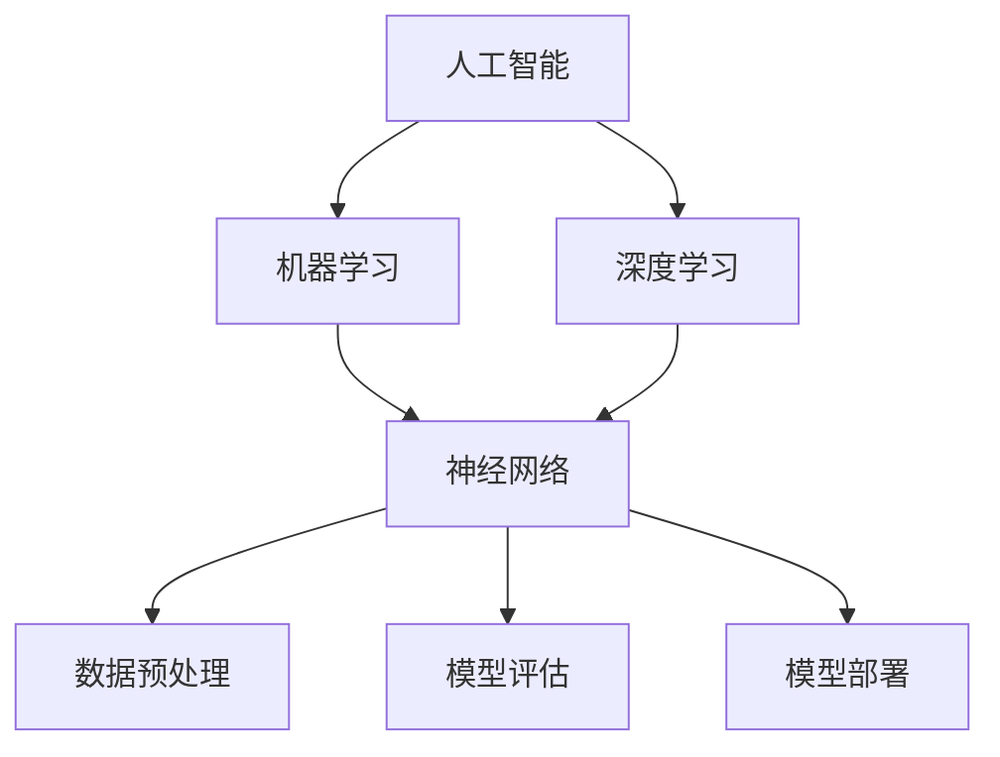

#### 1.2 人工智能的数学模型与算法原理

##### 1.2.1 神经网络与深度学习基础

神经网络（Neural Networks）是人工智能的核心组成部分，其基本结构由输入层、隐藏层和输出层组成。每一层由多个神经元（节点）组成，神经元之间通过权重连接。神经网络通过学习输入数据与输出数据之间的映射关系，实现复杂函数的拟合。

深度学习（Deep Learning）是神经网络的一种延伸，通过增加网络层数（深度）来提高模型的表示能力。深度学习算法主要包括卷积神经网络（Convolutional Neural Networks，CNN）、循环神经网络（Recurrent Neural Networks，RNN）和生成对抗网络（Generative Adversarial Networks，GAN）等。

以下是神经网络的基本结构Mermaid流程图：

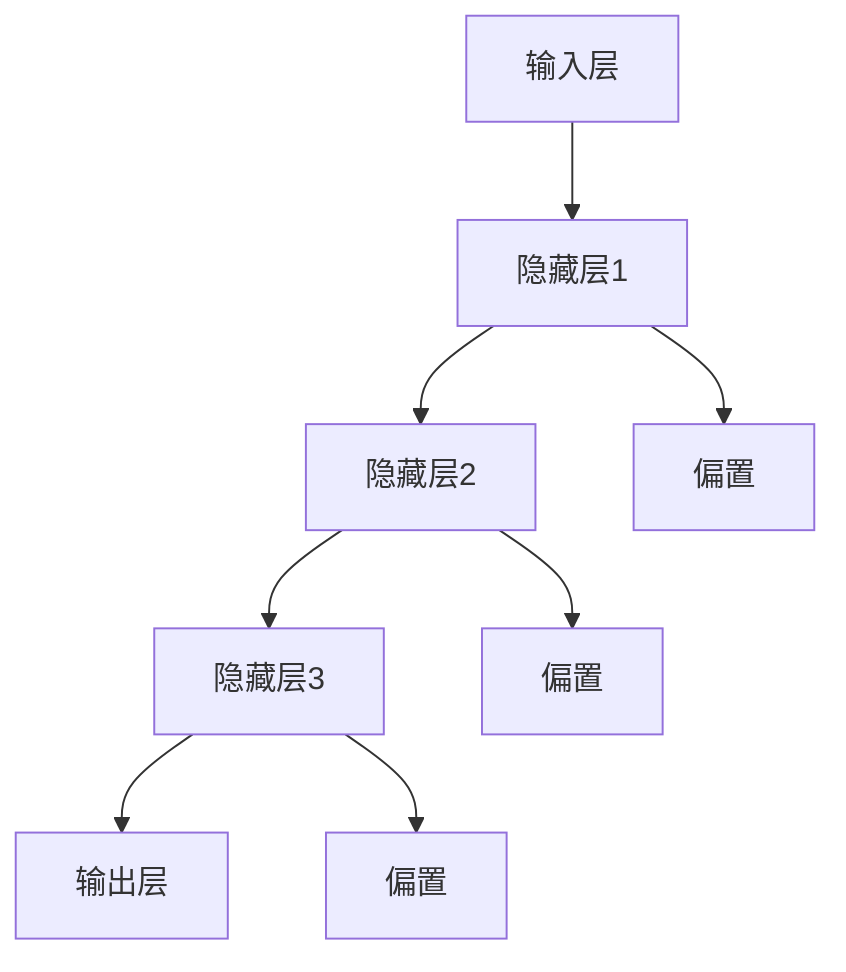

##### 1.2.1.2 常见的深度学习架构

常见的深度学习架构包括：

1. **卷积神经网络（CNN）**：适用于图像处理任务，具有局部连接和共享权重的特性。
2. **循环神经网络（RNN）**：适用于序列数据处理任务，能够捕捉序列中的长距离依赖关系。
3. **转换器架构（Transformer）**：基于自注意力机制，适用于自然语言处理任务，特别是在大规模预训练模型（如BERT、GPT等）中取得了显著成果。

以下是转换器架构的Mermaid流程图：

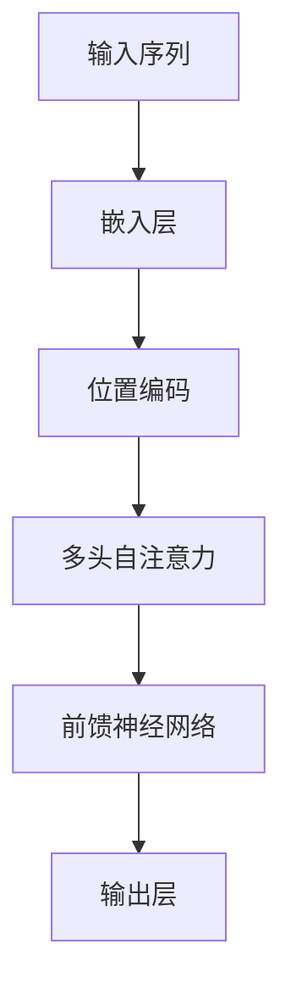

##### 1.2.1.3 深度学习优化算法

深度学习优化算法主要包括以下几种：

1. **梯度下降（Gradient Descent）**：一种最基本的优化算法，通过迭代更新模型参数以最小化损失函数。
2. **随机梯度下降（Stochastic Gradient Descent，SGD）**：在梯度下降的基础上，对每个样本进行一次梯度更新，适用于大规模数据集。
3. **Adam优化器**：结合SGD和RMSprop优化的优点，自适应调整学习率。

以下是梯度下降优化算法的伪代码：

```python
# 梯度下降优化算法伪代码
initialize parameters (θ)
while not convergence do
    compute gradients (g)
    update parameters (θ = θ - α * g)
end while
```

#### 1.2.2 自然语言处理技术概览

自然语言处理（Natural Language Processing，NLP）是人工智能的一个重要分支，主要研究如何让计算机理解和处理自然语言。NLP技术包括词嵌入、序列模型和注意力机制等。

##### 1.2.2.1 词嵌入技术

词嵌入（Word Embedding）是将词汇映射为密集向量表示的技术，有助于提高神经网络在文本数据上的处理能力。常见的词嵌入技术包括：

1. **Word2Vec**：基于分布式假设，将词映射为向量，使得语义相近的词在向量空间中更接近。
2. **GloVe**：基于全局共现矩阵，通过优化词向量表示，使其在特定上下文中具有更好的语义表示。

##### 1.2.2.2 序列模型与注意力机制

序列模型（Sequence Model）是处理序列数据（如图像序列、音频序列、文本序列等）的神经网络模型。常见的序列模型包括：

1. **循环神经网络（RNN）**：通过循环结构，对序列中的每个元素进行编码，捕捉序列中的长距离依赖关系。
2. **长短期记忆网络（LSTM）**：通过门控机制，解决RNN的梯度消失和梯度爆炸问题，提高模型的稳定性。
3. **转换器架构（Transformer）**：基于自注意力机制，能够处理长序列数据，实现高效的并行计算。

注意力机制（Attention Mechanism）是一种在序列模型中引入的机制，能够自动分配不同的重要性给序列中的不同元素。注意力机制有助于模型更好地捕捉序列中的关键信息，提高模型的表示能力。

##### 1.2.2.3 转换器架构详解

转换器架构（Transformer）是自然语言处理领域的一种先进模型，基于自注意力机制，能够在处理长序列数据时保持高效计算。转换器架构的主要组成部分包括：

1. **编码器（Encoder）**：用于对输入序列进行编码，生成固定长度的序列表示。
2. **解码器（Decoder）**：用于解码编码器输出的序列表示，生成输出序列。

以下是转换器架构的Mermaid流程图：

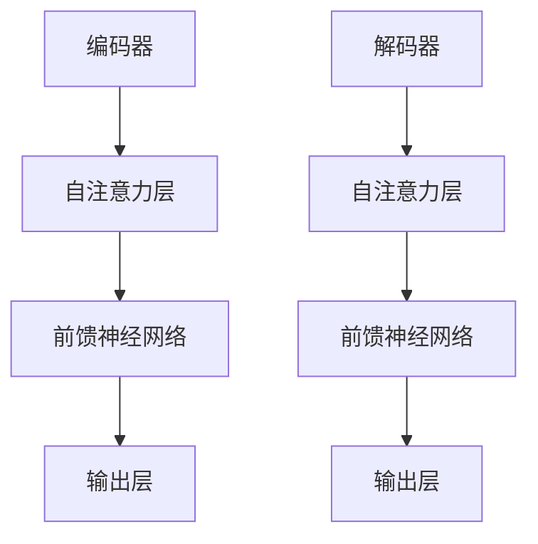

#### 1.3 人工智能的未来发展趋势与机遇

##### 1.3.1 人工智能在各个行业的应用前景

人工智能在各个行业具有广泛的应用前景，以下是一些典型领域：

1. **医疗健康**：人工智能在医疗影像分析、疾病预测、精准医疗等方面具有巨大的潜力。
2. **金融**：人工智能在风险控制、信用评分、量化交易等领域发挥着重要作用。
3. **智能制造**：人工智能在生产线优化、质量控制、设备维护等方面具有广泛应用。
4. **交通运输**：人工智能在自动驾驶、交通管理、智慧城市建设等方面具有广阔应用前景。
5. **教育**：人工智能在个性化教学、智能评测、在线教育等方面具有显著优势。

##### 1.3.2 人工智能的伦理与社会影响

随着人工智能技术的快速发展，伦理与社会影响日益凸显。以下是一些主要方面：

1. **伦理问题**：人工智能在隐私保护、数据安全、算法偏见等方面存在伦理挑战。
2. **社会影响**：人工智能可能会改变就业结构、劳动力市场，对社会经济产生深远影响。

##### 1.3.3 人工智能的未来发展趋势

以下是人工智能的未来发展趋势：

1. **算法创新**：不断推陈出新，探索更高效、更强大的算法。
2. **跨学科融合**：与生物、物理、数学等领域深度融合，推动人工智能的进步。
3. **硬件升级**：随着硬件技术的发展，计算能力将不断提升，为人工智能应用提供更强支持。
4. **开源生态**：开源技术的普及和生态体系的完善，将促进人工智能技术的交流与共享。

以下是人工智能未来发展的Mermaid流程图：

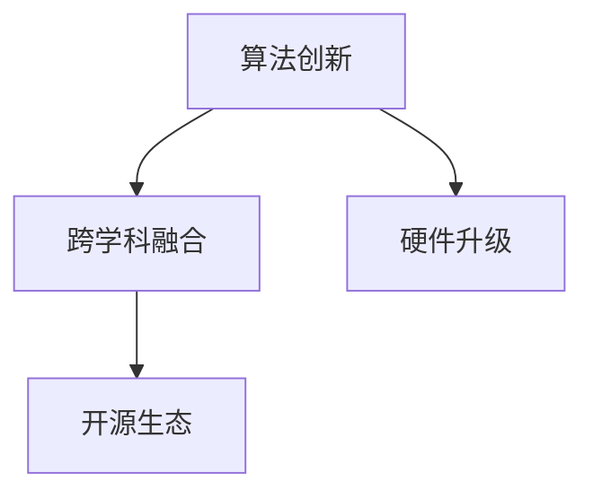

### 第二部分：人工智能技术的核心算法原理讲解

#### 2.1 人工智能基础算法原理

##### 2.1.1 神经网络与深度学习基础

在第一部分中，我们已经对神经网络和深度学习进行了简要介绍。在本节中，我们将进一步回顾神经网络和深度学习的基础知识，为后续内容打下基础。

##### 2.1.2 自然语言处理技术

自然语言处理（NLP）是人工智能领域的一个重要分支，旨在使计算机能够理解和处理人类语言。在本节中，我们将简要介绍NLP的核心技术和应用。

##### 2.1.3 计算机视觉算法基础

计算机视觉（CV）是人工智能领域的另一个重要分支，旨在使计算机能够理解和解释视觉信息。在本节中，我们将简要介绍CV的核心算法和技术。

#### 2.2 人工智能数学模型与公式详解

在本节中，我们将深入探讨人工智能领域的一些关键数学模型和公式，包括：

1. **神经网络中的数学模型**：包括激活函数、损失函数、优化算法等。
2. **自然语言处理中的数学模型**：包括词嵌入、序列模型、注意力机制等。
3. **计算机视觉中的数学模型**：包括卷积神经网络、深度残差网络、生成对抗网络等。

以下是神经网络中的数学模型部分内容的示例：

##### 2.2.1.1 激活函数

激活函数是神经网络中的一个重要组成部分，用于引入非线性变换。常见的激活函数包括：

1. **sigmoid函数**： 
   $$ f(x) = \frac{1}{1 + e^{-x}} $$
2. **ReLU函数**：
   $$ f(x) = \max(0, x) $$
3. **Tanh函数**：
   $$ f(x) = \frac{e^x - e^{-x}}{e^x + e^{-x}} $$

以下是ReLU函数的示意图：

```latex
\begin{equation}
f(x) = \max(0, x)
\end{equation}
```

##### 2.2.1.2 损失函数

损失函数是衡量模型预测结果与真实值之间差距的函数。常见的损失函数包括：

1. **均方误差（MSE）**：
   $$ \text{MSE}(y, \hat{y}) = \frac{1}{m} \sum_{i=1}^{m} (y_i - \hat{y}_i)^2 $$
2. **交叉熵（Cross-Entropy）**：
   $$ \text{CE}(y, \hat{y}) = -\sum_{i=1}^{m} y_i \log(\hat{y}_i) $$

以下是交叉熵函数的示意图：

```latex
\begin{equation}
\text{CE}(y, \hat{y}) = -\sum_{i=1}^{m} y_i \log(\hat{y}_i)
\end{equation}
```

##### 2.2.1.3 优化算法

优化算法用于更新模型参数，以最小化损失函数。常见的优化算法包括：

1. **梯度下降（Gradient Descent）**：
   $$ \theta = \theta - \alpha \cdot \nabla_{\theta} J(\theta) $$
2. **随机梯度下降（Stochastic Gradient Descent，SGD）**：
   $$ \theta = \theta - \alpha \cdot \nabla_{\theta} J(\theta) $$
3. **Adam优化器**：
   $$ \theta = \theta - \alpha \cdot \nabla_{\theta} J(\theta) + \beta_1 \cdot (1 - \beta_t) \cdot (t-1) + \beta_2 \cdot (1 - \beta_t)^2 \cdot (t-1) $$

以下是梯度下降优化算法的示意图：

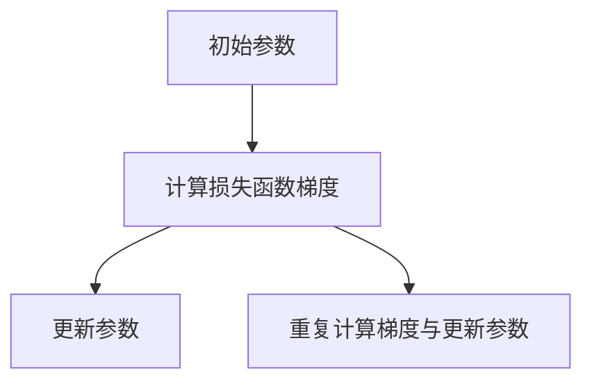

##### 2.2.2 自然语言处理中的数学模型

自然语言处理（NLP）是人工智能领域的一个重要分支，涉及对文本数据进行处理和分析。在本节中，我们将介绍NLP领域的一些关键数学模型。

##### 2.2.2.1 词嵌入

词嵌入（Word Embedding）是将词汇映射为密集向量表示的技术，有助于提高神经网络在文本数据上的处理能力。常见的词嵌入技术包括：

1. **Word2Vec**： 
   $$ \text{Word2Vec}(w) = \text{Word2Vec} \cdot w $$
2. **GloVe**： 
   $$ \text{GloVe}(w) = \text{GloVe} \cdot w $$

以下是Word2Vec模型的示意图：

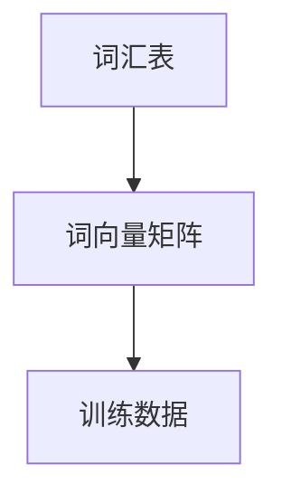

##### 2.2.2.2 序列模型

序列模型（Sequence Model）是处理序列数据（如图像序列、音频序列、文本序列等）的神经网络模型。常见的序列模型包括：

1. **循环神经网络（RNN）**： 
   $$ \text{RNN}(x_t) = \text{RNN} \cdot x_t $$
2. **长短期记忆网络（LSTM）**： 
   $$ \text{LSTM}(x_t) = \text{LSTM} \cdot x_t $$
3. **转换器架构（Transformer）**： 
   $$ \text{Transformer}(x_t) = \text{Transformer} \cdot x_t $$

以下是RNN模型的示意图：

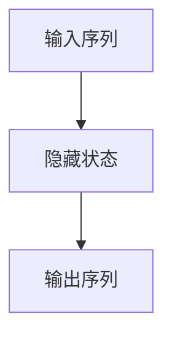

##### 2.2.2.3 注意力机制

注意力机制（Attention Mechanism）是一种在序列模型中引入的机制，能够自动分配不同的重要性给序列中的不同元素。注意力机制有助于模型更好地捕捉序列中的关键信息，提高模型的表示能力。

1. **点积注意力（Dot-Product Attention）**： 
   $$ \text{Attention}(Q, K, V) = \text{softmax}\left(\frac{QK^T}{\sqrt{d_k}}\right)V $$
2. **多头注意力（Multi-Head Attention）**： 
   $$ \text{Multi-Head Attention}(Q, K, V) = \text{softmax}\left(\frac{QW_Q K^T}{\sqrt{d_k}}\right)W_V V $$

以下是多头注意力机制的示意图：

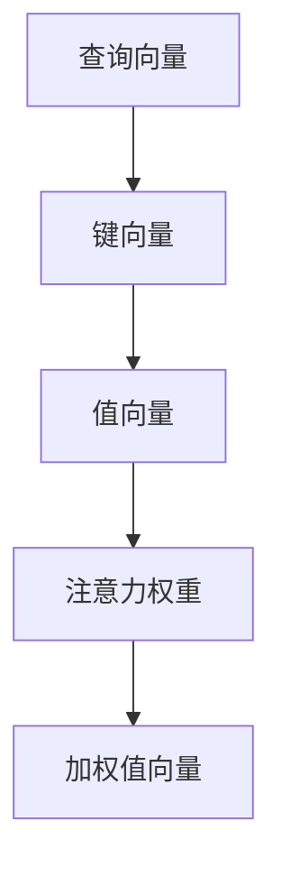

##### 2.2.3 计算机视觉中的数学模型

计算机视觉（Computer Vision，CV）是人工智能领域的一个重要分支，旨在使计算机能够理解和解释视觉信息。在本节中，我们将介绍CV领域的一些关键数学模型。

##### 2.2.3.1 卷积神经网络

卷积神经网络（Convolutional Neural Networks，CNN）是一种特殊的神经网络，专门用于处理图像数据。CNN具有局部连接和共享权重的特性，能够有效地提取图像特征。

1. **卷积层（Convolutional Layer）**： 
   $$ \text{Conv}(x, \theta) = \text{ReLU}(\text{Conv}_1(x) + b_1) $$
2. **池化层（Pooling Layer）**： 
   $$ \text{Pooling}(x) = \text{max}\left(\text{Pooling}_1(x), \text{Pooling}_2(x), \ldots\right) $$
3. **全连接层（Fully Connected Layer）**： 
   $$ \text{FC}(x) = \text{ReLU}(\text{FC}_1(x) + b_1) $$

以下是CNN模型的示意图：

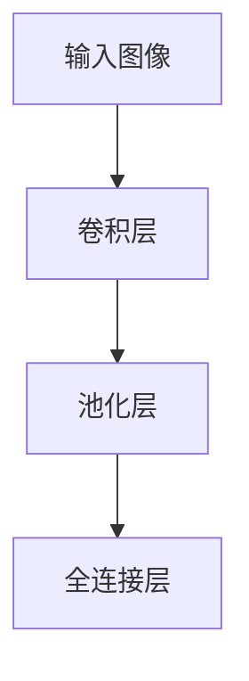

##### 2.2.3.2 深度残差网络

深度残差网络（Deep Residual Networks，ResNet）是一种特殊的卷积神经网络，通过引入残差单元（Residual Unit）来缓解深层网络的梯度消失问题。

1. **残差单元（Residual Unit）**： 
   $$ \text{Residual Unit}(x) = \text{ReLU}(\text{Conv}_1(x) + b_1) + \text{ReLU}(\text{Conv}_2(x) + b_2) + x $$
2. **深度残差网络（Deep ResNet）**： 
   $$ \text{Deep ResNet}(x) = \text{ReLU}(\text{Residual Unit}_1(x) + b_1) + \text{ReLU}(\text{Residual Unit}_2(x) + b_2) + x $$

以下是ResNet模型的示意图：

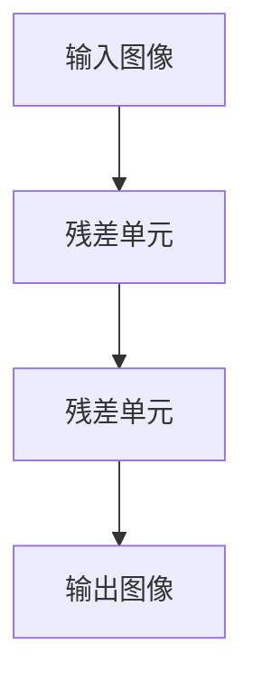

##### 2.2.3.3 生成对抗网络

生成对抗网络（Generative Adversarial Networks，GAN）是一种由生成器和判别器组成的对抗性神经网络，通过训练生成器产生真实数据，使得判别器无法区分生成数据与真实数据。

1. **生成器（Generator）**： 
   $$ G(z) = \text{ReLU}(\text{Generator}_1(z) + b_1) $$
2. **判别器（Discriminator）**： 
   $$ D(x) = \text{ReLU}(\text{Discriminator}_1(x) + b_1) $$
3. **GAN模型**： 
   $$ G(z) = \text{ReLU}(\text{Generator}_1(z) + b_1) + \text{ReLU}(\text{Generator}_2(G(z)) + b_2) $$

以下是GAN模型的示意图：

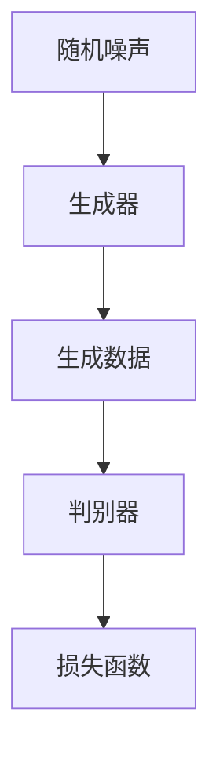

### 第三部分：人工智能项目实战

#### 3.1 人工智能项目开发流程

人工智能项目的开发流程主要包括以下几个阶段：

##### 3.1.1 项目需求分析与设计

在项目开发之前，需要对项目需求进行深入分析，明确项目目标、功能模块、性能指标等。需求分析阶段是项目成功的关键，需要充分了解用户需求、业务场景和技术可行性。

##### 3.1.2 数据收集与预处理

数据是人工智能项目的基石。数据收集阶段需要获取高质量、丰富的数据集。数据预处理是数据收集后的关键步骤，包括数据清洗、数据格式转换、特征提取等。

##### 3.1.3 特征提取与工程

特征提取与工程是提升模型性能的重要环节。通过选择合适的特征，可以更好地表征数据，从而提高模型的准确性和泛化能力。

##### 3.1.4 模型选择与训练

模型选择与训练是项目开发的核心环节。根据项目需求和数据特点，选择合适的模型，并进行训练和优化。训练过程中需要关注模型参数的调整、学习率的设置、批次大小等。

##### 3.1.5 模型评估与优化

模型评估与优化是确保模型性能的重要手段。通过在验证集上评估模型性能，调整模型参数，优化模型结构，以提高模型的泛化能力和稳定性。

##### 3.1.6 模型部署与上线

模型部署与上线是将模型应用于实际场景的关键步骤。根据项目需求，选择合适的部署方式，将模型部署到生产环境，并确保系统的稳定运行。

#### 3.1.7 代码实现与调试

代码实现与调试是项目开发的核心环节。在代码实现阶段，需要遵循良好的编程规范，确保代码的可读性和可维护性。调试过程中，需要使用调试工具，如调试器、日志等，找出并修复代码中的错误。

以下是代码实现与调试的示例：

```python
# 代码实现示例
import tensorflow as tf
from tensorflow.keras.models import Sequential
from tensorflow.keras.layers import Dense, Dropout, Flatten, Conv2D, MaxPooling2D

# 构建模型
model = Sequential([
    Conv2D(32, (3, 3), activation='relu', input_shape=(28, 28, 1)),
    MaxPooling2D(pool_size=(2, 2)),
    Flatten(),
    Dense(128, activation='relu'),
    Dropout(0.5),
    Dense(10, activation='softmax')
])

# 编译模型
model.compile(optimizer='adam', loss='categorical_crossentropy', metrics=['accuracy'])

# 训练模型
model.fit(x_train, y_train, epochs=10, batch_size=64, validation_data=(x_val, y_val))

# 调试代码
# 添加调试代码，如日志、断点等，帮助定位问题

```

#### 3.1.8 代码解读与分析

在代码实现与调试阶段，需要对代码进行深入解读与分析，确保代码的正确性和性能。以下是对上述代码的解读与分析：

1. **模型构建**：使用Sequential模型构建卷积神经网络，包括卷积层、池化层、全连接层和Dropout层。
2. **模型编译**：设置优化器、损失函数和评价指标，为模型训练做好准备。
3. **模型训练**：使用fit函数训练模型，设置训练轮数、批次大小和验证数据。
4. **调试代码**：根据需要添加调试代码，如日志、断点等，帮助定位问题。

#### 3.2 人工智能项目实战案例

在本节中，我们将介绍一些典型的人工智能项目实战案例，包括自然语言处理、计算机视觉和工业应用等。

##### 3.2.1 自然语言处理项目实战

自然语言处理项目实战主要包括以下几种类型：

1. **问答系统开发**：构建一个能够回答用户问题的问答系统，如智能客服、智能助手等。
2. **文本分类与情感分析**：对文本数据进行分析，判断其类别或情感倾向，如新闻分类、情感分析等。
3. **文本生成与摘要**：根据输入文本生成摘要或生成新的文本内容，如自动摘要、文本生成等。

以下是一个问答系统开发的示例：

```python
# 问答系统开发示例
import tensorflow as tf
from tensorflow.keras.models import Model
from tensorflow.keras.layers import Input, Embedding, LSTM, Dense

# 构建问答系统模型
input_word = Input(shape=(max_sequence_length,))
embedded_word = Embedding(vocabulary_size, embedding_size)(input_word)
lstm_output = LSTM(units=lstm_units)(embedded_word)
output = Dense(units=1, activation='sigmoid')(lstm_output)

# 编译模型
model = Model(inputs=input_word, outputs=output)
model.compile(optimizer='adam', loss='binary_crossentropy', metrics=['accuracy'])

# 训练模型
model.fit(x_train, y_train, epochs=10, batch_size=32, validation_data=(x_val, y_val))

# 预测
prediction = model.predict(input_word)
```

##### 3.2.2 计算机视觉项目实战

计算机视觉项目实战主要包括以下几种类型：

1. **目标检测与识别**：对图像中的目标进行检测和识别，如人脸识别、车辆识别等。
2. **图像分类与生成**：对图像进行分类或生成新的图像内容，如图像分类、图像生成等。
3. **视觉SLAM与三维重建**：通过图像信息实现视觉同时定位与地图构建，如自动驾驶、三维重建等。

以下是一个目标检测与识别的示例：

```python
# 目标检测与识别示例
import tensorflow as tf
from tensorflow.keras.models import Model
from tensorflow.keras.layers import Input, Conv2D, MaxPooling2D, Flatten, Dense

# 构建目标检测模型
input_image = Input(shape=(height, width, channels))
conv1 = Conv2D(filters=32, kernel_size=(3, 3), activation='relu')(input_image)
pool1 = MaxPooling2D(pool_size=(2, 2))(conv1)
conv2 = Conv2D(filters=64, kernel_size=(3, 3), activation='relu')(pool1)
pool2 = MaxPooling2D(pool_size=(2, 2))(conv2)
flatten = Flatten()(pool2)
dense1 = Dense(units=128, activation='relu')(flatten)
output = Dense(units=num_classes, activation='softmax')(dense1)

# 编译模型
model = Model(inputs=input_image, outputs=output)
model.compile(optimizer='adam', loss='categorical_crossentropy', metrics=['accuracy'])

# 训练模型
model.fit(x_train, y_train, epochs=10, batch_size=32, validation_data=(x_val, y_val))

# 预测
prediction = model.predict(input_image)
```

##### 3.2.3 人工智能在工业领域的应用

人工智能在工业领域的应用主要包括以下几种类型：

1. **质量检测与预测**：通过图像识别、传感器数据等手段，对生产过程中的质量进行检测和预测，如缺陷检测、故障预测等。
2. **生产优化与调度**：通过优化算法和预测模型，实现生产过程的优化和调度，如生产计划、设备维护等。
3. **设备维护与故障预测**：通过对设备运行数据的分析，预测设备的故障，实现预防性维护。

以下是一个质量检测与预测的示例：

```python
# 质量检测与预测示例
import tensorflow as tf
from tensorflow.keras.models import Model
from tensorflow.keras.layers import Input, Conv2D, MaxPooling2D, Flatten, Dense

# 构建质量检测模型
input_image = Input(shape=(height, width, channels))
conv1 = Conv2D(filters=32, kernel_size=(3, 3), activation='relu')(input_image)
pool1 = MaxPooling2D(pool_size=(2, 2))(conv1)
conv2 = Conv2D(filters=64, kernel_size=(3, 3), activation='relu')(pool1)
pool2 = MaxPooling2D(pool_size=(2, 2))(conv2)
flatten = Flatten()(pool2)
dense1 = Dense(units=128, activation='relu')(flatten)
output = Dense(units=1, activation='sigmoid')(dense1)

# 编译模型
model = Model(inputs=input_image, outputs=output)
model.compile(optimizer='adam', loss='binary_crossentropy', metrics=['accuracy'])

# 训练模型
model.fit(x_train, y_train, epochs=10, batch_size=32, validation_data=(x_val, y_val))

# 预测
prediction = model.predict(input_image)
```

### 第四部分：人工智能的未来发展机遇

#### 4.1 人工智能在医疗领域的应用

人工智能在医疗领域的应用具有广泛的前景，以下是一些主要方面：

1. **医疗影像分析与诊断**：利用深度学习技术，对医疗影像（如X光片、CT、MRI等）进行自动分析，实现疾病诊断和辅助诊断。
2. **疾病预测与防控**：通过大数据分析和机器学习算法，预测疾病的发生和传播趋势，为公共卫生决策提供支持。
3. **精准医疗与个性化治疗**：根据患者的基因信息、病史等数据，实现精准医疗和个性化治疗，提高治疗效果。

#### 4.2 人工智能在金融领域的应用

人工智能在金融领域的应用主要包括以下方面：

1. **风险评估与预测**：利用机器学习算法，对金融风险进行预测和评估，为投资决策提供支持。
2. **信用评分与欺诈检测**：通过大数据分析和人工智能技术，对客户的信用状况进行评估，检测和预防金融欺诈。
3. **量化交易与投资策略**：利用人工智能技术，实现量化交易和投资策略的优化，提高投资收益。

#### 4.3 人工智能在智能交通与智慧城市建设中的应用

人工智能在智能交通与智慧城市建设中的应用主要包括以下方面：

1. **智能交通管理与优化**：利用人工智能技术，实现交通流量监控、信号灯控制、路径规划等功能，提高交通运行效率。
2. **城市规划与环境保护**：通过大数据分析和人工智能技术，实现城市规划的优化和环境保护的监测。
3. **智慧能源管理与调度**：利用人工智能技术，实现能源的优化管理和调度，提高能源利用效率。

#### 4.4 人工智能在教育领域的应用

人工智能在教育领域的应用主要包括以下方面：

1. **个性化教学与学习**：利用人工智能技术，实现个性化教学和自适应学习，提高学生的学习效果。
2. **智能评测与反馈**：通过人工智能技术，实现自动化的学生评测和反馈，提高教学效果。
3. **在线教育平台建设**：利用人工智能技术，构建在线教育平台，实现教学资源的智能化管理和分发。

#### 4.5 人工智能在农业、能源和制造业等领域的应用

人工智能在农业、能源和制造业等领域的应用主要包括以下方面：

1. **农业生产优化与预测**：利用人工智能技术，实现农业生产的优化管理和预测，提高农业生产效率。
2. **能源管理与节能**：通过大数据分析和人工智能技术，实现能源的优化管理和节能措施。
3. **制造业智能化生产与质量检测**：利用人工智能技术，实现制造业的智能化生产、质量检测和故障预测。

#### 4.6 人工智能的伦理、法律与社会影响

人工智能的伦理、法律与社会影响是当前关注的热点问题，主要包括以下方面：

1. **人工智能伦理问题探讨**：讨论人工智能技术的伦理道德问题，如隐私保护、算法偏见、人工智能责任等。
2. **人工智能法律法规框架**：构建人工智能法律法规框架，规范人工智能的发展和应用。
3. **人工智能对社会的影响**：分析人工智能对社会、经济、就业等方面的影响，探讨人工智能发展的可持续性。

### 第五部分：人工智能人才发展

#### 5.1 人工智能教育体系与课程设计

人工智能教育体系与课程设计是培养人工智能人才的关键环节，主要包括以下方面：

1. **人工智能学科体系概述**：介绍人工智能的学科体系，包括计算机科学、数据科学、数学和统计学等。
2. **人工智能教育课程设置**：设计人工智能教育课程，包括基础课程、专业课程和实践课程等。
3. **人工智能人才培养模式**：探讨人工智能人才培养的模式，如产学研结合、项目驱动等。

#### 5.2 人工智能职业发展与就业前景

人工智能职业发展与就业前景是人工智能人才关注的焦点，主要包括以下方面：

1. **人工智能行业趋势分析**：分析人工智能行业的发展趋势，预测未来就业需求。
2. **人工智能岗位分类与要求**：介绍人工智能领域的岗位分类和任职要求，为求职者提供参考。
3. **人工智能人才成长路径**：探讨人工智能人才的成长路径，包括学术研究、技术开发和项目管理等。

#### 5.3 人工智能创新创业

人工智能创新创业是推动人工智能发展的重要动力，主要包括以下方面：

1. **人工智能创业机会与挑战**：分析人工智能领域的创业机会和挑战，为创业者提供指导。
2. **人工智能创业项目案例分析**：介绍成功的人工智能创业项目，分析其成功经验。
3. **人工智能创新创业支持政策**：了解国家和地方政府对人工智能创新创业的支持政策，为创业者提供支持。

### 附录

#### 附录 A: 人工智能相关工具与资源

人工智能领域有着丰富的工具与资源，以下是一些主要工具与资源的介绍：

##### A.1 主流深度学习框架对比

以下是主流深度学习框架的对比：

| 框架         | 优点                     | 缺点                     | 适用场景                     |
| ------------ | ------------------------ | ------------------------ | ------------------------ |
| TensorFlow   | 开源、支持多种编程语言 | 代码复杂、性能优化困难 | 大规模模型、生产环境         |
| PyTorch      | 简单易用、灵活度高     | 开源社区相对较小        | 研究与开发、快速迭代         |
| JAX          | 高性能、易于扩展       | 生态相对较小、学习曲线陡峭 | 大规模模型、高性能计算       |
| Keras        | 简单易用、支持多框架    | 性能一般、依赖于TensorFlow | 初学者、小型项目、快速原型   |
| PyTorch Geometric | 支持图神经网络 | 生态相对较小、学习曲线陡峭 | 图神经网络相关研究与应用   |

##### A.2 人工智能开源项目与社区

以下是人工智能领域的一些开源项目与社区：

| 名称         | 介绍                                     | 链接                     |
| ------------ | ---------------------------------------- | ------------------------ |
| TensorFlow   | 开源深度学习框架                         | <https://www.tensorflow.org/> |
| PyTorch      | 开源深度学习框架                         | <https://pytorch.org/>     |
| JAX          | 高性能深度学习框架                       | <https://jax.readthedocs.io/> |
| Keras        | 简单易用的深度学习高级神经网络API        | <https://keras.io/>       |
| PyTorch Geometric | 用于图神经网络的PyTorch库 | <https://pyg.cs.princeton.edu/> |
| GitHub       | 代码托管平台，众多开源项目聚集地       | <https://github.com/>     |
| arXiv       | 人工智能论文预印本发布平台              | <https://arxiv.org/>      |
| Kaggle       | 数据科学竞赛平台，提供丰富的数据集和模型 | <https://www.kaggle.com/> |
| 知乎         | 社交问答平台，众多AI领域专家汇聚地     | <https://www.zhihu.com/>  |
| B站          | 视频分享平台，AI领域教程丰富           | <https://www.bilibili.com/> |

##### A.3 人工智能学术会议与期刊

以下是人工智能领域的一些学术会议与期刊：

| 名称         | 介绍                                     | 链接                     |
| ------------ | ---------------------------------------- | ------------------------ |
| NeurIPS      | 人工智能领域顶级会议之一                 | <https://nips.cc/>       |
| ICML        | 人工智能领域顶级会议之一                 | <https://icml.cc/>       |
| CVPR        | 计算机视觉领域顶级会议之一              | <https://cvpr.org/>      |
| JMLR        | 人工智能领域顶级期刊之一                 | <https://jmlr.org/>      |
| AAAI        | 人工智能领域顶级会议之一                 | <https://aaai.org/>      |
| IJCAI        | 人工智能领域顶级会议之一                 | <https://ijcai.org/>      |

##### A.4 人工智能企业案例

以下是人工智能领域的一些知名企业案例：

| 名称         | 介绍                                     | 链接                     |
| ------------ | ---------------------------------------- | ------------------------ |
| Google      | 国际知名科技公司，人工智能技术研发与应用领先 | <https://www.google.com/> |
| OpenAI      | 国际知名人工智能研究机构，专注于AI研究与应用 | <https://openai.com/>     |
| DeepMind      | 英国知名人工智能研究机构，专注于AI研究与应用 | <https://www.deepmind.com/> |
| Baidu      | 中国知名互联网公司，人工智能技术研发与应用领先 | <https://www.baidu.com/> |
| Microsoft    | 国际知名科技公司，人工智能技术研发与应用领先 | <https://www.microsoft.com/> |
| Amazon      | 国际知名科技公司，人工智能技术研发与应用领先 | <https://www.amazon.com/> |
| IBM          | 国际知名科技公司，人工智能技术研发与应用领先 | <https://www.ibm.com/>     |

