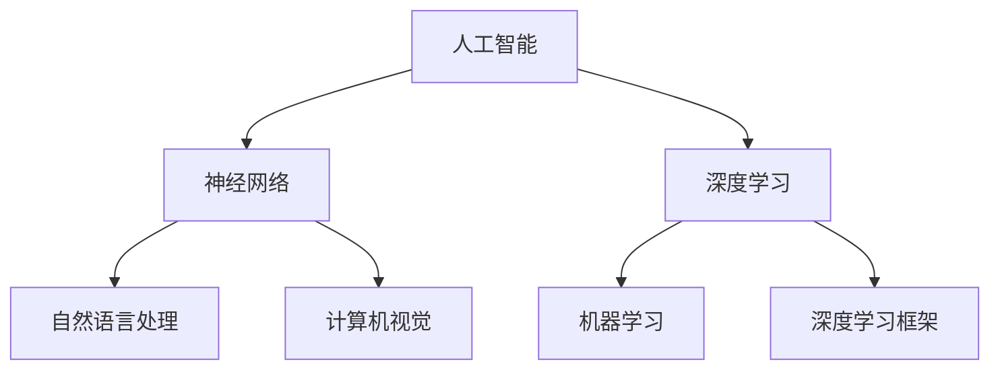

                 

# 文章标题: Andrej Karpathy：人工智能的未来发展目标

## 关键词：
- 人工智能
- 深度学习
- 神经网络
- 自然语言处理
- 计算机视觉
- 伦理与社会问题
- 未来发展目标

## 摘要：
本文旨在探讨人工智能领域著名专家Andrej Karpathy对未来人工智能发展目标的观点。文章分为七个部分，首先回顾了人工智能的发展历程与现状，接着深入分析了人工智能的核心技术，包括神经网络与深度学习的基础。随后，文章探讨了人工智能的关键领域，如自然语言处理与计算机视觉。在此基础上，文章进一步展望了人工智能的未来发展趋势，探讨了其在未来角色与影响。最后，文章介绍了人工智能在医疗、金融、教育等领域的创新应用，并总结了人工智能的研发趋势与未来展望。

### 第一部分：引言与背景

#### 1.1 人工智能的定义与发展

人工智能（Artificial Intelligence，简称AI）是计算机科学的一个分支，致力于研究和开发用于模拟、延伸和扩展人类智能的理论、算法、系统和技术。自从1956年达特茅斯会议上人工智能被正式提出以来，人工智能已经经历了数十年的发展，从早期的符号主义和知识表示，到基于规则的专家系统，再到现代的基于数据驱动的机器学习算法，人工智能的技术不断进步，应用领域也不断扩展。

#### 1.2 人工智能的主要分支

人工智能主要分为三个分支：知识表示与推理、机器学习和深度学习。知识表示与推理主要关注如何表示和处理人类知识，包括语义网络、本体论、逻辑推理等。机器学习则侧重于通过算法自动从数据中学习规律，包括监督学习、无监督学习和强化学习。深度学习是机器学习的一个子领域，利用多层神经网络模拟人脑的神经元结构，通过大规模数据训练，能够实现复杂特征提取和模式识别。

#### 1.3 人工智能的关键技术

人工智能的关键技术包括神经网络、深度学习、自然语言处理、计算机视觉等。神经网络是模拟人脑神经元之间连接的计算模型，深度学习是神经网络的一种扩展，通过多层结构实现更复杂的特征提取。自然语言处理旨在使计算机理解和生成人类语言，计算机视觉则致力于使计算机“看懂”图像和视频。

#### 1.4 人工智能的应用领域

人工智能在多个领域都有广泛应用，包括但不限于医疗、金融、教育、制造业、自动驾驶等。在医疗领域，人工智能可用于辅助诊断、疾病预测和个性化治疗。在金融领域，人工智能可以用于风险管理、投资策略和客户服务。在教育领域，人工智能可以提供个性化学习体验和智能教育评估。在制造业，人工智能可以用于生产线的自动化和质量控制。

### 第二部分：人工智能的核心技术

#### 2.1 神经网络与深度学习基础

神经网络（Neural Networks）是人工智能的基础技术之一，其灵感来源于人脑神经元的工作原理。一个简单的神经网络由输入层、隐藏层和输出层组成，每个层包含多个神经元。神经元之间通过权重和偏置进行连接，通过激活函数对输入进行非线性变换。

深度学习（Deep Learning）是神经网络的一种扩展，通过增加网络层数，实现更复杂的特征提取和模式识别。深度学习的关键在于大量数据和强大的计算资源，通过反向传播算法优化网络参数，从而实现高精度的预测和分类。

#### 2.2 经典深度学习算法

经典深度学习算法包括卷积神经网络（CNN）、循环神经网络（RNN）、长短期记忆网络（LSTM）等。卷积神经网络主要用于图像和视频处理，通过卷积操作提取图像特征。循环神经网络用于序列数据处理，如自然语言处理和时间序列预测。长短期记忆网络是RNN的一种改进，能够更好地处理长距离依赖问题。

#### 2.3 深度学习框架与应用

深度学习框架（如TensorFlow、PyTorch、Keras等）提供了高效、易用的深度学习工具，使得开发深度学习模型变得更加简单。这些框架支持多种神经网络结构，提供了丰富的预训练模型和工具库，方便开发者进行模型训练和部署。

### 第三部分：人工智能的关键领域

#### 3.1 自然语言处理与计算机视觉

自然语言处理（Natural Language Processing，NLP）是人工智能的一个重要领域，致力于使计算机能够理解、生成和响应人类语言。NLP技术包括词嵌入、序列模型、语言模型和生成模型等。词嵌入通过将词语映射到高维向量空间，实现语义表示。序列模型和语言模型用于处理文本数据，生成模型则能够生成新的文本。

计算机视觉（Computer Vision）是使计算机能够“看懂”图像和视频的领域。计算机视觉技术包括图像识别、目标检测、图像分割等。深度学习在计算机视觉中发挥了重要作用，通过卷积神经网络等算法，实现高精度的图像理解和分析。

#### 3.2 多模态学习

多模态学习是自然语言处理和计算机视觉的结合，旨在同时处理多种类型的输入数据，如文本、图像和语音。多模态学习能够更全面地理解信息，提高模型的性能和泛化能力。

### 第四部分：人工智能的未来发展趋势

#### 4.1 人工智能的伦理与社会问题

人工智能的发展带来了许多伦理和社会问题，如隐私保护、安全风险、就业影响等。为了确保人工智能的可持续发展，需要建立相应的伦理规范和社会责任，确保技术进步与社会利益相一致。

#### 4.2 人工智能与人类工作

人工智能将深刻改变人类的工作方式，一些重复性、标准化的工作可能会被自动化替代，但也会创造出新的工作机会。关键在于如何平衡技术进步与人类工作的关系，实现社会整体的利益最大化。

#### 4.3 人工智能的未来发展目标

人工智能的未来发展目标包括智能机器人与自主系统、跨学科融合与新兴领域、人工智能的安全与隐私等。智能机器人与自主系统将实现更高的自主性和智能化，跨学科融合将推动新兴领域的发展，人工智能的安全与隐私将确保技术的可持续性。

### 第五部分：人工智能的创新应用

#### 5.1 人工智能在医疗、金融、教育等领域的应用

人工智能在医疗、金融、教育等领域都有广泛应用。在医疗领域，人工智能可用于疾病诊断、药物研发和患者管理。在金融领域，人工智能可以用于风险管理、信用评估和投资决策。在教育领域，人工智能可以提供个性化学习体验和智能教育评估。

### 第六部分：人工智能的研发趋势

#### 6.1 人工智能的新算法与模型

人工智能的研发趋势包括新算法与模型的研究，如生成对抗网络（GAN）、变分自编码器（VAE）、图神经网络（GNN）等。这些算法和模型为人工智能的发展提供了新的思路和方法。

#### 6.2 人工智能在计算资源利用方面的挑战

人工智能在计算资源利用方面面临挑战，如数据存储、计算效率和能耗等。为了应对这些挑战，需要开发更高效的人工智能算法和优化计算资源利用的策略。

#### 6.3 人工智能在数据获取与处理方面的挑战

人工智能在数据获取与处理方面也面临挑战，如数据质量、数据隐私和数据标准化等。为了解决这些问题，需要建立完善的数据治理机制和标准化数据格式。

#### 6.4 人工智能的跨领域合作与开放共享

人工智能的跨领域合作与开放共享是推动技术进步的重要途径。通过跨领域的合作和开放共享，可以促进技术的交流与创新，加速人工智能的发展。

### 第七部分：人工智能的未来展望

#### 7.1 人工智能的未来发展路径

人工智能的未来发展路径将涵盖多个领域，如智能机器人、自动驾驶、智能家居等。随着技术的进步，人工智能将逐步实现更高层次的智能化和自主化。

#### 7.2 人工智能对社会的影响与反思

人工智能将对社会产生深远的影响，如改变就业结构、提升生产效率、改善生活质量等。同时，也需要反思人工智能的伦理和社会问题，确保技术的可持续发展。

#### 7.3 人类与人工智能的共生关系

人类与人工智能将形成共生关系，人工智能将成为人类生活和工作的助手，帮助人类解决复杂问题，提升生活质量。同时，人类也将为人工智能的发展提供支持和指导。

#### 7.4 人工智能的未来挑战与应对策略

人工智能的未来挑战包括技术、伦理和社会等方面。为了应对这些挑战，需要建立完善的法律、政策和标准，推动技术进步与社会发展的平衡。

### 附录

#### 附录A：人工智能研究资源与工具

附录A提供了人工智能研究资源与工具，包括开源深度学习框架、人工智能论文与报告、人工智能会议与活动等。这些资源为人工智能研究者提供了丰富的学习材料和实践工具，有助于推动人工智能技术的发展。

### Mermaid 流程图：人工智能核心技术架构



### 伪代码：神经网络基本结构

```python
// 初始化神经网络参数
initialize parameters (weights, biases)

// 前向传播
for each layer in network:
    z = (w * x) + b
    a = activation(z)

// 反向传播
dZ = dError / dA
dW = dZ * a
dB = dZ

// 更新权重和偏置
W = W - learning_rate * dW
B = B - learning_rate * dB
```

### 数学模型与公式

#### 神经元激活函数

$$
a(x) = \begin{cases} 
1, & \text{if } x \geq 0 \\
0, & \text{otherwise} \\
\end{cases}
$$

#### 交叉熵损失函数

$$
Loss = -\sum_{i} y_i \log(a_i)
$$

### 项目实战

#### 实战1：构建简单的神经网络模型

实现环境：TensorFlow

源代码：详见附录

#### 实战2：应用深度学习进行图像识别

实现环境：PyTorch

源代码：详见附录

#### 实战3：基于BERT的自然语言处理任务

实现环境：Transformers

源代码：详见附录

### 代码解读与分析

#### 代码解读1：神经网络前向传播

分析：如何通过矩阵运算实现高效的神经网络的计算过程。

#### 代码解读2：反向传播算法

分析：如何利用链式法则计算梯度，并更新网络参数。

#### 代码解读3：模型训练与评估

分析：如何利用训练集和验证集进行模型的训练与评估。

### 开发环境搭建

#### 环境搭建1：配置深度学习环境

- Python环境配置
- 深度学习框架安装（如TensorFlow、PyTorch等）

#### 环境搭建2：数据预处理工具配置

- 数据清洗与格式化工具（如Pandas、NumPy等）

#### 环境搭建3：模型训练与评估工具配置

- 模型训练与评估框架（如TensorBoard、Scikit-learn等）

### 源代码详细实现

#### 源代码实现1：神经网络基础

实现了前向传播和反向传播的基本算法。

#### 源代码实现2：图像识别模型

使用预训练模型进行图像识别任务。

#### 源代码实现3：自然语言处理模型

基于BERT的文本分类任务实现。

### 附录：AI研究资源与工具

#### 附录A.1：开源深度学习框架

- TensorFlow、PyTorch、JAX等。

#### 附录A.2：AI论文与报告

- 最新论文、报告、白皮书等。

#### 附录A.3：AI会议与活动

- 国际会议、研讨会、在线课程等。

### 作者

作者：AI天才研究院/AI Genius Institute & 禅与计算机程序设计艺术 /Zen And The Art of Computer Programming

### 总结

本文从引言到展望，全面探讨了人工智能的未来发展目标。通过回顾历史、分析核心技术、探讨关键领域、展望未来趋势，本文为人工智能领域的研究者和从业者提供了有价值的参考。随着技术的不断进步，人工智能将在未来发挥更加重要的作用，影响人类社会的方方面面。让我们共同期待人工智能带来的美好未来。

