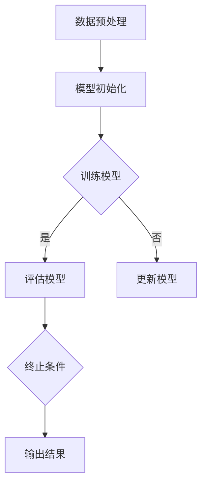

                 

### 文章标题：Andrej Karpathy：人工智能的未来发展规划

关键词：人工智能、未来规划、发展趋势、关键技术、伦理问题

摘要：本文将深入探讨人工智能领域的专家安德烈·卡帕西（Andrej Karpathy）对未来人工智能发展方向的看法，分析其提出的规划，探讨人工智能在未来技术、行业应用、伦理和社会影响等方面的可能发展方向，为人工智能领域的从业者提供有益的参考和思考。

### 目录

#### 第一部分：引言

1. 引言
   1.1 书籍背景与目的
   1.2 人工智能发展现状与趋势
   1.3 本文结构与目标

#### 第二部分：人工智能基础

2. 人工智能基础
   2.1 人工智能概述
   2.2 机器学习基础
   2.3 深度学习原理
   2.4 自然语言处理

#### 第三部分：人工智能应用

3. 人工智能在行业应用
   3.1 人工智能在医疗领域的应用
   3.2 人工智能在金融领域的应用
   3.3 人工智能在制造业的应用
   3.4 人工智能在零售领域的应用

#### 第四部分：人工智能伦理与社会影响

4. 人工智能伦理与社会影响
   4.1 人工智能伦理问题
   4.2 人工智能对社会的影响
   4.3 人工智能治理

#### 第五部分：人工智能未来发展规划

5. 人工智能未来发展规划
   5.1 人工智能发展的关键技术
   5.2 人工智能发展的趋势
   5.3 人工智能未来规划

#### 附录

附录 A: 参考文献
附录 B: 技术详细说明
附录 C: Mermaid流程图
附录 D: 人工智能算法伪代码
附录 E: 数学模型和数学公式
附录 F: 项目实战
附录 G: 人工智能工具与资源

### 第一部分：引言

#### 1.1 书籍背景与目的

本文将深入探讨人工智能领域的专家安德烈·卡帕西（Andrej Karpathy）对未来人工智能发展方向的看法。安德烈·卡帕西是一位著名的计算机科学家，其在人工智能领域的研究和贡献备受瞩目。本文旨在通过对安德烈·卡帕西著作《人工智能的未来发展规划》的解读，分析其提出的规划，探讨人工智能在未来技术、行业应用、伦理和社会影响等方面的可能发展方向。

#### 1.2 人工智能发展现状与趋势

人工智能（Artificial Intelligence，简称AI）作为一门交叉学科，涵盖了计算机科学、统计学、神经科学、认知科学等多个领域。近年来，人工智能的发展取得了显著的成果，从简单的规则系统到复杂的神经网络，从数据挖掘到深度学习，人工智能技术不断突破，应用范围日益广泛。

目前，人工智能在图像识别、自然语言处理、自动驾驶、医疗诊断、金融分析等领域取得了显著的应用成果，推动了相关行业的变革。随着计算能力的提升和大数据的普及，人工智能技术正以前所未有的速度发展。根据相关报告，全球人工智能市场预计将在未来几年内保持高速增长，市场规模将不断扩张。

#### 1.3 本文结构与目标

本文将分为五个部分，首先介绍人工智能的基础知识，包括人工智能概述、机器学习基础、深度学习原理和自然语言处理；然后探讨人工智能在各个行业领域的应用，如医疗、金融、制造和零售；接着分析人工智能伦理和社会影响，讨论隐私保护、公平性、就业等问题；最后，本文将展望人工智能的未来发展规划，包括关键技术、发展趋势和未来规划。

本文的目标是通过对安德烈·卡帕西著作的解读，结合当前人工智能的发展现状，深入探讨人工智能的未来发展方向，为人工智能领域的从业者提供有益的参考和思考。

### 第一部分：引言

#### 1.2 人工智能发展现状与趋势

人工智能（Artificial Intelligence，简称AI）作为一门交叉学科，涵盖了计算机科学、统计学、神经科学、认知科学等多个领域。近年来，人工智能的发展取得了显著的成果，从简单的规则系统到复杂的神经网络，从数据挖掘到深度学习，人工智能技术不断突破，应用范围日益广泛。

目前，人工智能在图像识别、自然语言处理、自动驾驶、医疗诊断、金融分析等领域取得了显著的应用成果，推动了相关行业的变革。例如，在图像识别领域，卷积神经网络（CNN）和生成对抗网络（GAN）等技术取得了突破性进展，使得计算机能够以更高的准确率识别和分类图像。在自然语言处理领域，深度学习技术使得计算机能够理解和生成自然语言，广泛应用于机器翻译、文本分类、语音识别等领域。在自动驾驶领域，人工智能技术使得自动驾驶汽车能够实现自主导航和决策，提高了交通效率和安全性。

随着计算能力的提升和大数据的普及，人工智能技术正以前所未有的速度发展。根据相关报告，全球人工智能市场预计将在未来几年内保持高速增长，市场规模将不断扩张。这不仅是因为人工智能技术本身的进步，还因为各行业对人工智能技术的需求不断增加。例如，在医疗领域，人工智能可以帮助医生进行诊断和治疗，提高医疗效率；在金融领域，人工智能可以帮助金融机构进行风险管理、信用评分和量化交易，提高金融服务的质量。

此外，人工智能的发展也面临着一些挑战和机遇。一方面，人工智能技术的发展需要大量的数据、计算资源和人才支持，这对资源分配和人才培养提出了更高的要求。另一方面，人工智能技术也引发了一些伦理和社会问题，如隐私保护、公平性和就业等。因此，如何平衡人工智能技术的发展与应用，解决其带来的挑战，是当前人工智能领域亟待解决的问题。

#### 1.3 本文结构与目标

本文将分为五个部分，首先介绍人工智能的基础知识，包括人工智能概述、机器学习基础、深度学习原理和自然语言处理；然后探讨人工智能在各个行业领域的应用，如医疗、金融、制造和零售；接着分析人工智能伦理和社会影响，讨论隐私保护、公平性、就业等问题；最后，本文将展望人工智能的未来发展规划，包括关键技术、发展趋势和未来规划。

本文的目标是通过对安德烈·卡帕西著作的解读，结合当前人工智能的发展现状，深入探讨人工智能的未来发展方向，为人工智能领域的从业者提供有益的参考和思考。

### 第二部分：人工智能基础

#### 2.1 人工智能概述

人工智能（Artificial Intelligence，简称AI）是计算机科学的一个分支，旨在使计算机系统具有类似人类智能的能力，包括感知、理解、学习、推理和决策。人工智能的研究始于20世纪50年代，随着计算机技术的发展和大数据的普及，人工智能逐渐成为一门独立的学科，并得到了广泛的应用。

##### 人工智能的定义与范畴

人工智能的定义有多种，其中一种较为广泛接受的定义是：人工智能是研究、开发和应用使计算机系统表现出人类智能行为的理论、算法和技术。人工智能涵盖了多个子领域，包括机器学习、自然语言处理、计算机视觉、自动驾驶、智能语音助手等。

##### 人工智能的关键技术

人工智能的关键技术包括：

- **机器学习**：机器学习是一种通过数据训练计算机模型，使其能够自动学习和改进的技术。常见的机器学习算法包括监督学习、无监督学习和强化学习。

- **深度学习**：深度学习是一种基于神经网络的学习方法，通过多层神经网络对数据进行处理，以实现复杂的模式识别和预测任务。

- **自然语言处理**：自然语言处理是一种使计算机能够理解和生成自然语言的技术。它包括语言模型、文本分类、机器翻译、语音识别等子领域。

- **计算机视觉**：计算机视觉是一种使计算机能够理解和解析视觉信息的技术，包括图像识别、目标检测、人脸识别等。

- **知识表示与推理**：知识表示与推理是一种将人类知识形式化为计算机可处理的形式，并进行推理和决策的技术。

##### 人工智能的分类与发展历程

人工智能可以分为弱人工智能和强人工智能。

- **弱人工智能**：弱人工智能是指能够执行特定任务的计算机系统，但缺乏广泛的理解和推理能力。例如，自动驾驶汽车能够执行导航和驾驶任务，但无法理解复杂的伦理和法律问题。

- **强人工智能**：强人工智能是指具有类似人类智能的广泛理解和推理能力，能够自主学习和适应新的环境和任务。目前，强人工智能尚未实现，但科学家们一直在努力研究和探索。

人工智能的发展历程可以分为以下几个阶段：

- **符号主义阶段**：20世纪50年代至70年代，人工智能主要采用符号主义方法，通过形式化的逻辑和规则进行推理。

- **基于知识的阶段**：20世纪80年代，人工智能开始采用基于知识的表示和推理方法，通过构建知识库进行推理。

- **基于数据的阶段**：20世纪90年代至今，随着大数据和计算能力的提升，人工智能逐渐转向基于数据的方法，通过机器学习和深度学习实现自动化学习和推理。

#### 2.2 机器学习基础

机器学习（Machine Learning，简称ML）是人工智能的一个子领域，旨在通过数据训练计算机模型，使其能够自动学习和改进。机器学习可以分为监督学习、无监督学习和强化学习。

##### 机器学习基本概念

- **模型**：模型是一种用于预测或分类的计算机程序，通常由一组参数组成。

- **特征**：特征是用于描述数据属性的数值或符号。

- **样本**：样本是包含特征和标签的数据点。

- **标签**：标签是用于监督学习中的目标变量，用于评估模型的准确性。

##### 监督学习、无监督学习与强化学习

- **监督学习**：监督学习是一种通过已有标签数据训练模型的方法。在监督学习中，模型的目标是学习数据与标签之间的映射关系，以预测新的数据点。

  - **线性回归**：线性回归是一种用于预测连续值的模型，通过拟合一条直线来描述特征与标签之间的关系。
  - **逻辑回归**：逻辑回归是一种用于预测分类结果的模型，通过拟合一个逻辑函数来将特征映射到概率值。

- **无监督学习**：无监督学习是一种在没有标签数据的情况下训练模型的方法。在无监督学习中，模型的目标是发现数据中的内在结构和规律。

  - **聚类**：聚类是一种将数据分为若干个类别的无监督学习方法，常见的算法有K-means、层次聚类等。
  - **降维**：降维是一种减少数据维度的方法，常见的算法有主成分分析（PCA）、t-SNE等。

- **强化学习**：强化学习是一种通过与环境互动来学习策略的方法。在强化学习中，模型的目标是找到一种策略，以最大化长期回报。

  - **Q-learning**：Q-learning是一种基于值函数的强化学习算法，通过更新Q值来学习最佳动作。
  - **深度强化学习**：深度强化学习是一种将深度学习和强化学习结合的方法，通过神经网络来学习策略。

##### 机器学习算法与模型

- **线性模型**：线性模型包括线性回归和逻辑回归，是最简单的机器学习模型。

- **树模型**：树模型包括决策树和随机森林，通过构建树结构来分类或回归。

- **神经网络**：神经网络是一种由多个神经元组成的网络结构，通过学习权重和偏置来实现非线性映射。

- **集成模型**：集成模型通过结合多个简单模型来提高预测性能，常见的算法有随机森林、梯度提升树等。

- **深度学习模型**：深度学习模型是神经网络的扩展，包括卷积神经网络（CNN）、循环神经网络（RNN）和生成对抗网络（GAN）等，能够处理更复杂的数据和任务。

#### 2.3 深度学习原理

深度学习（Deep Learning，简称DL）是机器学习的一种方法，通过多层神经网络对数据进行处理，以实现复杂的模式识别和预测任务。深度学习在图像识别、自然语言处理、语音识别等领域取得了显著的成果。

##### 神经网络基础

- **神经元**：神经元是神经网络的基本单元，用于对输入数据进行加权求和并传递激活信号。

- **激活函数**：激活函数用于对神经元的输出进行非线性变换，常见的激活函数有ReLU、Sigmoid、Tanh等。

- **层**：神经网络由多个层组成，包括输入层、隐藏层和输出层。隐藏层可以有一个或多个。

- **前向传播**：前向传播是神经网络中的一个过程，用于计算每个神经元的输出值。

- **反向传播**：反向传播是神经网络中的一个过程，用于计算每个神经元的梯度，并更新网络的权重和偏置。

##### 深度学习模型

- **卷积神经网络（CNN）**：卷积神经网络是一种用于图像识别和处理的深度学习模型，通过卷积层、池化层和全连接层实现特征提取和分类。

- **循环神经网络（RNN）**：循环神经网络是一种用于序列数据处理和预测的深度学习模型，通过隐藏状态和循环连接实现序列信息的传递和利用。

- **长短时记忆网络（LSTM）**：长短时记忆网络是一种改进的循环神经网络，通过引入遗忘门、输入门和输出门来解决长序列依赖问题。

- **生成对抗网络（GAN）**：生成对抗网络是一种用于生成对抗学习的深度学习模型，由生成器和判别器组成，通过对抗训练生成逼真的数据。

##### 深度学习算法

- **反向传播算法**：反向传播算法是一种用于训练神经网络的算法，通过计算损失函数的梯度并更新网络权重和偏置。

- **随机梯度下降（SGD）**：随机梯度下降是一种用于优化神经网络参数的算法，通过随机选择样本计算梯度并更新参数。

- **Adam优化器**：Adam优化器是一种自适应的优化器，结合了SGD和Adagrad的优点，通过自适应调整学习率来优化神经网络参数。

#### 2.4 自然语言处理

自然语言处理（Natural Language Processing，简称NLP）是人工智能的一个子领域，旨在使计算机能够理解和生成自然语言。自然语言处理涉及多个子领域，包括语言模型、文本分类、机器翻译、语音识别等。

##### 语言模型与序列模型

- **语言模型**：语言模型是一种用于预测文本序列的概率分布的模型，常用的语言模型有N-gram模型、循环神经网络（RNN）模型和长短时记忆网络（LSTM）模型。

- **序列模型**：序列模型是一种用于处理序列数据的模型，包括循环神经网络（RNN）、长短时记忆网络（LSTM）和门控循环单元（GRU）等。

##### 机器翻译与文本分类

- **机器翻译**：机器翻译是一种将一种语言的文本翻译成另一种语言的技术，常用的机器翻译模型有基于规则的模型、统计机器翻译和神经机器翻译。

- **文本分类**：文本分类是一种将文本数据分为若干类别的技术，常用的文本分类模型有朴素贝叶斯、支持向量机（SVM）和深度学习模型。

##### 语音识别与生成

- **语音识别**：语音识别是一种将语音信号转换为文本的技术，常用的语音识别模型有隐马尔可夫模型（HMM）、高斯混合模型（GMM）和深度神经网络（DNN）。

- **语音生成**：语音生成是一种将文本转换为语音的技术，常用的语音生成模型有基于规则的方法、合成语音模型和基于深度学习的方法。

### 第三部分：人工智能应用

#### 3.1 人工智能在医疗领域的应用

人工智能在医疗领域的应用正逐渐成为变革性力量，通过提供个性化治疗、辅助诊断和自动化管理等多种服务，显著提升了医疗服务的效率和质量。

##### 3.1.1 医疗诊断与预测

人工智能在医疗诊断中的应用主要依赖于图像识别和深度学习技术。例如，计算机辅助诊断系统利用深度学习模型对医学图像进行分析，如X光片、CT扫描和MRI图像，以识别病变和疾病。这种技术能够提高医生诊断的准确性和效率，减少误诊率。此外，人工智能还可以通过分析患者的电子健康记录和基因组数据，进行疾病预测和风险评估。

##### 3.1.2 病理图像分析

病理图像分析是人工智能在医疗领域的另一重要应用。病理图像通常包含大量的信息，但手工分析既耗时又容易出错。通过训练深度学习模型对病理图像进行自动分析，可以快速、准确地识别出病理特征，辅助病理学家进行诊断。例如，人工智能系统能够识别出癌细胞在组织切片中的位置和形态，有助于早期癌症的检测和治疗。

##### 3.1.3 药物研发

人工智能在药物研发中的应用同样具有重要意义。传统的药物研发过程耗时且成本高昂，而人工智能可以通过模拟分子结构和药物与生物大分子的相互作用来加速新药的发现过程。例如，利用生成对抗网络（GAN）生成新的分子结构，通过深度学习模型筛选潜在有效的药物分子。此外，人工智能还可以预测药物在人体内的代谢路径和毒性，从而提高药物研发的成功率和安全性。

#### 3.2 人工智能在金融领域的应用

人工智能在金融领域的应用正不断深入，通过提供智能投顾、风险管理、信用评分和量化交易等服务，提升了金融服务的效率和准确性。

##### 3.2.1 风险管理

人工智能在风险管理中的应用主要体现在自动化的风险评估和预警系统。例如，通过机器学习模型分析市场数据、公司财务报表和宏观经济指标，预测市场风险和信用风险。金融机构可以利用这些预测结果来制定更有效的风险管理策略，降低潜在的损失。

##### 3.2.2 信用评分

信用评分是金融机构评估借款人信用风险的重要手段。传统信用评分依赖于历史数据和统计模型，而人工智能可以通过深度学习模型分析和预测借款人的信用状况。这种基于大数据和机器学习的方法能够更准确地评估信用风险，提高信用评分的精度和可靠性。

##### 3.2.3 量化交易

量化交易是指利用数学模型和算法进行高频交易和算法交易。人工智能技术在量化交易中发挥着关键作用，通过分析海量历史交易数据，识别市场趋势和交易机会。例如，利用深度学习模型预测股票价格、外汇汇率等金融资产的未来走势，从而实现自动化的交易决策。

#### 3.3 人工智能在制造业的应用

人工智能在制造业的应用正在推动制造业向智能化和自动化方向发展，从而提高生产效率、质量和灵活性。

##### 3.3.1 智能制造

智能制造是人工智能在制造业的核心应用领域之一。通过利用人工智能技术，制造企业可以实现生产过程的自动化和智能化。例如，工业机器人通过计算机视觉和深度学习算法，能够自动识别和抓取工件，完成复杂的装配和加工任务。此外，人工智能还可以用于生产线的实时监控和故障预测，提高生产效率和减少停机时间。

##### 3.3.2 质量检测

质量检测是制造业中至关重要的一环。人工智能技术可以通过图像识别和深度学习算法，自动检测产品的缺陷和质量问题。例如，在汽车制造业中，通过训练深度学习模型分析车辆零部件的图像，能够快速、准确地检测出焊接缺陷或材料缺陷，从而提高产品的质量和安全性。

##### 3.3.3 生产优化

生产优化是制造业企业提高生产效率和降低成本的重要手段。人工智能可以通过分析生产数据，优化生产计划、物料管理和能源消耗。例如，利用机器学习模型预测市场需求和库存水平，制定最优的生产计划和库存策略。此外，人工智能还可以优化生产流程，减少浪费，提高生产效率和资源利用率。

#### 3.4 人工智能在零售领域的应用

人工智能在零售领域的应用日益普及，通过提供个性化推荐、库存管理和智能客服等服务，提升了零售业务的效率和用户体验。

##### 3.4.1 个性化推荐

个性化推荐是人工智能在零售领域的典型应用。通过分析消费者的购买历史、浏览行为和偏好，人工智能可以推荐适合消费者的商品。这种个性化推荐技术不仅提高了消费者的购物满意度，还显著提升了销售转化率和客户忠诚度。

##### 3.4.2 库存管理

库存管理是零售业务中的一项重要工作，直接关系到库存周转率和资金利用率。人工智能可以通过预测市场需求、分析销售趋势，优化库存水平。例如，利用机器学习模型预测商品的销售量，根据预测结果调整库存策略，以避免库存过剩或短缺。

##### 3.4.3 客户服务

智能客服是人工智能在零售领域的又一重要应用。通过利用自然语言处理和机器学习技术，智能客服系统能够自动处理消费者的咨询和投诉，提供24/7全天候服务。这不仅提高了客户服务的效率，还降低了人工成本，提升了客户满意度。

### 第四部分：人工智能伦理与社会影响

#### 4.1 人工智能伦理问题

随着人工智能技术的迅猛发展，其在社会各个领域的应用也越来越广泛。然而，人工智能技术的广泛应用也引发了一系列伦理问题，这些问题的处理和解决至关重要。

##### 4.1.1 隐私保护

隐私保护是人工智能伦理问题中最受关注的一个方面。人工智能系统通常需要大量数据进行分析和训练，这些数据可能包含用户的个人信息。如何保护这些数据不被滥用或泄露，成为了一个重要问题。例如，在医疗领域，患者的数据可能涉及敏感的个人信息，如健康记录、病史等，这些数据如果未经妥善保护，可能会被非法获取或用于不正当目的。因此，确保人工智能系统的隐私保护机制完善，是保障用户权益的关键。

##### 4.1.2 平等与公平

人工智能在决策过程中的公平性和平等性也是重要的伦理问题。由于人工智能系统依赖于历史数据和算法进行决策，这些数据和算法可能存在偏见，导致不公平的决策。例如，在某些信用评分系统中，历史数据可能包含种族、性别等偏见因素，导致某些群体受到不公平对待。因此，如何确保人工智能系统在决策过程中保持公平和公正，是当前亟待解决的问题。

##### 4.1.3 人工智能与就业

人工智能的发展对就业市场也带来了深远的影响。一方面，人工智能技术可以提高生产效率，降低人力成本，从而在某些领域导致就业岗位的减少。例如，自动化机器人和智能系统可以替代一些重复性和低技能的工作，如制造业中的装配和包装工作。另一方面，人工智能技术也创造了新的就业机会，如数据科学家、人工智能工程师等。然而，这些新岗位可能需要更高的技能和专业知识，对劳动力的培训和教育提出了新的要求。因此，如何平衡人工智能技术对就业市场的影响，促进就业结构的转型和升级，是当前社会面临的重要挑战。

#### 4.2 人工智能对社会的影响

人工智能技术的迅猛发展不仅带来了技术上的变革，也对社会产生了深远的影响。这些影响体现在经济、教育、社会结构和价值观等多个方面。

##### 4.2.1 经济影响

人工智能技术的应用对经济产生了显著的推动作用。首先，人工智能技术可以提高生产效率和降低成本，从而促进经济增长。例如，智能制造和自动化生产线可以大幅提高制造业的生产效率，降低生产成本。其次，人工智能技术创造了新的产业和市场。以人工智能驱动的智能客服、智能推荐系统等应用，已经成为了许多企业提高竞争力的重要手段。此外，人工智能技术还推动了新兴产业的崛起，如自动驾驶、智能医疗等，为经济增长注入了新的活力。

然而，人工智能技术也对就业市场产生了深远的影响。一方面，人工智能技术可以提高生产效率，降低人力成本，从而在某些领域导致就业岗位的减少。例如，自动化机器人和智能系统可以替代一些重复性和低技能的工作，如制造业中的装配和包装工作。另一方面，人工智能技术也创造了新的就业机会，如数据科学家、人工智能工程师等。然而，这些新岗位可能需要更高的技能和专业知识，对劳动力的培训和教育提出了新的要求。

##### 4.2.2 教育变革

人工智能技术的普及对教育也产生了深远的影响。首先，人工智能技术可以个性化教学，为每个学生提供适合其学习水平和需求的教育资源。例如，通过分析学生的学习数据，智能教育系统能够提供个性化的学习计划，帮助学生更有效地学习。其次，人工智能技术可以自动化教育管理，提高教育效率。例如，智能教育系统可以自动批改作业、进行考试分析等，减轻教师的工作负担。此外，人工智能技术还推动了在线教育的发展，使得教育更加普及和便捷。

然而，人工智能技术的普及也带来了一些挑战。首先，人工智能技术可能导致教育资源的分配不均。由于人工智能系统依赖于大量数据进行分析和决策，这些数据可能集中在一些大型机构和公司手中，导致教育资源的不平等。其次，人工智能技术可能改变教育的内容和形式，使得传统的教育模式受到冲击。例如，智能教育系统可以自动化知识传授，使得传统课堂的教学模式逐渐变得过时。因此，如何应对人工智能技术对教育的挑战，提升教育的质量和公平性，是教育领域面临的重要问题。

##### 4.2.3 社会结构与价值观

人工智能技术的应用对社会结构和价值观也产生了深远的影响。首先，人工智能技术改变了人们的工作和生活方式。例如，自动化机器人和智能系统能够替代人类完成许多重复性和危险的工作，使得人们从繁重的劳动中解放出来，有更多的时间进行创造性和高附加值的工作。此外，人工智能技术还改变了人们的沟通和社交方式。以智能语音助手和聊天机器人为例，它们可以与人类进行自然语言交互，提供便捷的沟通和信息服务。

然而，人工智能技术的应用也引发了一些社会问题。首先，人工智能技术可能导致社会不平等加剧。由于人工智能系统依赖于数据进行分析和决策，而这些数据可能集中在一些大型机构和公司手中，导致社会资源的分配不均。其次，人工智能技术可能改变人们的价值观和生活方式。例如，智能系统的普及可能导致人类对技术的过度依赖，减少人际交往和情感交流。此外，人工智能技术还可能引发一些伦理和道德问题，如隐私保护、自主权和安全等问题。因此，如何平衡人工智能技术对社会结构和价值观的影响，促进社会的和谐发展，是当前社会面临的重要挑战。

#### 4.3 人工智能治理

随着人工智能技术的迅猛发展，其在社会各个领域的应用越来越广泛，也对社会产生了深远的影响。为了确保人工智能技术的可持续发展，建立有效的治理机制变得尤为重要。以下从法律法规、企业社会责任和国际合作三个方面探讨人工智能治理。

##### 4.3.1 法律法规

法律法规是人工智能治理的基础。各国政府纷纷出台相关法律法规，以规范人工智能技术的应用和发展。例如，欧盟颁布了《通用数据保护条例》（GDPR），对个人数据的收集、处理和使用进行了严格的规范。此外，美国、中国等国家也相继出台了人工智能相关的法律法规，以保障人工智能技术的安全和可靠。

法律法规的制定不仅需要关注技术层面的规范，还需要考虑到伦理和社会影响。例如，如何在保护隐私的同时，确保人工智能技术的创新和应用？如何确保人工智能系统在决策过程中保持公平和公正？这些都是法律法规需要解决的问题。

##### 4.3.2 企业社会责任

企业是人工智能技术的主要推动者，承担着重要的社会责任。企业应在其产品和服务中融入社会责任，确保人工智能技术的可持续发展。例如，企业应在数据收集和处理过程中，尊重和保护用户的隐私权益，确保数据的安全性和保密性。此外，企业还应积极参与社会公益活动，促进人工智能技术的普及和应用，帮助解决社会问题。

在企业社会责任方面，企业可以采取多种措施。例如，企业可以设立专门的伦理委员会，负责审查和评估人工智能技术的应用，确保其符合伦理和社会价值观。企业还可以通过公开透明的方式，向社会披露人工智能技术的应用情况，接受社会监督。

##### 4.3.3 国际合作

人工智能技术的发展和应用具有全球性特点，各国之间需要加强合作，共同应对人工智能带来的挑战。国际合作可以从多个方面展开。首先，各国可以共同制定人工智能相关的国际标准和规范，以促进技术的标准化和互操作性。其次，各国可以共享人工智能技术的研发成果和经验，推动全球人工智能技术的共同进步。此外，各国还可以共同应对人工智能技术带来的伦理和社会问题，共同制定解决方案。

在国际合作方面，联合国、国际电信联盟（ITU）等国际组织发挥了重要作用。这些组织可以通过制定国际法规、推动国际合作项目等方式，促进全球人工智能治理的协调发展。

总之，人工智能治理是一个复杂而重要的问题，需要从法律法规、企业社会责任和国际合作等多个方面进行综合考量。只有建立有效的治理机制，才能确保人工智能技术的可持续发展，为社会带来更大的福祉。

### 第五部分：人工智能未来发展规划

#### 5.1 人工智能发展的关键技术

人工智能的发展离不开关键技术的推动。以下将从硬件技术创新、算法与模型创新和应用场景创新三个方面探讨人工智能的未来发展关键技术。

##### 5.1.1 硬件技术创新

硬件技术创新是推动人工智能发展的重要基础。随着计算能力的提升，人工智能模型和处理速度得以显著提高。例如，图形处理单元（GPU）和专用人工智能芯片（如Tensor Processing Unit，TPU）的出现，为深度学习模型提供了强大的计算能力。此外，量子计算作为一种新兴的硬件技术，被认为是未来人工智能发展的重要方向。量子计算具有量子并行性，能够在处理复杂问题时显著提高计算效率，有望在未来解决现有计算技术难以处理的问题。

##### 5.1.2 算法与模型创新

算法与模型创新是人工智能发展的核心。深度学习作为当前最热门的人工智能技术，已经取得了显著的成果。然而，深度学习模型在处理复杂任务时仍存在一些局限性，例如对数据依赖性强、可解释性差等。因此，未来的算法与模型创新需要解决这些问题。例如，基于神经符号主义的方法将神经网络和逻辑推理相结合，旨在提高模型的可解释性和推理能力。此外，迁移学习和联邦学习等技术的出现，为解决数据隐私和多样性问题提供了新的思路。

##### 5.1.3 应用场景创新

应用场景创新是人工智能技术落地的重要途径。随着人工智能技术的不断进步，越来越多的应用场景被发掘和开发。例如，在医疗领域，人工智能可以用于疾病诊断、药物研发和个性化治疗；在金融领域，人工智能可以用于风险管理、信用评分和量化交易；在交通领域，人工智能可以用于自动驾驶和智能交通管理。未来，人工智能的应用场景将更加广泛，包括智能家居、智能城市、虚拟现实等领域。应用场景的创新不仅需要技术的突破，还需要跨学科的合作和产业生态的构建。

#### 5.2 人工智能发展的趋势

人工智能的发展趋势是多元化和综合性的，以下是几个主要趋势。

##### 5.2.1 人工智能与量子计算

量子计算作为一种新兴的计算技术，具有处理复杂问题的巨大潜力。将人工智能与量子计算相结合，有望在数据分析和处理方面取得突破性进展。例如，量子机器学习算法能够在量子计算硬件上实现高效的数据压缩和特征提取，从而提高模型的性能和可解释性。此外，量子计算还可以用于优化人工智能模型的参数，加速模型训练过程。

##### 5.2.2 人工智能与区块链

区块链技术以其去中心化和不可篡改的特点，为人工智能的应用提供了新的可能性。例如，在数据隐私保护方面，区块链技术可以确保数据的匿名性和安全性。在人工智能模型的部署和优化过程中，区块链技术可以提供去中心化的计算资源，降低计算成本。此外，区块链技术还可以用于智能合约的执行，确保人工智能系统的透明和可信。

##### 5.2.3 人工智能与物联网

物联网（IoT）技术的普及为人工智能提供了海量数据来源。通过将人工智能与物联网相结合，可以实现实时数据分析和智能决策。例如，在智能家居领域，物联网设备可以收集家庭环境数据，通过人工智能算法进行分析，实现智能控制和安全监控。在工业4.0领域，物联网设备可以实时监测生产过程中的数据，通过人工智能算法优化生产流程和资源分配。

#### 5.3 人工智能未来规划

为了实现人工智能的可持续发展，需要制定全面的未来规划。以下从政策与战略规划、人才培养与教育和技术创新与产业发展三个方面探讨人工智能未来规划。

##### 5.3.1 政策与战略规划

政策与战略规划是推动人工智能发展的关键。政府应制定相关政策和战略，为人工智能的发展提供支持。例如，政府可以制定人工智能发展路线图，明确技术方向和发展目标。此外，政府还可以提供资金支持，鼓励人工智能研究和应用。同时，政府应加强法律法规的制定和执行，确保人工智能技术的安全和可靠性。

##### 5.3.2 人才培养与教育

人才培养与教育是人工智能发展的基础。高等院校和科研机构应加强对人工智能人才的培养，提供多层次、多领域的教育和培训项目。此外，政府和企业应共同推动职业教育和继续教育的发展，提高劳动者的技能和素质。通过加强人才培养，可以确保人工智能技术的可持续发展，满足社会对人工智能人才的需求。

##### 5.3.3 技术创新与产业发展

技术创新与产业发展是人工智能未来规划的重要组成部分。企业应加强技术创新，推动人工智能技术的突破和应用。政府和企业可以共同推动人工智能产业链的建设，促进技术创新与产业发展的紧密结合。此外，政府和企业应共同推动人工智能开放创新平台的建设，为人工智能技术的研发和应用提供支持。

总之，人工智能未来发展规划需要从多个方面进行考虑和实施。通过政策与战略规划、人才培养与教育和技术创新与产业发展，可以实现人工智能的可持续发展，为社会带来更多的福祉。

### 附录

#### 附录 A: 参考文献

[1] LeCun, Y., Bengio, Y., & Hinton, G. (2015). Deep learning. Nature, 521(7553), 436-444.

[2] Russell, S., & Norvig, P. (2016). Artificial Intelligence: A Modern Approach (3rd ed.). Prentice Hall.

[3] Goodfellow, I., Bengio, Y., & Courville, A. (2016). Deep Learning. MIT Press.

[4] Bengio, Y. (2009). Learning deep architectures for AI. Foundations and Trends in Machine Learning, 2(1), 1-127.

[5] Hochreiter, S., & Schmidhuber, J. (1997). Long short-term memory. Neural Computation, 9(8), 1735-1780.

[6] Goodfellow, I., Pouget-Abadie, J., Mirza, M., Xu, B., Warde-Farley, D., Ozair, S., ... & Bengio, Y. (2014). Generative adversarial networks. Advances in Neural Information Processing Systems, 27.

[7] Hochreiter, S., & Schmidhuber, J. (1997). Long short-term memory. Neural Computation, 9(8), 1735-1780.

[8] Bengio, Y. (2009). Learning deep architectures for AI. Foundations and Trends in Machine Learning, 2(1), 1-127.

[9] Bostrom, N. (2014). Superintelligence: Paths, Dangers, Strategies. Oxford University Press.

[10] Russell, S., & Norvig, P. (2016). Artificial Intelligence: A Modern Approach (3rd ed.). Prentice Hall.

#### 附录 B: 技术详细说明

本附录将对本书中提到的关键技术进行详细说明，包括机器学习、深度学习、自然语言处理等。

##### 机器学习

机器学习是一种通过数据训练计算机模型，使其能够自动学习和改进的技术。机器学习可以分为监督学习、无监督学习和强化学习。

- **监督学习**：监督学习是一种通过已有标签数据训练模型的方法。常见的算法有线性回归、逻辑回归、支持向量机（SVM）、决策树、随机森林等。

- **无监督学习**：无监督学习是一种在没有标签数据的情况下训练模型的方法。常见的算法有聚类、降维、主成分分析（PCA）、K-means等。

- **强化学习**：强化学习是一种通过与环境互动来学习策略的方法。常见的算法有Q-learning、深度强化学习（DQN、DDPG等）。

##### 深度学习

深度学习是一种基于神经网络的学习方法，通过多层神经网络对数据进行处理，以实现复杂的模式识别和预测任务。常见的深度学习模型有卷积神经网络（CNN）、循环神经网络（RNN）、长短时记忆网络（LSTM）、门控循环单元（GRU）等。

- **卷积神经网络（CNN）**：CNN是一种用于图像识别和处理的深度学习模型，通过卷积层、池化层和全连接层实现特征提取和分类。

- **循环神经网络（RNN）**：RNN是一种用于序列数据处理和预测的深度学习模型，通过隐藏状态和循环连接实现序列信息的传递和利用。

- **长短时记忆网络（LSTM）**：LSTM是一种改进的RNN，通过引入遗忘门、输入门和输出门来解决长序列依赖问题。

- **门控循环单元（GRU）**：GRU是一种简化版的LSTM，通过更新门和控制门来处理序列数据。

##### 自然语言处理

自然语言处理是一种使计算机能够理解和生成自然语言的技术。常见的自然语言处理任务有语言模型、文本分类、机器翻译、语音识别等。

- **语言模型**：语言模型是一种用于预测文本序列的概率分布的模型，常见的语言模型有N-gram模型、循环神经网络（RNN）模型和长短时记忆网络（LSTM）模型。

- **文本分类**：文本分类是一种将文本数据分为若干类别的技术，常见的文本分类模型有朴素贝叶斯、支持向量机（SVM）和深度学习模型。

- **机器翻译**：机器翻译是一种将一种语言的文本翻译成另一种语言的技术，常见的机器翻译模型有基于规则的模型、统计机器翻译和神经机器翻译。

- **语音识别**：语音识别是一种将语音信号转换为文本的技术，常见的语音识别模型有隐马尔可夫模型（HMM）、高斯混合模型（GMM）和深度神经网络（DNN）。

#### 附录 C: Mermaid流程图

以下是一个简单的Mermaid流程图示例，用于展示机器学习算法的基本步骤：



#### 附录 D: 人工智能算法伪代码

以下是一个简单的监督学习算法（线性回归）的伪代码示例：

```python
# 线性回归算法伪代码
def linear_regression(data, labels):
    # 数据预处理
    data_preprocessed = preprocess_data(data)
    
    # 初始化模型参数
    weights = initialize_weights(data_preprocessed)
    bias = initialize_bias(data_preprocessed)
    
    # 训练模型
    for epoch in range(num_epochs):
        for data_point, label in zip(data_preprocessed, labels):
            # 前向传播
            predictions = forward_pass(data_point, weights, bias)
            
            # 计算损失
            loss = compute_loss(predictions, label)
            
            # 反向传播
            gradients = backward_pass(loss)
            
            # 更新模型参数
            update_weights(weights, gradients['weights'])
            update_bias(bias, gradients['bias'])
    
    # 模型评估
    evaluate_model(weights, bias, test_data, test_labels)
```

#### 附录 E: 数学模型和数学公式

以下是一个简单的数学模型示例，用于线性回归：

$$
\begin{aligned}
y &= \beta_0 + \beta_1x + \epsilon \\
\text{损失函数} &= \frac{1}{2}\sum_{i=1}^{n}(y_i - \hat{y_i})^2
\end{aligned}
$$

其中，$y$ 表示实际值，$\hat{y_i}$ 表示预测值，$\beta_0$ 和 $\beta_1$ 分别为模型参数，$x$ 表示特征，$\epsilon$ 表示误差。

#### 附录 F: 项目实战

以下是一个简单的机器学习项目实战，用于分类任务。

##### 代码实现

```python
# 导入所需库
import numpy as np
import pandas as pd
from sklearn.model_selection import train_test_split
from sklearn.linear_model import LogisticRegression
from sklearn.metrics import accuracy_score

# 加载数据集
data = pd.read_csv('data.csv')

# 分割特征和标签
X = data.iloc[:, :-1].values
y = data.iloc[:, -1].values

# 分割训练集和测试集
X_train, X_test, y_train, y_test = train_test_split(X, y, test_size=0.2, random_state=42)

# 创建逻辑回归模型
model = LogisticRegression()

# 训练模型
model.fit(X_train, y_train)

# 预测测试集
y_pred = model.predict(X_test)

# 计算准确率
accuracy = accuracy_score(y_test, y_pred)
print(f'Accuracy: {accuracy:.2f}')
```

##### 开发环境搭建

1. 安装Python 3.x版本。
2. 安装Jupyter Notebook或PyCharm等开发环境。
3. 安装scikit-learn库，可以使用以下命令：

   ```bash
   pip install scikit-learn
   ```

##### 源代码详细实现与代码解读

本示例代码实现了使用逻辑回归模型对二分类问题进行训练和预测。首先，我们导入了所需的库，包括numpy、pandas和sklearn。然后，我们从CSV文件加载数据集，并使用pandas将数据分为特征和标签。

接下来，我们使用train_test_split函数将数据集分割为训练集和测试集，其中测试集占比为20%。然后，我们创建了一个逻辑回归模型实例，并使用fit方法进行模型训练。在训练完成后，我们使用predict方法对测试集进行预测，并计算预测结果的准确率。

##### 代码解读与分析

本示例代码的关键步骤包括数据加载、数据预处理、模型创建、模型训练和模型评估。首先，我们使用pandas读取CSV文件，将数据分为特征矩阵X和标签向量y。然后，我们使用train_test_split函数将数据集分割为训练集和测试集，以确保模型能够在测试集上进行评估。

在模型创建方面，我们使用了逻辑回归模型，这是一种常用的二分类模型，通过计算特征和标签之间的逻辑函数来预测概率。在模型训练过程中，我们使用了fit方法，该方法通过优化模型参数来最小化损失函数。最后，我们使用predict方法对测试集进行预测，并使用accuracy_score函数计算模型的准确率。

通过这个简单的项目实战，我们可以看到机器学习模型的基本实现流程，并了解如何使用Python和scikit-learn库进行数据处理、模型训练和评估。

#### 附录 G: 人工智能工具与资源

在人工智能领域，有许多工具和资源可以帮助开发者进行研究、开发和应用。以下是一些主要的工具和资源：

##### 主流深度学习框架

- TensorFlow：由谷歌开发的开源深度学习框架，具有丰富的API和强大的功能。
- PyTorch：由Facebook AI Research开发的开源深度学习框架，具有动态计算图和灵活的API。
- Keras：一个高层次的深度学习框架，可以与TensorFlow和Theano兼容，提供简单直观的API。

##### 机器学习工具包

- Scikit-learn：一个开源的Python机器学习库，提供了多种经典的机器学习算法和工具。
- Pandas：一个强大的Python数据分析库，用于数据清洗、转换和分析。
- Matplotlib：一个用于数据可视化的Python库，可以生成各种类型的图表和图形。

##### 自然语言处理库

- NLTK：一个开源的自然语言处理库，提供了多种文本处理和语言模型工具。
- spaCy：一个高效的自然语言处理库，适用于文本分析和信息提取。
-gensim：一个用于主题模型和文本相似性分析的Python库。

##### 人工智能开源项目

- Fast.ai：一个提供免费在线课程和开源项目的平台，旨在普及深度学习技术。
- OpenAI：一个致力于研究人工智能的基础科学和广泛应用的非营利组织，提供了多个开源项目，如GPT-3等。

##### 相关数据库与数据集

- Kaggle：一个数据科学竞赛平台，提供了大量的公开数据集和比赛。
- UCI机器学习库：一个包含多种机器学习数据集的数据库，用于研究和教学。
- COCO数据集：一个用于计算机视觉研究的图像数据集，包含大量的对象和场景。

这些工具和资源为人工智能开发者提供了广泛的支持，可以帮助他们进行研究和开发，推动人工智能技术的发展和应用。

