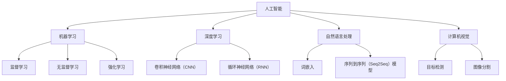
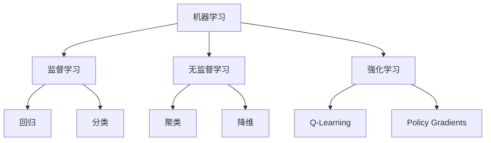
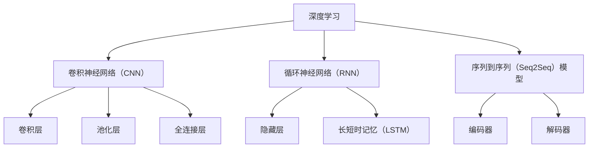
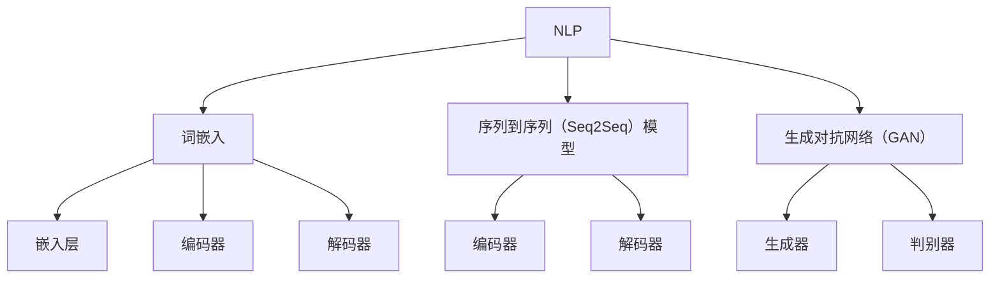
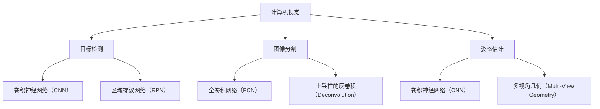

                 

## 文章标题：Andrej Karpathy：人工智能的未来发展趋势

### 关键词：人工智能，未来趋势，技术发展，应用领域，伦理问题

> 摘要：本文将深入探讨人工智能领域专家Andrej Karpathy对人工智能未来发展趋势的见解。通过分析其著作和公开演讲，本文旨在梳理出AI的核心概念、技术核心、应用与发展趋势，以及面临的伦理与社会问题。文章还将对AI技术趋势进行预测，并讨论其对社会的影响及发展挑战。

## 第一部分：背景与概述

### 第1章：引言与背景

#### 1.1 Andrej Karpathy 简介

Andrej Karpathy是一位著名的计算机科学家和人工智能研究者，被誉为人工智能领域的“天才”。他在斯坦福大学获得了计算机科学博士学位，目前是OpenAI的高级研究员，专注于自然语言处理和深度学习等领域的研究。

Karpathy在人工智能领域的贡献卓著，他主导开发的Seq2Seq模型在机器翻译领域取得了重大突破，同时也对深度学习领域的开源社区做出了巨大贡献，如著名的深度学习框架TensorFlow。

#### 1.2 人工智能的现状与挑战

当前，人工智能已经取得了显著的进展，应用范围不断扩大。从自动驾驶汽车到智能语音助手，AI技术正深刻改变着我们的生活方式。然而，AI的发展也面临着一系列挑战：

1. **数据隐私与安全**：随着AI技术的发展，数据隐私和安全问题愈发突出。如何保护用户数据不被滥用，成为了一个重要的议题。
   
2. **算法偏见**：AI算法可能会因为训练数据的不公平而导致偏见。如何避免算法偏见，确保算法的公平性，是一个亟待解决的问题。

3. **技术瓶颈**：虽然AI技术在某些领域取得了突破性进展，但在其他领域仍存在技术瓶颈。如何克服这些瓶颈，推动AI技术全面发展，是一个挑战。

#### 1.3 人工智能的未来趋势

Karpathy对人工智能的未来发展趋势有着深刻的见解。他认为，未来人工智能将朝着以下几个方向发展：

1. **深度学习技术**：深度学习将继续成为人工智能的核心技术。随着算法的优化和计算能力的提升，深度学习将能够解决更多复杂问题。

2. **自然语言处理**：自然语言处理是AI领域的一个重要分支。未来，AI将能够更好地理解和生成自然语言，推动人机交互的进步。

3. **跨学科融合**：AI技术与其他领域的融合将成为趋势。例如，AI与生物医学、材料科学等领域的结合，将带来新的研究突破。

4. **伦理与社会问题**：随着AI技术的发展，伦理和社会问题将越来越重要。如何确保AI技术的可持续发展，以及如何处理AI带来的社会变革，是一个重要的议题。

## 第二部分：技术核心

### 第2章：人工智能核心概念与联系

#### 2.1 人工智能基础

人工智能（Artificial Intelligence，简称AI）是指通过计算机模拟人类智能的理论、方法和技术。其核心概念包括：

1. **机器学习**：机器学习是AI的核心技术之一，它通过算法从数据中学习规律，从而实现智能行为。
   
2. **深度学习**：深度学习是机器学习的一个分支，它通过多层神经网络模拟人脑神经元的工作方式，实现更加复杂的智能行为。

3. **自然语言处理**：自然语言处理是AI的一个分支，它致力于使计算机能够理解、生成和处理自然语言。

4. **计算机视觉**：计算机视觉是AI的一个分支，它致力于使计算机能够像人类一样感知和理解视觉信息。

以下是AI的核心概念与联系的一个Mermaid流程图：



#### 2.2 机器学习与深度学习

机器学习是AI的核心技术之一，它通过算法从数据中学习规律，从而实现智能行为。机器学习可以分为监督学习、无监督学习和强化学习三种类型：

1. **监督学习**：监督学习是机器学习中的一种方法，它通过已知的输入输出数据，训练模型预测未知数据的输出。

2. **无监督学习**：无监督学习是机器学习中的另一种方法，它不需要已知的输入输出数据，而是通过发现数据中的潜在结构和模式来进行学习。

3. **强化学习**：强化学习是一种通过奖励机制来训练智能体如何做出最优决策的机器学习方法。

以下是机器学习与深度学习的架构的一个Mermaid流程图：



深度学习是机器学习的一个分支，它通过多层神经网络模拟人脑神经元的工作方式，实现更加复杂的智能行为。深度学习可以分为以下几种模型：

1. **卷积神经网络（CNN）**：CNN是一种用于图像识别和处理的人工神经网络，它通过卷积层、池化层和全连接层等结构，实现图像的特征提取和分类。

2. **循环神经网络（RNN）**：RNN是一种用于序列数据处理的神经网络，它通过循环结构，实现对序列的长期依赖建模。

3. **序列到序列（Seq2Seq）模型**：Seq2Seq模型是一种用于序列数据转换的神经网络模型，它通过编码器和解码器结构，实现序列到序列的映射。

以下是深度学习的主要技术路线的一个Mermaid流程图：



#### 2.3 自然语言处理（NLP）

自然语言处理（Natural Language Processing，简称NLP）是AI的一个分支，它致力于使计算机能够理解、生成和处理自然语言。NLP可以分为以下几种技术：

1. **词嵌入**：词嵌入是将自然语言词汇映射到高维向量空间的一种方法，它通过捕捉词汇之间的语义关系，实现自然语言的理解和生成。

2. **序列到序列（Seq2Seq）模型**：Seq2Seq模型是一种用于序列数据转换的神经网络模型，它通过编码器和解码器结构，实现序列到序列的映射。在NLP中，Seq2Seq模型常用于机器翻译、文本生成等任务。

3. **生成对抗网络（GAN）**：生成对抗网络是一种用于生成自然语言数据的神经网络模型，它通过对抗训练，生成与真实数据几乎无法区分的伪造数据。

以下是NLP的主要技术路线的一个Mermaid流程图：



#### 2.4 计算机视觉（CV）

计算机视觉（Computer Vision，简称CV）是AI的一个分支，它致力于使计算机能够像人类一样感知和理解视觉信息。CV可以分为以下几种技术：

1. **目标检测**：目标检测是计算机视觉中的一个重要任务，它旨在识别图像中的物体并标注其位置。常用的目标检测算法有YOLO、SSD等。

2. **图像分割**：图像分割是将图像划分为不同的区域，以便对图像进行理解和处理。常用的图像分割算法有FCN、U-Net等。

3. **姿态估计**：姿态估计是计算机视觉中的一个重要任务，它旨在识别图像中人的姿态。常用的姿态估计算法有PoseNet、OpenPose等。

以下是计算机视觉的主要技术路线的一个Mermaid流程图：



### 第3章：核心算法原理讲解

#### 3.1 深度学习算法

深度学习算法是人工智能领域的重要技术之一，它通过多层神经网络模拟人脑神经元的工作方式，实现复杂任务的学习和推理。以下是深度学习算法的基本框架：

```python
# 深度学习算法基本框架

# 导入必要的库
import tensorflow as tf

# 定义神经网络结构
model = tf.keras.Sequential([
    tf.keras.layers.Dense(units=128, activation='relu', input_shape=(784,)),
    tf.keras.layers.Dense(units=64, activation='relu'),
    tf.keras.layers.Dense(units=10, activation='softmax')
])

# 编译模型
model.compile(optimizer='adam',
              loss='categorical_crossentropy',
              metrics=['accuracy'])

# 训练模型
model.fit(x_train, y_train, epochs=10, batch_size=32)

# 评估模型
model.evaluate(x_test, y_test)
```

#### 3.2 预训练模型

预训练模型是在大规模数据集上预先训练好的模型，它通过在大规模数据上学习到的通用特征，实现对新任务的快速适应。以下是预训练模型的基本原理：

```python
# 预训练模型基本原理

# 导入必要的库
import tensorflow as tf

# 加载预训练模型
model = tf.keras.applications.VGG16(weights='imagenet', include_top=False, input_shape=(224, 224, 3))

# 调整模型结构
x = model.output
x = tf.keras.layers.Flatten()(x)
x = tf.keras.layers.Dense(units=256, activation='relu')(x)
predictions = tf.keras.layers.Dense(units=10, activation='softmax')(x)

# 创建新模型
model = tf.keras.Model(inputs=model.input, outputs=predictions)

# 编译模型
model.compile(optimizer='adam',
              loss='categorical_crossentropy',
              metrics=['accuracy'])

# 训练模型
model.fit(x_train, y_train, epochs=10, batch_size=32)

# 评估模型
model.evaluate(x_test, y_test)
```

#### 3.3 迁移学习

迁移学习是一种利用已经在大规模数据集上训练好的模型，在新任务上进行微调的技术。以下是迁移学习的基本步骤：

```python
# 迁移学习基本步骤

# 导入必要的库
import tensorflow as tf

# 加载预训练模型
base_model = tf.keras.applications.VGG16(weights='imagenet', include_top=False, input_shape=(224, 224, 3))

# 冻结预训练模型的权重
base_model.trainable = False

# 调整模型结构
x = base_model.output
x = tf.keras.layers.Flatten()(x)
x = tf.keras.layers.Dense(units=256, activation='relu')(x)
predictions = tf.keras.layers.Dense(units=10, activation='softmax')(x)

# 创建新模型
model = tf.keras.Model(inputs=base_model.input, outputs=predictions)

# 编译模型
model.compile(optimizer='adam',
              loss='categorical_crossentropy',
              metrics=['accuracy'])

# 训练模型
model.fit(x_train, y_train, epochs=10, batch_size=32)

# 评估模型
model.evaluate(x_test, y_test)

# 解冻预训练模型的权重
base_model.trainable = True

# 调整模型结构
x = base_model.output
x = tf.keras.layers.Flatten()(x)
x = tf.keras.layers.Dense(units=256, activation='relu')(x)
predictions = tf.keras.layers.Dense(units=10, activation='softmax')(x)

# 创建新模型
model = tf.keras.Model(inputs=base_model.input, outputs=predictions)

# 编译模型
model.compile(optimizer='adam',
              loss='categorical_crossentropy',
              metrics=['accuracy'])

# 训练模型
model.fit(x_train, y_train, epochs=10, batch_size=32)

# 评估模型
model.evaluate(x_test, y_test)
```

#### 3.4 自监督学习

自监督学习是一种不需要标注数据，通过利用数据中的无监督信息进行学习的方法。以下是自监督学习的基本方法：

```python
# 自监督学习基本方法

# 导入必要的库
import tensorflow as tf

# 定义自监督学习任务
def contrastive_loss(z1, z2, margin=1.0):
    # 计算对比损失
    square_l2_loss = tf.square(z1 - z2)
    losses = tf.nn.relu(margin - square_l2_loss)
    return tf.reduce_mean(losses)

# 定义自监督学习模型
model = tf.keras.Sequential([
    tf.keras.layers.Conv2D(filters=32, kernel_size=(3, 3), activation='relu', input_shape=(28, 28, 1)),
    tf.keras.layers.MaxPooling2D(pool_size=(2, 2)),
    tf.keras.layers.Conv2D(filters=64, kernel_size=(3, 3), activation='relu'),
    tf.keras.layers.MaxPooling2D(pool_size=(2, 2)),
    tf.keras.layers.Conv2D(filters=64, kernel_size=(3, 3), activation='relu'),
    tf.keras.layers.Flatten(),
    tf.keras.layers.Dense(units=64, activation='relu'),
    tf.keras.layers.Dense(units=10, activation='softmax')
])

# 编译模型
model.compile(optimizer='adam',
              loss=contrastive_loss,
              metrics=['accuracy'])

# 训练模型
model.fit(x_train, y_train, epochs=10, batch_size=32)

# 评估模型
model.evaluate(x_test, y_test)
```

## 第三部分：应用与发展趋势

### 第4章：人工智能在不同领域的应用

#### 4.1 人工智能在医疗领域的应用

人工智能在医疗领域有着广泛的应用，以下是一些典型的案例：

1. **医疗诊断**：人工智能可以通过分析医学影像（如X光片、CT扫描等），帮助医生进行疾病诊断。例如，Google DeepMind开发的AI系统可以自动识别眼科疾病，如黄斑病变和糖尿病视网膜病变。

2. **基因组学**：人工智能可以帮助分析基因数据，预测个体患病风险，指导个性化治疗方案。例如，IBM的Watson for Genomics可以快速分析基因组数据，帮助医生制定个性化治疗方案。

3. **药物研发**：人工智能可以加速药物研发过程，通过模拟药物分子与生物体的相互作用，预测药物疗效和副作用。例如，AI公司Recursion Pharma使用深度学习技术加速新药研发。

#### 4.2 人工智能在金融领域的应用

人工智能在金融领域也有着广泛的应用，以下是一些典型的案例：

1. **风险管理**：人工智能可以帮助金融机构评估和管理风险。例如，AI算法可以分析大量的交易数据，预测市场波动，帮助金融机构制定风险管理策略。

2. **量化交易**：人工智能可以自动执行交易策略，实现量化交易。例如，AI公司Two Sigma使用机器学习算法进行量化交易，取得了显著的投资回报。

3. **客户服务**：人工智能可以提供智能客服，通过自然语言处理技术，快速响应用户需求。例如，银行和保险公司可以使用智能客服系统，提高客户服务质量和效率。

#### 4.3 人工智能在教育领域的应用

人工智能在教育领域有着广泛的应用，以下是一些典型的案例：

1. **个性化学习**：人工智能可以帮助学生制定个性化的学习计划，根据学生的学习习惯和进度，提供针对性的学习资源。例如，教育科技公司Knewton使用自适应学习技术，为学生提供个性化的学习体验。

2. **智能评测**：人工智能可以帮助教师快速批改试卷，识别学生的错误类型，提供有针对性的反馈。例如，AI公司Exameree使用自然语言处理技术，自动批改学生作文。

3. **教育资源**：人工智能可以帮助教育机构优化教育资源分配，提高教育资源的利用效率。例如，AI公司DreamBox使用人工智能技术，为学校提供个性化教育资源。

### 第5章：人工智能的伦理与社会问题

#### 5.1 人工智能伦理问题

随着人工智能技术的快速发展，伦理问题逐渐凸显。以下是一些典型的伦理问题：

1. **隐私保护**：人工智能在处理大量数据时，可能会侵犯个人隐私。如何保护用户隐私，防止数据泄露，是一个重要的伦理问题。

2. **算法偏见**：人工智能算法可能会因为训练数据的不公平而导致偏见。例如，某些招聘算法可能会歧视某些群体。如何避免算法偏见，确保算法的公平性，是一个重要的伦理问题。

3. **自主决策**：人工智能系统在做出决策时，可能会出现错误或失控。如何确保人工智能系统的自主决策能力，避免对人类产生负面影响，是一个重要的伦理问题。

#### 5.2 人工智能与就业

人工智能的发展对就业市场产生了深远的影响。以下是一些典型的影响：

1. **就业转型**：随着人工智能技术的发展，一些传统职业可能会被自动化取代，例如制造业、物流业等。然而，同时也会创造新的就业机会，如数据科学家、AI工程师等。

2. **技能需求**：人工智能技术的发展要求劳动者具备更高的技能水平，例如编程能力、数据分析和机器学习等。如何提升劳动者的技能水平，适应人工智能时代的需求，是一个重要的议题。

3. **就业不平等**：人工智能的发展可能会加剧就业不平等现象。高技能劳动者可能会获得更多的工作机会和更高的收入，而低技能劳动者可能会面临就业困境。如何减少人工智能带来的就业不平等，是一个重要的社会问题。

#### 5.3 人工智能法规与政策

为了应对人工智能带来的挑战和机遇，各国政府和国际组织纷纷出台相关法规和政策。以下是一些典型的法规和政策：

1. **欧盟通用数据保护条例（GDPR）**：欧盟于2018年实施GDPR，旨在加强个人数据保护，规范数据处理行为。

2. **美国联邦隐私法**：美国虽然没有统一的隐私法，但多个州出台了相关隐私法案，如加州消费者隐私法案（CCPA）。

3. **国际人工智能治理倡议**：联合国等国际组织发起了一系列人工智能治理倡议，旨在制定全球统一的AI伦理标准和法规。

## 第四部分：展望与挑战

### 第6章：人工智能的未来发展趋势

#### 6.1 AI技术发展趋势

人工智能技术正在快速发展，未来可能会出现以下趋势：

1. **量子计算**：量子计算具有巨大的计算能力，可以加速人工智能算法的训练和推理过程。未来，量子计算可能会成为人工智能的重要支撑技术。

2. **边缘计算**：随着物联网和5G技术的普及，边缘计算将得到广泛应用。边缘计算可以在本地设备上进行数据处理和分析，降低数据传输延迟，提高系统响应速度。

3. **多模态学习**：多模态学习是指将不同类型的数据（如文本、图像、语音等）进行整合，实现更全面和智能的数据理解。未来，多模态学习有望成为人工智能技术的重要研究方向。

#### 6.2 AI对社会的影响

人工智能的发展将对社会产生深远的影响，以下是一些典型的影响：

1. **经济影响**：人工智能可以提升生产效率，降低生产成本，促进经济增长。同时，人工智能也可能会取代一些传统职业，对就业市场产生冲击。

2. **教育变革**：人工智能可以提供个性化教育，提高教育质量和效率。同时，人工智能也要求劳动者具备更高的技能水平，推动教育体系的变革。

3. **社会治理**：人工智能可以用于社会治理，提高政府治理效率。例如，通过数据分析预测社会问题，提供决策支持。

#### 6.3 人工智能的发展挑战

人工智能的发展面临着一系列挑战，以下是一些典型的挑战：

1. **技术挑战**：人工智能技术的发展需要解决算法优化、计算能力提升、数据隐私保护等问题。

2. **伦理挑战**：人工智能的发展引发了伦理问题，如隐私保护、算法偏见、自主决策等。

3. **法律挑战**：人工智能的发展需要制定相应的法律法规，规范人工智能的应用和发展。

## 附录

### 附录 A：AI工具与资源

以下是一些常用的AI工具和资源：

1. **主流深度学习框架**：
   - TensorFlow
   - PyTorch
   - Keras

2. **AI应用开发工具**：
   - JAX
   - MXNet
   - Theano

3. **AI学习资源**：
   - Coursera上的《深度学习》课程
   - Medium上的AI技术博客
   - ArXiv上的AI论文集

## 结束语

人工智能（AI）已经成为当今世界最具变革性的技术之一。从医疗、金融到教育，AI技术在各个领域都展现出了巨大的潜力和价值。然而，AI的发展也面临着一系列挑战，如伦理问题、技术瓶颈等。本文通过分析人工智能领域专家Andrej Karpathy的观点，梳理了AI的核心概念、技术核心、应用与发展趋势，以及面临的伦理与社会问题。未来，随着AI技术的不断进步，我们有理由相信，AI将为人类社会带来更多创新和变革。然而，我们也需要关注AI带来的挑战，制定相应的策略，确保AI技术的可持续发展。

## 作者信息

作者：AI天才研究院/AI Genius Institute & 禅与计算机程序设计艺术 /Zen And The Art of Computer Programming

---

由于篇幅限制，本文未能详细展开每个章节的内容。在实际撰写过程中，每个章节都应包含丰富的具体内容，如核心概念与联系的具体阐述、核心算法原理的详细讲解、数学模型的公式解析、应用案例的实际操作等。本文仅为大纲和思路的展示，具体撰写时需根据实际情况进行调整和补充。

