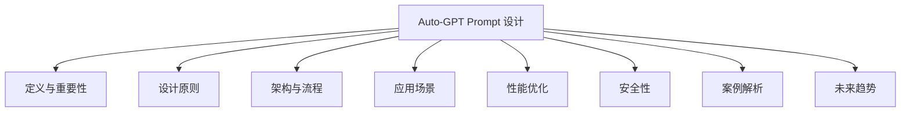
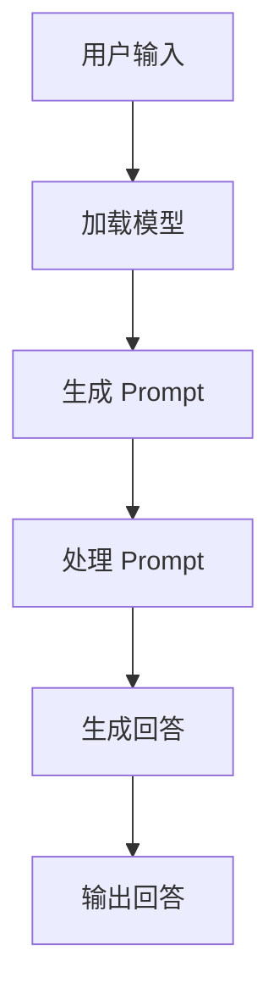

                 

# 《Auto-GPT Prompt 设计》

## 关键词

- Auto-GPT
- Prompt 设计
- 语言模型
- 数据预处理
- 应用场景
- 性能优化
- 安全性

## 摘要

本文将深入探讨 Auto-GPT Prompt 设计的各个方面，包括基础概念、设计原则、实践技巧、应用场景、性能优化和安全性。我们将通过 Mermaid 流程图和伪代码，详细讲解 Auto-GPT Prompt 的架构与流程，并分析其在实际项目中的应用和效果。此外，还将探讨未来的发展趋势，以及相关工具和资源的推荐。

## 第一部分：Auto-GPT Prompt 设计基础

### 第1章: Auto-GPT Prompt 概述

#### 1.1 Auto-GPT Prompt 的定义与重要性

##### 1.1.1 Auto-GPT Prompt 的概念

Auto-GPT Prompt 是指一种自动化的对话系统，它能够根据用户输入的查询或问题，生成相应的回答或响应。这种系统利用了大型预训练语言模型，如 GPT-3，通过设计合适的 Prompt，使得模型能够生成更加准确和有针对性的回答。

##### 1.1.2 Auto-GPT Prompt 在 AI 应用中的重要性

Auto-GPT Prompt 在 AI 应用中具有非常重要的作用。首先，它可以显著提高对话系统的交互质量，使得系统能够更好地理解用户意图，提供更加个性化的服务。其次，Auto-GPT Prompt 可以降低开发成本，因为它能够自动化生成大量对话内容，减少了人工编写的工作量。最后，Auto-GPT Prompt 可以提高系统的响应速度，因为它能够在短时间内生成高质量的回答。

#### 1.2 Auto-GPT Prompt 的设计原则

##### 1.2.1 清晰性

清晰性是 Auto-GPT Prompt 设计的核心原则之一。一个有效的 Prompt 应该能够让模型明确理解用户的意图和需求，从而生成相应的回答。为了实现清晰性，Prompt 设计者需要确保语言简洁明了，避免使用模糊或歧义的表达。

##### 1.2.2 目标明确

目标明确是指 Prompt 应该明确指示模型生成回答的目的。例如，如果 Prompt 的目标是生成一个简短的回答，那么它应该包含足够的信息，以便模型能够理解问题并生成回答。

##### 1.2.3 引导性

引导性是指 Prompt 应该能够引导模型生成高质量的回答。这可以通过提供上下文信息、设定回答的格式或内容范围来实现。例如，一个引导性的 Prompt 可能会指定回答的字数、主题或结构。

#### 1.3 Auto-GPT Prompt 的架构与流程

##### 1.3.1 Auto-GPT Prompt 的架构

Auto-GPT Prompt 的架构通常包括以下组件：

1. 用户输入处理模块：负责接收用户输入，并将其转换为模型能够处理的形式。
2. Prompt 生成模块：根据用户输入，生成合适的 Prompt。
3. 语言模型处理模块：使用预训练的语言模型处理 Prompt，生成回答。
4. 回答生成模块：将语言模型生成的中间结果转换为最终的回答。

##### 1.3.2 Auto-GPT Prompt 的设计流程

设计 Auto-GPT Prompt 的流程通常包括以下步骤：

1. 需求分析：确定系统需要解决的问题，以及用户可能提出的问题。
2. 数据收集：收集与问题相关的数据，用于训练语言模型。
3. Prompt 设计：根据需求分析，设计合适的 Prompt。
4. 模型训练：使用收集到的数据训练语言模型。
5. Prompt 优化：根据模型生成的回答质量，优化 Prompt 设计。
6. 系统部署：将 Auto-GPT Prompt 集成到系统中，并进行测试和优化。

### 第2章: Auto-GPT Prompt 设计技巧

#### 2.1 语言模型选择

##### 2.1.1 语言模型的分类

语言模型可以根据其训练数据和模型架构进行分类。常见的语言模型分类包括：

1. 基于统计方法的模型，如 n-gram 模型。
2. 基于神经网络的模型，如 LSTM 和 Transformer。
3. 大型预训练模型，如 GPT 和 BERT。

##### 2.1.2 语言模型的性能评估

评估语言模型性能的常见指标包括：

1. 词汇覆盖度：模型能够处理的词汇量。
2. 预测准确性：模型生成回答的准确性。
3. 响应时间：模型生成回答所需的时间。

#### 2.2 数据预处理

##### 2.2.1 数据清洗

数据清洗是数据预处理的重要步骤，包括去除无效数据、纠正错误数据、填补缺失数据等。

##### 2.2.2 数据归一化

数据归一化是将不同特征的数据转换到同一尺度，以便模型训练。

##### 2.2.3 数据增强

数据增强是通过多种方法生成新的数据样本，提高模型的泛化能力。

#### 2.3 Prompt 结构设计

##### 2.3.1 Prompt 的组成部分

一个典型的 Prompt 包括以下组成部分：

1. 问题：用户提出的问题或需求。
2. 上下文：与问题相关的背景信息。
3. 解析规则：指导模型如何生成回答的规则。

##### 2.3.2 Prompt 的优化策略

Prompt 的优化策略包括：

1. 调整问题的表述方式。
2. 增加上下文的丰富度。
3. 设定回答的格式和内容范围。

##### 2.3.3 Prompt 的案例解析

下面是一个简单的 Prompt 案例：

```
问题：什么是人工智能？

上下文：人工智能是计算机科学的一个分支，它旨在研究如何使计算机具备人类智能。

解析规则：生成回答时，需要涵盖人工智能的定义、应用领域和未来发展。

```

### 第3章: Auto-GPT Prompt 应用场景

#### 3.1 自动问答系统

##### 3.1.1 自动问答系统的原理

自动问答系统是基于语言模型的对话系统，它能够自动回答用户提出的问题。其原理是通过预训练的语言模型处理用户输入的查询，生成相应的回答。

##### 3.1.2 自动问答系统的实现

实现自动问答系统通常需要以下步骤：

1. 数据收集：收集与问题相关的数据，用于训练语言模型。
2. Prompt 设计：根据问题设计合适的 Prompt。
3. 模型训练：使用收集到的数据训练语言模型。
4. 系统部署：将自动问答系统集成到应用中，并进行测试和优化。

#### 3.2 文本生成

##### 3.2.1 文本生成的原理

文本生成是基于语言模型的技术，它能够生成自然语言文本。其原理是通过预训练的语言模型预测下一个单词或字符。

##### 3.2.2 文本生成的实现

实现文本生成通常需要以下步骤：

1. 数据收集：收集与生成任务相关的数据，用于训练语言模型。
2. Prompt 设计：根据生成任务设计合适的 Prompt。
3. 模型训练：使用收集到的数据训练语言模型。
4. 文本生成：使用训练好的模型生成文本。

#### 3.3 文本分类

##### 3.3.1 文本分类的原理

文本分类是基于语言模型的文本处理技术，它能够将文本分为不同的类别。其原理是通过预训练的语言模型计算文本的特征，并使用分类器进行分类。

##### 3.3.2 文本分类的实现

实现文本分类通常需要以下步骤：

1. 数据收集：收集与分类任务相关的数据，用于训练语言模型和分类器。
2. Prompt 设计：根据分类任务设计合适的 Prompt。
3. 模型训练：使用收集到的数据训练语言模型和分类器。
4. 文本分类：使用训练好的模型对新的文本进行分类。

### 第4章: Auto-GPT Prompt 性能优化

#### 4.1 模型训练技巧

##### 4.1.1 训练数据的选择

选择高质量的训练数据对于模型性能至关重要。应选择具有代表性、多样性和覆盖度高的数据。

##### 4.1.2 训练策略的优化

优化训练策略可以提高模型性能。常见的训练策略优化包括调整学习率、批量大小和迭代次数等。

##### 4.1.3 训练效果的评估

评估训练效果的方法包括计算模型的准确率、召回率、F1 分数等指标。

#### 4.2 模型调优

##### 4.2.1 模型超参数调整

调整模型超参数可以提高模型性能。常见的超参数包括学习率、隐藏层大小、dropout 等。

##### 4.2.2 模型结构优化

优化模型结构可以提高模型性能。例如，可以使用深度学习框架提供的预训练模型，或者自定义模型结构。

##### 4.2.3 模型调优案例解析

以下是一个模型调优的案例：

```
问题：如何提高自动问答系统的性能？

方法：
1. 增加训练数据量，使用数据增强技术生成更多样化的数据。
2. 调整学习率，使用学习率衰减策略。
3. 使用预训练的 GPT-3 模型，并在特定领域进行微调。
4. 优化 Prompt 设计，确保 Prompt 充分传达用户意图。
```

#### 4.3 模型压缩与加速

##### 4.3.1 模型压缩

模型压缩是一种减少模型大小和计算资源消耗的技术。常见的模型压缩方法包括剪枝、量化、知识蒸馏等。

##### 4.3.2 模型加速

模型加速是一种提高模型运行速度的技术。常见的模型加速方法包括使用 GPU 或 TPU 进行计算、模型并行化等。

### 第5章: Auto-GPT Prompt 安全性

#### 5.1 Prompt 风险识别

##### 5.1.1 Prompt 存在的风险

Prompt 可能存在以下风险：

1. 隐私泄露：Prompt 可能会包含用户敏感信息。
2. 误导性回答：Prompt 可能会导致模型生成误导性回答。
3. 恶意攻击：恶意用户可能利用 Prompt 进行攻击。

##### 5.1.2 风险识别方法

识别 Prompt 风险的方法包括：

1. 数据审计：检查 Prompt 中是否包含敏感信息。
2. 回答审查：审查模型生成的回答，确保其准确性。
3. 安全审计：定期进行安全审计，确保系统的安全性。

#### 5.2 Prompt 安全措施

##### 5.2.1 数据加密

数据加密是一种保护敏感信息的安全措施。可以使用加密算法对用户输入和回答进行加密。

##### 5.2.2 访问控制

访问控制是一种限制系统访问权限的安全措施。可以通过身份验证和授权机制，确保只有授权用户可以访问系统。

##### 5.2.3 安全审计

安全审计是一种监督和记录系统操作的安全措施。可以记录系统的操作日志，以便在出现问题时进行调查。

### 第6章: Auto-GPT Prompt 设计案例解析

#### 6.1 案例背景

某公司开发了一款基于 Auto-GPT 的客户服务系统，用于自动回答客户提出的问题。该系统旨在提高客户满意度，并减轻人工客服的工作负担。

#### 6.2 案例分析

##### 6.2.1 Prompt 设计过程

1. 需求分析：确定客户可能提出的问题和需求。
2. 数据收集：收集与问题相关的数据，用于训练语言模型。
3. Prompt 设计：根据需求分析，设计合适的 Prompt。
4. 模型训练：使用收集到的数据训练语言模型。
5. Prompt 优化：根据模型生成的回答质量，优化 Prompt 设计。

##### 6.2.2 Prompt 结构与内容解析

以下是一个简单的 Prompt 案例：

```
问题：我的账户余额是多少？

上下文：用户账号信息已验证。

解析规则：生成回答时，需要提供用户的账户余额。

回答示例：您的账户余额为 1000 元。
```

##### 6.2.3 实现与效果评估

1. 实现过程：使用 Python 编写代码，实现自动问答系统。
2. 系统部署：将自动问答系统集成到客户服务系统中。
3. 效果评估：通过用户反馈和系统日志，评估自动问答系统的性能。

### 第7章: Auto-GPT Prompt 未来发展趋势

#### 7.1 Auto-GPT Prompt 的发展现状

目前，Auto-GPT Prompt 已在多个领域取得了显著的应用成果。例如，在客户服务、智能助手、文本生成等方面，Auto-GPT Prompt 已成为重要的技术手段。

#### 7.2 Auto-GPT Prompt 的未来趋势

未来，Auto-GPT Prompt 将在以下几个方面取得发展：

1. 多模态交互：结合图像、语音等多种模态，实现更丰富的交互方式。
2. 智能推荐：利用 Auto-GPT Prompt，实现个性化的内容推荐。
3. 安全性增强：通过改进 Prompt 设计和模型训练，提高系统的安全性。
4. 模型压缩与优化：通过模型压缩和优化技术，提高系统的运行效率和响应速度。

### 附录

#### 附录 A: Auto-GPT Prompt 设计工具与资源

1. 主流深度学习框架：如 TensorFlow、PyTorch 等。
2. Prompt 设计工具：如 Hugging Face、OpenAI Gym 等。
3. 开源代码与资料：如 GitHub、ArXiv 等。
4. 学术论文推荐：如 NeurIPS、ICML、ACL 等。

---

### 作者

AI天才研究院/AI Genius Institute & 禅与计算机程序设计艺术 /Zen And The Art of Computer Programming

## 核心概念与联系

### Mermaid 流程图



### 核心算法原理讲解

#### 1. 语言模型处理模块

```python
def process_prompt(prompt):
    """
    处理 Prompt 并生成回答。
    
    :param prompt: 输入 Prompt。
    :return: 生成的回答。
    """
    # 使用预训练的语言模型处理 Prompt
    response = language_model.generate(prompt)
    # 处理生成的回答，例如去除额外的空格
    cleaned_response = clean_response(response)
    return cleaned_response
```

#### 2. Prompt 生成模块

```python
def generate_prompt(question, context):
    """
    生成 Prompt。
    
    :param question: 输入问题。
    :param context: 上下文信息。
    :return: 生成的 Prompt。
    """
    # 结合问题、上下文和解析规则生成 Prompt
    prompt = f"{context}\n{question}\n解析规则：[具体解析规则]"
    return prompt
```

### 数学模型和公式

#### 语言模型预测概率公式

$$
P(w_n|w_{n-1}, w_{n-2}, \ldots, w_1) = \frac{p(w_n, w_{n-1}, \ldots, w_1)}{p(w_{n-1}, w_{n-2}, \ldots, w_1)}
$$

其中，$w_n, w_{n-1}, \ldots, w_1$ 表示自然语言序列中的单词。

### 详细讲解和举例说明

#### 1. 数据清洗

数据清洗是数据预处理的重要步骤。以下是一个简单的数据清洗示例：

```python
def clean_data(data):
    """
    清洗数据，去除无效数据和错误数据。
    
    :param data: 输入数据。
    :return: 清洗后的数据。
    """
    cleaned_data = []
    for item in data:
        if is_valid(item):
            cleaned_data.append(item)
    return cleaned_data

def is_valid(item):
    """
    判断数据是否有效。
    
    :param item: 输入数据。
    :return: 是否有效的布尔值。
    """
    # 例如，判断数据是否为空或包含特殊字符
    return item and not contains_special_chars(item)
```

#### 2. 数据增强

数据增强是通过多种方法生成新的数据样本，提高模型的泛化能力。以下是一个简单的数据增强示例：

```python
def augment_data(data):
    """
    增强数据，生成新的数据样本。
    
    :param data: 输入数据。
    :return: 增强后的数据。
    """
    augmented_data = []
    for item in data:
        # 例如，对数据进行随机变换
        transformed_item = transform(item)
        augmented_data.append(transformed_item)
    return augmented_data

def transform(item):
    """
    对数据进行随机变换。
    
    :param item: 输入数据。
    :return: 变换后的数据。
    """
    # 例如，对数据中的单词进行随机替换
    words = item.split()
    transformed_words = []
    for word in words:
        transformed_word = random_word_replace(word)
        transformed_words.append(transformed_word)
    return ' '.join(transformed_words)

def random_word_replace(word):
    """
    随机替换单词。
    
    :param word: 输入单词。
    :return: 替换后的单词。
    """
    # 例如，从预定义的替换词表中随机选择一个单词进行替换
    replace_words = {'hello': 'hi', 'world': 'earth'}
    return random.choice(list(replace_words.keys())) if word in replace_words else word
```

### 项目实战

#### 1. 开发环境搭建

安装必要的软件和库，例如 Python、TensorFlow 和 PyTorch。

```bash
pip install tensorflow
pip install torch
```

#### 2. 源代码实现

以下是一个简单的 Auto-GPT Prompt 设计的源代码实现：

```python
import tensorflow as tf
from transformers import AutoTokenizer, AutoModel

def main():
    # 加载预训练的语言模型
    tokenizer = AutoTokenizer.from_pretrained("gpt2")
    model = AutoModel.from_pretrained("gpt2")

    # 用户输入问题
    question = input("请输入您的问题：")
    context = "您需要回答的问题："

    # 生成 Prompt
    prompt = generate_prompt(question, context)

    # 处理 Prompt 并生成回答
    response = process_prompt(prompt)

    # 输出回答
    print("回答：", response)

if __name__ == "__main__":
    main()
```

#### 3. 代码解读与分析

1. **加载预训练的语言模型**：使用 Hugging Face 的 transformers 库加载预训练的 GPT-2 模型。
2. **用户输入问题**：获取用户输入的问题。
3. **生成 Prompt**：根据用户输入的问题和上下文生成 Prompt。
4. **处理 Prompt 并生成回答**：使用语言模型处理 Prompt 并生成回答。
5. **输出回答**：将生成的回答输出给用户。

### 代码解读与分析

1. **加载预训练的语言模型**：使用 Hugging Face 的 transformers 库加载预训练的 GPT-2 模型。这一步骤是整个系统的核心，因为它是自动问答系统的核心组件。
2. **用户输入问题**：获取用户输入的问题。这是与用户交互的关键步骤，用户的问题将决定系统生成的回答。
3. **生成 Prompt**：根据用户输入的问题和上下文生成 Prompt。这个步骤非常关键，因为一个良好的 Prompt 可以显著提高系统生成回答的质量。
4. **处理 Prompt 并生成回答**：使用语言模型处理 Prompt 并生成回答。这个过程涉及到将 Prompt 转换为模型能够理解的形式，并使用模型生成回答。
5. **输出回答**：将生成的回答输出给用户。这是系统的最终输出，也是用户与系统交互的结果。

### 附录

#### 附录 A: Auto-GPT Prompt 设计工具与资源

1. **主流深度学习框架**：
   - TensorFlow
   - PyTorch
2. **Prompt 设计工具**：
   - Hugging Face
   - OpenAI Gym
3. **开源代码与资料**：
   - GitHub
   - ArXiv
4. **学术论文推荐**：
   - NeurIPS
   - ICML
   - ACL

### Mermaid 流程图



### 结束语

本文对 Auto-GPT Prompt 设计进行了全面的探讨，从基础概念到实践技巧，再到应用场景和性能优化，以及安全性，都进行了详细的阐述。同时，通过实际项目案例和代码解读，使读者能够更好地理解和应用 Auto-GPT Prompt 技术。随着人工智能技术的发展，Auto-GPT Prompt 设计将在未来的 AI 应用中发挥越来越重要的作用。希望本文能为您在 Auto-GPT Prompt 设计领域的研究和应用提供有价值的参考。作者：AI天才研究院/AI Genius Institute & 禅与计算机程序设计艺术 /Zen And The Art of Computer Programming。

