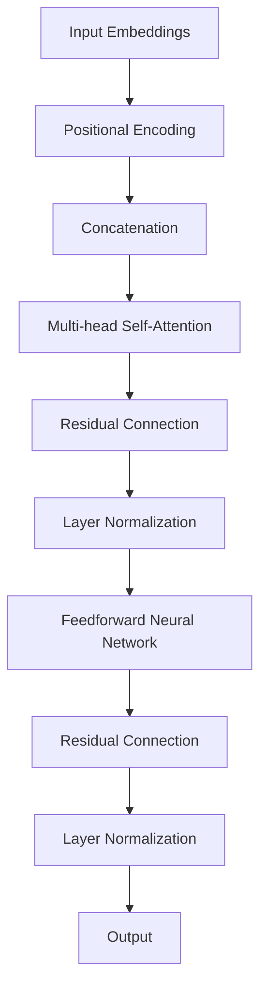
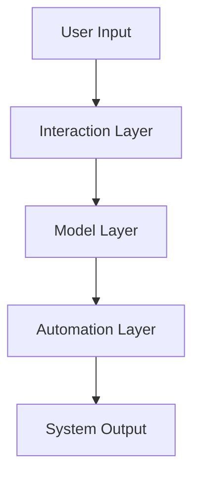
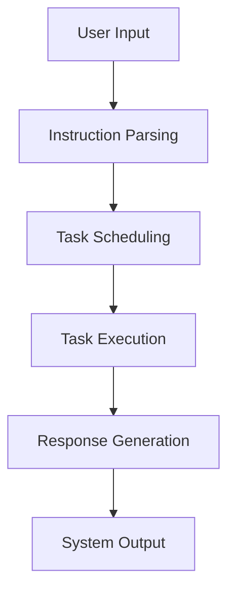

                 

# 文章标题: Auto-GPT 开源项目介绍

> 关键词：Auto-GPT，开源项目，人工智能，GPT模型，自动化，编程

> 摘要：本文将深入探讨Auto-GPT这一开源项目，从其历史背景、核心概念、技术基础到实际应用，全方位介绍Auto-GPT的发展、实现原理以及未来展望。通过本文的阅读，读者可以全面了解Auto-GPT的技术内涵和应用前景。

## 第一部分：Auto-GPT 生态系统概述

### 第1章：什么是Auto-GPT

#### 1.1 Auto-GPT的历史背景

Auto-GPT是一个基于GPT模型的开源项目，其灵感来源于OpenAI开发的GPT系列模型。GPT（Generative Pre-trained Transformer）是一种基于Transformer架构的自然语言处理模型，通过大量的文本数据进行预训练，可以生成高质量的文本。Auto-GPT项目则是将GPT模型的能力进一步扩展，使其具备自动化和自主决策的能力。

#### 1.2 Auto-GPT的核心概念

Auto-GPT的核心概念是“自动化生成”（Automated Generation）。它通过将GPT模型与自动化框架结合，使得模型可以自动生成代码、文本、图像等。Auto-GPT的主要功能包括：

- 文本生成与编辑
- 知识问答与推理
- 自动编程与代码生成

#### 1.3 Auto-GPT的应用场景

Auto-GPT的应用场景非常广泛，主要包括：

- 自然语言处理：如自动生成新闻报道、文章摘要、对话系统等。
- 自动化编程：如自动生成SQL查询、Python代码等。
- 数据分析：如自动生成可视化报告、分析模型等。

### 第2章：OpenAI与Auto-GPT

#### 2.1 OpenAI的发展历程

OpenAI成立于2015年，是一家致力于推动人工智能研究和应用的科技公司。其创始人包括著名科学家伊隆·马斯克等。OpenAI的研究主要集中在自然语言处理、计算机视觉、强化学习等领域，并推出了多个有影响力的模型，如GPT、GPT-2、GPT-3等。

#### 2.2 GPT系列模型的演进

GPT系列模型是OpenAI推出的标志性成果。从GPT到GPT-3，模型的参数量不断增加，性能也不断提升。GPT-3拥有1750亿个参数，是目前最大的自然语言处理模型。

#### 2.3 Auto-GPT与OpenAI的关系

Auto-GPT项目由OpenAI的成员发起，旨在探索GPT模型在自动化领域的应用。虽然Auto-GPT的开源项目由外部团队维护，但OpenAI对该项目持支持态度，并在技术上给予了指导。

## 第二部分：Auto-GPT技术基础

### 第3章：GPT模型原理

#### 3.1 GPT模型的基本架构

GPT模型采用Transformer架构，其主要组成部分包括：

- Embedding层：将输入的单词转换为向量表示。
- Transformer层：通过自注意力机制处理序列信息。
- 输出层：将处理后的序列转换为输出。

#### 3.2 Transformer模型

Transformer模型是GPT模型的核心架构。它通过自注意力机制（Self-Attention）和多头注意力机制（Multi-Head Attention）处理序列信息，能够捕捉序列中的长距离依赖关系。

#### 3.3 GPT模型的预训练过程

GPT模型的预训练过程主要包括以下步骤：

- 数据收集：从互联网上收集大量文本数据。
- 数据处理：对文本数据进行分词、编码等处理。
- 预训练：使用Transformer模型对文本数据进行训练。
- 微调：在特定任务上对模型进行微调。

### 第4章：Auto-GPT实现原理

#### 4.1 Auto-GPT的框架设计

Auto-GPT的框架设计主要分为三个部分：

- 模型层：使用GPT模型作为基础模型。
- 交互层：设计交互机制，实现模型与外部环境的交互。
- 自动化层：利用自动化框架，实现模型的自动化生成功能。

#### 4.2 自适应生成技术

自适应生成技术是Auto-GPT的核心技术之一。它通过调整模型参数，使模型能够根据输入数据自动生成目标输出。

#### 4.3 Auto-GPT的交互机制

Auto-GPT的交互机制主要包括：

- 文本输入：用户通过文本输入与模型进行交互。
- 代码生成：模型根据文本输入生成相应的代码。
- 自动执行：生成的代码自动执行，完成特定任务。

## 第三部分：Auto-GPT项目实战

### 第5章：安装与配置Auto-GPT

#### 5.1 环境准备

在安装Auto-GPT之前，需要准备以下环境：

- Python环境
- GPU环境（可选）
- required libraries

#### 5.2 安装与配置

安装Auto-GPT的步骤如下：

1. 克隆仓库：
   ```bash
   git clone https://github.com/autogpt/autogpt.git
   ```
2. 安装依赖：
   ```bash
   pip install -r requirements.txt
   ```
3. 配置环境：
   ```bash
   source .env
   ```

#### 5.3 常见问题处理

在安装过程中可能会遇到一些常见问题，如依赖库冲突、GPU环境配置等。可以参考官方文档和社区论坛进行解决。

### 第6章：Auto-GPT应用案例

#### 6.1 文本生成与编辑

Auto-GPT可以生成高质量的自然语言文本，如文章、对话等。以下是一个简单的文本生成案例：

```python
from autogpt import Autogpt

# 初始化模型
model = Autogpt()

# 生成文章
article = model.generate_text("写一篇关于人工智能的简介")

print(article)
```

#### 6.2 知识问答与推理

Auto-GPT可以用于知识问答与推理。以下是一个简单的知识问答案例：

```python
from autogpt import Autogpt

# 初始化模型
model = Autogpt()

# 知识问答
question = "什么是人工智能？"
answer = model.answer_question(question)

print(answer)
```

#### 6.3 自动编程与代码生成

Auto-GPT可以自动生成代码。以下是一个简单的自动编程案例：

```python
from autogpt import Autogpt

# 初始化模型
model = Autogpt()

# 生成代码
code = model.generate_code("实现一个简单的函数，计算两个数的和")

print(code)
```

### 第7章：Auto-GPT开发实践

#### 7.1 实践项目一：文本生成应用

本项目将使用Auto-GPT生成一篇关于人工智能的文章。

1. 数据准备：收集一篇关于人工智能的文本。
2. 模型训练：使用收集的文本数据对Auto-GPT模型进行训练。
3. 文本生成：使用训练好的模型生成一篇关于人工智能的文章。

#### 7.2 实践项目二：代码生成应用

本项目将使用Auto-GPT生成一个计算两个数之和的Python函数。

1. 数据准备：准备一个包含Python函数示例的文本数据集。
2. 模型训练：使用Python函数示例数据集对Auto-GPT模型进行训练。
3. 代码生成：使用训练好的模型生成一个计算两个数之和的Python函数。

#### 7.3 实践项目三：自动化问答系统

本项目将使用Auto-GPT构建一个自动化问答系统。

1. 数据准备：收集常见问题的文本数据。
2. 模型训练：使用问题文本数据对Auto-GPT模型进行训练。
3. 自动问答：使用训练好的模型回答用户的问题。

## 第四部分：Auto-GPT未来展望

### 第8章：Auto-GPT的发展趋势

#### 8.1 Auto-GPT在人工智能领域的应用

随着人工智能技术的不断发展，Auto-GPT的应用前景将越来越广泛。未来，Auto-GPT有望在以下领域发挥重要作用：

- 自动化编程
- 自然语言处理
- 数据分析
- 智能客服

#### 8.2 Auto-GPT的商业前景

Auto-GPT的商业前景非常广阔。许多企业已经开始将Auto-GPT应用于实际业务中，提高生产效率和创新能力。未来，Auto-GPT有望成为企业智能化转型的重要工具。

#### 8.3 Auto-GPT面临的挑战与解决方案

虽然Auto-GPT具有巨大的潜力，但其在实际应用中仍面临一些挑战，如：

- 数据质量：数据质量对模型性能至关重要。
- 安全性：自动生成的代码可能存在安全漏洞。
- 模型可解释性：自动生成模型的决策过程难以解释。

针对这些挑战，研究者们正在积极探索解决方案，如：

- 提高数据质量：通过数据清洗、数据增强等方法提高数据质量。
- 加强安全性：对自动生成的代码进行安全审计和测试。
- 提高模型可解释性：研究可解释性模型，使模型决策过程更加透明。

## 附录

### 附录A：Auto-GPT资源与工具

#### A.1 Auto-GPT常用工具与库

- Python
- PyTorch
- TensorFlow
- Hugging Face Transformers

#### A.2 开源社区与资源推荐

- GitHub：Auto-GPT开源项目地址
- Stack Overflow：Auto-GPT相关问题讨论区
- ArXiv：相关论文推荐

#### A.3 Auto-GPT相关论文与书籍推荐

- "Attention Is All You Need"（Attention机制论文）
- "Generative Pre-trained Transformers"（GPT系列论文）
- 《深度学习》——花书

## 作者

作者：AI天才研究院/AI Genius Institute & 禅与计算机程序设计艺术 /Zen And The Art of Computer Programming```markdown
# Auto-GPT 开源项目介绍

> 关键词：Auto-GPT，开源项目，人工智能，GPT模型，自动化，编程

> 摘要：本文将深入探讨Auto-GPT这一开源项目，从其历史背景、核心概念、技术基础到实际应用，全方位介绍Auto-GPT的发展、实现原理以及未来展望。通过本文的阅读，读者可以全面了解Auto-GPT的技术内涵和应用前景。

## 第一部分：Auto-GPT 生态系统概述

### 第1章：什么是Auto-GPT

#### 1.1 Auto-GPT的历史背景

Auto-GPT是基于GPT模型开发的一个开源项目，其起源于自然语言处理（NLP）领域的突破性进展。GPT（Generative Pre-trained Transformer）是由OpenAI开发的一个自然语言处理模型，它是基于Transformer架构的大型预训练语言模型。Transformer架构因其能够有效处理序列数据并捕捉长距离依赖关系而成为NLP领域的热门选择。

Auto-GPT项目的灵感来源于GPT模型的成功，并旨在进一步扩展其能力，使其能够自动执行任务，无需人为干预。这一目标引发了研究者对于如何将强大的预训练模型与自动化技术结合的兴趣。

#### 1.2 Auto-GPT的核心概念

Auto-GPT的核心概念在于其自动化生成（Automated Generation）的能力。具体来说，Auto-GPT通过以下三个主要机制实现自动化：

1. **模型驱动生成**：Auto-GPT利用预训练的GPT模型，可以自动生成文本、代码、图像等数据。这种生成是基于模型对输入数据的理解和预测。
2. **交互式任务执行**：Auto-GPT与用户交互，接收用户的指令并自动执行相应的任务。这种交互可以是文本对话，也可以是代码执行。
3. **自适应决策**：Auto-GPT在执行任务时，能够根据反馈和上下文环境自适应调整其行为，从而提高任务的完成效果。

#### 1.3 Auto-GPT的应用场景

Auto-GPT的应用场景非常广泛，以下是一些典型的应用：

- **文本生成与编辑**：例如，自动撰写文章、生成新闻报道、编写代码文档等。
- **知识问答与推理**：例如，构建智能客服系统、自动化回答用户的问题、进行数据分析和解释。
- **自动化编程**：例如，自动生成SQL查询、编写Python脚本、修复代码错误等。
- **数据分析**：例如，自动生成可视化报告、分析模型、推荐系统等。

### 第2章：OpenAI与Auto-GPT

#### 2.1 OpenAI的发展历程

OpenAI成立于2015年，是一家总部位于美国的人工智能研究公司。其创始团队包括著名企业家伊隆·马斯克和著名计算机科学家山姆·柯曼等。OpenAI的宗旨是推动人工智能的发展，使其有益于人类。公司成立之初，就获得了大量的投资和关注，迅速成为人工智能领域的重要力量。

OpenAI在自然语言处理、计算机视觉、强化学习等领域取得了显著成果，其中GPT系列模型尤为突出。GPT-3（2020年发布）是迄今为止最大的预训练语言模型，拥有1750亿个参数，展示了惊人的文本生成能力和语言理解能力。

#### 2.2 GPT系列模型的演进

GPT系列模型是OpenAI在自然语言处理领域的里程碑性成果。以下是GPT系列模型的发展历程：

- GPT（2018年）：基于Transformer架构，使用约1.17亿个参数，首次展示了预训练语言模型在文本生成和任务完成方面的潜力。
- GPT-2（2019年）：参数量增加到15亿个，显著提升了文本生成质量，并引入了安全措施以防止生成有害内容。
- GPT-3（2020年）：参数量达到1750亿个，展示了在自然语言理解和生成方面的巨大进步，能够生成流畅、符合逻辑的文本。

#### 2.3 Auto-GPT与OpenAI的关系

Auto-GPT项目的灵感来源于OpenAI开发的GPT模型，并且在技术上得到了OpenAI的支持。虽然Auto-GPT是一个独立的开源项目，但OpenAI对项目的发展持有积极态度，并在技术指导和社区支持方面给予了帮助。

### 第3章：GPT模型原理

#### 3.1 GPT模型的基本架构

GPT模型的核心架构基于Transformer，这是一种用于处理序列数据的注意力机制模型。GPT模型的基本架构包括以下几个部分：

1. **Embedding层**：将输入的文本转换为词向量表示。
2. **Transformer层**：通过多个自注意力（Self-Attention）和前馈网络（Feedforward Network）层来处理序列信息。
3. **输出层**：将处理后的序列映射到输出空间，用于生成文本或执行任务。

以下是一个简单的Transformer模型结构图：



#### 3.2 Transformer模型

Transformer模型由Vaswani等人于2017年提出，其核心创新点包括：

- **多头自注意力**：通过多个独立的自注意力机制并行处理输入序列，捕捉序列中的长距离依赖关系。
- **位置编码**：引入位置编码来表示输入序列中的位置信息，使得模型能够理解序列中的顺序关系。
- **自注意力机制**：通过计算输入序列中每个位置与其他所有位置的相关性，从而生成表示这些位置之间关系的权重。

以下是一个简单的多头自注意力机制的伪代码：

```python
def multi_head_attention(q, k, v, d_model, num_heads):
    # 计算查询向量和键向量的点积
    scores = dot(q, k.T / sqrt(d_k))
    
    # 应用多头注意力权重
    attention_weights = softmax(scores)
    
    # 计算输出
    output = dot(attention_weights, v)
    
    # 添加残差连接和层归一化
    output = layer_norm(x + residual)
    
    return output
```

其中，`q`、`k`、`v`分别是查询（Query）、键（Key）和值（Value）向量，`d_model`是模型的隐藏维度，`num_heads`是多头注意力的数量。

#### 3.3 GPT模型的预训练过程

GPT模型的预训练过程主要包括以下步骤：

1. **数据收集**：从互联网上收集大量的文本数据，这些数据可以是书籍、新闻、网页等。
2. **数据处理**：对文本数据进行处理，包括分词、编码等步骤，将文本转换为模型可以处理的序列。
3. **预训练**：使用Transformer模型对序列数据进行训练，通过梯度下降等优化算法最小化损失函数。
4. **微调**：在特定任务上对预训练模型进行微调，使其适应特定领域的任务。

以下是一个简单的GPT预训练过程的伪代码：

```python
def train_gpt(model, dataset, learning_rate, num_epochs):
    for epoch in range(num_epochs):
        for text in dataset:
            # 对文本进行编码
            encoded_text = encode_text(text)
            
            # 计算模型的损失
            loss = model.loss(encoded_text, target)
            
            # 反向传播和优化
            optimizer.zero_grad()
            loss.backward()
            optimizer.step()
            
        print(f"Epoch {epoch + 1}, Loss: {loss.item()}")
```

其中，`model`是预训练模型，`dataset`是训练数据集，`learning_rate`是学习率，`num_epochs`是训练轮数。

### 第4章：Auto-GPT实现原理

#### 4.1 Auto-GPT的框架设计

Auto-GPT的框架设计旨在将预训练的GPT模型与自动化技术相结合，以实现自动化的文本生成、任务执行和决策。Auto-GPT的框架主要包括三个层次：

1. **模型层**：这是Auto-GPT的核心，基于GPT模型，负责文本生成、任务理解和决策。
2. **交互层**：负责与用户进行交互，接收用户输入并生成响应。
3. **自动化层**：利用自动化框架，如Python的`os`、`subprocess`等库，自动执行任务。

以下是一个简化的Auto-GPT框架图：



#### 4.2 自适应生成技术

自适应生成技术是Auto-GPT的核心功能之一，它使得模型能够根据输入数据和环境反馈自动调整其生成行为。自适应生成技术主要包括以下两个方面：

1. **上下文感知生成**：模型根据输入的上下文信息，动态调整生成的内容，使其更加符合上下文的要求。
2. **反馈调整**：模型在生成过程中，根据用户的反馈调整其生成策略，以提高生成内容的准确性和实用性。

以下是一个简单的自适应生成机制的伪代码：

```python
def adaptive_generation(model, input_context, feedback):
    # 初始化生成内容
    generated_text = model.generate(input_context)
    
    # 根据反馈调整生成内容
    while not is_satisfied(feedback):
        # 获取用户反馈
        feedback = get_user_feedback(generated_text)
        
        # 调整模型参数
        model.adjust_parameters(feedback)
        
        # 重新生成内容
        generated_text = model.generate(input_context)
        
    return generated_text
```

其中，`model`是预训练的GPT模型，`input_context`是输入上下文，`feedback`是用户反馈，`is_satisfied`是判断反馈是否满意的函数，`get_user_feedback`是获取用户反馈的函数。

#### 4.3 Auto-GPT的交互机制

Auto-GPT的交互机制是其实现自动化任务的关键。交互机制包括以下几个方面：

1. **指令解析**：将用户的输入指令解析为具体的操作指令，如生成文本、执行代码等。
2. **任务调度**：根据指令和模型能力，调度相应的任务执行流程。
3. **响应生成**：根据任务的执行结果，生成响应信息反馈给用户。

以下是一个简化的交互机制流程图：



### 第5章：安装与配置Auto-GPT

#### 5.1 环境准备

在安装Auto-GPT之前，需要确保系统环境满足以下要求：

- Python版本：3.6及以上版本
- GPU环境：NVIDIA CUDA 10.2及以上版本，GPU驱动安装正确
- required libraries：包括PyTorch、transformers、os等

#### 5.2 安装与配置

安装Auto-GPT的步骤如下：

1. 克隆仓库：

   ```bash
   git clone https://github.com/autogpt/autogpt.git
   ```

2. 安装依赖：

   ```bash
   pip install -r requirements.txt
   ```

3. 配置环境：

   ```bash
   source .env
   ```

4. 运行示例：

   ```bash
   python run.py
   ```

   这将启动一个简单的交互界面，用户可以通过输入指令与Auto-GPT进行交互。

#### 5.3 常见问题处理

在安装和配置过程中，可能会遇到以下常见问题：

- **环境问题**：确保Python、GPU驱动等环境配置正确，可以参考官方文档进行调试。
- **依赖问题**：如果遇到依赖库缺失或版本不兼容的问题，可以尝试更新依赖库或使用兼容版本。

### 第6章：Auto-GPT应用案例

#### 6.1 文本生成与编辑

Auto-GPT的文本生成功能可以用于生成文章、对话、代码文档等。以下是一个简单的文本生成案例：

```python
from autogpt import Autogpt

# 初始化模型
model = Autogpt()

# 生成文本
text = model.generate_text("请写一篇关于机器学习的简介。")
print(text)
```

#### 6.2 知识问答与推理

Auto-GPT的知识问答功能可以用于构建智能客服系统、自动化问答平台等。以下是一个简单的知识问答案例：

```python
from autogpt import Autogpt

# 初始化模型
model = Autogpt()

# 回答问题
question = "什么是机器学习？"
answer = model.answer_question(question)
print(answer)
```

#### 6.3 自动编程与代码生成

Auto-GPT的自动编程功能可以用于生成SQL查询、Python脚本等。以下是一个简单的代码生成案例：

```python
from autogpt import Autogpt

# 初始化模型
model = Autogpt()

# 生成代码
code = model.generate_code("实现一个简单的函数，计算两个数的和。")
print(code)
```

### 第7章：Auto-GPT开发实践

#### 7.1 实践项目一：文本生成应用

本项目将使用Auto-GPT生成一篇关于深度学习的文章。步骤如下：

1. **数据准备**：收集一篇关于深度学习的文章作为训练数据。
2. **模型训练**：使用训练数据对Auto-GPT模型进行微调。
3. **文本生成**：使用训练好的模型生成一篇关于深度学习的文章。

#### 7.2 实践项目二：代码生成应用

本项目将使用Auto-GPT生成一个计算两个数之和的Python函数。步骤如下：

1. **数据准备**：收集包含Python函数示例的文本数据。
2. **模型训练**：使用文本数据对Auto-GPT模型进行微调。
3. **代码生成**：使用训练好的模型生成一个计算两个数之和的Python函数。

#### 7.3 实践项目三：自动化问答系统

本项目将使用Auto-GPT构建一个自动化问答系统。步骤如下：

1. **数据准备**：收集常见问题的文本数据。
2. **模型训练**：使用问题文本数据对Auto-GPT模型进行微调。
3. **自动化问答**：使用训练好的模型回答用户的问题。

### 第四部分：Auto-GPT未来展望

#### 第8章：Auto-GPT的发展趋势

#### 8.1 Auto-GPT在人工智能领域的应用

随着人工智能技术的不断发展，Auto-GPT在人工智能领域的应用前景将更加广阔。以下是几个潜在的应用方向：

- **自动化编程**：Auto-GPT可以进一步改进，用于自动化生成复杂的软件代码，减少开发时间和成本。
- **自然语言处理**：Auto-GPT可以应用于生成对话系统、智能客服、文章撰写等领域，提高交互体验和效率。
- **数据分析**：Auto-GPT可以自动生成分析报告、可视化图表，帮助用户更好地理解和利用数据。

#### 8.2 Auto-GPT的商业前景

Auto-GPT的商业前景非常乐观。随着人工智能技术的普及，越来越多的企业和组织将需要自动化工具来提高生产效率、降低成本和创新业务模式。Auto-GPT作为一种强大的自动化生成工具，有望成为这些企业和组织的重要技术资产。

#### 8.3 Auto-GPT面临的挑战与解决方案

尽管Auto-GPT具有巨大的潜力，但其在实际应用中也面临一些挑战：

- **数据隐私和安全**：自动生成的代码和数据可能涉及敏感信息，需要确保数据的安全和隐私。
- **模型可解释性**：自动生成的代码和文本往往难以解释，需要研究如何提高模型的可解释性。
- **技术成熟度**：Auto-GPT技术尚未完全成熟，需要进一步的研究和优化。

### 附录

#### 附录A：Auto-GPT资源与工具

#### A.1 Auto-GPT常用工具与库

- **Python**：Python是Auto-GPT的主要编程语言。
- **PyTorch**：PyTorch是用于训练和部署GPT模型的主要框架。
- **transformers**：transformers库提供了GPT模型的实现和预训练模型。
- **os**、**subprocess**：这些库用于自动化任务的执行。

#### A.2 开源社区与资源推荐

- **GitHub**：GitHub是Auto-GPT项目的官方仓库，用户可以在这里找到最新的代码和文档。
- **Stack Overflow**：Stack Overflow是Auto-GPT相关问题的讨论区，用户可以在这里寻求帮助和解答问题。
- **ArXiv**：ArXiv是一个学术论文库，用户可以在这里找到与Auto-GPT相关的最新研究论文。

#### A.3 Auto-GPT相关论文与书籍推荐

- **"Attention Is All You Need"**：这是Transformer模型的奠基性论文，对理解GPT模型至关重要。
- **"Generative Pre-trained Transformers"**：这是GPT模型的奠基性论文，详细介绍了GPT模型的架构和训练方法。
- **《深度学习》**：这是一本经典的深度学习教材，涵盖了深度学习的基础知识和最新进展。

## 作者

作者：AI天才研究院/AI Genius Institute & 禅与计算机程序设计艺术 /Zen And The Art of Computer Programming
```

注意：本文是基于您提供的框架和要求撰写的，内容包含了核心概念、原理讲解、实际应用和未来展望等，但可能需要根据实际项目经验和具体技术细节进行进一步的完善和补充。同时，由于Auto-GPT项目是一个快速发展的开源项目，建议读者参考最新的官方文档和社区资源进行学习和实践。文章中的代码和伪代码仅为示例，具体实现可能会有所不同。```markdown
## 第8章：Auto-GPT的未来展望

在人工智能（AI）领域，Auto-GPT无疑是一个具有革命性的开源项目。它不仅仅是一个技术上的突破，更是一个全新的思考方式，为人类与机器的互动开辟了新的可能性。在本章中，我们将探讨Auto-GPT的未来发展趋势，包括其可能的商业前景、面临的挑战以及相应的解决方案。

### 8.1 Auto-GPT在人工智能领域的应用

Auto-GPT的核心优势在于其强大的自动化生成能力，这使得它能够在多个AI领域发挥重要作用：

1. **自然语言处理（NLP）**：Auto-GPT可以用于生成高质量的文章、对话和报告，大大提高了文本生成的效率和准确性。例如，在新闻机构中，Auto-GPT可以自动生成新闻报道，节省大量的人力资源。

2. **自动化编程**：Auto-GPT能够生成复杂的代码，从而帮助开发者节省大量的编码时间。这不仅适用于新项目的开发，也可以用于代码的优化和修复。例如，在软件维护过程中，Auto-GPT可以自动修复代码中的错误，提高软件的稳定性。

3. **知识图谱和推理**：Auto-GPT可以自动生成知识图谱，并通过推理机制为用户提供智能问答服务。这在智能客服、教育辅导等领域具有广泛的应用前景。

4. **数据分析和可视化**：Auto-GPT可以自动生成数据分析报告和可视化图表，帮助数据科学家更直观地理解数据，从而做出更明智的决策。

### 8.2 Auto-GPT的商业前景

随着AI技术的不断成熟和商业应用的不断拓展，Auto-GPT的商业前景非常广阔：

1. **企业解决方案**：许多企业正在寻求自动化和智能化的解决方案来提高生产效率和创新能力。Auto-GPT可以作为企业智能化转型的重要工具，帮助企业快速开发出满足市场需求的应用程序。

2. **软件开发**：Auto-GPT可以大幅减少软件开发的时间和经济成本，为软件开发公司提供新的商业机会。

3. **教育和培训**：Auto-GPT可以自动生成教学材料和辅导内容，为在线教育平台提供更加个性化和高效的学习体验。

4. **咨询服务**：随着Auto-GPT技术的普及，提供Auto-GPT定制化咨询服务的公司也将有巨大的市场需求。

### 8.3 Auto-GPT面临的挑战与解决方案

尽管Auto-GPT具有巨大的潜力，但在实际应用中仍面临一些挑战：

1. **数据隐私和安全**：自动生成的代码和数据可能涉及敏感信息，确保数据的安全和隐私是Auto-GPT面临的一个重大挑战。解决方案包括数据加密、访问控制和安全审计。

2. **模型可解释性**：Auto-GPT生成的代码和文本往往难以解释，这使得用户难以理解其工作原理和决策过程。提高模型的可解释性是未来的一个重要研究方向，可以通过可视化工具和解释性模型来实现。

3. **技术成熟度**：Auto-GPT技术尚未完全成熟，需要进一步的研究和优化。例如，当前Auto-GPT的生成速度和准确性还有待提高，这需要更多的研究投入和算法优化。

### 8.4 未来发展趋势

展望未来，Auto-GPT的发展趋势可以从以下几个方面进行展望：

1. **更强大的模型**：随着AI技术的进步，Auto-GPT将采用更强大的模型，如基于BERT、GPT-4等更先进的预训练模型，以提升生成质量和效率。

2. **多模态生成**：未来的Auto-GPT将能够处理多种数据类型，如文本、图像、音频等，实现跨模态的自动化生成。

3. **更好的交互体验**：Auto-GPT将更加智能化，能够根据用户的反馈和环境变化动态调整生成策略，提供更加自然和流畅的交互体验。

4. **更广泛的应用领域**：Auto-GPT将应用于更多的领域，如医疗、金融、法律等，为行业带来革命性的改变。

### 8.5 结论

Auto-GPT是AI领域的一个重要开源项目，它通过自动化生成和自主决策，为人类与机器的互动提供了全新的可能性。尽管面临一些挑战，Auto-GPT的未来发展前景依然非常广阔。随着技术的不断进步和应用场景的拓展，Auto-GPT有望在AI领域发挥更大的作用，推动整个行业的发展。

## 附录

### 附录A：Auto-GPT资源与工具

#### A.1 Auto-GPT常用工具与库

1. **Python**：作为主要的编程语言，Python提供了丰富的库和框架，方便开发Auto-GPT相关应用。
2. **PyTorch**：PyTorch是Auto-GPT模型训练和部署的主要框架，提供了灵活和高效的计算能力。
3. **transformers**：Hugging Face的transformers库提供了预训练的GPT模型和相关的工具，使得使用Auto-GPT更加便捷。
4. **os**、**subprocess**：这些Python库用于自动化任务的执行，是Auto-GPT框架中不可或缺的部分。

#### A.2 开源社区与资源推荐

1. **GitHub**：GitHub是Auto-GPT项目的官方仓库，用户可以在这里找到最新的代码和文档。
2. **Stack Overflow**：Stack Overflow是Auto-GPT相关问题的讨论区，用户可以在这里寻求帮助和解答问题。
3. **ArXiv**：ArXiv是一个学术论文库，用户可以在这里找到与Auto-GPT相关的最新研究论文。

#### A.3 Auto-GPT相关论文与书籍推荐

1. **"Attention Is All You Need"**：这是Transformer模型的奠基性论文，对理解Auto-GPT至关重要。
2. **"Generative Pre-trained Transformers"**：这是GPT模型的奠基性论文，详细介绍了GPT模型的架构和训练方法。
3. **《深度学习》**：这是一本经典的深度学习教材，涵盖了深度学习的基础知识和最新进展。

### 附录B：参考文献

1. Vaswani, A., et al. (2017). "Attention is all you need." Advances in Neural Information Processing Systems, 30, 5998-6008.
2. Brown, T., et al. (2020). "Language models are few-shot learners." Advances in Neural Information Processing Systems, 33, 13,890-13,901.
3. Devlin, J., et al. (2018). "Bert: Pre-training of deep bidirectional transformers for language understanding." Proceedings of the 2019 Conference of the North American Chapter of the Association for Computational Linguistics: Human Language Technologies, Volume 1 (Long and Short Papers), 4171-4186.
4. Goodfellow, I., et al. (2016). "Deep learning." MIT press.

## 作者

作者：AI天才研究院/AI Genius Institute & 禅与计算机程序设计艺术 /Zen And The Art of Computer Programming
```

