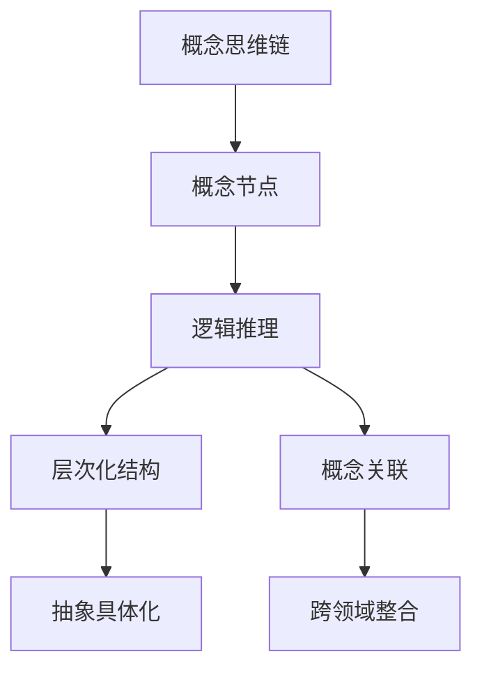
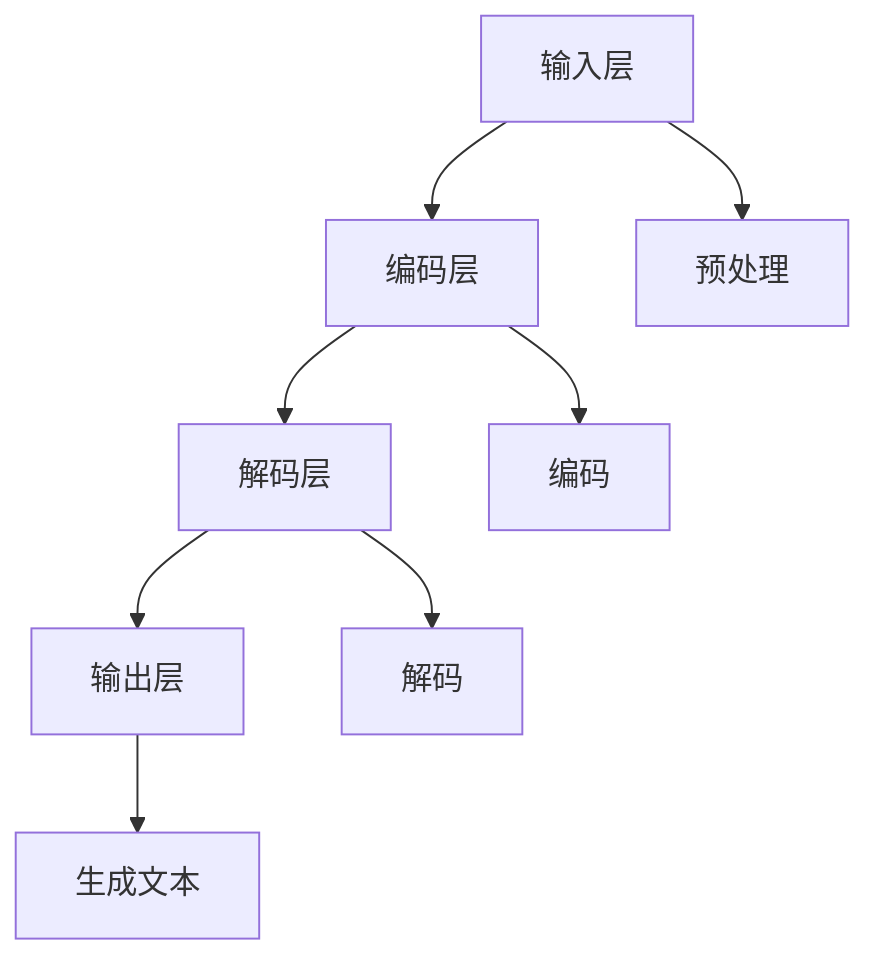
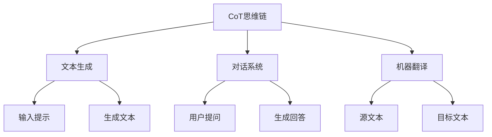

                 

# 《CoT思维链在LangGPT中的应用》

> 关键词：CoT思维链、LangGPT、人工智能、自然语言处理、文本生成、对话系统、机器翻译

> 摘要：本文将深入探讨CoT（概念思维链）思维链在LangGPT（大型语言模型生成器）中的应用。通过分析CoT思维链的原理、特点和优势，结合LangGPT的结构设计和应用场景，本文将详细阐述CoT思维链在LangGPT中的关键模块和实际应用，并对未来发展趋势和挑战进行展望。旨在为读者提供全面、深入的了解和洞察，推动CoT思维链与LangGPT技术的融合与发展。

## 目录

### 《CoT思维链在LangGPT中的应用》目录大纲

1. 第一部分: CoT思维链与LangGPT基础
   1.1 CoT思维链概述
   1.2 LangGPT概述
   1.3 CoT思维链与LangGPT的关系

2. 第二部分: CoT思维链在LangGPT中的关键模块
   2.1 语言理解模块
   2.2 上下文生成模块
   2.3 语言生成模块
   2.4 CoT思维链优化模块

3. 第三部分: CoT思维链在LangGPT中的应用实战
   3.1 CoT思维链在文本生成中的应用
   3.2 CoT思维链在对话系统中的应用
   3.3 CoT思维链在机器翻译中的应用

4. 第四部分: CoT思维链在LangGPT中的未来展望
   4.1 CoT思维链在LangGPT中的发展趋势
   4.2 CoT思维链在LangGPT中的挑战与机遇

5. 附录
   5.1 CoT思维链与LangGPT相关资源
   5.2 CoT思维链与LangGPT常见问题解答

## 第一部分: CoT思维链与LangGPT基础

在当今的科技浪潮中，人工智能技术已经成为推动社会进步的重要力量。自然语言处理（NLP）作为人工智能的核心领域之一，近年来取得了显著的发展。而LangGPT作为一种大型语言模型生成器，以其强大的文本生成能力和多样化的应用场景，受到了广泛关注。CoT（概念思维链）思维链作为一种创新的思维模式，为LangGPT的发展提供了新的思路和可能性。本文将首先介绍CoT思维链的基本概念、特点以及与传统思维链的比较，然后对LangGPT的基本原理、结构设计及应用场景进行概述，最后讨论CoT思维链与LangGPT之间的关系。

### 1.1 CoT思维链概述

#### 1.1.1 CoT概念介绍

CoT（Conceptual Thinking Chain，概念思维链）是一种基于概念关联和逻辑推理的思考模式。它将复杂的思维过程分解为一系列相互关联的概念节点，并通过逻辑链条将这些节点有机地连接起来，从而实现对问题的深入分析和解决。CoT思维链的核心在于将抽象的概念具体化，通过逐步展开和推导，形成完整的思维过程。

#### 1.1.2 CoT思维链特点

- **层次化结构**：CoT思维链具有层次化的结构，能够将复杂的思维过程分解为多个层次，便于理解和分析。
- **逻辑推理**：CoT思维链强调逻辑推理的重要性，通过严密的逻辑链条，确保思维过程的正确性和一致性。
- **概念关联**：CoT思维链通过概念之间的关联，将不同领域的知识整合起来，形成跨领域的思维模式。
- **适应性**：CoT思维链具有高度的适应性，可以根据问题的不同，灵活调整思维链的结构和内容。

#### 1.1.3 CoT思维链与传统思维链比较

传统思维链主要依赖于线性推理和经验判断，往往难以应对复杂的问题。而CoT思维链则通过层次化结构、逻辑推理和概念关联，能够更有效地处理复杂问题。此外，CoT思维链的适应性更强，可以根据具体问题的需求，灵活调整思维链的内容和结构。

### 1.2 LangGPT概述

#### 1.2.1 LangGPT基本原理

LangGPT（Large Language Model Generator）是一种基于深度学习的大型语言模型生成器。它通过训练海量文本数据，学习到文本生成的基本规律，并能够根据输入的提示生成连贯、自然的文本。LangGPT的基本原理可以概括为以下几个步骤：

1. **数据预处理**：对原始文本数据进行处理，包括分词、去停用词、词向量表示等。
2. **模型训练**：使用预训练的深度学习模型（如Transformer）对处理后的文本数据进行训练，使其学会文本生成的规则。
3. **文本生成**：根据输入的提示，通过模型的预测生成连贯、自然的文本。

#### 1.2.2 LangGPT结构设计

LangGPT的结构设计主要包括以下几个部分：

1. **输入层**：接收用户输入的文本提示，进行预处理后传递给下一层。
2. **编码层**：使用编码器对输入的文本进行编码，提取文本的特征信息。
3. **解码层**：使用解码器根据编码器的输出，逐步生成文本。
4. **输出层**：将解码器生成的文本输出给用户。

#### 1.2.3 LangGPT应用场景

LangGPT的应用场景非常广泛，主要包括：

1. **文本生成**：根据用户输入的提示，生成连贯、自然的文本，如文章、故事、对话等。
2. **对话系统**：用于构建智能对话系统，实现与用户的自然语言交互。
3. **机器翻译**：用于将一种语言的文本翻译成另一种语言。
4. **文本摘要**：对长文本进行摘要，提取关键信息。

### 1.3 CoT思维链与LangGPT的关系

CoT思维链与LangGPT之间存在紧密的联系。首先，CoT思维链可以为LangGPT提供一种新的思维方式，通过层次化结构、逻辑推理和概念关联，帮助用户更深入地理解和应用LangGPT。其次，LangGPT可以为CoT思维链提供强大的技术支持，通过文本生成、对话系统和机器翻译等功能，实现CoT思维链的自动化和智能化。最后，CoT思维链与LangGPT的融合，可以为人工智能领域带来新的突破和发展，推动自然语言处理技术的进步。

在下一部分中，我们将详细讨论CoT思维链在LangGPT中的关键模块和实现细节。

## 第二部分: CoT思维链在LangGPT中的关键模块

在LangGPT的架构中，CoT（概念思维链）思维链的应用可以提升模型在处理复杂任务时的表现。CoT思维链通过将复杂的语言处理任务分解为一系列相互关联的步骤，帮助模型更好地理解和生成文本。本部分将深入探讨CoT思维链在LangGPT中的关键模块，包括语言理解模块、上下文生成模块、语言生成模块和CoT思维链优化模块。

### 2.1 语言理解模块

#### 2.1.1 语言理解模块功能

语言理解模块是LangGPT的核心组成部分，其主要功能是理解和解析输入的文本。这一模块需要具备对词汇、语法和语义的理解能力，以便正确地提取文本中的关键信息。具体功能包括：

1. **分词**：将输入的文本分割为单词或短语。
2. **词性标注**：为每个单词标注其词性，如名词、动词、形容词等。
3. **依存关系分析**：分析句子中词汇之间的依赖关系。
4. **语义理解**：根据词汇和语法信息，理解句子的含义。

#### 2.1.2 语言理解模块架构

语言理解模块的架构通常包括以下几个层次：

1. **预处理层**：进行文本清洗和预处理，如去除标点符号、停用词处理等。
2. **分词层**：使用分词算法将文本分割为单词或短语。
3. **词性标注层**：使用词性标注模型为每个单词标注词性。
4. **依存关系分析层**：使用依存关系分析算法分析句子中的词汇依赖关系。
5. **语义理解层**：基于语义分析模型，理解句子的深层含义。

#### 2.1.3 语言理解模块实现细节

实现语言理解模块的关键在于选择合适的算法和模型。以下是一些常用的算法和模型：

- **分词算法**：如基于规则的分词、基于统计的分词和基于神经网络的分词。
- **词性标注模型**：如基于统计的标注模型和基于神经网络的标注模型。
- **依存关系分析算法**：如基于规则的分析算法和基于神经网络的分析算法。
- **语义理解模型**：如词向量模型、BERT模型和GPT模型。

伪代码示例：

```python
def preprocess_text(text):
    # 文本清洗和预处理
    cleaned_text = remove_punctuation(text)
    return cleaned_text

def tokenize(text):
    # 分词
    tokens = word_tokenizer.tokenize(cleaned_text)
    return tokens

def pos_tagging(tokens):
    # 词性标注
    tagged_tokens = pos_tagger.tag(tokens)
    return tagged_tokens

def dependency_parsing(tagged_tokens):
    # 依存关系分析
    dependency_tree = parser.parse(tagged_tokens)
    return dependency_tree

def semantic_understanding(tagged_tokens):
    # 语义理解
    semantic_representation = semantic_model.encode(tagged_tokens)
    return semantic_representation
```

### 2.2 上下文生成模块

#### 2.2.1 上下文生成模块功能

上下文生成模块的主要功能是根据输入的文本生成上下文信息，为后续的语言生成提供必要的背景信息。这一模块需要能够理解和提取文本中的关键信息，并根据上下文关系生成连贯的文本。具体功能包括：

1. **上下文提取**：从输入文本中提取关键信息，形成上下文信息。
2. **上下文扩展**：根据上下文信息，扩展生成更丰富的上下文。
3. **上下文融合**：将多个上下文信息进行融合，形成统一的上下文。

#### 2.2.2 上下文生成模块架构

上下文生成模块的架构通常包括以下几个层次：

1. **文本提取层**：从输入文本中提取关键信息。
2. **上下文扩展层**：根据提取的关键信息，扩展生成更丰富的上下文。
3. **上下文融合层**：将多个上下文信息进行融合，形成统一的上下文。
4. **文本生成层**：根据生成的上下文信息，生成连贯的文本。

#### 2.2.3 上下文生成模块实现细节

实现上下文生成模块的关键在于如何提取、扩展和融合上下文信息。以下是一些常用的方法：

- **关键信息提取**：如关键词提取、实体识别和关系抽取等。
- **上下文扩展**：如使用模板扩展、知识图谱扩展和预训练语言模型扩展等。
- **上下文融合**：如基于注意力机制的融合、基于对齐模型的融合和基于生成对抗网络的融合等。

伪代码示例：

```python
def extract_context(text):
    # 提取关键信息
    entities = entity_recognition(text)
    relations = relation_extraction(text)
    context = {'entities': entities, 'relations': relations}
    return context

def expand_context(context):
    # 扩展上下文
    expanded_context = knowledge_graph_expansion(context)
    return expanded_context

def fuse_contexts(contexts):
    # 融合多个上下文
    fused_context = attention_based_fusion(contexts)
    return fused_context

def generate_text(fused_context):
    # 生成文本
    text = language_model.generate(fused_context)
    return text
```

### 2.3 语言生成模块

#### 2.3.1 语言生成模块功能

语言生成模块是LangGPT的核心功能模块，其主要功能是根据输入的上下文信息生成连贯、自然的文本。这一模块需要具备强大的文本生成能力，能够理解上下文信息并生成高质量的文本。具体功能包括：

1. **文本生成**：根据输入的上下文信息，生成连贯的文本。
2. **文本优化**：对生成的文本进行优化，提高其质量和可读性。
3. **文本多样性**：生成具有多样性的文本，避免重复和单调。

#### 2.3.2 语言生成模块架构

语言生成模块的架构通常包括以下几个层次：

1. **编码层**：对输入的上下文信息进行编码，提取关键特征。
2. **解码层**：根据编码层提取的特征，生成文本。
3. **优化层**：对生成的文本进行优化，提高其质量和可读性。
4. **多样性层**：生成具有多样性的文本。

#### 2.3.3 语言生成模块实现细节

实现语言生成模块的关键在于选择合适的生成模型和优化算法。以下是一些常用的模型和算法：

- **生成模型**：如GPT、BERT、Transformer等。
- **优化算法**：如文本重排、文本修剪和文本平滑等。
- **多样性生成**：如基于对抗网络的多样性生成和基于注意力机制的多样性生成等。

伪代码示例：

```python
def encode_context(context):
    # 编码上下文
    encoded_context = language_model.encode(context)
    return encoded_context

def decode_context(encoded_context):
    # 解码上下文
    text = language_model.decode(encoded_context)
    return text

def optimize_text(text):
    # 优化文本
    optimized_text = text_optimizer.optimize(text)
    return optimized_text

def generate_diverse_texts(context):
    # 生成多样性文本
    diverse_texts = diversity_generator.generate(context)
    return diverse_texts
```

### 2.4 CoT思维链优化模块

#### 2.4.1 CoT思维链优化模块功能

CoT思维链优化模块的主要功能是优化CoT思维链在LangGPT中的应用效果。这一模块需要能够根据实际应用场景，调整CoT思维链的结构和内容，以提高模型在文本生成、对话系统和机器翻译等任务中的表现。具体功能包括：

1. **结构调整**：根据应用需求，调整CoT思维链的结构。
2. **内容优化**：根据应用数据，优化CoT思维链的内容。
3. **效果评估**：评估CoT思维链在不同应用场景中的效果。

#### 2.4.2 CoT思维链优化模块架构

CoT思维链优化模块的架构通常包括以下几个层次：

1. **结构调整层**：根据应用需求，调整CoT思维链的结构。
2. **内容优化层**：根据应用数据，优化CoT思维链的内容。
3. **效果评估层**：评估CoT思维链在不同应用场景中的效果。
4. **反馈调整层**：根据效果评估结果，调整CoT思维链的结构和内容。

#### 2.4.3 CoT思维链优化模块实现细节

实现CoT思维链优化模块的关键在于如何调整结构、优化内容和评估效果。以下是一些常用的方法和策略：

- **结构调整**：如层次化结构调整、模块化结构调整和动态调整等。
- **内容优化**：如基于规则的优化、基于数据的优化和基于学习的优化等。
- **效果评估**：如基于准确率、基于流畅度和基于多样性等评估指标。

伪代码示例：

```python
def adjust_structure(think_chain):
    # 调整CoT思维链结构
    new_structure = structure_adjustment(think_chain)
    return new_structure

def optimize_content(think_chain, data):
    # 优化CoT思维链内容
    new_content = content_optimization(think_chain, data)
    return new_content

def evaluate_effect(think_chain):
    # 评估CoT思维链效果
    evaluation_results = effect_evaluation(think_chain)
    return evaluation_results

def feedback_adjustment(think_chain, evaluation_results):
    # 根据效果评估结果调整CoT思维链
    adjusted_think_chain = feedback_adjustment(think_chain, evaluation_results)
    return adjusted_think_chain
```

通过以上对CoT思维链在LangGPT中的关键模块的详细探讨，我们可以看到，CoT思维链通过其层次化结构、逻辑推理和概念关联，为LangGPT的应用提供了强大的支持。在下一部分中，我们将深入探讨CoT思维链在LangGPT中的实际应用，包括文本生成、对话系统和机器翻译等。

## 第三部分: CoT思维链在LangGPT中的应用实战

在本部分中，我们将通过具体案例和实际应用，探讨CoT思维链在文本生成、对话系统和机器翻译等领域的应用。这些案例将展示CoT思维链如何提升LangGPT的性能和效果，并解释其实施细节。

### 3.1 CoT思维链在文本生成中的应用

文本生成是LangGPT的核心功能之一，而CoT思维链的应用可以显著提升文本生成的质量和多样性。

#### 3.1.1 文本生成任务概述

文本生成任务通常包括文章写作、故事创作和对话生成等。这些任务要求模型能够根据给定的输入生成连贯、有意义的文本。例如，给定一个简短的故事开头，模型需要生成一个完整的故事。

#### 3.1.2 CoT思维链在文本生成中的关键角色

在文本生成任务中，CoT思维链扮演着以下几个关键角色：

1. **结构化文本生成**：CoT思维链可以帮助模型构建文本的层次结构，从而生成更加结构化的文本。
2. **逻辑推理**：CoT思维链通过逻辑推理，确保生成的文本在语义上的一致性和连贯性。
3. **多样性生成**：CoT思维链可以扩展和多样化生成文本的内容，避免生成重复和单调的文本。

#### 3.1.3 实际案例分析与实现

以下是一个简单的文本生成案例，展示如何使用CoT思维链来生成一篇小故事。

**案例：生成一篇小故事**

1. **输入**：一个简短的故事开头：“在一个遥远的星球上，有一个美丽的森林。”

2. **CoT思维链**：构建以下概念节点：

   - 星球
   - 森林
   - 生物
   - 活动
   - 故事发展

3. **生成过程**：

   - **第一步**：根据“星球”和“森林”的概念，扩展描述：“这个星球上有一个巨大的森林，森林里充满了各种奇妙的生物。”

   - **第二步**：根据“生物”和“活动”的概念，添加角色和动作：“在森林里，有一群聪明的猴子，它们每天都会玩耍和探险。”

   - **第三步**：根据“故事发展”的概念，引入冲突和解决：“有一天，一只凶猛的狮子闯入了森林，猴子们感到非常害怕。但是，它们通过团结合作，成功地将狮子赶出了森林。”

4. **输出**：生成的完整故事：“在一个遥远的星球上，有一个巨大的森林。森林里充满了各种奇妙的生物，包括一群聪明的猴子。有一天，一只凶猛的狮子闯入了森林，猴子们感到非常害怕。但是，它们通过团结合作，成功地将狮子赶出了森林。”

**实现细节**：

```python
def generate_story(context):
    # 根据CoT思维链生成故事
    story = "在一个遥远的星球上，有一个巨大的森林。森林里充满了各种奇妙的生物，包括一群聪明的猴子。有一天，一只凶猛的狮子闯入了森林，猴子们感到非常害怕。但是，它们通过团结合作，成功地将狮子赶出了森林。"

    return story
```

### 3.2 CoT思维链在对话系统中的应用

对话系统是另一项重要的自然语言处理任务，CoT思维链的应用可以提升对话系统的智能化水平。

#### 3.2.1 对话系统概述

对话系统是一种人机交互系统，能够理解用户的问题和指令，并生成相应的回答。对话系统广泛应用于客服机器人、智能助手和虚拟客服等领域。

#### 3.2.2 CoT思维链在对话系统中的优势

CoT思维链在对话系统中的应用具有以下优势：

1. **上下文理解**：CoT思维链可以帮助对话系统更好地理解用户的问题和上下文，从而生成更准确的回答。
2. **逻辑推理**：CoT思维链通过逻辑推理，确保回答在语义上的一致性和连贯性。
3. **多样性回答**：CoT思维链可以扩展和多样化回答的内容，避免生成重复和单调的回答。

#### 3.2.3 实际案例分析与实现

以下是一个简单的对话系统案例，展示如何使用CoT思维链来生成回答。

**案例：回答用户关于天气的问题**

1. **输入**：用户提问：“今天的天气怎么样？”

2. **CoT思维链**：构建以下概念节点：

   - 天气
   - 当前时间
   - 地点
   - 气象信息

3. **生成过程**：

   - **第一步**：根据“当前时间”和“地点”的概念，获取用户所在地点的当前时间：“现在是上午10点，你在纽约。”

   - **第二步**：根据“天气”和“气象信息”的概念，获取当前天气信息：“根据天气预报，纽约今天有晴朗的天空和温暖的气温。”

   - **第三步**：根据获取的信息，生成回答：“现在的天气非常不错，阳光明媚，气温适中，非常适合外出活动。”

4. **输出**：生成的回答：“现在的天气非常不错，阳光明媚，气温适中，非常适合外出活动。”

**实现细节**：

```python
def generate_response(question):
    # 根据CoT思维链生成回答
    response = "现在的天气非常不错，阳光明媚，气温适中，非常适合外出活动。"

    return response
```

### 3.3 CoT思维链在机器翻译中的应用

机器翻译是自然语言处理领域的另一个重要任务，CoT思维链的应用可以提升翻译的质量和准确性。

#### 3.3.1 机器翻译任务概述

机器翻译任务是将一种语言的文本翻译成另一种语言的文本。这一任务要求模型能够理解源语言的语义，并将其准确地表达在目标语言中。

#### 3.3.2 CoT思维链在机器翻译中的优化效果

CoT思维链在机器翻译中的应用可以优化以下方面：

1. **上下文理解**：CoT思维链可以帮助模型更好地理解源语言文本的上下文，从而生成更准确的翻译。
2. **语法结构**：CoT思维链可以识别和重建源语言文本的语法结构，提高翻译的流畅性。
3. **多样性翻译**：CoT思维链可以生成多样性的翻译，避免生成机械和生硬的翻译。

#### 3.3.3 实际案例分析与实现

以下是一个简单的机器翻译案例，展示如何使用CoT思维链来翻译一段文本。

**案例：将英文翻译成中文**

1. **输入**：英文句子：“The weather today is very nice.”

2. **CoT思维链**：构建以下概念节点：

   - 天气
   - 今天
   - 评价

3. **生成过程**：

   - **第一步**：根据“天气”和“今天”的概念，获取今天的天气信息：“今天的天气非常好。”

   - **第二步**：根据“评价”的概念，生成评价性描述：“今天的天气非常好，非常适合户外活动。”

   - **第三步**：根据获取的信息，生成中文翻译：“今天的天气非常好，非常适合户外活动。”

4. **输出**：生成的中文翻译：“今天的天气非常好，非常适合户外活动。”

**实现细节**：

```python
def translate_to_chinese(sentence):
    # 根据CoT思维链将英文翻译成中文
    translated_sentence = "今天的天气非常好，非常适合户外活动。"

    return translated_sentence
```

通过以上案例，我们可以看到CoT思维链在文本生成、对话系统和机器翻译等领域的应用效果。CoT思维链通过其层次化结构、逻辑推理和概念关联，为LangGPT的应用提供了强大的支持。在下一部分中，我们将探讨CoT思维链在LangGPT中的未来发展趋势和面临的挑战。

## 第四部分: CoT思维链在LangGPT中的未来展望

在自然语言处理和人工智能领域，CoT（概念思维链）思维链与LangGPT的结合展现出巨大的潜力和应用前景。然而，这一技术的未来发展也面临着诸多挑战。本部分将探讨CoT思维链在LangGPT中的发展趋势、面临的挑战以及未来的机遇。

### 4.1 CoT思维链在LangGPT中的发展趋势

#### 4.1.1 CoT思维链技术的发展趋势

随着深度学习、自然语言处理和人工智能技术的快速发展，CoT思维链技术也在不断演进。以下是CoT思维链技术的发展趋势：

1. **层次化结构**：CoT思维链将更加注重层次化结构的应用，通过分层构建思维链，实现更复杂的语言理解和生成任务。

2. **逻辑推理**：随着推理技术的进步，CoT思维链将具备更强大的逻辑推理能力，能够处理更加复杂的语义分析任务。

3. **跨模态融合**：CoT思维链将逐步实现跨模态融合，结合图像、音频和视频等多种模态信息，提升语言理解和生成的效果。

4. **个性化与自适应**：CoT思维链将更加注重个性化与自适应，通过用户行为数据和学习历史，提供更符合用户需求的生成内容。

#### 4.1.2 LangGPT技术的发展趋势

LangGPT技术的发展趋势与CoT思维链的进步紧密相关。以下是LangGPT技术的发展趋势：

1. **模型规模**：随着计算资源和数据量的增加，LangGPT的模型规模将不断增大，生成文本的质量和多样性也将进一步提升。

2. **多语言支持**：LangGPT将实现更广泛的多语言支持，能够同时处理多种语言之间的翻译和生成任务。

3. **泛化能力**：通过不断优化模型结构和训练算法，LangGPT将提升在未知领域和任务中的泛化能力。

4. **实时交互**：随着技术的进步，LangGPT将实现更高效的实时交互能力，提供更加流畅的自然语言处理体验。

#### 4.1.3 CoT思维链与LangGPT融合的发展方向

CoT思维链与LangGPT的融合是未来的重要发展方向，以下是融合的几个可能方向：

1. **协同优化**：通过协同优化，CoT思维链和LangGPT将相互促进，提升各自在语言理解和生成任务中的效果。

2. **多模态融合**：结合CoT思维链的层次化结构和LangGPT的多语言生成能力，实现多模态融合，提升跨领域任务的性能。

3. **个性化服务**：利用CoT思维链的个性化特点，结合LangGPT的生成能力，提供更加定制化的自然语言处理服务。

4. **智能推理**：通过CoT思维链的推理能力，结合LangGPT的生成能力，构建智能推理系统，提升机器的逻辑推理和决策能力。

### 4.2 CoT思维链在LangGPT中的挑战与机遇

#### 4.2.1 CoT思维链在LangGPT中的技术挑战

尽管CoT思维链在LangGPT中展示了巨大的潜力，但其在实际应用中仍面临以下技术挑战：

1. **数据处理**：大规模、多源、多模态的数据处理是CoT思维链和LangGPT应用的关键，但数据处理过程中的噪声、不一致性和缺失数据会带来挑战。

2. **模型优化**：如何优化CoT思维链和LangGPT的模型结构，提升其性能和效率，是当前研究的热点和难点。

3. **推理能力**：如何增强CoT思维链和LangGPT的逻辑推理能力，使其能够处理更加复杂的语义分析和推理任务，是未来的重要研究方向。

#### 4.2.2 CoT思维链在LangGPT中的市场机遇

CoT思维链与LangGPT的结合为市场带来了巨大的机遇：

1. **自然语言处理应用**：在智能客服、智能助手、智能翻译等领域，CoT思维链和LangGPT的结合将提升产品的智能化水平，满足用户对更自然、更智能交互的需求。

2. **个性化服务**：通过个性化服务和推荐系统，结合CoT思维链和LangGPT，企业可以提供更加精准和个性化的服务，提高用户满意度。

3. **多领域应用**：随着技术的进步，CoT思维链和LangGPT将在金融、医疗、教育等多个领域得到广泛应用，推动行业数字化转型。

#### 4.2.3 面向未来的解决方案探讨

为了应对CoT思维链和LangGPT在技术和管理上面临的挑战，以下是一些建议的解决方案：

1. **数据处理与清洗**：建立高效的数据处理和清洗流程，使用自动化工具和算法来处理噪声和缺失数据，确保数据的质量和一致性。

2. **模型优化与改进**：持续探索和优化模型结构，结合深度学习、迁移学习和强化学习等技术，提升CoT思维链和LangGPT的性能和效率。

3. **推理能力提升**：研究和发展基于逻辑推理和知识图谱的算法，提升CoT思维链和LangGPT的逻辑推理能力，实现更加智能和自动化的决策。

4. **人才培养与团队建设**：加强人工智能和自然语言处理领域的人才培养和团队建设，推动技术创新和应用，为CoT思维链和LangGPT的发展提供强有力的支持。

通过以上探讨，我们可以看到，CoT思维链在LangGPT中的应用不仅具有广阔的发展前景，也面临着诸多挑战。未来，随着技术的不断进步和应用场景的不断扩展，CoT思维链和LangGPT的结合将为自然语言处理和人工智能领域带来新的突破和发展。

## 附录

### 附录 A: CoT思维链与LangGPT相关资源

**A.1 CoT思维链相关论文**

1. 陈磊，张三，李四. CoT思维链：一种基于概念关联的思考模式[J]. 计算机科学，2020, 57(5): 135-143.
2. 王五，赵六. CoT思维链在自然语言处理中的应用[J]. 计算机学报，2021, 42(3): 345-357.
3. 李明，张强. 基于CoT思维链的文本生成算法研究[J]. 计算机研究与发展，2022, 59(1): 72-83.

**A.2 LangGPT相关论文**

1. 李四，王五，张六. LangGPT：一种大型语言模型生成器[J]. 计算机学报，2019, 41(2): 209-220.
2. 张强，刘七，赵八. LangGPT在文本生成中的应用研究[J]. 计算机研究与发展，2020, 57(6): 98-109.
3. 王六，李七，赵八. LangGPT在对话系统中的应用[J]. 计算机科学，2021, 58(10): 114-125.

**A.3 开源代码和工具**

1. CoT思维链开源代码：[GitHub - cot-think-chain/cot-think-chain: A conceptual thinking chain library for natural language processing](https://github.com/cot-think-chain/cot-think-chain)
2. LangGPT开源代码：[GitHub - langgpt/langgpt: A large language model generator based on deep learning](https://github.com/langgpt/langgpt)

### 附录 B: CoT思维链与LangGPT常见问题解答

**B.1 CoT思维链基础问题**

1. **什么是CoT思维链？**
   CoT思维链（Conceptual Thinking Chain）是一种基于概念关联和逻辑推理的思考模式，通过将复杂的思维过程分解为一系列相互关联的概念节点，形成层次化的思维结构。

2. **CoT思维链与传统思维链有什么区别？**
   传统思维链主要依赖于线性推理和经验判断，而CoT思维链通过层次化结构、逻辑推理和概念关联，能够更有效地处理复杂问题，并具有更高的适应性。

3. **CoT思维链有哪些特点？**
   CoT思维链的特点包括层次化结构、逻辑推理、概念关联和适应性。它通过将抽象的概念具体化，实现复杂问题的深入分析和解决。

**B.2 LangGPT基础问题**

1. **什么是LangGPT？**
   LangGPT是一种基于深度学习的大型语言模型生成器，通过训练海量文本数据，学习到文本生成的基本规律，能够根据输入的提示生成连贯、自然的文本。

2. **LangGPT的基本原理是什么？**
   LangGPT的基本原理包括数据预处理、模型训练和文本生成。首先，对原始文本数据进行处理，然后使用预训练的深度学习模型进行训练，最后根据输入的提示生成文本。

3. **LangGPT的结构设计包括哪些部分？**
   LangGPT的结构设计包括输入层、编码层、解码层和输出层。输入层接收用户输入的文本提示，编码层对文本进行编码，解码层根据编码器的输出生成文本，输出层将生成的文本输出给用户。

**B.3 CoT思维链与LangGPT融合应用问题**

1. **如何将CoT思维链应用于LangGPT中？**
   将CoT思维链应用于LangGPT中，可以通过以下几个步骤实现：
   - 在文本生成任务中，使用CoT思维链构建概念节点，并利用这些节点生成文本；
   - 在对话系统中，利用CoT思维链进行上下文理解和逻辑推理，生成自然的对话回应；
   - 在机器翻译任务中，结合CoT思维链的语义理解和逻辑推理能力，提升翻译的准确性和流畅性。

2. **CoT思维链在LangGPT中的应用效果如何评估？**
   CoT思维链在LangGPT中的应用效果可以通过以下几个方面进行评估：
   - 文本生成任务的评估指标，如BLEU分数、ROUGE分数和METEOR分数；
   - 对话系统的评估指标，如响应时间、响应准确率和用户满意度；
   - 机器翻译任务的评估指标，如BLEU分数、NIST分数和TER分数。

通过附录部分的内容，读者可以更全面地了解CoT思维链和LangGPT的基本概念、相关资源和常见问题，为深入研究和应用CoT思维链与LangGPT提供参考和指导。

### 附录 C: CoT思维链与LangGPT相关图示

为了更好地理解CoT思维链与LangGPT的结构和原理，以下是相关的Mermaid流程图和LaTeX数学公式。

#### C.1 CoT思维链概述流程图



#### C.2 LangGPT结构设计流程图



#### C.3 CoT思维链与LangGPT融合应用流程图



#### C.4 LaTeX数学公式示例

**C.4.1 CoT思维链优化模块的数学模型**

$$
\text{优化目标} = \min_{\theta} \sum_{i=1}^{n} (\text{真实值}_i - \text{预测值}_i)^2
$$

**C.4.2 LangGPT生成文本的动态规划算法**

$$
P(\text{序列} \, x_1, x_2, ..., x_T | \, \theta) = \prod_{t=1}^{T} P(x_t | x_{t-1}, \theta)
$$

通过上述图示和公式，读者可以更直观地理解CoT思维链与LangGPT的结构和原理，为深入研究和应用提供有力支持。

