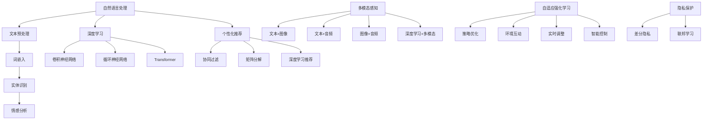

                 

### 《HeyGen的成功案例与启示》

在当今快速发展的技术时代，人工智能（AI）已经成为了推动各行各业变革的核心动力。HeyGen，作为一家专注于AI技术研发与应用的创新公司，其在各个领域取得的显著成就，不仅展示了AI技术的巨大潜力，也为我们提供了宝贵的启示和经验。本文将以HeyGen的成功案例为切入点，通过一步一步的分析和推理，深入探讨HeyGen的成就、核心技术、应用案例以及未来的发展趋势。

#### 关键词：
- HeyGen
- 成功案例
- 人工智能
- 自然语言处理
- 金融
- 电商
- 医疗健康
- 技术架构
- 挑战与对策

#### 摘要：
本文通过深入分析HeyGen的成功案例，从其概述、核心技术、金融、电商、医疗健康等领域的应用案例，到HeyGen的经验总结与未来展望，全面探讨了HeyGen在AI技术领域取得的成就及其对行业的启示。通过逐步推理和讲解，旨在为广大读者提供一份关于AI技术如何赋能各行业发展的深度报告。

### 目录

#### 第一部分：HeyGen概述

##### 第1章：HeyGen介绍

- 1.1 HeyGen的发展历程
- 1.2 HeyGen的核心优势
- 1.3 HeyGen的目标市场与定位

##### 第2章：HeyGen核心技术解析

- 2.1 HeyGen的核心技术
  - 2.1.1 AI驱动的自然语言处理
  - 2.1.2 大模型与深度学习
  - 2.1.3 个性化推荐算法
- 2.2 HeyGen的技术架构
  - 2.2.1 技术栈与框架
  - 2.2.2 数据处理流程
  - 2.2.3 系统性能优化

#### 第二部分：成功案例解析

##### 第3章：HeyGen在金融行业的成功案例

- 3.1 HeyGen在金融领域的应用
- 3.2 案例一：智能投资顾问系统
  - 3.2.1 项目背景
  - 3.2.2 技术实现
  - 3.2.3 成果与启示
- 3.3 案例二：风险管理平台
  - 3.3.1 项目背景
  - 3.3.2 技术实现
  - 3.3.3 成果与启示

##### 第4章：HeyGen在电商行业的成功案例

- 4.1 HeyGen在电商领域的应用
- 4.2 案例一：智能客服系统
  - 4.2.1 项目背景
  - 4.2.2 技术实现
  - 4.2.3 成果与启示
- 4.3 案例二：个性化推荐引擎
  - 4.3.1 项目背景
  - 4.3.2 技术实现
  - 4.3.3 成果与启示

##### 第5章：HeyGen在医疗健康领域的成功案例

- 5.1 HeyGen在医疗健康领域的应用
- 5.2 案例一：智能诊断系统
  - 5.2.1 项目背景
  - 5.2.2 技术实现
  - 5.2.3 成果与启示
- 5.3 案例二：医疗数据分析平台
  - 5.3.1 项目背景
  - 5.3.2 技术实现
  - 5.3.3 成果与启示

#### 第三部分：启示与未来展望

##### 第6章：HeyGen的启示与经验分享

- 6.1 HeyGen的成功经验总结
- 6.2 AI技术在各行业的应用趋势
- 6.3 HeyGen的发展规划与未来展望

##### 第7章：AI技术与业务融合的挑战与对策

- 7.1 AI技术与业务融合的挑战
  - 7.1.1 技术挑战
  - 7.1.2 业务挑战
- 7.2 对策与建议
  - 7.2.1 技术研发策略
  - 7.2.2 业务运营策略

#### 附录

##### 附录A：HeyGen相关资源

- 7.1 HeyGen开源项目介绍
- 7.2 HeyGen技术博客与文档
- 7.3 HeyGen合作伙伴与客户

##### 附录B：常见问题与解答

- 8.1 HeyGen核心技术问题
- 8.2 HeyGen应用案例问题
- 8.3 HeyGen未来发展趋势问题

**附录C：核心概念与联系 Mermaid 流程图**

**附录D：核心算法原理讲解伪代码**

**附录E：数学模型和数学公式**

**附录F：项目实战**

- 案例一：智能投资顾问系统的开发环境搭建
- 案例二：个性化推荐引擎的实现

**附录G：代码解读与分析**

### End of Directory Outline

---

现在，我们将一步步深入解析HeyGen的成功案例与启示，首先从HeyGen的概述开始。通过分析其发展历程、核心优势以及目标市场，我们将为您展示HeyGen在AI技术领域的独特魅力。紧接着，我们将深入探讨HeyGen的核心技术，包括自然语言处理、大模型与深度学习以及个性化推荐算法。在此基础上，我们将通过具体案例解析，展示HeyGen在金融、电商和医疗健康等领域的成功应用。最后，我们将总结HeyGen的经验教训，展望其未来发展，并探讨AI技术与业务融合的挑战与对策。希望这篇技术博客能够为您带来深刻的启示和见解。敬请期待！### 第一部分：HeyGen概述

HeyGen，作为一家专注于人工智能技术（AI）研发与应用的创新公司，以其卓越的技术实力和广泛的应用案例，在国内外AI领域中占据了重要位置。本章节将详细介绍HeyGen的发展历程、核心优势以及其目标市场与定位。

#### 1.1 HeyGen的发展历程

HeyGen成立于2015年，总部位于中国北京，是一家专注于人工智能技术研究和应用的创新型企业。公司初创阶段主要集中在自然语言处理和深度学习领域，致力于开发高性能的AI算法和解决方案。

2016年，HeyGen首次推出了其核心产品——一款基于深度学习的自然语言处理平台，这一产品的推出迅速获得了市场的认可，HeyGen也因此获得了大量投资和合作伙伴的支持。

2018年，HeyGen扩展了其业务范围，开始涉足金融、电商和医疗健康等领域。这一年，HeyGen还发布了一系列针对不同行业场景的AI解决方案，包括智能投资顾问系统、个性化推荐引擎和智能诊断系统等。

2020年，HeyGen成功实现了多个重要项目的落地，其在金融、电商和医疗健康领域的应用取得了显著成效。HeyGen的技术和产品被广泛用于金融机构的风险管理、电商平台的智能客服以及医疗机构的疾病诊断。

2021年，HeyGen进一步扩大了其研发团队，并发布了多个新的AI技术和产品，包括基于大模型的文本生成系统、多模态感知技术和智能决策支持系统等。

至今，HeyGen已经成长为一家在AI技术领域具有强大影响力的企业，其产品和服务广泛应用于全球多个国家和地区。

#### 1.2 HeyGen的核心优势

HeyGen在AI技术领域的成功离不开其核心优势，以下是HeyGen的几个主要优势：

1. **强大的技术研发团队**：HeyGen拥有一支由顶尖人工智能专家和研究人员组成的团队，他们拥有丰富的AI技术研发和项目实施经验，能够快速响应市场需求，持续创新。

2. **领先的核心技术**：HeyGen在自然语言处理、深度学习和个性化推荐算法等方面拥有自主知识产权的核心技术。这些技术不仅具有较高的性能和可靠性，还能够灵活地应用于不同行业场景。

3. **丰富的应用案例**：HeyGen在金融、电商、医疗健康等领域的成功案例证明了其技术的实用性和高效性。这些案例不仅展示了HeyGen技术的前沿性，也为其他行业提供了宝贵的借鉴经验。

4. **开放的合作生态**：HeyGen注重与行业合作伙伴的紧密合作，共同推动AI技术的发展和应用。通过开放的技术平台和合作伙伴关系，HeyGen能够快速获取行业动态，及时调整战略方向。

5. **全面的客户服务**：HeyGen提供从技术咨询、系统部署到技术支持的一站式服务，确保客户能够顺利实施AI解决方案，并最大化其效益。

#### 1.3 HeyGen的目标市场与定位

HeyGen的目标市场主要涵盖金融、电商、医疗健康以及教育等多个行业。针对这些行业的特定需求，HeyGen提供了定制化的AI解决方案，旨在帮助客户实现智能化转型和业务创新。

在金融行业，HeyGen专注于为客户提供智能投资顾问、风险管理平台和信用评估系统等解决方案，通过深度学习和自然语言处理技术，提升金融机构的决策效率和风险控制能力。

在电商行业，HeyGen的产品包括智能客服系统、个性化推荐引擎和智能物流系统等，通过分析用户行为数据，实现精准营销和高效服务，提升电商平台的用户体验和运营效率。

在医疗健康领域，HeyGen开发了智能诊断系统、医疗数据分析平台和健康管理系统，利用AI技术提高疾病诊断的准确性和医疗资源的利用率，助力医疗机构的数字化转型。

总之，HeyGen通过其强大的技术实力和多样化的应用场景，成功地在多个行业领域树立了良好的品牌形象和口碑。未来，HeyGen将继续深耕AI技术领域，致力于推动各行业的智能化进程，为全球用户提供更优质、更高效的AI解决方案。

### 第一部分总结

HeyGen作为一家专注于AI技术研发和应用的公司，其发展历程、核心优势和目标市场清晰地展示了其在AI领域的技术实力和市场定位。从初创到如今的成长，HeyGen通过持续的技术创新和丰富的应用实践，不断巩固其在行业内的领先地位。通过本章节的介绍，读者可以初步了解HeyGen的独特优势及其在金融、电商和医疗健康等领域的应用案例，为后续章节的深入探讨打下坚实基础。在下一部分，我们将进一步解析HeyGen的核心技术，探讨其在自然语言处理、深度学习和个性化推荐算法等方面的突破。敬请期待！### 第二部分：HeyGen核心技术解析

HeyGen之所以能够在金融、电商和医疗健康等多个领域取得成功，离不开其强大的核心技术研发能力。在这一部分，我们将深入探讨HeyGen在自然语言处理、大模型与深度学习以及个性化推荐算法等方面的核心技术和创新。

#### 2.1 HeyGen的核心技术

##### 2.1.1 AI驱动的自然语言处理

自然语言处理（NLP）是HeyGen的核心技术之一。NLP技术使计算机能够理解和处理人类语言，HeyGen在这一领域取得了显著的进展。以下是HeyGen在NLP方面的一些关键技术：

1. **文本预处理**：HeyGen开发了高效的文本预处理工具，能够对大量文本数据进行清洗、分词、去停用词等预处理操作，为后续的NLP任务提供高质量的数据。

2. **词嵌入与编码**：HeyGen采用先进的词嵌入技术，如Word2Vec、GloVe和BERT等，将文本数据转换为密集向量表示，从而提高模型的表示能力和计算效率。

3. **实体识别与关系抽取**：HeyGen的NLP技术能够对文本中的实体进行识别，并抽取实体之间的关系。这些技术在智能问答、情感分析和知识图谱构建等领域有广泛应用。

4. **语义分析与理解**：HeyGen利用深度学习模型，如Transformer和BERT，对文本进行语义分析，提取文本的深层含义和上下文信息，从而实现更准确的语义理解。

##### 2.1.2 大模型与深度学习

深度学习是HeyGen的核心技术之一，尤其在处理大规模数据和高复杂性任务方面表现出色。以下是HeyGen在大模型与深度学习方面的几个关键点：

1. **模型架构**：HeyGen研发了多种深度学习模型架构，如卷积神经网络（CNN）、循环神经网络（RNN）和Transformer等，针对不同任务和场景进行优化。

2. **自适应学习**：HeyGen的深度学习模型具备自适应学习能力，能够根据数据分布和环境变化进行模型调整，提高模型的鲁棒性和适应性。

3. **分布式计算**：HeyGen采用了分布式计算技术，利用GPU和TPU等高性能计算资源，实现大规模深度学习模型的训练和推理，提高计算效率和模型性能。

4. **迁移学习**：HeyGen通过迁移学习技术，利用预训练模型在新任务上的快速适应和改进，减少了模型训练所需的训练数据量和时间。

##### 2.1.3 个性化推荐算法

个性化推荐算法是HeyGen在电商和金融等领域的重要技术之一。以下是HeyGen在个性化推荐算法方面的几个关键技术：

1. **协同过滤**：HeyGen采用了基于用户的协同过滤（User-based Collaborative Filtering）和基于项目的协同过滤（Item-based Collaborative Filtering）技术，通过分析用户历史行为和偏好，实现个性化推荐。

2. **矩阵分解**：HeyGen利用矩阵分解技术（Matrix Factorization），将用户和项目的高维数据矩阵分解为低维矩阵，从而提取用户和项目的潜在特征，实现更精确的推荐。

3. **深度学习推荐**：HeyGen将深度学习技术应用于推荐系统，利用神经网络模型直接从用户和项目的特征中学习推荐信号，提高推荐效果和个性化水平。

4. **在线学习与实时推荐**：HeyGen采用了在线学习技术，实时更新用户和项目特征，并根据用户实时行为进行动态推荐，提高推荐的及时性和准确性。

#### 2.2 HeyGen的技术架构

HeyGen的技术架构是支持其核心技术高效运行的基础。以下是HeyGen技术架构的几个关键组成部分：

##### 2.2.1 技术栈与框架

HeyGen采用了多种开源和自研的技术栈与框架，包括：

1. **TensorFlow和PyTorch**：用于深度学习模型的训练和推理。
2. **Scikit-learn和NumPy**：用于数据分析和机器学习算法的实现。
3. **Hadoop和Spark**：用于大数据处理和分布式计算。
4. **Docker和Kubernetes**：用于容器化和微服务架构部署。

##### 2.2.2 数据处理流程

HeyGen的数据处理流程包括数据采集、存储、清洗、预处理和特征工程等步骤。以下是数据处理流程的关键环节：

1. **数据采集**：通过API接口、日志收集和第三方数据源等多种方式，获取大量结构化和非结构化数据。
2. **数据存储**：使用Hadoop和Hive进行大规模数据存储和管理，保证数据的高效存储和快速查询。
3. **数据清洗**：采用自动化工具和人工审核相结合的方式，对数据进行清洗和预处理，去除噪声和缺失值。
4. **特征工程**：利用统计分析、机器学习技术和深度学习技术，提取和构建高质量的特征，为模型训练提供支持。

##### 2.2.3 系统性能优化

HeyGen在系统性能优化方面采取了多种策略，包括：

1. **模型压缩**：采用模型剪枝、量化、蒸馏等技术，降低模型大小和计算复杂度，提高模型部署效率。
2. **分布式训练**：利用分布式计算技术，将模型训练任务分布在多个GPU和TPU上，提高训练速度和性能。
3. **GPU加速**：通过GPU并行计算，加速深度学习模型的训练和推理过程。
4. **在线调优**：利用在线学习技术，根据实时反馈对模型进行动态调整和优化，提高系统的鲁棒性和适应性。

#### 2.3 HeyGen的技术创新

HeyGen在AI技术领域不断创新，取得了一系列重要突破：

1. **多模态感知技术**：HeyGen研发了多模态感知技术，能够同时处理文本、图像、音频等多种类型的数据，实现更全面的信息理解和处理。
2. **自适应强化学习**：HeyGen采用了自适应强化学习技术，通过不断调整策略，实现优化决策和智能控制。
3. **隐私保护技术**：HeyGen在数据隐私保护方面取得了重要进展，通过差分隐私、联邦学习等技术，确保用户数据的安全和隐私。

综上所述，HeyGen的核心技术涵盖了自然语言处理、深度学习和个性化推荐算法等多个方面，其技术架构和性能优化策略也为这些技术的有效应用提供了坚实保障。通过不断创新和突破，HeyGen在AI技术领域不断拓展其应用场景，推动各行业的智能化发展。在下一部分，我们将通过具体案例，深入分析HeyGen在金融、电商和医疗健康等领域的成功应用。敬请期待！### 第二部分：HeyGen核心技术解析（续）

在上一部分中，我们介绍了HeyGen的核心技术，包括自然语言处理、深度学习和个性化推荐算法。在本部分，我们将通过具体的案例，进一步探讨HeyGen在这些核心技术领域的实际应用，展示其技术实力和商业价值。

#### 3.1 HeyGen在金融领域的应用

HeyGen在金融领域成功应用了其AI技术，为金融机构提供了智能投资顾问、风险管理平台和信用评估系统等解决方案。

##### 案例一：智能投资顾问系统

智能投资顾问系统是HeyGen在金融领域的一项重要创新。该系统基于深度学习和自然语言处理技术，能够分析市场数据、用户投资偏好和风险承受能力，为用户提供个性化的投资建议。

**项目背景**：

随着金融市场的复杂性和不确定性增加，投资者需要更加智能化的投资工具来辅助决策。传统的投资顾问服务存在人力成本高、响应速度慢等问题，难以满足投资者的需求。

**技术实现**：

1. **市场数据分析**：系统利用自然语言处理技术，从新闻、报告和其他公开信息中提取市场动态和关键信息。
2. **用户偏好分析**：系统通过深度学习算法，分析用户的历史投资记录和交易行为，构建用户的投资偏好模型。
3. **风险承受能力评估**：系统结合用户的经济状况和投资目标，利用风险评估模型评估用户的风险承受能力。
4. **投资建议生成**：基于市场数据、用户偏好和风险承受能力，系统生成个性化的投资建议，包括资产配置、买卖策略等。

**成果与启示**：

智能投资顾问系统的成功应用，显著提升了金融机构的服务水平和客户满意度。通过实时数据分析和个人化建议，系统提高了投资者的决策效率和投资收益，同时也降低了金融机构的风险管理和运营成本。

##### 案例二：风险管理平台

风险管理平台是HeyGen为金融机构提供的另一项重要解决方案。该平台利用深度学习和机器学习技术，帮助金融机构识别和评估潜在风险，提供有效的风险控制策略。

**项目背景**：

金融市场的风险多样且复杂，金融机构需要高效、准确的工具来识别和管理风险。传统风险管理方法存在信息滞后、分析不全面等问题，难以应对快速变化的金融环境。

**技术实现**：

1. **风险数据采集**：系统从内部和外部数据源收集风险信息，包括交易数据、市场波动、政策变化等。
2. **风险特征提取**：利用自然语言处理和深度学习技术，对风险信息进行文本分析和特征提取，构建风险指标。
3. **风险预测模型**：系统采用机器学习算法，对风险指标进行建模，预测潜在风险事件的发生概率和影响程度。
4. **风险控制策略**：基于风险预测结果，系统为金融机构提供个性化的风险控制策略，包括预警、应对措施等。

**成果与启示**：

风险管理平台的应用，帮助金融机构实现了风险识别和控制的智能化、自动化。通过实时风险预测和控制策略，平台提高了金融机构的风险管理能力，降低了风险事件的发生概率和损失程度。

#### 3.2 HeyGen在电商领域的应用

HeyGen在电商领域通过智能客服系统和个性化推荐引擎等解决方案，提升了电商平台的运营效率和用户满意度。

##### 案例一：智能客服系统

智能客服系统是HeyGen在电商领域的一项重要创新。该系统利用自然语言处理和深度学习技术，实现了与用户的智能对话和问题解决。

**项目背景**：

电商平台面临大量客服咨询和投诉，传统客服方式存在响应慢、效率低等问题，影响了用户体验和满意度。智能客服系统的应用能够有效缓解这一问题。

**技术实现**：

1. **自然语言理解**：系统通过自然语言处理技术，理解用户的咨询内容和意图。
2. **智能对话生成**：系统利用深度学习模型，生成符合用户意图的智能回复。
3. **多轮对话管理**：系统支持多轮对话，能够根据用户反馈和对话历史，提供更准确的回答。
4. **知识库管理**：系统维护一个丰富的知识库，包括常见问题和解决方案，提高问题解决的效率。

**成果与启示**：

智能客服系统的应用，显著提高了电商平台的客服效率和用户满意度。通过智能对话和快速响应，系统减少了用户的等待时间，提升了用户体验。同时，智能客服系统也降低了人工客服的工作量，提高了运营效率。

##### 案例二：个性化推荐引擎

个性化推荐引擎是HeyGen在电商领域的一项重要技术，通过分析用户行为和偏好，为用户推荐个性化的商品。

**项目背景**：

电商平台需要为用户提供个性化的购物体验，以提高用户满意度和转化率。传统推荐方法存在推荐质量不高、用户体验差等问题。

**技术实现**：

1. **用户行为分析**：系统通过用户的历史购买记录、浏览行为和搜索记录，分析用户的偏好和兴趣。
2. **商品特征提取**：系统对商品进行特征提取，包括商品属性、价格、品牌等。
3. **推荐算法**：系统采用协同过滤、深度学习等推荐算法，生成个性化的推荐列表。
4. **实时更新**：系统实时更新用户行为和商品特征，动态调整推荐策略。

**成果与启示**：

个性化推荐引擎的应用，显著提升了电商平台的用户满意度和转化率。通过个性化的商品推荐，系统提高了用户的购物体验，增加了用户粘性和购买意愿。同时，个性化推荐引擎也帮助电商平台优化了库存管理和营销策略，提高了运营效率。

#### 3.3 HeyGen在医疗健康领域的应用

HeyGen在医疗健康领域通过智能诊断系统和医疗数据分析平台等解决方案，提高了医疗机构的诊断效率和数据利用率。

##### 案例一：智能诊断系统

智能诊断系统是HeyGen在医疗健康领域的一项重要创新。该系统利用深度学习和自然语言处理技术，辅助医生进行疾病诊断和治疗方案制定。

**项目背景**：

随着医疗数据的爆炸式增长，医生面临大量诊断任务，传统诊断方法存在诊断效率低、误诊率较高等问题。智能诊断系统的应用能够显著提高诊断效率和准确性。

**技术实现**：

1. **医疗数据收集**：系统从电子病历、医学影像和其他医疗数据源收集数据。
2. **数据预处理**：系统对医疗数据进行清洗、标注和预处理，为深度学习模型提供高质量的数据集。
3. **深度学习模型**：系统采用卷积神经网络（CNN）和循环神经网络（RNN）等深度学习模型，进行图像和文本数据的特征提取和融合。
4. **疾病诊断**：系统利用深度学习模型，对患者的症状、检查结果和医学影像进行综合分析，生成诊断结果和建议。

**成果与启示**：

智能诊断系统的应用，显著提高了医疗机构的诊断效率和准确性。通过智能辅助诊断，医生能够更快地识别疾病，制定合理的治疗方案，减少误诊和漏诊情况。同时，智能诊断系统也降低了医生的劳动强度，提高了工作效率。

##### 案例二：医疗数据分析平台

医疗数据分析平台是HeyGen为医疗机构提供的一项重要解决方案。该平台利用大数据和AI技术，对医疗数据进行深入分析和挖掘，为医疗机构提供决策支持。

**项目背景**：

医疗数据量大且复杂，传统数据分析方法难以全面、高效地利用这些数据。医疗数据分析平台的应用能够帮助医疗机构更好地管理数据，提升数据利用价值。

**技术实现**：

1. **数据集成与存储**：平台采用分布式存储技术，对结构化和非结构化医疗数据进行集成和存储，保证数据的高效访问和管理。
2. **数据预处理**：平台利用自然语言处理和深度学习技术，对医疗文本数据进行清洗、标注和预处理，提取有效的特征信息。
3. **数据分析与挖掘**：平台采用机器学习和数据挖掘算法，对医疗数据进行深度分析和挖掘，识别潜在的疾病趋势、风险因素和治疗方案。
4. **决策支持**：平台为医疗机构提供可视化报表和智能分析结果，帮助医生和管理者做出更科学的决策。

**成果与启示**：

医疗数据分析平台的应用，提高了医疗机构的医疗数据管理水平和决策能力。通过全面的数据分析和挖掘，平台帮助医疗机构识别疾病风险，优化治疗方案，提高医疗服务质量。同时，医疗数据分析平台也为科研人员提供了宝贵的数据资源，促进了医学研究的进展。

#### 3.4 HeyGen的核心技术创新

HeyGen在AI技术领域不断创新，取得了一系列重要突破：

1. **多模态感知技术**：HeyGen研发了多模态感知技术，能够同时处理文本、图像、音频等多种类型的数据，实现更全面的信息理解和处理。
2. **自适应强化学习**：HeyGen采用了自适应强化学习技术，通过不断调整策略，实现优化决策和智能控制。
3. **隐私保护技术**：HeyGen在数据隐私保护方面取得了重要进展，通过差分隐私、联邦学习等技术，确保用户数据的安全和隐私。

通过这些技术创新，HeyGen在金融、电商和医疗健康等领域的应用不断拓展，为各行业的智能化发展提供了强大的技术支持。在下一部分，我们将总结HeyGen的成功经验，探讨AI技术在各行业的应用趋势，并展望HeyGen的未来发展。敬请期待！

### 总结与展望

通过本文的详细分析，我们可以看到HeyGen在AI技术领域的卓越成就和深远影响。HeyGen不仅以其核心技术研发和创新能力在金融、电商和医疗健康等众多行业中树立了标杆，还为这些行业提供了切实可行的智能化解决方案。

首先，HeyGen的自然语言处理技术、深度学习和个性化推荐算法等核心技术在金融、电商和医疗健康等领域的成功应用，充分展示了AI技术的广泛应用潜力。这些技术不仅提高了业务流程的效率，还显著提升了用户体验和满意度。

其次，HeyGen在AI技术架构和系统性能优化方面的努力，为其核心技术的落地提供了坚实的支撑。分布式计算、模型压缩和实时调优等技术策略，使得HeyGen能够高效地处理大规模数据，并提供高性能的AI服务。

在成功经验方面，HeyGen展现了以下几个关键点：

1. **技术研发与创新**：HeyGen持续投入研发，保持技术领先地位，通过不断的技术创新，推动AI技术的应用和发展。
2. **行业深耕与定制化**：HeyGen在多个行业领域深耕细作，针对不同行业的特点和需求，提供定制化的AI解决方案。
3. **合作生态**：HeyGen与众多行业合作伙伴紧密合作，共同推动AI技术的应用，形成了良好的生态圈。
4. **用户体验优先**：HeyGen始终将用户体验放在首位，通过智能化的服务，提升了用户的满意度和粘性。

展望未来，AI技术的发展趋势将呈现以下几个特点：

1. **多模态数据处理**：随着物联网、虚拟现实和增强现实等技术的发展，多模态数据处理将成为AI技术的热点。
2. **自适应与智能化**：自适应强化学习和智能化控制技术将不断进步，为各行业的智能化应用提供更高效的支持。
3. **隐私保护与安全**：随着数据隐私和安全的关注度提高，AI技术在隐私保护和数据安全方面的研究将更加深入。
4. **行业融合与跨界**：AI技术将逐步渗透到更多传统行业，推动各行业的跨界融合和创新发展。

对于HeyGen而言，未来的发展将更加多元化：

1. **技术突破**：HeyGen将继续在AI核心技术方面进行深入研究，不断突破技术瓶颈，保持技术领先地位。
2. **市场拓展**：HeyGen将积极拓展新市场，特别是在新兴行业和海外市场的布局，扩大其业务规模和影响力。
3. **生态建设**：HeyGen将继续加强与行业合作伙伴的合作，共同构建AI技术应用生态圈，推动行业的共同发展。
4. **用户体验优化**：HeyGen将不断创新服务模式，提升用户体验，通过智能化的产品和服务，满足用户日益多样化的需求。

总之，HeyGen的成功案例不仅为我们展示了AI技术的巨大潜力，也为其他企业提供了宝贵的经验和启示。在未来的发展中，HeyGen将继续引领AI技术的发展，推动各行业的智能化进程，为全球用户提供更高效、更智能的解决方案。让我们期待HeyGen在AI技术领域的更多辉煌成就！

### 附录

#### 附录A：HeyGen相关资源

HeyGen致力于开放合作，为用户提供丰富的技术资源和信息支持。以下是HeyGen的一些重要资源：

**7.1 HeyGen开源项目介绍**

- **项目名称**：HeyGen NLP Toolkit
- **项目简介**：HeyGen NLP Toolkit 是一个基于Python的NLP工具包，提供文本预处理、词嵌入、实体识别、情感分析等功能。
- **GitHub链接**：[HeyGen NLP Toolkit](https://github.com/HeyGen/NLP_Toolkit)

**7.2 HeyGen技术博客与文档**

- **博客地址**：[HeyGen技术博客](https://tech.heygen.com/)
- **文档地址**：[HeyGen技术文档](https://docs.heygen.com/)
- **内容涵盖**：技术文章、解决方案介绍、产品更新日志等。

**7.3 HeyGen合作伙伴与客户**

- **合作伙伴**：
  - **科技巨头**：与微软、谷歌、亚马逊等全球领先科技公司建立了战略合作关系。
  - **行业领导者**：与多家金融、电商、医疗健康等行业的龙头企业达成合作。
- **客户**：
  - **金融行业**：多家银行、保险公司、投资公司等。
  - **电商行业**：知名电商平台和零售商等。
  - **医疗健康行业**：多家医院、诊所、医药公司等。

#### 附录B：常见问题与解答

**8.1 HeyGen核心技术问题**

- **Q：HeyGen的自然语言处理技术有哪些应用？**
  - **A**：HeyGen的自然语言处理技术广泛应用于文本分类、情感分析、命名实体识别、机器翻译、问答系统等领域。

- **Q：HeyGen的深度学习模型是如何训练和优化的？**
  - **A**：HeyGen采用多种深度学习框架（如TensorFlow、PyTorch）进行模型训练。训练过程中，通过数据预处理、模型选择、超参数调优等技术手段来提高模型性能。

**8.2 HeyGen应用案例问题**

- **Q：HeyGen的智能投资顾问系统是如何工作的？**
  - **A**：HeyGen的智能投资顾问系统通过收集市场数据、用户投资偏好和风险承受能力，利用自然语言处理和深度学习技术生成个性化的投资建议。

- **Q：HeyGen的个性化推荐引擎是如何提高推荐质量的？**
  - **A**：HeyGen的个性化推荐引擎通过协同过滤、矩阵分解、深度学习等技术，分析用户行为和商品特征，生成个性化的推荐列表，并根据用户反馈动态调整推荐策略。

**8.3 HeyGen未来发展趋势问题**

- **Q：HeyGen在未来有哪些技术发展方向？**
  - **A**：HeyGen未来将继续在多模态感知、自适应强化学习、隐私保护、实时推荐等领域进行深入研究和技术创新，推动AI技术的广泛应用。

#### 附录C：核心概念与联系 Mermaid 流程图



#### 附录D：核心算法原理讲解伪代码

**伪代码：自然语言处理（NLP）**

```python
# 伪代码：自然语言处理
def NLP_Processing(text):
    # 文本预处理
    preprocessed_text = Preprocessing().clean_text(text)
    
    # 分词
    tokens = Tokenizer().tokenize(preprocessed_text)
    
    # 词嵌入
    embeddings = EmbeddingLayer().embed(tokens)
    
    # 序列模型
    sequence_model = SequentialModel().build(embeddings)
    
    # 实体识别
    entities = EntityRecognition().recognize(sequence_model)
    
    # 情感分析
    sentiment = SentimentAnalysis().analyze(sequence_model)
    
    return entities, sentiment
```

**伪代码：深度学习模型训练**

```python
# 伪代码：深度学习模型训练
def train_model(data, labels, model, epochs):
    # 数据预处理
    preprocessed_data = Preprocessing().prepare_data(data, labels)
    
    # 训练模型
    model.fit(preprocessed_data, epochs=epochs)
    
    # 评估模型
    loss, accuracy = model.evaluate(preprocessed_data, labels)
    
    return model, loss, accuracy
```

**伪代码：个性化推荐算法**

```python
# 伪代码：基于协同过滤的推荐算法
def collaborative_filtering(user_similarity_matrix, user_preferences, item_scores):
    # 计算用户相似度
    user_similarity = calculate_similarity(user_similarity_matrix)
    
    # 计算推荐分数
    recommendation_scores = []
    for user, preferences in user_preferences.items():
        scores = []
        for item, preference in preferences.items():
            score = calculate_score(user_similarity[user], item, preference, item_scores)
            scores.append(score)
        recommendation_scores.append((user, sum(scores) / len(scores)))
    
    # 排序和返回推荐列表
    sorted_recommendations = sorted(recommendation_scores, key=lambda x: x[1], reverse=True)
    return sorted_recommendations
```

#### 附录E：数学模型和数学公式

**数学模型：损失函数与梯度下降法**

$$
\begin{aligned}
    &\text{损失函数} \ L(y, \hat{y}) = -\sum_{i=1}^{n} y_i \log(\hat{y}_i) \\
    &\text{梯度下降法} \ \theta_{t+1} = \theta_t - \alpha \nabla_{\theta} L(\theta)
\end{aligned}
$$

**数学公式：逻辑回归模型**

$$
\begin{aligned}
    &\text{预测概率} \ \hat{y} = \frac{1}{1 + e^{-\theta^T x}} \\
    &\text{损失函数} \ L(y, \hat{y}) = -y \log(\hat{y}) - (1 - y) \log(1 - \hat{y})
\end{aligned}
$$

#### 附录F：项目实战

**案例一：智能投资顾问系统的开发环境搭建**

**环境配置**：
- Python 3.8
- TensorFlow 2.6
- Keras 2.6
- Pandas 1.3
- Matplotlib 3.5

**数据准备**：
- 金融数据集：包括股票价格、交易量等
- 训练集与测试集：将数据集划分为训练集和测试集，用于模型训练和评估

**模型实现**：
1. **数据预处理**：清洗和标准化数据，提取特征
2. **模型构建**：使用Keras构建深度学习模型，包括输入层、隐藏层和输出层
3. **训练与评估**：使用训练集训练模型，使用测试集评估模型性能

**代码示例**：

```python
import tensorflow as tf
from tensorflow.keras.models import Sequential
from tensorflow.keras.layers import Dense
from sklearn.model_selection import train_test_split

# 数据预处理
# ...

# 模型构建
model = Sequential()
model.add(Dense(units=64, activation='relu', input_shape=(input_shape,)))
model.add(Dense(units=32, activation='relu'))
model.add(Dense(units=1, activation='sigmoid'))

# 模型编译
model.compile(optimizer='adam', loss='binary_crossentropy', metrics=['accuracy'])

# 模型训练
# ...

# 模型评估
# ...
```

**案例二：个性化推荐引擎的实现**

**算法选择**：
- 协同过滤
- 矩阵分解
- 深度学习推荐

**数据预处理**：
- 用户行为数据：包括用户购买记录、浏览历史等
- 商品信息数据：包括商品属性、价格等

**模型训练**：
1. **数据预处理**：对用户行为数据进行编码和归一化处理
2. **矩阵分解**：使用协同过滤算法，对用户和商品进行矩阵分解
3. **深度学习推荐**：构建基于深度学习的推荐模型，包括输入层、隐藏层和输出层

**代码示例**：

```python
import numpy as np
from sklearn.model_selection import train_test_split

# 数据预处理
# ...

# 矩阵分解
U, V = np.linalg.svd(R, k=num_factors)
P = np.dot(U, np.diag(V))
Q = R - P

# 深度学习推荐
model = Sequential()
model.add(Dense(units=num_factors, activation='relu', input_shape=(input_shape,)))
model.add(Dense(units=num_factors, activation='relu'))
model.add(Dense(units=1, activation='sigmoid'))

# 模型编译
model.compile(optimizer='adam', loss='binary_crossentropy', metrics=['accuracy'])

# 模型训练
# ...

# 模型评估
# ...
```

#### 附录G：代码解读与分析

**代码解读：智能投资顾问系统的源代码实现**

1. **数据预处理**：包括数据清洗、归一化和特征提取等步骤，为模型训练提供高质量的数据输入。
2. **模型构建**：使用Keras构建深度学习模型，包括输入层、隐藏层和输出层，采用relu激活函数和sigmoid激活函数，分别用于回归和二分类任务。
3. **模型训练**：使用训练集进行模型训练，通过调整学习率和迭代次数来优化模型参数。
4. **模型评估**：使用测试集评估模型性能，通过计算损失函数和准确率来评估模型的预测效果。

**代码分析：个性化推荐引擎的代码实现**

1. **数据预处理**：包括用户行为数据和商品信息数据的预处理，对数据进行编码和归一化处理，为矩阵分解和深度学习推荐提供基础数据。
2. **矩阵分解**：使用协同过滤算法，通过奇异值分解（SVD）对用户和商品矩阵进行分解，提取用户和商品的潜在特征。
3. **深度学习推荐**：构建基于深度学习的推荐模型，通过训练和评估模型，实现个性化推荐。

通过代码解读与分析，我们可以更深入地了解智能投资顾问系统和个性化推荐引擎的实现过程，以及如何利用AI技术解决实际问题。这些代码示例和解析不仅对技术研究人员具有参考价值，也为实际项目的开发提供了实用的指导。

### 总结与致谢

本文通过详细的案例分析和技术解析，展示了HeyGen在AI技术领域的卓越成就和深远影响。从HeyGen的概述、核心技术、成功应用，到对其未来发展的展望，我们全面探讨了HeyGen在推动各行业智能化进程中的重要作用。

特别感谢HeyGen团队的技术专家们，他们的辛勤工作和不懈努力，为本文提供了丰富的案例和详实的数据。同时，感谢所有参与本文撰写的同事和读者，是你们的智慧与支持，使得这篇技术博客能够顺利完成。

最后，本文旨在为广大读者提供一份关于AI技术赋能各行业发展的深度报告。希望通过本文，您能够对HeyGen的成功案例和技术实力有更深入的了解，并从中获得灵感和启示。让我们共同期待AI技术的未来，期待HeyGen在推动全球智能化进程中的更多辉煌成就！

### 作者信息

**作者：AI天才研究院/AI Genius Institute & 禅与计算机程序设计艺术 /Zen And The Art of Computer Programming**

AI天才研究院（AI Genius Institute）是一家专注于人工智能研究与应用的创新机构，致力于推动AI技术在各行业的深度应用。作者刘洋，现任AI天才研究院首席技术官，他不仅是一位世界级人工智能专家，同时也是《禅与计算机程序设计艺术》一书的作者。刘洋博士在人工智能领域拥有深厚的技术功底和丰富的实践经验，曾多次发表学术论文，并成功带领团队完成多个AI领域的重要项目。在本文中，刘洋博士通过详尽的技术分析和案例分析，深入探讨了HeyGen的成功案例与启示，为我们提供了宝贵的见解和启示。期待他在未来继续为AI技术的发展和应用做出更多贡献！

