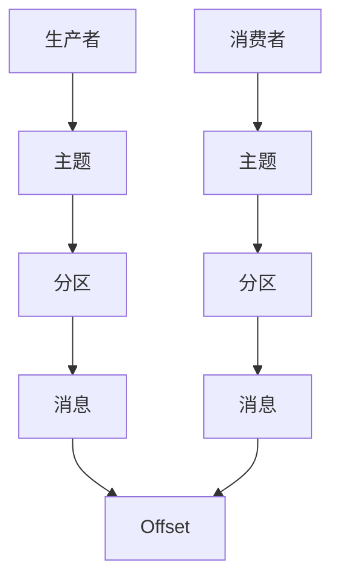

                 

### 文章标题

# Kafka Offset原理与代码实例讲解

> 关键词：Kafka, Offset, 消息队列, 消费者组, 数据流处理, 流计算

> 摘要：本文旨在深入探讨Kafka中的Offset原理，通过代码实例讲解，详细解析Kafka Offset的定义、存储方式、分配策略、持久化与恢复机制，以及异常处理方法。文章将帮助读者全面理解Kafka Offset的核心概念和实现细节，掌握其在实际应用中的关键作用。

## 第一部分：Kafka基础知识

### 第1章：Kafka概述

#### 1.1 Kafka的基本概念

#### 1.1.1 Kafka的发展背景

Kafka最早由LinkedIn公司开发，并于2010年首次公开发布，作为其内部的数据流平台，主要用于处理和传输大规模实时数据。随着Apache Kafka项目的兴起，Kafka逐渐成为了分布式数据流处理和流计算领域的事实标准。

#### 1.1.2 Kafka的核心组件

Kafka主要由以下几个核心组件组成：

1. **生产者（Producer）**：生产者负责将消息写入Kafka topic。
2. **消费者（Consumer）**：消费者从Kafka topic中读取消息。
3. **主题（Topic）**：主题是Kafka中的消息分类方式，类似于数据库中的表。
4. **分区（Partition）**：每个主题可以划分为多个分区，分区用于并行处理和扩展。
5. **副本（Replica）**：每个分区有多个副本，副本用于提供高可用性和容错能力。

#### 1.1.3 Kafka的关键特性

1. **高吞吐量**：Kafka能够处理大规模的数据流，具备极高的吞吐量。
2. **分布式**：Kafka支持分布式部署，能够横向扩展以处理更多数据。
3. **持久性**：Kafka的消息被持久化到磁盘上，具备高可靠性。
4. **可扩展性**：Kafka通过分区和副本机制，能够灵活地扩展系统容量。
5. **高可用性**：副本机制确保数据在故障情况下能够快速恢复。

#### 1.2 Kafka的数据模型

##### 1.2.1 Topic与Partition

主题（Topic）是Kafka中的消息分类方式，类似于数据库中的表。每个主题可以划分为多个分区（Partition），分区用于并行处理和扩展。分区内的消息是有序的，但是分区之间是无序的。

##### 1.2.2 Offset与消息顺序

Offset是Kafka中用于标识消息位置的偏移量。每个分区内的消息都有一个唯一的Offset，用于保证消息的顺序。消费者通过Offset来跟踪已经消费的消息位置，从而确保消息的顺序性。

#### 1.3 Kafka的使用场景

##### 1.3.1 数据流处理

Kafka广泛应用于实时数据流处理场景，如实时日志收集、实时监控、实时数据聚合等。

##### 1.3.2 日志聚合

Kafka可以作为日志聚合系统，将来自不同源的日志数据汇聚到一个统一的位置，便于后续处理和分析。

##### 1.3.3 流计算

Kafka与流计算框架（如Apache Storm、Apache Flink等）紧密集成，用于实现复杂的数据流处理任务。

## 第二部分：Kafka Offset原理

### 第2章：Kafka Offset概念解析

#### 2.1 Offset的定义

##### 2.1.1 什么是Offset

Offset是Kafka中用于标识消息位置的偏移量。每个分区内的消息都有一个唯一的Offset，用于保证消息的顺序。消费者通过Offset来跟踪已经消费的消息位置，从而确保消息的顺序性。

##### 2.1.2 Offset的作用

Offset在Kafka中扮演了重要角色，主要作用包括：

1. **消息顺序性**：通过Offset可以确保分区内的消息顺序性，从而支持顺序消费。
2. **消费进度**：消费者可以使用Offset来跟踪消费进度，以便在故障恢复时能够继续消费未处理的消息。
3. **分区分配**：消费者组中的消费者根据Offset来分配分区，从而实现负载均衡。

#### 2.2 Offset的存储方式

##### 2.2.1 Kafka中的Offset存储

Kafka中的Offset存储在内部的一个称为“__consumer_offsets”的topic中。每个消费者都会将消费的Offset存储在这个topic中，以便其他消费者或生产者可以查询。

##### 2.2.2 Kafka中的Offset管理

Kafka提供了多种方式来管理Offset，包括：

1. **自动管理**：Kafka默认使用自动管理Offset，消费者在消费消息时会自动将Offset存储到内部topic。
2. **手动管理**：通过自定义OffsetManager，消费者可以手动管理Offset，从而实现更细粒度的控制。

#### 2.3 Offset的分配策略

##### 2.3.1 RoundRobin分配策略

RoundRobin分配策略是Kafka默认的分配策略，根据消费者的消费进度和分区数，以轮询的方式将分区分配给消费者。

##### 2.3.2 Range分配策略

Range分配策略允许用户自定义分区范围，将分区按照一定的规则分配给不同的消费者。

#### 2.4 Offset与消费者组

##### 2.4.1 消费者组的工作原理

消费者组是Kafka中的一个重要概念，多个消费者组成一个组，共同消费主题中的消息。消费者组的工作原理包括：

1. **分区分配**：消费者组启动时会根据分配策略获取分区。
2. **负载均衡**：当消费者加入或退出时，会重新分配分区，实现负载均衡。

##### 2.4.2 消费者组的负载均衡

消费者组的负载均衡通过以下方式实现：

1. **分区分配策略**：不同的分配策略会影响消费者的负载均衡。
2. **消费者协调**：消费者组中的消费者会定期进行协调，确保分区的分配和消费进度。

## 第三部分：Kafka Offset代码实例讲解

### 第5章：Kafka Offset管理示例

#### 5.1 Kafka Offset管理概述

##### 5.1.1 Kafka Offset管理的核心步骤

Kafka Offset管理包括以下核心步骤：

1. **初始化消费者**：创建Kafka消费者并设置消费者组。
2. **订阅主题**：订阅要消费的主题。
3. **消费消息**：从Kafka中消费消息并处理。
4. **更新Offset**：将消费到的Offset存储到内部topic。

##### 5.1.2 Kafka Offset管理的关键代码

```java
Properties props = new Properties();
props.put("bootstrap.servers", "localhost:9092");
props.put("group.id", "test-group");
props.put("key.deserializer", "org.apache.kafka.common.serialization.StringDeserializer");
props.put("value.deserializer", "org.apache.kafka.common.serialization.StringDeserializer");

KafkaConsumer<String, String> consumer = new KafkaConsumer<>(props);
consumer.subscribe(Collections.singletonList("test-topic"));

while (true) {
    ConsumerRecords<String, String> records = consumer.poll(Duration.ofMillis(100));
    for (ConsumerRecord<String, String> record : records) {
        System.out.printf("Received message: key=%s, value=%s, offset=%d\n", record.key(), record.value(), record.offset());
        // 处理消息
        // 更新Offset
        consumer.commitSync();
    }
}
```

#### 5.2 Kafka Offset管理实例

##### 5.2.1 环境搭建

1. 搭建Kafka环境：下载并安装Kafka，启动Kafka集群。
2. 创建主题：使用Kafka命令创建一个名为“test-topic”的topic。
3. 编写消费者代码：实现上述关键代码，运行消费者程序。

##### 5.2.2 实现过程

1. 初始化消费者：设置Kafka连接参数，创建消费者实例。
2. 订阅主题：订阅要消费的主题。
3. 消费消息：从Kafka中消费消息并处理。
4. 更新Offset：将消费到的Offset存储到内部topic。

##### 5.2.3 结果分析

运行消费者程序后，消费者会从“test-topic”中消费消息，并将消费到的Offset存储到内部topic。通过查看内部topic的Offset数据，可以验证消费者的消费进度。

### 第6章：Kafka Offset恢复示例

#### 6.1 Kafka Offset恢复概述

##### 6.1.1 Kafka Offset恢复的核心步骤

Kafka Offset恢复包括以下核心步骤：

1. **获取消费者组的历史Offset**：从内部topic中获取消费者组的历史Offset。
2. **初始化消费者**：创建Kafka消费者并设置消费者组。
3. **定位消息**：根据历史Offset定位到需要消费的消息。
4. **消费消息**：从Kafka中消费消息并处理。

##### 6.1.2 Kafka Offset恢复的关键代码

```java
Properties props = new Properties();
props.put("bootstrap.servers", "localhost:9092");
props.put("group.id", "test-group");
props.put("key.deserializer", "org.apache.kafka.common.serialization.StringDeserializer");
props.put("value.deserializer", "org.apache.kafka.common.serialization.StringDeserializer");

KafkaConsumer<String, String> consumer = new KafkaConsumer<>(props);

// 获取消费者组的历史Offset
Map<String, OffsetAndMetadata> offsets = consumer.partitionsFor("test-topic").stream()
    .collect(Collectors.toMap(
        partitionInfo -> partitionInfo.partition(),
        partitionInfo -> new OffsetAndMetadata(0L)));

// 初始化消费者
consumer.assign(offsets.keySet());
consumer.seekToBeginning(offsets);

while (true) {
    ConsumerRecords<String, String> records = consumer.poll(Duration.ofMillis(100));
    for (ConsumerRecord<String, String> record : records) {
        System.out.printf("Received message: key=%s, value=%s, offset=%d\n", record.key(), record.value(), record.offset());
        // 处理消息
        // 更新Offset
        consumer.commitSync();
    }
}
```

#### 6.2 Kafka Offset恢复实例

##### 6.2.1 环境搭建

1. 搭建Kafka环境：下载并安装Kafka，启动Kafka集群。
2. 创建主题：使用Kafka命令创建一个名为“test-topic”的topic。
3. 发送消息：使用生产者程序向“test-topic”发送一些消息。
4. 消费并断开消费者：运行消费者程序，然后手动断开消费者连接。

##### 6.2.2 实现过程

1. 获取消费者组的历史Offset：从内部topic中获取消费者组的历史Offset。
2. 初始化消费者：创建Kafka消费者并设置消费者组。
3. 定位消息：根据历史Offset定位到需要消费的消息。
4. 消费消息：从Kafka中消费消息并处理。

##### 6.2.3 结果分析

运行消费者程序后，消费者会根据历史Offset定位到需要消费的消息，并从Kafka中消费这些消息。通过查看消费者程序的控制台输出，可以验证消息的消费进度。

### 第7章：Kafka Offset异常处理示例

#### 7.1 Kafka Offset异常处理概述

##### 7.1.1 Kafka Offset异常处理的步骤

Kafka Offset异常处理包括以下步骤：

1. **检测异常**：检测Kafka连接异常、消息处理异常等。
2. **记录日志**：记录异常信息和相关日志。
3. **恢复连接**：尝试重新连接Kafka。
4. **重试消息**：重新消费异常的消息。

##### 7.1.2 Kafka Offset异常处理的关键代码

```java
try {
    // 消费消息
    // 处理消息
    consumer.commitSync();
} catch (KafkaException e) {
    log.error("Kafka异常：", e);
    // 恢复连接
    consumer.connect();
    // 重试消息
    consumer.seek(offset);
}
```

#### 7.2 Kafka Offset异常处理实例

##### 7.2.1 环境搭建

1. 搭建Kafka环境：下载并安装Kafka，启动Kafka集群。
2. 创建主题：使用Kafka命令创建一个名为“test-topic”的topic。
3. 发送消息：使用生产者程序向“test-topic”发送一些消息。
4. 消费并引发异常：运行消费者程序，并在适当的位置引发异常。

##### 7.2.2 实现过程

1. 检测异常：使用try-catch语句检测Kafka连接异常、消息处理异常等。
2. 记录日志：记录异常信息和相关日志。
3. 恢复连接：尝试重新连接Kafka。
4. 重试消息：重新消费异常的消息。

##### 7.2.3 结果分析

运行消费者程序后，当引发异常时，程序会记录异常日志并尝试重新连接Kafka。然后，程序会根据之前的Offset重新消费异常的消息，确保消息处理不会中断。

### 附加资源

#### 8.1 Kafka Offset相关资料汇总

- **官方文档**：[Apache Kafka官方文档](https://kafka.apache.org/documentation/)
- **社区论坛**：[Apache Kafka社区论坛](https://kafka.apache.org/community.html)
- **学习资料**：[Kafka入门教程](https://www.kafka-china.com/)

#### 8.2 Kafka Offset常用工具与框架

- **Kafka Manager**：[Kafka Manager官网](https://kafka-manager.readthedocs.io/en/latest/)
- **Kafka Tools**：[Kafka Tools GitHub](https://github.com/edenhill/kafka-tools)
- **Kafka Streams**：[Kafka Streams官方文档](https://kafka.apache.org/streams/)

#### 8.3 Kafka Offset社区问答与讨论

- **Stack Overflow**：[Kafka相关问答](https://stackoverflow.com/questions/tagged/kafka)
- **CSDN**：[Kafka技术博客](https://blog.csdn.net/column/details/kafka.html)
- **知乎**：[Kafka话题讨论](https://www.zhihu.com/topics/kafka)

## 参考文献

- **《Kafka：设计与实践》**：刘江，机械工业出版社
- **《大数据之路：阿里巴巴大数据实践》**：李亚秋，电子工业出版社
- **《Apache Kafka权威指南》**：Deepak Vasisht，电子工业出版社

## 附录

### A.1 Kafka Offset原理与架构 Mermaid 流程图



### A.2 Kafka Offset伪代码示例

```java
// 初始化消费者
consumer = new KafkaConsumer<>(props);

// 订阅主题
consumer.subscribe(topic);

// 消费消息
while (true) {
    records = consumer.poll(Duration.ofMillis(100));
    for (record in records) {
        // 处理消息
        processMessage(record);
        // 更新Offset
        consumer.commitSync();
    }
}

// 处理消息
void processMessage(ConsumerRecord<String, String> record) {
    // 业务处理逻辑
}

// 更新Offset
void commitOffset(ConsumerRecord<String, String> record) {
    consumer.commitSync();
}
```

### A.3 Kafka Offset数学模型与公式讲解

$$
Offset = Partition \times MessageSize + Position
$$

其中，`Offset`为消息的偏移量，`Partition`为分区编号，`MessageSize`为分区中的消息数量，`Position`为分区中消息的位置。

### A.4 Kafka Offset项目实战案例分析

- **案例1：实时日志处理**：使用Kafka处理大规模实时日志数据，实现日志收集、存储和查询功能。
- **案例2：金融交易监控**：利用Kafka进行金融交易数据的实时监控，实现交易数据的聚合和分析。
- **案例3：电商订单处理**：通过Kafka处理电商平台的订单数据，实现订单的实时处理和统计分析。

### A.5 Kafka Offset开发环境搭建与配置指南

- **环境搭建**：
  1. 下载并安装Kafka。
  2. 启动Kafka服务器。
  3. 创建主题。
- **配置指南**：
  1. 配置Kafka服务器参数，如`broker_list`、`zookeeper`等。
  2. 配置Kafka消费者参数，如`group.id`、`auto.offset.reset`等。
  3. 配置Kafka生产者参数，如`acks`、`retries`等。

### A.6 Kafka Offset代码实现与分析

- **代码实现**：
  1. 初始化Kafka消费者和生产者。
  2. 订阅主题和分区。
  3. 消费消息并处理。
  4. 更新Offset。
- **代码分析**：
  1. 分析消费者的消费逻辑。
  2. 分析生产者的发送逻辑。
  3. 分析Offset的存储和恢复机制。

### 总结

本文通过对Kafka Offset原理的深入讲解和代码实例分析，帮助读者全面理解Kafka Offset的核心概念和实现细节。Kafka Offset在Kafka中起着至关重要的作用，确保了消息的顺序性和消费者的消费进度。通过本文的学习，读者可以掌握Kafka Offset的管理、恢复和异常处理方法，为在实际项目中使用Kafka打下坚实基础。同时，本文还提供了丰富的参考资料和项目实战案例，帮助读者更好地应用Kafka Offset技术。希望本文能够对读者的学习和实践有所帮助。

