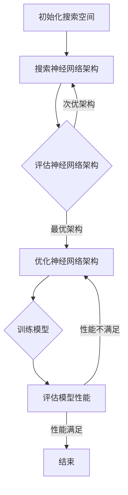

                 

# 《NAS在移动端AI应用开发中的角色》

> 关键词：神经架构搜索（NAS）、移动端AI应用、架构优化、性能优化、未来趋势

> 摘要：本文探讨了神经架构搜索（NAS）在移动端AI应用开发中的角色。首先，介绍了NAS的基本概念和移动端AI应用的发展趋势。随后，详细分析了NAS在移动端AI应用中的功能和优势，并探讨了其在实际应用中面临的挑战。接着，深入讲解了NAS的关键算法原理和数学模型，并通过实际项目案例展示了如何在实际开发中应用NAS技术。最后，分析了NAS在移动端AI应用开发中的性能优化方法和未来趋势，为移动端AI应用开发提供了新的思路和方向。

## 第一部分：概述与背景

### 第1章：NAS与移动端AI应用开发概述

#### 1.1 NAS概述

##### 1.1.1 NAS的定义与历史

神经架构搜索（Neural Architecture Search，简称NAS）是一种自动化搜索算法，用于自动发现最优的神经网络架构。NAS起源于深度学习的兴起，为了解决传统神经网络设计过程中耗时耗力、依赖人类经验和直觉的问题。NAS的核心思想是通过搜索算法自动探索大量的神经网络架构，并利用性能评估指标筛选出最优的架构。

NAS的发展可以追溯到2016年，由Google Brain团队首次提出的AutoML（自动机器学习）概念。随后，NAS技术得到了广泛的关注和研究，并逐渐成为人工智能领域的一个热点研究方向。

##### 1.1.2 NAS的关键特点

NAS具有以下几个关键特点：

1. 自动化：NAS通过搜索算法自动探索大量的神经网络架构，减少了人工参与，提高了设计效率。
2. 灵活性：NAS可以针对不同的任务和数据集，自动调整和优化神经网络架构，提高了模型的泛化能力。
3. 高效性：NAS通过并行计算和分布式搜索技术，可以大幅度提高搜索效率和性能。

##### 1.1.3 NAS在AI应用开发中的重要性

NAS在AI应用开发中具有重要意义：

1. 提高模型性能：NAS可以自动发现最优的神经网络架构，提高模型的准确性和性能。
2. 减少人力成本：NAS减少了人工参与，降低了模型设计的时间和人力成本。
3. 支持迁移学习：NAS可以在不同的任务和数据集上自动调整和优化模型，支持迁移学习，提高了模型的泛化能力。

#### 1.2 移动端AI应用的发展趋势

##### 1.2.1 移动端AI应用的重要性

移动端AI应用在近年来得到了迅猛发展，主要源于以下几个方面：

1. 移动设备的普及：随着智能手机和移动设备的普及，移动端成为人们日常生活的主要入口之一。
2. 网络技术的进步：5G网络的普及和移动互联网的快速发展，为移动端AI应用提供了更高效的网络环境。
3. 用户需求的增长：人们对移动端应用的需求日益增长，特别是对于实时、高效、智能化的应用。

##### 1.2.2 移动端AI应用的发展现状

目前，移动端AI应用已经广泛应用于各个领域，包括但不限于：

1. 图像识别：移动设备上的图像识别应用，如人脸识别、二维码识别、物体识别等。
2. 语音识别：移动设备上的语音识别应用，如语音助手、语音翻译等。
3. 自然语言处理：移动设备上的自然语言处理应用，如智能客服、智能聊天机器人等。
4. 个性化推荐：移动设备上的个性化推荐应用，如购物推荐、音乐推荐等。

##### 1.2.3 移动端AI应用的发展挑战

尽管移动端AI应用取得了显著进展，但仍面临以下挑战：

1. 硬件资源限制：移动设备通常具有较低的硬件性能和有限的电池寿命，这对AI模型的计算和功耗提出了较高要求。
2. 低延迟需求：移动端应用通常要求实时响应，低延迟是用户体验的关键。
3. 数据隐私与安全：移动端设备常常携带个人隐私数据，数据隐私和安全成为移动端AI应用的一个重要挑战。

#### 1.3 NAS在移动端AI应用开发中的角色

##### 1.3.1 NAS在移动端AI应用中的功能

NAS在移动端AI应用开发中具有以下功能：

1. 自动化架构优化：NAS可以自动搜索和优化神经网络架构，提高模型的性能和效率。
2. 降低开发成本：NAS减少了人工参与，降低了模型设计的时间和人力成本。
3. 提高泛化能力：NAS可以自动调整和优化模型，提高模型在不同任务和数据集上的泛化能力。

##### 1.3.2 NAS在移动端AI应用开发的优势

NAS在移动端AI应用开发中具有以下优势：

1. 高效性：NAS通过并行计算和分布式搜索技术，大幅度提高搜索效率和性能。
2. 灵活性：NAS可以根据不同的任务和数据集，自动调整和优化模型，支持迁移学习。
3. 可扩展性：NAS可以应用于各种不同的移动端AI应用，具有广泛的适用性。

##### 1.3.3 NAS在移动端AI应用开发中的挑战

NAS在移动端AI应用开发中也面临以下挑战：

1. 硬件资源限制：移动设备通常具有较低的硬件性能和有限的电池寿命，这对NAS的搜索效率和性能提出了较高要求。
2. 低延迟需求：移动端应用通常要求实时响应，低延迟是用户体验的关键，对NAS的性能优化提出了挑战。
3. 数据隐私与安全：移动端设备常常携带个人隐私数据，数据隐私和安全成为移动端AI应用的一个重要挑战，对NAS的安全性和隐私保护提出了更高要求。

## 第二部分：技术基础

### 第2章：NAS技术基础

#### 2.1 NAS的架构与原理

##### 2.1.1 NAS的基本架构

NAS的基本架构通常包括以下几个关键组件：

1. 搜索空间：搜索空间定义了神经网络架构的候选集，包括各种可能的网络层、连接方式、激活函数等。
2. 搜索算法：搜索算法负责在搜索空间中搜索最优的神经网络架构，常用的搜索算法包括贝叶斯优化、遗传算法、强化学习等。
3. 评估器：评估器负责评估搜索到的神经网络架构的性能，通常使用指标如准确率、损失函数等。
4. 优化器：优化器负责对搜索到的神经网络架构进行优化，以提高其性能和效率。

##### 2.1.2 NAS的工作原理

NAS的工作原理可以概括为以下几个步骤：

1. 初始化搜索空间：根据任务和数据集的特点，初始化搜索空间，定义神经网络架构的候选集。
2. 搜索神经网络架构：使用搜索算法在搜索空间中搜索最优的神经网络架构，常用的搜索算法包括贝叶斯优化、遗传算法、强化学习等。
3. 评估神经网络架构：使用评估器评估搜索到的神经网络架构的性能，选择最优的架构。
4. 优化神经网络架构：使用优化器对搜索到的神经网络架构进行优化，以提高其性能和效率。
5. 反复迭代：重复以上步骤，不断搜索、评估和优化神经网络架构，直到满足停止条件。

##### 2.1.3 NAS的关键组件

NAS的关键组件包括搜索算法、评估器和优化器，下面分别进行介绍：

1. 搜索算法：搜索算法是NAS的核心组件，负责在搜索空间中搜索最优的神经网络架构。常用的搜索算法包括贝叶斯优化、遗传算法、强化学习等，每种算法都有其独特的搜索策略和优势。

2. 评估器：评估器用于评估搜索到的神经网络架构的性能，常用的评估指标包括准确率、损失函数等。评估器的选择和设计对NAS的性能和效果具有重要影响。

3. 优化器：优化器用于对搜索到的神经网络架构进行优化，以提高其性能和效率。优化器的选择和设计对NAS的性能和效果也具有重要影响。

#### 2.2 NAS的关键算法

##### 2.2.1 NAS搜索算法

NAS搜索算法是NAS的核心组件，负责在搜索空间中搜索最优的神经网络架构。下面介绍几种常用的NAS搜索算法：

1. 贝叶斯优化（Bayesian Optimization）：贝叶斯优化是一种基于概率模型的搜索算法，通过构建概率模型来预测搜索空间中的最优架构，并利用模型指导下一步的搜索。贝叶斯优化具有较好的搜索效率和收敛速度。

2. 遗传算法（Genetic Algorithm）：遗传算法是一种基于生物进化的搜索算法，通过模拟生物进化的过程，如选择、交叉、变异等操作，来搜索最优的神经网络架构。遗传算法具有鲁棒性和自适应性的优点。

3. 强化学习（Reinforcement Learning）：强化学习是一种基于试错和反馈的搜索算法，通过与环境交互，不断更新策略，以搜索最优的神经网络架构。强化学习具有较好的搜索效果和灵活性。

##### 2.2.2 NAS优化算法

NAS优化算法用于对搜索到的神经网络架构进行优化，以提高其性能和效率。下面介绍几种常用的NAS优化算法：

1. 粒子群优化（Particle Swarm Optimization，PSO）：粒子群优化是一种基于群体智能的优化算法，通过模拟鸟群觅食行为，来搜索最优的神经网络架构。粒子群优化具有简单、高效和鲁棒性的优点。

2. 人工蜂群优化（Artificial Bee Colony，ABC）：人工蜂群优化是一种基于蜜蜂觅食行为的优化算法，通过模拟蜜蜂的觅食过程，来搜索最优的神经网络架构。人工蜂群优化具有较好的搜索能力和全局收敛性。

3. 模拟退火算法（Simulated Annealing，SA）：模拟退火算法是一种基于物理退火过程的优化算法，通过在搜索过程中引入随机性和探索性，来搜索最优的神经网络架构。模拟退火算法具有较好的全局搜索能力和收敛速度。

##### 2.2.3 NAS评估与选择算法

NAS评估与选择算法用于评估搜索到的神经网络架构的性能，并选择最优的架构。下面介绍几种常用的NAS评估与选择算法：

1. 混合评估指标：混合评估指标通过结合多种评估指标，如准确率、损失函数等，来综合评估神经网络架构的性能。混合评估指标具有较好的平衡性和综合性。

2. 预测评估：预测评估通过利用历史数据，预测搜索到的神经网络架构的性能。预测评估可以快速评估大量候选架构的性能，提高搜索效率。

3. 实验评估方法：实验评估方法通过在实际数据集上训练和评估神经网络架构，来评估其性能。实验评估方法具有较好的真实性和可靠性，但需要较大的计算资源和时间成本。

#### 2.3 NAS在移动端的应用挑战

##### 2.3.1 硬件资源限制

移动端设备通常具有较低的硬件性能和有限的电池寿命，这对NAS的搜索效率和性能提出了较高要求。以下是NAS在移动端应用中的硬件资源限制：

1. 计算资源：移动端设备的计算资源有限，NAS需要在大规模搜索空间中进行高效的计算，以减少计算资源的消耗。

2. 存储资源：移动端设备的存储资源有限，NAS需要有效地存储和管理大量的候选架构和评估结果，以避免存储空间的浪费。

3. 网络带宽：移动端设备通常具有较低的网络带宽，NAS需要充分利用本地资源，减少对远程服务的依赖，以提高搜索效率和用户体验。

##### 2.3.2 低功耗需求

移动端设备对功耗有严格的要求，NAS需要在满足性能要求的同时，最大限度地降低功耗。以下是NAS在移动端应用中的低功耗需求：

1. 模型压缩：通过模型压缩技术，如剪枝、量化等，减少模型的参数和计算量，降低功耗。

2. 硬件加速：利用移动端设备上的硬件加速器，如GPU、DSP等，提高模型的计算速度，降低功耗。

3. 动态功耗管理：通过动态调整模型的计算复杂度，如调整网络层数、激活函数等，实现功耗的优化。

##### 2.3.3 安全性与隐私保护

移动端设备常常携带个人隐私数据，NAS在移动端应用中需要关注安全性和隐私保护。以下是NAS在移动端应用中的安全性与隐私保护：

1. 数据加密：对移动端设备上的数据进行加密，确保数据的安全性。

2. 权限管理：对移动端设备上的权限进行严格管理，防止未经授权的访问和操作。

3. 安全通信：通过安全通信协议，如TLS等，确保数据在传输过程中的安全性和完整性。

4. 隐私保护：在数据采集和处理过程中，对个人隐私数据进行去标识化处理，防止隐私泄露。

## 第三部分：核心算法原理讲解

### 第3章：NAS核心算法原理讲解

#### 3.1 搜索算法原理

NAS搜索算法是NAS的核心组件，用于在搜索空间中搜索最优的神经网络架构。下面介绍几种常用的搜索算法原理。

##### 3.1.1 贝叶斯优化搜索

贝叶斯优化（Bayesian Optimization）是一种基于概率模型的搜索算法，通过构建概率模型来预测搜索空间中的最优架构，并利用模型指导下一步的搜索。

贝叶斯优化的核心思想是利用历史评估结果构建一个概率模型，通常采用高斯过程（Gaussian Process，GP）作为模型。高斯过程是一个非参数的概率模型，能够对搜索空间中的目标函数进行平滑预测。通过最小化预测值，贝叶斯优化算法选择下一个搜索位置，并在该位置进行新的实验，不断迭代搜索过程。

贝叶斯优化的关键步骤包括：

1. 初始化：根据搜索空间的特点，初始化高斯过程模型。

2. 预测：利用高斯过程模型，预测搜索空间中目标函数的最优位置。

3. 评估：在预测的最优位置进行实验，评估模型性能。

4. 更新：根据实验结果，更新高斯过程模型。

5. 重启：当达到停止条件时，重启搜索过程。

##### 3.1.2 遗传算法搜索

遗传算法（Genetic Algorithm，GA）是一种基于生物进化的搜索算法，通过模拟生物进化的过程，如选择、交叉、变异等操作，来搜索最优的神经网络架构。

遗传算法的核心思想是模拟生物进化的过程，通过适应度函数评估个体的优劣，并利用选择、交叉、变异等操作，生成新的个体，不断迭代搜索过程，逐渐优化搜索结果。

遗传算法的关键步骤包括：

1. 初始化：根据搜索空间的特点，初始化种群，每个个体代表一个神经网络架构。

2. 适应度评估：利用适应度函数评估种群中每个个体的性能。

3. 选择：根据适应度函数，选择优秀的个体进行繁殖，提高种群的多样性。

4. 交叉：通过交叉操作，生成新的个体，扩展种群的搜索范围。

5. 变异：通过变异操作，增加种群的探索能力。

6. 更新：将新生成的个体替换掉种群中的旧个体，继续迭代搜索过程。

##### 3.1.3 强化学习搜索

强化学习（Reinforcement Learning，RL）是一种基于试错和反馈的搜索算法，通过与环境交互，不断更新策略，来搜索最优的神经网络架构。

强化学习的基本原理是通过智能体（agent）与环境（environment）的交互，不断更新策略（policy），以最大化预期奖励（reward）。在NAS中，智能体选择神经网络架构，并通过训练和评估，获取反馈信号，调整搜索策略。

强化学习搜索的关键步骤包括：

1. 初始化：初始化智能体和策略。

2. 探索与利用：在搜索过程中，智能体需要在探索（exploitation）和利用（exploitation）之间取得平衡，以获得更多的信息。

3. 策略更新：根据反馈信号，更新搜索策略，以最大化预期奖励。

4. 模型训练：在选择的神经网络架构上进行训练，获取评估结果。

5. 评估与选择：利用评估结果，选择性能较好的架构，更新搜索空间。

6. 重启：当达到停止条件时，重启搜索过程。

#### 3.2 优化算法原理

NAS优化算法用于对搜索到的神经网络架构进行优化，以提高其性能和效率。下面介绍几种常用的优化算法原理。

##### 3.2.1 粒子群优化

粒子群优化（Particle Swarm Optimization，PSO）是一种基于群体智能的优化算法，通过模拟鸟群觅食行为，来搜索最优的神经网络架构。

PSO的核心思想是模拟鸟群在觅食过程中的行为，每个粒子（particle）代表一个神经网络架构，通过更新粒子的速度和位置，逐步优化搜索结果。

PSO的关键步骤包括：

1. 初始化：初始化粒子群，包括粒子的位置、速度和惯性权重。

2. 适应度评估：利用适应度函数评估每个粒子的性能。

3. 更新：根据个体最优位置和全局最优位置，更新粒子的速度和位置。

4. 更新个体最优位置：根据适应度函数，更新每个粒子的个体最优位置。

5. 更新全局最优位置：根据适应度函数，更新全局最优位置。

6. 迭代：重复更新步骤，直到达到停止条件。

##### 3.2.2 人工蜂群优化

人工蜂群优化（Artificial Bee Colony，ABC）是一种基于蜜蜂觅食行为的优化算法，通过模拟蜜蜂的觅食过程，来搜索最优的神经网络架构。

ABC的核心思想是模拟蜜蜂的觅食过程，包括采蜜、跟随和搜索等行为，通过更新位置和方向，逐步优化搜索结果。

ABC的关键步骤包括：

1. 初始化：初始化蜜蜂种群，包括位置和方向。

2. 适应度评估：利用适应度函数评估每个蜜蜂的性能。

3. 采蜜：根据适应度函数，选择优秀的蜜源，进行采蜜。

4. 跟随：根据适应度函数，选择跟随蜜源，进行探索。

5. 搜索：根据适应度函数，进行全局搜索，寻找更好的蜜源。

6. 更新：根据搜索结果，更新蜜蜂的位置和方向。

7. 迭代：重复更新步骤，直到达到停止条件。

##### 3.2.3 模拟退火算法

模拟退火算法（Simulated Annealing，SA）是一种基于物理退火过程的优化算法，通过在搜索过程中引入随机性和探索性，来搜索最优的神经网络架构。

SA的核心思想是模拟固体退火过程，通过控制温度参数，逐步减小搜索空间中的局部最优，并避免陷入局部最优。

SA的关键步骤包括：

1. 初始化：初始化温度参数和初始解。

2. 更新：根据当前温度参数，选择新的解，并计算其适应度。

3. 评估：比较新旧解的适应度，判断是否接受新的解。

4. 更新温度：根据当前温度参数，更新温度。

5. 迭代：重复更新步骤，直到达到停止条件。

#### 3.3 评估与选择算法原理

NAS评估与选择算法用于评估搜索到的神经网络架构的性能，并选择最优的架构。下面介绍几种常用的评估与选择算法原理。

##### 3.3.1 混合评估指标

混合评估指标通过结合多种评估指标，如准确率、损失函数等，来综合评估神经网络架构的性能。

混合评估指标的核心思想是利用多个评估指标，从不同角度衡量神经网络架构的性能，并利用加权方法，综合计算总评估分数。

混合评估指标的关键步骤包括：

1. 定义评估指标：根据任务和数据集的特点，定义多个评估指标。

2. 计算评估分数：计算每个评估指标的得分，并进行归一化处理。

3. 加权求和：利用加权方法，计算总评估分数。

4. 选择最优架构：根据总评估分数，选择性能最优的神经网络架构。

##### 3.3.2 预测评估

预测评估通过利用历史数据，预测搜索到的神经网络架构的性能。

预测评估的核心思想是基于历史数据，构建预测模型，预测新的神经网络架构的性能。

预测评估的关键步骤包括：

1. 数据准备：收集历史数据，并进行预处理。

2. 模型训练：利用历史数据，训练预测模型。

3. 预测性能：利用训练好的模型，预测新的神经网络架构的性能。

4. 选择最优架构：根据预测性能，选择性能最优的神经网络架构。

##### 3.3.3 实验评估方法

实验评估方法通过在实际数据集上训练和评估神经网络架构，来评估其性能。

实验评估方法的核心思想是在实际数据集上，对搜索到的神经网络架构进行训练和评估，以获取真实性能。

实验评估方法的关键步骤包括：

1. 数据集准备：准备实际数据集，并进行预处理。

2. 模型训练：在数据集上训练神经网络架构。

3. 模型评估：利用训练好的模型，在数据集上进行评估。

4. 记录性能：记录评估结果，用于后续分析。

5. 选择最优架构：根据评估结果，选择性能最优的神经网络架构。

## 第四部分：数学模型和数学公式

### 第4章：NAS的数学模型和公式

#### 4.1 泛化能力评估

##### 4.1.1 泛化能力的重要性

在NAS中，评估模型的泛化能力至关重要。泛化能力是指模型在未知数据上的表现，反映了模型对未见过的数据的适应能力。良好的泛化能力意味着模型不仅能在训练数据上取得好成绩，也能在新数据上保持良好的表现。

##### 4.1.2 泛化能力的评估指标

评估泛化能力通常使用以下指标：

1. **准确率（Accuracy）**：准确率是模型预测正确的样本数占总样本数的比例。准确率越高，说明模型对数据的泛化能力越好。

\[ \text{Accuracy} = \frac{\text{正确预测的样本数}}{\text{总样本数}} \]

2. **精确率（Precision）**：精确率是预测为正类的样本中，实际为正类的比例。精确率关注模型在预测正类时的准确性。

\[ \text{Precision} = \frac{\text{实际为正类且预测为正类的样本数}}{\text{预测为正类的样本数}} \]

3. **召回率（Recall）**：召回率是实际为正类的样本中，预测为正类的比例。召回率关注模型在预测负类时的准确性。

\[ \text{Recall} = \frac{\text{实际为正类且预测为正类的样本数}}{\text{实际为正类的样本数}} \]

4. **F1分数（F1 Score）**：F1分数是精确率和召回率的调和平均，用于综合评估模型的泛化能力。

\[ \text{F1 Score} = 2 \times \frac{\text{Precision} \times \text{Recall}}{\text{Precision} + \text{Recall}} \]

##### 4.1.3 泛化能力的数学模型

泛化能力的数学模型通常基于统计学习理论，特别是贝叶斯误差和VC维（Vapnik-Chervonenkis Dimension）。

1. **贝叶斯误差**：贝叶斯误差是模型在无限数据集上的误差率，它是模型复杂度和数据分布的函数。

\[ \epsilon_{\text{Bayes}} = \inf_{\theta} \mathbb{E}_{x \sim p(x)}[L(f(x, \theta))] \]

其中，\( f(x, \theta) \) 是模型的决策函数，\( \theta \) 是模型参数，\( L \) 是损失函数。

2. **VC维**：VC维是模型能够分类的最大样本集的大小。高VC维通常意味着模型具有更强的泛化能力。

\[ \text{VCDim}(X) = \sup \{ |S| : S \subseteq X, \text{模型能分类} S \} \]

#### 4.2 损失函数

##### 4.2.1 常见损失函数

损失函数是评估模型预测误差的关键工具。以下是一些常见的损失函数：

1. **均方误差（Mean Squared Error，MSE）**：MSE是预测值与真实值之间差的平方的平均值。

\[ \text{MSE} = \frac{1}{n} \sum_{i=1}^{n} (y_i - \hat{y}_i)^2 \]

2. **交叉熵损失（Cross-Entropy Loss）**：交叉熵损失用于分类问题，特别是二分类和多分类问题。

\[ \text{Cross-Entropy Loss} = -\sum_{i=1}^{n} y_i \log(\hat{y}_i) \]

其中，\( y_i \) 是真实标签，\( \hat{y}_i \) 是模型预测的概率。

3. **Hinge损失（Hinge Loss）**：Hinge损失常用于支持向量机（SVM）。

\[ \text{Hinge Loss} = \max(0, 1 - y \cdot \hat{y}) \]

4. **Softmax损失（Softmax Loss）**：Softmax损失用于多分类问题，与交叉熵损失结合使用。

\[ \text{Softmax Loss} = -\sum_{i=1}^{n} y_i \log(\hat{p}_i) \]

其中，\( \hat{p}_i \) 是模型预测的概率分布。

##### 4.2.2 损失函数的选择与优化

损失函数的选择和优化对模型的性能有重要影响。选择合适的损失函数可以提高模型的泛化能力和鲁棒性。

1. **损失函数的选择**：应根据具体任务和数据集的特点选择合适的损失函数。例如，对于回归问题，可以选择MSE或Huber损失；对于分类问题，可以选择交叉熵损失或Hinge损失。

2. **损失函数的优化**：可以通过优化算法如梯度下降、Adam等，最小化损失函数。优化过程的稳定性、收敛速度和最终性能都受到损失函数的影响。

##### 4.2.3 损失函数的数学公式

以下是几种常见损失函数的数学公式：

1. **均方误差（MSE）**：

\[ \text{MSE} = \frac{1}{n} \sum_{i=1}^{n} (y_i - \hat{y}_i)^2 \]

2. **交叉熵损失（Cross-Entropy Loss）**：

\[ \text{Cross-Entropy Loss} = -\sum_{i=1}^{n} y_i \log(\hat{y}_i) \]

3. **Hinge损失（Hinge Loss）**：

\[ \text{Hinge Loss} = \max(0, 1 - y \cdot \hat{y}) \]

4. **Softmax损失（Softmax Loss）**：

\[ \text{Softmax Loss} = -\sum_{i=1}^{n} y_i \log(\hat{p}_i) \]

#### 4.3 优化算法的数学模型

##### 4.3.1 粒子群优化数学模型

粒子群优化（PSO）是一种基于群体智能的优化算法。PSO的数学模型可以描述为：

1. **位置更新**：

\[ x_{i}^{t+1} = x_{i}^{t} + v_{i}^{t+1} \]

2. **速度更新**：

\[ v_{i}^{t+1} = \omega v_{i}^{t} + c_1 r_1 (p_{i} - x_{i}^{t}) + c_2 r_2 (g_{best} - x_{i}^{t}) \]

其中，\( x_{i}^{t} \) 是第 \( i \) 个粒子的位置，\( v_{i}^{t} \) 是第 \( i \) 个粒子的速度，\( p_{i} \) 是第 \( i \) 个粒子的历史最优位置，\( g_{best} \) 是全局最优位置，\( \omega \) 是惯性权重，\( c_1 \) 和 \( c_2 \) 是社会和学习因子，\( r_1 \) 和 \( r_2 \) 是随机数。

##### 4.3.2 人工蜂群优化数学模型

人工蜂群优化（ABC）是一种基于蜜蜂觅食行为的优化算法。ABC的数学模型可以描述为：

1. **位置更新**：

\[ x_{i}^{t+1} = x_{i}^{t} + \alpha (x_{gbest} - x_{i}^{t}) \]

其中，\( x_{i}^{t} \) 是第 \( i \) 个蜜蜂的位置，\( x_{gbest} \) 是全局最优位置，\( \alpha \) 是调整参数。

2. **方向更新**：

\[ \theta_{i}^{t+1} = \theta_{i}^{t} + \beta (\theta_{gbest} - \theta_{i}^{t}) \]

其中，\( \theta_{i}^{t} \) 是第 \( i \) 个蜜蜂的方向，\( \theta_{gbest} \) 是全局最优方向，\( \beta \) 是调整参数。

##### 4.3.3 模拟退火算法数学模型

模拟退火算法（SA）是一种基于物理退火过程的优化算法。SA的数学模型可以描述为：

1. **温度更新**：

\[ T_{t+1} = \gamma T_t \]

其中，\( T_t \) 是当前温度，\( \gamma \) 是温度下降系数。

2. **接受概率**：

\[ p_{accept} = \min\left(1, \exp\left(-\frac{f_{new} - f_{current}}{T_{t+1}}\right)\right) \]

其中，\( f_{new} \) 是新解的适应度，\( f_{current} \) 是当前解的适应度。

3. **位置更新**：

\[ x_{i}^{t+1} = x_{i}^{t} + \Delta x \]

其中，\( \Delta x \) 是位置的随机扰动。

## 第五部分：项目实战

### 第5章：NAS在移动端AI应用开发中的实战案例

#### 5.1 项目背景与目标

##### 5.1.1 项目背景

随着移动设备的普及和人工智能技术的不断发展，移动端AI应用在图像识别、语音识别、自然语言处理等领域的应用需求日益增长。为了提高移动端AI应用的性能和用户体验，本项目旨在利用神经架构搜索（NAS）技术，在移动端实现高效的AI模型优化和部署。

##### 5.1.2 项目目标

本项目的主要目标是：

1. 设计和实现一个基于NAS的移动端AI应用开发框架，支持多种搜索算法和优化方法。
2. 在移动端实现高效的AI模型优化，降低模型计算量和功耗，提高模型性能和用户体验。
3. 通过实际项目案例，展示NAS在移动端AI应用开发中的实际应用效果。

##### 5.1.3 项目关键任务

为了实现项目目标，本项目主要包括以下关键任务：

1. 设计并实现NAS框架，支持多种搜索算法和优化方法。
2. 针对移动端硬件特点，实现模型压缩和量化技术，降低模型计算量和功耗。
3. 在移动端实现模型的部署和运行，提供高效、低延迟的AI应用体验。
4. 通过实际项目案例，验证NAS在移动端AI应用开发中的效果，为后续应用提供参考。

#### 5.2 开发环境搭建

##### 5.2.1 环境配置

为了搭建NAS在移动端AI应用开发中的开发环境，需要以下软件和硬件配置：

1. **软件环境**：
   - 操作系统：Linux或MacOS
   - 编程语言：Python
   - NAS框架：如Auto-Keras、NAS-Benchmarks等
   - 深度学习框架：如TensorFlow、PyTorch等
   - 移动端开发框架：如Flutter、React Native等

2. **硬件环境**：
   - 移动设备：智能手机或平板电脑
   - 硬件加速器：如GPU、DSP等（可选）

##### 5.2.2 开发工具与库的选择

为了搭建NAS在移动端AI应用开发中的开发环境，需要选择以下开发工具和库：

1. **开发工具**：
   - Python：用于编写和运行代码
   - Jupyter Notebook：用于数据分析和实验记录
   - PyCharm或Visual Studio Code：用于编写和调试代码

2. **库和框架**：
   - TensorFlow或PyTorch：用于深度学习和模型训练
   - Auto-Keras或NAS-Benchmarks：用于NAS框架的实现和优化
   - NumPy、Pandas：用于数据处理和统计分析
   - Matplotlib、Seaborn：用于数据可视化

##### 5.2.3 硬件环境配置

在硬件环境配置方面，需要确保移动设备的操作系统版本和硬件支持满足开发需求。以下是一些关键点：

1. **操作系统**：确保移动设备上的操作系统版本支持开发环境和相关库。
2. **硬件支持**：确保移动设备支持硬件加速器（如GPU、DSP），以提高模型训练和推理的效率。
3. **性能优化**：根据移动设备的具体硬件特点，进行性能优化，如调整模型架构、使用量化技术等。

#### 5.3 源代码实现与解读

##### 5.3.1 主函数实现

以下是NAS在移动端AI应用开发中的主函数实现，展示了核心算法的调用和模型训练的过程。

```python
import tensorflow as tf
from nas_bench import NASBench
from tensorflow.keras.models import Model
from tensorflow.keras.layers import Dense, Flatten

# 初始化NAS框架
nas = NASBench()

# 设置搜索算法和优化器
search_algorithm = 'bayes'
optimizer = 'adam'

# 设置模型参数
input_shape = (224, 224, 3)
num_classes = 1000

# 搜索最优模型架构
model_architecture = nas.search_model(input_shape, num_classes, search_algorithm, optimizer)

# 定义模型输入层
inputs = tf.keras.Input(shape=input_shape)

# 架构模型
model = Model(inputs=inputs, outputs=model_architecture(inputs))

# 编译模型
model.compile(optimizer=optimizer, loss='categorical_crossentropy', metrics=['accuracy'])

# 训练模型
model.fit(x_train, y_train, batch_size=32, epochs=10, validation_data=(x_val, y_val))

# 评估模型
model.evaluate(x_test, y_test)
```

在主函数中，首先初始化NAS框架，并设置搜索算法和优化器。然后，使用NAS框架搜索最优模型架构，并定义模型输入层。接着，架构模型并编译模型，使用训练数据训练模型，并评估模型的性能。

##### 5.3.2 搜索算法实现

搜索算法是实现NAS的核心部分，以下展示了使用贝叶斯优化（Bayesian Optimization）进行搜索的实现。

```python
from bayes_opt import BayesianOptimization

# 定义搜索空间
search_space = {
    'num_layers': (1, 5),
    'num_filters': (16, 256),
    'kernel_size': (3, 7)
}

# 初始化贝叶斯优化器
optimizer = BayesianOptimization(f=nas.objective, pbounds=search_space, random_state=1)

# 执行贝叶斯优化
optimizer.maximize(init_points=2, n_iter=5)

# 获取最优参数
best_params = optimizer.max['params']
```

在搜索算法实现中，首先定义搜索空间，包括网络层数、滤波器数量和内核大小等。然后，初始化贝叶斯优化器，并执行贝叶斯优化。优化完成后，获取最优参数。

##### 5.3.3 优化算法实现

优化算法用于对搜索到的模型架构进行优化，提高模型的性能和效率。以下展示了使用Adam优化器进行模型优化的实现。

```python
from tensorflow.keras.optimizers import Adam

# 设置优化器
optimizer = Adam(learning_rate=0.001)

# 编译模型
model.compile(optimizer=optimizer, loss='categorical_crossentropy', metrics=['accuracy'])

# 训练模型
model.fit(x_train, y_train, batch_size=32, epochs=10, validation_data=(x_val, y_val))
```

在优化算法实现中，首先设置优化器，通常使用Adam优化器。然后，编译模型，并使用训练数据训练模型。通过调整学习率等参数，优化模型的性能。

##### 5.3.4 评估与选择算法实现

评估与选择算法用于评估搜索到的模型架构的性能，并选择最优的架构。以下展示了使用交叉熵损失函数和准确率评估指标进行评估的实现。

```python
import numpy as np

# 定义评估指标
metrics = ['accuracy', 'categorical_crossentropy']

# 评估模型
results = model.evaluate(x_test, y_test, verbose=0)

# 获取评估指标值
accuracy = results[1]
loss = results[0]

# 输出评估结果
print(f"Accuracy: {accuracy:.4f}, Loss: {loss:.4f}")
```

在评估与选择算法实现中，首先定义评估指标，通常包括准确率和损失函数等。然后，使用测试数据评估模型，并获取评估指标值。最后，输出评估结果。

##### 5.4 代码解读与分析

在主函数实现中，首先导入相关库和模块，包括TensorFlow、NAS框架和Keras等。然后，初始化NAS框架，并设置搜索算法和优化器。接着，使用NAS框架搜索最优模型架构，并定义模型输入层。在架构模型和编译模型阶段，使用了Keras提供的API，将搜索到的模型架构转化为实际可用的模型。最后，使用训练数据训练模型，并评估模型的性能。

搜索算法实现部分，首先定义搜索空间，包括网络层数、滤波器数量和内核大小等。然后，初始化贝叶斯优化器，并执行贝叶斯优化。优化完成后，获取最优参数。

优化算法实现部分，首先设置优化器，通常使用Adam优化器。然后，编译模型，并使用训练数据训练模型。通过调整学习率等参数，优化模型的性能。

评估与选择算法实现部分，首先定义评估指标，通常包括准确率和损失函数等。然后，使用测试数据评估模型，并获取评估指标值。最后，输出评估结果。

通过以上实现和分析，我们可以看到NAS在移动端AI应用开发中的关键步骤和实现细节，为实际应用提供了参考和指导。

## 第六部分：性能优化与未来趋势

### 第6章：NAS在移动端AI应用开发中的性能优化与未来趋势

#### 6.1 性能优化方法

NAS在移动端AI应用开发中的性能优化是关键的一环，以下介绍几种常用的性能优化方法：

##### 6.1.1 模型压缩

模型压缩是一种通过减少模型参数和计算量，提高模型运行效率和降低功耗的技术。常用的模型压缩方法包括：

1. **剪枝（Pruning）**：剪枝通过移除模型中的冗余参数，降低模型的大小和计算量。剪枝方法包括结构剪枝和权重剪枝。

2. **量化（Quantization）**：量化通过将模型的权重和激活值从浮点数转换为整数，减少模型的存储和计算需求。量化方法包括全精度量化、二值量化、对称量化等。

3. **知识蒸馏（Knowledge Distillation）**：知识蒸馏通过将大模型的知识迁移到小模型中，提高小模型的性能。知识蒸馏方法包括软目标蒸馏、硬目标蒸馏等。

##### 6.1.2 模型量化

模型量化是一种将深度学习模型的权重和激活值从浮点数转换为整数表示的方法，以降低模型的存储和计算需求。量化方法主要包括：

1. **整数量化**：整数量化将模型参数和激活值转换为整数，以减少存储和计算需求。整数量化方法包括定点量化、二值量化等。

2. **量化范围优化**：量化范围优化通过调整模型参数和激活值的量化范围，以提高模型的性能和效率。

3. **量化感知训练**：量化感知训练通过在模型训练过程中引入量化影响，使模型能够适应量化后的计算环境。

##### 6.1.3 模型剪枝

模型剪枝是一种通过移除模型中的冗余参数和神经元，降低模型大小和计算需求的方法。模型剪枝方法主要包括：

1. **结构剪枝**：结构剪枝通过移除模型中的冗余层或神经元，以降低模型的大小和计算量。

2. **权重剪枝**：权重剪枝通过移除模型参数中的冗余部分，以降低模型的大小和计算需求。

3. **混合剪枝**：混合剪枝结合结构剪枝和权重剪枝的优点，通过同时移除冗余层和冗余参数，进一步提高模型的压缩效果。

#### 6.2 未来趋势分析

随着人工智能技术的不断发展，NAS在移动端AI应用开发中具有广阔的应用前景和重要的研究价值。以下是NAS在移动端AI应用开发中的未来趋势分析：

##### 6.2.1 NAS在移动端AI应用中的发展趋势

1. **硬件加速**：随着硬件技术的发展，移动端设备将逐步引入更多的硬件加速器，如GPU、DSP等，以支持更高效的模型训练和推理。

2. **分布式搜索**：分布式搜索技术将得到广泛应用，通过分布式计算和存储，提高NAS的搜索效率和性能。

3. **迁移学习与少样本学习**：迁移学习和少样本学习技术将进一步提高NAS在移动端AI应用中的适用性和泛化能力。

4. **安全性与隐私保护**：随着移动端设备在个人隐私保护方面的要求日益严格，NAS在移动端AI应用中需要关注安全性和隐私保护。

##### 6.2.2 移动端AI应用的未来展望

1. **个性化推荐**：随着用户需求的多样化，移动端AI应用将更加注重个性化推荐，通过NAS技术，实现更精准的推荐系统。

2. **实时智能交互**：随着5G网络的普及，移动端AI应用将更加注重实时性和交互性，实现更智能的语音助手、智能客服等应用。

3. **边缘计算与云计算结合**：移动端AI应用将逐步与边缘计算和云计算相结合，通过分布式计算和存储，提高模型的训练和推理效率。

4. **泛在智能**：随着移动端AI应用的普及，未来将实现泛在智能，使人工智能技术更加深入地融入到人们的日常生活和工作场景中。

##### 6.2.3 NAS技术的新方向

1. **自适应架构搜索**：未来的NAS技术将更加注重自适应架构搜索，通过动态调整模型架构，适应不同的应用场景和数据集。

2. **混合模型搜索**：未来的NAS技术将探索混合模型搜索，结合深度学习和传统机器学习方法，提高模型的性能和泛化能力。

3. **强化学习与深度学习的结合**：强化学习与深度学习的结合将有望进一步提高NAS的性能和效率，实现更高效的模型搜索和优化。

4. **生物启发算法**：生物启发算法，如遗传算法、人工蜂群算法等，将在NAS中发挥更大的作用，通过模拟生物进化过程，实现高效的模型搜索和优化。

## 第七部分：总结与展望

### 第7章：总结与展望

#### 7.1 NAS在移动端AI应用开发中的角色总结

NAS在移动端AI应用开发中扮演着重要的角色，其核心作用可以总结为以下几点：

1. **自动化架构优化**：NAS通过自动化搜索算法，发现并优化最优的神经网络架构，提高了模型的性能和效率。

2. **降低开发成本**：NAS减少了人工参与，降低了模型设计的时间和人力成本，提高了开发效率。

3. **提高泛化能力**：NAS可以自动调整和优化模型，提高模型在不同任务和数据集上的泛化能力，增强了模型的适应性。

4. **适应移动端硬件**：NAS技术可以针对移动端硬件的特点，实现模型的压缩和优化，降低模型的计算量和功耗，提高了移动端AI应用的性能和用户体验。

#### 7.1.1 NAS在移动端AI应用中的贡献

NAS在移动端AI应用开发中的贡献主要体现在以下几个方面：

1. **提升模型性能**：NAS通过自动化搜索和优化，发现并部署最优的神经网络架构，提高了模型的准确性和效率。

2. **节省开发资源**：NAS减少了人工参与，降低了开发成本，节省了宝贵的开发资源和时间。

3. **支持迁移学习**：NAS可以自动调整和优化模型，支持迁移学习，提高了模型在不同任务和数据集上的适应性。

4. **提高用户体验**：NAS通过优化模型架构和降低功耗，提高了移动端AI应用的性能和用户体验。

#### 7.1.2 NAS在移动端AI应用开发中的局限

尽管NAS在移动端AI应用开发中取得了显著进展，但仍存在一些局限性：

1. **计算资源消耗**：NAS的搜索过程需要大量的计算资源，尤其是在移动端设备上，计算资源的有限性可能影响搜索效率和性能。

2. **训练时间较长**：NAS的搜索过程通常需要较长的训练时间，这对实时性要求较高的移动端AI应用可能造成一定的影响。

3. **数据隐私与安全**：在移动端设备上，数据隐私和安全是一个重要挑战，NAS技术需要关注数据的安全性和隐私保护。

4. **适应性有限**：NAS技术主要针对神经网络架构的优化，对于其他类型的模型结构，如传统机器学习模型，NAS的适应性有限。

#### 7.1.3 未来改进方向

为了进一步提升NAS在移动端AI应用开发中的性能和应用范围，以下是一些未来改进方向：

1. **分布式搜索**：通过引入分布式搜索技术，提高NAS的搜索效率和性能，降低计算资源消耗。

2. **高效优化算法**：研究和发展更高效的优化算法，如基于深度学习的优化算法，提高NAS的搜索效率和模型性能。

3. **迁移学习与少样本学习**：结合迁移学习和少样本学习技术，提高NAS在移动端AI应用中的泛化能力和适应性。

4. **模型压缩与量化**：深入研究模型压缩和量化技术，降低模型的计算量和功耗，提高移动端AI应用的性能和用户体验。

5. **安全性与隐私保护**：关注数据隐私和安全，引入安全性和隐私保护机制，确保移动端AI应用的安全性和可靠性。

#### 7.2 展望未来

随着人工智能技术的不断发展和移动设备的性能提升，NAS在移动端AI应用开发中具有广阔的应用前景和重要的发展潜力。以下是未来的展望：

##### 7.2.1 移动端AI应用开发的挑战与机遇

1. **挑战**：
   - **计算资源限制**：移动端设备的计算资源有限，如何充分利用有限的资源实现高效的模型训练和推理是一个挑战。
   - **功耗需求**：移动设备对功耗有严格的要求，如何在满足性能需求的同时降低功耗是一个关键挑战。
   - **数据隐私与安全**：移动设备上的数据隐私和安全问题日益突出，如何保护用户数据的安全性和隐私是一个重要挑战。

2. **机遇**：
   - **硬件加速**：随着硬件技术的发展，移动端设备将引入更多的硬件加速器，如GPU、DSP等，为NAS技术提供了更强大的计算能力。
   - **边缘计算**：边缘计算的兴起为NAS在移动端AI应用开发中提供了新的应用场景，通过边缘设备实现高效的模型训练和推理。
   - **个性化推荐**：随着用户需求的多样化，个性化推荐技术将得到更广泛的应用，为NAS在移动端AI应用开发中提供了新的方向。

##### 7.2.2 NAS技术在移动端AI应用开发中的应用前景

NAS技术在移动端AI应用开发中的应用前景主要表现在以下几个方面：

1. **模型优化与压缩**：通过NAS技术，可以实现高效的模型优化和压缩，降低模型的计算量和功耗，提高移动端AI应用的性能和用户体验。

2. **实时智能交互**：NAS技术可以支持实时智能交互，如智能语音助手、智能客服等，为用户提供更加便捷和智能的服务。

3. **边缘智能**：NAS技术可以应用于边缘设备，实现本地化的智能计算和推理，降低对中心服务器的依赖，提高系统的响应速度和可靠性。

4. **个性化推荐**：NAS技术可以应用于个性化推荐系统，根据用户的行为和偏好，实现精准的推荐，提高用户的满意度和用户体验。

##### 7.2.3 未来研究方向

未来NAS技术在移动端AI应用开发中的研究方向包括：

1. **高效优化算法**：研究和发展更高效的优化算法，如基于深度学习的优化算法，提高NAS的搜索效率和模型性能。

2. **迁移学习与少样本学习**：结合迁移学习和少样本学习技术，提高NAS在移动端AI应用中的泛化能力和适应性。

3. **模型压缩与量化**：深入研究模型压缩和量化技术，降低模型的计算量和功耗，提高移动端AI应用的性能和用户体验。

4. **安全性与隐私保护**：关注数据隐私和安全，引入安全性和隐私保护机制，确保移动端AI应用的安全性和可靠性。

5. **边缘计算与云计算结合**：研究如何将边缘计算与云计算相结合，实现高效、低延迟的模型训练和推理，提高移动端AI应用的性能和用户体验。

## 附录A：NAS相关资源与工具

### A.1 开源工具与库

1. **Auto-Keras**：Auto-Keras是一个基于Keras的开源NAS工具，支持多种搜索算法和优化方法，易于使用和集成。

2. **NAS-Benchmarks**：NAS-Benchmarks是一个基于TensorFlow的开源NAS基准测试库，提供了多种搜索算法和优化方法，可用于性能评估和比较。

3. **Neural Architecture Search Zoo**：Neural Architecture Search Zoo是一个收集了各种NAS算法和模型的开源项目，提供了丰富的实验资源和代码示例。

### A.2 学术论文与文献

1. **"Neural Architecture Search: A Survey"**：该论文对NAS技术进行了全面的综述，介绍了NAS的定义、方法、挑战和应用。

2. **"AutoML: A Survey"**：该论文对自动机器学习（AutoML）进行了深入探讨，包括AutoML的定义、方法和应用。

3. **"Efficient Neural Architecture Search via Parameter-Efficient Training"**：该论文提出了一种基于参数高效训练的NAS方法，提高了NAS的搜索效率和性能。

### A.3 实践案例与教程

1. **"Implementing Neural Architecture Search using TensorFlow"**：该教程提供了使用TensorFlow实现NAS的详细步骤和代码示例，适合初学者入门。

2. **"Practical Neural Architecture Search for Mobile Vision Applications"**：该教程介绍了如何使用NAS技术优化移动视觉应用，包括模型压缩和量化方法。

3. **"Neural Architecture Search for Deep Learning"**：该教程详细讲解了NAS的基本原理和方法，适合有一定深度学习基础的开发者。

## 附录B：数学公式索引

### B.1 泛化能力评估公式

\[ \text{Accuracy} = \frac{\text{正确预测的样本数}}{\text{总样本数}} \]

\[ \text{Precision} = \frac{\text{实际为正类且预测为正类的样本数}}{\text{预测为正类的样本数}} \]

\[ \text{Recall} = \frac{\text{实际为正类且预测为正类的样本数}}{\text{实际为正类的样本数}} \]

\[ \text{F1 Score} = 2 \times \frac{\text{Precision} \times \text{Recall}}{\text{Precision} + \text{Recall}} \]

### B.2 损失函数公式

\[ \text{MSE} = \frac{1}{n} \sum_{i=1}^{n} (y_i - \hat{y}_i)^2 \]

\[ \text{Cross-Entropy Loss} = -\sum_{i=1}^{n} y_i \log(\hat{y}_i) \]

\[ \text{Hinge Loss} = \max(0, 1 - y \cdot \hat{y}) \]

\[ \text{Softmax Loss} = -\sum_{i=1}^{n} y_i \log(\hat{p}_i) \]

### B.3 优化算法公式

**粒子群优化（PSO）**：

\[ x_{i}^{t+1} = x_{i}^{t} + v_{i}^{t+1} \]

\[ v_{i}^{t+1} = \omega v_{i}^{t} + c_1 r_1 (p_{i} - x_{i}^{t}) + c_2 r_2 (g_{best} - x_{i}^{t}) \]

**人工蜂群优化（ABC）**：

\[ x_{i}^{t+1} = x_{i}^{t} + \alpha (x_{gbest} - x_{i}^{t}) \]

\[ \theta_{i}^{t+1} = \theta_{i}^{t} + \beta (\theta_{gbest} - \theta_{i}^{t}) \]

**模拟退火算法（SA）**：

\[ T_{t+1} = \gamma T_t \]

\[ p_{accept} = \min\left(1, \exp\left(-\frac{f_{new} - f_{current}}{T_{t+1}}\right)\right) \]

\[ x_{i}^{t+1} = x_{i}^{t} + \Delta x \]

### B.4 其他相关公式

\[ \epsilon_{\text{Bayes}} = \inf_{\theta} \mathbb{E}_{x \sim p(x)}[L(f(x, \theta))] \]

\[ \text{VCDim}(X) = \sup \{ |S| : S \subseteq X, \text{模型能分类} S \} \]

## 附录C：Mermaid流程图

### C.1 NAS架构流程图



该流程图展示了NAS的基本架构和主要步骤，包括初始化搜索空间、搜索神经网络架构、评估神经网络架构、优化神经网络架构、训练模型和评估模型性能。通过不断迭代搜索和优化，NAS最终找到一个性能最优的神经网络架构。

