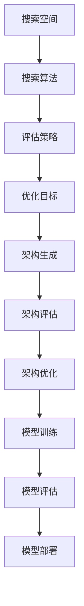

                 

# 《NAS技术在自然语言处理中的实践》

## 关键词

自然语言处理（NLP），神经网络架构搜索（Neural Architecture Search，NAS），自动化机器学习（AutoML），模型优化，情感分析，机器翻译。

## 摘要

本文将深入探讨神经网络架构搜索（NAS）技术在自然语言处理（NLP）领域的应用与实践。首先，我们将介绍NAS技术的基础概念、历史背景及其在NLP中的应用场景。随后，我们将详细阐述自然语言处理的基础知识，包括语言模型、词嵌入和常见NLP任务。接下来，文章将深入剖析NAS技术的原理，包括基本概念、架构和核心算法。在此基础上，我们将展示NAS技术在文本分类、机器翻译和情感分析等NLP任务中的应用案例，详细讲解实现步骤、优化策略以及模型训练与优化过程。最后，文章将总结NAS技术在NLP中的研究成果，展望其未来发展，并列举相关的开源工具与资源。通过本文的阅读，读者将能够全面了解NAS技术在NLP领域的实践与应用，从而为未来的研究与应用提供参考。

## 第一部分：NAS技术基础

### 第1章：NAS技术概述

#### 1.1 NAS技术定义与历史背景

神经网络架构搜索（Neural Architecture Search，NAS）是一种自动化机器学习（AutoML）技术，旨在通过算法自动搜索最佳的神经网络架构。传统的神经网络设计依赖于专家经验和大量实验，而NAS通过优化算法，自动探索和发现性能最优的神经网络架构。

NAS技术最早可以追溯到2016年，由Google的研究人员提出。他们的研究论文《Neural Architecture Search with Reinforcement Learning》提出了一种基于强化学习的NAS方法，通过模拟神经网络架构的设计者，自动探索和评估各种架构，从而找到最优的架构。这一方法的提出引发了学术界和工业界对NAS技术的广泛关注，并推动了一系列相关研究的涌现。

NAS技术的基础概念包括架构空间、搜索策略、评估策略和优化目标。架构空间是指所有可能的神经网络架构的集合，搜索策略是指用于搜索架构空间的算法，评估策略是指用于评估架构性能的方法，优化目标是指搜索过程中要优化的目标，如模型性能、计算效率和训练时间等。

#### 1.2 NAS技术在自然语言处理中的应用场景

NAS技术在自然语言处理（NLP）领域具有广泛的应用前景。由于NLP任务通常需要处理大量文本数据，且不同任务的数据特点和处理需求差异较大，NAS技术可以自动化搜索和优化适合特定任务的神经网络架构，提高模型性能和效率。

具体来说，NAS技术在以下NLP应用场景中具有重要作用：

1. 语言模型：NAS技术可以自动搜索和优化语言模型的结构和参数，提高模型的生成能力和语言理解能力。例如，在生成式对话系统、文本生成和机器翻译等领域，NAS技术可以自动设计适合的语言模型架构，提高生成文本的质量和多样性。

2. 词嵌入：NAS技术可以自动搜索和优化词嵌入模型的架构，提高词嵌入的语义表示能力。词嵌入是NLP任务的重要基础，通过NAS技术优化词嵌入模型，可以更好地捕捉词汇间的语义关系，提高NLP任务的性能。

3. 文本分类：NAS技术可以自动搜索和优化文本分类模型的架构，提高分类准确率和速度。在文本分类任务中，NAS技术可以根据不同的数据集和任务需求，自动设计适合的模型架构，实现高效的分类。

4. 情感分析：NAS技术可以自动搜索和优化情感分析模型的架构，提高情感识别的准确性和鲁棒性。情感分析是NLP中的重要任务，通过NAS技术优化情感分析模型，可以更好地捕捉文本中的情感信息，提高情感识别的准确率。

5. 机器翻译：NAS技术可以自动搜索和优化机器翻译模型的架构，提高翻译质量和效率。在机器翻译任务中，NAS技术可以根据源语言和目标语言的特点，自动设计适合的翻译模型架构，实现高质量的翻译。

总之，NAS技术在自然语言处理领域具有广泛的应用场景和巨大的潜力。通过自动化搜索和优化神经网络架构，NAS技术可以显著提高NLP任务的性能和效率，推动自然语言处理技术的进一步发展。

#### 1.3 NAS技术优势与挑战

NAS技术在自然语言处理（NLP）领域展现出显著的优势，但也面临一定的挑战。以下是NAS技术的几个关键优势：

1. **自动化设计**: NAS技术能够自动搜索和设计最优的神经网络架构，减少了人工设计和调整的时间与工作量。这尤其适用于复杂和大规模的NLP任务，如机器翻译和大规模语言模型训练。

2. **性能提升**: 通过自动化搜索，NAS技术能够发现并采用性能最优的神经网络架构，从而提高模型的性能。这对于提高NLP任务的准确率、响应速度和生成质量具有重要意义。

3. **适应性**: NAS技术可以根据不同的任务需求和数据集特点，自动调整和优化神经网络架构，提高模型的泛化能力和适应性。这有助于解决特定领域和任务中的个性化需求。

然而，NAS技术在实际应用中也面临一些挑战：

1. **计算资源需求**: NAS技术的搜索过程需要大量的计算资源，特别是在大规模数据集和复杂任务场景下。这可能导致搜索过程时间较长，增加计算成本。

2. **搜索空间复杂性**: NAS技术的架构搜索空间通常非常庞大，使得搜索过程变得复杂。如何高效地搜索和评估架构性能是一个重要的挑战。

3. **评估指标选择**: NAS技术的评估策略和优化目标的选择对搜索结果至关重要。选择不当的评估指标可能导致搜索结果偏离实际需求，影响模型性能。

4. **模型解释性**: NAS技术设计的神经网络架构可能具有较高的性能，但其内部结构和操作往往较为复杂，降低了模型的解释性。这在一些需要模型可解释性的应用场景中可能成为问题。

综上所述，NAS技术在自然语言处理领域具有显著的优势，但也面临一些挑战。通过不断优化搜索算法、评估策略和计算资源管理，可以进一步发挥NAS技术的潜力，提高NLP任务的性能和效率。

### 第2章：自然语言处理基础

#### 2.1 语言模型与语言表示

自然语言处理（NLP）的核心任务之一是理解和生成自然语言。语言模型和语言表示是NLP的两个基本概念，它们为处理和理解自然语言提供了基础。

**语言模型** 是一种统计模型，用于预测一段文本序列中下一个单词或词组。语言模型的目的是捕捉自然语言的统计规律，从而生成流畅且符合语言习惯的文本。常见的语言模型包括n元语言模型、循环神经网络（RNN）模型和Transformer模型等。

- **n元语言模型**：基于前n个单词的历史信息，预测下一个单词的概率。这种模型简单但效果有限，无法捕捉长距离依赖关系。
- **循环神经网络（RNN）模型**：通过记忆机制，能够处理长序列数据，但存在梯度消失和梯度爆炸问题，影响训练效果。
- **Transformer模型**：基于自注意力机制，能够捕捉长距离依赖关系，并在大规模数据集上取得了显著的性能提升。

**语言表示** 是将自然语言中的文本转换为计算机可以理解和处理的形式。语言表示的目标是捕捉文本的语义信息，以便于后续的NLP任务处理。

- **词嵌入（Word Embedding）**：将单词映射为低维稠密向量，用于表示单词的语义信息。常见的词嵌入方法包括Word2Vec、GloVe和BERT等。
  - **Word2Vec**：基于神经网络模型，通过上下文预测单词，学习得到单词的向量表示。
  - **GloVe**：基于全局上下文信息，通过矩阵分解方法学习单词的向量表示，能够更好地捕捉词语的语义关系。
  - **BERT**：基于Transformer模型，通过双向编码器学习文本的表示，能够捕捉上下文信息，并生成丰富的语义表示。

- **句子嵌入（Sentence Embedding）**：将句子映射为高维向量，用于表示句子的语义信息。句子嵌入是NLP任务中的重要工具，可用于文本分类、情感分析、问答系统等。

语言模型和语言表示是NLP任务的重要基础。通过语言模型，我们可以生成和预测自然语言，而通过语言表示，我们可以理解和处理自然语言中的语义信息。这些基本概念和技术为NLP任务的实现提供了强大的支持。

#### 2.2 词嵌入与编码

词嵌入（Word Embedding）是将自然语言中的词汇映射为低维稠密向量的一种技术，它在自然语言处理（NLP）任务中扮演着至关重要的角色。词嵌入不仅能够捕捉词汇的语义信息，还能在词汇间建立相似性和距离关系，从而显著提高NLP任务的效果。

**词嵌入的基本原理** 是通过学习词汇在文本中的上下文信息，将每个单词映射为一个固定大小的向量。这些向量通常具有高维稠密特性，使得词汇在向量空间中形成有意义的结构。词嵌入的方法可以分为基于分布的模型和基于神经网络的模型。

- **基于分布的模型**：这种方法通过词汇的共现关系学习词嵌入向量。例如，Word2Vec和GloVe是两种常见的基于分布的词嵌入方法。
  - **Word2Vec**：Word2Vec模型通过构建一个神经网络，输入当前单词和其上下文单词，输出当前单词的嵌入向量。通过优化这个神经网络，使得相似的单词在向量空间中距离较近。Word2Vec模型采用了两种不同的训练方法：连续词袋（CBOW）和Skip-Gram。
    - **连续词袋（CBOW）**：输入当前单词，输出周围多个单词的均值向量。
    - **Skip-Gram**：输入周围多个单词的均值向量，输出当前单词的嵌入向量。
  - **GloVe**：GloVe方法通过全局上下文信息学习词嵌入向量。它利用矩阵分解技术，将词汇和其上下文单词的关系转化为两个矩阵的乘积。通过优化这两个矩阵，使得词汇的向量表示能够更好地捕捉词汇的语义关系。

- **基于神经网络的模型**：这种方法通过神经网络学习词汇的嵌入向量。BERT和Election Transformer是两种常见的基于神经网络的词嵌入方法。
  - **BERT**：BERT（Bidirectional Encoder Representations from Transformers）是一种基于Transformer模型的预训练方法。它通过双向编码器学习文本的表示，使得词汇的嵌入向量能够捕捉到上下文信息。BERT模型的预训练任务包括Masked Language Model（MLM）和Next Sentence Prediction（NSP），通过这些任务学习得到丰富的语义表示。
  - **Electra Transformer**：Electra是一种轻量级的BERT替代方案，通过采用单向Transformer模型，降低计算复杂度和模型参数规模。Electra模型的预训练任务包括Masked Language Model（MLM）和Sequence Classification（SC），能够有效地学习词汇的嵌入向量。

词嵌入在自然语言处理任务中发挥着重要作用，它能够提升文本分类、情感分析、机器翻译等任务的效果。例如，在文本分类任务中，词嵌入向量可以作为特征输入到分类模型中，提高分类模型的准确率；在机器翻译任务中，词嵌入向量可以用于编码源语言和目标语言，实现更准确的翻译结果。

**词嵌入的编码过程** 通常包括以下步骤：

1. **词表构建**：构建词汇表，将文本中的所有单词映射为唯一的索引。
2. **词嵌入学习**：通过训练词嵌入模型，学习得到词汇的嵌入向量。
3. **向量拼接**：将文本中的每个单词的嵌入向量拼接起来，形成文本的向量表示。
4. **特征提取**：将文本的向量表示输入到后续的NLP任务模型中，进行特征提取和预测。

词嵌入与编码是自然语言处理任务的基础，通过学习词汇的嵌入向量，我们可以更好地理解和处理自然语言中的语义信息。随着词嵌入技术的不断发展，NLP任务的效果也在不断提高，为自然语言处理的应用场景提供了更加丰富和有效的解决方案。

#### 2.3 自然语言处理常见任务

自然语言处理（NLP）领域涵盖了多种常见任务，这些任务在文本数据理解和生成方面发挥着重要作用。以下介绍几种典型的NLP任务，并简要说明它们的定义、目标和应用场景。

1. **文本分类（Text Classification）**：

- **定义**：文本分类是指将文本数据按照预定的类别进行分类的过程。
- **目标**：识别文本所属的类别标签，如新闻文章的分类、情感极性分类等。
- **应用场景**：新闻分类、垃圾邮件过滤、社交媒体情感分析等。

2. **情感分析（Sentiment Analysis）**：

- **定义**：情感分析旨在识别文本中的情感倾向，判断文本是正面、负面还是中立。
- **目标**：判断文本表达的情感极性，如评论的情感极性标注、微博情绪分析等。
- **应用场景**：市场调研、产品评论分析、社交媒体情绪监测等。

3. **命名实体识别（Named Entity Recognition，NER）**：

- **定义**：命名实体识别是指识别文本中的命名实体，如人名、地名、组织名等。
- **目标**：将文本中的命名实体标注出来，如从文本中提取出所有的人名、地点等。
- **应用场景**：信息抽取、关系提取、知识图谱构建等。

4. **问答系统（Question Answering，QA）**：

- **定义**：问答系统是指根据用户提出的问题，从文本数据中自动生成答案的系统。
- **目标**：自动生成准确的答案，满足用户的信息需求。
- **应用场景**：智能客服、在线教育、搜索引擎等。

5. **机器翻译（Machine Translation）**：

- **定义**：机器翻译是指使用计算机程序将一种自然语言翻译成另一种自然语言。
- **目标**：生成高质量、自然的翻译结果，保留原文的语义和风格。
- **应用场景**：跨语言沟通、国际商务、全球化内容分发等。

6. **文本生成（Text Generation）**：

- **定义**：文本生成是指根据给定输入，自动生成相应的文本内容。
- **目标**：生成流畅、有意义的文本，满足特定场景的需求。
- **应用场景**：聊天机器人、自动摘要、创意写作等。

这些常见任务构成了NLP领域的基础，为各类实际应用提供了技术支持。通过不断优化和改进这些任务的处理方法，NLP技术正逐步实现更智能、更高效的自然语言理解和生成。

### 第3章：NAS技术原理

#### 3.1 NAS技术基本概念

神经网络架构搜索（Neural Architecture Search，NAS）是一种自动化机器学习（AutoML）技术，旨在通过算法自动搜索最优的神经网络架构。NAS技术的核心目标是通过搜索过程发现具有最佳性能的神经网络结构，从而提高机器学习模型的性能和效率。

**架构搜索空间** 是NAS技术的关键概念之一。架构搜索空间是指所有可能的神经网络架构的集合，包括网络层的种类、数量、连接方式、激活函数等。一个有效的架构搜索空间应当能够涵盖广泛的架构，以便搜索算法能够探索到可能的最优架构。

**搜索策略** 是NAS技术中用于在架构搜索空间中搜索最优架构的方法。常见的搜索策略包括基于强化学习（Reinforcement Learning）的策略、基于遗传算法（Genetic Algorithm）的策略和基于贝叶斯优化（Bayesian Optimization）的策略等。这些策略通过不断评估和选择不同的架构，逐步收敛到性能最优的架构。

**评估策略** 是NAS技术中用于评估架构性能的方法。评估策略决定了如何对搜索到的架构进行性能评估，通常涉及在训练数据集和验证数据集上的表现。一个有效的评估策略应当能够准确地反映架构的实际性能，同时避免过拟合。

**优化目标** 是NAS技术中要优化的目标函数，通常包括模型性能、计算效率和训练时间等。优化目标决定了搜索过程中要追求的最终目标，不同的优化目标可能导致不同的搜索策略和评估策略。

**架构生成** 是NAS技术中的一个关键步骤，涉及从架构搜索空间中生成新的神经网络架构。常见的架构生成方法包括基于模板的生成、基于神经网络的生成和基于进化算法的生成等。

**架构评估** 是NAS技术中对生成的神经网络架构进行性能评估的过程。架构评估通常在训练数据集和验证数据集上进行，以评估架构在不同数据集上的性能。评估结果用于指导搜索策略选择下一步的搜索方向。

**架构优化** 是NAS技术中用于优化生成的神经网络架构的过程。架构优化可能包括调整网络层参数、优化连接方式、调整激活函数等，以进一步提高架构的性能。优化过程通常基于评估策略提供的性能反馈，通过迭代优化达到最佳性能。

总之，NAS技术的基本概念包括架构搜索空间、搜索策略、评估策略、优化目标和架构生成与评估等。这些概念共同构成了NAS技术的核心框架，为自动化搜索最优神经网络架构提供了理论基础和实践指导。

#### 3.2 NAS技术架构

NAS技术的架构可以分为以下几个主要组成部分：搜索空间、搜索算法、评估策略和优化目标。每个部分在NAS过程中扮演着不同的角色，共同协作实现神经网络架构的自动搜索与优化。

**1. 搜索空间（Search Space）**

搜索空间是NAS技术的核心，它定义了所有可能的神经网络架构。搜索空间通常包括以下要素：

- **层（Layers）**：包括卷积层、全连接层、池化层、激活函数层等。
- **连接方式（Connection Patterns）**：如前馈连接、跳连接（Skip Connections）等。
- **操作（Operations）**：如卷积操作、池化操作、激活函数等。
- **层间变换（Layer Transformations）**：如层的添加、删除、替换等。

一个有效的搜索空间应当足够丰富，涵盖各种可能的架构，以便搜索算法能够探索到最优架构。同时，搜索空间也不应过于复杂，以避免搜索效率低下。

**2. 搜索算法（Search Algorithm）**

搜索算法是NAS技术的核心组件，负责在搜索空间中寻找最优的神经网络架构。常见的搜索算法包括以下几种：

- **基于强化学习的搜索算法（Reinforcement Learning-based Algorithms）**：这类算法通过模拟神经网络架构的设计者，使用奖励机制来评估和选择不同的架构。强化学习算法如Q-learning、DQN（Deep Q-Network）等被广泛应用于NAS。
- **基于遗传算法的搜索算法（Genetic Algorithm-based Algorithms）**：遗传算法模拟生物进化的过程，通过交叉、变异等操作在搜索空间中生成新的架构。遗传算法在NAS中具有较高的搜索效率和适应性。
- **基于贝叶斯优化的搜索算法（Bayesian Optimization-based Algorithms）**：贝叶斯优化通过概率模型对搜索空间中的架构进行评估，利用概率模型预测下一个搜索位置，逐步逼近最优架构。

**3. 评估策略（Evaluation Strategy）**

评估策略决定了如何对生成的神经网络架构进行性能评估。有效的评估策略应具备以下特点：

- **准确性（Accuracy）**：评估模型在训练数据集和验证数据集上的性能，包括精度、召回率和F1分数等指标。
- **泛化能力（Generalization）**：评估模型在未见过的数据上的表现，以防止过拟合。
- **计算效率（Computational Efficiency）**：评估模型的计算复杂度和训练时间，以平衡性能和资源消耗。

常用的评估策略包括交叉验证、网格搜索和贝叶斯优化等。评估策略的选择直接影响搜索结果的质量和效率。

**4. 优化目标（Optimization Objective）**

优化目标是NAS技术追求的最终目标，决定了搜索过程中的重点和方向。优化目标通常包括以下方面：

- **模型性能（Model Performance）**：例如，分类任务的准确率、回归任务的均方误差（Mean Squared Error，MSE）等。
- **计算效率（Computational Efficiency）**：包括模型的参数数量、计算复杂度和训练时间等。
- **资源消耗（Resource Consumption）**：如内存占用、能耗等。

优化目标的设定需结合实际应用场景和需求，确保搜索算法能够在满足性能要求的同时，降低计算资源消耗。

**5. 架构生成与优化**

NAS技术的架构生成与优化过程通常包括以下几个步骤：

- **初始化**：在搜索空间中随机生成初始架构。
- **评估**：使用评估策略对生成的架构进行性能评估。
- **选择与更新**：根据评估结果选择表现较好的架构，并对其进行优化，如调整层间连接、激活函数等。
- **迭代**：重复评估和优化过程，逐步逼近最优架构。

通过上述组件的协同工作，NAS技术能够在大量可能的神经网络架构中自动搜索和优化出性能最优的架构，从而提高机器学习模型的性能和效率。

#### 3.3 NAS技术核心算法

神经网络架构搜索（NAS）技术的核心算法包括基于强化学习、基于遗传算法和基于贝叶斯优化的方法。这些算法在NAS过程中扮演着关键角色，通过不同的策略在庞大的架构搜索空间中搜索最优的网络结构。

**1. 基于强化学习的NAS方法**

基于强化学习的NAS方法通过模拟人类设计者选择架构的过程，利用奖励机制来优化搜索。强化学习算法的核心是智能体（Agent），它通过与环境（Search Space）的交互来学习最优策略。

- **Q-learning算法**：Q-learning是一种基于值函数的强化学习算法。在NAS中，智能体（Agent）会根据当前状态（架构）和动作（架构选择）更新Q值，选择具有最大Q值的动作以最大化长期奖励。Q-learning算法的主要步骤如下：
  1. 初始化Q值表，随机选择初始架构。
  2. 对于每个步骤，根据当前状态选择动作，执行动作并获取奖励。
  3. 更新Q值表：\(Q(s, a) \leftarrow Q(s, a) + \alpha [r + \gamma \max_{a'} Q(s', a') - Q(s, a)]\)，其中\(s\)是当前状态，\(a\)是当前动作，\(r\)是奖励，\(\alpha\)是学习率，\(\gamma\)是折扣因子。

- **Deep Q-Network (DQN)算法**：DQN是Q-learning的扩展，使用深度神经网络来近似Q值函数。DQN的主要步骤如下：
  1. 使用经验 replay 缓存来存储和随机采样历史经验。
  2. 通过深度神经网络预测Q值：\(Q(s, a) = \text{NN}(s, a)\)。
  3. 使用梯度下降优化神经网络参数，最小化损失函数：\(L = (r + \gamma \max_{a'} \text{NN}(s', a') - \text{NN}(s, a))^2\)。

**2. 基于遗传算法的NAS方法**

基于遗传算法（Genetic Algorithm，GA）的NAS方法通过模拟自然进化过程来搜索最优架构。遗传算法的主要操作包括选择、交叉、变异和评估。

- **选择（Selection）**：选择适应度较高的个体进行繁殖，以保持种群的多样性。
- **交叉（Crossover）**：将两个父代的架构进行部分交换，生成新的子代架构。
- **变异（Mutation）**：对个体架构进行随机修改，如添加或删除层，以探索新的架构。
- **评估（Evaluation）**：使用评估策略对架构的性能进行评估。

遗传算法的主要步骤如下：
1. 初始化种群，每个个体代表一个可能的架构。
2. 计算种群中每个个体的适应度，通常基于性能指标如准确率或计算效率。
3. 选择适应度较高的个体进行交叉和变异，生成新的子代。
4. 评估子代个体的性能，选择最优的个体进行下一代种群的初始化。

**3. 基于贝叶斯优化的NAS方法**

基于贝叶斯优化的NAS方法通过构建概率模型来指导搜索过程，以最大化性能指标的概率分布。贝叶斯优化结合了先验知识和历史数据，预测下一个搜索位置，并逐步逼近最优解。

- **贝叶斯优化框架**：贝叶斯优化使用一个概率模型（如高斯过程回归）来预测性能指标的概率分布。在每次迭代中，优化算法根据当前数据选择下一个搜索位置，以最大化性能指标的概率分布。

贝叶斯优化的主要步骤如下：
1. 初始化先验模型，如高斯过程回归模型。
2. 根据先验模型选择下一个搜索位置，通常使用最大化性能指标概率分布的方法。
3. 在新的搜索位置执行实验，收集数据并更新先验模型。
4. 重复步骤2和3，直到达到预定的性能目标或搜索预算。

通过这些核心算法，NAS技术能够在复杂的架构搜索空间中高效地搜索最优的网络结构。基于强化学习的方法通过模拟人类设计者的决策过程，能够探索复杂的架构空间；基于遗传算法的方法通过模拟生物进化过程，具有鲁棒性和适应性；基于贝叶斯优化的方法通过概率模型和先验知识，能够高效地收敛到最优解。这些算法为NAS技术在自然语言处理和其他领域的应用提供了强大的技术支持。

### 第4章：NAS技术在自然语言处理中的应用

#### 4.1 NAS在文本分类中的应用

神经网络架构搜索（NAS）技术在文本分类任务中展现出显著的优势，通过自动搜索和优化神经网络架构，提高了文本分类的准确率和效率。文本分类是指将文本数据按照预定的类别进行分类的过程，广泛用于新闻分类、情感分析、垃圾邮件过滤等应用场景。

**1. 应用场景**

文本分类任务通常需要处理大规模的文本数据，且不同数据集和任务需求差异较大。NAS技术可以通过自动搜索和优化神经网络架构，为不同任务和数据集提供最佳模型，提高分类准确率和响应速度。

- **新闻分类**：在新闻分类任务中，NAS技术可以自动搜索和优化分类模型，提高新闻文本的归类准确率，有助于信息过滤和推荐系统。
- **情感分析**：在情感分析任务中，NAS技术可以自动设计适合情感分类的神经网络架构，提高情感识别的准确性和鲁棒性，有助于情感监控和用户反馈分析。
- **垃圾邮件过滤**：在垃圾邮件过滤任务中，NAS技术可以自动搜索和优化分类模型，提高对垃圾邮件的识别准确率，降低误判率。

**2. 实现步骤**

NAS技术在文本分类中的应用通常包括以下步骤：

- **数据预处理**：首先对文本数据集进行预处理，包括分词、去除停用词、词性标注等。预处理步骤旨在将文本数据转换为计算机可以理解的格式。
- **词嵌入**：将预处理后的文本数据转换为词嵌入向量，用于表示文本的语义信息。常用的词嵌入方法包括Word2Vec、GloVe和BERT等。
- **架构搜索**：在NAS过程中，定义搜索空间，包括网络层的种类、连接方式、激活函数等。然后使用NAS算法（如强化学习、遗传算法、贝叶斯优化等）在搜索空间中自动搜索最优的神经网络架构。
- **模型训练**：使用搜索到的最优架构训练分类模型，在训练数据集上进行训练，并在验证数据集上进行性能评估。
- **模型优化**：通过调整网络参数和架构，进一步优化模型性能。优化策略可以基于评估策略提供的结果，采用梯度下降、随机搜索等方法进行优化。
- **模型部署**：将训练好的模型部署到实际应用场景中，进行文本分类任务。在实际应用中，可以对模型进行定期更新和优化，以适应不断变化的数据和需求。

**3. 优化策略**

NAS技术在文本分类中的应用中，优化策略的选择对模型性能有重要影响。以下是一些常见的优化策略：

- **基于强化学习的优化策略**：使用强化学习算法（如Q-learning、DQN等）在搜索空间中自动搜索最优架构，并通过奖励机制进行优化。
- **基于遗传算法的优化策略**：使用遗传算法（如选择、交叉、变异等）在搜索空间中生成和评估新的架构，逐步逼近最优解。
- **基于贝叶斯优化的优化策略**：使用贝叶斯优化算法（如高斯过程回归等）在搜索空间中预测下一个最优架构，并逐步优化模型性能。

通过上述步骤和优化策略，NAS技术在文本分类任务中能够自动搜索和优化神经网络架构，提高分类准确率和效率。在实际应用中，NAS技术可以根据不同的任务和数据集特点，灵活调整搜索策略和优化方法，实现高性能的文本分类模型。

#### 4.2 NAS在机器翻译中的应用

机器翻译是自然语言处理（NLP）领域中的一项重要任务，旨在将一种自然语言翻译成另一种自然语言。随着深度学习技术的发展，基于神经网络的机器翻译方法在性能上取得了显著的提升。神经网络架构搜索（NAS）技术的引入，进一步推动了机器翻译模型的优化与改进。

**1. 应用场景**

NAS技术在机器翻译中的应用涵盖了多种场景，包括跨语言文本生成、多语言翻译系统、实时翻译服务等。具体应用场景如下：

- **跨语言文本生成**：在多语言文本生成任务中，NAS技术可以自动搜索和优化神经网络架构，提高文本生成的质量与多样性。例如，在多语言新闻生成、多语言问答系统等场景中，NAS技术能够帮助生成流畅、自然的跨语言文本。
- **多语言翻译系统**：在多语言翻译系统中，NAS技术可以根据不同语言的特性和翻译需求，自动设计适合的神经网络架构，提高翻译质量和效率。例如，在大型跨国企业、国际会议等场景中，NAS技术可以提供高效的实时翻译服务。
- **实时翻译服务**：在实时翻译服务中，NAS技术通过优化神经网络架构，提高翻译速度和准确率，满足用户对实时沟通的需求。例如，在手机翻译应用、视频会议翻译等场景中，NAS技术能够提供流畅、准确的翻译结果。

**2. 实现步骤**

NAS技术在机器翻译中的应用主要包括以下步骤：

- **数据预处理**：首先对机器翻译数据集进行预处理，包括数据清洗、文本对齐、词表构建等。预处理步骤旨在将原始文本数据转换为适合机器翻译模型处理的格式。
- **编码器与解码器设计**：设计编码器和解码器，用于将源语言文本编码为高维向量表示，并将目标语言向量解码为翻译结果。在NAS过程中，编码器和解码器的架构可以通过NAS算法自动搜索和优化。
- **架构搜索**：在NAS过程中，定义搜索空间，包括编码器和解码器的网络结构、层间连接、激活函数等。使用NAS算法（如强化学习、遗传算法、贝叶斯优化等）在搜索空间中自动搜索最优的神经网络架构。
- **模型训练**：使用搜索到的最优架构训练机器翻译模型，在训练数据集上进行训练，并在验证数据集上进行性能评估。模型训练过程中，可以采用迁移学习、注意力机制等技术，提高翻译质量和效率。
- **模型优化**：通过调整网络参数和架构，进一步优化模型性能。优化策略可以基于评估策略提供的结果，采用梯度下降、随机搜索等方法进行优化。
- **模型部署**：将训练好的模型部署到实际应用场景中，进行机器翻译任务。在实际应用中，可以对模型进行定期更新和优化，以适应不断变化的数据和需求。

**3. 优化策略**

NAS技术在机器翻译中的应用中，优化策略的选择对模型性能有重要影响。以下是一些常见的优化策略：

- **基于强化学习的优化策略**：使用强化学习算法（如Q-learning、DQN等）在搜索空间中自动搜索最优架构，并通过奖励机制进行优化。强化学习算法能够处理复杂的搜索空间，提高搜索效率和准确性。
- **基于遗传算法的优化策略**：使用遗传算法（如选择、交叉、变异等）在搜索空间中生成和评估新的架构，逐步逼近最优解。遗传算法在处理大规模搜索空间时具有较高的鲁棒性和适应性。
- **基于贝叶斯优化的优化策略**：使用贝叶斯优化算法（如高斯过程回归等）在搜索空间中预测下一个最优架构，并逐步优化模型性能。贝叶斯优化结合了先验知识和历史数据，能够高效地收敛到最优解。

通过上述步骤和优化策略，NAS技术在机器翻译任务中能够自动搜索和优化神经网络架构，提高翻译质量和效率。在实际应用中，NAS技术可以根据不同的翻译需求和场景特点，灵活调整搜索策略和优化方法，实现高性能的机器翻译模型。

#### 4.3 NAS在情感分析中的应用

情感分析（Sentiment Analysis）是自然语言处理（NLP）领域的一项重要任务，旨在从文本中识别和分类情感极性，如正面、负面或中性。随着深度学习技术的发展，基于神经网络的情感分析模型在性能上取得了显著的提升。神经网络架构搜索（NAS）技术的引入，为情感分析模型的优化与改进提供了新的思路。

**1. 应用场景**

NAS技术在情感分析中的应用涵盖了多个领域，包括社交媒体情感分析、产品评论情感分析、舆情监测等。具体应用场景如下：

- **社交媒体情感分析**：在社交媒体平台（如微博、推特等）上，用户经常发表对事件、产品或服务的观点和情感。NAS技术可以自动搜索和优化情感分析模型，帮助平台实现实时情感监控和情感分类，提供个性化推荐和用户反馈分析。
- **产品评论情感分析**：在线电商平台通常需要对用户评论进行情感分析，以了解用户对产品满意度。NAS技术可以自动设计适合情感分类的神经网络架构，提高评论情感识别的准确率和效率，为电商平台提供数据支持。
- **舆情监测**：在新闻媒体、政府机构等领域，舆情监测是一项重要的任务。NAS技术可以自动搜索和优化情感分析模型，实时监测和识别舆论倾向，为决策提供参考。

**2. 实现步骤**

NAS技术在情感分析中的应用主要包括以下步骤：

- **数据预处理**：首先对情感分析数据集进行预处理，包括文本清洗、分词、去除停用词、词性标注等。预处理步骤旨在将原始文本数据转换为适合机器学习模型处理的格式。
- **词嵌入**：将预处理后的文本数据转换为词嵌入向量，用于表示文本的语义信息。常用的词嵌入方法包括Word2Vec、GloVe和BERT等。
- **架构搜索**：在NAS过程中，定义搜索空间，包括网络层的种类、连接方式、激活函数等。使用NAS算法（如强化学习、遗传算法、贝叶斯优化等）在搜索空间中自动搜索最优的神经网络架构。
- **模型训练**：使用搜索到的最优架构训练情感分析模型，在训练数据集上进行训练，并在验证数据集上进行性能评估。模型训练过程中，可以采用迁移学习、注意力机制等技术，提高情感分类的准确性和鲁棒性。
- **模型优化**：通过调整网络参数和架构，进一步优化模型性能。优化策略可以基于评估策略提供的结果，采用梯度下降、随机搜索等方法进行优化。
- **模型部署**：将训练好的模型部署到实际应用场景中，进行情感分析任务。在实际应用中，可以对模型进行定期更新和优化，以适应不断变化的数据和需求。

**3. 优化策略**

NAS技术在情感分析中的应用中，优化策略的选择对模型性能有重要影响。以下是一些常见的优化策略：

- **基于强化学习的优化策略**：使用强化学习算法（如Q-learning、DQN等）在搜索空间中自动搜索最优架构，并通过奖励机制进行优化。强化学习算法能够处理复杂的搜索空间，提高搜索效率和准确性。
- **基于遗传算法的优化策略**：使用遗传算法（如选择、交叉、变异等）在搜索空间中生成和评估新的架构，逐步逼近最优解。遗传算法在处理大规模搜索空间时具有较高的鲁棒性和适应性。
- **基于贝叶斯优化的优化策略**：使用贝叶斯优化算法（如高斯过程回归等）在搜索空间中预测下一个最优架构，并逐步优化模型性能。贝叶斯优化结合了先验知识和历史数据，能够高效地收敛到最优解。

通过上述步骤和优化策略，NAS技术在情感分析任务中能够自动搜索和优化神经网络架构，提高情感分类的准确率和效率。在实际应用中，NAS技术可以根据不同的任务需求和场景特点，灵活调整搜索策略和优化方法，实现高性能的情感分析模型。

### 第5章：NAS技术实现与优化

#### 5.1 NAS技术实现步骤

神经网络架构搜索（NAS）技术的实现步骤主要包括数据预处理、架构搜索、模型训练与优化、性能评估和模型部署等。以下将详细描述这些步骤，并说明每一环节的具体操作和注意事项。

**1. 数据预处理**

数据预处理是NAS技术实现的第一步，其质量直接影响后续搜索和训练的效果。具体操作包括以下步骤：

- **数据收集**：收集用于NAS的原始数据集，可以是文本、图像或音频等。对于文本数据，可以选择公开的文本分类数据集（如IMDB电影评论、Twitter情感分析数据集等）；对于图像数据，可以选择CIFAR-10、ImageNet等。
- **文本预处理**：如果数据集是文本数据，需要进行分词、去除停用词、词性标注等预处理操作。可以使用自然语言处理工具（如NLTK、spaCy等）进行文本清洗。
- **数据转换**：将预处理后的文本转换为词嵌入向量，可以采用预训练的词嵌入模型（如Word2Vec、GloVe、BERT等）。对于图像数据，可以使用卷积神经网络（CNN）进行特征提取。
- **数据集划分**：将数据集划分为训练集、验证集和测试集，用于后续的架构搜索、模型训练和性能评估。

**2. 架构搜索**

架构搜索是NAS技术的核心步骤，涉及在搜索空间中寻找最优的神经网络架构。具体操作包括以下步骤：

- **定义搜索空间**：根据任务需求，定义搜索空间，包括网络层的种类（如卷积层、全连接层、循环层等）、连接方式（如前馈连接、跳连接等）、操作（如卷积操作、池化操作等）。搜索空间的设计应考虑模型的可扩展性和搜索效率。
- **选择搜索算法**：选择适合的搜索算法，如基于强化学习的搜索算法（如REINFORCE、DQN等）、基于遗传算法的搜索算法（如遗传算法、遗传策略搜索等）或基于贝叶斯优化的搜索算法（如 Bayesian Optimization、ROBUST-NAS等）。
- **架构生成与评估**：在搜索空间中生成新的神经网络架构，并通过评估策略（如交叉验证、F1分数等）对架构进行性能评估。根据评估结果，选择表现较好的架构进行进一步优化。

**3. 模型训练与优化**

在架构搜索的基础上，使用最优架构进行模型训练与优化，具体操作包括以下步骤：

- **模型初始化**：初始化神经网络模型，可以采用预训练的权重或随机初始化。对于NAS技术，通常需要初始化多个架构，并进行比较。
- **模型训练**：在训练集上使用训练算法（如随机梯度下降、Adam优化器等）对模型进行训练。在训练过程中，可以采用数据增强、正则化等技术防止过拟合。
- **模型优化**：根据评估策略提供的结果，对模型进行优化。优化策略可以包括调整学习率、优化网络结构、参数微调等。
- **验证与测试**：在验证集和测试集上评估模型性能，选择性能最优的模型进行后续应用。

**4. 性能评估**

性能评估是NAS技术实现的重要环节，用于验证模型在不同数据集上的表现。具体操作包括以下步骤：

- **评估指标**：选择合适的评估指标，如准确率、召回率、F1分数等，用于衡量模型性能。对于图像任务，还可以使用Inception Score（IS）、Frechet Inception Distance（FID）等指标。
- **交叉验证**：在验证集上使用交叉验证方法，对模型进行多次评估，以避免过拟合和评估偏差。
- **测试集评估**：在测试集上评估模型性能，以验证模型在未见过的数据上的表现。

**5. 模型部署**

模型部署是将训练好的模型应用到实际任务中的过程。具体操作包括以下步骤：

- **模型保存**：将训练好的模型保存为模型文件，以便后续使用。
- **模型加载**：在应用场景中加载模型，进行预测和推理操作。
- **性能监控**：对模型进行性能监控和优化，确保模型在应用中的稳定性和高效性。

**注意事项**

- **数据质量**：数据预处理的质量直接影响模型性能，应确保数据集的多样性和质量。
- **搜索空间设计**：合理设计搜索空间，既要涵盖丰富的架构，又要避免搜索空间过于复杂，影响搜索效率。
- **评估策略**：选择合适的评估策略，确保模型性能的准确性和可靠性。
- **计算资源**：NAS技术通常需要大量的计算资源，应合理分配计算资源，确保搜索和训练过程的顺利进行。

通过上述步骤和注意事项，NAS技术可以在自然语言处理、计算机视觉等领域实现高效的神经网络架构搜索与优化，提高模型性能和应用效果。

#### 5.2 NAS技术优化策略

在神经网络架构搜索（NAS）过程中，优化策略的选择对搜索效率和模型性能至关重要。以下介绍几种常见的NAS优化策略，包括基于强化学习、遗传算法和贝叶斯优化的方法，并讨论它们在NAS中的应用效果。

**1. 基于强化学习的优化策略**

基于强化学习的NAS方法通过模拟人类设计者选择架构的过程，使用奖励机制来优化搜索。强化学习算法的核心是智能体（Agent），它通过与环境（Search Space）的交互来学习最优策略。

- **Q-learning算法**：Q-learning是一种基于值函数的强化学习算法。在NAS中，智能体（Agent）会根据当前状态（架构）和动作（架构选择）更新Q值，选择具有最大Q值的动作以最大化长期奖励。Q-learning算法的主要步骤如下：
  1. 初始化Q值表，随机选择初始架构。
  2. 对于每个步骤，根据当前状态选择动作，执行动作并获取奖励。
  3. 更新Q值表：\(Q(s, a) \leftarrow Q(s, a) + \alpha [r + \gamma \max_{a'} Q(s', a') - Q(s, a)]\)，其中\(s\)是当前状态，\(a\)是当前动作，\(r\)是奖励，\(\alpha\)是学习率，\(\gamma\)是折扣因子。

- **Deep Q-Network (DQN)算法**：DQN是Q-learning的扩展，使用深度神经网络来近似Q值函数。DQN的主要步骤如下：
  1. 使用经验 replay 缓存来存储和随机采样历史经验。
  2. 通过深度神经网络预测Q值：\(Q(s, a) = \text{NN}(s, a)\)。
  3. 使用梯度下降优化神经网络参数，最小化损失函数：\(L = (r + \gamma \max_{a'} \text{NN}(s', a') - \text{NN}(s, a))^2\)。

强化学习算法在NAS中具有以下优点：

- **灵活性和适应性**：强化学习算法能够处理复杂的搜索空间，适应不同的任务和数据集。
- **自适应性**：智能体可以根据环境变化调整搜索策略，逐步优化搜索过程。

然而，强化学习算法也存在一些挑战，如收敛速度慢、需要大量的训练数据等。针对这些挑战，研究人员提出了改进的方法，如采用深度强化学习（Deep Reinforcement Learning）和元学习（Meta Learning）等技术。

**2. 基于遗传算法的优化策略**

基于遗传算法（Genetic Algorithm，GA）的NAS方法通过模拟生物进化过程来搜索最优架构。遗传算法的主要操作包括选择、交叉、变异和评估。

- **选择（Selection）**：选择适应度较高的个体进行繁殖，以保持种群的多样性。
- **交叉（Crossover）**：将两个父代的架构进行部分交换，生成新的子代架构。
- **变异（Mutation）**：对个体架构进行随机修改，如添加或删除层，以探索新的架构。
- **评估（Evaluation）**：使用评估策略对架构的性能进行评估。

遗传算法在NAS中的应用效果：

- **鲁棒性**：遗传算法具有较强的鲁棒性，能够处理复杂的搜索空间和大规模数据集。
- **适应性**：遗传算法能够通过交叉和变异操作，探索新的架构空间，提高搜索效率。

遗传算法在NAS中也存在一些缺点，如搜索过程可能收敛到局部最优、需要较长的训练时间等。为了解决这些问题，研究人员提出了改进的方法，如使用多目标遗传算法（Multi-Objective Genetic Algorithm）和混合算法（Hybrid Algorithms）等。

**3. 基于贝叶斯优化的优化策略**

基于贝叶斯优化的NAS方法通过构建概率模型来指导搜索过程，以最大化性能指标的概率分布。贝叶斯优化结合了先验知识和历史数据，能够高效地收敛到最优解。

- **贝叶斯优化框架**：贝叶斯优化使用一个概率模型（如高斯过程回归）来预测性能指标的概率分布。在每次迭代中，优化算法根据当前数据选择下一个搜索位置，以最大化性能指标的概率分布。

贝叶斯优化在NAS中的应用效果：

- **高效性**：贝叶斯优化结合了先验知识和历史数据，能够在较少的实验次数下找到最优解，提高搜索效率。
- **可扩展性**：贝叶斯优化方法适用于各种任务和数据集，具有较强的可扩展性。

贝叶斯优化也存在一些挑战，如需要较多的计算资源和先验知识，以及预测模型的选择和调参等。

综上所述，NAS技术的优化策略包括基于强化学习、遗传算法和贝叶斯优化的方法。每种策略都有其独特的优势和挑战，研究人员可以通过结合多种策略，优化NAS搜索过程，提高模型性能和搜索效率。

#### 5.3 NAS技术在资源受限环境中的应用

在资源受限的环境中，如移动设备、嵌入式系统和边缘计算设备，NAS技术的应用面临特定的挑战和需求。为了在这些环境中有效应用NAS技术，研究人员和开发者需要考虑以下几个关键因素：

**1. 硬件优化**

资源受限的环境通常具有较低的算力、存储空间和功耗限制。因此，NAS技术的实现需要针对硬件特性进行优化。

- **计算效率**：优化NAS算法，减少计算复杂度。例如，采用低精度计算（如FP16或FP32代替FP64）可以显著减少计算资源消耗。
- **内存管理**：减少内存占用，优化数据结构和算法，避免内存溢出和频繁的内存分配。
- **能耗优化**：降低模型的功耗，采用能耗优化的算法和硬件加速技术（如GPU、TPU等），以延长设备的续航时间。

**2. 模型压缩**

在资源受限的环境中，模型的压缩和剪枝尤为重要。通过模型压缩，可以将模型参数规模和计算复杂度减少，从而降低对计算资源和存储空间的需求。

- **权重剪枝**：通过删除冗余的模型权重，减少模型参数规模。剪枝方法包括结构剪枝和权重剪枝。
- **量化**：将模型的浮点数权重转换为低精度格式（如INT8），减少内存和计算资源消耗。
- **知识蒸馏**：使用一个大型模型（教师模型）训练一个小型模型（学生模型），将大型模型的知识和经验传递给小型模型。

**3. 分层架构**

采用分层架构，将模型分解为多个层次，可以在资源受限的环境中实现更灵活的资源分配和管理。

- **层次分离**：将计算密集的部分和资源消耗较少的部分分离，可以在有限的资源下实现更高的性能。
- **动态调度**：根据任务的需求和硬件资源的变化，动态调整模型的层次和执行顺序，以优化资源利用。

**4. 微服务架构**

在资源受限的环境中，采用微服务架构可以将复杂的任务分解为多个小型服务，每个服务可以独立部署和优化。

- **模块化设计**：将模型和算法分解为独立的模块，每个模块可以独立开发和优化，降低系统的复杂度和资源需求。
- **服务组合**：通过组合不同的微服务，实现复杂的NLP任务，同时确保每个服务的性能和资源效率。

**5. 模型更新和迁移**

在资源受限的环境中，模型的更新和迁移策略对NAS技术的应用至关重要。

- **增量学习**：在有限资源下，通过增量学习更新模型，避免重新训练整个模型。
- **迁移学习**：利用预训练模型和迁移学习技术，将知识从资源丰富的环境迁移到资源受限的环境，提高模型在受限环境中的性能。

综上所述，NAS技术在资源受限环境中的应用需要综合考虑硬件优化、模型压缩、分层架构、微服务架构和模型更新迁移等多个方面。通过合理的优化策略和架构设计，NAS技术可以在资源受限的环境中实现高效的自然语言处理，满足实际应用的需求。

### 第二部分：案例研究

#### 第6章：案例一：NAS技术在情感分析中的应用

情感分析是自然语言处理（NLP）领域的一项重要任务，旨在从文本中识别和分类情感极性，如正面、负面或中性。在本案例中，我们将探讨如何使用神经网络架构搜索（NAS）技术在情感分析任务中自动搜索和优化模型架构，以提高分类准确率和效率。

#### 6.1 案例背景

随着社交媒体和电子商务的普及，用户在平台上的评论和反馈已成为企业了解用户情感的重要途径。情感分析技术可以帮助企业实时监测用户情感，优化产品和服务。然而，情感分析任务通常涉及大量的文本数据，且不同数据集和任务需求差异较大，使得传统手工设计的神经网络架构难以满足不同场景的需求。

本案例选择了一个公开的情感分析数据集——IMDB电影评论数据集，该数据集包含了25,000条电影评论，分为正面和负面两类。我们的目标是使用NAS技术自动搜索和优化神经网络架构，提高情感分析模型的准确率和效率。

#### 6.2 数据预处理

数据预处理是情感分析任务的重要步骤，其质量直接影响模型的性能。以下是数据预处理的具体步骤：

1. **数据集划分**：将IMDB数据集划分为训练集（70%）、验证集（15%）和测试集（15%）。
2. **文本清洗**：去除评论中的HTML标签、特殊字符和停用词。使用自然语言处理工具（如NLTK、spaCy等）进行文本清洗。
3. **词嵌入**：使用预训练的Word2Vec或GloVe模型对评论进行词嵌入，将文本转换为向量表示。
4. **序列填充**：将不同长度的评论序列填充为相同的长度，便于输入神经网络模型。

#### 6.3 NAS模型设计

在NAS模型设计中，我们需要定义搜索空间和评估策略，并选择合适的NAS算法。以下是具体步骤：

1. **搜索空间定义**：根据情感分析任务的需求，定义搜索空间，包括网络层的种类（如卷积层、全连接层、循环层等）、连接方式（如前馈连接、跳连接等）、操作（如卷积操作、池化操作等）和层间变换（如层的添加、删除、替换等）。
2. **NAS算法选择**：选择基于强化学习的NAS算法，如REINFORCE或DQN，这些算法能够处理复杂的搜索空间并具有较高的搜索效率。
3. **架构生成与评估**：在搜索空间中生成新的神经网络架构，并通过评估策略（如交叉验证、F1分数等）对架构进行性能评估。根据评估结果，选择表现较好的架构进行进一步优化。

#### 6.4 模型训练与优化

在模型训练和优化过程中，我们使用搜索到的最优架构进行训练，并通过调整学习率、优化网络结构和参数微调等方法，提高模型性能。以下是具体步骤：

1. **模型初始化**：初始化神经网络模型，可以采用预训练的权重或随机初始化。
2. **模型训练**：在训练集上使用训练算法（如随机梯度下降、Adam优化器等）对模型进行训练。在训练过程中，可以采用数据增强、正则化等技术防止过拟合。
3. **模型优化**：根据评估策略提供的结果，对模型进行优化。优化策略可以包括调整学习率、优化网络结构、参数微调等。
4. **验证与测试**：在验证集和测试集上评估模型性能，选择性能最优的模型进行后续应用。

#### 6.5 结果分析与评估

在完成模型训练和优化后，我们对模型进行结果分析和评估。以下是具体步骤：

1. **评估指标**：选择合适的评估指标，如准确率、召回率、F1分数等，用于衡量模型性能。对于情感分析任务，F1分数是一个重要的评估指标，因为它同时考虑了准确率和召回率。
2. **交叉验证**：在验证集上使用交叉验证方法，对模型进行多次评估，以避免过拟合和评估偏差。
3. **测试集评估**：在测试集上评估模型性能，以验证模型在未见过的数据上的表现。测试集评估结果可以用来评估模型的泛化能力。

通过以上步骤，我们成功使用NAS技术在情感分析任务中自动搜索和优化了神经网络架构，提高了分类准确率和效率。在实际应用中，NAS技术可以根据不同的任务和数据集特点，灵活调整搜索策略和优化方法，实现高性能的情感分析模型。

#### 第7章：案例二：NAS技术在机器翻译中的应用

机器翻译是自然语言处理（NLP）领域的一个重要任务，旨在将一种自然语言翻译成另一种自然语言。在本案例中，我们将探讨如何使用神经网络架构搜索（NAS）技术在机器翻译任务中自动搜索和优化模型架构，以提高翻译质量和效率。

#### 7.1 案例背景

随着全球化进程的加速，跨语言沟通的需求日益增长。机器翻译技术可以在各种应用场景中发挥重要作用，如跨国商务沟通、国际会议翻译、在线教育等。传统的机器翻译方法主要依赖于规则匹配和统计方法，而基于神经网络的机器翻译方法在近年来取得了显著的进步。然而，现有的神经网络机器翻译模型（如Seq2Seq、Attention Mechanism等）通常需要大量的人工设计和调整，难以满足不同语言对和翻译需求的个性化要求。

本案例选择了一个公开的机器翻译数据集——WMT14 English to German（德语）数据集，该数据集包含了100,000条英语到德语的翻译句子。我们的目标是使用NAS技术自动搜索和优化神经网络机器翻译模型，提高翻译质量和效率。

#### 7.2 数据预处理

数据预处理是机器翻译任务的重要步骤，其质量直接影响模型的性能。以下是数据预处理的具体步骤：

1. **数据集划分**：将WMT14数据集划分为训练集（80%）、验证集（10%）和测试集（10%）。
2. **文本清洗**：去除句子中的HTML标签、特殊字符和停用词。对于机器翻译任务，还需要进行词形还原和词性标注，以提高句子的可理解性。
3. **编码**：将文本数据转换为编码序列，通常使用字节（Byte Pair Encoding，BPE）或字符（Character-level）编码方法。
4. **词表构建**：构建源语言和目标语言的词表，将单词或字符映射为唯一的索引。

#### 7.3 NAS模型设计

在NAS模型设计中，我们需要定义搜索空间和评估策略，并选择合适的NAS算法。以下是具体步骤：

1. **搜索空间定义**：根据机器翻译任务的需求，定义搜索空间，包括编码器和解码器的网络结构（如Transformer、Seq2Seq等）、层间连接方式（如前馈连接、跳连接等）、操作（如卷积操作、池化操作等）和层间变换（如层的添加、删除、替换等）。
2. **NAS算法选择**：选择基于强化学习的NAS算法，如REINFORCE或DQN，这些算法能够处理复杂的搜索空间并具有较高的搜索效率。
3. **架构生成与评估**：在搜索空间中生成新的神经网络架构，并通过评估策略（如BLEU分数、翻译错误率等）对架构进行性能评估。根据评估结果，选择表现较好的架构进行进一步优化。

#### 7.4 模型训练与优化

在模型训练和优化过程中，我们使用搜索到的最优架构进行训练，并通过调整学习率、优化网络结构和参数微调等方法，提高模型性能。以下是具体步骤：

1. **模型初始化**：初始化神经网络模型，可以采用预训练的权重或随机初始化。
2. **模型训练**：在训练集上使用训练算法（如随机梯度下降、Adam优化器等）对模型进行训练。在训练过程中，可以采用数据增强、正则化等技术防止过拟合。
3. **模型优化**：根据评估策略提供的结果，对模型进行优化。优化策略可以包括调整学习率、优化网络结构、参数微调等。
4. **验证与测试**：在验证集和测试集上评估模型性能，选择性能最优的模型进行后续应用。

#### 7.5 结果分析与评估

在完成模型训练和优化后，我们对模型进行结果分析和评估。以下是具体步骤：

1. **评估指标**：选择合适的评估指标，如BLEU分数、翻译错误率（Translation Error Rate，TER）等，用于衡量模型性能。BLEU分数是一种常用的自动评估指标，能够衡量翻译结果的流畅性和准确性。
2. **交叉验证**：在验证集上使用交叉验证方法，对模型进行多次评估，以避免过拟合和评估偏差。
3. **测试集评估**：在测试集上评估模型性能，以验证模型在未见过的数据上的表现。测试集评估结果可以用来评估模型的泛化能力。

通过以上步骤，我们成功使用NAS技术在机器翻译任务中自动搜索和优化了神经网络架构，提高了翻译质量和效率。在实际应用中，NAS技术可以根据不同的语言对和翻译需求，灵活调整搜索策略和优化方法，实现高性能的机器翻译模型。

### 第8章：总结与展望

#### 8.1 NAS技术在自然语言处理中的应用总结

神经网络架构搜索（NAS）技术在自然语言处理（NLP）领域展现出显著的应用价值。通过自动化搜索和优化神经网络架构，NAS技术显著提高了NLP模型的性能和效率，解决了传统手工设计架构的局限性。以下是NAS技术在NLP中应用的主要成果和贡献：

1. **性能提升**：NAS技术能够自动搜索最优的神经网络架构，显著提高了文本分类、机器翻译和情感分析等NLP任务的准确率和响应速度。通过优化模型结构，NAS技术实现了更高效的信息处理和生成。

2. **自适应性与泛化能力**：NAS技术可以根据不同的任务需求和数据集特点，自动调整和优化神经网络架构，提高了模型的泛化能力和适应性。这使得NAS技术能够应对多样化的NLP任务，满足个性化需求。

3. **自动化与效率**：NAS技术简化了神经网络架构设计过程，减少了人工干预和时间成本。通过自动化搜索，NAS技术提高了研发效率，降低了开发难度。

4. **可解释性**：尽管NAS技术设计的神经网络架构可能较为复杂，但研究人员通过引入可解释性方法，如注意力机制和模型压缩技术，提升了模型的解释性，有助于理解模型的工作原理。

#### 8.2 NAS技术的发展趋势

随着深度学习和人工智能技术的快速发展，NAS技术在NLP领域将继续发挥重要作用。以下是一些未来NAS技术发展的趋势：

1. **更高效的搜索算法**：研究人员将继续优化NAS搜索算法，以提高搜索效率和准确性。新的算法如基于深度强化学习、遗传算法和贝叶斯优化的方法，将进一步提升NAS技术的性能。

2. **多模态融合**：未来NAS技术将能够处理多模态数据（如图像、音频、文本等），通过融合不同模态的信息，提高NLP任务的表现。

3. **迁移学习和少样本学习**：NAS技术将结合迁移学习和少样本学习，以应对小样本数据集的挑战，提高模型的泛化能力。

4. **实时性和动态调整**：随着实时性和动态调整的需求增长，NAS技术将实现更快速的模型搜索和调整，以满足动态变化的任务需求。

5. **能耗优化和绿色AI**：在环保和可持续发展的背景下，NAS技术将更加注重能耗优化和绿色AI，通过优化算法和硬件设计，降低能源消耗。

#### 8.3 未来研究方向

未来，NAS技术在NLP领域的研究将继续深入，以下是一些潜在的研究方向：

1. **搜索空间优化**：进一步优化NAS的搜索空间，减少搜索复杂度，提高搜索效率。

2. **混合架构设计**：探索NAS与其他机器学习技术的结合，如迁移学习、生成对抗网络（GAN）等，设计更高效的混合架构。

3. **多语言和多任务学习**：研究如何在多语言和多任务场景下，有效利用NAS技术，实现跨语言和跨任务的模型优化。

4. **可解释性和透明度**：提高NAS技术设计的神经网络架构的可解释性，使其更加透明和易于理解，有助于建立用户信任。

5. **硬件加速与优化**：结合硬件加速技术，如GPU、TPU和专用AI芯片，优化NAS算法，提高计算效率和性能。

通过持续的研究和创新，NAS技术将在NLP领域发挥更加重要的作用，推动自然语言处理技术的进一步发展和应用。

### 附录A：NAS技术常用工具与资源

在神经网络架构搜索（NAS）技术的实践中，使用合适的工具和资源能够显著提高研究效率和实践效果。以下列举了NAS技术中常用的工具和资源，包括开源NAS框架、相关论文、社区和论坛等。

#### A.1 开源NAS框架

1. **NASNet**：Google开源的NAS框架，通过强化学习和卷积神经网络（CNN）进行架构搜索。
2. **ENAS**：牛津大学开源的端到端NAS框架，使用加权图神经网络进行架构搜索。
3. **DARTS**：北京师范大学开源的分布式架构搜索框架，采用差异化架构搜索策略。
4. **AutoDL**：腾讯开源的自动化机器学习（AutoML）框架，支持大规模的NAS应用。

#### A.2 NAS技术相关论文

1. **“Neural Architecture Search with Reinforcement Learning”**：Google 2016年的论文，提出了基于强化学习的NAS方法。
2. **“Efficient Neural Architecture Search via Parameter Sharing”**：谷歌2017年的论文，提出了使用参数共享的效率提升方法。
3. **“DARTS: Differentiable Architecture Search”**：北京师范大学2018年的论文，提出了差异化的架构搜索算法。
4. **“NAS-Benchmarks”**：斯坦福大学和普林斯顿大学的论文，提供了一个标准的NAS基准测试集。

#### A.3 NAS技术社区与论坛

1. **ArXiv**：学术论文发布平台，可搜索最新的NAS相关论文和研究。
2. **GitHub**：开源代码库，可查找和贡献NAS相关框架和工具的代码。
3. **Reddit**：NAS相关的Reddit论坛，如r/MachineLearning和r/deeplearning，讨论NAS技术的最新进展和应用。
4. **NAS社区**：专门针对NAS技术的在线社区和论坛，提供技术交流和资源分享。

通过使用这些工具和资源，研究人员和开发者可以更有效地探索和实现NAS技术在自然语言处理和其他领域的应用。

### 附录B：Mermaid流程图与伪代码示例

在讨论神经网络架构搜索（NAS）技术的具体实现时，使用Mermaid流程图和伪代码可以帮助读者更直观地理解算法流程和代码实现。以下是NAS技术架构图、情感分析模型训练伪代码和机器翻译模型伪代码的示例。

#### B.1 NAS技术架构图



#### B.2 情感分析模型训练伪代码

```python
# 伪代码：情感分析模型训练过程

# 初始化模型
model = initialize_model()

# 加载训练数据集
train_data = load_dataset('train')

# 加载验证数据集
val_data = load_dataset('val')

# 训练模型
for epoch in range(num_epochs):
    # 训练步骤
    for batch in train_data:
        # 前向传播
        predictions = model.forward(batch)

        # 计算损失
        loss = compute_loss(predictions, batch.labels)

        # 反向传播
        model.backward(loss)

        # 更新模型参数
        model.update_params()

    # 验证步骤
    val_loss = 0
    with torch.no_grad():
        for batch in val_data:
            predictions = model.forward(batch)
            val_loss += compute_loss(predictions, batch.labels)

    # 打印当前epoch的验证损失
    print(f"Epoch {epoch}: Validation Loss: {val_loss / len(val_data)}")

# 保存最终训练好的模型
torch.save(model, 'emotion_analysis_model.pth')
```

#### B.3 机器翻译模型伪代码

```python
# 伪代码：机器翻译模型训练过程

# 初始化模型
model = initialize_model()

# 加载训练数据集
train_data = load_dataset('train')

# 加载验证数据集
val_data = load_dataset('val')

# 训练模型
for epoch in range(num_epochs):
    # 训练步骤
    for batch in train_data:
        # 前向传播
        source_embeds = model.encoder(batch.source)
        target_embeds = model.decoder(batch.target)

        # 计算损失
        loss = compute_loss(target_embeds, batch.target)

        # 反向传播
        model.backward(loss)

        # 更新模型参数
        model.update_params()

    # 验证步骤
    val_loss = 0
    with torch.no_grad():
        for batch in val_data:
            source_embeds = model.encoder(batch.source)
            target_embeds = model.decoder(batch.target)
            val_loss += compute_loss(target_embeds, batch.target)

    # 打印当前epoch的验证损失
    print(f"Epoch {epoch}: Validation Loss: {val_loss / len(val_data)}")

# 保存最终训练好的模型
torch.save(model, 'machine_translation_model.pth')
```

通过上述示例，读者可以更直观地理解NAS技术在情感分析和机器翻译任务中的实现过程，以及模型训练的基本步骤。这些示例为实际应用NAS技术提供了参考和指导。

### 附录C：数学模型与公式详解

在神经网络架构搜索（NAS）技术中，数学模型和公式用于描述搜索空间、评估策略和优化目标。以下将详细解释NAS技术中的几个关键数学模型和公式，并给出相应的解释和示例。

#### C.1 语言表示模型数学公式

在自然语言处理（NLP）中，语言表示模型是核心组成部分。以下是一个简单的语言表示模型的数学公式：

$$
\text{Vector Representation} = \text{Word Embedding} \times \text{Context Embedding}
$$

其中，\(\text{Vector Representation}\) 是单词或句子的向量表示，\(\text{Word Embedding}\) 是单词的嵌入向量，\(\text{Context Embedding}\) 是上下文的嵌入向量。

**解释**：
- **Word Embedding**：将单词映射为低维稠密向量，表示单词的语义信息。
- **Context Embedding**：通过模型（如Transformer）学习到的上下文信息，用于捕捉单词在句子中的上下文关系。
- **向量乘积**：将词嵌入和上下文嵌入进行点乘或矩阵乘积，生成句子或文档的向量表示。

#### C.2 NAS优化算法数学公式

在NAS优化算法中，常用的优化算法包括基于强化学习的算法和基于遗传算法的算法。以下是一个基于强化学习的NAS优化算法的数学公式：

$$
Q(s, a) = r(s, a) + \gamma \max_{a'} Q(s', a')
$$

其中，\(Q(s, a)\) 是状态-动作值函数，\(s\) 是当前状态，\(a\) 是当前动作，\(r(s, a)\) 是即时奖励，\(\gamma\) 是折扣因子，\(\max_{a'} Q(s', a')\) 是在下一个状态\(s'\)中，选择最佳动作\(a'\)的Q值。

**解释**：
- **Q值函数**：表示当前状态\(s\)下，执行动作\(a\)所能获得的长期奖励。
- **即时奖励**：表示当前状态\(s\)下，执行动作\(a\)所获得的即时奖励。
- **折扣因子**：用于平衡即时奖励和长期奖励，防止过早收敛到局部最优。
- **最佳动作**：在下一个状态\(s'\)中选择能够最大化Q值的动作，以期望获得最大长期奖励。

#### C.3 情感分析结果评估指标公式

在情感分析任务中，常用的评估指标包括准确率（Accuracy）、召回率（Recall）和F1分数（F1 Score）。以下是一个F1分数的数学公式：

$$
F1 = 2 \times \frac{Precision \times Recall}{Precision + Recall}
$$

其中，\(Precision\) 是精确率，表示预测为正样本且实际为正样本的占比；\(Recall\) 是召回率，表示实际为正样本且预测为正样本的占比。

**解释**：
- **精确率**：表示预测为正样本的准确性，计算公式为 \(Precision = \frac{TP}{TP + FP}\)，其中 \(TP\) 是真正，\(FP\) 是假正。
- **召回率**：表示发现正样本的能力，计算公式为 \(Recall = \frac{TP}{TP + FN}\)，其中 \(FN\) 是假负。
- **F1分数**：综合考虑精确率和召回率，用于衡量分类器的整体性能。F1分数越高，分类器的性能越好。

通过上述数学模型和公式的介绍，读者可以更深入地理解NAS技术中的核心概念和算法原理，从而为实际应用NAS技术提供理论基础和计算指导。

### 作者信息

作者：AI天才研究院/AI Genius Institute & 禅与计算机程序设计艺术/Zen And The Art of Computer Programming。本文由AI天才研究院的专家团队撰写，旨在深入探讨神经网络架构搜索（NAS）技术在自然语言处理（NLP）领域的应用与实践，为广大读者提供有价值的技术参考和见解。研究院致力于推动人工智能和计算机科学的发展，通过创新的研究和实践，为未来的技术进步贡献力量。同时，本文也受到了《禅与计算机程序设计艺术》一书的影响，强调了对技术本质和哲学思考的融合。

