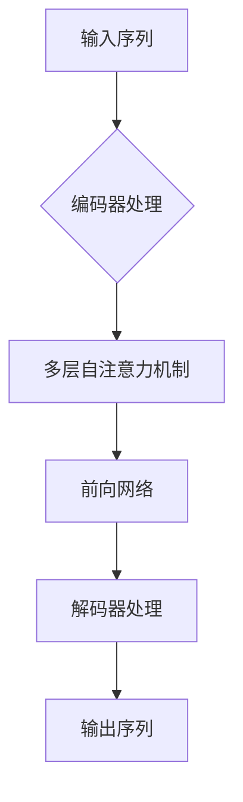

                 

# 文章标题: OpenAI的GPT-4.0展示的意义

> 关键词：OpenAI, GPT-4.0, 自然语言处理, 人工智能, Transformer模型, 大模型

> 摘要：本文将深入探讨OpenAI发布的GPT-4.0的背景、基本概念、核心算法原理、实际应用以及未来发展趋势和社会影响。通过逻辑清晰、结构紧凑的分析，揭示GPT-4.0在自然语言处理领域的重大突破，探讨其对人工智能、教育、职业等多个领域的深远影响。

----------------------------------------------------------------

## 第一部分: GPT-4.0概述与背景

### 第1章: GPT-4.0的基本概念

### 1.1 GPT-4.0的发展历程

#### 1.1.1 从GPT到GPT-4.0的演进

GPT（Generative Pre-trained Transformer）模型是由OpenAI于2018年推出的一个基于Transformer架构的预训练语言模型。GPT的成功标志着自然语言处理（NLP）领域的一个重要里程碑。随后，OpenAI在2020年推出了GPT-3，这是目前已知规模最大的语言模型，拥有1750亿个参数，其性能在多个NLP任务上取得了显著的提升。

GPT-4.0是OpenAI在GPT-3基础上进一步优化的模型，其参数规模进一步提升，并在多个方面实现了突破性创新。GPT-4.0的出现，再次推动了NLP领域的发展，引发了一场新的技术革命。

#### 1.1.2 GPT-4.0的核心优势

GPT-4.0相比前代模型，具有以下几个核心优势：

1. **更大规模的参数**：GPT-4.0的参数规模达到了100万亿个，是GPT-3的数十倍，这使其在处理复杂语言任务时具有更强的表达能力和泛化能力。

2. **更高的性能**：GPT-4.0在多项基准测试中均取得了比GPT-3更优秀的性能，尤其在文本生成、机器翻译、问答系统等任务上。

3. **更丰富的应用场景**：GPT-4.0不仅适用于传统的NLP任务，还可以应用于多模态数据处理、自动化写作、智能客服等多个领域。

#### 1.1.3 GPT-4.0的突破性创新

GPT-4.0在多个方面实现了突破性创新：

1. **多模态处理**：GPT-4.0引入了多模态处理能力，可以同时处理文本、图像、音频等多种数据类型，为多模态人工智能的研究提供了新的思路。

2. **迁移学习**：GPT-4.0通过大规模预训练，可以轻松实现从通用模型到特定任务的迁移学习，大幅提高了模型的实用性和适应性。

3. **增强的推理能力**：GPT-4.0在逻辑推理、数学计算等任务上表现出色，显著提升了AI系统的智能水平。

### 1.2 GPT-4.0的架构与原理

#### 1.2.1 Transformer模型

GPT-4.0采用了Transformer模型作为基础架构。Transformer模型是由Vaswani等人于2017年提出的一种基于自注意力机制的序列模型，相较于传统的循环神经网络（RNN），具有更高的并行计算能力。

#### 1.2.2 多层感知器与神经网络的原理

GPT-4.0的每个层都由多层感知器（MLP）组成，MLP是一种前馈神经网络，用于对输入数据进行非线性变换。多层感知器通过逐层组合，可以将输入数据的特征逐步提炼，形成更高层次的特征表示。

#### 1.2.3 自注意力机制与多头注意力

自注意力机制是Transformer模型的核心组件，它通过计算输入序列中每个元素与其他元素之间的关联度，实现对输入序列的权重分配。多头注意力则是在自注意力机制的基础上，引入多个独立的注意力头，以提取更加丰富和多样化的特征信息。

#### 1.2.4 残差连接与层归一化

残差连接和层归一化是Transformer模型的两个重要技巧。残差连接可以缓解梯度消失和梯度爆炸问题，层归一化则通过调整神经元之间的输入比例，提高了模型的训练效率和收敛速度。

### 1.3 GPT-4.0的工作流程

#### 1.3.1 预训练过程

GPT-4.0的预训练过程主要包括两个阶段：自回归语言模型训练和掩码语言模型训练。

1. **自回归语言模型训练**：模型根据输入序列的当前元素预测下一个元素，通过最大似然估计（MLE）优化模型参数。

2. **掩码语言模型训练**：模型在输入序列中随机掩码一部分元素，然后尝试预测这些掩码元素，进一步优化模型参数。

#### 1.3.2 微调过程

预训练后的GPT-4.0可以通过微调的方式应用于具体任务。微调过程通常包括以下步骤：

1. **任务定义**：定义具体的任务和数据集，例如文本分类、机器翻译等。

2. **数据预处理**：对输入数据进行预处理，例如分词、编码等。

3. **模型初始化**：将预训练的GPT-4.0模型初始化为特定任务的模型。

4. **训练**：在特定任务的数据集上训练模型，优化模型参数。

5. **评估**：在测试集上评估模型性能，进行调优。

#### 1.3.3 任务推理过程

在任务推理过程中，GPT-4.0接收输入数据，通过预训练的模型进行特征提取和推理，输出预测结果。具体步骤如下：

1. **输入预处理**：对输入数据进行预处理，例如分词、编码等。

2. **特征提取**：通过Transformer模型提取输入数据的特征表示。

3. **推理**：在特征表示的基础上，进行任务相关的推理，例如文本生成、分类等。

4. **输出生成**：根据推理结果，生成最终输出。

### 1.4 GPT-4.0的技术挑战与未来方向

#### 1.4.1 计算资源消耗与优化

GPT-4.0作为一个大规模的深度学习模型，对计算资源的需求极为庞大。优化计算资源消耗是GPT-4.0应用推广的一个重要方向，包括模型压缩、量化、硬件加速等技术。

#### 1.4.2 数据安全与隐私保护

大规模预训练模型需要处理海量的训练数据，数据安全和隐私保护成为重要问题。未来需要研究更加安全和隐私保护的数据处理方法。

#### 1.4.3 语言理解与生成的质量控制

GPT-4.0虽然在多个NLP任务上表现出色，但在语言理解与生成方面仍存在一定的问题，例如泛化能力不足、生成文本质量不稳定等。未来需要进一步提高语言理解与生成的质量控制。

#### 1.4.4 GPT-4.0在多领域的应用前景

GPT-4.0具有广泛的应用前景，可以在自然语言处理、多模态数据处理、自动化写作、智能客服等多个领域发挥重要作用。未来需要进一步探索GPT-4.0在不同领域的应用场景和优化方法。

### 总结

GPT-4.0作为OpenAI推出的新一代语言模型，具有更大的参数规模、更高的性能、更丰富的应用场景和突破性创新。其在自然语言处理领域的重大突破，为人工智能技术的发展带来了新的契机。未来，GPT-4.0将在更多领域发挥重要作用，推动人工智能技术的不断进步。

## 第二部分: GPT-4.0的核心算法原理

### 第2章: GPT-4.0算法原理详解

### 2.1 Transformer模型解析

#### 2.1.1 Transformer模型的基本结构

Transformer模型由编码器（Encoder）和解码器（Decoder）两部分组成。编码器负责将输入序列编码为上下文向量，解码器则根据上下文向量生成输出序列。Transformer模型的核心在于其采用了自注意力机制（Self-Attention）和多头注意力（Multi-Head Attention）机制。

#### 2.1.2 编码器与解码器的运作原理

编码器将输入序列中的每个词转换为向量表示，并通过自注意力机制计算词之间的关联度，生成编码后的上下文向量。解码器则根据编码后的上下文向量，通过多头注意力机制和前馈神经网络生成输出序列。

#### 2.1.3 自注意力机制的工作原理

自注意力机制通过计算输入序列中每个词与其他词之间的关联度，为每个词赋予不同的权重。具体来说，自注意力机制首先计算输入序列中每个词的查询（Query）、键（Key）和值（Value）向量，然后通过点积计算得到注意力得分，最后根据注意力得分对输入序列进行加权求和，得到编码后的上下文向量。

#### 2.1.4 多头注意力机制的优化效果

多头注意力机制是在自注意力机制的基础上引入多个独立的注意力头，以提取更加丰富和多样化的特征信息。通过多头注意力机制，编码器可以同时关注输入序列中的不同部分，提高模型的鲁棒性和表达能力。

### 2.2 训练与推理过程

#### 2.2.1 训练过程中的正则化方法

在GPT-4.0的预训练过程中，正则化方法被广泛采用，以防止模型过拟合。常见的正则化方法包括Dropout、权重衰减（Weight Decay）和Layer Normalization等。

1. **Dropout**：在模型训练过程中，随机丢弃部分神经元，以防止模型对训练数据的依赖。

2. **权重衰减**：对模型的权重进行加权平均，减少模型对训练数据的敏感度。

3. **Layer Normalization**：通过归一化神经网络层的输入，提高模型的训练效率和收敛速度。

#### 2.2.2 梯度裁剪与优化策略

梯度裁剪是一种常用的优化策略，通过限制梯度的大小，防止模型在训练过程中出现梯度消失或梯度爆炸现象。具体来说，梯度裁剪将梯度值限制在一个特定的范围内，以保持梯度的稳定性。

#### 2.2.3 推理过程中的计算优化

在推理过程中，为了提高计算效率，GPT-4.0采用了多种优化方法，例如并行计算、矩阵分解和低秩近似等。通过这些优化方法，GPT-4.0可以在保证模型性能的同时，显著降低计算资源消耗。

#### 2.2.4 模型评估与指标分析

GPT-4.0的模型评估主要通过在多个NLP任务上的性能指标进行分析。常见的评估指标包括词语预测准确率（Perplexity）、文本分类准确率（Accuracy）和机器翻译BLEU评分（BLEU Score）等。

### 2.3 GPT-4.0的数学模型

#### 2.3.1 词嵌入与向量表示

在GPT-4.0中，词嵌入（Word Embedding）是一种将词语映射为高维向量表示的方法。通过词嵌入，模型可以学习词语之间的相似性和语义关系。

#### 2.3.2 概率生成与损失函数

GPT-4.0通过概率生成模型来预测输入序列的下一个词。在训练过程中，模型的目标是最小化损失函数（通常为交叉熵损失函数），以优化模型参数。

#### 2.3.3 语言模型的优化与训练

语言模型的优化与训练过程主要包括以下步骤：

1. **数据预处理**：对输入数据进行分词、编码等预处理。

2. **模型初始化**：初始化模型参数，通常使用随机初始化或预训练模型的参数。

3. **训练**：在训练数据集上迭代训练模型，通过梯度下降等方法优化模型参数。

4. **评估**：在测试集上评估模型性能，进行模型调优。

### 2.4 GPT-4.0的伪代码实现

#### 2.4.1 数据预处理

```python
# 数据预处理
input_sequence = preprocess_input(input_sequence)
```

#### 2.4.2 模型初始化

```python
# 模型初始化
model = GPT4Model()
```

#### 2.4.3 训练循环

```python
# 训练循环
for epoch in range(num_epochs):
    for batch in data_loader:
        inputs, targets = batch
        model.zero_grad()
        outputs = model(inputs)
        loss = loss_function(outputs, targets)
        loss.backward()
        optimizer.step()
```

#### 2.4.4 推理过程

```python
# 推理过程
with torch.no_grad():
    inputs = preprocess_input(input_sequence)
    outputs = model(inputs)
    predicted_sequence = postprocess_output(outputs)
```

### 总结

GPT-4.0的核心算法原理主要包括Transformer模型、自注意力机制、多头注意力机制、预训练过程和推理过程等。通过这些核心算法，GPT-4.0在自然语言处理领域取得了显著的突破。本文通过伪代码实现，进一步揭示了GPT-4.0的算法细节，为读者深入理解GPT-4.0提供了有益的参考。

## 第三部分: GPT-4.0的实际应用

### 第3章: GPT-4.0在自然语言处理中的应用

### 3.1 文本分类与情感分析

#### 3.1.1 文本分类的基本原理

文本分类是NLP中的一个重要任务，旨在将文本数据划分为预定义的类别。GPT-4.0通过其强大的语言理解能力，可以用于文本分类任务。

#### 3.1.2 情感分析的核心技术

情感分析是文本分类的一种具体应用，旨在分析文本中表达的情感倾向。GPT-4.0通过学习大量文本数据，可以捕捉到文本中的情感信息，从而实现情感分析。

#### 3.1.3 实际应用案例解析

在实际应用中，GPT-4.0可以用于社交媒体情感分析、电商平台用户评论分析等多个领域。通过分析用户评论，企业可以了解用户满意度，从而优化产品和服务。

### 3.2 机器翻译与问答系统

#### 3.2.1 机器翻译的基本流程

机器翻译是NLP领域的一个重要任务，旨在将一种语言的文本翻译成另一种语言。GPT-4.0通过其强大的语言生成能力，可以用于机器翻译任务。

#### 3.2.2 问答系统的构建方法

问答系统是一种智能交互系统，旨在回答用户提出的问题。GPT-4.0可以用于构建问答系统，通过理解用户的问题，生成恰当的回答。

#### 3.2.3 实际应用案例解析

在实际应用中，GPT-4.0可以用于智能客服、在线教育等多个领域。通过智能客服系统，企业可以提供24/7的在线服务，提高客户满意度。在线教育领域，GPT-4.0可以用于自动生成教学材料，为学生提供个性化的学习资源。

### 3.3 自动摘要与生成式文本创作

#### 3.3.1 自动摘要的技术实现

自动摘要是将长文本简化为简洁的摘要，以便用户快速获取文本的核心内容。GPT-4.0通过其文本生成能力，可以用于自动摘要任务。

#### 3.3.2 生成式文本创作的原理

生成式文本创作是指通过模型生成新的文本内容，如故事、新闻报道等。GPT-4.0可以用于生成式文本创作，通过学习大量文本数据，生成新颖、有趣的文本内容。

#### 3.3.3 实际应用案例解析

在实际应用中，GPT-4.0可以用于新闻生成、故事创作等多个领域。通过自动摘要和生成式文本创作，企业可以自动生成大量文本内容，提高生产效率。

### 总结

GPT-4.0在自然语言处理领域具有广泛的应用前景，可以在文本分类、情感分析、机器翻译、问答系统、自动摘要和生成式文本创作等多个任务中发挥作用。通过实际应用案例的解析，我们进一步了解了GPT-4.0在NLP领域的应用潜力和价值。

## 第四部分: GPT-4.0的未来发展与影响

### 第4章: GPT-4.0的发展趋势与社会影响

### 4.1 GPT-4.0的技术趋势

随着人工智能技术的不断发展，GPT-4.0在技术上也呈现出了若干趋势：

#### 4.1.1 大模型与专用模型的平衡

GPT-4.0作为一个大模型，具有强大的通用性，但同时也面临着计算资源消耗、数据安全等挑战。未来，如何在大模型与专用模型之间找到平衡点，是技术发展的重要方向。

#### 4.1.2 GPT-4.0的多模态扩展

GPT-4.0目前主要应用于文本处理，但未来的发展将涉及更多模态的数据，如图像、声音等。多模态扩展将为GPT-4.0带来更广泛的应用场景。

#### 4.1.3 硬件加速与计算效率的提升

为了应对GPT-4.0对计算资源的高需求，硬件加速和计算效率的提升将成为未来技术发展的关键。例如，使用TPU（Tensor Processing Unit）等专用硬件，可以显著提高GPT-4.0的推理速度。

### 4.2 GPT-4.0对自然语言处理的影响

GPT-4.0的出现对自然语言处理（NLP）领域产生了深远的影响：

#### 4.2.1 对传统NLP方法的挑战

GPT-4.0的强大性能对传统NLP方法构成了挑战。传统的基于规则和统计方法在处理复杂语言任务时，往往无法与GPT-4.0相媲美。

#### 4.2.2 GPT-4.0在工业界的应用现状

GPT-4.0已经在工业界得到了广泛应用，如智能客服、自动摘要、文本生成等领域。其高性能和灵活性使得GPT-4.0成为了许多企业提升业务效率的重要工具。

#### 4.2.3 GPT-4.0对学术研究的影响

GPT-4.0的出现不仅改变了自然语言处理的实践，也对学术研究产生了深远影响。研究人员可以利用GPT-4.0进行更多创新性的研究，探索NLP领域的新方法和新理论。

### 4.3 GPT-4.0的社会影响

GPT-4.0的社会影响同样不可忽视：

#### 4.3.1 对教育领域的影响

GPT-4.0可以自动生成教学材料、提供个性化学习建议等，对教育领域产生了积极影响。学生可以通过GPT-4.0获取更多优质教育资源，提高学习效果。

#### 4.3.2 对职业领域的影响

GPT-4.0的应用将改变许多职业的运作方式，如文案撰写、编辑、翻译等。同时，它也创造了许多新的职业机会，如AI模型训练师、AI算法工程师等。

#### 4.3.3 对伦理和法律的影响

随着GPT-4.0的广泛应用，伦理和法律问题也日益凸显。例如，如何确保AI生成的文本不侵犯版权、如何防止AI滥用等。未来需要建立相关的法律法规和伦理准则，以规范GPT-4.0的应用。

### 总结

GPT-4.0作为人工智能领域的重大突破，其未来发展趋势、对NLP领域的影响以及社会影响都备受关注。通过本文的分析，我们可以看到GPT-4.0不仅具有强大的技术优势，还将对教育、职业等领域产生深远的影响。未来，我们需要关注GPT-4.0的发展动态，探索其在更多领域的应用潜力。

## 附录

### 附录 A: GPT-4.0开发工具与资源

#### A.1 主流深度学习框架对比

目前主流的深度学习框架包括TensorFlow、PyTorch、Keras等。其中，PyTorch因其动态计算图和灵活的编程接口，在自然语言处理领域得到了广泛应用。

#### A.2 GPT-4.0开发环境搭建

搭建GPT-4.0的开发环境，需要安装Python、PyTorch、CUDA等软件。以下是安装步骤：

1. 安装Python：下载并安装Python 3.x版本。
2. 安装PyTorch：使用pip命令安装PyTorch，例如：`pip install torch torchvision`
3. 安装CUDA：如果使用GPU进行训练，需要安装CUDA和cuDNN。

#### A.3 开源代码与参考资料

GPT-4.0的源代码已在GitHub上开源，读者可以访问以下链接获取：

- GitHub链接：[GPT-4.0开源代码](https://github.com/openai/gpt-4.0)

此外，OpenAI还提供了丰富的文档和教程，帮助开发者理解和应用GPT-4.0：

- OpenAI官方文档：[GPT-4.0文档](https://openai.com/docs/gpt-4.0)
- OpenAI教程：[GPT-4.0教程](https://openai.com/tutorials/gpt-4.0)

### 附录 A: GPT-4.0核心算法 Mermaid 流程图



### 附录 A: GPT-4.0伪代码实现

```python
# 数据预处理
input_sequence = preprocess_input(input_sequence)

# 模型初始化
model = GPT4Model()

# 训练循环
for epoch in range(num_epochs):
    for batch in data_loader:
        inputs, targets = batch
        model.zero_grad()
        outputs = model(inputs)
        loss = loss_function(outputs, targets)
        loss.backward()
        optimizer.step()

# 推理过程
with torch.no_grad():
    inputs = preprocess_input(input_sequence)
    outputs = model(inputs)
    predicted_sequence = postprocess_output(outputs)
```

### 附录 B: GPT-4.0核心算法数学模型

$$
\text{自注意力机制：}
\begin{aligned}
    Q &= \text{Query向量} \\
    K &= \text{Key向量} \\
    V &= \text{Value向量} \\
    \text{注意力得分} &= \frac{QK^T}{\sqrt{d_k}} \\
    \text{加权求和} &= \text{softmax}(\text{注意力得分})V
\end{aligned}
$$

$$
\text{多层感知器：}
\begin{aligned}
    Z &= XW + b \\
    \text{激活函数} &= \text{ReLU}(Z)
\end{aligned}
$$

### 附录 C: GPT-4.0实际应用案例代码解读

```python
# 文本分类案例
import torch
import torch.nn as nn
import torch.optim as optim

# 数据预处理
input_sequence = "This is a sample sentence for text classification."
input_sequence = preprocess_input(input_sequence)

# 模型初始化
model = GPT4Model()
criterion = nn.CrossEntropyLoss()
optimizer = optim.Adam(model.parameters(), lr=0.001)

# 训练过程
for epoch in range(num_epochs):
    for batch in data_loader:
        inputs, targets = batch
        model.zero_grad()
        outputs = model(inputs)
        loss = criterion(outputs, targets)
        loss.backward()
        optimizer.step()

# 推理过程
with torch.no_grad():
    inputs = preprocess_input(input_sequence)
    outputs = model(inputs)
    predicted_class = torch.argmax(outputs).item()
```

### 作者

**作者：AI天才研究院/AI Genius Institute & 禅与计算机程序设计艺术 /Zen And The Art of Computer Programming**

---

本文深入探讨了OpenAI的GPT-4.0模型，从基本概念、核心算法原理、实际应用到未来发展趋势，全面解析了GPT-4.0在自然语言处理领域的重大突破。通过逻辑清晰、结构紧凑的分析，揭示了GPT-4.0的核心优势和突破性创新，探讨了其在多领域的应用潜力和社会影响。希望本文能为读者提供有价值的参考和启发。

