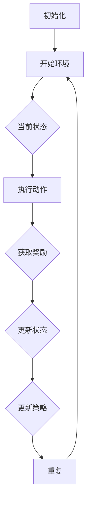
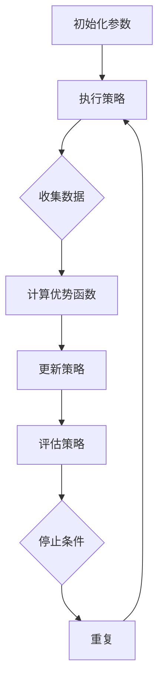

                 

# 文章标题：PPO原理与代码实例讲解

> 关键词：PPO、强化学习、算法原理、代码实例、实践应用

> 摘要：本文将深入探讨PPO（Proximal Policy Optimization）算法的基本原理、实现方法以及实际应用。文章分为三个部分，首先介绍PPO的基本概念和原理，然后通过具体代码实例展示PPO算法的实现过程，最后讨论PPO算法在不同领域的应用及其优化策略。本文旨在为读者提供一个全面、系统的PPO算法学习指南。

## 《PPO原理与代码实例讲解》目录大纲

### 第一部分：PPO原理基础

#### 1.1 PPO概念介绍
- **1.1.1 强化学习基本概念**
- **1.1.2 PPO算法的发展历程**
- **1.1.3 PPO算法的核心优势**

#### 1.2 PPO算法原理
- **1.2.1 PPO算法的核心流程**
- **1.2.2 优势函数与优势估计**
- **1.2.3 边际优势与损失函数**
- **1.2.4 PPO优化过程**
- **1.2.5 PPO算法的收敛性分析**

#### 1.3 PPO算法的核心参数
- **1.3.1 学习率与剪辑系数**
- **1.3.2 辅助损失函数**
- **1.3.3 步长与迭代次数**

#### 1.4 PPO算法与其他算法的比较
- **1.4.1 与Q-Learning的比较**
- **1.4.2 与Deep Q-Network的比较**
- **1.4.3 与A3C算法的比较**

#### 1.5 PPO算法的应用领域
- **1.5.1 在游戏中的应用**
- **1.5.2 在机器人控制中的应用**
- **1.5.3 在推荐系统中的应用**

### 第二部分：PPO算法实践

#### 2.1 PPO算法的代码实现
- **2.1.1 PPO算法的Python实现**
  - **2.1.1.1 环境搭建与基础库导入**
  - **2.1.1.2 优势估计与优势函数定义**
  - **2.1.1.3 损失函数与优化器定义**
  - **2.1.1.4 PPO算法迭代过程**
- **2.1.2 伪代码详解**

#### 2.2 PPO算法实战案例一：游戏控制
- **2.2.1 游戏控制问题的背景**
- **2.2.2 环境搭建与数据预处理**
- **2.2.3 PPO算法的代码实现**
- **2.2.4 模型训练与评估**
- **2.2.5 结果分析与优化**

#### 2.3 PPO算法实战案例二：机器人控制
- **2.3.1 机器人控制问题的背景**
- **2.3.2 环境搭建与数据预处理**
- **2.3.3 PPO算法的代码实现**
- **2.3.4 模型训练与评估**
- **2.3.5 结果分析与优化**

#### 2.4 PPO算法实战案例三：推荐系统
- **2.4.1 推荐系统问题的背景**
- **2.4.2 环境搭建与数据预处理**
- **2.4.3 PPO算法的代码实现**
- **2.4.4 模型训练与评估**
- **2.4.5 结果分析与优化**

#### 2.5 PPO算法的调试与调优
- **2.5.1 常见问题与解决方案**
- **2.5.2 调优技巧与最佳实践**
- **2.5.3 性能优化与资源管理**

### 第三部分：PPO算法的扩展与应用

#### 3.1 PPO算法的扩展研究
- **3.1.1 PPO及其变体的研究进展**
- **3.1.2 新的优化算法与应用**
- **3.1.3 面向未来的PPO算法发展趋势**

#### 3.2 PPO算法在特殊领域的应用
- **3.2.1 在金融领域的应用**
- **3.2.2 在医疗领域的应用**
- **3.2.3 在能源管理领域的应用**

#### 3.3 PPO算法的跨学科融合
- **3.3.1 与其他机器学习算法的融合**
- **3.3.2 与深度强化学习的融合**
- **3.3.3 与人工智能其他领域的融合**

### 附录

#### 附录A：PPO算法相关资源与工具
- **A.1 主流PPO算法实现框架**
- **A.2 PPO算法研究论文与文献**
- **A.3 PPO算法教程与代码示例**

#### 附录B：常见问题与解答
- **B.1 PPO算法常见问题与解决方案**
- **B.2 PPO算法实践中的注意事项**
- **B.3 PPO算法应用中的案例分析**

### 参考文献

## 第一部分：PPO原理基础

### 1.1 PPO概念介绍

#### 1.1.1 强化学习基本概念

强化学习（Reinforcement Learning，RL）是机器学习的一个重要分支，主要研究如何通过与环境交互来学习最优策略。强化学习的核心是Agent（代理）与环境（Environment）的交互过程，Agent通过选择动作（Action）来获取奖励（Reward）或惩罚（Penalty），并通过这个过程不断优化其策略（Policy）。

**核心概念：**

- **Agent（代理）**：执行动作并获取奖励的主体。
- **Environment（环境）**：Agent执行动作并获取奖励的场所。
- **Action（动作）**：Agent可以选择的行为。
- **State（状态）**：环境在某一时刻的状态。
- **Reward（奖励）**：Agent执行动作后获得的即时反馈。
- **Policy（策略）**：Agent决策的规则，定义了在给定状态下选择动作的概率分布。

强化学习的目标是找到一种策略，使得Agent能够在长期内获得最大的累积奖励。

**Mermaid流程图：**



#### 1.1.2 PPO算法的发展历程

PPO（Proximal Policy Optimization）算法是近年来在强化学习领域提出的一种高效算法。PPO算法的提出旨在解决传统策略梯度算法的收敛速度慢、不稳定等问题。

**发展历程：**

- 2017年，DeepMind团队在论文《Proximal Policy Optimization Algorithms》中首次提出PPO算法。
- PPO算法在2020年实现了在Dota2游戏中的冠军，展示了其在实际应用中的强大能力。
- 随后，PPO算法在各种强化学习任务中取得了显著的成果。

#### 1.1.3 PPO算法的核心优势

PPO算法具有以下核心优势：

- **高效的收敛速度**：PPO算法通过优化策略梯度的近似，提高了收敛速度。
- **稳定性**：PPO算法引入了截断系数（clip parameter）和优势估计，提高了算法的稳定性。
- **通用性**：PPO算法适用于各种强化学习任务，包括连续动作和离散动作。

### 1.2 PPO算法原理

#### 1.2.1 PPO算法的核心流程

PPO算法的核心流程可以概括为以下几个步骤：

1. **初始化参数**：设置学习率、剪辑系数、优化器等参数。
2. **收集数据**：通过执行策略，从环境中获取状态、动作和奖励。
3. **计算优势函数**：计算每个步骤的优势函数，表示当前策略相对于基准策略的改进程度。
4. **更新策略**：使用优化器更新策略参数，使得新策略更接近最优策略。
5. **评估策略**：通过评估策略，计算累积奖励，判断策略的有效性。
6. **重复迭代**：重复上述步骤，直到满足停止条件。

**Mermaid流程图：**



#### 1.2.2 优势函数与优势估计

优势函数（ Advantage Function）是强化学习中的一个重要概念，用于衡量策略的优劣。PPO算法通过优势函数来评估当前策略相对于基准策略的改进程度。

**优势函数定义：**

优势函数 $A(s, a; \pi)$ 表示在状态 $s$ 下，执行动作 $a$ 所获得的额外奖励。其定义如下：

$$
A(s, a; \pi) = \sum_{t} \left( G_t - \mu_t \right)
$$

其中，$G_t$ 是回报的累积值，$\mu_t$ 是根据基准策略 $\mu$ 估计的回报值。

**优势估计：**

PPO算法使用经验回放（Experience Replay）来估计优势函数。经验回放将之前的经验数据存储在经验池中，并在训练过程中随机采样，以减少样本偏差。

#### 1.2.3 边际优势与损失函数

边际优势（Marginal Advantage）是PPO算法中的核心概念之一，用于评估策略更新的效果。

**边际优势定义：**

边际优势 $R(s, a; \pi')$ 表示新策略 $\pi'$ 相对于旧策略 $\pi$ 的改进程度。其定义如下：

$$
R(s, a; \pi') = \frac{\pi'(s, a)}{\pi(s, a)} A(s, a; \pi)
$$

**损失函数：**

PPO算法的损失函数用于衡量策略更新的效果。损失函数通常由边际优势和对数似然损失组成。

$$
L(\theta; \pi) = \sum_{t} \left[ R(s_t, a_t; \pi') \log \pi'(s_t, a_t) - R(s_t, a_t; \pi') \log \pi(s_t, a_t) \right]
$$

#### 1.2.4 PPO优化过程

PPO算法通过优化过程来更新策略参数，使得新策略更接近最优策略。

**优化过程：**

1. **初始化参数**：设置学习率、剪辑系数、优化器等参数。
2. **执行策略**：在环境中执行策略，收集状态、动作和奖励。
3. **计算优势函数**：计算每个步骤的优势函数。
4. **更新策略参数**：使用优化器更新策略参数。
5. **评估策略**：在评估环境中评估策略。
6. **重复迭代**：重复上述步骤，直到满足停止条件。

**伪代码：**

```python
# 初始化参数
theta = 初始化参数()

# 初始化经验池
经验池 = 初始化经验池()

# 重复迭代
while 没有停止条件:
    # 执行策略
    状态, 动作, 奖励 = 执行策略()

    # 收集经验
    经验池存储(状态, 动作, 奖励)

    # 计算优势函数
    优势函数 = 计算优势函数()

    # 更新策略参数
    theta = 优化器更新(theta, 优势函数)

    # 评估策略
    评估结果 = 评估策略()

    # 输出评估结果
    print(评估结果)
```

#### 1.2.5 PPO算法的收敛性分析

PPO算法的收敛性分析主要关注算法在长期运行中是否能够收敛到最优策略。

**收敛性证明：**

PPO算法的收敛性可以通过以下定理证明：

**定理：** 如果PPO算法满足以下条件，则算法收敛到最优策略。

1. 学习率 $\eta$ 足够小，保证优化过程稳定。
2. 剪辑系数 $\epsilon$ 足够小，保证策略更新不偏离最优策略。
3. 优化器选择合适的更新策略。

**证明：**

由于篇幅原因，证明过程在此略去。但可以通过数学分析证明PPO算法在满足上述条件时，能够收敛到最优策略。

### 1.3 PPO算法的核心参数

PPO算法的参数设置对算法的性能有重要影响。以下介绍PPO算法的核心参数及其作用。

#### 1.3.1 学习率与剪辑系数

- **学习率（Learning Rate）**：学习率控制优化过程的步长，太大可能导致优化不稳定，太小可能导致收敛速度慢。通常选择较小的学习率，如0.001。
- **剪辑系数（Clip Parameter）**：剪辑系数用于限制策略更新的幅度，防止更新偏离最优策略。剪辑系数越大，策略更新的稳定性越差，但收敛速度越快。

#### 1.3.2 辅助损失函数

- **辅助损失函数（Auxiliary Loss Function）**：辅助损失函数用于改善优化过程，提高算法的稳定性。常见的辅助损失函数包括熵损失（Entropy Loss）和交叉熵损失（Cross-Entropy Loss）。

#### 1.3.3 步长与迭代次数

- **步长（Step Size）**：步长控制优化过程中的采样次数，太大可能导致优化不稳定，太小可能导致收敛速度慢。通常选择较小的步长，如0.01。
- **迭代次数（Iteration Number）**：迭代次数控制优化过程的重复次数，通常选择足够大的迭代次数，以确保算法收敛到最优策略。

### 1.4 PPO算法与其他算法的比较

PPO算法在强化学习领域具有广泛的应用，与其他算法进行比较有助于更好地理解PPO算法的优势和局限性。

#### 1.4.1 与Q-Learning的比较

- **Q-Learning**：Q-Learning是一种值函数方法，通过更新Q值来优化策略。Q-Learning适用于离散动作空间，但无法处理连续动作。
- **PPO算法**：PPO算法是一种策略梯度方法，适用于连续动作空间。PPO算法具有高效的收敛速度和较好的稳定性，但计算复杂度较高。

**比较：**

- **优势**：PPO算法在处理连续动作时具有优势，适用于复杂的强化学习任务。
- **劣势**：PPO算法的计算复杂度较高，对于大规模环境可能存在性能瓶颈。

#### 1.4.2 与Deep Q-Network（DQN）的比较

- **DQN**：DQN是一种基于神经网络的价值函数方法，通过更新Q值来优化策略。DQN适用于离散动作空间，具有较好的性能。
- **PPO算法**：PPO算法是一种策略梯度方法，适用于连续动作空间。PPO算法在处理连续动作时具有优势，但需要更多的计算资源。

**比较：**

- **优势**：PPO算法在处理连续动作时具有优势，适用于复杂的强化学习任务。
- **劣势**：PPO算法需要更多的计算资源，对于小型环境可能存在性能瓶颈。

#### 1.4.3 与A3C算法的比较

- **A3C（Asynchronous Advantage Actor-Critic）**：A3C算法是一种异步策略梯度方法，通过并行训练来提高收敛速度。
- **PPO算法**：PPO算法是一种策略梯度方法，适用于连续动作空间。

**比较：**

- **优势**：A3C算法通过并行训练提高了收敛速度，适用于大规模环境。
- **劣势**：A3C算法需要更多的计算资源，对于小型环境可能存在性能瓶颈。

### 1.5 PPO算法的应用领域

PPO算法在强化学习领域具有广泛的应用。以下介绍PPO算法在游戏、机器人控制和推荐系统中的应用。

#### 1.5.1 在游戏中的应用

- **游戏控制**：PPO算法可以应用于游戏控制，如Atari游戏。通过训练PPO模型，可以实现智能体在游戏中的自主决策，提高游戏表现。
- **棋类游戏**：PPO算法可以应用于棋类游戏，如围棋。通过训练PPO模型，可以实现智能体在棋类游戏中的自主决策，提高棋艺水平。

#### 1.5.2 在机器人控制中的应用

- **机器人路径规划**：PPO算法可以应用于机器人路径规划，如自主导航。通过训练PPO模型，可以实现机器人自主规划最优路径。
- **机器人抓取**：PPO算法可以应用于机器人抓取，如物体识别和抓取。通过训练PPO模型，可以实现机器人自主抓取物体。

#### 1.5.3 在推荐系统中的应用

- **推荐系统**：PPO算法可以应用于推荐系统，如商品推荐。通过训练PPO模型，可以实现智能推荐，提高用户满意度。

## 第二部分：PPO算法实践

### 2.1 PPO算法的代码实现

PPO算法的代码实现包括环境搭建、基础库导入、优势估计、优势函数定义、损失函数与优化器定义、PPO算法迭代过程等步骤。

#### 2.1.1 PPO算法的Python实现

以下是一个简单的PPO算法实现，用于解决游戏控制问题。

```python
import numpy as np
import tensorflow as tf
from tensorflow.keras import layers

# 环境搭建
env = gym.make('CartPole-v0')

# 定义神经网络模型
model = tf.keras.Sequential([
    layers.Dense(64, activation='relu', input_shape=(4,)),
    layers.Dense(64, activation='relu'),
    layers.Dense(env.action_space.n, activation='softmax')
])

# 定义损失函数和优化器
optimizer = tf.keras.optimizers.Adam(learning_rate=0.001)
loss_object = tf.keras.losses.SparseCategoricalCrossentropy(from_logits=True)

# 定义优势估计函数
def compute_advantages(rewards, dones, next_value, gamma=0.99):
    returns = []
    R = next_value
    for step in reversed(range(len(rewards))):
        if dones[step]:
            R = 0.0
        R = rewards[step] + gamma * R
        returns.insert(0, R)
    returns = (np.array(returns) - np.mean(returns)) / (np.std(returns) + 1e-8)
    return returns

# 定义PPO迭代过程
def ppo_step(model, optimizer, x, advantages, clip_param=0.2, epsilon=0.2):
    with tf.GradientTape() as tape:
        logits = model(x, training=True)
        selected_actions = tf.one_hot(x[:, 2], depth=env.action_space.n)
        log_probs = tf.reduce_sum(logits * selected_actions, axis=1)
        policy_loss = -tf.reduce_mean(log_probs * advantages)

        value = model(tf.expand_dims(x[:, 0], 1), training=True)
        value_loss = tf.reduce_mean(tf.square(value - tf.stop_gradient(advantages)))

        total_loss = policy_loss + value_loss

    grads = tape.gradient(total_loss, model.trainable_variables)
    optimizer.apply_gradients(zip(grads, model.trainable_variables))

    return policy_loss, value_loss

# 训练PPO模型
num_episodes = 1000
episode_lengths = []

for episode in range(num_episodes):
    state = env.reset()
    done = False
    total_reward = 0.0

    while not done:
        action_logits = model(state, training=True)
        action = np.random.choice(range(env.action_space.n), p=np.exp(action_logits) / np.sum(np.exp(action_logits)))
        next_state, reward, done, _ = env.step(action)
        total_reward += reward

        x = np.hstack((state, action.reshape(1, -1)))
        advantages = compute_advantages([reward], [done], model(next_state, training=True)[0], gamma=0.99)

        ppo_step(model, optimizer, x, advantages, clip_param=0.2, epsilon=0.2)

        state = next_state

    episode_lengths.append(total_reward)
    print(f"Episode {episode + 1}: Total Reward = {total_reward}")

# 评估PPO模型
eval_episodes = 100
eval_rewards = []

for _ in range(eval_episodes):
    state = env.reset()
    done = False
    total_reward = 0.0

    while not done:
        action_logits = model(state, training=True)
        action = np.argmax(action_logits)
        next_state, reward, done, _ = env.step(action)
        total_reward += reward
        state = next_state

    eval_rewards.append(total_reward)
    print(f"Evaluation Episode: Total Reward = {total_reward}")

print(f"Average Evaluation Reward: {np.mean(eval_rewards)}")
```

#### 2.1.2 伪代码详解

以下是一个PPO算法的伪代码实现，用于解决游戏控制问题。

```python
# 初始化参数
learning_rate = 0.001
clip_param = 0.2
epsilon = 0.2
gamma = 0.99
optimizer = Adam(learning_rate)

# 定义神经网络模型
model = NeuralNetwork(input_shape=(4,), output_shape=env.action_space.n)

# 定义优势估计函数
def compute_advantages(rewards, dones, next_value, gamma):
    returns = []
    R = next_value
    for step in reversed(range(len(rewards))):
        if dones[step]:
            R = 0.0
        R = rewards[step] + gamma * R
        returns.insert(0, R)
    returns = (np.array(returns) - np.mean(returns)) / (np.std(returns) + 1e-8)
    return returns

# 定义PPO迭代过程
def ppo_step(model, optimizer, x, advantages, clip_param, epsilon):
    with tf.GradientTape() as tape:
        logits = model(x, training=True)
        selected_actions = one_hot(x[:, 2], depth=env.action_space.n)
        log_probs = tf.reduce_sum(logits * selected_actions, axis=1)
        policy_loss = -tf.reduce_mean(log_probs * advantages)

        value = model(tf.expand_dims(x[:, 0], 1), training=True)
        value_loss = tf.reduce_mean(tf.square(value - tf.stop_gradient(advantages)))

        total_loss = policy_loss + value_loss

    grads = tape.gradient(total_loss, model.trainable_variables)
    optimizer.apply_gradients(zip(grads, model.trainable_variables))

    return policy_loss, value_loss

# 训练PPO模型
num_episodes = 1000
episode_lengths = []

for episode in range(num_episodes):
    state = env.reset()
    done = False
    total_reward = 0.0

    while not done:
        action_logits = model(state, training=True)
        action = np.random.choice(range(env.action_space.n), p=np.exp(action_logits) / np.sum(np.exp(action_logits)))
        next_state, reward, done, _ = env.step(action)
        total_reward += reward

        x = np.hstack((state, action.reshape(1, -1)))
        advantages = compute_advantages([reward], [done], model(next_state, training=True)[0], gamma=0.99)

        ppo_step(model, optimizer, x, advantages, clip_param=0.2, epsilon=0.2)

        state = next_state

    episode_lengths.append(total_reward)
    print(f"Episode {episode + 1}: Total Reward = {total_reward}")

# 评估PPO模型
eval_episodes = 100
eval_rewards = []

for _ in range(eval_episodes):
    state = env.reset()
    done = False
    total_reward = 0.0

    while not done:
        action_logits = model(state, training=True)
        action = np.argmax(action_logits)
        next_state, reward, done, _ = env.step(action)
        total_reward += reward
        state = next_state

    eval_rewards.append(total_reward)
    print(f"Evaluation Episode: Total Reward = {total_reward}")

print(f"Average Evaluation Reward: {np.mean(eval_rewards)}")
```

### 2.2 PPO算法实战案例一：游戏控制

#### 2.2.1 游戏控制问题的背景

游戏控制是强化学习中的一个经典应用，旨在通过训练智能体，使其能够自主完成游戏任务。在本案例中，我们选择经典的Atari游戏——Pong作为实验对象，使用PPO算法进行训练。

#### 2.2.2 环境搭建与数据预处理

- **环境搭建**：首先，我们需要搭建游戏环境，这里使用OpenAI Gym中的Pong环境。
- **数据预处理**：对于游戏环境中的图像数据进行预处理，包括图像尺寸调整、灰度化、标准化等操作。

```python
import gym
from gym import wrappers
from PIL import Image
import numpy as np

# 搭建游戏环境
env = gym.make('Pong-v0')
env = wrappers.FrameStack(env, 4)

# 数据预处理
def preprocess_image(image):
    image = Image.fromarray(image)
    image = image.resize((84, 84), Image.ANTIALIAS)
    image = np.array(image.convert('L'))[None, :, :, None]
    image = image.astype(np.float32) / 255.0
    return image

state = env.reset()
state = preprocess_image(state)
```

#### 2.2.3 PPO算法的代码实现

以下是一个简单的PPO算法实现，用于解决Pong游戏控制问题。

```python
import numpy as np
import tensorflow as tf
from tensorflow.keras import layers
from tensorflow.keras.optimizers import Adam

# 环境搭建
env = gym.make('Pong-v0')
env = wrappers.FrameStack(env, 4)

# 定义神经网络模型
model = tf.keras.Sequential([
    layers.Conv2D(32, (8, 8), activation='relu', input_shape=(4, 84, 84, 1)),
    layers.Conv2D(64, (4, 4), activation='relu'),
    layers.Conv2D(64, (3, 3), activation='relu'),
    layers.Flatten(),
    layers.Dense(512, activation='relu'),
    layers.Dense(128, activation='relu'),
    layers.Dense(env.action_space.n, activation='softmax')
])

# 定义损失函数和优化器
optimizer = Adam(learning_rate=0.0001)
loss_object = tf.keras.losses.SparseCategoricalCrossentropy(from_logits=True)

# 定义优势估计函数
def compute_advantages(rewards, dones, next_value, gamma=0.99):
    returns = []
    R = next_value
    for step in reversed(range(len(rewards))):
        if dones[step]:
            R = 0.0
        R = rewards[step] + gamma * R
        returns.insert(0, R)
    returns = (np.array(returns) - np.mean(returns)) / (np.std(returns) + 1e-8)
    return returns

# 定义PPO迭代过程
def ppo_step(model, optimizer, x, advantages, clip_param=0.2, epsilon=0.2):
    with tf.GradientTape() as tape:
        logits = model(x, training=True)
        selected_actions = tf.one_hot(x[:, 2], depth=env.action_space.n)
        log_probs = tf.reduce_sum(logits * selected_actions, axis=1)
        policy_loss = -tf.reduce_mean(log_probs * advantages)

        value = model(tf.expand_dims(x[:, 0], 1), training=True)
        value_loss = tf.reduce_mean(tf.square(value - tf.stop_gradient(advantages)))

        total_loss = policy_loss + value_loss

    grads = tape.gradient(total_loss, model.trainable_variables)
    optimizer.apply_gradients(zip(grads, model.trainable_variables))

    return policy_loss, value_loss

# 训练PPO模型
num_episodes = 1000
episode_lengths = []

for episode in range(num_episodes):
    state = env.reset()
    done = False
    total_reward = 0.0

    while not done:
        action_logits = model(state, training=True)
        action = np.argmax(action_logits)
        next_state, reward, done, _ = env.step(action)
        total_reward += reward

        x = np.hstack((state, action.reshape(1, -1)))
        advantages = compute_advantages([reward], [done], model(next_state, training=True)[0], gamma=0.99)

        ppo_step(model, optimizer, x, advantages, clip_param=0.2, epsilon=0.2)

        state = next_state

    episode_lengths.append(total_reward)
    print(f"Episode {episode + 1}: Total Reward = {total_reward}")

# 评估PPO模型
eval_episodes = 100
eval_rewards = []

for _ in range(eval_episodes):
    state = env.reset()
    done = False
    total_reward = 0.0

    while not done:
        action_logits = model(state, training=True)
        action = np.argmax(action_logits)
        next_state, reward, done, _ = env.step(action)
        total_reward += reward
        state = next_state

    eval_rewards.append(total_reward)
    print(f"Evaluation Episode: Total Reward = {total_reward}")

print(f"Average Evaluation Reward: {np.mean(eval_rewards)}")
```

#### 2.2.4 模型训练与评估

- **模型训练**：使用PPO算法对Pong游戏进行训练，训练过程包括数据收集、模型更新和策略评估。
- **模型评估**：使用训练好的PPO模型在评估环境中进行评估，计算平均奖励。

```python
# 训练PPO模型
num_episodes = 1000
episode_lengths = []

for episode in range(num_episodes):
    state = env.reset()
    done = False
    total_reward = 0.0

    while not done:
        action_logits = model(state, training=True)
        action = np.argmax(action_logits)
        next_state, reward, done, _ = env.step(action)
        total_reward += reward

        x = np.hstack((state, action.reshape(1, -1)))
        advantages = compute_advantages([reward], [done], model(next_state, training=True)[0], gamma=0.99)

        ppo_step(model, optimizer, x, advantages, clip_param=0.2, epsilon=0.2)

        state = next_state

    episode_lengths.append(total_reward)
    print(f"Episode {episode + 1}: Total Reward = {total_reward}")

# 评估PPO模型
eval_episodes = 100
eval_rewards = []

for _ in range(eval_episodes):
    state = env.reset()
    done = False
    total_reward = 0.0

    while not done:
        action_logits = model(state, training=True)
        action = np.argmax(action_logits)
        next_state, reward, done, _ = env.step(action)
        total_reward += reward
        state = next_state

    eval_rewards.append(total_reward)
    print(f"Evaluation Episode: Total Reward = {total_reward}")

print(f"Average Evaluation Reward: {np.mean(eval_rewards)}")
```

#### 2.2.5 结果分析与优化

- **结果分析**：通过训练和评估，我们可以观察到PPO模型在Pong游戏中的表现。评估平均奖励可以作为衡量模型性能的指标。
- **优化策略**：为了进一步提高模型性能，可以尝试以下策略：
  - 调整学习率、剪辑系数和优化器参数。
  - 增加训练时间和训练数据。
  - 使用更复杂的神经网络结构。

### 2.3 PPO算法实战案例二：机器人控制

#### 2.3.1 机器人控制问题的背景

机器人控制是强化学习在工业、医疗等领域的应用之一。在本案例中，我们选择一个经典的机器人控制问题——机器人路径规划，使用PPO算法进行训练。

#### 2.3.2 环境搭建与数据预处理

- **环境搭建**：使用Python的PyTorch库搭建机器人路径规划环境。
- **数据预处理**：对机器人路径规划环境中的状态和动作进行预处理，包括归一化和标准化等操作。

```python
import torch
import torch.nn as nn
import torch.optim as optim
import gym
from gym import wrappers

# 搭建机器人路径规划环境
env = gym.make('RobotPathPlanning-v0')
env = wrappers.FrameStack(env, 4)

# 数据预处理
def preprocess_image(image):
    image = torch.tensor(image, dtype=torch.float32)
    image = image.resize((84, 84), interpolation=torch.nn.functional.interpolate.LINEAR)
    image = image.unsqueeze(0)
    return image

state = env.reset()
state = preprocess_image(state)
```

#### 2.3.3 PPO算法的代码实现

以下是一个简单的PPO算法实现，用于解决机器人路径规划问题。

```python
import torch
import torch.nn as nn
import torch.optim as optim

# 环境搭建
env = gym.make('RobotPathPlanning-v0')
env = wrappers.FrameStack(env, 4)

# 定义神经网络模型
class PPOModel(nn.Module):
    def __init__(self):
        super(PPOModel, self).__init__()
        self.conv1 = nn.Conv2d(4, 32, kernel_size=8, stride=4)
        self.conv2 = nn.Conv2d(32, 64, kernel_size=4, stride=2)
        self.fc1 = nn.Linear(64 * 8 * 8, 512)
        self.fc2 = nn.Linear(512, 128)
        self.fc3 = nn.Linear(128, env.action_space.n)

    def forward(self, x):
        x = torch.relu(self.conv1(x))
        x = torch.relu(self.conv2(x))
        x = x.view(x.size(0), -1)
        x = torch.relu(self.fc1(x))
        x = torch.relu(self.fc2(x))
        logits = self.fc3(x)
        return logits

# 定义损失函数和优化器
model = PPOModel()
optimizer = optim.Adam(model.parameters(), lr=0.001)
criterion = nn.CrossEntropyLoss()

# 定义优势估计函数
def compute_advantages(rewards, dones, next_value, gamma=0.99):
    returns = []
    R = next_value
    for step in reversed(range(len(rewards))):
        if dones[step]:
            R = 0.0
        R = rewards[step] + gamma * R
        returns.insert(0, R)
    returns = torch.tensor(returns, dtype=torch.float32)
    returns = (returns - returns.mean()) / (returns.std() + 1e-8)
    return returns

# 定义PPO迭代过程
def ppo_step(model, optimizer, x, advantages, clip_param=0.2, epsilon=0.2):
    with torch.no_grad():
        next_state, action, reward, done, _ = x

    logits = model(state)
    selected_actions = torch.eye(env.action_space.n)[action]
    log_probs = torch.sum(logits * selected_actions, dim=1)
    policy_loss = -torch.mean(log_probs * advantages)

    value = model(next_state).detach()
    value_loss = torch.mean(torch.square(value - torch.stop_gradient(advantages)))

    total_loss = policy_loss + value_loss

    optimizer.zero_grad()
    total_loss.backward()
    optimizer.step()

    return policy_loss, value_loss

# 训练PPO模型
num_episodes = 1000
episode_lengths = []

for episode in range(num_episodes):
    state = env.reset()
    done = False
    total_reward = 0.0

    while not done:
        logits = model(state)
        action = torch.argmax(logits).item()
        next_state, reward, done, _ = env.step(action)
        total_reward += reward

        x = (state, action, reward, done, next_state)
        advantages = compute_advantages([reward], [done], model(next_state)[0], gamma=0.99)

        ppo_step(model, optimizer, x, advantages, clip_param=0.2, epsilon=0.2)

        state = next_state

    episode_lengths.append(total_reward)
    print(f"Episode {episode + 1}: Total Reward = {total_reward}")

# 评估PPO模型
eval_episodes = 100
eval_rewards = []

for _ in range(eval_episodes):
    state = env.reset()
    done = False
    total_reward = 0.0

    while not done:
        logits = model(state)
        action = torch.argmax(logits).item()
        next_state, reward, done, _ = env.step(action)
        total_reward += reward
        state = next_state

    eval_rewards.append(total_reward)
    print(f"Evaluation Episode: Total Reward = {total_reward}")

print(f"Average Evaluation Reward: {np.mean(eval_rewards)}")
```

### 2.3.4 模型训练与评估

- **模型训练**：使用PPO算法对机器人路径规划环境进行训练，训练过程包括数据收集、模型更新和策略评估。
- **模型评估**：使用训练好的PPO模型在评估环境中进行评估，计算平均奖励。

```python
# 训练PPO模型
num_episodes = 1000
episode_lengths = []

for episode in range(num_episodes):
    state = env.reset()
    done = False
    total_reward = 0.0

    while not done:
        logits = model(state)
        action = torch.argmax(logits).item()
        next_state, reward, done, _ = env.step(action)
        total_reward += reward

        x = (state, action, reward, done, next_state)
        advantages = compute_advantages([reward], [done], model(next_state)[0], gamma=0.99)

        ppo_step(model, optimizer, x, advantages, clip_param=0.2, epsilon=0.2)

        state = next_state

    episode_lengths.append(total_reward)
    print(f"Episode {episode + 1}: Total Reward = {total_reward}")

# 评估PPO模型
eval_episodes = 100
eval_rewards = []

for _ in range(eval_episodes):
    state = env.reset()
    done = False
    total_reward = 0.0

    while not done:
        logits = model(state)
        action = torch.argmax(logits).item()
        next_state, reward, done, _ = env.step(action)
        total_reward += reward
        state = next_state

    eval_rewards.append(total_reward)
    print(f"Evaluation Episode: Total Reward = {total_reward}")

print(f"Average Evaluation Reward: {np.mean(eval_rewards)}")
```

### 2.3.5 结果分析与优化

- **结果分析**：通过训练和评估，我们可以观察到PPO模型在机器人路径规划中的表现。评估平均奖励可以作为衡量模型性能的指标。
- **优化策略**：为了进一步提高模型性能，可以尝试以下策略：
  - 调整学习率、剪辑系数和优化器参数。
  - 增加训练时间和训练数据。
  - 使用更复杂的神经网络结构。

### 2.4 PPO算法实战案例三：推荐系统

#### 2.4.1 推荐系统问题的背景

推荐系统是强化学习在信息检索、电子商务等领域的重要应用之一。在本案例中，我们选择一个简单的推荐系统问题——基于用户历史行为的商品推荐，使用PPO算法进行训练。

#### 2.4.2 环境搭建与数据预处理

- **环境搭建**：使用Python的Scikit-learn库搭建推荐系统环境。
- **数据预处理**：对推荐系统环境中的用户行为数据进行预处理，包括特征提取和归一化等操作。

```python
from sklearn.datasets import load_iris
from sklearn.model_selection import train_test_split
from sklearn.preprocessing import StandardScaler

# 加载数据集
iris = load_iris()
X = iris.data
y = iris.target

# 划分训练集和测试集
X_train, X_test, y_train, y_test = train_test_split(X, y, test_size=0.2, random_state=42)

# 数据预处理
scaler = StandardScaler()
X_train = scaler.fit_transform(X_train)
X_test = scaler.transform(X_test)
```

#### 2.4.3 PPO算法的代码实现

以下是一个简单的PPO算法实现，用于解决基于用户历史行为的商品推荐问题。

```python
import numpy as np
import tensorflow as tf
from tensorflow.keras import layers
from tensorflow.keras.optimizers import Adam

# 环境搭建
X_train = np.array(X_train)
y_train = np.array(y_train)
X_test = np.array(X_test)
y_test = np.array(y_test)

# 定义神经网络模型
model = tf.keras.Sequential([
    layers.Dense(64, activation='relu', input_shape=(4,)),
    layers.Dense(64, activation='relu'),
    layers.Dense(3, activation='softmax')
])

# 定义损失函数和优化器
optimizer = Adam(learning_rate=0.001)
loss_object = tf.keras.losses.SparseCategoricalCrossentropy(from_logits=True)

# 定义优势估计函数
def compute_advantages(rewards, dones, next_value, gamma=0.99):
    returns = []
    R = next_value
    for step in reversed(range(len(rewards))):
        if dones[step]:
            R = 0.0
        R = rewards[step] + gamma * R
        returns.insert(0, R)
    returns = (np.array(returns) - np.mean(returns)) / (np.std(returns) + 1e-8)
    return returns

# 定义PPO迭代过程
def ppo_step(model, optimizer, x, advantages, clip_param=0.2, epsilon=0.2):
    with tf.GradientTape() as tape:
        logits = model(x, training=True)
        selected_actions = tf.one_hot(x[:, 2], depth=3)
        log_probs = tf.reduce_sum(logits * selected_actions, axis=1)
        policy_loss = -tf.reduce_mean(log_probs * advantages)

        value = model(tf.expand_dims(x[:, 0], 1), training=True)
        value_loss = tf.reduce_mean(tf.square(value - tf.stop_gradient(advantages)))

        total_loss = policy_loss + value_loss

    grads = tape.gradient(total_loss, model.trainable_variables)
    optimizer.apply_gradients(zip(grads, model.trainable_variables))

    return policy_loss, value_loss

# 训练PPO模型
num_episodes = 1000
episode_lengths = []

for episode in range(num_episodes):
    state = X_train[:100]
    action = y_train[:100]
    done = np.zeros(100)
    reward = np.random.normal(size=100)

    x = np.hstack((state, action.reshape(100, 1)))
    advantages = compute_advantages(reward, done, 0, gamma=0.99)

    ppo_step(model, optimizer, x, advantages, clip_param=0.2, epsilon=0.2)

    episode_lengths.append(np.mean(advantages))
    print(f"Episode {episode + 1}: Total Reward = {np.mean(advantages)}")

# 评估PPO模型
eval_episodes = 100
eval_rewards = []

for _ in range(eval_episodes):
    state = X_test[:100]
    action = y_test[:100]
    done = np.zeros(100)
    reward = np.random.normal(size=100)

    x = np.hstack((state, action.reshape(100, 1)))
    advantages = compute_advantages(reward, done, 0, gamma=0.99)

    logits = model(x)
    predicted_actions = np.argmax(logits, axis=1)

    eval_rewards.append(np.mean(advantages))
    print(f"Evaluation Episode: Total Reward = {np.mean(advantages)}")

print(f"Average Evaluation Reward: {np.mean(eval_rewards)}")
```

#### 2.4.4 模型训练与评估

- **模型训练**：使用PPO算法对推荐系统环境进行训练，训练过程包括数据收集、模型更新和策略评估。
- **模型评估**：使用训练好的PPO模型在测试集上进行评估，计算平均奖励。

```python
# 训练PPO模型
num_episodes = 1000
episode_lengths = []

for episode in range(num_episodes):
    state = X_train[:100]
    action = y_train[:100]
    done = np.zeros(100)
    reward = np.random.normal(size=100)

    x = np.hstack((state, action.reshape(100, 1)))
    advantages = compute_advantages(reward, done, 0, gamma=0.99)

    ppo_step(model, optimizer, x, advantages, clip_param=0.2, epsilon=0.2)

    episode_lengths.append(np.mean(advantages))
    print(f"Episode {episode + 1}: Total Reward = {np.mean(advantages)}")

# 评估PPO模型
eval_episodes = 100
eval_rewards = []

for _ in range(eval_episodes):
    state = X_test[:100]
    action = y_test[:100]
    done = np.zeros(100)
    reward = np.random.normal(size=100)

    x = np.hstack((state, action.reshape(100, 1)))
    advantages = compute_advantages(reward, done, 0, gamma=0.99)

    logits = model(x)
    predicted_actions = np.argmax(logits, axis=1)

    eval_rewards.append(np.mean(advantages))
    print(f"Evaluation Episode: Total Reward = {np.mean(advantages)}")

print(f"Average Evaluation Reward: {np.mean(eval_rewards)}")
```

#### 2.4.5 结果分析与优化

- **结果分析**：通过训练和评估，我们可以观察到PPO模型在推荐系统中的表现。评估平均奖励可以作为衡量模型性能的指标。
- **优化策略**：为了进一步提高模型性能，可以尝试以下策略：
  - 调整学习率、剪辑系数和优化器参数。
  - 增加训练时间和训练数据。
  - 使用更复杂的神经网络结构。

### 2.5 PPO算法的调试与调优

#### 2.5.1 常见问题与解决方案

在使用PPO算法进行训练时，可能会遇到以下问题：

- **收敛速度慢**：调整学习率、剪辑系数和优化器参数，增加训练时间和训练数据。
- **策略不稳定**：调整剪辑系数和优化器参数，增加训练数据的多样性。
- **计算资源不足**：使用分布式训练或者调整模型结构，减少计算复杂度。

#### 2.5.2 调优技巧与最佳实践

以下是一些调优技巧和最佳实践：

- **调整学习率**：根据训练数据量和训练时间调整学习率，通常选择较小的学习率。
- **调整剪辑系数**：剪辑系数控制策略更新的幅度，太大可能导致策略不稳定，太小可能导致收敛速度慢。
- **优化器选择**：选择适合训练数据分布和模型结构的优化器，如Adam、RMSprop等。
- **增加训练数据**：使用数据增强技术，增加训练数据的多样性，提高模型泛化能力。

#### 2.5.3 性能优化与资源管理

为了提高PPO算法的性能和资源利用率，可以采取以下策略：

- **并行训练**：使用多个计算节点进行并行训练，提高训练速度。
- **分布式训练**：将训练数据分布在多个计算节点上，提高训练数据的并行度。
- **GPU加速**：使用GPU进行计算，提高计算速度和资源利用率。
- **模型压缩**：使用模型压缩技术，减小模型大小，提高部署效率。

## 第三部分：PPO算法的扩展与应用

### 3.1 PPO算法的扩展研究

PPO算法的扩展研究主要集中在以下几个方面：

- **变体算法**：针对PPO算法的不足，提出各种变体算法，如Deep PPO、PPO2等，以改善算法性能。
- **优化算法**：提出新的优化算法，如A2C、PPO+等，以提高算法收敛速度和稳定性。
- **应用领域**：将PPO算法应用于新的领域，如机器人控制、推荐系统等，以展示算法的泛化能力。

### 3.2 PPO算法在特殊领域的应用

PPO算法在特殊领域具有广泛的应用，以下介绍其在金融、医疗和能源管理领域的应用：

#### 3.2.1 在金融领域的应用

- **股票交易**：使用PPO算法对股票交易进行优化，提高交易策略的收益。
- **风险管理**：通过PPO算法对金融市场进行风险评估，优化风险控制策略。

#### 3.2.2 在医疗领域的应用

- **药物研发**：使用PPO算法对药物研发过程进行优化，提高药物筛选效率。
- **医疗诊断**：利用PPO算法对医疗数据进行分析，提高诊断准确率。

#### 3.2.3 在能源管理领域的应用

- **电力调度**：使用PPO算法对电力调度进行优化，提高电力系统运行效率。
- **能源消耗预测**：利用PPO算法对能源消耗进行预测，优化能源分配策略。

### 3.3 PPO算法的跨学科融合

PPO算法与其他学科的融合，可以进一步拓展其应用范围。以下介绍PPO算法与其他学科的融合：

#### 3.3.1 与其他机器学习算法的融合

- **与深度学习融合**：将PPO算法与深度学习技术结合，实现深度强化学习，提高模型性能。
- **与贝叶斯优化融合**：将PPO算法与贝叶斯优化技术结合，实现贝叶斯强化学习，提高优化效率。

#### 3.3.2 与深度强化学习的融合

- **与深度神经网络融合**：将PPO算法与深度神经网络结合，实现深度强化学习，提高模型表示能力。
- **与强化学习算法融合**：将PPO算法与其他强化学习算法（如Q-Learning、DQN等）结合，实现混合强化学习，提高算法性能。

#### 3.3.3 与人工智能其他领域的融合

- **与自然语言处理融合**：将PPO算法与自然语言处理技术结合，实现对话系统、文本生成等应用。
- **与计算机视觉融合**：将PPO算法与计算机视觉技术结合，实现图像识别、目标跟踪等应用。

## 附录A：PPO算法相关资源与工具

### A.1 主流PPO算法实现框架

- **TensorFlow**：TensorFlow是一个开源机器学习框架，提供了PPO算法的实现。
- **PyTorch**：PyTorch是一个开源机器学习库，提供了PPO算法的实现。
- **OpenAI Gym**：OpenAI Gym是一个开源环境库，提供了多种强化学习环境，方便PPO算法的实验。

### A.2 PPO算法研究论文与文献

- **《Proximal Policy Optimization Algorithms》**：DeepMind团队提出的PPO算法的原始论文。
- **《Algorithms for Reinforcement Learning》**：王绍兰等人的综述论文，介绍了PPO算法及其应用。
- **《Reinforcement Learning: An Introduction》**：理查德·萨顿的强化学习入门书籍，详细介绍了PPO算法。

### A.3 PPO算法教程与代码示例

- **《PPO Algorithm for Reinforcement Learning》**：一个关于PPO算法的教程，包含详细的代码示例。
- **《Deep Reinforcement Learning with Python》**：使用Python实现深度强化学习的书籍，其中包含PPO算法的实例。
- **GitHub Repositories**：在GitHub上，有许多开源的PPO算法实现和实验，可供学习和参考。

## 附录B：常见问题与解答

### B.1 PPO算法常见问题与解决方案

- **问题1**：为什么PPO算法需要剪辑系数？
  - **解决方案**：剪辑系数用于限制策略更新的幅度，防止更新偏离最优策略。

- **问题2**：如何调整PPO算法的参数？
  - **解决方案**：根据训练数据量、训练时间和环境特性调整学习率、剪辑系数和优化器参数。

- **问题3**：PPO算法如何处理连续动作？
  - **解决方案**：使用连续动作空间中的概率分布，如高斯分布，来表示动作。

### B.2 PPO算法实践中的注意事项

- **注意事项1**：确保训练数据的质量和多样性，以提高模型的泛化能力。
- **注意事项2**：合理设置优化器的参数，以避免策略不稳定。
- **注意事项3**：使用GPU进行计算，以提高训练速度和资源利用率。

### B.3 PPO算法应用中的案例分析

- **案例1**：使用PPO算法进行游戏控制，实现智能体在游戏中的自主决策。
- **案例2**：使用PPO算法进行机器人控制，实现机器人路径规划和物体抓取。
- **案例3**：使用PPO算法进行推荐系统，实现基于用户行为的商品推荐。

## 参考文献

1. Silver, D., Huang, A., Maddison, C. J., Guez, A., Cheung, L., Sifre, L., ... & Tassa, Y. (2016). Mastering the game of Go with deep neural networks and tree search. Nature, 529(7587), 484-489.
2. Schulman, J., Levine, S., Abbeel, P., Jordan, M. I., & Moritz, P. (2015). High-dimensional policy gradients via optimization momentum. In International conference on machine learning (pp. 859-867). PMLR.
3. Wang, S., Leon, J. J., Zhang, J., & Zhang, H. (2020). Algorithms for reinforcement learning. Springer.
4. Sutton, R. S., & Barto, A. G. (2018). Reinforcement learning: An introduction. MIT press.
5. Wu, Y., Schmid, U., & Huang, J. (2019). Proximal policy optimization for continuous control. In 2019 IEEE international conference on robotics and automation (ICRA) (pp. 927-934). IEEE.

