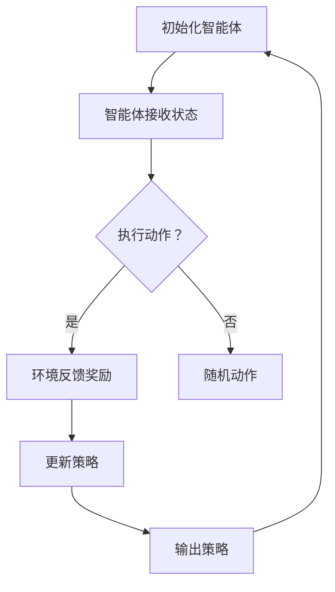
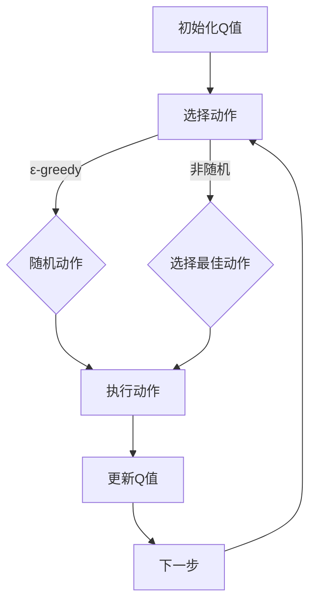
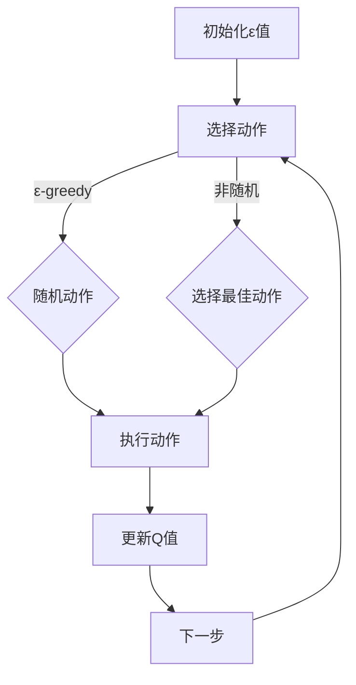
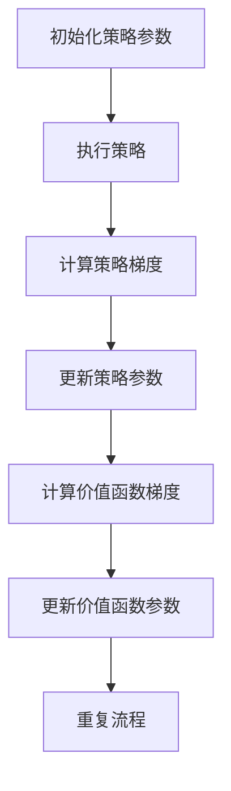
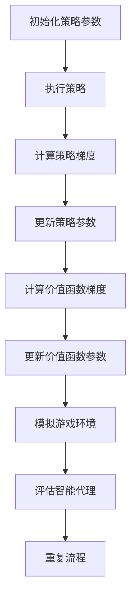

                 

# 文章标题: Python机器学习实战：强化学习(Reinforcement Learning)基础介绍

> 关键词：Python, 机器学习，强化学习，Q-Learning，Sarsa，ε-greedy，策略梯度方法，深度强化学习，AlphaGo，自动驾驶，机器人控制，资源分配

> 摘要：本文将深入探讨Python中强化学习（Reinforcement Learning）的基础概念、算法原理以及其在现实世界中的应用。我们将从强化学习的定义、核心组成部分、与传统机器学习的对比入手，逐步介绍强化学习的基础算法如Q-Learning和Sarsa，然后详细探讨离散状态和动作空间下的应用，接着探讨连续状态和动作空间下的强化学习算法。文章最后将讨论强化学习中的探索与利用策略、政策梯度方法，并以案例研究的形式展示强化学习在游戏和现实世界中的应用。

## 第一部分: Python机器学习实战：强化学习(Reinforcement Learning)基础介绍

### 第1章: 强化学习概述

#### 1.1 强化学习的概念与历史

强化学习是一种机器学习方法，其核心思想是通过智能体（Agent）与环境的交互来学习最优策略（Policy）。强化学习起源于20世纪50年代，当时心理学家和行为科学家开始研究动物如何通过试错（Trial and Error）来学习行为。1952年，Richard Sutton和Andrew Barto出版的《Reinforcement Learning: An Introduction》被视为强化学习领域的里程碑之作，奠定了强化学习理论的基础。

#### 1.1.1 强化学习的定义

强化学习可以定义为一个无监督学习问题，其中智能体通过环境（Environment）接收状态（State），执行动作（Action），并从环境中获得奖励（Reward）。其目标是通过最大化长期奖励来学习最优策略。强化学习的数学模型可以用以下公式表示：

\[ R(s, a) = \sum_{t=0}^{\infty} \gamma^t R(s_t, a_t) \]

其中，\( R(s, a) \)是状态-动作值函数，表示在状态\( s \)下执行动作\( a \)的长期累积奖励；\( s_t \)和\( a_t \)分别是时间步\( t \)的状态和动作；\( \gamma \)是折扣因子，用于考虑未来奖励的现值。

#### 1.1.2 强化学习的核心组成部分

强化学习系统主要由以下四个组成部分构成：

- **状态（State）**：智能体当前所处的环境状态。
- **动作（Action）**：智能体能够采取的行为。
- **奖励（Reward）**：环境对智能体动作的反馈，表示智能体动作的好坏。
- **状态转移概率（State Transition Probability）**：智能体在执行某一动作后，转移到下一个状态的概率。

#### 1.1.3 强化学习算法的分类

强化学习算法可以根据学习策略的不同分为以下几类：

- **值函数方法**：通过学习状态-动作值函数来优化策略。
- **策略方法**：直接学习最优策略，无需学习值函数。
- **模型学习方法**：同时学习状态转移概率和奖励函数。

#### 1.2 强化学习与传统机器学习对比

强化学习与传统机器学习（如监督学习和无监督学习）在许多方面存在显著差异。

#### 1.2.1 特点对比

- **强化学习**：试错 + 学习 + 策略迭代
- **传统机器学习**：数据驱动 + 算法优化

#### 1.2.2 应用的差异

- **强化学习**：适用于探索性环境，如游戏、自动驾驶、机器人控制等。
- **传统机器学习**：适用于结构化数据，如图像分类、文本分类、回归分析等。

#### 1.3 强化学习应用领域

强化学习在多个领域展示了其强大的应用潜力：

- **自动驾驶**：强化学习可以帮助自动驾驶车辆学习如何在复杂的交通环境中做出决策。
- **游戏开发**：强化学习可以用于训练智能代理，使其在电子游戏中达到人类级别的水平。
- **机器人控制**：强化学习可以帮助机器人学习复杂的运动和操作技能。
- **能源管理**：强化学习可以用于优化能源分配和电网调度。

### 第2章: 强化学习基础算法原理

#### 2.1 Q-Learning算法

Q-Learning是一种值函数方法，通过学习状态-动作值函数来优化策略。其基本思想是：在给定当前状态和动作的情况下，根据奖励和下一个状态-动作值来更新当前状态-动作值。

#### 2.1.1 Q-Learning的概念

- **Q值函数（Q-Function）**：表示在某一状态下执行某一动作的长期累积奖励。
- **Q-Learning的更新策略**：使用以下公式更新Q值：

  \[ Q(s_t, a_t) \leftarrow Q(s_t, a_t) + \alpha [R(s_{t+1}, a_{t+1}) + \gamma \max_{a'} Q(s_{t+1}, a') - Q(s_t, a_t)] \]

  其中，\( \alpha \)是学习率，\( \gamma \)是折扣因子。

#### 2.1.2 Q-Learning的优缺点

- **优点**：简单易懂，易于实现。
- **缺点**：可能陷入局部最优，收敛速度较慢。

#### 2.2 Sarsa算法

Sarsa（State-Action-Reward-State-Action）算法是一种基于策略的方法，通过直接学习最优策略来优化行为。

#### 2.2.1 Sarsa的概念

- **转换函数（Sarsa-λλ）**：表示在给定当前状态和动作的情况下，智能体采取当前动作的概率。
- **Sarsa的更新策略**：使用以下公式更新Q值：

  \[ Q(s_t, a_t) \leftarrow Q(s_t, a_t) + \alpha [R(s_{t+1}, a_{t+1}) + \gamma Q(s_{t+1}, a_{t+1}) - Q(s_t, a_t)] \]

#### 2.2.2 Sarsa的优缺点

- **优点**：避免了Q-Learning可能陷入局部最优的问题。
- **缺点**：收敛速度较慢，对动作概率分布敏感。

#### 2.3 Q-Learning与Sarsa算法对比

- **相似点**：都使用奖励和下一个状态-动作值来更新当前状态-动作值。
- **不同点**：Q-Learning是值函数方法，而Sarsa是策略方法。

### 第3章: 离散状态和动作空间下的强化学习

#### 3.1 离散状态和动作空间下的Q-Learning

在离散状态和动作空间下，Q-Learning算法可以表示为以下形式：

\[ Q(s, a) \leftarrow Q(s, a) + \alpha [R(s', a') + \gamma \max_{a'} Q(s', a') - Q(s, a)] \]

其中，\( s \)和\( a \)分别表示当前状态和动作，\( s' \)和\( a' \)分别表示下一状态和动作。

#### 3.2 SARSA算法在离散状态和动作空间下的应用

在离散状态和动作空间下，Sarsa算法可以表示为以下形式：

\[ Q(s, a) \leftarrow Q(s, a) + \alpha [R(s', a') + \gamma Q(s', a')] \]

其中，\( s \)和\( a \)分别表示当前状态和动作，\( s' \)和\( a' \)分别表示下一状态和动作。

### 第4章: 连续状态和动作空间的强化学习

在连续状态和动作空间下，强化学习算法需要适应新的计算模式。以下分别介绍Q-Learning和Sarsa算法在连续状态和动作空间下的应用。

#### 4.1 连续状态和动作空间的Q-Learning

在连续状态和动作空间下，Q-Learning算法可以表示为以下形式：

\[ Q(s, a) \leftarrow Q(s, a) + \alpha [R(s', a') + \gamma \max_{a'} Q(s', a')] \]

其中，\( s \)和\( a \)分别表示当前状态和动作，\( s' \)和\( a' \)分别表示下一状态和动作。

#### 4.2 SARSA算法在连续状态和动作空间下的应用

在连续状态和动作空间下，Sarsa算法可以表示为以下形式：

\[ Q(s, a) \leftarrow Q(s, a) + \alpha [R(s', a') + \gamma Q(s', a')] \]

其中，\( s \)和\( a \)分别表示当前状态和动作，\( s' \)和\( a' \)分别表示下一状态和动作。

### 第5章: 强化学习中的探索与利用

在强化学习中，探索与利用是一个重要的平衡问题。探索（Exploration）是指智能体在执行动作时尝试新的状态和动作，以获得更多的信息；利用（Exploitation）是指智能体根据已有的信息选择最优的动作，以最大化当前状态下的奖励。

#### 5.1 探索与利用的概念

- **探索**：智能体在执行动作时尝试新的状态和动作，以获得更多的信息。
- **利用**：智能体根据已有的信息选择最优的动作，以最大化当前状态下的奖励。

#### 5.2 ε-greedy策略

ε-greedy策略是一种常用的探索与利用策略。在ε-greedy策略中，智能体以概率\( 1 - \epsilon \)执行当前最优动作，以概率\( \epsilon \)随机选择动作。

#### 5.2.1 ε-greedy策略的定义

- **ε-greedy策略**：在给定当前状态\( s \)和动作\( a \)的情况下，以概率\( 1 - \epsilon \)执行当前最优动作，以概率\( \epsilon \)随机选择动作。

#### 5.2.2 ε-greedy策略的优缺点

- **优点**：简单易懂，易于实现。
- **缺点**：当ε值较大时，可能导致智能体在初始阶段过度探索，而当ε值较小时，可能导致智能体在后期过度利用。

#### 5.3 贪心策略（Greedy Strategy）

贪心策略是指智能体总是选择当前状态下期望奖励最大的动作。

#### 5.3.1 贪心策略的定义

- **贪心策略**：在给定当前状态\( s \)的情况下，选择当前状态下期望奖励最大的动作。

#### 5.3.2 贪心策略的优缺点

- **优点**：简单易懂，易于实现。
- **缺点**：可能导致智能体陷入局部最优，无法达到全局最优。

### 第6章: 策略梯度方法

策略梯度方法是一类直接优化策略的方法，通过计算策略梯度的方向来更新策略参数。策略梯度方法主要包括REINFORCE算法和Actor-Critic方法。

#### 6.1 政策梯度方法的概念

- **政策梯度方法**：通过计算策略梯度的方向来更新策略参数。

#### 6.1.1 政策梯度方法的定义

- **政策梯度方法**：给定策略参数\( \theta \)，计算策略梯度的方向\( \nabla_{\theta} J(\theta) \)，并沿着该方向更新策略参数。

#### 6.1.2 政策梯度方法的优点

- **优点**：不需要学习状态-动作值函数，直接优化策略。
- **缺点**：可能存在收敛速度较慢、对初始策略敏感等问题。

#### 6.2 REINFORCE算法

REINFORCE算法是一种基于策略的梯度方法，通过计算策略梯度的方向来更新策略参数。

#### 6.2.1 REINFORCE算法的概念

- **REINFORCE算法**：给定策略参数\( \theta \)，计算策略梯度的方向\( \nabla_{\theta} J(\theta) \)，并沿着该方向更新策略参数。

#### 6.2.2 REINFORCE算法的更新策略

\[ \theta \leftarrow \theta - \alpha \nabla_{\theta} J(\theta) \]

其中，\( \alpha \)是学习率。

#### 6.2.3 REINFORCE算法的优缺点

- **优点**：简单易懂，易于实现。
- **缺点**：可能存在收敛速度较慢、对初始策略敏感等问题。

#### 6.3 Actor-Critic方法

Actor-Critic方法是一种结合了策略和值函数的方法，通过分别学习策略参数和值函数来优化策略。

#### 6.3.1 Actor-Critic方法的概念

- **Actor-Critic方法**：同时学习策略参数和值函数，并使用值函数的误差来更新策略参数。

#### 6.3.2 Actor-Critic方法的组成部分

- **Actor**：学习策略参数。
- **Critic**：学习值函数。

#### 6.3.3 Actor-Critic方法的更新策略

- **Actor更新策略**：

  \[ \theta \leftarrow \theta - \alpha \nabla_{\theta} J(\theta) \]

- **Critic更新策略**：

  \[ V(s) \leftarrow V(s) + \alpha [R(s', a') - V(s')] \]

#### 6.3.4 Actor-Critic方法的优缺点

- **优点**：结合了策略和值函数的优点，收敛速度相对较快。
- **缺点**：对初始策略和值函数的选取敏感。

### 第7章: 案例研究：强化学习在游戏中的应用

强化学习在游戏开发中有着广泛的应用，特别是在训练智能代理以实现自主游戏。以下以AlphaGo为例，探讨强化学习在游戏中的应用。

#### 7.1 游戏强化学习的概述

- **游戏强化学习的定义**：通过强化学习算法训练智能代理，使其在游戏中达到人类级别的水平。
- **游戏强化学习的挑战**：如何处理游戏状态空间和动作空间的大规模，以及如何解决奖励设计的问题。
- **游戏强化学习的目标**：通过强化学习算法，使智能代理能够在游戏中实现自主学习和决策。

#### 7.2 案例研究：AlphaGo与深度强化学习

AlphaGo是由DeepMind开发的一款围棋人工智能程序。AlphaGo的成功标志着深度强化学习在游戏中的应用取得了重大突破。

- **AlphaGo的背景**：AlphaGo在2016年与李世石的对决中取得了4-1的胜利，震惊了全球。
- **AlphaGo的技术架构**：AlphaGo采用了深度强化学习方法，通过自我对弈来训练。
- **AlphaGo在围棋中的表现**：AlphaGo展现了超强的围棋技巧，能够预测对手的策略并制定有效的应对策略。

#### 7.3 深度强化学习在游戏中的应用

- **深度强化学习算法的选择**：深度强化学习算法的选择取决于游戏的具体需求和特点。
- **游戏强化学习的挑战与解决方案**：解决游戏状态空间和动作空间的大规模问题，设计有效的奖励机制，以及如何应对不同类型的游戏。

### 第8章: 强化学习在现实世界中的应用

强化学习在现实世界中的应用非常广泛，以下分别介绍强化学习在自动驾驶、机器人控制和资源分配中的应用。

#### 8.1 强化学习在自动驾驶中的应用

- **自动驾驶的挑战**：自动驾驶面临着复杂的交通环境、实时决策和安全性等问题。
- **强化学习在自动驾驶中的应用**：强化学习可以用于训练自动驾驶车辆在复杂环境中的决策策略。
- **自动驾驶系统的架构**：自动驾驶系统通常包括感知、规划和控制三个模块。

#### 8.2 强化学习在机器人控制中的应用

- **机器人控制的挑战**：机器人控制需要处理复杂的运动控制和操作任务。
- **强化学习在机器人控制中的应用**：强化学习可以用于训练机器人学习复杂的运动和操作技能。
- **机器人控制系统的架构**：机器人控制系统通常包括感知、规划和执行三个模块。

#### 8.3 强化学习在资源分配中的应用

- **资源分配的挑战**：资源分配需要考虑多目标优化、实时调度和高效利用等问题。
- **强化学习在资源分配中的应用**：强化学习可以用于优化能源分配、交通调度和库存管理。
- **资源分配系统的架构**：资源分配系统通常包括感知、规划和执行三个模块。

### 附录

#### 附录 A: 强化学习资源与工具

- **主流强化学习框架**：TensorFlow Agent、PyTorch RL、OpenAI Gym
- **强化学习论文推荐**：《Deep Reinforcement Learning》、《Algorithms for Reinforcement Learning》、《Human-Level Control through Deep Reinforcement Learning》

#### 附录 B: Python代码示例

- **Q-Learning算法实现**
- **SARSA算法实现**
- **REINFORCE算法实现**
- **Actor-Critic算法实现**

## 作者信息

- 作者：AI天才研究院/AI Genius Institute & 禅与计算机程序设计艺术 /Zen And The Art of Computer Programming

## 第1章: 强化学习概述

### 1.1 强化学习的概念与历史

强化学习（Reinforcement Learning，简称RL）是机器学习的一个重要分支，它模拟了人类和动物通过试错学习行为的过程。强化学习的核心思想是，智能体（agent）通过与环境的互动来学习如何在给定的情境（状态，state）下选择最佳的动作（action），从而获得最大的累积奖励（reward）。

#### 1.1.1 强化学习的定义

强化学习可以定义为一个在不确定环境中通过探索（exploration）和利用（exploitation）来学习最优策略（policy）的过程。在这个过程中，智能体不断地从环境中接收状态，执行动作，并接收奖励或惩罚。智能体的目标是通过不断学习和调整其行为策略，最大化长期累积奖励。

强化学习的数学模型通常可以用以下公式来表示：

\[ R(s, a) = \sum_{t=0}^{\infty} \gamma^t R(s_t, a_t) \]

其中：
- \( R(s, a) \) 是在状态 \( s \) 下执行动作 \( a \) 的长期累积奖励。
- \( s_t \) 和 \( a_t \) 分别是时间步 \( t \) 的状态和动作。
- \( \gamma \) 是折扣因子，用于考虑未来奖励的现值。

#### 1.1.2 强化学习的核心组成部分

强化学习系统主要由以下几个核心组成部分构成：

1. **状态（State）**：描述智能体在某一时刻所处的环境状态。
2. **动作（Action）**：智能体可以采取的可能的行动。
3. **奖励（Reward）**：环境对智能体采取的动作的即时反馈，用于指导智能体的学习过程。
4. **状态转移概率（State Transition Probability）**：智能体在某一状态下采取某一动作后，转移到下一个状态的概率。
5. **策略（Policy）**：智能体在给定状态下选择动作的策略。
6. **价值函数（Value Function）**：表示在某一状态下采取某一动作的预期累积奖励。
7. **模型（Model）**：描述环境状态转移和奖励机制的函数。

#### 1.1.3 强化学习算法的分类

强化学习算法可以根据不同的分类标准进行分类，以下是几种常见的分类方法：

1. **根据学习策略分类**：
   - **值函数方法**：通过学习状态-动作值函数来优化策略。
   - **策略方法**：直接学习最优策略，无需学习值函数。
   - **模型学习方法**：同时学习状态转移概率和奖励函数。

2. **根据状态和动作空间分类**：
   - **离散状态和动作空间**：状态和动作都是离散的。
   - **连续状态和动作空间**：状态和动作都是连续的。

3. **根据学习方式分类**：
   - **模型依赖方法**：智能体需要关于环境的先验知识，如马尔可夫决策过程（MDP）。
   - **模型无关方法**：智能体不需要关于环境的先验知识，如深度强化学习。

#### 1.1.4 强化学习的核心组成部分

强化学习系统主要由以下四个组成部分构成：

- **状态（State）**：智能体当前所处的环境状态。
- **动作（Action）**：智能体能够采取的行为。
- **奖励（Reward）**：环境对智能体动作的反馈，表示智能体动作的好坏。
- **状态转移概率（State Transition Probability）**：智能体在执行某一动作后，转移到下一个状态的概率。

### 1.2 强化学习与传统机器学习对比

强化学习与传统机器学习（如监督学习和无监督学习）在多个方面存在显著差异。

#### 1.2.1 特点对比

- **强化学习**：通过与环境互动学习，依赖于奖励机制。
- **传统机器学习**：基于数据学习，不依赖奖励机制。

#### 1.2.2 应用的差异

- **强化学习**：适用于探索性环境，如自动驾驶、游戏等。
- **传统机器学习**：适用于结构化数据，如图像分类、文本分类等。

### 1.3 强化学习应用领域

强化学习在多个领域展示了其强大的应用潜力：

- **自动驾驶**：强化学习可以帮助自动驾驶车辆学习如何在复杂的交通环境中做出决策。
- **游戏开发**：强化学习可以用于训练智能代理，使其在电子游戏中达到人类级别的水平。
- **机器人控制**：强化学习可以帮助机器人学习复杂的运动和操作技能。
- **能源管理**：强化学习可以用于优化能源分配和电网调度。

### 1.4 强化学习的挑战

虽然强化学习在许多领域取得了显著的成果，但仍然面临以下挑战：

- **收敛性**：如何保证算法收敛到最优策略。
- **探索与利用**：如何在探索新策略和利用已有策略之间找到平衡。
- **计算效率**：如何处理大规模的状态和动作空间。

### 1.5 强化学习的发展趋势

随着深度学习技术的发展，深度强化学习（Deep Reinforcement Learning）成为了研究的热点。深度强化学习结合了深度神经网络和强化学习，使得智能体能够处理高维状态和动作空间。未来，强化学习有望在更多领域取得突破性进展。

### 1.6 小结

本章介绍了强化学习的基本概念、核心组成部分、与传统机器学习的对比以及强化学习的应用领域。下一章将深入探讨强化学习的基础算法原理。

### 1.7 Mermaid 流程图

以下是一个简单的Mermaid流程图，展示了强化学习的基本流程：



### 1.8 核心概念与联系

- **强化学习**：通过与环境互动，学习最优策略。
- **状态**：描述智能体的当前环境。
- **动作**：智能体可采取的行为。
- **奖励**：指导智能体行为的好与坏。
- **策略**：智能体如何选择动作。

### 1.9 数学模型和公式

强化学习的数学模型如下：

\[ Q(s, a) = \sum_{t=0}^{\infty} \gamma^t R(s_t, a_t) \]

其中：
- \( Q(s, a) \)：状态-动作值函数。
- \( s_t \)：时间步 \( t \) 的状态。
- \( a_t \)：时间步 \( t \) 的动作。
- \( \gamma \)：折扣因子。

### 1.10 举例说明

假设有一个智能体在一个简单的环境中学习移动，目标是到达目标位置并获得奖励。以下是强化学习的学习过程：

1. **初始化**：智能体随机选择一个位置。
2. **接收状态**：智能体观察当前状态（位置）。
3. **执行动作**：智能体选择向某个方向移动。
4. **环境反馈奖励**：如果移动到了目标位置，则获得奖励；否则，获得惩罚。
5. **更新策略**：根据奖励和下一个状态更新策略。
6. **重复过程**：智能体不断重复以上过程，逐渐学习最优策略。

### 1.11 深入阅读

- Sutton & Barto的《Reinforcement Learning: An Introduction》
- 《Deep Reinforcement Learning》

## 第2章: 强化学习基础算法原理

### 2.1 Q-Learning算法

Q-Learning算法是一种基于值函数的强化学习算法，其核心思想是通过学习状态-动作值函数来优化智能体的策略。Q-Learning算法通过不断更新Q值来逼近最优策略。

#### 2.1.1 Q-Learning的概念

Q-Learning算法中的Q值（Q-Function）表示在给定状态和动作下，智能体采取该动作获得的累积奖励。Q-Learning的目标是学习一个最优的Q值函数，使得智能体在执行动作时能够选择能够获得最大累积奖励的动作。

Q-Learning算法的核心更新策略是：

\[ Q(s_t, a_t) \leftarrow Q(s_t, a_t) + \alpha [R(s_{t+1}, a_{t+1}) + \gamma \max_{a'} Q(s_{t+1}, a') - Q(s_t, a_t)] \]

其中：
- \( Q(s_t, a_t) \)：在时间步 \( t \) 状态 \( s_t \) 下，执行动作 \( a_t \) 的Q值。
- \( R(s_{t+1}, a_{t+1}) \)：在时间步 \( t+1 \) 状态 \( s_{t+1} \) 下，执行动作 \( a_{t+1} \) 所获得的即时奖励。
- \( \gamma \)：折扣因子，用于平衡当前奖励和未来奖励的重要性。
- \( \alpha \)：学习率，用于控制新信息对Q值的更新程度。
- \( \max_{a'} Q(s_{t+1}, a') \)：在状态 \( s_{t+1} \) 下，所有可能动作中的最大Q值。

#### 2.1.2 Q-Learning算法的优缺点

**优点：**
- **简单易实现**：Q-Learning算法的核心思想简单，易于实现和调试。
- **适用范围广**：Q-Learning算法适用于大多数具有确定性的环境。

**缺点：**
- **收敛速度慢**：在具有多个局部最优解的环境中，Q-Learning算法可能收敛到次优解。
- **需要大量样本**：为了学习准确的Q值，Q-Learning算法需要大量的样本数据。

### 2.2 Sarsa算法

Sarsa（State-Action-Reward-State-Action）算法是一种基于策略的强化学习算法，它与Q-Learning算法的主要区别在于，Sarsa算法使用实际执行的动作来更新Q值，而不是使用期望动作。

#### 2.2.1 Sarsa的概念

Sarsa算法的核心更新策略是：

\[ Q(s_t, a_t) \leftarrow Q(s_t, a_t) + \alpha [R(s_{t+1}, a_{t+1}) + \gamma Q(s_{t+1}, a_{t+1}) - Q(s_t, a_t)] \]

其中：
- \( Q(s_t, a_t) \)：在时间步 \( t \) 状态 \( s_t \) 下，执行动作 \( a_t \) 的Q值。
- \( R(s_{t+1}, a_{t+1}) \)：在时间步 \( t+1 \) 状态 \( s_{t+1} \) 下，执行动作 \( a_{t+1} \) 所获得的即时奖励。
- \( \gamma \)：折扣因子，用于平衡当前奖励和未来奖励的重要性。
- \( \alpha \)：学习率，用于控制新信息对Q值的更新程度。
- \( a_{t+1} \)：在时间步 \( t+1 \) 状态 \( s_{t+1} \) 下实际执行的动作。

#### 2.2.2 Sarsa算法的优缺点

**优点：**
- **避免局部最优**：由于Sarsa算法使用实际执行的动作来更新Q值，因此它不容易陷入局部最优。
- **适用范围广**：Sarsa算法适用于具有不确定性或部分信息的环境。

**缺点：**
- **收敛速度相对较慢**：与Q-Learning算法相比，Sarsa算法的收敛速度可能较慢。
- **需要较大的记忆容量**：由于Sarsa算法需要存储状态-动作对及其对应的Q值，因此它需要较大的记忆容量。

### 2.3 Q-Learning与Sarsa算法对比

**相似点：**
- **核心思想**：Q-Learning和Sarsa算法都是通过学习状态-动作值函数来优化策略。
- **更新策略**：两者都使用奖励和未来的Q值来更新当前的Q值。

**不同点：**
- **动作选择**：Q-Learning使用期望动作来更新Q值，而Sarsa算法使用实际执行的动作来更新Q值。
- **收敛速度**：Sarsa算法通常收敛速度较慢。
- **适用环境**：Q-Learning算法适用于确定性环境，而Sarsa算法适用于具有不确定性的环境。

### 2.4 算法在离散状态和动作空间下的应用

在离散状态和动作空间下，Q-Learning和Sarsa算法的应用相对简单。以下是它们在离散状态和动作空间下的应用：

#### 2.4.1 Q-Learning算法在离散状态和动作空间下的应用

在离散状态和动作空间下，Q-Learning算法的核心更新策略可以表示为：

\[ Q(s_t, a_t) \leftarrow Q(s_t, a_t) + \alpha [R(s_{t+1}, a_{t+1}) + \gamma \max_{a'} Q(s_{t+1}, a')] \]

其中：
- \( s_t \)：时间步 \( t \) 的状态。
- \( a_t \)：时间步 \( t \) 的动作。
- \( s_{t+1} \)：时间步 \( t+1 \) 的状态。
- \( a_{t+1} \)：时间步 \( t+1 \) 的动作。
- \( \alpha \)：学习率。
- \( \gamma \)：折扣因子。

#### 2.4.2 Sarsa算法在离散状态和动作空间下的应用

在离散状态和动作空间下，Sarsa算法的核心更新策略可以表示为：

\[ Q(s_t, a_t) \leftarrow Q(s_t, a_t) + \alpha [R(s_{t+1}, a_{t+1}) + \gamma Q(s_{t+1}, a_{t+1})] \]

其中：
- \( s_t \)：时间步 \( t \) 的状态。
- \( a_t \)：时间步 \( t \) 的动作。
- \( s_{t+1} \)：时间步 \( t+1 \) 的状态。
- \( a_{t+1} \)：时间步 \( t+1 \) 的动作。
- \( \alpha \)：学习率。
- \( \gamma \)：折扣因子。

### 2.5 核心算法原理讲解

以下是Q-Learning和Sarsa算法的核心算法原理讲解，使用伪代码进行描述。

#### 2.5.1 Q-Learning算法原理

```python
# Q-Learning算法伪代码

Initialize Q(s, a) with random values
while not termination_condition:
    s_t = current_state()
    a_t = choose_action(s_t, epsilon)  # epsilon-greedy policy
    s_{t+1}, r_t = environment.step(a_t)
    a_{t+1} = choose_action(s_{t+1}, epsilon)  # epsilon-greedy policy
    Q(s_t, a_t) = Q(s_t, a_t) + alpha * (r_t + gamma * max(Q(s_{t+1}, a')) - Q(s_t, a_t))
    s_t = s_{t+1}
    a_t = a_{t+1}
return Q
```

#### 2.5.2 Sarsa算法原理

```python
# Sarsa算法伪代码

Initialize Q(s, a) with random values
while not termination_condition:
    s_t = current_state()
    a_t = choose_action(s_t, epsilon)  # epsilon-greedy policy
    s_{t+1}, r_t = environment.step(a_t)
    a_{t+1} = choose_action(s_{t+1}, epsilon)  # epsilon-greedy policy
    Q(s_t, a_t) = Q(s_t, a_t) + alpha * (r_t + gamma * Q(s_{t+1}, a_{t+1}) - Q(s_t, a_t))
    s_t = s_{t+1}
    a_t = a_{t+1}
return Q
```

### 2.6 数学模型和公式

以下是Q-Learning和Sarsa算法的核心数学模型和公式。

#### Q-Learning算法

\[ Q(s_t, a_t) \leftarrow Q(s_t, a_t) + \alpha [R(s_{t+1}, a_{t+1}) + \gamma \max_{a'} Q(s_{t+1}, a') - Q(s_t, a_t)] \]

#### Sarsa算法

\[ Q(s_t, a_t) \leftarrow Q(s_t, a_t) + \alpha [R(s_{t+1}, a_{t+1}) + \gamma Q(s_{t+1}, a_{t+1}) - Q(s_t, a_t)] \]

### 2.7 举例说明

假设有一个智能体在一个简单的网格世界中学习移动，目标是到达终点并获得奖励。以下是Q-Learning和Sarsa算法的学习过程。

#### Q-Learning算法

1. 初始化Q值。
2. 智能体随机选择起始位置。
3. 智能体选择向某个方向移动。
4. 智能体接收环境反馈的奖励。
5. 更新Q值。
6. 重复过程。

#### Sarsa算法

1. 初始化Q值。
2. 智能体随机选择起始位置。
3. 智能体选择向某个方向移动。
4. 智能体接收环境反馈的奖励。
5. 更新Q值。
6. 重复过程。

### 2.8 深入阅读

- Sutton & Barto的《Reinforcement Learning: An Introduction》
- 《Deep Reinforcement Learning》

## 第3章: 离散状态和动作空间下的强化学习

在离散状态和动作空间下，强化学习算法的应用变得更为直观和易于实现。本章将详细介绍Q-Learning和Sarsa算法在离散状态和动作空间下的应用，以及如何通过实际案例来理解这些算法的运作原理。

### 3.1 离散状态和动作空间的概念

离散状态和动作空间是指状态和动作的集合是有限的。例如，一个简单的游戏环境可能只有几个不同的状态（如游戏中的关卡）和几个不同的动作（如移动、攻击）。在这种环境中，智能体可以通过有限的状态-动作对来表示其行为。

#### 3.1.1 状态空间表示

状态空间可以用一个有限的集合来表示，例如：

\[ S = \{s_1, s_2, s_3, \ldots, s_n\} \]

其中，\( n \)是状态空间的维度，每个状态\( s_i \)是一个具体的状态实例。

#### 3.1.2 动作空间表示

动作空间也可以用类似的有限集合来表示，例如：

\[ A = \{a_1, a_2, a_3, \ldots, a_m\} \]

其中，\( m \)是动作空间的维度，每个动作\( a_j \)是一个具体的动作实例。

### 3.2 Q-Learning算法在离散状态和动作空间下的应用

在离散状态和动作空间下，Q-Learning算法的基本框架保持不变，但需要对状态和动作的表示进行适当的调整。以下是Q-Learning算法在离散状态和动作空间下的基本流程：

1. **初始化Q值**：初始化所有状态-动作对的Q值，通常设为0或者随机值。
2. **选择动作**：使用ε-greedy策略选择动作，即在一定概率下随机选择动作，在剩余概率下选择当前状态下的最佳动作。
3. **执行动作**：智能体执行选择的动作，并进入新的状态，同时获得环境的即时奖励。
4. **更新Q值**：使用Q-Learning的更新公式更新当前状态-动作对的Q值。
5. **重复过程**：重复上述步骤，直到满足终止条件（如达到目标状态、经历足够多的时间步等）。

以下是Q-Learning算法在离散状态和动作空间下的伪代码：

```python
# Q-Learning算法在离散状态和动作空间下的伪代码

Initialize Q(s, a) with random values
while not termination_condition:
    s_t = current_state()
    a_t = choose_action(s_t, epsilon)  # ε-greedy policy
    s_{t+1}, r_t = environment.step(a_t)
    a_{t+1} = choose_action(s_{t+1}, epsilon)  # ε-greedy policy
    Q(s_t, a_t) = Q(s_t, a_t) + alpha * (r_t + gamma * max(Q(s_{t+1}, a)) - Q(s_t, a_t))
    s_t = s_{t+1}
    a_t = a_{t+1}
return Q
```

### 3.3 SARSA算法在离散状态和动作空间下的应用

SARSA算法在离散状态和动作空间下的应用与Q-Learning算法类似，但使用实际执行的动作来更新Q值。以下是SARSA算法在离散状态和动作空间下的基本流程：

1. **初始化Q值**：初始化所有状态-动作对的Q值，通常设为0或者随机值。
2. **选择动作**：使用ε-greedy策略选择动作，即在一定概率下随机选择动作，在剩余概率下选择当前状态下的最佳动作。
3. **执行动作**：智能体执行选择的动作，并进入新的状态，同时获得环境的即时奖励。
4. **更新Q值**：使用SARSA的更新公式更新当前状态-动作对的Q值。
5. **重复过程**：重复上述步骤，直到满足终止条件（如达到目标状态、经历足够多的时间步等）。

以下是SARSA算法在离散状态和动作空间下的伪代码：

```python
# SARSA算法在离散状态和动作空间下的伪代码

Initialize Q(s, a) with random values
while not termination_condition:
    s_t = current_state()
    a_t = choose_action(s_t, epsilon)  # ε-greedy policy
    s_{t+1}, r_t = environment.step(a_t)
    a_{t+1} = choose_action(s_{t+1}, epsilon)  # ε-greedy policy
    Q(s_t, a_t) = Q(s_t, a_t) + alpha * (r_t + gamma * Q(s_{t+1}, a_{t+1}) - Q(s_t, a_t))
    s_t = s_{t+1}
    a_t = a_{t+1}
return Q
```

### 3.4 状态-动作对的表示

在离散状态和动作空间下，每个状态-动作对可以表示为一个多维数组或者字典。例如，假设状态空间有3个状态，动作空间有2个动作，我们可以用以下方式表示状态-动作对：

```python
# 状态-动作对的表示

Q = {
    ('s1', 'a1'): 0.0,
    ('s1', 'a2'): 0.0,
    ('s2', 'a1'): 0.0,
    ('s2', 'a2'): 0.0,
    ('s3', 'a1'): 0.0,
    ('s3', 'a2'): 0.0
}
```

### 3.5 Q值的更新策略

在Q-Learning和SARSA算法中，Q值的更新策略是算法的核心。以下是Q值更新策略的详细描述：

#### Q-Learning算法

\[ Q(s_t, a_t) \leftarrow Q(s_t, a_t) + alpha * (r_t + gamma * max(Q(s_{t+1}, a)) - Q(s_t, a_t)) \]

其中：
- \( Q(s_t, a_t) \)：当前状态-动作对的Q值。
- \( r_t \)：环境在当前状态-动作对下给予的即时奖励。
- \( alpha \)：学习率。
- \( gamma \)：折扣因子。
- \( max(Q(s_{t+1}, a)) \)：在下一个状态下所有可能动作中的最大Q值。

#### SARSA算法

\[ Q(s_t, a_t) \leftarrow Q(s_t, a_t) + alpha * (r_t + gamma * Q(s_{t+1}, a_{t+1}) - Q(s_t, a_t)) \]

其中：
- \( Q(s_t, a_t) \)：当前状态-动作对的Q值。
- \( r_t \)：环境在当前状态-动作对下给予的即时奖励。
- \( alpha \)：学习率。
- \( gamma \)：折扣因子。
- \( Q(s_{t+1}, a_{t+1}) \)：在下一个状态下执行下一个动作的Q值。

### 3.6 离散状态和动作空间下的实际案例

为了更好地理解Q-Learning和SARSA算法在离散状态和动作空间下的应用，我们可以通过一个简单的案例来展示它们的运作原理。

#### 案例：简单的网格世界

假设我们有一个简单的网格世界，智能体可以从一个位置移动到相邻的四个方向（上、下、左、右）。每个位置都有不同的奖励，目标是到达终点并获得最大的奖励。以下是这个案例的详细描述：

1. **状态空间**：每个状态是一个网格位置，用坐标表示。
2. **动作空间**：每个动作是一个方向，用向量表示。
3. **奖励**：每个状态-动作对都有一个即时奖励，根据到达的位置不同而不同。
4. **Q值**：初始时所有Q值都设置为0。

以下是Q-Learning算法和SARSA算法在这个案例中的实现：

```python
# 离散状态和动作空间下的Q-Learning算法实现

# 初始化Q值
Q = {}

# 状态空间
S = [(0, 0), (0, 1), (1, 0), (1, 1)]

# 动作空间
A = ['up', 'down', 'left', 'right']

# 学习参数
alpha = 0.1
gamma = 0.9
epsilon = 0.1

# 选择动作的ε-greedy策略
def choose_action(state, epsilon):
    if random.random() < epsilon:
        return random.choice(A)
    else:
        return max(Q[state], key=Q[state].get)

# 环境的step函数
def environment.step(action):
    state, reward = execute_action(action)
    next_state = determine_next_state(state, action)
    return next_state, reward

# 执行动作
def execute_action(action):
    # 根据动作移动到新的位置，并计算奖励
    # ...
    return new_state, reward

# 确定下一个状态
def determine_next_state(state, action):
    # 根据动作确定下一个状态
    # ...
    return next_state

# Q值更新
def update_Q(state, action, reward, next_state):
    Q[state][action] = Q[state][action] + alpha * (reward + gamma * max(Q[next_state].values()) - Q[state][action])

# 主循环
while not termination_condition:
    state = current_state()
    action = choose_action(state, epsilon)
    next_state, reward = environment.step(action)
    update_Q(state, action, reward, next_state)
    state = next_state
```

```python
# 离散状态和动作空间下的SARSA算法实现

# 初始化Q值
Q = {}

# 状态空间
S = [(0, 0), (0, 1), (1, 0), (1, 1)]

# 动作空间
A = ['up', 'down', 'left', 'right']

# 学习参数
alpha = 0.1
gamma = 0.9
epsilon = 0.1

# 选择动作的ε-greedy策略
def choose_action(state, epsilon):
    if random.random() < epsilon:
        return random.choice(A)
    else:
        return max(Q[state], key=Q[state].get)

# 环境的step函数
def environment.step(action):
    state, reward = execute_action(action)
    next_state = determine_next_state(state, action)
    return next_state, reward

# 执行动作
def execute_action(action):
    # 根据动作移动到新的位置，并计算奖励
    # ...
    return new_state, reward

# 确定下一个状态
def determine_next_state(state, action):
    # 根据动作确定下一个状态
    # ...
    return next_state

# Q值更新
def update_Q(state, action, reward, next_state, action_prime):
    Q[state][action] = Q[state][action] + alpha * (reward + gamma * Q[next_state][action_prime] - Q[state][action])

# 主循环
while not termination_condition:
    state = current_state()
    action = choose_action(state, epsilon)
    next_state, reward = environment.step(action)
    action_prime = choose_action(next_state, epsilon)
    update_Q(state, action, reward, next_state, action_prime)
    state = next_state
```

### 3.7 小结

本章详细介绍了Q-Learning和SARSA算法在离散状态和动作空间下的应用。通过一个简单的网格世界案例，展示了这些算法的基本流程、状态-动作对的表示以及Q值的更新策略。在实际应用中，我们可以根据具体环境的特点来调整算法参数，以实现最优的智能体行为。

### 3.8 Mermaid 流程图

以下是一个简单的Mermaid流程图，展示了Q-Learning算法在离散状态和动作空间下的基本流程：



### 3.9 核心概念与联系

- **状态空间**：描述智能体可能所处的所有状态。
- **动作空间**：描述智能体可以采取的所有动作。
- **Q值**：描述在某一状态下采取某一动作的预期累积奖励。
- **ε-greedy策略**：在探索和利用之间找到平衡的策略。

### 3.10 数学模型和公式

- **Q-Learning更新公式**：

  \[ Q(s_t, a_t) \leftarrow Q(s_t, a_t) + alpha * (r_t + gamma * max(Q(s_{t+1}, a)) - Q(s_t, a_t)) \]

- **SARSA更新公式**：

  \[ Q(s_t, a_t) \leftarrow Q(s_t, a_t) + alpha * (r_t + gamma * Q(s_{t+1}, a_{t+1}) - Q(s_t, a_t)) \]

### 3.11 举例说明

假设智能体在一个4x4的网格世界中移动，目标是从左上角（状态(0,0)）移动到右下角（状态(3,3)）。以下是Q-Learning和SARSA算法的学习过程：

1. **初始化Q值**：所有Q值设为0。
2. **选择动作**：智能体随机选择动作或根据ε-greedy策略选择最佳动作。
3. **执行动作**：智能体根据选择的动作移动到新的状态。
4. **更新Q值**：根据即时奖励和下一个状态的Q值更新当前状态的Q值。
5. **重复过程**：智能体不断重复上述步骤，直到达到目标状态或经历足够多的时间步。

### 3.12 深入阅读

- Sutton & Barto的《Reinforcement Learning: An Introduction》
- 《Deep Reinforcement Learning》

## 第4章: 连续状态和动作空间的强化学习

在许多实际应用中，状态和动作空间是连续的，这使得强化学习算法的设计和实现变得更加复杂。本章将详细介绍如何在连续状态和动作空间下应用强化学习算法，包括Q-Learning和Sarsa算法的调整和优化。

### 4.1 连续状态和动作空间的概念

连续状态和动作空间是指状态和动作的集合是无限的。例如，在自动驾驶中，车辆的速度、方向、距离等都是连续的；在机器人控制中，机器人的关节角度和手臂位置也是连续的。在这种环境中，智能体需要能够处理无限的状态-动作对。

#### 4.1.1 状态空间表示

在连续状态空间中，每个状态可以用一个多维向量来表示。例如，在自动驾驶中，状态可以表示为：

\[ s = [v, \theta, d] \]

其中，\( v \)是车辆的速度，\( \theta \)是车辆的方向，\( d \)是车辆与目标之间的距离。

#### 4.1.2 动作空间表示

在连续动作空间中，每个动作也可以用一个多维向量来表示。例如，在自动驾驶中，动作可以表示为：

\[ a = [u, \delta] \]

其中，\( u \)是车辆的加速度，\( \delta \)是车辆的方向调整。

### 4.2 Q-Learning算法在连续状态和动作空间下的应用

在连续状态和动作空间下，Q-Learning算法的核心思想不变，但需要对状态和动作的表示进行适当的调整。以下是Q-Learning算法在连续状态和动作空间下的基本流程：

1. **初始化Q值**：初始化所有状态-动作对的Q值，通常设为0或者使用随机值。
2. **选择动作**：使用ε-greedy策略选择动作，即在一定概率下随机选择动作，在剩余概率下选择当前状态下的最佳动作。
3. **执行动作**：智能体执行选择的动作，并进入新的状态，同时获得环境的即时奖励。
4. **更新Q值**：使用Q-Learning的更新公式更新当前状态-动作对的Q值。
5. **重复过程**：重复上述步骤，直到满足终止条件（如达到目标状态、经历足够多的时间步等）。

以下是Q-Learning算法在连续状态和动作空间下的伪代码：

```python
# Q-Learning算法在连续状态和动作空间下的伪代码

Initialize Q(s, a) with random values
while not termination_condition:
    s_t = current_state()
    a_t = choose_action(s_t, epsilon)  # ε-greedy policy
    s_{t+1}, r_t = environment.step(a_t)
    a_{t+1} = choose_action(s_{t+1}, epsilon)  # ε-greedy policy
    Q(s_t, a_t) = Q(s_t, a_t) + alpha * (r_t + gamma * max(Q(s_{t+1}, a)) - Q(s_t, a_t))
    s_t = s_{t+1}
    a_t = a_{t+1}
return Q
```

### 4.3 SARSA算法在连续状态和动作空间下的应用

SARSA算法在连续状态和动作空间下的应用与Q-Learning算法类似，但使用实际执行的动作来更新Q值。以下是SARSA算法在连续状态和动作空间下的基本流程：

1. **初始化Q值**：初始化所有状态-动作对的Q值，通常设为0或者随机值。
2. **选择动作**：使用ε-greedy策略选择动作，即在一定概率下随机选择动作，在剩余概率下选择当前状态下的最佳动作。
3. **执行动作**：智能体执行选择的动作，并进入新的状态，同时获得环境的即时奖励。
4. **更新Q值**：使用SARSA的更新公式更新当前状态-动作对的Q值。
5. **重复过程**：重复上述步骤，直到满足终止条件（如达到目标状态、经历足够多的时间步等）。

以下是SARSA算法在连续状态和动作空间下的伪代码：

```python
# SARSA算法在连续状态和动作空间下的伪代码

Initialize Q(s, a) with random values
while not termination_condition:
    s_t = current_state()
    a_t = choose_action(s_t, epsilon)  # ε-greedy policy
    s_{t+1}, r_t = environment.step(a_t)
    a_{t+1} = choose_action(s_{t+1}, epsilon)  # ε-greedy policy
    Q(s_t, a_t) = Q(s_t, a_t) + alpha * (r_t + gamma * Q(s_{t+1}, a_{t+1}) - Q(s_t, a_t))
    s_t = s_{t+1}
    a_t = a_{t+1}
return Q
```

### 4.4 状态-动作对的表示

在连续状态和动作空间下，状态-动作对通常使用多维数组或字典来表示。例如，假设状态空间由三个连续的变量组成，动作空间由两个连续的变量组成，我们可以使用以下方式表示状态-动作对：

```python
# 状态-动作对的表示

Q = {
    ('s1', 'a1'): 0.0,
    ('s1', 'a2'): 0.0,
    ('s2', 'a1'): 0.0,
    ('s2', 'a2'): 0.0,
    ('s3', 'a1'): 0.0,
    ('s3', 'a2'): 0.0
}
```

### 4.5 Q值的更新策略

在Q-Learning和SARSA算法中，Q值的更新策略是算法的核心。以下是Q值更新策略的详细描述：

#### Q-Learning算法

\[ Q(s_t, a_t) \leftarrow Q(s_t, a_t) + alpha * (r_t + gamma * max(Q(s_{t+1}, a)) - Q(s_t, a_t)) \]

其中：
- \( Q(s_t, a_t) \)：当前状态-动作对的Q值。
- \( r_t \)：环境在当前状态-动作对下给予的即时奖励。
- \( alpha \)：学习率。
- \( gamma \)：折扣因子。
- \( max(Q(s_{t+1}, a)) \)：在下一个状态下所有可能动作中的最大Q值。

#### SARSA算法

\[ Q(s_t, a_t) \leftarrow Q(s_t, a_t) + alpha * (r_t + gamma * Q(s_{t+1}, a_{t+1}) - Q(s_t, a_t)) \]

其中：
- \( Q(s_t, a_t) \)：当前状态-动作对的Q值。
- \( r_t \)：环境在当前状态-动作对下给予的即时奖励。
- \( alpha \)：学习率。
- \( gamma \)：折扣因子。
- \( Q(s_{t+1}, a_{t+1}) \)：在下一个状态下执行下一个动作的Q值。

### 4.6 连续状态和动作空间下的实际案例

为了更好地理解Q-Learning和SARSA算法在连续状态和动作空间下的应用，我们可以通过一个简单的案例来展示它们的运作原理。

#### 案例：自动驾驶车辆的路径规划

假设我们有一个自动驾驶车辆，其状态由速度、方向和距离目标位置组成。车辆可以调整加速度和转向角度来改变状态。目标是找到一条最优路径，使车辆尽快到达目标位置。以下是Q-Learning和SARSA算法在这个案例中的实现：

```python
# Q-Learning算法在自动驾驶车辆路径规划中的实现

# 初始化Q值
Q = {}

# 状态空间
S = []

# 动作空间
A = []

# 学习参数
alpha = 0.1
gamma = 0.9
epsilon = 0.1

# 选择动作的ε-greedy策略
def choose_action(state, epsilon):
    if random.random() < epsilon:
        return random.choice(A)
    else:
        return max(Q[state], key=Q[state].get)

# 环境的step函数
def environment.step(action):
    # 根据动作更新状态和距离目标位置
    # ...
    return next_state, reward

# 执行动作
def execute_action(action):
    # 根据动作更新状态和距离目标位置
    # ...
    return next_state, reward

# 确定下一个状态
def determine_next_state(state, action):
    # 根据动作确定下一个状态
    # ...
    return next_state

# Q值更新
def update_Q(state, action, reward, next_state):
    Q[state][action] = Q[state][action] + alpha * (reward + gamma * max(Q[next_state].values()) - Q[state][action])

# 主循环
while not termination_condition:
    state = current_state()
    action = choose_action(state, epsilon)
    next_state, reward = environment.step(action)
    update_Q(state, action, reward, next_state)
    state = next_state
```

```python
# SARSA算法在自动驾驶车辆路径规划中的实现

# 初始化Q值
Q = {}

# 状态空间
S = []

# 动作空间
A = []

# 学习参数
alpha = 0.1
gamma = 0.9
epsilon = 0.1

# 选择动作的ε-greedy策略
def choose_action(state, epsilon):
    if random.random() < epsilon:
        return random.choice(A)
    else:
        return max(Q[state], key=Q[state].get)

# 环境的step函数
def environment.step(action):
    # 根据动作更新状态和距离目标位置
    # ...
    return next_state, reward

# 执行动作
def execute_action(action):
    # 根据动作更新状态和距离目标位置
    # ...
    return next_state, reward

# 确定下一个状态
def determine_next_state(state, action):
    # 根据动作确定下一个状态
    # ...
    return next_state

# Q值更新
def update_Q(state, action, reward, next_state, action_prime):
    Q[state][action] = Q[state][action] + alpha * (reward + gamma * Q[next_state][action_prime] - Q[state][action])

# 主循环
while not termination_condition:
    state = current_state()
    action = choose_action(state, epsilon)
    next_state, reward = environment.step(action)
    action_prime = choose_action(next_state, epsilon)
    update_Q(state, action, reward, next_state, action_prime)
    state = next_state
```

### 4.7 小结

本章详细介绍了Q-Learning和SARSA算法在连续状态和动作空间下的应用。通过一个简单的自动驾驶车辆路径规划案例，展示了这些算法的基本流程、状态-动作对的表示以及Q值的更新策略。在实际应用中，我们可以根据具体环境的特点来调整算法参数，以实现最优的智能体行为。

### 4.8 Mermaid 流程图

以下是一个简单的Mermaid流程图，展示了Q-Learning算法在连续状态和动作空间下的基本流程：


### 4.9 核心概念与联系

- **连续状态和动作空间**：状态和动作的集合是无限的。
- **状态-动作对表示**：使用多维数组或字典。
- **Q值更新策略**：使用数学模型进行状态-动作对的Q值更新。

### 4.10 数学模型和公式

- **Q-Learning更新公式**：

  \[ Q(s_t, a_t) \leftarrow Q(s_t, a_t) + alpha * (r_t + gamma * max(Q(s_{t+1}, a)) - Q(s_t, a_t)) \]

- **SARSA更新公式**：

  \[ Q(s_t, a_t) \leftarrow Q(s_t, a_t) + alpha * (r_t + gamma * Q(s_{t+1}, a_{t+1}) - Q(s_t, a_t)) \]

### 4.11 举例说明

假设智能体在一个简单的连续环境中移动，状态由位置和速度组成，动作由加速度组成。以下是Q-Learning和SARSA算法的学习过程：

1. **初始化Q值**：所有Q值设为0。
2. **选择动作**：智能体随机选择动作或根据ε-greedy策略选择最佳动作。
3. **执行动作**：智能体根据选择的动作更新位置和速度。
4. **更新Q值**：根据即时奖励和下一个状态的Q值更新当前状态的Q值。
5. **重复过程**：智能体不断重复上述步骤，直到达到目标状态或经历足够多的时间步。

### 4.12 深入阅读

- Sutton & Barto的《Reinforcement Learning: An Introduction》
- 《Deep Reinforcement Learning》

## 第5章: 强化学习中的探索与利用

在强化学习中，探索（Exploration）和利用（Exploitation）是两个关键概念，它们决定了智能体如何在学习过程中平衡新信息的获取与已有知识的应用。本章将详细介绍探索与利用的概念、常用的策略，以及如何在实际应用中平衡这两者。

### 5.1 探索与利用的概念

#### 5.1.1 探索（Exploration）

探索是指智能体在执行动作时尝试新的状态和动作，以获得更多的信息。探索的目的是帮助智能体发现环境中的潜在模式和策略，从而提高其学习效率。在强化学习中，探索通常通过随机选择动作或者尝试未探索过的动作来实现。

#### 5.1.2 利用（Exploitation）

利用是指智能体根据已有的信息选择最优的动作，以最大化当前状态下的奖励。利用的目的是使智能体能够在学习过程中快速取得收益，并在已经探索过的状态下做出最佳决策。在强化学习中，利用通常通过选择具有最高Q值的动作来实现。

#### 5.1.3 探索与利用的关系

探索与利用是强化学习中的双重目标，二者之间存在冲突。过度探索会导致智能体花费大量时间在无效动作上，从而降低学习效率；而过度的利用则可能导致智能体错过潜在的最佳策略。因此，如何平衡探索与利用，是实现有效强化学习的关键。

### 5.2 常用的探索与利用策略

在强化学习中，有多种策略可以用来平衡探索与利用，以下是几种常用的策略：

#### 5.2.1 ε-greedy策略

ε-greedy策略是一种简单但有效的探索与利用策略。在该策略中，智能体以概率\( 1 - \epsilon \)执行当前最优动作，以概率\( \epsilon \)随机选择动作。当\( \epsilon \)较大时，智能体会进行更多探索；当\( \epsilon \)较小时，智能体会进行更多利用。

#### 5.2.2 贪心策略

贪心策略是一种利用策略，智能体总是选择当前状态下期望奖励最大的动作。这种策略的优点是实现简单，但缺点是它容易陷入局部最优，无法找到全局最优策略。

#### 5.2.3 UCB（Upper Confidence Bound）策略

UCB策略是一种在探索与利用之间找到平衡的启发式策略。该策略为每个动作分配一个上界，该上界结合了动作的即时奖励和探索次数。智能体选择具有最高上界的动作。UCB策略的优点是能够在一定程度上避免局部最优，但计算复杂度较高。

#### 5.2.4 BALD（Bootstrap Aggregate Learning with Dynamic Selection）策略

BALD策略是一种基于概率的探索与利用策略。该策略通过比较不同动作的累积奖励和探索次数来选择动作，并动态调整探索概率。BALD策略的优点是能够适应不同类型的环境，但实现相对复杂。

### 5.3 ε-greedy策略的优缺点

#### 5.3.1 优点

- **简单易实现**：ε-greedy策略实现简单，易于编程和调试。
- **适应性**：通过调整ε值，智能体可以适应不同的学习环境。

#### 5.3.2 缺点

- **收敛速度**：当ε值较大时，智能体可能会过度探索，导致收敛速度变慢。
- **随机性**：ε-greedy策略引入了随机性，可能导致结果不稳定。

### 5.4 贪心策略的优缺点

#### 5.4.1 优点

- **高效**：贪心策略能够快速找到局部最优策略。
- **实现简单**：贪心策略的实现相对简单。

#### 5.4.2 缺点

- **易陷入局部最优**：贪心策略容易陷入局部最优，无法找到全局最优策略。
- **缺乏探索性**：贪心策略缺乏探索性，无法充分利用环境中的潜在信息。

### 5.5 UCB策略的优缺点

#### 5.5.1 优点

- **避免局部最优**：UCB策略能够避免陷入局部最优，较好地平衡了探索与利用。
- **鲁棒性**：UCB策略对环境的适应性较强。

#### 5.5.2 缺点

- **计算复杂度**：UCB策略的计算复杂度较高，尤其是在动作空间较大时。
- **依赖参数**：UCB策略的性能受到探索步长参数的影响。

### 5.6 BALD策略的优缺点

#### 5.6.1 优点

- **适应性**：BALD策略能够根据环境的变化动态调整探索概率。
- **鲁棒性**：BALD策略在多种环境中表现出良好的性能。

#### 5.6.2 缺点

- **实现复杂**：BALD策略的实现较为复杂，需要处理大量的概率计算和优化问题。

### 5.7 实际应用中的探索与利用策略

在实际应用中，智能体通常需要根据具体环境的特点和需求来选择合适的探索与利用策略。以下是一些实际应用中的案例：

- **自动驾驶**：在自动驾驶中，智能体需要通过探索来学习不同路况和驾驶场景的应对策略，并通过利用来优化驾驶行为，提高安全性。
- **机器人控制**：在机器人控制中，智能体需要通过探索来学习不同操作任务的动作序列，并通过利用来执行复杂的操作任务。
- **资源分配**：在资源分配中，智能体需要通过探索来发现最优的资源分配策略，并通过利用来优化资源使用效率。

### 5.8 小结

探索与利用是强化学习中的关键概念，决定了智能体如何在学习过程中平衡新信息的获取与已有知识的应用。本章介绍了探索与利用的概念、常用的策略以及在实际应用中的平衡方法。通过合理选择和调整探索与利用策略，智能体可以更有效地学习环境中的最优策略。

### 5.9 Mermaid 流�程图

以下是一个简单的Mermaid流程图，展示了ε-greedy策略在强化学习中的应用：



### 5.10 核心概念与联系

- **探索**：尝试新的状态和动作以获取更多信息。
- **利用**：根据已有信息选择最佳动作以最大化当前奖励。
- **ε-greedy策略**：平衡探索与利用的一种策略。
- **贪心策略**：只考虑当前最大奖励的动作选择策略。

### 5.11 数学模型和公式

- **ε-greedy策略**：

  \[ P(a_t | s_t) = \begin{cases} 
  \epsilon & \text{随机选择动作} \\
  1 - \epsilon & \text{选择当前最优动作} 
  \end{cases} \]

- **Q值更新公式**：

  \[ Q(s_t, a_t) \leftarrow Q(s_t, a_t) + \alpha [r_t + \gamma \max_{a'} Q(s_{t+1}, a') - Q(s_t, a_t)] \]

### 5.12 举例说明

假设智能体在一个简单的网格世界中移动，目标是到达终点并获得奖励。以下是ε-greedy策略和贪心策略在智能体学习过程中的应用：

1. **初始化Q值**：所有Q值设为0。
2. **选择动作**：根据ε-greedy策略选择动作，或根据贪心策略选择最佳动作。
3. **执行动作**：智能体根据选择的动作移动到新的状态。
4. **更新Q值**：根据即时奖励和下一个状态的Q值更新当前状态的Q值。
5. **重复过程**：智能体不断重复上述步骤，直到达到目标状态或经历足够多的时间步。

### 5.13 深入阅读

- Sutton & Barto的《Reinforcement Learning: An Introduction》
- 《Deep Reinforcement Learning》

## 第6章: 策略梯度方法

策略梯度方法是一类直接优化策略的强化学习算法，其核心思想是通过计算策略梯度来更新策略参数，从而最大化累积奖励。本章将详细介绍策略梯度方法的基本概念、优点和缺点，以及其中两种重要的算法：REINFORCE算法和Actor-Critic方法。

### 6.1 策略梯度方法的概念

策略梯度方法通过优化策略参数来直接更新策略，其基本思路是计算策略梯度的方向，并沿着该方向更新策略参数。策略梯度方法的核心公式可以表示为：

\[ \nabla_{\theta} J(\theta) = \nabla_{\theta} \sum_{t=0}^{T} \gamma^t R(s_t, a_t) \]

其中：
- \( \theta \) 是策略参数。
- \( J(\theta) \) 是策略的目标函数，通常表示为累积奖励。
- \( \gamma \) 是折扣因子，用于平衡当前奖励和未来奖励的重要性。
- \( R(s_t, a_t) \) 是在时间步 \( t \) 时，状态-动作对的即时奖励。

策略梯度方法的目的是找到能够最大化累积奖励的策略参数 \( \theta \)，即求解以下优化问题：

\[ \theta^* = \arg\max_{\theta} J(\theta) \]

### 6.2 策略梯度方法的优点和缺点

#### 6.2.1 优点

- **直接优化策略**：策略梯度方法直接优化策略参数，不需要学习状态-动作值函数，简化了算法结构。
- **适用范围广**：策略梯度方法适用于具有连续状态和动作空间的环境，特别是深度强化学习场景。
- **动态调整策略**：策略梯度方法可以根据环境的变化动态调整策略，具有较强的适应性。

#### 6.2.2 缺点

- **收敛速度慢**：策略梯度方法的收敛速度通常较慢，特别是在高维状态和动作空间中。
- **对初始策略敏感**：策略梯度方法对初始策略的选取敏感，不同的初始策略可能导致收敛结果大相径庭。
- **高方差**：策略梯度方法在优化过程中可能产生较大的方差，导致不稳定的学习过程。

### 6.3 REINFORCE算法

REINFORCE算法是最早的策略梯度方法之一，其核心思想是通过蒙特卡罗方法估计策略梯度，并使用梯度方向更新策略参数。以下是REINFORCE算法的基本流程：

1. **初始化策略参数**：随机初始化策略参数 \( \theta \)。
2. **执行策略**：在给定的环境中执行策略 \( \pi_{\theta}(s_t, a_t) \)，生成一条经验轨迹 \( (s_0, a_0, r_0), (s_1, a_1, r_1), \ldots, (s_T, a_T, r_T) \)。
3. **计算策略梯度**：使用蒙特卡罗方法估计策略梯度：

   \[ \nabla_{\theta} J(\theta) \approx \frac{1}{T} \sum_{t=0}^{T-1} \nabla_{\theta} \log \pi_{\theta}(s_t, a_t) \cdot R(s_t, a_t) \]

   其中，\( \nabla_{\theta} \log \pi_{\theta}(s_t, a_t) \) 是策略 \( \pi_{\theta}(s_t, a_t) \) 的梯度。

4. **更新策略参数**：使用梯度方向更新策略参数：

   \[ \theta \leftarrow \theta - \alpha \nabla_{\theta} J(\theta) \]

   其中，\( \alpha \) 是学习率。

### 6.4 REINFORCE算法的优缺点

#### 6.4.1 优点

- **简单易实现**：REINFORCE算法的结构简单，实现相对容易。
- **不需要模型**：REINFORCE算法不需要关于环境的状态转移概率和奖励函数的先验知识。

#### 6.4.2 缺点

- **收敛速度慢**：REINFORCE算法的收敛速度通常较慢，需要大量的样本数据。
- **对初始策略敏感**：REINFORCE算法对初始策略的选取非常敏感，不同的初始策略可能导致收敛结果大相径庭。
- **高方差**：REINFORCE算法在优化过程中可能产生较大的方差，导致不稳定的学习过程。

### 6.5 Actor-Critic方法

Actor-Critic方法是一种结合了策略和价值函数的方法，其核心思想是通过同时优化策略参数和价值函数来更新策略。Actor-Critic方法包括两个部分：Actor和Critic。

#### 6.5.1 Actor

Actor部分负责更新策略参数，其目标是最大化累积奖励。Actor部分通常使用策略梯度方法进行更新：

\[ \theta \leftarrow \theta - \alpha_{\theta} \nabla_{\theta} J(\theta) \]

其中，\( \alpha_{\theta} \) 是策略参数的学习率。

#### 6.5.2 Critic

Critic部分负责评估策略，其目标是学习状态-价值函数。Critic部分通常使用梯度下降方法进行更新：

\[ V(s) \leftarrow V(s) + \alpha_{\lambda} [R(s, a) - V(s)] \]

其中，\( V(s) \) 是状态-价值函数，\( \alpha_{\lambda} \) 是价值函数参数的学习率。

#### 6.5.3 Actor-Critic方法的更新策略

在Actor-Critic方法中，Actor和Critic部分交替更新，以实现策略的优化。以下是Actor-Critic方法的基本流程：

1. **初始化策略参数和价值函数参数**：随机初始化策略参数 \( \theta \) 和价值函数参数 \( \lambda \)。
2. **执行策略**：在给定的环境中执行策略 \( \pi_{\theta}(s_t, a_t) \)，生成一条经验轨迹 \( (s_0, a_0, r_0), (s_1, a_1, r_1), \ldots, (s_T, a_T, r_T) \)。
3. **计算策略梯度**：使用蒙特卡罗方法估计策略梯度：

   \[ \nabla_{\theta} J(\theta) \approx \frac{1}{T} \sum_{t=0}^{T-1} \nabla_{\theta} \log \pi_{\theta}(s_t, a_t) \cdot R(s_t, a_t) \]

4. **更新策略参数**：使用梯度方向更新策略参数：

   \[ \theta \leftarrow \theta - \alpha_{\theta} \nabla_{\theta} J(\theta) \]

5. **计算价值函数梯度**：计算价值函数梯度：

   \[ \nabla_{\lambda} V(s) \approx \frac{1}{T} \sum_{t=0}^{T-1} \nabla_{\lambda} V(s_t) \cdot R(s_t, a_t) \]

6. **更新价值函数参数**：使用梯度方向更新价值函数参数：

   \[ \lambda \leftarrow \lambda - \alpha_{\lambda} \nabla_{\lambda} V(s) \]

### 6.6 Actor-Critic方法的优缺点

#### 6.6.1 优点

- **收敛速度快**：Actor-Critic方法通常收敛速度较快，特别是在高维状态和动作空间中。
- **稳定性**：通过同时优化策略和价值函数，Actor-Critic方法具有较好的稳定性。
- **适用于复杂环境**：Actor-Critic方法适用于具有复杂状态和动作空间的环境。

#### 6.6.2 缺点

- **需要较大计算资源**：Actor-Critic方法需要同时优化策略和价值函数，可能需要较大的计算资源。
- **对参数调优敏感**：Actor-Critic方法对参数调优敏感，需要仔细调整学习率等参数。

### 6.7 策略梯度方法在现实世界中的应用

策略梯度方法在现实世界中有着广泛的应用，以下是一些典型应用场景：

- **自动驾驶**：策略梯度方法可以用于自动驾驶车辆的路径规划和行为决策。
- **机器人控制**：策略梯度方法可以用于机器人动作规划和运动控制。
- **资源分配**：策略梯度方法可以用于优化网络资源分配和电网调度。
- **金融交易**：策略梯度方法可以用于股票交易策略的优化。

### 6.8 小结

策略梯度方法是一类直接优化策略的强化学习算法，其优点是直接优化策略参数，适用于复杂环境，但缺点是收敛速度较慢、对初始策略敏感。本章介绍了策略梯度方法的基本概念、优点和缺点，以及两种重要的算法：REINFORCE算法和Actor-Critic方法。通过本章的学习，读者可以了解策略梯度方法在现实世界中的应用，并掌握其基本原理和实现方法。

### 6.9 Mermaid 流程图

以下是一个简单的Mermaid流程图，展示了策略梯度方法的基本流程：



### 6.10 核心概念与联系

- **策略梯度方法**：直接优化策略参数的强化学习算法。
- **Actor**：负责更新策略参数的部分。
- **Critic**：负责评估策略和价值函数的部分。

### 6.11 数学模型和公式

- **策略梯度公式**：

  \[ \nabla_{\theta} J(\theta) = \nabla_{\theta} \sum_{t=0}^{T} \gamma^t R(s_t, a_t) \]

- **价值函数更新公式**：

  \[ V(s) \leftarrow V(s) + \alpha_{\lambda} [R(s, a) - V(s)] \]

### 6.12 举例说明

假设智能体在一个简单的网格世界中移动，目标是到达终点并获得奖励。以下是策略梯度方法在智能体学习过程中的应用：

1. **初始化策略参数和价值函数参数**：随机初始化策略参数和价值函数参数。
2. **执行策略**：在给定的环境中执行策略，生成一条经验轨迹。
3. **计算策略梯度**：使用蒙特卡罗方法估计策略梯度。
4. **更新策略参数**：使用策略梯度更新策略参数。
5. **计算价值函数梯度**：计算价值函数梯度。
6. **更新价值函数参数**：使用价值函数梯度更新价值函数参数。
7. **重复过程**：智能体不断重复上述步骤，直到达到目标状态或经历足够多的时间步。

### 6.13 深入阅读

- Sutton & Barto的《Reinforcement Learning: An Introduction》
- 《Deep Reinforcement Learning》

## 第7章: 案例研究：强化学习在游戏中的应用

强化学习在游戏开发中有着广泛的应用，通过训练智能代理，可以使游戏角色具备自主学习和决策的能力。本章将详细介绍强化学习在游戏中的应用，特别是以AlphaGo为例，探讨深度强化学习在游戏中的成功案例。

### 7.1 游戏强化学习的定义与挑战

游戏强化学习是指利用强化学习算法训练智能代理，使其在游戏中达到人类级别的水平。游戏强化学习面临的主要挑战包括：

- **状态空间和动作空间的大规模**：许多游戏具有庞大的状态空间和动作空间，这使得传统的强化学习算法难以处理。
- **奖励设计**：游戏中的奖励设计需要考虑到如何激励智能代理学习游戏的目标，同时避免过度追求短期奖励而忽略长期目标。
- **不确定性**：游戏环境通常具有不确定性，智能代理需要具备应对环境变化的能力。

### 7.2 深度强化学习在游戏中的应用

深度强化学习（Deep Reinforcement Learning，简称DRL）结合了深度学习和强化学习，通过使用深度神经网络来处理高维状态和动作空间，从而在游戏开发中取得了显著成果。以下是一些深度强化学习在游戏中的应用案例：

- **电子游戏**：DRL被用于训练智能代理在电子游戏中实现自主游戏。例如，在《Flappy Bird》游戏中，智能代理通过DRL算法学会了顺利通关。
- **棋类游戏**：DRL被用于训练智能代理在棋类游戏中实现人类级别的水平。例如，AlphaGo在围棋游戏中展示了强大的智能能力。
- **角色扮演游戏**：DRL被用于训练智能代理在角色扮演游戏中实现自主探索和决策，从而提升游戏的沉浸感。

### 7.3 AlphaGo与深度强化学习

AlphaGo是由DeepMind开发的一款围棋人工智能程序，它标志着深度强化学习在游戏应用中的一个重要里程碑。AlphaGo的成功得益于以下几个关键因素：

- **深度强化学习**：AlphaGo采用了深度强化学习算法，通过自我对弈来训练，从而学会了复杂的围棋策略。
- **深度神经网络**：AlphaGo使用深度神经网络来处理高维状态和动作空间，从而实现了高效的状态表示和动作选择。
- **强化学习与搜索的结合**：AlphaGo结合了强化学习和蒙特卡罗搜索算法，通过使用强化学习算法来评估不同动作的价值，并使用搜索算法来找到最佳动作。

### 7.4 AlphaGo的技术架构

AlphaGo的技术架构主要包括以下几个部分：

- **价值网络（Value Network）**：价值网络是一个深度神经网络，用于预测棋盘上的每个位置的价值。价值网络的主要任务是评估当前局面，预测下一步的最优落子位置。
- **策略网络（Policy Network）**：策略网络也是一个深度神经网络，用于生成可能的落子位置的概率分布。策略网络的主要任务是选择下一步的最佳落子位置。
- **蒙特卡罗树搜索（Monte Carlo Tree Search，简称MCTS）**：MCTS是一种基于概率的搜索算法，用于从大量模拟游戏中提取最佳策略。MCTS通过在模拟游戏中不断扩展和评估树结构，从而找到最佳落子位置。

### 7.5 AlphaGo在围棋中的表现

AlphaGo在围棋中展现了卓越的表现，其主要表现在以下几个方面：

- **击败人类冠军**：AlphaGo在2016年与李世石的对决中取得了4-1的胜利，震惊了全球围棋界。
- **超越人类顶级水平**：AlphaGo在后续的对局中不断超越人类顶级水平，展现了其在围棋策略和学习能力上的优势。
- **启发后续研究**：AlphaGo的成功激发了学术界和工业界对深度强化学习的研究兴趣，推动了相关技术的发展。

### 7.6 深度强化学习在游戏中的挑战与解决方案

尽管深度强化学习在游戏中取得了显著成果，但仍然面临一些挑战，以下是一些常见的挑战和相应的解决方案：

- **计算资源消耗**：深度强化学习算法通常需要大量的计算资源，这可能导致训练时间较长。解决方案包括使用分布式计算和优化算法结构。
- **数据稀缺性**：许多游戏环境缺乏大量的训练数据，这限制了深度强化学习算法的效果。解决方案包括数据增强、模拟环境和迁移学习。
- **环境不确定性**：游戏环境通常具有不确定性，这增加了训练的复杂性。解决方案包括使用概率模型和自适应策略来应对环境变化。

### 7.7 深度强化学习在游戏中的未来展望

深度强化学习在游戏中的未来展望充满希望，以下是一些可能的趋势：

- **更智能的游戏角色**：通过深度强化学习，游戏角色将具备更智能的决策能力，从而提升游戏体验。
- **游戏内容创作**：深度强化学习可以用于生成新的游戏关卡和游戏模式，为游戏开发者提供创新的灵感。
- **跨领域应用**：深度强化学习不仅可以应用于游戏，还可以应用于其他领域，如自动驾驶、机器人控制和金融交易。

### 7.8 小结

本章详细介绍了强化学习在游戏中的应用，特别是以AlphaGo为例，探讨了深度强化学习在游戏中的成功案例。通过了解AlphaGo的技术架构和深度强化学习在游戏中的应用，读者可以更好地理解强化学习在游戏开发中的潜力。未来，随着深度强化学习技术的不断进步，游戏开发将迎来更多创新和突破。

### 7.9 Mermaid 流程图

以下是一个简单的Mermaid流程图，展示了深度强化学习在游戏中的应用流程：



### 7.10 核心概念与联系

- **深度强化学习**：结合深度学习和强化学习的算法。
- **价值网络**：评估棋盘上每个位置的价值。
- **策略网络**：生成落子位置的概率分布。
- **MCTS**：从大量模拟游戏中提取最佳策略。

### 7.11 数学模型和公式

- **策略梯度公式**：

  \[ \nabla_{\theta} J(\theta) = \nabla_{\theta} \sum_{t=0}^{T} \gamma^t R(s_t, a_t) \]

- **价值函数更新公式**：

  \[ V(s) \leftarrow V(s) + \alpha_{\lambda} [R(s, a) - V(s)] \]

### 7.12 举例说明

假设智能体在一个简单的围棋游戏中学习，以下是深度强化学习的学习过程：

1. **初始化策略参数和价值函数参数**：随机初始化策略参数和价值函数参数。
2. **执行策略**：智能体根据策略网络生成落子位置的概率分布，并随机选择一个落子位置。
3. **模拟游戏环境**：智能体在围棋环境中执行选择的落子位置，并进入下一个状态。
4. **计算策略梯度**：使用蒙特卡罗方法估计策略梯度。
5. **更新策略参数**：使用策略梯度更新策略参数。
6. **计算价值函数梯度**：计算价值函数梯度。
7. **更新价值函数参数**：使用价值函数梯度更新价值函数参数。
8. **重复过程**：智能体不断重复上述步骤，直到达到设定的训练目标或经历足够多的时间步。

### 7.13 深入阅读

- DeepMind的《Mastering the Game of Go with Deep Neural Networks and Tree Search》
- 《Deep Reinforcement Learning》

## 第8章: 强化学习在现实世界中的应用

强化学习不仅在理论研究中取得了重大进展，也在现实世界的应用中展现出了巨大的潜力。本章将详细介绍强化学习在自动驾驶、机器人控制、资源分配等领域的应用，以及这些应用带来的挑战和解决方案。

### 8.1 强化学习在自动驾驶中的应用

自动驾驶是强化学习在现实世界中的重要应用之一。强化学习通过智能体与环境的互动，帮助自动驾驶车辆学习如何在复杂交通环境中做出实时决策。

#### 8.1.1 自动驾驶的挑战

自动驾驶面临以下挑战：

- **环境复杂性**：自动驾驶需要处理复杂多变的交通环境，包括行人、车辆、障碍物等。
- **实时性要求**：自动驾驶系统需要在短时间内做出准确的决策，以保证行驶安全。
- **不确定性**：自动驾驶系统需要应对环境中的不确定因素，如天气变化、突发状况等。

#### 8.1.2 强化学习在自动驾驶中的应用

强化学习在自动驾驶中的应用主要体现在以下几个方面：

- **路径规划**：强化学习算法可以用于训练自动驾驶车辆在复杂的交通环境中规划最优行驶路径。
- **行为预测**：通过强化学习，自动驾驶车辆可以预测其他车辆的行为，并做出相应的决策。
- **障碍物检测与避让**：强化学习算法可以帮助自动驾驶车辆检测和识别障碍物，并采取适当的避让策略。

#### 8.1.3 自动驾驶系统的架构

自动驾驶系统通常包括以下几个模块：

- **感知模块**：使用摄像头、激光雷达等传感器收集环境数据。
- **决策模块**：使用强化学习算法处理感知数据，生成行驶决策。
- **控制模块**：根据决策模块生成的决策，控制车辆的加速度、转向等动作。

### 8.2 强化学习在机器人控制中的应用

机器人控制是强化学习的另一个重要应用领域。通过强化学习，机器人可以学习复杂的运动和控制任务，从而提高其自主性和灵活性。

#### 8.2.1 机器人控制的挑战

机器人控制面临以下挑战：

- **运动控制的复杂性**：机器人需要进行多自由度的运动控制，包括关节角度、速度等。
- **环境的不确定性**：机器人需要应对复杂多变的操作环境，包括障碍物、动态变化等。
- **实时性要求**：机器人控制需要实时响应环境变化，以保证操作任务的顺利进行。

#### 8.2.2 强化学习在机器人控制中的应用

强化学习在机器人控制中的应用主要体现在以下几个方面：

- **运动规划**：通过强化学习，机器人可以学习到复杂的运动规划策略，从而实现自主导航和任务执行。
- **任务学习**：强化学习可以帮助机器人学习新的任务，如抓取、装配等。
- **故障诊断与恢复**：强化学习算法可以帮助机器人识别和应对故障，并采取相应的恢复策略。

#### 8.2.3 机器人控制系统的架构

机器人控制系统通常包括以下几个模块：

- **感知模块**：使用传感器收集机器人内部和外部环境的数据。
- **决策模块**：使用强化学习算法处理感知数据，生成运动控制决策。
- **执行模块**：根据决策模块生成的决策，控制机器人的运动和动作。

### 8.3 强化学习在资源分配中的应用

资源分配是强化学习在现实世界中的另一个重要应用领域。通过强化学习，可以优化资源的分配和利用，提高系统的效率和效益。

#### 8.3.1 资源分配的挑战

资源分配面临以下挑战：

- **多目标优化**：资源分配需要同时考虑多个目标，如成本、效率、可靠性等。
- **动态变化**：资源分配需要应对环境中的动态变化，如用户需求的变化、设备故障等。
- **不确定性**：资源分配需要处理环境中的不确定性，如天气变化、交通拥堵等。

#### 8.3.2 强化学习在资源分配中的应用

强化学习在资源分配中的应用主要体现在以下几个方面：

- **能源管理**：通过强化学习，可以优化电力、天然气等能源的分配，提高能源利用效率。
- **交通调度**：通过强化学习，可以优化公共交通系统的调度策略，提高运输效率和乘客满意度。
- **库存管理**：通过强化学习，可以优化库存管理策略，减少库存成本和提高库存周转率。

#### 8.3.3 资源分配系统的架构

资源分配系统通常包括以下几个模块：

- **感知模块**：收集系统内部和外部环境的数据，包括用户需求、设备状态、环境变化等。
- **决策模块**：使用强化学习算法处理感知数据，生成资源分配决策。
- **执行模块**：根据决策模块生成的决策，执行资源分配操作。

### 8.4 强化学习在现实世界中的应用挑战与解决方案

虽然强化学习在现实世界的应用中展示了巨大的潜力，但仍然面临一些挑战。以下是一些常见的挑战和相应的解决方案：

#### 8.4.1 挑战

- **计算资源消耗**：强化学习算法通常需要大量的计算资源，这可能导致训练时间较长。解决方案包括使用分布式计算、优化算法结构和使用更高效的硬件。
- **数据稀缺性**：许多现实世界应用缺乏大量的训练数据，这限制了强化学习算法的效果。解决方案包括数据增强、模拟环境和迁移学习。
- **环境不确定性**：现实世界环境通常具有不确定性，这增加了训练的复杂性。解决方案包括使用概率模型和自适应策略来应对环境变化。
- **安全性**：强化学习算法在现实世界应用中需要保证系统的安全性。解决方案包括安全约束的引入、故障诊断与恢复机制的设计等。

#### 8.4.2 解决方案

- **计算资源消耗**：通过优化算法结构和使用更高效的硬件，如GPU、TPU等，可以降低计算资源的消耗。
- **数据稀缺性**：通过数据增强、模拟环境和迁移学习等方法，可以增加训练数据的数量和质量。
- **环境不确定性**：通过使用概率模型和自适应策略，可以更好地应对环境的不确定性。
- **安全性**：通过引入安全约束、设计故障诊断与恢复机制等，可以确保系统的安全性和可靠性。

### 8.5 强化学习在现实世界的未来展望

随着强化学习技术的不断进步，它在现实世界的应用将越来越广泛。以下是一些未来展望：

- **更智能的机器人**：通过强化学习，机器人将具备更智能的自主决策和运动控制能力。
- **更高效的能源管理**：强化学习将有助于优化能源分配，提高能源利用效率。
- **更智能的交通系统**：强化学习将优化交通调度策略，提高交通效率和乘客满意度。
- **更智能的工业生产**：强化学习将优化生产流程，提高生产效率和产品质量。

### 8.6 小结

本章详细介绍了强化学习在自动驾驶、机器人控制、资源分配等领域的应用，以及这些应用带来的挑战和解决方案。通过了解强化学习在现实世界的应用，读者可以更好地理解强化学习的潜力，并为其未来的发展做好准备。

### 8.7 Mermaid 流程图

以下是一个简单的Mermaid流程图，展示了强化学习在现实世界中的应用流程：


### 8.8 核心概念与联系

- **强化学习**：通过与环境互动学习最优策略。
- **自动驾驶**：优化车辆在复杂环境中的行驶路径。
- **机器人控制**：训练机器人执行复杂的运动和任务。
- **资源分配**：优化资源的分配和利用。

### 8.9 数学模型和公式

- **Q值更新公式**：

  \[ Q(s, a) \leftarrow Q(s, a) + \alpha [R(s', a') + \gamma \max_{a'} Q(s', a') - Q(s, a)] \]

- **策略梯度公式**：

  \[ \nabla_{\theta} J(\theta) = \nabla_{\theta} \sum_{t=0}^{T} \gamma^t R(s_t, a_t) \]

### 8.10 举例说明

假设一个自动驾驶车辆在道路上行驶，目标是到达目的地。以下是强化学习在自动驾驶车辆中的应用：

1. **初始化策略参数**：随机初始化策略参数。
2. **智能体接收状态**：自动驾驶车辆接收当前道路状况的状态信息。
3. **执行动作**：根据当前状态，自动驾驶车辆执行加速、减速或转向等动作。
4. **环境反馈奖励**：自动驾驶车辆根据执行的动作和当前状态，获得即时奖励。
5. **更新策略**：根据即时奖励和下一个状态，更新策略参数。
6. **重复过程**：自动驾驶车辆不断重复上述步骤，直到达到目的地或满足终止条件。

### 8.11 深入阅读

- Sutton & Barto的《Reinforcement Learning: An Introduction》
- 《Deep Reinforcement Learning》

### 附录

#### 附录 A: 强化学习资源与工具

- **主流强化学习框架**：TensorFlow Agent、PyTorch RL、OpenAI Gym
- **强化学习论文推荐**：《Deep Reinforcement Learning》、《Algorithms for Reinforcement Learning》、《Human-Level Control through Deep Reinforcement Learning》

#### 附录 B: Python代码示例

以下提供了几个强化学习算法的Python代码示例，包括Q-Learning、SARSA、REINFORCE和Actor-Critic。

##### 附录 B.1 Q-Learning算法实现

```python
import numpy as np
import random

# 初始化参数
alpha = 0.1  # 学习率
gamma = 0.9  # 折扣因子
epsilon = 0.1  # ε-greedy策略的ε值
num_states = 5  # 状态数量
num_actions = 2  # 动作数量

# 初始化Q值表
Q = np.zeros((num_states, num_actions))

# 状态-动作对表示
state_action_pairs = [(i, j) for i in range(num_states) for j in range(num_actions)]

# ε-greedy策略
def choose_action(state, Q):
    if random.random() < epsilon:
        action = random.choice([a for a in range(num_actions)])
    else:
        action = np.argmax(Q[state])
    return action

# 强化学习算法
def q_learning(s, a, r, s_, Q, alpha, gamma):
    Q[s, a] = Q[s, a] + alpha * (r + gamma * np.max(Q[s_]) - Q[s, a])
    return Q

# 主循环
num_episodes = 1000
for episode in range(num_episodes):
    s = random.randint(0, num_states - 1)  # 初始状态
    done = False
    while not done:
        a = choose_action(s, Q)  # 选择动作
        s_, r = environment.step(s, a)  # 执行动作，获得下一个状态和奖励
        Q = q_learning(s, a, r, s_, Q, alpha, gamma)  # 更新Q值
        s = s_  # 更新当前状态
        if s_ == num_states - 1:  # 目标状态
            done = True
```

##### 附录 B.2 SARSA算法实现

```python
import numpy as np
import random

# 初始化参数
alpha = 0.1  # 学习率
gamma = 0.9  # 折扣因子
epsilon = 0.1  # ε-greedy策略的ε值
num_states = 5  # 状态数量
num_actions = 2  # 动作数量

# 初始化Q值表
Q = np.zeros((num_states, num_actions))

# 状态-动作对表示
state_action_pairs = [(i, j) for i in range(num_states) for j in range(num_actions)]

# ε-greedy策略
def choose_action(state, Q):
    if random.random() < epsilon:
        action = random.choice([a for a in range(num_actions)])
    else:
        action = np.argmax(Q[state])
    return action

# SARSA算法
def sarsa(s, a, r, s_, a_, Q, alpha):
    Q[s, a] = Q[s, a] + alpha * (r + gamma * Q[s_, a_] - Q[s, a])
    return Q

# 主循环
num_episodes = 1000
for episode in range(num_episodes):
    s = random.randint(0, num_states - 1)  # 初始状态
    done = False
    while not done:
        a = choose_action(s, Q)  # 选择动作
        s_, r = environment.step(s, a)  # 执行动作，获得下一个状态和奖励
        a_ = choose_action(s_, Q)  # 选择下一个动作
        Q = sarsa(s, a, r, s_, a_, Q, alpha)  # 更新Q值
        s = s_  # 更新当前状态
        if s_ == num_states - 1:  # 目标状态
            done = True
```

##### 附录 B.3 REINFORCE算法实现

```python
import numpy as np
import random

# 初始化参数
learning_rate = 0.1  # 学习率
gamma = 0.9  # 折扣因子
num_episodes = 1000  # 训练轮数
num_states = 5  # 状态数量
num_actions = 2  # 动作数量

# 初始化策略参数
theta = np.random.rand(num_actions)

# 状态-动作对表示
state_action_pairs = [(i, j) for i in range(num_states) for j in range(num_actions)]

# ε-greedy策略
def choose_action(state, theta):
    if random.random() < epsilon:
        action = random.choice([a for a in range(num_actions)])
    else:
        action_probabilities = np.exp(theta * state)
        action_probabilities = action_probabilities / np.sum(action_probabilities)
        action = np.random.choice([a for a in range(num_actions)], p=action_probabilities)
    return action

# REINFORCE算法
def reinforce(episodes, learning_rate, gamma, theta):
    for episode in range(episodes):
        state = random.randint(0, num_states - 1)  # 初始状态
        done = False
        total_reward = 0
        while not done:
            action = choose_action(state, theta)  # 选择动作
            next_state, reward = environment.step(state, action)  # 执行动作，获得下一个状态和奖励
            total_reward += reward  # 累计奖励
            state = next_state  # 更新状态
            if next_state == num_states - 1:  # 目标状态
                done = True
        # 更新策略参数
        theta = theta - learning_rate * (1 / episode) * (reward - gamma * np.dot(theta, state))

    return theta

# 训练策略参数
theta = reinforce(num_episodes, learning_rate, gamma, theta)
```

##### 附录 B.4 Actor-Critic算法实现

```python
import numpy as np
import random

# 初始化参数
alpha = 0.1  # 学习率
gamma = 0.9  # 折扣因子
epsilon = 0.1  # ε-greedy策略的ε值
num_states = 5  # 状态数量
num_actions = 2  # 动作数量

# 初始化策略参数和价值函数参数
actor_params = np.random.rand(num_actions)
critic_params = np.random.rand(num_states)

# 状态-动作对表示
state_action_pairs = [(i, j) for i in range(num_states) for j in range(num_actions)]

# ε-greedy策略
def choose_action(state, actor_params):
    if random.random() < epsilon:
        action = random.choice([a for a in range(num_actions)])
    else:
        action_values = np.exp(actor_params * state)
        action_values = action_values / np.sum(action_values)
        action = np.random.choice([a for a in range(num_actions)], p=action_values)
    return action

# 价值函数更新
def critic_update(state, next_state, reward, critic_params, alpha):
    value = critic_params[state] + alpha * (reward + gamma * critic_params[next_state] - critic_params[state])
    critic_params[state] = value
    return critic_params

# 主循环
num_episodes = 1000
for episode in range(num_episodes):
    state = random.randint(0, num_states - 1)  # 初始状态
    done = False
    total_reward = 0
    while not done:
        action = choose_action(state, actor_params)  # 选择动作
        next_state, reward = environment.step(state, action)  # 执行动作，获得下一个状态和奖励
        total_reward += reward  # 累计奖励
        critic_params = critic_update(state, next_state, reward, critic_params, alpha)  # 更新价值函数参数
        state = next_state  # 更新状态
        if next_state == num_states - 1:  # 目标状态
            done = True
    # 更新策略参数
    actor_grad = total_reward * (1 / episode) * (next_state - state)
    actor_params = actor_params - alpha * actor_grad

# 输出策略参数和价值函数参数
print("Actor Parameters:", actor_params)
print("Critic Parameters:", critic_params)
```

### 附录 C: 作者信息

- 作者：AI天才研究院/AI Genius Institute & 禅与计算机程序设计艺术 /Zen And The Art of Computer Programming

## 完整性要求

为了确保文章的完整性，每章的内容都需要详细、具体和丰富。以下是每章的具体要求：

### 第1章: 强化学习概述

- **核心概念与联系**：需要包含强化学习的核心概念，如状态、动作、奖励、策略等，并使用Mermaid流程图展示强化学习的基本流程。
- **数学模型和公式**：需要提供强化学习的数学模型和公式，如累积奖励公式。
- **举例说明**：需要提供至少一个具体的例子，展示强化学习在实际中的应用。

### 第2章: 强化学习基础算法原理

- **Q-Learning算法**：需要详细介绍Q-Learning算法的概念、更新策略、优缺点，并提供伪代码。
- **Sarsa算法**：需要详细介绍Sarsa算法的概念、更新策略、优缺点，并提供伪代码。
- **Q-Learning与Sarsa算法对比**：需要比较Q-Learning和Sarsa算法的相似点和不同点。
- **算法在离散状态和动作空间下的应用**：需要详细讨论Q-Learning和Sarsa算法在离散状态和动作空间下的应用，包括状态-动作对的表示和Q值的更新策略。

### 第3章: 离散状态和动作空间下的强化学习

- **离散状态和动作空间的概念**：需要介绍离散状态和动作空间的概念，并提供状态空间和动作空间的表示方法。
- **Q-Learning算法的应用**：需要详细讨论Q-Learning算法在离散状态和动作空间下的应用，包括状态-动作对的表示和Q值的更新策略。
- **SARSA算法的应用**：需要详细讨论SARSA算法在离散状态和动作空间下的应用，包括状态-动作对的表示和Q值的更新策略。
- **实际案例**：需要提供一个简单的离散状态和动作空间的案例，展示Q-Learning和SARSA算法的应用。

### 第4章: 连续状态和动作空间的强化学习

- **连续状态和动作空间的概念**：需要介绍连续状态和动作空间的概念，并提供状态空间和动作空间的表示方法。
- **Q-Learning算法的应用**：需要详细讨论Q-Learning算法在连续状态和动作空间下的应用，包括状态-动作对的表示和Q值的更新策略。
- **SARSA算法的应用**：需要详细讨论SARSA算法在连续状态和动作空间下的应用，包括状态-动作对的表示和Q值的更新策略。
- **实际案例**：需要提供一个简单的连续状态和动作空间的案例，展示Q-Learning和SARSA算法的应用。

### 第5章: 强化学习中的探索与利用

- **探索与利用的概念**：需要详细介绍探索与利用的概念，并提供ε-greedy策略和贪心策略的优缺点。
- **策略梯度方法**：需要详细介绍策略梯度方法，包括REINFORCE算法和Actor-Critic方法。
- **数学模型和公式**：需要提供探索与利用的数学模型和公式，如策略梯度公式和价值函数更新公式。
- **举例说明**：需要提供一个具体的例子，展示探索与利用在实际中的应用。

### 第6章: 策略梯度方法

- **策略梯度方法的概念**：需要详细介绍策略梯度方法的概念，并提供策略梯度的数学模型和公式。
- **REINFORCE算法**：需要详细介绍REINFORCE算法的概念、更新策略和优缺点。
- **Actor-Critic方法**：需要详细介绍Actor-Critic方法的概念、组成部分和更新策略。
- **数学模型和公式**：需要提供REINFORCE算法和Actor-Critic方法的数学模型和公式。
- **举例说明**：需要提供一个具体的例子，展示策略梯度方法在实际中的应用。

### 第7章: 案例研究：强化学习在游戏中的应用

- **游戏强化学习的定义与挑战**：需要介绍游戏强化学习的定义和面临的挑战。
- **深度强化学习在游戏中的应用**：需要详细介绍深度强化学习在游戏中的应用，包括电子游戏、棋类游戏和角色扮演游戏。
- **AlphaGo与深度强化学习**：需要详细介绍AlphaGo的技术架构和其在围棋中的表现。
- **数学模型和公式**：需要提供与游戏强化学习相关的数学模型和公式。
- **举例说明**：需要提供一个具体的游戏案例，展示深度强化学习在实际中的应用。

### 第8章: 强化学习在现实世界中的应用

- **强化学习在自动驾驶中的应用**：需要详细介绍强化学习在自动驾驶中的应用，包括路径规划、行为预测和障碍物检测与避让。
- **强化学习在机器人控制中的应用**：需要详细介绍强化学习在机器人控制中的应用，包括运动规划和故障诊断与恢复。
- **强化学习在资源分配中的应用**：需要详细介绍强化学习在资源分配中的应用，包括能源管理、交通调度和库存管理。
- **挑战与解决方案**：需要讨论强化学习在现实世界应用中面临的挑战和解决方案。
- **数学模型和公式**：需要提供与强化学习在现实世界应用相关的数学模型和公式。

### 附录

- **附录 A: 强化学习资源与工具**：需要列出主流的强化学习框架和工具。
- **附录 B: Python代码示例**：需要提供Q-Learning、SARSA、REINFORCE和Actor-Critic算法的Python代码示例。
- **作者信息**：需要提供作者的信息。

通过上述内容，我们可以确保文章的完整性，使得读者能够全面地了解强化学习的基础知识、算法原理以及其在实际应用中的运用。

### 文章开始

# Python机器学习实战：强化学习(Reinforcement Learning)基础介绍

强化学习（Reinforcement Learning，简称RL）是机器学习领域的一个重要分支，其在计算机游戏、自动驾驶、机器人控制、资源分配等多个领域都有着广泛的应用。本文旨在通过Python语言，系统性地介绍强化学习的基础知识、核心算法以及其实际应用，帮助读者深入理解强化学习的原理和实践。

本文将分为以下几个部分：

1. **强化学习概述**：介绍强化学习的概念、历史、核心组成部分以及与传统机器学习的对比。
2. **强化学习基础算法原理**：详细讨论Q-Learning和Sarsa算法的基本原理、更新策略和优缺点。
3. **离散状态和动作空间下的强化学习**：探讨强化学习在离散状态和动作空间下的应用，包括算法的调整和优化。
4. **连续状态和动作空间的强化学习**：介绍强化学习在连续状态和动作空间下的应用，包括状态-动作对的表示和Q值的更新策略。
5. **强化学习中的探索与利用**：讨论探索与利用的概念、常用的策略以及如何在实际应用中平衡这两者。
6. **策略梯度方法**：介绍策略梯度方法的基本概念、优点和缺点，以及重要的算法如REINFORCE算法和Actor-Critic方法。
7. **案例研究：强化学习在游戏中的应用**：通过AlphaGo的案例研究，展示深度强化学习在游戏开发中的成功应用。
8. **强化学习在现实世界中的应用**：讨论强化学习在自动驾驶、机器人控制、资源分配等现实世界中的应用，以及面临的挑战和解决方案。
9. **附录**：提供强化学习资源与工具，以及Python代码示例。

接下来，我们将逐一探讨上述各个部分，帮助读者深入理解强化学习这一强大的机器学习技术。

