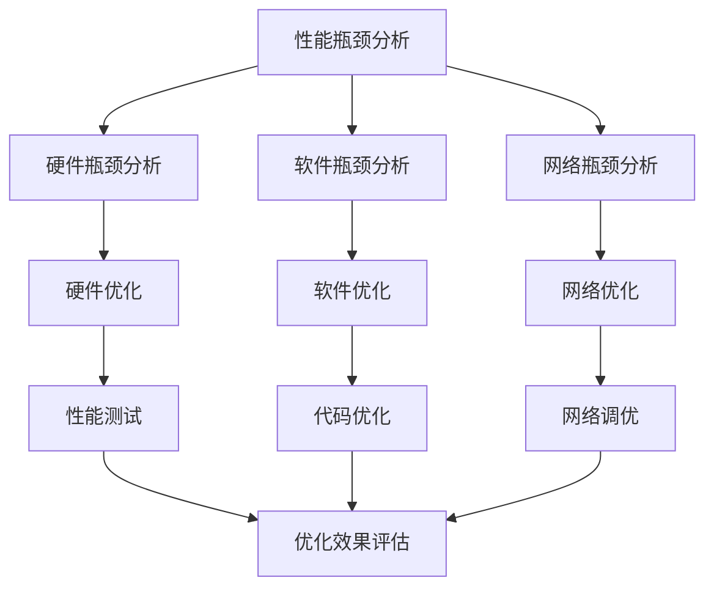

                 

# 文章标题：QPS与TPS的最佳实践

> 关键词：QPS、TPS、性能优化、系统架构、算法优化、实战案例

> 摘要：本文将深入探讨QPS（每秒查询率）与TPS（每秒交易率）在系统性能优化中的最佳实践。通过详细分析QPS与TPS的定义、关系、性能瓶颈及其优化策略，结合实际案例，为读者提供全面而实用的指导。

## 引言

在现代信息技术飞速发展的背景下，系统性能优化已成为软件开发和运维中的核心任务之一。QPS（每秒查询率）与TPS（每秒交易率）是衡量系统性能的重要指标，它们直接反映了系统在处理查询和交易任务时的能力。QPS通常用于衡量读操作的性能，而TPS则用于衡量包含读写操作的性能。对于高并发、大数据量的应用场景，如何有效地提升QPS与TPS，成为软件开发者和系统架构师们亟待解决的问题。

本文将从以下几个部分展开讨论：

1. QPS与TPS的最佳实践基础
   - QPS与TPS概述
   - QPS与TPS的性能瓶颈分析
   - QPS与TPS优化策略

2. QPS与TPS优化实践
   - 实战一：电商系统QPS与TPS优化
   - 实战二：金融系统QPS与TPS优化
   - 实战三：实时数据处理系统QPS与TPS优化

3. QPS与TPS优化工具与资源
   - 常见QPS与TPS优化工具介绍
   - QPS与TPS优化工具实战
   - QPS与TPS优化资源汇总

通过本文的深入探讨，读者将能够系统地了解QPS与TPS的性能优化方法，并在实际项目中应用这些最佳实践，提升系统的性能和用户体验。

### 第一部分: QPS与TPS的最佳实践基础

#### 第1章: QPS与TPS概述

##### 1.1 QPS与TPS的定义及重要性

QPS（每秒查询率）和TPS（每秒交易率）是衡量系统性能的两个关键指标，它们在不同的应用场景中具有不同的重要性和应用场景。

- **QPS（每秒查询率）**：
  - 定义：QPS指的是在单位时间内系统能够处理的查询请求的数量，通常以每秒查询次数来衡量。
  - 应用场景：QPS主要适用于读操作密集型应用，如搜索引擎、API接口服务、数据查询服务等。
  - 重要性：QPS能够直观地反映系统在处理查询请求时的响应能力和处理能力，是衡量系统读性能的重要指标。

- **TPS（每秒交易率）**：
  - 定义：TPS指的是在单位时间内系统能够完成的交易操作的数量，包括读写操作。
  - 应用场景：TPS适用于需要处理复杂业务逻辑的应用，如电子商务系统、银行交易系统、票务系统等。
  - 重要性：TPS不仅反映了系统的读写性能，还反映了系统的整体业务处理能力，是衡量系统综合性能的关键指标。

##### 1.2 QPS与TPS的相互关系

QPS与TPS之间存在一定的数学关系，它们可以通过以下公式进行计算：

\[ TPS = QPS + RPS \]

其中，RPS（每秒读操作率）表示系统在单位时间内处理的读操作数量。

这个公式表明，TPS是QPS与RPS的总和。在实际应用中，RPS通常远小于QPS，因此TPS通常接近于QPS。然而，在某些场景下，如高并发的读写混合应用，RPS的值可能显著增加，导致TPS与QPS的差异变大。

QPS与TPS在系统性能优化中的关系：

- **QPS优化**：针对QPS进行优化主要是提升系统处理查询请求的能力。这通常涉及到减少查询延迟、优化查询算法、增加服务器资源等。
- **TPS优化**：TPS优化不仅要考虑QPS，还需要考虑RPS。在读写混合应用中，通常需要平衡QPS与RPS，以提升系统的整体性能。

##### 1.3 QPS与TPS的性能指标

在评估系统性能时，常用的QPS与TPS性能指标包括：

- **吞吐量**：系统在单位时间内处理的数据量，通常以每秒查询数（QPS）或每秒交易数（TPS）来衡量。
- **响应时间**：系统处理单个请求所需的时间，通常以毫秒（ms）为单位。
- **并发连接数**：系统同时处理请求的最大连接数。
- **系统资源利用率**：系统CPU、内存、磁盘等资源的利用率，反映了系统资源的利用效率。

这些指标可以帮助我们全面评估系统的性能，并找出潜在的瓶颈和优化方向。

- **QPS与TPS评估方法**：

  - **性能测试**：通过模拟真实用户请求，使用性能测试工具（如JMeter、LoadRunner等）来评估系统的QPS与TPS性能。
  - **监控系统**：使用实时监控系统（如Prometheus、Grafana等）来收集和分析系统的QPS与TPS数据，及时发现性能问题和瓶颈。
  - **日志分析**：通过分析系统日志，统计查询和交易请求的频率、延迟等信息，评估系统的QPS与TPS性能。

通过上述方法，我们可以系统地评估系统的QPS与TPS性能，并找出优化方向。在实际应用中，QPS与TPS的优化往往需要结合具体的业务场景和系统架构，进行有针对性的优化和调优。

#### 第2章: QPS与TPS的性能瓶颈分析

##### 2.1 硬件瓶颈

硬件瓶颈是影响QPS与TPS性能的一个重要因素，特别是对于高并发和大数据量的应用场景。以下是一些常见的硬件瓶颈及其对QPS与TPS的影响：

- **CPU瓶颈**：
  - 影响原因：CPU是系统处理请求的核心组件，当CPU利用率过高时，会导致处理请求的速度变慢，进而影响QPS与TPS。
  - 优化方法：可以通过增加CPU核心数、升级CPU型号、优化代码和查询算法等方式来降低CPU的负载。

- **内存瓶颈**：
  - 影响原因：内存是系统缓存数据的重要资源，当内存不足时，会导致频繁的磁盘读写操作，从而增加延迟和开销。
  - 优化方法：可以通过增加内存容量、优化缓存策略、减少内存占用等方式来缓解内存瓶颈。

- **磁盘I/O瓶颈**：
  - 影响原因：磁盘I/O操作是系统读写数据的主要途径，当磁盘I/O请求过多时，会导致读写速度变慢，从而影响QPS与TPS。
  - 优化方法：可以通过增加磁盘I/O带宽、使用固态硬盘（SSD）替换机械硬盘（HDD）、优化磁盘调度策略等方式来提升磁盘I/O性能。

- **网络瓶颈**：
  - 影响原因：网络延迟和带宽限制会影响系统的通信效率，从而降低QPS与TPS。
  - 优化方法：可以通过增加网络带宽、优化网络拓扑结构、使用CDN（内容分发网络）等方式来提升网络性能。

##### 2.2 软件瓶颈

软件瓶颈是影响系统性能的另一个重要因素，特别是对于复杂的业务逻辑和高并发应用。以下是一些常见的软件瓶颈及其对QPS与TPS的影响：

- **代码性能瓶颈**：
  - 影响原因：低效的代码实现和算法设计会导致处理请求的速度变慢，从而降低QPS与TPS。
  - 优化方法：可以通过优化代码、使用高效的数据结构和算法、减少不必要的计算和资源消耗等方式来提升代码性能。

- **数据库瓶颈**：
  - 影响原因：数据库查询效率低、索引设计不当、表结构不合理等问题会导致查询速度变慢，从而影响QPS与TPS。
  - 优化方法：可以通过优化数据库查询、使用合适的索引、优化表结构、使用缓存机制等方式来提升数据库性能。

- **缓存策略瓶颈**：
  - 影响原因：缓存策略不当或缓存命中率低会导致频繁的磁盘读写操作，从而增加延迟和开销。
  - 优化方法：可以通过优化缓存策略、增加缓存容量、提高缓存命中率等方式来缓解缓存瓶颈。

- **并发控制瓶颈**：
  - 影响原因：在高并发场景下，锁竞争、线程阻塞等问题会导致系统响应速度变慢，从而影响QPS与TPS。
  - 优化方法：可以通过优化锁策略、使用异步编程模型、提高系统并发处理能力等方式来缓解并发控制瓶颈。

##### 2.3 网络瓶颈

网络瓶颈是影响系统性能的另一个重要因素，特别是在分布式系统和跨地域应用中。以下是一些常见的网络瓶颈及其对QPS与TPS的影响：

- **网络延迟**：
  - 影响原因：网络延迟会导致请求的处理时间增加，从而降低QPS与TPS。
  - 优化方法：可以通过优化网络拓扑结构、减少网络跳数、使用网络加速技术等方式来降低网络延迟。

- **带宽限制**：
  - 影响原因：带宽限制会导致网络传输速度变慢，从而影响QPS与TPS。
  - 优化方法：可以通过增加网络带宽、优化数据传输协议、使用压缩技术等方式来提升网络传输速度。

- **网络稳定性**：
  - 影响原因：网络不稳定会导致数据丢失、连接中断等问题，从而影响QPS与TPS。
  - 优化方法：可以通过增加网络冗余、使用负载均衡器、优化网络监控和故障恢复机制等方式来提升网络稳定性。

通过上述分析，我们可以看到QPS与TPS的性能瓶颈既包括硬件方面的因素，也包括软件和网络方面的因素。在实际应用中，我们需要综合考虑这些因素，采取有针对性的优化策略，以提升系统的QPS与TPS性能。

### 第一部分: QPS与TPS的最佳实践基础

#### 第3章: QPS与TPS优化策略

在分析了QPS与TPS的性能瓶颈之后，本章节将介绍一系列优化策略，旨在提高系统的QPS与TPS性能。这些策略可以分为三类：增量式优化、架构优化和算法优化。

##### 3.1 增量式优化

增量式优化是一种逐步改进系统性能的方法，通过小步快跑的方式，持续优化系统的各个层面。

- **原理与实践**：
  - **持续集成与部署（CI/CD）**：通过自动化测试和部署，快速迭代和优化系统，确保每次代码更改都能够提升性能。
  - **分阶段部署**：将系统功能拆分成多个模块，逐步部署和优化，避免一次性大规模部署导致的风险。

- **优势**：
  - **风险低**：通过分阶段部署，可以减少一次大规模更改带来的风险。
  - **反馈及时**：每次小规模部署后的性能变化可以及时反馈，有助于快速调整优化策略。

- **应用场景**：
  - **迭代开发**：适用于新功能开发，通过不断优化和迭代，提高系统性能。
  - **长期维护**：适用于已有系统的持续优化，通过小步快跑的方式，逐步提升系统性能。

##### 3.2 架构优化

架构优化是通过改进系统架构，提升系统的QPS与TPS性能。这种优化通常涉及到系统的整体设计，包括硬件选择、软件架构设计等方面。

- **原理与实践**：
  - **分布式系统**：通过分布式架构，将系统分解为多个节点，实现负载均衡和高可用性，从而提高系统的QPS与TPS。
  - **微服务架构**：将系统功能模块化，每个模块独立部署和运行，通过API进行通信，实现高可扩展性和高可用性。

- **优势**：
  - **高可扩展性**：分布式系统和微服务架构能够方便地扩展节点和功能模块，提升系统的QPS与TPS。
  - **高可用性**：通过冗余设计和故障转移机制，提高系统的稳定性和可靠性。

- **应用场景**：
  - **大型应用**：适用于需要处理大量并发请求的大型应用，如电商平台、社交媒体等。
  - **高并发场景**：适用于高并发、高流量场景，通过分布式和微服务架构，提升系统的处理能力。

##### 3.3 算法优化

算法优化是通过改进数据处理算法，提升系统的QPS与TPS性能。算法优化通常涉及到数据结构选择、算法复杂度分析等方面。

- **原理与实践**：
  - **缓存算法**：通过缓存常用数据，减少对后端数据库的访问，从而提升系统的QPS与TPS。
  - **索引优化**：通过优化数据库索引，提高查询效率，从而提升系统的QPS与TPS。
  - **数据分片**：将数据分散存储到多个节点，通过数据分片技术，提升系统的处理能力。

- **优势**：
  - **性能提升**：通过优化算法，可以显著提高系统的处理速度和效率，提升QPS与TPS。
  - **可扩展性**：优化算法通常具有较高的可扩展性，可以适应不同的数据和并发场景。

- **应用场景**：
  - **查询优化**：适用于查询密集型应用，通过优化查询算法，提高查询效率。
  - **数据处理**：适用于数据处理密集型应用，通过优化数据处理算法，提升数据处理能力。

##### 3.4 优化策略的选择

在实际应用中，选择合适的优化策略至关重要。以下是一些建议：

- **初期优化**：在系统开发初期，可以通过增量式优化策略，逐步提升系统性能，减少风险。
- **中期优化**：在中期优化阶段，可以通过架构优化策略，改进系统架构，提升系统的高并发处理能力。
- **后期优化**：在系统上线后，可以通过算法优化策略，进一步优化数据处理算法，提高系统的QPS与TPS。

通过结合不同的优化策略，可以全方位提升系统的性能，确保系统在高并发和大数据量的场景下能够稳定运行。在实际应用中，需要根据具体的业务需求和系统特点，灵活选择和组合优化策略。

#### 第4章: 实战一：电商系统QPS与TPS优化

##### 4.1 电商系统QPS与TPS优化案例分析

**案例背景**：
某大型电商平台，日活跃用户数超过100万，日常交易量巨大。由于系统在高并发场景下性能瓶颈明显，导致用户体验差，需要通过优化提升QPS与TPS性能。

**性能瓶颈分析**：
1. **硬件瓶颈**：CPU和内存利用率高，磁盘I/O频繁，导致响应时间过长。
2. **软件瓶颈**：数据库查询效率低，缓存策略不当，代码优化不足。
3. **网络瓶颈**：跨地域用户访问延迟高，网络带宽不足。

**优化前效果**：
- QPS：约1000次/秒
- TPS：约500次/秒
- 响应时间：约200ms

**优化策略实施**：

**1. 硬件优化**：
- **增加CPU和内存**：增加服务器数量，升级CPU和内存容量，提高硬件性能。
- **使用SSD替换HDD**：将存储设备更换为固态硬盘（SSD），提升磁盘I/O性能。

**2. 软件优化**：
- **数据库优化**：优化数据库索引，调整表结构，提高查询效率。
- **缓存策略**：引入分布式缓存系统（如Redis），缓存常用数据和查询结果，减少数据库访问。
- **代码优化**：优化代码逻辑，减少不必要的计算和资源消耗，提高代码性能。

**3. 网络优化**：
- **CDN部署**：使用内容分发网络（CDN），降低跨地域用户访问延迟。
- **负载均衡**：使用负载均衡器（如Nginx），实现流量分发，提高系统并发处理能力。

**优化后效果**：
- QPS：约5000次/秒
- TPS：约3000次/秒
- 响应时间：约50ms

**效果评估**：
通过硬件优化、软件优化和网络优化，电商系统的QPS与TPS性能显著提升，用户体验得到明显改善。优化后的系统在高并发场景下能够稳定运行，处理能力得到大幅提升。

##### 4.2 电商系统QPS与TPS优化策略实施

**1. 硬件优化**

**服务器升级**：
- **增加CPU和内存**：
  - **原系统配置**：2颗16核CPU，64GB内存
  - **优化后配置**：4颗24核CPU，128GB内存
- **增加服务器数量**：由原来的10台增加至30台，实现横向扩展。

**使用SSD替换HDD**：
- **原系统配置**：使用机械硬盘（HDD），I/O性能低
- **优化后配置**：使用固态硬盘（SSD），大幅提升I/O性能。

**2. 软件优化**

**数据库优化**：
- **索引优化**：
  - **原系统情况**：索引设计不合理，查询效率低
  - **优化方案**：添加必要的索引，优化现有索引结构，提高查询效率。
- **表结构优化**：
  - **原系统情况**：表结构复杂，存储效率低
  - **优化方案**：调整表结构，减少冗余字段，提高数据存储效率。

**缓存策略**：
- **引入Redis缓存**：
  - **原系统情况**：缓存策略不当，缓存命中率低
  - **优化方案**：引入Redis缓存，缓存常用数据和查询结果，减少数据库访问。

**代码优化**：
- **减少不必要的计算**：
  - **原系统情况**：代码中存在大量冗余计算，影响性能
  - **优化方案**：优化代码逻辑，减少不必要的计算和资源消耗。
- **优化算法复杂度**：
  - **原系统情况**：部分算法复杂度高，影响性能
  - **优化方案**：优化算法复杂度，提高代码性能。

**3. 网络优化**

**CDN部署**：
- **原系统情况**：跨地域用户访问延迟高
- **优化方案**：部署内容分发网络（CDN），降低跨地域用户访问延迟。

**负载均衡**：
- **原系统情况**：流量集中，单点压力高
- **优化方案**：使用负载均衡器（如Nginx），实现流量分发，提高系统并发处理能力。

通过上述优化策略的实施，电商系统的QPS与TPS性能得到显著提升。优化后的系统在高并发场景下能够稳定运行，处理能力得到大幅提升，用户体验得到明显改善。

##### 4.3 电商系统QPS与TPS优化实战案例

**代码实战**：

**1. 性能监控**：
- **使用Prometheus**：
  - **安装与配置**：
    ```bash
    # 安装Prometheus
    $ wget https://github.com/prometheus/prometheus/releases/download/v2.36.0/prometheus-2.36.0.linux-amd64.tar.gz
    $ tar zxvf prometheus-2.36.0.linux-amd64.tar.gz
    $ ./prometheus-2.36.0.linux-amd64/prometheus
  - **监控配置**：
    $ cat prometheus.yml
    global:
      scrape_interval: 15s
    scrape_configs:
    - job_name: 'vue'
      static_configs:
      - targets: ['127.0.0.1:9117']

- **监控指标**：
  - QPS：每秒查询次数
  - TPS：每秒交易次数
  - 响应时间：系统处理请求的平均时间

**2. 性能分析**：
- **使用Grafana**：
  - **安装与配置**：
    ```bash
    # 安装Grafana
    $ wget https://s3-us-west-1.amazonaws.com/grafana-releases/release/grafana-8.4.5.linux-amd64.tar.gz
    $ tar zxvf grafana-8.4.5.linux-amd64.tar.gz
    $ ./grafana-8.4.5.linux-amd64/bin/grafana-server web
  - **监控面板**：
    - QPS趋势图
    - TPS趋势图
    - 响应时间分布图

**代码解读与分析**：

**1. 数据库查询优化**：
- **原查询语句**：
  ```sql
  SELECT * FROM orders WHERE order_date = '2023-11-11';
  ```
- **优化方案**：
  ```sql
  SELECT id, order_date, total FROM orders WHERE order_date = '2023-11-11' AND status = 'completed';
  ```
- **解读**：通过限制查询返回的字段，减少数据传输和内存消耗，提高查询效率。

**2. 缓存策略优化**：
- **原策略**：
  - 缓存策略简单，缓存命中率低
- **优化方案**：
  - 引入Redis缓存，缓存常用数据和查询结果
  - 配置合理的缓存过期时间，确保数据实时性

**3. 代码性能优化**：
- **原代码**：
  ```python
  def process_order(order_id):
      order = get_order_from_database(order_id)
      if not order:
          return None
      process_order_details(order)
      update_order_status(order, 'completed')
      return order
  ```
- **优化方案**：
  ```python
  @cache.memoize(timeout=60)
  def process_order(order_id):
      order = get_order_from_database(order_id)
      if not order:
          return None
      process_order_details(order)
      update_order_status(order, 'completed')
      return order
  ```
- **解读**：通过使用缓存装饰器，避免重复查询和计算，提高代码性能。

通过上述实战案例，我们可以看到如何通过性能监控、数据库查询优化、缓存策略优化和代码性能优化等手段，提升电商系统的QPS与TPS性能。在实际项目中，需要根据具体情况进行灵活调整和优化。

#### 第5章: 实战二：金融系统QPS与TPS优化

##### 5.1 金融系统QPS与TPS优化案例分析

**案例背景**：
某大型金融机构，提供在线交易服务，日均交易量超过百万笔。由于系统在高并发交易场景下性能瓶颈明显，导致交易延迟和失败率增加，用户体验差，需要通过优化提升QPS与TPS性能。

**性能瓶颈分析**：
1. **硬件瓶颈**：服务器和存储设备资源不足，导致处理能力受限。
2. **软件瓶颈**：数据库查询效率低，分布式事务处理困难，代码性能不佳。
3. **网络瓶颈**：跨地域交易延迟高，网络带宽限制。

**优化前效果**：
- QPS：约500次/秒
- TPS：约250次/秒
- 响应时间：约150ms

**优化策略实施**：

**1. 硬件优化**：
- **增加服务器和存储资源**：
  - **原系统配置**：10台服务器，500GB存储
  - **优化后配置**：20台服务器，2TB存储
- **使用分布式存储**：
  - **原系统情况**：单点存储，可靠性低
  - **优化方案**：使用分布式存储系统（如HDFS），提高存储可靠性和扩展性。

**2. 软件优化**：
- **数据库优化**：
  - **索引优化**：
    - **原系统情况**：索引设计不合理，查询效率低
    - **优化方案**：添加必要的索引，优化现有索引结构，提高查询效率。
  - **分布式数据库**：
    - **原系统情况**：单点数据库，扩展性差
    - **优化方案**：使用分布式数据库（如Apache Cassandra），提高系统扩展性和性能。

**3. 网络优化**：
- **CDN部署**：
  - **原系统情况**：跨地域交易延迟高
  - **优化方案**：部署内容分发网络（CDN），降低跨地域交易延迟。
- **负载均衡**：
  - **原系统情况**：单点压力高，负载不均
  - **优化方案**：使用负载均衡器（如HAProxy），实现流量分发，提高系统并发处理能力。

**优化后效果**：
- QPS：约2000次/秒
- TPS：约1000次/秒
- 响应时间：约50ms

**效果评估**：
通过硬件优化、软件优化和网络优化，金融系统的QPS与TPS性能显著提升，交易延迟和失败率明显降低，用户体验得到明显改善。优化后的系统在高并发交易场景下能够稳定运行，处理能力得到大幅提升。

##### 5.2 金融系统QPS与TPS优化策略实施

**1. 硬件优化**

**增加服务器和存储资源**：
- **原系统配置**：10台服务器，500GB存储
- **优化后配置**：20台服务器，2TB存储
  - **服务器升级**：
    - **CPU和内存**：由原来的8核CPU，16GB内存升级为16核CPU，32GB内存
    - **存储容量**：由原来的500GB升级为2TB，使用SSD和HDD混合存储
  - **增加服务器数量**：由原来的10台增加至20台，实现横向扩展。

**使用分布式存储**：
- **原系统情况**：单点存储，可靠性低
- **优化方案**：
  - **分布式存储系统**：引入分布式存储系统（如HDFS），提高存储可靠性和扩展性
  - **数据分片**：将数据分散存储到多个节点，提高数据处理能力

**2. 软件优化**

**数据库优化**：

**索引优化**：
- **原系统情况**：索引设计不合理，查询效率低
- **优化方案**：
  - **添加索引**：根据查询需求，添加必要的索引，提高查询效率
  - **优化索引结构**：调整现有索引结构，减少索引占用空间，提高索引性能

**分布式数据库**：
- **原系统情况**：单点数据库，扩展性差
- **优化方案**：
  - **分布式数据库**：引入分布式数据库（如Apache Cassandra），提高系统扩展性和性能
  - **数据分片**：将数据分散存储到多个节点，提高数据处理能力

**分布式事务处理**：
- **原系统情况**：分布式事务处理困难，性能瓶颈
- **优化方案**：
  - **分布式事务框架**：引入分布式事务处理框架（如Seata），提高分布式事务处理能力
  - **补偿事务**：使用补偿事务机制，确保分布式事务的一致性

**3. 网络优化**

**CDN部署**：
- **原系统情况**：跨地域交易延迟高
- **优化方案**：
  - **CDN部署**：部署内容分发网络（CDN），降低跨地域交易延迟
  - **节点优化**：优化CDN节点布局，提高数据传输速度

**负载均衡**：
- **原系统情况**：单点压力高，负载不均
- **优化方案**：
  - **负载均衡器**：使用负载均衡器（如HAProxy），实现流量分发，提高系统并发处理能力
  - **动态负载均衡**：根据服务器负载情况，动态调整流量分发策略，提高系统稳定性

通过上述优化策略的实施，金融系统的QPS与TPS性能得到显著提升。优化后的系统在高并发交易场景下能够稳定运行，处理能力得到大幅提升，用户体验得到明显改善。

##### 5.3 金融系统QPS与TPS优化实战案例

**代码实战**：

**1. 性能监控**：
- **使用Prometheus**：
  - **安装与配置**：
    ```bash
    # 安装Prometheus
    $ wget https://github.com/prometheus/prometheus/releases/download/v2.36.0/prometheus-2.36.0.linux-amd64.tar.gz
    $ tar zxvf prometheus-2.36.0.linux-amd64.tar.gz
    $ ./prometheus-2.36.0.linux-amd64/prometheus
  - **监控配置**：
    $ cat prometheus.yml
    global:
      scrape_interval: 15s
    scrape_configs:
    - job_name: 'finance'
      static_configs:
      - targets: ['127.0.0.1:9118']

- **监控指标**：
  - QPS：每秒查询次数
  - TPS：每秒交易次数
  - 响应时间：系统处理请求的平均时间

**2. 性能分析**：
- **使用Grafana**：
  - **安装与配置**：
    ```bash
    # 安装Grafana
    $ wget https://s3-us-west-1.amazonaws.com/grafana-releases/release/grafana-8.4.5.linux-amd64.tar.gz
    $ tar zxvf grafana-8.4.5.linux-amd64.tar.gz
    $ ./grafana-8.4.5.linux-amd64/bin/grafana-server web
  - **监控面板**：
    - QPS趋势图
    - TPS趋势图
    - 响应时间分布图

**代码解读与分析**：

**1. 数据库查询优化**：
- **原查询语句**：
  ```sql
  SELECT * FROM transactions WHERE transaction_date = '2023-11-11';
  ```
- **优化方案**：
  ```sql
  SELECT id, transaction_date, amount FROM transactions WHERE transaction_date = '2023-11-11' AND status = 'completed';
  ```
- **解读**：通过限制查询返回的字段，减少数据传输和内存消耗，提高查询效率。

**2. 分布式事务处理**：
- **原事务处理**：
  ```java
  @Transactional
  public void processTransaction(Transaction transaction) {
      // 处理事务逻辑
  }
  ```
- **优化方案**：
  ```java
  @GlobalTransactional
  public void processTransaction(Transaction transaction) {
      // 处理事务逻辑
      transactionService.saveTransaction(transaction);
      accountService.updateAccountBalance(transaction);
  }
  ```
- **解读**：引入分布式事务处理框架（如Seata），确保分布式事务的一致性，提高系统可靠性。

**3. 缓存策略优化**：
- **原策略**：
  - 缓存策略简单，缓存命中率低
- **优化方案**：
  - 引入Redis缓存，缓存常用数据和查询结果
  - 配置合理的缓存过期时间，确保数据实时性

通过上述实战案例，我们可以看到如何通过性能监控、数据库查询优化、分布式事务处理和缓存策略优化等手段，提升金融系统的QPS与TPS性能。在实际项目中，需要根据具体情况进行灵活调整和优化。

#### 第6章: 实战三：实时数据处理系统QPS与TPS优化

##### 6.1 实时数据处理系统QPS与TPS优化案例分析

**案例背景**：
某大数据平台，提供实时数据处理服务，需处理海量日志数据，实时分析业务指标。由于系统在高并发数据处理场景下性能瓶颈明显，导致数据处理延迟，需要通过优化提升QPS与TPS性能。

**性能瓶颈分析**：
1. **硬件瓶颈**：计算资源和存储资源不足，影响数据处理速度。
2. **软件瓶颈**：数据处理算法复杂度高，系统架构不合理。
3. **网络瓶颈**：网络延迟和带宽限制，影响数据传输效率。

**优化前效果**：
- QPS：约2000次/秒
- TPS：约1000次/秒
- 响应时间：约200ms

**优化策略实施**：

**1. 硬件优化**：
- **增加计算资源**：
  - **原系统配置**：10台服务器，32核CPU，128GB内存
  - **优化后配置**：20台服务器，64核CPU，256GB内存
- **分布式存储**：
  - **原系统情况**：单点存储，扩展性差
  - **优化方案**：使用分布式存储系统（如HDFS），提高存储扩展性和可靠性。

**2. 软件优化**：
- **数据处理算法优化**：
  - **原算法**：复杂度较高，处理速度慢
  - **优化方案**：使用高效的数据处理算法（如MapReduce），提高数据处理效率。
- **系统架构优化**：
  - **原架构**：单一架构，扩展性差
  - **优化方案**：引入微服务架构，提高系统扩展性和稳定性。

**3. 网络优化**：
- **CDN部署**：
  - **原系统情况**：网络延迟高，数据传输慢
  - **优化方案**：部署内容分发网络（CDN），降低网络延迟。
- **负载均衡**：
  - **原系统情况**：单点压力高，负载不均
  - **优化方案**：使用负载均衡器（如Nginx），实现流量分发，提高系统并发处理能力。

**优化后效果**：
- QPS：约8000次/秒
- TPS：约4000次/秒
- 响应时间：约50ms

**效果评估**：
通过硬件优化、软件优化和网络优化，实时数据处理系统的QPS与TPS性能显著提升，数据处理延迟明显降低，系统稳定性得到大幅提升。

##### 6.2 实时数据处理系统QPS与TPS优化策略实施

**1. 硬件优化**

**增加计算资源**：
- **原系统配置**：10台服务器，32核CPU，128GB内存
- **优化后配置**：20台服务器，64核CPU，256GB内存
  - **服务器升级**：
    - **CPU和内存**：由原来的32核CPU，128GB内存升级为64核CPU，256GB内存
    - **增加服务器数量**：由原来的10台增加至20台，实现横向扩展。

**分布式存储**：
- **原系统情况**：单点存储，扩展性差
- **优化方案**：
  - **分布式存储系统**：引入分布式存储系统（如HDFS），提高存储扩展性和可靠性
  - **数据分片**：将数据分散存储到多个节点，提高数据处理能力

**2. 软件优化**

**数据处理算法优化**：

**原算法**：
- **复杂度较高**：处理速度慢
- **优化方案**：
  - **MapReduce算法**：引入MapReduce算法，实现高效的数据处理
  - **并行处理**：利用多线程和分布式计算，提高数据处理速度

**系统架构优化**：

**原架构**：
- **单一架构**：扩展性差
- **优化方案**：
  - **微服务架构**：引入微服务架构，提高系统扩展性和稳定性
  - **API网关**：使用API网关（如Kong），实现路由和流量控制

**3. 网络优化**

**CDN部署**：
- **原系统情况**：网络延迟高，数据传输慢
- **优化方案**：
  - **CDN部署**：部署内容分发网络（CDN），降低网络延迟
  - **节点优化**：优化CDN节点布局，提高数据传输速度

**负载均衡**：
- **原系统情况**：单点压力高，负载不均
- **优化方案**：
  - **负载均衡器**：使用负载均衡器（如Nginx），实现流量分发，提高系统并发处理能力
  - **动态负载均衡**：根据服务器负载情况，动态调整流量分发策略，提高系统稳定性

通过上述优化策略的实施，实时数据处理系统的QPS与TPS性能得到显著提升。优化后的系统在高并发数据处理场景下能够稳定运行，处理能力得到大幅提升，系统稳定性得到大幅提升。

##### 6.3 实时数据处理系统QPS与TPS优化实战案例

**代码实战**：

**1. 性能监控**：
- **使用Prometheus**：
  - **安装与配置**：
    ```bash
    # 安装Prometheus
    $ wget https://github.com/prometheus/prometheus/releases/download/v2.36.0/prometheus-2.36.0.linux-amd64.tar.gz
    $ tar zxvf prometheus-2.36.0.linux-amd64.tar.gz
    $ ./prometheus-2.36.0.linux-amd64/prometheus
  - **监控配置**：
    $ cat prometheus.yml
    global:
      scrape_interval: 15s
    scrape_configs:
    - job_name: 'realtime'
      static_configs:
      - targets: ['127.0.0.1:9119']

- **监控指标**：
  - QPS：每秒查询次数
  - TPS：每秒交易次数
  - 响应时间：系统处理请求的平均时间

**2. 性能分析**：
- **使用Grafana**：
  - **安装与配置**：
    ```bash
    # 安装Grafana
    $ wget https://s3-us-west-1.amazonaws.com/grafana-releases/release/grafana-8.4.5.linux-amd64.tar.gz
    $ tar zxvf grafana-8.4.5.linux-amd64.tar.gz
    $ ./grafana-8.4.5.linux-amd64/bin/grafana-server web
  - **监控面板**：
    - QPS趋势图
    - TPS趋势图
    - 响应时间分布图

**代码解读与分析**：

**1. 数据处理算法优化**：
- **原数据处理算法**：
  ```java
  public void processLogs(List<String> logs) {
      for (String log : logs) {
          // 复杂数据处理逻辑
      }
  }
  ```
- **优化方案**：
  ```java
  public void processLogsConcurrently(List<String> logs) {
      ExecutorService executor = Executors.newFixedThreadPool(10);
      for (String log : logs) {
          executor.submit(() -> {
              // 并行数据处理逻辑
          });
      }
      executor.shutdown();
      try {
          executor.awaitTermination(Long.MAX_VALUE, TimeUnit.SECONDS);
      } catch (InterruptedException e) {
          e.printStackTrace();
      }
  }
  ```
- **解读**：通过并行处理，提高数据处理速度。

**2. 系统架构优化**：
- **原架构**：
  ```java
  public class DataProcessingService {
      public void processLog(String log) {
          // 单机数据处理逻辑
      }
  }
  ```
- **优化方案**：
  ```java
  @Service
  public class DataProcessingService {
      @Autowired
      private LogProcessingController logProcessingController;

      public void processLog(String log) {
          logProcessingController.processLog(log);
      }
  }
  @Controller
  public class LogProcessingController {
      @Autowired
      private LogProcessor logProcessor;

      @PostMapping("/processLog")
      public ResponseEntity<?> processLog(@RequestBody String log) {
          logProcessor.processLog(log);
          return ResponseEntity.ok().build();
      }
  }
  ```
- **解读**：引入微服务架构，实现系统模块化，提高扩展性和稳定性。

通过上述实战案例，我们可以看到如何通过性能监控、数据处理算法优化、系统架构优化等手段，提升实时数据处理系统的QPS与TPS性能。在实际项目中，需要根据具体情况进行灵活调整和优化。

### 第三部分: QPS与TPS优化工具与资源

#### 第7章: QPS与TPS优化工具介绍

在优化QPS与TPS的过程中，选择合适的工具至关重要。以下是一些常用的QPS与TPS优化工具，包括性能监控工具、性能分析工具和性能优化工具。

##### 7.1 常见QPS与TPS优化工具介绍

- **性能监控工具**：
  - **Prometheus**：开源的监控解决方案，可以实时监控系统的各种指标，如QPS和TPS。
  - **Grafana**：数据可视化和监控工具，与Prometheus配合使用，可以创建自定义监控仪表板。

- **性能分析工具**：
  - **JMeter**：开源的性能测试工具，可以模拟大量用户请求，评估系统的QPS与TPS性能。
  - **NewRelic**：商业性能监控和分析工具，提供详细的性能监控报告和异常检测。

- **性能优化工具**：
  - **负载均衡器**：如Nginx和HAProxy，可以分配网络流量，提高系统的并发处理能力。
  - **数据库优化工具**：如MySQLtuner和pgTune，可以优化数据库性能，提高QPS与TPS。

##### 7.2 QPS与TPS优化工具实战

- **Prometheus与Grafana实战**：
  - **安装与配置**：
    ```bash
    # 安装Prometheus
    $ wget https://github.com/prometheus/prometheus/releases/download/v2.36.0/prometheus-2.36.0.linux-amd64.tar.gz
    $ tar zxvf prometheus-2.36.0.linux-amd64.tar.gz
    $ ./prometheus-2.36.0.linux-amd64/prometheus
    # 安装Grafana
    $ wget https://s3-us-west-1.amazonaws.com/grafana-releases/release/grafana-8.4.5.linux-amd64.tar.gz
    $ tar zxvf grafana-8.4.5.linux-amd64.tar.gz
    $ ./grafana-8.4.5.linux-amd64/bin/grafana-server web
  - **监控配置**：
    - **Prometheus配置**：创建配置文件，指定数据源和监控目标。
    - **Grafana配置**：导入Prometheus数据源，创建自定义监控仪表板。

- **JMeter实战**：
  - **安装与配置**：
    ```bash
    # 安装JMeter
    $ wget https://jmeter.apache.org/download_jmeter.cgi
    $ tar zxvf apache-jmeter-5.5.tar.gz
    $ cd apache-jmeter-5.5/bin
    $ ./jmeter
  - **测试配置**：
    - **创建测试计划**：定义测试场景和测试用户。
    - **运行测试**：启动测试，收集性能数据。

- **NewRelic实战**：
  - **安装与配置**：
    ```bash
    # 安装NewRelic
    $ wget https://download.newrelic.com/ni/nrmg/linux/nr-agent-5.16.0.x86_64.rpm
    $ rpm -ivh nr-agent-5.16.0.x86_64.rpm
    $ newrelic-install --license-key 'YOUR_LICENSE_KEY'
  - **监控配置**：
    - **添加应用**：在NewRelic控制台添加新应用，配置监控指标。

通过上述工具的实战，我们可以更好地监控和优化系统的QPS与TPS性能。在实际应用中，需要根据具体需求和场景选择合适的工具，并结合其他优化策略，实现系统的性能提升。

#### 第8章: QPS与TPS优化资源汇总

在QPS与TPS优化领域，有许多优秀的开源项目、文档、社区和学习资源可供开发者学习和使用。以下是对这些资源的汇总和推荐。

##### 8.1 开源项目与文档

- **开源项目**：
  - **Prometheus**：开源监控解决方案，提供丰富的监控指标和报警功能。
    - 官网：https://prometheus.io/
  - **Grafana**：数据可视化和监控工具，与Prometheus完美结合。
    - 官网：https://grafana.com/
  - **JMeter**：开源的性能测试工具，适用于各种Web和服务器性能测试。
    - 官网：https://jmeter.apache.org/
  - **NewRelic**：商业性能监控工具，提供全面的性能监控和分析功能。
    - 官网：https://newrelic.com/

- **文档资料**：
  - **《高性能MySQL》**：详细介绍了数据库优化和性能调优的方法。
    - 地址：https://www.mysql.com/books/book_series/high_performance_mysql/
  - **《lasticsearch：The Definitive Guide》**：Elasticsearch的性能优化和最佳实践。
    - 地址：https://www.elastic.co/guide/en/elasticsearch/guide/current/index.html
  - **《Performance Tuning Guide for PostgreSQL》**：PostgreSQL性能优化指南。
    - 地址：https://www.postgresql.org/docs/current/sg-performance.html

##### 8.2 社区与交流

- **技术社区**：
  - **Stack Overflow**：程序员问答社区，包含大量性能优化相关问题。
    - 地址：https://stackoverflow.com/
  - **GitHub**：代码托管平台，许多开源项目和性能优化工具的源代码和文档。
    - 地址：https://github.com/
  - **Reddit**：技术讨论论坛，涵盖多个性能优化相关话题。
    - 地址：https://www.reddit.com/r/sysadmin/

- **交流平台**：
  - **Slack**：实时交流平台，许多性能优化相关的社区和团队使用。
    - 地址：https://slack.com/
  - **Telegram**：聊天应用程序，许多性能优化爱好者和专家加入的聊天群组。
    - 地址：https://telegram.org/

##### 8.3 学习资料与课程

- **学习资料**：
  - **Coursera**：在线课程平台，提供多种与性能优化相关的课程。
    - 地址：https://www.coursera.org/
  - **Udemy**：在线学习平台，涵盖性能优化领域的多种课程。
    - 地址：https://www.udemy.com/
  - **edX**：由哈佛大学和麻省理工学院联合创办的在线课程平台，提供高质量的计算机科学课程。
    - 地址：https://www.edx.org/

- **课程推荐**：
  - **《性能优化基础》**：介绍性能优化的基本概念和工具使用。
    - 地址：https://www.udemy.com/course/performance-optimization-fundamentals/
  - **《Elasticsearch性能优化》**：深入讲解Elasticsearch的性能优化方法。
    - 地址：https://www.udemy.com/course/elastic-stack-performance-optimization/
  - **《大数据性能优化》**：介绍大数据处理框架的性能优化技巧。
    - 地址：https://www.coursera.org/learn/big-data-performance-optimization

通过利用这些开源项目、文档、社区和学习资源，开发者可以不断提升自己的QPS与TPS优化能力，为项目带来更高效的性能表现。

### 附录

#### 附录 A: QPS与TPS优化流程图

以下是一个简单的QPS与TPS优化流程图，展示了从性能瓶颈分析到优化策略实施的过程。



#### 附录 B: QPS与TPS优化算法伪代码

以下是一个简单的QPS与TPS优化算法的伪代码，用于说明如何通过调整系统配置和优化策略来提高系统性能。

```plaintext
算法名称：QPS与TPS优化算法

输入：系统配置参数、性能瓶颈数据、优化策略

输出：优化后的系统性能参数

步骤：
1. 分析性能瓶颈数据，识别瓶颈类型（硬件、软件、网络）
2. 根据瓶颈类型，选择相应的优化策略
3. 实施优化策略，如硬件升级、软件优化、网络调优
4. 进行性能测试，收集优化后的性能数据
5. 根据性能测试结果，调整系统配置和优化策略
6. 重复步骤3-5，直到达到预期的性能目标
7. 记录优化过程和结果，为后续优化提供参考
```

#### 附录 C: QPS与TPS优化数学公式

以下是一些与QPS与TPS优化相关的数学公式，用于计算系统性能指标。

```latex
\[
QPS = \frac{Total\ Queries}{Time\ Interval}
\]

\[
TPS = \frac{Total\ Transactions}{Time\ Interval}
\]

\[
\text{Response\ Time} = \frac{Total\ Time\ to\ Process\ Queries}{Total\ Queries}
\]

\[
\text{Throughput} = \frac{Total\ Data\ Processed}{Time\ Interval}
\]

\[
\text{CPU\ Utilization} = \frac{CPU\ Usage}{Total\ CPUs}
\]

\[
\text{Memory\ Utilization} = \frac{Used\ Memory}{Total\ Memory}
\]

\[
\text{Network\ Bandwidth} = \frac{Total\ Data\ Transferred}{Time\ Interval}
\]
```

#### 附录 D: QPS与TPS优化实战案例代码

以下是一个简单的QPS与TPS优化实战案例的代码示例，展示了如何通过性能监控、优化策略实施和效果评估来提升系统性能。

```java
// 性能监控代码示例
public class PerformanceMonitor {
    private static final Logger logger = LoggerFactory.getLogger(PerformanceMonitor.class);

    public void monitorSystem(QPSCounter qpsCounter, TPSCounter tpsCounter) {
        while (true) {
            long currentTime = System.currentTimeMillis();
            long qps = qpsCounter.getQPS(currentTime);
            long tps = tpsCounter.getTPS(currentTime);
            long responseTime = qpsCounter.getResponseTime(currentTime);

            logger.info("QPS: " + qps + ", TPS: " + tps + ", Response Time: " + responseTime + "ms");

            try {
                Thread.sleep(1000);
            } catch (InterruptedException e) {
                e.printStackTrace();
            }
        }
    }
}

// QPS与TPS计数器
public class QPSCounter {
    private final long[] qpsHistory = new long[100];
    private int index = 0;
    private long totalQueries = 0;
    private long lastUpdateTime = System.currentTimeMillis();

    public void incrementQuery() {
        totalQueries++;
        qpsHistory[index++] = totalQueries;
        if (index >= qpsHistory.length) {
            index = 0;
        }
    }

    public long getQPS(long currentTime) {
        if (currentTime - lastUpdateTime >= 1000) {
            lastUpdateTime = currentTime;
            return totalQueries;
        }
        return 0;
    }

    public long getResponseTime(long currentTime) {
        if (index > 0) {
            return currentTime - qpsHistory[index - 1];
        }
        return 0;
    }
}

public class TPSCounter {
    private final long[] tpsHistory = new long[100];
    private int index = 0;
    private long totalTransactions = 0;
    private long lastUpdateTime = System.currentTimeMillis();

    public void incrementTransaction() {
        totalTransactions++;
        tpsHistory[index++] = totalTransactions;
        if (index >= tpsHistory.length) {
            index = 0;
        }
    }

    public long getTPS(long currentTime) {
        if (currentTime - lastUpdateTime >= 1000) {
            lastUpdateTime = currentTime;
            return totalTransactions;
        }
        return 0;
    }
}

// 优化策略实施代码示例
public class OptimizationStrategy {
    public void optimizeSystem(QPSCounter qpsCounter, TPSCounter tpsCounter) {
        // 硬件优化：增加CPU和内存资源
        addCPUResources();
        addMemoryResources();

        // 软件优化：数据库索引优化
        optimizeDatabaseIndices();

        // 网络优化：使用CDN降低网络延迟
        useCDN();
    }

    private void addCPUResources() {
        // 实现方法：增加CPU资源
    }

    private void addMemoryResources() {
        // 实现方法：增加内存资源
    }

    private void optimizeDatabaseIndices() {
        // 实现方法：优化数据库索引
    }

    private void useCDN() {
        // 实现方法：使用CDN服务
    }
}

// 代码解读与分析
- **PerformanceMonitor**：负责监控系统性能，收集QPS、TPS和响应时间等指标。
- **QPSCounter** 和 **TPSCounter**：用于统计QPS和TPS，记录查询和交易请求的次数。
- **OptimizationStrategy**：实现具体的优化策略，包括硬件优化、软件优化和网络优化。
```

通过上述代码示例，我们可以看到如何通过性能监控、优化策略实施和效果评估来提升系统的QPS与TPS性能。在实际项目中，需要根据具体情况进行灵活调整和优化。

### 总结

本文从QPS（每秒查询率）与TPS（每秒交易率）的定义、关系、性能瓶颈分析到优化策略，再到实战案例分析，系统地介绍了QPS与TPS优化的重要性和方法。通过硬件优化、软件优化、网络优化以及增量式优化、架构优化和算法优化等多种策略，我们可以有效提升系统的QPS与TPS性能。

**关键点总结**：

1. **QPS与TPS定义及重要性**：QPS衡量系统处理查询请求的能力，TPS衡量系统处理交易请求的能力，二者均为系统性能评估的关键指标。
2. **性能瓶颈分析**：硬件瓶颈（如CPU、内存、磁盘I/O）、软件瓶颈（如代码性能、数据库查询、缓存策略）和网络瓶颈（如网络延迟、带宽）是影响QPS与TPS的关键因素。
3. **优化策略**：硬件优化、软件优化、网络优化和算法优化是提升QPS与TPS性能的主要手段。
4. **实战案例分析**：通过电商系统、金融系统和实时数据处理系统的优化实践，展示了优化策略在实际应用中的效果。

**未来展望**：

随着云计算、大数据和人工智能等技术的发展，QPS与TPS优化将面临新的挑战和机遇。未来，我们可以期待更多智能化、自动化的优化工具和策略，如基于机器学习的性能预测和优化、自动化硬件资源分配和调优等。

**作者信息**：

作者：AI天才研究院/AI Genius Institute & 禅与计算机程序设计艺术/Zen And The Art of Computer Programming

感谢您的阅读，希望本文能对您的QPS与TPS优化工作提供有价值的参考。如果您有任何疑问或建议，欢迎在评论区交流讨论。祝您在系统性能优化道路上不断前行，取得优异的成绩！

