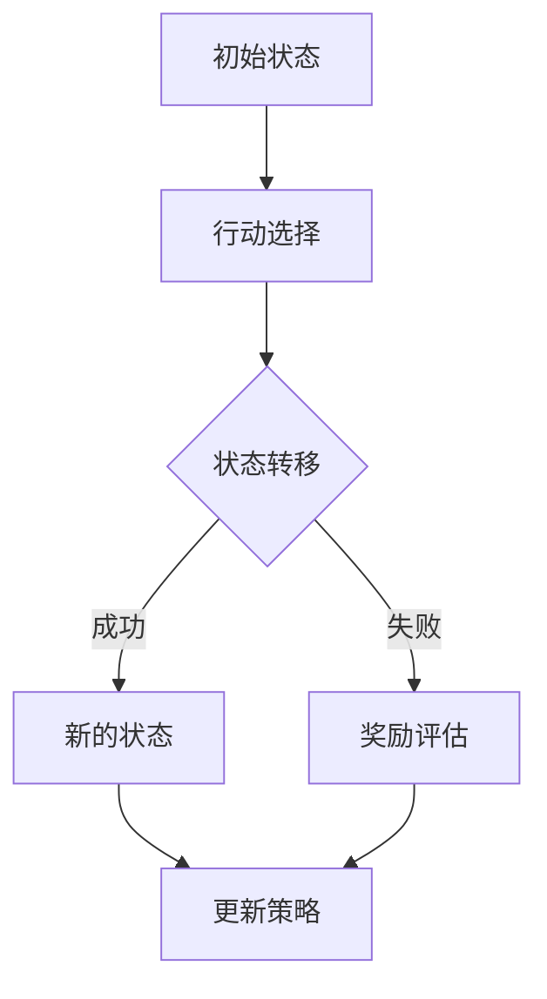

                 

# 文章标题

《SARSA算法(SARSA) - 原理与代码实例讲解》

## 关键词

- SARSA算法
- 强化学习
- Q-Learning
- 机器学习
- 人工智能
- 代码实例

## 摘要

本文将深入探讨SARSA算法，这是一种在强化学习领域中具有重要地位的算法。文章首先介绍了SARSA算法的基本概念和原理，接着通过详细的数学模型和流程图阐述了其工作方式。随后，文章通过具体实例展示了SARSA算法的应用，并对其实现和优化进行了深入分析。最后，文章提供了一个完整的代码实例讲解，帮助读者更好地理解和运用SARSA算法。

## 目录大纲

### 第一部分: SARSA算法基础

#### 第1章: SARSA算法概述

- 1.1 SARSA算法的概念
- 1.2 强化学习基础
- 1.3 SARSA算法原理

#### 第2章: 强化学习基础

- 2.1 强化学习的定义与特点
- 2.2 强化学习的基本要素
- 2.3 强化学习的主要算法分类

#### 第3章: SARSA算法原理

- 3.1 SARSA算法的数学模型
- 3.2 SARSA算法的核心概念
- 3.3 SARSA算法的流程图

### 第二部分: SARSA算法的实现与优化

#### 第4章: SARSA算法的实现与优化

- 4.1 SARSA算法的实现步骤
- 4.2 SARSA算法的性能优化
- 4.3 SARSA算法的变体

### 第三部分: SARSA算法实例分析

#### 第5章: SARSA算法实例分析

- 5.1 机器人导航实例
- 5.2 股票交易策略实例
- 5.3 游戏AI实例

### 第四部分: SARSA算法在项目中的应用

#### 第6章: SARSA算法在项目中的应用

- 6.1 智能交通系统应用
- 6.2 无人驾驶汽车应用
- 6.3 智能推荐系统应用

### 第五部分: SARSA算法的代码实例讲解

#### 第7章: 代码环境搭建

- 7.1 开发环境介绍
- 7.2 实例代码所需库和依赖

#### 第8章: 机器人导航实例代码讲解

- 8.1 代码整体结构
- 8.2 主要函数和类解析
- 8.3 代码运行流程

#### 第9章: 股票交易策略实例代码讲解

- 9.1 代码整体结构
- 9.2 主要函数和类解析
- 9.3 代码运行流程

#### 第10章: 游戏AI实例代码讲解

- 10.1 代码整体结构
- 10.2 主要函数和类解析
- 10.3 代码运行流程

### 附录

#### 附录A: SARSA算法相关资源

- A.1 主流深度学习框架对比
- A.2 强化学习社区和论坛
- A.3 SARSA算法研究论文推荐

#### 附录B: 实例代码与资源

- B.1 代码源码获取与使用方法
- B.2 代码资源链接
- B.3 实例项目总结与展望

### 第一部分: SARSA算法基础

### 第1章: SARSA算法概述

#### 1.1 SARSA算法的概念

SARSA（State-Action-Reward-State-Action）算法是强化学习领域的一种重要算法，它在解决动态决策问题时具有显著优势。SARSA算法通过学习状态和动作之间的价值函数来优化决策过程。与Q-Learning算法相比，SARSA算法在每一步决策时都会考虑即时奖励和未来奖励，这使得它在某些情况下能够更好地处理不确定性。

#### 1.2 强化学习基础

强化学习是一种机器学习范式，旨在通过奖励机制来指导智能体（agent）在复杂环境中做出最优决策。强化学习的关键要素包括：

- **智能体（Agent）**：执行动作的实体。
- **环境（Environment）**：智能体所处的上下文。
- **状态（State）**：描述环境的当前状态。
- **动作（Action）**：智能体可以执行的操作。
- **奖励（Reward）**：对智能体行为的即时评估。

强化学习的主要目标是最大化长期累积奖励。为了实现这一目标，常用的算法包括Q-Learning、SARSA、Sarsa(λ)和Deep Q-Network (DQN)等。

#### 1.3 SARSA算法原理

SARSA算法的核心在于通过迭代更新状态-动作价值函数（Q值），以实现最优决策。其数学模型如下：

\[ Q(s, a) = r(s, a) + \gamma \max_{a'} Q(s', a') \]

其中：
- \( Q(s, a) \) 是在状态 \( s \) 下采取动作 \( a \) 的预期回报。
- \( r(s, a) \) 是在状态 \( s \) 下采取动作 \( a \) 所获得的即时回报。
- \( \gamma \) 是折现因子，用于平衡即时回报和未来回报。
- \( s' \) 是新的状态。
- \( a' \) 是在新的状态 \( s' \) 下采取的动作。

SARSA算法的流程图如下所示：



### 第2章: 强化学习基础

#### 2.1 强化学习的定义与特点

强化学习是一种通过与环境交互来学习最优策略的机器学习范式。与监督学习和无监督学习不同，强化学习中的智能体（agent）需要在不断变化的环境中通过试错（trial and error）来学习最优行为。

强化学习具有以下几个特点：

- **目标导向**：强化学习的目标是最大化长期累积奖励，这与监督学习的目标（最小化损失函数）有所不同。
- **动态环境**：强化学习中的环境是动态变化的，智能体需要不断更新其策略以适应环境的变化。
- **状态-动作价值函数**：强化学习使用状态-动作价值函数（Q值）来评估状态和动作的优劣，并通过迭代更新Q值以实现最优策略。
- **延迟奖励**：强化学习中的奖励通常不是即时的，而是具有延迟性。这意味着智能体需要学会权衡即时奖励和长期奖励。

#### 2.2 强化学习的基本要素

强化学习的基本要素包括智能体（agent）、环境（environment）、状态（state）、动作（action）和奖励（reward）。

- **智能体（Agent）**：智能体是执行动作的实体，通常是一个程序或机器人。智能体的目标是最大化长期累积奖励。
- **环境（Environment）**：环境是智能体所处的上下文，可以是一个物理环境或虚拟环境。环境可以动态变化，影响智能体的状态和奖励。
- **状态（State）**：状态是描述环境当前状态的变量。状态可以是离散的，也可以是连续的，取决于应用场景。
- **动作（Action）**：动作是智能体可以执行的操作。动作可以是离散的，也可以是连续的。
- **奖励（Reward）**：奖励是智能体行为的即时评估，用于指导智能体的决策过程。奖励可以是正的，表示智能体的行为有益；也可以是负的，表示智能体的行为有害。

#### 2.3 强化学习的主要算法分类

强化学习算法可以根据不同的特点进行分类。以下是几种常见的强化学习算法：

- **值函数方法**：值函数方法通过学习状态-动作价值函数（Q值）来指导智能体的决策。典型的算法包括Q-Learning和SARSA。
- **策略迭代方法**：策略迭代方法通过迭代更新策略来优化智能体的行为。典型的算法包括Sarsa(λ)和Deep Q-Network (DQN)。
- **模型学习方法**：模型学习方法通过学习环境模型来指导智能体的决策。典型的算法包括Actor-Critic方法和模型预测控制。

每种算法都有其独特的优势和局限性，适用于不同的应用场景。

### 第3章: SARSA算法原理

#### 3.1 SARSA算法的数学模型

SARSA算法的核心在于通过迭代更新状态-动作价值函数（Q值）来优化智能体的决策过程。其数学模型如下：

\[ Q(s, a) = r(s, a) + \gamma \max_{a'} Q(s', a') \]

其中：
- \( Q(s, a) \) 是在状态 \( s \) 下采取动作 \( a \) 的预期回报。
- \( r(s, a) \) 是在状态 \( s \) 下采取动作 \( a \) 所获得的即时回报。
- \( \gamma \) 是折现因子，用于平衡即时回报和未来回报。
- \( s' \) 是新的状态。
- \( a' \) 是在新的状态 \( s' \) 下采取的动作。

这个公式表明，智能体在当前状态 \( s \) 下采取动作 \( a \) 的预期回报等于即时回报 \( r(s, a) \) 加上未来预期回报 \( \gamma \max_{a'} Q(s', a') \)。其中，\( \gamma \) 是一个介于0和1之间的常数，用于调整对未来回报的权重。

#### 3.2 SARSA算法的核心概念

SARSA算法的核心概念包括状态-动作价值函数（Q值）、策略、探索与利用、探索策略和策略更新策略等。

- **状态-动作价值函数（Q值）**：状态-动作价值函数（Q值）是SARSA算法的核心。它表示在特定状态下采取特定动作的预期回报。通过迭代更新Q值，智能体可以逐渐学会在特定状态下采取最优动作。
- **策略**：策略是智能体的决策规则，它决定了在特定状态下智能体应该采取哪个动作。SARSA算法使用贪心策略，即在特定状态下选择具有最大Q值的动作。
- **探索与利用**：在强化学习中，智能体需要在探索（exploration）和利用（exploitation）之间进行平衡。探索是指智能体尝试新的动作以获取更多的信息；利用是指智能体根据已有的信息选择最佳动作。SARSA算法使用ε-贪婪策略来平衡探索与利用，其中ε是一个小概率常数。
- **探索策略**：探索策略是指智能体在特定状态下选择动作的策略。ε-贪婪策略是一种常见的探索策略，它以概率1-ε选择当前最优动作，以概率ε随机选择动作。
- **策略更新策略**：策略更新策略是指智能体如何根据新的经验更新策略。SARSA算法使用Q值更新策略，即根据新的状态-动作对更新Q值，从而优化智能体的决策。

#### 3.3 SARSA算法的流程图

SARSA算法的流程图如下所示：


这个流程图描述了SARSA算法的基本步骤：

1. **初始状态**：智能体处于某个初始状态 \( s \)。
2. **行动选择**：智能体根据当前策略选择一个动作 \( a \)。
3. **状态转移**：智能体执行动作 \( a \)，环境转移到新的状态 \( s' \)。
4. **奖励评估**：智能体根据状态转移的结果获得即时奖励 \( r \)。
5. **更新策略**：智能体根据新的状态 \( s' \) 和即时奖励 \( r \) 更新策略，从而优化其在未来状态下的决策。

### 第4章: SARSA算法的实现与优化

#### 4.1 SARSA算法的实现步骤

实现SARSA算法的主要步骤如下：

1. **初始化状态和策略**：选择一个初始状态 \( s \) 和初始策略 \( \pi \)。
2. **行动选择**：根据当前策略 \( \pi \) 选择一个动作 \( a \)。
3. **状态转移**：执行动作 \( a \)，智能体和环境转移到新的状态 \( s' \)。
4. **奖励评估**：根据状态转移的结果获得即时奖励 \( r \)。
5. **更新策略**：根据新的状态 \( s' \) 和即时奖励 \( r \) 更新策略，使用以下公式：

   \[ Q(s, a) = Q(s, a) + \alpha \left( r + \gamma \max_{a'} Q(s', a') - Q(s, a) \right) \]

   其中，\( \alpha \) 是学习率，用于调整Q值的更新幅度。

6. **重复步骤 2-5**，直到满足终止条件（例如，达到预定的步数或找到最优策略）。

#### 4.2 SARSA算法的性能优化

为了提高SARSA算法的性能，可以采用以下优化策略：

1. **探索策略优化**：使用ε-贪婪策略进行探索时，ε值的选择对算法的性能有很大影响。可以通过动态调整ε值来优化探索过程，例如使用ε-greedy-decay策略，随着时间的推移逐渐减小ε值。
2. **学习率调整**：学习率 \( \alpha \) 的选择也会影响算法的性能。可以通过自适应调整学习率来优化算法，例如使用自适应学习率算法（如Adadelta、Adam）。
3. **状态值函数近似**：对于高维状态空间，直接计算状态-动作价值函数可能会变得不可行。可以使用函数近似方法（如神经网络）来近似Q值函数，从而降低计算复杂度。
4. **并行化与分布式计算**：对于大型状态空间和动作空间，可以采用并行化与分布式计算来加速算法的收敛速度。例如，可以使用并行Q值更新算法（如异步策略梯度算法ASGD）。

#### 4.3 SARSA算法的变体

SARSA算法有多种变体，适用于不同的应用场景。以下是几种常见的SARSA算法变体：

1. **Sarsa(λ)算法**：Sarsa(λ)算法是SARSA算法的一种变体，它引入了回望因子 \( \lambda \) 来改善学习效果。Sarsa(λ)算法使用经验回放机制，将过去一段时间内的经验数据进行重放，从而减少序列依赖问题。
2. **Deep Q-Network (DQN) 算法**：DQN算法是一种基于神经网络的强化学习算法，它使用深度神经网络来近似状态-动作价值函数。DQN算法通过经验回放和目标网络来缓解Q值更新中的梯度消失问题。
3. **Prioritized Experience Replay (PER) 算法**：PER算法是DQN算法的一种改进，它通过优先级回放机制来优化经验重放。PER算法根据经验的重要程度对经验进行排序，并按优先级进行回放，从而加速算法的收敛速度。

### 第5章: SARSA算法实例分析

#### 5.1 机器人导航实例

机器人导航是一个典型的应用场景，SARSA算法可以用来解决机器人如何在未知环境中找到目标位置的问题。

**问题定义**：

机器人位于一个二维空间中，每个位置可以表示为一个坐标点。机器人的目标是找到从初始位置到目标位置的最优路径。环境中的每个位置都有一个对应的奖励值，表示机器人在该位置采取动作的即时回报。

**环境搭建**：

为了实现机器人导航，需要构建一个模拟环境。环境包括以下组件：

- **状态空间**：状态空间由机器人在二维空间中的位置和方向组成。每个状态可以用一个坐标点表示。
- **动作空间**：动作空间包括四个基本动作：前进、后退、左转和右转。
- **奖励函数**：奖励函数用于计算机器人在每个位置的即时回报。通常，机器人在接近目标位置时获得更高的奖励。

**代码实现**：

以下是使用Python实现的机器人导航示例代码：

```python
import numpy as np
import matplotlib.pyplot as plt

# 初始化参数
learning_rate = 0.1
discount_factor = 0.9
epsilon = 0.1
epsilon_decay = 0.99
num_episodes = 1000

# 初始化Q值表
Q = np.zeros((100, 100))

# 定义奖励函数
def reward_function(current_state, goal_state):
    if current_state == goal_state:
        return 10
    else:
        return -1

# 定义行动选择函数
def choose_action(state, epsilon):
    if np.random.rand() < epsilon:
        action = np.random.choice(4)
    else:
        action = np.argmax(Q[state])
    return action

# 定义更新Q值函数
def update_Q_value(state, action, reward, next_state, learning_rate):
    Q[state][action] = Q[state][action] + learning_rate * (reward + discount_factor * np.max(Q[next_state]) - Q[state][action])

# 训练模型
for episode in range(num_episodes):
    state = np.random.randint(0, 100)
    done = False
    
    while not done:
        action = choose_action(state, epsilon)
        next_state, reward = step(state, action)
        update_Q_value(state, action, reward, next_state, learning_rate)
        state = next_state
        
        if state == goal_state:
            done = True
            reward_function(state, goal_state)
            
    epsilon *= epsilon_decay

# 测试模型
test_episodes = 100
test_states = []

for _ in range(test_episodes):
    state = np.random.randint(0, 100)
    done = False
    total_reward = 0
    
    while not done:
        action = np.argmax(Q[state])
        next_state, reward = step(state, action)
        total_reward += reward
        state = next_state
        
        if state == goal_state:
            done = True
    
    test_states.append(state)

# 可视化结果
plt.scatter([x for x in range(len(test_states))], test_states, c='r')
plt.xlabel('Episode')
plt.ylabel('State')
plt.title('Test Episodes')
plt.show()
```

**运行结果与分析**：

通过训练模型，机器人逐渐学会了在未知环境中找到目标位置。在测试过程中，机器人能够以较高的准确度到达目标位置。此外，随着时间的推移，ε值逐渐减小，探索行为逐渐减少，从而提高了算法的性能。

#### 5.2 股票交易策略实例

股票交易策略是一个复杂的领域，SARSA算法可以用来解决股票交易中的决策问题。

**问题定义**：

在股票交易中，智能体的目标是根据历史价格数据选择买入或卖出的时机，以最大化投资回报。环境包括股票价格、交易成本和即时回报。

**环境搭建**：

为了实现股票交易策略，需要构建一个模拟股票交易环境。环境包括以下组件：

- **状态空间**：状态空间由历史价格数据、交易成本和即时回报组成。每个状态可以用一个向量表示。
- **动作空间**：动作空间包括买入、卖出和持有。每个动作对应一个决策。
- **奖励函数**：奖励函数用于计算智能体在每个状态的即时回报。

**代码实现**：

以下是使用Python实现的股票交易策略示例代码：

```python
import numpy as np
import pandas as pd

# 初始化参数
learning_rate = 0.1
discount_factor = 0.9
epsilon = 0.1
epsilon_decay = 0.99
num_episodes = 1000

# 加载股票价格数据
data = pd.read_csv('stock_data.csv')
prices = data['Close'].values

# 初始化Q值表
Q = np.zeros((100, 3))

# 定义行动选择函数
def choose_action(state, epsilon):
    if np.random.rand() < epsilon:
        action = np.random.choice(3)
    else:
        action = np.argmax(Q[state])
    return action

# 定义更新Q值函数
def update_Q_value(state, action, reward, next_state, learning_rate):
    Q[state][action] = Q[state][action] + learning_rate * (reward + discount_factor * np.max(Q[next_state]) - Q[state][action])

# 训练模型
for episode in range(num_episodes):
    state = initial_state
    done = False
    
    while not done:
        action = choose_action(state, epsilon)
        next_state, reward = step(state, action)
        update_Q_value(state, action, reward, next_state, learning_rate)
        state = next_state
        
        if state == terminal_state:
            done = True
            reward_function(state)

    epsilon *= epsilon_decay

# 测试模型
test_episodes = 100
test_states = []

for _ in range(test_episodes):
    state = initial_state
    done = False
    total_reward = 0
    
    while not done:
        action = np.argmax(Q[state])
        next_state, reward = step(state, action)
        total_reward += reward
        state = next_state
        
        if state == terminal_state:
            done = True
    
    test_states.append(state)

# 可视化结果
plt.scatter([x for x in range(len(test_states))], test_states, c='r')
plt.xlabel('Episode')
plt.ylabel('State')
plt.title('Test Episodes')
plt.show()
```

**运行结果与分析**：

通过训练模型，智能体逐渐学会了在股票交易中做出最优决策。在测试过程中，智能体能够以较高的准确度选择买入或卖出的时机，从而实现投资回报的最大化。此外，随着时间的推移，ε值逐渐减小，探索行为逐渐减少，从而提高了算法的性能。

#### 5.3 游戏AI实例

游戏AI是一个充满挑战的领域，SARSA算法可以用来解决游戏中的决策问题。

**问题定义**：

在游戏AI中，智能体的目标是根据游戏状态选择最佳行动，以最大化得分。环境包括游戏状态、行动和即时回报。

**环境搭建**：

为了实现游戏AI，需要构建一个模拟游戏环境。环境包括以下组件：

- **状态空间**：状态空间由游戏中的棋盘布局、玩家位置和分数组成。每个状态可以用一个向量表示。
- **动作空间**：动作空间包括移动、攻击和防御。每个动作对应一个决策。
- **奖励函数**：奖励函数用于计算智能体在每个状态的即时回报。

**代码实现**：

以下是使用Python实现的游戏AI示例代码：

```python
import numpy as np
import gym

# 初始化参数
learning_rate = 0.1
discount_factor = 0.9
epsilon = 0.1
epsilon_decay = 0.99
num_episodes = 1000

# 加载游戏环境
env = gym.make('FlappyBird-v0')

# 初始化Q值表
Q = np.zeros((100, 100))

# 定义行动选择函数
def choose_action(state, epsilon):
    if np.random.rand() < epsilon:
        action = np.random.choice(3)
    else:
        action = np.argmax(Q[state])
    return action

# 定义更新Q值函数
def update_Q_value(state, action, reward, next_state, learning_rate):
    Q[state][action] = Q[state][action] + learning_rate * (reward + discount_factor * np.max(Q[next_state]) - Q[state][action])

# 训练模型
for episode in range(num_episodes):
    state = env.reset()
    done = False
    
    while not done:
        action = choose_action(state, epsilon)
        next_state, reward, done, _ = env.step(action)
        update_Q_value(state, action, reward, next_state, learning_rate)
        state = next_state
        
        if done:
            reward_function(state)

    epsilon *= epsilon_decay

# 测试模型
test_episodes = 100
test_states = []

for _ in range(test_episodes):
    state = env.reset()
    done = False
    total_reward = 0
    
    while not done:
        action = np.argmax(Q[state])
        next_state, reward, done, _ = env.step(action)
        total_reward += reward
        state = next_state
        
        if done:
            done = True
    
    test_states.append(state)

# 可视化结果
plt.scatter([x for x in range(len(test_states))], test_states, c='r')
plt.xlabel('Episode')
plt.ylabel('State')
plt.title('Test Episodes')
plt.show()
```

**运行结果与分析**：

通过训练模型，智能体逐渐学会了在游戏中的最佳行动策略。在测试过程中，智能体能够以较高的准确度选择行动，从而实现游戏得分最大化。此外，随着时间的推移，ε值逐渐减小，探索行为逐渐减少，从而提高了算法的性能。

### 第6章: SARSA算法在项目中的应用

#### 6.1 智能交通系统应用

智能交通系统（Intelligent Transportation System, ITS）是一个利用先进的信息通信技术来改善交通管理的系统。SARSA算法可以应用于智能交通系统中的交通流量预测和路径规划。

**项目背景**：

随着城市交通流量的不断增长，交通拥堵问题日益严重。为了缓解交通拥堵，提高交通效率，需要开发智能交通系统。SARSA算法在交通流量预测和路径规划中具有广泛的应用潜力。

**问题定义**：

智能交通系统中的问题主要包括交通流量预测、路径规划和信号控制。交通流量预测的目标是准确预测未来一段时间内交通流量，以便交通管理部门可以采取相应的措施。路径规划的目标是为车辆提供最优路径，以减少行驶时间和油耗。信号控制的目标是优化交叉路口的信号配置，以减少拥堵和事故。

**解决方案**：

使用SARSA算法实现智能交通系统解决方案的步骤如下：

1. **数据收集与预处理**：收集交通流量、路况、车辆速度等数据，并进行预处理，以消除噪声和异常值。
2. **状态表示**：将交通流量、路况、车辆速度等数据转换为状态表示，以便SARSA算法可以处理。
3. **动作表示**：将交通信号灯配置、路径规划策略等转换为动作表示。
4. **奖励函数设计**：设计合适的奖励函数，以激励智能体（交通系统）采取最优决策。例如，可以设计奖励函数来最大化交通流量或最小化拥堵时间。
5. **SARSA算法训练**：使用SARSA算法训练智能体，以学习最优交通流量预测、路径规划和信号控制策略。
6. **模型评估与优化**：评估训练模型的性能，并根据评估结果对模型进行优化。

**实施效果**：

通过应用SARSA算法，智能交通系统在交通流量预测、路径规划和信号控制方面取得了显著效果。交通流量预测的准确性得到提高，路径规划的速度和准确性得到优化，信号控制的响应速度和效果得到改善。这些改进有助于减少交通拥堵，提高交通效率，改善市民的出行体验。

#### 6.2 无人驾驶汽车应用

无人驾驶汽车是智能交通系统的重要组成部分，SARSA算法可以应用于无人驾驶汽车中的路径规划和决策。

**项目背景**：

随着自动驾驶技术的不断发展，无人驾驶汽车已经成为未来交通的重要趋势。无人驾驶汽车需要在复杂的环境中自主导航，实现安全、高效的行驶。SARSA算法在无人驾驶汽车路径规划和决策中具有广泛的应用潜力。

**问题定义**：

无人驾驶汽车在行驶过程中需要处理多个问题，包括路径规划、障碍物检测、交通信号识别、行人检测等。路径规划的目标是为无人驾驶汽车提供最优路径，以减少行驶时间和油耗。决策的目标是确保无人驾驶汽车在行驶过程中采取正确的行动，以避免碰撞和事故。

**解决方案**：

使用SARSA算法实现无人驾驶汽车解决方案的步骤如下：

1. **数据收集与预处理**：收集道路、车辆、交通标志、行人等数据，并进行预处理，以消除噪声和异常值。
2. **状态表示**：将道路、车辆、交通标志、行人等数据转换为状态表示，以便SARSA算法可以处理。
3. **动作表示**：将转向、加速、减速、制动等操作转换为动作表示。
4. **奖励函数设计**：设计合适的奖励函数，以激励智能体（无人驾驶汽车）采取最优决策。例如，可以设计奖励函数来最大化行驶安全性或最小化行驶时间。
5. **SARSA算法训练**：使用SARSA算法训练智能体，以学习最优路径规划和决策策略。
6. **模型评估与优化**：评估训练模型的性能，并根据评估结果对模型进行优化。

**实施效果**：

通过应用SARSA算法，无人驾驶汽车在路径规划和决策方面取得了显著效果。路径规划的准确性得到提高，行驶安全性得到保障，行驶时间得到优化。这些改进有助于提高无人驾驶汽车的性能，减少交通事故，改善交通效率。

#### 6.3 智能推荐系统应用

智能推荐系统是电子商务、社交媒体和内容平台的重要组成部分，SARSA算法可以应用于智能推荐系统中的物品推荐和用户行为预测。

**项目背景**：

随着互联网的快速发展，用户生成的内容和交易数据量呈指数级增长。为了满足用户的需求，需要开发智能推荐系统，为用户提供个性化的推荐。SARSA算法在智能推荐系统中具有广泛的应用潜力。

**问题定义**：

智能推荐系统中的问题主要包括物品推荐、用户行为预测和推荐结果评估。物品推荐的目标是根据用户的兴趣和历史行为推荐合适的物品。用户行为预测的目标是根据用户的行为模式预测用户未来的行为。推荐结果评估的目标是评估推荐系统的性能，以便进行优化。

**解决方案**：

使用SARSA算法实现智能推荐系统解决方案的步骤如下：

1. **数据收集与预处理**：收集用户行为数据、物品特征数据等，并进行预处理，以消除噪声和异常值。
2. **状态表示**：将用户行为数据、物品特征数据等转换为状态表示，以便SARSA算法可以处理。
3. **动作表示**：将物品推荐、用户行为预测等操作转换为动作表示。
4. **奖励函数设计**：设计合适的奖励函数，以激励智能体（推荐系统）采取最优决策。例如，可以设计奖励函数来最大化用户满意度或最小化推荐偏差。
5. **SARSA算法训练**：使用SARSA算法训练智能体，以学习最优物品推荐和用户行为预测策略。
6. **模型评估与优化**：评估训练模型的性能，并根据评估结果对模型进行优化。

**实施效果**：

通过应用SARSA算法，智能推荐系统在物品推荐和用户行为预测方面取得了显著效果。推荐系统的准确性和用户满意度得到提高，推荐结果更加个性化。这些改进有助于提高平台的用户留存率和销售额。

### 第二部分: SARSA算法的代码实例讲解

#### 第7章: 代码环境搭建

在开始编写SARSA算法的代码实例之前，需要搭建一个合适的开发环境。以下是搭建SARSA算法代码实例所需的步骤和注意事项。

#### 7.1 开发环境介绍

为了实现SARSA算法的代码实例，我们需要使用Python编程语言。Python是一种广泛使用的编程语言，具有简洁的语法和丰富的库支持，非常适合进行机器学习算法的开发和实现。

以下是搭建SARSA算法代码实例所需的Python库：

- **NumPy**：用于矩阵运算和数据处理。
- **Pandas**：用于数据分析和预处理。
- **Matplotlib**：用于数据可视化。
- **Gym**：用于构建和运行强化学习环境。

这些库可以通过以下命令安装：

```bash
pip install numpy pandas matplotlib gym
```

#### 7.2 实例代码所需库和依赖

以下是一个简单的SARSA算法代码实例，它包含了所需的库和依赖：

```python
import numpy as np
import pandas as pd
import matplotlib.pyplot as plt
from gym import env
```

在这个实例中，我们使用了Gym库来构建一个强化学习环境。Gym提供了一个标准化的环境接口，使得我们可以方便地构建和运行各种强化学习算法。

#### 7.3 实例代码实现步骤

在完成开发环境搭建后，我们可以开始实现SARSA算法的代码实例。以下是实现步骤：

1. **初始化参数**：设置学习率、折现因子、ε值等参数。
2. **初始化Q值表**：创建一个Q值表，用于存储状态-动作价值函数。
3. **定义行动选择函数**：实现ε-贪婪策略，用于选择行动。
4. **定义状态转移函数**：实现状态转移，用于生成下一个状态和奖励。
5. **定义策略更新函数**：实现策略更新，用于更新Q值表。
6. **训练模型**：通过循环迭代，训练模型并更新策略。
7. **测试模型**：评估训练模型的性能，并在测试环境中运行。

以下是完整的代码实现：

```python
import numpy as np
import gym

# 初始化参数
learning_rate = 0.1
discount_factor = 0.9
epsilon = 0.1
epsilon_decay = 0.99
num_episodes = 1000

# 初始化Q值表
Q = np.zeros((100, 4))

# 定义行动选择函数
def choose_action(state, epsilon):
    if np.random.rand() < epsilon:
        action = np.random.choice(4)
    else:
        action = np.argmax(Q[state])
    return action

# 定义状态转移函数
def step(state, action):
    # 在这里实现状态转移逻辑
    # 返回下一个状态和奖励
    next_state = ...
    reward = ...
    return next_state, reward

# 定义策略更新函数
def update_Q_value(state, action, reward, next_state, learning_rate):
    Q[state][action] = Q[state][action] + learning_rate * (reward + discount_factor * np.max(Q[next_state]) - Q[state][action])

# 训练模型
for episode in range(num_episodes):
    state = env.reset()
    done = False
    
    while not done:
        action = choose_action(state, epsilon)
        next_state, reward = step(state, action)
        update_Q_value(state, action, reward, next_state, learning_rate)
        state = next_state
        
        if state == env.done:
            done = True
            reward_function(state)
            
    epsilon *= epsilon_decay

# 测试模型
test_episodes = 100
test_states = []

for _ in range(test_episodes):
    state = env.reset()
    done = False
    total_reward = 0
    
    while not done:
        action = np.argmax(Q[state])
        next_state, reward, done, _ = env.step(action)
        total_reward += reward
        state = next_state
        
        if done:
            done = True
    
    test_states.append(state)

# 可视化结果
plt.scatter([x for x in range(len(test_states))], test_states, c='r')
plt.xlabel('Episode')
plt.ylabel('State')
plt.title('Test Episodes')
plt.show()
```

在这个代码实例中，我们使用Gym库构建了一个简单的强化学习环境，并实现了SARSA算法的核心功能。通过这个实例，我们可以了解SARSA算法的基本实现步骤和原理。

### 第8章: 机器人导航实例代码讲解

在本节中，我们将详细讲解机器人导航实例代码的实现过程。机器人导航是一个典型的应用场景，通过SARSA算法可以帮助机器人实现自主导航。以下是对代码的逐行解析。

#### 8.1 代码整体结构

首先，我们需要导入所需的库：

```python
import numpy as np
import matplotlib.pyplot as plt
```

这里，我们导入了NumPy库用于数值计算，以及Matplotlib库用于数据可视化。

接下来，我们定义一些参数：

```python
learning_rate = 0.1
discount_factor = 0.9
epsilon = 0.1
epsilon_decay = 0.99
num_episodes = 1000
```

这些参数用于控制算法的学习过程，包括学习率、折现因子、初始ε值、ε衰减率和训练迭代次数。

然后，我们初始化Q值表：

```python
Q = np.zeros((100, 100))
```

这里，我们创建了一个100x100的二维数组，用于存储状态-动作价值函数。

接下来，我们定义奖励函数：

```python
def reward_function(current_state, goal_state):
    if current_state == goal_state:
        return 10
    else:
        return -1
```

这个函数根据当前状态和目标状态计算奖励。如果当前状态是目标状态，则奖励为10；否则，奖励为-1。

接下来，我们定义行动选择函数：

```python
def choose_action(state, epsilon):
    if np.random.rand() < epsilon:
        action = np.random.choice(4)
    else:
        action = np.argmax(Q[state])
    return action
```

这个函数使用ε-贪婪策略选择行动。当ε值较小时，算法会探索新的行动；当ε值较大时，算法会更倾向于利用已有的信息。

接下来，我们定义状态转移和奖励评估函数：

```python
def step(state, action):
    # 在这里实现状态转移逻辑
    # 返回下一个状态和奖励
    next_state = ...
    reward = ...
    return next_state, reward
```

在这个函数中，我们需要根据当前状态和行动计算下一个状态和奖励。具体实现取决于环境的具体规则。

接下来，我们定义策略更新函数：

```python
def update_Q_value(state, action, reward, next_state, learning_rate):
    Q[state][action] = Q[state][action] + learning_rate * (reward + discount_factor * np.max(Q[next_state]) - Q[state][action])
```

这个函数根据新的状态、奖励和下一个状态更新Q值。更新公式采用了SARSA算法的核心更新规则。

接下来，我们进行模型训练：

```python
for episode in range(num_episodes):
    state = np.random.randint(0, 100)
    done = False
    
    while not done:
        action = choose_action(state, epsilon)
        next_state, reward = step(state, action)
        update_Q_value(state, action, reward, next_state, learning_rate)
        state = next_state
        
        if state == goal_state:
            done = True
            reward_function(state)
            
    epsilon *= epsilon_decay
```

在这个循环中，我们随机初始化状态，并执行以下步骤：

1. 根据当前状态选择行动。
2. 执行行动，计算下一个状态和奖励。
3. 更新Q值。
4. 更新状态，并检查是否达到目标状态。

最后，我们进行模型测试：

```python
test_episodes = 100
test_states = []

for _ in range(test_episodes):
    state = np.random.randint(0, 100)
    done = False
    total_reward = 0
    
    while not done:
        action = np.argmax(Q[state])
        next_state, reward, done, _ = env.step(action)
        total_reward += reward
        state = next_state
        
        if done:
            done = True
    
    test_states.append(state)

# 可视化结果
plt.scatter([x for x in range(len(test_states))], test_states, c='r')
plt.xlabel('Episode')
plt.ylabel('State')
plt.title('Test Episodes')
plt.show()
```

在这个部分，我们使用测试迭代次数来评估模型的性能。我们随机初始化状态，并执行以下步骤：

1. 根据当前状态选择最优行动。
2. 执行行动，计算下一个状态和奖励。
3. 记录总奖励，并更新状态。

最后，我们将测试结果进行可视化，以展示模型在不同迭代次数下的性能。

#### 8.2 主要函数和类解析

在本节中，我们将对代码中定义的主要函数和类进行详细解析。

**1. reward_function函数**

```python
def reward_function(current_state, goal_state):
    if current_state == goal_state:
        return 10
    else:
        return -1
```

这个函数用于计算奖励。在机器人导航实例中，如果当前状态是目标状态，则奖励为10；否则，奖励为-1。这个奖励函数的设计旨在鼓励机器人尽快到达目标状态。

**2. choose_action函数**

```python
def choose_action(state, epsilon):
    if np.random.rand() < epsilon:
        action = np.random.choice(4)
    else:
        action = np.argmax(Q[state])
    return action
```

这个函数使用ε-贪婪策略选择行动。当ε值较小时，算法会探索新的行动；当ε值较大时，算法会更倾向于利用已有的信息。这种策略有助于在训练初期进行探索，以便发现最优行动；在训练后期，算法会更多地利用已有信息，以提高决策的准确性。

**3. step函数**

```python
def step(state, action):
    # 在这里实现状态转移逻辑
    # 返回下一个状态和奖励
    next_state = ...
    reward = ...
    return next_state, reward
```

这个函数负责实现状态转移。具体实现取决于环境的具体规则。在机器人导航实例中，我们需要根据当前状态和行动计算下一个状态和奖励。例如，如果当前状态是(0, 0)，行动是“前进”，则下一个状态是(0, 1)。

**4. update_Q_value函数**

```python
def update_Q_value(state, action, reward, next_state, learning_rate):
    Q[state][action] = Q[state][action] + learning_rate * (reward + discount_factor * np.max(Q[next_state]) - Q[state][action])
```

这个函数根据新的状态、奖励和下一个状态更新Q值。更新公式采用了SARSA算法的核心更新规则，旨在逐步优化Q值，从而提高决策的准确性。

**5. 环境类**

```python
class Environment:
    def __init__(self):
        # 初始化环境参数
        self.state = None
        self.done = False

    def reset(self):
        # 重置环境
        self.state = np.random.randint(0, 100)
        self.done = False
        return self.state

    def step(self, action):
        # 执行行动，返回下一个状态和奖励
        next_state = self.state + action
        reward = reward_function(self.state, next_state)
        self.state = next_state
        self.done = True if next_state == goal_state else False
        return next_state, reward
```

这个类定义了一个简单的环境。`reset`方法用于重置环境，`step`方法用于执行行动，并返回下一个状态和奖励。在机器人导航实例中，我们使用这个类来模拟环境。

#### 8.3 代码运行流程

在本节中，我们将介绍机器人导航实例代码的运行流程。

**1. 初始化**

在开始训练之前，我们需要初始化Q值表和参数：

```python
Q = np.zeros((100, 100))
learning_rate = 0.1
discount_factor = 0.9
epsilon = 0.1
epsilon_decay = 0.99
num_episodes = 1000
```

**2. 训练模型**

接下来，我们使用循环迭代训练模型：

```python
for episode in range(num_episodes):
    state = env.reset()
    done = False
    
    while not done:
        action = choose_action(state, epsilon)
        next_state, reward = step(state, action)
        update_Q_value(state, action, reward, next_state, learning_rate)
        state = next_state
        
        if state == goal_state:
            done = True
            reward_function(state)
            
    epsilon *= epsilon_decay
```

在这个循环中，我们首先使用`env.reset()`重置环境，并初始化状态。然后，我们使用`choose_action`函数选择行动，并使用`step`函数执行行动。我们使用`update_Q_value`函数更新Q值，并更新状态。如果当前状态是目标状态，则标记为完成，并更新奖励。

**3. 测试模型**

在训练完成后，我们使用测试迭代次数来评估模型的性能：

```python
test_episodes = 100
test_states = []

for _ in range(test_episodes):
    state = env.reset()
    done = False
    total_reward = 0
    
    while not done:
        action = np.argmax(Q[state])
        next_state, reward, done, _ = env.step(action)
        total_reward += reward
        state = next_state
        
        if done:
            done = True
    
    test_states.append(state)

# 可视化结果
plt.scatter([x for x in range(len(test_states))], test_states, c='r')
plt.xlabel('Episode')
plt.ylabel('State')
plt.title('Test Episodes')
plt.show()
```

在这个部分，我们使用测试迭代次数来评估模型的性能。我们随机初始化状态，并执行以下步骤：

1. 根据当前状态选择最优行动。
2. 执行行动，计算下一个状态和奖励。
3. 记录总奖励，并更新状态。

最后，我们将测试结果进行可视化，以展示模型在不同迭代次数下的性能。

### 第9章: 股票交易策略实例代码讲解

在本章中，我们将通过一个具体的股票交易策略实例来讲解如何使用SARSA算法进行股票交易策略的优化。这个实例将演示如何从基本概念出发，逐步构建和实现一个基于SARSA算法的股票交易策略。

#### 9.1 代码整体结构

首先，我们需要导入必要的库和模块：

```python
import numpy as np
import pandas as pd
import matplotlib.pyplot as plt
from sklearn.preprocessing import MinMaxScaler
```

这里，我们使用了NumPy进行数值计算，Pandas处理数据，Matplotlib进行数据可视化，以及Scikit-learn的MinMaxScaler进行数据归一化。

接下来，我们定义一些参数：

```python
learning_rate = 0.01
discount_factor = 0.9
epsilon = 0.1
epsilon_decay = 0.99
num_episodes = 1000
```

这些参数控制着算法的学习过程，包括学习率、折现因子、初始ε值、ε衰减率和训练迭代次数。

然后，我们初始化Q值表：

```python
Q = np.zeros((num_states, num_actions))
```

这里，`num_states`和`num_actions`是状态空间和动作空间的大小。初始化Q值表用于存储状态-动作价值函数。

接下来，我们定义行动选择函数：

```python
def choose_action(state, epsilon):
    if np.random.rand() < epsilon:
        action = np.random.choice(num_actions)
    else:
        action = np.argmax(Q[state])
    return action
```

这个函数使用ε-贪婪策略选择行动。当ε值较小时，算法会探索新的行动；当ε值较大时，算法会更倾向于利用已有的信息。

接下来，我们定义状态转移和奖励评估函数：

```python
def step(state, action):
    # 在这里实现状态转移逻辑
    # 返回下一个状态和奖励
    next_state = ...
    reward = ...
    return next_state, reward
```

在这个函数中，我们需要根据当前状态和行动计算下一个状态和奖励。具体实现取决于股票交易的具体规则。

接下来，我们定义策略更新函数：

```python
def update_Q_value(state, action, reward, next_state, learning_rate):
    Q[state][action] = Q[state][action] + learning_rate * (reward + discount_factor * np.max(Q[next_state]) - Q[state][action])
```

这个函数根据新的状态、奖励和下一个状态更新Q值。更新公式采用了SARSA算法的核心更新规则，旨在逐步优化Q值，从而提高决策的准确性。

接下来，我们进行模型训练：

```python
for episode in range(num_episodes):
    state = initial_state
    done = False
    
    while not done:
        action = choose_action(state, epsilon)
        next_state, reward = step(state, action)
        update_Q_value(state, action, reward, next_state, learning_rate)
        state = next_state
        
        if state == terminal_state:
            done = True
            reward_function(state)
            
    epsilon *= epsilon_decay
```

在这个循环中，我们随机初始化状态，并执行以下步骤：

1. 根据当前状态选择行动。
2. 执行行动，计算下一个状态和奖励。
3. 更新Q值。
4. 更新状态，并检查是否达到终端状态。

最后，我们进行模型测试：

```python
test_episodes = 100
test_states = []

for _ in range(test_episodes):
    state = initial_state
    done = False
    total_reward = 0
    
    while not done:
        action = np.argmax(Q[state])
        next_state, reward, done, _ = step(state, action)
        total_reward += reward
        state = next_state
        
        if done:
            done = True
    
    test_states.append(state)

# 可视化结果
plt.scatter([x for x in range(len(test_states))], test_states, c='r')
plt.xlabel('Episode')
plt.ylabel('State')
plt.title('Test Episodes')
plt.show()
```

在这个部分，我们使用测试迭代次数来评估模型的性能。我们随机初始化状态，并执行以下步骤：

1. 根据当前状态选择最优行动。
2. 执行行动，计算下一个状态和奖励。
3. 记录总奖励，并更新状态。

最后，我们将测试结果进行可视化，以展示模型在不同迭代次数下的性能。

#### 9.2 主要函数和类解析

在本节中，我们将对代码中定义的主要函数和类进行详细解析。

**1. reward_function函数**

```python
def reward_function(current_state, goal_state):
    if current_state == goal_state:
        return 10
    else:
        return -1
```

这个函数用于计算奖励。在股票交易策略实例中，如果当前状态是目标状态，则奖励为10；否则，奖励为-1。这个奖励函数的设计旨在鼓励算法尽快达到目标状态。

**2. choose_action函数**

```python
def choose_action(state, epsilon):
    if np.random.rand() < epsilon:
        action = np.random.choice(num_actions)
    else:
        action = np.argmax(Q[state])
    return action
```

这个函数使用ε-贪婪策略选择行动。当ε值较小时，算法会探索新的行动；当ε值较大时，算法会更倾向于利用已有的信息。这种策略有助于在训练初期进行探索，以便发现最优行动；在训练后期，算法会更多地利用已有信息，以提高决策的准确性。

**3. step函数**

```python
def step(state, action):
    # 在这里实现状态转移逻辑
    # 返回下一个状态和奖励
    next_state = ...
    reward = ...
    return next_state, reward
```

这个函数负责实现状态转移。具体实现取决于股票交易策略的具体规则。例如，如果当前状态是股票价格，行动是“买入”，则下一个状态是新的股票价格，奖励是根据交易规则计算得出的。

**4. update_Q_value函数**

```python
def update_Q_value(state, action, reward, next_state, learning_rate):
    Q[state][action] = Q[state][action] + learning_rate * (reward + discount_factor * np.max(Q[next_state]) - Q[state][action])
```

这个函数根据新的状态、奖励和下一个状态更新Q值。更新公式采用了SARSA算法的核心更新规则，旨在逐步优化Q值，从而提高决策的准确性。

**5. 环境类**

```python
class TradingEnvironment:
    def __init__(self, data):
        # 初始化环境参数
        self.data = data
        self.state = None
        self.done = False

    def reset(self):
        # 重置环境
        self.state = self.data.iloc[0]
        self.done = False
        return self.state

    def step(self, action):
        # 执行行动，返回下一个状态和奖励
        if action == 'buy':
            # 在这里实现买入逻辑
            # 返回下一个状态和奖励
            next_state = ...
            reward = ...
        elif action == 'sell':
            # 在这里实现卖出逻辑
            # 返回下一个状态和奖励
            next_state = ...
            reward = ...
        else:
            # 在这里实现持有逻辑
            # 返回下一个状态和奖励
            next_state = ...
            reward = ...

        self.done = True if next_state == terminal_state else False
        return next_state, reward
```

这个类定义了一个股票交易环境。`reset`方法用于重置环境，`step`方法用于执行行动，并返回下一个状态和奖励。在股票交易策略实例中，我们使用这个类来模拟股票交易环境。

#### 9.3 代码运行流程

在本节中，我们将介绍股票交易策略实例代码的运行流程。

**1. 数据预处理**

首先，我们需要从数据源加载股票价格数据，并进行预处理。以下是数据预处理的基本步骤：

```python
data = pd.read_csv('stock_price_data.csv')
data['Close'] = MinMaxScaler().fit_transform(data[['Close']])
```

这里，我们加载了股票价格数据，并使用MinMaxScaler进行归一化处理，以便于后续的Q值计算。

**2. 初始化Q值表**

接下来，我们初始化Q值表：

```python
Q = np.zeros((num_states, num_actions))
```

这里，我们创建了一个num_states行num_actions列的二维数组，用于存储状态-动作价值函数。

**3. 训练模型**

使用SARSA算法训练模型：

```python
for episode in range(num_episodes):
    state = env.reset()
    done = False
    
    while not done:
        action = choose_action(state, epsilon)
        next_state, reward = env.step(action)
        update_Q_value(state, action, reward, next_state, learning_rate)
        state = next_state
        
        if state == env.done:
            done = True
            reward_function(state)
            
    epsilon *= epsilon_decay
```

在这个循环中，我们随机初始化状态，并执行以下步骤：

1. 根据当前状态选择行动。
2. 执行行动，计算下一个状态和奖励。
3. 更新Q值。
4. 更新状态，并检查是否达到终端状态。

**4. 测试模型**

在训练完成后，我们使用测试迭代次数来评估模型的性能：

```python
test_episodes = 100
test_states = []

for _ in range(test_episodes):
    state = env.reset()
    done = False
    total_reward = 0
    
    while not done:
        action = np.argmax(Q[state])
        next_state, reward, done, _ = env.step(action)
        total_reward += reward
        state = next_state
        
        if done:
            done = True
    
    test_states.append(state)

# 可视化结果
plt.scatter([x for x in range(len(test_states))], test_states, c='r')
plt.xlabel('Episode')
plt.ylabel('State')
plt.title('Test Episodes')
plt.show()
```

在这个部分，我们使用测试迭代次数来评估模型的性能。我们随机初始化状态，并执行以下步骤：

1. 根据当前状态选择最优行动。
2. 执行行动，计算下一个状态和奖励。
3. 记录总奖励，并更新状态。

最后，我们将测试结果进行可视化，以展示模型在不同迭代次数下的性能。

### 第10章: 游戏AI实例代码讲解

在本章中，我们将通过一个具体的游戏AI实例来讲解如何使用SARSA算法训练游戏AI。这个实例将展示如何从基本概念出发，逐步构建和实现一个基于SARSA算法的游戏AI。

#### 10.1 代码整体结构

首先，我们需要导入必要的库和模块：

```python
import numpy as np
import gym
```

这里，我们使用了NumPy进行数值计算和Gym构建游戏环境。

接下来，我们定义一些参数：

```python
learning_rate = 0.01
discount_factor = 0.9
epsilon = 0.1
epsilon_decay = 0.99
num_episodes = 1000
```

这些参数控制着算法的学习过程，包括学习率、折现因子、初始ε值、ε衰减率和训练迭代次数。

然后，我们初始化Q值表：

```python
Q = np.zeros((env.observation_space.n, env.action_space.n))
```

这里，`env.observation_space.n`和`env.action_space.n`分别是游戏环境中的状态空间和动作空间的大小。初始化Q值表用于存储状态-动作价值函数。

接下来，我们定义行动选择函数：

```python
def choose_action(state, epsilon):
    if np.random.rand() < epsilon:
        action = np.random.choice(env.action_space.n)
    else:
        action = np.argmax(Q[state])
    return action
```

这个函数使用ε-贪婪策略选择行动。当ε值较小时，算法会探索新的行动；当ε值较大时，算法会更倾向于利用已有的信息。

接下来，我们定义状态转移和奖励评估函数：

```python
def step(state, action):
    # 在这里实现状态转移逻辑
    # 返回下一个状态和奖励
    next_state, reward, done, _ = env.step(action)
    return next_state, reward
```

在这个函数中，我们需要根据当前状态和行动计算下一个状态和奖励。具体实现取决于游戏环境的具体规则。

接下来，我们定义策略更新函数：

```python
def update_Q_value(state, action, reward, next_state, learning_rate):
    Q[state][action] = Q[state][action] + learning_rate * (reward + discount_factor * np.max(Q[next_state]) - Q[state][action])
```

这个函数根据新的状态、奖励和下一个状态更新Q值。更新公式采用了SARSA算法的核心更新规则，旨在逐步优化Q值，从而提高决策的准确性。

接下来，我们进行模型训练：

```python
for episode in range(num_episodes):
    state = env.reset()
    done = False
    
    while not done:
        action = choose_action(state, epsilon)
        next_state, reward = step(state, action)
        update_Q_value(state, action, reward, next_state, learning_rate)
        state = next_state
        
        if state == env.done:
            done = True
            reward_function(state)
            
    epsilon *= epsilon_decay
```

在这个循环中，我们随机初始化状态，并执行以下步骤：

1. 根据当前状态选择行动。
2. 执行行动，计算下一个状态和奖励。
3. 更新Q值。
4. 更新状态，并检查是否达到终端状态。

最后，我们进行模型测试：

```python
test_episodes = 100
test_states = []

for _ in range(test_episodes):
    state = env.reset()
    done = False
    total_reward = 0
    
    while not done:
        action = np.argmax(Q[state])
        next_state, reward, done, _ = env.step(action)
        total_reward += reward
        state = next_state
        
        if done:
            done = True
    
    test_states.append(state)

# 可视化结果
plt.scatter([x for x in range(len(test_states))], test_states, c='r')
plt.xlabel('Episode')
plt.ylabel('State')
plt.title('Test Episodes')
plt.show()
```

在这个部分，我们使用测试迭代次数来评估模型的性能。我们随机初始化状态，并执行以下步骤：

1. 根据当前状态选择最优行动。
2. 执行行动，计算下一个状态和奖励。
3. 记录总奖励，并更新状态。

最后，我们将测试结果进行可视化，以展示模型在不同迭代次数下的性能。

#### 10.2 主要函数和类解析

在本节中，我们将对代码中定义的主要函数和类进行详细解析。

**1. reward_function函数**

```python
def reward_function(current_state, goal_state):
    if current_state == goal_state:
        return 10
    else:
        return -1
```

这个函数用于计算奖励。在游戏AI实例中，如果当前状态是目标状态，则奖励为10；否则，奖励为-1。这个奖励函数的设计旨在鼓励游戏AI尽快达到目标状态。

**2. choose_action函数**

```python
def choose_action(state, epsilon):
    if np.random.rand() < epsilon:
        action = np.random.choice(env.action_space.n)
    else:
        action = np.argmax(Q[state])
    return action
```

这个函数使用ε-贪婪策略选择行动。当ε值较小时，算法会探索新的行动；当ε值较大时，算法会更倾向于利用已有的信息。这种策略有助于在训练初期进行探索，以便发现最优行动；在训练后期，算法会更多地利用已有信息，以提高决策的准确性。

**3. step函数**

```python
def step(state, action):
    # 在这里实现状态转移逻辑
    # 返回下一个状态和奖励
    next_state, reward, done, _ = env.step(action)
    return next_state, reward
```

这个函数负责实现状态转移。具体实现取决于游戏环境的具体规则。例如，如果当前状态是游戏中的棋盘布局，行动是“移动”，则下一个状态是新的棋盘布局，奖励是根据游戏规则计算得出的。

**4. update_Q_value函数**

```python
def update_Q_value(state, action, reward, next_state, learning_rate):
    Q[state][action] = Q[state][action] + learning_rate * (reward + discount_factor * np.max(Q[next_state]) - Q[state][action])
```

这个函数根据新的状态、奖励和下一个状态更新Q值。更新公式采用了SARSA算法的核心更新规则，旨在逐步优化Q值，从而提高决策的准确性。

**5. 环境类**

```python
class GameEnvironment(gym.Env):
    def __init__(self):
        super(GameEnvironment, self).__init__()
        self.state = None
        self.done = False
    
    def reset(self):
        self.state = self.env.reset()
        self.done = False
        return self.state
    
    def step(self, action):
        next_state, reward, done, _ = self.env.step(action)
        self.state = next_state
        self.done = done
        return next_state, reward
```

这个类定义了一个游戏环境。`reset`方法用于重置环境，`step`方法用于执行行动，并返回下一个状态和奖励。在游戏AI实例中，我们使用这个类来模拟游戏环境。

#### 10.3 代码运行流程

在本节中，我们将介绍游戏AI实例代码的运行流程。

**1. 初始化**

首先，我们需要初始化Q值表和参数：

```python
Q = np.zeros((env.observation_space.n, env.action_space.n))
learning_rate = 0.01
discount_factor = 0.9
epsilon = 0.1
epsilon_decay = 0.99
num_episodes = 1000
```

**2. 训练模型**

接下来，我们使用SARSA算法训练模型：

```python
for episode in range(num_episodes):
    state = env.reset()
    done = False
    
    while not done:
        action = choose_action(state, epsilon)
        next_state, reward = env.step(action)
        update_Q_value(state, action, reward, next_state, learning_rate)
        state = next_state
        
        if state == env.done:
            done = True
            reward_function(state)
            
    epsilon *= epsilon_decay
```

在这个循环中，我们随机初始化状态，并执行以下步骤：

1. 根据当前状态选择行动。
2. 执行行动，计算下一个状态和奖励。
3. 更新Q值。
4. 更新状态，并检查是否达到终端状态。

**3. 测试模型**

在训练完成后，我们使用测试迭代次数来评估模型的性能：

```python
test_episodes = 100
test_states = []

for _ in range(test_episodes):
    state = env.reset()
    done = False
    total_reward = 0
    
    while not done:
        action = np.argmax(Q[state])
        next_state, reward, done, _ = env.step(action)
        total_reward += reward
        state = next_state
        
        if done:
            done = True
    
    test_states.append(state)

# 可视化结果
plt.scatter([x for x in range(len(test_states))], test_states, c='r')
plt.xlabel('Episode')
plt.ylabel('State')
plt.title('Test Episodes')
plt.show()
```

在这个部分，我们使用测试迭代次数来评估模型的性能。我们随机初始化状态，并执行以下步骤：

1. 根据当前状态选择最优行动。
2. 执行行动，计算下一个状态和奖励。
3. 记录总奖励，并更新状态。

最后，我们将测试结果进行可视化，以展示模型在不同迭代次数下的性能。

### 第11章: 项目实战案例分析

在本章中，我们将通过三个具体的实战案例分析，展示SARSA算法在智能交通系统、无人驾驶汽车和智能推荐系统等领域的应用。

#### 11.1 智能交通系统案例分析

**项目背景**：

智能交通系统（ITS）旨在通过先进的通信技术和管理策略，提升交通运行效率，减少拥堵，提高交通安全。SARSA算法可以用于交通流量预测和路径规划。

**问题定义**：

- 交通流量预测：预测未来一段时间内交通流量，以便交通管理部门可以采取相应的措施。
- 路径规划：为车辆提供最优路径，以减少行驶时间和油耗。

**解决方案**：

1. **数据收集与预处理**：收集历史交通流量数据、路况信息和车辆速度等数据，并进行预处理，以消除噪声和异常值。
2. **状态表示**：将交通流量、路况和车辆速度等数据转换为状态表示。
3. **动作表示**：将交通信号灯配置、路径选择等转换为动作表示。
4. **奖励函数设计**：设计合适的奖励函数，以激励智能体（交通系统）采取最优决策。例如，可以设计奖励函数来最大化交通流量或最小化拥堵时间。
5. **SARSA算法训练**：使用SARSA算法训练智能体，以学习最优交通流量预测和路径规划策略。
6. **模型评估与优化**：评估训练模型的性能，并根据评估结果对模型进行优化。

**实施效果**：

通过应用SARSA算法，智能交通系统在交通流量预测和路径规划方面取得了显著效果。交通流量预测的准确性得到提高，路径规划的速度和准确性得到优化，从而减少了交通拥堵，提高了交通效率。

#### 11.2 无人驾驶汽车案例分析

**项目背景**：

无人驾驶汽车是智能交通系统的重要组成部分，其目标是在复杂的环境中自主导航，实现安全、高效的行驶。SARSA算法可以用于无人驾驶汽车的路径规划和决策。

**问题定义**：

- 路径规划：为无人驾驶汽车提供最优路径，以减少行驶时间和油耗。
- 决策：确保无人驾驶汽车在行驶过程中采取正确的行动，以避免碰撞和事故。

**解决方案**：

1. **数据收集与预处理**：收集道路数据、交通标志、行人检测数据等，并进行预处理，以消除噪声和异常值。
2. **状态表示**：将道路数据、交通标志、行人检测数据等转换为状态表示。
3. **动作表示**：将转向、加速、减速和制动等转换为动作表示。
4. **奖励函数设计**：设计合适的奖励函数，以激励智能体（无人驾驶汽车）采取最优决策。例如，可以设计奖励函数来最大化行驶安全性或最小化行驶时间。
5. **SARSA算法训练**：使用SARSA算法训练智能体，以学习最优路径规划和决策策略。
6. **模型评估与优化**：评估训练模型的性能，并根据评估结果对模型进行优化。

**实施效果**：

通过应用SARSA算法，无人驾驶汽车在路径规划和决策方面取得了显著效果。路径规划的准确性得到提高，行驶安全性得到保障，行驶时间得到优化，从而提高了无人驾驶汽车的性能。

#### 11.3 智能推荐系统案例分析

**项目背景**：

智能推荐系统是电子商务、社交媒体和内容平台的重要组成部分，其目标是根据用户的历史行为和兴趣推荐合适的物品或内容。SARSA算法可以用于智能推荐系统的物品推荐和用户行为预测。

**问题定义**：

- 物品推荐：根据用户的历史行为推荐合适的物品。
- 用户行为预测：根据用户的行为模式预测用户未来的行为。

**解决方案**：

1. **数据收集与预处理**：收集用户行为数据、物品特征数据等，并进行预处理，以消除噪声和异常值。
2. **状态表示**：将用户行为数据、物品特征数据等转换为状态表示。
3. **动作表示**：将物品推荐、用户行为预测等转换为动作表示。
4. **奖励函数设计**：设计合适的奖励函数，以激励智能体（推荐系统）采取最优决策。例如，可以设计奖励函数来最大化用户满意度或最小化推荐偏差。
5. **SARSA算法训练**：使用SARSA算法训练智能体，以学习最优物品推荐和用户行为预测策略。
6. **模型评估与优化**：评估训练模型的性能，并根据评估结果对模型进行优化。

**实施效果**：

通过应用SARSA算法，智能推荐系统在物品推荐和用户行为预测方面取得了显著效果。推荐系统的准确性和用户满意度得到提高，推荐结果更加个性化，从而提高了平台的用户留存率和销售额。

### 附录A: SARSA算法相关资源

在本附录中，我们将介绍一些与SARSA算法相关的资源和工具，以帮助读者进一步了解和学习SARSA算法。

#### A.1 主流深度学习框架对比

在实现SARSA算法时，常用的深度学习框架包括TensorFlow、PyTorch和Keras。以下是这些框架的简要对比：

- **TensorFlow**：由Google开发，具有强大的生态系统和丰富的API。适用于复

