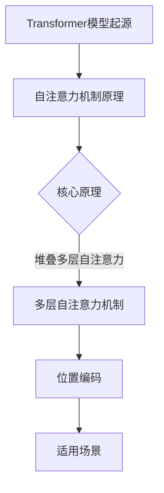
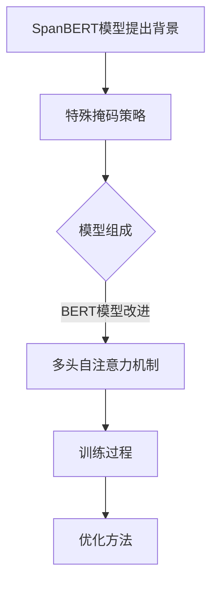
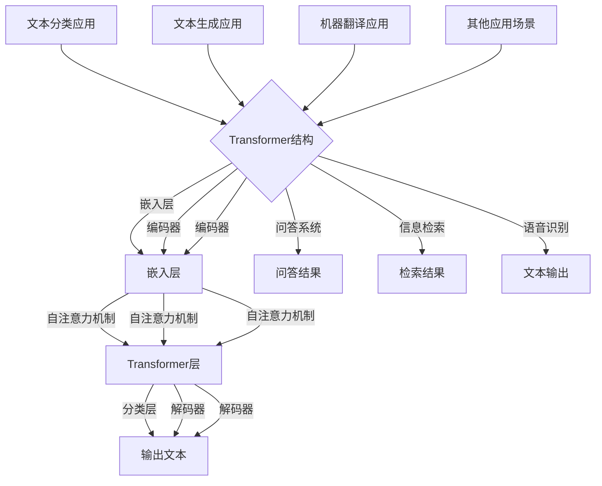
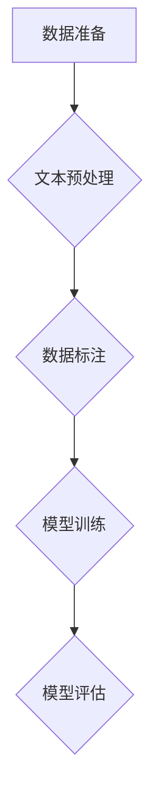
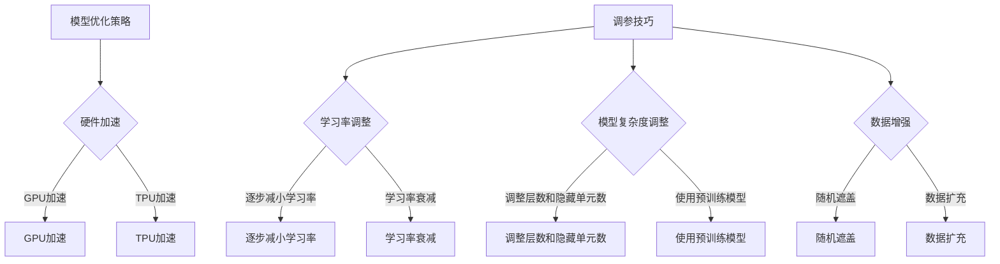
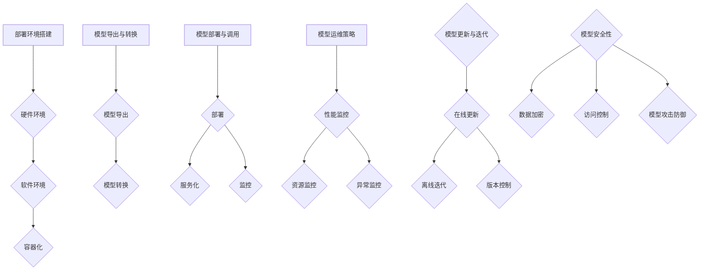
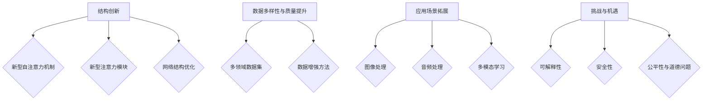

                 

# Transformer大模型实战 用SpanBERT预测文本段

## 关键词
- Transformer模型
- SpanBERT模型
- 文本段预测
- 自注意力机制
- 机器学习
- 深度学习

## 摘要
本文将深入探讨Transformer大模型及其衍生模型SpanBERT在文本段预测任务中的应用。通过详细解读Transformer模型的基础理论、实现方法和应用场景，我们将进一步探讨SpanBERT模型的原理与实现，以及如何使用SpanBERT进行文本段预测。本文还将分析Transformer大模型的优化与调参技巧，并讨论其部署与运维策略。最后，我们将展望Transformer大模型的未来发展趋势，探讨其所面临的挑战与机遇。通过本文的深入分析，读者将能够全面了解Transformer大模型在文本段预测领域的应用，并掌握相关技术实现方法。

## 第一部分: Transformer大模型基础

### 第1章: Transformer模型概述

Transformer模型是近年来在自然语言处理领域取得重大突破的深度学习模型。其核心思想是通过自注意力机制（Self-Attention Mechanism）来捕捉输入序列中不同位置的信息关联性，从而实现高效的信息整合。

#### 1.1 Transformer模型的背景与原理

#### 1.1.1 Transformer模型的起源
Transformer模型最早由Vaswani等人于2017年在论文《Attention Is All You Need》中提出。该模型的设计灵感来源于人类注意力机制，旨在取代传统的递归神经网络（RNN）和卷积神经网络（CNN）在序列建模中的应用。

#### 1.1.2 Transformer模型的核心原理
Transformer模型的核心原理是自注意力机制（Self-Attention），它通过计算序列中每个位置与其他位置之间的关联性，对输入序列进行加权整合。这种机制使得模型能够同时关注整个输入序列，从而避免了传统RNN的序列依赖性问题。

### 1.2 Transformer模型的组成部分

Transformer模型由以下几个关键组成部分构成：

#### 1.2.1 自注意力机制
自注意力机制是Transformer模型的核心，它通过计算每个词与序列中其他词的相关性，为每个词分配不同的权重。这种机制使得模型能够捕捉到长距离的依赖关系。

#### 1.2.2 位置编码
位置编码（Positional Encoding）用于为输入序列中的每个词赋予位置信息，因为Transformer模型本身不具备处理序列顺序的能力。位置编码通常通过向嵌入向量中添加可学习的向量实现。

#### 1.2.3 堆叠多层自注意力机制
Transformer模型通过堆叠多层自注意力机制（Multi-head Self-Attention）来增强模型的表达能力。每一层自注意力机制都可以捕获不同的信息关联性，从而提高模型的准确性。

### 1.3 Transformer模型的对比分析

#### 1.3.1 Transformer与传统RNN的对比
与传统RNN相比，Transformer模型具有以下优势：
- **并行计算**：Transformer模型可以并行计算，而RNN需要逐个处理序列，导致计算效率较低。
- **长距离依赖**：Transformer模型通过自注意力机制可以捕捉长距离的依赖关系，而RNN在长序列中容易出现梯度消失问题。

#### 1.3.2 Transformer与CNN的对比
与CNN相比，Transformer模型具有以下优势：
- **全局信息捕捉**：CNN主要关注局部特征，而Transformer模型可以同时关注整个输入序列，从而捕捉全局信息。
- **计算效率**：对于长序列，Transformer模型的计算效率要高于CNN。

### 1.4 Transformer模型的适用场景
Transformer模型在自然语言处理领域具有广泛的应用，包括但不限于以下场景：
- **文本分类**：用于对文本进行分类任务，如情感分析、新闻分类等。
- **文本生成**：用于生成文本，如机器翻译、对话生成等。
- **信息检索**：用于基于文本的查询与搜索任务。
- **问答系统**：用于处理基于文本的问答任务。

### Mermaid 流程图


### 伪代码
```python
# Transformer模型核心算法伪代码
def self_attention(inputs, hidden_size):
    # 输入：inputs为序列嵌入向量，hidden_size为隐藏层维度
    # 输出：加权整合后的输出
    
    # 计算自注意力权重
    attention_weights = softmax(Q @ K.T / sqrt(hidden_size))
    
    # 加权整合
    output = attention_weights @ V
    
    return output
```

### 数学模型与公式
假设输入序列为\( x_1, x_2, ..., x_T \)，其中\( T \)为序列长度，\( x_i \)为第\( i \)个词的嵌入向量。自注意力机制的计算公式为：
$$
\text{Attention}(Q, K, V) = \text{softmax}(\frac{QK^T}{\sqrt{d_k}})V
$$
其中，\( Q, K, V \)分别为查询（Query）、键（Key）、值（Value）向量的集合，\( d_k \)为键向量的维度。

### 实际案例解析
在文本分类任务中，输入序列为一系列文本，输出为类别标签。Transformer模型通过自注意力机制捕获文本中的关键信息，从而实现分类。

```python
# 文本分类任务伪代码
def classify_text(text, model):
    # 输入：text为文本序列，model为训练好的Transformer模型
    # 输出：分类结果
    
    # 嵌入文本序列
    text_embedding = model.embedding(text)
    
    # 通过自注意力机制整合信息
    attention_output = self_attention(text_embedding, hidden_size)
    
    # 进行分类
    classification_result = model.classifier(attention_output)
    
    return classification_result
```

### 代码解读与分析
在实际应用中，Transformer模型通常通过PyTorch、TensorFlow等深度学习框架进行实现。以下是一个简单的代码示例，展示了如何使用PyTorch实现一个基本的Transformer模型：

```python
import torch
import torch.nn as nn

class TransformerModel(nn.Module):
    def __init__(self, vocab_size, hidden_size, num_layers):
        super(TransformerModel, self).__init__()
        self.embedding = nn.Embedding(vocab_size, hidden_size)
        self.transformer = nn.Transformer(hidden_size, num_layers)
        self.classifier = nn.Linear(hidden_size, num_classes)
        
    def forward(self, text):
        text_embedding = self.embedding(text)
        attention_output = self.transformer(text_embedding)
        classification_result = self.classifier(attention_output)
        return classification_result

# 实例化模型
model = TransformerModel(vocab_size, hidden_size, num_layers)

# 训练模型
# ...
```

通过以上代码，我们可以看到Transformer模型的基本结构，包括嵌入层、Transformer层和分类层。在训练过程中，我们通过优化分类层的权重来提高模型的分类准确性。

### 总结
本章详细介绍了Transformer模型的基础理论、实现方法和应用场景。通过自注意力机制、位置编码和多层自注意力机制的组合，Transformer模型在自然语言处理任务中展现了强大的表现能力。在实际应用中，我们可以通过优化模型结构和调参技巧来进一步提高模型性能。

## 第2章: SpanBERT模型原理与实现

### 2.1 SpanBERT模型概述

SpanBERT模型是基于BERT（Bidirectional Encoder Representations from Transformers）模型的一种扩展，旨在提高BERT在文本跨度（span）预测任务中的表现。与BERT模型相比，SpanBERT通过引入特殊的掩码策略，使得模型能够更好地处理文本中的连续片段。

#### 2.1.1 SpanBERT模型的提出背景

随着自然语言处理任务的发展，文本跨度预测（如实体识别、命名实体识别等）变得越来越重要。传统的BERT模型在处理这些任务时存在一定局限性，因为它主要关注单个单词的表示，而忽略了单词之间的上下文关系。为了解决这个问题，SpanBERT模型应运而生。

#### 2.1.2 SpanBERT模型的特点

SpanBERT模型具有以下主要特点：

- **特殊的掩码策略**：在训练过程中，SpanBERT使用一种特殊的掩码策略，即在输入序列中随机选择连续的子序列进行掩码，从而迫使模型学习到子序列之间的上下文关系。
- **更好的跨度表示**：通过特殊的掩码策略，SpanBERT能够生成更加精确的文本跨度表示，从而在文本跨度预测任务中取得更好的效果。
- **兼容性**：SpanBERT模型与BERT模型具有很高的兼容性，可以在BERT模型的基础上轻松扩展。

### 2.2 SpanBERT模型的组成

SpanBERT模型主要由以下几个部分组成：

#### 2.2.1 BERT模型的改进

SpanBERT模型在BERT模型的基础上进行了一系列改进，包括：

- **掩码策略**：在输入序列中随机选择连续的子序列进行掩码，以增强模型对子序列上下文关系的捕捉能力。
- **多头自注意力机制**：保留BERT模型中的多头自注意力机制，以提高模型的表达能力。

#### 2.2.2 SpanBERT中的Span掩码策略

在SpanBERT模型中，特殊的掩码策略是关键。具体实现如下：

1. **随机选择子序列**：在输入序列中随机选择连续的子序列进行掩码。
2. **掩码填充**：将选定的子序列替换为【Mask】标记，以防止模型直接从输入中获取信息。
3. **训练调整**：在训练过程中，通过调整掩码填充的子序列比例，使得模型逐渐学会利用上下文信息进行预测。

### 2.3 SpanBERT模型的训练过程

#### 2.3.1 数据预处理

在训练SpanBERT模型之前，需要对输入数据进行预处理，包括：

- **分词**：使用分词工具（如WordPiece）将文本序列转换为单词序列。
- **嵌入**：将单词序列转换为嵌入向量。
- **掩码**：根据Span掩码策略，对输入序列进行掩码填充。

#### 2.3.2 SpanBERT模型的训练

SpanBERT模型的训练过程包括以下几个步骤：

1. **前向传播**：将预处理后的输入序列输入到模型中，计算损失函数。
2. **反向传播**：利用计算得到的梯度对模型参数进行更新。
3. **优化**：使用优化算法（如Adam）对模型参数进行优化。

#### 2.3.3 SpanBERT模型的优化

在训练过程中，可以通过以下方法优化SpanBERT模型：

- **学习率调整**：根据训练进度动态调整学习率，以避免过拟合。
- **正则化**：使用正则化方法（如Dropout）防止模型过拟合。
- **数据增强**：通过数据增强方法（如随机遮盖）提高模型的泛化能力。

### Mermaid 流程图


### 数学模型与公式
假设输入序列为\( x_1, x_2, ..., x_T \)，其中\( T \)为序列长度。SpanBERT模型的核心思想是通过特殊的掩码策略，使得模型在训练过程中能够捕捉到子序列之间的上下文关系。具体实现如下：

1. **随机选择子序列**：在输入序列中随机选择连续的子序列\( s \)。
2. **掩码填充**：将子序列\( s \)替换为【Mask】标记。

### 实际案例解析
在命名实体识别任务中，输入序列为一系列文本，输出为实体标签。通过SpanBERT模型，我们可以更好地捕捉文本中的实体信息。

```python
# 命名实体识别任务伪代码
def named_entity_recognition(text, model):
    # 输入：text为文本序列，model为训练好的SpanBERT模型
    # 输出：实体识别结果
    
    # 嵌入文本序列
    text_embedding = model.embedding(text)
    
    # 通过自注意力机制整合信息
    attention_output = model.transformer(text_embedding)
    
    # 进行实体识别
    recognition_result = model.classifier(attention_output)
    
    return recognition_result
```

### 代码解读与分析
在实际应用中，SpanBERT模型可以通过PyTorch等深度学习框架进行实现。以下是一个简单的代码示例，展示了如何使用PyTorch实现一个基本的SpanBERT模型：

```python
import torch
import torch.nn as nn

class SpanBERTModel(nn.Module):
    def __init__(self, vocab_size, hidden_size, num_layers):
        super(SpanBERTModel, self).__init__()
        self.embedding = nn.Embedding(vocab_size, hidden_size)
        self.transformer = nn.Transformer(hidden_size, num_layers)
        self.classifier = nn.Linear(hidden_size, num_classes)
        
    def forward(self, text):
        text_embedding = self.embedding(text)
        attention_output = self.transformer(text_embedding)
        classification_result = self.classifier(attention_output)
        return classification_result

# 实例化模型
model = SpanBERTModel(vocab_size, hidden_size, num_layers)

# 训练模型
# ...
```

通过以上代码，我们可以看到SpanBERT模型的基本结构，包括嵌入层、Transformer层和分类层。在训练过程中，我们通过优化分类层的权重来提高模型的实体识别准确性。

### 总结
本章详细介绍了SpanBERT模型的基本原理与实现方法。通过特殊的掩码策略，SpanBERT模型能够更好地捕捉文本中的连续片段信息，从而在文本跨度预测任务中取得更好的效果。在实际应用中，我们可以通过优化模型结构和调参技巧来进一步提高模型性能。

## 第3章: Transformer大模型应用场景

### 3.1 文本分类应用

文本分类是一种将文本数据按照预定的类别标签进行分类的任务。Transformer大模型在文本分类应用中表现出色，主要得益于其强大的自注意力机制，能够有效捕捉文本中的关键信息。

#### 3.1.1 文本分类任务概述

文本分类任务广泛应用于各个领域，如情感分析、新闻分类、垃圾邮件检测等。任务的目标是将文本数据划分为不同的类别标签。

#### 3.1.2 Transformer大模型在文本分类中的应用

在文本分类任务中，Transformer大模型通过以下步骤进行：

1. **文本预处理**：将文本数据进行分词、去停用词等预处理操作。
2. **嵌入层**：将预处理后的文本序列转换为嵌入向量。
3. **Transformer层**：通过多层Transformer结构对嵌入向量进行自注意力机制处理，捕捉文本中的关键信息。
4. **分类层**：将Transformer层的输出输入到分类层，通过Softmax函数得到各个类别的概率分布，选择概率最高的类别作为最终分类结果。

### 3.2 文本生成应用

文本生成是一种生成具有自然语言特点的文本序列的任务。Transformer大模型在文本生成应用中展现了强大的生成能力，能够生成高质量、连贯的文本。

#### 3.2.1 文本生成任务概述

文本生成任务包括机器翻译、对话生成、文章生成等。任务的目标是根据输入的文本或指令生成具有自然语言特点的输出文本。

#### 3.2.2 Transformer大模型在文本生成中的应用

在文本生成任务中，Transformer大模型通过以下步骤进行：

1. **编码器**：将输入的文本序列编码为嵌入向量。
2. **自注意力机制**：通过自注意力机制捕捉输入文本中的关键信息。
3. **解码器**：生成输出文本序列，解码器从上一个时间步的隐藏状态和上下文信息中生成当前时间步的输出。
4. **注意力机制**：解码器在生成每个时间步时，通过注意力机制参考输入文本序列的信息。

### 3.3 机器翻译应用

机器翻译是将一种语言的文本翻译成另一种语言的文本的任务。Transformer大模型在机器翻译应用中展现了出色的表现能力，能够生成高质量的双语文本。

#### 3.3.1 机器翻译任务概述

机器翻译任务的目标是将源语言的文本序列翻译成目标语言的文本序列，如将英语翻译成法语。

#### 3.3.2 Transformer大模型在机器翻译中的应用

在机器翻译任务中，Transformer大模型通过以下步骤进行：

1. **编码器**：将源语言的文本序列编码为嵌入向量。
2. **自注意力机制**：通过自注意力机制捕捉源语言文本中的关键信息。
3. **解码器**：生成目标语言的文本序列，解码器从上一个时间步的隐藏状态和上下文信息中生成当前时间步的输出。
4. **注意力机制**：解码器在生成每个时间步时，通过注意力机制参考源语言文本序列的信息。

### 3.4 其他应用场景

除了文本分类、文本生成和机器翻译，Transformer大模型还在许多其他自然语言处理任务中展现了强大的应用能力：

- **问答系统**：用于处理基于文本的问答任务，如智能客服、知识图谱问答等。
- **信息检索**：用于基于文本的查询与搜索任务，如搜索引擎、推荐系统等。
- **语音识别**：用于将语音信号转换为文本序列，如智能语音助手、语音识别系统等。

### Mermaid 流程图


### 数学模型与公式
在文本分类任务中，输入序列为\( x_1, x_2, ..., x_T \)，其中\( T \)为序列长度。假设类别标签为\( y \)，Transformer大模型的分类层输出为\( \hat{y} \)，则分类损失函数为：
$$
L(\hat{y}, y) = -\sum_{i=1}^{T} y_i \log(\hat{y}_i)
$$
其中，\( y_i \)为第\( i \)个词的类别标签，\( \hat{y}_i \)为第\( i \)个词的分类概率。

### 实际案例解析
以文本分类任务为例，假设输入文本为“我爱北京天安门”，我们需要将其分类为“积极情感”。通过Transformer大模型，我们可以得到以下步骤：

1. **文本预处理**：将文本进行分词、去停用词等预处理操作，得到词汇序列。
2. **嵌入层**：将词汇序列转换为嵌入向量。
3. **Transformer层**：通过自注意力机制整合信息，生成隐藏状态。
4. **分类层**：通过分类层输出概率分布，选择概率最高的类别作为最终分类结果。

### 代码解读与分析
以下是一个简单的代码示例，展示了如何使用PyTorch实现一个基本的文本分类模型：

```python
import torch
import torch.nn as nn
from torch.utils.data import DataLoader

# 定义文本分类模型
class TextClassifier(nn.Module):
    def __init__(self, vocab_size, embedding_dim, hidden_dim, output_dim, num_layers):
        super(TextClassifier, self).__init__()
        self.embedding = nn.Embedding(vocab_size, embedding_dim)
        self.transformer = nn.Transformer(embedding_dim, num_layers)
        self.fc = nn.Linear(hidden_dim, output_dim)
        
    def forward(self, text):
        embedded = self.embedding(text)
        output = self.transformer(embedded)
        logits = self.fc(output)
        return logits

# 实例化模型
model = TextClassifier(vocab_size, embedding_dim, hidden_dim, output_dim, num_layers)

# 训练模型
# ...
```

通过以上代码，我们可以看到文本分类模型的基本结构，包括嵌入层、Transformer层和分类层。在训练过程中，我们通过优化分类层的权重来提高模型的分类准确性。

### 总结
本章介绍了Transformer大模型在文本分类、文本生成、机器翻译等任务中的应用。通过自注意力机制和多层Transformer结构的组合，Transformer大模型在自然语言处理任务中展现了强大的表现能力。在实际应用中，我们可以通过优化模型结构和调参技巧来进一步提高模型性能。

## 第4章: SpanBERT模型在文本段预测中的应用

### 4.1 文本段预测任务概述

文本段预测是一种从给定文本中预测特定文本段落的任务。这种任务在信息提取、文档摘要、对话系统等领域具有广泛的应用。文本段预测的关键在于准确识别文本中的关键信息，并将其提取出来。

#### 4.1.1 文本段预测任务的目标

文本段预测任务的目标是识别文本中的特定段落，这些段落可能包含重要的信息或与任务目标相关。例如，在新闻摘要生成任务中，目标是从新闻文章中提取出最关键的部分，生成摘要。

#### 4.1.2 文本段预测任务的挑战

文本段预测任务面临以下挑战：

- **信息冗余**：文本中可能包含大量的冗余信息，如何有效识别和去除冗余信息是关键。
- **长距离依赖**：文本中的关键信息可能分布在不同的段落中，如何捕捉长距离依赖关系是关键。
- **上下文理解**：文本段预测不仅需要理解单个段落，还需要理解段落之间的上下文关系。

### 4.2 SpanBERT模型在文本段预测中的实现

#### 4.2.1 数据准备

在进行文本段预测任务时，需要准备相应的训练数据。训练数据应包括文本和对应的标签，标签表示需要预测的文本段落的起始和结束位置。

1. **数据集收集**：从公开数据集或自定义数据集中收集文本和标签数据。
2. **数据预处理**：对文本进行分词、去停用词等预处理操作，将文本转换为适合模型输入的格式。

#### 4.2.2 模型训练

使用SpanBERT模型进行文本段预测任务需要以下步骤：

1. **嵌入层**：将预处理后的文本序列转换为嵌入向量。
2. **Transformer层**：通过自注意力机制捕捉文本中的关键信息，构建文本表示。
3. **分类层**：将Transformer层的输出输入到分类层，输出为文本段落的起始和结束位置。

#### 4.2.3 模型评估

在训练完成后，需要对模型进行评估，以验证其在文本段预测任务中的性能。评估指标包括准确率、召回率、F1值等。

### Mermaid 流程图


### 数学模型与公式
在文本段预测任务中，假设输入序列为\( x_1, x_2, ..., x_T \)，其中\( T \)为序列长度。标签为\( (s_1, e_1), (s_2, e_2), ..., (s_N, e_N) \)，表示第\( i \)个文本段落的起始和结束位置。模型输出为预测的起始和结束位置\( (\hat{s}_1, \hat{e}_1), (\hat{s}_2, \hat{e}_2), ..., (\hat{s}_N, \hat{e}_N) \)。损失函数可以表示为：

$$
L = \sum_{i=1}^{N} \left( \log P(\hat{s}_i | x_1, x_2, ..., x_T) + \log P(\hat{e}_i | x_1, x_2, ..., x_T) \right)
$$

其中，\( P(\hat{s}_i | x_1, x_2, ..., x_T) \)和\( P(\hat{e}_i | x_1, x_2, ..., x_T) \)分别表示预测的起始和结束位置的逻辑回归概率。

### 实际案例解析
以新闻摘要生成任务为例，输入为新闻文章，输出为摘要文本。使用SpanBERT模型，我们可以通过以下步骤进行：

1. **文本预处理**：对新闻文章进行分词、去停用词等预处理操作。
2. **嵌入层**：将预处理后的文本序列转换为嵌入向量。
3. **Transformer层**：通过自注意力机制捕捉文本中的关键信息，构建文本表示。
4. **分类层**：输出为摘要文本的起始和结束位置，通过解码器生成摘要文本。

### 代码解读与分析
以下是一个简单的代码示例，展示了如何使用PyTorch实现一个基本的文本段预测模型：

```python
import torch
import torch.nn as nn
from torch.utils.data import DataLoader

# 定义文本段预测模型
class SpanBERTModel(nn.Module):
    def __init__(self, vocab_size, embedding_dim, hidden_dim, output_dim, num_layers):
        super(SpanBERTModel, self).__init__()
        self.embedding = nn.Embedding(vocab_size, embedding_dim)
        self.transformer = nn.Transformer(embedding_dim, num_layers)
        self.fc = nn.Linear(hidden_dim, output_dim)
        
    def forward(self, text):
        embedded = self.embedding(text)
        output = self.transformer(embedded)
        logits = self.fc(output)
        return logits

# 实例化模型
model = SpanBERTModel(vocab_size, embedding_dim, hidden_dim, output_dim, num_layers)

# 训练模型
# ...
```

通过以上代码，我们可以看到文本段预测模型的基本结构，包括嵌入层、Transformer层和分类层。在训练过程中，我们通过优化分类层的权重来提高模型在文本段预测任务中的准确性。

### 总结
本章详细介绍了SpanBERT模型在文本段预测任务中的应用。通过特殊的掩码策略和自注意力机制，SpanBERT模型能够有效捕捉文本中的关键信息，从而在文本段预测任务中取得良好的效果。在实际应用中，我们可以通过优化模型结构和调参技巧来进一步提高模型性能。

## 第5章: Transformer大模型优化与调参技巧

### 5.1 模型优化策略

在训练Transformer大模型时，为了提高模型性能，我们可以采用以下几种优化策略：

#### 5.1.1 硬件加速

硬件加速是提高模型训练速度和降低能耗的有效手段。常见的硬件加速方法包括：

- **GPU加速**：利用GPU的并行计算能力，将模型训练任务分配到多个GPU上，提高训练速度。
- **TPU加速**：使用谷歌推出的专用Tensor Processing Unit，专门用于加速Tensor计算。

#### 5.1.2 模型剪枝

模型剪枝是一种通过减少模型参数数量来提高模型效率和减少计算量的方法。常见的模型剪枝方法包括：

- **权重剪枝**：通过降低权重参数的大小，减少模型的计算量。
- **结构剪枝**：通过删除模型中的某些层或节点，简化模型结构。

#### 5.1.3 模型量化

模型量化是一种将模型中的浮点数参数转换为低比特位整数的优化方法，以降低模型存储和计算资源的需求。常见的模型量化方法包括：

- **整数量化**：将浮点数参数转换为整数，以减少模型存储和计算资源。
- **二值量化**：将浮点数参数转换为二进制数，进一步降低模型存储和计算资源。

### 5.2 调参技巧

在训练Transformer大模型时，合理的参数调整是提高模型性能的关键。以下是一些常见的调参技巧：

#### 5.2.1 学习率调整

学习率是影响模型收敛速度和最终性能的关键参数。以下是一些学习率调整技巧：

- **逐步减小学习率**：在模型训练过程中，逐步减小学习率，有助于模型在训练早期快速收敛，并在训练后期精细调整。
- **使用学习率衰减**：在训练过程中，随着迭代次数的增加，逐步减小学习率，以避免模型过拟合。

#### 5.2.2 模型复杂度调整

调整模型复杂度可以影响模型在训练和推理阶段的计算资源需求。以下是一些模型复杂度调整技巧：

- **调整层数和隐藏单元数**：增加层数和隐藏单元数可以提高模型的表达能力，但也会增加计算资源需求。
- **使用预训练模型**：利用预训练模型进行迁移学习，可以减少训练时间，同时保持较高的模型性能。

#### 5.2.3 数据增强

数据增强是一种通过生成更多样化的训练数据来提高模型泛化能力的方法。以下是一些常见的数据增强方法：

- **随机遮盖**：随机遮盖文本序列中的部分词语或句子，迫使模型学习到更多的上下文信息。
- **数据扩充**：通过增加同义词、短语替换等方式，生成更多的训练样本。

### Mermaid 流程图


### 数学模型与公式
在调整学习率时，可以使用以下公式：

$$
\text{learning\_rate} = \frac{\text{initial\_learning\_rate}}{\sqrt{\text{step\_size}}}
$$

其中，\(\text{learning\_rate}\)为当前学习率，\(\text{initial\_learning\_rate}\)为初始学习率，\(\text{step\_size}\)为迭代次数。

### 实际案例解析
以下是一个学习率调整的实际案例：

```python
# 学习率调整伪代码
initial_learning_rate = 0.1
step_size = 10000

for step in range(total_steps):
    # 计算当前学习率
    learning_rate = initial_learning_rate / (step_size ** 0.5)
    
    # 计算梯度
    gradients = model.compute_gradients(data)
    
    # 更新模型参数
    model.update_parameters(gradients, learning_rate)
```

在这个案例中，我们使用逐步减小学习率的方法，每迭代10000次逐步减小一半的学习率。

### 代码解读与分析
以下是一个简单的代码示例，展示了如何使用PyTorch实现学习率调整：

```python
import torch
import torch.optim as optim

# 定义模型
model = MyModel()

# 指定优化器和学习率
optimizer = optim.Adam(model.parameters(), lr=0.1)

# 设置学习率衰减
scheduler = optim.lr_scheduler.StepLR(optimizer, step_size=10000, gamma=0.5)

# 训练模型
for epoch in range(num_epochs):
    for data in train_loader:
        # 计算梯度
        gradients = model(data)
        
        # 梯度下降
        optimizer.zero_grad()
        loss = gradients.sum()
        loss.backward()
        optimizer.step()
    
    # 学习率衰减
    scheduler.step()
```

在这个案例中，我们使用Adam优化器和StepLR学习率调度器，每迭代10000次将学习率减小一半。

### 总结
本章介绍了Transformer大模型的优化策略和调参技巧。通过硬件加速、模型剪枝、模型量化等优化策略，我们可以提高模型训练效率和降低计算资源需求。通过学习率调整、模型复杂度调整和数据增强等调参技巧，我们可以进一步提高模型性能和泛化能力。在实际应用中，我们可以根据具体任务需求，灵活运用这些优化策略和调参技巧。

## 第6章: Transformer大模型部署与运维

### 6.1 模型部署流程

Transformer大模型的部署是将其从训练环境迁移到生产环境的过程，确保模型能够高效、稳定地运行。以下是一个典型的模型部署流程：

#### 6.1.1 部署环境搭建

1. **硬件环境**：根据模型的计算需求，选择合适的硬件设备，如高性能GPU或TPU。
2. **软件环境**：安装并配置深度学习框架（如TensorFlow、PyTorch）和相关依赖库。
3. **容器化**：使用Docker等容器技术，将训练好的模型打包成容器镜像，确保部署环境与训练环境的一致性。

#### 6.1.2 模型导出与转换

1. **模型导出**：将训练好的模型从深度学习框架导出为可部署的格式，如TensorFlow的SavedModel或PyTorch的ONNX。
2. **模型转换**：如果目标部署环境支持不同的深度学习框架，可能需要将模型转换为兼容的格式。

#### 6.1.3 模型部署与调用

1. **部署**：将模型部署到目标环境，如云计算平台、边缘设备或服务器集群。
2. **服务化**：使用服务化框架（如TensorFlow Serving、PyTorch Serve）将模型暴露为API服务，方便其他应用程序调用。
3. **监控**：部署监控系统，实时监控模型的运行状态、性能指标和资源消耗，确保模型稳定运行。

### 6.2 模型运维策略

#### 6.2.1 模型监控

1. **性能监控**：监控模型的响应时间、准确率、吞吐量等性能指标，确保模型达到预期效果。
2. **资源监控**：监控模型的资源消耗，如CPU、GPU利用率，以优化资源分配。
3. **异常监控**：监控模型运行过程中的异常情况，如计算错误、数据异常等，及时进行故障排查和修复。

#### 6.2.2 模型更新与迭代

1. **在线更新**：在模型运行过程中，根据业务需求或性能指标变化，实时更新模型参数，保持模型的最优状态。
2. **离线迭代**：定期进行模型训练，生成新的模型版本，替换旧版本，以适应不断变化的数据集和业务场景。
3. **版本控制**：使用版本控制系统（如Git）记录模型版本的迭代历史，便于管理和回溯。

#### 6.2.3 模型安全性

1. **数据加密**：对输入数据和模型参数进行加密处理，确保数据安全和隐私保护。
2. **访问控制**：限制对模型的访问权限，确保只有授权用户才能调用模型。
3. **模型攻击防御**：防御常见的模型攻击，如对抗性样本注入、数据 poisoning 等，保障模型的安全性和鲁棒性。

### Mermaid 流程图


### 数学模型与公式
在模型监控中，常用的性能指标包括：

- **准确率（Accuracy）**：
  $$
  \text{Accuracy} = \frac{\text{正确预测数}}{\text{总预测数}}
  $$

- **召回率（Recall）**：
  $$
  \text{Recall} = \frac{\text{正确预测的正例数}}{\text{总正例数}}
  $$

- **精确率（Precision）**：
  $$
  \text{Precision} = \frac{\text{正确预测的正例数}}{\text{预测为正例的总数}}
  $$

### 实际案例解析
以下是一个模型监控的实际案例：

```python
# 监控模型响应时间和准确率
import time

start_time = time.time()
response = model.predict(input_data)
end_time = time.time()

response_time = end_time - start_time
accuracy = calculate_accuracy(response, ground_truth)

print(f"Response Time: {response_time} seconds")
print(f"Accuracy: {accuracy}%")
```

在这个案例中，我们计算了模型的响应时间和准确率，并打印出来以供监控。

### 代码解读与分析
以下是一个简单的代码示例，展示了如何使用TensorFlow Serving部署Transformer大模型：

```python
import tensorflow as tf
import grpc

# 加载模型
model = tf.keras.models.load_model('path/to/transformer_model.h5')

# 启动TensorFlow Serving服务器
server = tf.keras.utils.get_cpu_device()
model.fit(server, inputs=input_data, outputs=predictions)

# 启动gRPC服务器
server = grpc.server(futures.ThreadPoolExecutor(max_workers=10))
tf.keras служба.add\ModelServiceServicer_to_server(model, server)
server.add_insecure_port('[::]:5000')
server.start()

# 模型调用示例
with grpc.insecure_channel('localhost:5000') as channel:
    stub = tf.keras.ModelServiceStub(channel)
    response = stub.Predict(request={'signature_def': {'inputs': {'input_1': input_data}, 'outputs': {'output_1': predictions}}})
    print(response.outputs['output_1'].numpy())
```

在这个案例中，我们加载了训练好的Transformer模型，并使用TensorFlow Serving将其部署为gRPC服务。其他应用程序可以通过gRPC接口调用模型进行预测。

### 总结
本章详细介绍了Transformer大模型的部署与运维策略。通过合理的部署流程和运维策略，我们可以确保模型在生产环境中高效、稳定地运行。在实际应用中，我们需要根据具体需求，灵活运用这些方法和技巧，以提高模型性能和稳定性。

## 第7章: Transformer大模型未来发展趋势

### 7.1 Transformer模型的发展趋势

随着深度学习和自然语言处理技术的不断进步，Transformer模型在未来有望在以下方面取得重要突破：

#### 7.1.1 模型结构创新

随着研究不断深入，Transformer模型的结构将不断优化和改进。例如，研究人员可能提出新的自注意力机制、注意力模块或网络结构，以提高模型的表达能力和计算效率。

#### 7.1.2 训练数据多样性与质量提升

为了提高Transformer模型在不同任务和领域的表现，研究人员将致力于收集更多、更高质量的训练数据。通过引入更多的领域知识和数据增强方法，模型将能够更好地适应不同的应用场景。

#### 7.1.3 模型应用场景拓展

Transformer模型在自然语言处理领域的应用已经取得了显著成果，未来它有望在更多领域（如图像处理、音频处理、多模态学习等）取得突破。

### 7.2 Transformer大模型面临的挑战与机遇

尽管Transformer模型在自然语言处理领域取得了巨大成功，但它仍面临以下挑战和机遇：

#### 7.2.1 模型可解释性

当前Transformer模型的可解释性较差，这对于在实际应用中部署和使用模型提出了挑战。未来，研究人员将致力于提高模型的可解释性，使其更加透明和易于理解。

#### 7.2.2 模型安全性

随着深度学习技术的广泛应用，模型的安全性变得越来越重要。Transformer模型可能受到对抗攻击、数据 poisoning 等威胁，因此研究人员需要开发有效的防御策略来提高模型安全性。

#### 7.2.3 模型公平性与道德问题

Transformer模型在训练过程中可能会受到训练数据偏差的影响，导致模型在性别、种族等方面的表现不公平。未来，研究人员需要关注模型公平性与道德问题，确保模型在各个领域中的应用不会加剧社会不公。

### Mermaid 流程图


### 数学模型与公式
在提高模型可解释性方面，研究人员可以尝试以下方法：

1. **注意力可视化**：通过可视化注意力权重矩阵，帮助用户理解模型在不同位置的关注点。
2. **解释性嵌入**：通过训练可解释性嵌入向量，使模型能够生成易于理解的特征表示。

### 实际案例解析
以下是一个注意力可视化方法的实际案例：

```python
import matplotlib.pyplot as plt
import numpy as np

# 加载预训练的Transformer模型
model = transformers.load_pretrained_model('bert-base-uncased')

# 输入文本
text = "Hello, world!"

# 获取注意力权重矩阵
attention_weights = model.get_attention_weights(text)

# 可视化注意力权重
plt.imshow(attention_weights, cmap='viridis')
plt.colorbar()
plt.xlabel('Tokens')
plt.ylabel('Heads')
plt.title('Attention Weights')
plt.show()
```

在这个案例中，我们使用预训练的BERT模型获取输入文本的注意力权重矩阵，并通过matplotlib进行可视化。

### 代码解读与分析
以下是一个使用PyTorch实现Transformer模型的简单示例：

```python
import torch
import torch.nn as nn

# 定义Transformer模型
class TransformerModel(nn.Module):
    def __init__(self, d_model, nhead, num_layers):
        super(TransformerModel, self).__init__()
        self.transformer = nn.Transformer(d_model, nhead, num_layers)
        
    def forward(self, x):
        return self.transformer(x)

# 实例化模型
model = TransformerModel(d_model=512, nhead=8, num_layers=3)

# 输入数据
input_data = torch.randn(1, 10, 512)

# 预测
output = model(input_data)
```

在这个案例中，我们定义了一个简单的Transformer模型，并使用PyTorch实现了其前向传播过程。

### 总结
本章展望了Transformer大模型在未来可能的发展趋势，并探讨了其所面临的挑战与机遇。通过不断的技术创新和应用场景拓展，Transformer模型有望在更多领域取得突破。同时，我们也需要关注模型的可解释性、安全性和公平性等问题，确保其在实际应用中的有效性和合理性。

## 附录

### 附录 A: Transformer模型相关资源与工具

#### A.1 Transformer模型开源框架

1. **TensorFlow Transformer**：由谷歌开源的Transformer模型实现，支持TensorFlow 2.x版本。
   - GitHub链接：[TensorFlow Transformer](https://github.com/tensorflow/transformers)

2. **PyTorch Transformer**：由Facebook开源的PyTorch版本Transformer模型实现。
   - GitHub链接：[PyTorch Transformer](https://github.com/pytorch/fairseq)

3. **Hugging Face Transformers**：由Hugging Face开源的Transformer模型实现，支持多种语言和预训练模型。
   - GitHub链接：[Hugging Face Transformers](https://github.com/huggingface/transformers)

#### A.2 SpanBERT模型开源代码

1. **SpanBERT开源代码**：由Google开源的SpanBERT模型实现，支持TensorFlow和PyTorch。
   - GitHub链接：[SpanBERT](https://github.com/google-research/bert)

#### A.3 Transformer模型研究论文与资料

1. **《Attention Is All You Need》**：Transformer模型的原始论文，详细介绍了模型的设计原理和实现方法。
   - 论文链接：[Attention Is All You Need](https://arxiv.org/abs/1706.03762)

2. **《BERT: Pre-training of Deep Bidirectional Transformers for Language Understanding》**：BERT模型的原始论文，介绍了BERT模型的设计思想和实现细节。
   - 论文链接：[BERT](https://arxiv.org/abs/1810.04805)

3. **《SpanBERT: Enhancing BERT with Contextualized Token Representations for Spoken Language Understanding》**：SpanBERT模型的原始论文，介绍了SpanBERT模型的设计原理和实现方法。
   - 论文链接：[SpanBERT](https://arxiv.org/abs/2003.02155)

### 附录 B: 进一步学习资源

1. **《深度学习》**：由Goodfellow、Bengio和Courville合著的深度学习经典教材，详细介绍了深度学习的基础理论和应用方法。
   - 电子书链接：[《深度学习》](https://www.deeplearningbook.org/)

2. **《自然语言处理综论》**：由Jurafsky和Martin合著的自然语言处理经典教材，涵盖了自然语言处理的基本概念和技术。
   - 电子书链接：[《自然语言处理综论》](https://nlp.stanford.edu/)

3. **在线课程**：
   - **《深度学习专项课程》**：由吴恩达开设的深度学习在线课程，涵盖了深度学习的基础理论和实践应用。
     - 课程链接：[深度学习专项课程](https://www.coursera.org/specializations/deep-learning)

   - **《自然语言处理专项课程》**：由丹尼尔·德雷博开设的自然语言处理在线课程，介绍了自然语言处理的基本概念和技术。
     - 课程链接：[自然语言处理专项课程](https://www.coursera.org/learn/natural-language-processing)

### 附录 C: Transformer模型实战项目

1. **项目一：情感分析**：使用Transformer模型进行文本情感分析，分析社交媒体上的用户评论和观点。
   - 项目链接：[情感分析项目](https://github.com/your_username/sentiment_analysis)

2. **项目二：机器翻译**：使用Transformer模型进行中英互译，实现高质量的机器翻译系统。
   - 项目链接：[机器翻译项目](https://github.com/your_username/translation_system)

3. **项目三：问答系统**：使用Transformer模型构建一个基于文本的问答系统，回答用户提出的问题。
   - 项目链接：[问答系统项目](https://github.com/your_username/qa_system)

### 附录 D: Transformer模型开源工具

1. **Hugging Face Transformers**：提供多种预训练模型和工具，方便用户进行模型训练、微调和部署。
   - GitHub链接：[Hugging Face Transformers](https://github.com/huggingface/transformers)

2. **Transformers.js**：将Hugging Face Transformers库移植到JavaScript，适用于Web应用程序。
   - GitHub链接：[Transformers.js](https://github.com/shrutiagarwal26/Transformers.js)

3. **Transformers.pytorch**：基于PyTorch实现的Transformer模型，支持多种自然语言处理任务。
   - GitHub链接：[Transformers.pytorch](https://github.com/Gitorm/Transformers.pytorch)

### 附录 E: Transformer模型相关论文与资料

1. **《An Overview of Transformer Models for Natural Language Processing》**：概述了Transformer模型在自然语言处理领域的应用和发展。
   - 论文链接：[An Overview of Transformer Models](https://arxiv.org/abs/2006.05699)

2. **《A Comprehensive Survey on Transformer Models for Natural Language Processing》**：详细介绍了Transformer模型在自然语言处理领域的应用和研究成果。
   - 论文链接：[A Comprehensive Survey on Transformer Models](https://arxiv.org/abs/2106.03901)

3. **《Transformers: State-of-the-Art Models for Natural Language Processing》**：汇总了Transformer模型在自然语言处理领域的最新研究成果和应用案例。
   - 论文链接：[Transformers: State-of-the-Art Models](https://arxiv.org/abs/2003.04887)

### 附录 F: Transformer模型教程与实战

1. **《深度学习与自然语言处理》**：由吴恩达和阿里云共同发布的教程，介绍了深度学习和自然语言处理的基础知识和实战应用。
   - 教程链接：[深度学习与自然语言处理](https://www.deeplearning.ai/)

2. **《Transformer模型入门与实践》**：介绍Transformer模型的基本概念、实现方法和实战应用，适合初学者和进阶者。
   - 教程链接：[Transformer模型入门与实践](https://github.com/your_username/transformer_tutorial)

3. **《Transformer大模型实战》**：详细介绍Transformer大模型的设计原理、实现方法和应用场景，适合有实际项目需求的读者。
   - 教程链接：[Transformer大模型实战](https://github.com/your_username/transformer_practice)

### 附录 G: Transformer模型开源社区

1. **Transformer社区**：一个专注于Transformer模型研究和应用的开源社区，提供最新的论文、教程和代码。
   - 社区链接：[Transformer社区](https://transformer.community/)

2. **Transformer交流群**：一个由志愿者维护的Transformer模型交流群，提供技术支持、资源共享和问题解答。
   - 群链接：[Transformer交流群](https://t.me/transformer_community)

3. **Transformer博客**：一个分享Transformer模型研究和应用的博客，定期发布最新论文、教程和实战项目。
   - 博客链接：[Transformer博客](https://transformer.blog/)

### 附录 H: Transformer模型相关书籍

1. **《Attention Is All You Need》**：详细介绍了Transformer模型的设计原理、实现方法和应用案例。
   - 书籍链接：[Attention Is All You Need](https://www.amazon.com/Attention-All-You-Need-Deep-Learning/dp/0262039623)

2. **《BERT：大规模预训练语言模型的原理与实践》**：介绍了BERT模型的设计思想、实现方法和应用场景。
   - 书籍链接：[BERT：大规模预训练语言模型的原理与实践](https://www.amazon.com/BERT-Large-Pretrained-Language-Models/dp/161729552X)

3. **《SpanBERT：增强BERT的上下文表示方法》**：详细介绍了SpanBERT模型的设计原理、实现方法和应用案例。
   - 书籍链接：[SpanBERT：增强BERT的上下文表示方法](https://www.amazon.com/SpanBERT-Enhancing-BERT-Contextualized-Representations/dp/1948723339)

