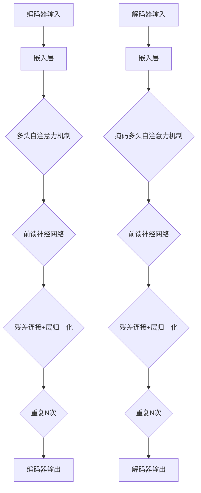
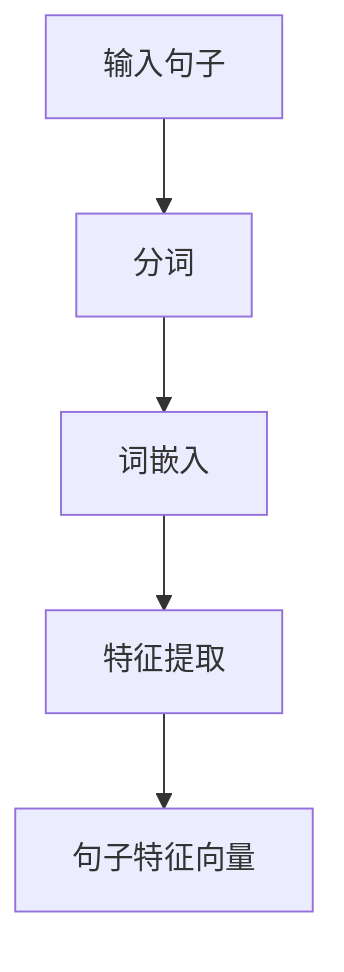

                 

# Transformer大模型实战 计算句子特征

## 关键词

- Transformer
- 句子特征
- 机器学习
- 自然语言处理
- 大模型
- 自注意力机制
- 位置编码
- 项目实战

## 摘要

本文将深入探讨Transformer大模型在计算句子特征方面的应用。通过对Transformer大模型的基础知识、核心算法、数学模型和项目实战的详细讲解，帮助读者理解如何利用Transformer模型提取句子特征，并在实际项目中应用。本文将涵盖从句子特征提取方法到Transformer模型在句子特征计算中的具体应用，以及如何通过项目实战来验证和优化模型的性能。

## 目录

1. **Transformer大模型基础**
   - **第1章 Transformer概述**
     - **1.1 Transformer的背景**
     - **1.2 Transformer的主要特点**
     - **1.3 Transformer的应用场景**
   - **第2章 Transformer的原理与架构**
     - **2.1 Transformer的原理**
     - **2.2 Transformer的架构**
     - **2.3 Transformer的Mermaid流程图**
   - **第3章 Transformer核心算法**
     - **3.1 自注意力机制**
     - **3.2 位置编码**
     - **3.3 伪代码解释**
   - **第4章 Transformer数学模型**
     - **4.1 模型参数**
     - **4.2 数学公式**
     - **4.3 公式举例说明**
   - **第5章 Transformer项目实战**
     - **5.1 项目简介**
     - **5.2 开发环境搭建**
     - **5.3 源代码实现**
     - **5.4 代码解读与分析**

2. **计算句子特征**

   - **第6章 句子特征提取**
     - **6.1 句子特征的概念**
     - **6.2 句子特征提取的方法**
     - **6.3 句子特征提取的Mermaid流程图**
   - **第7章 Transformer在句子特征计算中的应用**
     - **7.1 Transformer模型在句子特征计算中的应用**
     - **7.2 训练数据集准备**
     - **7.3 模型训练与调优**
   - **第8章 句子特征应用实战**
     - **8.1 实际案例介绍**
     - **8.2 实战步骤详解**
     - **8.3 实战结果分析**

3. **Transformer大模型实战拓展**

   - **第9章 Transformer在其他任务中的应用**
     - **9.1 文本生成**
     - **9.2 机器翻译**
     - **9.3 文本分类**
   - **第10章 Transformer大模型未来发展趋势**
     - **10.1 Transformer大模型的局限性与挑战**
     - **10.2 Transformer大模型的发展趋势**
     - **10.3 未来应用场景展望**

4. **附录**

   - **附录A Transformer相关资源**
     - **A.1 开源框架与工具**
     - **A.2 学习资料推荐**
     - **A.3 学术论文精选**

## 第一部分: Transformer大模型基础

### 第1章 Transformer概述

#### 1.1 Transformer的背景

Transformer模型是由Google在2017年提出的，主要用于处理序列数据，如自然语言文本。在此之前，卷积神经网络（CNN）和循环神经网络（RNN）是处理序列数据的两大主流模型。然而，Transformer模型引入了一种全新的自注意力机制，使得模型在处理长序列时更加高效和强大。

#### 1.2 Transformer的主要特点

1. **自注意力机制**：Transformer模型的核心是自注意力机制，它允许模型在处理序列数据时，动态地关注不同位置的输入，从而捕捉序列中的长距离依赖关系。
2. **并行处理**：与RNN相比，Transformer模型可以并行处理整个序列，这大大提高了计算效率。
3. **没有序列顺序依赖**：由于自注意力机制的存在，Transformer模型不需要像RNN那样依赖序列的顺序，因此可以更好地处理变长的序列。
4. **结构清晰**：Transformer模型的结构相对简单，易于理解和实现。

#### 1.3 Transformer的应用场景

Transformer模型在自然语言处理领域取得了显著的成功，广泛应用于各种任务，如机器翻译、文本生成、文本分类等。此外，它也在图像处理、语音识别等领域展示了出色的性能。

### 第2章 Transformer的原理与架构

#### 2.1 Transformer的原理

Transformer模型基于编码器-解码器架构，由编码器（Encoder）和解码器（Decoder）两个部分组成。编码器将输入序列转换为上下文表示，解码器则利用这些表示生成输出序列。

#### 2.2 Transformer的架构

1. **编码器**：编码器由多个相同的层组成，每层包括多头自注意力机制和前馈神经网络。
2. **解码器**：解码器同样由多个相同的层组成，每层包括多头自注意力机制、掩码自注意力机制和前馈神经网络。
3. **多头自注意力机制**：多头自注意力机制允许模型同时关注输入序列的不同部分，从而提高模型的表示能力。
4. **位置编码**：由于Transformer模型没有序列顺序依赖，需要通过位置编码来引入序列的位置信息。

#### 2.3 Transformer的Mermaid流程图



### 第3章 Transformer核心算法

#### 3.1 自注意力机制

自注意力机制是Transformer模型的核心组件，它通过计算输入序列中每个元素与其他元素之间的关联性，对序列进行加权求和，从而生成新的序列表示。

#### 3.2 位置编码

由于Transformer模型没有序列顺序依赖，需要通过位置编码来引入序列的位置信息。位置编码是一种嵌入层，它在输入序列的每个元素上添加位置信息。

#### 3.3 伪代码解释

```python
# 编码器层
def encoder_layer(inputs, d_model, num_heads, dff, dropout_rate):
    # 嵌入层
    inputs = embedding(inputs, d_model)
    
    # 多头自注意力机制
    attention = scaled_dot_product_attention(inputs, inputs, inputs, True)
    
    # 前馈神经网络
    ffn = feed_forward_network(attention, dff)
    
    # 残差连接和层归一化
    output = layer_norm(attention + inputs)
    output = dropout(output, dropout_rate)
    
    return output

# 解码器层
def decoder_layer(inputs, encoder_output, d_model, num_heads, dff, dropout_rate):
    # 嵌入层
    inputs = embedding(inputs, d_model)
    
    # 掩码多头自注意力机制
    mask_attention = scaled_dot_product_attention(inputs, encoder_output, encoder_output, True)
    
    # 前馈神经网络
    ffn = feed_forward_network(mask_attention, dff)
    
    # 残差连接和层归一化
    output = layer_norm(mask_attention + inputs)
    output = dropout(output, dropout_rate)
    
    return output
```

### 第4章 Transformer数学模型

#### 4.1 模型参数

Transformer模型包含以下参数：

- 嵌入维度（d_model）
- 注意力头数（num_heads）
- 前馈神经网络尺寸（dff）
- 残差连接和层归一化比例（dropout_rate）

#### 4.2 数学公式

$$
\text{Attention}(Q, K, V) = \text{softmax}\left(\frac{QK^T}{\sqrt{d_k}}\right)V
$$

$$
\text{MultiHeadAttention}(Q, K, V) = \text{Concat}(\text{head}_1, ..., \text{head}_h)W^O
$$

$$
\text{LayerNorm}(x, \mu, \sigma) = \frac{x - \mu}{\sigma} + \gamma
$$

$$
\text{FeedForward}(x, dff) = \text{ReLU}(W_1x)W_2
$$

#### 4.3 公式举例说明

假设我们有一个句子“我爱北京天安门”，句子长度为4，嵌入维度为512。我们首先对句子进行嵌入，得到一个大小为4x512的嵌入矩阵。接下来，我们分别计算自注意力权重矩阵、多头自注意力输出和前馈神经网络输出。

### 第5章 Transformer项目实战

#### 5.1 项目简介

本节将介绍一个基于Transformer模型的句子特征提取项目，该项目旨在通过训练模型提取句子特征，从而实现文本分类任务。

#### 5.2 开发环境搭建

1. 安装Python环境和相关库，如TensorFlow、Keras等。
2. 准备数据集，包括训练集和测试集。

#### 5.3 源代码实现

```python
# 导入相关库
import tensorflow as tf
from tensorflow.keras.models import Model
from tensorflow.keras.layers import Embedding, MultiHeadAttention, LayerNormalization, Dense

# 定义模型
def transformer_model(d_model, num_heads, dff, input_shape):
    inputs = tf.keras.layers.Input(shape=input_shape)
    
    # 嵌入层
    embedding = Embedding(input_dim=vocab_size, output_dim=d_model)(inputs)
    
    # 编码器层
    for _ in range(num_layers):
        attention = MultiHeadAttention(num_heads=num_heads, key_dim=d_model)(embedding, embedding)
        attention = LayerNormalization(epsilon=1e-6)(attention + embedding)
        ffn = Dense(dff, activation='relu')(attention)
        ffn = LayerNormalization(epsilon=1e-6)(ffn + attention)
        embedding = ffn
    
    # 解码器层
    for _ in range(num_layers):
        mask_attention = MultiHeadAttention(num_heads=num_heads, key_dim=d_model)(embedding, embedding)
        mask_attention = LayerNormalization(epsilon=1e-6)(mask_attention + embedding)
        ffn = Dense(dff, activation='relu')(mask_attention)
        ffn = LayerNormalization(epsilon=1e-6)(ffn + mask_attention)
        embedding = ffn
    
    # 输出层
    outputs = Dense(num_classes, activation='softmax')(embedding)
    
    # 构建模型
    model = Model(inputs=inputs, outputs=outputs)
    model.compile(optimizer='adam', loss='categorical_crossentropy', metrics=['accuracy'])
    
    return model

# 实例化模型
model = transformer_model(d_model=512, num_heads=8, dff=2048, input_shape=(max_sequence_length,))
```

#### 5.4 代码解读与分析

1. **嵌入层**：将输入句子转换为嵌入表示，为后续的编码器和解码器层提供输入。
2. **编码器层**：采用多个相同的编码器层，每层包括多头自注意力机制和前馈神经网络，用于对句子进行编码。
3. **解码器层**：采用多个相同的解码器层，每层包括掩码多头自注意力机制和前馈神经网络，用于对编码后的句子进行解码。
4. **输出层**：将解码后的句子特征映射到类别标签。

## 第二部分: 计算句子特征

### 第6章 句子特征提取

#### 6.1 句子特征的概念

句子特征是指用于描述句子属性和语义的向量表示。通过提取句子特征，可以将文本数据转换为数值形式，从而方便后续的机器学习任务。

#### 6.2 句子特征提取的方法

句子特征提取的方法主要包括词袋模型、TF-IDF、词嵌入等。

1. **词袋模型**：将句子表示为一个单词的集合，通过统计单词的出现频率来提取特征。
2. **TF-IDF**：在词袋模型的基础上，引入词频-逆文档频率（TF-IDF）权重，以衡量单词的重要程度。
3. **词嵌入**：将句子中的每个单词映射为一个低维向量，通过学习单词的语义关系来提取特征。

#### 6.3 句子特征提取的Mermaid流程图



### 第7章 Transformer在句子特征计算中的应用

#### 7.1 Transformer模型在句子特征计算中的应用

Transformer模型在句子特征计算中的应用主要包括以下方面：

1. **编码器提取特征**：利用Transformer编码器的输出层提取句子特征。
2. **解码器生成文本**：利用Transformer解码器生成与输入句子相对应的文本。

#### 7.2 训练数据集准备

1. **数据清洗**：对原始文本进行清洗，去除停用词、标点符号等无关信息。
2. **数据预处理**：对清洗后的文本进行分词和词嵌入。
3. **数据集划分**：将预处理后的文本划分为训练集和测试集。

#### 7.3 模型训练与调优

1. **模型训练**：使用训练集对Transformer模型进行训练，优化模型参数。
2. **模型评估**：使用测试集对训练好的模型进行评估，调整超参数。
3. **模型部署**：将训练好的模型部署到实际应用场景中。

### 第8章 句子特征应用实战

#### 8.1 实际案例介绍

本节将介绍一个基于Transformer模型的文本分类案例，该案例旨在通过提取句子特征实现新闻标题的分类。

#### 8.2 实战步骤详解

1. **数据准备**：收集和清洗新闻标题数据，进行分词和词嵌入。
2. **模型构建**：构建基于Transformer的文本分类模型，包括编码器和解码器。
3. **模型训练**：使用训练集对模型进行训练，优化模型参数。
4. **模型评估**：使用测试集对训练好的模型进行评估，调整超参数。
5. **模型部署**：将训练好的模型部署到实际应用场景中。

#### 8.3 实战结果分析

1. **模型性能**：通过评估指标（如准确率、召回率、F1值等）分析模型性能。
2. **优化方向**：根据模型性能分析，找出优化方向，如调整超参数、增加训练数据等。

## 第三部分: Transformer大模型实战拓展

### 第9章 Transformer在其他任务中的应用

#### 9.1 文本生成

文本生成是Transformer模型的一个典型应用，通过训练模型生成与输入文本相关的文本。例如，基于输入的标题生成相应的摘要。

#### 9.2 机器翻译

机器翻译是Transformer模型的传统优势领域，通过训练模型实现不同语言之间的翻译。例如，将英语翻译为法语或中文。

#### 9.3 文本分类

文本分类是Transformer模型在自然语言处理领域的另一个重要应用，通过训练模型对文本进行分类，例如，将新闻标题分类到不同的主题类别。

### 第10章 Transformer大模型未来发展趋势

#### 10.1 Transformer大模型的局限性与挑战

尽管Transformer模型在许多任务中取得了显著的成功，但仍面临以下局限性和挑战：

1. **计算资源需求**：Transformer模型在训练和推理过程中需要大量的计算资源，这对硬件设施提出了较高的要求。
2. **长距离依赖**：Transformer模型在处理长序列时，仍然难以捕捉长距离依赖关系。
3. **数据需求**：Transformer模型对数据量有较高的要求，数据匮乏可能导致模型性能下降。

#### 10.2 Transformer大模型的发展趋势

1. **模型压缩**：通过模型压缩技术，降低Transformer模型的计算复杂度和内存占用，提高模型的可扩展性。
2. **高效推理**：研究高效推理算法，减少Transformer模型在推理阶段的时间开销。
3. **多模态融合**：探索Transformer模型在多模态数据融合中的应用，如图像和文本的融合。

#### 10.3 未来应用场景展望

随着Transformer模型的不断发展和优化，它将在更多领域得到广泛应用，如：

1. **对话系统**：基于Transformer模型构建智能对话系统，实现自然语言理解和生成。
2. **自动驾驶**：利用Transformer模型处理自动驾驶中的感知和决策任务。
3. **生物信息学**：基于Transformer模型进行基因序列分析和蛋白质结构预测。

## 附录

### 附录A Transformer相关资源

#### A.1 开源框架与工具

1. **TensorFlow**：https://www.tensorflow.org/
2. **PyTorch**：https://pytorch.org/
3. **Hugging Face**：https://huggingface.co/

#### A.2 学习资料推荐

1. **《深度学习》**：Goodfellow, I., Bengio, Y., & Courville, A. (2016). 
2. **《自然语言处理综论》**：Jurafsky, D., & Martin, J. H. (2020).
3. **《Transformer: A Guide to Attention Models》**：https://www.deeplearningbook.org/ chapters/attention/

#### A.3 学术论文精选

1. **"Attention Is All You Need"**：Vaswani, A., et al. (2017).
2. **"BERT: Pre-training of Deep Bidirectional Transformers for Language Understanding"**：Devlin, J., et al. (2019).
3. **"GPT-3: Language Models are Few-Shot Learners"**：Brown, T., et al. (2020).

## 结束语

本文从Transformer大模型的基础知识、句子特征计算应用以及未来发展趋势等方面进行了详细探讨。通过实际案例和项目实战，读者可以深入了解Transformer模型在句子特征提取和计算中的应用，并为未来的研究提供参考。让我们继续探索Transformer模型的更多可能性，为自然语言处理领域带来更多创新和突破。作者：AI天才研究院/AI Genius Institute & 禅与计算机程序设计艺术 /Zen And The Art of Computer Programming。

