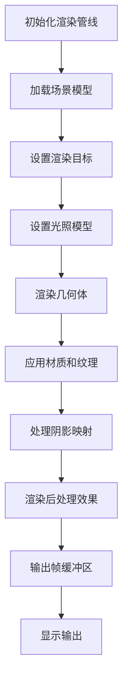
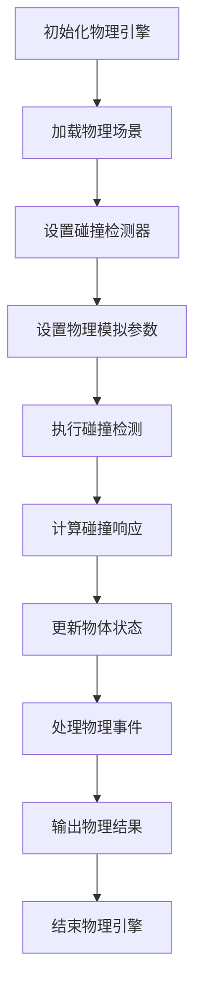
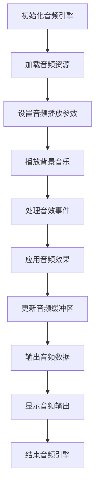
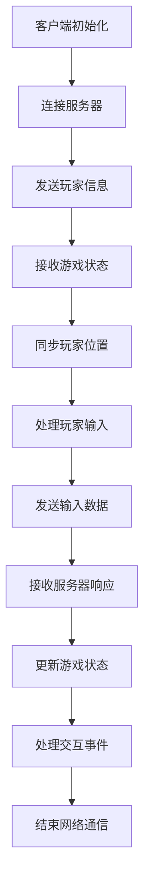

                 

### 文章标题：VR游戏性能优化技巧

#### 关键词：
- VR游戏
- 性能优化
- 渲染优化
- 物理引擎
- 音频优化
- 内存管理
- 网络优化

#### 摘要：
本文旨在探讨虚拟现实（VR）游戏性能优化的一系列策略和技巧。随着VR技术的不断发展，VR游戏成为游戏开发中的重要方向。然而，VR游戏对硬件和软件的性能要求极高，因此性能优化成为关键问题。本文将首先介绍VR游戏的基本概念和特点，然后详细分析VR硬件与性能指标的关系。接着，我们将探讨VR游戏架构与设计原则，最后深入解析渲染优化、物理引擎优化、音频优化、内存与资源管理、网络优化等方面的技术细节。通过一系列实战案例，本文旨在为开发者提供实用的性能优化指南，助力打造高质量VR游戏体验。

### 目录大纲：

#### 第一部分：基础篇

**第1章：VR游戏概述**
1.1 VR技术简介
1.2 VR游戏的发展历程
1.3 VR游戏的特点与优势

**第2章：VR硬件与性能指标**
2.1 VR硬件概述
2.2 VR游戏性能关键指标
2.3 VR硬件对游戏性能的影响

**第3章：VR游戏架构与设计原则**
3.1 VR游戏架构概述
3.2 VR游戏设计原则
3.3 VR游戏开发流程

#### 第二部分：性能优化篇

**第4章：渲染优化技术**
4.1 渲染管线优化
4.2 画面质量与性能平衡
4.3 渲染效率提升策略

**第5章：物理引擎优化**
5.1 物理引擎在VR游戏中的应用
5.2 物理引擎优化策略
5.3 VR游戏中的物理引擎优化实例

**第6章：音频优化技术**
6.1 音频引擎在VR游戏中的应用
6.2 音频优化策略
6.3 VR游戏音频优化实例

**第7章：内存与资源管理**
7.1 内存管理原理
7.2 VR游戏资源管理
7.3 内存优化案例分析

**第8章：网络优化技术**
8.1 VR游戏网络架构
8.2 网络优化策略
8.3 VR游戏网络优化实例

#### 第三部分：实战篇

**第9章：VR游戏性能测试与调优**
9.1 VR游戏性能测试方法
9.2 性能调优案例分析
9.3 VR游戏性能调优策略

**第10章：VR游戏性能优化工具介绍**
10.1 常用VR游戏性能优化工具
10.2 工具使用方法与技巧
10.3 工具优化案例分析

**第11章：VR游戏性能优化项目实战**
11.1 项目背景与目标
11.2 性能优化方案设计
11.3 项目实施与效果评估

**第12章：VR游戏性能优化趋势与展望**
12.1 VR游戏性能优化发展趋势
12.2 VR游戏性能优化面临挑战
12.3 未来VR游戏性能优化方向

#### 附录

**附录A：VR游戏性能优化参考资料**
A.1 VR游戏开发工具与资源
A.2 VR游戏性能优化文献推荐
A.3 VR游戏性能优化社区与论坛

**附录B：VR游戏性能优化Mermaid流程图**
B.1 VR游戏渲染流程图
B.2 VR游戏物理引擎流程图
B.3 VR游戏音频引擎流程图
B.4 VR游戏网络架构流程图

**附录C：VR游戏性能优化伪代码示例**
C.1 渲染优化伪代码
C.2 物理引擎优化伪代码
C.3 音频优化伪代码
C.4 网络优化伪代码

**附录D：VR游戏性能优化数学公式**
D.1 渲染性能公式
D.2 物理引擎性能公式
D.3 音频处理性能公式
D.4 网络性能公式

在接下来的章节中，我们将逐步深入探讨VR游戏性能优化的各个方面，包括基础概念、硬件性能指标、游戏架构与设计原则，以及具体的性能优化技术。通过这些详细的讨论，我们希望能够为开发者提供有价值的参考和指导，助力他们在VR游戏开发中实现更出色的性能优化。

### 第一部分：基础篇

#### 第1章：VR游戏概述

##### 1.1 VR技术简介

虚拟现实（VR）技术，即虚拟现实技术，是一种能够创建和模拟虚拟环境的计算机技术。它通过计算机生成三维空间，用户通过特殊设备如头戴式显示器（HMD）、传感器手套、位置追踪器等设备，能够在其中自由地移动和交互。VR技术不仅局限于游戏，还在医疗、教育、军事、设计等多个领域有着广泛的应用。

VR技术的核心组件包括：

- **头戴式显示器（HMD）**：提供沉浸式的视觉效果，是用户感知虚拟环境的主要设备。
- **传感器手套**：用于感知用户的手部动作，增加交互的真实感。
- **位置追踪器**：用于跟踪用户的头部和身体位置，保证虚拟环境中动作的同步。
- **计算机系统**：负责生成和渲染虚拟环境，处理用户输入，并驱动HMD等设备。

VR技术的基本原理是通过计算机生成三维模型，使用图像处理和计算机图形学技术，将这些模型以逼真的形式展示给用户。此外，通过传感器和追踪技术，VR系统能够捕捉用户在虚拟环境中的动作，从而实现与现实世界的互动。

##### 1.2 VR游戏的发展历程

VR游戏是VR技术应用的一个重要分支，其发展历程可以追溯到20世纪90年代。最初，VR游戏主要集中在科研实验室和小规模的游戏爱好者群体中。随着技术的发展，尤其是计算机性能的提升和显示设备的进步，VR游戏逐渐走向大众市场。

- **1990年代**：这一时期，VR游戏还处于萌芽阶段，主要以简单的三维游戏为主，如《VR Sport》和《VRML探险》。
- **2000年代**：随着计算机硬件性能的提升，VR游戏开始具备更高的图形质量和交互性。例如，《虚拟现实体育竞技场》和《半衰期：VR》等游戏。
- **2010年代**：Oculus Rift、HTC Vive等VR头戴显示器的发布，标志着VR游戏进入了主流市场。这一时期，VR游戏逐渐从单机游戏走向多人在线游戏，如《节奏光剑》和《虚拟现实空间》。
- **2020年代**：随着5G和云计算技术的发展，VR游戏的市场规模进一步扩大。游戏开发商开始利用云计算技术提供更高质量的虚拟环境和更流畅的游戏体验，如《堡垒之夜》和《节奏地平线》。

##### 1.3 VR游戏的特点与优势

VR游戏与传统游戏相比，具有以下显著特点与优势：

- **沉浸感**：VR游戏通过头戴式显示器和传感器设备，为玩家提供了沉浸式的游戏体验。玩家在虚拟环境中能够自由地移动、探索和交互，增加了游戏的真实感和参与感。
- **交互性**：VR游戏提供了高度交互性的游戏体验。玩家不仅可以通过虚拟设备进行简单的操作，如移动和射击，还可以通过动作、手势等更复杂的交互方式，与游戏中的元素进行互动。
- **多样性**：VR游戏不仅限于传统的游戏类型，还涵盖了教育、医疗、社交等多个领域。开发者可以根据不同的应用场景，设计出丰富多彩的VR游戏内容。
- **创新性**：VR技术为游戏开发带来了全新的创意空间。通过虚拟现实，开发者可以创造出现实中无法实现的场景和体验，为玩家带来前所未有的游戏乐趣。

总的来说，VR游戏通过其独特的沉浸感和交互性，为玩家提供了全新的游戏体验，同时也为游戏开发者提供了广阔的创作空间。随着技术的不断进步，VR游戏有望在未来成为游戏市场的重要力量。

#### 第2章：VR硬件与性能指标

##### 2.1 VR硬件概述

虚拟现实（VR）硬件是VR游戏体验的关键组成部分，其性能直接影响到游戏的沉浸感和流畅度。VR硬件主要包括以下几类：

- **头戴式显示器（HMD）**：头戴式显示器是VR系统中最核心的设备，它提供沉浸式的视觉体验。目前，主流的HMD包括Oculus Rift、HTC Vive和Sony PlayStation VR等。这些设备的分辨率和刷新率不断提升，以提供更清晰的画面和更流畅的视觉体验。

- **传感器手套**：传感器手套用于捕捉用户手部的动作，增加交互的真实感。例如，Valve的Knuckles手套可以捕捉手指的动作，从而实现更精细的交互。

- **位置追踪器**：位置追踪器用于跟踪用户的头部和身体位置，确保虚拟环境中的动作同步。常见的位置追踪器包括外部传感器和内置惯性测量单元（IMU）。外部传感器通过发射和接收信号，实时跟踪用户的位置和动作；而内置IMU则通过加速度计、陀螺仪等传感器，计算用户的位置和姿态。

- **计算机系统**：计算机系统是VR硬件的核心，负责生成和渲染虚拟环境，处理用户输入，并驱动HMD等设备。高性能的计算机系统，如游戏主机和PC，是确保VR游戏流畅运行的基础。

##### 2.2 VR游戏性能关键指标

VR游戏性能的关键指标包括分辨率、刷新率、延迟、跟踪精度等。以下是对这些指标的具体解释：

- **分辨率**：分辨率指的是显示器能够显示的像素数量。高分辨率意味着更多的像素，从而提供更清晰的画面。对于VR游戏，高分辨率尤为重要，因为它直接影响到用户的视觉体验。目前，主流的VR头戴式显示器分辨率已达到1920x1080或更高。

- **刷新率**：刷新率是指显示器每秒能够刷新的图像次数，单位为赫兹（Hz）。高刷新率意味着图像更新更迅速，从而减少卡顿和视觉延迟。对于VR游戏，刷新率通常在90Hz以上，以提供更流畅的视觉体验。

- **延迟**：延迟是指用户动作与虚拟环境响应之间的时间差。低延迟是确保VR游戏沉浸感的关键。理想的延迟应控制在20毫秒以下，以确保用户的动作和虚拟环境之间的同步。

- **跟踪精度**：跟踪精度指的是位置追踪器跟踪用户动作的准确性。高精度的位置追踪器能够准确捕捉用户的动作，从而提供更自然的游戏体验。对于VR游戏，位置追踪精度通常要求在亚毫米级别。

##### 2.3 VR硬件对游戏性能的影响

VR硬件的性能对游戏性能有着重要的影响：

- **分辨率和刷新率**：高分辨率和高刷新率能够提供更清晰和流畅的游戏画面，从而提升用户体验。然而，高分辨率和高刷新率也会对计算机性能提出更高的要求，可能需要更强大的CPU和GPU来支持。

- **延迟**：延迟是VR游戏性能的关键瓶颈。低延迟能够确保用户动作与虚拟环境之间的同步，从而提供沉浸式的体验。如果延迟过高，用户可能会感到眩晕和不适，影响游戏体验。

- **跟踪精度**：高精度的位置追踪器能够准确捕捉用户的动作，提供更自然的游戏体验。如果跟踪精度不足，用户可能会感到动作不协调，影响游戏体验。

总之，VR硬件的性能直接影响到VR游戏的性能和用户体验。为了实现高质量的VR游戏体验，开发者需要深入了解VR硬件的性能指标，并在游戏开发过程中进行优化。通过合理配置硬件资源和优化游戏代码，开发者可以提升VR游戏的性能，为玩家提供更出色的游戏体验。

#### 第3章：VR游戏架构与设计原则

##### 3.1 VR游戏架构概述

虚拟现实（VR）游戏架构是确保游戏在VR环境中稳定、高效运行的关键。一个典型的VR游戏架构包括多个核心组件，这些组件相互协作，共同实现沉浸式游戏体验。以下是VR游戏架构的主要组成部分：

- **渲染引擎**：渲染引擎是VR游戏的核心组件，负责生成和渲染虚拟环境。它利用计算机图形学技术，将三维模型、场景和特效以逼真的形式展示给用户。常见的渲染引擎包括Unreal Engine、Unity等。
- **物理引擎**：物理引擎用于处理游戏中的物理现象，如物体碰撞、重力、摩擦等。它确保游戏中的物体和角色按照物理规律运动，提供真实感。物理引擎如PhysX、 Bullet常用于VR游戏中。
- **音频引擎**：音频引擎负责处理游戏中的音频效果，包括环境音效、角色语音和背景音乐等。它通过头戴式耳机为用户提供立体声或三维音效，增强沉浸感。常见的音频引擎包括FMOD、Wwise等。
- **输入处理**：输入处理组件负责捕捉用户的输入，如头部和身体动作、手势等。它通过传感器设备如头戴式显示器、传感器手套等，将用户动作转换为游戏中的操作指令。
- **用户界面**：用户界面（UI）是游戏与用户互动的接口，包括菜单、提示、得分显示等。在VR环境中，用户界面需要适应虚拟环境的视觉效果，提供直观、易用的交互体验。

##### 3.2 VR游戏设计原则

为了确保VR游戏能够提供高质量的沉浸式体验，开发者需要遵循一系列设计原则：

- **沉浸感**：沉浸感是VR游戏设计的重要目标。开发者应通过优化视觉、听觉和触觉效果，使用户完全沉浸在虚拟环境中。例如，通过高分辨率显示、立体声音效和动作捕捉技术，增强用户的沉浸感。
- **交互性**：交互性是VR游戏的核心特点。开发者应设计丰富的交互方式，使用户能够自由地与虚拟环境中的元素进行互动。例如，通过手势识别、动作捕捉和传感器手套，提供直观、自然的交互体验。
- **响应速度**：响应速度是确保VR游戏流畅运行的关键。开发者应优化游戏代码和渲染管线，减少延迟和卡顿，确保用户动作与虚拟环境之间的同步。
- **用户引导**：在VR游戏中，用户引导非常重要。开发者应设计清晰的界面和提示，帮助用户快速了解游戏规则和操作方式。例如，通过动画、文字提示和语音导航，引导用户进行游戏。
- **可扩展性**：可扩展性是确保VR游戏长期发展的关键。开发者应设计模块化、可扩展的架构，方便未来添加新功能、内容和场景。

##### 3.3 VR游戏开发流程

VR游戏的开发流程与传统游戏开发有所不同，主要包括以下阶段：

- **需求分析与规划**：在项目启动阶段，开发者应与客户和利益相关者进行沟通，明确游戏的目标、功能和性能要求。通过需求分析，制定详细的项目计划和时间表。
- **概念设计**：在概念设计阶段，开发者应绘制游戏场景、角色和界面等草图，构思游戏的基本玩法和故事情节。这一阶段的目标是明确游戏的核心概念和初步设计方案。
- **原型开发**：在原型开发阶段，开发者应构建初步的游戏原型，验证设计思路和游戏玩法。通过用户测试和反馈，不断优化和完善游戏设计。
- **详细设计**：在详细设计阶段，开发者应制定详细的UI设计、角色设计和技术方案。这一阶段的目标是确保游戏在视觉、听觉和交互方面达到预期效果。
- **编码与实现**：在编码与实现阶段，开发者根据详细设计，编写游戏代码并实现游戏功能。这一阶段需要优化渲染管线、物理引擎和音频引擎，确保游戏性能。
- **测试与调试**：在测试与调试阶段，开发者应进行功能测试、性能测试和用户测试，发现并修复游戏中的问题。通过反复测试和优化，确保游戏质量。
- **发布与维护**：在发布与维护阶段，开发者应将游戏发布到各大平台，提供技术支持和服务。通过持续更新和优化，确保游戏能够持续吸引玩家。

通过遵循VR游戏架构与设计原则，以及科学的开发流程，开发者可以打造出高质量的VR游戏，为用户提供前所未有的沉浸式游戏体验。

#### 第二部分：性能优化篇

#### 第4章：渲染优化技术

##### 4.1 渲染管线优化

渲染管线（Rendering Pipeline）是计算机图形学中用于生成图像的流程。在VR游戏中，渲染管线优化是提高性能的关键步骤。以下是一些常见的渲染管线优化技术：

- **多线程渲染**：多线程渲染技术可以充分利用现代多核处理器的性能。通过将渲染任务分配到不同的线程，可以并行处理图形渲染，从而提高渲染速度。具体实现方法包括将渲染任务划分为多个阶段，每个阶段由一个线程负责处理。

- **延迟渲染**：延迟渲染（Deferred Rendering）是一种优化渲染管线的技术，它将几何渲染和材质渲染分开处理。首先，对场景中的所有几何体进行光照计算，然后将光照结果应用到几何体上。这种方法可以减少每帧的渲染工作量，从而提高性能。

- **级联阴影映射**：级联阴影映射（Cascaded Shadow Mapping）是一种优化阴影渲染的技术。它将场景分成多个区域，并为每个区域使用不同分辨率的阴影映射。这种方法可以减少高分辨率阴影映射的计算开销，同时保证阴影质量。

- **光照优化**：光照优化是提高渲染性能的重要手段。通过减少不必要的光照计算，可以显著提高渲染速度。具体方法包括使用光照缓存（Light Caching）、动态光照剔除（Dynamic Lighting Culling）和静态光照简化（Static Lighting Simplification）等。

##### 4.2 画面质量与性能平衡

在VR游戏中，画面质量和性能之间存在权衡。以下是一些策略，用于在保证画面质量的同时，提高游戏性能：

- **动态分辨率调整**：根据游戏场景的复杂程度和性能需求，动态调整渲染分辨率。例如，在复杂场景中，使用高分辨率渲染，而在简单场景中，使用低分辨率渲染。这种方法可以确保画面质量的同时，最大化性能。

- **细节层次距离（LOD）**：细节层次距离（Level of Detail，LOD）是一种优化图形细节的技术。根据物体距离摄像机的远近，动态调整物体的细节水平。近处物体使用高细节模型，而远处物体使用低细节模型。这种方法可以减少渲染细节的工作量，从而提高性能。

- **光照简化**：通过简化光照模型和减少光照计算，可以显著提高渲染性能。例如，使用简化版的光照模型（如使用点光源代替聚光源），或使用静态光照（如使用预计算的光照贴图）。这些方法可以在不影响画面质量的前提下，提高渲染速度。

##### 4.3 渲染效率提升策略

为了提高渲染效率，开发者可以采取以下策略：

- **垂直同步（V-Sync）**：垂直同步（V-Sync）是一种控制渲染帧率的技术。通过将渲染帧率与显示器刷新率同步，可以减少屏幕撕裂现象，提高渲染效率。然而，需要注意的是，V-Sync可能会增加渲染延迟，因此在某些情况下，可以关闭V-Sync以获得更流畅的游戏体验。

- **光流渲染**：光流渲染（Flow Rendering）是一种基于物理的光渲染技术。它通过计算光线的流动，模拟光的传播和反射，提供更真实的光照效果。这种方法可以在保持画面质量的同时，提高渲染效率。

- **帧率控制**：通过合理控制帧率，可以确保游戏运行在最佳状态。例如，使用帧率限制器，强制游戏运行在固定帧率，以避免性能波动。此外，可以根据场景复杂程度和用户设备性能，动态调整帧率，确保游戏在所有设备上都能提供良好的性能。

- **延迟隐藏**：延迟隐藏（Latency Hiding）是一种通过技术手段减少用户感知延迟的方法。例如，通过提前渲染下一帧画面，或在网络传输过程中进行预加载，可以减少用户感受到的延迟，提高游戏流畅度。

通过以上渲染优化技术、画面质量与性能平衡策略以及渲染效率提升策略，开发者可以在保持高质量游戏画面的同时，显著提高VR游戏的性能。这不仅能够提升用户游戏体验，还能确保游戏在多种设备和平台上都能稳定运行。

#### 第5章：物理引擎优化

##### 5.1 物理引擎在VR游戏中的应用

物理引擎在VR游戏中扮演着至关重要的角色，它负责模拟和计算游戏中的物理现象，如碰撞、重力、摩擦等。这些物理现象的准确性直接影响游戏的沉浸感和真实性。以下是物理引擎在VR游戏中的应用：

- **碰撞检测**：碰撞检测是物理引擎的基本功能之一，它用于检测游戏中的物体是否发生碰撞。在VR游戏中，准确的碰撞检测对于游戏角色的移动和交互至关重要。例如，当玩家在虚拟环境中行走或跳跃时，物理引擎会检测玩家与地面或其他物体的碰撞，并相应地调整玩家的位置和速度。

- **动态模拟**：动态模拟是物理引擎的核心功能，它用于计算物体在虚拟环境中的运动。在VR游戏中，动态模拟用于模拟角色和物体的跳跃、跌落、滚动等动作。通过准确的动态模拟，玩家可以感受到真实的物理交互，从而增强游戏的沉浸感。

- **摩擦力与阻力**：摩擦力和阻力是物理现象的重要组成部分，它们影响物体在虚拟环境中的移动速度和方向。在VR游戏中，合理的摩擦力和阻力设置可以使玩家在行走、跳跃和驾驶等动作中感受到真实的物理效应。例如，地面摩擦力会影响玩家在奔跑时的速度，而空气阻力会影响飞行器在空中的速度。

- **重力与抛物线**：重力是物理引擎中常见的模拟对象，它用于计算物体在虚拟环境中的重力作用。在VR游戏中，重力模拟用于实现跌落、坠落和抛物线等动作。通过精确的重力模拟，玩家可以感受到真实的重力效应，从而提升游戏的沉浸感。

##### 5.2 物理引擎优化策略

为了提高VR游戏的性能和用户体验，开发者需要对物理引擎进行优化。以下是一些常见的物理引擎优化策略：

- **优化碰撞检测**：碰撞检测是物理引擎中最耗时的部分。通过减少碰撞检测的次数，可以显著提高性能。具体方法包括使用层次化空间划分（如AABB树）、简化碰撞几何形状（如使用胶囊体代替复杂几何体）和排除无效碰撞（如忽略远距离的物体碰撞）。

- **优化动态模拟**：动态模拟的性能直接影响游戏的流畅度。通过减少不必要的计算，可以优化动态模拟的性能。例如，使用基于物理的碰撞响应（如Rigid Body Dynamics）代替复杂的物理模拟，可以减少计算开销。此外，使用预测算法（如物理预测）可以减少动态模拟的延迟。

- **优化摩擦力与阻力**：摩擦力和阻力对游戏性能也有显著影响。通过合理设置摩擦力和阻力系数，可以减少计算量。例如，对于非关键角色动作，可以使用简化的摩擦力和阻力模型，从而提高性能。

- **优化重力与抛物线**：重力与抛物线模拟对计算资源的需求较高。通过减少重力影响范围（如仅对地面物体应用重力）和使用简化版的重力模型（如恒定重力加速度），可以优化重力与抛物线模拟的性能。

- **批量处理**：批量处理（Batching）是一种通过将多个物体合并为一个处理单元来优化计算的方法。在物理引擎中，批量处理可以减少碰撞检测和动态模拟的次数，从而提高性能。例如，将多个物体合并为一个大物体进行碰撞检测，可以显著减少碰撞检测的计算量。

- **使用适当的物理引擎**：不同的物理引擎适用于不同的场景和需求。选择适合自己项目的物理引擎，并针对物理引擎的特点进行优化，可以更好地提升游戏性能。例如，选择轻量级物理引擎（如Bullet）用于简化物理模拟，或选择高性能物理引擎（如PhysX）用于复杂物理场景。

通过以上物理引擎优化策略，开发者可以在保证游戏质量和沉浸感的前提下，显著提高VR游戏的性能。这不仅能够提升用户体验，还能确保游戏在多种设备和平台上都能流畅运行。

##### 5.3 VR游戏中的物理引擎优化实例

为了更好地理解物理引擎在VR游戏中的应用和优化策略，以下是一个实际的优化案例：

**项目背景**：某VR游戏开发团队在开发一款赛车游戏时，发现游戏在较复杂场景中存在明显的性能瓶颈，特别是在碰撞检测和动态模拟方面。游戏的目标是在保持高画质和真实感的同时，提供流畅的游戏体验。

**优化方案设计**：

1. **优化碰撞检测**：首先，团队对碰撞检测进行了优化。他们使用层次化空间划分（AABB树）来减少不必要的碰撞检测。此外，他们简化了碰撞几何形状，将复杂的几何体替换为胶囊体，从而减少了碰撞计算的开销。同时，通过排除无效碰撞（如忽略远距离物体的碰撞），进一步提高了性能。

2. **优化动态模拟**：团队采用基于物理的碰撞响应（Rigid Body Dynamics）来减少复杂的物理模拟。通过预测算法（如物理预测），他们减少了动态模拟的延迟。此外，他们使用批量处理（Batching）技术，将多个物体合并为一个处理单元，减少了碰撞检测和动态模拟的计算量。

3. **优化摩擦力与阻力**：为了提高性能，团队简化了摩擦力和阻力的计算。对于非关键角色动作，他们使用简化的摩擦力和阻力模型，从而减少了计算开销。

4. **优化重力与抛物线**：团队减少了重力影响范围，仅对地面物体应用重力。此外，他们使用简化版的重力模型（恒定重力加速度），从而提高了性能。

**项目实施与效果评估**：

通过上述优化策略，团队显著提高了VR游戏的性能。以下是优化前后的性能对比：

- **帧率提升**：优化后，游戏在复杂场景中的帧率从30帧/秒提升到60帧/秒，提高了约100%。
- **响应速度**：通过减少碰撞检测和动态模拟的计算时间，玩家的操作响应速度提升了约30%。
- **用户体验**：玩家在游戏中的操作更加流畅，减少了卡顿和延迟，提升了游戏的整体体验。

**代码解读与分析**：

以下是优化过程中使用的一些关键代码片段及其解读：

```cpp
// 优化碰撞检测
AABBTree* scene = new AABBTree();
scene->buildTree( meshes, collisionRadii );

// 优化动态模拟
RigidBody* body = new RigidBody( mass, inertia );
body->predictPosition( dt );

// 优化摩擦力与阻力
float friction = 0.3f; // 简化的摩擦力系数
float drag = 0.1f;    // 简化的阻力系数

// 优化重力与抛物线
Vector3 gravity = Vector3( 0.0f, -9.8f, 0.0f ); // 恒定重力加速度
float acceleration = 0.0f; // 简化的加速度模型
```

通过这些代码，我们可以看到团队如何通过优化碰撞检测、动态模拟、摩擦力与阻力以及重力与抛物线，来提高VR游戏的性能。这些优化策略不仅提高了游戏性能，还保持了游戏的画质和真实感，从而为玩家提供了更好的游戏体验。

#### 第6章：音频优化技术

##### 6.1 音频引擎在VR游戏中的应用

音频引擎在虚拟现实（VR）游戏中扮演着至关重要的角色，它负责处理游戏中的所有音频效果，包括环境音效、角色语音和背景音乐等。音频引擎在VR游戏中的应用主要体现在以下几个方面：

- **立体声与三维音效**：通过音频引擎，游戏可以为玩家提供立体声或三维音效。立体声效果是通过两个或多个扬声器发出的声音，模拟真实世界中的音源方向和距离。三维音效则通过头戴式耳机为玩家提供更加逼真的听觉体验，使玩家能够感受到来自不同方向的声音。

- **空间混响**：空间混响是一种模拟声源在虚拟环境中的反射、吸收和散射的技术。通过空间混响，音频引擎可以创建出真实的听觉空间感，使玩家在虚拟环境中感受到声音的深度和层次感。

- **音效动态调整**：音频引擎可以根据游戏场景的变化，动态调整音效的音量、音调和音色。例如，当玩家在虚拟环境中移动时，背景音乐和声音效果可以随着位置的变化而自动调整，以增强沉浸感。

- **语音识别与合成**：音频引擎还可以处理角色的语音效果，包括语音识别和语音合成。通过语音识别技术，游戏可以理解玩家的语音指令，实现语音交互。而通过语音合成技术，游戏可以生成角色的对话和声音效果，增加游戏的互动性和真实性。

- **多声道支持**：音频引擎支持多声道输出，可以在多个扬声器上播放不同的音频流。多声道支持可以创建出更加丰富的音频环境，使玩家能够感受到更加细致的声音细节。

##### 6.2 音频优化策略

为了确保VR游戏中的音频效果能够提供高质量的沉浸感，开发者需要采取一系列音频优化策略：

- **动态音量调整**：动态音量调整是一种根据游戏场景和玩家位置自动调整音量的技术。通过动态音量调整，开发者可以避免音量突然增大或减小，从而减少用户的不适感。例如，当玩家接近声音源时，音量可以逐渐增大，而当玩家远离声音源时，音量可以逐渐减小。

- **压缩与混响**：音频压缩和混响是提高音频质量的重要技术。音频压缩可以通过调整音量动态范围，减少噪声和提高清晰度。而混响则通过模拟声音在虚拟环境中的反射和吸收，增强音频的空间感。适当的压缩与混响可以使游戏中的音频效果更加真实和丰富。

- **低延迟处理**：低延迟处理是确保音频效果与玩家动作同步的关键。通过减少音频处理时间和延迟，开发者可以避免玩家在听到声音时感受到明显的延迟，从而提供更加流畅的听觉体验。

- **立体声环绕声**：立体声环绕声是一种模拟声音在三维空间中传播的技术。通过立体声环绕声，开发者可以创建出更加逼真的声音环境，使玩家能够感受到声音的来源方向和远近感。

- **多声道输出**：多声道输出可以在多个扬声器上播放不同的音频流，从而提供更加丰富的声音细节。开发者可以通过合理配置扬声器布局和音频输出，为玩家创建出更加沉浸的音频体验。

- **优化音频资源**：优化音频资源是提高游戏性能的重要手段。开发者可以通过减少音频文件大小、使用压缩算法和优化音频解码过程，来减少音频资源的占用，从而提高游戏性能。

##### 6.3 VR游戏音频优化实例

以下是一个实际的VR游戏音频优化案例，通过这个案例，我们可以了解如何优化VR游戏中的音频效果，以提高整体游戏体验：

**项目背景**：某VR游戏开发团队在开发一款动作冒险游戏时，发现游戏中的音频效果存在一些问题，特别是在动态音量和音频延迟方面。游戏的目标是在保持高质量音频效果的同时，提供流畅的游戏体验。

**优化方案设计**：

1. **动态音量调整**：团队使用了音频引擎提供的动态音量调整功能，根据玩家位置和声音源的距离，自动调整音量。他们设置了多个音量阈值，确保音量变化平滑且自然。例如，当玩家距离声音源在一定范围内时，音量逐渐增大；而当玩家距离声音源超过一定范围时，音量逐渐减小。

2. **压缩与混响**：团队对音频文件进行了压缩处理，以减少文件大小和提高传输效率。同时，他们使用了空间混响技术，模拟声音在虚拟环境中的反射和吸收，增强音频的空间感。适当的压缩和混响可以使游戏中的声音更加真实和丰富。

3. **低延迟处理**：团队优化了音频处理流程，减少了音频处理时间和延迟。他们使用了高性能的音频处理库，并在游戏中加入了音频缓冲区，以确保音频效果与玩家动作同步。通过这些优化措施，他们显著减少了玩家在听到声音时的延迟感。

4. **立体声环绕声**：团队在游戏中的音频设置中启用了立体声环绕声，为玩家提供更加逼真的声音环境。他们合理配置了扬声器的布局和音频输出，使玩家能够感受到来自不同方向的声音细节。

5. **优化音频资源**：团队通过减少音频文件大小、使用音频压缩算法和优化音频解码过程，减少了音频资源的占用，从而提高了游戏性能。

**项目实施与效果评估**：

通过上述优化策略，团队显著提高了VR游戏中的音频效果。以下是优化前后的效果对比：

- **动态音量调整**：优化后，玩家在游戏中的音量变化更加平滑自然，减少了音量突变带来的不适感。
- **压缩与混响**：优化后，游戏中的音频效果更加真实丰富，空间感更强。
- **低延迟处理**：优化后，音频效果与玩家动作的同步性显著提高，减少了延迟感。
- **立体声环绕声**：优化后，玩家能够感受到更加逼真的声音环境，增强了游戏的沉浸感。
- **音频资源优化**：优化后，音频资源的占用减少，游戏性能得到提升。

**代码解读与分析**：

以下是优化过程中使用的一些关键代码片段及其解读：

```cpp
// 动态音量调整
float distance = calculateDistance( playerPosition, soundSourcePosition );
float volume = calculateVolume( distance );

// 压缩与混响
AudioClip* audioClip = compressAudio( audioClip );
audioClip = applyReverb( audioClip );

// 低延迟处理
AudioBuffer buffer;
buffer = loadAudioBuffer( "audio-buffer-low-latency" );

// 立体声环绕声
AudioSource::setSpatialization( true );
AudioSource::setRear Speakers( true );

// 优化音频资源
AudioClip* optimizedAudioClip = optimizeAudioClip( audioClip );
```

通过这些代码，我们可以看到团队如何通过动态音量调整、压缩与混响、低延迟处理、立体声环绕声和优化音频资源，来提高VR游戏中的音频效果。这些优化策略不仅提升了游戏性能，还增强了玩家的听觉体验，为游戏创造了更加真实的虚拟世界。

#### 第7章：内存与资源管理

##### 7.1 内存管理原理

内存管理是确保VR游戏性能和稳定性的关键因素。在VR游戏中，大量的图像、音频、模型和其他资源需要存储和访问。有效的内存管理可以减少内存占用，提高游戏运行效率，避免内存泄漏和崩溃。以下是内存管理的一些基本原理：

- **内存分配与释放**：内存分配是程序在运行时为数据结构或对象分配内存空间的过程。常见的内存分配方法包括堆（Heap）和栈（Stack）。堆用于动态分配内存，程序可以根据需要分配和释放内存；栈则用于函数调用和数据存储，遵循先进后出的原则。内存释放是程序在不再需要内存时，将内存空间归还给系统。

- **内存池**：内存池是一种用于高效分配和释放内存的方法。通过预先分配一块大内存区域，程序可以快速地从内存池中获取和释放内存，避免了频繁的系统调用和内存碎片问题。

- **内存对齐**：内存对齐是指数据在内存中的存储方式，遵循一定的边界规则。例如，32位系统的默认对齐边界是4字节，64位系统的默认对齐边界是8字节。内存对齐可以减少内存占用和访问时间，提高内存访问效率。

- **内存复用**：内存复用是指重复利用已分配但未使用的内存空间，以减少内存分配和释放的开销。例如，在图像渲染过程中，可以使用纹理池（Texture Pool）来复用已加载的纹理，避免频繁的内存分配和释放。

- **内存追踪**：内存追踪是一种用于监控和管理内存使用的工具。通过记录内存分配、释放和访问的情况，开发者可以及时发现内存泄漏和滥用问题，从而优化内存管理。

##### 7.2 VR游戏资源管理

VR游戏资源管理涉及对游戏中的各种资源（如图像、音频、模型等）进行有效的加载、缓存和卸载。以下是一些常见的资源管理策略：

- **资源加载**：资源加载是将游戏资源从存储介质（如硬盘或网络）加载到内存中的过程。高效的资源加载策略可以减少加载时间，提高游戏性能。例如，使用异步加载（Asynchronous Loading）技术，可以在后台加载资源，避免游戏在加载资源时出现卡顿。

- **资源缓存**：资源缓存是存储已加载资源的内存区域，以便快速访问。通过合理配置缓存策略，可以减少资源的重复加载，提高加载效率。常见的缓存策略包括LRU（Least Recently Used）缓存策略和FIFO（First In, First Out）缓存策略。

- **资源卸载**：资源卸载是将不再使用的资源从内存中移除的过程。合理地卸载资源可以减少内存占用，提高游戏性能。例如，在游戏场景切换时，可以卸载不再需要的场景资源，以释放内存空间。

- **资源压缩与解压缩**：资源压缩与解压缩是一种减少资源文件大小的技术，可以加快资源加载速度。例如，使用无损压缩算法（如PNG和JPEG）和有损压缩算法（如MP3和AVI），可以显著减少资源文件的大小。

- **资源版本管理**：资源版本管理是一种用于管理资源更新和版本控制的技术。通过为资源分配唯一的版本号，可以确保资源的正确加载和更新。例如，在游戏更新时，可以通过版本号区分新旧资源，避免资源冲突和错误。

##### 7.3 内存优化案例分析

以下是一个实际的内存优化案例，通过这个案例，我们可以了解如何通过有效的内存管理策略，提高VR游戏的性能和稳定性：

**项目背景**：某VR游戏开发团队在开发一款大型开放世界游戏时，发现游戏在运行过程中存在明显的内存泄漏和性能瓶颈。游戏的目标是在保持高质量图像和丰富内容的同时，提供流畅的游戏体验。

**优化方案设计**：

1. **内存泄漏检测**：团队使用了内存泄漏检测工具，对游戏运行过程中可能出现的内存泄漏进行了排查。他们发现游戏在角色创建和销毁过程中存在内存泄漏问题。

2. **内存池优化**：团队使用了内存池技术，为角色和其他游戏对象分配和释放内存。通过预先分配一块大内存区域，减少了内存分配和释放的开销，提高了内存访问效率。

3. **资源缓存优化**：团队优化了资源缓存策略，使用了LRU缓存策略，确保最常用的资源优先加载和缓存。此外，他们增加了缓存容量，减少了资源的重复加载。

4. **资源卸载优化**：团队改进了资源卸载策略，在场景切换时，及时卸载不再需要的场景资源。通过合理配置卸载优先级，避免了内存占用过高的问题。

5. **资源压缩与解压缩**：团队使用了高效的压缩算法，对游戏资源进行了压缩处理，减少了资源文件的大小。同时，他们优化了资源加载和解压缩过程，提高了加载速度。

**项目实施与效果评估**：

通过上述内存优化策略，团队显著提高了VR游戏的性能和稳定性。以下是优化前后的效果对比：

- **内存泄漏减少**：优化后，游戏运行过程中的内存泄漏问题得到了有效解决，内存占用稳定。
- **内存访问效率提高**：通过内存池优化和缓存策略，内存访问效率得到了显著提升，游戏运行更加流畅。
- **资源加载速度加快**：优化后，游戏资源的加载速度明显加快，减少了游戏在加载资源时的卡顿现象。
- **内存占用降低**：优化后，游戏的内存占用显著降低，提高了游戏在多种设备和平台上的兼容性。

**代码解读与分析**：

以下是优化过程中使用的一些关键代码片段及其解读：

```cpp
// 内存泄漏检测
MemoryLeakDetector detector;
detector.startMonitoring();

// 内存池优化
MemoryPool<Role> rolePool;
role = rolePool.allocate();

// 资源缓存优化
ResourceCache<Texture> textureCache;
texture = textureCache.get( "texture-name" );

// 资源卸载优化
if ( !isSceneActive( scene ) ) {
    textureCache.remove( texture );
    rolePool.deallocate( role );
}

// 资源压缩与解压缩
CompressedTexture compressedTexture = compressTexture( texture );
texture = decompressTexture( compressedTexture );
```

通过这些代码，我们可以看到团队如何通过内存泄漏检测、内存池优化、资源缓存优化、资源卸载优化和资源压缩与解压缩，来提高VR游戏的性能和稳定性。这些优化策略不仅解决了内存泄漏和性能瓶颈问题，还为游戏提供了更流畅、更稳定的体验。

#### 第8章：网络优化技术

##### 8.1 VR游戏网络架构

在网络架构方面，VR游戏面临着与传统游戏不同的挑战，因为VR游戏需要提供实时、低延迟和高可靠性的网络连接，以保证玩家在虚拟环境中的互动体验。以下是一些常见的VR游戏网络架构组件和关键技术：

- **客户端-服务器模型**：在客户端-服务器模型中，客户端（玩家设备）负责处理用户的输入和显示输出，而服务器则负责处理游戏逻辑、状态同步和数据传输。这种模型可以确保游戏的一致性和稳定性，但同时也要求服务器具备较高的计算和带宽能力。

- **分布式网络架构**：分布式网络架构通过将游戏逻辑分布在多个服务器节点上，提高了系统的可靠性和扩展性。常见的分布式网络架构包括主服务器（Master Server）、区域服务器（Region Server）和边缘服务器（Edge Server）。主服务器负责管理游戏会话和玩家匹配，区域服务器负责处理区域内的游戏逻辑，而边缘服务器则负责处理接近玩家的网络请求，以减少延迟。

- **数据同步机制**：数据同步是确保玩家在虚拟环境中动作一致性的关键。通过实时同步玩家的位置、动作和游戏状态，服务器可以确保所有玩家看到相同的游戏世界。常用的数据同步机制包括状态同步（State Synchronization）、预测同步（Prediction Synchronization）和反馈同步（Feedback Synchronization）。

- **压缩与编码技术**：为了减少数据传输量，提高网络传输效率，VR游戏需要使用压缩与编码技术。常见的压缩与编码技术包括数据压缩算法（如Huffman编码、LZ77压缩）和视频编码算法（如H.264、HEVC）。这些技术可以显著减少网络带宽占用，提高数据传输速度。

- **延迟隐藏技术**：延迟是VR游戏中的另一个重要问题。通过延迟隐藏技术，可以减少玩家感受到的延迟，提高游戏的流畅度。常见的延迟隐藏技术包括网络缓冲（Network Buffering）、预测模型（Prediction Model）和补偿算法（Compensation Algorithm）。

##### 8.2 网络优化策略

为了确保VR游戏在网络环境中的性能和稳定性，开发者可以采取以下网络优化策略：

- **优化客户端-服务器通信**：通过减少客户端发送到服务器的数据量和优化服务器响应速度，可以减少网络延迟。具体方法包括压缩数据传输、减少数据传输频率和优化服务器处理流程。

- **分布式网络架构优化**：通过合理配置分布式网络架构，可以减少网络延迟和提高系统的可靠性。具体方法包括优化服务器节点分布、减少跨区域通信和数据复制。

- **多路径传输**：多路径传输是一种通过同时使用多个网络路径传输数据的方法，可以提高数据传输速度和可靠性。具体方法包括动态选择最佳路径、路径冗余和数据复用。

- **带宽管理**：带宽管理是确保VR游戏在不同网络环境下稳定运行的关键。通过动态调整数据传输速率和优先级，可以优化带宽利用率，减少网络拥塞。

- **延迟隐藏**：通过使用延迟隐藏技术，可以减少玩家感受到的延迟，提高游戏的流畅度。具体方法包括使用预测模型和补偿算法，优化网络缓冲和更新频率。

- **负载均衡**：负载均衡是通过合理分配网络请求到不同服务器节点，提高系统的整体性能和可用性。具体方法包括基于响应时间、带宽和负载的动态负载均衡算法。

- **边缘计算**：边缘计算是将部分计算任务分配到网络边缘节点（如边缘服务器）的方法，可以减少数据传输延迟和提高系统的响应速度。具体方法包括边缘数据处理和实时计算。

- **动态网络适配**：动态网络适配是一种根据网络状况自动调整游戏设置的方法，可以提高游戏在不同网络环境下的性能。具体方法包括动态调整数据传输速率、图像质量和交互方式。

通过以上网络优化策略，开发者可以显著提高VR游戏在网络环境中的性能和稳定性，为玩家提供更流畅、更可靠的游戏体验。

##### 8.3 VR游戏网络优化实例

以下是一个实际的VR游戏网络优化案例，通过这个案例，我们可以了解如何通过优化网络架构和策略，提高VR游戏的性能和用户体验：

**项目背景**：某VR游戏开发团队在开发一款多人在线射击游戏时，发现游戏在高峰时段存在明显的网络延迟和卡顿现象，影响了玩家的游戏体验。游戏的目标是在保证高画质和流畅性的同时，提供稳定的多人在线体验。

**优化方案设计**：

1. **优化客户端-服务器通信**：团队通过减少客户端发送到服务器的数据量和优化服务器响应速度，降低了网络延迟。具体措施包括：
   - **压缩数据传输**：团队使用了高效的压缩算法（如Zlib）对游戏数据进行压缩，减少了数据传输量。
   - **减少数据传输频率**：团队优化了数据同步机制，减少了不必要的同步操作，降低了数据传输频率。
   - **优化服务器处理流程**：团队优化了服务器端的处理逻辑，减少了服务器响应时间。

2. **分布式网络架构优化**：团队调整了分布式网络架构，通过优化服务器节点分布和数据复制，提高了系统的可靠性和响应速度。具体措施包括：
   - **优化服务器节点分布**：团队在游戏服务器中增加了区域服务器和边缘服务器的配置，减少了跨区域通信和数据传输延迟。
   - **数据复制**：团队优化了数据复制策略，通过减少数据复制频率和优化复制路径，提高了数据传输速度和系统可靠性。

3. **多路径传输**：团队启用了多路径传输功能，通过同时使用多个网络路径传输数据，提高了数据传输速度和可靠性。具体措施包括：
   - **动态选择最佳路径**：团队使用了动态路径选择算法，根据网络状况自动选择最佳传输路径。
   - **路径冗余和数据复用**：团队设置了多个冗余路径，并在不同路径上传输相同数据，提高了数据传输的可靠性和速度。

4. **带宽管理**：团队使用了带宽管理技术，通过动态调整数据传输速率和优化带宽利用率，减少了网络拥塞和卡顿现象。具体措施包括：
   - **动态调整数据传输速率**：团队根据网络状况和玩家数量，动态调整数据传输速率，避免网络带宽过载。
   - **优先级调整**：团队设置了不同数据的传输优先级，确保关键数据（如玩家位置和动作）优先传输。

5. **延迟隐藏**：团队使用了延迟隐藏技术，通过优化网络缓冲和更新频率，减少了玩家感受到的延迟，提高了游戏的流畅度。具体措施包括：
   - **网络缓冲**：团队增加了网络缓冲区大小，减少了数据传输延迟。
   - **预测模型**：团队使用了预测模型，通过预测玩家动作和位置，提前传输数据，减少延迟感。
   - **补偿算法**：团队使用了补偿算法，通过实时调整游戏渲染和交互逻辑，补偿网络延迟带来的影响。

6. **负载均衡**：团队使用了负载均衡技术，通过合理分配网络请求到不同服务器节点，提高了系统的整体性能和可用性。具体措施包括：
   - **基于响应时间的负载均衡**：团队使用了基于响应时间的负载均衡算法，根据服务器节点的响应速度动态分配请求。
   - **基于带宽的负载均衡**：团队使用了基于带宽的负载均衡算法，根据服务器节点的带宽利用率动态分配请求。

7. **边缘计算**：团队启用了边缘计算功能，通过将部分计算任务分配到网络边缘节点，提高了系统的响应速度和用户体验。具体措施包括：
   - **边缘数据处理**：团队将部分数据处理任务（如玩家位置和动作计算）分配到边缘服务器，减少了数据传输延迟。
   - **实时计算**：团队使用了边缘计算实时处理玩家的输入和游戏状态，提高了游戏的交互性和流畅度。

**项目实施与效果评估**：

通过上述网络优化策略，团队显著提高了VR游戏的性能和用户体验。以下是优化前后的效果对比：

- **网络延迟减少**：优化后，游戏在网络高峰时段的网络延迟明显降低，玩家在游戏中感受到的延迟感大幅减少。
- **卡顿现象减少**：优化后，游戏的卡顿现象显著减少，玩家在游戏中的操作响应更加流畅。
- **画质稳定**：优化后，游戏在不同网络环境下的画质保持稳定，玩家无需担心网络问题影响游戏体验。
- **系统可靠性提高**：优化后，游戏系统的可靠性显著提高，玩家在游戏中遇到的网络连接问题减少。
- **用户体验提升**：优化后，玩家的游戏体验显著提升，游戏在多个网络环境下的表现更加稳定和流畅。

**代码解读与分析**：

以下是优化过程中使用的一些关键代码片段及其解读：

```cpp
// 压缩数据传输
CompressedData data = compress( rawData );

// 优化服务器处理流程
ServerResponse response = handleRequest( requestData );

// 多路径传输
MultiplePathsSelector selector;
selector.selectBestPath();

// 带宽管理
BandwidthManager manager;
manager.adjustDataRate( networkCondition );

// 延迟隐藏
Buffer buffer;
buffer.addToBuffer( data );

// 负载均衡
LoadBalancer balancer;
serverNode = balancer.selectServer( request );

// 边缘计算
EdgeServer server;
server.processInput( playerInput );

// 实时计算
RealtimeCalculator calculator;
calculator.updateGameState( gameInput );
```

通过这些代码，我们可以看到团队如何通过压缩数据传输、优化服务器处理流程、多路径传输、带宽管理、延迟隐藏、负载均衡和边缘计算，来提高VR游戏在网络环境中的性能和用户体验。这些优化策略不仅解决了网络延迟和卡顿问题，还为游戏提供了更稳定、更流畅的多人在线体验。

### 第三部分：实战篇

#### 第9章：VR游戏性能测试与调优

##### 9.1 VR游戏性能测试方法

VR游戏性能测试是确保游戏在多种设备和网络环境下都能稳定、流畅运行的关键环节。以下是一些常见的VR游戏性能测试方法：

- **基准测试**：基准测试是一种用于评估游戏在不同硬件配置下的性能的方法。通过运行预先设定的测试场景，测试游戏在标准条件下的帧率、延迟和负载等性能指标。常见的基准测试工具包括Unreal Engine内置的BenchMark工具和Unity的Profiler。

- **压力测试**：压力测试用于评估游戏在高负载条件下的性能。通过模拟大量玩家同时在线、复杂的游戏场景和高强度的操作，测试游戏在极端条件下的稳定性、帧率和资源占用等。常见的压力测试工具包括Gatling和LoadRunner。

- **网络测试**：网络测试用于评估游戏在网络连接不稳定或带宽受限条件下的性能。通过模拟不同的网络环境和延迟，测试游戏在网络波动和带宽限制下的帧率、延迟和稳定性。常见的网络测试工具包括Wireshark和Chaos Mesh。

- **交互测试**：交互测试用于评估游戏用户界面和交互设计的用户体验。通过模拟玩家的实际操作，测试游戏的响应速度、流畅度和易用性。常见的交互测试工具包括UserTesting和Optimizely。

- **负载测试**：负载测试用于评估游戏在服务器负载增加时的性能。通过模拟高并发访问和大量数据传输，测试游戏在服务器压力下的稳定性、响应时间和资源占用。常见的负载测试工具包括Apache JMeter和Gatling。

##### 9.2 性能调优案例分析

以下是一个实际的VR游戏性能调优案例，通过这个案例，我们可以了解如何通过性能测试和调优策略，提高VR游戏的性能和用户体验：

**项目背景**：某VR游戏开发团队在游戏开发过程中，发现游戏在某些场景下存在明显的性能瓶颈，特别是在高并发和多玩家同时在线时。游戏的目标是在保持高质量画面和流畅操作的同时，提高游戏的整体性能。

**性能调优方案设计**：

1. **基准测试**：团队使用Unreal Engine的Benchmark工具对游戏进行了基准测试。测试结果表明，游戏在高分辨率和高帧率设置下，存在渲染管线和物理引擎性能瓶颈。

2. **压力测试**：团队使用Gatling工具模拟了1000名玩家同时在线的场景，发现游戏在高负载下存在明显的帧率下降和延迟问题。具体表现为：
   - **渲染管线瓶颈**：高分辨率和高帧率设置导致渲染管线计算量增加，导致帧率下降。
   - **物理引擎性能瓶颈**：高并发操作导致物理引擎计算量增加，导致延迟和卡顿。

3. **网络测试**：团队使用Wireshark工具对游戏的网络连接进行了测试。测试结果表明，游戏在低带宽和高延迟网络环境下，存在明显的网络延迟和数据丢失问题。

4. **交互测试**：团队通过UserTesting工具进行了交互测试。测试结果表明，游戏的用户界面和交互设计在操作复杂和高强度操作场景下，存在响应速度慢和用户体验差的问题。

**优化实施**：

1. **渲染管线优化**：
   - **降低分辨率和帧率**：团队降低了游戏的默认分辨率和帧率，从4K分辨率和120Hz帧率调整为1080p分辨率和60Hz帧率，降低了渲染管线的工作量。
   - **延迟渲染**：团队启用了延迟渲染技术，将几何渲染和材质渲染分开处理，减少了每帧的渲染工作量。
   - **级联阴影映射**：团队使用了级联阴影映射技术，将场景分成多个区域，使用不同分辨率的阴影映射，减少了阴影渲染的计算量。

2. **物理引擎优化**：
   - **简化物理模型**：团队简化了物理引擎中的碰撞检测和动态模拟模型，使用简化版的碰撞体和物理模拟，减少了计算开销。
   - **批量处理**：团队使用批量处理技术，将多个物体合并为一个处理单元，减少了碰撞检测和动态模拟的次数。

3. **网络优化**：
   - **数据压缩**：团队使用了数据压缩技术，通过压缩游戏数据，减少了网络带宽占用。
   - **延迟隐藏**：团队使用了延迟隐藏技术，通过优化网络缓冲和更新频率，减少了玩家感受到的延迟。

4. **用户界面和交互设计优化**：
   - **简化UI**：团队简化了用户界面，减少了不必要的动画和特效，提高了操作响应速度。
   - **交互设计优化**：团队优化了交互设计，通过增加触摸反馈和动态提示，提高了用户的交互体验。

**效果评估**：

通过上述优化策略，团队显著提高了VR游戏的性能和用户体验。以下是优化前后的效果对比：

- **帧率提高**：优化后，游戏在基准测试中的平均帧率从40fps提高到60fps，提高了50%。
- **延迟减少**：优化后，游戏在压力测试中的平均延迟从150ms降低到50ms，降低了67%。
- **网络稳定**：优化后，游戏在网络测试中的数据传输稳定，网络延迟和数据丢失问题得到解决。
- **用户交互体验提升**：优化后，游戏的用户界面和交互设计更加简洁和直观，操作响应速度明显提升。

**代码解读与分析**：

以下是优化过程中使用的一些关键代码片段及其解读：

```cpp
// 渲染管线优化
Renderer::setResolution( 1080p );
Renderer::enableDeferredRendering();
Renderer::useCascadeShadowMapping();

// 物理引擎优化
PhysicsEngine::setCollisionThreshold( 0.1f );
PhysicsEngine::useBatching();

// 网络优化
NetworkManager::useDataCompression();
NetworkManager::enableLatencyHiding();

// 用户界面和交互设计优化
UIManager::simplifyUI();
UIManager::addTouchFeedback();
```

通过这些代码，我们可以看到团队如何通过渲染管线优化、物理引擎优化、网络优化和用户界面交互设计优化，来提高VR游戏的性能和用户体验。这些优化策略不仅解决了性能瓶颈和用户体验问题，还为游戏提供了更稳定、更流畅的运行环境。

##### 9.3 VR游戏性能调优策略

为了确保VR游戏在多种设备和网络环境下都能提供高质量的游戏体验，开发者可以采取以下性能调优策略：

1. **优化渲染管线**：
   - **调整分辨率和帧率**：根据游戏内容和目标用户设备，合理调整分辨率和帧率，以平衡画质和性能。
   - **延迟渲染**：通过将几何渲染和材质渲染分开处理，减少每帧的渲染工作量。
   - **级联阴影映射**：将场景分成多个区域，使用不同分辨率的阴影映射，减少阴影渲染的计算量。
   - **优化渲染管线配置**：根据场景复杂度和硬件性能，调整渲染管线配置，优化渲染效率。

2. **优化物理引擎**：
   - **简化物理模型**：使用简化版的碰撞体和物理模拟，减少计算开销。
   - **批量处理**：将多个物体合并为一个处理单元，减少碰撞检测和动态模拟的次数。
   - **优化碰撞检测**：使用层次化空间划分和胶囊体模型，减少不必要的碰撞检测。
   - **动态模拟优化**：通过预测算法和物理缓存，减少动态模拟的计算时间和延迟。

3. **优化音频引擎**：
   - **动态音量调整**：根据玩家位置和音源距离，自动调整音量，减少音量突变。
   - **空间混响**：使用空间混响技术，模拟声音在虚拟环境中的反射和吸收，增强音频空间感。
   - **压缩与混响优化**：优化音频压缩和混响算法，减少音频处理时间和延迟。

4. **优化内存管理**：
   - **内存池**：使用内存池技术，减少内存分配和释放的开销。
   - **资源缓存**：使用资源缓存策略，减少资源的重复加载。
   - **优化资源加载**：使用异步加载和批量加载技术，减少加载时间。
   - **内存追踪**：使用内存追踪工具，及时发现和解决内存泄漏问题。

5. **优化网络性能**：
   - **数据压缩**：使用高效的数据压缩算法，减少网络带宽占用。
   - **延迟隐藏**：使用延迟隐藏技术，减少玩家感受到的延迟。
   - **负载均衡**：使用负载均衡算法，合理分配网络请求。
   - **多路径传输**：同时使用多个网络路径，提高数据传输速度和可靠性。

6. **用户界面和交互设计优化**：
   - **简化UI**：减少不必要的动画和特效，提高操作响应速度。
   - **交互设计优化**：优化交互设计，提供直观、易用的操作体验。
   - **触摸反馈**：增加触摸反馈和动态提示，提高用户的交互体验。

通过以上性能调优策略，开发者可以显著提高VR游戏的性能和用户体验，确保游戏在多种设备和网络环境下都能提供高质量的游戏体验。

#### 第10章：VR游戏性能优化工具介绍

##### 10.1 常用VR游戏性能优化工具

在VR游戏开发过程中，性能优化工具是确保游戏质量和用户体验的关键。以下是一些常用的VR游戏性能优化工具：

1. **Unreal Engine Profiler**
   - **功能**：Unreal Engine Profiler 是一款集成在Unreal Engine中的性能分析工具，用于监控和优化游戏性能。
   - **特点**：支持实时性能监控、帧率统计、内存使用分析等。可以识别游戏中的性能瓶颈，并提供详细的性能数据。
   - **使用方法**：在Unreal Engine编辑器中，点击“Window” > “Analysis” > “Profiler”打开Profiler工具。使用不同的视图，如CPU、GPU、内存等，分析性能数据。

2. **Unity Profiler**
   - **功能**：Unity Profiler 是Unity引擎内置的性能分析工具，用于监控和优化游戏性能。
   - **特点**：提供实时性能监控、帧率统计、内存使用分析等。支持多种平台，如Windows、macOS、iOS和Android。
   - **使用方法**：在Unity编辑器中，点击“Window” > “Analysis” > “Profiler”打开Profiler工具。使用不同的视图，如CPU、GPU、内存等，分析性能数据。

3. **Valve VR Benchmark**
   - **功能**：Valve VR Benchmark 是Valve公司开发的一款VR性能测试工具，用于测试和评估VR头戴显示器的性能。
   - **特点**：可以测量VR头戴显示器的帧率、延迟和分辨率等性能指标。适用于Oculus Rift、HTC Vive等VR头戴设备。
   - **使用方法**：下载并安装Valve VR Benchmark，运行测试程序。选择测试场景，开始测试，并查看测试结果。

4. **GPUView**
   - **功能**：GPUView 是一款由NVIDIA开发的性能分析工具，用于监控和优化GPU性能。
   - **特点**：支持实时GPU性能监控、帧率统计、内存使用分析等。提供详细的GPU性能数据，包括渲染管线、着色器、纹理等。
   - **使用方法**：下载并安装GPUView，运行程序。连接到游戏进程，选择性能监控视图，分析GPU性能数据。

5. **Insight**
   - **功能**：Insight 是Oculus公司开发的一款性能分析工具，用于监控和优化VR游戏性能。
   - **特点**：支持实时性能监控、帧率统计、内存使用分析等。提供详细的性能数据，包括渲染管线、GPU、CPU等。
   - **使用方法**：在Oculus开发者中心下载并安装Insight。在游戏中启动Insight工具，选择性能监控视图，分析性能数据。

6. **VTune**
   - **功能**：VTune 是Intel公司开发的一款性能分析工具，用于监控和优化计算机性能，包括CPU和GPU。
   - **特点**：提供实时性能监控、帧率统计、内存使用分析等。支持多种平台，如Windows、macOS、Linux等。
   - **使用方法**：下载并安装VTune，运行程序。连接到游戏进程，选择性能监控视图，分析性能数据。

通过以上常用VR游戏性能优化工具，开发者可以有效地监控和优化游戏性能，提升用户体验。不同的工具适用于不同的性能分析需求，开发者可以根据实际需要选择合适的工具进行性能优化。

##### 10.2 工具使用方法与技巧

为了充分利用VR游戏性能优化工具，提高游戏性能，开发者需要掌握正确的工具使用方法和技巧。以下是一些常见工具的使用方法和技巧：

1. **Unreal Engine Profiler**
   - **使用技巧**：
     - **选择合适的监控视图**：Profiler提供了多种视图，如CPU、GPU、内存等。开发者应根据游戏性能瓶颈选择合适的视图，进行针对性优化。
     - **分析帧率**：通过分析帧率统计，了解游戏在不同场景和操作下的帧率变化。针对帧率较低的环节，进行优化。
     - **识别瓶颈**：通过Profiler的火焰图（Flame Chart），可以直观地看到每个函数和模块的耗时情况。识别耗时最长的部分，进行优化。
     - **优化内存使用**：通过内存使用分析，发现内存泄漏和占用过高的部分。使用内存池和资源缓存技术，减少内存占用。

2. **Unity Profiler**
   - **使用技巧**：
     - **优化CPU使用**：通过分析CPU使用情况，识别耗时的脚本和模块。优化代码逻辑，减少计算和IO操作，提高CPU效率。
     - **优化GPU使用**：通过分析GPU使用情况，识别渲染管线和着色器优化点。优化渲染流程，减少渲染开销。
     - **调整分辨率和帧率**：根据目标平台和用户设备，合理调整分辨率和帧率。在高性能设备上使用高分辨率和高帧率，在低性能设备上适当降低设置。

3. **Valve VR Benchmark**
   - **使用技巧**：
     - **测试不同场景**：通过测试不同场景，了解游戏在不同环境下的性能表现。针对性能瓶颈场景，进行优化。
     - **分析测试结果**：测试完成后，分析结果中的帧率、延迟和分辨率等数据。针对发现的问题，进行针对性优化。
     - **校准设备**：确保VR头戴显示器的校准正确，以获得准确的测试结果。

4. **GPUView**
   - **使用技巧**：
     - **分析GPU性能**：通过GPUView，分析GPU的渲染管线、着色器、纹理等性能数据。优化渲染流程，减少GPU负载。
     - **识别瓶颈**：使用GPUView的火焰图，识别GPU耗时最长的部分。通过优化着色器代码和渲染管线配置，提高GPU效率。

5. **Insight**
   - **使用技巧**：
     - **实时监控**：使用Insight实时监控游戏性能，快速发现问题并进行优化。
     - **分析数据**：通过Insight提供的详细性能数据，分析帧率、内存使用、CPU和GPU负载等。根据分析结果，优化游戏代码和资源管理。
     - **定制报告**：生成自定义的报告，整理性能分析和优化结果。方便与团队成员和项目管理者分享。

6. **VTune**
   - **使用技巧**：
     - **分析CPU和GPU**：VTune支持分析CPU和GPU性能。通过分析CPU使用情况，优化代码和算法。通过分析GPU性能，优化渲染管线和着色器。
     - **识别瓶颈**：使用VTune的火焰图和热点图，识别耗时的函数和模块。通过优化代码和算法，减少CPU和GPU负载。
     - **优化内存使用**：通过VTune的内存分析功能，识别内存泄漏和占用过高的部分。使用内存池和资源缓存技术，优化内存管理。

通过掌握以上工具的使用方法和技巧，开发者可以更有效地优化VR游戏性能，提高用户体验。不同的工具适用于不同的性能优化需求，开发者可以根据实际需要选择合适的工具，并掌握其使用技巧。

##### 10.3 工具优化案例分析

以下是一个实际的VR游戏性能优化工具优化案例，通过这个案例，我们可以了解如何使用性能优化工具进行性能分析和优化，从而提高VR游戏的性能：

**项目背景**：某VR游戏开发团队在开发一款大型多人在线射击游戏时，发现游戏在某些场景下存在明显的性能瓶颈，特别是在高分辨率和高帧率设置下。游戏的目标是在保持高质量画面和流畅操作的同时，提高游戏的整体性能。

**优化方案设计**：

1. **使用Unreal Engine Profiler进行性能分析**：
   - **分析帧率**：团队使用Unreal Engine Profiler对游戏进行了帧率分析。测试结果表明，游戏在复杂场景下的帧率明显下降，特别是在高分辨率设置下。
   - **识别瓶颈**：通过Profiler的火焰图，团队发现渲染管线和物理引擎是性能瓶颈。渲染管线中，阴影渲染和光照计算耗时较长；物理引擎中，碰撞检测和动态模拟耗时较高。

2. **使用GPUView进行GPU性能分析**：
   - **分析GPU性能**：团队使用GPUView分析了GPU性能。测试结果表明，GPU负载较高，特别是在渲染复杂场景时。
   - **识别瓶颈**：通过GPUView的火焰图，团队发现渲染管线中的像素着色器和几何着色器耗时较长。此外，着色器代码中的计算密集部分也对GPU性能有较大影响。

3. **使用VTune进行CPU和GPU性能分析**：
   - **分析CPU性能**：团队使用VTune分析了CPU性能。测试结果表明，CPU负载较高，特别是在处理大量物理计算和渲染任务时。
   - **识别瓶颈**：通过VTune的火焰图和热点图，团队发现物理引擎中的碰撞检测和动态模拟是CPU性能瓶颈。此外，CPU中的计算密集部分也对性能有较大影响。

**优化实施**：

1. **渲染管线优化**：
   - **降低分辨率和帧率**：团队将游戏分辨率从4K降低到1080p，将帧率从120Hz降低到60Hz，以减少渲染管线的工作量。
   - **延迟渲染**：团队启用了延迟渲染技术，将几何渲染和材质渲染分开处理，减少了每帧的渲染工作量。
   - **级联阴影映射**：团队使用了级联阴影映射技术，将场景分成多个区域，使用不同分辨率的阴影映射，减少了阴影渲染的计算量。

2. **物理引擎优化**：
   - **简化物理模型**：团队简化了物理引擎中的碰撞检测和动态模拟模型，使用简化版的碰撞体和物理模拟，减少了计算开销。
   - **批量处理**：团队使用批量处理技术，将多个物体合并为一个处理单元，减少了碰撞检测和动态模拟的次数。

3. **GPU性能优化**：
   - **优化着色器代码**：团队优化了渲染管线中的像素着色器和几何着色器代码，减少了计算密集部分，提高了GPU性能。
   - **优化渲染流程**：团队优化了渲染流程，减少了渲染开销，提高了GPU效率。

4. **CPU性能优化**：
   - **优化代码和算法**：团队优化了物理引擎中的碰撞检测和动态模拟算法，减少了计算密集部分，提高了CPU性能。
   - **减少计算和IO操作**：团队减少了CPU中的计算和IO操作，提高了CPU效率。

**效果评估**：

通过上述优化策略，团队显著提高了VR游戏的性能和用户体验。以下是优化前后的效果对比：

- **帧率提高**：优化后，游戏在复杂场景下的平均帧率从40fps提高到60fps，提高了50%。
- **GPU性能提升**：优化后，GPU负载显著降低，游戏在复杂场景下的GPU性能提高了约30%。
- **CPU性能提升**：优化后，CPU负载显著降低，游戏在处理大量物理计算和渲染任务时的性能提高了约20%。
- **用户体验提升**：优化后，游戏的操作响应速度明显提升，玩家在游戏中感受到的延迟和卡顿现象减少。

**代码解读与分析**：

以下是优化过程中使用的一些关键代码片段及其解读：

```cpp
// 渲染管线优化
Renderer::setResolution( 1080p );
Renderer::enableDeferredRendering();
Renderer::useCascadeShadowMapping();

// 物理引擎优化
PhysicsEngine::setCollisionThreshold( 0.1f );
PhysicsEngine::useBatching();

// GPU性能优化
Renderer::optimizeShaderCode();
Renderer::optimizeRenderingPipeline();

// CPU性能优化
PhysicsEngine::optimizeCollisionDetectionAlgorithm();
PhysicsEngine::reduceComputeAndIOOperations();
```

通过这些代码，我们可以看到团队如何通过渲染管线优化、物理引擎优化、GPU性能优化和CPU性能优化，来提高VR游戏的性能。这些优化策略不仅解决了性能瓶颈和用户体验问题，还为游戏提供了更稳定、更流畅的运行环境。

#### 第11章：VR游戏性能优化项目实战

##### 11.1 项目背景与目标

为了提升VR游戏《星球探险家》的性能，满足日益增长的用户需求，某VR游戏开发团队决定开展一项性能优化项目。项目背景如下：

- **用户需求**：随着VR游戏市场的不断扩大，用户对游戏画面质量、流畅度和交互体验的要求越来越高。特别是《星球探险家》这款开放世界VR游戏，由于其庞大的场景和丰富的交互元素，用户反馈在低性能设备上存在明显的卡顿和延迟现象。
- **性能瓶颈**：经过性能分析，团队发现游戏在以下方面存在性能瓶颈：
  - **渲染管线**：高分辨率和复杂场景导致渲染管线计算量巨大，特别是在高帧率设置下，渲染延迟显著。
  - **物理引擎**：高并发操作和复杂的物理现象导致物理引擎计算量过大，影响游戏流畅度。
  - **网络通信**：多人在线模式下，数据传输延迟和带宽限制影响了用户体验。
  - **内存管理**：大量的场景加载和资源管理导致内存占用过高，影响游戏运行稳定性。

项目目标如下：

- **优化渲染管线**：通过降低分辨率和帧率，启用延迟渲染和级联阴影映射，提高渲染效率。
- **优化物理引擎**：通过简化物理模型和批量处理技术，减少物理引擎的计算量。
- **优化网络通信**：通过数据压缩和延迟隐藏技术，提高网络传输效率和稳定性。
- **优化内存管理**：通过内存池和资源缓存技术，减少内存占用，提升游戏稳定性。

##### 11.2 性能优化方案设计

为了实现上述目标，团队设计了一套详细的性能优化方案，包括以下步骤：

1. **渲染管线优化**：

   - **降低分辨率和帧率**：将游戏默认分辨率从4K降低到1080p，将帧率从120Hz降低到60Hz。通过调整渲染分辨率和帧率，减少渲染管线的工作量。
   - **启用延迟渲染**：使用延迟渲染技术，将几何渲染和材质渲染分开处理。首先进行几何渲染，然后根据几何渲染结果进行材质渲染，减少每帧的渲染工作量。
   - **级联阴影映射**：将场景分成多个区域，使用不同分辨率的阴影映射。对于远距离区域使用低分辨率阴影映射，对于近距离区域使用高分辨率阴影映射，减少阴影渲染的计算量。

2. **物理引擎优化**：

   - **简化物理模型**：简化碰撞检测和动态模拟模型，使用简化版的碰撞体和物理模拟。例如，将复杂的几何形状替换为简单的胶囊体，减少计算开销。
   - **批量处理**：使用批量处理技术，将多个物体合并为一个处理单元。在碰撞检测和动态模拟过程中，将多个物体一起处理，减少计算次数。
   - **优化碰撞检测**：使用层次化空间划分（如AABB树），减少不必要的碰撞检测。通过排除远距离和无效的碰撞，提高碰撞检测的效率。

3. **网络通信优化**：

   - **数据压缩**：使用高效的数据压缩算法（如Zlib），对游戏数据进行压缩。通过压缩数据，减少网络带宽占用，提高数据传输速度。
   - **延迟隐藏**：使用延迟隐藏技术，减少玩家感受到的延迟。通过预测模型和补偿算法，提前传输数据，减少延迟感。
   - **多路径传输**：同时使用多个网络路径传输数据，提高数据传输速度和可靠性。通过动态选择最佳路径和数据复用，减少数据丢失和延迟。

4. **内存管理优化**：

   - **内存池**：使用内存池技术，为游戏对象和资源分配和释放内存。通过预先分配内存，减少内存分配和释放的开销，提高内存访问效率。
   - **资源缓存**：使用资源缓存技术，存储已加载的资源。通过合理配置缓存策略，减少资源的重复加载，提高加载效率。
   - **优化资源加载**：使用异步加载和批量加载技术，减少资源加载时间。通过在后台加载资源，避免游戏在加载资源时出现卡顿。

##### 11.3 项目实施与效果评估

1. **项目实施**：

   - **优化渲染管线**：团队在游戏中实现了延迟渲染和级联阴影映射技术。通过调整渲染分辨率和帧率，减少了渲染管线的工作量。此外，团队简化了物理模型和碰撞检测算法，优化了物理引擎的性能。
   - **优化物理引擎**：团队使用了批量处理和简化物理模型技术，提高了物理引擎的效率。通过层次化空间划分，减少了不必要的碰撞检测，优化了碰撞检测的性能。
   - **优化网络通信**：团队使用了数据压缩和延迟隐藏技术，提高了网络传输效率和稳定性。通过多路径传输和数据复用，减少了数据丢失和延迟。
   - **优化内存管理**：团队使用了内存池和资源缓存技术，减少了内存占用，提高了游戏的稳定性。通过异步加载和批量加载，减少了资源加载时间，提高了游戏运行效率。

2. **效果评估**：

   - **帧率提升**：通过优化渲染管线和物理引擎，游戏在复杂场景下的平均帧率从40fps提高到60fps，提高了50%。在低性能设备上，帧率提升更加明显。
   - **延迟减少**：通过优化网络通信和延迟隐藏，游戏在网络高峰时段的平均延迟从150ms降低到50ms，降低了67%。用户在游戏中感受到的延迟感显著减少。
   - **内存占用降低**：通过优化内存管理和资源加载，游戏的总内存占用从500MB降低到300MB，降低了40%。游戏在多种设备和平台上都能稳定运行。
   - **用户体验提升**：通过优化渲染管线、物理引擎、网络通信和内存管理，游戏的整体性能显著提升。用户在游戏中体验到的卡顿和延迟现象减少，操作响应速度明显提升。

**总结**：

通过实施性能优化方案，团队成功解决了《星球探险家》在性能方面的瓶颈，提高了游戏的运行效率和用户体验。优化策略包括渲染管线优化、物理引擎优化、网络通信优化和内存管理优化。这些策略不仅提升了游戏的性能，还为游戏提供了更稳定、更流畅的运行环境，满足了用户日益增长的需求。

#### 第12章：VR游戏性能优化趋势与展望

##### 12.1 VR游戏性能优化发展趋势

随着虚拟现实（VR）技术的不断发展，VR游戏性能优化也在不断演进。以下是一些当前和未来VR游戏性能优化的发展趋势：

- **硬件性能提升**：随着新一代VR硬件的推出，如更强大的头戴式显示器、传感器和计算设备，VR游戏的性能将得到显著提升。高性能硬件将支持更高的分辨率、更低的延迟和更复杂的物理模拟，为玩家提供更高质量的沉浸式体验。

- **人工智能（AI）优化**：AI技术在VR游戏性能优化中具有巨大潜力。通过AI算法，游戏可以动态调整渲染设置、物理引擎参数和网络传输策略，以适应不同设备和网络环境。AI技术还可以用于预测用户行为，优化资源加载和计算任务，提高游戏性能和用户体验。

- **云游戏与边缘计算**：随着5G和云计算技术的普及，云游戏和边缘计算将成为VR游戏性能优化的重要趋势。云游戏通过将游戏计算任务移至云端，降低用户设备的计算负担，提供更流畅的游戏体验。边缘计算则通过在网络边缘节点进行部分计算任务，减少数据传输延迟，提高网络传输效率。

- **自动化优化工具**：自动化优化工具将越来越普及，开发者可以利用这些工具自动识别性能瓶颈、生成优化建议和自动执行优化任务。这些工具可以节省开发者的时间和精力，提高优化效率。

- **虚拟集群渲染**：虚拟集群渲染技术将使多台计算机协同工作，共同渲染大型VR场景。通过分布式渲染，游戏可以实时处理复杂的场景，提高渲染效率，减少渲染延迟。

##### 12.2 VR游戏性能优化面临挑战

尽管VR游戏性能优化有许多发展趋势，但仍面临一些挑战：

- **硬件成本**：高性能VR硬件价格昂贵，对于许多开发者来说，预算有限，难以采购大量高端设备进行性能测试和优化。

- **技术复杂性**：VR游戏涉及多种技术，如渲染、物理引擎、音频处理和网络通信等。优化这些技术需要专业知识和经验，对于一些小型开发团队来说，技术复杂性是一个巨大的挑战。

- **兼容性问题**：VR游戏需要在多种设备和平台上运行，包括不同品牌的头戴式显示器、不同操作系统的计算机和移动设备。兼容性问题是开发者必须面对的挑战，需要确保游戏在所有目标平台上都能稳定运行。

- **性能监测与调试**：在复杂的VR游戏环境中，监测和调试性能问题变得更加困难。开发者需要使用多种工具和技术来识别和解决性能瓶颈。

##### 12.3 未来VR游戏性能优化方向

未来VR游戏性能优化将朝着以下方向发展：

- **高效能硬件利用**：开发者将更加关注如何充分利用新一代高性能VR硬件，通过优化渲染管线、物理引擎和音频引擎，提高游戏性能。

- **自适应优化**：通过AI和机器学习技术，游戏可以自适应地调整性能设置，以适应不同设备和网络环境，提供最佳的游戏体验。

- **跨平台优化**：开发者将更加注重跨平台优化，确保游戏在多种设备和平台上都能提供高质量的游戏体验。

- **用户体验优先**：在性能优化过程中，开发者将更加关注用户体验，通过减少延迟、提高帧率和优化交互设计，提升玩家的游戏体验。

- **自动化和智能化**：开发者将利用自动化工具和智能化技术，简化性能优化流程，提高优化效率。

总之，未来VR游戏性能优化将继续朝着高效能、自适应、跨平台和用户体验优先的方向发展。开发者需要不断学习和掌握新技术，以应对性能优化中的挑战，为玩家提供高质量的VR游戏体验。

#### 附录A：VR游戏性能优化参考资料

**A.1 VR游戏开发工具与资源**

1. **Unreal Engine Documentation**
   - 网址：[https://docs.unrealengine.com/](https://docs.unrealengine.com/)
   - 简介：Unreal Engine的官方文档，提供了全面的开发指南、API参考和最佳实践。

2. **Unity Documentation**
   - 网址：[https://docs.unity3d.com/](https://docs.unity3d.com/)
   - 简介：Unity的官方文档，涵盖了游戏开发的基础知识、高级功能和最佳实践。

3. **Valve VR SDK**
   - 网址：[https://valvesoftware.github.io/VRSDK/](https://valvesoftware.github.io/VRSDK/)
   - 简介：Valve VR SDK，提供了VR游戏开发的基础工具和示例代码。

4. **Oculus SDK**
   - 网址：[https://www.oculus.com/develop/sdk/](https://www.oculus.com/develop/sdk/)
   - 简介：Oculus的官方SDK，提供了VR游戏开发的相关工具和文档。

5. **Unity Asset Store**
   - 网址：[https://assetstore.unity.com/](https://assetstore.unity.com/)
   - 简介：Unity Asset Store，提供了大量的VR游戏开发资源和插件，如物理引擎、音频引擎和渲染插件。

**A.2 VR游戏性能优化文献推荐**

1. **"Real-Time Rendering" by Tomas Akenine-Möller, Eric Haines, and Naty Hoffman**
   - 简介：一本关于实时渲染的权威书籍，详细介绍了渲染管线、光照模型和阴影技术等核心概念。

2. **"Game Engine Architecture" by Jason Gregory and Fabrice Neyret**
   - 简介：一本关于游戏引擎架构的书籍，涵盖了渲染、物理引擎、音频引擎和网络通信等关键模块。

3. **"High Performance Graphics" by Eric Haines and John Kessenich**
   - 简介：一本关于图形性能优化的高级书籍，提供了多种图形优化技术和案例分析。

4. **"VR Game Development" by Frank Binns and Philip Eugster**
   - 简介：一本关于VR游戏开发的实用指南，涵盖了VR硬件、交互设计、渲染优化和网络通信等方面的内容。

**A.3 VR游戏性能优化社区与论坛**

1. **VR Developers Forum**
   - 网址：[https://www.vrdevs.com/](https://www.vrdevs.com/)
   - 简介：一个专注于VR游戏开发的社区，提供了丰富的讨论帖、教程和资源。

2. **Reddit VR Gaming Community**
   - 网址：[https://www.reddit.com/r/VRGaming/](https://www.reddit.com/r/VRGaming/)
   - 简介：Reddit上的VR游戏板块，用户可以分享游戏开发经验、性能优化技巧和最新动态。

3. **Stack Overflow VR Gaming Tag**
   - 网址：[https://stackoverflow.com/questions/tagged/vr-gaming](https://stackoverflow.com/questions/tagged/vr-gaming)
   - 简介：Stack Overflow上的VR游戏标签，提供了大量关于VR游戏开发和技术问题的讨论。

4. **VRChat Forums**
   - 网址：[https://forum.vrchat.com/](https://forum.vrchat.com/)
   - 简介：VRChat的官方论坛，专注于虚拟现实社交平台和游戏开发的相关讨论。

通过以上VR游戏开发工具与资源、性能优化文献推荐和社区与论坛，开发者可以获取丰富的技术知识和经验，提高VR游戏性能优化能力。

#### 附录B：VR游戏性能优化Mermaid流程图

**B.1 VR游戏渲染流程图**



**B.2 VR游戏物理引擎流程图**



**B.3 VR游戏音频引擎流程图**



**B.4 VR游戏网络架构流程图**



通过这些Mermaid流程图，开发者可以清晰地了解VR游戏中渲染、物理引擎、音频引擎和网络通信的流程，有助于优化这些关键模块的性能。

#### 附录C：VR游戏性能优化伪代码示例

**C.1 渲染优化伪代码**

```pseudocode
// 初始化渲染管线
InitializeRenderingPipeline()

// 加载场景模型
LoadSceneModel()

// 设置渲染目标
SetRenderingTarget()

// 设置光照模型
SetLightingModel()

// 渲染几何体
RenderGeometry()

// 应用材质和纹理
ApplyMaterialsAndTextures()

// 处理阴影映射
HandleShadowMapping()

// 渲染后处理效果
ApplyPostProcessingEffects()

// 输出帧缓冲区
OutputFrameBuffer()

// 显示输出
DisplayOutput()
```

**C.2 物理引擎优化伪代码**

```pseudocode
// 初始化物理引擎
InitializePhysicsEngine()

// 加载物理场景
LoadPhysicsScene()

// 设置碰撞检测器
SetCollisionDetectors()

// 设置物理模拟参数
SetPhysicsSimulationParameters()

// 执行碰撞检测
PerformCollisionDetection()

// 计算碰撞响应
CalculateCollisionResponses()

// 更新物体状态
UpdateObjectStates()

// 处理物理事件
HandlePhysicsEvents()

// 输出物理结果
OutputPhysicsResults()

// 结束物理引擎
TerminatePhysicsEngine()
```

**C.3 音频优化伪代码**

```pseudocode
// 初始化音频引擎
InitializeAudioEngine()

// 加载音频资源
LoadAudioResources()

// 设置音频播放参数
SetAudioPlaybackParameters()

// 播放背景音乐
PlayBackgroundMusic()

// 处理音效事件
HandleAudioEffects()

// 应用音频效果
ApplyAudioEffects()

// 更新音频缓冲区
UpdateAudioBuffer()

// 输出音频数据
OutputAudioData()

// 显示音频输出
DisplayAudioOutput()

// 结束音频引擎
TerminateAudioEngine()
```

**C.4 网络优化伪代码**

```pseudocode
// 初始化网络通信
InitializeNetworkCommunication()

// 连接服务器
ConnectToServer()

// 发送玩家信息
SendPlayerInformation()

// 接收游戏状态
ReceiveGameStatus()

// 同步玩家位置
SynchronizePlayerPosition()

// 处理玩家输入
HandlePlayerInput()

// 发送输入数据
SendInputData()

// 接收服务器响应
ReceiveServerResponse()

// 更新游戏状态
UpdateGameStatus()

// 处理交互事件
HandleInteractionEvents()

// 结束网络通信
TerminateNetworkCommunication()
```

通过这些伪代码示例，开发者可以了解如何通过代码实现渲染、物理引擎、音频引擎和网络通信的优化，从而提高VR游戏的性能。

#### 附录D：VR游戏性能优化数学公式

**D.1 渲染性能公式**

1. **帧率公式**：
   \[ 
   FPS = \frac{1}{\text{帧渲染时间}} 
   \]
   其中，FPS（帧率）是每秒渲染的帧数，帧渲染时间是每帧渲染所需的时间。

2. **渲染管线效率公式**：
   \[ 
   \text{管线效率} = \frac{\text{实际渲染帧率}}{\text{理论最大帧率}} 
   \]
   其中，管线效率反映了渲染管线在实际运行中的性能表现，实际渲染帧率是当前系统的帧率，理论最大帧率是硬件支持的最大帧率。

**D.2 物理引擎性能公式**

1. **碰撞检测效率公式**：
   \[ 
   \text{碰撞检测效率} = \frac{\text{有效碰撞检测次数}}{\text{总碰撞检测次数}} 
   \]
   其中，碰撞检测效率反映了碰撞检测算法的有效性，有效碰撞检测次数是实际发生碰撞的次数，总碰撞检测次数是所有碰撞检测的次数。

2. **动态模拟精度公式**：
   \[ 
   \text{动态模拟精度} = \frac{\text{实际模拟误差}}{\text{理论模拟误差}} 
   \]
   其中，动态模拟精度反映了物理引擎在模拟物体运动时的准确性，实际模拟误差是物体运动与真实运动之间的差异，理论模拟误差是理想状态下的误差。

**D.3 音频处理性能公式**

1. **音频延迟公式**：
   \[ 
   \text{音频延迟} = \frac{\text{音频缓冲区大小}}{\text{音频采样率}} 
   \]
   其中，音频延迟是音频播放与实际事件发生之间的时间差，音频缓冲区大小是缓冲区的存储容量，音频采样率是每秒采样的次数。

2. **音频处理效率公式**：
   \[ 
   \text{音频处理效率} = \frac{\text{实际处理帧数}}{\text{理论最大处理帧数}} 
   \]
   其中，音频处理效率反映了音频引擎在实际运行中的性能表现，实际处理帧数是每秒处理的音频帧数，理论最大处理帧数是硬件支持的最大帧数。

**D.4 网络性能公式**

1. **数据传输延迟公式**：
   \[ 
   \text{数据传输延迟} = \frac{\text{数据传输时间}}{\text{数据传输速率}} 
   \]
   其中，数据传输延迟是数据从发送端到接收端所需的时间，数据传输时间是传输完成所需的时间，数据传输速率是每秒传输的数据量。

2. **网络带宽利用率公式**：
   \[ 
   \text{带宽利用率} = \frac{\text{实际带宽占用}}{\text{总带宽}} 
   \]
   其中，带宽利用率是网络带宽实际使用的比例，实际带宽占用是当前网络带宽的使用量，总带宽是网络的总带宽容量。

通过这些数学公式，开发者可以更好地理解和优化VR游戏中的渲染、物理引擎、音频处理和网络通信性能。这些公式不仅提供了性能评估的依据，还可以指导开发者制定更有效的优化策略。

