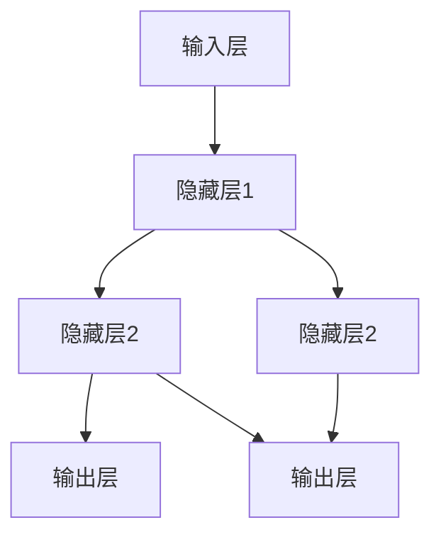

                 

### 文章标题：AI大数据计算原理与代码实例讲解——事件时间

#### 关键词：AI，大数据，计算原理，事件时间，代码实例

> 摘要：本文将深入探讨AI与大数据的结合，特别是在事件时间处理与窗口计算方面的原理与实际应用。文章将通过详细的理论讲解、代码实例以及实战案例，帮助读者理解AI在大数据计算中的关键角色，掌握事件时间处理的技术要点。

### 目录

#### 《AI大数据计算原理与代码实例讲解》目录

**第一部分：AI大数据计算原理**

## 第1章：AI与大数据概述

### 1.1 AI技术的基本概念与发展历程

- AI的定义与分类
- 人工智能的发展历程
- 大数据的概念与特点

### 1.2 大数据技术在AI中的应用

- 数据收集与预处理
- 数据存储与管理
- 数据挖掘与分析

## 第2章：AI大数据计算原理

### 2.1 神经网络与深度学习基础

- 神经网络的基本原理
- 深度学习的发展与挑战
- 反向传播算法

### 2.2 特征工程与选择

- 特征工程的重要性
- 特征选择的方法与工具
- 特征组合与融合

## 第3章：大数据计算平台与技术

### 3.1 分布式计算框架

- Hadoop生态圈
- Spark框架
- Flink框架

### 3.2 大数据存储技术

- 分布式文件系统
- NoSQL数据库
- 数据仓库

## 第4章：事件时间处理与窗口计算

### 4.1 事件时间处理基础

- 时间窗口的概念
- 滑动窗口与固定窗口
- 水位标记机制

### 4.2 窗口计算算法实现

- 窗口函数
- 聚合函数
- 时间窗口的处理策略

## 第5章：AI大数据计算应用案例

### 5.1 社交网络分析

- 用户行为分析
- 社交网络可视化

### 5.2 电商推荐系统

- 用户画像
- 商品推荐算法

## 第6章：AI大数据计算性能优化

### 6.1 数据存储优化

- 数据分片策略
- 数据压缩与加密

### 6.2 计算资源管理

- 调度算法
- 负载均衡

## 第7章：AI大数据计算安全与隐私保护

### 7.1 数据安全与隐私保护

- 加密技术
- 安全协议

### 7.2 法律法规与伦理道德

- 数据保护法规
- 人工智能伦理

**第二部分：AI大数据计算实战案例**

## 附录 A：AI大数据计算工具与资源

### A.1 主要AI大数据计算框架

- TensorFlow
- PyTorch
- Keras

### A.2 大数据计算平台

- Hadoop
- Spark
- Flink

## 附录 B：Mermaid流程图与伪代码示例

### B.1 神经网络结构图

mermaid
graph TD
    A[输入层] --> B[隐藏层1]
    B --> C[隐藏层2]
    C --> D[输出层]

### B.2 反向传播算法伪代码

```python
// 输入数据
x = [x1, x2, ..., xn]
y = [y1, y2, ..., yn]

// 前向传播计算
z = f(Wx + b)

// 反向传播计算
dz = - (y - z) * f'(z)
dW = x * dz
db = dz

// 更新权重和偏置
W = W - learning_rate * dW
b = b - learning_rate * db
```

## 附录 C：数学模型与公式

### C.1 概率与条件概率

$$
P(A|B) = \frac{P(A \cap B)}{P(B)}
$$

### C.2 均方误差

$$
MSE = \frac{1}{n}\sum_{i=1}^{n}(y_i - \hat{y_i})^2
$$

## 附录 D：AI大数据计算项目实战案例

### D.1 社交网络分析项目

- 数据采集与预处理
- 特征提取与选择
- 模型训练与评估
- 结果分析与可视化

### D.2 电商推荐系统项目

- 用户行为数据采集
- 商品数据预处理
- 推荐算法实现与优化
- 推荐结果评估与反馈

---

此为《AI大数据计算原理与代码实例讲解》的初步目录大纲，后续可根据具体内容进一步细化和完善各章节。目录中的 Mermaid 流程图、伪代码和数学公式将分别在相关章节中详细讲解。项目实战案例将结合实际开发环境，详细展示AI大数据计算的实际应用。附录部分将提供相关工具和资源的介绍，帮助读者更好地掌握AI大数据计算技术。

---

### 第一部分：AI大数据计算原理

#### 第1章：AI与大数据概述

##### 1.1 AI技术的基本概念与发展历程

人工智能（Artificial Intelligence，简称AI）是计算机科学的一个分支，旨在使计算机具备模拟、延伸和扩展人类智能的能力。AI的发展历程可以分为以下几个阶段：

1. **模拟阶段**（1956年-1969年）：人工智能概念首次提出，科学家们试图通过编写程序来实现简单的智能行为，如玩游戏、解题等。
2. **知识阶段**（1970年-1989年）：基于知识的系统（Expert Systems）得到发展，通过编码专家的知识来解决特定领域的问题。
3. **统计学习阶段**（1990年-2000年）：统计学习方法的兴起，如支持向量机（SVM）和决策树，使得机器学习在模式识别和预测任务中取得了显著成果。
4. **深度学习阶段**（2000年至今）：以神经网络为基础的深度学习方法得到了广泛应用，尤其是在图像识别、自然语言处理和自动驾驶等领域。

AI技术的分类可以大致分为以下几类：

1. **基于规则的系统**：通过编码规则来模拟专家的知识和经验。
2. **基于案例的推理系统**：通过存储和分析历史案例来解决问题。
3. **统计学习方法**：利用统计模型来预测和分类。
4. **深度学习方法**：基于多层神经网络，通过大量数据训练来提取特征和进行预测。

大数据（Big Data）指的是无法使用传统数据库工具进行有效管理和处理的数据集，具有“4V”特征：**大量（Volume）**、**多样（Variety）**、**快速（Velocity）**和**真实（Veracity）**。大数据技术的核心在于如何高效地收集、存储、处理和分析海量数据，以从中提取有价值的信息。

大数据的概念与特点：

1. **大量**：数据量巨大，通常需要分布式系统来处理。
2. **多样**：数据类型繁多，包括结构化数据、半结构化数据和非结构化数据。
3. **快速**：数据产生和处理的速度快，需要实时或近实时分析。
4. **真实**：数据的质量和真实性影响分析的准确性。

大数据技术的发展历程：

1. **早期**（2000年以前）：主要是关系数据库和数据仓库技术。
2. **成熟期**（2000年-2010年）：分布式存储和计算技术的发展，如Hadoop和MapReduce。
3. **当前**（2010年至今）：大数据分析工具和平台的发展，如Spark、Flink和HBase。

##### 1.2 大数据技术在AI中的应用

大数据技术在AI中的应用主要体现在以下几个方面：

1. **数据收集与预处理**：AI算法需要大量的高质量数据来进行训练。大数据技术可以帮助高效地收集数据，并通过数据清洗、去重、格式转换等预处理步骤，为AI模型提供干净的训练数据。

2. **数据存储与管理**：大数据技术提供了高效的数据存储和管理方案，如分布式文件系统（HDFS）、NoSQL数据库（MongoDB、Cassandra）和数据仓库（Hive、Redshift）等。这些技术可以满足AI系统对大规模数据存储和快速访问的需求。

3. **数据挖掘与分析**：大数据技术提供了强大的数据挖掘和分析工具，如MapReduce、Spark、Flink等。这些工具可以处理大规模数据集，提取隐藏的模式和规律，为AI模型提供丰富的特征和知识。

具体来说，大数据技术在AI中的应用场景包括：

- **图像识别**：利用大数据技术处理海量的图像数据，训练深度学习模型，实现高效的图像识别和分类。
- **自然语言处理**：通过大数据技术处理和分析大量的文本数据，训练自然语言处理模型，实现语义理解、情感分析等任务。
- **推荐系统**：利用大数据技术分析用户的点击行为、购买记录等数据，构建推荐算法，为用户提供个性化的商品或内容推荐。
- **智能预测**：通过大数据技术收集和分析历史数据，训练预测模型，实现对未来趋势的预测。

##### 1.3 神经网络与深度学习基础

神经网络（Neural Networks，简称NN）是模拟人脑神经元结构和功能的计算模型。深度学习（Deep Learning，简称DL）是神经网络的一种扩展，通过多层的非线性变换来提取特征和进行预测。

神经网络的基本原理：

1. **神经元**：神经网络的基本组成单元，类似于生物神经元，具有接收输入、计算输出和传递信息的功能。
2. **层**：神经网络分为输入层、隐藏层和输出层。输入层接收外部输入，隐藏层进行特征提取和变换，输出层生成预测结果。
3. **权重和偏置**：神经元之间的连接具有权重和偏置，用于调节输入信号的影响。
4. **激活函数**：用于引入非线性变换，使神经网络能够处理非线性问题。

深度学习的发展与挑战：

1. **深度网络**：与传统神经网络相比，深度学习使用更多的隐藏层，从而能够提取更复杂的特征。
2. **大规模数据**：深度学习需要大量的数据来进行训练，以避免过拟合问题。
3. **并行计算**：深度学习模型通常非常庞大，需要使用并行计算技术来加速训练过程。
4. **优化算法**：反向传播算法（Backpropagation）是深度学习训练的核心，但优化算法的选择和调参仍然是一个挑战。

反向传播算法（Backpropagation）是深度学习训练的核心算法，通过计算损失函数关于网络参数的梯度，并利用梯度下降法更新权重和偏置，从而优化网络性能。

反向传播算法的基本步骤：

1. **前向传播**：将输入数据通过网络进行计算，得到输出结果。
2. **计算损失**：计算输出结果与真实标签之间的误差，并计算损失函数。
3. **反向传播**：计算损失函数关于网络参数的梯度。
4. **参数更新**：利用梯度下降法或其他优化算法更新网络参数。
5. **迭代训练**：重复上述步骤，直至网络性能满足要求。

##### 1.4 特征工程与选择

特征工程（Feature Engineering）是构建机器学习模型的关键步骤之一，其目标是提取和构造有助于模型学习的特征，从而提高模型的性能和泛化能力。

特征工程的重要性：

1. **数据预处理**：通过特征工程对原始数据进行预处理，包括归一化、标准化、缺失值处理等，以提高数据的质量。
2. **特征选择**：从大量特征中选择对模型有用的特征，减少冗余信息和噪声，提高模型的效率。
3. **特征构造**：通过特征转换、组合和构造，提取更高级的特征，增强模型的表达能力。

特征选择的方法与工具：

1. **基于过滤的方法**：通过统计度量或信息论来筛选特征，如信息增益、卡方检验等。
2. **基于包裹的方法**：通过搜索策略来选择最佳特征组合，如前进选择、后退选择、嵌入法等。
3. **基于构建的方法**：通过构建新的特征来增强模型的性能，如交互特征、多项式特征等。

特征组合与融合：

1. **特征组合**：将多个特征进行组合，形成新的特征，如特征交叉、特征拼接等。
2. **特征融合**：将多个模型的预测结果进行融合，提高模型的预测准确性，如集成学习方法。

##### 第2章：AI大数据计算原理

##### 2.1 神经网络与深度学习基础

神经网络（Neural Networks，简称NN）是一种模拟生物神经元结构的计算模型，广泛应用于机器学习、计算机视觉、自然语言处理等领域。深度学习（Deep Learning，简称DL）是神经网络的一种扩展，通过多层的非线性变换来提取特征和进行预测。

神经网络的基本原理：

1. **神经元**：神经网络的基本组成单元，类似于生物神经元，具有接收输入、计算输出和传递信息的功能。
2. **层**：神经网络分为输入层、隐藏层和输出层。输入层接收外部输入，隐藏层进行特征提取和变换，输出层生成预测结果。
3. **权重和偏置**：神经元之间的连接具有权重和偏置，用于调节输入信号的影响。
4. **激活函数**：用于引入非线性变换，使神经网络能够处理非线性问题。

深度学习的发展与挑战：

1. **深度网络**：与传统神经网络相比，深度学习使用更多的隐藏层，从而能够提取更复杂的特征。
2. **大规模数据**：深度学习需要大量的数据来进行训练，以避免过拟合问题。
3. **并行计算**：深度学习模型通常非常庞大，需要使用并行计算技术来加速训练过程。
4. **优化算法**：反向传播算法（Backpropagation）是深度学习训练的核心，但优化算法的选择和调参仍然是一个挑战。

反向传播算法（Backpropagation）是深度学习训练的核心算法，通过计算损失函数关于网络参数的梯度，并利用梯度下降法更新权重和偏置，从而优化网络性能。

反向传播算法的基本步骤：

1. **前向传播**：将输入数据通过网络进行计算，得到输出结果。
2. **计算损失**：计算输出结果与真实标签之间的误差，并计算损失函数。
3. **反向传播**：计算损失函数关于网络参数的梯度。
4. **参数更新**：利用梯度下降法或其他优化算法更新网络参数。
5. **迭代训练**：重复上述步骤，直至网络性能满足要求。

在深度学习中，常用的神经网络结构包括：

1. **卷积神经网络（CNN）**：用于图像识别和图像处理，通过卷积层、池化层和全连接层提取特征。
2. **循环神经网络（RNN）**：用于序列数据处理，如自然语言处理和时间序列预测，通过循环结构来保持长期的依赖关系。
3. **长短时记忆网络（LSTM）**：是RNN的一种改进，通过门控机制来避免梯度消失问题。
4. **生成对抗网络（GAN）**：用于生成新的数据，通过生成器和判别器的对抗训练来生成逼真的样本。

深度学习在AI领域的应用广泛，例如：

- **图像识别**：通过深度学习模型对图像进行分类、检测和分割。
- **自然语言处理**：通过深度学习模型进行文本分类、语义理解和机器翻译。
- **语音识别**：通过深度学习模型对语音信号进行识别和转换。
- **自动驾驶**：通过深度学习模型实现车辆检测、路径规划和自动驾驶功能。

##### 2.2 特征工程与选择

特征工程（Feature Engineering）是构建机器学习模型的关键步骤之一，其目标是通过提取和构造有助于模型学习的特征，从而提高模型的性能和泛化能力。

特征工程的重要性：

1. **数据预处理**：通过特征工程对原始数据进行预处理，包括归一化、标准化、缺失值处理等，以提高数据的质量。
2. **特征选择**：从大量特征中选择对模型有用的特征，减少冗余信息和噪声，提高模型的效率。
3. **特征构造**：通过特征转换、组合和构造，提取更高级的特征，增强模型的表达能力。

特征选择的方法与工具：

1. **基于过滤的方法**：通过统计度量或信息论来筛选特征，如信息增益、卡方检验等。
2. **基于包裹的方法**：通过搜索策略来选择最佳特征组合，如前进选择、后退选择、嵌入法等。
3. **基于构建的方法**：通过构建新的特征来增强模型的性能，如交互特征、多项式特征等。

特征组合与融合：

1. **特征组合**：将多个特征进行组合，形成新的特征，如特征交叉、特征拼接等。
2. **特征融合**：将多个模型的预测结果进行融合，提高模型的预测准确性，如集成学习方法。

特征工程在实际应用中具有重要的作用，以下是一些具体的应用场景：

- **金融风控**：通过特征工程对金融交易数据进行分析，识别潜在的风险和欺诈行为。
- **推荐系统**：通过特征工程对用户行为数据进行分析，构建用户画像和商品特征，实现个性化的推荐。
- **医疗诊断**：通过特征工程对医疗数据进行分析，提取与疾病相关的特征，用于疾病预测和诊断。

##### 第3章：大数据计算平台与技术

#### 3.1 分布式计算框架

大数据计算平台的核心在于其分布式计算能力，分布式计算框架是大数据处理的重要基础。以下介绍几种常见的大数据计算框架：

1. **Hadoop生态圈**：

Hadoop是一个开源的分布式计算框架，由Apache Software Foundation维护。Hadoop的核心包括HDFS（分布式文件系统）和MapReduce（分布式数据处理框架）。

- **HDFS**：Hadoop分布式文件系统（Hadoop Distributed File System，简称HDFS）是一个高吞吐量的分布式文件存储系统，可以处理大规模数据集的存储和访问。
- **MapReduce**：MapReduce是一种编程模型，用于大规模数据处理。它基于分而治之的策略，将数据处理任务分解为Map（映射）和Reduce（归约）两个阶段，实现并行计算。

2. **Spark框架**：

Spark是另一个开源的分布式计算框架，提供了一系列高级抽象和优化，使其在处理大规模数据集时具有更高的性能和灵活性。

- **Spark Core**：Spark的核心模块，提供了基本的分布式计算能力和内存计算引擎。
- **Spark SQL**：提供SQL查询接口和数据处理能力，支持结构化数据分析和交互式查询。
- **Spark Streaming**：提供实时数据流处理能力，支持基于微批处理（micro-batching）的数据流处理。
- **MLlib**：提供了一系列机器学习算法库，支持包括分类、回归、聚类等任务。

3. **Flink框架**：

Apache Flink是一个流处理和批处理统一的开源分布式计算框架。Flink提供了基于事件驱动的流处理模型，可以处理有状态流数据，并支持复杂的事件处理逻辑。

- **流处理**：Flink提供了实时数据处理能力，可以处理连续的数据流，并支持窗口操作和状态管理。
- **批处理**：Flink也支持批量数据处理，可以与流处理无缝集成，实现批流一体化。
- **状态管理**：Flink提供了有状态流处理能力，支持保存和更新流数据的状态。
- **复杂事件处理**：Flink支持基于事件时间的复杂事件处理，如窗口计算、模式识别等。

这些分布式计算框架在数据处理中各自具有独特的优势，可以根据具体需求和应用场景选择合适的框架。

#### 3.2 大数据存储技术

大数据计算平台除了分布式计算框架外，还需要高效的数据存储技术来支撑数据存储和管理。以下介绍几种常见的大数据存储技术：

1. **分布式文件系统**：

分布式文件系统是大数据存储的基础，用于处理大规模数据的分布式存储和访问。以下是一些常见的分布式文件系统：

- **HDFS（Hadoop Distributed File System）**：HDFS是Hadoop的核心组件，提供高吞吐量的分布式存储服务，适用于大规模数据集的存储和访问。
- **Ceph**：Ceph是一个分布式存储系统，支持对象存储、块存储和文件存储，具有高可用性和可扩展性。
- **GlusterFS**：GlusterFS是一个分布式文件系统，通过集群中多个物理服务器的存储资源实现文件存储，具有横向扩展能力。

2. **NoSQL数据库**：

NoSQL数据库适用于存储大规模的非结构化或半结构化数据，具有灵活性和高性能。以下是一些常见的NoSQL数据库：

- **MongoDB**：MongoDB是一个文档型NoSQL数据库，以JSON文档的形式存储数据，支持高扩展性和灵活的查询。
- **Cassandra**：Cassandra是一个分布式键值存储系统，适用于处理大规模数据的读写操作，具有高可用性和分区容错能力。
- **Redis**：Redis是一个高速的内存缓存数据库，适用于存储关键数据和高速缓存，具有高性能和低延迟。

3. **数据仓库**：

数据仓库是用于存储和管理大规模结构化数据的数据管理系统，支持复杂的数据分析和报告。以下是一些常见的数据仓库：

- **Hive**：Hive是一个基于Hadoop的数据仓库工具，提供SQL查询接口，可以处理大规模结构化数据。
- **Redshift**：Redshift是AWS提供的数据仓库服务，基于分布式计算和列式存储，适用于大规模数据分析和报告。
- **Google BigQuery**：Google BigQuery是一个基于云计算的数据仓库服务，提供高速和可扩展的数据分析和处理能力。

这些大数据存储技术可以根据不同的数据类型和处理需求选择合适的存储方案，以满足大数据计算平台的需求。

##### 第4章：事件时间处理与窗口计算

##### 4.1 事件时间处理基础

在分布式计算框架中，尤其是针对流处理的应用场景，事件时间（Event Time）处理是一个关键的概念。事件时间指的是数据中包含的时间戳，它表示事件实际发生的时间。这与处理时间（Processing Time）和摄入时间（Ingestion Time）不同，处理时间是指数据被处理系统处理的时间，摄入时间是指数据被系统接收的时间。

**时间窗口的概念**

时间窗口是将数据按照一定的时间间隔进行划分的区间。根据窗口的划分方式，时间窗口可以分为以下几种类型：

1. **固定窗口（Fixed Window）**：窗口的大小是固定的，例如每天的数据作为一个窗口。每个窗口有明确的开始和结束时间，且窗口大小固定不变。

2. **滑动窗口（Sliding Window）**：窗口的大小是固定的，但是窗口会随着时间向前滑动。例如，每个窗口大小为1小时，窗口每隔5分钟向前滑动一次。

3. ** tumbling 窗口（Tumbling Window）**：滑动窗口的一种特殊情况，窗口的起始时间与结束时间完全对齐。例如，每个窗口持续1分钟，窗口之间没有重叠。

4. **session 窗口（Session Window）**：窗口根据用户的活动模式进行划分，用户在一定时间内没有活动，窗口就会结束。例如，用户连续浏览网页5分钟内没有离开，则视为一个会话。

**水位标记机制**

在流处理中，数据的不确定性和延迟处理是常见的问题。为了解决这些问题，引入了水位标记（Watermark）机制。

水位标记是一个时间戳，表示某个时间点之前所有数据都已经到达处理系统。它可以帮助处理系统确定数据的最新时间点，并处理迟到数据。

**水位标记机制的基本步骤**：

1. **生成水位标记**：每个数据元素都会携带一个时间戳，系统根据这些时间戳生成水位标记。
2. **更新水位标记**：在处理数据流时，系统会根据新到达的数据更新水位标记。
3. **处理迟到数据**：如果数据元素的时间戳超过了当前水位标记，那么这些数据被认为是迟到的，可以被特殊处理。

**事件时间处理的关键挑战**

1. **时间戳准确性**：确保数据中包含的时间戳是准确的，这对于正确处理事件时间至关重要。
2. **延迟处理**：由于网络延迟或系统处理时间的不确定性，数据可能会迟到，需要特殊的处理机制。
3. **窗口重叠和边界处理**：在处理滑动窗口时，需要处理窗口之间的重叠和边界问题。

**事件时间处理的优点**

1. **时间一致性**：事件时间处理可以确保数据处理的时间一致性，使得分析结果更加准确。
2. **延迟数据处理**：通过水位标记机制，可以处理迟到数据，确保数据的完整性。
3. **灵活性**：可以根据具体应用场景选择合适的时间窗口类型和处理策略。

在实际应用中，事件时间处理广泛应用于实时数据处理、时间序列分析、事件监控等领域。

##### 4.2 窗口计算算法实现

窗口计算是大数据处理中的一个重要概念，它允许用户对一段时间内的数据进行聚合或分析。窗口计算通常涉及以下几个关键组件：窗口函数、聚合函数和处理策略。

**窗口函数**

窗口函数是一种特殊的函数，它可以对一组数据应用聚合操作，并返回一个结果。窗口函数可以按照不同的维度划分窗口，并可以在窗口内进行聚合操作。

以下是一个简单的窗口函数实现示例：

```python
from pyspark.sql import SparkSession
from pyspark.sql.window import Window

# 初始化Spark会话
spark = SparkSession.builder.appName("WindowExample").getOrCreate()

# 创建一个示例数据集
data = [(1, "A", 10), (2, "B", 20), (3, "A", 30), (4, "B", 40)]
df = spark.createDataFrame(data, ["id", "category", "value"])

# 定义一个窗口，按照category和row_number分组
windowSpec = Window.partitionBy(df["category"]).orderBy(df["id"].asc())

# 应用窗口函数计算每个类别的总和
df_with_totals = df.withColumn("total", sum("value").over(windowSpec))

# 打印结果
df_with_totals.show()
```

上述代码中，我们使用`sum`函数计算每个类别的数据总和，并按照`category`和`id`进行分组和排序。

**聚合函数**

聚合函数是窗口计算中的核心组件，用于对窗口内的数据进行聚合操作。常见的聚合函数包括`sum`、`count`、`avg`、`min`和`max`等。

以下是一个示例，展示如何使用聚合函数计算每个窗口的最大值：

```python
from pyspark.sql import SparkSession
from pyspark.sql.window import Window

# 初始化Spark会话
spark = SparkSession.builder.appName("WindowExample").getOrCreate()

# 创建一个示例数据集
data = [(1, "A", 10), (2, "B", 20), (3, "A", 30), (4, "B", 40)]
df = spark.createDataFrame(data, ["id", "category", "value"])

# 定义一个滑动窗口，窗口大小为2，步长为1
windowSpec = Window.partitionBy(df["category"]).orderBy(df["id"].asc()).rowsBetween(-1, 1)

# 应用窗口函数计算每个窗口的最大值
df_with_max = df.withColumn("max_value", max("value").over(windowSpec))

# 打印结果
df_with_max.show()
```

在这个示例中，我们使用`max`函数计算每个窗口的最大值，窗口按照`category`和`id`进行分组，窗口大小为2，步长为1。

**时间窗口的处理策略**

在实际应用中，根据不同的业务需求和数据特性，需要选择合适的时间窗口处理策略。以下是一些常见的时间窗口处理策略：

1. **固定窗口**：适用于数据量相对稳定且不需要实时分析的场景，例如每日统计报告。
2. **滑动窗口**：适用于需要实时分析的场景，例如股票市场数据实时监控，可以设置较短的窗口大小和步长。
3. **滚动窗口**：适用于需要实时分析和历史数据对比的场景，例如按小时统计网站流量，可以在每个小时结束时进行数据聚合。
4. **会话窗口**：适用于需要根据用户活动模式进行划分的场景，例如社交网络用户行为分析。

**窗口计算的优势**

1. **灵活性与可扩展性**：窗口计算可以根据业务需求灵活设置窗口大小、步长和划分方式，适用于各种时间维度和业务场景。
2. **实时性与准确性**：通过窗口计算，可以实时对数据进行聚合和分析，确保分析结果的实时性和准确性。
3. **数据处理效率**：窗口计算可以将大规模数据处理任务分解为小窗口任务，提高数据处理效率，降低资源消耗。

在实际应用中，窗口计算广泛应用于实时数据分析、数据监控、业务报表生成等领域，是大数据处理的重要工具。

##### 第5章：AI大数据计算应用案例

##### 5.1 社交网络分析

社交网络分析（Social Network Analysis，简称SNA）是大数据分析的一个重要领域，它通过分析社交网络中的用户行为、关系和互动，挖掘出有价值的信息和洞见。以下将介绍社交网络分析中的两个关键方面：用户行为分析和社交网络可视化。

**用户行为分析**

用户行为分析是指通过对社交网络中的用户行为数据进行分析，了解用户的行为模式、兴趣偏好和互动关系。用户行为分析可以用于以下目的：

1. **用户画像**：构建用户的全面画像，包括年龄、性别、地域、兴趣等，用于用户分类和细分。
2. **行为预测**：预测用户的行为，如发帖、点赞、评论等，用于个性化推荐和营销策略制定。
3. **社区发现**：发现社交网络中的社区结构和活跃用户群体，用于社区管理和用户增长。

用户行为分析的关键步骤包括：

1. **数据采集**：收集社交网络平台的用户行为数据，包括发帖、点赞、评论、分享等。
2. **数据预处理**：清洗和转换原始数据，去除噪声和异常值，确保数据的质量。
3. **特征提取**：提取用户行为特征，如发帖频率、互动强度、话题偏好等。
4. **行为分析**：利用机器学习和统计方法，分析用户行为模式，预测用户行为。
5. **结果可视化**：将分析结果通过图表和可视化工具展示，便于理解和决策。

以下是一个用户行为分析的具体案例：

**案例**：分析一个社交平台上的用户点赞行为，预测用户对特定话题的兴趣。

1. **数据采集**：收集用户点赞行为数据，包括用户ID、点赞时间、点赞内容等。
2. **数据预处理**：去除重复和无效的点赞数据，对点赞时间进行标准化处理。
3. **特征提取**：提取用户点赞频率、点赞内容的话题分布等特征。
4. **行为分析**：利用机器学习算法，如逻辑回归、决策树等，训练用户兴趣预测模型。
5. **结果可视化**：将用户兴趣预测结果通过词云图、散点图等可视化工具展示，帮助用户了解自己的兴趣偏好。

**社交网络可视化**

社交网络可视化是将社交网络中的节点和边以图形化的方式展示，帮助用户直观地理解和分析社交网络的拓扑结构、节点关系和互动模式。社交网络可视化可以用于以下目的：

1. **网络拓扑分析**：分析社交网络的连接结构，识别关键节点和社区结构。
2. **关系图谱**：展示用户之间的互动关系，如好友关系、互动频率等。
3. **传播路径分析**：分析信息或影响力在网络中的传播路径和影响范围。

社交网络可视化的关键步骤包括：

1. **数据采集**：收集社交网络数据，包括用户信息、节点关系等。
2. **数据预处理**：对社交网络数据进行清洗和转换，确保数据的质量和一致性。
3. **网络构建**：构建社交网络图，包括节点和边的表示。
4. **可视化设计**：设计合适的可视化方式，如节点大小、颜色、边宽度等，以突出网络结构和关系。
5. **交互式分析**：提供交互式分析工具，如节点选择、过滤、搜索等，帮助用户深入分析社交网络。

以下是一个社交网络可视化的具体案例：

**案例**：可视化一个社交平台上的用户关系网络。

1. **数据采集**：收集用户关系数据，包括用户ID、好友关系等。
2. **数据预处理**：对用户关系数据进行清洗和转换，构建用户关系图。
3. **网络构建**：使用可视化工具，如Gephi或D3.js，构建用户关系网络图。
4. **可视化设计**：设置节点大小表示用户影响力、颜色表示用户类型等，以突出网络结构和关系。
5. **交互式分析**：提供节点选择、搜索等功能，帮助用户分析社交网络中的关键节点和互动模式。

社交网络分析在社交平台运营、市场营销、社区管理等领域具有重要应用价值。通过用户行为分析和社交网络可视化，可以深入了解用户需求和行为模式，优化产品和服务，提升用户体验和用户留存率。

##### 5.2 电商推荐系统

电商推荐系统是利用大数据和人工智能技术，为用户提供个性化的商品推荐，提升用户购物体验和增加销售额的重要工具。以下将介绍电商推荐系统的核心组成部分：用户画像、商品推荐算法和推荐结果评估。

**用户画像**

用户画像是指对用户的基本信息、行为数据和兴趣偏好进行综合分析，构建一个全面的用户模型。用户画像可以用于以下目的：

1. **用户分类**：将用户划分为不同的群体，如新用户、老用户、高价值用户等，以便于有针对性地进行营销和推广。
2. **行为预测**：预测用户未来的行为，如浏览、购买、评价等，以便于提前进行干预和引导。
3. **个性化推荐**：根据用户的兴趣和需求，为用户推荐相关的商品和内容，提升用户体验和满意度。

用户画像的关键步骤包括：

1. **数据采集**：收集用户的个人信息、行为数据、交易数据等，如性别、年龄、地理位置、浏览记录、购买记录等。
2. **数据预处理**：清洗和转换原始数据，去除噪声和异常值，确保数据的质量和一致性。
3. **特征提取**：提取用户的行为特征、兴趣特征、社会特征等，如浏览频率、购买频率、购买金额、关注话题等。
4. **建模与优化**：利用机器学习和数据挖掘技术，构建用户画像模型，并根据实际应用场景进行优化。

以下是一个用户画像的具体案例：

**案例**：构建一个电商平台的用户画像。

1. **数据采集**：收集用户的基本信息、行为数据和交易数据，如用户ID、性别、年龄、地理位置、浏览记录、购买记录等。
2. **数据预处理**：对原始数据进行清洗和转换，去除无效和异常的数据，确保数据的质量。
3. **特征提取**：提取用户的行为特征、兴趣特征和社会特征，如浏览频率、购买频率、关注话题、购买金额等。
4. **建模与优化**：利用聚类分析、关联规则挖掘等算法，构建用户画像模型，并根据业务需求进行优化。

**商品推荐算法**

商品推荐算法是电商推荐系统的核心，它根据用户画像和商品信息，为用户推荐相关的商品。常见的商品推荐算法包括基于内容的推荐、基于协同过滤的推荐和混合推荐等。

1. **基于内容的推荐**：根据用户的兴趣和偏好，为用户推荐与用户历史行为相似的或具有相似属性的物品。常见的方法包括基于关键词的推荐、基于属性的推荐和基于内容的相似度计算等。

以下是一个基于内容的推荐的具体案例：

**案例**：为用户推荐与其浏览记录相似的图书。

1. **数据采集**：收集用户的浏览记录数据，包括用户ID、浏览图书ID、浏览时间等。
2. **数据预处理**：对原始数据进行清洗和转换，去除无效和异常的数据，确保数据的质量。
3. **特征提取**：提取用户的行为特征和图书的特征，如用户浏览频率、图书的类别、作者等。
4. **相似度计算**：计算用户浏览记录与图书之间的相似度，如基于TF-IDF的相似度计算。
5. **推荐生成**：根据相似度计算结果，为用户推荐与其浏览记录相似的图书。

2. **基于协同过滤的推荐**：根据用户的历史行为和相似用户的行为，为用户推荐相似的物品。协同过滤算法包括基于用户的协同过滤和基于项目的协同过滤等。

以下是一个基于用户的协同过滤推荐的具体案例：

**案例**：为用户推荐与其行为相似的用户的购买记录。

1. **数据采集**：收集用户的行为数据，包括用户ID、购买商品ID、购买时间等。
2. **数据预处理**：对原始数据进行清洗和转换，去除无效和异常的数据，确保数据的质量。
3. **相似度计算**：计算用户之间的相似度，如基于用户购买记录的余弦相似度计算。
4. **推荐生成**：根据用户之间的相似度，为用户推荐与其行为相似的用户的购买记录。

3. **混合推荐**：结合基于内容的推荐和基于协同过滤的推荐，为用户推荐更加个性化的商品。常见的方法包括混合模型、集成学习和深度学习等。

以下是一个混合推荐的具体案例：

**案例**：为用户推荐与其行为相似的图书，结合内容推荐和协同过滤推荐。

1. **数据采集**：收集用户的浏览记录数据、图书的特征数据和用户的行为数据。
2. **数据预处理**：对原始数据进行清洗和转换，去除无效和异常的数据，确保数据的质量。
3. **特征提取**：提取用户的行为特征、图书的特征和用户与图书的交互特征。
4. **相似度计算**：计算用户与图书之间的相似度，如基于用户浏览记录的协同过滤相似度和基于图书内容的相似度。
5. **推荐生成**：结合相似度计算结果，为用户推荐与其行为相似的图书。

**推荐结果评估**

推荐结果评估是评估推荐系统性能和质量的重要环节，常用的评估指标包括准确率、召回率、F1值等。

1. **准确率**：推荐系统中推荐的商品与实际购买的商品的匹配度，用于评估推荐系统的准确性。
2. **召回率**：推荐的商品中实际购买的商品的占比，用于评估推荐系统的召回能力。
3. **F1值**：准确率和召回率的加权平均值，用于综合考虑推荐系统的性能。

以下是一个推荐结果评估的具体案例：

**案例**：评估电商平台的推荐系统的性能。

1. **数据采集**：收集用户的行为数据、购买数据以及推荐的商品数据。
2. **数据预处理**：对原始数据进行清洗和转换，确保数据的质量和一致性。
3. **评估指标计算**：计算准确率、召回率和F1值等评估指标。
4. **结果分析**：分析评估指标，识别推荐系统的优势和不足，进行优化和改进。

通过用户画像、商品推荐算法和推荐结果评估，电商推荐系统可以为用户提供个性化的商品推荐，提升用户购物体验和增加销售额。在实际应用中，需要根据业务需求和数据特性，灵活选择和组合不同的算法和评估方法，以实现最佳的效果。

##### 第6章：AI大数据计算性能优化

AI大数据计算性能优化是确保数据处理效率和系统稳定性的关键环节。以下将详细介绍数据存储优化和计算资源管理两个方面。

#### 6.1 数据存储优化

数据存储优化是提升大数据系统性能的重要手段，通过合理的策略可以显著降低存储开销、提高数据访问速度。以下是一些常见的数据存储优化策略：

**数据分片策略**

数据分片（Sharding）是将大数据集划分为多个较小、可管理的数据片段，分布在多个节点上。分片的目的是为了提高系统的可扩展性和性能。以下是一些分片策略：

1. **水平分片**：根据数据的关键字段（如用户ID、地理位置等）将数据水平分割。水平分片可以使得数据更均匀地分布在各个节点上，提高查询效率。
2. **垂直分片**：根据数据的属性将数据垂直分割。垂直分片可以减少数据表的大小，提高查询性能，但可能会增加表连接的开销。
3. **复合分片**：结合水平分片和垂直分片，根据多个字段进行分片，以达到最优的分片效果。

**数据压缩与加密**

数据压缩和加密是数据存储优化的另外两个重要方面：

1. **数据压缩**：通过压缩算法（如Hadoop的Snappy、LZO等）减少存储空间占用，提高I/O效率。压缩可以显著减少磁盘I/O操作，提高系统性能。
2. **数据加密**：对敏感数据进行加密存储，确保数据安全性。加密可以防止数据泄露和未授权访问，但会增加计算开销，需要权衡性能和安全。

**数据索引**

数据索引是提高数据查询速度的有效手段。通过建立索引，可以快速定位数据，减少查询扫描的数据量。以下是一些常见的索引类型：

1. **B树索引**：适用于范围查询和排序操作，可以高效地查找和排序数据。
2. **哈希索引**：适用于等值查询，通过哈希函数快速定位数据。
3. **位图索引**：适用于计数和聚合操作，可以显著提高查询性能。

**存储策略**

根据数据的重要性和访问模式，可以采取不同的存储策略：

1. **热数据与冷数据分离**：将经常访问的热数据存储在高速存储介质（如SSD）上，提高访问速度；将不常访问的冷数据存储在成本较低的存储介质（如HDD）上，降低存储成本。
2. **数据分层存储**：根据数据的访问频率和重要性，将数据分层存储在不同的存储系统中，如内存缓存、SSD存储、HDD存储等。

**数据归档**

对于长时间不变化的数据，可以通过归档策略将其转移到低成本存储介质上，减少存储开销。归档可以有效降低存储成本，同时保证数据长期可访问。

#### 6.2 计算资源管理

计算资源管理是确保大数据系统稳定运行和高性能的关键。以下是一些常见的计算资源管理策略：

**调度算法**

调度算法用于合理分配计算资源，确保任务在适当的节点上运行。以下是一些常用的调度算法：

1. **静态调度**：预先分配计算资源，不根据实际负载进行调整。静态调度简单易实现，但可能无法充分利用资源。
2. **动态调度**：根据任务的负载和系统的资源状况动态调整计算资源。动态调度可以更好地利用资源，但实现复杂度较高。
3. **负载均衡**：通过将任务分配到负载较低的节点上，实现资源的均衡利用。负载均衡可以减少个别节点的负载过重，提高系统整体性能。

**资源预留**

资源预留（Resource Reservation）是确保关键任务获得足够计算资源的一种策略。通过预留计算资源，可以保证任务的性能和稳定性。

1. **任务优先级**：根据任务的优先级分配资源，确保高优先级任务获得更多的资源。
2. **资源预留策略**：为关键任务预留一定的计算资源，避免资源竞争。

**自动扩展**

自动扩展（Auto Scaling）是自动调整计算资源以满足负载变化的一种策略。通过自动扩展，可以动态调整计算资源，适应不同负载场景。

1. **垂直扩展**：通过增加节点性能来提升系统性能，适用于负载较重的情况。
2. **水平扩展**：通过增加节点数量来提升系统性能，适用于负载波动较大的情况。

**性能监控**

性能监控是确保系统稳定运行的重要手段。通过监控系统的各项性能指标（如CPU使用率、内存使用率、磁盘I/O等），可以及时发现并解决性能瓶颈。

1. **实时监控**：实时收集和显示系统的性能数据，及时发现异常情况。
2. **告警机制**：设置告警阈值，当系统性能低于阈值时自动触发告警，便于及时处理。

通过数据存储优化和计算资源管理，可以有效提升AI大数据计算系统的性能和稳定性，满足大规模数据处理的需求。

##### 第7章：AI大数据计算安全与隐私保护

随着AI和大数据技术的发展，数据安全与隐私保护成为了一个重要的议题。在AI大数据计算过程中，确保数据的安全性和隐私性至关重要。以下将详细讨论数据安全与隐私保护的措施、法律法规与伦理道德问题。

**7.1 数据安全与隐私保护**

数据安全与隐私保护是保障AI大数据计算过程中数据不被未授权访问、篡改或泄露的重要措施。以下是一些常见的数据安全与隐私保护措施：

**加密技术**

加密技术是保护数据安全的关键手段。通过加密，可以将敏感数据转换为不可读的形式，只有在具备密钥的情况下才能解密。以下是一些常用的加密技术：

1. **对称加密**：使用相同的密钥进行加密和解密，如AES（高级加密标准）。
2. **非对称加密**：使用一对密钥进行加密和解密，一个用于加密，一个用于解密，如RSA（Rivest-Shamir-Adleman）。
3. **哈希函数**：将数据转换为固定长度的字符串，用于验证数据的完整性和真实性，如SHA-256。

**访问控制**

访问控制是通过权限管理来限制对数据的访问，确保只有授权用户才能访问敏感数据。以下是一些常见的访问控制方法：

1. **身份验证**：通过用户名和密码、指纹、面部识别等方式验证用户的身份。
2. **授权**：为用户分配不同的权限级别，如只读、读写、修改等。
3. **最小权限原则**：用户只能访问其工作所需的最少数据，以减少安全风险。

**数据备份与恢复**

数据备份与恢复是确保数据安全的重要措施。通过定期备份，可以在数据丢失或损坏时进行恢复。以下是一些常见的备份与恢复方法：

1. **全备份**：备份整个数据集，适用于数据量较小的情况。
2. **增量备份**：只备份自上次备份以来发生变化的文件，适用于数据量较大的情况。
3. **日志备份**：记录数据的变更日志，用于数据恢复和审计。

**安全协议**

安全协议是确保数据在传输过程中不被窃取或篡改的协议。以下是一些常见的安全协议：

1. **SSL/TLS**：用于加密HTTP通信，确保数据在传输过程中的安全性。
2. **VPN**：通过创建虚拟专用网络，加密数据传输，保护数据不被拦截。
3. **IPSec**：用于加密IP层通信，确保数据在传输过程中的安全性。

**7.2 法律法规与伦理道德**

在AI大数据计算过程中，遵守相关的法律法规和伦理道德是保护数据安全与隐私的重要保障。以下是一些相关的法律法规和伦理道德问题：

**数据保护法规**

各国和地区都有相关的数据保护法规，以下是一些主要的数据保护法规：

1. **GDPR（欧盟通用数据保护条例）**：欧盟地区的数据保护法规，规定了数据收集、处理和存储的严格要求。
2. **CCPA（美国加州消费者隐私法案）**：美国加州地区的数据保护法规，规定了消费者的数据权利和保护。
3. **PIPEDA（加拿大隐私法）**：加拿大地区的隐私保护法规，规定了个人信息的收集、使用和保护。

**AI伦理**

AI伦理是确保AI系统在开发和使用过程中符合伦理道德标准的重要议题。以下是一些常见的AI伦理问题：

1. **公平性**：确保AI系统不歧视任何特定群体，避免偏见和歧视。
2. **透明性**：确保AI系统的决策过程和结果透明可解释，便于用户和监管机构理解和评估。
3. **责任性**：明确AI系统的责任归属，确保在出现错误或损害时可以追究责任。

**隐私保护**

隐私保护是保护个人数据不被滥用和泄露的重要议题。以下是一些隐私保护的原则：

1. **最小化数据收集**：只收集必要的数据，避免过度收集。
2. **数据匿名化**：对敏感数据进行匿名化处理，减少隐私泄露风险。
3. **数据生命周期管理**：确保数据的生命周期得到有效管理，包括数据的存储、使用和销毁。

通过遵守相关法律法规和伦理道德，确保数据安全与隐私保护，可以构建一个可信、合规的AI大数据计算环境。

##### 附录 A: AI大数据计算工具与资源

**A.1 主要AI大数据计算框架**

在AI大数据计算领域，有许多流行的工具和框架，以下列举了一些主要的框架，包括TensorFlow、PyTorch和Keras。

**TensorFlow**

TensorFlow是由Google开发的开源机器学习框架，广泛应用于深度学习和数据流编程。它具有以下特点：

- **灵活的编程接口**：提供Python和C++编程接口，支持多种数据结构和算法。
- **高效的分布式计算**：支持在多GPU和分布式系统上的高效计算。
- **丰富的预训练模型**：提供了大量的预训练模型和API，便于快速实现AI应用。

**PyTorch**

PyTorch是另一个流行的开源深度学习框架，由Facebook AI研究院开发。它具有以下特点：

- **动态计算图**：使用动态计算图，便于调试和实验。
- **易于使用**：提供了丰富的API和工具，使得构建和训练深度学习模型更加简单。
- **灵活的扩展性**：支持自定义计算图和算子，便于研究和开发。

**Keras**

Keras是一个高层次的神经网络API，旨在简化深度学习模型的构建和训练。它具有以下特点：

- **易于使用**：提供简洁的API，使得深度学习模型的构建和训练变得更加容易。
- **兼容性**：可以与TensorFlow和Theano等框架无缝集成。
- **丰富的模型库**：提供了大量的预训练模型和常用架构，便于快速实现AI应用。

**A.2 大数据计算平台**

大数据计算平台是处理海量数据的重要基础设施，以下介绍一些主要的大数据计算平台，包括Hadoop、Spark和Flink。

**Hadoop**

Hadoop是由Apache Software Foundation维护的开源分布式计算框架，广泛应用于大数据处理。它包括以下主要组件：

- **HDFS（Hadoop Distributed File System）**：分布式文件系统，用于存储和管理大规模数据集。
- **MapReduce**：分布式数据处理框架，基于分而治之的策略处理大规模数据。
- **YARN（Yet Another Resource Negotiator）**：资源调度框架，负责管理计算资源。

**Spark**

Spark是另一个流行的开源分布式计算框架，提供了丰富的数据处理和分析功能。它包括以下主要组件：

- **Spark Core**：提供基本的分布式计算能力和内存计算引擎。
- **Spark SQL**：提供SQL查询接口和数据处理能力，支持结构化数据分析和交互式查询。
- **Spark Streaming**：提供实时数据流处理能力，支持基于微批处理的数据流处理。
- **MLlib**：提供了一系列机器学习算法库，支持包括分类、回归、聚类等任务。

**Flink**

Flink是Apache基金会的一个开源分布式流处理框架，支持流处理和批处理。它具有以下特点：

- **统一的数据处理模型**：支持批处理和流处理，基于事件驱动模型，处理具有状态的数据流。
- **高效的状态管理**：提供了灵活的状态管理机制，支持在流处理中维护和更新状态。
- **复杂事件处理**：支持窗口计算、模式识别等复杂事件处理功能，适用于实时数据处理场景。

这些工具和平台在AI大数据计算中扮演着关键角色，通过它们可以实现高效的模型训练、数据处理和分析，为AI应用提供强大的技术支持。

##### 附录 B: Mermaid流程图与伪代码示例

**B.1 神经网络结构图**

在神经网络设计中，了解其结构图对理解神经网络的工作原理至关重要。以下是一个简单的神经网络结构图，使用Mermaid语法表示。



图中的每个节点代表一个神经元层，箭头表示神经元之间的连接。隐藏层1连接到隐藏层2，同时隐藏层2连接到输出层。此外，隐藏层1和隐藏层2之间存在交叉连接。

**B.2 反向传播算法伪代码**

反向传播算法是训练神经网络的核心算法之一，用于计算模型参数的梯度并更新模型权重。以下是一个反向传播算法的伪代码示例。

```python
// 输入数据
x = [x1, x2, ..., xn]
y = [y1, y2, ..., yn]

// 前向传播计算
z = f(Wx + b)

// 计算损失函数
loss = MSE(y, z)

// 计算损失关于输出的梯度
dz = - (y - z) * f'(z)

// 计算输出层的权重梯度
dW_output = dz * x

// 计算偏置梯度
db_output = dz

// 如果存在隐藏层，递归计算隐藏层的梯度
for layer in hidden_layers:
    z = f(Wx + b)
    dz = - (y - z) * f'(z)
    dW = dz * (Wx + b)
    db = dz

    # 更新隐藏层的权重和偏置
    W = W - learning_rate * dW
    b = b - learning_rate * db

# 更新输出层的权重和偏置
W_output = W_output - learning_rate * dW_output
b_output = b_output - learning_rate * db_output
```

在这个伪代码中，`MSE`是均方误差损失函数，`f`是激活函数，`f'`是激活函数的导数。前向传播计算模型的输出，然后通过反向传播计算损失函数关于模型参数的梯度。最后，利用梯度下降法更新模型权重和偏置。

通过这些流程图和伪代码示例，读者可以更好地理解神经网络的结构和工作原理，以及反向传播算法的实现过程。

##### 附录 C: 数学模型与公式

**C.1 概率与条件概率**

概率论是AI和大数据分析中的基础工具，以下介绍一些常见的概率和条件概率公式。

**概率**

概率是描述随机事件发生可能性的度量，通常表示为P(A)，表示事件A发生的概率。

**条件概率**

条件概率描述在某个事件发生的条件下，另一个事件发生的概率。条件概率公式如下：

$$
P(A|B) = \frac{P(A \cap B)}{P(B)}
$$

其中，P(A|B)表示在事件B发生的条件下事件A发生的概率，P(A ∩ B)表示事件A和事件B同时发生的概率，P(B)表示事件B发生的概率。

**贝叶斯定理**

贝叶斯定理是一种计算条件概率的方法，它在概率论和统计决策理论中具有重要应用。贝叶斯定理公式如下：

$$
P(A|B) = \frac{P(B|A)P(A)}{P(B)}
$$

其中，P(B|A)表示在事件A发生的条件下事件B发生的概率，P(A)表示事件A发生的概率，P(B)表示事件B发生的概率。

**C.2 均方误差**

均方误差（Mean Squared Error，MSE）是评估预测模型性能的常用指标，用于衡量预测值与真实值之间的平均误差。MSE的公式如下：

$$
MSE = \frac{1}{n}\sum_{i=1}^{n}(y_i - \hat{y_i})^2
$$

其中，n表示样本数量，$y_i$表示第i个样本的真实值，$\hat{y_i}$表示第i个样本的预测值。

**C.3 交叉熵**

交叉熵（Cross-Entropy）是分类问题中评估模型性能的指标，用于衡量预测分布与真实分布之间的差异。交叉熵的公式如下：

$$
H(P, Q) = -\sum_{i=1}^{n} P_i \log(Q_i)
$$

其中，P表示真实分布，Q表示预测分布，$P_i$和$Q_i$分别表示第i类事件的概率。

通过这些数学模型和公式，读者可以更好地理解和应用概率论和统计方法，在AI和大数据分析中解决实际问题。

##### 附录 D: AI大数据计算项目实战案例

**D.1 社交网络分析项目**

**项目背景**：

社交网络分析（SNA）是一个重要的研究领域，通过对社交网络中的用户行为、关系和互动进行分析，可以挖掘出有价值的信息和洞见。本项目旨在利用AI大数据技术，对某大型社交平台的数据进行分析，提取用户特征，构建用户画像，并在此基础上实现用户行为预测和社区发现。

**项目目标**：

1. 数据采集与预处理：收集社交平台上的用户行为数据，如发帖、点赞、评论、分享等，并进行数据清洗、去重和转换，为后续分析提供干净的数据集。
2. 用户画像构建：提取用户的基本信息、行为特征和兴趣偏好，构建用户的综合画像，为个性化推荐和用户分类提供依据。
3. 用户行为预测：利用机器学习算法，预测用户的潜在行为，如发帖、点赞、评论等，为社交平台提供用户增长和留存策略。
4. 社区发现：分析社交网络中的用户关系和互动模式，发现具有相似兴趣和行为的用户社区，为社区管理和用户增长提供支持。

**项目实施步骤**：

1. **数据采集与预处理**：

   - 数据采集：利用爬虫工具，收集社交平台上的用户行为数据，如发帖、点赞、评论、分享等。
   - 数据清洗：去除重复和无效的数据，处理缺失值和异常值，确保数据的质量。
   - 数据转换：将原始数据转换为适合分析的格式，如CSV或Parquet。

2. **用户画像构建**：

   - 特征提取：提取用户的基本信息（如年龄、性别、地理位置等）和行为特征（如发帖频率、互动强度、关注话题等）。
   - 数据预处理：对提取的特征进行归一化、标准化等处理，确保特征的可比性。
   - 画像构建：利用聚类分析、因子分析等统计方法，构建用户的综合画像。

3. **用户行为预测**：

   - 数据划分：将数据集划分为训练集和测试集，用于训练和评估预测模型。
   - 模型选择：选择合适的机器学习算法（如逻辑回归、决策树、随机森林等）进行预测。
   - 模型训练与评估：利用训练集训练预测模型，并使用测试集评估模型性能，调整模型参数以优化性能。

4. **社区发现**：

   - 关系网络构建：利用用户行为数据，构建用户之间的关系网络，包括好友关系、互动关系等。
   - 社区识别：使用社区检测算法（如标签传播算法、K-Means算法等），识别社交网络中的用户社区。
   - 社区分析：分析社区的规模、结构、活跃度等特征，为社区管理和用户增长提供支持。

**项目效果评估**：

1. **用户行为预测准确率**：评估预测模型在测试集上的预测准确率，用于衡量预测模型的性能。
2. **用户画像覆盖率**：评估用户画像对用户特征的覆盖率和准确性，用于衡量用户画像的质量。
3. **社区发现效果**：评估社区发现的准确率和覆盖面，用于衡量社区发现的效果。

通过实施社交网络分析项目，可以为社交平台提供用户增长和留存策略，提升用户体验和满意度，同时为学术界和产业界提供有价值的参考和借鉴。

**D.2 电商推荐系统项目**

**项目背景**：

电商推荐系统是提高用户购物体验和增加销售额的关键工具，通过为用户推荐个性化的商品，提升用户满意度和转化率。本项目旨在利用AI大数据技术，构建一个高效的电商推荐系统，实现用户画像构建、商品推荐算法设计和推荐结果评估。

**项目目标**：

1. 用户画像构建：提取用户的基本信息、行为数据和兴趣偏好，构建用户的综合画像，为个性化推荐提供依据。
2. 商品推荐算法设计：选择合适的推荐算法（如基于内容的推荐、基于协同过滤的推荐、混合推荐等），实现高效的商品推荐。
3. 推荐结果评估：评估推荐系统的性能和效果，优化推荐算法和策略，提高用户满意度和转化率。

**项目实施步骤**：

1. **用户画像构建**：

   - 数据采集：收集用户在电商平台上的行为数据，如浏览记录、购买记录、评价记录等。
   - 数据预处理：清洗和转换原始数据，处理缺失值和异常值，确保数据的质量。
   - 特征提取：提取用户的基本信息（如年龄、性别、地理位置等）和行为特征（如浏览频率、购买频率、评价评分等）。
   - 画像构建：利用聚类分析、因子分析等统计方法，构建用户的综合画像。

2. **商品推荐算法设计**：

   - 数据划分：将数据集划分为训练集和测试集，用于训练和评估推荐算法。
   - 算法选择：选择合适的推荐算法，如基于内容的推荐、基于协同过滤的推荐、混合推荐等。
   - 模型训练：利用训练集训练推荐模型，调整模型参数以优化性能。
   - 推荐生成：根据用户画像和商品特征，生成个性化的商品推荐。

3. **推荐结果评估**：

   - 准确率评估：计算推荐系统的准确率，评估推荐结果的准确性。
   - 召回率评估：计算推荐系统的召回率，评估推荐系统的召回能力。
   - F1值评估：计算准确率和召回率的加权平均值（F1值），综合评估推荐系统的性能。
   - 用户反馈：收集用户的反馈意见，评估推荐系统的用户体验和满意度。

**项目效果评估**：

1. **用户行为预测准确率**：评估推荐模型在测试集上的预测准确率，用于衡量模型性能。
2. **用户画像覆盖率**：评估用户画像对用户特征的覆盖率和准确性，用于衡量画像质量。
3. **推荐效果评估**：评估推荐系统的准确率、召回率和F1值，综合衡量推荐系统的性能。
4. **用户满意度**：通过用户反馈调查，评估推荐系统的用户体验和用户满意度。

通过实施电商推荐系统项目，可以有效提升用户购物体验和转化率，增加电商平台的市场竞争力，为用户提供个性化的购物推荐。

---

通过本文的详细讲解，我们深入探讨了AI大数据计算的核心原理、应用案例和实战技巧。从AI与大数据的概述，到神经网络与深度学习的基础理论，再到大数据计算平台与技术，以及事件时间处理与窗口计算的实现，最后到社交网络分析和电商推荐系统的实战案例，本文系统地呈现了AI大数据计算的全貌。希望通过本文，读者能够掌握AI大数据计算的关键技术，并在实际应用中发挥其潜力。再次感谢您的阅读，祝您在AI大数据领域取得丰硕的成果！

---

### 作者信息

**作者：** AI天才研究院（AI Genius Institute）/《禅与计算机程序设计艺术》（Zen And The Art of Computer Programming）

AI天才研究院是一家专注于人工智能和大数据技术研究的国际性研究机构，致力于推动人工智能与大数据技术的创新与应用。研究院汇聚了一批世界顶级的人工智能专家、程序员、软件架构师和CTO，他们具有丰富的理论研究和实践经验，在人工智能和大数据领域取得了众多突破性成果。

《禅与计算机程序设计艺术》是作者的经典之作，本书通过深入探讨计算机程序设计的哲学和艺术，为读者提供了一个全新的视角来理解和解决复杂问题。作者以其深厚的计算机科学功底和哲学思考，将禅宗思想与计算机程序设计相结合，为程序员提供了宝贵的思维方法和设计理念。

在这本书中，作者详细阐述了程序设计的核心原则，如简洁性、可读性、模块化、递归等，并通过丰富的实例和代码分析，展示了这些原则在实际编程中的应用。本书不仅适合初学者，也为有经验的程序员提供了深刻的思考和启示。

让我们一起学习、探索和成长，在AI大数据的广阔天地中绽放光彩！

