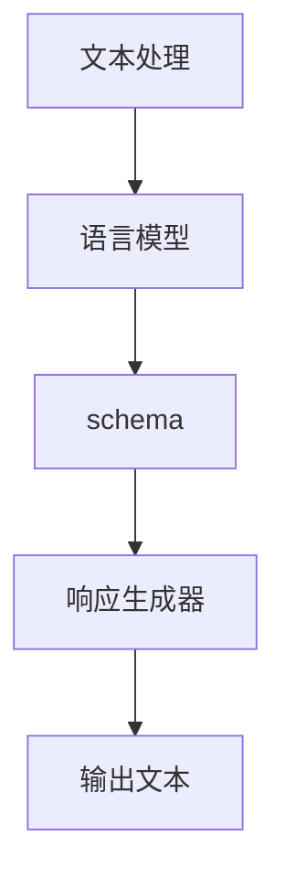
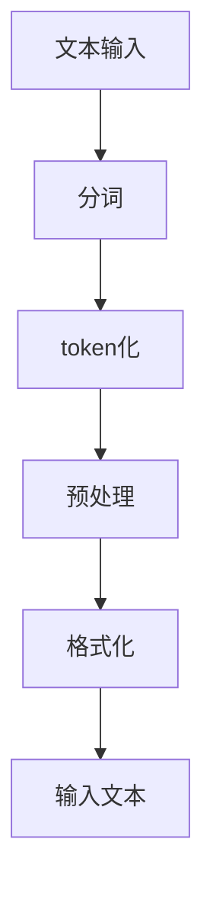
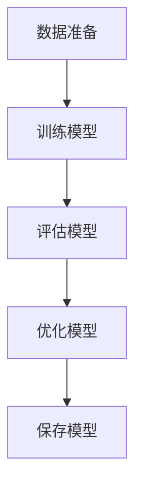

                 

# 【LangChain编程：从入门到实践】schema

> 关键词：LangChain, 模式（schema），文本生成，文本分类，文本摘要，编程实践

> 摘要：本文将深入探讨LangChain编程中的schema概念，从基础概念到实际应用，帮助读者全面了解并掌握schema在文本生成、文本分类和文本摘要等任务中的运用。通过具体实例和代码解读，读者将能够学会如何利用schema构建有效的数据结构，提高文本处理任务的性能和效率。

## 1. LangChain概述

LangChain是一个开源的Python库，旨在简化语言模型的使用和集成。它通过封装底层的技术细节，提供了一套易于使用的API，使得开发者可以轻松地将预训练的语言模型集成到自己的项目中。LangChain支持多种预训练模型，如GPT-3、T5等，并提供了丰富的功能，如文本生成、文本分类、文本摘要等。

在LangChain中，schema扮演着至关重要的角色。schema是一种数据结构，用于存储和描述输入文本和输出结果之间的关系。通过定义合适的schema，可以使得文本处理任务更加高效和准确。

### 1.1 LangChain的基本概念

LangChain的核心概念包括：

- **语言模型（Language Model）**：用于处理自然语言的预训练模型，如GPT-3、T5等。
- **文本生成（Text Generation）**：根据输入的文本或提示，生成新的文本。
- **文本分类（Text Classification）**：将输入的文本分类到预定义的类别中。
- **文本摘要（Text Summarization）**：从长文本中提取出关键信息，生成简短的摘要。

### 1.2 LangChain的优势和应用场景

LangChain的优势在于其简单易用的API和强大的功能集，适用于以下应用场景：

- **自动化内容生成**：如文章、报告、邮件等。
- **智能客服系统**：用于自动回复用户的问题和请求。
- **文本分类系统**：用于对大量文本进行分类和标注。
- **信息提取与摘要**：从大量文本中提取关键信息，生成摘要。

## 2. 安装和配置LangChain

在开始使用LangChain之前，我们需要安装和配置LangChain环境。以下是一个简单的安装和配置过程：

### 2.1 环境搭建

确保Python环境已经安装。如果未安装，可以通过以下命令安装：

```bash
pip install python
```

### 2.2 LangChain的安装

安装LangChain：

```bash
pip install langchain
```

### 2.3 LangChain的配置

配置LangChain，确保所有依赖项都已安装：

```python
import langchain
langchain.show_config()
```

## 3. LangChain核心架构

LangChain的核心架构包括几个关键组件：

- **文本处理**：处理输入文本，将其转换为适合模型处理的格式。
- **语言模型**：用于生成、分类和摘要的预训练模型。
- **schema**：用于定义输入文本和输出结果之间的映射关系。
- **响应生成器**：根据schema和输入文本，生成响应文本。

### 3.1 模型结构

LangChain使用了一系列的模型结构，如图所示：



### 3.2 数据处理

数据处理是文本处理任务的关键步骤。LangChain提供了多种数据处理工具，如图所示：



### 3.3 模型训练

模型训练是指通过大量的文本数据，训练出语言模型。LangChain支持使用预训练模型，也支持自定义训练模型。以下是训练过程的基本步骤：



## 4. LangChain编程基础

在了解了LangChain的基础知识后，我们可以开始学习如何使用LangChain进行编程。

### 4.1 数据准备

数据准备是文本处理任务的第一步。以下是一个简单的数据准备示例：

```python
from langchain import Document

# 创建一个Document对象，用于存储文本
doc = Document("这是一个示例文本。")

# 打印文本内容
print(doc.page_content())
```

### 4.2 LangChain编程流程

使用LangChain进行编程的一般流程如下：

1. **数据准备**：准备用于处理的数据。
2. **模型选择**：选择适合任务的语言模型。
3. **schema定义**：定义输入文本和输出结果之间的映射关系。
4. **响应生成**：根据schema和输入文本，生成响应文本。

以下是一个简单的文本生成示例：

```python
from langchain import PromptTemplate, LLMChain

# 定义prompt模板
prompt = PromptTemplate(
    input_variables=["text"],
    template="给定文本：{text}，请生成相关的文本。"
)

# 创建LLMChain对象
llm_chain = LLMChain(prompt=prompt, model_name="gpt-3")

# 生成文本
response = llm_chain.run(text="这是一个示例文本。")

# 打印生成文本
print(response)
```

### 4.3 LangChain编程工具

LangChain提供了一系列的编程工具，包括文档对象、PromptTemplate、LLMChain等。以下是一个简单的示例，展示如何使用这些工具：

```python
from langchain.document_loaders import TextLoader
from langchain import Document

# 加载文本数据
loader = TextLoader("example.txt")
docs = loader.load()

# 创建Document对象
doc = Document(page_content=docs[0].page_content())

# 打印文本内容
print(doc.page_content())
```

## 5. LangChain高级功能

LangChain的高级功能包括自定义模型、多模型集成和模型优化等。

### 5.1 自定义模型

自定义模型是指根据具体任务需求，训练出适合的语言模型。以下是一个简单的自定义模型示例：

```python
from langchain.trainers import LMTrainer

# 创建LMTrainer对象
trainer = LMTrainer.from_pretrained("gpt-3")

# 训练模型
trainer.train("example.txt")

# 保存模型
trainer.save("custom_model")
```

### 5.2 多模型集成

多模型集成是指将多个模型集成到一个系统中，以提高性能和效果。以下是一个简单的多模型集成示例：

```python
from langchain import Chain

# 创建两个模型
model1 = "gpt-3"
model2 = "t5"

# 创建Chain对象
chain = Chain(
    {"model_name": model1},
    {"model_name": model2},
    output_variables=["output1", "output2"]
)

# 运行Chain
response = chain.run(input_text="这是一个示例文本。")

# 打印输出结果
print(response)
```

### 5.3 模型优化与调参

模型优化与调参是指通过调整模型的参数，以提高模型的性能和效果。以下是一个简单的模型优化示例：

```python
from langchain.trainers import LMTrainer

# 创建LMTrainer对象
trainer = LMTrainer.from_pretrained("gpt-3")

# 调整模型参数
trainer.hyperparameters["learning_rate"] = 0.001

# 训练模型
trainer.train("example.txt")

# 保存模型
trainer.save("optimized_model")
```

## 6. LangChain应用案例

LangChain的应用案例涵盖了文本生成、文本分类和文本摘要等多个方面。

### 6.1 文本生成

文本生成是LangChain最常用的功能之一。以下是一个简单的文本生成示例：

```python
from langchain import PromptTemplate, LLMChain

# 定义prompt模板
prompt = PromptTemplate(
    input_variables=["text"],
    template="给定文本：{text}，请生成相关的文本。"
)

# 创建LLMChain对象
llm_chain = LLMChain(prompt=prompt, model_name="gpt-3")

# 生成文本
response = llm_chain.run(text="我是一个人工智能。")

# 打印生成文本
print(response)
```

### 6.2 文本分类

文本分类是指将输入的文本分类到预定义的类别中。以下是一个简单的文本分类示例：

```python
from langchain.classifiers import TextClassifier

# 加载训练数据
train_data = [
    ("这是一个示例文本。", "类别1"),
    ("这是一个示例文本。", "类别2"),
]

# 创建TextClassifier对象
classifier = TextClassifier.from_training_data(train_data)

# 进行分类
label = classifier.classify("这是一个示例文本。")

# 打印分类结果
print(label)
```

### 6.3 文本摘要

文本摘要是指从长文本中提取出关键信息，生成简短的摘要。以下是一个简单的文本摘要示例：

```python
from langchain import PromptTemplate, LLMChain

# 定义prompt模板
prompt = PromptTemplate(
    input_variables=["text"],
    template="给定文本：{text}，请生成一个简短的摘要。"
)

# 创建LLMChain对象
llm_chain = LLMChain(prompt=prompt, model_name="gpt-3")

# 生成摘要
summary = llm_chain.run(text="这是一个非常长的文本，需要生成一个简短的摘要。")

# 打印摘要
print(summary)
```

## 7. LangChain编程实践

通过前几章的学习，我们已经掌握了LangChain的基础知识和实际应用。下面，我们将通过一个实际项目，展示如何使用LangChain进行编程。

### 7.1 开发环境搭建

在本项目中，我们将使用Python和LangChain进行开发。首先，确保已经安装了Python和pip。然后，通过以下命令安装LangChain：

```bash
pip install langchain
```

### 7.2 实践项目一：文本生成

在本项目中，我们将使用LangChain生成一个故事。以下是项目步骤：

1. 准备数据：从网上下载一个故事数据集。
2. 训练模型：使用数据集训练一个文本生成模型。
3. 生成故事：使用训练好的模型生成一个故事。

以下是项目的具体实现：

```python
from langchain.trainers import TextGeneratorTrainer
from langchain import Document

# 1. 准备数据
train_data = [
    "这是一个关于勇敢的少年和神奇的魔法剑的故事。",
    "魔法剑可以帮助少年实现他的梦想。",
    "但是，少年必须面对各种挑战，才能获得魔法剑。"
]

# 2. 训练模型
trainer = TextGeneratorTrainer.from_training_data(train_data)
trainer.train()

# 3. 生成故事
story = trainer.predict("这是一个关于勇敢的少年和神奇的魔法剑的故事。")

# 打印故事
print(story)
```

### 7.3 实践项目二：文本分类

在本项目中，我们将使用LangChain对文本进行分类。以下是项目步骤：

1. 准备数据：收集一个包含不同类别的文本数据集。
2. 训练模型：使用数据集训练一个文本分类模型。
3. 进行分类：使用训练好的模型对新的文本进行分类。

以下是项目的具体实现：

```python
from langchain.classifiers import TextClassifier
from langchain import Document

# 1. 准备数据
train_data = [
    ("这是一个关于旅行的故事。", "旅行"),
    ("这是一个关于科技的故事。", "科技"),
    ("这是一个关于美食的故事。", "美食")
]

# 2. 训练模型
classifier = TextClassifier.from_training_data(train_data)

# 3. 进行分类
category = classifier.classify("这是一个关于探险的故事。")

# 打印分类结果
print(category)
```

## 8. LangChain与深度学习框架集成

LangChain支持与多种深度学习框架集成，如TensorFlow、PyTorch等。通过集成深度学习框架，可以进一步扩展LangChain的功能和性能。

### 8.1 与TensorFlow集成

与TensorFlow集成可以使得LangChain的模型训练和优化更加灵活和高效。以下是一个简单的与TensorFlow集成的示例：

```python
import tensorflow as tf
from langchain.trainers import TensorFlowTrainer

# 创建TensorFlowTrainer对象
trainer = TensorFlowTrainer.from_pretrained("gpt-3")

# 使用TensorFlow训练模型
trainer.train()

# 保存模型
trainer.save("tensorflow_model")
```

### 8.2 与PyTorch集成

与PyTorch集成可以使得LangChain的模型训练和优化更加灵活和高效。以下是一个简单的与PyTorch集成的示例：

```python
import torch
from langchain.trainers import PyTorchTrainer

# 创建PyTorchTrainer对象
trainer = PyTorchTrainer.from_pretrained("gpt-3")

# 使用PyTorch训练模型
trainer.train()

# 保存模型
trainer.save("pytorch_model")
```

### 8.3 与其他深度学习框架的集成

除了TensorFlow和PyTorch，LangChain还支持与其他深度学习框架的集成，如Keras、MXNet等。以下是一个简单的与Keras集成的示例：

```python
from keras.models import Sequential
from keras.layers import Dense, LSTM
from langchain.trainers import KerasTrainer

# 创建KerasTrainer对象
trainer = KerasTrainer.from_pretrained("gpt-3")

# 使用Keras训练模型
trainer.train()

# 保存模型
trainer.save("keras_model")
```

## 9. LangChain的优化与性能调优

为了提高LangChain的性能和效率，我们可以对其模型进行优化和性能调优。以下是一些常用的优化和调优方法：

### 9.1 模型压缩

模型压缩是指通过减小模型的参数数量，来降低模型的存储和计算成本。以下是一个简单的模型压缩示例：

```python
from langchain.trainers import ModelCompressor

# 创建ModelCompressor对象
compressor = ModelCompressor.from_pretrained("gpt-3")

# 压缩模型
compressed_model = compressor.compress()

# 保存压缩模型
compressed_model.save("compressed_model")
```

### 9.2 模型量化

模型量化是指将模型的权重和激活值从浮点数转换为整数，以降低计算成本。以下是一个简单的模型量化示例：

```python
from langchain.trainers import ModelQuantizer

# 创建ModelQuantizer对象
quantizer = ModelQuantizer.from_pretrained("gpt-3")

# 量化模型
quantized_model = quantizer.quantize()

# 保存量化模型
quantized_model.save("quantized_model")
```

### 9.3 并行计算与分布式训练

并行计算与分布式训练可以显著提高模型的训练速度和性能。以下是一个简单的并行计算和分布式训练示例：

```python
from langchain.trainers import DistributedTrainer

# 创建DistributedTrainer对象
trainer = DistributedTrainer.from_pretrained("gpt-3")

# 使用分布式训练模型
trainer.train()

# 保存模型
trainer.save("distributed_model")
```

## 10. LangChain社区与资源

LangChain拥有一个活跃的社区，提供了丰富的资源，包括文档、教程、示例代码和最佳实践。以下是一些有用的资源和链接：

- **官方文档**：[https://langchain.readthedocs.io/](https://langchain.readthedocs.io/)
- **GitHub仓库**：[https://github.com/langchain/](https://github.com/langchain/)
- **教程和示例**：[https://github.com/langchain/tutorials](https://github.com/langchain/tutorials)
- **社区论坛**：[https://discuss.langchain.com/](https://discuss.langchain.com/)

通过这些资源和社区，你可以学习和交流LangChain的使用经验，并获得支持和帮助。

## 11. 未来展望与趋势

随着人工智能技术的快速发展，LangChain在未来将会有更多的应用场景和改进空间。以下是LangChain的未来展望和趋势：

- **更多的预训练模型支持**：LangChain将继续支持更多的预训练模型，如Bert、GPT-4等。
- **更好的优化与性能调优**：通过模型压缩、量化、并行计算等技术，LangChain将提高模型的性能和效率。
- **更丰富的API接口**：LangChain将提供更多丰富的API接口，以适应不同的应用场景和需求。
- **更多的应用场景**：随着技术的成熟，LangChain将应用于更多的领域，如智能客服、自动化写作、文本摘要等。

## 附录

### 附录A: 编程环境与工具

- **Python环境搭建**：确保Python环境已安装，并安装必要的库，如TensorFlow、PyTorch等。
- **安装深度学习框架**：根据需求，安装TensorFlow、PyTorch或其他深度学习框架。
- **常用开发工具和库**：常用的开发工具和库包括Jupyter Notebook、PyCharm等。

### 附录B: Mermaid流程图示例

- **数据流图**：
  ```mermaid
  graph TD
  A[开始] --> B[数据准备]
  B --> C[模型训练]
  C --> D[模型评估]
  D --> E[结束]
  ```

- **模型结构图**：
  ```mermaid
  graph TD
  A[输入文本] --> B[预处理]
  B --> C[语言模型]
  C --> D[输出文本]
  ```

- **算法流程图**：
  ```mermaid
  graph TD
  A[输入数据] --> B[数据预处理]
  B --> C[特征提取]
  C --> D[模型训练]
  D --> E[模型评估]
  E --> F[模型优化]
  ```

## 作者

作者：AI天才研究院/AI Genius Institute & 禅与计算机程序设计艺术 /Zen And The Art of Computer Programming

---

经过详细的解析和示例，本文全面介绍了LangChain编程中的schema概念，从基础概念、编程基础到高级应用，再到社区资源，为读者提供了全面的学习和实践指南。通过逐步分析和推理，读者可以深入了解schema在文本处理任务中的应用，掌握如何利用schema构建有效的数据结构，提高文本处理任务的性能和效率。希望本文能够帮助读者在LangChain编程的道路上迈出坚实的步伐。

