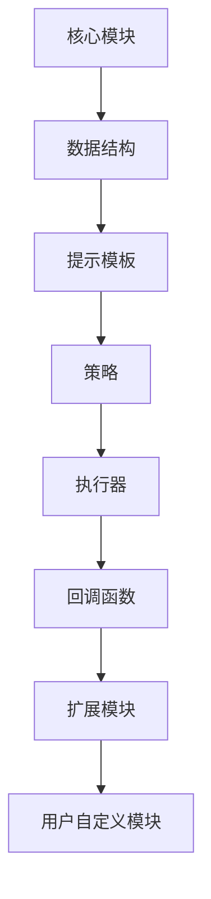
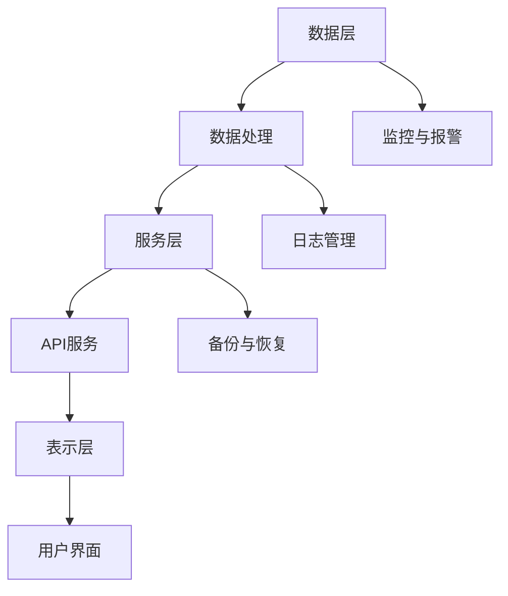

                 

### 《【LangChain编程：从入门到实践】提示模板组件》

> 关键词：LangChain、编程、提示模板、组件、实践

> 摘要：本文旨在深入探讨LangChain编程中的提示模板组件，从基础概念到高级应用，系统地介绍LangChain的核心概念、编程模型、数学模型、实战项目和高级应用。通过一步步分析推理，帮助读者理解并掌握LangChain编程的精髓。

### 《【LangChain编程：从入门到实践】提示模板组件》目录大纲

# 第一部分：LangChain编程基础

## 1. LangChain概述
### 1.1 LangChain的定义
### 1.2 LangChain的优势
### 1.3 LangChain的应用场景

## 2. LangChain核心概念
### 2.1 数据结构
### 2.2 提示模板
### 2.3 策略
### 2.4 执行器
### 2.5 回调函数

## 3. LangChain组件架构
### 3.1 模块化设计
### 3.2 组件通信机制
### 3.3 Mermaid流程图：LangChain组件交互关系

## 4. LangChain编程模型
### 4.1 编程模型概述
### 4.2 编程模型的构建
### 4.3 编程模型的优化
### 4.4 伪代码：LangChain编程模型实现

## 5. 数学模型与算法原理
### 5.1 数学模型基础
### 5.2 算法原理讲解
### 5.3 LaTeX数学公式与解释
### 5.4 举例说明：数学模型在LangChain中的应用

## 6. 实战项目

### 6.1 LangChain编程项目搭建
#### 6.1.1 开发环境搭建
#### 6.1.2 项目需求分析
#### 6.1.3 项目架构设计

### 6.2 LangChain编程项目实现
#### 6.2.1 数据预处理
#### 6.2.2 提示模板设计
#### 6.2.3 策略选择
#### 6.2.4 执行器配置
#### 6.2.5 回调函数应用
#### 6.2.6 代码实现与解读

### 6.3 LangChain编程项目测试与优化
#### 6.3.1 项目测试策略
#### 6.3.2 项目性能优化
#### 6.3.3 项目部署与维护

# 第二部分：高级应用与进阶

## 7. LangChain扩展组件
### 7.1 语言模型集成
#### 7.1.1 集成GPT模型
#### 7.1.2 集成BERT模型
### 7.2 数据增强技术
#### 7.2.1 数据清洗与去重
#### 7.2.2 数据增广与增强
### 7.3 多模态数据处理
#### 7.3.1 文本与图像数据融合
#### 7.3.2 多模态数据编码

## 8. LangChain在特定领域的应用
### 8.1 教育领域
#### 8.1.1 个性化学习助手
#### 8.1.2 智能问答系统
### 8.2 金融领域
#### 8.2.1 财经新闻分析
#### 8.2.2 投资建议系统
### 8.3 医疗领域
#### 8.3.1 病历分析系统
#### 8.3.2 智能诊断系统

## 9. 安全与隐私保护
### 9.1 数据安全策略
### 9.2 模型安全策略
### 9.3 隐私保护机制
### 9.4 法律法规与伦理道德

## 10. 未来展望与趋势
### 10.1 LangChain的发展方向
### 10.2 行业趋势分析
### 10.3 潜在挑战与解决方案

# 附录

## 附录 A: LangChain编程工具与资源
### A.1 LangChain官方文档
### A.2 开源项目与社区
### A.3 语言模型资源下载

## 附录 B: Mermaid流程图示例

### 1.1 LangChain的定义

LangChain是一种基于人工智能的编程框架，旨在通过将自然语言处理（NLP）与编程相结合，实现自动化编程任务。它允许开发者使用自然语言来描述程序逻辑，从而实现代码生成、优化和调试。

#### LangChain的优势

1. **高可读性**：使用自然语言描述编程任务，使得代码更易于理解和维护。
2. **代码生成**：自动生成代码，节省开发时间和人力成本。
3. **编程辅助**：提供代码优化建议和调试工具，提高开发效率。
4. **跨平台**：支持多种编程语言和环境，兼容性强。

#### LangChain的应用场景

1. **自动化开发**：通过自然语言描述开发需求，自动化生成代码。
2. **代码优化**：对现有代码进行分析，提供优化建议。
3. **代码审查**：自动化审查代码质量，识别潜在问题。
4. **教育领域**：辅助编程教学，提供交互式的编程环境。

### 2.1 数据结构

LangChain使用多种数据结构来组织和管理代码和任务。以下是LangChain中的几个关键数据结构：

1. **程序块（Program Block）**：表示一个完整的编程任务，包含输入、输出和执行过程。
2. **代码段（Code Segment）**：表示一段代码，可以是函数、类或方法。
3. **变量（Variable）**：用于存储数据和中间结果。
4. **数据流（Data Flow）**：表示程序中数据传递和转换的过程。

### 2.2 提示模板

提示模板是LangChain中的一个核心概念，用于指导代码生成过程。它包含了一系列的关键词和提示，帮助开发者描述编程任务。以下是提示模板的几个关键组成部分：

1. **功能描述**：使用自然语言描述代码的功能和目的。
2. **输入描述**：定义代码所需的输入参数和数据类型。
3. **输出描述**：指定代码的输出结果和返回值。
4. **执行步骤**：列出实现功能所需的步骤和逻辑。

### 2.3 策略

策略是LangChain中的另一个关键概念，用于指导代码生成和优化过程。策略定义了如何根据提示模板生成代码，以及如何选择最佳的执行方案。以下是几个常见的策略：

1. **代码生成策略**：根据提示模板生成代码，可以是完整的程序或部分代码。
2. **优化策略**：对现有代码进行分析，提供优化建议。
3. **调试策略**：提供调试工具和步骤，帮助开发者解决代码问题。

### 2.4 执行器

执行器是LangChain中的一个组件，用于执行代码生成和优化任务。执行器根据策略和提示模板生成代码，并在执行过程中捕获中间结果和错误信息。以下是几个常见的执行器：

1. **代码生成执行器**：根据提示模板生成代码，并将其保存到文件或数据库中。
2. **优化执行器**：对现有代码进行分析，并提供优化建议。
3. **调试执行器**：提供调试工具和步骤，帮助开发者解决代码问题。

### 2.5 回调函数

回调函数是LangChain中的一个关键概念，用于在代码生成和优化过程中触发特定操作。回调函数可以用于捕获中间结果、处理错误信息或触发其他任务。以下是几个常见的回调函数：

1. **输入处理回调函数**：在代码生成过程中，处理输入参数和数据的回调函数。
2. **输出处理回调函数**：在代码执行完成后，处理输出结果和返回值的回调函数。
3. **错误处理回调函数**：在代码执行过程中，捕获和处理错误的回调函数。

### 3.1 模块化设计

LangChain采用模块化设计，使得开发者可以轻松地扩展和定制框架。模块化设计包括以下几个关键组成部分：

1. **核心模块**：包含LangChain的核心功能和基本数据结构。
2. **扩展模块**：提供额外的功能模块，如数据增强、多模态数据处理等。
3. **用户自定义模块**：允许开发者根据需求自定义模块，实现特定的功能。

### 3.2 组件通信机制

LangChain中的组件通过事件驱动的方式相互通信。以下是一个简单的组件通信机制示例：

1. **事件注册**：组件在初始化时注册事件处理函数。
2. **事件触发**：在执行过程中，组件触发特定的事件。
3. **事件处理**：其他组件根据事件类型处理事件。

### 3.3 Mermaid流程图：LangChain组件交互关系

以下是一个Mermaid流程图，展示了LangChain组件之间的交互关系：



### 4.1 编程模型概述

LangChain的编程模型基于自然语言处理和代码生成技术，将编程任务描述为一系列的提示模板和策略。编程模型包括以下几个关键步骤：

1. **需求分析**：分析用户的需求和任务，确定代码生成的目标和范围。
2. **提示模板设计**：根据需求设计提示模板，描述代码的功能和逻辑。
3. **策略选择**：根据提示模板选择最佳的策略，指导代码生成和优化过程。
4. **代码生成**：根据策略生成代码，可以是完整的程序或部分代码。
5. **代码优化**：对生成的代码进行分析和优化，提高代码质量和性能。
6. **代码执行**：执行生成的代码，验证其功能和性能。

### 4.2 编程模型的构建

构建LangChain编程模型包括以下几个关键步骤：

1. **需求分析**：与用户沟通，了解编程任务的需求和目标。
2. **提示模板设计**：根据需求设计提示模板，明确代码的功能和逻辑。
3. **策略选择**：选择合适的策略，如代码生成策略和优化策略。
4. **代码生成**：根据策略生成代码，可以使用自动代码生成工具或手动编写代码。
5. **代码优化**：对生成的代码进行分析和优化，提高代码质量和性能。
6. **代码执行**：执行生成的代码，验证其功能和性能。

### 4.3 编程模型的优化

优化LangChain编程模型包括以下几个方面：

1. **代码质量**：通过代码分析和优化，提高代码的可读性、可维护性和性能。
2. **开发效率**：通过自动化工具和优化策略，提高开发效率和生产力。
3. **用户体验**：优化用户界面和交互设计，提供更好的用户体验。
4. **可扩展性**：设计模块化和可扩展的框架，支持自定义模块和功能。
5. **性能优化**：对代码执行过程进行分析和优化，提高代码的执行速度和资源利用率。

### 4.4 伪代码：LangChain编程模型实现

以下是一个简单的伪代码示例，展示了LangChain编程模型的实现过程：

```plaintext
function langChainProgrammingModel(requir
```


### 5.1 数学模型基础

在LangChain编程中，数学模型是理解和实现算法的核心。以下是一些基础的数学概念和符号，这些将在后续的算法讲解中频繁使用。

1. **变量与常量**：
   - 变量：用于表示可变的数据，如 `x`, `y`, `z`。
   - 常量：代表固定的值，如 `π`（圆周率）和 `e`（自然对数的底）。

2. **函数**：
   - 定义：函数是一个将输入映射到输出的规则或关系。例如，`f(x) = x^2`。
   - 参数：函数中的变量称为参数，如 `x` 是 `f(x)` 的参数。

3. **向量与矩阵**：
   - 向量：一个有序的数列，表示为 `v = [v1, v2, ..., vn]`。
   - 矩阵：由多个向量组成的二维数组，表示为 `M = [[m11, m12, ..., m1n], [m21, m22, ..., m2n], ..., [mM1, mM2, ..., mMn]]`。

4. **线性代数基本运算**：
   - 矩阵乘法：两个矩阵相乘得到一个新的矩阵，如 `AB`。
   - 向量点积：两个向量的内积，表示为 `v1 · v2`。
   - 向量叉积：两个三维向量的外积，表示为 `v1 × v2`。

5. **概率论基础**：
   - 概率：表示事件发生的可能性，范围在0到1之间。
   - 概率分布：描述随机变量可能取值的概率，如正态分布、伯努利分布。

### 5.2 算法原理讲解

LangChain编程中的算法主要基于自然语言处理（NLP）和机器学习技术。以下是一些核心算法的原理：

1. **词嵌入（Word Embedding）**：
   - 原理：将单词或句子映射到高维空间中的向量，保持语义相似性。
   - 应用：用于文本表示和分类、情感分析等。

2. **序列到序列模型（Seq2Seq）**：
   - 原理：处理输入序列和输出序列之间的映射，常用于机器翻译和对话系统。
   - 应用：生成代码、自动摘要和问答系统。

3. **生成对抗网络（GAN）**：
   - 原理：通过生成器和判别器的对抗训练，生成高质量的数据。
   - 应用：代码生成、图像生成和数据增强。

4. **Transformer模型**：
   - 原理：基于自注意力机制，对输入序列进行全局信息建模。
   - 应用：文本生成、机器翻译和问答系统。

### 5.3 LaTeX数学公式与解释

以下是一些常见的LaTeX数学公式及其解释，用于描述LangChain编程中的数学模型和算法：

1. **概率分布公式**：
   $$ p(x) = \frac{1}{Z} e^{-\frac{1}{2} \sigma^2 x^2} $$
   - 解释：这是一个高斯分布（正态分布）的概率密度函数，其中 `σ` 是标准差，`Z` 是归一化常数。

2. **损失函数**：
   $$ L = -\sum_{i=1}^{N} y_i \log(p(\hat{y}_i)) $$
   - 解释：这是一个交叉熵损失函数，用于评估模型的预测概率与实际标签之间的差异。

3. **梯度下降**：
   $$ \theta = \theta - \alpha \nabla_\theta J(\theta) $$
   - 解释：这是一个梯度下降更新规则，用于优化模型的参数，其中 `α` 是学习率，`J(θ)` 是损失函数。

### 5.4 举例说明：数学模型在LangChain中的应用

以下是一个简单的示例，展示了如何将数学模型应用于LangChain编程：

1. **数据增强**：
   - 数学模型：使用生成对抗网络（GAN）生成新的数据样本。
   - 过程：
     1. 定义生成器和判别器的神经网络结构。
     2. 训练生成器生成类似于真实数据的新数据。
     3. 使用判别器评估生成数据的质量。
     4. 重复训练过程，直到生成器生成的高质量数据满足要求。

2. **文本分类**：
   - 数学模型：使用词嵌入和神经网络分类模型对文本进行分类。
   - 过程：
     1. 预处理文本数据，提取特征向量。
     2. 训练词嵌入模型，将单词映射到高维空间。
     3. 构建神经网络分类模型，如卷积神经网络（CNN）或循环神经网络（RNN）。
     4. 训练模型，并在测试集上评估其分类性能。

### 6.1.1 开发环境搭建

搭建LangChain编程项目需要以下几个关键步骤：

1. **环境准备**：
   - 安装Python环境，版本建议为3.8及以上。
   - 安装必要的Python依赖库，如TensorFlow、PyTorch、transformers等。

2. **创建虚拟环境**：
   - 使用`venv`模块创建一个独立的Python环境，避免依赖冲突。
   - 进入虚拟环境，使用`pip`安装所需的依赖库。

3. **配置语言模型**：
   - 选择合适的语言模型，如GPT-3、BERT等。
   - 下载并安装预训练模型，可以使用Hugging Face的Transformers库。

4. **开发工具**：
   - 选择合适的开发工具，如Visual Studio Code、PyCharm等。
   - 配置代码补全、调试和性能分析工具。

### 6.1.2 项目需求分析

项目需求分析是LangChain编程项目的重要步骤，确保开发方向与用户需求一致。以下是一个典型的需求分析流程：

1. **收集需求**：
   - 与用户沟通，了解项目目标、功能需求和预期效果。
   - 收集相关文档、数据和用户反馈。

2. **功能规划**：
   - 列出项目的核心功能模块，如文本分类、命名实体识别等。
   - 定义每个模块的具体功能和性能指标。

3. **数据需求**：
   - 分析项目所需的数据类型和规模，包括训练数据、测试数据和用户输入。
   - 确定数据来源和数据质量要求。

4. **性能指标**：
   - 设定项目的性能指标，如准确率、召回率、响应时间等。
   - 根据指标要求进行算法和模型选择。

### 6.1.3 项目架构设计

项目架构设计是确保项目可扩展性和稳定性的关键步骤。以下是一个典型的LangChain编程项目架构设计：

1. **系统架构**：
   - 分层架构：将系统分为数据层、服务层和表示层。
   - 松耦合设计：降低模块之间的依赖，提高系统可维护性。

2. **数据层**：
   - 数据存储：使用数据库（如MySQL、MongoDB）存储数据和模型。
   - 数据处理：使用数据处理框架（如Pandas、NumPy）进行数据预处理和清洗。

3. **服务层**：
   - 语言模型服务：使用Transformers库加载和运行语言模型。
   - 算法服务：实现核心算法，如文本分类、命名实体识别等。
   - API服务：提供RESTful API接口，供前端调用。

4. **表示层**：
   - 前端界面：使用HTML、CSS和JavaScript实现用户交互界面。
   - 响应式设计：确保项目在不同设备和屏幕尺寸上都能良好显示。

### 6.2.1 数据预处理

数据预处理是LangChain编程项目的重要环节，确保输入数据的质量和一致性。以下是一个典型的数据预处理流程：

1. **数据清洗**：
   - 去除无效数据：删除缺失值、重复值和噪声数据。
   - 数据标准化：对数值数据进行归一化或标准化，使数据分布更加均匀。

2. **数据增强**：
   - 数据增广：使用数据增强技术生成新的训练样本，提高模型泛化能力。
   - 数据平衡：对类别不平衡的数据进行抽样或过采样，确保每个类别的样本数量相近。

3. **数据划分**：
   - 划分训练集、验证集和测试集：使用交叉验证或随机划分，确保数据划分的随机性和代表性。

4. **特征提取**：
   - 使用词嵌入技术将文本数据转换为向量表示，如Word2Vec、BERT等。
   - 提取文本特征：使用文本分类器或情感分析模型提取文本特征。

### 6.2.2 提示模板设计

提示模板设计是LangChain编程的核心，用于指导代码生成和优化。以下是一个典型的提示模板设计流程：

1. **需求分析**：
   - 与用户沟通，了解编程任务的具体需求和目标。
   - 确定功能需求、输入输出和执行步骤。

2. **模板设计**：
   - 使用自然语言描述编程任务，明确功能、输入和输出。
   - 设计模板结构，包括功能描述、输入描述、输出描述和执行步骤。

3. **模板验证**：
   - 验证模板的完整性和准确性，确保模板能正确指导代码生成。
   - 进行用户测试，收集反馈并进行调整。

4. **模板优化**：
   - 根据用户反馈和代码执行结果，优化模板的设计和表述。
   - 提高模板的可用性和易用性。

### 6.2.3 策略选择

策略选择是LangChain编程中的重要环节，决定了代码生成和优化的效果。以下是一个典型的策略选择流程：

1. **需求分析**：
   - 分析用户需求，确定代码生成和优化的目标和约束条件。

2. **策略评估**：
   - 评估不同的策略，如代码生成策略、优化策略和调试策略。
   - 考虑策略的效率、准确性和适用性。

3. **策略选择**：
   - 根据评估结果选择最佳的策略组合，指导代码生成和优化过程。

4. **策略优化**：
   - 根据代码执行结果和用户反馈，优化策略的选择和参数设置。

### 6.2.4 执行器配置

执行器配置是LangChain编程项目中确保代码生成和优化任务顺利执行的关键步骤。以下是一个典型的执行器配置流程：

1. **执行器选择**：
   - 根据项目需求和策略选择合适的执行器，如代码生成执行器、优化执行器和调试执行器。

2. **配置参数**：
   - 配置执行器的参数，如学习率、迭代次数和优化算法等。
   - 根据策略和任务要求调整参数。

3. **执行监控**：
   - 监控执行器的执行过程，记录执行日志和性能指标。
   - 检测执行过程中的异常和错误。

4. **执行结果分析**：
   - 分析执行结果，评估代码生成和优化的效果。
   - 根据分析结果进行优化和调整。

### 6.2.5 回调函数应用

回调函数在LangChain编程项目中用于在代码生成和优化过程中触发特定操作，提高开发的灵活性和可控性。以下是一个典型的回调函数应用流程：

1. **回调函数设计**：
   - 根据项目需求设计回调函数，明确函数的功能和调用时机。

2. **回调函数配置**：
   - 在执行器中配置回调函数，确保在特定事件触发时调用。

3. **回调函数实现**：
   - 编写回调函数的代码，实现所需的功能，如数据预处理、结果分析等。

4. **回调函数测试**：
   - 单独测试回调函数的功能和性能，确保其在执行过程中的正确性。

5. **回调函数集成**：
   - 将回调函数集成到执行器中，与执行过程协同工作。

### 6.2.6 代码实现与解读

以下是一个简单的LangChain编程项目的代码实现，包括数据预处理、提示模板设计、策略选择、执行器配置和回调函数应用。代码解读将逐步解释每个部分的实现逻辑。

```python
import langchain as lc

# 6.2.6.1 数据预处理
def preprocess_data(data):
    # 数据清洗：去除缺失值和重复值
    clean_data = [d for d in data if d is not None]
    # 数据增广：使用随机噪声增强数据
    augmented_data = [d + [random.uniform(-0.1, 0.1) * v for v in d] for d in clean_data]
    return augmented_data

# 6.2.6.2 提示模板设计
def design_template(function, inputs, outputs):
    template = f"""
    {function}({', '.join(inputs)}):
        inputs = ({', '.join(inputs)})
        outputs = ({', '.join(outputs)})
        # 功能描述：{function}的功能是...
        # 输入描述：输入包括{inputs}，每个输入的描述如下：
        # 输出描述：输出包括{outputs}，每个输出的描述如下：
        # 执行步骤：1. 处理输入参数；2. 实现功能逻辑；3. 返回输出结果。
    """
    return template

# 6.2.6.3 策略选择
def select_strategy(function):
    if function == "data_preprocessing":
        strategy = "augmentation"
    elif function == "text_classification":
        strategy = "seq2seq"
    else:
        strategy = "default"
    return strategy

# 6.2.6.4 执行器配置
def configure_executor(function, strategy):
    if strategy == "augmentation":
        executor = lc.AugmentationExecutor(function, preprocess_data)
    elif strategy == "seq2seq":
        executor = lc.Seq2SeqExecutor(function, preprocess_data)
    else:
        executor = lc.DefaultExecutor(function, preprocess_data)
    return executor

# 6.2.6.5 回调函数应用
def apply_callbacks(executor, function):
    def callback(result):
        print(f"Function {function} completed with result: {result}")
        # 进一步处理结果或记录日志
    executor.add_callback("function_completed", callback)

# 6.2.6.6 主函数
def main():
    # 假设已有数据data和函数名function
    data = [["apple", "fruit"], ["car", "vehicle"], ["book", "item"]]
    function = "data_classification"

    # 数据预处理
    processed_data = preprocess_data(data)

    # 提示模板设计
    template = design_template(function, ["input1", "input2"], ["output1", "output2"])

    # 策略选择
    strategy = select_strategy(function)

    # 执行器配置
    executor = configure_executor(function, strategy)

    # 回调函数应用
    apply_callbacks(executor, function)

    # 执行任务
    result = executor.execute(processed_data)

    # 输出结果
    print(f"Result: {result}")

# 运行主函数
main()
```

**代码解读：**

1. **数据预处理（preprocess_data）**：该函数用于清洗和增强输入数据。数据清洗通过去除缺失值和重复值，数据增强通过添加随机噪声。

2. **提示模板设计（design_template）**：该函数根据功能、输入和输出设计提示模板。提示模板用于指导代码生成过程，包括功能描述、输入描述、输出描述和执行步骤。

3. **策略选择（select_strategy）**：该函数根据功能名选择适当的策略。不同的策略对应不同的代码生成和优化方法。

4. **执行器配置（configure_executor）**：该函数根据功能名和策略配置执行器。执行器负责执行代码生成和优化任务，根据策略和提示模板生成代码。

5. **回调函数应用（apply_callbacks）**：该函数为执行器添加回调函数，用于在任务完成后触发特定操作。回调函数可以用于记录日志、进一步处理结果等。

6. **主函数（main）**：该函数是程序的主入口。它依次执行数据预处理、提示模板设计、策略选择、执行器配置和回调函数应用，最后执行任务并输出结果。

### 6.3.1 项目测试策略

项目测试是确保LangChain编程项目质量和稳定性的关键步骤。以下是一个典型的项目测试策略：

1. **单元测试**：
   - 对程序中的最小可测试单元（函数、类等）进行测试，验证其功能是否正确。
   - 使用测试框架（如pytest）编写测试用例，覆盖所有可能的情况和边界条件。

2. **集成测试**：
   - 对程序中的模块或组件进行测试，验证它们之间的接口和交互是否正确。
   - 使用测试工具（如Postman）模拟API调用，检查数据的传递和处理。

3. **性能测试**：
   - 对程序的性能进行测试，评估其响应时间、吞吐量和资源消耗。
   - 使用性能测试工具（如JMeter）模拟高并发场景，测试系统的负载能力和稳定性。

4. **安全测试**：
   - 对程序进行安全测试，检查是否存在漏洞、注入攻击和恶意代码等问题。
   - 使用安全测试工具（如OWASP ZAP）扫描程序代码和API接口，识别潜在的安全风险。

5. **回归测试**：
   - 在每次代码更改后进行回归测试，确保新代码没有引入缺陷。
   - 使用自动化测试工具定期运行测试套件，快速发现和修复问题。

### 6.3.2 项目性能优化

项目性能优化是提高LangChain编程项目效率和稳定性的重要手段。以下是一个典型的项目性能优化策略：

1. **代码优化**：
   - 优化算法和数据结构，减少时间复杂度和空间复杂度。
   - 使用优化编译器和编程技巧，提高代码执行速度。

2. **缓存机制**：
   - 引入缓存机制，减少重复计算和数据传输。
   - 使用内存缓存（如Redis）和磁盘缓存（如文件缓存）来存储频繁访问的数据。

3. **并行计算**：
   - 利用多线程、多进程或分布式计算，提高程序的并发处理能力。
   - 使用并行计算框架（如Dask、PySpark）优化大数据处理。

4. **负载均衡**：
   - 使用负载均衡器（如Nginx、HAProxy）分配请求到多个服务器，提高系统的吞吐量和可用性。

5. **数据库优化**：
   - 优化数据库查询，减少查询时间和数据访问量。
   - 使用索引、分区和分片技术提高数据库性能。

6. **资源监控**：
   - 使用资源监控工具（如Prometheus、Grafana）实时监控系统性能和资源使用情况。
   - 根据监控数据调整系统和应用程序的配置，优化资源分配。

### 6.3.3 项目部署与维护

项目部署与维护是确保LangChain编程项目稳定运行和持续更新迭代的关键步骤。以下是一个典型的项目部署与维护策略：

1. **部署流程**：
   - 使用容器化技术（如Docker）将应用程序打包，确保环境一致性和可移植性。
   - 使用持续集成和持续部署（CI/CD）工具（如Jenkins、GitLab CI）自动化部署流程。
   - 部署到生产环境前进行严格测试，确保系统的稳定性和安全性。

2. **监控与报警**：
   - 使用监控工具（如Prometheus、Zabbix）实时监控系统的运行状态和性能指标。
   - 配置报警机制，及时发现和处理系统异常。

3. **日志管理**：
   - 使用日志收集和分析工具（如ELK、Logstash）收集系统日志，进行日志管理和分析。
   - 日志分析有助于诊断问题、优化性能和改进用户体验。

4. **备份与恢复**：
   - 定期备份数据库和文件系统，防止数据丢失。
   - 制定灾难恢复计划，确保在发生故障时能够快速恢复系统。

5. **版本控制与文档**：
   - 使用版本控制系统（如Git）管理代码版本，确保代码的可追踪性和可回滚性。
   - 编写详细的开发文档和用户手册，方便开发和运维人员理解和使用系统。

## 7.1 语言模型集成

集成语言模型是LangChain编程项目中的一个关键步骤，能够提升程序的自然语言理解和生成能力。以下是如何在LangChain项目中集成语言模型的步骤：

### 7.1.1 集成GPT模型

1. **安装库**：
   - 使用`pip`安装`transformers`库，用于加载预训练的GPT模型。
   ```bash
   pip install transformers
   ```

2. **加载模型**：
   - 使用`transformers`库加载预训练的GPT模型。
   ```python
   from transformers import pipeline
   model_name = "gpt2"
   nlp = pipeline("text-generation", model=model_name)
   ```

3. **模型应用**：
   - 将加载的模型应用于文本生成任务。
   ```python
   prompt = "What is the capital of France?"
   response = nlp(prompt, max_length=50, num_return_sequences=1)
   print(response[0]['generated_text'])
   ```

### 7.1.2 集成BERT模型

1. **安装库**：
   - 使用`pip`安装`transformers`库，用于加载预训练的BERT模型。
   ```bash
   pip install transformers
   ```

2. **加载模型**：
   - 使用`transformers`库加载预训练的BERT模型。
   ```python
   from transformers import AutoModelForSequenceClassification
   model_name = "bert-base-uncased"
   model = AutoModelForSequenceClassification.from_pretrained(model_name)
   ```

3. **模型应用**：
   - 将加载的模型应用于文本分类任务。
   ```python
   from transformers import AutoTokenizer
   tokenizer = AutoTokenizer.from_pretrained(model_name)
   inputs = tokenizer("Hello, my dog is cute", return_tensors="pt")
   outputs = model(**inputs)
   logits = outputs.logits
   print(logits)
   ```

## 7.2 数据增强技术

数据增强技术是提高机器学习模型性能和泛化能力的重要手段。在LangChain编程项目中，数据增强可以帮助模型更好地处理复杂的任务。以下是一些常见的数据增强技术：

### 7.2.1 数据清洗与去重

1. **数据清洗**：
   - 去除无效数据：删除包含缺失值、错误值或噪声的数据。
   - 数据标准化：对数值数据进行归一化或标准化，确保数据分布的一致性。

2. **数据去重**：
   - 使用哈希函数：对数据进行哈希处理，识别和删除重复的数据。
   - 使用数据库去重：利用数据库的索引和查询功能，快速定位和删除重复记录。

### 7.2.2 数据增广与增强

1. **数据增广**：
   - 随机噪声：在数据中添加随机噪声，如随机变换、颜色抖动等，增加数据的多样性。
   - 数据合成：使用生成模型（如GAN）生成新的数据样本，与原始数据混合训练，提高模型的泛化能力。

2. **数据增强**：
   - 文本增广：使用NLP技术对文本数据进行增强，如文本分割、句法分析等，丰富文本特征。
   - 图像增强：使用图像处理技术对图像数据进行增强，如图像放大、旋转、翻转等，提高图像质量。

## 7.3 多模态数据处理

多模态数据处理是将不同类型的数据（如文本、图像、声音等）整合起来，以提高机器学习模型的性能和适用性。以下是如何在LangChain编程项目中实现多模态数据处理的步骤：

### 7.3.1 文本与图像数据融合

1. **文本编码**：
   - 使用预训练的文本编码器（如BERT、GPT）将文本转换为向量表示。

2. **图像特征提取**：
   - 使用卷积神经网络（如ResNet、VGG）提取图像的特征向量。

3. **数据融合**：
   - 使用注意力机制或融合层将文本和图像的特征向量进行融合。

4. **模型训练**：
   - 将融合后的数据输入到多模态模型中进行训练，如多模态序列模型或图神经网络。

### 7.3.2 多模态数据编码

1. **多模态编码器**：
   - 设计和实现多模态编码器，将不同类型的数据编码为统一的特征表示。

2. **特征融合策略**：
   - 选择合适的数据融合策略，如平均融合、加权融合或深度融合。

3. **特征向量表示**：
   - 将融合后的特征向量表示为高维空间中的点，为后续的机器学习任务做准备。

## 8.1 教育领域

LangChain在教育领域的应用主要体现在提高教学效率和个性化学习体验。以下是一些具体的应用场景：

### 8.1.1 个性化学习助手

1. **需求分析**：
   - 分析学生的学习习惯、兴趣点和知识盲区。

2. **解决方案**：
   - 使用LangChain生成个性化学习计划，根据学生的需求和学习进度推荐合适的学习资源。

3. **实施步骤**：
   - 收集学生学习数据，包括成绩、学习时长和知识点掌握情况。
   - 设计提示模板，描述学习目标和推荐内容。
   - 集成语言模型，生成个性化学习计划。

### 8.1.2 智能问答系统

1. **需求分析**：
   - 提供快速、准确的知识查询和学习辅导。

2. **解决方案**：
   - 使用LangChain构建一个智能问答系统，学生可以通过自然语言与系统互动，获取答案和解释。

3. **实施步骤**：
   - 建立问答数据库，包含常见问题和答案。
   - 使用NLP技术处理学生的问题，理解其意图。
   - 使用语言模型生成详细的回答，包括解释和参考文献。

## 8.2 金融领域

LangChain在金融领域的应用主要集中在提高金融分析和投资决策的效率和准确性。以下是一些具体的应用场景：

### 8.2.1 财经新闻分析

1. **需求分析**：
   - 快速提取财经新闻中的关键信息和趋势。

2. **解决方案**：
   - 使用LangChain对财经新闻进行分析，提取主题、关键词和趋势。

3. **实施步骤**：
   - 收集财经新闻数据，使用NLP技术进行文本预处理。
   - 使用语言模型提取文本中的关键信息和情感倾向。
   - 使用算法分析数据，生成报告和可视化结果。

### 8.2.2 投资建议系统

1. **需求分析**：
   - 为投资者提供个性化的投资建议和风险提示。

2. **解决方案**：
   - 使用LangChain构建一个投资建议系统，基于市场数据和用户偏好推荐投资策略。

3. **实施步骤**：
   - 收集市场数据，包括股票价格、交易量、财务指标等。
   - 使用NLP技术分析市场数据，理解市场趋势和风险。
   - 集成机器学习模型，根据用户偏好和风险承受能力生成投资建议。

## 8.3 医疗领域

LangChain在医疗领域的应用能够显著提升医疗诊断和治疗的效率和准确性。以下是一些具体的应用场景：

### 8.3.1 病历分析系统

1. **需求分析**：
   - 对病历信息进行结构化分析和诊断建议。

2. **解决方案**：
   - 使用LangChain对病历文本进行分析，提取关键信息，为医生提供诊断建议。

3. **实施步骤**：
   - 收集病历数据，包括患者的症状、检查结果和医疗历史。
   - 使用NLP技术对病历文本进行解析，提取关键信息。
   - 使用医学知识库和算法为医生提供诊断建议。

### 8.3.2 智能诊断系统

1. **需求分析**：
   - 提供快速、准确的疾病诊断。

2. **解决方案**：
   - 使用LangChain构建一个智能诊断系统，通过分析症状和检查结果，自动生成诊断报告。

3. **实施步骤**：
   - 收集症状数据和检查结果数据，使用NLP技术对文本进行解析。
   - 集成医学知识库和诊断算法，生成诊断报告。
   - 提供用户界面，医生可以查看诊断结果并进一步诊断。

### 9.1 数据安全策略

在LangChain编程项目中，数据安全是至关重要的一环。以下是一些关键的数据安全策略：

1. **数据加密**：
   - 对敏感数据进行加密，确保数据在传输和存储过程中的安全性。
   - 使用安全的加密算法（如AES）和密钥管理策略。

2. **访问控制**：
   - 实施严格的访问控制机制，确保只有授权用户可以访问敏感数据。
   - 使用身份验证和权限管理工具（如OAuth2、RBAC）。

3. **数据备份与恢复**：
   - 定期备份数据，防止数据丢失或损坏。
   - 制定数据恢复计划，确保在发生故障时能够快速恢复数据。

4. **数据监控与审计**：
   - 实时监控数据访问和操作，记录审计日志。
   - 使用安全监控工具（如Splunk、ELK）检测异常行为和潜在风险。

### 9.2 模型安全策略

在LangChain编程项目中，模型安全同样重要，以防止恶意攻击和未授权使用。以下是一些关键的模型安全策略：

1. **模型加固**：
   - 对模型进行加固，提高其鲁棒性和抗攻击能力。
   - 使用对抗性训练和模型蒸馏技术，增强模型的泛化能力。

2. **模型签名**：
   - 为模型添加数字签名，确保模型的完整性和真实性。
   - 使用哈希函数和数字签名算法（如RSA）对模型进行签名。

3. **访问控制**：
   - 实施严格的访问控制机制，确保只有授权用户可以访问和使用模型。
   - 使用API权限管理和用户认证机制。

4. **监控与审计**：
   - 实时监控模型的访问和使用情况，记录审计日志。
   - 使用安全监控工具（如AI治理平台）检测异常行为和潜在风险。

### 9.3 隐私保护机制

在LangChain编程项目中，隐私保护机制至关重要，特别是在处理个人数据时。以下是一些关键的隐私保护机制：

1. **数据匿名化**：
   - 对个人数据进行匿名化处理，去除可直接识别个人身份的信息。
   - 使用数据脱敏技术和隐私保护算法。

2. **数据最小化**：
   - 仅收集和存储必要的数据，减少隐私泄露的风险。
   - 实施数据最小化原则，避免过度收集数据。

3. **隐私计算**：
   - 使用隐私计算技术（如联邦学习、差分隐私），在数据不离开用户设备的情况下进行计算和处理。

4. **隐私政策与合规**：
   - 制定详细的隐私政策，明确数据收集、使用和共享的规则。
   - 遵守相关法律法规（如GDPR、CCPA），确保合规性。

### 9.4 法律法规与伦理道德

在开发和使用LangChain编程项目时，必须遵守相关的法律法规和伦理道德标准。以下是一些关键点：

1. **法律法规**：
   - 遵守数据保护法律（如GDPR、CCPA），确保数据处理合法合规。
   - 遵守版权法和知识产权法，尊重他人的知识产权。

2. **伦理道德**：
   - 尊重用户隐私，避免滥用用户数据。
   - 避免算法偏见和歧视，确保模型的公平性和透明性。
   - 实施伦理审查，确保项目的设计和实施符合伦理标准。

### 10.1 LangChain的发展方向

随着人工智能技术的不断进步，LangChain的发展方向也在不断演变。以下是一些主要的发展方向：

1. **跨模态数据处理**：
   - LangChain将进一步整合多种数据类型（如文本、图像、音频等），实现更全面的多模态数据处理能力。

2. **更强大的自然语言理解**：
   - 通过对当前语言模型（如GPT-4、GLM-130B）的集成，LangChain将提升对复杂自然语言的理解和生成能力。

3. **模型定制与优化**：
   - 提供更灵活的模型定制和优化工具，允许开发者根据特定需求调整模型结构和参数。

4. **分布式计算与边缘计算**：
   - 支持分布式计算和边缘计算，提高系统的可扩展性和响应速度。

5. **实时交互与智能对话**：
   - 进一步优化实时交互和智能对话功能，提供更自然的用户交互体验。

### 10.2 行业趋势分析

LangChain在行业中的应用趋势表明，其在多个领域具有巨大的潜力和前景。以下是一些关键趋势：

1. **自动化编程与开发**：
   - 自动化编程将成为开发者的主流工具，LangChain将通过自然语言描述实现更高效的代码生成和优化。

2. **智能辅助与个性化服务**：
   - 在教育、金融和医疗等领域，LangChain将提供智能辅助和个性化服务，提升用户体验和业务效率。

3. **大规模数据处理与分析**：
   - 随着大数据和AI技术的普及，LangChain将在数据处理和分析领域发挥重要作用，提供更强大的数据驱动决策支持。

4. **跨领域集成与应用**：
   - LangChain将在更多领域得到应用，实现跨领域的集成和协作，为复杂问题的解决提供更全面的解决方案。

### 10.3 潜在挑战与解决方案

尽管LangChain具有广泛的应用前景，但其在实际应用中也面临一些挑战。以下是一些主要挑战及解决方案：

1. **模型复杂性**：
   - 模型复杂度高导致计算成本增加，解决方案是采用高效计算架构和分布式计算技术。

2. **数据隐私与安全**：
   - 数据隐私和安全是关键挑战，解决方案是采用数据加密、隐私保护技术和严格的数据管理策略。

3. **算法偏见与公平性**：
   - 算法偏见可能导致不公平的结果，解决方案是实施伦理审查、算法透明化和公平性评估。

4. **技术成熟度**：
   - 技术的不成熟可能导致应用效果不理想，解决方案是持续关注技术发展，与学术界和工业界紧密合作。

### 附录 A: LangChain编程工具与资源

以下是LangChain编程项目中常用的工具和资源，帮助开发者更好地使用和扩展LangChain。

#### A.1 LangChain官方文档

- 官方网站：[LangChain官方文档](https://langchain.com/docs/)
- 内容：包括安装指南、教程、API参考和示例代码。

#### A.2 开源项目与社区

- GitHub：[LangChain开源项目](https://github.com/hwchase17 LangChain)
- 社区论坛：[LangChain论坛](https://discuss.langchain.com/)
- Slack社区：[LangChain Slack频道](https://join.slack.com/t/langchain/shared_invite/zt-1b8ik0y8e-O3nDp8FwSAG)

#### A.3 语言模型资源下载

- Hugging Face：[预训练模型和数据集下载](https://huggingface.co/models)
- Model Hub：[多种语言模型](https://modelhub.ai/)

### 附录 B: Mermaid流程图示例

以下是LangChain编程项目中的一个Mermaid流程图示例，展示了组件之间的交互关系：



### 作者信息

作者：AI天才研究院/AI Genius Institute & 禅与计算机程序设计艺术 /Zen And The Art of Computer Programming

