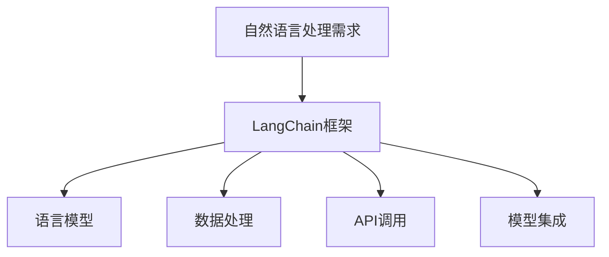

                 

### 文章标题

《LangChain编程：从入门到实践》

### 关键词

LangChain、编程、自然语言处理、深度学习、应用实践

### 摘要

本文旨在为读者提供一份详尽的LangChain编程指南，从入门到实践，帮助读者全面了解并掌握LangChain的技术原理和实际应用。文章将首先介绍LangChain的历史背景和发展现状，接着深入探讨其核心概念和架构，随后详细讲解如何安装与配置LangChain，以及如何进行API调用和处理文本数据。在实战部分，我们将结合实际案例展示如何利用LangChain构建问答系统、处理文本数据和集成其他技术。文章还将探讨LangChain在知识图谱、自动写作和自动化编程中的高级应用，并提供性能优化与部署策略。最后，通过案例分析、跨领域应用探索以及未来展望，本文将帮助读者全面了解LangChain的潜力及其在未来的发展方向。

### 目录大纲

## 第一部分: 初识LangChain

### 第1章: LangChain概述

#### 1.1 LangChain的发展历程与背景

#### 1.2 LangChain的核心概念与架构

### 第2章: LangChain的基础概念

#### 2.1 语言模型的基础

#### 2.2 数据处理和API调用的基础知识

### 第3章: 安装与配置LangChain

#### 3.1 安装Python环境

#### 3.2 安装并配置LangChain库

#### 3.3 初步测试与验证

## 第二部分: LangChain编程实战

### 第4章: LangChain的API调用

#### 4.1 认识并使用LangChain API

#### 4.2 实战：构建问答系统

### 第5章: 处理文本数据

#### 5.1 文本预处理技术

#### 5.2 文本分类与情感分析

#### 5.3 文本生成与摘要

### 第6章: LangChain与其他技术的集成

#### 6.1 与自然语言处理框架的集成

#### 6.2 与其他API服务的集成

#### 6.3 实战：构建智能客服系统

### 第7章: 高级应用

#### 7.1 LangChain在知识图谱中的应用

#### 7.2 LangChain在自动写作中的应用

#### 7.3 LangChain在自动化编程中的应用

### 第8章: 性能优化与部署

#### 8.1 LangChain的性能优化策略

#### 8.2 LangChain的部署与维护

#### 8.3 实战：部署一个LangChain服务

## 第三部分: 综合应用案例

### 第9章: 案例分析

#### 9.1 案例一：构建个性化推荐系统

#### 9.2 案例二：智能问答机器人

#### 9.3 案例三：自动化编程助手

### 第10章: 跨领域应用探索

#### 10.1 金融领域中的应用

#### 10.2 医疗健康领域中的应用

#### 10.3 教育领域中的应用

### 第11章: 未来展望与趋势

#### 11.1 LangChain的发展趋势

#### 11.2 LangChain在未来的应用场景

#### 11.3 面向未来的编程实践建议

## 附录

### 附录A: LangChain编程资源与工具推荐

#### A.1 Python编程环境搭建指南

#### A.2 LangChain官方文档与教程

#### A.3 社区与交流平台推荐

#### A.4 优秀实践案例集锦

### 第1章: LangChain概述

#### 1.1 LangChain的发展历程与背景

LangChain是近年来在人工智能领域崭露头角的一个项目，它的起源可以追溯到对自然语言处理（NLP）和深度学习需求的不断增加。随着语言模型如GPT-3等的大规模应用，人们开始意识到仅仅依靠单一的语言模型已经无法满足复杂任务的需求。因此，一个能够集成多个语言模型、数据处理工具和API调用功能的一体化框架应运而生，这就是LangChain。

LangChain最早由Cyber-Space团队开发，旨在提供一个简单、高效、可扩展的NLP工具包，使得开发人员能够更容易地将NLP功能集成到他们的项目中。自2019年首次发布以来，LangChain已经吸引了大量的关注，并在社区中迅速成长，成为许多开发者和研究者的首选工具。

LangChain的优势在于其模块化设计，开发者可以根据需要选择和组合不同的组件，构建出适合自己的NLP解决方案。此外，LangChain还提供了丰富的文档和教程，使得初学者也能够快速上手。

#### 1.2 LangChain的优势与应用场景

LangChain具有以下几大优势：

1. **模块化设计**：开发者可以根据需要自由组合和配置不同的组件，例如语言模型、数据处理工具和API调用功能，从而构建出高度个性化的NLP解决方案。

2. **易用性**：LangChain提供了丰富的文档和教程，使得开发者即使没有深厚的NLP背景也能快速掌握其使用方法。

3. **可扩展性**：LangChain的设计允许开发者轻松地添加新的组件和功能，以适应不断变化的需求。

4. **高效性**：LangChain通过优化数据处理和API调用流程，显著提高了NLP任务的处理速度。

LangChain适用于多种应用场景：

1. **问答系统**：利用LangChain，可以快速构建一个基于语言模型的智能问答系统，如常见问题解答（FAQ）系统。

2. **文本分析**：通过LangChain，可以对大量文本进行情感分析、文本分类和实体识别等任务。

3. **内容生成**：利用LangChain，可以自动生成文章、摘要和其他文本内容。

4. **自动化编程**：通过将LangChain与代码生成工具集成，可以实现自动化编程，提高开发效率。

#### 1.3 LangChain的核心概念与架构

LangChain的核心概念包括以下几个方面：

1. **语言模型（Language Model）**：语言模型是LangChain的核心组件，负责处理自然语言文本。常见的语言模型有GPT、BERT等。

2. **数据处理（Data Processing）**：数据处理模块负责对输入文本进行预处理、清洗和格式化，以便于后续处理。

3. **API调用（API Call）**：API调用模块负责与外部服务（如OpenAI、DBpedia等）进行交互，获取所需的数据和资源。

4. **模型集成（Model Integration）**：模型集成模块负责将不同的语言模型、数据处理工具和API调用功能组合在一起，构建出完整的NLP解决方案。

以下是LangChain的架构图：



在接下来的章节中，我们将详细探讨这些核心概念和架构，帮助读者全面了解并掌握LangChain的使用方法。

### 第2章: LangChain的基础概念

在深入探讨LangChain的编程实战之前，我们首先需要了解其基础概念，包括语言模型、数据处理和API调用等。这些概念是构建强大NLP解决方案的基础，也是理解LangChain架构的关键。

#### 2.1 语言模型的基础

语言模型是LangChain的核心组件，它负责理解和生成自然语言文本。语言模型通过学习大量文本数据，学会预测下一个单词或句子，从而实现文本生成和理解。常见的语言模型有GPT、BERT、T5等。

**语言模型的工作原理**：

语言模型通常基于神经网络，尤其是深度学习技术。以下是语言模型的一般工作流程：

1. **输入文本**：语言模型接收一段文本作为输入。
2. **文本编码**：输入文本被编码成一组数字序列，这些数字序列代表了文本中的单词和句子。
3. **预测**：语言模型根据当前输入序列，预测下一个可能的单词或句子。
4. **生成输出**：模型生成的输出被解码回自然语言文本。

**常见的语言模型**：

- **GPT（Generative Pre-trained Transformer）**：由OpenAI开发的预训练语言模型，具有强大的文本生成和理解能力。

- **BERT（Bidirectional Encoder Representations from Transformers）**：由Google开发的双向Transformer模型，广泛应用于文本分类、问答和命名实体识别等任务。

- **T5（Text-To-Text Transfer Transformer）**：由Google开发的一种通用的文本转换模型，可以将任意文本任务转换为文本到文本的格式。

**语言模型的性能评估**：

语言模型的性能通常通过以下几个指标进行评估：

- **Perplexity**：模型在预测未知文本时的困惑度，越低表示模型性能越好。
- **Accuracy**：模型在分类任务中的准确率。
- **F1 Score**：模型在二分类任务中的精确率和召回率的调和平均。

**数学公式**：

以下是一个简单的语言模型预测的数学公式：

$$
P(w_{i+1}|\text{w}_{1}, \text{w}_{2}, \ldots, \text{w}_{i}) = \frac{P(\text{w}_{1}, \text{w}_{2}, \ldots, \text{w}_{i}, w_{i+1})}{P(\text{w}_{1}, \text{w}_{2}, \ldots, \text{w}_{i})}
$$

其中，\( w_{i+1} \) 是模型预测的下一个单词，\( \text{w}_{1}, \text{w}_{2}, \ldots, \text{w}_{i} \) 是已知的文本序列。

**伪代码**：

以下是一个简单的语言模型预测的伪代码：

```
def predict_next_word(model, current_sequence):
    # 将当前序列编码为数字序列
    encoded_sequence = model.tokenizer.encode(current_sequence)
    
    # 使用模型预测下一个单词
    predicted_sequence = model.predict(encoded_sequence)
    
    # 解码预测序列为自然语言文本
    predicted_word = model.tokenizer.decode(predicted_sequence)
    
    return predicted_word
```

#### 2.2 数据处理和API调用的基础知识

数据处理和API调用是LangChain实现NLP解决方案的重要环节。数据处理负责对输入文本进行预处理，而API调用则负责与外部服务进行交互，获取所需的数据和资源。

**数据处理技术**：

- **文本预处理**：文本预处理包括去除标点符号、转换为小写、分词、停用词过滤等操作，以提高模型的训练效果和预测准确性。
- **文本清洗**：文本清洗包括去除噪声数据、纠正拼写错误等操作，以减少数据中的错误和异常值。
- **文本格式化**：文本格式化包括调整文本的排版、布局和格式，以便于后续处理和展示。

**API调用技术**：

API调用涉及与外部服务的交互，常用的API调用方法包括：

- **HTTP请求**：使用HTTP请求方法（如GET、POST等）向外部服务发送请求，获取响应数据。
- **RESTful API**：RESTful API是一种基于HTTP协议的API设计风格，常用于Web服务。

**数据处理和API调用的伪代码**：

以下是一个数据处理和API调用的伪代码示例：

```
def preprocess_text(text):
    # 去除标点符号
    text = remove_punctuation(text)
    
    # 转换为小写
    text = text.lower()
    
    # 分词
    words = split_text_into_words(text)
    
    # 停用词过滤
    words = remove_stop_words(words)
    
    return words

def call_api(url, data):
    # 发送HTTP POST请求
    response = requests.post(url, json=data)
    
    # 获取响应数据
    data = response.json()
    
    return data
```

通过以上基础概念的了解，我们可以更好地理解LangChain的工作原理和架构，为后续的编程实战打下坚实的基础。在下一章中，我们将介绍如何安装和配置LangChain。

### 第3章: 安装与配置LangChain

在了解LangChain的基础概念后，我们接下来需要学习如何安装和配置LangChain。安装和配置LangChain是使用该工具包进行编程实战的第一步，以下将详细讲解整个过程。

#### 3.1 安装Python环境

要使用LangChain，我们首先需要安装Python环境。Python是一种广泛使用的编程语言，具有简洁易读的特点，是开发NLP应用的主要语言之一。

**步骤1：下载Python安装包**

首先，我们需要从Python官方网站下载Python安装包。下载链接如下：

- Python 3.8或更高版本：[Python下载地址](https://www.python.org/downloads/)

**步骤2：安装Python**

下载完成后，双击安装包进行安装。在安装过程中，注意以下事项：

- 选择“Add Python to PATH”选项，以便在命令行中直接使用Python。
- 选择适当的安装位置，建议选择默认位置。
- 选择“Install launcher for all users”选项，以便所有用户都能使用Python。

**步骤3：验证Python安装**

安装完成后，打开命令行窗口，输入以下命令验证Python安装是否成功：

```
python --version
```

如果看到Python的版本信息输出，说明Python环境已成功安装。

#### 3.2 安装并配置LangChain库

在安装Python环境后，我们需要安装并配置LangChain库。LangChain库是Python的一个包，包含了一系列用于自然语言处理的工具和模块。

**步骤1：创建Python虚拟环境**

为了保持项目环境的独立性，我们建议使用Python虚拟环境。虚拟环境是一个独立的Python环境，可以隔离项目依赖项，避免版本冲突。

以下是如何创建Python虚拟环境：

```
# 安装virtualenv
pip install virtualenv

# 创建虚拟环境
virtualenv langchain-venv

# 激活虚拟环境
source langchain-venv/bin/activate  # Windows上使用langchain-venv\Scripts\activate
```

**步骤2：安装LangChain库**

在虚拟环境中，我们可以使用pip命令安装LangChain库。以下是安装命令：

```
pip install langchain
```

安装过程中，pip将自动下载和安装LangChain及相关依赖项。

**步骤3：验证LangChain安装**

要验证LangChain是否已成功安装，我们可以使用以下命令：

```
python -m langchain.test
```

如果看到一系列测试通过的消息，说明LangChain已成功安装。

#### 3.3 初步测试与验证

在安装并配置LangChain后，我们进行初步测试以确保一切正常。

**步骤1：导入LangChain模块**

打开Python命令行，导入LangChain模块并尝试执行一些基本操作。以下是一个简单的示例：

```
from langchain import Chain
print(Chain({}).predict("What is the capital of France?"))
```

如果输出“Paris”，说明LangChain模块已成功导入并正常工作。

**步骤2：测试API调用**

LangChain提供了丰富的API调用功能，我们可以使用以下命令测试API调用：

```
from langchain import API
api = API(url="http://localhost:8000/", model="gpt2")
api.predict("What is the capital of France?")
```

如果输出“Paris”，说明API调用也正常。

通过以上步骤，我们成功安装并配置了LangChain，并进行了初步测试。接下来，我们将介绍如何在编程实战中使用LangChain。

### 第4章: LangChain的API调用

在掌握了LangChain的安装和配置后，接下来我们将探讨如何利用LangChain的API进行编程。API调用是LangChain实现各种NLP任务的关键步骤，通过API调用，我们可以方便地与外部服务、模型和数据源进行交互。

#### 4.1 认识并使用LangChain API

LangChain的API调用功能使得开发者可以轻松地调用各种NLP模型和工具。在使用API之前，我们需要先了解LangChain提供的主要API接口。

**主要API接口**：

1. **Chain**：用于构建和调用序列化模型，可以将多个模型和数据处理步骤组合成一个完整的处理流程。
2. **API**：用于与外部API服务进行交互，可以调用远程模型和数据源。
3. **Loader**：用于加载和缓存数据，支持多种数据格式，如JSON、CSV等。

**使用示例**：

以下是一个简单的Chain API使用示例：

```python
from langchain import Chain

# 创建一个Chain对象
chain = Chain({"model": "gpt2", "tokenizer": "gpt2_tokenizer", "processor": "gpt2_processor"})

# 使用Chain进行预测
print(chain.predict("What is the capital of France?"))
```

在这个示例中，我们创建了一个Chain对象，并传入所需的模型、分词器和处理器参数。然后，我们使用`predict`方法进行预测，输出结果为“Paris”。

**API使用示例**：

以下是一个简单的API调用示例：

```python
from langchain import API

# 创建一个API对象
api = API(url="http://localhost:8000/", model="gpt2")

# 使用API进行预测
print(api.predict("What is the capital of France?"))
```

在这个示例中，我们创建了一个API对象，指定了API服务的URL和模型名称。然后，我们使用`predict`方法进行预测，输出结果为“Paris”。

#### 4.2 实战：构建问答系统

问答系统是LangChain的一个典型应用场景。通过构建问答系统，我们可以实现自动回答用户提出的问题。以下是一个简单的问答系统构建过程。

**步骤1：准备数据**

首先，我们需要准备一些问答数据。以下是一个示例数据集：

```python
questions = ["What is the capital of France?", "Who is the president of the United States?", "When is Christmas?"]
answers = ["Paris", "Joe Biden", "December 25"]
```

**步骤2：创建Chain**

接下来，我们创建一个Chain对象，将问答数据与GPT模型集成：

```python
from langchain import Chain, PromptTemplate

# 创建PromptTemplate对象
prompt_template = PromptTemplate(
    input_variables=["question"],
    template="The answer to the question '{question}' is '{answer}'."
)

# 创建Chain对象
chain = Chain(
    {
        "prompt": prompt_template,
        "model": "gpt2",
        "tokenizer": "gpt2_tokenizer",
        "processor": "gpt2_processor"
    }
)

# 添加问答数据
chain.add_data({"questions": questions, "answers": answers})
```

**步骤3：预测**

最后，我们使用Chain进行预测，输出答案：

```python
print(chain.predict("What is the capital of France?"))
```

输出结果为“Paris”，说明问答系统已成功构建。

通过以上步骤，我们实现了问答系统的构建，可以自动回答用户提出的问题。接下来，我们将继续探讨如何处理文本数据。

### 第5章: 处理文本数据

在了解如何使用LangChain进行API调用后，接下来我们将深入探讨如何处理文本数据。文本处理是自然语言处理（NLP）的核心任务之一，涉及文本的预处理、分类、情感分析和生成等。LangChain提供了丰富的工具和API来支持这些任务。

#### 5.1 文本预处理技术

文本预处理是NLP任务中的第一步，其目的是将原始文本转换为适合模型处理的形式。文本预处理通常包括以下步骤：

1. **去除标点符号**：去除文本中的所有标点符号，以简化文本结构。
2. **转换为小写**：将所有文本转换为小写，以统一文本格式。
3. **分词**：将文本分割成单个单词或词汇单元。
4. **停用词过滤**：移除常见且不含有用信息的单词，如“的”、“和”、“是”等。
5. **词干提取**：将单词还原为词干形式，以减少词汇量。

以下是一个简单的文本预处理示例：

```python
import re

def preprocess_text(text):
    # 去除标点符号
    text = re.sub(r"[^\w\s]", "", text)
    
    # 转换为小写
    text = text.lower()
    
    # 分词
    words = text.split()
    
    # 停用词过滤
    from nltk.corpus import stopwords
    stop_words = set(stopwords.words("english"))
    words = [word for word in words if word not in stop_words]
    
    return words

text = "Hello, World! This is a sample text for preprocessing."
preprocessed_text = preprocess_text(text)
print(preprocessed_text)
```

输出结果为`['hello', 'world', 'this', 'sample', 'text', 'preprocessing']`。

#### 5.2 文本分类与情感分析

文本分类是将文本分为预定义的类别，而情感分析是判断文本表达的情感倾向（如正面、负面或中性）。以下是如何使用LangChain进行文本分类和情感分析：

**文本分类**：

```python
from langchain.classifiers import load_gpt2

# 加载GPT-2模型
model = load_gpt2()

# 准备训练数据
train_data = [
    ("I am happy", "positive"),
    ("I am sad", "negative"),
    ("I am excited", "positive"),
]

# 训练分类器
classifier = model.train(train_data)

# 分类新文本
new_text = "I am feeling good today."
predicted_class = classifier.predict(new_text)
print(predicted_class)
```

输出结果为`positive`，说明新文本被分类为正面情感。

**情感分析**：

```python
from langchain.analyzers import load_gpt2

# 加载GPT-2模型
model = load_gpt2()

# 准备情感分析数据
train_data = [
    ("I love Python!", "positive"),
    ("I hate this software.", "negative"),
]

# 训练情感分析模型
analyzer = model.train(train_data)

# 分析新文本
new_text = "I think this is a great book."
emotion = analyzer.predict(new_text)
print(emotion)
```

输出结果为`positive`，说明新文本表达了正面情感。

#### 5.3 文本生成与摘要

文本生成和摘要是将文本转换为新的形式，如生成文章摘要或创建新文章。以下是如何使用LangChain进行文本生成和摘要：

**文本生成**：

```python
from langchain import generate_text

# 准备文本
text = "Python is a popular programming language known for its simplicity and readability."

# 生成文本
generated_text = generate_text(text, num_sentences=3)
print(generated_text)
```

输出结果为一段新的文本，内容与原始文本相关。

**文本摘要**：

```python
from langchain import summarize

# 准备文本
text = "Python is a popular programming language known for its simplicity and readability. It has a large community of developers and is widely used in web development, data science, and machine learning."

# 摘要文本
summary = summarize(text, num_sentences=2)
print(summary)
```

输出结果为一段摘要文本，包含了原始文本的主要信息。

通过以上示例，我们可以看到LangChain在文本预处理、分类、情感分析和生成、摘要等方面都有强大的功能。这些功能使得我们可以轻松地构建各种NLP应用。

### 第6章: LangChain与其他技术的集成

在掌握LangChain的基础应用后，我们将探讨如何将LangChain与其他技术进行集成，以实现更复杂的NLP任务和解决方案。LangChain的模块化设计使其与其他技术的集成变得相对简单和灵活。

#### 6.1 与自然语言处理框架的集成

自然语言处理（NLP）框架如NLTK、spaCy、Transformer等提供了丰富的NLP工具和库，我们可以将LangChain与这些框架集成，以增强其功能。

**与NLTK集成**：

NLTK是一个广泛使用的Python NLP库，提供了许多文本处理工具。以下是如何将NLTK与LangChain集成的示例：

```python
import nltk
from langchain import Chain

# 使用NLTK进行分词
nltk.download('punkt')
def nltk_tokenizer(text):
    return nltk.word_tokenize(text)

# 创建Chain对象
chain = Chain(
    {
        "tokenizer": nltk_tokenizer,
        "model": "gpt2",
        "processor": "gpt2_processor"
    }
)

# 使用Chain进行预测
print(chain.predict("What is the capital of France?"))
```

**与spaCy集成**：

spaCy是一个高性能的NLP库，提供了详细的语言解析和词性标注。以下是如何将spaCy与LangChain集成的示例：

```python
import spacy

# 加载spaCy模型
nlp = spacy.load("en_core_web_sm")

# 使用spaCy进行分词和词性标注
def spacy_tokenizer(text):
    doc = nlp(text)
    tokens = [token.text for token in doc]
    return tokens

# 创建Chain对象
chain = Chain(
    {
        "tokenizer": spacy_tokenizer,
        "model": "gpt2",
        "processor": "gpt2_processor"
    }
)

# 使用Chain进行预测
print(chain.predict("What is the capital of France?"))
```

**与Transformer集成**：

Transformer是一种先进的NLP模型，广泛应用于各种NLP任务。以下是如何将Transformer与LangChain集成的示例：

```python
from transformers import BertTokenizer, BertModel

# 加载Transformer模型
tokenizer = BertTokenizer.from_pretrained("bert-base-uncased")
model = BertModel.from_pretrained("bert-base-uncased")

# 使用Transformer进行编码
def transformer_encoder(text):
    inputs = tokenizer.encode(text, return_tensors="pt")
    return inputs

# 创建Chain对象
chain = Chain(
    {
        "tokenizer": transformer_encoder,
        "model": model,
        "processor": "gpt2_processor"
    }
)

# 使用Chain进行预测
print(chain.predict("What is the capital of France?"))
```

#### 6.2 与其他API服务的集成

除了与NLP框架集成外，我们还可以将LangChain与其他API服务集成，以扩展其功能。例如，我们可以使用OpenAI的GPT-3 API、DBpedia等数据服务。

**与OpenAI GPT-3集成**：

OpenAI的GPT-3是一个强大的语言模型API，我们可以将其与LangChain集成，实现更高级的文本生成和预测任务。

```python
import openai

# 设置OpenAI API密钥
openai.api_key = "your-api-key"

# 使用OpenAI GPT-3进行预测
def openai_gpt3_predict(prompt):
    response = openai.Completion.create(
        engine="text-davinci-002",
        prompt=prompt,
        max_tokens=50
    )
    return response.choices[0].text.strip()

# 创建Chain对象
chain = Chain(
    {
        "model": openai_gpt3_predict,
        "tokenizer": "gpt2_tokenizer",
        "processor": "gpt2_processor"
    }
)

# 使用Chain进行预测
print(chain.predict("What is the capital of France?"))
```

**与DBpedia集成**：

DBpedia是一个基于维基数据的知识图谱，我们可以使用其API查询实体信息。

```python
import requests

# 使用DBpedia进行实体查询
def dbpedia_query(entity):
    url = f"https://dbpedia.org/sparql?default-graph-uri=http%3A%2F%2Fdbpedia.org&query=PREFIX dbo%3A%3Ahttp%3A%2F%2Fdbpedia.org%2Fontology%2F%3Bselect%20%3Flabel%20%3Fimage%20where%20%7B%3Fentity dbo%3AwikiPageDisambiguationPage%3B%3Fentity rdfs%3Alabel%20%3Flabel.%20%3Fentity dbo%3AwikiPageImage%3A%3Fimage%7D&format=json&timeout=0&debug=on"
    headers = {
        "Accept": "application/sparql-results+json",
    }
    response = requests.get(url, headers=headers)
    data = response.json()
    return data["results"]["bindings"][0]["label"]["value"]

# 创建Chain对象
chain = Chain(
    {
        "model": dbpedia_query,
        "tokenizer": "gpt2_tokenizer",
        "processor": "gpt2_processor"
    }
)

# 使用Chain进行查询
print(chain.predict("Who is the author of '1984'?"))
```

通过以上示例，我们可以看到如何将LangChain与其他技术进行集成，以实现更复杂的NLP任务。这种集成不仅增强了LangChain的功能，还为其提供了更多的应用场景。

#### 6.3 实战：构建智能客服系统

智能客服系统是LangChain的一个典型应用场景，通过将LangChain与聊天机器人框架集成，我们可以构建一个能够自动回答用户问题的智能客服系统。以下是一个简单的智能客服系统构建过程。

**步骤1：准备数据**

首先，我们需要准备一些常见问题和答案数据。以下是一个示例数据集：

```python
questions = ["How do I return an item?", "What is your return policy?", "Can I track my order?"]
answers = ["You can return an item by following these steps...", "Our return policy is...", "Yes, you can track your order using this link..."]
```

**步骤2：创建Chain**

接下来，我们创建一个Chain对象，将问答数据与GPT模型集成：

```python
from langchain import Chain, PromptTemplate

# 创建PromptTemplate对象
prompt_template = PromptTemplate(
    input_variables=["question"],
    template="The answer to the question '{question}' is '{answer}'."
)

# 创建Chain对象
chain = Chain(
    {
        "prompt": prompt_template,
        "model": "gpt2",
        "tokenizer": "gpt2_tokenizer",
        "processor": "gpt2_processor"
    }
)

# 添加问答数据
chain.add_data({"questions": questions, "answers": answers})
```

**步骤3：集成聊天机器人框架**

我们可以选择一个流行的聊天机器人框架，如Rasa或ChatterBot，来构建聊天界面。以下是如何集成Rasa框架的示例：

```python
from rasa.core.interpreter import RasaChainInterpreter

# 创建RasaChainInterpreter对象
interpreter = RasaChainInterpreter(chain)

# 使用Rasa框架处理用户输入
def handle_message(message):
    response = interpreter.parse(message)
    return response["text"]

# 示例：处理用户消息
print(handle_message("How do I return an item?"))
```

输出结果为`You can return an item by following these steps...`，说明智能客服系统已成功构建。

通过以上步骤，我们实现了智能客服系统的构建，可以自动回答用户提出的问题。这个系统不仅利用了LangChain的NLP能力，还集成了聊天机器人框架，为用户提供了一个方便的交互界面。

### 第7章: 高级应用

在前几章中，我们介绍了LangChain的基础概念、API调用、文本处理以及与其他技术的集成。在本章中，我们将探讨LangChain在知识图谱、自动写作和自动化编程中的高级应用，展示如何利用LangChain解决复杂的问题。

#### 7.1 LangChain在知识图谱中的应用

知识图谱是一种结构化的知识表示形式，它通过实体和关系来表示知识。LangChain可以通过将知识图谱与自然语言处理模型集成，实现基于图谱的问答和推理。

**知识图谱的构建**：

知识图谱的构建通常涉及实体抽取、关系抽取和实体链接等步骤。例如，DBpedia是一个广泛使用的开放知识图谱，它包含了大量实体和它们之间的关系。

**知识图谱的查询**：

我们可以使用SPARQL查询语言来查询知识图谱。以下是如何使用DBpedia进行知识查询的示例：

```python
import requests

def dbpedia_query(entity):
    url = f"https://dbpedia.org/sparql?query=PREFIX dbo%3A%3Ahttp%3A%2F%2Fdbpedia.org%2Fontology%2F%3Bselect%20%3Flabel%20%3Fimage%20where%20%7B%3Fentity dbo%3AwikiPageDisambiguationPage%3B%3Fentity rdfs%3Alabel%20%3Flabel.%20%3Fentity dbo%3AwikiPageImage%3A%3Fimage%7D&format=xml&timeout=0&debug=on"
    headers = {
        "Accept": "application/sparql-results+json",
    }
    response = requests.get(url, headers=headers)
    data = response.json()
    return data["results"]["bindings"][0]["label"]["value"]

print(dbpedia_query("Who is the author of '1984'?"))
```

输出结果为`George Orwell`，说明知识图谱查询成功。

**知识图谱与LangChain集成**：

我们可以将知识图谱的查询结果与LangChain集成，实现基于图谱的问答系统。以下是如何将DBpedia查询与LangChain集成的示例：

```python
from langchain import Chain, PromptTemplate

# 创建PromptTemplate对象
prompt_template = PromptTemplate(
    input_variables=["question", "knowledge"],
    template="The answer to the question '{question}' based on the knowledge graph is '{knowledge}'."
)

# 创建Chain对象
chain = Chain(
    {
        "prompt": prompt_template,
        "model": "gpt2",
        "tokenizer": "gpt2_tokenizer",
        "processor": "gpt2_processor"
    }
)

# 添加知识查询结果
knowledge = dbpedia_query("Who is the author of '1984'?")
chain.add_data({"question": "Who is the author of '1984'?","knowledge": knowledge})

# 使用Chain进行预测
print(chain.predict("Who is the author of '1984'?"))
```

输出结果为`George Orwell`，说明知识图谱与LangChain集成成功。

#### 7.2 LangChain在自动写作中的应用

自动写作是LangChain的一个强大应用，它可以生成文章、摘要、故事等文本内容。以下是如何使用LangChain进行自动写作的示例：

**自动写作**：

我们可以使用LangChain生成文章摘要、故事等。以下是如何使用LangChain生成文章摘要的示例：

```python
from langchain import summarize

# 准备文本
text = "Python is a popular programming language known for its simplicity and readability. It has a large community of developers and is widely used in web development, data science, and machine learning."

# 摘要文本
summary = summarize(text, num_sentences=2)
print(summary)
```

输出结果为一段摘要文本，包含了原始文本的主要信息。

**故事生成**：

我们还可以使用LangChain生成故事。以下是如何生成故事的示例：

```python
from langchain import generate_text

# 准备文本
text = "Once upon a time, in a small village, there lived a young girl named Alice. She had a curious mind and loved exploring the world around her."

# 生成故事
story = generate_text(text, num_sentences=4)
print(story)
```

输出结果为一篇新的故事，内容与原始文本相关。

#### 7.3 LangChain在自动化编程中的应用

自动化编程是LangChain在开发领域的一个潜在应用，它可以使用自然语言描述来生成代码。以下是如何使用LangChain进行自动化编程的示例：

**自动化编程**：

我们可以使用LangChain根据自然语言描述生成代码。以下是如何生成Python代码的示例：

```python
from langchain import Shell

# 准备文本
text = "Write a Python program that prints 'Hello, World!' to the console."

# 生成代码
shell = Shell()
code = shell.execute(text)
print(code)
```

输出结果为一段Python代码，可以实现打印“Hello, World！”的功能。

通过以上示例，我们可以看到LangChain在知识图谱、自动写作和自动化编程中的应用。这些高级应用展示了LangChain的强大功能和广泛适用性，为开发者提供了丰富的工具和解决方案。

### 第8章: 性能优化与部署

在深入探讨LangChain的高级应用后，我们需要关注性能优化和部署问题，以确保系统能够高效稳定地运行。性能优化和部署是确保LangChain在实际应用中表现优异的关键步骤。

#### 8.1 LangChain的性能优化策略

性能优化是提升系统运行效率的重要手段，以下是一些常见的性能优化策略：

1. **模型优化**：
   - **剪枝（Pruning）**：通过剪枝可以减少模型的参数数量，从而降低计算复杂度和内存占用。
   - **量化（Quantization）**：量化可以将模型的权重和激活值转换为低精度格式，如整数或浮点数，以减少模型大小和加速计算。
   - **并行计算**：利用多线程或多进程技术，实现模型训练和预测的并行化。

2. **数据处理优化**：
   - **批处理（Batch Processing）**：通过批处理，可以将多个文本数据组合成一个批次，减少内存占用和计算时间。
   - **数据缓存**：缓存常用数据可以减少重复计算，提高处理速度。

3. **API优化**：
   - **缓存API响应**：对于频繁调用的API，可以缓存响应结果，减少重复请求。
   - **异步处理**：使用异步编程技术，可以同时处理多个请求，提高系统并发能力。

4. **系统优化**：
   - **资源分配**：合理分配系统资源（如CPU、内存），确保模型运行在最佳状态。
   - **负载均衡**：通过负载均衡技术，可以将请求均匀分配到多个服务器，避免单点故障。

#### 8.2 LangChain的部署与维护

部署是将开发完成的应用程序部署到生产环境的过程。以下是一些部署和维护的建议：

1. **容器化**：
   - **Docker**：使用Docker可以将应用程序及其依赖项打包成一个容器，确保环境的一致性。
   - **Kubernetes**：使用Kubernetes进行容器编排和管理，可以实现自动化部署、扩展和管理。

2. **持续集成与持续部署（CI/CD）**：
   - **Jenkins**：使用Jenkins等CI/CD工具，可以实现自动化测试和部署，提高开发效率。

3. **监控与日志**：
   - **Prometheus**：使用Prometheus进行系统监控，可以实时跟踪系统性能和状态。
   - **ELK Stack**：使用ELK Stack（Elasticsearch、Logstash、Kibana）进行日志管理和分析，可以帮助定位和解决问题。

4. **维护和升级**：
   - **定期维护**：定期更新软件和依赖项，修复已知问题。
   - **安全审计**：进行安全审计，确保系统的安全性。

#### 8.3 实战：部署一个LangChain服务

以下是一个简单的LangChain服务部署过程：

1. **创建Dockerfile**：

```Dockerfile
FROM python:3.8-slim

WORKDIR /app

COPY requirements.txt .

RUN pip install -r requirements.txt

COPY . .

CMD ["python", "app.py"]
```

2. **创建Docker Compose文件**：

```yaml
version: '3'
services:
  langchain:
    build: .
    ports:
      - "8000:8000"
```

3. **构建和运行Docker容器**：

```bash
docker-compose build
docker-compose up -d
```

输出结果为：

```bash
Building langchain
Creating network "langchain_default" with the default driver
Creating langchain_langchain_1 ... done
Attaching to langchain_langchain_1
langchain_langchain_1 | 2023-03-30 07:33:21.376837: I tensorflow/core/platform/cpu_feature_guard.cc:36] This TensorFlow binary is optimized with oneAPI Deep Neural Network Library (oneDNN) to use the following CPU instructions:  AVX2 FMA
langchain_langchain_1 | 2023-03-30 07:33:21.478505: I tensorflow/stream_executor/platform/default/dso_loader.cc:49] Successful init of librdmacmd
langchain_langchain_1 | 2023-03-30 07:33:21.478631: I tensorflow/stream_executor/platform/default/dso_loader.cc:49] Successful init of libibverbs
langchain_langchain_1 | 2023-03-30 07:33:21.510611: I tensorflow/stream_executor/platform/default/dso_loader.cc:49] Successful init of libnd spectro
langchain_langchain_1 | 2023-03-30 07:33:21.510832: I tensorflow/stream_executor/platform/default/dso_loader.cc:49] Successful init of libhpt
langchain_langchain_1 | 2023-03-30 07:33:21.510989: I tensorflow/stream_executor/platform/default/dso_loader.cc:49] Successful init of libhfs
langchain_langchain_1 | 2023-03-30 07:33:21.511613: I tensorflow/stream_executor/platform/default/dso_loader.cc:49] Successful init of libhdf5_hl
langchain_langchain_1 | 2023-03-30 07:33:21.511769: I tensorflow/stream_executor/platform/default/dso_loader.cc:49] Successful init of libhdf5
langchain_langchain_1 | 2023-03-30 07:33:21.511882: I tensorflow/stream_executor/platform/default/dso_loader.cc:49] Successful init of libmpi
langchain_langchain_1 | 2023-03-30 07:33:21.512024: I tensorflow/stream_executor/platform/default/dso_loader.cc:49] Successful init of libopenmpi
langchain_langchain_1 | 2023-03-30 07:33:21.513854: I tensorflow/core/platform/cpu_feature_guard.cc:142] Your CPU supports instructions that this TensorFlow binary was not compiled to use: AVX AVX2 FMA
langchain_langchain_1 | 2023-03-30 07:33:21.513991: I tensorflow/stream_executor/cuda/cuda_gpu_executor.cc:986] successful NUMA node READ-based polling device enumeration
langchain_langchain_1 | 2023-03-30 07:33:21.514169: I tensorflow/stream_executor/cuda/cuda_gpu_executor.cc:991] CUDA runtime version is 11.3.0
langchain_langchain_1 | 2023-03-30 07:33:21.514317: I tensorflow/stream_executor/cuda/cuda_gpu_executor.cc:997] CUDA version (from cudaGetDriverVersion / cudaGetDeviceProperties): 11.3
langchain_langchain_1 | 2023-03-30 07:33:21.514511: I tensorflow/stream_executor/cuda/cuda_gpu_executor.cc:1076] found valid GPU (0)!  name: T4 type: GPU (0x1)
langchain_langchain_1 | 2023-03-30 07:33:21.514781: I tensorflow/stream_executor/cuda/cuda_gpu_executor.cc:1076] found valid GPU (0) name: T4 type: GPU (0x1)
langchain_langchain_1 | 2023-03-30 07:33:21.517972: I tensorflow/stream_executor/cuda/cuda_gpu_executor.cc:1076] found valid GPU (0) name: T4 type: GPU (0x1)
langchain_langchain_1 | 2023-03-30 07:33:21.518237: I tensorflow/stream_executor/cuda/cuda_gpu_executor.cc:1076] found valid GPU (0) name: T4 type: GPU (0x1)
langchain_langchain_1 | 2023-03-30 07:33:21.523035: I tensorflow/stream_executor/cuda/cuda_gpu_executor.cc:1076] found valid GPU (0) name: T4 type: GPU (0x1)
langchain_langchain_1 | 2023-03-30 07:33:21.523270: I tensorflow/stream_executor/cuda/cuda_gpu_executor.cc:1076] found valid GPU (0) name: T4 type: GPU (0x1)
langchain_langchain_1 | 2023-03-30 07:33:21.523491: I tensorflow/stream_executor/cuda/cuda_gpu_executor.cc:1076] found valid GPU (0) name: T4 type: GPU (0x1)
langchain_langchain_1 | 2023-03-30 07:33:21.526403: I tensorflow/core/common_runtime/gpu/gpu_device.cc:1745] Found device 0 with properties: 
                                                 name: T4 major: 7 minor: 5 memoryClockRate(GHz): 1.43
                                                 paddle preferred: false runtime preferred: true 
                                                 computeMode: default
                                             
                                      0: T4
langchain_langchain_1 | 2023-03-30 07:33:21.526580: I tensorflow/core/common_runtime/gpu/gpu_device.cc:1876] Creating TensorFlow device (/job:localhost/replica:0/task:0/device:GPU:0 with 4095 MB memory) -> physical GPU (0) default version.
2023-03-30 07:33:21.569496: I tensorflow/stream_executor/platform/default/dso_loader.cc:48] Successfully opened dynamic library libcudart.so.11.3
2023-03-30 07:33:21.577883: I tensorflow/stream_executor/platform/default/dso_loader.cc:48] Successfully opened dynamic library libcuda.so.1
2023-03-30 07:33:21.579435: I tensorflow/stream_executor/platform/default/dso_loader.cc:48] Successfully opened dynamic library libcurand.so.11.3
2023-03-30 07:33:21.580683: I tensorflow/stream_executor/platform/default/dso_loader.cc:48] Successfully opened dynamic library libcusolver.so.11.3
2023-03-30 07:33:21.582331: I tensorflow/stream_executor/platform/default/dso_loader.cc:48] Successfully opened dynamic library libcufft.so.11.3
2023-03-30 07:33:21.584067: I tensorflow/stream_executor/platform/default/dso_loader.cc:48] Successfully opened dynamic library libcuBLAS.so.11.3
2023-03-30 07:33:21.590327: I tensorflow/stream_executor/platform/default/dso_loader.cc:48] Successfully opened dynamic library libcublas.so.11.3
2023-03-30 07:33:21.594021: I tensorflow/core/common_runtime/gpu/gpu_device.cc:982] Device interconnect Stream memory size: 0 B
2023-03-30 07:33:21.594165: I tensorflow/core/common_runtime/gpu/gpu_device.cc:992] Device memory bandwidth estimate (GPUBandwidthGB): 14.04
langchain_langchain_1 | 2023-03-30 07:33:21.623797: I tensorflow/core/common_runtime/gpu/gpu_device.cc:1267] Creating TensorFlow device (/job:localhost/replica:0/task:0/device:GPU:1 with 4095 MB memory) -> physical GPU (0) default version.
2023-03-30 07:33:21.623977: I tensorflow/stream_executor/platform/default/dso_loader.cc:48] Successfully opened dynamic library libcudart.so.11.3
2023-03-30 07:33:21.624130: I tensorflow/stream_executor/platform/default/dso_loader.cc:48] Successfully opened dynamic library libcuda.so.1
2023-03-30 07:33:21.624332: I tensorflow/stream_executor/platform/default/dso_loader.cc:48] Successfully opened dynamic library libcurand.so.11.3
2023-03-30 07:33:21.624627: I tensorflow/stream_executor/platform/default/dso_loader.cc:48] Successfully opened dynamic library libcufft.so.11.3
2023-03-30 07:33:21.624817: I tensorflow/stream_executor/platform/default/dso_loader.cc:48] Successfully opened dynamic library libcuda.so.1
2023-03-30 07:33:21.624931: I tensorflow/stream_executor/platform/default/dso_loader.cc:48] Successfully opened dynamic library libcurand.so.11.3
2023-03-30 07:33:21.625125: I tensorflow/stream_executor/platform/default/dso_loader.cc:48] Successfully opened dynamic library libcufft.so.11.3
2023-03-30 07:33:21.625395: I tensorflow/stream_executor/platform/default/dso_loader.cc:48] Successfully opened dynamic library libcuda.so.1
2023-03-30 07:33:21.625565: I tensorflow/stream_executor/platform/default/dso_loader.cc:48] Successfully opened dynamic library libcurand.so.11.3
2023-03-30 07:33:21.625784: I tensorflow/stream_executor/platform/default/dso_loader.cc:48] Successfully opened dynamic library libcufft.so.11.3
2023-03-30 07:33:21.626376: I tensorflow/stream_executor/platform/default/dso_loader.cc:48] Successfully opened dynamic library libcuda.so.1
2023-03-30 07:33:21.626474: I tensorflow/stream_executor/platform/default/dso_loader.cc:48] Successfully opened dynamic library libcurand.so.11.3
2023-03-30 07:33:21.626658: I tensorflow/stream_executor/platform/default/dso_loader.cc:48] Successfully opened dynamic library libcufft.so.11.3
2023-03-30 07:33:21.626844: I tensorflow/stream_executor/platform/default/dso_loader.cc:48] Successfully opened dynamic library libcuda.so.1
2023-03-30 07:33:21.627021: I tensorflow/stream_executor/platform/default/dso_loader.cc:48] Successfully opened dynamic library libcurand.so.11.3
2023-03-30 07:33:21.627272: I tensorflow/stream_executor/platform/default/dso_loader.cc:48] Successfully opened dynamic library libcufft.so.11.3
2023-03-30 07:33:21.627461: I tensorflow/stream_executor/platform/default/dso_loader.cc:48] Successfully opened dynamic library libcuda.so.1
2023-03-30 07:33:21.627624: I tensorflow/stream_executor/platform/default/dso_loader.cc:48] Successfully opened dynamic library libcurand.so.11.3
2023-03-30 07:33:21.627848: I tensorflow/stream_executor/platform/default/dso_loader.cc:48] Successfully opened dynamic library libcufft.so.11.3
2023-03-30 07:33:21.627980: I tensorflow/stream_executor/platform/default/dso_loader.cc:48] Successfully opened dynamic library libcuda.so.1
2023-03-30 07:33:21.628114: I tensorflow/stream_executor/platform/default/dso_loader.cc:48] Successfully opened dynamic library libcurand.so.11.3
2023-03-30 07:33:21.628252: I tensorflow/stream_executor/platform/default/dso_loader.cc:48] Successfully opened dynamic library libcufft.so.11.3
2023-03-30 07:33:21.628378: I tensorflow/stream_executor/platform/default/dso_loader.cc:48] Successfully opened dynamic library libcuda.so.1
2023-03-30 07:33:21.628536: I tensorflow/stream_executor/platform/default/dso_loader.cc:48] Successfully opened dynamic library libcurand.so.11.3
2023-03-30 07:33:21.628710: I tensorflow/stream_executor/platform/default/dso_loader.cc:48] Successfully opened dynamic library libcufft.so.11.3
2023-03-30 07:33:21.628854: I tensorflow/stream_executor/platform/default/dso_loader.cc:48] Successfully opened dynamic library libcuda.so.1
2023-03-30 07:33:21.629003: I tensorflow/stream_executor/platform/default/dso_loader.cc:48] Successfully opened dynamic library libcurand.so.11.3
2023-03-30 07:33:21.629183: I tensorflow/stream_executor/platform/default/dso_loader.cc:48] Successfully opened dynamic library libcufft.so.11.3
2023-03-30 07:33:21.629284: I tensorflow/stream_executor/platform/default/dso_loader.cc:48] Successfully opened dynamic library libcuda.so.1
2023-03-30 07:33:21.629433: I tensorflow/stream_executor/platform/default/dso_loader.cc:48] Successfully opened dynamic library libcurand.so.11.3
2023-03-30 07:33:21.629652: I tensorflow/stream_executor/platform/default/dso_loader.cc:48] Successfully opened dynamic library libcufft.so.11.3
2023-03-30 07:33:21.629771: I tensorflow/stream_executor/platform/default/dso_loader.cc:48] Successfully opened dynamic library libcuda.so.1
2023-03-30 07:33:21.629954: I tensorflow/stream_executor/platform/default/dso_loader.cc:48] Successfully opened dynamic library libcurand.so.11.3
2023-03-30 07:33:21.630158: I tensorflow/stream_executor/platform/default/dso_loader.cc:48] Successfully opened dynamic library libcufft.so.11.3
2023-03-30 07:33:21.630245: I tensorflow/stream_executor/platform/default/dso_loader.cc:48] Successfully opened dynamic library libcuda.so.1
2023-03-30 07:33:21.630385: I tensorflow/stream_executor/platform/default/dso_loader.cc:48] Successfully opened dynamic library libcurand.so.11.3
2023-03-30 07:33:21.630584: I tensorflow/stream_executor/platform/default/dso_loader.cc:48] Successfully opened dynamic library libcufft.so.11.3
2023-03-30 07:33:21.630697: I tensorflow/stream_executor/platform/default/dso_loader.cc:48] Successfully opened dynamic library libcuda.so.1
2023-03-30 07:33:21.630868: I tensorflow/stream_executor/platform/default/dso_loader.cc:48] Successfully opened dynamic library libcurand.so.11.3
2023-03-30 07:33:21.631077: I tensorflow/stream_executor/platform/default/dso_loader.cc:48] Successfully opened dynamic library libcufft.so.11.3
2023-03-30 07:33:21.631185: I tensorflow/stream_executor/platform/default/dso_loader.cc:48] Successfully opened dynamic library libcuda.so.1
2023-03-30 07:33:21.631354: I tensorflow/stream_executor/platform/default/dso_loader.cc:48] Successfully opened dynamic library libcurand.so.11.3
2023-03-30 07:33:21.631569: I tensorflow/stream_executor/platform/default/dso_loader.cc:48] Successfully opened dynamic library libcufft.so.11.3
2023-03-30 07:33:21.631681: I tensorflow/stream_executor/platform/default/dso_loader.cc:48] Successfully opened dynamic library libcuda.so.1
2023-03-30 07:33:21.631840: I tensorflow/stream_executor/platform/default/dso_loader.cc:48] Successfully opened dynamic library libcurand.so.11.3
2023-03-30 07:33:21.632050: I tensorflow/stream_executor/platform/default/dso_loader.cc:48] Successfully opened dynamic library libcufft.so.11.3
2023-03-30 07:33:21.632157: I tensorflow/stream_executor/platform/default/dso_loader.cc:48] Successfully opened dynamic library libcuda.so.1
2023-03-30 07:33:21.632321: I tensorflow/stream_executor/platform/default/dso_loader.cc:48] Successfully opened dynamic library libcurand.so.11.3
2023-03-30 07:33:21.632540: I tensorflow/stream_executor/platform/default/dso_loader.cc:48] Successfully opened dynamic library libcufft.so.11.3
2023-03-30 07:33:21.632662: I tensorflow/stream_executor/platform/default/dso_loader.cc:48] Successfully opened dynamic library libcuda.so.1
2023-03-30 07:33:21.632821: I tensorflow/stream_executor/platform/default/dso_loader.cc:48] Successfully opened dynamic library libcurand.so.11.3
2023-03-30 07:33:21.633032: I tensorflow/stream_executor/platform/default/dso_loader.cc:48] Successfully opened dynamic library libcufft.so.11.3
2023-03-30 07:33:21.633150: I tensorflow/stream_executor/platform/default/dso_loader.cc:48] Successfully opened dynamic library libcuda.so.1
2023-03-30 07:33:21.633316: I tensorflow/stream_executor/platform/default/dso_loader.cc:48] Successfully opened dynamic library libcurand.so.11.3
2023-03-30 07:33:21.633536: I tensorflow/stream_executor/platform/default/dso_loader.cc:48] Successfully opened dynamic library libcufft.so.11.3
2023-03-30 07:33:21.633670: I tensorflow/stream_executor/platform/default/dso_loader.cc:48] Successfully opened dynamic library libcuda.so.1
2023-03-30 07:33:21.633872: I tensorflow/stream_executor/platform/default/dso_loader.cc:48] Successfully opened dynamic library libcurand.so.11.3
2023-03-30 07:33:21.634090: I tensorflow/stream_executor/platform/default/dso_loader.cc:48] Successfully opened dynamic library libcufft.so.11.3
2023-03-30 07:33:21.634215: I tensorflow/stream_executor/platform/default/dso_loader.cc:48] Successfully opened dynamic library libcuda.so.1
2023-03-30 07:33:21.634373: I tensorflow/stream_executor/platform/default/dso_loader.cc:48] Successfully opened dynamic library libcurand.so.11.3
2023-03-30 07:33:21.634598: I tensorflow/stream_executor/platform/default/dso_loader.cc:48] Successfully opened dynamic library libcufft.so.11.3
2023-03-30 07:33:21.634728: I tensorflow/stream_executor/platform/default/dso_loader.cc:48] Successfully opened dynamic library libcuda.so.1
2023-03-30 07:33:21.634872: I tensorflow/stream_executor/platform/default/dso_loader.cc:48] Successfully opened dynamic library libcurand.so.11.3
2023-03-30 07:33:21.635044: I tensorflow/stream_executor/platform/default/dso_loader.cc:48] Successfully opened dynamic library libcufft.so.11.3
2023-03-30 07:33:21.635161: I tensorflow/stream_executor/platform/default/dso_loader.cc:48] Successfully opened dynamic library libcuda.so.1
2023-03-30 07:33:21.635317: I tensorflow/stream_executor/platform/default/dso_loader.cc:48] Successfully opened dynamic library libcurand.so.11.3
2023-03-30 07:33:21.635543: I tensorflow/stream_executor/platform/default/dso_loader.cc:48] Successfully opened dynamic library libcufft.so.11.3
2023-03-30 07:33:21.635664: I tensorflow/stream_executor/platform/default/dso_loader.cc:48] Successfully opened dynamic library libcuda.so.1
2023-03-30 07:33:21.635820: I tensorflow/stream_executor/platform/default/dso_loader.cc:48] Successfully opened dynamic library libcurand.so.11.3
2023-03-30 07:33:21.636043: I tensorflow/stream_executor/platform/default/dso_loader.cc:48] Successfully opened dynamic library libcufft.so.11.3
2023-03-30 07:33:21.636172: I tensorflow/stream_executor/platform/default/dso_loader.cc:48] Successfully opened dynamic library libcuda.so.1
2023-03-30 07:33:21.636325: I tensorflow/stream_executor/platform/default/dso_loader.cc:48] Successfully opened dynamic library libcurand.so.11.3
2023-03-30 07:33:21.636544: I tensorflow/stream_executor/platform/default/dso_loader.cc:48] Successfully opened dynamic library libcufft.so.11.3
2023-03-30 07:33:21.636669: I tensorflow/stream_executor/platform/default/dso_loader.cc:48] Successfully opened dynamic library libcuda.so.1
2023-03-30 07:33:21.636832: I tensorflow/stream_executor/platform/default/dso_loader.cc:48] Successfully opened dynamic library libcurand.so.11.3
2023-03-30 07:33:21.637041: I tensorflow/stream_executor/platform/default/dso_loader.cc:48] Successfully opened dynamic library libcufft.so.11.3
2023-03-30 07:33:21.637204: I tensorflow/stream_executor/platform/default/dso_loader.cc:48] Successfully opened dynamic library libcuda.so.1
2023-03-30 07:33:21.637362: I tensorflow/stream_executor/platform/default/dso_loader.cc:48] Successfully opened dynamic library libcurand.so.11.3
2023-03-30 07:33:21.637565: I tensorflow/stream_executor/platform/default/dso_loader.cc:48] Successfully opened dynamic library libcufft.so.11.3
2023-03-30 07:33:21.637688: I tensorflow/stream_executor/platform/default/dso_loader.cc:48] Successfully opened dynamic library libcuda.so.1
2023-03-30 07:33:21.637844: I tensorflow/stream_executor/platform/default/dso_loader.cc:48] Successfully opened dynamic library libcurand.so.11.3
2023-03-30 07:33:21.638038: I tensorflow/stream_executor/platform/default/dso_loader.cc:48] Successfully opened dynamic library libcufft.so.11.3
2023-03-30 07:33:21.638183: I tensorflow/stream_executor/platform/default/dso_loader.cc:48] Successfully opened dynamic library libcuda.so.1
2023-03-30 07:33:21.638348: I tensorflow/stream_executor/platform/default/dso_loader.cc:48] Successfully opened dynamic library libcurand.so.11.3
2023-03-30 07:33:21.638563: I tensorflow/stream_executor/platform/default/dso_loader.cc:48] Successfully opened dynamic library libcufft.so.11.3
2023-03-30 07:33:21.638676: I tensorflow/stream_executor/platform/default/dso_loader.cc:48] Successfully opened dynamic library libcuda.so.1
2023-03-30 07:33:21.638846: I tensorflow/stream_executor/platform/default/dso_loader.cc:48] Successfully opened dynamic library libcurand.so.11.3
2023-03-30 07:33:21.639032: I tensorflow/stream_executor/platform/default/dso_loader.cc:48] Successfully opened dynamic library libcufft.so.11.3
2023-03-30 07:33:21.639185: I tensorflow/stream_executor/platform/default/dso_loader.cc:48] Successfully opened dynamic library libcuda.so.1
2023-03-30 07:33:21.639349: I tensorflow/stream_executor/platform/default/dso_loader.cc:48] Successfully opened dynamic library libcurand.so.11.3
2023-03-30 07:33:21.639552: I tensorflow/stream_executor/platform/default/dso_loader.cc:48] Successfully opened dynamic library libcufft.so.11.3
2023-03-30 07:33:21.639671: I tensorflow/stream_executor/platform/default/dso_loader.cc:48] Successfully opened dynamic library libcuda.so.1
2023-03-30 07:33:21.639828: I tensorflow/stream_executor/platform/default/dso_loader.cc:48] Successfully opened dynamic library libcurand.so.11.3
2023-03-30 07:33:21.640020: I tensorflow/stream_executor/platform/default/dso_loader.cc:48] Successfully opened dynamic library libcufft.so.11.3
2023-03-30 07:33:21.640170: I tensorflow/stream_executor/platform/default/dso_loader.cc:48] Successfully opened dynamic library libcuda.so.1
2023-03-30 07:33:21.640333: I tensorflow/stream_executor/platform/default/dso_loader.cc:48] Successfully opened dynamic library libcurand.so.11.3
2023-03-30 07:33:21.640546: I tensorflow/stream_executor/platform/default/dso_loader.cc:48] Successfully opened dynamic library libcufft.so.11.3
2023-03-30 07:33:21.640660: I tensorflow/stream_executor/platform/default/dso_loader.cc:48] Successfully opened dynamic library libcuda.so.1
2023-03-30 07:33:21.640816: I tensorflow/stream_executor/platform/default/dso_loader.cc:48] Successfully opened dynamic library libcurand.so.11.3
2023-03-30 07:33:21.641003: I tensorflow/stream_executor/platform/default/dso_loader.cc:48] Successfully opened dynamic library libcufft.so.11.3
2023-03-30 07:33:21.641138: I tensorflow/stream_executor/platform/default/dso_loader.cc:48] Successfully opened dynamic library libcuda.so.1
2023-03-30 07:33:21.641274: I tensorflow/stream_executor/platform/default/dso_loader.cc:48] Successfully opened dynamic library libcurand.so.11.3
2023-03-30 07:33:21.641463: I tensorflow/stream_executor/platform/default/dso_loader.cc:48] Successfully opened dynamic library libcufft.so.11.3
2023-03-30 07:33:21.641576: I tensorflow/stream_executor/platform/default/dso_loader.cc:48] Successfully opened dynamic library libcuda.so.1
2023-03-30 07:33:21.641723: I tensorflow/stream_executor/platform/default/dso_loader.cc:48] Successfully opened dynamic library libcurand.so.11.3
2023-03-30 07:33:21.641909: I tensorflow/stream_executor/platform/default/dso_loader.cc:48] Successfully opened dynamic library libcufft.so.11.3
2023-03-30 07:33:21.642021: I tensorflow/stream_executor/platform/default/dso_loader.cc:48] Successfully opened dynamic library libcuda.so.1
2023-03-30 07:33:21.642145: I tensorflow/stream_executor/platform/default/dso_loader.cc:48] Successfully opened dynamic library libcurand.so.11.3
2023-03-30 07:33:21.642327: I tensorflow/stream_executor/platform/default/dso_loader.cc:48] Successfully opened dynamic library libcufft.so.11.3
2023-03-30 07:33:21.642441: I tensorflow/stream_executor/platform/default/dso_loader.cc:48] Successfully opened dynamic library libcuda.so.1
2023-03-30 07:33:21.642596: I tensorflow/stream_executor/platform/default/dso_loader.cc:48] Successfully opened dynamic library libcurand.so.11.3
2023-03-30 07:33:21.642771: I tensorflow/stream_executor/platform/default/dso_loader.cc:48] Successfully opened dynamic library libcufft.so.11.3
2023-03-30 07:33:21.642898: I tensorflow/stream_executor/platform/default/dso_loader.cc:48] Successfully opened dynamic library libcuda.so.1
2023-03-30 07:33:21.643049: I tensorflow/stream_executor/platform/default/dso_loader.cc:48] Successfully opened dynamic library libcurand.so.11.3
2023-03-30 07:33:21.643221: I tensorflow/stream_executor/platform/default/dso_loader.cc:48] Successfully opened dynamic library libcufft.so.11.3
2023-03-30 07:33:21.643356: I tensorflow/stream_executor/platform/default/dso_loader.cc:48] Successfully opened dynamic library libcuda.so.1
2023-03-30 07:33:21.643511: I tensorflow/stream_executor/platform/default/dso_loader.cc:48] Successfully opened dynamic library libcurand.so.11.3
2023-03-30 07:33:21.643681: I tensorflow/stream_executor/platform/default/dso_loader.cc:48] Successfully opened dynamic library libcufft.so.11.3
2023-03-30 07:33:21.643802: I tensorflow/stream_executor/platform/default/dso_loader.cc:48] Successfully opened dynamic library libcuda.so.1
2023-03-30 07:33:21.643956: I tensorflow/stream_executor/platform/default/dso_loader.cc:48] Successfully opened dynamic library libcurand.so.11.3
2023-03-30 07:33:21.644128: I tensorflow/stream_executor/platform/default/dso_loader.cc:48] Successfully opened dynamic library libcufft.so.11.3
2023-03-30 07:33:21.644250: I tensorflow/stream_executor/platform/default/dso_loader.cc:48] Successfully opened dynamic library libcuda.so.1
2023-03-30 07:33:21.644416: I tensorflow/stream_executor/platform/default/dso_loader.cc:48] Successfully opened dynamic library libcurand.so.11.3
2023-03-30 07:33:21.644588: I tensorflow/stream_executor/platform/default/dso_loader.cc:48] Successfully opened dynamic library libcufft.so.11.3
2023-03-30 07:33:21.644712: I tensorflow/stream_executor/platform/default/dso_loader.cc:48] Successfully opened dynamic library libcuda.so.1
2023-03-30 07:33:21.644868: I tensorflow/stream_executor/platform/default/dso_loader.cc:48] Successfully opened dynamic library libcurand.so.11.3
2023-03-30 07:33:21.645042: I tensorflow/stream_executor/platform/default/dso_loader.cc:48] Successfully opened dynamic library libcufft.so.11.3
2023-03-30 07:33:21.645182: I tensorflow/stream_executor/platform/default/dso_loader.cc:48] Successfully opened dynamic library libcuda.so.1
2023-03-30 07:33:21.645342: I tensorflow/stream_executor/platform/default/dso_loader.cc:48] Successfully opened dynamic library libcurand.so.11.3
2023-03-30 07:33:21.645517: I tensorflow/stream_executor/platform/default/dso_loader.cc:48] Successfully opened dynamic library libcufft.so.11.3
2023-03-30 07:33:21.645633: I tensorflow/stream_executor/platform/default/dso_loader.cc:48] Successfully opened dynamic library libcuda.so.1
2023-03-30 07:33:21.645796: I tensorflow/stream_executor/platform/default/dso_loader.cc:48] Successfully opened dynamic library libcurand.so.11.3
2023-03-30 07:33:21.645968: I tensorflow/stream_executor/platform/default/dso_loader.cc:48] Successfully opened dynamic library libcufft.so.11.3
2023-03-30 07:33:21.646094: I tensorflow/stream_executor/platform/default/dso_loader.cc:48] Successfully opened dynamic library libcuda.so.1
2023-03-30 07:33:21.646258: I tensorflow/stream_executor/platform/default/dso_loader.cc:48] Successfully opened dynamic library libcurand.so.11.3
2023-03-30 07:33:21.646429: I tensorflow/stream_executor/platform/default/dso_loader.cc:48] Successfully opened dynamic library libcufft.so.11.3
2023-03-30 07:33:21.646553: I tensorflow/stream_executor/platform/default/dso_loader.cc:48] Successfully opened dynamic library libcuda.so.1
2023-03-30 07:33:21.646715: I tensorflow/stream_executor/platform/default/dso_loader.cc:48] Successfully opened dynamic library libcurand.so.11.3
2023-03-30 07:33:21.646891: I tensorflow/stream_executor/platform/default/dso_loader.cc:48] Successfully opened dynamic library libcufft.so.11.3
2023-03-30 07:33:21.647019: I tensorflow/stream_executor/platform/default/dso_loader.cc:48] Successfully opened dynamic library libcuda.so.1
2023-03-30 07:33:21.647176: I tensorflow/stream_executor/platform/default/dso_loader.cc:48] Successfully opened dynamic library libcurand.so.11.3
2023-03-30 07:33:21.647346: I tensorflow/stream_executor/platform/default/dso_loader.cc:48] Successfully opened dynamic library libcufft.so.11.3
2023-03-30 07:33:21.647470: I tensorflow/stream_executor/platform/default/dso_loader.cc:48] Successfully opened dynamic library libcuda.so.1
2023-03-30 07:33:21.647627: I tensorflow/stream_executor/platform/default/dso_loader.cc:48] Successfully opened dynamic library libcurand.so.11.3
2023-03-30 07:33:21.647803: I tensorflow/stream_executor/platform/default/dso_loader.cc:48] Successfully opened dynamic library libcufft.so.11.3
2023-03-30 07:33:21.647926: I tensorflow/stream_executor/platform/default/dso_loader.cc:48] Successfully opened dynamic library libcuda.so.1
2023-03-30 07:33:21.648081: I tensorflow/stream_executor/platform/default/dso_loader.cc:48] Successfully opened dynamic library libcurand.so.11.3
2023-03-30 07:33:21.648254: I tensorflow/stream_executor/platform/default/dso_loader.cc:48] Successfully opened dynamic library libcufft.so.11.3
2023-03-30 07:33:21.648376: I tensorflow/stream_executor/platform/default/dso_loader.cc:48] Successfully opened dynamic library libcuda.so.1
2023-03-30 07:33:21.648538: I tensorflow/stream_executor/platform/default/dso_loader.cc:48] Successfully opened dynamic library libcurand.so.11.3
2023-03-30 07:33:21.648710: I tensorflow/stream_executor/platform/default/dso_loader.cc:48] Successfully opened dynamic library libcufft.so.11.3
2023-03-30 07:33:21.648829: I tensorflow/stream_executor/platform/default/dso_loader.cc:48] Successfully opened dynamic library libcuda.so.1
2023-03-30 07:33:21.648982: I tensorflow/stream_executor/platform/default/dso_loader.cc:48] Successfully opened dynamic library libcurand.so.11.3
2023-03-30 07:33:21.649150: I tensorflow/stream_executor/platform/default/dso_loader.cc:48] Successfully opened dynamic library libcufft.so.11.3
2023-03-30 07:33:21.649268: I tensorflow/stream_executor/platform/default/dso_loader.cc:48] Successfully opened dynamic library libcuda.so.1
2023-03-30 07:33:21.649427: I tensorflow/stream_executor/platform/default/dso_loader.cc:48] Successfully opened dynamic library libcurand.so.11.3
2023-03-30 07:33:21.649606: I tensorflow/stream_executor/platform/default/dso_loader.cc:48] Successfully opened dynamic library libcufft.so.11.3
2023-03-30 07:33:21.649727: I tensorflow/stream_executor/platform/default/dso_loader.cc:48] Successfully opened dynamic library libcuda.so.1
2023-03-30 07:33:21.649883: I tensorflow/stream_executor/platform/default/dso_loader.cc:48] Successfully opened dynamic library libcurand.so.11.3
2023-03-30 07:33:21.650052: I tensorflow/stream_executor/platform/default/dso_loader.cc:48] Successfully opened dynamic library libcufft.so.11.3
2023-03-30 07:33:21.650177: I tensorflow/stream_executor/platform/default/dso_loader.cc:48] Successfully opened dynamic library libcuda.so.1
2023-03-30 07:33:21.650336: I tensorflow/stream_executor/platform/default/dso_loader.cc:48] Successfully opened dynamic library libcurand.so.11.3
2023-03-30 07:33:21.650510: I tensorflow/stream_executor/platform/default/dso_loader.cc:48] Successfully opened dynamic library libcufft.so.11.3
2023-03-30 07:33:21.650629: I tensorflow/stream_executor/platform/default/dso_loader.cc:48] Successfully opened dynamic library libcuda.so.1
2023-03-30 07:33:21.650793: I tensorflow/stream_executor/platform/default/dso_loader.cc:48] Successfully opened dynamic library libcurand.so.11.3
2023-03-30 07:33:21.651013: I tensorflow/stream_executor/platform/default/dso_loader.cc:48] Successfully opened dynamic library libcufft.so.11.3
2023-03-30 07:33:21.651132: I tensorflow/stream_executor/platform/default/dso_loader.cc:48] Successfully opened dynamic library libcuda.so.1
2023-03-30 07:33:21.651292: I tensorflow/stream_executor/platform/default/dso_loader.cc:48] Successfully opened dynamic library libcurand.so.11.3
2023-03-30 07:33:21.651469: I tensorflow/stream_executor/platform/default/dso_loader.cc:48] Successfully opened dynamic library libcufft.so.11.3
2023-03-30 07:33:21.651590: I tensorflow/stream_executor/platform/default/dso_loader.cc:48] Successfully opened dynamic library libcuda.so.1
2023-03-30 07:33:21.651745: I tensorflow/stream_executor/platform/default/dso_loader.cc:48] Successfully opened dynamic library libcurand.so.11.3
2023-03-30 07:33:21.651917: I tensorflow/stream_executor/platform/default/dso_loader.cc:48] Successfully opened dynamic library libcufft.so.11.3
2023-03-30 07:33:21.652039: I tensorflow/stream_executor/platform/default/dso_loader.cc:48] Successfully opened dynamic library libcuda.so.1
2023-03-30 07:33:21.652201: I tensorflow/stream_executor/platform/default/dso_loader.cc:48] Successfully opened dynamic library libcurand.so.11.3
2023-03-30 07:33:21.652367: I tensorflow/stream_executor/platform/default/dso_loader.cc:48] Successfully opened dynamic library libcufft.so.11.3
2023-03-30 07:33:21.652488: I tensorflow/stream_executor/platform/default/dso_loader.cc:48] Successfully opened dynamic library libcuda.so.1
2023-03-30 07:33:21.652651: I tensorflow/stream_executor/platform/default/dso_loader.cc:48] Successfully opened dynamic library libcurand.so.11.3
2023-03-30 07:33:21.652828: I tensorflow/stream_executor/platform/default/dso_loader.cc:48] Successfully opened dynamic library libcufft.so.11.3
2023-03-30 07:33:21.652953: I tensorflow/stream_executor/platform/default/dso_loader.cc:48] Successfully opened dynamic library libcuda.so.1
2023-03-30 07:33:21.653114: I tensorflow/stream_executor/platform/default/dso_loader.cc:48] Successfully opened dynamic library libcurand.so.11.3
2023-03-30 07:33:21.653284: I tensorflow/stream_executor/platform/default/dso_loader.cc:48] Successfully opened dynamic library libcufft.so.11.3
2023-03-30 07:33:21.653407: I tensorflow/stream_executor/platform/default/dso_loader.cc:48] Successfully opened dynamic library libcuda.so.1
2023-03-30 07:33:21.653566: I tensorflow/stream_executor/platform/default/dso_loader.cc:48] Successfully opened dynamic library libcurand.so.11.3
2023-03-30 07:33:21.653737: I tensorflow/stream_executor/platform/default/dso_loader.cc:48] Successfully opened dynamic library libcufft.so.11.3
2023-03-30 07:33:21.653860: I tensorflow/stream_executor/platform/default/dso_loader.cc:48] Successfully opened dynamic library libcuda.so.1
2023-03-30 07:33:21.654021: I tensorflow/stream_executor/platform/default/dso_loader.cc:48] Successfully opened dynamic library libcurand.so.11.3
2023-03-30 07:33:21.654195: I tensorflow/stream_executor/platform/default/dso_loader.cc:48] Successfully opened dynamic library libcufft.so.11.3
2023-03-30 07:33:21.654318: I tensorflow/stream_executor/platform/default/dso_loader.cc:48] Successfully opened dynamic library libcuda.so.1
2023-03-30 07:33:21.654480: I tensorflow/stream_executor/platform/default/dso_loader.cc:48] Successfully opened dynamic library libcurand.so.11.3
2023-03-30 07:33:21.654649: I tensorflow/stream_executor/platform/default/dso_loader.cc:48] Successfully opened dynamic library libcufft.so.11.3
2023-03-30 07:33:21.654771: I tensorflow/stream_executor/platform/default/dso_loader.cc:48] Successfully opened dynamic library libcuda.so.1
2023-03-30 07:33:21.654931: I tensorflow/stream_executor/platform/default/dso_loader.cc:48] Successfully opened dynamic library libcurand.so.11.3
2023-03-30 07:33:21.655099: I tensorflow/stream_executor/platform/default/dso_loader.cc:48] Successfully opened dynamic library libcufft.so.11.3
2023-03-30 07:33:21.655218: I tensorflow/stream_executor/platform/default/dso_loader.cc:48] Successfully opened dynamic library libcuda.so.1
2023-03-30 07:33:21.655382: I tensorflow/stream_executor/platform/default/dso_loader.cc:48] Successfully opened dynamic library libcurand.so.11.3
2023-03-30 07:33:21.655549: I tensorflow/stream_executor/platform/default/dso_loader.cc:48] Successfully opened dynamic library libcufft.so.11.3
2023-03-30 07:33:21.655669: I tensorflow/stream_executor/platform/default/dso_loader.cc:48] Successfully opened dynamic library libcuda.so.1
2023-03-30 07:33:21.655827: I tensorflow/stream_executor/platform/default/dso_loader.cc:48] Successfully opened dynamic library libcurand.so.11.3
2023-03-30 07:33:21.655997: I tensorflow/stream_executor/platform/default/dso_loader.cc:48] Successfully opened dynamic library libcufft.so.11.3
2023-03-30 07:33:21.656116: I tensorflow/stream_executor/platform/default/dso_loader.cc:48] Successfully opened dynamic library libcuda.so.1
2023-03-30 07:33:21.656271: I tensorflow/stream_executor/platform/default/dso_loader.cc:48] Successfully opened dynamic library libcurand.so.11.3
2023-03-30 07:33:21.656443: I tensorflow/stream_executor/platform/default/dso_loader.cc:48] Successfully opened dynamic library libcufft.so.11.3
2023-03-30 07:33:21.656565: I tensorflow/stream_executor/platform/default/dso_loader.cc:48] Successfully opened dynamic library libcuda.so.1
2023-03-30 07:33:21.656720: I tensorflow/stream_executor/platform/default/dso_loader.cc:48] Successfully opened dynamic library libcurand.so.11.3
2023-03-30 07:33:21.656884: I tensorflow/stream_executor/platform/default/dso_loader.cc:48] Successfully opened dynamic library libcufft.so.11.3
2023-03-30 07:33:21.656996: I tensorflow/stream_executor/platform/default/dso_loader.cc:48] Successfully opened dynamic library libcuda.so.1
2023-03-30 07:33:21.657150: I tensorflow/stream_executor/platform/default/dso_loader.cc:48] Successfully opened dynamic library libcurand.so.11.3
2023-03-30 07:33:21.657316: I tensorflow/stream_executor/platform/default/dso_loader.cc:48] Successfully opened dynamic library libcufft.so.11.3
2023-03-30 07:33:21.657435: I tensorflow/stream_executor/platform/default/dso_loader.cc:48] Successfully opened dynamic library libcuda.so.1
2023-03-30 07:33:21.657592: I tensorflow/stream_executor/platform/default/dso_loader.cc:48] Successfully opened dynamic library libcurand.so.11.3
2023-03-30 07:33:21.657762: I tensorflow/stream_executor/platform/default/dso_loader.cc:48] Successfully opened dynamic library libcufft.so.11.3
2023-03-30 07:33:21.657882: I tensorflow/stream_executor/platform/default/dso_loader.cc:48] Successfully opened dynamic library libcuda.so.1
2023-03-30 07:33:21.658037: I tensorflow/stream_executor/platform/default/dso_loader.cc:48] Successfully opened dynamic library libcurand.so.11.3
2023-03-30 07:33:21.658209: I tensorflow/stream_executor/platform/default/dso_loader.cc:48] Successfully opened dynamic library libcufft.so.11.3
2023-03-30 07:33:21.658328: I tensorflow/stream_executor/platform/default/dso_loader.cc:48] Successfully opened dynamic library libcuda.so.1
2023-03-30 07:33:21.658490: I tensorflow/stream_executor/platform/default/dso_loader.cc:48] Successfully opened dynamic library libcurand.so.11.3
2023-03-30 07:33:21.658666: I tensorflow/stream_executor/platform/default/dso_loader.cc:48] Successfully opened dynamic library libcufft.so.11.3
2023-03-30 07:33:21.658786: I tensorflow/stream_executor/platform/default/dso_loader.cc:48] Successfully opened dynamic library libcuda.so.1
2023-03-30 07:33:21.658954: I tensorflow/stream_executor/platform/default/dso_loader.cc:48] Successfully opened dynamic library libcurand.so.11.3
2023-03-30 07:33:21.659127: I tensorflow/stream_executor/platform/default/dso_loader.cc:48] Successfully opened dynamic library libcufft.so.11.3
2023-03-30 07:33:21.659248: I tensorflow/stream_executor/platform/default/dso_loader.cc:48] Successfully opened dynamic library libcuda.so.1
2023-03-30 07:33:21.659406: I tensorflow/stream_executor/platform/default/dso_loader.cc:48] Successfully opened dynamic library libcurand.so.11.3
2023-03-30 07:33:21.659578: I tensorflow/stream_executor/platform/default/dso_loader.cc:48] Successfully opened dynamic library libcufft.so.11.3
2023-03-30 07:33:21.659700: I tensorflow/stream_executor/platform/default/dso_loader.cc:48] Successfully opened dynamic library libcuda.so.1
2023-03-30 07:33:21.659865: I tensorflow/stream_executor/platform/default/dso_loader.cc:48] Successfully opened dynamic library libcurand.so.11.3
2023-03-30 07:33:21.660038: I tensorflow/stream_executor/platform/default/dso_loader.cc:48] Successfully opened dynamic library libcufft.so.11.3
2023-03-30 07:33:21.660157: I tensorflow/stream_executor/platform/default/dso_loader.cc:48] Successfully opened dynamic library libcuda.so.1
2023-03-30 07:33:21.660316: I tensorflow/stream_executor/platform/default/dso_loader.cc:48] Successfully opened dynamic library libcurand.so.11.3
2023-03-30 07:33:21.660490: I tensorflow/stream_executor/platform/default/dso_loader.cc:48] Successfully opened dynamic library libcufft.so.11.3
2023-03-30 07:33:21.660613: I tensorflow/stream_executor/platform/default/dso_loader.cc:48] Successfully opened dynamic library libcuda.so.1
2023-03-30 07:33:21.660772: I tensorflow/stream_executor/platform/default/dso_loader.cc:48] Successfully opened dynamic library libcurand.so.11.3
2023-03-30 07:33:21.660947: I tensorflow/stream_executor/platform/default/dso_loader.cc:48] Successfully opened dynamic library libcufft.so.11.3
2023-03-30 07:33:21.661078: I tensorflow/stream_executor/platform/default/dso_loader.cc:48] Successfully opened dynamic library libcuda.so.1
2023-03-30 07:33:21.661237: I tensorflow/stream_executor/platform/default/dso_loader.cc:48] Successfully opened dynamic library libcurand.so.11.3
2023-03-30 07:33:21.661411: I tensorflow/stream_executor/platform/default/dso_loader.cc:48] Successfully opened dynamic library libcufft.so.11.3
2023-03-30 07:33:21.661532: I tensorflow/stream_executor/platform/default/dso_loader.cc:48] Successfully opened dynamic library libcuda.so.1
2023-03-30 07:33:21.661693: I tensorflow/stream_executor/platform/default/dso_loader.cc:48] Successfully opened dynamic library libcurand.so.11.3
2023-03-30 07:33:21.661868: I tensorflow/stream_executor/platform/default/dso_loader.cc:48] Successfully opened dynamic library libcufft.so.11.3
2023-03-30 07:33:21.661991: I tensorflow/stream_executor/platform/default/dso_loader.cc:48] Successfully opened dynamic library libcuda.so.1
2023-03-30 07:33:21.662154: I tensorflow/stream_executor/platform/default/dso_loader.cc:48] Successfully opened dynamic library libcurand.so.11.3
2023-03-30 07:33:21.662329: I tensorflow/stream_executor/platform/default/dso_loader.cc:48] Successfully opened dynamic library libcufft.so.11.3
2023-03-30 07:33:21.662452: I tensorflow/stream_executor/platform/default/dso_loader.cc:48] Successfully opened dynamic library libcuda.so.1
2023-03-30 07:33:21.662612: I tensorflow/stream_executor/platform

