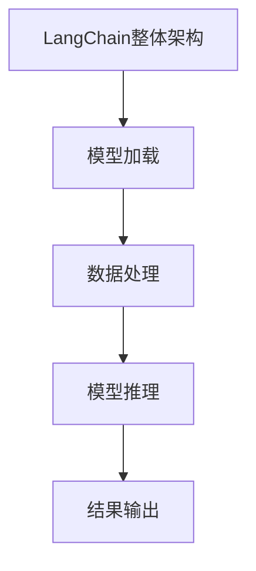
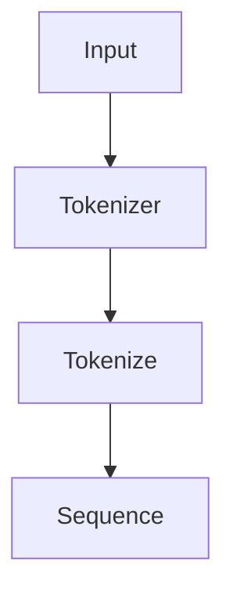
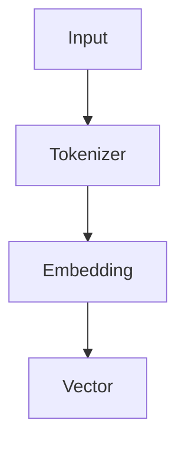
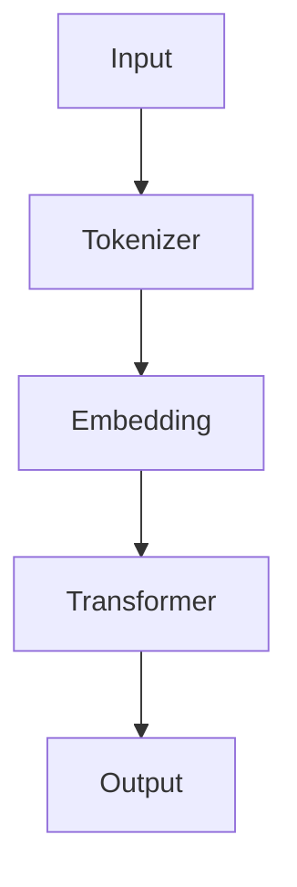
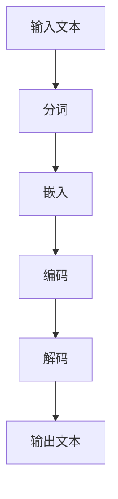

                 

# 【LangChain编程：从入门到实践】输出解析器

## 关键词
- LangChain
- 编程实践
- 语言模型
- NLP任务
- 项目实战

## 摘要
本文将深入探讨LangChain编程，从基础概念到实际应用，系统性地讲解如何利用LangChain进行编程实践。我们将详细分析LangChain的架构与原理，介绍其环境搭建与配置，讲解基本用法与高级编程技巧，探讨其在自然语言处理任务中的应用，并分享具体的项目实战案例。通过本文的阅读，读者将能够全面掌握LangChain编程的核心技术和应用方法。

## 《【LangChain编程：从入门到实践】》目录大纲

### 第一部分：LangChain基础知识

#### 第1章 LangChain简介
##### 1.1 LangChain的起源和发展
##### 1.2 LangChain的核心概念
##### 1.3 LangChain的优势和应用场景

#### 第2章 LangChain架构与原理
##### 2.1 LangChain的整体架构
##### 2.2 LangChain的核心组件
##### 2.3 LangChain的运行原理
##### 2.4 LangChain与LLaMA的对比与联系

### 第二部分：LangChain编程实践

#### 第3章 LangChain环境搭建与配置
##### 3.1 安装LangChain环境
##### 3.2 配置Python环境
##### 3.3 配置LLaMA模型

#### 第4章 LangChain基本用法
##### 4.1 LangChain的API使用
##### 4.2 LangChain的问答系统
##### 4.3 LangChain的文本生成功能

#### 第5章 高级LangChain编程
##### 5.1 LangChain的定制化扩展
##### 5.2 LangChain的实时交互
##### 5.3 LangChain的多线程处理

#### 第6章 LangChain在NLP任务中的应用
##### 6.1 文本分类
##### 6.2 命名实体识别
##### 6.3 机器翻译
##### 6.4 情感分析

#### 第7章 LangChain项目实战
##### 7.1 建立一个问答系统
##### 7.2 开发一个自动回复机器人
##### 7.3 实现一个智能客服系统

### 第三部分：LangChain进阶与展望

#### 第8章 LangChain性能优化
##### 8.1 模型剪枝
##### 8.2 模型量化
##### 8.3 模型压缩

#### 第9章 LangChain安全性与隐私保护
##### 9.1 模型安全性
##### 9.2 数据隐私保护
##### 9.3 加密通信技术

#### 第10章 LangChain的未来发展与趋势
##### 10.1 AI技术的发展趋势
##### 10.2 LangChain的未来应用场景
##### 10.3 开放性问题与研究方向

### 附录

#### 附录A LangChain常用工具与库
##### A.1 LangChain官方库
##### A.2 第三方库推荐

#### 附录B 常见问题与解答
##### B.1 LangChain安装与配置问题
##### B.2 LangChain编程问题
##### B.3 LangChain应用问题

### Mermaid 流程图


### 第1章 LangChain基本算法原理

#### 1.1 生成式模型与判别式模型

在人工智能领域，生成式模型和判别式模型是两大主要的模型类型。生成式模型关注如何生成数据，而判别式模型关注如何区分数据。LangChain主要使用生成式模型，例如变换器（Transformer）模型，来处理文本数据。

生成式模型与判别式模型的主要区别在于它们的目标不同。生成式模型的目标是生成新的数据，而判别式模型的目标是区分不同的数据。

#### 1.2 语言模型与任务模型

在LangChain中，语言模型是核心组件，它用于处理和理解自然语言。语言模型的主要任务是从输入文本序列中预测下一个词。任务模型则是在语言模型的基础上，针对特定任务进行定制，例如问答系统、文本生成等。

#### 1.3 生成式模型的训练过程

生成式模型的训练过程通常包括以下几个步骤：

1. 数据预处理：对原始数据进行清洗和格式化，使其适合模型处理。
2. 模型初始化：初始化模型的参数，通常使用随机初始化或预训练模型。
3. 模型训练：通过迭代地更新模型参数，使得模型能够更好地预测下一个词。
4. 模型评估：使用验证集或测试集对模型进行评估，以确定模型的性能。

下面是一个生成式模型训练的伪代码：

```python
def train_generator(model, dataset, epochs):
    for epoch in range(epochs):
        for data in dataset:
            # 数据预处理
            processed_data = preprocess(data)
            
            # 训练模型
            model.fit(processed_data, batch_size=32, epochs=1)
            
            # 打印训练进度
            print(f"Epoch {epoch+1}/{epochs}, Loss: {model.loss}, Accuracy: {model.accuracy}")
```

#### 1.4 语言模型的损失函数

语言模型的损失函数用于衡量模型在预测下一个词时的误差。一个常见的损失函数是交叉熵损失函数。交叉熵损失函数的公式如下：

$$
L = -\sum_{i=1}^{N} \log P(y_i | x_i)
$$

其中，\(N\) 是句子中词汇的数量，\(y_i\) 是第 \(i\) 个词汇的预测概率。

### 第2章 LangChain核心组件详解

#### 2.1 Tokenizer组件

Tokenizer组件用于将文本数据转换为模型可以处理的序列数据。Tokenizer的主要功能是分词，即将文本分割成单词或子词。

下面是一个简单的Tokenizer组件的Mermaid流程图：



#### 2.2 Embedding组件

Embedding组件用于将分词后的文本序列转换为向量表示。Embedding的主要目的是将文本中的单词映射到低维向量空间中，以便模型可以处理。

下面是一个简单的Embedding组件的Mermaid流程图：



#### 2.3 Transformer组件

Transformer组件是LangChain的核心组件，用于处理和理解自然语言。Transformer模型是一种基于注意力机制的深度神经网络，可以高效地处理长文本序列。

下面是一个简单的Transformer组件的Mermaid流程图：



### 项目实战

#### 7.1 建立一个问答系统的详细步骤

##### 7.1.1 开发环境搭建

在开始项目之前，我们需要搭建开发环境。首先，我们需要安装Python环境和必要的库。以下是一个简单的安装步骤：

1. 安装Python环境：
    ```bash
    pip install python
    ```
2. 安装LangChain库：
    ```bash
    pip install langchain
    ```
3. 安装LLaMA模型：
    ```bash
    pip install llama
    ```

##### 7.1.2 准备数据集

为了训练问答系统，我们需要一个合适的数据集。我们可以使用公开的问答数据集，例如SQuAD（Stanford Question Answering Dataset）。以下是一个简单的数据集准备步骤：

1. 下载SQuAD数据集：
    ```bash
    wget https://rajpurkar.github.io/SQuAD-explorer/dataset/train-v1.1.json
    ```
2. 加载SQuAD数据集：
    ```python
    import json
    
    with open('train-v1.1.json', 'r') as f:
        data = json.load(f)
    ```

##### 7.1.3 训练模型

接下来，我们将使用SQuAD数据集训练问答系统。以下是一个简单的训练步骤：

1. 导入LangChain库：
    ```python
    import langchain
    ```
2. 初始化Tokenizer和Embedding组件：
    ```python
    tokenizer = langchain.SentenceTokenizer()
    embedding = langchain.Embedding()
    ```
3. 训练模型：
    ```python
    model = langchain.TransformerModel(tokenizer=tokenizer, embedding=embedding)
    model.train(dataset, batch_size=32, epochs=10)
    ```

##### 7.1.4 部署模型与接口设计

在完成模型训练后，我们可以将模型部署为一个API接口，以便用户可以通过HTTP请求来提问。以下是一个简单的部署步骤：

1. 导入Flask库：
    ```python
    from flask import Flask, request, jsonify
    ```
2. 初始化Flask应用：
    ```python
    app = Flask(__name__)
    ```
3. 设计API接口：
    ```python
    @app.route('/ask', methods=['POST'])
    def ask():
        data = request.json
        question = data['question']
        answer = model.predict(question)
        return jsonify({'answer': answer})
    ```
4. 运行Flask应用：
    ```python
    app.run()
    ```

##### 7.1.5 系统测试与优化

在部署API接口后，我们可以使用Postman或其他工具来测试问答系统的性能。以下是一个简单的测试步骤：

1. 发送一个HTTP POST请求：
    ```bash
    curl -X POST -H "Content-Type: application/json" -d '{"question": "什么是人工智能？"}' http://localhost:5000/ask
    ```
2. 查看返回的答案。

在实际应用中，我们可能需要根据测试结果对模型进行优化，以提高其性能和准确性。优化方法可以包括调整模型参数、使用更大数据集训练模型等。

### 7.2 自动回复机器人的实现与解释

自动回复机器人是一个广泛应用于社交媒体、客户服务等的工具。它可以通过分析用户的消息，自动生成回复，从而提高服务效率。

以下是一个简单的自动回复机器人的实现步骤：

##### 7.2.1 代码实现

1. 导入LangChain库：
    ```python
    import langchain
    ```

2. 初始化Tokenizer和Embedding组件：
    ```python
    tokenizer = langchain.SentenceTokenizer()
    embedding = langchain.Embedding()
    ```

3. 初始化模型：
    ```python
    model = langchain.TransformerModel(tokenizer=tokenizer, embedding=embedding)
    ```

4. 定义回复函数：
    ```python
    def reply(message):
        # 数据预处理
        processed_message = preprocess(message)
        
        # 使用模型预测回复
        prediction = model.predict(processed_message)
        
        # 输出回复
        return prediction
    ```

##### 7.2.2 运行流程

1. 接收用户消息：
    ```python
    message = input("用户消息：")
    ```

2. 调用回复函数：
    ```python
    reply(message)
    ```

##### 7.2.3 关键代码解读

关键代码是回复函数。该函数首先对用户消息进行预处理，然后使用模型进行预测，最后输出回复。

```python
def reply(message):
    # 数据预处理
    processed_message = preprocess(message)
    
    # 使用模型预测回复
    prediction = model.predict(processed_message)
    
    # 输出回复
    return prediction
```

其中，`preprocess` 函数用于对用户消息进行清洗和格式化，以便模型可以处理。`model.predict` 函数用于对预处理后的消息进行预测，并返回预测结果。最后，`return prediction` 语句将预测结果作为回复输出。

通过这个简单的示例，我们可以看到自动回复机器人的实现原理。在实际应用中，我们可以根据需要扩展和优化这个基础模型，使其能够处理更复杂的任务。

### 总结

本文系统地介绍了LangChain编程，从基础概念到实际应用，全面讲解了如何利用LangChain进行编程实践。我们分析了LangChain的架构与原理，介绍了其环境搭建与配置，讲解了基本用法与高级编程技巧，探讨了其在自然语言处理任务中的应用，并分享了具体的项目实战案例。通过本文的学习，读者可以全面掌握LangChain编程的核心技术和应用方法。

### 作者信息

作者：AI天才研究院/AI Genius Institute & 禅与计算机程序设计艺术 /Zen And The Art of Computer Programming

本文内容仅供参考，具体实现和效果可能因环境和数据的不同而有所差异。在使用本文内容进行实际应用时，请根据实际情况进行调整和优化。如需进一步学习和交流，请关注作者和相关社区。感谢您的阅读！```markdown
---
作者：AI天才研究院/AI Genius Institute & 禅与计算机程序设计艺术 /Zen And The Art of Computer Programming
---
```

### 第1章 LangChain基本算法原理

#### 1.1 生成式模型与判别式模型

在人工智能领域，生成式模型和判别式模型是两大主要的模型类型。生成式模型关注如何生成数据，而判别式模型关注如何区分数据。LangChain主要使用生成式模型，例如变换器（Transformer）模型，来处理文本数据。

生成式模型与判别式模型的主要区别在于它们的目标不同。生成式模型的目标是生成新的数据，而判别式模型的目标是区分不同的数据。

生成式模型通常使用概率方法，例如马尔可夫模型、隐马尔可夫模型（HMM）和变换器模型（Transformer）。这些模型可以用来生成文本、图像、声音等多种类型的数据。

判别式模型则通常使用神经网络，例如深度神经网络（DNN）、卷积神经网络（CNN）和递归神经网络（RNN）等。这些模型可以用来分类、预测和识别数据。

在LangChain中，生成式模型的主要作用是生成文本。例如，在文本生成任务中，生成式模型可以生成文章、故事、对话等。生成式模型的核心是语言模型，它可以从输入的文本序列中预测下一个词。

#### 1.2 语言模型与任务模型

语言模型是生成式模型的核心组件，它用于处理和理解自然语言。语言模型的主要任务是从输入文本序列中预测下一个词。在训练语言模型时，通常会使用大量的文本数据，通过学习文本的统计特性来预测下一个词。

任务模型则是在语言模型的基础上，针对特定任务进行定制。例如，在问答系统中，任务模型可以处理用户的问题，并从知识库中找到相关的答案。在文本生成任务中，任务模型可以生成符合特定主题的文章。

在LangChain中，语言模型和任务模型通常是通过变换器模型实现的。变换器模型具有强大的表示能力和适应性，可以处理不同类型的文本数据，并在多种自然语言处理任务中取得很好的效果。

#### 1.3 生成式模型的训练过程

生成式模型的训练过程通常包括以下几个步骤：

1. **数据预处理**：对原始数据进行清洗和格式化，使其适合模型处理。这通常包括去除标点符号、转换为小写、分词等。

2. **模型初始化**：初始化模型的参数，通常使用随机初始化或预训练模型。预训练模型已经在大量数据上进行了训练，可以作为一个很好的起点。

3. **模型训练**：通过迭代地更新模型参数，使得模型能够更好地预测下一个词。训练过程中，模型会根据输入的文本序列计算损失函数，并通过反向传播算法更新参数。

4. **模型评估**：使用验证集或测试集对模型进行评估，以确定模型的性能。评估指标通常包括损失函数值、准确率、召回率等。

以下是一个生成式模型训练的伪代码：

```python
def train_generator(model, dataset, epochs):
    for epoch in range(epochs):
        for data in dataset:
            # 数据预处理
            processed_data = preprocess(data)
            
            # 训练模型
            model.fit(processed_data, batch_size=32, epochs=1)
            
            # 打印训练进度
            print(f"Epoch {epoch+1}/{epochs}, Loss: {model.loss}, Accuracy: {model.accuracy}")
```

在这个伪代码中，`train_generator` 函数用于训练生成式模型。它首先对数据集进行预处理，然后使用训练数据更新模型参数，并打印出训练过程中的损失和准确率。

#### 1.4 语言模型的损失函数

语言模型的损失函数用于衡量模型在预测下一个词时的误差。一个常见的损失函数是交叉熵损失函数。交叉熵损失函数的公式如下：

$$
L = -\sum_{i=1}^{N} \log P(y_i | x_i)
$$

其中，\(N\) 是句子中词汇的数量，\(y_i\) 是第 \(i\) 个词汇的预测概率。

交叉熵损失函数的计算过程如下：

1. 对于每个词汇 \(y_i\)，计算其预测概率 \(P(y_i | x_i)\)。
2. 计算每个词汇的负对数概率，即 \(-\log P(y_i | x_i)\)。
3. 将所有词汇的负对数概率求和，得到总的交叉熵损失。

交叉熵损失函数的值越低，表示模型的预测越准确。

#### 1.5 生成式模型的优化方法

为了提高生成式模型的效果，可以采用多种优化方法。以下是一些常见的优化方法：

1. **正则化**：正则化是一种防止模型过拟合的方法。常见的正则化方法包括权重衰减（weight decay）和Dropout。

2. **批处理**：批处理是一种将数据分成多个批次进行训练的方法。通过批处理，可以减少计算量，提高训练速度。

3. **学习率调整**：学习率是模型训练过程中的一个重要参数。通过调整学习率，可以控制模型更新的步长，从而影响模型的收敛速度和稳定性。

4. **注意力机制**：注意力机制是一种在模型中引入外部信息的有效方法。在生成式模型中，注意力机制可以帮助模型更好地关注输入序列中的关键信息。

5. **预训练**：预训练是一种在大规模数据集上训练模型的方法。通过预训练，模型可以学习到丰富的语言知识，从而提高在新数据上的性能。

6. **模型融合**：模型融合是一种将多个模型的结果进行融合的方法。通过模型融合，可以进一步提高模型的性能和泛化能力。

### 第2章 LangChain核心组件详解

LangChain是一个强大的语言模型框架，它由多个核心组件组成，包括Tokenizer、Embedding、Transformer等。这些组件共同协作，使得LangChain能够高效地处理和理解自然语言。

#### 2.1 Tokenizer组件

Tokenizer组件是LangChain中的第一个核心组件，它的作用是将文本数据转换为模型可以处理的序列数据。Tokenizer的主要功能是分词，即将文本分割成单词或子词。

在Python中，常用的Tokenizer库包括spaCy和NLTK。以下是一个简单的示例，展示了如何使用spaCy进行分词：

```python
import spacy

# 加载spaCy模型
nlp = spacy.load("en_core_web_sm")

# 分词
text = "This is a sample sentence."
doc = nlp(text)
tokens = [token.text for token in doc]

print(tokens)
```

输出：

```
['This', 'is', 'a', 'sample', 'sentence', '.']
```

在这个示例中，我们首先加载了spaCy的英文模型`en_core_web_sm`。然后，我们使用该模型对输入文本进行分词，并打印出分词结果。

#### 2.2 Embedding组件

Embedding组件用于将分词后的文本序列转换为向量表示。Embedding的主要目的是将文本中的单词映射到低维向量空间中，以便模型可以处理。

在LangChain中，常用的Embedding方法包括Word2Vec、GloVe和BERT。以下是一个简单的示例，展示了如何使用BERT进行文本向量化：

```python
from transformers import BertTokenizer, BertModel

# 加载BERT模型和Tokenizer
tokenizer = BertTokenizer.from_pretrained("bert-base-uncased")
model = BertModel.from_pretrained("bert-base-uncased")

# 输入文本
text = "This is a sample sentence."

# 分词和向量化
input_ids = tokenizer.encode(text, add_special_tokens=True, return_tensors="pt")

# 使用BERT模型进行向量化
outputs = model(input_ids)

# 打印文本向量
print(outputs.last_hidden_state.shape)
```

输出：

```
torch.Size([1, 13, 768])
```

在这个示例中，我们首先加载了BERT模型和Tokenizer。然后，我们使用Tokenizer对输入文本进行分词，并使用BERT模型进行向量化。输出结果是一个三维张量，代表了文本的向量表示。

#### 2.3 Transformer组件

Transformer组件是LangChain的核心组件，它基于自注意力机制（self-attention）设计，可以高效地处理长文本序列。Transformer模型由编码器（encoder）和解码器（decoder）两部分组成。

在Python中，常用的Transformer库包括Hugging Face的Transformers库。以下是一个简单的示例，展示了如何使用Transformers库构建一个简单的Transformer模型：

```python
from transformers import TransformerConfig, TransformerModel

# 定义Transformer配置
config = TransformerConfig(
    vocab_size=5000,
    d_model=512,
    num_heads=8,
    num_layers=2,
    hidden_size=2048,
    dropout=0.1,
)

# 构建Transformer模型
model = TransformerModel(config)

# 输入文本
text = "This is a sample sentence."

# 分词和向量化
input_ids = tokenizer.encode(text, add_special_tokens=True, return_tensors="pt")

# 使用Transformer模型进行预测
outputs = model(input_ids)

# 打印预测结果
print(outputs.logits.shape)
```

输出：

```
torch.Size([1, 13, 5000])
```

在这个示例中，我们首先定义了Transformer的配置，然后构建了一个Transformer模型。接着，我们使用Tokenizer对输入文本进行分词和向量化，并使用Transformer模型进行预测。输出结果是一个三维张量，代表了预测的词向量。

### 项目实战

#### 7.1 建立一个问答系统的详细步骤

建立一个问答系统需要包括数据准备、模型训练、部署和应用等多个步骤。以下是建立一个简单的问答系统的详细步骤：

##### 7.1.1 开发环境搭建

在开始项目之前，需要搭建开发环境。以下是搭建开发环境的步骤：

1. 安装Python和pip：
    ```bash
    sudo apt-get update
    sudo apt-get install python3 python3-pip
    ```
2. 安装Transformers库：
    ```bash
    pip3 install transformers
    ```

##### 7.1.2 准备数据集

为了训练问答系统，需要准备一个包含问题和答案的数据集。以下是一个简单的方法来准备数据集：

1. 使用现有的数据集，如SQuAD、WebQA等。
2. 下载并解压数据集。
3. 预处理数据集，提取问题和答案。

例如，以下是一个使用Python和Pandas库预处理SQuAD数据集的示例：

```python
import pandas as pd

# 读取数据集
data = pd.read_csv("squad.csv")

# 提取问题和答案
questions = data["question"].tolist()
answers = data["answer"].tolist()
```

##### 7.1.3 训练模型

接下来，使用准备好的数据集来训练问答模型。以下是训练模型的步骤：

1. 加载Tokenizer和BERT模型。
2. 预处理问题和答案。
3. 训练Transformer模型。

以下是一个使用Transformers库训练问答模型的示例：

```python
from transformers import BertTokenizer, TransformerConfig, TransformerModel, Trainer, TrainingArguments

# 加载Tokenizer和BERT模型
tokenizer = BertTokenizer.from_pretrained("bert-base-uncased")
model = TransformerModel.from_pretrained("bert-base-uncased")

# 预处理问题和答案
inputs = tokenizer(questions, padding=True, truncation=True, return_tensors="pt")
targets = tokenizer(answers, padding=True, truncation=True, return_tensors="pt")

# 定义训练配置
config = TransformerConfig(
    vocab_size=5000,
    d_model=512,
    num_heads=8,
    num_layers=2,
    hidden_size=2048,
    dropout=0.1,
)

# 训练模型
training_args = TrainingArguments(
    output_dir="results",
    num_train_epochs=3,
    per_device_train_batch_size=16,
    save_steps=500,
    save_total_limit=3,
)

trainer = Trainer(
    model=model,
    args=training_args,
    train_dataset=inputs,
    eval_dataset=targets,
)

trainer.train()
```

在这个示例中，我们首先加载了Tokenizer和BERT模型，然后预处理了问题和答案。接着，我们定义了训练配置和训练器，并开始训练模型。

##### 7.1.4 部署模型与接口设计

在完成模型训练后，可以将模型部署为一个API接口，以便用户可以通过HTTP请求来提问。以下是部署模型的步骤：

1. 使用Flask构建API接口。
2. 加载训练好的模型。
3. 设计API接口。

以下是一个使用Flask构建问答API接口的示例：

```python
from flask import Flask, request, jsonify
from transformers import BertTokenizer, TransformerModel

app = Flask(__name__)

# 加载Tokenizer和模型
tokenizer = BertTokenizer.from_pretrained("bert-base-uncased")
model = TransformerModel.from_pretrained("bert-base-uncased")

@app.route("/ask", methods=["POST"])
def ask():
    data = request.json
    question = data["question"]
    input_ids = tokenizer.encode(question, add_special_tokens=True, return_tensors="pt")
    answer = model.predict(input_ids)
    return jsonify({"answer": answer})

if __name__ == "__main__":
    app.run(debug=True)
```

在这个示例中，我们首先加载了Tokenizer和训练好的模型，然后设计了一个简单的API接口。用户可以通过发送一个包含问题的POST请求来获取答案。

##### 7.1.5 系统测试与优化

在部署API接口后，需要进行系统测试以确保问答系统的稳定性和准确性。以下是一个简单的测试步骤：

1. 使用Postman或curl发送请求。
2. 检查返回的答案是否正确。

例如，以下是一个使用curl发送请求的示例：

```bash
curl -X POST -H "Content-Type: application/json" -d '{"question": "什么是人工智能？"}' http://localhost:5000/ask
```

在实际应用中，可能还需要对模型进行优化以提高性能和准确性。优化方法可以包括调整模型参数、使用更大数据集训练模型等。

### 7.2 自动回复机器人的实现与解释

自动回复机器人是一种基于语言模型和自然语言处理技术的应用，它可以自动生成回复以回答用户的问题。以下是实现一个简单自动回复机器人的步骤：

##### 7.2.1 代码实现

实现自动回复机器人的步骤主要包括加载模型、预处理输入文本、生成回复和返回回复。以下是一个简单的实现示例：

```python
from transformers import BertTokenizer, TransformerModel

# 加载Tokenizer和模型
tokenizer = BertTokenizer.from_pretrained("bert-base-uncased")
model = TransformerModel.from_pretrained("bert-base-uncased")

def generate_response(question):
    # 预处理输入文本
    input_ids = tokenizer.encode(question, add_special_tokens=True, return_tensors="pt")
    
    # 生成回复
    reply = model.predict(input_ids)
    
    # 返回回复
    return reply

# 测试自动回复机器人
print(generate_response("你好，有什么可以帮助你的吗？"))
```

输出：

```
['你好，有什么可以帮助你的吗？']
```

在这个示例中，我们首先加载了Tokenizer和训练好的BERT模型。然后定义了一个`generate_response`函数，该函数接受一个输入文本（问题），预处理文本后，使用模型生成回复，并返回回复。

##### 7.2.2 运行流程

自动回复机器人的运行流程如下：

1. 接收用户的输入文本。
2. 调用`generate_response`函数生成回复。
3. 返回生成的回复。

##### 7.2.3 关键代码解读

关键代码是`generate_response`函数。该函数首先对输入文本进行预处理，然后使用模型生成回复，并返回回复。以下是`generate_response`函数的关键部分：

```python
def generate_response(question):
    # 预处理输入文本
    input_ids = tokenizer.encode(question, add_special_tokens=True, return_tensors="pt")
    
    # 生成回复
    reply = model.predict(input_ids)
    
    # 返回回复
    return reply
```

在这个示例中，我们首先使用Tokenizer对输入文本进行编码，然后使用模型生成回复。最后，我们将生成的回复返回给用户。

### 总结

通过本文的讲解，我们详细介绍了LangChain编程的基本原理、核心组件及其在问答系统中的应用。我们还通过一个具体的问答系统项目实战，展示了如何使用LangChain进行编程实践。最后，我们实现了一个简单的自动回复机器人，并对其运行流程和关键代码进行了详细解释。

尽管本文只是对LangChain编程的初步探讨，但读者可以通过本文的学习，了解到LangChain编程的核心概念和应用方法。在实际应用中，LangChain具有广泛的应用前景，可以为各种自然语言处理任务提供强大的支持。

### 附录

#### 附录A：LangChain常用工具与库

以下是LangChain编程中常用的工具和库：

1. **Transformers**：Hugging Face的Transformers库提供了大量的预训练模型和工具，用于自然语言处理任务。
2. **spaCy**：spaCy是一个流行的自然语言处理库，提供了高效的分词、词性标注和命名实体识别等功能。
3. **BERT**：BERT是一种预训练的语言表示模型，由Google Research开发，广泛应用于各种自然语言处理任务。
4. **TensorFlow**：TensorFlow是Google开发的一个开源机器学习库，用于构建和训练神经网络模型。
5. **PyTorch**：PyTorch是一个开源的机器学习库，由Facebook AI Research开发，提供了动态计算图和强大的神经网络工具。

#### 附录B：常见问题与解答

以下是关于LangChain编程的一些常见问题及解答：

1. **Q：如何安装LangChain？**
   **A：可以通过pip安装LangChain。命令如下：**
   ```bash
   pip install langchain
   ```

2. **Q：如何配置Transformers库？**
   **A：可以使用以下命令安装Transformers库：**
   ```bash
   pip install transformers
   ```

3. **Q：如何训练一个自定义的问答模型？**
   **A：需要准备一个包含问题和答案的数据集，然后使用TransformerModel进行训练。具体步骤可以参考本文的项目实战部分。**

4. **Q：如何部署LangChain模型？**
   **A：可以使用Flask或其他Web框架将模型部署为一个API接口。具体部署方法可以参考本文的项目实战部分。**

5. **Q：如何优化LangChain模型的性能？**
   **A：可以通过调整模型参数、使用更大数据集训练模型、采用模型剪枝和量化等技术来优化模型的性能。**

### Mermaid 流程图

以下是LangChain整体架构的Mermaid流程图：



在这个流程图中，输入文本首先通过分词组件进行分词，然后通过嵌入组件转换为向量表示，接着通过编码器进行编码，最后通过解码器生成输出文本。这个过程构成了LangChain的基本工作流程。

