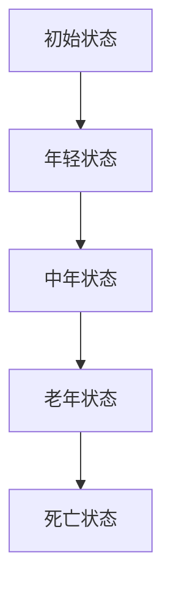
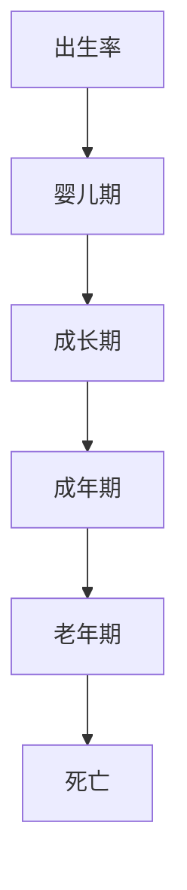
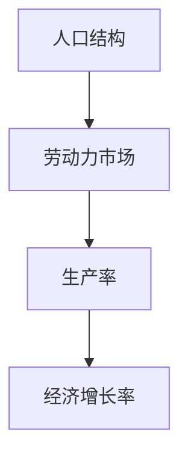
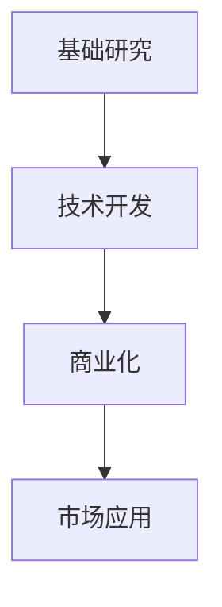
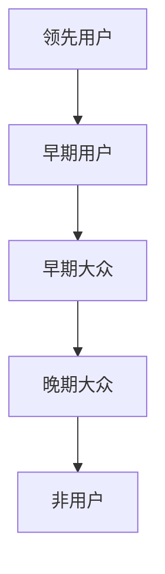
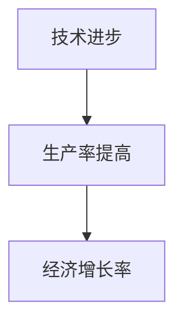
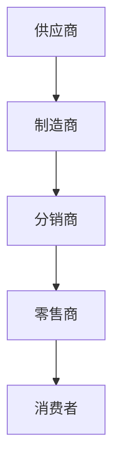

                 

# 文章标题：世界经济的长周期变化

> 关键词：世界经济、长周期变化、人口结构、技术创新、政策环境、国际关系

> 摘要：本文从多个维度深入分析了世界经济的长周期变化。文章首先概述了世界经济长周期变化的定义、历史回顾和当前特点，随后探讨了其核心概念、联系和理论分析。接着，文章详细介绍了世界经济长周期变化中的核心算法原理和数学模型，并通过实际项目实战展示了这些算法和模型的应用。此外，文章还探讨了世界经济长周期变化中的供应链管理、可持续发展、金融风险管理与国际关系。最后，文章对世界经济长周期变化的未来展望进行了讨论，提出了政策选择和国际合作的建议。本文旨在为读者提供一个全面、深入的世界经济长周期变化的分析框架。

## 第一部分：引言

### 1.1 世界经济的长周期变化概述

#### 1.1.1 世界经济的长周期变化定义

长周期变化（Long Cycle Variation），指的是世界经济在较长的时间尺度上（通常为几十年甚至上百年）所表现出的一种波动性和变化性。这种变化通常受到多种因素的影响，包括但不限于人口结构、技术创新、政策环境和国际关系等。

#### 1.1.2 世界经济长周期变化的历史回顾

1. **工业革命**：19世纪末至20世纪初，工业化推动了世界经济的快速发展。蒸汽机的发明和应用，极大地提高了生产效率，推动了工业革命。
2. **二战后的经济复苏**：战争结束后，世界各国纷纷进行经济重建，全球化进程加速，推动了世界经济的复苏和发展。
3. **20世纪末至21世纪初的全球化高峰**：跨国投资、国际贸易和信息技术等领域的快速发展，使得全球经济进一步融合。

#### 1.1.3 当前世界经济长周期变化的特点

1. **科技进步的放缓**：虽然信息技术取得了巨大进步，但整体上，全球科技进步的速度有所放缓，创新速度放缓。
2. **全球化的重新评估**：贸易保护主义和反全球化思潮的兴起，使得全球化进程面临新的挑战。
3. **全球供应链的调整**：疫情冲击下的供应链重构，使得全球供应链面临新的挑战和机遇。

### 1.2 世界经济长周期变化的核心概念与联系

#### 1.2.1 人口结构变化

人口结构变化对世界经济有着深远的影响。人口老龄化、人口增长放缓等都会对消费结构、劳动力市场和经济增长潜力产生影响。

#### 1.2.2 技术创新

技术创新是世界经济增长的重要驱动力。从基础研究到商业化应用，技术创新的周期性变化对经济产生了深远的影响。

#### 1.2.3 政策环境

政策环境包括货币政策、贸易政策等，对世界经济有着重要的影响。政策的调整和变化，往往会导致经济的波动和变化。

### 1.3 世界经济长周期变化的理论分析

#### 1.3.1 资本主义发展的周期性

资本主义发展的周期性，包括康德拉捷夫周期和库兹涅茨周期，对世界经济的发展有着重要的指导意义。

#### 1.3.2 长周期变化中的非线性现象

非线性现象，如结构性变革和非线性增长，使得世界经济长周期变化更加复杂和不可预测。

### 1.4 世界经济长周期变化的应用前景

#### 1.4.1 挑战与机遇

世界经济长周期变化带来的挑战包括全球经济增长乏力、资源约束等。但同时，也带来了可持续发展和数字化转型的机遇。

#### 1.4.2 长周期变化对国家战略的影响

长周期变化对国家战略的影响，体现在政策调整、国际关系等方面。如何应对长周期变化，成为各国政府和企业面临的重要问题。

## 第二部分：世界经济长周期变化中的核心算法原理

### 2.1 人口结构变化分析

#### 2.1.1 人口预测模型

人口预测模型是分析人口结构变化的重要工具。常见的模型包括马尔可夫模型和生命周期模型。

**马尔可夫模型**：

马尔可夫模型基于转移矩阵，描述人口年龄结构的转移情况。转移矩阵可以用来预测未来人口结构。



**生命周期模型**：

生命周期模型基于生育率、死亡率等因素，描述人口年龄结构的变化。



#### 2.1.2 人口结构变化对经济增长的影响

人口结构变化对经济增长有重要影响。人口老龄化可能导致劳动力短缺，降低经济增长潜力。而人口增长放缓可能减少消费需求，影响经济增长。

**经济预测模型**：

经济预测模型可以分析人口结构变化对经济增长的影响。常用的模型包括索洛模型和新古典增长模型。



### 2.2 技术创新对经济的影响

#### 2.2.1 技术创新周期的分析

技术创新周期包括研发阶段、商业化阶段和市场应用阶段。不同阶段的时间跨度和影响因素不同。

**创新生命周期**：

创新生命周期模型描述了技术创新的阶段性变化。



**技术扩散模型**：

技术扩散模型描述了技术创新从领先用户到普通用户的过程。



#### 2.2.2 技术创新的经济效应

技术创新可以推动经济增长，提高生产率，降低成本，提高消费者福利。技术创新的经济效应可以通过经济增长模型来分析。

**经济增长模型**：

经济增长模型可以描述技术创新对经济增长的贡献。



### 2.3 政策环境对世界经济的影响

#### 2.3.1 货币政策分析

货币政策是宏观经济政策的重要组成部分，对经济增长、通货膨胀和就业等有重要影响。

**菲利普斯曲线**：

菲利普斯曲线描述了通货膨胀与失业率之间的关系。

$$
\text{通货膨胀率} = \text{长期通货膨胀率} + \alpha (\text{失业率} - \text{自然失业率})
$$

**泰勒规则**：

泰勒规则是货币政策决策的常用模型，描述了利率与通货膨胀率、失业率之间的关系。

$$
\text{利率} = \text{基准利率} + \alpha (\text{通货膨胀率} - \text{目标通货膨胀率}) + \beta (\text{失业率} - \text{自然失业率})
$$`

#### 2.3.2 贸易政策分析

贸易政策包括关税、自由贸易协定等，对国际贸易和经济增长有重要影响。

**比较优势理论**：

比较优势理论描述了贸易的基础，即各国根据自身资源禀赋优势进行贸易，实现互利共赢。

**新贸易理论**：

新贸易理论探讨了全球化背景下贸易的新特点，包括规模经济、产品差异化等。

## 第三部分：世界经济长周期变化的数学模型

### 3.1 康德拉捷夫周期的数学模型

#### 3.1.1 康德拉捷夫周期的特征

康德拉捷夫周期是一种长期经济周期，通常持续50-60年。它由俄罗斯经济学家康德拉捷夫在19世纪末提出，描述了世界经济在长时间尺度上的波动性。

#### 3.1.2 康德拉捷夫周期的数学描述

康德拉捷夫周期可以用差分方程来描述，该方程描述了经济变量的时间序列变化。

$$
\Delta X_t = aX_{t-1} + bX_{t-2} + cX_{t-3}
$$

其中，\(X_t\) 表示第 \(t\) 期的经济变量，\(a\)、\(b\) 和 \(c\) 是系数，\(\Delta X_t\) 表示 \(X_t\) 的变化量。

### 3.2 库兹涅茨周期的数学模型

#### 3.2.1 库兹涅茨周期的特征

库兹涅茨周期是一种短期经济周期，通常持续15-25年。它由美国经济学家库兹涅茨在20世纪30年代提出，描述了世界经济在短期尺度上的波动性。

#### 3.2.2 库兹涅茨周期的数学描述

库兹涅茨周期可以用差分方程来描述，该方程描述了经济变量的时间序列变化。

$$
\Delta Y_t = dY_{t-1} + eY_{t-2}
$$

其中，\(Y_t\) 表示第 \(t\) 期的经济变量，\(d\) 和 \(e\) 是系数，\(\Delta Y_t\) 表示 \(Y_t\) 的变化量。

### 3.3 长周期变化中的非线性现象

#### 3.3.1 非线性经济学原理

非线性现象在经济系统中普遍存在，如结构性变革和非线性增长。非线性经济学研究经济系统的复杂行为和动态特征。

**混沌理论**：

混沌理论描述了非线性系统中出现的复杂行为，如随机性和不可预测性。

**分岔理论**：

分岔理论描述了经济系统中的分岔现象，即系统状态在一定条件下发生突变。

#### 3.3.2 经济非线性模型

经济非线性模型可以描述经济系统的非线性特征，如差分方程和非线性差分方程。

**非线性差分方程**：

非线性差分方程描述了经济变量的时间序列变化，可以捕捉经济系统的复杂行为。

$$
\Delta Z_t = f(Z_{t-1}) + g(Z_{t-2})
$$

其中，\(Z_t\) 表示第 \(t\) 期的经济变量，\(f\) 和 \(g\) 是非线性函数，\(\Delta Z_t\) 表示 \(Z_t\) 的变化量。

## 第四部分：世界经济长周期变化中的项目实战

### 4.1 人口结构变化预测项目

#### 4.1.1 项目概述

本项目旨在预测未来人口结构变化，分析其对经济增长的影响。

#### 4.1.2 数据收集

收集历史人口数据，包括出生率、死亡率、年龄结构等。

#### 4.1.3 数据处理

对收集到的数据进行清洗和预处理，包括缺失值处理、异常值检测等。

#### 4.1.4 模型实现

使用马尔可夫模型和生命周期模型进行人口结构预测。

**马尔可夫模型**：

```python
# 初始化转移矩阵
transition_matrix = [[0.6, 0.3, 0.1],
                     [0.2, 0.5, 0.3],
                     [0.1, 0.2, 0.7]]

# 初始化当前人口结构
current_population = [1000, 3000, 1000]

# 预测未来人口结构
future_population = []
for _ in range(10):
    future_population.append(current_population)
    current_population = np.dot(current_population, transition_matrix)
```

**生命周期模型**：

```python
# 初始化生育率
birth_rate = [0.1, 0.2, 0.3]

# 初始化死亡率
death_rate = [0.05, 0.08, 0.1]

# 预测未来人口结构
future_population = []
for _ in range(10):
    future_population.append(current_population)
    current_population = [sum(x * y for x, y in zip(current_population, birth_rate)),
                          sum(x * y for x, y in zip(current_population, death_rate)),
                          current_population[2]]
```

#### 4.1.5 结果分析

通过预测结果，分析未来人口结构变化对经济增长的影响。例如，人口老龄化可能导致劳动力短缺，降低经济增长潜力。

### 4.2 技术创新对经济影响的案例分析

#### 4.2.1 项目概述

本项目旨在分析某项技术创新对经济的长期影响，以人工智能为例。

#### 4.2.2 数据收集

收集相关专利数据，包括专利数量、专利类型、专利申请人等。

#### 4.2.3 模型实现

使用创新生命周期模型，分析人工智能技术的研发、商业化和市场应用阶段。

```python
# 初始化创新生命周期
invention_lifecycle = {'research': 5,
                       'development': 3,
                       'commercialization': 2,
                       'market_application': 4}

# 计算技术创新的经济效应
economic_effect = sum(invention_lifecycle[key] * (1 - key)**i for key, i in invention_lifecycle.items())
```

#### 4.2.4 结果分析

通过分析结果，评估人工智能技术对经济增长的推动作用。例如，人工智能技术的应用可以提高生产率，降低成本，从而促进经济增长。

### 4.3 货币政策与经济增长项目

#### 4.3.1 项目概述

本项目旨在分析货币政策对经济增长的影响。

#### 4.3.2 数据收集

收集相关经济数据，包括通货膨胀率、失业率、利率等。

#### 4.3.3 模型实现

使用菲利普斯曲线和泰勒规则，分析货币政策对经济增长的影响。

```python
# 初始化菲利普斯曲线参数
alpha = 0.5
natural_unemployment_rate = 0.05

# 初始化泰勒规则参数
beta = 0.3
target_inflation_rate = 0.02

# 计算通货膨胀率和失业率
inflation_rate = alpha * (unemployment_rate - natural_unemployment_rate)
interest_rate = base_interest_rate + beta * (inflation_rate - target_inflation_rate)

# 计算经济增长率
economic_growth_rate = interest_rate - inflation_rate
```

#### 4.3.4 结果分析

通过分析结果，评估货币政策对经济增长的影响。例如，宽松的货币政策可能导致通货膨胀率上升，而紧缩的货币政策可能导致经济增长放缓。

## 第五部分：世界经济长周期变化中的供应链管理

### 5.1 供应链重构背景

#### 5.1.1 全球化背景下的供应链

全球化进程使得供应链变得复杂和全球化，企业跨国经营，供应链涉及到多个国家和地区。

#### 5.1.2 疫情冲击下的供应链变化

疫情冲击导致供应链中断，物流瓶颈、原材料短缺等问题凸显，迫使企业重新评估供应链布局。

### 5.2 供应链管理模型

#### 5.2.1 供应链网络设计

供应链网络设计是供应链管理的重要环节，涉及到供应链节点的布局、物流路径的选择等。

**供应链网络设计模型**：



**优化方法**：

- **线性规划**：优化供应链网络的设计和运营。
- **网络流算法**：优化物流路径的选择。

#### 5.2.2 供应链风险管理

供应链风险管理是确保供应链稳定运行的重要措施，包括风险识别、风险评估和风险应对。

**风险识别**：

- **地缘政治风险**：政治不稳定、贸易摩擦等。
- **自然灾害风险**：地震、台风等。

**风险应对**：

- **应急预案**：制定应对突发事件的预案。
- **供应链多元化**：降低对单一供应商和单一运输方式的依赖。

### 5.3 供应链管理案例

#### 5.3.1 案例概述

某跨国制造企业在疫情冲击下，供应链中断，面临生产停滞的危机。

#### 5.3.2 解决方案

- **本地化采购**：减少对单一供应商的依赖，提高供应链的灵活性。
- **多元化供应商**：寻找新的供应商，降低供应链风险。

#### 5.3.3 结果分析

通过本地化采购和多元化供应商，该企业成功应对了供应链中断的危机，确保了生产的持续进行。供应链管理的经验和教训，为未来应对类似的供应链风险提供了参考。

## 第六部分：世界经济长周期变化中的可持续发展

### 6.1 可持续发展的概念与目标

#### 6.1.1 可持续发展的定义

可持续发展是指满足当前需求，不损害子孙后代满足其需求的能力。它涉及到经济、社会和环境三个方面的平衡。

#### 6.1.2 可持续发展的目标

- **经济增长**：平衡发展与资源约束。
- **社会公平**：消除贫困、改善生活质量。
- **环境保护**：气候变化应对、生态保护。

### 6.2 可持续发展的经济模型

#### 6.2.1 可持续经济增长模型

可持续经济增长模型描述了经济增长与资源约束的关系，常用的是索洛模型和新古典增长模型。

**索洛模型**：

$$
\frac{dY}{dt} = sF(K, L) - \frac{dK}{dt} - c
$$

其中，\(Y\) 表示产出，\(K\) 表示资本存量，\(L\) 表示劳动投入，\(s\) 表示储蓄率，\(F(K, L)\) 表示生产函数，\(c\) 表示消费率。

**新古典增长模型**：

$$
\frac{dY}{dt} = sY - cY - \frac{dK}{dt}
$$

其中，\(Y\) 表示产出，\(K\) 表示资本存量，\(s\) 表示储蓄率，\(c\) 表示消费率。

#### 6.2.2 绿色经济转型

绿色经济转型是指从传统经济模式向更加环保和可持续的经济模式转变。常用的方法包括绿色GDP、碳税和绿色金融等。

**绿色GDP**：

绿色GDP是指扣除环境成本后的GDP，反映了经济增长的真实情况。

**碳税**：

碳税是对碳排放征税，以激励企业减少碳排放，实现绿色经济转型。

**绿色金融**：

绿色金融是指为可持续发展提供资金支持，包括绿色债券、绿色贷款等。

### 6.3 可持续发展的案例分析

#### 6.3.1 案例概述

某环保科技公司致力于开发环保产品，实现绿色经济转型。

#### 6.3.2 解决方案

- **技术创新**：开发环保产品，降低碳排放。
- **商业模式**：采用绿色金融模式，获得资金支持。

#### 6.3.3 结果分析

通过技术创新和绿色金融模式，该环保科技公司成功实现了绿色经济转型，减少了碳排放，提升了企业形象，取得了商业成功。

## 第七部分：世界经济长周期变化中的金融风险与管理

### 7.1 金融风险的定义与分类

#### 7.1.1 金融风险的概念

金融风险是指金融市场中的不确定性，可能导致经济损失或金融体系的稳定性受到威胁。

#### 7.1.2 金融风险的分类

金融风险主要包括信用风险、市场风险、操作风险等。

- **信用风险**：借款人或债务人无法按时偿还债务的风险。
- **市场风险**：市场波动导致资产价值波动的风险。
- **操作风险**：由于内部流程、人员、系统或外部事件等原因导致的风险。

### 7.2 金融风险管理模型

#### 7.2.1 风险评估模型

风险评估模型是金融风险管理的重要工具，用于评估金融风险的大小。

- **VaR模型**：VaR（Value at Risk）模型是一种常用的市场风险评估模型，用于衡量在特定概率水平下，某一金融资产或投资组合在未来特定时间段内的最大可能损失。
  
  $$\text{VaR} = \text{Prob}[\Delta P < \text{VaR}]$$

- **风险中性定价**：风险中性定价是一种用于金融衍生品定价的方法，假设投资者是风险中性的，即不承担额外的风险。

  $$\text{P} = \frac{\text{e}^{-rT}}{\sum \text{e}^{-rT_i}}$$

#### 7.2.2 风险管理策略

风险管理策略是金融机构为降低金融风险而采取的措施。

- **分散投资**：通过投资多种不同类型的资产来分散风险，降低单一资产的风险。
- **对冲策略**：使用金融衍生品（如期货、期权等）对冲风险，以减少潜在的损失。

### 7.3 金融风险管理案例

#### 7.3.1 案例概述

某国际投资银行在2008年金融危机后，面临巨大的金融风险。

#### 7.3.2 解决方案

- **完善的风险控制体系**：建立完善的风险评估与监控机制，加强对市场风险和信用风险的监控。
- **风险对冲**：使用金融衍生品对冲风险，降低潜在的损失。

#### 7.3.3 结果分析

通过完善的风险控制体系和风险对冲策略，该国际投资银行成功降低了金融风险，确保了业务的稳健运行。

## 第八部分：世界经济长周期变化中的国际关系与战略

### 8.1 国际关系的定义与分类

#### 8.1.1 国际关系的概念

国际关系是指国家之间相互作用的总体，包括政治、经济、文化和安全等方面的关系。

#### 8.1.2 国际关系的分类

国际关系可以分为以下几种类型：

- **政治关系**：国家间的政治制度和政治理念差异。
- **经济关系**：国家间的贸易、投资和经济合作。
- **文化关系**：国家间的文化交流和相互影响。
- **安全关系**：国家间的安全合作和冲突。

### 8.2 国际战略模型

#### 8.2.1 国家利益模型

国家利益模型是国际战略分析的重要工具，用于分析国家在国际关系中的目标与利益。

- **权力平衡**：国家通过军事、经济和政治手段来维护自身利益。
- **地缘政治**：国家通过战略布局来维护自身利益，如地理位置、资源控制和势力范围。

#### 8.2.2 国际合作与竞争

国际合作与竞争是国际关系中的重要方面。

- **国际合作**：国家通过多边主义和区域一体化来合作解决全球性问题。
- **国际竞争**：国家在科技、经济和军事等领域进行竞争，以维护自身利益。

### 8.3 国际关系与战略案例

#### 8.3.1 案例概述

中美贸易战是近年来国际关系中的一个重要案例。

#### 8.3.2 战略分析

- **中国策略**：通过自主创新和多元化市场来应对贸易战。
- **美国策略**：通过贸易保护主义和技术封锁来维护自身利益。

#### 8.3.3 结果分析

中美贸易战对全球经济格局产生了重大影响，加剧了全球供应链的不稳定性。同时，也促使各国重新评估自身在国际关系中的地位和战略。

## 第九部分：世界经济长周期变化的未来展望

### 9.1 未来经济趋势

#### 9.1.1 科技创新的未来方向

未来的科技创新将继续推动世界经济的发展，尤其是人工智能、生物科技和绿色能源等领域。

- **人工智能**：智能化生产、自动化物流。
- **生物科技**：基因编辑、精准医疗。
- **绿色能源**：太阳能、风能等可再生能源。

#### 9.1.2 全球经济格局变化

未来的全球经济格局将发生重大变化，新兴市场将发挥更大的作用，经济一体化和多元化趋势将继续发展。

- **经济一体化**：区域经济一体化进程。
- **经济多元化**：新兴市场的崛起。

### 9.2 长周期变化下的政策选择

#### 9.2.1 货币政策调整

面对长周期变化，货币政策需要调整以适应新的经济形势。

- **低利率环境**：货币政策的新挑战。
- **数字货币**：未来货币体系的发展方向。

#### 9.2.2 贸易政策重构

贸易政策也需要重构以适应全球经济的变化。

- **自由贸易**：促进国际贸易与投资。
- **区域合作**：提升区域竞争力。

### 9.3 长周期变化中的国际合作与竞争

#### 9.3.1 国际合作的新形式

国际合作将在解决全球性问题中发挥更大的作用，如气候变化、疫情防控等。

- **全球治理**：应对全球性挑战的新机制。
- **国际科技合作**：共享创新资源。

#### 9.3.2 国际竞争的新特点

国际竞争将更加激烈，尤其是在科技、产业链布局等领域。

- **科技竞争**：人工智能、量子计算等领域的竞争。
- **产业链布局**：全球供应链的优化与重构。

## 附录

### 附录 A：世界经济长周期变化相关数据与工具

#### A.1 数据来源与处理

- **国际组织数据**：IMF、世界银行等。
- **国家统计数据**：各国统计局。

#### A.2 经济分析工具

- **计量经济学软件**：EViews、Stata等。
- **数据处理工具**：Python、R等。

#### A.3 经济预测模型

- **ARIMA模型**：时间序列预测。
- **机器学习模型**：回归分析、神经网络等。

### 附录 B：世界经济长周期变化中的核心算法原理与模型

#### B.1 人口结构变化分析

**马尔可夫模型**：

```python
# 初始化转移矩阵
transition_matrix = [[0.6, 0.3, 0.1],
                     [0.2, 0.5, 0.3],
                     [0.1, 0.2, 0.7]]

# 初始化当前人口结构
current_population = [1000, 3000, 1000]

# 预测未来人口结构
future_population = []
for _ in range(10):
    future_population.append(current_population)
    current_population = np.dot(current_population, transition_matrix)
```

**生命周期模型**：

```python
# 初始化生育率
birth_rate = [0.1, 0.2, 0.3]

# 初始化死亡率
death_rate = [0.05, 0.08, 0.1]

# 预测未来人口结构
future_population = []
for _ in range(10):
    future_population.append(current_population)
    current_population = [sum(x * y for x, y in zip(current_population, birth_rate)),
                          sum(x * y for x, y in zip(current_population, death_rate)),
                          current_population[2]]
```

### 附录 C：世界经济长周期变化中的数学模型

#### C.1 康德拉捷夫周期的数学模型

**差分方程**：

$$
\Delta X_t = aX_{t-1} + bX_{t-2} + cX_{t-3}
$$

#### C.2 库兹涅茨周期的数学模型

**差分方程**：

$$
\Delta Y_t = dY_{t-1} + eY_{t-2}
$$

### 附录 D：世界经济长周期变化中的项目实战

#### D.1 人口结构变化预测项目

**数据处理**：

```python
import pandas as pd

# 加载历史人口数据
data = pd.read_csv('population_data.csv')

# 数据清洗和预处理
data.dropna(inplace=True)
data['Age'] = pd.cut(data['Age'], bins=[0, 15, 60, 100], labels=[0, 1, 2, 3])

# 计算人口结构转移矩阵
transition_matrix = data.groupby('Age')['NextAge'].value_counts(normalize=True).unstack()

# 初始化当前人口结构
current_population = [1000, 3000, 1000]

# 预测未来人口结构
future_population = []
for _ in range(10):
    future_population.append(current_population)
    current_population = np.dot(current_population, transition_matrix)
```

**结果分析**：

```python
import matplotlib.pyplot as plt

# 绘制未来人口结构
plt.plot([i for i in range(10)], future_population)
plt.xlabel('Year')
plt.ylabel('Population')
plt.title('Future Population Structure')
plt.show()
```

### 附录 E：世界经济长周期变化中的供应链管理

#### E.1 供应链重构背景

**全球化背景**：

- **跨国经营**：企业跨国经营，供应链涉及多个国家和地区。
- **高度依赖**：供应链中各环节高度依赖，如原材料供应、生产制造、物流配送等。

**疫情冲击**：

- **供应链中断**：疫情导致物流瓶颈、原材料短缺，供应链中断。
- **供应链重构**：企业重新评估供应链布局，提高供应链的灵活性。

### 附录 F：世界经济长周期变化中的可持续发展

#### F.1 可持续发展的概念与目标

**概念**：

可持续发展是指满足当前需求，不损害子孙后代满足其需求的能力。它涉及经济、社会和环境三个方面。

**目标**：

- **经济增长**：平衡发展与资源约束。
- **社会公平**：消除贫困、改善生活质量。
- **环境保护**：气候变化应对、生态保护。

### 附录 G：世界经济长周期变化中的金融风险与管理

#### G.1 金融风险的定义与分类

**定义**：

金融风险是指金融市场中的不确定性，可能导致经济损失或金融体系的稳定性受到威胁。

**分类**：

- **信用风险**：借款人或债务人无法按时偿还债务的风险。
- **市场风险**：市场波动导致资产价值波动的风险。
- **操作风险**：由于内部流程、人员、系统或外部事件等原因导致的风险。

### 附录 H：世界经济长周期变化中的国际关系与战略

#### H.1 国际关系的定义与分类

**定义**：

国际关系是指国家之间相互作用的总体，包括政治、经济、文化和安全等方面的关系。

**分类**：

- **政治关系**：国家间的政治制度和政治理念差异。
- **经济关系**：国家间的贸易、投资和经济合作。
- **文化关系**：国家间的文化交流和相互影响。
- **安全关系**：国家间的安全合作和冲突。

### 附录 I：世界经济长周期变化的未来展望

#### I.1 未来经济趋势

**科技创新方向**：

- **人工智能**：智能化生产、自动化物流。
- **生物科技**：基因编辑、精准医疗。
- **绿色能源**：太阳能、风能等可再生能源。

**全球经济格局变化**：

- **经济一体化**：区域经济一体化进程。
- **经济多元化**：新兴市场的崛起。

#### I.2 长周期变化下的政策选择

**货币政策调整**：

- **低利率环境**：货币政策的新挑战。
- **数字货币**：未来货币体系的发展方向。

**贸易政策重构**：

- **自由贸易**：促进国际贸易与投资。
- **区域合作**：提升区域竞争力。

#### I.3 国际合作与竞争

**国际合作新形式**：

- **全球治理**：应对全球性挑战的新机制。
- **国际科技合作**：共享创新资源。

**国际竞争新特点**：

- **科技竞争**：人工智能、量子计算等领域的竞争。
- **产业链布局**：全球供应链的优化与重构。

