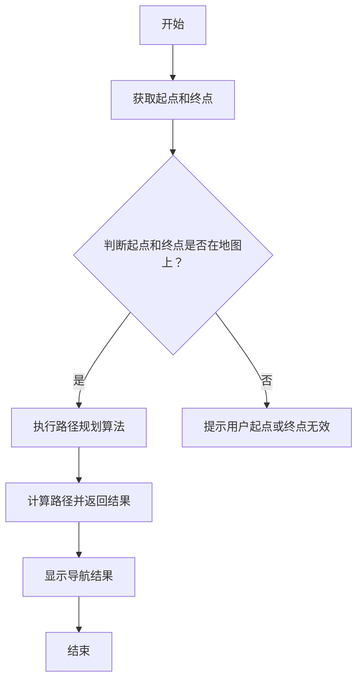
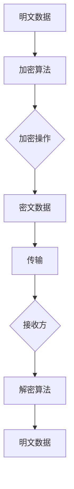

                 

# 文章标题

《中大型体量的电商、O2O、支付等泛交易领域业务模式和技术架构》

## 关键词

电商，O2O，支付，业务模式，技术架构，大数据，人工智能，区块链，微服务，高并发处理，性能优化，安全性，新兴技术，未来展望

## 摘要

本文旨在深入探讨中大型体量电商、O2O、支付等泛交易领域的业务模式和技术架构。文章首先对泛交易领域进行了概述，分析了当前市场趋势和生态系统参与者。随后，详细介绍了中大型体量泛交易业务模式，包括电商、O2O和支付业务模式。接下来，文章重点探讨了中大型体量泛交易的技术架构，包括技术架构概述、数据处理架构、性能优化与扩展性。随后，文章深入探讨了电商核心算法、O2O技术实现与优化、支付系统安全性等技术深度话题。最后，通过案例研究和未来展望，总结了泛交易领域的发展策略与建议。本文为从事泛交易领域的企业和开发者提供了宝贵的参考和启示。

### 第一部分：泛交易领域概述

#### 第1章：泛交易领域概览

泛交易领域涵盖了电商、O2O（在线到线下）和支付等主要业务模式。这些领域在商业模式、技术应用和生态系统方面具有显著特点。本章节将详细探讨泛交易领域的定义、分类、当前市场趋势、生态系统和参与者。

#### 1.1 泛交易领域的定义与分类

**1.1.1 电商交易**

电商交易，即电子商务交易，是指通过互联网平台进行的商品或服务的买卖行为。电商交易主要包括B2B（企业对企业）、B2C（企业对消费者）和C2C（消费者对消费者）三种模式。电商平台通过在线支付、物流配送等手段实现商品交易，大大提升了交易效率和用户体验。

**1.1.2 O2O交易**

O2O交易，即在线到线下交易，是线上线下融合的一种商业模式。O2O通过线上平台吸引消费者，引导其线下消费，从而实现线上流量向线下转化。O2O交易涵盖了餐饮、零售、娱乐、教育等多个行业，具有广泛的适用性。

**1.1.3 支付交易**

支付交易，即支付行为，是泛交易领域的重要环节。支付交易包括线上和线下两种形式，通过银行、支付平台、移动支付等方式完成。支付交易的安全性、便捷性和稳定性对电商、O2O等业务模式的成功至关重要。

#### 1.2 当前泛交易市场趋势

**1.2.1 电商交易趋势**

近年来，电商交易市场呈现快速增长态势。随着移动互联网的普及，移动电商、社交电商等新兴模式不断涌现。电商交易市场趋势包括：

1. 用户规模持续增长
2. 品类丰富与多元化
3. 个性化推荐与精准营销
4. 线上线下融合趋势明显
5. 物流配送速度与效率提升

**1.2.2 O2O交易趋势**

O2O交易市场也在快速发展，主要趋势包括：

1. 线上线下融合加深
2. 服务种类不断丰富
3. 客户体验提升
4. 数据驱动运营
5. 支付与配送一体化

**1.2.3 支付交易趋势**

支付交易市场趋势主要包括：

1. 移动支付普及率提高
2. 多元化支付方式发展
3. 支付安全与合规性要求加强
4. 区块链技术在支付领域的应用
5. 支付场景拓展

#### 1.3 生态系统和参与者

泛交易领域的生态系统包括平台、商家、消费者、支付机构、物流公司等多个参与者。这些参与者共同构成了泛交易生态系统的核心。

**1.3.1 平台**

电商平台、O2O平台和支付平台是泛交易领域的主要平台。平台负责提供交易环境、技术支持和服务保障。

**1.3.2 商家**

商家是泛交易领域的主要参与者，包括传统商家和新兴电商企业。商家通过平台实现商品或服务的交易。

**1.3.3 消费者**

消费者是泛交易领域的核心，消费者的需求和行为决定了泛交易领域的发展方向。

**1.3.4 支付机构**

支付机构负责提供支付服务，包括银行、支付平台和第三方支付机构等。支付机构在泛交易领域发挥着关键作用。

**1.3.5 物流公司**

物流公司负责商品的配送与配送服务，确保交易顺利完成。

通过本章的介绍，我们对泛交易领域有了全面的了解，为后续章节的深入探讨奠定了基础。

#### 第2章：中大型体量泛交易业务模式

中大型体量的泛交易业务模式在电商、O2O和支付领域具有独特的特点和挑战。本章将详细探讨这些业务模式，分析其核心要素、优势与挑战，并探讨如何实现业务模式的创新与优化。

##### 2.1 电商业务模式

**2.1.1 商业模式演变**

电商业务模式经历了从传统的B2C到C2C、再到如今的社交电商、内容电商等多个阶段。传统的B2C模式主要依赖于电商平台，通过集中采购和仓储物流实现商品的售卖。C2C模式如淘宝、eBay等，通过用户间的商品交易，降低了平台的运营成本。随着移动互联网的兴起，社交电商和内容电商逐渐崭露头角，利用社交网络和内容创作平台吸引用户，提升用户粘性。

**2.1.2 销售渠道策略**

销售渠道策略是电商业务模式的重要组成部分。目前，电商销售渠道主要包括线上平台、社交媒体、自营APP、线下门店等。线上平台如淘宝、京东等是主要的销售渠道，自营APP如小米有品、网易严选等，通过自建平台提升品牌形象和用户忠诚度。社交媒体渠道如微信、微博、抖音等，利用社交互动和内容营销吸引用户关注和购买。线下门店则通过线上线下融合，实现全渠道覆盖，提升用户体验。

**2.1.3 用户关系管理**

用户关系管理是电商业务模式的核心，包括用户获取、用户留存、用户增长等环节。用户获取方面，电商平台通过精准营销、广告投放、社交互动等方式，提高用户注册和转化率。用户留存方面，电商平台通过会员制度、优惠券、积分奖励等手段，提升用户复购率和粘性。用户增长方面，电商平台通过用户推荐、裂变营销等方式，实现用户规模的快速增长。

##### 2.2 O2O业务模式

**2.2.1 线上线下融合**

线上线下融合是O2O业务模式的核心特点。O2O通过线上平台吸引消费者，提供商品信息、在线预订、支付等服务，再通过线下门店实现商品体验、配送等服务。线上线下融合不仅提升了用户体验，还降低了运营成本。线上线下的无缝衔接，使得消费者可以方便快捷地完成交易，同时也提高了商家的销售效率和客户满意度。

**2.2.2 服务优化与提升**

服务优化与提升是O2O业务模式的关键。O2O平台通过实时定位、导航、客服等技术，提升服务质量和用户满意度。实时定位和导航技术确保消费者能够快速找到线下门店，提高服务效率。客服机器人、人工智能语音识别等技术，提升客服响应速度和服务质量，降低人工成本。

**2.2.3 客户体验策略**

客户体验策略是O2O业务模式的重要环节。O2O平台通过用户体验设计、数据分析、个性化推荐等技术手段，提升用户满意度。用户体验设计关注用户界面、操作流程等细节，确保用户在使用过程中感受到便捷和舒适。数据分析通过用户行为分析、消费偏好分析等，为商家提供精准的营销策略。个性化推荐根据用户兴趣和行为，推荐适合的商品和服务，提升用户满意度和购买率。

##### 2.3 支付业务模式

**2.3.1 支付系统架构**

支付系统架构是支付业务模式的基础。支付系统通常包括支付渠道、支付网关、支付处理、资金清算等多个环节。支付渠道包括银行、第三方支付平台、移动支付等，为用户提供多样化的支付方式。支付网关负责接收和处理支付请求，确保支付过程的安全性。支付处理环节包括验证支付信息、处理支付请求等，确保支付交易的顺利进行。资金清算环节负责处理支付款项的清算和结算。

**2.3.2 支付服务种类**

支付服务种类丰富，包括消费支付、转账支付、充值支付、退款支付等。消费支付是用户在电商平台或线下门店购买商品或服务时使用的支付方式。转账支付是用户向他人账户转账的资金支付方式。充值支付是用户为账户充值资金的支付方式。退款支付是用户在交易完成后，因退款需求而进行的支付操作。

**2.3.3 支付安全与合规**

支付安全与合规是支付业务模式的重要保障。支付系统需要采用加密技术、安全认证、防欺诈措施等，确保支付过程的安全性。同时，支付业务需要遵循相关法律法规和合规要求，确保业务的合法性和安全性。支付机构需要建立完善的内部管理机制，防范风险和违规行为。

通过本章的探讨，我们对中大型体量泛交易业务模式有了更加深入的理解，为后续技术架构的讨论奠定了基础。

#### 第3章：中大型体量泛交易技术架构

中大型体量的泛交易业务模式对技术架构提出了更高的要求，需要应对高并发处理、数据处理、性能优化和扩展性等挑战。本章将详细探讨中大型体量泛交易的技术架构，包括架构设计原则、技术选型与框架、微服务架构以及数据处理与性能优化。

##### 3.1 技术架构概述

**3.1.1 架构设计原则**

中大型体量泛交易技术架构的设计原则包括：

1. **高可用性**：确保系统在面临高并发和故障时，能够稳定运行，提供连续的服务。
2. **高扩展性**：支持系统在业务增长时，能够灵活扩展，满足不断增长的需求。
3. **高性能**：确保系统在处理大量请求时，能够高效运行，提供快速的响应时间。
4. **安全性**：保障系统的数据安全，防止数据泄露和攻击。
5. **可维护性**：确保系统易于维护和管理，降低维护成本。

**3.1.2 技术选型与框架**

中大型体量泛交易技术选型主要包括以下方面：

1. **后端技术框架**：如Spring Boot、Django、Node.js等，用于开发业务逻辑和数据处理。
2. **数据库选型**：如MySQL、PostgreSQL、MongoDB等，根据业务需求选择合适的数据库。
3. **缓存技术**：如Redis、Memcached等，用于提高系统的响应速度和并发处理能力。
4. **消息队列**：如RabbitMQ、Kafka等，用于处理异步任务和分布式系统中的消息传递。
5. **搜索引擎**：如Elasticsearch、Solr等，用于实现高效的全文搜索和数据分析。

**3.1.3 微服务架构**

微服务架构是中大型体量泛交易技术架构的重要组件，其核心思想是将系统拆分成多个独立的服务，每个服务负责特定的业务功能。微服务架构的优势包括：

1. **可扩展性**：通过水平扩展单个服务，提高系统的并发处理能力。
2. **高可用性**：单个服务的故障不会影响整个系统的运行。
3. **松耦合**：服务之间通过轻量级协议（如RESTful API）进行通信，降低系统的复杂性。
4. **易于维护**：服务独立开发和部署，降低维护成本。

##### 3.2 数据处理架构

**3.2.1 数据存储与处理**

中大型体量泛交易的数据处理架构主要包括以下方面：

1. **关系型数据库**：如MySQL、PostgreSQL，用于存储结构化数据，支持复杂的查询操作。
2. **非关系型数据库**：如MongoDB、Redis，用于存储结构化数据和非结构化数据，提供高性能的数据读写能力。
3. **数据缓存**：如Redis、Memcached，用于缓存热点数据，提高系统的响应速度。
4. **数据存储**：如HDFS、Elasticsearch，用于存储海量数据，提供高效的数据检索和分析能力。

**3.2.2 数据分析与管理**

中大型体量泛交易的数据分析与管理包括以下方面：

1. **数据分析**：利用大数据技术（如Hadoop、Spark）对海量数据进行分析，挖掘用户行为、业务趋势等有价值的信息。
2. **数据管理**：通过数据仓库、数据湖等技术，对数据进行统一存储和管理，提供数据可视化和分析工具。
3. **数据安全与隐私保护**：确保数据在存储、传输和处理过程中的安全性，遵循数据保护法规和隐私政策。

**3.2.3 数据安全与隐私保护**

数据安全与隐私保护是数据处理架构的重要环节，包括以下方面：

1. **数据加密**：对敏感数据进行加密存储和传输，确保数据不被未授权访问。
2. **访问控制**：设置严格的数据访问权限，确保只有授权用户可以访问数据。
3. **审计与监控**：记录数据访问和操作日志，进行实时监控和审计，发现异常行为并及时处理。

##### 3.3 性能优化与扩展性

**3.3.1 高并发处理**

高并发处理是中大型体量泛交易技术架构的关键，包括以下方面：

1. **垂直扩展**：通过增加服务器硬件配置，提升单台服务器的处理能力。
2. **水平扩展**：通过分布式架构，将系统拆分为多个服务，利用多个服务器处理请求。
3. **负载均衡**：通过负载均衡器（如Nginx、HAProxy）分配请求，确保系统资源得到充分利用。

**3.3.2 系统监控与故障恢复**

系统监控与故障恢复是确保系统稳定运行的关键，包括以下方面：

1. **实时监控**：通过监控系统（如Zabbix、Prometheus）实时监控系统性能、资源使用情况等，及时发现异常。
2. **日志分析**：通过日志分析工具（如ELK、Grafana）分析系统日志，定位故障原因。
3. **故障恢复**：通过自动故障恢复机制（如自动重启、自动扩容）确保系统在故障发生后能够快速恢复。

**3.3.3 扩展性与可维护性**

扩展性与可维护性是中大型体量泛交易技术架构的重要特点，包括以下方面：

1. **模块化设计**：通过模块化设计，确保系统各组件之间松耦合，易于扩展和维护。
2. **标准化接口**：通过定义标准化接口，实现系统组件的通用化和可替换性。
3. **文档与规范**：编写详细的系统文档和开发规范，确保开发人员能够快速上手和维护系统。

通过本章的探讨，我们对中大型体量泛交易的技术架构有了更深入的理解，为后续技术深度的探讨奠定了基础。

#### 第二部分：技术深度探讨

##### 第4章：电商核心算法与技术

电商领域的核心算法和技术是提升用户体验、提高销售额和优化运营效率的关键。本章将深入探讨电商领域的推荐系统、商品搜索和数据挖掘与机器学习应用，并介绍其原理、架构和实现。

##### 4.1 推荐系统算法

**4.1.1 算法原理与类型**

推荐系统是电商领域的一项重要技术，旨在根据用户的历史行为、偏好和兴趣，向用户推荐可能感兴趣的商品或服务。推荐系统算法主要分为以下几类：

1. **基于内容的推荐**：根据商品的属性和内容，推荐与用户历史偏好相似的商品。
2. **协同过滤推荐**：根据用户之间的相似性，推荐其他用户喜欢的商品。
3. **混合推荐**：结合基于内容和协同过滤推荐的优势，提高推荐效果。

**4.1.2 推荐系统架构**

推荐系统架构通常包括数据层、算法层和应用层：

1. **数据层**：收集用户行为数据、商品信息、用户标签等数据，存储在数据仓库或大数据平台上。
2. **算法层**：利用机器学习算法处理数据，生成推荐列表。
3. **应用层**：将推荐结果呈现给用户，通过网页、APP或邮件等方式推送。

**4.1.3 伪代码实现**

以下是一个基于协同过滤推荐算法的推荐系统伪代码实现：

```python
# 输入：用户历史行为数据、商品信息、邻居用户列表
# 输出：推荐商品列表

def collaborative_filtering(user_history, item_features, neighbors):
    # 计算邻居用户与目标用户的相似度
    similarity_scores = []
    for neighbor in neighbors:
        similarity = cosine_similarity(user_history, neighbor_history)
        similarity_scores.append((neighbor, similarity))

    # 根据相似度计算推荐商品得分
    recommendation_scores = []
    for neighbor, similarity in similarity_scores:
        neighbor_ratings = item_features[neighbor]
        user_ratings = item_features[user_history]
        recommendation_score = dot_product(neighbor_ratings - user_ratings, similarity)
        recommendation_scores.append((item, recommendation_score))

    # 排序并返回推荐商品列表
    recommended_items = sorted(recommendation_scores, key=lambda x: x[1], reverse=True)
    return recommended_items
```

##### 4.2 商品搜索算法

**4.2.1 搜索算法原理**

商品搜索算法是电商系统的重要功能，旨在帮助用户快速找到所需的商品。常见的搜索算法包括：

1. **基于关键词的搜索**：用户输入关键词，系统根据关键词检索数据库中的商品信息。
2. **基于相似性的搜索**：通过计算用户查询关键词与商品标题、描述的相似度，推荐相关商品。
3. **基于分类的搜索**：根据商品的分类层级，提供分类导航，帮助用户快速定位商品。

**4.2.2 搜索引擎架构**

搜索引擎架构通常包括：

1. **索引层**：将商品信息索引化，提高搜索效率。
2. **查询层**：处理用户查询请求，返回搜索结果。
3. **排序层**：根据相关性、评分等因素，对搜索结果进行排序。

**4.2.3 伪代码示例**

以下是一个基于关键词搜索算法的搜索系统伪代码示例：

```python
# 输入：用户查询关键词、商品信息库
# 输出：搜索结果列表

def keyword_search(query, items):
    # 初始化搜索结果列表
    search_results = []

    # 遍历商品信息库，找到与查询关键词匹配的商品
    for item in items:
        if query in item['title'] or query in item['description']:
            search_results.append(item)

    # 对搜索结果进行排序，根据关键词匹配程度排序
    sorted_results = sorted(search_results, key=lambda x: (len(x['title'].split()), len(x['description'].split())), reverse=True)

    return sorted_results
```

##### 4.3 数据挖掘与机器学习应用

**4.3.1 数据预处理**

数据挖掘和机器学习应用的第一步是数据预处理，包括以下方面：

1. **数据清洗**：去除重复数据、缺失值填充、异常值处理等，保证数据质量。
2. **数据转换**：将原始数据进行规范化、离散化等处理，便于模型训练。
3. **特征工程**：提取和构造对模型训练有价值的特征，提高模型性能。

**4.3.2 特征工程**

特征工程是数据挖掘和机器学习应用的重要环节，包括以下方面：

1. **用户特征**：用户年龄、性别、地理位置、购买历史等。
2. **商品特征**：商品价格、品类、销量、评价等。
3. **上下文特征**：时间、季节、节日等。

**4.3.3 模型评估与优化**

模型评估与优化包括以下方面：

1. **模型评估**：使用准确率、召回率、F1值等指标评估模型性能。
2. **模型优化**：通过调整参数、增加特征、模型融合等方式，提高模型性能。

**4.3.4 伪代码示例**

以下是一个简单的数据挖掘和机器学习应用的伪代码示例：

```python
# 输入：训练数据集、测试数据集
# 输出：训练好的模型和评估结果

from sklearn.linear_model import LinearRegression

# 数据预处理
train_data, train_labels = preprocess_data(train_dataset)
test_data, test_labels = preprocess_data(test_dataset)

# 模型训练
model = LinearRegression()
model.fit(train_data, train_labels)

# 模型评估
predictions = model.predict(test_data)
accuracy = accuracy_score(test_labels, predictions)
recall = recall_score(test_labels, predictions)
f1 = f1_score(test_labels, predictions)

print(f"Accuracy: {accuracy}, Recall: {recall}, F1: {f1}")

# 模型优化
# 调整参数、增加特征、模型融合等
```

通过本章的探讨，我们对电商核心算法和技术有了更深入的了解，为提升电商系统的用户体验和运营效率提供了有益的参考。

##### 第5章：O2O技术实现与优化

在线到线下（O2O）技术是实现线上线下融合、提升客户体验的关键。本章将深入探讨O2O技术的实现与优化，包括实时定位与导航技术、客户服务与支持技术以及用户体验优化与数据分析。

##### 5.1 实时定位与导航技术

**5.1.1 定位原理**

实时定位与导航技术是O2O平台的重要组成部分，用于帮助用户找到线下实体店的位置并提供导航服务。定位原理主要基于以下几种技术：

1. **GPS定位**：通过接收卫星信号，确定用户的位置信息。
2. **Wi-Fi定位**：利用Wi-Fi信号强度和位置信息，计算用户的位置。
3. **基站定位**：通过移动网络基站信号，确定用户的位置。

**5.1.2 导航算法**

导航算法是实时定位与导航技术的核心，旨在为用户提供最短的路径或最优的导航路线。常见的导航算法包括：

1. **最短路径算法**：如Dijkstra算法、A*算法，用于计算最短路径。
2. **路径规划算法**：如遗传算法、蚁群算法，用于处理复杂环境和动态变化的路径规划。

**5.1.3 Mermaid流程图**

以下是一个简单的导航算法的Mermaid流程图：



##### 5.2 客户服务与支持技术

**5.2.1 客服机器人**

客服机器人是O2O平台提供客户服务的重要工具，旨在提高服务效率和客户满意度。客服机器人通过自然语言处理技术（NLP），理解用户的问题并给出相应的回答。

**5.2.2 人工智能语音识别**

人工智能语音识别技术用于将用户的语音转换为文本，从而实现语音与文字交互。语音识别技术包括以下步骤：

1. **语音信号处理**：对语音信号进行降噪、增强等处理。
2. **特征提取**：提取语音信号的特征向量。
3. **模型训练**：使用训练数据集，训练语音识别模型。
4. **语音识别**：将输入的语音信号转换为文本。

**5.2.3 伪代码示例**

以下是一个简单的客服机器人伪代码示例：

```python
# 输入：用户输入的语音信号
# 输出：文本回答

from speech_recognition import Recognizer, AudioFile

recognizer = Recognizer()

# 读取语音信号
with AudioFile('input_audio.wav') as audio_file:
    audio_data = audio_file.audio

# 识别语音信号
text = recognizer.recognize_google(audio_data)

# 输出文本回答
print(text)
```

##### 5.3 用户体验优化与数据分析

**5.3.1 用户体验设计**

用户体验设计是O2O平台优化的重要方面，旨在为用户提供简单、直观、愉悦的使用体验。用户体验设计包括以下方面：

1. **界面设计**：设计简洁、美观、易用的界面，提高用户操作效率。
2. **交互设计**：设计直观、自然的用户交互方式，提高用户满意度。
3. **响应速度**：优化系统响应速度，减少用户等待时间。

**5.3.2 数据分析框架**

数据分析框架是O2O平台优化的重要工具，用于分析用户行为、服务质量和业务趋势。数据分析框架包括以下方面：

1. **数据采集**：采集用户行为数据、服务数据等，用于后续分析。
2. **数据存储**：将采集到的数据存储在数据库或大数据平台上，便于后续处理。
3. **数据处理**：对采集到的数据进行分析和处理，提取有价值的信息。
4. **数据可视化**：将分析结果以图表、报表等形式呈现，便于理解和决策。

**5.3.3 伪代码示例**

以下是一个简单的数据分析框架伪代码示例：

```python
# 输入：用户行为数据
# 输出：分析结果

def analyze_user_behavior(data):
    # 数据处理
    processed_data = preprocess_data(data)

    # 数据分析
    user_actions = extract_user_actions(processed_data)
    action_frequency = calculate_action_frequency(user_actions)

    # 数据可视化
    visualize_action_frequency(action_frequency)

    return action_frequency
```

通过本章的探讨，我们对O2O技术的实现与优化有了更深入的了解，为提升O2O平台的服务质量和用户体验提供了有益的参考。

##### 第6章：支付系统安全性

支付系统安全性是泛交易领域的关键问题，直接关系到用户的资金安全、平台的信誉和业务的持续发展。本章将深入探讨支付系统安全性的概述、防欺诈与风险管理、法律合规与数据保护等方面。

##### 6.1 支付系统安全性概述

**6.1.1 安全性问题与挑战**

支付系统面临多种安全威胁和挑战，主要包括：

1. **网络攻击**：黑客通过入侵支付系统，窃取用户信息和资金。
2. **恶意软件**：恶意软件如木马、病毒等，用于窃取用户的支付信息。
3. **社会工程学攻击**：黑客利用社会工程学手段，骗取用户的支付信息。
4. **内部威胁**：内部人员利用职务之便，进行非法交易或泄露信息。

**6.1.2 加密技术**

加密技术是支付系统安全性的重要保障，包括以下方面：

1. **对称加密**：如AES（高级加密标准），用于加密和解密数据。
2. **非对称加密**：如RSA（Rivest-Shamir-Adleman），用于保证数据传输的保密性和完整性。
3. **数字签名**：用于验证数据的真实性和完整性，防止数据被篡改。

**6.1.3 Mermaid流程图**

以下是一个简单的加密流程的Mermaid流程图：



##### 6.2 防欺诈与风险管理

**6.2.1 欺诈识别算法**

欺诈识别算法是支付系统安全性的重要组件，用于检测和防范欺诈行为。常见的欺诈识别算法包括：

1. **基于规则的方法**：根据预定义的规则，检测和识别欺诈行为。
2. **基于机器学习的方法**：利用历史数据和机器学习算法，自动识别和防范欺诈行为。
3. **基于生物识别的方法**：如人脸识别、指纹识别等，用于验证用户身份。

**6.2.2 风险评估模型**

风险评估模型是支付系统风险管理的重要工具，用于评估和预测交易的风险。常见的风险评估模型包括：

1. **逻辑回归模型**：用于评估交易的风险等级。
2. **决策树模型**：用于分类交易是否为欺诈行为。
3. **神经网络模型**：用于自动学习和预测交易风险。

**6.2.3 伪代码示例**

以下是一个简单的欺诈识别算法的伪代码示例：

```python
# 输入：交易特征数据
# 输出：欺诈风险等级

def fraud_detection(transaction_features):
    # 加载训练好的模型
    model = load_model('fraud_detection_model')

    # 预测交易风险
    risk_score = model.predict(transaction_features)

    # 判断风险等级
    if risk_score > 0.5:
        risk_level = '高'
    else:
        risk_level = '低'

    return risk_level
```

##### 6.3 法律合规与数据保护

**6.3.1 数据保护法规**

支付系统需要遵循相关法律法规和数据保护法规，确保用户数据的安全和隐私。常见的法规包括：

1. **GDPR（欧盟通用数据保护条例）**：规定了数据收集、处理和存储的合规要求。
2. **CCPA（美国加州消费者隐私法案）**：规定了消费者对个人信息控制的权利。
3. **PCI DSS（支付卡行业数据安全标准）**：规定了支付系统的安全标准和合规要求。

**6.3.2 合规要求**

支付系统合规要求包括：

1. **数据加密**：对敏感数据进行加密存储和传输。
2. **访问控制**：设置严格的访问权限，防止未授权访问。
3. **审计与监控**：记录和监控数据访问和操作日志，及时发现和处理异常行为。

**6.3.3 伪代码示例**

以下是一个简单的合规检查的伪代码示例：

```python
# 输入：操作日志
# 输出：合规状态

def compliance_check(log_entry):
    # 检查操作日志是否符合合规要求
    if log_entry['encryption_status'] == '加密' and log_entry['access_level'] == '授权':
        compliance_status = '合规'
    else:
        compliance_status = '不合规'

    return compliance_status
```

通过本章的探讨，我们对支付系统安全性有了更深入的了解，为保障支付系统的安全性和合规性提供了有益的参考。

##### 第7章：中大型体量泛交易案例研究

为了更好地理解中大型体量泛交易业务模式和技术架构的实际应用，本章将通过具体案例进行详细分析。本案例研究将涵盖背景与目标、架构设计与实施、性能优化与扩展以及项目成果与经验总结。

##### 7.1 案例背景与目标

**案例背景**：

该案例是一家国内知名的电商企业，其业务规模庞大，涵盖多种商品类别，拥有数千万活跃用户。随着业务的发展，该企业面临着高并发交易、数据安全与隐私保护、用户体验优化等挑战。为了提升业务效率、增强用户黏性和确保业务持续增长，企业决定进行一次全面的业务模式和技术架构优化。

**目标**：

1. 构建一个高可用、高扩展性的技术架构，确保系统在面临高并发交易时，能够稳定运行。
2. 优化用户关系管理，提升用户满意度和复购率。
3. 加强支付系统安全性，保障用户资金安全。
4. 通过数据分析与挖掘，为业务决策提供有力支持。

##### 7.2 架构设计与实施

**7.2.1 业务需求分析**

在进行架构设计前，企业首先对业务需求进行了详细分析，明确了系统性能、安全性、可扩展性等方面的具体要求。主要包括：

1. **性能需求**：系统需要在高并发情况下，保证交易处理速度和响应时间。
2. **安全性需求**：系统需要具备强大的数据加密、访问控制和安全审计功能。
3. **可扩展性需求**：系统需要支持水平扩展，以应对业务增长带来的需求变化。

**7.2.2 技术选型与方案**

基于业务需求分析，企业选用了以下技术方案：

1. **后端技术框架**：采用Spring Boot作为后端技术框架，实现业务逻辑和数据处理。
2. **数据库选型**：采用MySQL和MongoDB，分别用于存储结构化数据和日志数据。
3. **缓存技术**：采用Redis作为缓存技术，提高系统的响应速度。
4. **消息队列**：采用Kafka作为消息队列，处理异步任务和分布式系统中的消息传递。
5. **搜索引擎**：采用Elasticsearch实现高效的全文搜索和数据分析。

**7.2.3 实施细节**

架构实施过程主要包括以下步骤：

1. **系统拆分与微服务化**：将原有单体架构拆分为多个独立的服务，如用户服务、商品服务、支付服务等，实现系统的模块化和可扩展性。
2. **分布式部署与负载均衡**：采用Docker容器化技术，将服务部署在多个服务器上，并通过Nginx进行负载均衡，确保系统的高可用性。
3. **数据存储与处理**：采用分布式数据库和消息队列，实现海量数据的存储和处理，提高系统的并发处理能力。
4. **安全性与合规性**：采用加密技术、访问控制和安全审计机制，确保数据安全与合规性。

##### 7.3 性能优化与扩展

**7.3.1 性能瓶颈分析**

在系统优化过程中，企业通过性能测试和监控，发现以下性能瓶颈：

1. **数据库查询性能**：数据库查询速度较慢，影响交易处理速度。
2. **缓存命中率**：缓存命中率低，导致部分数据需要从数据库中查询，影响响应速度。
3. **网络带宽**：网络带宽不足，导致数据传输速度受限。

**7.3.2 优化策略**

针对上述性能瓶颈，企业采取了以下优化策略：

1. **数据库优化**：通过索引优化、查询优化等手段，提高数据库查询速度。
2. **缓存优化**：增加Redis缓存容量，提高缓存命中率，减少数据库查询次数。
3. **网络优化**：采用更快的网络设备，提高数据传输速度。

**7.3.3 扩展实践**

为了应对业务增长，企业进行了以下扩展实践：

1. **水平扩展**：通过增加服务器节点，实现系统的水平扩展，提高并发处理能力。
2. **分布式存储**：采用分布式存储方案，提高数据存储和读取速度。
3. **弹性计算**：采用云服务弹性计算实例，按需调整计算资源，降低运维成本。

##### 7.4 项目成果与经验总结

**项目成果**：

通过本次架构优化和性能提升，企业实现了以下成果：

1. **系统稳定性**：系统在高并发情况下，能够稳定运行，交易处理速度和响应时间显著提高。
2. **安全性**：数据加密、访问控制和安全审计机制有效保障了用户数据的安全与合规性。
3. **用户体验**：通过优化用户界面和交互设计，提升了用户满意度和使用体验。
4. **业务增长**：系统性能的提升，为业务持续增长提供了有力支持。

**经验总结**：

在本次项目中，企业积累了以下经验：

1. **需求分析**：详细的需求分析是架构设计的基础，确保系统设计能够满足实际业务需求。
2. **技术选型**：合理的技术选型和方案设计，是系统性能和稳定性的关键。
3. **性能优化**：持续的性能优化和监控，是系统稳定运行的重要保障。
4. **安全合规**：数据安全和合规性是系统的重要方面，必须严格遵循相关法律法规。

通过本案例研究，企业对中大型体量泛交易业务模式和技术架构有了更深入的理解，为未来的业务发展奠定了坚实的基础。

##### 第8章：泛交易领域发展趋势

随着科技的不断发展，泛交易领域正经历着深刻的变革。本章将探讨泛交易领域的发展趋势，重点关注人工智能在泛交易中的应用、区块链技术在支付与交易中的应用以及未来趋势预测。

##### 8.1 人工智能在泛交易中的应用

人工智能（AI）在泛交易领域中的应用越来越广泛，正在深刻改变电商、O2O和支付等业务模式。以下是一些关键应用领域：

**1. 个性化推荐**：基于用户的历史行为和偏好，人工智能算法可以准确推荐用户可能感兴趣的商品或服务。个性化推荐系统通过机器学习和深度学习技术，实现推荐效果的最优化。

**2. 智能客服**：人工智能在客服领域的应用，大大提升了客户服务的效率和用户体验。智能客服机器人通过自然语言处理和对话管理技术，能够实现智能问答和故障排除，减轻人工客服的工作负担。

**3. 智能风控**：人工智能在风险控制方面的应用，有助于识别和防范欺诈行为。通过机器学习算法，对大量交易数据进行实时监控和分析，智能风控系统能够及时发现并阻止可疑交易，保障用户资金安全。

**4. 智能物流**：人工智能在物流领域的应用，包括路径优化、运输调度和仓储管理等方面。通过大数据分析和机器学习算法，智能物流系统能够提高运输效率，降低运营成本。

**5. 供应链优化**：人工智能在供应链管理中的应用，有助于实现供应链的智能化和高效化。通过数据挖掘和优化算法，智能供应链系统能够预测市场需求、优化库存管理和提升供应链透明度。

##### 8.2 区块链技术在支付与交易中的应用

区块链技术以其去中心化、不可篡改和透明性等特点，在泛交易领域展现出巨大潜力。以下是一些关键应用领域：

**1. 支付结算**：区块链技术可以实现快速、安全、低成本的跨境支付和结算。通过去中心化的支付网络，用户可以直接进行点对点支付，无需依赖传统的银行或支付机构。

**2. 数字身份验证**：区块链技术可以提供安全的数字身份验证服务，确保用户身份的真实性和唯一性。通过区块链技术，用户可以实现无需密码的多因素身份验证，提高交易安全性。

**3. 智能合约**：区块链技术中的智能合约是一种自动执行的合同，通过预定义的规则，实现自动化交易和支付。智能合约的应用，有助于提高交易效率、降低交易成本和减少违约风险。

**4. 物联网交易**：区块链技术可以用于物联网设备的交易和管理。通过区块链技术，物联网设备可以实现安全的设备到设备（D2D）交易，为智能城市、智能家居等应用场景提供支持。

**5. 数字资产管理**：区块链技术可以为数字资产提供安全的存储和交易平台。通过区块链技术，用户可以方便地购买、出售和交换数字货币、数字艺术品等数字资产。

##### 8.3 未来趋势预测

未来，泛交易领域将面临以下趋势：

**1. 生态化发展**：随着技术的进步，泛交易领域将形成更加开放的生态系统。各类企业、开发者、平台将携手合作，共同推动泛交易领域的发展。

**2. 互操作性与标准化**：为了实现不同平台、系统之间的互操作性，标准化将成为未来泛交易领域的重要趋势。通过制定统一的接口规范和标准，实现不同系统之间的无缝对接和数据共享。

**3. 安全性与合规性**：随着交易规模的扩大和数据隐私保护意识的提高，安全性和合规性将成为泛交易领域的重要关注点。各类企业和平台将投入更多资源，加强安全防护和合规管理。

**4. 个性化与智能化**：人工智能和大数据技术的深入应用，将进一步提升泛交易的个性化与智能化水平。通过精确的用户画像和智能推荐系统，实现更精准的营销和更高的用户满意度。

**5. 新兴技术与融合**：随着5G、物联网、区块链等新兴技术的发展，泛交易领域将实现更广泛的应用场景和更丰富的业务模式。各类新兴技术将与传统交易模式深度融合，推动泛交易的持续创新和发展。

通过本章的探讨，我们对泛交易领域的发展趋势有了更深入的理解，为未来的业务发展和技术创新提供了有益的参考。

##### 第9章：泛交易领域技术创新展望

在泛交易领域，技术创新正不断推动业务模式的演进和优化。本章将探讨新兴技术对泛交易领域的影响，包括物联网与智能硬件、大数据与云计算、5G网络与边缘计算，并展望未来技术创新趋势与方向。

##### 9.1 新兴技术对业务模式的影响

**物联网与智能硬件**

物联网（IoT）与智能硬件的快速发展，正在深刻改变泛交易领域的业务模式。物联网设备通过连接互联网，实现数据的实时采集、传输和处理，为业务提供丰富的数据来源。以下为物联网在泛交易领域的应用：

1. **智能物流与仓储**：物联网技术可以实时监控货物的运输过程，优化运输路线和配送效率。智能仓储系统通过物联网设备，实现库存自动盘点、库存预警等功能，提升仓储管理效率。

2. **智能家居与O2O**：智能家居设备与泛交易平台的融合，使得用户可以通过智能硬件实现购物、支付等操作。例如，用户可以通过智能音响控制家居设备，并通过连接的电商平台进行购物。

3. **智能支付与收款**：物联网设备如智能POS机、智能收银台等，可以提供便捷的支付和收款服务。通过物联网技术，商家可以实时监控交易情况，提高收款效率和安全性。

**大数据与云计算**

大数据与云计算的结合，为泛交易领域提供了强大的数据处理和分析能力。大数据技术通过对海量交易数据的采集、存储、处理和分析，为业务决策提供有力支持。云计算则提供了弹性计算资源，支持业务的快速扩展和部署。以下为大数据与云计算在泛交易领域的应用：

1. **用户行为分析**：通过大数据技术，企业可以深入了解用户行为和需求，实现精准营销和个性化推荐。例如，通过分析用户浏览、购买、评价等行为数据，为企业提供优化商品推荐和营销策略的依据。

2. **风险控制与欺诈检测**：大数据技术可以用于风险控制和欺诈检测。通过对海量交易数据的实时分析，企业可以识别潜在风险和欺诈行为，采取措施进行防范。

3. **运营优化与成本控制**：大数据技术可以帮助企业优化运营流程和降低成本。例如，通过分析物流和配送数据，企业可以优化配送路线和运输计划，降低物流成本。

**5G网络与边缘计算**

5G网络与边缘计算的结合，为泛交易领域提供了更高的网络速度和更低的延迟，为实时业务处理和交互提供了基础。以下为5G网络与边缘计算在泛交易领域的应用：

1. **实时交易处理**：5G网络的高速度和低延迟，使得交易系统能够实时处理大量交易请求，提高交易处理速度和用户体验。例如，高频交易、实时支付等业务场景，得益于5G网络的支持，可以实现毫秒级的交易响应。

2. **智能客服与交互**：5G网络与边缘计算的结合，使得智能客服系统能够实现更快速的响应和更丰富的交互功能。例如，通过实时语音、视频交互，智能客服可以提供更高效、更贴近用户需求的客户服务。

3. **物联网设备管理**：5G网络和边缘计算可以实现对物联网设备的实时监控和管理。通过边缘计算节点，企业可以实时收集和分析物联网设备的数据，实现设备的远程控制和故障排查。

##### 9.2 技术创新趋势与未来方向

**人工智能与机器学习的演进**

人工智能（AI）和机器学习（ML）技术的不断演进，将继续推动泛交易领域的发展。未来，人工智能技术将更加深入地应用于交易分析、风险控制、个性化推荐等业务场景。以下为未来人工智能与机器学习在泛交易领域的趋势：

1. **深度学习与图神经网络**：深度学习和图神经网络技术将进一步提升交易数据的分析和预测能力。通过建立复杂的神经网络模型和图模型，企业可以更深入地挖掘交易数据中的关联性和规律。

2. **强化学习与自适应系统**：强化学习技术将应用于自适应系统和自动化交易策略中。通过不断学习和优化，自适应系统可以自动调整交易策略，实现更高效的交易操作。

**区块链技术的应用扩展**

区块链技术在未来将继续扩展其在支付与交易领域的应用。以下为未来区块链技术在泛交易领域的趋势：

1. **跨链技术与互操作性**：跨链技术将实现不同区块链之间的互操作性，为全球范围内的交易提供支持。通过跨链技术，企业可以实现多链数据共享和交易协同，提升交易效率和安全性。

2. **隐私保护与零知识证明**：区块链技术将加强对用户隐私保护的支持。通过零知识证明等隐私保护技术，企业可以在保护用户隐私的前提下，实现交易数据的验证和审计。

**新兴技术在交易安全中的应用**

随着新兴技术的不断发展，交易安全也将得到进一步提升。以下为未来新兴技术在交易安全中的应用：

1. **量子计算与加密**：量子计算技术将应用于加密算法的优化和破解，提高交易数据的安全性。通过量子加密技术，企业可以实现更安全的通信和交易验证。

2. **生物识别与多因素认证**：生物识别技术如人脸识别、指纹识别等，将应用于多因素认证中，提供更安全、更便捷的身份验证方式。通过结合多种认证手段，企业可以实现更全面的安全防护。

通过本章的探讨，我们对泛交易领域的技术创新有了更深入的理解，为未来的业务发展和技术创新提供了有益的参考。

##### 第10章：泛交易领域的发展策略与建议

在泛交易领域，企业面临着激烈的市场竞争和技术变革。为了在竞争中脱颖而出，企业需要制定有效的发展策略，关注技术创新，同时注重人才战略。本章将提出泛交易领域的发展策略与建议，以帮助企业应对未来的挑战。

##### 10.1 企业发展策略

**10.1.1 业务模式创新**

业务模式创新是企业在泛交易领域中取得竞争优势的关键。企业可以通过以下途径实现业务模式创新：

1. **多元化产品和服务**：企业可以通过拓展产品线和服务种类，满足不同用户群体的需求。例如，电商企业可以引入更多品类、个性化定制服务、O2O模式等，提升用户体验和市场份额。

2. **线上线下融合**：企业可以通过线上线下融合，实现渠道拓展和用户体验提升。例如，O2O企业可以加强线下门店的布局，提升服务覆盖面，同时利用线上平台进行营销和订单处理。

3. **跨界合作与生态构建**：企业可以通过跨界合作，构建生态系统，实现资源共享和优势互补。例如，电商平台可以与物流、支付、金融等企业合作，提供一站式服务，提升用户满意度。

**10.1.2 技术升级与整合**

技术升级与整合是提升企业竞争力的关键。企业可以从以下几个方面进行技术升级与整合：

1. **人工智能与大数据应用**：企业可以借助人工智能和大数据技术，实现精准营销、智能风控、个性化推荐等。通过数据分析和挖掘，企业可以更好地了解用户需求，提供个性化服务。

2. **区块链技术应用**：企业可以积极探索区块链技术在支付、数据安全、供应链管理等方面的应用，提升交易效率和安全性。例如，采用区块链技术实现跨境支付、数据确权等。

3. **云计算与边缘计算**：企业可以利用云计算和边缘计算技术，实现业务的弹性扩展和高效运行。通过分布式架构和边缘计算，企业可以提高系统的响应速度和可靠性。

**10.1.3 人才战略**

人才是企业发展的核心资源。企业需要制定有效的人才战略，吸引、培养和留住高素质人才。以下为一些人才战略建议：

1. **人才培养与培训**：企业可以设立内部培训体系，提升员工的技能和素质。通过定期的培训和技能认证，员工可以不断学习新技术，提升业务能力。

2. **人才激励与福利**：企业可以通过提供具有竞争力的薪酬和福利，激励员工积极工作。例如，设立股权激励计划，让员工共享企业的发展成果。

3. **人才引进与流动**：企业可以通过招聘优秀人才，引入外部创新思维和先进技术。同时，鼓励员工跨部门和跨行业的流动，促进知识共享和业务创新。

##### 10.2 技术创新策略

技术创新是泛交易领域发展的动力。企业需要制定有效的技术创新策略，以保持竞争优势。以下为一些技术创新策略：

**10.2.1 技术研发投入**

企业需要加大技术研发投入，建立创新研发团队。通过自主研发和合作研发，企业可以不断推出具有自主知识产权的核心技术和产品。此外，企业还可以设立创新实验室，鼓励员工进行创新实验和项目孵化。

**10.2.2 开放合作与生态构建**

企业可以通过开放合作，与科研机构、高校、产业链上下游企业等合作，构建技术创新生态系统。通过合作，企业可以共享资源、知识和技术，加速创新进程。例如，参与开源项目、设立联合实验室等。

**10.2.3 技术标准化与合规**

企业需要关注技术标准化和合规性，确保技术应用的合法性和安全性。通过参与行业标准的制定和合规认证，企业可以提高技术竞争力，赢得市场和客户的信任。

##### 10.3 未来展望与挑战

**10.3.1 市场竞争态势**

泛交易领域市场竞争激烈，企业需要密切关注市场动态，及时调整战略。未来，市场竞争将更加激烈，企业需要不断提高自身竞争力，以应对挑战。

**10.3.2 技术创新的风险管理**

技术创新具有不确定性，企业需要建立有效的风险管理机制。通过风险识别、评估和应对措施，企业可以降低技术创新过程中的风险，确保创新项目的成功。

**10.3.3 社会责任与可持续发展**

企业需要关注社会责任和可持续发展，推动绿色技术和环保理念的落地。通过履行社会责任，企业可以提高品牌形象，赢得社会的认可和支持。

通过本章的探讨，我们对泛交易领域的发展策略与建议有了更深入的理解，为企业的未来发展提供了有益的指导。

### 附录

#### 附录A：技术资源与工具介绍

在中大型体量泛交易领域，技术资源与工具的选择至关重要。以下将介绍相关技术栈、开发工具与资源，以及进一步阅读材料。

##### A.1 技术栈与框架

**A.1.1 电商技术框架**

1. **Spring Boot**：Spring Boot是一款轻量级、简单易用的框架，用于开发后端应用程序。其特点包括内嵌服务器、自动配置和模块化设计。

2. **Django**：Django是一款Python Web框架，具有快速开发、高扩展性和高可靠性等特点。Django适用于开发复杂且功能丰富的电商系统。

3. **Node.js**：Node.js是一款基于Chrome V8引擎的JavaScript运行环境，适用于开发高性能、高并发的后端服务。

**A.1.2 O2O技术框架**

1. **Laravel**：Laravel是一款PHP Web框架，具有快速开发、模块化设计和丰富的内置功能。Laravel适用于开发O2O平台。

2. **Ruby on Rails**：Ruby on Rails是一款基于Ruby语言的Web框架，具有快速开发、高扩展性和高可靠性等特点。

3. **AngularJS**：AngularJS是一款用于开发前端应用程序的JavaScript框架，具有模块化设计、双向数据绑定和丰富的UI组件。

**A.1.3 支付系统技术框架**

1. **Spring Cloud**：Spring Cloud是一款基于Spring Boot的微服务架构框架，提供服务注册、配置管理、负载均衡等功能。

2. **Spring Security**：Spring Security是一款用于实现安全控制的开源框架，适用于开发安全要求较高的支付系统。

3. **RabbitMQ**：RabbitMQ是一款开源的消息队列中间件，适用于实现分布式系统的消息传递和异步处理。

##### A.2 开发工具与资源

**A.2.1 编程语言**

1. **Java**：Java是一种广泛使用的编程语言，适用于开发大型、复杂的电商和O2O系统。

2. **Python**：Python是一种易于学习和使用的编程语言，适用于数据分析、机器学习和后端开发。

3. **JavaScript**：JavaScript是一种前端开发语言，适用于开发动态网页和交互式应用。

**A.2.2 数据库选择**

1. **MySQL**：MySQL是一款开源的关系型数据库，适用于存储结构化数据。

2. **MongoDB**：MongoDB是一款开源的非关系型数据库，适用于存储非结构化数据。

3. **Redis**：Redis是一款开源的缓存数据库，适用于提高系统的响应速度和并发处理能力。

**A.2.3 开发环境搭建指南**

1. **Docker**：Docker是一款容器化技术，用于快速搭建开发环境。通过Docker，开发者可以轻松创建、运行和管理容器。

2. **Jenkins**：Jenkins是一款开源的持续集成和持续部署工具，用于自动化构建、测试和部署应用程序。

3. **Git**：Git是一款分布式版本控制系统，用于管理和跟踪代码变更。

##### A.3 参考文献与进一步阅读材料

**A.3.1 关键文献综述**

1. 《深度学习》（Deep Learning），Goodfellow, I., Bengio, Y., Courville, A.，MIT Press，2016。
2. 《大数据时代：生活、工作与思维的大变革》（Big Data: A Revolution That Will Transform How We Live, Work, and Think），Vikas Snajain，Eamon Barrett，Erlend Sogge Nilsen，W. W. Norton & Company，2014。

**A.3.2 技术趋势报告**

1. Gartner技术趋势报告，Gartner，2021。
2. IDC技术趋势报告，IDC，2020。

**A.3.3 开源项目与代码实例**

1. Apache Kafka，[https://kafka.apache.org/](https://kafka.apache.org/)。
2. Spring Boot，[https://spring.io/projects/spring-boot](https://spring.io/projects/spring-boot)。
3. Docker，[https://www.docker.com/](https://www.docker.com/)。

通过附录部分的技术资源与工具介绍，读者可以更好地了解泛交易领域的技术应用和开发实践，为实际项目提供有益的参考。

