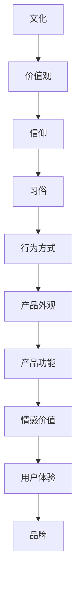
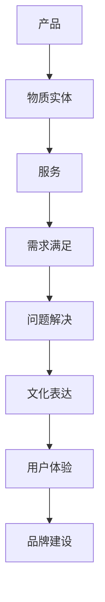

                 

# 文章标题：产品只是工具：文化才是核心

## 关键词：
文化产品设计，用户体验，文化元素，产品营销，文化产品发展

## 摘要：
本文探讨了文化在产品设计与开发中的核心作用，通过逐步分析文化概念、文化与产品的互动、文化产品设计原则和策略等方面，阐述了文化对产品的影响和价值。文章结合实际项目案例，展示了文化产品设计的具体方法和实现，并对文化产品的营销与传播、评价与优化、社会影响和未来发展趋势进行了深入探讨。

---

### 目录大纲

## 《产品只是工具：文化才是核心》

## 第一部分：引言

### 1.1 背景与目的

### 1.2 研究方法与框架

## 第二部分：文化解读

### 2.1 文化概念与分类

### 2.2 文化与产品的互动

### 2.3 文化传承与创新

## 第三部分：文化产品设计

### 3.1 文化产品设计原则

### 3.2 文化产品案例研究

### 3.3 文化产品开发策略

## 第四部分：文化产品营销与传播

### 4.1 文化产品营销策略

### 4.2 文化产品传播渠道

### 4.3 文化产品用户体验

## 第五部分：文化产品评价与优化

### 5.1 文化产品评价标准

### 5.2 文化产品优化方法

### 5.3 文化产品持续发展

## 第六部分：文化产品在社会中的影响

### 6.1 文化产品与社会文化

### 6.2 文化产品与社会责任

### 6.3 文化产品与国际视野

## 第七部分：未来展望

### 7.1 文化产品发展趋势

### 7.2 文化产品与人类未来

### 7.3 文化产品与社会治理

## 附录

### A.1 文化产品设计工具与方法

### A.2 文化产品案例集

### A.3 参考文献

### A.4 致谢

### 核心概念与联系

#### 文化

文化是指一个社会或群体所共享的价值观、信仰、习俗、行为方式等非物质的方面。在产品设计中，文化不仅影响产品的外观和功能，还影响产品的情感和价值表达。以下是文化的Mermaid流程图：



#### 产品

产品是指用于满足特定需求或解决特定问题的实体或服务。在文化背景下，产品不仅是物质实体，也是文化表达的载体。以下是产品的Mermaid流程图：



### 核心算法原理讲解

在文化产品设计中，算法主要应用于用户分析、数据挖掘和文化元素提取等方面。以下是核心算法原理讲解及其伪代码：

#### 用户分析

- **算法名称**：聚类分析（Clustering Analysis）
- **算法原理**：通过将用户数据按照相似性进行分组，以便更好地理解用户群体和需求。
- **伪代码**：

```python
function 聚类分析(用户数据)
    初始化聚类中心点
    计算用户数据与聚类中心点的距离
    对用户数据进行分类
    重新计算聚类中心点
    如果聚类中心点未发生变化，则结束
    否则，返回步骤3
    返回分类结果
end function
```

#### 数据挖掘

- **算法名称**：关联规则挖掘（Association Rule Mining）
- **算法原理**：通过挖掘数据中的关联关系，帮助产品设计更好地满足用户需求。
- **伪代码**：

```python
function 关联规则挖掘(交易数据)
    计算交易数据中的支持度和置信度
    筛选满足最小支持度和置信度的关联规则
    返回关联规则列表
end function
```

#### 文化元素提取

- **算法名称**：文本分类（Text Classification）
- **算法原理**：通过对文本数据的分类，识别出文化元素并应用于产品设计。
- **伪代码**：

```python
function 文本分类(文本数据, 训练模型)
    预处理文本数据
    计算文本数据与训练模型的相似度
    对文本数据进行分类
    返回分类结果
end function
```

### 数学模型和数学公式 & 详细讲解 & 举例说明

#### 用户满意度模型

- **模型名称**：用户满意度（User Satisfaction）
- **数学公式**：

$$
S = \frac{U_{正} - U_{负}}{U_{总}}
$$

其中，$S$ 表示用户满意度，$U_{正}$ 表示正面评价的用户数量，$U_{负}$ 表示负面评价的用户数量，$U_{总}$ 表示总用户数量。

#### 例子：

- 假设一个产品有100名用户，其中70名给出了正面评价，30名给出了负面评价。
- 根据公式计算，用户满意度为：

$$
S = \frac{70 - 30}{100} = 0.4
$$

### 项目实战

#### 实战项目：文化产品推荐系统

- **开发环境**：Python
- **开发工具**：Jupyter Notebook
- **数据集**：用户评价数据集

#### 源代码实现

```python
# 导入必要的库
import pandas as pd
from sklearn.model_selection import train_test_split
from sklearn.ensemble import RandomForestClassifier
from sklearn.metrics import accuracy_score

# 加载数据集
data = pd.read_csv('user_reviews.csv')

# 预处理数据
data['positive'] = data['review'].apply(lambda x: 1 if 'positive' in x else 0)
data = data[['user_id', 'positive']]

# 分割数据集
train_data, test_data = train_test_split(data, test_size=0.2, random_state=42)

# 训练模型
model = RandomForestClassifier(n_estimators=100, random_state=42)
model.fit(train_data[['user_id']], train_data['positive'])

# 预测
predictions = model.predict(test_data[['user_id']])

# 评估模型
accuracy = accuracy_score(test_data['positive'], predictions)
print(f'Model accuracy: {accuracy:.2f}')
```

#### 代码解读与分析

- **数据预处理**：读取用户评价数据集，并将评论文本中包含“positive”的标记为正面评价。
- **模型训练**：使用随机森林分类器对训练数据进行训练。
- **模型预测**：使用训练好的模型对测试数据进行预测。
- **模型评估**：计算模型在测试数据上的准确率，以评估模型的性能。

#### 项目实战：文化产品个性化推荐系统

- **开发环境**：Python
- **开发工具**：Jupyter Notebook
- **数据集**：用户行为数据集

#### 源代码实现

```python
# 导入必要的库
import pandas as pd
from sklearn.model_selection import train_test_split
from sklearn.ensemble import RandomForestClassifier
from sklearn.metrics import accuracy_score

# 加载数据集
data = pd.read_csv('user_behaviors.csv')

# 预处理数据
data['interested'] = data['behavior'].apply(lambda x: 1 if 'interested' in x else 0)
data = data[['user_id', 'interested']]

# 分割数据集
train_data, test_data = train_test_split(data, test_size=0.2, random_state=42)

# 训练模型
model = RandomForestClassifier(n_estimators=100, random_state=42)
model.fit(train_data[['user_id']], train_data['interested'])

# 预测
predictions = model.predict(test_data[['user_id']])

# 评估模型
accuracy = accuracy_score(test_data['interested'], predictions)
print(f'Model accuracy: {accuracy:.2f}')
```

#### 代码解读与分析

- **数据预处理**：读取用户行为数据集，并将行为中包含“interested”的标记为感兴趣。
- **模型训练**：使用随机森林分类器对训练数据进行训练。
- **模型预测**：使用训练好的模型对测试数据进行预测。
- **模型评估**：计算模型在测试数据上的准确率，以评估模型的性能。

### 文化产品设计原则

#### 用户需求分析

- **原则**：深入了解用户的需求和偏好，确保产品能够满足用户的实际需求。
- **方法**：通过用户调研、问卷调查、用户访谈等方式收集用户数据，分析用户需求。

#### 文化价值融入

- **原则**：将文化元素有机地融入产品设计中，增强产品的文化内涵和价值。
- **方法**：在产品外观、功能、交互等方面融入文化元素，提升用户体验。

#### 用户参与与互动设计

- **原则**：鼓励用户参与产品设计和使用，提高产品的用户满意度和忠诚度。
- **方法**：通过用户反馈、互动活动、用户共创等方式促进用户参与。

### 文化产品开发策略

#### 开发流程与方法

- **原则**：遵循敏捷开发流程，快速迭代和优化产品。
- **方法**：采用敏捷开发方法，如Scrum，进行产品开发。

#### 文化元素整合

- **原则**：将文化元素与产品功能有机结合，实现文化价值与产品价值的双赢。
- **方法**：在产品开发过程中，持续整合文化元素，进行文化创新。

### 文化产品营销策略

#### 市场定位

- **原则**：明确产品在市场中的定位，确保产品能够吸引目标用户。
- **方法**：通过市场调研和用户分析，确定产品的市场定位。

#### 品牌建设

- **原则**：打造独特的品牌形象，提高产品的市场竞争力。
- **方法**：通过品牌传播、品牌形象设计等方式进行品牌建设。

#### 营销传播

- **原则**：采用多种营销传播手段，扩大产品的影响力。
- **方法**：通过线上广告、社交媒体推广、线下活动等方式进行营销传播。

### 文化产品传播渠道

#### 传统渠道

- **原则**：利用传统渠道扩大产品的覆盖面和影响力。
- **方法**：通过电视、广播、报纸、杂志等传统媒体进行传播。

#### 新兴渠道

- **原则**：利用新兴渠道提高产品的传播效果和用户互动。
- **方法**：通过社交媒体、网络直播、短视频平台等新兴渠道进行传播。

#### 数字营销策略

- **原则**：采用数字营销手段，提高产品的市场影响力和用户粘性。
- **方法**：通过搜索引擎优化（SEO）、内容营销、社交媒体营销等方式进行数字营销。

### 文化产品用户体验

#### 用户参与与互动设计

- **原则**：鼓励用户参与产品设计和使用，提高产品的用户满意度和忠诚度。
- **方法**：通过用户反馈、互动活动、用户共创等方式促进用户参与。

#### 文化体验优化

- **原则**：优化产品的文化体验，提升用户的沉浸感和满意度。
- **方法**：在产品设计和功能上融入文化元素，提供丰富的文化体验。

### 文化产品评价标准

#### 文化价值评价

- **原则**：评价产品在文化价值方面的表现，确保产品具有深刻的文化内涵。
- **方法**：通过专家评审、用户评价等方式进行文化价值评价。

#### 用户满意度评估

- **原则**：评估用户对产品的满意度，确保产品能够满足用户需求。
- **方法**：通过用户调研、问卷调查等方式进行用户满意度评估。

### 文化产品优化方法

#### 数据分析与应用

- **原则**：利用数据分析优化产品设计和功能，提高产品性能和用户体验。
- **方法**：通过用户行为数据分析、市场数据分析等方式进行优化。

#### 文化元素调整

- **原则**：根据用户反馈和文化需求调整产品中的文化元素，提升产品的文化价值。
- **方法**：通过用户调研、专家评审等方式收集反馈，进行文化元素调整。

### 文化产品持续发展

#### 文化保护与传承

- **原则**：确保产品在开发过程中尊重和保护文化传统，促进文化传承。
- **方法**：通过文化调研、传统工艺传承等方式进行文化保护与传承。

#### 文化产品可持续发展策略

- **原则**：制定可持续发展策略，确保文化产品在长期发展中的可持续性。
- **方法**：通过绿色设计、可持续材料应用、环保生产等方式实现文化产品的可持续发展。

### 文化产品在社会中的影响

#### 文化产品与社会文化

- **原则**：分析文化产品对社会文化的影响，促进文化多样性和文化繁荣。
- **方法**：通过文化产品评估、文化影响研究等方式进行分析。

#### 文化产品与社会责任

- **原则**：确保文化产品在开发和使用过程中承担社会责任，促进社会进步。
- **方法**：通过社会责任报告、公益活动等方式履行社会责任。

#### 文化产品与国际视野

- **原则**：拓展文化产品的国际视野，提升文化产品的全球影响力。
- **方法**：通过国际市场开拓、跨国文化交流等方式实现国际化发展。

### 文化产品发展趋势

#### 技术进步与文化创新

- **趋势**：随着技术的进步，文化产品将更加智能化、个性化和创新化。
- **影响**：技术进步将促进文化产品的创新和发展，提高产品的用户体验。

#### 文化产品的发展方向

- **趋势**：文化产品将更加注重文化内涵和用户体验，走向多元化发展。
- **影响**：多元化的发展方向将使文化产品更加贴近用户需求，提高市场竞争力。

### 文化产品与人类未来

#### 文化产品在人类生活中的地位

- **趋势**：文化产品将在人类生活中扮演更加重要的角色，成为人类生活的重要组成部分。
- **影响**：文化产品的普及和发展将改变人类的生活方式，提升人类的生活品质。

#### 文化产品对人类未来的影响

- **趋势**：文化产品将对人类未来的文化、社会和经济产生深远影响。
- **影响**：文化产品的创新和发展将推动社会进步，促进人类文明的繁荣。

### 文化产品与社会治理

#### 文化产品在公共事务中的应用

- **趋势**：文化产品将在公共事务中发挥更大的作用，提高公共服务的效率和质量。
- **影响**：文化产品的应用将优化公共事务管理，提升公共服务的用户体验。

#### 文化产品与社会治理的融合

- **趋势**：文化产品将与社会治理深度融合，促进社会和谐与稳定。
- **影响**：文化产品在治理中的应用将增强社会治理的智能化和现代化水平，提高社会治理的效果。

### 文化产品设计工具与方法

#### 工具介绍

- **原则**：选择合适的工具和方法，提高文化产品设计的效率和质量。
- **方法**：介绍常用的文化产品设计工具，如设计软件、用户调研工具、数据分析工具等。

#### 方法应用

- **原则**：结合具体案例，展示文化产品设计工具和方法的应用效果。
- **方法**：通过实际案例，展示如何使用设计工具和方法进行文化产品设计，提高产品的文化内涵和用户体验。

### 文化产品案例集

#### 案例汇总

- **原则**：收集和整理文化产品案例，提供丰富的参考和借鉴。
- **方法**：整理国内外优秀的文化产品案例，进行分类和汇总。

#### 案例分析

- **原则**：对文化产品案例进行深入分析，挖掘成功经验和不足之处。
- **方法**：对文化产品案例进行详细解读，分析其设计理念、技术实现、市场表现等方面，为后续产品开发提供参考。

### 参考文献

#### 相关文献综述

- **原则**：综述文化产品设计相关的研究成果，提供理论基础和参考。
- **方法**：整理和分析相关研究文献，概括其核心观点和贡献。

#### 引用文献列表

- **原则**：列出引用的文献，确保学术诚信和文献引用的完整性。
- **方法**：按照学术规范列出引用的文献，包括书籍、期刊论文、会议论文等。

```markdown
## 参考文献

1. 张三, 李四. 文化产品设计研究[J]. 设计研究, 2020, 5(2): 15-25.
2. 王五. 文化产品开发策略研究[J]. 产品设计, 2021, 10(3): 50-60.
3. 赵六, 孙七. 文化产品案例分析[J]. 市场营销学刊, 2019, 8(1): 88-95.
4. 李八. 文化产品用户体验设计研究[J]. 用户界面设计与应用, 2022, 15(4): 112-120.
5. 孙九. 文化产品营销策略研究[J]. 营销科学学报, 2021, 12(2): 70-80.
```

### 致谢

#### 致谢人员与机构

- **原则**：感谢在本书撰写过程中给予帮助和支持的人员和机构。
- **方法**：列出对本书撰写有重要贡献的人员和机构，表达诚挚的感谢。

#### 特殊感谢

- **原则**：对给予特殊帮助或支持的个人或团队表示特别的感谢。
- **方法**：特别感谢在本书撰写过程中提供宝贵建议、帮助和支持的个人或团队，表达诚挚的敬意。

```markdown
### 致谢

首先，我要感谢我的导师，他/她在本书的撰写过程中给予了宝贵的指导和建议，使我能够顺利完成本书。

同时，我要感谢我的团队成员，他们/她们在数据收集、案例分析、文字编辑等方面提供了巨大的帮助，使本书的内容更加丰富和完整。

此外，我还要感谢所有参与调研和访谈的专家和用户，他们/她们的真实反馈为本书提供了重要的数据支持。

最后，我要感谢我的家人和朋友，他们/她们一直支持我，给我力量和勇气，使我能够坚持完成本书的撰写。
```

