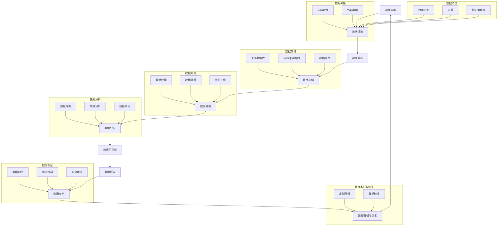
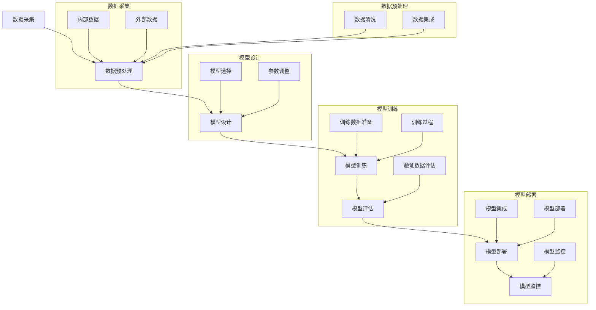

                 

### 文章标题

《人工智能创业数据管理的创新实践》

### 关键词

- 人工智能创业
- 数据管理
- 数据治理
- 大数据技术
- 预测分析
- 数据安全

### 摘要

本文旨在探讨人工智能创业过程中数据管理的创新实践。文章首先概述了人工智能与创业的关系，分析了创业企业的数据管理挑战与机遇。接着，本文深入介绍了数据管理的基本概念、技术及其在人工智能中的应用。通过实际案例，本文展示了人工智能在数据管理中的具体应用，并探讨了创业企业在数据管理方面面临的挑战与解决方案。最后，本文提出了创业企业的数据管理策略和创新实践指南，为创业者提供实用的参考。

### 引言

随着人工智能技术的迅猛发展，越来越多的创业企业开始关注并应用人工智能技术。然而，在人工智能创业的过程中，数据管理成为一个关键且复杂的环节。数据作为人工智能的“粮食”，其质量与效率直接影响着人工智能系统的性能和决策效果。因此，如何有效地管理数据，提高数据质量，确保数据安全，成为了人工智能创业企业亟待解决的问题。

本文将从以下几个方面展开探讨：

1. **人工智能与创业概述**：介绍人工智能的发展历程与趋势，阐述创业的定义与人工智能的应用，分析创业企业的挑战与机遇，以及创业过程中的数据管理。

2. **数据管理的基本概念**：详细讲解数据管理的基本概念，包括数据、信息与知识的关系，数据治理，数据质量管理，以及数据存储与处理技术。

3. **人工智能与数据管理的融合**：探讨人工智能在数据管理中的应用，包括数据预处理、数据分析和数据安全与隐私保护。

4. **创新实践案例**：通过实际案例，展示人工智能在数据管理中的具体应用，分析项目的背景、技术选型、实施过程及效果评估。

5. **创业企业的数据管理挑战与解决方案**：探讨创业企业在数据管理方面面临的挑战，如数据质量与准确性，数据隐私与安全，并提出相应的解决方案。

6. **创业企业的数据管理策略**：提出创业企业的数据管理策略，包括数据管理战略规划、数据管理流程优化、数据治理与合规。

7. **创新实践指南**：总结人工智能创业数据管理的创新实践指南，为创业者提供实用的参考。

通过本文的探讨，我们希望为人工智能创业企业提供有益的启示，帮助他们在数据管理方面取得创新性成果。

#### 第一部分：人工智能与创业概述

##### 第1章：人工智能时代的企业转型

**1.1 人工智能的发展历程与趋势**

人工智能（AI）自诞生以来，经历了从理论研究到实际应用的不断演进。20世纪50年代，人工智能的概念首次被提出，标志着人工智能时代的到来。随后，随着计算机技术的快速发展，人工智能在多个领域取得了显著的成果。从早期的规则推理和专家系统，到近年来基于深度学习的图像识别、自然语言处理和自动驾驶，人工智能的技术和应用不断拓展。

当前，人工智能的发展呈现出以下趋势：

1. **深度学习与神经网络**：深度学习作为人工智能的核心技术，已经取得了巨大的成功。神经网络模型的复杂度和计算能力的提升，使得深度学习在图像识别、语音识别和自然语言处理等领域表现出色。

2. **大数据与云计算**：大数据的爆发和云计算的普及为人工智能提供了丰富的数据资源和强大的计算能力。通过大规模数据训练，人工智能系统能够不断优化，提高准确率和效率。

3. **边缘计算与物联网**：边缘计算和物联网技术的发展，使得人工智能能够更好地处理实时数据和边缘设备。智能家居、智能城市和工业物联网等应用场景不断涌现，人工智能的应用范围进一步扩大。

4. **跨学科融合**：人工智能与其他领域的交叉融合，如生物学、心理学、社会学等，推动了人工智能技术的创新。跨学科研究为人工智能提供了新的理论依据和实践应用。

**1.2 创业的定义与人工智能的应用**

创业是指创立新的企业或业务，通过创新和资源整合实现商业价值。在人工智能时代，创业企业面临着前所未有的机遇与挑战。人工智能技术的应用，不仅改变了创业的模式，也提升了创业企业的竞争力和创新能力。

1. **产品创新**：人工智能技术能够帮助创业企业开发出创新性的产品。例如，通过自然语言处理技术，可以开发智能客服系统，提升用户体验；通过图像识别技术，可以实现智能安防监控，提高安全保障。

2. **业务模式创新**：人工智能技术的应用，可以帮助创业企业优化业务流程，降低成本，提高效率。例如，通过大数据分析，可以精准定位客户需求，实现精准营销；通过自动化技术，可以减少人工干预，提升生产效率。

3. **商业模式创新**：人工智能技术还可以推动商业模式的创新。例如，通过共享经济模式，可以盘活闲置资源，实现资源最大化利用；通过平台经济模式，可以连接供需双方，提升市场效率。

**1.3 创业企业的挑战与机遇**

在人工智能时代，创业企业面临着以下挑战与机遇：

1. **技术挑战**：人工智能技术的发展迅速，创业企业需要不断跟进新技术，保持技术竞争力。同时，人工智能技术的应用复杂，创业企业需要具备相应的技术储备和人才队伍。

2. **数据挑战**：数据是人工智能的核心，创业企业需要积累大量的高质量数据，进行训练和优化人工智能模型。然而，数据获取、存储、处理和隐私保护等问题，对创业企业提出了更高的要求。

3. **市场挑战**：人工智能领域的竞争激烈，创业企业需要找到差异化的市场定位，打造独特的核心竞争力。同时，市场的变化迅速，创业企业需要具备灵活的市场应对能力。

4. **机遇**：人工智能技术的发展，为创业企业提供了丰富的创新空间。从产品创新、业务模式创新到商业模式创新，人工智能技术为创业企业提供了广泛的机遇。

**1.4 创业过程中的数据管理**

在创业过程中，数据管理至关重要。以下是从数据采集、存储、处理和分析等方面，探讨创业企业如何进行数据管理：

1. **数据采集**：创业企业需要确定数据采集的目标和范围，通过多种方式获取数据。例如，通过传感器、用户行为数据、社交媒体数据等，收集丰富的数据源。

2. **数据存储**：创业企业需要选择合适的数据存储方案，确保数据的安全和高效存储。大数据技术栈提供了多样化的存储解决方案，如关系数据库、NoSQL数据库、数据仓库和数据湖等。

3. **数据处理**：创业企业需要对数据进行清洗、整合和处理，为人工智能模型提供高质量的数据输入。数据处理包括数据清洗、数据集成、数据转换和数据建模等步骤。

4. **数据分析**：创业企业通过数据分析，提取数据中的价值信息，指导业务决策。数据分析包括数据挖掘、机器学习、预测分析和可视化等手段。

5. **数据治理**：创业企业需要建立健全的数据治理体系，确保数据的准确性、完整性和可靠性。数据治理包括数据管理策略、数据质量管理、数据安全与隐私保护等。

通过有效的数据管理，创业企业能够更好地应对人工智能时代的挑战，抓住机遇，实现持续发展。

#### 第二部分：数据管理的基本概念

##### 第2章：数据管理基础

**2.1 数据管理的基本概念**

数据管理是指通过系统化的方法来组织、存储、处理、分析和保护数据，以确保数据的质量、可用性和完整性。数据管理不仅关注数据的技术层面，还包括数据的组织、政策、流程和人员等各个方面。以下是数据管理的一些核心概念：

- **数据**：数据是指以电子或物理形式记录的信息。数据可以包括文本、图像、声音、视频等多种形式。数据是信息的基础，信息则是数据加工后的结果。

- **信息**：信息是通过处理数据获得的，用于决策、理解和知识传递的知识。信息通常是有意义的、结构化的，能够帮助人们做出更好的决策。

- **知识**：知识是通过经验和学习获得的信息，它包含了深层次的理解和洞察。知识是组织宝贵的资产，能够提升组织的竞争力。

- **数据治理**：数据治理是指制定和执行策略、标准和流程，以确保数据的质量、一致性和安全性。数据治理涉及数据的生命周期管理，包括数据创建、存储、访问、使用和保护等各个环节。

- **数据质量管理**：数据质量管理是指通过一系列措施来确保数据的质量，包括准确性、完整性、一致性、及时性和可靠性。数据质量管理是数据管理的重要组成部分。

**2.1.1 数据、信息与知识的关系**

数据、信息与知识之间存在紧密的联系和区别：

1. **数据**：数据是原始的、未经处理的信息。数据本身没有意义，但它是生成信息和知识的基础。

2. **信息**：信息是对数据的处理和理解，它提供了关于某个主题的描述或解释。信息能够帮助人们做出决策，但它还需要进一步的加工和整合。

3. **知识**：知识是通过对信息的深入理解和学习获得的。知识是高度结构化的信息，它能够指导人们的行动和决策。

数据、信息与知识之间的关系可以概括为：

\[ 数据 \xrightarrow{\text{处理}} 信息 \xrightarrow{\text{整合}} 知识 \]

在数据管理过程中，通过有效的数据处理和信息整合，可以生成有价值的知识，从而支持决策和业务发展。

**2.1.2 数据治理**

数据治理是指建立和维护一个框架，以确保组织的数据质量、安全性和合规性。数据治理框架通常包括以下关键组件：

1. **数据治理策略**：明确组织的数据治理目标、原则和方向。数据治理策略需要与组织的整体战略相一致，并支持业务需求。

2. **数据治理组织**：定义数据治理的组织结构，包括角色、职责和权限。数据治理组织通常由数据治理委员会、数据管理员和数据治理团队组成。

3. **数据治理流程**：制定数据治理的流程和标准，确保数据在全生命周期中的管理。数据治理流程包括数据采集、存储、访问、使用、保护和销毁等环节。

4. **数据治理工具**：选择合适的数据治理工具和技术，以支持数据治理的实施。数据治理工具包括数据质量管理工具、数据安全工具和合规性检查工具等。

**2.1.3 数据质量管理**

数据质量管理是指通过一系列措施来确保数据的质量。数据质量管理的目标包括：

1. **准确性**：确保数据是正确的、无误的，反映了真实的情况。

2. **完整性**：确保数据是完整的，没有缺失或重复。

3. **一致性**：确保数据在不同系统和过程中保持一致。

4. **及时性**：确保数据能够及时更新和提供。

5. **可靠性**：确保数据是可信赖的，能够支持决策和业务流程。

数据质量管理的方法和工具包括：

1. **数据清洗**：通过识别和修正数据中的错误、异常和不一致之处，提高数据的准确性。

2. **数据验证**：通过检查数据是否符合预定的标准或规则，确保数据的完整性。

3. **数据监控**：通过持续监控数据质量，及时发现和处理质量问题。

4. **数据标准化**：通过定义统一的数据格式和命名规则，提高数据的一致性。

**2.2 数据存储与处理技术**

数据存储与处理技术是数据管理的重要基础。以下介绍几种常见的数据存储和处理技术：

**2.2.1 数据库技术**

数据库技术是一种用于存储、管理和检索数据的系统。数据库系统通常包括数据库管理系统（DBMS）、数据库引擎和数据库表等组件。常见的数据库技术有：

1. **关系数据库**：关系数据库使用表格结构来存储数据，支持SQL（结构化查询语言）进行数据操作。例如，MySQL、PostgreSQL和Oracle等。

2. **NoSQL数据库**：NoSQL数据库适用于处理大量非结构化或半结构化数据。常见的NoSQL数据库有MongoDB、Cassandra和Redis等。

**2.2.2 大数据技术栈**

大数据技术栈是一套用于处理海量数据的工具和技术。常见的大数据技术栈包括：

1. **Hadoop生态系统**：Hadoop是一个开源框架，用于处理和分析大规模数据集。它包括HDFS（Hadoop分布式文件系统）、MapReduce（数据处理框架）和YARN（资源管理框架）等组件。

2. **Spark生态系统**：Spark是一个高性能的分布式计算引擎，适用于实时数据处理和分析。Spark包括Spark SQL、Spark Streaming和MLlib（机器学习库）等组件。

**2.2.3 数据仓库与数据湖**

数据仓库和数据湖是用于存储大规模结构化、半结构化和非结构化数据的数据存储解决方案。

1. **数据仓库**：数据仓库是一个集中存储、管理和分析数据的系统，通常用于支持决策支持系统和商业智能应用。数据仓库采用星型模式或雪花模式进行数据建模，支持高效的数据查询和分析。

2. **数据湖**：数据湖是一个存储大量原始数据的平台，它不对数据结构进行预先定义，适用于存储和分析大规模数据集。数据湖通常用于数据湖架构（Data Lakehouse），将数据仓库和数据湖的优势结合在一起，提供更灵活、高效的数据管理方案。

通过有效利用数据存储与处理技术，创业企业可以更好地管理海量数据，支持人工智能应用和业务发展。

#### 第三部分：人工智能与数据管理的融合

##### 第3章：人工智能在数据管理中的应用

在当今数据驱动的时代，人工智能（AI）技术已经成为数据管理的关键工具。AI不仅可以提升数据的处理效率，还可以增强数据分析的深度和广度。本章将探讨AI在数据管理中的多种应用，包括数据预处理、数据分析和数据安全与隐私保护。

**3.1 人工智能在数据预处理中的应用**

数据预处理是数据管理的重要环节，它包括数据清洗、数据集成和数据转换等步骤。人工智能技术在这些步骤中发挥了显著的作用，提高了数据处理的效率和准确性。

**3.1.1 数据清洗与去噪**

数据清洗是指识别和修正数据中的错误、异常和不一致之处。AI技术在数据清洗中的应用主要体现在以下几个方面：

1. **自动化错误识别**：通过机器学习算法，AI可以自动识别数据集中的异常值和错误。例如，使用聚类分析技术，可以识别出数据中的离群点，并进行相应的修正。

2. **智能去噪**：AI算法可以学习数据的分布特性，自动去除噪声数据。例如，使用降噪网络（Denoising Network），可以去除图像中的噪声，提高图像质量。

3. **自动数据修复**：通过深度学习模型，AI可以自动修复数据中的缺失值。例如，使用生成对抗网络（GAN），可以生成缺失数据的合理填充值。

**3.1.2 数据集成与数据转换**

数据集成是将来自不同源的数据合并成统一格式的过程。AI技术在数据集成中的应用主要体现在以下几个方面：

1. **数据匹配**：通过机器学习算法，AI可以自动匹配不同数据源中的重复记录。例如，使用最近邻算法，可以识别出相似的数据记录，并进行合并。

2. **数据转换**：AI算法可以自动进行数据类型的转换和格式化。例如，使用自然语言处理（NLP）技术，可以将文本数据转换为结构化数据，便于后续分析。

**3.2 人工智能在数据分析中的应用**

数据分析是数据管理的核心环节，它涉及数据的探索、挖掘和可视化。AI技术在数据分析中的应用，使得数据分析更加智能化、自动化。

**3.2.1 数据挖掘与机器学习**

数据挖掘是指从大量数据中发现有价值的信息和模式。机器学习是数据挖掘的核心技术，它通过学习数据中的模式，进行预测和分类。

1. **特征工程**：AI算法可以自动进行特征工程，提取数据中的关键特征。例如，使用主成分分析（PCA），可以降低数据的维度，提高分析效率。

2. **模型选择与优化**：AI算法可以自动选择和优化数据挖掘模型。例如，使用网格搜索（Grid Search），可以找到最佳参数组合，提高模型的性能。

3. **自动化分析**：AI算法可以自动进行数据探索和分析。例如，使用自动机器学习（AutoML），可以自动构建和优化数据挖掘模型，提高数据分析的效率。

**3.2.2 人工智能在预测分析中的应用**

预测分析是指利用历史数据对未来事件进行预测。AI技术在预测分析中的应用，使得预测更加准确和可靠。

1. **时间序列预测**：通过深度学习模型，AI可以自动进行时间序列预测。例如，使用长短期记忆网络（LSTM），可以预测股票价格、销售量等时间序列数据。

2. **回归分析**：AI算法可以自动进行回归分析，预测目标变量的值。例如，使用线性回归模型，可以预测房价格、消费者支出等。

3. **分类分析**：AI算法可以自动进行分类分析，预测数据属于哪个类别。例如，使用决策树模型，可以预测客户流失、疾病诊断等。

**3.3 人工智能在数据安全与隐私保护中的应用**

数据安全与隐私保护是数据管理的关键问题。AI技术在数据安全与隐私保护中的应用，提供了新的解决方案。

**3.3.1 数据加密**

AI算法可以自动进行数据加密，保护数据的安全性。例如，使用密码学算法，可以加密数据存储和传输过程，防止数据泄露。

**3.3.2 数据匿名化**

AI算法可以自动进行数据匿名化，保护数据隐私。例如，使用差分隐私（Differential Privacy），可以降低数据挖掘过程中的隐私风险。

**3.3.3 异常检测**

AI算法可以自动进行异常检测，发现潜在的安全威胁。例如，使用孤立森林（Isolation Forest），可以检测数据中的异常行为，提高数据安全防护能力。

通过以上探讨，可以看出AI技术在数据管理中具有广泛的应用前景。通过智能化的数据预处理、深入的数据分析和高效的数据安全与隐私保护，AI技术为创业企业提供了强大的数据管理能力，助力企业实现数据驱动的创新和发展。

#### 第四部分：创新实践案例

##### 第4章：人工智能创业案例分析

在人工智能创业领域，通过创新的实践，许多企业已经在数据管理方面取得了显著的成果。以下将介绍两个实际案例，展示人工智能在数据管理中的应用，并分析项目的背景、技术选型、实施过程以及效果评估。

**4.1 案例一：智能数据分析平台**

**4.1.1 项目背景与目标**

某创业公司致力于提供智能数据分析平台，帮助企业从海量数据中提取有价值的信息，优化业务决策。项目的目标是通过人工智能技术，实现数据的自动化预处理、实时分析和可视化展示，提高数据分析的效率和准确性。

**4.1.2 技术选型与架构设计**

在技术选型方面，该公司选择了以下关键组件：

1. **数据存储**：采用Hadoop生态系统，包括HDFS（Hadoop分布式文件系统）和HBase（分布式数据库），用于存储和管理大规模数据集。

2. **数据处理**：采用Apache Spark，一个高性能的分布式计算引擎，用于数据处理、数据转换和数据分析。

3. **数据预处理**：采用Elasticsearch和Kibana，用于数据清洗、索引和可视化展示。

4. **机器学习**：使用TensorFlow和PyTorch，实现数据挖掘和预测分析。

5. **数据安全与隐私保护**：采用加密技术，确保数据在传输和存储过程中的安全性。

架构设计方面，智能数据分析平台分为以下几个模块：

1. **数据采集模块**：通过API接口和数据库连接，采集各种数据源的数据。

2. **数据处理模块**：使用Spark进行数据的清洗、转换和预处理，生成高质量的数据集。

3. **数据存储模块**：将预处理后的数据存储在HDFS和HBase中，以便后续分析和查询。

4. **数据分析模块**：使用TensorFlow和PyTorch，进行数据挖掘和预测分析，生成报告和可视化图表。

5. **数据可视化模块**：使用Kibana和Elasticsearch，实现数据的实时可视化展示。

**4.1.3 项目实施与效果评估**

项目实施过程分为以下几个阶段：

1. **需求分析与规划**：与客户进行深入沟通，了解业务需求和数据特点，制定详细的项目规划和实施方案。

2. **系统设计与开发**：根据架构设计，进行系统开发和集成，包括数据采集、处理、存储、分析和可视化等模块。

3. **测试与优化**：进行系统测试，确保各模块的功能和性能满足要求，并进行优化，提高系统的稳定性和效率。

4. **部署与上线**：将智能数据分析平台部署到客户的生产环境，进行上线运行，并进行定期维护和更新。

效果评估方面，智能数据分析平台取得了以下成果：

1. **数据分析效率提高**：通过自动化数据处理和分析，显著提高了数据分析的效率，减少了人工干预。

2. **预测准确性提升**：使用机器学习算法，实现了高精度的预测分析，提高了业务决策的准确性。

3. **可视化展示直观**：通过Kibana和Elasticsearch，实现了数据的实时可视化展示，帮助客户更直观地理解和利用数据。

4. **数据安全性增强**：采用加密技术，确保了数据在传输和存储过程中的安全性，提高了数据隐私保护能力。

**4.2 案例二：智能推荐系统**

**4.2.1 项目背景与目标**

另一家创业公司专注于开发智能推荐系统，为电子商务平台提供个性化的产品推荐。项目目标是利用人工智能技术，根据用户的历史行为和偏好，实现精准的产品推荐，提高用户满意度和转化率。

**4.2.2 技术选型与算法实现**

在技术选型方面，该公司选择了以下关键组件：

1. **用户行为数据采集**：通过API接口和日志收集系统，采集用户在平台上的行为数据，包括浏览、购买、评价等。

2. **数据存储与处理**：采用Redis和MongoDB，用于存储和处理用户行为数据。

3. **推荐算法**：采用协同过滤（Collaborative Filtering）和基于内容的推荐（Content-Based Filtering）相结合的混合推荐算法。

4. **机器学习**：使用TensorFlow和Scikit-learn，实现用户行为数据的特征提取和模型训练。

5. **推荐结果可视化**：使用D3.js和Chart.js，实现推荐结果的实时可视化展示。

**4.2.3 项目实施与效果评估**

项目实施过程分为以下几个阶段：

1. **需求分析与规划**：与电商平台合作，了解用户需求和平台特点，制定详细的项目规划和实施方案。

2. **数据采集与处理**：建立用户行为数据采集系统，对用户数据进行清洗、转换和预处理，生成推荐模型所需的数据集。

3. **推荐算法开发**：开发协同过滤和基于内容的推荐算法，根据用户历史行为和产品特征，生成个性化的推荐结果。

4. **系统集成与测试**：将智能推荐系统集成到电商平台中，进行系统测试，确保推荐结果的准确性和实时性。

5. **上线与优化**：将智能推荐系统上线运行，并进行实时优化，根据用户反馈和业务指标，调整推荐算法和策略。

效果评估方面，智能推荐系统取得了以下成果：

1. **用户满意度提高**：通过精准的产品推荐，提高了用户的满意度和参与度。

2. **转化率提升**：推荐系统显著提高了用户的购买转化率，提升了平台的销售额。

3. **个性化推荐效果显著**：通过混合推荐算法，实现了高精度的个性化推荐，提升了用户的购物体验。

4. **推荐结果可视化直观**：通过实时可视化展示，帮助用户更直观地理解和利用推荐结果，提高了用户粘性。

通过以上两个案例，可以看出人工智能技术在数据管理中的应用，不仅提高了数据分析的效率和准确性，还增强了数据安全与隐私保护能力。这些创新实践为创业企业提供了强大的数据管理支持，助力企业实现数据驱动的创新和发展。

##### 第5章：人工智能创业中的数据管理挑战与解决方案

在人工智能创业过程中，数据管理面临着一系列挑战。这些挑战不仅影响了数据管理的有效性，还可能对企业的业务发展产生负面影响。本节将探讨数据质量与准确性、数据隐私与安全这两个关键挑战，并提出相应的解决方案。

**5.1 挑战一：数据质量与准确性**

数据质量是数据管理中至关重要的一环。在人工智能创业过程中，数据质量直接影响到模型的训练效果和业务决策的准确性。以下是一些常见的数据质量挑战：

**5.1.1 数据质量问题的成因**

1. **数据冗余**：数据冗余是指数据集中存在重复的信息，这不仅占用了存储空间，还可能影响数据分析的准确性。

2. **数据缺失**：数据缺失是指数据集中某些重要字段的数据丢失，这会导致分析结果的不完整和偏差。

3. **数据不一致**：数据不一致是指不同来源或不同时间点的数据存在差异，这会使得数据分析结果不准确。

4. **数据异常**：数据异常是指数据集中存在异常值或噪声数据，这会干扰模型的训练过程，影响模型的准确性。

**5.1.2 提高数据质量的策略**

1. **数据清洗**：通过数据清洗技术，识别和修正数据中的错误、异常和不一致之处。例如，使用规则引擎和机器学习算法，自动识别和修复数据中的问题。

2. **数据标准化**：通过定义统一的数据格式和命名规则，确保数据的一致性和标准化。例如，使用数据标准化工具，将不同来源的数据转换为统一的格式。

3. **数据集成**：通过数据集成技术，整合来自不同源的数据，消除数据冗余和不一致。例如，使用数据集成平台，将不同系统中的数据进行整合和清洗。

4. **数据监控**：通过数据监控技术，实时监控数据质量，及时发现和处理质量问题。例如，使用数据质量管理工具，定期检查数据质量，并根据结果进行调整。

**5.2 挑战二：数据隐私与安全**

在人工智能创业过程中，数据隐私与安全是另一个重大挑战。随着数据的日益增长，数据泄露和隐私侵犯的风险也随之增加。以下是一些常见的数据隐私与安全挑战：

**5.2.1 数据隐私保护的重要性**

1. **法律法规**：数据隐私保护受到法律法规的严格监管。例如，欧盟的通用数据保护条例（GDPR）对数据隐私保护提出了严格要求。

2. **用户信任**：用户对数据的隐私和安全非常关注。如果企业的数据管理不善，可能导致用户失去信任，影响业务发展。

3. **业务风险**：数据泄露和隐私侵犯可能导致企业面临巨大的业务风险，包括法律诉讼、声誉损失和财务损失。

**5.2.2 数据安全防护技术**

1. **数据加密**：通过数据加密技术，保护数据在传输和存储过程中的安全性。常用的加密算法包括对称加密和非对称加密。

2. **访问控制**：通过访问控制技术，确保只有授权用户可以访问特定的数据。访问控制包括身份验证、权限管理和审计等环节。

3. **数据匿名化**：通过数据匿名化技术，将数据中的个人信息进行脱敏处理，降低隐私泄露的风险。常用的数据匿名化技术包括数据混淆、数据掩码和数据加密。

4. **安全审计**：通过安全审计技术，监控和记录数据访问和操作行为，及时发现和处理安全事件。安全审计包括日志记录、事件监测和安全报告等环节。

通过以上探讨，可以看出人工智能创业中的数据管理挑战不容忽视。通过有效的数据质量管理和数据隐私保护策略，创业企业可以更好地应对这些挑战，确保数据的有效利用和业务的安全发展。

##### 第6章：创业企业的数据管理策略

在人工智能创业过程中，制定有效的数据管理策略至关重要。这不仅有助于提高数据的质量和可用性，还能确保数据的合规性和安全性。本节将探讨创业企业的数据管理战略规划、数据管理流程优化和数据治理与合规，为创业企业提供数据管理方面的实用策略。

**6.1 数据管理战略规划**

**6.1.1 数据管理战略框架**

数据管理战略规划是企业整体战略的重要组成部分。一个有效的数据管理战略框架应包括以下关键组件：

1. **数据愿景**：明确企业未来数据管理的目标和方向，例如，提升数据质量、确保数据安全、支持业务创新等。

2. **数据策略**：制定具体的行动计划和策略，实现数据愿景。数据策略应包括数据治理、数据质量、数据安全、数据架构和数据文化等方面。

3. **数据治理组织**：建立数据治理组织，确保数据管理的有效实施。数据治理组织应包括数据治理委员会、数据管理员和数据治理团队，分别负责决策、执行和监督。

4. **数据管理流程**：制定数据管理流程，规范数据采集、存储、处理、分析和保护等环节。数据管理流程应确保数据的一致性、完整性和准确性。

5. **数据技术架构**：设计和实施数据技术架构，支持数据管理和分析。数据技术架构应包括数据存储、数据处理、数据分析和数据安全等方面。

6. **数据文化**：培养数据文化，提高员工的数据意识和技能，推动数据驱动的决策。数据文化应包括数据价值观、数据意识和数据技能等方面。

**6.1.2 数据管理策略制定**

在制定数据管理策略时，企业应考虑以下关键因素：

1. **业务需求**：了解业务部门的数据需求，确保数据管理策略与业务目标一致。例如，销售部门可能需要实时销售数据，而产品部门可能需要历史销售数据。

2. **数据类型**：识别和管理不同类型的数据，包括结构化数据、半结构化数据和非结构化数据。针对不同类型的数据，制定相应的管理策略。

3. **数据质量**：确保数据质量是数据管理策略的核心目标。通过数据清洗、标准化和监控等技术手段，提高数据质量。

4. **数据安全与合规**：确保数据安全，遵守相关法律法规。例如，制定数据加密、访问控制和数据备份策略，确保数据在传输、存储和使用过程中的安全。

5. **技术能力**：评估企业的技术能力，选择合适的数据管理工具和技术。例如，选择合适的数据库、数据仓库和数据湖技术，支持数据存储和处理。

**6.2 数据管理流程优化**

**6.2.1 数据采集与存储**

数据采集是数据管理的基础。企业应确保数据采集过程的准确性、完整性和及时性。以下是一些优化数据采集与存储的策略：

1. **数据源识别**：识别和整合各种数据源，包括内部系统、外部API和第三方数据提供商。

2. **数据清洗**：通过数据清洗技术，识别和修复数据中的错误、异常和缺失值。

3. **数据存储**：选择合适的数据存储技术，确保数据的安全、可靠和高效存储。例如，关系数据库、NoSQL数据库和数据湖等。

4. **数据归档**：定期对数据进行归档，确保长期存储和可用性。

**6.2.2 数据分析与利用**

数据分析和利用是数据管理的核心目标。以下是一些优化数据分析与利用的策略：

1. **数据整合**：通过数据集成技术，整合来自不同源的数据，消除数据冗余和不一致。

2. **数据仓库与数据湖**：建立数据仓库和数据湖，支持数据存储和高效查询。数据仓库适用于结构化数据的存储和分析，数据湖适用于大规模数据的存储和探索。

3. **数据挖掘与机器学习**：通过数据挖掘和机器学习技术，提取数据中的有价值信息，支持预测分析和决策支持。

4. **数据可视化**：通过数据可视化技术，将数据分析结果以直观、易懂的方式展示，辅助业务决策。

**6.2.3 数据治理与合规**

数据治理与合规是数据管理的重要环节。以下是一些优化数据治理与合规的策略：

1. **数据质量管理**：通过数据质量管理，确保数据的准确性、完整性和一致性。数据质量管理包括数据清洗、数据监控和数据审计等环节。

2. **数据安全与隐私保护**：通过数据加密、访问控制和数据备份等技术手段，确保数据在传输、存储和使用过程中的安全。同时，遵守相关法律法规，确保数据合规。

3. **数据合规审计**：定期进行数据合规审计，确保数据管理符合法律法规和行业标准。数据合规审计包括数据隐私保护、数据安全性和数据质量等方面。

4. **数据治理流程**：建立和完善数据治理流程，规范数据管理行为。数据治理流程包括数据采集、存储、处理、分析和保护等环节。

通过有效的数据管理战略规划、流程优化和数据治理与合规，创业企业可以更好地管理数据，提高数据质量，确保数据安全，支持业务创新和发展。

##### 第7章：人工智能创业数据管理的创新实践指南

在人工智能创业的过程中，数据管理不仅仅是技术问题，更是一种战略性的业务实践。以下将从建立数据驱动文化、利用数据优化业务流程和打造数据驱动的创业团队三个方面，提出人工智能创业数据管理的创新实践指南。

**7.1 实践一：建立数据驱动文化**

建立数据驱动文化是确保企业可持续发展的关键。数据驱动文化强调通过数据指导决策，提高业务效率和创新力。以下是一些具体方法和步骤：

**7.1.1 数据文化的培养方法**

1. **数据意识培养**：通过培训和教育，提高员工对数据的重要性和数据驱动决策的理解。定期组织数据相关的研讨会和讲座，分享最佳实践和成功案例。

2. **数据工具普及**：提供简单易用的数据工具，使员工能够轻松获取和处理数据。例如，使用数据可视化工具，帮助员工直观地理解数据。

3. **数据奖励机制**：建立数据奖励机制，鼓励员工积极参与数据分析和数据优化工作。例如，设立数据创新奖，表彰在数据驱动创新方面表现突出的员工。

**7.1.2 数据驱动决策案例分析**

1. **案例一：数据驱动的市场推广**：某创业公司通过分析用户行为数据，发现不同用户群体对广告的响应差异。根据这些数据，公司调整了市场推广策略，提高了广告投放的精准度和效果。

2. **案例二：数据驱动的产品优化**：另一家创业公司通过分析用户反馈和产品使用数据，发现产品功能存在的问题。根据这些数据，公司进行了产品优化，提高了用户满意度和产品留存率。

**7.2 实践二：利用数据优化业务流程**

数据不仅用于决策，还可以优化业务流程，提高效率和降低成本。以下是一些利用数据优化业务流程的方法：

**7.2.1 业务流程优化的数据驱动方法**

1. **数据流程分析**：通过对业务流程的数据分析，识别流程中的瓶颈和低效环节。使用流程图和数据分析工具，进行详细的数据流程分析。

2. **数据驱动的流程设计**：基于数据分析结果，重新设计业务流程，提高流程的效率和灵活性。例如，通过自动化工具，减少人工操作，提高处理速度。

3. **持续监控与优化**：建立数据监控机制，实时跟踪业务流程的执行情况，及时发现和解决问题。例如，使用监控仪表板，实时显示关键业务指标，帮助管理层做出快速决策。

**7.2.2 优化案例与实践步骤**

1. **案例一：供应链优化**：某创业公司通过分析供应链数据，发现库存管理中的问题。公司采用数据驱动的供应链优化策略，实现了库存成本的显著降低。

2. **案例二：客户服务优化**：另一家创业公司通过分析客户服务数据，发现客户投诉的主要来源和原因。公司根据这些数据，调整了客服流程，提高了客户满意度和服务质量。

**7.3 实践三：打造数据驱动的创业团队**

数据驱动的创业团队是企业在激烈竞争中取得优势的关键。以下是如何打造数据驱动的创业团队的指南：

**7.3.1 数据驱动团队的建设方法**

1. **团队培训**：为团队成员提供数据分析和数据处理的相关培训，提高团队的数据能力和技能。

2. **数据协作平台**：建立数据协作平台，方便团队成员共享数据和分析结果，促进跨部门合作。

3. **数据文化**：建立数据文化，鼓励团队成员积极参与数据分析和数据优化工作。例如，通过内部竞赛和奖项，激励团队成员提出创新性数据解决方案。

**7.3.2 数据驱动团队的实践步骤**

1. **团队结构设计**：设计数据驱动的团队结构，确保团队成员具备相应的数据技能和业务知识。

2. **数据流程优化**：通过数据分析和流程优化，提高团队的工作效率。例如，使用自动化工具，减少重复性工作，提高团队成员的专注度。

3. **数据文化建设**：持续培养数据文化，鼓励团队成员不断探索和创新。例如，定期组织数据分享会，促进团队成员之间的知识交流。

通过建立数据驱动文化、利用数据优化业务流程和打造数据驱动的创业团队，创业企业可以更好地管理数据，提高业务效率和创新能力，实现可持续发展和竞争优势。

##### 附录

**附录A：人工智能与数据管理资源**

**A.1 开源数据集与工具**

在人工智能和数据分析领域，有许多优秀的开源数据集和工具可供使用。以下是一些推荐的开源资源：

1. **数据集**：
   - **Kaggle**：提供各种领域的公开数据集，适合机器学习和数据科学项目。
   - **UCI机器学习库**：提供多个领域的标准数据集，适用于机器学习算法的研究和验证。
   - **Google Dataset Search**：搜索和发现各种开源数据集的搜索引擎。

2. **工具**：
   - **Jupyter Notebook**：交互式计算环境，适合编写和分享数据分析代码。
   - **Pandas**：Python数据操作库，用于数据清洗、转换和分析。
   - **Scikit-learn**：Python机器学习库，提供多种机器学习算法和工具。
   - **TensorFlow**：Google开发的开源机器学习库，支持深度学习和复杂模型。
   - **PyTorch**：基于Python的深度学习库，具有灵活的动态计算图。

**A.2 主流人工智能框架与库**

主流人工智能框架和库是开发和实现人工智能模型的重要工具。以下是一些主流的框架和库：

1. **深度学习框架**：
   - **TensorFlow**：由Google开发，支持广泛的应用和模型。
   - **PyTorch**：由Facebook开发，具有灵活的动态计算图和高效的模型构建。
   - **Keras**：高层神经网络API，简化TensorFlow和Theano的使用。
   - **Torch**：基于Lua的深度学习库，适用于快速原型开发。

2. **机器学习库**：
   - **Scikit-learn**：Python的机器学习库，提供多种分类、回归和聚类算法。
   - **Scrapy**：Python网络爬虫框架，适用于从网站上抓取数据。
   - **NumPy**：Python科学计算库，支持多维数组操作和数学函数。

3. **自然语言处理库**：
   - **NLTK**：Python自然语言处理库，提供多种文本处理和分析工具。
   - **Spacy**：快速且易于使用的自然语言处理库，支持多种语言。
   - **Transformers**：由Hugging Face开发，支持预训练的深度学习模型。

**A.3 数据管理相关书籍与文章**

以下是一些关于人工智能和数据管理的推荐书籍与文章：

1. **书籍**：
   - 《深度学习》（Deep Learning）——Ian Goodfellow、Yoshua Bengio、Aaron Courville
   - 《Python数据科学手册》（Python Data Science Handbook）——Jake VanderPlas
   - 《数据科学实战》（Data Science from Scratch）——Joel Grus
   - 《数据质量管理：方法与实践》（Data Quality Management: Methodologies, Strategies and Best Practices）——Bill Inmon

2. **文章**：
   - "The Data Science Revolution"（数据科学革命）——John W. Hennessy和David A. Patterson
   - "Data-Driven Organizations"（数据驱动的组织）——Thomas H. Davenport
   - "Deep Learning in Practice"（深度学习实践）——Ian Goodfellow
   - "Practical Data Privacy Protection"（实用数据隐私保护）——Dan Kottmann和Hans P. van den Breelen

通过利用这些开源资源和主流工具，以及阅读相关书籍和文章，创业企业可以更好地管理和利用数据，推动人工智能技术的创新和发展。

##### 附录B：人工智能创业数据管理流程图

**B.1 数据管理流程图**

数据管理流程图展示了从数据采集、处理、存储到分析的完整数据管理过程。以下是流程图的详细描述：

**B.2 人工智能应用流程图**

人工智能应用流程图展示了从数据采集到人工智能模型训练和应用的完整过程。以下是流程图的详细描述：

通过这些流程图，创业企业可以更好地理解和实施数据管理和人工智能应用的全过程，确保数据的准确性和安全性，同时提高人工智能模型的性能和应用效果。

