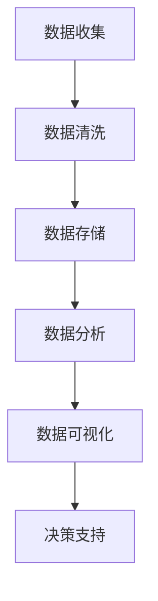

                 

# 《人工智能创业数据管理的有效策略》

## 关键词

- 人工智能
- 数据管理
- 创业
- 数据质量管理
- 数据分析与挖掘
- 数据安全与隐私
- 数据仓库与数据湖

## 摘要

本文旨在探讨人工智能创业公司在数据管理方面的有效策略。文章首先介绍了人工智能发展的背景及其在创业中的应用潜力，接着详细阐述了数据管理的重要性、数据类型、数据仓库与数据湖的基础知识。随后，文章提出了数据管理策略的设计原则，包括数据收集与存储、数据分析与挖掘、数据安全与隐私等方面的策略。接着，文章探讨了数据驱动的创业决策过程，并通过实际案例展示了如何运用数据技术进行创业。随后，文章分析了创业数据管理中面临的挑战与解决方案，并分享了成功创业数据管理的案例。最后，文章展望了未来数据管理的发展趋势，对人工智能创业数据管理提出了建议。

## 目录

### 第一部分：背景与概述

#### 第1章：人工智能与创业

##### 1.1 人工智能发展的背景

##### 1.2 创业的定义与挑战

##### 1.3 人工智能在创业中的应用潜力

#### 第2章：数据管理的基础

##### 2.1 数据管理的重要性

##### 2.2 数据类型与数据质量管理

##### 2.3 数据仓库与数据湖

### 第二部分：策略与实践

#### 第3章：数据管理策略的设计

##### 3.1 数据管理策略框架

##### 3.2 数据收集与存储策略

##### 3.3 数据分析与挖掘策略

##### 3.4 数据安全与隐私策略

#### 第4章：数据驱动的创业决策

##### 4.1 数据驱动的决策过程

##### 4.2 数据可视化工具与应用

##### 4.3 案例分析：数据驱动的创业案例研究

#### 第5章：人工智能创业中的数据技术应用

##### 5.1 机器学习在数据管理中的应用

##### 5.2 深度学习在数据分析中的应用

##### 5.3 自然语言处理在数据管理中的应用

#### 第6章：创业数据管理的挑战与解决方案

##### 6.1 数据质量与数据一致性问题

##### 6.2 数据隐私保护与合规性

##### 6.3 大数据时代的资源管理挑战

#### 第7章：成功创业数据管理的案例分享

##### 7.1 成功案例分享

##### 7.2 案例分析

##### 7.3 从案例中学习的经验与启示

### 第三部分：展望与未来

#### 第8章：未来数据管理趋势

##### 8.1 新兴技术对数据管理的影响

##### 8.2 数据管理在创业中的未来角色

##### 8.3 数据伦理与数据治理

#### 第9章：人工智能创业数据管理的未来

##### 9.1 人工智能与数据管理的深度融合

##### 9.2 创业数据管理的创新方向

##### 9.3 国际视野下的创业数据管理趋势

#### 第10章：结语

##### 10.1 总结与展望

##### 10.2 对创业者的建议

## 第一部分：背景与概述

### 第1章：人工智能与创业

#### 1.1 人工智能发展的背景

人工智能（AI）作为计算机科学的一个分支，旨在创建能够执行通常需要人类智能才能完成的任务的机器系统。从早期的专家系统到今天的深度学习和自然语言处理，人工智能经历了多次技术革命。随着计算能力的提高和大数据的普及，人工智能的应用范围不断扩大，从简单的自动化任务到复杂的决策支持系统，都有着显著的成果。

近年来，人工智能技术在多个领域取得了突破，包括语音识别、图像识别、自动驾驶、医疗诊断等。这些技术的进步不仅推动了产业的升级和转型，也为创业者提供了丰富的创新机会。人工智能的快速发展，使得创业公司能够以前所未有的方式处理数据、分析和预测市场趋势，从而在竞争激烈的市场中脱颖而出。

#### 1.2 创业的定义与挑战

创业是指创立一家新企业或新项目的过程，它通常涉及到创新、风险承担、资源整合和市场拓展。创业不仅需要创新思维和商业洞察力，还需要面对一系列的挑战，包括资金筹集、市场开发、团队建设和业务模式验证等。

在人工智能领域，创业的挑战尤为突出。首先，人工智能技术的高门槛要求创业者具备深厚的专业知识和技能。其次，人工智能项目的研发和落地需要大量的资金投入和长期的技术积累。此外，随着市场的竞争加剧，创业者还需要不断创新和快速响应市场变化，以保持竞争优势。

#### 1.3 人工智能在创业中的应用潜力

人工智能在创业中的应用潜力巨大，涵盖了从产品开发到业务运营的各个方面。以下是一些具体的应用场景：

1. **产品开发**：人工智能可以帮助创业者开发出具有智能推荐、自动分类、自然语言处理等功能的创新产品。例如，通过机器学习算法，创业者可以开发出能够自动分类和标注图像的应用程序。

2. **市场分析**：人工智能可以通过大数据分析，帮助创业者了解市场需求、用户行为和竞争对手动态，从而制定更有效的市场策略。

3. **客户服务**：利用自然语言处理和语音识别技术，创业者可以开发出智能客服系统，提高客户满意度并降低运营成本。

4. **业务优化**：通过深度学习和优化算法，创业者可以优化生产流程、提高效率，降低运营成本。

5. **风险控制**：人工智能可以帮助创业者预测和评估市场风险，从而采取相应的措施进行风险控制。

总之，人工智能为创业公司提供了强大的工具和平台，使得创业者能够更高效、更智能地开展业务。然而，要充分利用人工智能的优势，创业者还需要深入了解数据管理的基本原则和实践策略。

### 第2章：数据管理的基础

#### 2.1 数据管理的重要性

数据管理是指对数据的收集、存储、处理、分析和共享过程进行组织和管理的一系列策略和活动。在人工智能创业中，数据管理至关重要，因为数据是人工智能系统的基础和驱动力。以下是数据管理的重要性：

1. **决策支持**：有效的数据管理可以提供准确、及时的数据，帮助创业者做出数据驱动的决策。

2. **竞争优势**：通过对数据的深入分析和挖掘，创业者可以发现市场机会、优化业务流程，从而获得竞争优势。

3. **风险控制**：数据管理可以帮助创业者识别潜在风险，及时采取措施进行风险控制。

4. **合规性**：在数据保护法规日益严格的背景下，有效的数据管理是确保企业合规性的关键。

5. **业务连续性**：良好的数据管理可以确保数据的完整性和可用性，从而支持业务的连续性。

#### 2.2 数据类型与数据质量管理

数据类型可以分为结构化数据和非结构化数据。结构化数据通常存储在关系数据库中，例如客户信息、交易记录等。非结构化数据则包括文本、图像、音频和视频等，通常存储在数据仓库或数据湖中。

数据质量管理是确保数据准确性、一致性、完整性和及时性的过程。以下是数据质量管理的关键要素：

1. **准确性**：数据应该是准确无误的，避免错误和偏差。

2. **一致性**：数据在不同系统、不同时间点应该保持一致。

3. **完整性**：数据应该包含所有必要的字段和记录。

4. **及时性**：数据应该能够及时更新和提供，以支持实时决策。

5. **可追溯性**：数据的来源和变更历史应该可以被追溯。

#### 2.3 数据仓库与数据湖

数据仓库是一种用于存储、管理和分析大量结构化数据的系统。数据仓库通常用于支持企业级的数据分析和决策支持系统，具有高容量、高性能和灵活性等特点。

数据湖则是一种用于存储大量非结构化数据和结构化数据的数据存储系统。与数据仓库相比，数据湖更加灵活，可以存储不同类型、不同来源的数据，并且不需要事先进行数据清洗和结构化。

数据仓库与数据湖的选择取决于企业的具体需求。对于需要大量结构化数据分析和报告的场景，数据仓库是更好的选择；而对于需要灵活处理大量非结构化数据、支持复杂分析和实时流处理的场景，数据湖可能更为合适。

### 第二部分：策略与实践

#### 第3章：数据管理策略的设计

数据管理策略的设计是确保人工智能创业公司能够有效利用数据的关键。一个有效的数据管理策略应涵盖数据收集、数据存储、数据分析与挖掘、数据安全与隐私等方面。以下是数据管理策略的设计原则：

##### 3.1 数据管理策略框架

数据管理策略框架应包括以下核心组成部分：

1. **目标与愿景**：明确数据管理的目标，如支持业务决策、提高运营效率等。

2. **数据治理**：制定数据治理政策，确保数据的准确性、一致性、完整性和安全性。

3. **数据架构**：设计数据架构，包括数据仓库、数据湖、数据流等。

4. **数据质量控制**：制定数据质量控制措施，确保数据质量。

5. **数据安全和隐私**：确保数据安全和隐私保护，遵守相关法律法规。

6. **数据使用政策**：制定数据使用政策，规范数据的收集、存储、处理和分析。

##### 3.2 数据收集与存储策略

数据收集与存储策略应考虑以下几个方面：

1. **数据源选择**：确定数据来源，包括内部数据源和外部数据源。

2. **数据收集方法**：选择合适的数据收集方法，如自动化数据采集、手动数据录入等。

3. **数据存储**：选择合适的数据存储解决方案，如关系数据库、NoSQL数据库、数据仓库、数据湖等。

4. **数据备份与恢复**：制定数据备份与恢复策略，确保数据的可靠性和可用性。

##### 3.3 数据分析与挖掘策略

数据分析与挖掘策略应考虑以下几个方面：

1. **数据分析目标**：明确数据分析的目标，如市场分析、客户细分、业务优化等。

2. **数据分析方法**：选择合适的分析方法和工具，如统计学方法、机器学习方法等。

3. **数据挖掘技术**：应用数据挖掘技术，如关联规则挖掘、分类算法、聚类算法等，发现数据中的有价值信息。

4. **数据可视化**：通过数据可视化工具，将分析结果以图形、表格等形式呈现，帮助决策者理解数据。

##### 3.4 数据安全与隐私策略

数据安全与隐私策略应考虑以下几个方面：

1. **数据安全政策**：制定数据安全政策，包括数据访问控制、数据加密、数据备份等。

2. **数据隐私保护**：遵守数据隐私保护法律法规，如《通用数据保护条例》（GDPR）等，确保用户隐私。

3. **数据安全审计**：定期进行数据安全审计，确保数据安全和合规性。

4. **数据匿名化**：在数据分析和共享过程中，对敏感数据进行匿名化处理，降低隐私泄露风险。

##### 实践中的数据管理策略

以下是一个典型的数据管理策略实践案例：

**案例：一家电商公司的数据管理策略**

1. **目标与愿景**：提高客户满意度、降低运营成本、优化供应链管理。

2. **数据治理**：建立数据治理委员会，制定数据治理政策，确保数据质量。

3. **数据架构**：采用数据仓库和数据湖相结合的架构，存储和处理结构化和非结构化数据。

4. **数据质量控制**：定期进行数据质量检查，确保数据准确性、一致性、完整性和及时性。

5. **数据安全和隐私**：采用数据加密、访问控制等技术，保护用户隐私，遵守相关法律法规。

6. **数据使用政策**：规范数据收集、存储、处理和分析的过程，确保数据合规使用。

通过以上策略，这家电商公司能够有效利用数据，提高运营效率，增强市场竞争力。

#### 第4章：数据驱动的创业决策

数据驱动的创业决策是指基于数据分析和挖掘结果，制定和调整创业策略的过程。在人工智能创业中，数据驱动的决策尤为重要，因为它能够帮助创业者快速适应市场变化，提高决策的准确性和效率。以下是如何实现数据驱动的创业决策：

##### 4.1 数据驱动的决策过程

1. **定义决策问题**：明确需要解决的业务问题，如市场需求分析、产品优化、客户细分等。

2. **数据收集**：收集与决策问题相关的数据，包括内部数据（如销售数据、客户数据）和外部数据（如市场数据、行业报告）。

3. **数据清洗与整合**：清洗和整合数据，确保数据质量，以便进行分析。

4. **数据分析**：应用统计学、机器学习等方法对数据进行分析，提取有价值的信息。

5. **数据可视化**：通过数据可视化工具，将分析结果以图表、报表等形式呈现，帮助决策者理解数据。

6. **制定决策**：根据数据分析结果，制定和调整创业策略。

7. **决策实施与监控**：实施决策，并持续监控决策效果，及时调整策略。

##### 4.2 数据可视化工具与应用

数据可视化是数据驱动的决策过程中的关键环节，它能够将复杂的数据分析结果以直观的形式呈现，帮助决策者更好地理解和利用数据。以下是一些常见的数据可视化工具：

1. **Tableau**：一款强大的数据可视化工具，支持多种数据源，提供丰富的可视化图表。

2. **Power BI**：一款由微软开发的商业智能工具，支持多种数据连接和自定义可视化。

3. **QlikView**：一款功能强大的数据可视化平台，支持实时数据分析和交互式探索。

4. **D3.js**：一款基于JavaScript的可视化库，可以创建自定义的交互式数据可视化。

##### 4.3 案例分析：数据驱动的创业案例研究

**案例：一家初创公司的用户留存策略**

1. **定义决策问题**：如何提高用户留存率？

2. **数据收集**：收集用户行为数据，包括注册时间、登录频率、使用时长、退出原因等。

3. **数据清洗与整合**：清洗和整合数据，确保数据质量。

4. **数据分析**：应用机器学习算法，分析用户行为数据，识别影响用户留存的关键因素。

5. **数据可视化**：通过图表和报表，呈现用户留存情况、用户行为模式等。

6. **制定决策**：根据分析结果，制定针对性的用户留存策略，如改进产品功能、优化用户界面、提供个性化服务等。

7. **决策实施与监控**：实施用户留存策略，并持续监控策略效果，根据反馈进行调整。

通过数据驱动的决策过程，这家初创公司成功地提高了用户留存率，增强了市场竞争力。

#### 第5章：人工智能创业中的数据技术应用

在人工智能创业中，数据技术的应用至关重要，它不仅能够提高数据分析的效率，还能够提供更深层次的洞察和决策支持。以下是一些关键的数据技术，以及它们在人工智能创业中的应用。

##### 5.1 机器学习在数据管理中的应用

机器学习（ML）是一种让计算机通过数据学习和改进性能的技术。在数据管理中，机器学习可以应用于以下方面：

1. **数据预处理**：机器学习算法可以帮助自动化数据清洗、特征选择和工程等过程，提高数据质量。

2. **异常检测**：通过构建机器学习模型，可以自动检测数据中的异常值和异常模式，确保数据完整性。

3. **预测分析**：机器学习可以用于预测未来的趋势和结果，如销售预测、客户流失预测等。

4. **聚类分析**：通过无监督学习，可以自动发现数据中的潜在模式和结构，用于市场细分和用户行为分析。

##### 5.2 深度学习在数据分析中的应用

深度学习（DL）是机器学习的一个子领域，它通过多层神经网络模拟人脑的决策过程。在数据分析中，深度学习可以应用于以下方面：

1. **图像识别**：深度学习算法可以自动识别和分类图像，如人脸识别、物体检测等。

2. **自然语言处理**：深度学习可以用于自然语言理解，如文本分类、情感分析、机器翻译等。

3. **语音识别**：通过深度神经网络，可以实现对语音信号的准确识别和理解，应用于语音助手和语音搜索等场景。

4. **推荐系统**：深度学习可以用于构建复杂的推荐系统，通过学习用户行为和偏好，提供个性化的产品推荐。

##### 5.3 自然语言处理在数据管理中的应用

自然语言处理（NLP）是计算机科学和人工智能领域的一个重要分支，它专注于使计算机理解和处理人类自然语言。在数据管理中，NLP可以应用于以下方面：

1. **文本挖掘**：通过NLP技术，可以从大量文本数据中提取有价值的信息，如关键词提取、主题建模等。

2. **情感分析**：NLP可以用于分析文本中的情感倾向，用于市场调研和客户反馈分析。

3. **信息抽取**：NLP可以自动从文本中提取结构化信息，如实体识别、关系抽取等，用于数据集成和知识库构建。

4. **问答系统**：通过NLP技术，可以构建智能问答系统，用于客户服务和内部知识管理。

##### 实际案例：数据技术在电商平台中的应用

**案例：一家电商平台的个性化推荐系统**

1. **机器学习**：电商平台使用机器学习算法分析用户的历史购买记录、浏览行为等数据，预测用户的兴趣和偏好，为用户提供个性化的商品推荐。

2. **深度学习**：电商平台利用深度学习技术处理用户生成的内容，如商品评价、用户评论等，通过文本情感分析识别用户的情感和反馈，从而改进产品和服务。

3. **自然语言处理**：电商平台使用自然语言处理技术分析用户在社交媒体上的言论和评论，了解用户的购买意图和市场趋势，为营销策略提供支持。

通过结合机器学习、深度学习和自然语言处理技术，这家电商平台能够提供更加精准的个性化推荐，提高用户体验和转化率。

#### 第6章：创业数据管理的挑战与解决方案

在人工智能创业中，数据管理面临着诸多挑战。这些挑战不仅影响了数据的有效利用，也可能对企业的长期发展产生不利影响。以下是一些常见的数据管理挑战及其解决方案：

##### 6.1 数据质量与数据一致性问题

**挑战：** 数据质量差和数据不一致是数据管理中常见的问题。数据质量差可能导致分析结果不准确，而数据不一致则可能导致业务决策失误。

**解决方案：** 
- **数据清洗**：定期进行数据清洗，删除重复记录、纠正错误和缺失值，确保数据的准确性。
- **数据集成**：使用数据集成工具将来自不同源的数据整合在一起，确保数据的一致性和完整性。
- **数据质量监控**：建立数据质量监控机制，及时发现和纠正数据质量问题。

##### 6.2 数据隐私保护与合规性

**挑战：** 随着数据隐私保护法规的日益严格，如《通用数据保护条例》（GDPR）和《加州消费者隐私法》（CCPA），企业需要确保数据隐私保护和合规性。

**解决方案：** 
- **数据匿名化**：在数据分析和共享过程中，对敏感数据进行匿名化处理，降低隐私泄露风险。
- **合规性审查**：定期进行合规性审查，确保数据管理流程符合相关法律法规。
- **用户同意管理**：确保用户对数据的收集、使用和共享有充分的知情权和选择权。

##### 6.3 大数据时代的资源管理挑战

**挑战：** 大数据时代的到来，带来了数据存储、计算和传输等资源管理上的挑战。特别是对于初创企业，有限的资源可能难以支持大规模数据处理。

**解决方案：** 
- **云计算**：利用云计算平台提供的数据存储和计算资源，降低硬件和运维成本。
- **数据压缩**：采用数据压缩技术，减少数据存储和传输的需求。
- **分布式处理**：使用分布式处理框架，如Apache Hadoop和Apache Spark，提高数据处理效率。

##### 实际案例：数据管理挑战与解决方案

**案例：一家金融科技公司的数据管理挑战**

1. **数据质量与数据一致性问题**：该公司面临着客户数据不一致的问题，如客户姓名、地址和电话号码的记录存在差异。解决方案是建立数据清洗和集成流程，定期进行数据质量检查和更新。

2. **数据隐私保护与合规性**：为了符合GDPR要求，该公司实施了数据匿名化和用户同意管理策略，确保用户数据的安全和隐私保护。

3. **资源管理挑战**：该公司利用云计算平台进行数据存储和计算，降低了硬件成本，并采用了分布式处理框架来提高数据处理效率。

通过有效解决这些数据管理挑战，这家金融科技公司不仅提高了数据质量，还确保了数据隐私保护和合规性，从而增强了市场竞争力。

#### 第7章：成功创业数据管理的案例分享

在人工智能创业领域，成功的公司往往在数据管理方面有着卓越的表现。以下是一些成功的案例，以及它们的数据管理策略和经验。

##### 7.1 成功案例分享

**案例一：Netflix的推荐系统**

Netflix是一家全球领先的流媒体服务提供商，其成功的推荐系统是其核心竞争力之一。Netflix的数据管理策略主要包括以下几个方面：

1. **数据收集**：Netflix通过用户观看历史、搜索历史和评分等行为数据，收集了大量的用户行为数据。

2. **数据存储**：Netflix采用数据仓库和数据湖相结合的架构，存储和管理海量的用户数据和内容数据。

3. **数据分析与挖掘**：Netflix使用机器学习和深度学习算法，对用户行为数据进行分析和挖掘，识别用户的兴趣和偏好。

4. **数据可视化**：Netflix通过数据可视化工具，将分析结果呈现给用户，提供个性化的推荐。

通过这些策略，Netflix不仅提高了用户的满意度和留存率，还取得了显著的业务增长。

**案例二：Airbnb的数据驱动策略**

Airbnb是一家全球领先的民宿预订平台，其成功的关键在于数据驱动的决策和运营。Airbnb的数据管理策略主要包括以下几个方面：

1. **数据收集**：Airbnb通过用户的预订历史、评价、房东信息等，收集了丰富的用户和房源数据。

2. **数据存储**：Airbnb采用分布式存储和数据库技术，存储和管理海量的数据。

3. **数据分析与挖掘**：Airbnb使用机器学习和数据挖掘技术，分析用户和房源数据，优化搜索和推荐算法，提高用户体验。

4. **数据安全与隐私**：Airbnb重视数据安全和隐私保护，采用数据加密和访问控制等技术，确保用户数据的安全和合规性。

通过数据驱动的策略，Airbnb成功打造了一个高效的民宿预订平台，并在全球范围内取得了巨大的成功。

##### 7.2 案例分析

通过对Netflix和Airbnb的案例分析，我们可以总结出以下成功的数据管理经验和启示：

1. **数据驱动的决策**：成功的企业通过数据分析和挖掘，制定和调整业务策略，提高决策的准确性和效率。

2. **灵活的数据架构**：成功的企业采用灵活的数据架构，结合数据仓库和数据湖，存储和管理不同类型的数据。

3. **数据质量与安全**：成功的企业重视数据质量和安全，通过数据清洗、数据加密和访问控制等措施，确保数据的质量和安全。

4. **技术创新**：成功的企业不断采用先进的数据技术和算法，提高数据分析的效率和效果。

##### 7.3 从案例中学习的经验与启示

从Netflix和Airbnb的成功案例中，我们可以得到以下经验与启示：

1. **数据是核心资产**：数据是企业的重要资产，有效的数据管理能够提高业务效率和竞争力。

2. **技术是关键支撑**：先进的数据技术和算法是数据管理的核心，能够提高数据分析的效率和效果。

3. **数据文化的重要性**：企业内部的数据文化和数据意识对于数据管理的成功至关重要。企业需要培养员工的数据意识和数据技能，建立数据驱动的决策文化。

4. **持续优化和创新**：数据管理是一个不断优化和创新的过程。企业需要不断调整和改进数据管理策略，以适应市场和技术的发展。

通过学习和借鉴这些成功经验，人工智能创业公司可以更好地进行数据管理，实现业务的持续增长和成功。

### 第三部分：展望与未来

#### 第8章：未来数据管理趋势

未来，数据管理将在人工智能、云计算、大数据等新兴技术的推动下，呈现出以下趋势：

##### 8.1 新兴技术对数据管理的影响

1. **人工智能**：人工智能技术将进一步提升数据分析的自动化和智能化水平，使得数据管理更加高效和准确。

2. **云计算**：云计算的普及将降低数据管理的成本和复杂性，为企业提供灵活、可扩展的数据管理解决方案。

3. **区块链**：区块链技术将增强数据的可信度和透明度，为数据管理提供新的安全性和隐私保护机制。

4. **物联网（IoT）**：物联网设备的广泛应用将产生海量数据，对数据管理提出了更高的需求。

##### 8.2 数据管理在创业中的未来角色

随着技术的进步，数据管理在创业中的角色将更加重要。未来，数据管理将：

1. **驱动创新**：数据管理将为企业提供更多创新机会，通过数据分析和挖掘，发现市场机会和业务增长点。

2. **优化运营**：数据管理将帮助企业优化业务流程，提高运营效率，降低成本。

3. **支持决策**：数据管理将提供更准确、及时的数据支持，帮助创业者做出数据驱动的决策。

##### 8.3 数据伦理与数据治理

随着数据规模的不断扩大和数据的广泛应用，数据伦理和数据治理将成为数据管理的重要方向。未来，数据管理将：

1. **加强数据伦理**：企业需要建立数据伦理框架，确保数据的使用符合道德和法律标准。

2. **完善数据治理**：企业需要建立完善的数据治理体系，确保数据的安全、合规和有效管理。

#### 第9章：人工智能创业数据管理的未来

未来，人工智能创业数据管理将呈现出以下趋势：

##### 9.1 人工智能与数据管理的深度融合

人工智能技术将更加深入地融入数据管理各个环节，提升数据分析、处理和优化的能力。例如，自动化数据预处理、智能数据挖掘、实时数据分析等。

##### 9.2 创业数据管理的创新方向

创业数据管理将在以下方向进行创新：

1. **个性化数据服务**：通过个性化数据分析，为企业提供定制化的数据服务，满足不同业务需求。

2. **实时数据处理**：利用实时数据处理技术，实现数据的实时分析和响应，支持快速决策。

3. **跨领域数据融合**：通过跨领域数据融合，挖掘跨行业的数据价值，创造新的商业模式。

##### 9.3 国际视野下的创业数据管理趋势

随着全球化的发展，国际视野下的创业数据管理将呈现以下趋势：

1. **跨境数据治理**：企业需要应对不同国家和地区的数据治理要求，确保跨境数据流动的合规性。

2. **数据本地化**：企业需要根据不同地区的市场特点和文化差异，实施本地化的数据管理策略。

3. **国际合作**：通过国际合作，共享数据资源和最佳实践，提升全球创业数据管理的水平。

#### 第10章：结语

人工智能创业数据管理是一个复杂且动态的过程，涉及多个方面，包括数据收集、存储、分析、安全等。有效的数据管理策略能够帮助创业公司充分利用数据的价值，提高决策的准确性和效率，从而在激烈的市场竞争中脱颖而出。未来，随着技术的不断进步和市场的变化，数据管理在人工智能创业中的作用将更加重要。创业者需要不断学习和适应新的数据管理趋势，以保持竞争优势。

对创业者来说，以下几点建议至关重要：

1. **重视数据质量**：确保数据的质量和准确性，是有效数据管理的基础。

2. **灵活运用技术**：充分利用人工智能、云计算等新技术，提高数据管理的效率和效果。

3. **加强数据安全**：建立完善的数据安全体系，确保数据的安全和合规性。

4. **持续优化策略**：根据市场和技术的发展，不断调整和优化数据管理策略。

通过以上措施，创业者可以更好地管理数据，实现业务的持续增长和成功。

## 附录

### 附录A：参考资源

#### A.1 人工智能相关书籍推荐

1. **《人工智能：一种现代的方法》（Artificial Intelligence: A Modern Approach）** by Stuart J. Russell and Peter Norvig
2. **《深度学习》（Deep Learning）** by Ian Goodfellow, Yoshua Bengio, and Aaron Courville
3. **《机器学习》（Machine Learning）** by Tom M. Mitchell

#### A.2 数据管理相关资源

1. **《数据仓库与数据挖掘：概念与技术》（Data Warehouse and Data Mining: Concepts and Techniques）** by John E. Maxey and Raghu Ramakrishnan
2. **《大数据管理：理论与实践》（Big Data Management: Theory and Practice）** by Anandeyappan Swami
3. **《数据质量管理：策略、方法与实践》（Data Quality Management: Strategies, Methods, and Best Practices）** by William E. Mark

#### A.3 创业资源与支持

1. **《创业维艰》（The Hard Thing About Hard Things）** by Ben Horowitz
2. **《创业指南针》（The Lean Startup）** by Eric Ries
3. **《企业家之路》（The Innovator's Dilemma）** by Clayton M. Christensen

### 核心概念与联系

以下是一个核心概念与联系的Mermaid流程图：



### 核心算法原理讲解

#### 数据清洗

以下是数据清洗过程的伪代码：

```python
def data清洗(data):
    for record in data:
        if isMissing(record['字段']):
            record['字段'] = default_value
    return data
```

#### 决策树分类算法

以下是决策树分类算法的公式：

$$
C(i) = \sum_{j=1}^{m} (-y_j \log(y_j) + (1 - y_j) \log(1 - y_j))
$$

### 数学模型和数学公式

以下是一个决策树分类算法的详细数学公式说明：

1. **信息增益（Information Gain）**：
   $$
   IG(D, A) = \sum_{v \in V} (\frac{|D_v|}{|D|}) \times H(D_v)
   $$
   其中，$H(D_v)$ 是条件熵，$D$ 是数据集，$A$ 是特征，$V$ 是特征的取值集合。

2. **基尼不纯度（Gini Impurity）**：
   $$
   Gini(D) = 1 - \sum_{v \in V} (\frac{|D_v|}{|D|})^2
   $$

### 项目实战

#### 数据收集与存储

**环境搭建**：
- 安装Python环境
- 安装Pandas、NumPy等库

**源代码实现**：

```python
import pandas as pd

# 数据收集
data = pd.read_csv('data.csv')

# 数据存储
data.to_csv('cleaned_data.csv', index=False)
```

**代码解读与分析**：
- 数据收集：使用Pandas读取CSV文件
- 数据存储：将清洗后的数据存储为新的CSV文件

### 附录B：相关术语解释

- **数据仓库（Data Warehouse）**：一种用于存储、管理和分析大量结构化数据的系统。
- **数据湖（Data Lake）**：一种用于存储大量非结构化数据和结构化数据的数据存储系统。
- **数据清洗（Data Cleaning）**：通过删除重复记录、纠正错误和缺失值等方式，提高数据质量的过程。
- **数据挖掘（Data Mining）**：从大量数据中提取有价值信息的过程。
- **数据可视化（Data Visualization）**：通过图表和图形等形式，将数据分析结果呈现给用户的过程。
- **机器学习（Machine Learning）**：一种让计算机通过数据学习和改进性能的技术。
- **深度学习（Deep Learning）**：一种基于多层神经网络的人工智能技术。
- **自然语言处理（Natural Language Processing）**：一种使计算机理解和处理人类自然语言的技术。

### 附录C：参考文献

1. Russell, S. J., & Norvig, P. (2016). Artificial Intelligence: A Modern Approach. Prentice Hall.
2. Goodfellow, I., Bengio, Y., & Courville, A. (2016). Deep Learning. MIT Press.
3. Mitchell, T. M. (1997). Machine Learning. McGraw-Hill.
4. Maxey, J. E., & Ramakrishnan, R. (2007). Data Warehouse and Data Mining: Concepts and Techniques. Elsevier.
5. Swami, A. (2013). Big Data Management: Theory and Practice. John Wiley & Sons.
6. Mark, W. E. (2005). Data Quality Management: Strategies, Methods, and Best Practices. Prentice Hall.
7. Horowitz, B. (2014). The Hard Thing About Hard Things: Building a Business When There Are No Easy Answers. Random House.
8. Ries, E. (2011). The Lean Startup: How Today's Entrepreneurs Use Continuous Innovation to Create Radically Successful Businesses. Crown Business.
9. Christensen, C. M. (1997). The Innovator's Dilemma: When New Technologies Cause Great Firms to Fail. Harvard Business Review Press.

